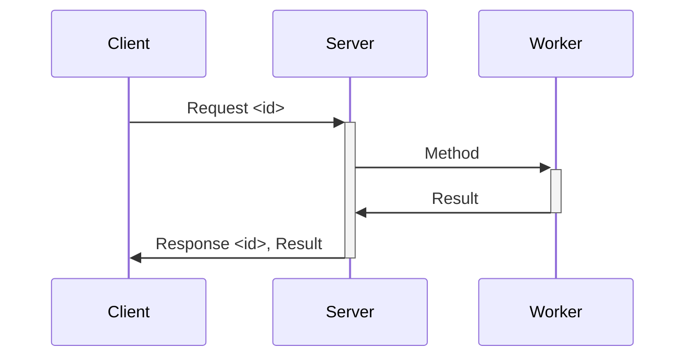
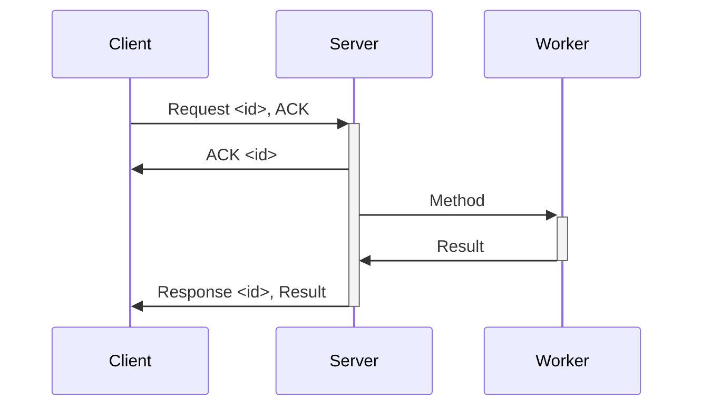
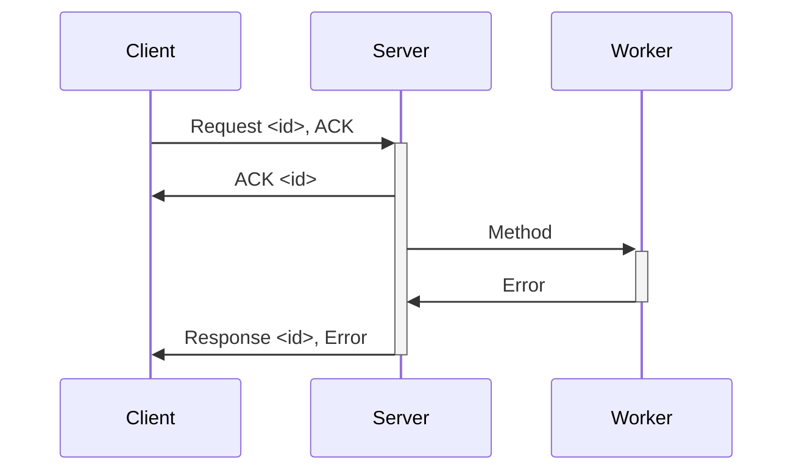
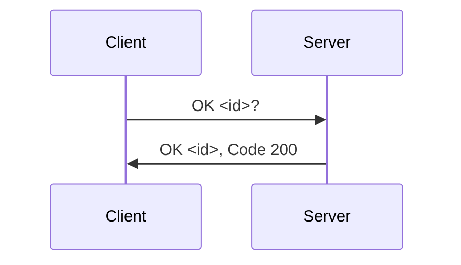
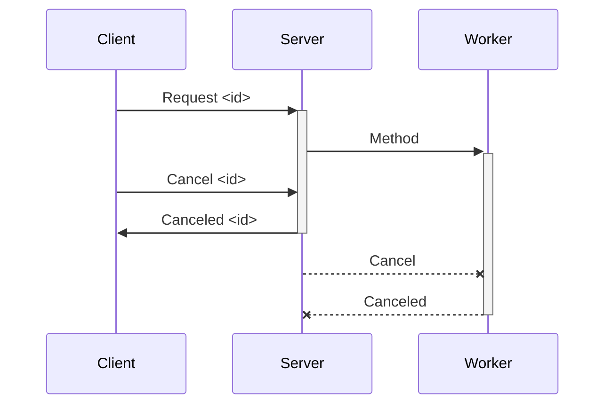
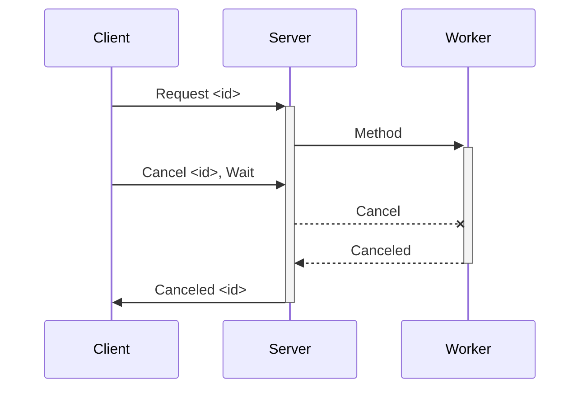
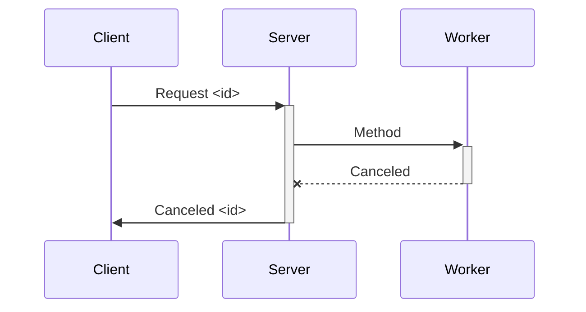
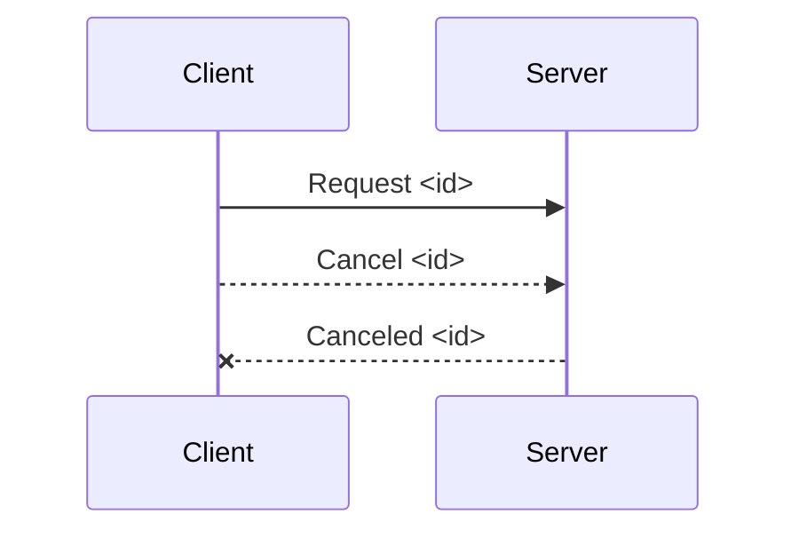

# Simple RPC

A basic client / server RPC for sending the requests over a MessagePort.

This supports Node Worker Threads, Web Workers, or anything that can provide a MessagePortLike interface.

## Communication Details

The client and server communicate by sending messages over the MessagePort.

```ts
export interface RPCMessage {
  sig: 'RPC0';
  /**
   * A Unique identifier for the request/response.
   * Ideally this is a randomUUID.
   */
  id: RequestID;
  /**
   * The type of message being sent.
   */
  type: 'request' | 'response' | 'cancel' | 'canceled' | 'ok' | 'ready';
}

export type RPCRequestType = 'request' | 'cancel' | 'ok' | 'ready';

export type RPCResponseType = 'response' | 'canceled' | 'ok' | 'ready';
```

There are two types of messages: Request and Response. The client sends requests and the server sends responses.

### RPC Request



### RPC Request with ACK



### RPC Request with Error



### OK Request

This request is used to check if the server is ok.



### Cancel Request

A cancellation request is used to cancel or abort a request. The server accepts the request and acknowledges that it was received. It does not wait

#### Cancel Request: no wait



#### Cancel Request: wait



### RPC Request, Canceled by Server

It can happen that the server needs to cancel requests. This can happen if the server is getting disposed and still has pending requests. It has a couple of ways to do this:

1. Send an Error Response
2. Send a Canceled Response



### Abort

An abort request is the same as a Cancel request, only the client will not wait on a response and the response will be ignored.


