<!---
# This file is auto-generated. Do not edit.
# cspell:disable
--->
# Performance Report

## Daily Performance

```mermaid
xychart-beta
    title Files Per Second by Day
    y-axis Files per Second
    x-axis Date [Mar-2, Mar-3, Mar-4, Mar-5, Mar-9, Mar-10, Mar-11, Mar-12, Mar-14, Mar-16, Mar-17, Mar-18, Mar-19, Mar-20, Mar-23, Mar-24, Mar-25, Mar-26, Mar-29, Mar-30, Apr-1]
    bar [172.73, 171.17, 172.84, 172.51, 173.87, 166.90, 170.28, 167.96, 170.77, 172.49, 163.12, 168.74, 165.10, 169.90, 170.54, 170.15, 169.46, 168.97, 169.16, 165.19, 168.40]
    line [110.24, 105.98, 105.75, 109.38, 110.31, 100.38, 105.62, 108.06, 108.63, 109.77, 0.00, 109.48, 106.75, 103.62, 105.75, 102.75, 105.38, 105.40, 108.89, 108.97, 104.82]
    line [30.31, 29.86, 29.01, 30.05, 30.13, 30.67, 29.03, 29.26, 28.24, 29.28, 0.00, 30.17, 28.97, 29.71, 29.66, 30.27, 30.92, 29.47, 28.68, 29.57, 28.58]
    line [79.76, 76.55, 78.66, 78.03, 82.22, 76.26, 77.15, 71.76, 77.49, 80.92, 0.00, 79.48, 76.04, 73.72, 80.38, 80.74, 79.45, 78.90, 77.54, 81.64, 79.91]
    line [33.53, 33.62, 33.49, 33.14, 33.95, 33.62, 33.19, 33.27, 32.31, 33.08, 0.00, 32.27, 31.92, 32.59, 32.86, 32.52, 33.58, 32.45, 33.01, 32.72, 32.73]
    line [9.30, 9.23, 7.01, 8.99, 8.93, 9.19, 8.82, 8.78, 8.85, 9.10, 0.00, 9.23, 9.18, 9.17, 9.01, 9.07, 9.18, 8.85, 8.88, 8.98, 8.89]
    line [86.38, 83.49, 87.00, 81.33, 81.73, 85.99, 80.85, 82.96, 80.12, 83.75, 0.00, 84.19, 77.00, 76.28, 80.89, 84.46, 87.70, 74.07, 80.80, 84.33, 79.68]
    line [127.67, 129.13, 115.21, 128.04, 132.28, 131.12, 129.21, 133.16, 123.46, 118.56, 0.00, 113.21, 123.62, 133.59, 125.56, 130.85, 117.33, 124.90, 126.70, 118.28, 118.83]
    line [227.34, 214.20, 217.68, 225.52, 228.25, 225.18, 226.33, 225.86, 218.26, 223.17, 0.00, 221.50, 222.32, 220.99, 231.13, 215.37, 218.33, 220.26, 228.02, 226.94, 223.19]
    line [216.76, 206.01, 205.57, 226.86, 221.73, 221.35, 212.75, 199.22, 215.68, 216.63, 0.00, 210.43, 194.84, 215.80, 209.89, 198.80, 198.73, 211.72, 221.65, 200.22, 213.11]
    line [235.42, 223.75, 229.84, 238.57, 233.78, 235.19, 230.19, 227.52, 236.26, 231.32, 0.00, 238.26, 229.07, 224.09, 230.48, 205.55, 231.40, 224.85, 237.49, 223.66, 230.92]
    line [147.00, 150.12, 141.68, 146.96, 150.72, 155.73, 147.60, 143.40, 150.52, 151.12, 0.00, 145.52, 146.20, 143.76, 151.81, 155.42, 148.92, 148.41, 153.58, 150.94, 144.87]
    line [17.88, 17.67, 18.26, 17.81, 17.74, 17.16, 17.19, 17.39, 17.59, 17.80, 0.00, 18.15, 17.78, 17.85, 17.67, 18.65, 17.61, 17.35, 16.76, 17.72, 17.31]
    line [193.76, 188.01, 197.96, 192.68, 193.75, 175.32, 190.22, 185.25, 190.86, 181.70, 189.94, 188.37, 178.85, 193.91, 191.22, 186.88, 188.85, 185.59, 189.39, 193.26, 186.99]
    line [36.53, 38.39, 38.51, 36.98, 37.01, 37.24, 37.69, 35.74, 37.96, 37.35, 0.00, 35.28, 37.21, 37.12, 36.04, 37.43, 37.77, 35.49, 38.47, 34.67, 37.34]
    line [127.54, 126.59, 125.97, 127.42, 130.71, 121.58, 127.36, 124.48, 124.29, 128.83, 0.00, 127.06, 126.56, 126.58, 127.48, 128.55, 123.13, 128.34, 129.63, 124.04, 124.66]
    line [35.60, 35.46, 35.33, 35.02, 35.68, 36.33, 35.73, 35.13, 35.70, 35.19, 0.00, 33.61, 34.93, 33.86, 35.93, 34.39, 35.01, 35.05, 34.45, 35.12, 35.72]
    line [199.42, 191.77, 205.08, 185.92, 189.34, 196.04, 194.47, 189.79, 190.73, 198.77, 0.00, 192.18, 194.92, 190.41, 196.34, 187.06, 199.37, 194.10, 194.60, 197.36, 197.94]
    line [78.01, 75.53, 75.91, 76.37, 76.74, 78.07, 77.77, 75.81, 76.50, 76.10, 0.00, 75.83, 75.87, 78.58, 77.74, 71.68, 76.76, 74.86, 76.49, 79.15, 74.79]
    line [144.48, 139.23, 149.02, 142.27, 141.04, 131.48, 140.53, 137.19, 141.47, 140.41, 0.00, 148.35, 141.37, 142.88, 143.59, 140.02, 140.41, 141.17, 142.23, 143.51, 141.72]
    line [87.06, 85.30, 90.77, 85.14, 86.59, 87.51, 84.24, 87.90, 85.86, 89.44, 0.00, 85.10, 86.52, 88.59, 87.54, 88.99, 86.43, 87.49, 88.18, 89.80, 85.19]
    line [216.54, 214.05, 215.67, 214.99, 210.27, 209.48, 205.50, 209.94, 197.73, 195.52, 0.00, 213.68, 211.47, 210.97, 213.69, 202.35, 210.95, 211.66, 216.55, 215.27, 211.05]
    line [116.15, 114.50, 112.51, 113.94, 120.60, 113.49, 117.14, 111.13, 113.02, 119.58, 0.00, 119.14, 108.97, 119.41, 115.10, 113.74, 110.71, 115.58, 119.01, 118.83, 117.13]
    line [65.18, 64.75, 67.04, 66.56, 68.95, 64.38, 66.76, 65.74, 67.01, 67.20, 0.00, 65.95, 67.09, 69.51, 67.29, 67.85, 66.26, 65.71, 66.97, 59.95, 64.35]
    line [393.17, 367.25, 390.49, 394.48, 381.72, 394.91, 378.59, 380.73, 378.04, 384.33, 0.00, 389.20, 373.57, 386.80, 387.88, 376.31, 372.07, 383.78, 387.22, 383.71, 378.28]
    line [265.54, 255.52, 253.64, 257.26, 252.72, 268.99, 255.45, 256.91, 258.23, 279.40, 263.00, 252.47, 255.67, 256.43, 250.90, 249.83, 254.84, 250.99, 267.50, 272.96, 263.26]
    line [179.86, 167.73, 180.24, 173.20, 171.32, 173.38, 172.10, 172.10, 157.32, 178.31, 0.00, 177.48, 172.38, 174.63, 177.02, 167.95, 176.21, 170.25, 176.92, 156.03, 168.85]
    line [62.93, 61.84, 62.40, 65.57, 65.33, 60.32, 62.74, 61.81, 62.24, 64.17, 0.00, 63.86, 59.37, 61.48, 63.14, 64.40, 63.55, 62.46, 63.93, 62.91, 63.76]
    line [216.92, 221.14, 217.96, 220.33, 218.26, 203.06, 214.04, 216.20, 208.89, 219.08, 0.00, 221.58, 220.59, 220.21, 221.85, 221.92, 208.33, 219.80, 213.72, 203.24, 214.08]
    line [202.38, 202.85, 191.42, 202.51, 196.24, 197.11, 203.57, 201.55, 197.62, 197.66, 0.00, 200.62, 197.25, 196.16, 202.64, 191.91, 205.03, 200.51, 203.16, 199.89, 195.16]
    line [162.21, 159.97, 150.74, 160.22, 161.10, 161.51, 151.54, 150.87, 163.76, 156.32, 0.00, 160.16, 156.51, 161.04, 158.05, 161.01, 161.14, 161.02, 161.23, 161.25, 153.90]
    line [155.43, 153.65, 155.50, 156.87, 155.88, 143.12, 148.41, 142.99, 157.82, 153.98, 0.00, 153.38, 140.65, 152.55, 155.16, 153.53, 151.77, 149.23, 157.46, 155.25, 146.36]
    line [199.64, 182.37, 195.42, 194.44, 203.49, 183.39, 190.63, 194.30, 197.18, 199.38, 0.00, 185.28, 185.85, 193.63, 189.34, 190.88, 193.34, 184.57, 195.49, 178.54, 191.20]
    line [28.18, 27.97, 29.10, 28.22, 28.58, 28.15, 27.59, 27.57, 27.33, 27.63, 0.00, 28.59, 27.43, 25.96, 27.86, 27.78, 28.31, 28.02, 26.46, 28.25, 22.43]
    line [146.06, 142.81, 149.97, 143.38, 146.63, 143.67, 144.98, 145.39, 136.20, 146.18, 0.00, 130.60, 143.42, 144.65, 147.15, 147.33, 145.61, 148.28, 144.08, 145.60, 137.23]
    line [133.34, 134.11, 140.70, 133.62, 137.61, 136.83, 137.71, 137.11, 128.08, 140.27, 0.00, 133.28, 137.53, 135.54, 135.53, 138.70, 135.08, 132.05, 139.13, 137.14, 134.60]
    line [337.83, 327.94, 349.03, 342.19, 347.05, 332.14, 332.99, 332.76, 338.71, 338.07, 0.00, 322.72, 334.31, 360.31, 338.88, 336.90, 337.64, 342.52, 344.39, 323.05, 332.59]
    line [114.85, 110.74, 106.87, 118.34, 115.35, 117.85, 111.69, 113.35, 117.08, 116.33, 113.67, 102.23, 107.14, 116.81, 113.12, 111.02, 111.29, 113.14, 115.11, 113.41, 110.27]
    line [100.18, 94.61, 96.31, 97.57, 101.86, 95.28, 99.47, 100.53, 102.92, 100.79, 0.00, 95.35, 97.73, 102.58, 98.57, 96.12, 102.27, 101.01, 101.78, 96.16, 99.11]
    line [48.37, 47.65, 47.63, 47.32, 48.85, 48.14, 46.80, 45.64, 45.75, 45.73, 0.00, 48.37, 46.89, 48.64, 46.98, 46.43, 46.81, 47.74, 46.04, 47.27, 45.90]
    line [341.50, 347.71, 346.09, 326.09, 344.65, 341.47, 324.21, 336.76, 329.86, 335.24, 0.00, 334.53, 329.89, 320.96, 338.59, 333.75, 333.80, 334.21, 340.82, 328.95, 337.54]
    line [48.29, 48.28, 48.11, 46.21, 49.59, 50.01, 45.26, 45.18, 46.06, 49.62, 0.00, 50.27, 48.83, 48.45, 48.40, 48.37, 48.20, 48.90, 49.50, 48.70, 48.39]
    line [243.87, 237.66, 247.42, 254.95, 243.47, 243.03, 240.56, 233.05, 248.73, 246.58, 0.00, 248.89, 244.31, 235.38, 249.28, 243.38, 245.38, 244.71, 244.86, 246.31, 246.95]
    line [119.72, 118.69, 123.95, 122.72, 121.57, 124.24, 119.01, 120.80, 119.53, 126.22, 0.00, 107.61, 116.83, 113.55, 119.52, 121.31, 121.15, 119.07, 117.19, 121.84, 113.33]
    line [222.29, 220.81, 215.40, 214.83, 187.31, 220.97, 216.10, 215.46, 210.23, 227.83, 0.00, 208.12, 204.21, 216.18, 225.66, 213.93, 214.05, 215.63, 222.67, 213.80, 217.07]
    line [244.89, 236.28, 242.31, 243.53, 245.07, 230.76, 233.02, 245.37, 247.15, 244.31, 242.54, 248.89, 238.89, 256.76, 241.27, 245.83, 239.85, 239.34, 241.08, 234.18, 235.58]
    line [163.69, 164.41, 162.40, 166.32, 168.11, 161.38, 162.34, 157.75, 166.14, 167.79, 164.95, 163.61, 159.90, 164.93, 161.22, 158.27, 163.28, 162.97, 167.80, 151.35, 162.91]
    line [97.25, 94.72, 101.26, 100.51, 101.14, 99.01, 98.81, 93.34, 95.04, 100.22, 91.09, 98.60, 95.36, 93.78, 99.68, 85.33, 95.39, 95.28, 93.74, 88.41, 97.60]
    line [385.21, 379.99, 390.36, 383.00, 366.11, 371.77, 375.43, 375.30, 373.84, 387.17, 380.46, 388.00, 377.16, 375.23, 378.95, 373.61, 378.51, 353.84, 382.13, 383.17, 375.29]
    line [166.31, 161.74, 168.65, 162.47, 167.00, 157.06, 163.43, 155.76, 162.12, 164.69, 146.57, 161.90, 162.39, 165.69, 157.58, 159.05, 160.24, 163.39, 166.67, 150.69, 158.69]
    line [150.30, 151.78, 153.13, 151.59, 154.93, 153.68, 151.29, 150.86, 151.00, 150.98, 147.76, 147.05, 142.11, 146.32, 150.21, 153.16, 149.16, 149.10, 141.11, 141.56, 148.27]
```

## Time to Process Files

| Repository                                      | Elapsed | Min/Avg/Max           |   SD | SD Graph                |
| ----------------------------------------------- | ------: | :-------------------: | ---: | ----------------------- |
| AdaDoom3/AdaDoom3                    |    3.16 | 3.0 /   3.1 /   3.4   | 0.07 | `     ┣━┻━━╋●━┻━┫     ` |
| alexiosc/megistos                    |    7.12 | 7.1 /   7.5 /   8.4   | 0.29 | `    ┣━●┻━━╋━━┻━━┫    ` |
| apollographql/apollo-server          |    2.43 | 2.2 /   2.3 /   2.6   | 0.09 | `     ┣━┻━━╋━━●━┫     ` |
| aspnetboilerplate/aspnetboilerplate  |   10.35 | 9.6 /  10.1 /  11.3   | 0.33 | `    ┣━━┻━━╋━━●━━┫    ` |
| aws-amplify/docs                     |   12.37 | 11.9 /  12.5 /  14.1  | 0.49 | `    ┣━━┻━●╋━━┻━━┫    ` |
| Azure/azure-rest-api-specs           |    9.07 | 8.7 /   9.4 /  10.2   | 0.31 | `    ┣━━●━━╋━━┻━━┫    ` |
| bitjson/typescript-starter           |    0.64 | 0.6 /   0.7 /   0.8   | 0.03 | `     ┣━●┻━╋━┻━━┫     ` |
| caddyserver/caddy                    |    3.72 | 3.1 /   3.5 /   4.1   | 0.22 | `    ┣━━┻━━╋━━┻●━┫    ` |
| canada-ca/open-source-logiciel-libre |    0.75 | 0.7 /   0.8 /   1.0   | 0.04 | `     ┣━┻●━╋━━┻━┫     ` |
| chef/chef                            |    5.73 | 5.2 /   5.7 /   6.7   | 0.34 | `    ┣━━┻━━●━━┻━━┫    ` |
| dart-lang/sdk                        |   65.81 | 60.2 /  63.3 /  69.7  | 2.39 | `  ┣━━━┻━━━╋━━━●━━━┫  ` |
| django/django                        |   15.47 | 14.3 /  15.0 /  16.8  | 0.50 | `    ┣━━┻━━╋━━●━━┫    ` |
| eslint/eslint                        |   10.33 | 9.9 /  10.6 /  11.7   | 0.36 | `    ┣━━┻●━╋━━┻━━┫    ` |
| exonum/exonum                        |    3.55 | 3.1 /   3.4 /   3.9   | 0.20 | `    ┣━━┻━━╋━━●━━┫    ` |
| flutter/samples                      |   18.17 | 16.8 /  18.0 /  21.2  | 0.92 | `   ┣━━━┻━━╋●━┻━━━┫   ` |
| gitbucket/gitbucket                  |    3.25 | 3.1 /   3.3 /   3.5   | 0.08 | `     ┣━┻━━●━━┻━┫     ` |
| googleapis/google-cloud-cpp          |  130.81 | 126.2 / 132.9 / 162.7 | 5.83 | `  ┣━━━┻━━●╋━━━┻━━━┫  ` |
| graphql/express-graphql              |    0.74 | 0.7 /   0.7 /   0.8   | 0.02 | `     ┣━━┻━●━┻━━┫     ` |
| graphql/graphql-js                   |    2.39 | 2.2 /   2.3 /   2.5   | 0.07 | `     ┣━┻━━╋━━●━┫     ` |
| graphql/graphql-relay-js             |    0.74 | 0.7 /   0.8 /   0.9   | 0.04 | `     ┣━━┻●╋━┻━━┫     ` |
| graphql/graphql-spec                 |    0.89 | 0.8 /   0.9 /   0.9   | 0.02 | `     ┣━━┻━╋━┻━●┫     ` |
| iluwatar/java-design-patterns        |   12.43 | 11.7 /  12.2 /  13.4  | 0.40 | `    ┣━━┻━━╋━●┻━━┫    ` |
| ktaranov/sqlserver-kit               |    6.74 | 6.1 /   6.4 /   6.8   | 0.18 | `    ┣━━┻━━╋━━┻━━●    ` |
| liriliri/licia                       |    3.85 | 3.6 /   3.8 /   3.9   | 0.10 | `    ┣━━┻━━╋━━●━━┫    ` |
| MartinThoma/LaTeX-examples           |    6.59 | 6.2 /   6.7 /   7.4   | 0.27 | `    ┣━━┻━●╋━━┻━━┫    ` |
| mdx-js/mdx                           |    1.59 | 1.6 /   1.6 /   1.8   | 0.06 | `     ┣━┻●━╋━━┻━┫     ` |
| microsoft/TypeScript-Website         |    5.25 | 5.1 /   5.4 /   5.8   | 0.15 | `    ┣━━●━━╋━━┻━━┫    ` |
| MicrosoftDocs/PowerShell-Docs        |   24.15 | 22.8 /  24.1 /  29.0  | 1.22 | `   ┣━━━┻━━●━━┻━━━┫   ` |
| neovim/nvim-lspconfig                |    3.27 | 3.1 /   3.3 /   3.7   | 0.12 | `    ┣━━┻━●╋━━┻━━┫    ` |
| pagekit/pagekit                      |    3.40 | 3.3 /   3.4 /   3.7   | 0.11 | `    ┣━━┻━●╋━━┻━━┫    ` |
| php/php-src                          |   22.56 | 21.3 /  23.1 /  26.3  | 1.28 | `   ┣━━━┻●━╋━━┻━━━┫   ` |
| plasticrake/tplink-smarthome-api     |    0.95 | 0.9 /   0.9 /   1.1   | 0.03 | `     ┣━┻━━╋●━┻━┫     ` |
| prettier/prettier                    |    6.63 | 6.2 /   6.6 /   7.0   | 0.18 | `    ┣━━┻━━●━━┻━━┫    ` |
| pycontribs/jira                      |    1.30 | 1.2 /   1.3 /   1.4   | 0.05 | `     ┣━┻━━╋●━┻━┫     ` |
| RustPython/RustPython                |    4.90 | 4.1 /   4.4 /   4.9   | 0.19 | `    ┣━━┻━━╋━━┻━━┫●   ` |
| shoelace-style/shoelace              |    2.63 | 2.4 /   2.5 /   3.2   | 0.13 | `    ┣━━┻━━╋━●┻━━┫    ` |
| slint-ui/slint                       |   11.80 | 10.0 /  10.9 /  12.7  | 0.55 | `    ┣━━┻━━╋━━┻━●┫    ` |
| SoftwareBrothers/admin-bro           |    2.23 | 2.1 /   2.2 /   2.4   | 0.06 | `     ┣━┻━━╋●━┻━┫     ` |
| sveltejs/svelte                      |   19.13 | 18.5 /  19.3 /  21.0  | 0.50 | `    ┣━━┻━●╋━━┻━━┫    ` |
| TheAlgorithms/Python                 |    5.53 | 5.3 /   5.6 /   6.1   | 0.16 | `    ┣━━┻●━╋━━┻━━┫    ` |
| twbs/bootstrap                       |    1.20 | 1.1 /   1.2 /   1.3   | 0.04 | `     ┣━┻━●╋━━┻━┫     ` |
| typescript-cheatsheets/react         |    1.14 | 1.1 /   1.1 /   1.3   | 0.04 | `     ┣━┻━━╋●━┻━┫     ` |
| typescript-eslint/typescript-eslint  |    3.78 | 3.6 /   3.8 /   4.7   | 0.17 | `    ┣━━┻━━●━━┻━━┫    ` |
| vitest-dev/vitest                    |    8.54 | 7.8 /   8.3 /   9.1   | 0.28 | `    ┣━━┻━━╋━●┻━━┫    ` |
| w3c/aria-practices                   |    2.99 | 2.9 /   3.0 /   3.2   | 0.08 | `     ┣━┻━━●━━┻━┫     ` |
| w3c/specberus                        |    1.70 | 1.6 /   1.7 /   2.0   | 0.07 | `     ┣━┻━●╋━━┻━┫     ` |
| webdeveric/webpack-assets-manifest   |    0.60 | 0.6 /   0.7 /   0.7   | 0.04 | `     ●━━┻━╋━┻━━┫     ` |
| webpack/webpack                      |    4.90 | 4.7 /   5.1 /   6.6   | 0.29 | `    ┣━━┻●━╋━━┻━━┫    ` |
| wireapp/wire-desktop                 |    0.89 | 0.8 /   0.9 /   1.1   | 0.04 | `     ┣━┻━●╋━━┻━┫     ` |
| wireapp/wire-webapp                  |    9.49 | 8.7 /   9.4 /  10.4   | 0.43 | `    ┣━━┻━━╋●━┻━━┫    ` |

Note:
- Elapsed time is in seconds.

## Files per Second over Time

| Repository                                      | Files |    Sec |    Fps |     Rel | Trend Fps              |    N |
| ----------------------------------------------- | ----: | -----: | -----: | ------: | ---------------------- | ---: |
| AdaDoom3/AdaDoom3                    |   103 |   3.16 |  32.62 |  -1.13% | `▇▆▆▇▇▇▇▇▇█▇▆█▇▇▇▆▆█▇` |   43 |
| alexiosc/megistos                    |   583 |   7.12 |  81.89 |   4.63% | `▇▆▆▅█▇██▇▇▇▇▆▇█▇▇▇▇█` |   43 |
| apollographql/apollo-server          |   250 |   2.43 | 102.98 |  -3.71% | `▇▅▆█▅▇▃█▇▆▆▇▇██▇▇▇▅▆` |   45 |
| aspnetboilerplate/aspnetboilerplate  |  2255 |  10.35 | 217.89 |  -2.54% | `▇▇▆████▃▇▅▇▆█▇▇█▆▅█▆` |   45 |
| aws-amplify/docs                     |  2869 |  12.37 | 231.96 |   0.83% | `▇▇▆▇█▆▄▃█▆▅▇█▇▆▇▇▆▇▇` |   45 |
| Azure/azure-rest-api-specs           |  2419 |   9.07 | 266.83 |   3.28% | `▆▅▆▅▅▆▇▃▆▆▅▆▇██▆▇▇▇▇` |   46 |
| bitjson/typescript-starter           |    20 |   0.64 |  31.05 |   5.45% | `▇▅▆▇▇▇▆▇██▇▆▇▄▇▃▅▄▇█` |   43 |
| caddyserver/caddy                    |   283 |   3.72 |  75.97 |  -7.23% | `▂▃▄▄▆▆▆▇▆█▄▃▄▆▆▆▄▆▄▄` |   44 |
| canada-ca/open-source-logiciel-libre |     7 |   0.75 |   9.28 |   3.44% | `▇████▇▇▇█▇▇▇▇▇▇▇▆▇▇█` |   43 |
| chef/chef                            |  1204 |   5.73 | 210.13 |  -0.21% | `▆▂▇▅▆▇▄▆▄▅▅▇▆█▅▇▅▇▇▆` |   45 |
| dart-lang/sdk                        | 10322 |  65.81 | 156.85 |  -3.00% | `█▆█▇▄▇▇▆█▅▇▇██▅▄▇▇▇▆` |   46 |
| django/django                        |  2833 |  15.47 | 183.09 |  -2.99% | `▅▃██▇▇▆▇█▆▇▆█▆█▇▇▆▇▆` |   46 |
| eslint/eslint                        |  2060 |  10.33 | 199.34 |   2.50% | `▇▆▆▇▇▆▅▅▇▇▇▅▆▆▇▆▇▅█▇` |   45 |
| exonum/exonum                        |   421 |   3.55 | 118.62 |  -5.41% | `▅█▇██▇▄█▅▄▅▇▇▆▅█▅▄▃▅` |   43 |
| flutter/samples                      |  2716 |  18.17 | 149.47 |  -1.19% | `▆▄▇▇██▇█▇▇▇▆███▆▇▃▇▇` |   45 |
| gitbucket/gitbucket                  |   412 |   3.25 | 126.78 |   0.10% | `▇▇▇▆▇█▇█▄▇▇▇█▇▆▄▇▇▅▇` |   45 |
| googleapis/google-cloud-cpp          | 19817 | 130.81 | 151.49 |   1.47% | `▂▇▆█▇▆█▇▆██▆▇▄▆▆▇▆▇▇` |   47 |
| graphql/express-graphql              |    26 |   0.74 |  35.27 |  -0.14% | `▆▅▇▅▇▇▇▆▇▆▆▇▄█▇▇▇█▇▇` |   43 |
| graphql/graphql-js                   |   344 |   2.39 | 143.87 |  -2.96% | `▇▆▅▆▇▇██▆▇▆▇██▇▇▆▆▄▆` |   43 |
| graphql/graphql-relay-js             |    28 |   0.74 |  37.96 |   2.51% | `█▇█▇█▇▄▇█▇▅▇██▅▇▇▇▇█` |   43 |
| graphql/graphql-spec                 |    15 |   0.89 |  16.89 |  -4.09% | `▇▇▆▇▆▆▇█▆▆▆▆▃▆▆▅▅▇▇▅` |   44 |
| iluwatar/java-design-patterns        |  1950 |  12.43 | 156.84 |  -0.90% | `▇▇██▇▇██████████▄▅▇▇` |   45 |
| ktaranov/sqlserver-kit               |   489 |   6.74 |  72.56 |  -5.23% | `█▄▇███▇▄▆█▇▅▇▇█▇▅▅▇▅` |   43 |
| liriliri/licia                       |  1437 |   3.85 | 373.24 |  -2.45% | `▆▆▅██▇█▆▇▅█▇██▇▇▇▆▆▆` |   43 |
| MartinThoma/LaTeX-examples           |  1409 |   6.59 | 213.70 |   1.33% | `▇▇▇▇▇▇█▅▇▇▆█▇█▇▄▇██▇` |   43 |
| mdx-js/mdx                           |   141 |   1.59 |  88.54 |   2.26% | `▇▆▆▇▅███▆▇█▆▇███▇▄▄▇` |   44 |
| microsoft/TypeScript-Website         |   763 |   5.25 | 145.30 |   2.66% | `█▇▇█▇▇▇▇▇▇█▆▇███▅▆██` |   45 |
| MicrosoftDocs/PowerShell-Docs        |  2707 |  24.15 | 112.11 |  -0.38% | `▇▃█▇▇██▆▇▇█▇██▇██▆▄▇` |   46 |
| neovim/nvim-lspconfig                |   383 |   3.27 | 116.97 |   1.60% | `▆▆█▆▇▆▇▅▅▅▆▇█▇█▆█▇█▇` |   45 |
| pagekit/pagekit                      |   741 |   3.40 | 218.14 |   0.84% | `█▆▇▇▇▇█▇▄▇█▆▇▅▄▅▇▆▆▇` |   43 |
| php/php-src                          |  2222 |  22.56 |  98.49 |   2.33% | `▇▅▅▇▅█▃▃▅▆▇▅▆▅▄█▄▇▇▇` |   46 |
| plasticrake/tplink-smarthome-api     |    62 |   0.95 |  65.31 |  -1.29% | `▇▇▇█▇▇▇▇▆▇▆▆▇▆▄▃▅▇▇▆` |   43 |
| prettier/prettier                    |  2235 |   6.63 | 337.16 |   0.12% | `▆▆█▆▆▆▆▅▆▆▆▇▇▆▄▅▅▆▅▆` |   45 |
| pycontribs/jira                      |    80 |   1.30 |  61.75 |  -1.81% | `▆▅▆▅▇█▇▇▇▇▇▆▇▇▇▇▇█▇▆` |   44 |
| RustPython/RustPython                |   668 |   4.90 | 136.19 |  -5.40% | `▆▇▇▇▇██▇█▆█▇▆▇▇▅▅▆▅▅` |   45 |
| shoelace-style/shoelace              |   439 |   2.63 | 167.13 |  -3.13% | `█▇▆▇██▇▇██▆█▇█▅▆▇▇▇▆` |   44 |
| slint-ui/slint                       |  2130 |  11.80 | 180.53 |  -5.95% | `▆█▇▇▅▇█▅▇▆▆▅▇▇▅▇▇▇▆▅` |   45 |
| SoftwareBrothers/admin-bro           |   441 |   2.23 | 198.09 |  -0.89% | `▇▄▇▆██▇▅█▇▇▇▇█▇▆▇▆▄▇` |   43 |
| sveltejs/svelte                      |  7278 |  19.13 | 380.39 |   0.81% | `▇█▇▇█▇▇▆█▇▄▆█▇█▇▇▇▇█` |   46 |
| TheAlgorithms/Python                 |  1372 |   5.53 | 247.92 |   1.51% | `▆▇▅█▇█▇▆▆█▇▇▇▆▇█▇▇▇▇` |   45 |
| twbs/bootstrap                       |   120 |   1.20 | 100.09 |   0.91% | `▅▇█▇▆▅▆▅▇█▇▇█▇▅▅█▅▇▇` |   44 |
| typescript-cheatsheets/react         |    53 |   1.14 |  46.59 |  -1.03% | `█▇▆█▇▇▇▆▅█▇█▆▆▇▃▆▆█▇` |   43 |
| typescript-eslint/typescript-eslint  |  1268 |   3.78 | 335.60 |  -0.00% | `▆▆▆▇▇█▇▇▆█▇▇██▇█▇▇▇▇` |   45 |
| vitest-dev/vitest                    |  2059 |   8.54 | 241.13 |   0.15% | `▇▄█▇▆▆▇▆▆▆▆▆▆▆▅▆▅▅▅▆` |   46 |
| w3c/aria-practices                   |   405 |   2.99 | 135.51 |  -0.07% | `█▇▇█▅▇▇█▆▇▆▆█▇▇█▅▆▆▇` |   44 |
| w3c/specberus                        |   204 |   1.70 | 119.95 |   0.94% | `█▆▆▇█▇▇██▇▇▇▅██▆▃▇▅▇` |   45 |
| webdeveric/webpack-assets-manifest   |    13 |   0.60 |  21.82 | -20.15% | `▆▇▇▆▇▇█▇▇█▇█▆▆█▃▂▄▃▂` |   43 |
| webpack/webpack                      |  1100 |   4.90 | 224.40 |   4.28% | `▆▆▇███▇▆▇▆▆█▇█▇▆▇▇██` |   45 |
| wireapp/wire-desktop                 |    43 |   0.89 |  48.42 |   0.85% | `▇█▇█▇▆▇▇▇▇█▇█▇▇▇▇█▇▇` |   45 |
| wireapp/wire-webapp                  |  1600 |   9.49 | 168.56 |   3.55% | `▆▅▇▇▆▅▅▅█▄▇▆▇█▄▅▇▄▇▇` |   46 |

## Data Throughput

| Repository                                      | Files |    Sec |     Kps |     Rel | Trend Kps              |    N |
| ----------------------------------------------- | ----: | -----: | ------: | ------: | ---------------------- | ---: |
| AdaDoom3/AdaDoom3                    |   103 |   3.16 |  693.24 |  -1.13% | `▇▆▆▇▇▇▇▇▇█▇▆█▇▇▇▆▆█▇` |   43 |
| alexiosc/megistos                    |   583 |   7.12 |  643.50 |   4.63% | `▇▆▆▅█▇██▇▇▇▇▆▇█▇▇▇▇█` |   43 |
| apollographql/apollo-server          |   250 |   2.43 |  824.65 |  -3.71% | `▇▅▆█▅▇▃█▇▆▆▇▇██▇▇▇▅▆` |   45 |
| aspnetboilerplate/aspnetboilerplate  |  2255 |  10.35 |  512.90 |  -2.53% | `▇▇▆████▃▇▅▇▆█▇▇█▆▅█▆` |   45 |
| aws-amplify/docs                     |  2869 |  12.37 |  801.97 |   0.92% | `▇▇▆▇█▆▄▃█▆▅▇█▇▆▇▇▆▇▇` |   45 |
| Azure/azure-rest-api-specs           |  2419 |   9.07 |  762.76 |   3.72% | `▆▅▆▅▅▆▇▃▆▆▅▆▇██▆▇▇▇▇` |   46 |
| bitjson/typescript-starter           |    20 |   0.64 |  124.21 |   5.45% | `▇▅▆▇▇▇▆▇██▇▆▇▄▇▃▅▄▇█` |   43 |
| caddyserver/caddy                    |   283 |   3.72 |  647.52 |  -6.83% | `▂▃▄▄▆▆▆▇▆█▄▃▄▆▆▆▄▆▄▄` |   44 |
| canada-ca/open-source-logiciel-libre |     7 |   0.75 |   76.90 |   3.44% | `▇████▇▇▇█▇▇▇▇▇▇▇▆▇▇█` |   43 |
| chef/chef                            |  1204 |   5.73 |  966.35 |  -0.17% | `▆▂▇▅▆▇▄▆▄▅▅▇▆█▅▇▅▇▇▆` |   45 |
| dart-lang/sdk                        | 10322 |  65.81 | 1087.95 |  -3.63% | `█▆█▇▄▇▇▆█▅▇▇██▄▄▇▆▇▆` |   46 |
| django/django                        |  2833 |  15.47 | 1134.06 |  -2.77% | `▅▃██▇▆▆▇█▆▇▆█▆█▇▇▆▇▆` |   46 |
| eslint/eslint                        |  2060 |  10.33 | 1413.83 |  -7.55% | `█▇▇██▇▃▃▄▄▄▃▄▄▄▄▄▃▅▄` |   45 |
| exonum/exonum                        |   421 |   3.55 | 1134.67 |  -5.41% | `▅█▇██▇▄█▅▄▅▇▇▆▅█▅▄▃▅` |   43 |
| flutter/samples                      |  2716 |  18.17 | 1212.85 |  -1.38% | `▆▄▇▇██▇█▇▇▇▆███▆▇▃▇▇` |   45 |
| gitbucket/gitbucket                  |   412 |   3.25 |  573.26 |   0.10% | `▇▇▇▆▇█▇█▄▇▇▇█▇▆▄▇▇▅▇` |   45 |
| googleapis/google-cloud-cpp          | 19817 | 130.81 | 1199.28 |   1.92% | `▂▇▆█▇▆█▇▆██▆▇▄▆▆▇▆▇▇` |   47 |
| graphql/express-graphql              |    26 |   0.74 |  161.42 |  -0.14% | `▆▅▇▅▇▇▇▆▇▆▆▇▄█▇▇▇█▇▇` |   43 |
| graphql/graphql-js                   |   344 |   2.39 |  810.55 |  -2.92% | `▇▆▅▆▇▇██▆▇▆▇██▇▇▆▆▄▆` |   43 |
| graphql/graphql-relay-js             |    28 |   0.74 |  149.13 |   2.51% | `█▇█▇█▇▄▇█▇▅▇██▅▇▇▇▇█` |   43 |
| graphql/graphql-spec                 |    15 |   0.89 |  623.99 |  -4.04% | `▇▇▆▇▆▆▇█▆▆▆▆▃▆▆▅▅▇▇▅` |   44 |
| iluwatar/java-design-patterns        |  1950 |  12.43 |  483.79 |  -0.41% | `▇▇█▇▇▇██████████▄▆▇▇` |   45 |
| ktaranov/sqlserver-kit               |   489 |   6.74 | 1097.80 |  -5.23% | `█▄▇███▇▄▆█▇▅▇▇█▇▅▅▇▅` |   43 |
| liriliri/licia                       |  1437 |   3.85 |  444.67 |  -2.06% | `▆▆▅██▇█▆▇▅█▇██▇██▇▆▆` |   43 |
| MartinThoma/LaTeX-examples           |  1409 |   6.59 |  441.35 |   1.33% | `▇▇▇▇▇▇█▅▇▇▆█▇█▇▄▇██▇` |   43 |
| mdx-js/mdx                           |   141 |   1.59 |  411.94 |   2.33% | `▇▆▆▇▅███▆▇█▆▇███▇▄▄▇` |   44 |
| microsoft/TypeScript-Website         |   763 |   5.25 | 1001.87 |   2.66% | `█▇▇█▇▇▇▇▇▇█▆▇███▅▆██` |   45 |
| MicrosoftDocs/PowerShell-Docs        |  2707 |  24.15 | 1150.99 |  -0.37% | `▇▃█▇▇██▆▇▇█▇██▇██▆▄▇` |   46 |
| neovim/nvim-lspconfig                |   383 |   3.27 |  306.94 |   1.52% | `▆▆█▆▇▇▇▅▅▅▆▇█▇█▆█▇█▇` |   45 |
| pagekit/pagekit                      |   741 |   3.40 |  454.82 |   0.84% | `█▆▇▇▇▇█▇▄▇█▆▇▅▄▅▇▆▆▇` |   43 |
| php/php-src                          |  2222 |  22.56 | 1454.50 |   2.37% | `▇▅▅▇▅█▃▃▅▆▇▅▆▅▄█▄▇▇▇` |   46 |
| plasticrake/tplink-smarthome-api     |    62 |   0.95 |  352.91 |  -1.29% | `▇▇▇█▇▇▇▇▆▇▆▆▇▆▄▃▅▇▇▆` |   43 |
| prettier/prettier                    |  2235 |   6.63 |  474.59 |  -0.06% | `▆▆█▆▆▆▆▅▆▆▆▇▇▆▄▅▅▆▅▆` |   45 |
| pycontribs/jira                      |    80 |   1.30 |  430.68 |  -0.68% | `▆▅▆▅▇█▇▇▇▇▇▆▇▇▇███▇▆` |   44 |
| RustPython/RustPython                |   668 |   4.90 | 1039.39 |  -2.98% | `▆▇▇▇▇██▇█▆█▇▆▇▇▆▆▇▆▆` |   45 |
| shoelace-style/shoelace              |   439 |   2.63 |  807.49 |  -3.02% | `█▇▆▇██▇▇██▆█▇█▅▆▇▇▇▆` |   44 |
| slint-ui/slint                       |  2130 |  11.80 | 1137.15 |  -6.29% | `▆█▇▇▅▇█▅▇▆▆▅▇▇▅▇▇▇▆▅` |   45 |
| SoftwareBrothers/admin-bro           |   441 |   2.23 |  436.60 |  -0.89% | `▇▄▇▆██▇▅█▇▇▇▇█▇▆▇▆▄▇` |   43 |
| sveltejs/svelte                      |  7278 |  19.13 |  252.66 |   0.89% | `▇█▇▇█▇▇▆█▇▄▆█▇█▇▇▇▇█` |   46 |
| TheAlgorithms/Python                 |  1372 |   5.53 |  629.93 |   1.51% | `▆▇▅█▇█▇▆▆█▇▇▇▆▇█▇▇▇▇` |   45 |
| twbs/bootstrap                       |   120 |   1.20 |  804.09 |   0.93% | `▅▇█▇▆▅▆▅▇█▇▇█▇▅▅█▅▇▇` |   44 |
| typescript-cheatsheets/react         |    53 |   1.14 |  341.08 |  -1.03% | `█▇▆█▇▇▇▆▅█▇█▆▆▇▃▆▆█▇` |   43 |
| typescript-eslint/typescript-eslint  |  1268 |   3.78 | 1706.05 |   0.68% | `▆▆▆▇▇█▇▇▆█▇▇██▇█▇█▇▇` |   45 |
| vitest-dev/vitest                    |  2059 |   8.54 |  518.21 |   3.00% | `▇▄█▇▆▆▇▇▆▆▆▆▆▆▅▇▆▆▆▇` |   46 |
| w3c/aria-practices                   |   405 |   2.99 | 1258.42 |  -0.07% | `█▇▇█▅▇▇█▆▇▆▆█▇▇█▅▆▆▇` |   44 |
| w3c/specberus                        |   204 |   1.70 |  376.91 |   1.00% | `█▆▆▇▇▇▇██▇▇▇▅██▆▃▇▅▇` |   45 |
| webdeveric/webpack-assets-manifest   |    13 |   0.60 |   31.90 | -76.97% | `▇██▇████████▇▇█▁▁▁▁▁` |   43 |
| webpack/webpack                      |  1100 |   4.90 |  995.31 |   4.57% | `▆▆▇███▇▆▇▆▆█▇█▇▆▇▇██` |   45 |
| wireapp/wire-desktop                 |    43 |   0.89 |  213.94 |   0.85% | `▇█▇█▇▆▇▇▇▇█▇█▇▇▇▇█▇▇` |   45 |
| wireapp/wire-webapp                  |  1600 |   9.49 |  631.15 |   1.54% | `▇▅▇█▆▅▅▅█▄▇▆▇█▄▅▇▄▇▇` |   46 |

