<!---
# This file is auto-generated. Do not edit.
# cspell:disable
--->
# Performance Report

## Daily Performance

```mermaid
xychart-beta
    title Files Per Second by Day
    y-axis Files per Second
    x-axis Date [Jul-26, Jul-27, Jul-28, Jul-29, Jul-30, Aug-3, Aug-6, Aug-8, Aug-11, Aug-12, Aug-13, Aug-18, Aug-19, Aug-20, Aug-21, Aug-22, Aug-25]
    bar [164.32, 165.56, 162.55, 163.67, 162.66, 162.42, 162.15, 159.78, 161.87, 161.59, 160.12, 160.00, 162.54, 160.82, 162.11, 163.20, 161.44]
    line [77.07, 71.05, 77.49, 68.74, 76.65, 76.34, 76.92, 73.53, 74.78, 72.96, 75.57, 72.13, 74.31, 76.20, 74.98, 75.32, 72.33]
    line [76.05, 68.90, 73.77, 75.65, 74.99, 75.71, 77.66, 78.66, 78.35, 77.65, 75.86, 77.65, 74.07, 76.09, 68.93, 73.13, 78.22]
    line [20.04, 21.91, 21.31, 20.80, 22.35, 21.72, 21.80, 22.54, 19.07, 18.54, 16.95, 19.10, 18.27, 18.74, 19.65, 18.80, 18.93]
    line [17.96, 18.17, 17.67, 18.43, 18.02, 17.45, 17.65, 18.37, 15.99, 15.64, 15.11, 15.67, 15.78, 15.86, 15.35, 15.70, 15.30]
    line [221.48, 226.19, 223.44, 219.34, 210.97, 220.37, 215.62, 211.22, 214.76, 212.79, 213.14, 217.00, 221.94, 220.45, 225.30, 218.11, 225.72]
    line [26.08, 26.71, 26.98, 26.19, 26.72, 24.58, 26.54, 27.00, 22.24, 23.36, 22.81, 24.23, 23.27, 23.59, 24.08, 23.43, 23.65]
    line [51.67, 52.73, 46.52, 53.63, 45.66, 48.27, 50.39, 51.68, 50.89, 50.88, 50.22, 49.59, 50.25, 50.03, 48.40, 49.47, 49.47]
    line [154.10, 154.75, 150.75, 157.93, 147.43, 158.79, 154.00, 151.10, 147.11, 146.86, 146.10, 136.12, 147.29, 144.63, 149.12, 128.33, 141.03]
    line [29.48, 29.26, 29.06, 30.88, 29.94, 29.48, 30.19, 29.03, 29.67, 29.60, 30.33, 30.62, 30.06, 30.32, 30.71, 30.33, 30.89]
    line [135.79, 138.26, 135.57, 135.43, 135.66, 135.43, 131.19, 135.23, 122.44, 127.81, 121.17, 124.81, 124.18, 125.47, 127.40, 124.91, 125.16]
    line [53.48, 52.00, 51.65, 49.61, 53.65, 44.73, 52.88, 49.80, 44.85, 44.73, 46.28, 42.85, 47.12, 44.69, 45.57, 45.49, 45.33]
    line [99.07, 98.61, 97.42, 91.49, 92.79, 89.32, 93.72, 96.32, 95.66, 97.25, 93.41, 90.83, 93.92, 83.91, 92.53, 93.93, 90.00]
    line [177.92, 175.97, 161.59, 176.09, 174.17, 181.77, 175.87, 181.75, 171.06, 170.80, 168.18, 172.80, 168.69, 156.73, 170.52, 169.10, 158.67]
    line [7.34, 7.37, 6.62, 7.52, 6.92, 6.91, 7.06, 7.47, 6.09, 6.22, 6.12, 6.05, 6.23, 6.09, 6.02, 6.19, 6.04]
    line [70.37, 73.91, 70.30, 66.36, 70.57, 74.92, 69.05, 71.64, 71.63, 73.23, 72.55, 71.44, 73.71, 74.27, 72.25, 73.30, 69.38]
    line [112.16, 111.54, 116.14, 122.06, 116.65, 117.60, 120.09, 120.85, 115.35, 116.69, 115.74, 111.39, 116.78, 113.71, 117.01, 115.75, 115.11]
    line [45.49, 45.13, 45.94, 46.54, 43.06, 46.57, 45.56, 45.66, 38.22, 37.79, 38.23, 41.09, 41.54, 38.59, 41.99, 40.85, 41.52]
    line [75.81, 77.91, 68.05, 77.31, 74.56, 75.13, 76.66, 73.32, 70.77, 69.86, 70.01, 73.04, 72.36, 70.62, 73.83, 67.67, 68.77]
    line [337.72, 352.09, 361.09, 347.33, 342.33, 341.03, 346.90, 355.56, 335.17, 325.27, 335.20, 340.52, 346.23, 347.14, 347.41, 338.20, 338.50]
    line [175.22, 181.17, 166.29, 176.78, 179.24, 162.30, 170.51, 173.47, 171.46, 176.49, 170.50, 172.92, 180.52, 178.78, 177.41, 175.76, 173.84]
    line [195.25, 206.51, 204.03, 201.53, 197.81, 198.32, 202.22, 209.23, 208.13, 206.12, 205.21, 210.46, 206.31, 208.96, 205.28, 201.48, 201.29]
    line [184.81, 182.65, 188.37, 181.75, 185.70, 188.91, 182.68, 183.70, 188.70, 193.07, 183.50, 178.10, 183.95, 192.12, 193.67, 185.05, 191.81]
    line [229.01, 239.01, 232.02, 223.69, 237.66, 221.63, 233.74, 234.59, 230.11, 226.13, 243.15, 239.31, 234.89, 241.23, 236.06, 238.56, 239.54]
    line [183.80, 178.20, 177.82, 176.95, 183.37, 187.31, 181.39, 178.30, 186.48, 183.29, 179.27, 181.07, 184.49, 180.99, 187.99, 183.89, 180.81]
    line [132.81, 129.34, 133.97, 130.74, 135.91, 126.83, 133.33, 126.61, 126.72, 128.04, 119.05, 131.02, 129.61, 123.08, 132.18, 124.93, 124.02]
    line [203.49, 200.63, 204.54, 191.76, 201.55, 202.60, 200.71, 195.89, 203.57, 199.20, 201.23, 200.81, 196.78, 192.62, 201.64, 203.42, 209.29]
    line [317.83, 314.26, 289.97, 313.11, 312.72, 310.96, 309.18, 308.97, 296.59, 300.81, 290.46, 298.69, 294.82, 300.68, 286.71, 300.74, 304.13]
    line [146.01, 144.90, 140.82, 142.51, 147.27, 145.58, 142.12, 131.06, 143.98, 142.41, 148.62, 143.28, 139.37, 140.53, 139.04, 144.69, 138.34]
    line [112.75, 113.47, 109.84, 109.80, 112.55, 113.19, 109.88, 98.38, 112.00, 114.17, 108.57, 100.66, 108.77, 112.72, 106.20, 114.85, 115.27]
    line [251.95, 256.48, 257.08, 259.44, 255.93, 249.24, 251.79, 254.83, 253.26, 251.44, 230.32, 252.21, 237.84, 238.36, 257.03, 248.15, 248.50]
    line [38.94, 38.82, 39.51, 39.23, 37.37, 39.03, 38.14, 38.18, 37.54, 37.60, 36.71, 36.51, 39.25, 38.04, 36.06, 37.72, 39.22]
    line [108.84, 109.00, 95.94, 106.70, 91.83, 102.88, 105.40, 104.69, 93.74, 97.45, 98.22, 96.65, 95.35, 92.84, 95.49, 96.50, 96.69]
    line [50.78, 43.58, 47.06, 54.57, 52.43, 53.03, 51.13, 48.90, 45.53, 44.69, 45.18, 40.85, 44.70, 45.09, 43.47, 44.07, 44.23]
    line [119.65, 127.83, 120.71, 118.86, 118.39, 116.67, 121.26, 128.17, 119.97, 117.10, 115.21, 121.90, 112.74, 115.76, 112.80, 115.24, 119.94]
    line [87.12, 83.64, 82.58, 83.71, 79.08, 83.62, 84.88, 87.82, 77.70, 75.58, 76.94, 80.70, 76.26, 76.41, 76.73, 75.85, 79.36]
    line [86.90, 87.47, 84.26, 79.87, 88.81, 81.39, 83.97, 85.77, 84.48, 86.21, 84.78, 87.25, 83.34, 85.16, 86.61, 89.19, 83.78]
    line [128.75, 133.45, 135.04, 127.98, 132.62, 137.05, 127.16, 104.34, 135.34, 130.97, 132.26, 136.82, 135.16, 130.52, 133.31, 131.34, 132.17]
    line [204.18, 172.00, 190.59, 211.20, 199.37, 206.67, 202.54, 202.61, 193.89, 195.05, 196.60, 192.32, 200.16, 188.13, 196.57, 202.87, 195.84]
    line [28.71, 28.53, 28.56, 28.21, 28.32, 27.98, 27.09, 27.59, 24.33, 24.19, 23.40, 25.07, 24.48, 24.64, 22.11, 24.14, 25.00]
    line [179.58, 184.08, 186.53, 177.20, 179.37, 187.46, 183.38, 182.66, 171.17, 182.41, 178.32, 178.57, 176.08, 180.57, 179.89, 180.99, 174.82]
    line [160.14, 165.42, 161.19, 158.31, 161.70, 164.91, 162.58, 157.48, 162.05, 151.08, 164.19, 163.52, 165.17, 164.35, 169.78, 168.65, 164.93]
    line [105.10, 115.28, 117.30, 115.27, 112.83, 117.78, 117.94, 116.33, 116.04, 112.64, 113.43, 119.19, 111.93, 114.00, 116.17, 114.97, 106.35]
    line [192.42, 195.47, 187.19, 193.79, 191.90, 194.07, 182.58, 166.07, 194.86, 199.17, 196.17, 191.14, 199.41, 198.71, 204.15, 203.44, 193.26]
    line [222.04, 240.74, 232.71, 223.95, 236.98, 238.93, 227.08, 231.94, 225.75, 230.29, 219.53, 238.65, 216.52, 236.75, 225.24, 241.21, 240.22]
    line [309.97, 300.54, 300.28, 316.56, 309.78, 307.09, 310.74, 319.60, 305.87, 304.71, 313.08, 324.40, 300.37, 304.78, 324.68, 308.60, 295.37]
    line [143.79, 152.94, 153.75, 148.60, 152.63, 153.39, 148.93, 139.04, 152.86, 154.13, 144.07, 152.10, 146.68, 148.87, 153.90, 141.45, 150.09]
    line [211.67, 213.25, 185.65, 222.45, 210.28, 204.15, 217.44, 218.55, 218.05, 216.13, 212.80, 213.27, 214.61, 217.28, 213.25, 217.17, 215.79]
    line [367.24, 369.57, 363.41, 359.37, 369.40, 357.63, 359.56, 362.02, 369.62, 366.45, 360.63, 368.14, 348.34, 354.65, 368.47, 364.63, 363.52]
    line [164.94, 160.13, 159.49, 164.72, 159.99, 159.02, 159.32, 152.64, 157.58, 166.90, 158.63, 158.95, 166.31, 162.23, 164.91, 160.87, 155.46]
    line [147.77, 151.94, 147.31, 150.10, 142.92, 143.82, 144.85, 146.35, 145.37, 140.27, 142.62, 139.83, 147.55, 141.21, 140.96, 145.89, 144.87]
```

## Time to Process Files

| Repository                                      | Elapsed | Min/Avg/Max           |   SD | SD Graph                |
| ----------------------------------------------- | ------: | :-------------------: | ---: | ----------------------- |
| AdaDoom3/AdaDoom3                    |    3.33 | 3.3 /   3.4 /   3.6   | 0.08 | `     ┣●┻━━╋━━┻━┫     ` |
| alexiosc/megistos                    |    8.06 | 7.4 /   7.8 /   8.5   | 0.26 | `    ┣━━┻━━╋━━●━━┫    ` |
| apollographql/apollo-server          |    2.80 | 2.5 /   2.7 /   3.3   | 0.15 | `    ┣━━┻━━╋━●┻━━┫    ` |
| aspnetboilerplate/aspnetboilerplate  |   10.59 | 10.1 /  10.7 /  12.2  | 0.39 | `    ┣━━┻━●╋━━┻━━┫    ` |
| aws-amplify/docs                     |   12.72 | 12.7 /  13.2 /  14.2  | 0.41 | `    ┣━●┻━━╋━━┻━━┫    ` |
| Azure/azure-rest-api-specs           |    9.81 | 9.4 /   9.8 /  11.3   | 0.44 | `    ┣━━┻━━●━━┻━━┫    ` |
| bitjson/typescript-starter           |    1.06 | 0.9 /   1.0 /   1.3   | 0.09 | `     ┣━┻━━╋●━┻━┫     ` |
| caddyserver/caddy                    |    3.64 | 3.6 /   3.8 /   4.1   | 0.15 | `    ┣━━┻●━╋━━┻━━┫    ` |
| canada-ca/open-source-logiciel-libre |    1.16 | 0.9 /   1.1 /   1.2   | 0.08 | `     ┣━┻━━╋━━●━┫     ` |
| chef/chef                            |    6.25 | 5.8 /   6.2 /   7.7   | 0.39 | `    ┣━━┻━━●━━┻━━┫    ` |
| dart-lang/sdk                        |   69.46 | 63.3 /  66.7 /  70.4  | 1.81 | `  ┣━━━┻━━━╋━━━┻━●━┫  ` |
| django/django                        |   15.79 | 14.8 /  15.6 /  16.4  | 0.36 | `    ┣━━┻━━╋━●┻━━┫    ` |
| eslint/eslint                        |   10.90 | 10.6 /  11.2 /  12.0  | 0.34 | `    ┣━━●━━╋━━┻━━┫    ` |
| exonum/exonum                        |    3.66 | 3.4 /   3.6 /   4.0   | 0.14 | `    ┣━━┻━━╋●━┻━━┫    ` |
| flutter/samples                      |   17.35 | 16.4 /  17.1 /  18.7  | 0.53 | `   ┣━━━┻━━╋●━┻━━━┫   ` |
| gitbucket/gitbucket                  |    3.88 | 3.5 /   3.6 /   3.9   | 0.13 | `    ┣━━┻━━╋━━┻━━●    ` |
| googleapis/google-cloud-cpp          |  142.55 | 135.4 / 142.6 / 155.3 | 5.04 | `  ┣━━━┻━━━●━━━┻━━━┫  ` |
| graphql/express-graphql              |    1.10 | 1.0 /   1.1 /   1.2   | 0.07 | `     ┣━┻━━╋●━┻━┫     ` |
| graphql/graphql-js                   |    2.91 | 2.6 /   2.8 /   3.2   | 0.14 | `    ┣━━┻━━╋━●┻━━┫    ` |
| graphql/graphql-relay-js             |    1.12 | 0.9 /   1.1 /   1.3   | 0.09 | `     ┣━┻━━╋●━┻━┫     ` |
| graphql/graphql-spec                 |    1.05 | 0.9 /   1.0 /   1.1   | 0.07 | `     ┣━┻━━╋━━●━┫     ` |
| iluwatar/java-design-patterns        |   13.27 | 12.6 /  13.4 /  15.2  | 0.61 | `    ┣━━┻━●╋━━┻━━┫    ` |
| ktaranov/sqlserver-kit               |    7.05 | 6.5 /   6.8 /   7.4   | 0.24 | `    ┣━━┻━━╋━━●━━┫    ` |
| liriliri/licia                       |    4.25 | 4.0 /   4.2 /   4.6   | 0.13 | `    ┣━━┻━━╋●━┻━━┫    ` |
| MartinThoma/LaTeX-examples           |    6.73 | 6.8 /   7.0 /   7.5   | 0.16 | `    ●━━┻━━╋━━┻━━┫    ` |
| mdx-js/mdx                           |    2.05 | 1.8 /   1.9 /   2.2   | 0.10 | `     ┣━┻━━╋━━●━┫     ` |
| microsoft/TypeScript-Website         |    5.76 | 5.5 /   5.8 /   7.3   | 0.34 | `    ┣━━┻━●╋━━┻━━┫    ` |
| MicrosoftDocs/PowerShell-Docs        |   23.49 | 23.2 /  24.5 /  27.5  | 0.96 | `   ┣━━●┻━━╋━━┻━━━┫   ` |
| neovim/nvim-lspconfig                |    4.34 | 4.1 /   4.3 /   4.7   | 0.14 | `    ┣━━┻━━╋●━┻━━┫    ` |
| pagekit/pagekit                      |    3.68 | 3.5 /   3.6 /   4.0   | 0.10 | `    ┣━━┻━━╋●━┻━━┫    ` |
| php/php-src                          |   27.20 | 25.4 /  26.8 /  29.7  | 1.06 | `   ┣━━━┻━━╋●━┻━━━┫   ` |
| plasticrake/tplink-smarthome-api     |    1.37 | 1.1 /   1.3 /   1.4   | 0.10 | `     ┣━┻━━╋━●┻━┫     ` |
| prettier/prettier                    |    7.74 | 7.0 /   7.4 /   8.1   | 0.22 | `    ┣━━┻━━╋━━┻━●┫    ` |
| pycontribs/jira                      |    1.60 | 1.5 /   1.6 /   1.7   | 0.07 | `     ┣━┻━━╋●━┻━┫     ` |
| RustPython/RustPython                |    5.51 | 5.0 /   5.3 /   5.8   | 0.22 | `    ┣━━┻━━╋━━●━━┫    ` |
| shoelace-style/shoelace              |    3.11 | 2.7 /   3.0 /   3.7   | 0.20 | `    ┣━━┻━━╋━●┻━━┫    ` |
| slint-ui/slint                       |   12.82 | 11.8 /  12.4 /  14.7  | 0.54 | `    ┣━━┻━━╋━━●━━┫    ` |
| SoftwareBrothers/admin-bro           |    2.78 | 2.4 /   2.6 /   3.0   | 0.11 | `    ┣━━┻━━╋━━┻━●┫    ` |
| sveltejs/svelte                      |   21.48 | 20.8 /  21.4 /  23.0  | 0.46 | `   ┣━━━┻━━●━━┻━━━┫   ` |
| TheAlgorithms/Python                 |    5.80 | 5.6 /   6.0 /   6.9   | 0.28 | `    ┣━━┻●━╋━━┻━━┫    ` |
| twbs/bootstrap                       |    1.49 | 1.3 /   1.5 /   1.6   | 0.08 | `     ┣━┻━━●━━┻━┫     ` |
| typescript-cheatsheets/react         |    1.35 | 1.3 /   1.4 /   1.5   | 0.05 | `     ┣━┻●━╋━━┻━┫     ` |
| typescript-eslint/typescript-eslint  |    4.20 | 4.0 /   4.2 /   4.5   | 0.14 | `    ┣━━┻━━●━━┻━━┫    ` |
| vitest-dev/vitest                    |    9.13 | 8.9 /   9.5 /  11.1   | 0.47 | `    ┣━━●━━╋━━┻━━┫    ` |
| w3c/aria-practices                   |    3.41 | 3.2 /   3.5 /   3.8   | 0.13 | `    ┣━━┻━●╋━━┻━━┫    ` |
| w3c/specberus                        |    2.05 | 1.9 /   2.0 /   2.6   | 0.15 | `    ┣━━┻━━●━━┻━━┫    ` |
| webdeveric/webpack-assets-manifest   |    1.22 | 1.0 /   1.2 /   1.3   | 0.09 | `     ┣━┻━━╋━●┻━┫     ` |
| webpack/webpack                      |    5.67 | 5.3 /   5.6 /   6.5   | 0.26 | `    ┣━━┻━━●━━┻━━┫    ` |
| wireapp/wire-desktop                 |    1.04 | 0.9 /   1.0 /   1.3   | 0.10 | `     ┣━┻━━●━━┻━┫     ` |
| wireapp/wire-webapp                  |   11.10 | 10.8 /  11.3 /  13.3  | 0.50 | `    ┣━━┻━●╋━━┻━━┫    ` |

Note:
- Elapsed time is in seconds.

## Files per Second over Time

| Repository                                      | Files |    Sec |    Fps |    Rel | Trend Fps              |    N |
| ----------------------------------------------- | ----: | -----: | -----: | -----: | ---------------------- | ---: |
| AdaDoom3/AdaDoom3                    |   103 |   3.33 |  30.89 |  3.17% | `▇▇▅▅▇█▇▅▇█▇█▇▇▇▇█▇▇█` |   28 |
| alexiosc/megistos                    |   583 |   8.06 |  72.33 | -3.49% | `██▆▆▆█▇▇▄▇█▅▇▆▇█▇▆█▆` |   28 |
| apollographql/apollo-server          |   252 |   2.80 |  90.00 | -4.20% | `▇▇███▇████▆▆▇▇▂▇▇▇▇▆` |   28 |
| aspnetboilerplate/aspnetboilerplate  |  2286 |  10.59 | 215.79 |  0.82% | `▇▇▇██▆▇▆██▆▇▇▇▇█▇▇█▇` |   28 |
| aws-amplify/docs                     |  2871 |  12.72 | 225.72 |  3.87% | `▇▄▆▇▅▆▇▆▄▇▅▇▇██▆█▇▇█` |   28 |
| Azure/azure-rest-api-specs           |  2438 |   9.81 | 248.50 | -0.33% | `█████▇▇▇█▇▃██▄▆▆█▇▇▇` |   28 |
| bitjson/typescript-starter           |    20 |   1.06 |  18.93 | -4.58% | `▇██▅▄▅▅▄▄▄▂▅▃▅▄▅▅▅▅▅` |   28 |
| caddyserver/caddy                    |   285 |   3.64 |  78.22 |  3.28% | `█▆██▇██▇▇▆▇▇▄█▇▇▄▅▆█` |   28 |
| canada-ca/open-source-logiciel-libre |     7 |   1.16 |   6.04 | -7.99% | `▇▇█▄▃▃▄▄▄▄▃▃▃▄▃▃▃▄▄▃` |   28 |
| chef/chef                            |  1207 |   6.25 | 193.26 | -0.27% | `▇▇▃▇▆▇▇█▇▇▇▆▇█▇▇█▇█▇` |   28 |
| dart-lang/sdk                        | 10798 |  69.46 | 155.46 | -3.64% | `▄▆▄▆▄▅█▇▇▆▅▆█▇▆▇▇▅▇▅` |   28 |
| django/django                        |  2855 |  15.79 | 180.81 | -0.98% | `▇▅▅▆▆█▆▆▆▆▄▆▅█▅▆▇▆▆▆` |   28 |
| eslint/eslint                        |  2090 |  10.90 | 191.81 |  2.87% | `▇▅▆▇▆▇▆██▆▅▅▄██▇▇▆▆▇` |   28 |
| exonum/exonum                        |   421 |   3.66 | 115.11 | -0.97% | `▆█▇▇▄▆▅▆▇▅▆▅▇▆▅▆▆▆▆▆` |   28 |
| flutter/samples                      |  2400 |  17.35 | 138.34 | -3.30% | `▇█▄▇█▆▆▇▆██▇▆▆▅▇▆▆█▅` |   28 |
| gitbucket/gitbucket                  |   413 |   3.88 | 106.35 | -6.99% | `██▇█▇▆▅▅█▇▆█▅▆█▅▇█▆▄` |   28 |
| googleapis/google-cloud-cpp          | 20651 | 142.55 | 144.87 |  0.21% | `▆▇▇▇▅█▆▆▄▆▇▅█▇▄█▆▆█▇` |   28 |
| graphql/express-graphql              |    26 |   1.10 |  23.65 | -3.74% | `███▃▃▄▄▃▅▄▃▅▄▅▄▅▅▅▄▅` |   28 |
| graphql/graphql-js                   |   364 |   2.91 | 125.16 | -2.95% | `███▅▆▄▆▆▇▆▃▆▆▅▆▆▆▆▆▆` |   28 |
| graphql/graphql-relay-js             |    28 |   1.12 |  25.00 | -3.08% | `▇██▅▅▄▄▅▅▄▄▆▅▅▅▆▃▄▅▆` |   28 |
| graphql/graphql-spec                 |    16 |   1.05 |  15.30 | -8.00% | `▇██▅▅▅▃▅▅▃▄▄▄▄▄▅▄▄▄▄` |   28 |
| iluwatar/java-design-patterns        |  1992 |  13.27 | 150.09 |  0.62% | `▇▄▅█▆▇▇█▇▆▅▇▇▅▆▇▇▇▃▇` |   28 |
| ktaranov/sqlserver-kit               |   489 |   7.05 |  69.38 | -3.45% | `▆▄▆▆▇▆██▆▆█▆▇███▇▇▇▅` |   28 |
| liriliri/licia                       |  1437 |   4.25 | 338.50 | -0.87% | `███▆▆▆▇▄▅▆▆▇█▇▇█▇▆▆▆` |   28 |
| MartinThoma/LaTeX-examples           |  1409 |   6.73 | 209.29 |  4.52% | `▇▇▆▇█▆▇▇▅▆▇▆▆▅▆▄▇▆██` |   28 |
| mdx-js/mdx                           |   141 |   2.05 |  68.77 | -5.26% | `██▇▆▆▅▆▃▆▅▆▇▆▇▄▇▇▄▅▅` |   28 |
| microsoft/TypeScript-Website         |   761 |   5.76 | 132.17 |  0.85% | `▆▆▂████▆█▆███▇▆█▇▇▇▇` |   28 |
| MicrosoftDocs/PowerShell-Docs        |  2708 |  23.49 | 115.27 |  4.11% | `▆▇▃▇▇▇▇▇█▆▆▄▅▇▆█▅█▇█` |   28 |
| neovim/nvim-lspconfig                |   754 |   4.34 | 173.84 | -0.37% | `▄▇▇▅▇▆█▆▇▆▆▆██▇█▇█▆▇` |   28 |
| pagekit/pagekit                      |   741 |   3.68 | 201.29 | -1.38% | `▅▇███▇▇▇▇▆██▆█▇█▇▇▆▆` |   28 |
| php/php-src                          |  2279 |  27.20 |  83.78 | -1.97% | `▇█▇▇▆▅▇▆█▅▇▇▄▇▇▆▇██▆` |   28 |
| plasticrake/tplink-smarthome-api     |    62 |   1.37 |  45.33 | -5.64% | `█▇▆▄▄▃▃▄▄▄▄▃▅▅▃▄▄▄▄▄` |   28 |
| prettier/prettier                    |  2286 |   7.74 | 295.37 | -4.39% | `▇▇█▇▆▅▅▆▆▆██▄▇▆▆█▇▆▅` |   28 |
| pycontribs/jira                      |    79 |   1.60 |  49.47 | -1.20% | `█▆▇▆▇▇▇▆█▅█▆▇▅▆▆▅▇▅▆` |   28 |
| RustPython/RustPython                |   683 |   5.51 | 124.02 | -3.69% | `▇█▆▄█▆▆▆▇▄▄▇▆▇▄▆▇▄▇▅` |   28 |
| shoelace-style/shoelace              |   439 |   3.11 | 141.03 | -4.58% | `████▇██▇▇▇▇▆▇▇▇▇█▆▂▆` |   28 |
| slint-ui/slint                       |  2241 |  12.82 | 174.82 | -2.82% | `█▇█▇▃█▇▇█▇▇▇▅█▇▇▇█▇▆` |   28 |
| SoftwareBrothers/admin-bro           |   441 |   2.78 | 158.67 | -7.51% | `▇██▇▆▇▇▆▇▆▆▇▆▆▃▆▆▇▆▅` |   28 |
| sveltejs/svelte                      |  7809 |  21.48 | 363.52 |  0.13% | `▇▆▇████▇█▆▇█▇▄▆▇██▇▇` |   28 |
| TheAlgorithms/Python                 |  1390 |   5.80 | 239.54 |  2.47% | `▆▇▇▇█▃▇▆▃█▇▇▆▇▇█▇▇▇▇` |   28 |
| twbs/bootstrap                       |   118 |   1.49 |  79.36 | -0.65% | `▅██▄▅▅▅▃▃▄▅▆▅▄▄▅▄▅▃▅` |   28 |
| typescript-cheatsheets/react         |    53 |   1.35 |  39.22 |  3.28% | `█▇▇▇█▅▇▇▅▅▆▅██▆▇▅█▅█` |   28 |
| typescript-eslint/typescript-eslint  |  1278 |   4.20 | 304.13 |  0.46% | `███▅▇▇▇▇▇▄▇▇▇▅▇▇▅▇▇▇` |   28 |
| vitest-dev/vitest                    |  2193 |   9.13 | 240.22 |  4.65% | `▇▇▇▆▆▇▆▇▇▆▅█▃▇▇█▆███` |   28 |
| w3c/aria-practices                   |   409 |   3.41 | 119.94 |  1.28% | `▆▇█▆▆▆▅▅▆▅▅▇▃▅▄▆▄▅▄▆` |   28 |
| w3c/specberus                        |   198 |   2.05 |  96.69 | -2.20% | `█▇█▆▅▅▆▆▇▆▆▆▅▇▆▅▆▆▆▆` |   28 |
| webdeveric/webpack-assets-manifest   |    54 |   1.22 |  44.23 | -6.18% | `██▇▅▆▅▅▅▄▅▅▃▅▄▅▅▄▄▄▅` |   28 |
| webpack/webpack                      |  1111 |   5.67 | 195.84 | -0.82% | `▆██▇▅▇▇▆▆▇▆▆▇▇▇▄▇▇█▇` |   28 |
| wireapp/wire-desktop                 |    43 |   1.04 |  41.52 | -0.90% | `███▃▄▆▅▆▂▅▄▆▆▆▆▄▆▅▆▆` |   28 |
| wireapp/wire-webapp                  |  1831 |  11.10 | 164.93 |  1.81% | `▇▆▆█▆▇▇▅▃▇█▇█▇▇▇███▇` |   28 |

## Data Throughput

| Repository                                      | Files |    Sec |     Kps |    Rel | Trend Kps              |    N |
| ----------------------------------------------- | ----: | -----: | ------: | -----: | ---------------------- | ---: |
| AdaDoom3/AdaDoom3                    |   103 |   3.33 |  656.48 |  3.17% | `▇▇▅▅▇█▇▅▇█▇█▇▇▇▇█▇▇█` |   28 |
| alexiosc/megistos                    |   583 |   8.06 |  568.32 | -3.49% | `██▆▆▆█▇▇▄▇█▅▇▆▇█▇▆█▆` |   28 |
| apollographql/apollo-server          |   252 |   2.80 |  723.92 | -4.20% | `▇▇███▇████▆▆▇▇▂▇▇▇▇▆` |   28 |
| aspnetboilerplate/aspnetboilerplate  |  2286 |  10.59 |  525.04 |  1.29% | `▇▇▇██▆▇▇██▆▇▇▇▇█▇▇█▇` |   28 |
| aws-amplify/docs                     |  2871 |  12.72 |  788.19 |  3.92% | `▇▄▆▇▅▆▇▆▄▇▅▇▇██▆█▇▇█` |   28 |
| Azure/azure-rest-api-specs           |  2438 |   9.81 |  658.66 | -0.77% | `█▇███▇▇▇█▇▃██▄▆▆█▇▇▇` |   28 |
| bitjson/typescript-starter           |    20 |   1.06 |   75.73 | -4.58% | `▇██▅▄▅▅▄▄▄▂▅▃▅▄▅▅▅▅▅` |   28 |
| caddyserver/caddy                    |   285 |   3.64 |  667.75 |  3.56% | `█▆██▇██▇▇▇▇▇▄█▇▇▄▅▆█` |   28 |
| canada-ca/open-source-logiciel-libre |     7 |   1.16 |   50.05 | -7.99% | `▇▇█▄▃▃▄▄▄▄▃▃▃▄▃▃▃▄▄▃` |   28 |
| chef/chef                            |  1207 |   6.25 |  893.14 | -0.17% | `▇▇▃▇▆▇▇█▇▇▇▆▇█▇▇█▇█▇` |   28 |
| dart-lang/sdk                        | 10798 |  69.46 | 1052.21 | -3.64% | `▄▇▄▆▄▅█▇▇▆▅▅█▇▆▆▇▅▇▅` |   28 |
| django/django                        |  2855 |  15.79 | 1133.60 | -0.78% | `▇▅▅▆▆█▆▆▆▆▄▆▅█▆▆▇▆▆▆` |   28 |
| eslint/eslint                        |  2090 |  10.90 | 1393.73 |  2.94% | `▇▅▆▇▆▇▆██▆▅▅▄██▇▇▆▆▇` |   28 |
| exonum/exonum                        |   421 |   3.66 | 1101.08 | -0.97% | `▆█▇▇▄▆▅▆▇▅▆▅▇▆▅▆▆▆▆▆` |   28 |
| flutter/samples                      |  2400 |  17.35 | 1234.56 | -1.97% | `▇█▄▇█▆▆▇▆██▇▆▆▆▇▆▇█▆` |   28 |
| gitbucket/gitbucket                  |   413 |   3.88 |  483.34 | -6.89% | `██▇█▇▆▅▅█▇▆█▅▆█▅▇█▆▄` |   28 |
| googleapis/google-cloud-cpp          | 20651 | 142.55 | 1171.25 |  0.60% | `▆▇▇▇▅█▆▆▄▆▇▅█▇▄█▆▆█▇` |   28 |
| graphql/express-graphql              |    26 |   1.10 |  108.25 | -3.74% | `███▃▃▄▄▃▅▄▃▅▄▅▄▅▅▅▄▅` |   28 |
| graphql/graphql-js                   |   364 |   2.91 |  719.30 | -2.95% | `███▅▆▄▆▆▇▆▃▆▆▅▆▆▆▆▆▆` |   28 |
| graphql/graphql-relay-js             |    28 |   1.12 |   98.22 | -3.08% | `▇██▅▅▄▄▅▅▄▄▆▅▅▅▆▃▄▅▆` |   28 |
| graphql/graphql-spec                 |    16 |   1.05 |  554.79 | -8.00% | `▇██▅▅▅▃▅▅▃▄▄▄▄▄▅▄▄▄▄` |   28 |
| iluwatar/java-design-patterns        |  1992 |  13.27 |  463.90 |  0.62% | `▇▄▅█▆▇▇█▇▆▅▇▇▅▆▇▇▇▃▇` |   28 |
| ktaranov/sqlserver-kit               |   489 |   7.05 | 1050.25 | -3.45% | `▆▄▆▆▇▆██▆▆█▆▇███▇▇▇▅` |   28 |
| liriliri/licia                       |  1437 |   4.25 |  403.28 | -0.87% | `███▆▆▆▇▄▅▆▆▇█▇▇█▇▆▆▆` |   28 |
| MartinThoma/LaTeX-examples           |  1409 |   6.73 |  432.24 |  4.52% | `▇▇▆▇█▆▇▇▅▆▇▆▆▅▆▄▇▆██` |   28 |
| mdx-js/mdx                           |   141 |   2.05 |  319.96 | -5.19% | `██▇▆▆▅▆▃▆▅▆▇▆▇▄▇▇▄▅▅` |   28 |
| microsoft/TypeScript-Website         |   761 |   5.76 |  914.10 |  0.91% | `▆▆▂████▆█▆███▇▆█▇▇▇▇` |   28 |
| MicrosoftDocs/PowerShell-Docs        |  2708 |  23.49 | 1185.31 |  4.16% | `▆▇▃▇▇▇▇▇█▆▆▄▅▇▆█▅█▇█` |   28 |
| neovim/nvim-lspconfig                |   754 |   4.34 |  285.90 |  1.42% | `▄▇▆▅▇▆█▆▇▆▆▆██▇█▇█▆▇` |   28 |
| pagekit/pagekit                      |   741 |   3.68 |  419.69 | -1.38% | `▅▇███▇▇▇▇▆██▆█▇█▇▇▆▆` |   28 |
| php/php-src                          |  2279 |  27.20 | 1459.52 | -1.70% | `▇▇▆▆▆▅▇▆█▆▇▇▄▇▇▆▇██▆` |   28 |
| plasticrake/tplink-smarthome-api     |    62 |   1.37 |  244.91 | -5.64% | `█▇▆▄▄▃▃▄▄▄▄▃▅▅▃▄▄▄▄▄` |   28 |
| prettier/prettier                    |  2286 |   7.74 |  419.02 | -4.45% | `▇▇█▇▆▅▆▆▆▆██▄▇▆▆█▇▆▅` |   28 |
| pycontribs/jira                      |    79 |   1.60 |  350.66 | -1.30% | `█▆▇▆▇▇▇▆█▄█▆▇▅▆▆▅▇▅▆` |   28 |
| RustPython/RustPython                |   683 |   5.51 |  974.21 | -3.57% | `▇█▆▄█▆▆▆▇▄▄▇▆▇▄▆▇▄▇▅` |   28 |
| shoelace-style/shoelace              |   439 |   3.11 |  681.37 | -4.58% | `████▇██▇▇▇▇▆▇▇▇▇█▆▂▆` |   28 |
| slint-ui/slint                       |  2241 |  12.82 | 1141.03 | -2.55% | `█▇█▇▃█▇▇█▇▇▇▅█▇▇▇█▇▆` |   28 |
| SoftwareBrothers/admin-bro           |   441 |   2.78 |  349.71 | -7.51% | `▇██▇▆▇▇▆▇▆▆▇▆▆▃▆▆▇▆▅` |   28 |
| sveltejs/svelte                      |  7809 |  21.48 |  243.37 |  0.11% | `▇▆▇████▇█▆▇█▆▄▆▇██▇▇` |   28 |
| TheAlgorithms/Python                 |  1390 |   5.80 |  608.16 |  2.50% | `▆▇▇▇█▃▇▆▃█▇▇▆▇▇█▇▇▇▇` |   28 |
| twbs/bootstrap                       |   118 |   1.49 |  651.71 | -0.65% | `▅██▄▅▅▅▃▃▄▅▆▅▄▄▅▄▅▃▅` |   28 |
| typescript-cheatsheets/react         |    53 |   1.35 |  290.07 |  4.61% | `█▇▇▆▇▅▇▇▅▅▆▅██▆▇▅█▅█` |   28 |
| typescript-eslint/typescript-eslint  |  1278 |   4.20 | 1552.54 |  0.56% | `███▅▇▇▇▇▇▄▇▇▇▅▇▇▅▇▇▇` |   28 |
| vitest-dev/vitest                    |  2193 |   9.13 |  539.71 |  5.45% | `▆▇▇▆▆▇▆▇▇▆▅█▃▇▇█▆███` |   28 |
| w3c/aria-practices                   |   409 |   3.41 | 1116.08 |  1.30% | `▆▇█▆▆▆▅▅▆▅▅▇▃▅▄▆▄▅▄▆` |   28 |
| w3c/specberus                        |   198 |   2.05 |  303.74 | -1.57% | `█▇█▆▅▅▆▆▇▆▆▆▅▇▆▅▆▆▆▆` |   28 |
| webdeveric/webpack-assets-manifest   |    54 |   1.22 |  104.03 | -5.95% | `██▇▅▆▅▅▅▄▅▅▃▅▄▅▅▄▄▄▅` |   28 |
| webpack/webpack                      |  1111 |   5.67 |  889.67 | -0.52% | `▆██▇▅▇▇▆▆▇▆▆▇▇▇▄▇██▇` |   28 |
| wireapp/wire-desktop                 |    43 |   1.04 |  183.46 | -0.90% | `███▃▄▆▅▆▂▅▄▆▆▆▆▄▆▅▆▆` |   28 |
| wireapp/wire-webapp                  |  1831 |  11.10 |  589.20 |  1.92% | `▇▆▆█▆▇▇▅▃▇█▇█▇▇▇███▇` |   28 |

