<!---
# This file is auto-generated. Do not edit.
# cspell:disable
--->
# Performance Report

## Daily Performance

```mermaid
xychart-beta
    title Files Per Second by Day
    y-axis Files per Second
    x-axis Date [May-3, May-4, May-5, May-6, May-7, May-8, May-12, May-13, May-14, May-15, May-16, May-18, May-19, May-20, May-23, May-26, May-27, May-28, Jun-2]
    bar [170.05, 171.31, 172.25, 168.76, 168.77, 167.13, 166.34, 172.19, 166.30, 168.97, 170.53, 170.36, 168.47, 166.35, 167.96, 170.65, 166.96, 169.46, 169.96]
    line [29.89, 29.90, 30.63, 29.61, 30.78, 29.56, 26.75, 29.76, 30.51, 30.52, 29.81, 30.62, 29.84, 28.21, 27.37, 29.89, 29.97, 29.26, 26.66]
    line [37.90, 37.24, 37.02, 37.71, 34.42, 36.40, 36.66, 37.79, 37.24, 36.68, 36.93, 37.19, 36.50, 37.36, 36.38, 38.01, 36.71, 34.78, 33.91]
    line [81.56, 78.72, 82.39, 74.80, 84.51, 74.07, 79.58, 78.43, 72.10, 77.35, 81.14, 78.37, 76.94, 80.65, 76.65, 82.54, 75.89, 77.47, 73.86]
    line [60.96, 56.18, 61.99, 60.65, 62.26, 59.47, 58.65, 60.35, 63.19, 61.20, 62.95, 62.89, 60.12, 59.81, 61.51, 60.65, 60.71, 60.16, 61.03]
    line [105.90, 105.47, 109.94, 105.06, 105.36, 103.03, 108.06, 108.54, 99.38, 107.08, 107.13, 109.20, 107.30, 109.63, 102.83, 110.16, 104.19, 109.94, 104.58]
    line [221.09, 216.34, 217.43, 218.03, 212.25, 221.08, 208.07, 219.61, 196.71, 217.50, 208.81, 206.53, 221.15, 213.00, 216.38, 218.77, 212.39, 203.78, 212.56]
    line [81.12, 88.42, 84.35, 87.89, 85.94, 85.35, 82.11, 85.57, 83.56, 85.40, 85.46, 86.28, 87.70, 83.40, 85.76, 87.23, 86.22, 87.00, 88.85]
    line [140.53, 145.72, 140.66, 143.38, 141.69, 142.26, 139.20, 144.62, 127.45, 143.99, 141.77, 143.07, 145.59, 141.58, 135.01, 142.18, 138.23, 142.50, 144.46]
    line [8.88, 9.78, 11.13, 10.60, 11.02, 9.75, 10.31, 10.27, 9.90, 9.33, 9.97, 9.95, 10.01, 9.91, 9.31, 9.58, 10.09, 9.91, 9.92]
    line [33.20, 32.65, 32.77, 32.53, 31.97, 33.01, 32.72, 33.28, 32.89, 30.56, 31.82, 33.25, 32.21, 32.32, 32.24, 32.56, 32.77, 31.93, 31.50]
    line [139.12, 142.98, 140.71, 141.26, 137.69, 141.28, 143.08, 139.04, 127.38, 143.64, 143.63, 143.64, 138.45, 140.67, 141.36, 140.42, 139.81, 139.15, 143.14]
    line [34.32, 35.63, 35.19, 33.85, 35.17, 32.43, 35.78, 32.88, 35.46, 35.61, 32.66, 32.30, 35.13, 33.62, 35.61, 34.38, 35.47, 33.75, 35.37]
    line [124.35, 133.34, 128.67, 125.58, 120.28, 125.23, 133.35, 122.61, 133.53, 133.12, 131.47, 131.60, 132.60, 130.97, 127.07, 128.33, 122.44, 116.90, 125.01]
    line [212.20, 214.75, 212.93, 210.19, 214.72, 210.67, 217.29, 215.75, 197.30, 214.87, 209.14, 211.55, 213.63, 211.52, 212.12, 209.73, 211.01, 213.71, 214.38]
    line [224.65, 222.96, 217.40, 224.19, 230.80, 224.16, 221.99, 217.52, 232.11, 221.53, 218.22, 226.74, 223.86, 221.34, 220.21, 220.12, 213.01, 224.63, 217.35]
    line [383.36, 382.91, 364.75, 378.73, 377.82, 374.56, 379.30, 373.05, 365.07, 381.01, 380.59, 377.82, 377.10, 377.94, 382.62, 377.83, 380.47, 381.86, 371.54]
    line [17.38, 17.67, 17.14, 17.24, 15.74, 16.24, 16.32, 16.77, 17.92, 17.71, 17.58, 17.65, 16.96, 17.30, 17.64, 17.45, 17.18, 17.51, 16.57]
    line [126.57, 124.39, 128.28, 123.01, 125.83, 124.94, 124.68, 121.17, 123.75, 127.64, 128.53, 126.42, 126.77, 120.74, 126.60, 125.67, 123.56, 125.85, 123.16]
    line [79.01, 79.45, 78.07, 77.48, 79.46, 79.26, 73.82, 79.33, 79.19, 79.44, 75.54, 82.49, 78.33, 77.90, 79.31, 77.89, 78.87, 79.08, 78.31]
    line [148.97, 151.07, 153.63, 148.86, 150.06, 152.60, 147.69, 147.02, 142.52, 145.54, 149.90, 147.54, 148.35, 146.43, 150.96, 150.26, 137.65, 149.96, 147.05]
    line [190.04, 189.74, 188.33, 189.19, 188.21, 191.59, 179.93, 194.66, 187.78, 191.72, 196.34, 187.34, 185.35, 189.04, 192.39, 186.34, 187.29, 189.95, 184.53]
    line [78.67, 77.33, 75.83, 73.91, 76.48, 76.11, 75.68, 77.38, 75.72, 74.53, 76.86, 72.12, 77.17, 77.17, 76.67, 74.85, 76.23, 75.12, 76.51]
    line [159.29, 155.74, 156.77, 151.80, 157.52, 149.72, 154.32, 150.31, 157.94, 153.23, 153.21, 157.46, 157.66, 156.52, 145.53, 155.04, 142.71, 139.43, 150.16]
    line [171.22, 172.54, 171.25, 173.73, 162.92, 167.61, 169.50, 174.44, 178.32, 174.09, 174.49, 176.32, 175.06, 172.88, 170.72, 168.50, 169.00, 171.65, 172.08]
    line [67.87, 67.35, 67.61, 65.75, 68.53, 65.54, 67.95, 67.86, 67.59, 62.41, 66.69, 67.14, 67.37, 65.68, 64.90, 66.54, 65.92, 61.45, 66.55]
    line [153.96, 153.88, 158.20, 149.58, 150.37, 151.41, 148.91, 151.04, 141.64, 143.30, 152.80, 151.43, 149.63, 151.63, 149.82, 148.87, 152.29, 152.18, 146.83]
    line [334.66, 333.07, 330.78, 324.57, 319.53, 330.60, 334.33, 332.82, 320.86, 333.17, 332.61, 335.87, 332.27, 328.58, 331.96, 332.86, 326.59, 328.18, 330.50]
    line [194.88, 192.14, 191.15, 184.78, 188.37, 180.73, 189.93, 194.03, 194.59, 196.19, 191.05, 192.47, 177.89, 192.16, 190.92, 193.68, 178.94, 172.60, 191.14]
    line [207.33, 223.10, 201.06, 212.88, 218.82, 217.59, 205.57, 220.26, 196.51, 205.48, 197.40, 209.57, 208.50, 215.95, 219.60, 210.18, 213.28, 212.12, 220.46]
    line [224.51, 227.70, 232.93, 226.46, 225.43, 231.26, 225.21, 225.16, 230.32, 208.51, 223.18, 229.26, 224.98, 230.86, 231.74, 226.83, 229.07, 218.04, 228.28]
    line [183.57, 189.30, 186.49, 189.50, 191.09, 193.75, 184.57, 179.69, 190.06, 187.90, 186.22, 189.65, 187.06, 187.21, 189.27, 188.81, 187.98, 187.78, 177.77]
    line [98.95, 93.32, 86.35, 92.49, 96.24, 86.60, 91.17, 98.66, 94.02, 90.96, 99.83, 91.94, 88.40, 90.08, 92.28, 97.44, 94.80, 98.23, 84.40]
    line [117.78, 117.04, 115.86, 113.71, 118.02, 115.63, 115.50, 113.50, 113.65, 116.71, 113.77, 111.44, 115.40, 113.43, 112.49, 114.58, 117.54, 113.89, 113.32]
    line [201.79, 203.98, 192.56, 202.66, 197.87, 187.68, 190.41, 187.82, 203.06, 199.79, 204.27, 205.03, 195.35, 198.93, 186.91, 198.66, 199.24, 175.34, 196.23]
    line [47.88, 43.90, 46.29, 47.39, 44.01, 47.86, 45.93, 47.77, 45.98, 48.12, 46.48, 48.80, 46.77, 46.21, 46.03, 45.45, 46.05, 45.56, 40.22]
    line [245.13, 249.84, 259.47, 252.93, 247.93, 229.85, 256.31, 245.89, 226.73, 248.94, 227.93, 245.76, 244.49, 245.02, 249.85, 247.35, 234.97, 257.03, 246.00]
    line [122.11, 121.82, 131.63, 130.15, 127.70, 119.16, 125.90, 125.82, 123.46, 122.18, 122.11, 124.34, 125.23, 124.43, 115.02, 121.98, 123.80, 115.09, 129.03]
    line [47.46, 47.88, 48.28, 46.64, 43.98, 47.22, 47.37, 46.30, 48.69, 48.22, 49.55, 48.73, 48.79, 48.29, 46.50, 48.65, 48.11, 48.53, 45.73]
    line [347.37, 334.59, 337.26, 333.23, 330.51, 316.32, 340.62, 334.56, 294.73, 334.87, 315.41, 346.35, 334.68, 334.65, 336.21, 336.65, 339.29, 320.69, 338.05]
    line [182.61, 194.34, 196.11, 194.71, 183.16, 188.24, 195.81, 199.38, 179.78, 176.57, 191.99, 188.23, 196.89, 184.41, 189.52, 192.06, 177.15, 178.96, 184.54]
    line [249.40, 258.94, 259.40, 261.01, 258.08, 266.61, 268.20, 264.65, 271.47, 262.16, 268.02, 265.09, 258.04, 267.05, 255.94, 257.76, 255.79, 260.96, 252.34]
    line [89.10, 82.29, 89.33, 87.86, 88.80, 87.73, 86.71, 84.47, 88.90, 88.97, 89.34, 88.33, 86.97, 88.46, 88.03, 86.15, 86.86, 88.34, 85.50]
    line [66.15, 68.38, 62.17, 67.55, 67.67, 67.56, 69.77, 67.94, 63.43, 64.29, 66.74, 65.81, 66.84, 66.34, 68.16, 66.47, 61.90, 67.30, 66.98]
    line [223.53, 219.50, 216.40, 207.90, 202.74, 200.36, 218.54, 215.87, 198.70, 198.92, 193.26, 206.82, 208.12, 200.26, 208.33, 208.13, 206.60, 213.74, 210.83]
    line [233.64, 243.55, 249.38, 245.40, 243.67, 240.25, 242.94, 244.80, 245.38, 242.84, 244.51, 242.53, 234.41, 245.11, 237.94, 239.51, 236.94, 237.65, 241.45]
    line [134.10, 138.12, 133.91, 128.09, 134.94, 136.31, 128.69, 133.43, 136.60, 125.12, 133.23, 134.94, 134.09, 128.45, 130.01, 134.41, 130.99, 133.32, 137.46]
    line [378.80, 375.67, 374.39, 375.98, 374.25, 373.94, 382.33, 383.40, 373.36, 376.94, 373.43, 377.39, 360.07, 376.99, 368.71, 369.17, 371.49, 369.90, 373.28]
    line [163.16, 162.83, 172.90, 167.13, 164.53, 161.22, 166.91, 166.88, 159.89, 163.94, 170.50, 166.49, 162.92, 166.27, 164.82, 169.22, 155.11, 163.74, 161.68]
    line [166.05, 166.53, 166.66, 167.25, 163.16, 162.00, 164.14, 168.22, 165.47, 169.61, 162.55, 163.57, 157.32, 160.08, 164.41, 165.93, 161.02, 168.94, 162.90]
    line [145.71, 148.91, 149.51, 144.70, 144.28, 144.31, 146.80, 151.99, 141.37, 146.91, 150.57, 149.37, 149.78, 140.84, 145.19, 146.87, 145.21, 148.86, 148.30]
```

## Time to Process Files

| Repository                                      | Elapsed | Min/Avg/Max           |   SD | SD Graph                |
| ----------------------------------------------- | ------: | :-------------------: | ---: | ----------------------- |
| AdaDoom3/AdaDoom3                    |    3.27 | 3.0 /   3.2 /   3.6   | 0.09 | `    ┣━━┻━━╋━━●━━┫    ` |
| alexiosc/megistos                    |    7.45 | 7.0 /   7.4 /   8.1   | 0.21 | `    ┣━━┻━━●━━┻━━┫    ` |
| apollographql/apollo-server          |    2.43 | 2.3 /   2.4 /   2.6   | 0.08 | `     ┣━┻━━╋●━┻━┫     ` |
| aspnetboilerplate/aspnetboilerplate  |   10.39 | 9.7 /  10.2 /  11.6   | 0.32 | `    ┣━━┻━━╋━●┻━━┫    ` |
| aws-amplify/docs                     |   12.60 | 12.2 /  12.7 /  15.6  | 0.53 | `    ┣━━┻━━●━━┻━━┫    ` |
| Azure/azure-rest-api-specs           |    9.23 | 8.7 /   9.2 /  10.3   | 0.35 | `    ┣━━┻━━●━━┻━━┫    ` |
| bitjson/typescript-starter           |    0.75 | 0.6 /   0.7 /   0.9   | 0.05 | `     ┣━┻━━╋━━┻●┫     ` |
| caddyserver/caddy                    |    4.05 | 3.2 /   3.6 /   4.1   | 0.21 | `    ┣━━┻━━╋━━┻━━●    ` |
| canada-ca/open-source-logiciel-libre |    0.71 | 0.6 /   0.7 /   0.9   | 0.05 | `     ┣━┻━━●━━┻━┫     ` |
| chef/chef                            |    5.42 | 5.2 /   5.7 /   6.5   | 0.28 | `    ┣━━●━━╋━━┻━━┫    ` |
| dart-lang/sdk                        |   67.26 | 60.6 /  63.2 /  68.6  | 1.74 | `  ┣━━━┻━━━╋━━━┻━━━┫● ` |
| django/django                        |   16.15 | 14.5 /  15.1 /  16.0  | 0.34 | `    ┣━━┻━━╋━━┻━━┫   ●` |
| eslint/eslint                        |   11.11 | 10.4 /  10.9 /  12.2  | 0.50 | `    ┣━━┻━━╋●━┻━━┫    ` |
| exonum/exonum                        |    3.37 | 3.1 /   3.3 /   3.7   | 0.17 | `    ┣━━┻━━╋●━┻━━┫    ` |
| flutter/samples                      |   18.10 | 16.6 /  17.7 /  19.5  | 0.58 | `   ┣━━━┻━━╋━●┻━━━┫   ` |
| gitbucket/gitbucket                  |    3.39 | 3.1 /   3.3 /   3.7   | 0.12 | `    ┣━━┻━━╋━●┻━━┫    ` |
| googleapis/google-cloud-cpp          |  134.77 | 132.1 / 138.8 / 153.3 | 4.54 | `  ┣━━━●━━━╋━━━┻━━━┫  ` |
| graphql/express-graphql              |    0.74 | 0.7 /   0.8 /   0.9   | 0.05 | `     ┣━┻━●╋━━┻━┫     ` |
| graphql/graphql-js                   |    2.45 | 2.2 /   2.4 /   2.8   | 0.11 | `    ┣━━┻━━╋━━●━━┫    ` |
| graphql/graphql-relay-js             |    0.83 | 0.7 /   0.8 /   0.9   | 0.03 | `     ┣━┻━━╋━━┻━●     ` |
| graphql/graphql-spec                 |    0.91 | 0.8 /   0.9 /   1.1   | 0.04 | `     ┣━┻━━╋━●┻━┫     ` |
| iluwatar/java-design-patterns        |   13.27 | 12.3 /  13.0 /  15.4  | 0.66 | `   ┣━━━┻━━╋●━┻━━━┫   ` |
| ktaranov/sqlserver-kit               |    6.39 | 6.1 /   6.4 /   7.0   | 0.18 | `    ┣━━┻━●╋━━┻━━┫    ` |
| liriliri/licia                       |    3.87 | 3.7 /   3.8 /   3.9   | 0.07 | `    ┣━━┻━━╋━━●━━┫    ` |
| MartinThoma/LaTeX-examples           |    6.57 | 6.4 /   6.7 /   7.1   | 0.17 | `    ┣━━┻━●╋━━┻━━┫    ` |
| mdx-js/mdx                           |    1.59 | 1.5 /   1.6 /   1.8   | 0.05 | `     ┣━●━━╋━━┻━┫     ` |
| microsoft/TypeScript-Website         |    5.18 | 5.1 /   5.4 /   6.0   | 0.18 | `    ┣━●┻━━╋━━┻━━┫    ` |
| MicrosoftDocs/PowerShell-Docs        |   24.26 | 22.3 /  23.6 /  25.8  | 0.75 | `   ┣━━━┻━━╋━━●━━━┫   ` |
| neovim/nvim-lspconfig                |    3.94 | 3.7 /   3.9 /   4.2   | 0.12 | `    ┣━━┻━━●━━┻━━┫    ` |
| pagekit/pagekit                      |    3.49 | 3.2 /   3.4 /   3.8   | 0.12 | `    ┣━━┻━━╋●━┻━━┫    ` |
| php/php-src                          |   28.65 | 21.9 /  23.9 /  30.3  | 1.81 | `   ┣━━┻━━━╋━━━┻━━┫ ● ` |
| plasticrake/tplink-smarthome-api     |    0.93 | 0.9 /   0.9 /   1.0   | 0.03 | `     ┣━┻━━●━━┻━┫     ` |
| prettier/prettier                    |    6.92 | 6.6 /   6.9 /   7.2   | 0.15 | `    ┣━━┻━━╋●━┻━━┫    ` |
| pycontribs/jira                      |    1.29 | 1.2 /   1.3 /   1.5   | 0.06 | `     ┣━┻━━●━━┻━┫     ` |
| RustPython/RustPython                |    4.67 | 4.5 /   4.8 /   5.3   | 0.17 | `    ┣━━┻●━╋━━┻━━┫    ` |
| shoelace-style/shoelace              |    2.55 | 2.5 /   2.6 /   2.8   | 0.08 | `     ┣━┻━━●━━┻━┫     ` |
| slint-ui/slint                       |   11.65 | 10.3 /  11.5 /  13.4  | 0.63 | `    ┣━━┻━━╋●━┻━━┫    ` |
| SoftwareBrothers/admin-bro           |    2.25 | 2.1 /   2.2 /   2.6   | 0.11 | `    ┣━━┻━━●━━┻━━┫    ` |
| sveltejs/svelte                      |   20.08 | 18.5 /  19.7 /  20.9  | 0.49 | `   ┣━━━┻━━╋━━●━━━┫   ` |
| TheAlgorithms/Python                 |    5.87 | 5.3 /   5.6 /   6.5   | 0.26 | `    ┣━━┻━━╋━●┻━━┫    ` |
| twbs/bootstrap                       |    1.35 | 1.3 /   1.4 /   1.6   | 0.05 | `     ┣━┻━━●━━┻━┫     ` |
| typescript-cheatsheets/react         |    1.32 | 1.1 /   1.1 /   1.3   | 0.05 | `     ┣━┻━━╋━━┻━┫   ● ` |
| typescript-eslint/typescript-eslint  |    3.74 | 3.6 /   3.8 /   4.3   | 0.14 | `    ┣━━┻━●╋━━┻━━┫    ` |
| vitest-dev/vitest                    |    8.72 | 8.3 /   8.6 /   9.3   | 0.22 | `    ┣━━┻━━╋●━┻━━┫    ` |
| w3c/aria-practices                   |    2.95 | 2.9 /   3.1 /   3.5   | 0.15 | `    ┣━━┻●━╋━━┻━━┫    ` |
| w3c/specberus                        |    1.58 | 1.5 /   1.7 /   2.2   | 0.10 | `     ┣━┻●━╋━━┻━┫     ` |
| webdeveric/webpack-assets-manifest   |    0.80 | 0.8 /   0.8 /   0.9   | 0.03 | `     ┣━┻━━●━━┻━┫     ` |
| webpack/webpack                      |    5.03 | 4.8 /   5.3 /   6.0   | 0.28 | `    ┣━━●━━╋━━┻━━┫    ` |
| wireapp/wire-desktop                 |    0.91 | 0.8 /   0.9 /   1.0   | 0.04 | `     ┣━┻━━╋●━┻━┫     ` |
| wireapp/wire-webapp                  |   11.15 | 9.8 /  10.4 /  11.9   | 0.44 | `    ┣━━┻━━╋━━┻━●┫    ` |

Note:
- Elapsed time is in seconds.

## Files per Second over Time

| Repository                                      | Files |    Sec |    Fps |     Rel | Trend Fps              |    N |
| ----------------------------------------------- | ----: | -----: | -----: | ------: | ---------------------- | ---: |
| AdaDoom3/AdaDoom3                    |   103 |   3.27 |  31.50 |  -3.03% | `▇▇▇▆▇█▆█▇█▇▇▇▇▇███▇▆` |   43 |
| alexiosc/megistos                    |   583 |   7.45 |  78.31 |  -0.34% | `▆█▆█▆▇█▆█▇▄█▇▇▇█▇▇▇▇` |   43 |
| apollographql/apollo-server          |   254 |   2.43 | 104.58 |  -2.03% | `▆▇▇▇▇▄▆▅▇▇▇██▇█▄▆▄▇▆` |   45 |
| aspnetboilerplate/aspnetboilerplate  |  2259 |  10.39 | 217.35 |  -1.97% | `▇▇█▆▇▇▆▇█▇▇▆▆█▃▇▅▇▇▆` |   44 |
| aws-amplify/docs                     |  2871 |  12.60 | 227.89 |   0.45% | `█▇███▇█▆▇▇██▇▇█▇▇▆▇▇` |   47 |
| Azure/azure-rest-api-specs           |  2365 |   9.23 | 256.20 |  -1.68% | `███▇▅▆██▆▄▇▇▇▇▇▄▇▇▅▆` |   47 |
| bitjson/typescript-starter           |    20 |   0.75 |  26.66 |  -9.81% | `▇██▂▇█▇▃▇▇█▇█▇▇▇█▇▇▅` |   43 |
| caddyserver/caddy                    |   284 |   4.05 |  70.07 | -10.96% | `▅▆▆▇▇▅▆▅▆███▆▄▆▅▄▅▆▃` |   46 |
| canada-ca/open-source-logiciel-libre |     7 |   0.71 |   9.92 |  -0.10% | `▇▇▇▆█▇▂▇▆▃█▆█▆▇▇█▇▇▇` |   44 |
| chef/chef                            |  1205 |   5.42 | 222.50 |   4.91% | `▇▇▆███▇▅▅█▆█▇▇▅▇█▇██` |   47 |
| dart-lang/sdk                        | 10604 |  67.26 | 157.67 |  -4.15% | `▅▆▆▆▇▇▇▇▇▅█▇▇▇▆▅▆██▅` |   47 |
| django/django                        |  2842 |  16.15 | 175.96 |  -6.29% | `▇▆▆▆▇▇▆▇▅▇▆▇▆█▆▅▇▆▅▄` |   47 |
| eslint/eslint                        |  2069 |  11.11 | 186.22 |  -1.56% | `▇▅███▆▇█▇▇██▇▄▆▆▃▄█▆` |   47 |
| exonum/exonum                        |   421 |   3.37 | 125.01 |  -2.16% | `▇▇▇▆▇▇▆▅▇▅██▇▄▆▆▄▄▄▅` |   43 |
| flutter/samples                      |  2657 |  18.10 | 146.83 |  -2.60% | `▆▆█▆▇▆▆██▇▆▅▇▆▇▆▇█▇▆` |   46 |
| gitbucket/gitbucket                  |   412 |   3.39 | 121.63 |  -2.65% | `▆▇▃▇▇██▅▇███████▄▇▇▆` |   47 |
| googleapis/google-cloud-cpp          | 20453 | 134.77 | 151.76 |   3.67% | `▆▇▅▄█▆▅▆▇▇▇█▆▇█▅▆▇▆█` |   47 |
| graphql/express-graphql              |    26 |   0.74 |  35.37 |   2.85% | `▇██▇▂███▇▇▇██▅▇███▆█` |   43 |
| graphql/graphql-js                   |   359 |   2.45 | 146.43 |  -1.15% | `█▆▇▇█████▇███▅▅▃██▇▇` |   47 |
| graphql/graphql-relay-js             |    28 |   0.83 |  33.91 |  -8.36% | `▇▆▇▇▇█▆▇▆█▇█▇▇▇▇▅█▅▅` |   43 |
| graphql/graphql-spec                 |    15 |   0.91 |  16.57 |  -3.83% | `▅▆▆▆▆▇▇▅█▇▆▇▇▇▇▄▇▆▇▅` |   44 |
| iluwatar/java-design-patterns        |  1992 |  13.27 | 150.16 |  -1.76% | `▇██▇█▆▃▇▇▇▇▇▇▇▃▆▆▅▄▆` |   44 |
| ktaranov/sqlserver-kit               |   489 |   6.39 |  76.51 |   0.71% | `▇▇▇▇▇▇▇▆█▆▆▇▅▆▆▆▆▇▆▇` |   43 |
| liriliri/licia                       |  1437 |   3.87 | 371.54 |  -1.84% | `▅█▇▇▅██▇▇▇▇▆▇▇▇▆█▇▇▆` |   43 |
| MartinThoma/LaTeX-examples           |  1409 |   6.57 | 214.38 |   1.23% | `▇▇▇▆▇▇██▅█▇▆▇▅▆▆▇▇▇▇` |   43 |
| mdx-js/mdx                           |   141 |   1.59 |  88.85 |   3.50% | `▇▇▆▆▃▆▆▅▇▆▆▆█▇▆▇▆▆▇▇` |   43 |
| microsoft/TypeScript-Website         |   760 |   5.18 | 146.69 |   4.32% | `██▇▄▇█▆▅▇▇▇▆▇▇▆▇▇▆▆█` |   46 |
| MicrosoftDocs/PowerShell-Docs        |  2707 |  24.26 | 111.60 |  -2.95% | `▅▇▇▆▇▄█▇▇▅█▇▆▇█▇█▇▇▆` |   47 |
| neovim/nvim-lspconfig                |   747 |   3.94 | 189.50 |   0.40% | `█▆▆▅▇▇█▆▇▇▇▄▄▇▇▅▅▇▄▇` |   47 |
| pagekit/pagekit                      |   741 |   3.49 | 212.56 |  -1.16% | `▆█▆▅▇▅▆▆▇▆▆▆▇█▆▅▇▅▄▆` |   43 |
| php/php-src                          |  2271 |  28.65 |  79.26 | -15.16% | `██▅▂▆█▅▆█▆███▇▅▇▇▇▆▃` |   47 |
| plasticrake/tplink-smarthome-api     |    62 |   0.93 |  66.55 |   0.40% | `██▆▇▇█▅▇▇█▆██▇▇▇▇▇▅▇` |   43 |
| prettier/prettier                    |  2295 |   6.92 | 331.47 |   0.36% | `▆▇▅█▆▇▇█▇▆▅██▆▇▆▅▆▇▇` |   47 |
| pycontribs/jira                      |    79 |   1.29 |  61.03 |   0.68% | `█▆▇▄▇▇█▇▇█▇█▄▇█▄▇█▇▇` |   44 |
| RustPython/RustPython                |   674 |   4.67 | 144.46 |   2.16% | `█▇█▆▇▄█▄▇▆█▇▇█▇▇▆▅▇█` |   46 |
| shoelace-style/shoelace              |   439 |   2.55 | 172.08 |   0.29% | `███▇▇██▇▇▄▇█▆█▆▆▇█▇▇` |   43 |
| slint-ui/slint                       |  2170 |  11.65 | 186.25 |  -1.29% | `▇▅▅▅▇▆▆█▆▆██▅▆▆▃▄▅▆▆` |   47 |
| SoftwareBrothers/admin-bro           |   441 |   2.25 | 196.23 |  -0.63% | `▆█▇█▆▆▆▅▇▇▇▇█▇██▅█▄▇` |   44 |
| sveltejs/svelte                      |  7474 |  20.08 | 372.18 |  -0.41% | `▅▆▇▇▅▅▇▆▅▆▅▆▆▄▆▅█▆▆▆` |   46 |
| TheAlgorithms/Python                 |  1389 |   5.87 | 236.80 |  -3.70% | `▇▇▅▇█▆▇█▆▆▇█▆▅▇▄▆██▆` |   47 |
| twbs/bootstrap                       |   118 |   1.35 |  87.23 |  -0.03% | `███▆█▆▇█▅▆▆█▆█▆▆█▇▆▇` |   47 |
| typescript-cheatsheets/react         |    53 |   1.32 |  40.22 | -13.25% | `▇█▇▇▃▇▇▅█▇▅▆▅▄▇▇▆▅▆▂` |   44 |
| typescript-eslint/typescript-eslint  |  1271 |   3.74 | 339.44 |   1.69% | `▇▇▇██▇▇▇█▇█▇███▇▇▆▇█` |   47 |
| vitest-dev/vitest                    |  2112 |   8.72 | 242.28 |   0.30% | `█▇▇█▆▅█▇▆▆▇▇▇▇▇▆▅▆▇▇` |   47 |
| w3c/aria-practices                   |   405 |   2.95 | 137.46 |   3.79% | `▆▆▃▇▇▇▇▅▆▇▇█▇▇▆▇▅█▇█` |   45 |
| w3c/specberus                        |   204 |   1.58 | 129.03 |   4.54% | `█▇▇▇█▇▇█▂▇▆▇▆█▇▇▇▇▆█` |   43 |
| webdeveric/webpack-assets-manifest   |    53 |   0.80 |  66.52 |   0.22% | `▇▇▆▇▇▇█▇▆█▆▅▇▄▆▃▅▇▇▇` |   46 |
| webpack/webpack                      |  1098 |   5.03 | 218.46 |   5.03% | `▃▄▇█▆▆▆▆▇▅▆▆▇█▅▇▄▇▆▇` |   47 |
| wireapp/wire-desktop                 |    43 |   0.91 |  47.19 |  -1.01% | `▇▇█▇█▄▇▆▇████▇▆█▇▇▄▆` |   47 |
| wireapp/wire-webapp                  |  1741 |  11.15 | 156.17 |  -5.44% | `█▆▇▆██▄█▇█▆█▇▄█▄▃▆▇▅` |   47 |

## Data Throughput

| Repository                                      | Files |    Sec |     Kps |     Rel | Trend Kps              |    N |
| ----------------------------------------------- | ----: | -----: | ------: | ------: | ---------------------- | ---: |
| AdaDoom3/AdaDoom3                    |   103 |   3.27 |  669.48 |  -3.03% | `▇▇▇▆▇█▆█▇█▇▇▇▇▇███▇▆` |   43 |
| alexiosc/megistos                    |   583 |   7.45 |  615.31 |  -0.34% | `▆█▆█▆▇█▆█▇▄█▇▇▇█▇▇▇▇` |   43 |
| apollographql/apollo-server          |   254 |   2.43 |  829.65 |  -1.98% | `▆▇▇▇▇▄▆▅▇▇▇██▇█▄▆▄▇▆` |   45 |
| aspnetboilerplate/aspnetboilerplate  |  2259 |  10.39 |  511.39 |  -2.00% | `▇▇█▆▇▇▆▇█▇▇▆▆█▃▇▅▇▇▆` |   44 |
| aws-amplify/docs                     |  2871 |  12.60 |  792.41 |   0.62% | `█▇███▇█▆▇▇██▇██▇█▆▇▇` |   47 |
| Azure/azure-rest-api-specs           |  2365 |   9.23 |  704.91 |  -0.04% | `███▇▅▆██▇▄█▇██▇▄▇▇▆▇` |   47 |
| bitjson/typescript-starter           |    20 |   0.75 |  106.64 |  -9.81% | `▇██▂▇█▇▃▇▇█▇█▇▇▇█▇▇▅` |   43 |
| caddyserver/caddy                    |   284 |   4.05 |  594.85 | -11.03% | `▅▆▆▇▇▅▆▅▆███▆▄▆▅▄▅▆▃` |   46 |
| canada-ca/open-source-logiciel-libre |     7 |   0.71 |   82.17 |  -0.10% | `▇▇▇▆█▇▂▇▆▃█▆█▆▇▇█▇▇▇` |   44 |
| chef/chef                            |  1205 |   5.42 | 1023.11 |   4.88% | `▇▇▆███▇▅▅█▆█▇▇▅██▇██` |   47 |
| dart-lang/sdk                        | 10604 |  67.26 | 1076.27 |  -4.55% | `▅▆▆▆▇▇▇█▇▅█▇▇▇▆▅▆█▇▅` |   47 |
| django/django                        |  2842 |  16.15 | 1090.35 |  -6.28% | `▇▆▆▆▇▇▆▇▅▇▆▇▆█▆▅▇▆▅▄` |   47 |
| eslint/eslint                        |  2069 |  11.11 | 1345.49 |  -0.57% | `▇▅███▆▇█▇▇██▇▄▆▆▃▄█▆` |   47 |
| exonum/exonum                        |   421 |   3.37 | 1195.72 |  -2.16% | `▇▇▇▆▇▇▆▅▇▅██▇▄▆▆▄▄▄▅` |   43 |
| flutter/samples                      |  2657 |  18.10 | 1210.98 |  -2.48% | `▆▆█▆▇▆▆██▇▆▅▇▆▇▆▇█▇▆` |   46 |
| gitbucket/gitbucket                  |   412 |   3.39 |  550.00 |  -2.65% | `▆▇▃▇▇██▅▇███████▄▇▇▆` |   47 |
| googleapis/google-cloud-cpp          | 20453 | 134.77 | 1209.06 |   4.30% | `▆▇▅▄█▆▅▆█▇▇█▆▇█▅▆▇▇█` |   47 |
| graphql/express-graphql              |    26 |   0.74 |  161.86 |   2.85% | `▇██▇▂███▇▇▇██▅▇███▆█` |   43 |
| graphql/graphql-js                   |   359 |   2.45 |  844.31 |   0.61% | `█▆▇▇██▇██▇███▅▅▃███▇` |   47 |
| graphql/graphql-relay-js             |    28 |   0.83 |  133.23 |  -8.36% | `▇▆▇▇▇█▆▇▆█▇█▇▇▇▇▅█▅▅` |   43 |
| graphql/graphql-spec                 |    15 |   0.91 |  616.40 |  -3.83% | `▅▆▆▆▆▇▇▅█▇▆▇▇▇▇▄▇▆▇▅` |   44 |
| iluwatar/java-design-patterns        |  1992 |  13.27 |  464.12 |  -1.68% | `▇██▇█▆▃▇▇▇▇▇▇▇▃▆▆▅▄▆` |   44 |
| ktaranov/sqlserver-kit               |   489 |   6.39 | 1157.91 |   0.71% | `▇▇▇▇▇▇▇▆█▆▆▇▅▆▆▆▆▇▆▇` |   43 |
| liriliri/licia                       |  1437 |   3.87 |  442.64 |  -1.84% | `▅█▇▇▅██▇▇▇▇▆▇▇▇▆█▇▇▆` |   43 |
| MartinThoma/LaTeX-examples           |  1409 |   6.57 |  442.77 |   1.23% | `▇▇▇▆▇▇██▅█▇▆▇▅▆▆▇▇▇▇` |   43 |
| mdx-js/mdx                           |   141 |   1.59 |  412.75 |   3.50% | `▇▇▆▆▃▆▆▅▇▆▆▆█▇▆▇▆▆▇▇` |   43 |
| microsoft/TypeScript-Website         |   760 |   5.18 | 1013.11 |   4.43% | `██▇▄▇█▆▅▇▇▇▆▇▇▆▇▇▆▆█` |   46 |
| MicrosoftDocs/PowerShell-Docs        |  2707 |  24.26 | 1146.57 |  -2.97% | `▅█▇▆▇▄█▇▇▅█▇▆▇█▇█▇▇▆` |   47 |
| neovim/nvim-lspconfig                |   747 |   3.94 |  302.64 |   0.60% | `█▆▆▅▇▇█▅▇▇▇▄▄▇▇▅▅▇▄▇` |   47 |
| pagekit/pagekit                      |   741 |   3.49 |  443.20 |  -1.16% | `▆█▆▅▇▅▆▆▇▆▆▆▇█▆▅▇▅▄▆` |   43 |
| php/php-src                          |  2271 |  28.65 | 1375.19 |  -0.78% | `▇▇▄▂▅▇▄▆▇▆▇▇▇▇▅▆▇▇█▆` |   47 |
| plasticrake/tplink-smarthome-api     |    62 |   0.93 |  359.58 |   0.40% | `██▆▇▇█▅▇▇█▆██▇▇▇▇▇▅▇` |   43 |
| prettier/prettier                    |  2295 |   6.92 |  463.62 |   0.53% | `▆▇▅█▆▇▇█▇▆▅██▆▇▆▅▆▇▇` |   47 |
| pycontribs/jira                      |    79 |   1.29 |  434.18 |   0.71% | `█▆▇▄▇▇█▇▇█▇█▅▇█▄▇█▇▇` |   44 |
| RustPython/RustPython                |   674 |   4.67 | 1113.64 |   2.16% | `█▇█▆▇▄█▄▇▆█▇▇█▇▇▆▅▇█` |   46 |
| shoelace-style/shoelace              |   439 |   2.55 |  831.40 |   0.29% | `███▇▇██▇▇▄▇█▆█▆▆▇█▇▇` |   43 |
| slint-ui/slint                       |  2170 |  11.65 | 1195.45 |  -0.81% | `▇▅▅▅▇▆▆█▆▆██▅▆▆▃▄▅▆▆` |   47 |
| SoftwareBrothers/admin-bro           |   441 |   2.25 |  432.50 |  -0.63% | `▆█▇█▆▆▆▅▇▇▇▇█▇██▅█▄▇` |   44 |
| sveltejs/svelte                      |  7474 |  20.08 |  247.79 |  -0.20% | `▅▆▇▇▅▅▇▆▅▆▅▆▆▄▆▅█▆▆▆` |   46 |
| TheAlgorithms/Python                 |  1389 |   5.87 |  601.29 |  -3.44% | `▇▇▅▇█▆▇█▆▆▇█▆▅▇▄▆██▆` |   47 |
| twbs/bootstrap                       |   118 |   1.35 |  715.60 |   0.23% | `███▆█▆▇█▅▆▆█▆█▆▆█▇▆▇` |   47 |
| typescript-cheatsheets/react         |    53 |   1.32 |  293.72 | -13.42% | `▇█▇▇▃▇▇▅█▇▅▆▅▄▇▇▆▅▆▂` |   44 |
| typescript-eslint/typescript-eslint  |  1271 |   3.74 | 1717.50 |  -0.06% | `▇▇▇██▇▇▇▇▇▇▆▇▇▇▆▇▅▇▇` |   47 |
| vitest-dev/vitest                    |  2112 |   8.72 |  531.59 |   2.07% | `█▇▇█▆▅█▇▆▆▇▇▇▇▇▆▅▆▇█` |   47 |
| w3c/aria-practices                   |   405 |   2.95 | 1276.83 |   3.81% | `▆▆▃▇▇▇▇▅▆▇▇█▇▇▆▇▅█▇█` |   45 |
| w3c/specberus                        |   204 |   1.58 |  405.44 |   4.54% | `█▇▇▇█▇▇█▂▇▆▇▆█▇▇▇▇▆█` |   43 |
| webdeveric/webpack-assets-manifest   |    53 |   0.80 |  156.89 |   0.22% | `▇▇▆▇▇▇█▇▆█▆▅▇▄▆▃▅▇▇▇` |   46 |
| webpack/webpack                      |  1098 |   5.03 |  983.26 |   5.26% | `▃▄▇█▆▆▆▆▇▅▆▆▇█▅▇▄▇▆▇` |   47 |
| wireapp/wire-desktop                 |    43 |   0.91 |  208.50 |  -1.01% | `▇▇█▇█▄▇▆▇████▇▆█▇▇▄▆` |   47 |
| wireapp/wire-webapp                  |  1741 |  11.15 |  564.30 |  -6.36% | `█▇▇▇██▄█▇█▆█▇▄█▄▃▆▇▅` |   47 |

