<!---
# This file is auto-generated. Do not edit.
# cspell:disable
--->
# Performance Report

## Daily Performance

```mermaid
xychart-beta
    title Files Per Second by Day
    y-axis Files per Second
    x-axis Date [Jun-9, Jun-10, Jun-11, Jun-12, Jun-13, Jun-14, Jun-16, Jun-23, Jun-24, Jun-25, Jun-30, Jul-2, Jul-4, Jul-5, Jul-6, Jul-7, Jul-8, Jul-9]
    bar [167.55, 162.35, 108.94, 163.62, 164.52, 162.91, 165.65, 161.06, 164.28, 159.75, 168.95, 160.66, 164.38, 164.27, 162.48, 165.90, 164.83, 163.05]
    line [79.01, 70.82, 61.30, 76.37, 77.13, 76.03, 78.06, 76.22, 74.88, 79.14, 76.99, 75.88, 76.09, 78.08, 72.78, 69.82, 70.79, 75.77]
    line [88.45, 84.36, 84.11, 87.88, 85.81, 88.09, 78.16, 86.88, 85.49, 77.34, 74.76, 87.51, 88.59, 85.26, 74.62, 86.95, 86.80, 88.24]
    line [127.99, 124.73, 92.95, 120.36, 118.07, 115.35, 114.38, 112.71, 115.12, 110.67, 113.20, 113.18, 115.07, 115.63, 114.45, 109.79, 106.87, 117.37]
    line [17.41, 17.50, 17.71, 17.68, 18.34, 17.12, 16.25, 16.59, 17.11, 17.00, 18.16, 17.94, 17.30, 18.64, 18.07, 18.36, 17.45, 17.16]
    line [108.40, 100.17, 93.09, 97.72, 89.92, 95.33, 99.63, 94.35, 94.02, 95.44, 96.15, 95.34, 99.55, 90.07, 101.41, 95.54, 98.21, 94.52]
    line [331.90, 323.14, 261.07, 338.35, 332.69, 326.37, 322.64, 316.02, 312.10, 320.45, 307.34, 312.08, 316.35, 315.20, 318.22, 313.66, 310.11, 308.24]
    line [68.40, 68.60, 63.88, 50.72, 51.41, 51.47, 52.39, 51.73, 51.82, 52.39, 52.00, 48.43, 49.22, 52.34, 53.26, 51.10, 50.86, 50.66]
    line [243.79, 239.33, 159.65, 230.81, 234.11, 231.13, 227.87, 231.36, 235.26, 222.40, 235.59, 233.45, 238.97, 235.75, 235.89, 232.86, 238.48, 229.00]
    line [119.64, 124.80, 107.83, 101.96, 100.16, 109.91, 108.33, 100.84, 107.27, 100.09, 103.62, 104.63, 108.43, 108.27, 103.96, 110.08, 110.20, 105.06]
    line [185.74, 177.64, 118.63, 166.53, 181.43, 168.60, 169.42, 174.24, 176.57, 177.80, 167.68, 175.75, 171.75, 180.95, 169.97, 158.13, 174.21, 168.28]
    line [194.96, 213.85, 159.52, 202.89, 195.38, 189.84, 200.33, 200.19, 199.73, 196.39, 195.67, 205.11, 192.90, 211.35, 185.93, 203.88, 207.58, 205.87]
    line [331.53, 337.68, 257.72, 315.29, 320.05, 316.70, 318.97, 304.83, 306.07, 310.41, 315.81, 298.93, 314.56, 303.69, 317.11, 313.48, 300.01, 308.91]
    line [195.01, 190.90, 131.77, 192.67, 189.08, 189.64, 183.39, 188.80, 187.17, 172.53, 184.06, 188.67, 191.18, 188.53, 186.82, 186.30, 188.38, 183.25]
    line [140.57, 144.39, 117.16, 134.67, 135.55, 132.71, 138.18, 135.01, 128.78, 135.00, 135.05, 134.05, 133.73, 131.56, 129.78, 136.12, 135.18, 134.44]
    line [243.35, 230.21, 168.52, 236.78, 215.01, 237.87, 232.93, 234.34, 233.01, 236.58, 224.78, 231.59, 231.28, 247.94, 235.03, 221.17, 240.95, 229.51]
    line [188.91, 180.00, 125.49, 173.22, 170.75, 180.24, 189.10, 183.71, 182.95, 183.62, 171.28, 176.05, 173.54, 179.14, 185.15, 184.99, 186.71, 181.92]
    line [185.39, 175.70, 156.70, 187.10, 192.94, 186.79, 186.02, 178.80, 184.67, 184.84, 185.79, 182.56, 182.17, 182.82, 182.50, 179.12, 172.62, 169.88]
    line [46.64, 45.94, 46.92, 47.88, 49.42, 46.70, 44.72, 47.61, 46.18, 46.86, 40.79, 46.17, 47.03, 45.86, 46.70, 46.74, 44.23, 47.36]
    line [128.55, 130.54, 117.59, 120.60, 119.36, 126.68, 124.68, 124.29, 119.55, 125.16, 125.39, 122.70, 121.73, 124.30, 123.97, 0.00, 119.80, 118.70]
    line [150.81, 139.91, 110.07, 150.95, 153.45, 149.19, 147.76, 147.78, 145.47, 144.87, 146.87, 151.06, 149.73, 144.88, 148.36, 137.35, 148.23, 146.43]
    line [218.63, 215.45, 173.74, 197.78, 209.33, 207.61, 214.45, 207.28, 201.26, 204.34, 194.65, 210.00, 194.85, 205.89, 207.36, 213.92, 203.52, 207.94]
    line [369.07, 378.68, 227.98, 386.38, 382.81, 374.09, 365.35, 357.60, 370.08, 357.07, 371.96, 367.90, 375.27, 367.85, 365.20, 360.83, 370.59, 365.59]
    line [109.84, 106.42, 108.66, 112.63, 116.73, 103.14, 113.74, 113.71, 108.86, 112.34, 109.73, 113.68, 110.37, 111.97, 110.64, 98.54, 106.95, 114.12]
    line [227.02, 228.77, 219.57, 195.02, 221.53, 214.60, 224.77, 214.79, 220.92, 207.92, 222.39, 218.49, 216.06, 207.77, 218.95, 214.11, 227.80, 218.56]
    line [164.46, 166.51, 117.60, 170.47, 156.38, 164.16, 163.15, 161.29, 162.24, 165.87, 161.72, 162.26, 159.82, 169.05, 166.75, 159.60, 165.64, 167.61]
    line [261.63, 234.80, 222.16, 255.69, 252.37, 242.53, 253.26, 253.77, 251.67, 255.05, 257.07, 253.64, 257.67, 250.47, 259.54, 254.67, 257.07, 247.35]
    line [85.93, 72.73, 68.90, 82.72, 88.26, 76.41, 88.08, 81.29, 84.76, 61.88, 83.73, 83.48, 86.69, 85.83, 89.91, 85.92, 85.41, 81.93]
    line [162.90, 146.98, 118.64, 159.81, 164.92, 162.77, 165.48, 159.81, 157.56, 155.70, 158.25, 148.90, 163.02, 160.27, 163.84, 159.78, 166.09, 162.99]
    line [142.40, 146.80, 105.67, 145.87, 143.36, 146.61, 147.23, 141.81, 150.65, 147.20, 148.34, 142.33, 146.88, 147.38, 139.67, 147.57, 147.61, 146.15]
    line [30.11, 30.11, 28.55, 21.08, 22.04, 22.18, 21.66, 21.30, 21.15, 22.00, 21.90, 21.51, 21.13, 21.43, 22.00, 0.00, 22.72, 21.87]
    line [143.02, 149.83, 130.69, 133.43, 133.31, 131.91, 133.18, 130.59, 136.24, 136.67, 127.99, 132.91, 128.52, 136.97, 123.97, 132.77, 124.67, 133.15]
    line [85.33, 87.27, 67.23, 77.70, 76.81, 78.39, 74.00, 74.26, 76.13, 73.45, 76.23, 74.07, 74.35, 77.62, 75.07, 70.03, 74.46, 78.13]
    line [77.10, 77.48, 64.05, 77.39, 75.61, 71.46, 77.16, 73.34, 75.14, 76.59, 75.51, 75.45, 76.79, 71.21, 73.99, 0.00, 79.33, 75.23]
    line [30.45, 36.74, 34.61, 25.22, 27.49, 26.99, 26.84, 26.60, 26.95, 25.71, 26.35, 26.84, 26.11, 26.06, 26.52, 0.00, 23.76, 25.86]
    line [212.77, 213.18, 139.00, 202.99, 196.51, 209.12, 202.60, 203.46, 201.26, 194.60, 207.89, 194.40, 205.29, 202.49, 204.26, 0.00, 203.31, 188.55]
    line [121.53, 129.30, 127.90, 119.77, 124.29, 124.35, 117.01, 116.01, 109.65, 114.81, 109.29, 115.47, 121.09, 119.06, 122.86, 0.00, 112.77, 117.49]
    line [227.92, 202.72, 153.79, 213.73, 212.23, 220.18, 211.27, 214.37, 216.02, 220.47, 209.37, 208.94, 217.94, 219.88, 213.33, 0.00, 214.36, 206.61]
    line [142.05, 141.88, 103.59, 133.58, 131.67, 139.76, 130.35, 131.39, 132.60, 136.92, 129.95, 133.16, 130.87, 135.23, 135.13, 0.00, 126.22, 133.87]
    line [31.95, 32.91, 27.58, 30.74, 29.76, 30.63, 29.07, 28.80, 30.64, 31.41, 29.25, 30.37, 29.62, 29.89, 30.35, 0.00, 29.68, 29.34]
    line [10.41, 10.23, 10.15, 7.58, 7.35, 7.42, 7.28, 7.12, 7.22, 7.17, 7.37, 7.23, 7.36, 6.99, 7.61, 0.00, 7.24, 7.01]
    line [221.21, 219.70, 143.90, 199.78, 201.47, 205.17, 207.22, 205.60, 202.43, 207.02, 202.54, 202.72, 194.67, 190.86, 195.33, 0.00, 197.97, 203.94]
    line [73.74, 74.27, 59.93, 73.62, 72.46, 71.40, 73.58, 68.82, 72.77, 72.13, 70.38, 72.17, 72.40, 75.76, 67.72, 0.00, 74.05, 71.58]
    line [379.55, 383.29, 365.99, 374.63, 372.72, 362.93, 349.94, 351.35, 353.13, 360.69, 354.83, 355.80, 359.03, 353.22, 355.88, 0.00, 358.26, 350.93]
    line [36.25, 37.82, 33.71, 28.61, 28.16, 28.05, 28.76, 25.82, 27.29, 28.03, 27.82, 28.74, 29.48, 28.36, 28.34, 0.00, 27.98, 28.10]
    line [153.60, 155.11, 113.07, 141.70, 154.36, 151.21, 153.33, 147.83, 153.51, 152.15, 153.26, 150.82, 152.56, 149.61, 151.37, 0.00, 153.34, 151.79]
    line [67.89, 65.57, 63.26, 51.25, 48.63, 44.36, 52.41, 51.44, 53.68, 51.84, 52.69, 51.50, 53.98, 52.25, 52.09, 0.00, 53.03, 50.88]
    line [63.50, 58.41, 51.82, 52.68, 49.85, 52.20, 51.85, 50.23, 51.87, 46.40, 53.06, 51.19, 51.40, 51.86, 50.10, 0.00, 51.21, 51.39]
    line [193.40, 192.55, 186.93, 176.04, 174.92, 181.06, 184.11, 172.84, 180.05, 180.38, 178.52, 180.47, 182.90, 182.10, 170.31, 171.39, 176.15, 181.65]
    line [173.55, 167.26, 155.87, 157.93, 149.82, 145.84, 147.63, 152.29, 157.67, 151.07, 160.69, 154.94, 152.23, 157.47, 160.32, 0.00, 147.14, 152.12]
    line [45.48, 45.06, 39.72, 39.47, 40.00, 39.07, 39.70, 37.48, 36.99, 36.10, 35.86, 38.94, 38.99, 36.38, 39.71, 0.00, 37.09, 38.73]
```

## Time to Process Files

| Repository                                      | Elapsed | Min/Avg/Max           |    SD | SD Graph                |
| ----------------------------------------------- | ------: | :-------------------: | ----: | ----------------------- |
| AdaDoom3/AdaDoom3                    |    3.57 | 3.1 /   3.4 /   4.1   |  0.18 | `     ┣━┻━━╋━●┻━┫     ` |
| alexiosc/megistos                    |    7.95 | 7.3 /   7.9 /  12.1   |  0.93 | `    ┣━━┻━━●━━┻━━┫    ` |
| apollographql/apollo-server          |    2.73 | 2.3 /   2.6 /   3.0   |  0.16 | `     ┣━┻━━╋●━┻━┫     ` |
| aspnetboilerplate/aspnetboilerplate  |   11.06 | 9.9 /  11.2 /  27.9   |  3.42 | `    ┣━━┻━━●━━┻━━┫    ` |
| aws-amplify/docs                     |   13.50 | 12.4 /  13.2 /  14.7  |  0.51 | `    ┣━━┻━━╋━●┻━━┫    ` |
| Azure/azure-rest-api-specs           |    9.51 | 9.0 /   9.6 /  13.0   |  0.70 | `    ┣━━┻━━●━━┻━━┫    ` |
| bitjson/typescript-starter           |    0.89 | 0.7 /   0.9 /   1.0   |  0.10 | `     ┣━━┻━●━┻━━┫     ` |
| caddyserver/caddy                    |    3.86 | 3.4 /   3.8 /   5.9   |  0.44 | `    ┣━━┻━━●━━┻━━┫    ` |
| canada-ca/open-source-logiciel-libre |    1.03 | 0.7 /   0.9 /   1.1   |  0.11 | `     ┣━━┻━╋━┻●━┫     ` |
| chef/chef                            |    5.96 | 5.6 /   6.2 /   9.9   |  0.75 | `    ┣━━┻━●╋━━┻━━┫    ` |
| dart-lang/sdk                        |   66.97 | 63.2 /  69.9 / 148.3  | 15.67 | `  ┣━━━┻━━●╋━━━┻━━━┫  ` |
| django/django                        |   15.97 | 14.8 /  16.7 /  41.3  |  4.87 | `   ┣━━━┻━●╋━━┻━━━┫   ` |
| eslint/eslint                        |   11.10 | 10.3 /  11.7 /  28.4  |  3.28 | `    ┣━━┻━●╋━━┻━━┫    ` |
| exonum/exonum                        |    3.78 | 3.3 /   3.6 /   4.5   |  0.27 | `     ┣━┻━━╋━●┻━┫     ` |
| flutter/samples                      |   17.78 | 17.3 /  18.8 /  38.8  |  4.02 | `   ┣━━━┻━●╋━━┻━━━┫   ` |
| gitbucket/gitbucket                  |    3.50 | 3.2 /   3.7 /   6.7   |  0.61 | `    ┣━━┻━●╋━━┻━━┫    ` |
| googleapis/google-cloud-cpp          |  140.17 | 134.4 / 146.9 / 295.9 | 30.13 | `  ┣━━━┻━━●╋━━━┻━━━┫  ` |
| graphql/express-graphql              |    1.02 | 0.7 /   0.9 /   1.1   |  0.09 | `     ┣━━┻━╋━●━━┫     ` |
| graphql/graphql-js                   |    2.73 | 2.4 /   2.7 /   3.1   |  0.15 | `     ┣━┻━━●━━┻━┫     ` |
| graphql/graphql-relay-js             |    1.01 | 0.7 /   1.0 /   1.1   |  0.10 | `     ┣━━┻━╋●┻━━┫     ` |
| graphql/graphql-spec                 |    0.91 | 0.8 /   0.9 /   1.0   |  0.03 | `     ┣━━┻━╋━●━━┫     ` |
| iluwatar/java-design-patterns        |   13.37 | 12.8 /  13.8 /  28.2  |  3.03 | `    ┣━━┻━━●━━┻━━┫    ` |
| ktaranov/sqlserver-kit               |    6.92 | 6.5 /   6.9 /  10.6   |  0.78 | `    ┣━━┻━━●━━┻━━┫    ` |
| liriliri/licia                       |    3.93 | 3.7 /   4.0 /   4.3   |  0.13 | `     ┣━┻●━╋━━┻━┫     ` |
| MartinThoma/LaTeX-examples           |    7.46 | 6.6 /   7.5 /  20.0   |  2.62 | `    ┣━━┻━━●━━┻━━┫    ` |
| mdx-js/mdx                           |    1.76 | 1.6 /   1.9 /   2.9   |  0.23 | `     ┣━┻━●╋━━┻━┫     ` |
| microsoft/TypeScript-Website         |    5.67 | 5.4 /   5.9 /  11.4   |  1.16 | `    ┣━━┻━●╋━━┻━━┫    ` |
| MicrosoftDocs/PowerShell-Docs        |   24.63 | 22.9 /  24.5 /  27.5  |  1.01 | `    ┣━━┻━━●━━┻━━┫    ` |
| neovim/nvim-lspconfig                |    4.33 | 3.9 /   4.6 /  10.5   |  1.18 | `    ┣━━┻━●╋━━┻━━┫    ` |
| pagekit/pagekit                      |    3.60 | 3.3 /   3.9 /  10.0   |  1.27 | `    ┣━━┻━●╋━━┻━━┫    ` |
| php/php-src                          |   25.80 | 25.3 /  28.3 /  45.4  |  4.20 | `   ┣━━━┻●━╋━━┻━━━┫   ` |
| plasticrake/tplink-smarthome-api     |    1.23 | 0.9 /   1.2 /   1.4   |  0.11 | `     ┣━━┻━╋━●━━┫     ` |
| prettier/prettier                    |    7.48 | 6.8 /   7.4 /  11.9   |  0.92 | `    ┣━━┻━━●━━┻━━┫    ` |
| pycontribs/jira                      |    1.55 | 1.2 /   1.5 /   2.0   |  0.15 | `     ┣━┻━━●━━┻━┫     ` |
| RustPython/RustPython                |    5.02 | 4.7 /   5.1 /   7.5   |  0.49 | `    ┣━━┻━●╋━━┻━━┫    ` |
| shoelace-style/shoelace              |    2.74 | 2.5 /   2.8 /   3.1   |  0.14 | `     ┣━┻●━╋━━┻━┫     ` |
| slint-ui/slint                       |   12.77 | 11.2 /  12.1 /  16.2  |  0.91 | `    ┣━━┻━━╋━●┻━━┫    ` |
| SoftwareBrothers/admin-bro           |    2.41 | 2.2 /   2.5 /   2.7   |  0.10 | `     ┣━┻━●╋━━┻━┫     ` |
| sveltejs/svelte                      |   20.50 | 19.4 /  22.7 /  80.1  | 11.28 | `   ┣━━┻━━●╋━━━┻━━┫   ` |
| TheAlgorithms/Python                 |    6.15 | 5.4 /   6.4 /  17.4   |  2.22 | `    ┣━━┻━━●━━┻━━┫    ` |
| twbs/bootstrap                       |    1.35 | 1.3 /   1.4 /   1.7   |  0.09 | `     ┣━━┻●╋━┻━━┫     ` |
| typescript-cheatsheets/react         |    1.39 | 1.1 /   1.4 /   1.6   |  0.11 | `     ┣━━┻━●━┻━━┫     ` |
| typescript-eslint/typescript-eslint  |    4.17 | 3.8 /   4.2 /   7.1   |  0.59 | `    ┣━━┻━━●━━┻━━┫    ` |
| vitest-dev/vitest                    |    9.03 | 8.6 /   9.7 /  25.9   |  3.18 | `    ┣━━┻━●╋━━┻━━┫    ` |
| w3c/aria-practices                   |    3.50 | 3.1 /   3.3 /   3.9   |  0.15 | `     ┣━┻━━╋━━●━┫     ` |
| w3c/specberus                        |    2.00 | 1.6 /   1.9 /   2.3   |  0.14 | `     ┣━┻━━╋━●┻━┫     ` |
| webdeveric/webpack-assets-manifest   |    1.08 | 0.8 /   1.0 /   1.2   |  0.10 | `     ┣━━┻━╋━●━━┫     ` |
| webpack/webpack                      |    5.29 | 5.0 /   5.4 /   8.3   |  0.61 | `    ┣━━┻━●╋━━┻━━┫    ` |
| wireapp/wire-desktop                 |    0.93 | 0.9 /   0.9 /   1.1   |  0.05 | `     ┣━━┻━●━┻━━┫     ` |
| wireapp/wire-webapp                  |   10.81 | 10.2 /  11.5 /  25.1  |  2.71 | `    ┣━━┻━●╋━━┻━━┫    ` |

Note:
- Elapsed time is in seconds.

## Files per Second over Time

| Repository                                      | Files |    Sec |    Fps |     Rel | Trend Fps              |    N |
| ----------------------------------------------- | ----: | -----: | -----: | ------: | ---------------------- | ---: |
| AdaDoom3/AdaDoom3                    |   103 |   3.57 |  28.86 |  -3.66% | `▇▇▆▆▅▆█▇▇█▆█▇▇▆▇▇▇▇▆` |   24 |
| alexiosc/megistos                    |   583 |   7.95 |  73.33 |  -1.57% | `▇▆█▆▇▇▇█▇█▇▇██▇▆▇██▇` |   24 |
| apollographql/apollo-server          |   252 |   2.73 |  92.15 |  -4.69% | `█▇█▄▄▇▇▆▆▇█▅█▇▅█▆▇▇▅` |   27 |
| aspnetboilerplate/aspnetboilerplate  |  2259 |  11.06 | 204.19 |  -2.51% | `████▇██▇██▇█▇█████▇▇` |   25 |
| aws-amplify/docs                     |  2871 |  13.50 | 212.66 |  -2.68% | `█▅▇▇▇█▇▅▇▇▇▇▆▇▅▇▆██▆` |   27 |
| Azure/azure-rest-api-specs           |  2411 |   9.51 | 253.50 |   0.99% | `█▇▇█▇█▇███████▇███▇█` |   27 |
| bitjson/typescript-starter           |    20 |   0.89 |  22.60 |  -1.06% | `▇▇▇▅▆▇▃▇▇▇▇▇▆▇▄▆▇█▆█` |   24 |
| caddyserver/caddy                    |   285 |   3.86 |  73.77 |  -1.32% | `██▇█▇▇▇████▇█▇█▇▆▆█▇` |   27 |
| canada-ca/open-source-logiciel-libre |     7 |   1.03 |   6.77 | -12.80% | `▇▇▇▇▇▃▇▆▆▆▇▆▇█▇▅█▆▇▄` |   24 |
| chef/chef                            |  1206 |   5.96 | 202.23 |   2.77% | `▇▇▇▇█▇▇▇▇▆██▇▇█▆███▇` |   27 |
| dart-lang/sdk                        | 10706 |  66.97 | 159.87 |   2.11% | `███▇█▇▇▇▇█▆▇█▇██▇██▇` |   27 |
| django/django                        |  2847 |  15.97 | 178.27 |   0.93% | `█▇██▇████▆█▇▇██████▇` |   27 |
| eslint/eslint                        |  2080 |  11.10 | 187.31 |   2.03% | `███████▇██████████▇█` |   27 |
| exonum/exonum                        |   421 |   3.78 | 111.34 |  -6.06% | `██▇▇▄█▇▇▂▆▅▇▆▇█▇█▆█▆` |   24 |
| flutter/samples                      |  2657 |  17.78 | 149.43 |   3.37% | `█████▇█▇████████▇█▇█` |   26 |
| gitbucket/gitbucket                  |   412 |   3.50 | 117.74 |   3.36% | `█▇▇████▇█▇▇█████▇▇██` |   27 |
| googleapis/google-cloud-cpp          | 20485 | 140.17 | 146.14 |   2.54% | `██▇▇██████▇▇█▇█▇████` |   26 |
| graphql/express-graphql              |    26 |   1.02 |  25.42 |  -8.13% | `█▇▇▇▆███▇▆▇▇▇▇▅▆▇▃▇▆` |   24 |
| graphql/graphql-js                   |   364 |   2.73 | 133.54 |   0.40% | `▇▇▄▇██▇▇█▆▇▇▅▇█▅▇▅▇▇` |   25 |
| graphql/graphql-relay-js             |    28 |   1.01 |  27.78 |  -4.72% | `▇▇▇▃▆▄█▆▃▆▆▇▇██▇▇▆▇▆` |   24 |
| graphql/graphql-spec                 |    16 |   0.91 |  17.54 |   0.45% | `▄▅▃▅▆▆▅▅▇█▆█▆▅█▇█▆▅▆` |   27 |
| iluwatar/java-design-patterns        |  1992 |  13.37 | 148.95 |   0.40% | `███▇█▇█████▇████████` |   24 |
| ktaranov/sqlserver-kit               |   489 |   6.92 |  70.64 |  -0.55% | `▇█▅▇▇▇██▇▇▇▇█▇▇█▆█▇▇` |   25 |
| liriliri/licia                       |  1437 |   3.93 | 365.19 |   1.75% | `█▆▇▇▅█▅▇█▇▇▇▇█▇▇▇▇▅█` |   25 |
| MartinThoma/LaTeX-examples           |  1409 |   7.46 | 188.98 |  -4.10% | `▇███▇████▇█▇██████▇▇` |   24 |
| mdx-js/mdx                           |   141 |   1.76 |  80.02 |   6.12% | `█▇▇▇▇▇█▇▇▇▇▆▇▇█▇▆▇▇█` |   25 |
| microsoft/TypeScript-Website         |   760 |   5.67 | 133.99 |   2.29% | `▇█▇▇▇▇█▇██▇█▇▇███▇██` |   24 |
| MicrosoftDocs/PowerShell-Docs        |  2707 |  24.63 | 109.90 |  -0.55% | `▇▇▇▇▇▄▆▇▆▆█▆▇▆▆▆▃▅█▆` |   27 |
| neovim/nvim-lspconfig                |   750 |   4.33 | 173.20 |   2.12% | `▇█▇█████▇▇██▇██▇▇█▇█` |   27 |
| pagekit/pagekit                      |   741 |   3.60 | 205.72 |   3.79% | `█████████████▇█▇▇███` |   24 |
| php/php-src                          |  2282 |  25.80 |  88.45 |   8.15% | `██▇▅▇▇▇▃▇▇█▆█▇▇█▇▇▆█` |   27 |
| plasticrake/tplink-smarthome-api     |    62 |   1.23 |  50.39 |  -6.70% | `▅▃▇▇▆▇▇██▇▇▇▆██▇▇▇▆▆` |   24 |
| prettier/prettier                    |  2274 |   7.48 | 303.98 |  -3.16% | `██▇█▇███▇█▇██████▇█▇` |   27 |
| pycontribs/jira                      |    79 |   1.55 |  51.09 |  -1.75% | `▇████▅█▇█▅██▇█▇█▇▇▇▇` |   24 |
| RustPython/RustPython                |   682 |   5.02 | 135.72 |   1.83% | `██▇█▇▇▆██▇████▇▇██▇█` |   27 |
| shoelace-style/shoelace              |   439 |   2.74 | 159.94 |   3.22% | `▆▅▅▆▅█▇██▆█▇▇▆▆▇█▅▄█` |   24 |
| slint-ui/slint                       |  2185 |  12.77 | 171.04 |  -5.27% | `█▇▆▇██▇██▇█▆▇█▇▇▇▆▆▆` |   27 |
| SoftwareBrothers/admin-bro           |   441 |   2.41 | 182.82 |   1.55% | `██▄▇▇█▇▇▇▇█▇███▅▆▇▇█` |   25 |
| sveltejs/svelte                      |  7579 |  20.50 | 369.66 |   3.13% | `██▇▇███▇██▇█████████` |   27 |
| TheAlgorithms/Python                 |  1390 |   6.15 | 225.91 |  -1.18% | `█▇█▇█▇▇██▇▇▇█▇██▇█▇▇` |   26 |
| twbs/bootstrap                       |   118 |   1.35 |  87.23 |   2.92% | `▅▇█▇▇▇▆▅▃▅▇██▇▇▄▇▇█▇` |   27 |
| typescript-cheatsheets/react         |    53 |   1.39 |  38.07 |  -1.97% | `█▇█▆▇▆▇▇▄▅▅▇▇▇█▆█▆█▇` |   24 |
| typescript-eslint/typescript-eslint  |  1272 |   4.17 | 304.85 |  -1.26% | `█▇█▇▇█▇███▇▇██▇██▇█▇` |   27 |
| vitest-dev/vitest                    |  2135 |   9.03 | 236.35 |   3.38% | `▇██████▇██████████▇█` |   27 |
| w3c/aria-practices                   |   405 |   3.50 | 115.72 |  -5.91% | `▆█▇█▇▇▆▆▆▇▇▇▇█▅▇▇▆▇▅` |   25 |
| w3c/specberus                        |   203 |   2.00 | 101.64 |  -5.33% | `█▆▆▅▇█▇▆▇▅▆▇█▇█▇███▆` |   27 |
| webdeveric/webpack-assets-manifest   |    54 |   1.08 |  50.17 |  -7.37% | `▇█▇▇▇▇█▇█▇▄▆█▃██▇▇▇▆` |   26 |
| webpack/webpack                      |  1100 |   5.29 | 208.05 |   2.19% | `██▇█▇▇▇▇▆███▆▇▇██▇██` |   27 |
| wireapp/wire-desktop                 |    43 |   0.93 |  46.00 |  -0.67% | `▆██▇▇▆▇▇▃▅▇▆▇▇▇▇▇▆█▇` |   27 |
| wireapp/wire-webapp                  |  1810 |  10.81 | 167.43 |   4.70% | `██▇▇██▇█████▇███▇███` |   27 |

## Data Throughput

| Repository                                      | Files |    Sec |     Kps |     Rel | Trend Kps              |    N |
| ----------------------------------------------- | ----: | -----: | ------: | ------: | ---------------------- | ---: |
| AdaDoom3/AdaDoom3                    |   103 |   3.57 |  613.31 |  -3.66% | `▇▇▆▆▅▆█▇▇█▆█▇▇▆▇▇▇▇▆` |   24 |
| alexiosc/megistos                    |   583 |   7.95 |  576.22 |  -1.57% | `▇▆█▆▇▇▇█▇█▇▇██▇▆▇██▇` |   24 |
| apollographql/apollo-server          |   252 |   2.73 |  738.64 |  -3.56% | `█▇█▄▄▇▇▆▆▇█▅█▇▅█▇█▇▆` |   27 |
| aspnetboilerplate/aspnetboilerplate  |  2259 |  11.06 |  480.51 |  -2.50% | `████▇██▇██▇█▇█████▇▇` |   25 |
| aws-amplify/docs                     |  2871 |  13.50 |  740.49 |  -2.60% | `█▅▇▇▇█▇▅▇▇▇▇▆▇▅▇▆██▆` |   27 |
| Azure/azure-rest-api-specs           |  2411 |   9.51 |  696.37 |   1.18% | `▇▇▇█▇█▇███████▇███▇█` |   27 |
| bitjson/typescript-starter           |    20 |   0.89 |   90.38 |  -1.06% | `▇▇▇▅▆▇▃▇▇▇▇▇▆▇▄▆▇█▆█` |   24 |
| caddyserver/caddy                    |   285 |   3.86 |  626.17 |  -1.30% | `██▇█▇▇▇████▇█▇█▇▆▆█▇` |   27 |
| canada-ca/open-source-logiciel-libre |     7 |   1.03 |   56.11 | -12.80% | `▇▇▇▇▇▃▇▆▆▆▇▆▇█▇▅█▆▇▄` |   24 |
| chef/chef                            |  1206 |   5.96 |  929.97 |   2.76% | `▇▇▇▇█▇▇▇▇▆██▇▇█▆███▇` |   27 |
| dart-lang/sdk                        | 10706 |  66.97 | 1086.91 |   1.88% | `███▇█▇▇▇▇█▆▇█▇▇█▇██▇` |   27 |
| django/django                        |  2847 |  15.97 | 1108.62 |   1.02% | `█▇██▇████▆█▇▇██████▇` |   27 |
| eslint/eslint                        |  2080 |  11.10 | 1354.50 |   1.92% | `███████▇██████████▇█` |   27 |
| exonum/exonum                        |   421 |   3.78 | 1065.05 |  -6.06% | `██▇▇▄█▇▇▂▆▅▇▆▇█▇█▆█▆` |   24 |
| flutter/samples                      |  2657 |  17.78 | 1232.44 |   3.37% | `█████▇█▇████████▇█▇█` |   26 |
| gitbucket/gitbucket                  |   412 |   3.50 |  532.68 |   3.39% | `█▇▇████▇█▇▇█████▇▇██` |   27 |
| googleapis/google-cloud-cpp          | 20485 | 140.17 | 1165.48 |   2.57% | `██▇▇██████▇▇█▇█▇████` |   26 |
| graphql/express-graphql              |    26 |   1.02 |  116.36 |  -8.13% | `█▇▇▇▆███▇▆▇▇▇▇▅▆▇▃▇▆` |   24 |
| graphql/graphql-js                   |   364 |   2.73 |  767.84 |   0.31% | `▇▇▄▇██▇▇█▆▇▇▅▇█▅▇▅▇▇` |   25 |
| graphql/graphql-relay-js             |    28 |   1.01 |  109.14 |  -4.72% | `▇▇▇▃▆▄█▆▃▆▆▇▇██▇▇▆▇▆` |   24 |
| graphql/graphql-spec                 |    16 |   0.91 |  635.71 |  -0.97% | `▅▆▄▇▇▇▆▆▆█▆█▆▅█▇█▆▅▆` |   27 |
| iluwatar/java-design-patterns        |  1992 |  13.37 |  460.40 |   0.40% | `███▇█▇█████▇████████` |   24 |
| ktaranov/sqlserver-kit               |   489 |   6.92 | 1069.34 |  -0.54% | `▇█▅▇▇▇██▇▇▇▇█▇▇█▆█▇▇` |   25 |
| liriliri/licia                       |  1437 |   3.93 |  435.08 |   1.75% | `█▆▇▇▅█▅▇█▇▇▇▇█▇▇▇▇▅█` |   25 |
| MartinThoma/LaTeX-examples           |  1409 |   7.46 |  390.30 |  -4.10% | `▇███▇████▇█▇██████▇▇` |   24 |
| mdx-js/mdx                           |   141 |   1.76 |  371.71 |   6.12% | `█▇▇▇▇▇█▇▇▇▇▆▇▇█▇▆▇▇█` |   25 |
| microsoft/TypeScript-Website         |   760 |   5.67 |  925.41 |   2.29% | `▇█▇▇▇▇█▇██▇█▇▇███▇██` |   24 |
| MicrosoftDocs/PowerShell-Docs        |  2707 |  24.63 | 1129.43 |  -0.54% | `▇▇▇▇▇▄▆▇▆▆█▆▇▆▆▆▃▅█▆` |   27 |
| neovim/nvim-lspconfig                |   750 |   4.33 |  278.05 |   2.31% | `▇█▇█████▇▇██▇██▇▇█▇█` |   27 |
| pagekit/pagekit                      |   741 |   3.60 |  428.94 |   3.79% | `█████████████▇█▇▇███` |   24 |
| php/php-src                          |  2282 |  25.80 | 1538.13 |   8.14% | `██▇▅▇▇▇▃▇▇█▆█▇▇█▇▇▆█` |   27 |
| plasticrake/tplink-smarthome-api     |    62 |   1.23 |  272.26 |  -6.70% | `▅▃▇▇▆▇▇██▇▇▇▆██▇▇▇▆▆` |   24 |
| prettier/prettier                    |  2274 |   7.48 |  432.31 |  -2.51% | `██▇█▇███▇█▇████████▇` |   27 |
| pycontribs/jira                      |    79 |   1.55 |  363.43 |  -1.75% | `▇████▅█▇█▅██▇█▇█▇▇▇▇` |   24 |
| RustPython/RustPython                |   682 |   5.02 | 1048.17 |   1.49% | `██▇█▇▇▆███████▇▇██▇█` |   27 |
| shoelace-style/shoelace              |   439 |   2.74 |  772.74 |   3.22% | `▆▅▅▆▅█▇██▆█▇▇▆▆▇█▅▄█` |   24 |
| slint-ui/slint                       |  2185 |  12.77 | 1110.79 |  -4.96% | `█▇▆▇██▇██▇█▆▇█▇▇▇▆▆▆` |   27 |
| SoftwareBrothers/admin-bro           |   441 |   2.41 |  402.94 |   1.55% | `██▄▇▇█▇▇▇▇█▇███▅▆▇▇█` |   25 |
| sveltejs/svelte                      |  7579 |  20.50 |  245.58 |   3.12% | `██▇████▇██▇█████████` |   27 |
| TheAlgorithms/Python                 |  1390 |   6.15 |  573.38 |  -1.22% | `█▇█▇█▇▇██▇▇▇█▇██▇█▇▇` |   26 |
| twbs/bootstrap                       |   118 |   1.35 |  716.36 |   2.95% | `▅▇█▇▇▇▆▅▃▅▇██▇▇▄▇▇█▇` |   27 |
| typescript-cheatsheets/react         |    53 |   1.39 |  277.98 |  -1.97% | `█▇█▆▇▆▇▇▄▅▅▇▇▇█▆█▆█▇` |   24 |
| typescript-eslint/typescript-eslint  |  1272 |   4.17 | 1553.50 |  -0.94% | `█▇█▇▇█▇███▇▇██▇██▇█▇` |   27 |
| vitest-dev/vitest                    |  2135 |   9.03 |  515.33 |   2.76% | `███████▇██████████▇█` |   27 |
| w3c/aria-practices                   |   405 |   3.50 | 1074.89 |  -5.91% | `▆█▇█▇▇▆▆▆▇▇▇▇█▅▇▇▆▇▅` |   25 |
| w3c/specberus                        |   203 |   2.00 |  316.44 |  -6.18% | `█▆▆▅▇█▇▆█▆▇▇███▇███▆` |   27 |
| webdeveric/webpack-assets-manifest   |    54 |   1.08 |  117.07 |  -7.37% | `▇█▇▇▇▇█▇█▇▄▆█▃██▇▇▇▆` |   26 |
| webpack/webpack                      |  1100 |   5.29 |  943.77 |   2.91% | `██▇█▇▇▇▇▆▇█▇▆▇▇▇█▇██` |   27 |
| wireapp/wire-desktop                 |    43 |   0.93 |  203.24 |  -0.67% | `▆██▇▇▆▇▇▃▅▇▆▇▇▇▇▇▆█▇` |   27 |
| wireapp/wire-webapp                  |  1810 |  10.81 |  596.37 |   4.14% | `██▇▇██▇█████▇███▇███` |   27 |

