<!---
# This file is auto-generated. Do not edit.
# cspell:disable
--->
# Performance Report

## Daily Performance

```mermaid
xychart-beta
    title Files Per Second by Day
    y-axis Files per Second
    x-axis Date [Nov-25, Nov-26, Nov-27, Nov-28, Dec-2, Dec-5, Dec-6, Dec-7, Dec-8, Dec-9, Dec-10, Dec-13, Dec-15, Dec-16, Dec-17, Dec-22, Dec-24]
    bar [192.57, 183.27, 184.75, 182.79, 184.99, 180.86, 182.42, 182.83, 180.95, 182.95, 179.19, 181.65, 179.36, 173.64, 178.43, 180.09, 172.48]
    line [118.80, 116.72, 112.25, 111.37, 118.51, 115.50, 115.87, 105.20, 115.20, 122.48, 107.06, 118.54, 115.18, 109.59, 113.00, 115.03, 111.88]
    line [124.15, 127.61, 128.38, 128.27, 127.96, 123.07, 128.36, 127.97, 126.37, 128.11, 121.50, 122.96, 125.85, 122.14, 126.07, 124.95, 119.60]
    line [160.02, 155.33, 155.60, 159.85, 157.03, 158.70, 160.32, 157.97, 158.53, 156.72, 159.18, 162.67, 157.64, 145.39, 155.01, 156.77, 157.19]
    line [93.97, 94.67, 91.62, 92.04, 86.62, 91.97, 93.82, 91.60, 89.44, 82.46, 88.30, 90.18, 86.83, 87.07, 90.37, 88.26, 80.81]
    line [18.84, 18.37, 18.41, 18.93, 18.48, 17.91, 18.52, 17.91, 17.46, 17.89, 18.13, 17.78, 18.13, 17.93, 17.37, 17.53, 18.08]
    line [141.81, 137.38, 133.61, 136.04, 138.47, 135.71, 138.36, 137.92, 134.36, 132.66, 134.27, 135.78, 136.38, 130.55, 135.39, 132.89, 127.54]
    line [140.96, 153.09, 157.58, 151.62, 150.61, 153.46, 148.08, 152.95, 150.14, 153.13, 145.78, 142.78, 149.53, 146.32, 148.93, 149.89, 149.32]
    line [216.56, 211.21, 211.52, 202.80, 207.87, 211.25, 214.29, 205.55, 202.50, 213.14, 203.97, 212.22, 208.88, 208.37, 207.77, 210.28, 198.12]
    line [420.14, 425.45, 413.25, 414.49, 414.13, 417.32, 417.87, 401.19, 424.05, 404.78, 406.35, 409.54, 415.50, 391.53, 381.89, 395.71, 398.52]
    line [233.95, 231.55, 229.52, 231.73, 230.37, 226.75, 238.77, 230.39, 234.25, 206.87, 229.87, 227.19, 234.07, 222.96, 233.49, 211.10, 228.39]
    line [67.63, 65.16, 64.17, 67.20, 67.10, 64.34, 65.01, 64.46, 64.51, 66.15, 63.18, 64.91, 64.35, 64.10, 62.51, 62.39, 63.01]
    line [248.21, 247.03, 244.22, 263.12, 252.89, 247.30, 238.91, 249.28, 247.23, 234.36, 244.44, 254.37, 247.88, 241.35, 242.19, 249.98, 231.90]
    line [210.97, 200.63, 206.29, 201.28, 203.16, 197.69, 205.56, 198.75, 201.98, 205.78, 192.58, 205.45, 204.82, 199.34, 194.10, 204.78, 188.75]
    line [374.93, 365.77, 365.67, 369.95, 352.91, 358.41, 370.56, 364.48, 362.78, 364.44, 360.18, 358.05, 355.49, 348.84, 343.31, 357.38, 351.53]
    line [169.85, 169.02, 158.91, 164.95, 167.24, 171.12, 163.98, 170.66, 165.03, 168.12, 167.40, 165.15, 163.12, 158.04, 158.90, 159.56, 158.26]
    line [126.69, 118.47, 125.05, 124.39, 115.88, 118.39, 119.81, 122.77, 121.45, 120.76, 121.79, 122.20, 112.97, 123.23, 122.39, 122.57, 119.82]
    line [225.23, 216.74, 223.01, 218.30, 218.24, 211.89, 221.99, 212.41, 223.76, 218.34, 214.11, 221.23, 216.34, 211.66, 215.40, 222.98, 206.68]
    line [253.84, 244.86, 252.77, 242.22, 250.75, 244.77, 249.57, 253.00, 246.33, 249.46, 234.43, 245.12, 243.88, 243.97, 230.01, 244.43, 243.32]
    line [50.21, 50.12, 50.94, 45.60, 50.75, 50.03, 49.80, 49.98, 49.59, 47.97, 48.84, 47.30, 48.59, 47.94, 49.07, 48.96, 49.98]
    line [265.39, 262.12, 264.70, 259.96, 267.12, 267.54, 261.60, 259.75, 265.50, 267.60, 245.47, 266.55, 263.96, 249.42, 258.13, 257.62, 256.30]
    line [373.17, 364.09, 364.55, 368.33, 360.08, 369.35, 368.90, 344.39, 369.08, 363.46, 366.29, 369.00, 363.03, 361.09, 348.96, 349.43, 360.81]
    line [102.72, 107.24, 107.62, 105.35, 104.37, 103.06, 105.64, 106.80, 101.95, 102.69, 105.10, 103.83, 102.19, 98.64, 104.01, 104.04, 101.53]
    line [259.88, 261.65, 261.27, 259.85, 259.59, 261.91, 256.38, 255.24, 262.31, 257.60, 250.13, 256.58, 254.55, 247.67, 254.88, 252.93, 246.70]
    line [128.18, 123.81, 124.58, 126.05, 121.44, 124.27, 122.27, 126.51, 124.16, 122.14, 120.17, 124.20, 121.82, 122.30, 114.99, 117.98, 119.98]
    line [106.99, 105.01, 108.35, 107.81, 104.02, 106.94, 104.99, 103.46, 105.91, 107.21, 104.66, 100.11, 107.13, 94.87, 107.05, 106.83, 102.33]
    line [51.36, 50.08, 50.94, 50.51, 51.36, 50.85, 53.51, 50.97, 49.51, 50.73, 49.15, 49.54, 50.29, 48.39, 51.90, 50.84, 48.41]
    line [145.20, 139.52, 142.17, 141.34, 138.40, 144.20, 144.71, 145.14, 140.38, 143.82, 145.78, 144.45, 141.51, 138.80, 138.75, 147.65, 140.01]
    line [229.25, 233.06, 241.24, 236.91, 240.36, 239.27, 231.52, 238.08, 229.24, 224.19, 214.79, 225.36, 236.86, 234.70, 236.77, 227.25, 221.39]
    line [400.47, 401.59, 405.72, 393.85, 407.78, 396.11, 412.42, 405.98, 414.20, 410.80, 414.80, 408.65, 400.36, 394.11, 397.72, 381.16, 387.10]
    line [172.43, 172.30, 165.40, 170.85, 167.09, 169.78, 169.21, 170.29, 172.44, 172.82, 167.78, 156.48, 168.20, 164.35, 171.17, 160.66, 161.47]
    line [176.75, 178.41, 176.49, 178.04, 178.10, 172.07, 178.26, 177.85, 176.41, 173.41, 174.24, 174.74, 169.36, 169.15, 172.44, 172.46, 160.97]
    line [171.44, 171.10, 169.17, 169.92, 156.42, 166.33, 173.70, 167.47, 165.08, 171.54, 164.38, 156.51, 166.27, 150.03, 149.99, 167.61, 155.99]
    line [167.27, 163.00, 166.53, 160.28, 164.60, 161.29, 159.50, 164.08, 160.40, 166.00, 159.37, 165.42, 161.29, 150.68, 160.30, 162.32, 152.82]
    line [0.00, 39.61, 38.93, 39.59, 39.21, 38.95, 39.16, 39.98, 38.54, 38.36, 38.36, 38.81, 38.12, 36.63, 38.97, 38.70, 38.32]
    line [0.00, 30.81, 30.58, 31.64, 29.90, 30.63, 31.36, 30.89, 30.17, 27.90, 30.55, 29.22, 30.21, 30.10, 29.27, 30.24, 30.04]
    line [0.00, 9.27, 9.05, 9.13, 9.38, 8.86, 9.19, 9.24, 9.33, 9.47, 9.61, 9.47, 9.27, 8.94, 9.45, 9.78, 8.90]
    line [0.00, 86.16, 86.09, 86.12, 86.10, 84.45, 86.85, 83.80, 82.54, 84.79, 85.17, 86.33, 84.51, 82.32, 85.67, 83.25, 76.44]
    line [0.00, 81.43, 78.64, 84.26, 78.88, 82.13, 83.39, 79.45, 81.95, 82.06, 81.96, 79.96, 81.37, 80.53, 80.51, 81.49, 78.49]
    line [0.00, 36.09, 35.82, 35.94, 35.10, 36.40, 35.75, 36.91, 35.78, 36.33, 35.41, 33.56, 35.56, 36.21, 34.19, 33.89, 32.69]
    line [0.00, 168.42, 172.41, 165.34, 178.00, 170.24, 174.62, 172.41, 159.51, 174.62, 171.51, 173.65, 165.49, 162.20, 168.07, 171.52, 161.55]
    line [0.00, 142.52, 141.79, 143.85, 132.83, 138.36, 145.16, 141.72, 138.92, 129.58, 113.42, 125.88, 138.00, 137.98, 133.31, 125.20, 140.89]
    line [0.00, 36.55, 37.13, 38.36, 37.28, 36.55, 36.94, 38.11, 36.16, 34.90, 36.59, 36.61, 36.51, 36.62, 35.07, 35.79, 36.55]
    line [0.00, 91.28, 92.74, 93.28, 95.50, 92.21, 94.67, 92.84, 90.85, 91.43, 92.60, 93.37, 91.85, 89.18, 91.59, 93.06, 87.76]
    line [0.00, 226.61, 230.78, 225.94, 228.40, 228.42, 235.98, 231.28, 223.81, 224.38, 230.73, 228.56, 225.00, 222.02, 221.71, 225.51, 220.33]
    line [0.00, 229.54, 227.35, 233.78, 239.72, 236.67, 242.41, 240.69, 229.87, 234.86, 230.17, 228.31, 226.27, 231.21, 219.13, 220.31, 215.56]
    line [0.00, 182.52, 184.50, 184.37, 180.13, 182.27, 185.97, 183.39, 179.18, 183.86, 177.29, 185.44, 183.45, 174.84, 184.02, 184.52, 180.06]
    line [0.00, 213.37, 216.21, 222.03, 191.91, 211.40, 225.62, 216.82, 210.15, 212.06, 191.55, 223.01, 213.39, 202.82, 212.32, 219.19, 204.86]
    line [0.00, 68.63, 69.18, 70.98, 71.07, 70.27, 72.65, 71.06, 69.32, 68.69, 70.43, 66.11, 67.91, 65.71, 68.06, 67.11, 63.78]
    line [0.00, 155.81, 155.95, 156.73, 153.23, 152.74, 150.88, 153.33, 154.58, 156.25, 152.15, 149.54, 151.43, 151.38, 149.35, 151.56, 146.50]
    line [0.00, 29.62, 29.42, 28.97, 30.07, 28.83, 29.04, 29.09, 29.10, 28.75, 28.65, 28.35, 28.26, 28.09, 27.81, 29.86, 28.77]
```

## Time to Process Files

| Repository                                      | Elapsed | Min/Avg/Max           |   SD | SD Graph                |
| ----------------------------------------------- | ------: | :-------------------: | ---: | ----------------------- |
| AdaDoom3/AdaDoom3                    |    3.14 | 2.8 /   2.9 /   3.2   | 0.09 | `    ┣━━┻━━╋━━┻━━┫●   ` |
| alexiosc/megistos                    |    7.57 | 6.5 /   6.9 /   7.7   | 0.26 | `    ┣━━┻━━╋━━┻━━┫ ●  ` |
| apollographql/apollo-server          |    2.23 | 2.0 /   2.2 /   2.4   | 0.07 | `     ┣━┻━━╋━●┻━┫     ` |
| aspnetboilerplate/aspnetboilerplate  |    9.96 | 8.5 /   9.1 /   9.8   | 0.28 | `    ┣━━┻━━╋━━┻━━┫   ●` |
| aws-amplify/docs                     |   11.69 | 11.2 /  11.7 /  12.4  | 0.34 | `    ┣━━┻━━●━━┻━━┫    ` |
| Azure/azure-rest-api-specs           |   15.51 | 13.8 /  14.6 /  17.0  | 0.74 | `   ┣━━━┻━━╋━━┻●━━┫   ` |
| bitjson/typescript-starter           |    0.68 | 0.6 /   0.7 /   0.7   | 0.02 | `     ┣━━┻━╋━┻●━┫     ` |
| caddyserver/caddy                    |    3.51 | 2.9 /   3.1 /   3.7   | 0.16 | `    ┣━━┻━━╋━━┻━━┫●   ` |
| canada-ca/open-source-logiciel-libre |    0.78 | 0.7 /   0.8 /   0.8   | 0.02 | `     ┣━━┻━╋━●━━┫     ` |
| chef/chef                            |    5.22 | 5.0 /   5.3 /   5.8   | 0.18 | `    ┣━━┻━●╋━━┻━━┫    ` |
| dart-lang/sdk                        |   62.77 | 54.5 /  57.3 /  61.8  | 1.75 | `   ┣━━━┻━━╋━━┻━━━┫  ●` |
| django/django                        |   14.38 | 13.3 /  14.0 /  15.5  | 0.56 | `   ┣━━━┻━━╋━●┻━━━┫   ` |
| eslint/eslint                        |   10.45 | 9.2 /   9.7 /  10.9   | 0.32 | `    ┣━━┻━━╋━━┻━━┫●   ` |
| exonum/exonum                        |    2.94 | 2.9 /   3.1 /   3.7   | 0.18 | `    ┣━━┻●━╋━━┻━━┫    ` |
| flutter/samples                      |   16.91 | 15.0 /  16.3 /  19.1  | 0.71 | `   ┣━━━┻━━╋━━●━━━┫   ` |
| gitbucket/gitbucket                  |    3.18 | 2.9 /   3.0 /   3.3   | 0.09 | `    ┣━━┻━━╋━━┻●━┫    ` |
| googleapis/google-cloud-cpp          |  129.84 | 117.0 / 122.6 / 133.5 | 4.49 | `  ┣━━━┻━━━╋━━━┻━━●┫  ` |
| graphql/express-graphql              |    0.70 | 0.7 /   0.7 /   0.7   | 0.02 | `     ┣━━┻●╋━┻━━┫     ` |
| graphql/graphql-js                   |    2.12 | 2.1 /   2.2 /   2.4   | 0.08 | `     ┣━┻━●╋━━┻━┫     ` |
| graphql/graphql-relay-js             |    0.72 | 0.7 /   0.7 /   0.8   | 0.02 | `     ┣━━┻━●━┻━━┫     ` |
| graphql/graphql-spec                 |    0.83 | 0.8 /   0.8 /   0.9   | 0.02 | `     ┣━━┻━╋●┻━━┫     ` |
| iluwatar/java-design-patterns        |   11.63 | 10.3 /  11.0 /  13.6  | 0.58 | `    ┣━━┻━━╋━━●━━┫    ` |
| ktaranov/sqlserver-kit               |    6.34 | 5.7 /   6.0 /   6.5   | 0.18 | `    ┣━━┻━━╋━━┻━●┫    ` |
| liriliri/licia                       |    3.57 | 3.2 /   3.5 /   3.8   | 0.12 | `    ┣━━┻━━╋━●┻━━┫    ` |
| MartinThoma/LaTeX-examples           |    6.46 | 6.0 /   6.2 /   6.5   | 0.14 | `    ┣━━┻━━╋━━┻━●┫    ` |
| mdx-js/mdx                           |    1.59 | 1.5 /   1.5 /   1.6   | 0.04 | `     ┣━┻━━╋━━●━┫     ` |
| microsoft/TypeScript-Website         |    5.15 | 4.7 /   5.0 /   5.4   | 0.16 | `    ┣━━┻━━╋━●┻━━┫    ` |
| MicrosoftDocs/PowerShell-Docs        |   18.92 | 17.6 /  18.6 /  25.8  | 1.35 | `   ┣━━━┻━━╋●━┻━━━┫   ` |
| neovim/nvim-lspconfig                |    3.04 | 2.8 /   2.9 /   3.2   | 0.09 | `    ┣━━┻━━╋━━●━━┫    ` |
| pagekit/pagekit                      |    3.50 | 3.0 /   3.2 /   3.6   | 0.13 | `    ┣━━┻━━╋━━┻━━●    ` |
| php/php-src                          |   21.64 | 19.9 /  21.1 /  24.9  | 0.97 | `   ┣━━━┻━━╋━●┻━━━┫   ` |
| plasticrake/tplink-smarthome-api     |    1.04 | 0.8 /   0.9 /   1.0   | 0.02 | `      ┣━┻━╋━┻━┫     ●` |
| prettier/prettier                    |    6.30 | 5.9 /   6.1 /   6.4   | 0.15 | `    ┣━━┻━━╋━━┻●━┫    ` |
| pycontribs/jira                      |    1.24 | 1.1 /   1.2 /   1.4   | 0.04 | `     ┣━┻━━●━━┻━┫     ` |
| RustPython/RustPython                |    4.21 | 3.9 /   4.1 /   4.4   | 0.12 | `    ┣━━┻━━╋━━┻●━┫    ` |
| shoelace-style/shoelace              |    2.43 | 2.3 /   2.4 /   2.5   | 0.06 | `     ┣━┻━━╋●━┻━┫     ` |
| slint-ui/slint                       |    9.54 | 8.4 /   8.9 /   9.6   | 0.32 | `    ┣━━┻━━╋━━┻━━●    ` |
| SoftwareBrothers/admin-bro           |    2.22 | 2.0 /   2.1 /   2.3   | 0.10 | `     ┣━┻━━╋━━┻●┫     ` |
| sveltejs/svelte                      |   18.46 | 16.9 /  18.2 /  19.8  | 0.82 | `   ┣━━━┻━━╋●━┻━━━┫   ` |
| TheAlgorithms/Python                 |    5.31 | 4.9 /   5.2 /   5.7   | 0.16 | `    ┣━━┻━━╋━●┻━━┫    ` |
| twbs/bootstrap                       |    1.26 | 1.1 /   1.2 /   1.4   | 0.05 | `     ┣━┻━━╋━━┻━●     ` |
| typescript-cheatsheets/react         |    1.06 | 1.0 /   1.1 /   1.2   | 0.04 | `     ┣━┻━●╋━━┻━┫     ` |
| typescript-eslint/typescript-eslint  |    3.56 | 3.4 /   3.5 /   3.7   | 0.08 | `    ┣━━┻━━╋━●┻━━┫    ` |
| vitest-dev/vitest                    |    7.88 | 6.9 /   7.3 /   8.1   | 0.26 | `    ┣━━┻━━╋━━┻━━┫●   ` |
| w3c/aria-practices                   |    2.90 | 2.7 /   2.8 /   3.2   | 0.09 | `    ┣━━┻━━╋━●┻━━┫    ` |
| w3c/specberus                        |    1.64 | 1.6 /   1.6 /   1.7   | 0.04 | `     ┣━┻━━╋●━┻━┫     ` |
| webdeveric/webpack-assets-manifest   |    0.66 | 0.6 /   0.7 /   0.7   | 0.01 | `     ┣━━┻━●━┻━━┫     ` |
| webpack/webpack                      |    4.99 | 4.4 /   4.7 /   5.3   | 0.17 | `    ┣━━┻━━╋━━┻━●┫    ` |
| wireapp/wire-desktop                 |    0.87 | 0.8 /   0.9 /   1.0   | 0.03 | `     ┣━┻━━╋●━┻━┫     ` |
| wireapp/wire-webapp                  |    8.34 | 7.3 /   7.7 /   8.4   | 0.29 | `    ┣━━┻━━╋━━┻━━●    ` |

Note:
- Elapsed time is in seconds.

## Files per Second over Time

| Repository                                      | Files |    Sec |    Fps |     Rel | Trend Fps              |    N |
| ----------------------------------------------- | ----: | -----: | -----: | ------: | ---------------------- | ---: |
| AdaDoom3/AdaDoom3                    |   103 |   3.14 |  32.78 |  -8.12% | `▅█▇█▇▆██▇▅▇▇▆▆▇█▅▅▄▄` |   33 |
| alexiosc/megistos                    |   583 |   7.57 |  77.00 |  -8.98% | `▇▄█▇▆█▄▇▇█▇█▆▇▇▆█▇▄▄` |   33 |
| apollographql/apollo-server          |   250 |   2.23 | 111.92 |  -2.22% | `▆▆▃▆▇▆█▄▇▆▆▆▇▅▄▅▆▆▅▅` |   36 |
| aspnetboilerplate/aspnetboilerplate  |  2246 |   9.96 | 225.61 |  -8.68% | `▇▇▆▇▇▆█▅▇██▇▆▇▇▅▆▇▆▄` |   34 |
| aws-amplify/docs                     |  2863 |  11.69 | 244.91 |  -0.27% | `▇██▇▆██▅▇█▇▇▅▇▆▇▄▇▆▇` |   36 |
| Azure/azure-rest-api-specs           |  2411 |  15.51 | 155.41 |  -5.76% | `▇█▇▆▇▇█▆▅██▅▆▅▃▄▄▇▅▅` |   36 |
| bitjson/typescript-starter           |    20 |   0.68 |  29.46 |  -3.16% | `▇██▇▆█▆▄▇▅▆▆▇▇▆▇▅▇▇▆` |   33 |
| caddyserver/caddy                    |   279 |   3.51 |  79.44 | -11.82% | `██▇▇▆▆▄▆▇█▇▃▅▇▆▅▇▆▄▄` |   36 |
| canada-ca/open-source-logiciel-libre |     7 |   0.78 |   8.99 |  -2.26% | `▆▄▆▆▇▆▆▇▇▇▅▆▇▇▄▆▇█▄▅` |   33 |
| chef/chef                            |  1204 |   5.22 | 230.81 |   0.64% | `▅▇█▇▇█▇▃▇▆█▇▇▇▅▆▇▄▆▇` |   35 |
| dart-lang/sdk                        | 10026 |  62.77 | 159.71 |  -8.31% | `▆████▇▇▇▇▅▆▅▇▇▆▅▇▇▄▄` |   36 |
| django/django                        |  2817 |  14.38 | 195.93 |  -2.61% | `▇█▇█▆▇█▅███▇▇▇▆▇▆█▄▆` |   36 |
| eslint/eslint                        |  2038 |  10.45 | 194.97 |  -6.68% | `▇█▇█▇▄█▆███▆▇█▇▇▇▇▆▅` |   36 |
| exonum/exonum                        |   421 |   2.94 | 143.05 |   3.80% | `█▆██▆█▇▅▃▅▅██▇█▆▆▅▇█` |   33 |
| flutter/samples                      |  2690 |  16.91 | 159.11 |  -3.64% | `█▇█▇▆█▇▇▇▆▇▆▇▅▆▇▆▆▆▆` |   36 |
| gitbucket/gitbucket                  |   412 |   3.18 | 129.61 |  -4.19% | `▇███▆▆▆▇▇▇██▆▇▆▄▇▆▄▅` |   36 |
| googleapis/google-cloud-cpp          | 19742 | 129.84 | 152.04 |  -5.74% | `▅▆▇▅▇▇█▆▇▇█▄▇▅▄▄▆▇▅▅` |   36 |
| graphql/express-graphql              |    26 |   0.70 |  37.09 |   1.27% | `█▆▆█▅▆▆▄▆▆▇▆▆▅▆▇▄▅▅▇` |   33 |
| graphql/graphql-js                   |   339 |   2.12 | 159.56 |   1.92% | `▆█▇▇█▇▇▇██▆▆█▅▄▄▆▇▆▇` |   35 |
| graphql/graphql-relay-js             |    28 |   0.72 |  38.72 |  -0.14% | `█▇▇█▇▇▅▆▆▇▇▇▆▅▄▅▇▇▆▇` |   33 |
| graphql/graphql-spec                 |    15 |   0.83 |  17.99 |  -0.68% | `▇██▇█▅▄▇▇▆█▆█▇▇▇▆▆▇▇` |   34 |
| iluwatar/java-design-patterns        |  1849 |  11.63 | 159.00 |  -5.60% | `███▇▂████▆█▆▆▆▇▆▇█▆▆` |   35 |
| ktaranov/sqlserver-kit               |   489 |   6.34 |  77.15 |  -5.06% | `▇█▆▆██▇▇▆█▇▇▆▅▇█▇▇▆▅` |   34 |
| liriliri/licia                       |  1434 |   3.57 | 401.18 |  -2.91% | `▇▅▆▅▆▆█▅▅▆▆▇▅▇▄▄▃▅▅▅` |   35 |
| MartinThoma/LaTeX-examples           |  1409 |   6.46 | 218.16 |  -3.80% | `▇▇█▇▇▅▆▆▇▇▇▆▆▆▅▆▅▆▆▅` |   33 |
| mdx-js/mdx                           |   142 |   1.59 |  89.27 |  -2.83% | `███▇▆▆▇▇▇█▇▅▇█▆▅▇▇▄▆` |   33 |
| microsoft/TypeScript-Website         |   757 |   5.15 | 146.95 |  -2.70% | `█▄▆▇▆▇▆▇▅▄▆▆▆▇▅▅▆▆▇▅` |   34 |
| MicrosoftDocs/PowerShell-Docs        |  2232 |  18.92 | 117.95 |  -1.86% | `▇▇█▇▇█▇███▇▇▂██████▇` |   36 |
| neovim/nvim-lspconfig                |   371 |   3.04 | 122.11 |  -2.77% | `▇█▇▇▇▇▇▆▆█▇▆▇▆▆▆▇▇▄▆` |   36 |
| pagekit/pagekit                      |   741 |   3.50 | 211.62 |  -8.27% | `█▇▇▇▅▅█▆▆▆▄▅▆▆▆▆▄▅▄▃` |   33 |
| php/php-src                          |  2213 |  21.64 | 102.27 |  -2.68% | `█▇▆▇▇▇▇▇▅▇▇▇█▆▃▄▇▇▆▆` |   36 |
| plasticrake/tplink-smarthome-api     |    62 |   1.04 |  59.48 | -13.84% | `▆▆█▇▆▇▆▆▇▅▆▅▆▆▄▅▆▅▆▁` |   33 |
| prettier/prettier                    |  2202 |   6.30 | 349.31 |  -3.03% | `▅█▇▇▇▇▇▇▇▇▇▅▆▅▆▆▅▇▆▆` |   36 |
| pycontribs/jira                      |    80 |   1.24 |  64.61 |  -0.18% | `▅▇▇▇▆█▆▇▆▇▅▇█▆▇▆▆▆▅▇` |   35 |
| RustPython/RustPython                |   621 |   4.21 | 147.47 |  -3.75% | `▆▆▇█▆▆▇▆▆▇▄▇▇▆▆▆▆▆▅▅` |   35 |
| shoelace-style/shoelace              |   438 |   2.43 | 180.33 |  -0.86% | `▅█▇▇▇▅▇▆██▇▇▇▅▆▆██▆▇` |   35 |
| slint-ui/slint                       |  1954 |   9.54 | 204.77 |  -5.70% | `▆▇▅▆▇█▆▆▇▇▅▅▇▄▆▆▆▇▅▄` |   36 |
| SoftwareBrothers/admin-bro           |   441 |   2.22 | 198.86 |  -6.38% | `▅▅█▇▆▆▆▆▃██▆▅▆▄▆▆▇▆▄` |   33 |
| sveltejs/svelte                      |  7110 |  18.46 | 385.21 |  -4.07% | `▄█▇█████▇█▆▅▆▆▆▆▆▅▅▅` |   36 |
| TheAlgorithms/Python                 |  1361 |   5.31 | 256.37 |  -2.18% | `█▆▆▆█▆▇▄▇▇█▆▆▅▆▄▆▆▆▆` |   36 |
| twbs/bootstrap                       |   120 |   1.26 |  95.34 |  -8.39% | `███▆█▆▇▇▇█▅▇▇█▃▆▇▇█▅` |   35 |
| typescript-cheatsheets/react         |    53 |   1.06 |  50.13 |   1.67% | `▆█▇▇█▆█▆▇▆▇▇▆▇▆▇▇▇▇█` |   34 |
| typescript-eslint/typescript-eslint  |  1273 |   3.56 | 358.07 |  -1.66% | `██▅█▇█▇▇███▆▆█▆▇▅▅▇▆` |   36 |
| vitest-dev/vitest                    |  1930 |   7.88 | 244.79 |  -5.05% | `▇▇▇██▇▇▆▇█▆▆▇▇▆▄▇▆▆▅` |   36 |
| w3c/aria-practices                   |   405 |   2.90 | 139.63 |  -1.58% | `▇▇█▅█▇▇█▇█▇▆▆▆▅▇▆█▆▆` |   35 |
| w3c/specberus                        |   200 |   1.64 | 121.95 |  -0.90% | `▇▇█▇▇█▇▆▇▆▇▇▇▇▇▆▄▅▅▇` |   36 |
| webdeveric/webpack-assets-manifest   |    19 |   0.66 |  28.83 |  -0.41% | `▆▇▇▇▇▇▆▆▆▆▇▅▅▆▅▆▅█▆▇` |   33 |
| webpack/webpack                      |  1095 |   4.99 | 219.65 |  -6.19% | `█▆▇▃▇█▅▄▆▇▇▇▇█▆▇▇▆▅▅` |   36 |
| wireapp/wire-desktop                 |    43 |   0.87 |  49.41 |  -1.81% | `▇█▇▇▄▆▆▆▆█▅▇▅▅▅▅▇▇▅▆` |   36 |
| wireapp/wire-webapp                  |  1337 |   8.34 | 160.26 |  -4.94% | `█▇▇▇█▇▇▆▄▇█▅▅▆▆▅▇▅▅▅` |   36 |

## Data Throughput

| Repository                                      | Files |    Sec |     Kps |     Rel | Trend Kps              |    N |
| ----------------------------------------------- | ----: | -----: | ------: | ------: | ---------------------- | ---: |
| AdaDoom3/AdaDoom3                    |   103 |   3.14 |  696.74 |  -8.12% | `▅█▇█▇▆██▇▅▇▇▆▆▇█▅▅▄▄` |   33 |
| alexiosc/megistos                    |   583 |   7.57 |  605.04 |  -8.98% | `▇▄█▇▆█▄▇▇█▇█▆▇▇▆█▇▄▄` |   33 |
| apollographql/apollo-server          |   250 |   2.23 |  895.39 |  -1.96% | `▆▆▃▆▇▆█▄▇▆▆▆▇▅▄▅▆▆▅▅` |   36 |
| aspnetboilerplate/aspnetboilerplate  |  2246 |   9.96 |  530.77 |  -8.68% | `▇▇▆▇▇▆█▅▇██▇▆▇▇▅▆▇▆▄` |   34 |
| aws-amplify/docs                     |  2863 |  11.69 |  839.18 |   0.40% | `▇██▇▆██▅▇█▇█▅▇▆█▅▇▇▇` |   36 |
| Azure/azure-rest-api-specs           |  2411 |  15.51 |  447.67 |  -5.67% | `▇█▇▆▇▇█▆▅██▅▆▅▃▄▄▇▅▅` |   36 |
| bitjson/typescript-starter           |    20 |   0.68 |  117.82 |  -3.16% | `▇██▇▆█▆▄▇▅▆▆▇▇▆▇▅▇▇▆` |   33 |
| caddyserver/caddy                    |   279 |   3.51 |  660.88 | -11.58% | `██▇▇▆▆▅▆▇█▇▃▆▇▆▅▇▆▄▄` |   36 |
| canada-ca/open-source-logiciel-libre |     7 |   0.78 |   74.46 |  -2.26% | `▆▄▆▆▇▆▆▇▇▇▅▆▇▇▄▆▇█▄▅` |   33 |
| chef/chef                            |  1204 |   5.22 | 1060.10 |   0.65% | `▅▇█▇▇█▇▃▇▆█▇▇▇▅▆▇▄▆▇` |   35 |
| dart-lang/sdk                        | 10026 |  62.77 | 1140.66 |  -8.38% | `▆████▇▇▇▇▅▆▅▇▇▆▅▇▇▄▄` |   36 |
| django/django                        |  2817 |  14.38 | 1210.89 |  -2.39% | `▇█▆█▆▇█▅███▇▇▇▆▇▆█▄▆` |   36 |
| eslint/eslint                        |  2038 |  10.45 | 1592.54 |  -6.52% | `▇█▇█▇▄█▆███▆▇█▇▇▇█▆▅` |   36 |
| exonum/exonum                        |   421 |   2.94 | 1368.35 |   3.80% | `█▆██▆█▇▅▃▅▅██▇█▆▆▅▇█` |   33 |
| flutter/samples                      |  2690 |  16.91 | 1288.74 |  -3.63% | `█▇█▇▆█▇▇▇▆▇▆▇▅▆▇▆▆▆▆` |   36 |
| gitbucket/gitbucket                  |   412 |   3.18 |  586.07 |  -4.18% | `▇███▆▆▆▇▇▇██▇▇▆▄▇▆▄▅` |   36 |
| googleapis/google-cloud-cpp          | 19742 | 129.84 | 1188.20 |  -5.53% | `▅▆▇▅▇▇█▆▇▇█▄▇▅▄▄▆▇▅▅` |   36 |
| graphql/express-graphql              |    26 |   0.70 |  169.76 |   1.27% | `█▆▆█▅▆▆▄▆▆▇▆▆▅▆▇▄▅▅▇` |   33 |
| graphql/graphql-js                   |   339 |   2.12 |  906.54 |   1.92% | `▆█▇▇█▇▇▇██▆▆█▅▄▄▆▇▆▇` |   35 |
| graphql/graphql-relay-js             |    28 |   0.72 |  152.13 |  -0.14% | `█▇▇█▇▇▅▆▆▇▇▇▆▅▄▅▇▇▆▇` |   33 |
| graphql/graphql-spec                 |    15 |   0.83 |  662.01 |  -0.57% | `▇██▇█▅▄▇▇▇█▇█▇▇▇▆▆▇▇` |   34 |
| iluwatar/java-design-patterns        |  1849 |  11.63 |  489.98 |  -5.57% | `███▇▂████▆█▆▆▆▇▆▇█▆▆` |   35 |
| ktaranov/sqlserver-kit               |   489 |   6.34 | 1167.12 |  -5.07% | `▇█▆▆██▇▇▆█▇▇▆▅▇█▇▇▆▅` |   34 |
| liriliri/licia                       |  1434 |   3.57 |  475.31 |  -2.92% | `▇▅▆▅▆▆█▅▅▆▆▇▅▇▄▄▃▅▅▅` |   35 |
| MartinThoma/LaTeX-examples           |  1409 |   6.46 |  450.57 |  -3.80% | `▇▇█▇▇▅▆▆▇▇▇▆▆▆▅▆▅▆▆▅` |   33 |
| mdx-js/mdx                           |   142 |   1.59 |  414.30 |  -2.83% | `███▇▆▆▇▇▇█▇▅▇█▆▅▇▇▄▆` |   33 |
| microsoft/TypeScript-Website         |   757 |   5.15 | 1006.31 |  -2.70% | `█▄▆▇▆▇▆▇▅▄▆▆▆▇▅▅▆▆▇▅` |   34 |
| MicrosoftDocs/PowerShell-Docs        |  2232 |  18.92 | 1177.56 |  -1.74% | `▇▇█▇▇█▇███▇▇▂██████▇` |   36 |
| neovim/nvim-lspconfig                |   371 |   3.04 |  319.27 |  -1.98% | `▇▇▇▇▇▇▇▆▆█▇▆▇▆▆▆▇▇▅▆` |   36 |
| pagekit/pagekit                      |   741 |   3.50 |  441.24 |  -8.27% | `█▇▇▇▅▅█▆▆▆▄▅▆▆▆▆▄▅▄▃` |   33 |
| php/php-src                          |  2213 |  21.64 | 1496.93 |  -2.67% | `█▇▆▇▇▇▇▆▅▇▇▇█▆▃▄▇▇▆▆` |   36 |
| plasticrake/tplink-smarthome-api     |    62 |   1.04 |  321.40 | -13.84% | `▆▆█▇▆▇▆▆▇▅▆▅▆▆▄▅▆▅▆▁` |   33 |
| prettier/prettier                    |  2202 |   6.30 |  492.88 |  -2.91% | `▅█▇▇▇▇▇▇▇▇▇▅▆▅▆▆▅▇▆▅` |   36 |
| pycontribs/jira                      |    80 |   1.24 |  444.98 |  -0.18% | `▅▇▇▇▆█▆▇▆▇▅▇█▆▇▆▆▆▅▇` |   35 |
| RustPython/RustPython                |   621 |   4.21 | 1088.36 |  -3.59% | `▆▆▇█▆▆▇▆▆▇▄▇▇▆▆▇▆▆▅▅` |   35 |
| shoelace-style/shoelace              |   438 |   2.43 |  865.85 |  -0.74% | `▅█▇▇▆▅▇▆██▇▇▇▅▆▆██▆▇` |   35 |
| slint-ui/slint                       |  1954 |   9.54 | 1051.00 |  -4.98% | `▆▇▅▆▇█▆▆▇▇▅▅▇▄▇▆▆▇▅▄` |   36 |
| SoftwareBrothers/admin-bro           |   441 |   2.22 |  438.30 |  -6.38% | `▅▅█▇▆▆▆▆▃██▆▅▆▄▆▆▇▆▄` |   33 |
| sveltejs/svelte                      |  7110 |  18.46 |  253.07 |  -6.97% | `▄▇▇▇████▇█▇▆▆▅▅▅▆▄▅▅` |   36 |
| TheAlgorithms/Python                 |  1361 |   5.31 |  649.31 |  -2.13% | `█▆▆▆█▆▇▄▇▇█▆▆▅▆▄▆▆▆▆` |   36 |
| twbs/bootstrap                       |   120 |   1.26 |  765.11 |  -8.39% | `███▆█▆▇▇▇█▅▇▇█▃▆▇▇█▅` |   35 |
| typescript-cheatsheets/react         |    53 |   1.06 |  367.01 |   1.67% | `▆█▇▇█▆█▆▇▆▇▇▆▇▆▇▇▇▇█` |   34 |
| typescript-eslint/typescript-eslint  |  1273 |   3.56 | 1708.19 |  -1.11% | `██▅█▇█▇████▆▆█▆▇▅▆▇▇` |   36 |
| vitest-dev/vitest                    |  1930 |   7.88 |  507.84 |  -3.89% | `▇▇▇██▇▇▆▇█▆▆▇▇▆▄▇▇▆▆` |   36 |
| w3c/aria-practices                   |   405 |   2.90 | 1296.70 |  -1.92% | `███▅█▇▇███▇▆▆▆▅▇▆█▆▆` |   35 |
| w3c/specberus                        |   200 |   1.64 |  389.02 |  -0.90% | `▇▇█▇▇█▇▆▇▆▇▇▇▇▇▆▄▅▅▇` |   36 |
| webdeveric/webpack-assets-manifest   |    19 |   0.66 |  154.77 |  -0.41% | `▆▇▇▇▇▇▆▆▆▆▇▅▅▆▅▆▅█▆▇` |   33 |
| webpack/webpack                      |  1095 |   4.99 |  969.07 |  -6.13% | `█▆▇▃▇█▅▄▆▇▇▇▇▇▆▇▇▆▅▅` |   36 |
| wireapp/wire-desktop                 |    43 |   0.87 |  218.32 |  -1.47% | `▇█▇▇▄▆▇▆▆█▅▇▆▅▆▅▇▇▅▆` |   36 |
| wireapp/wire-webapp                  |  1337 |   8.34 |  648.47 |  -5.75% | `█▇▇▇█▇▇▆▄▇█▅▅▅▆▅▇▄▅▄` |   36 |

