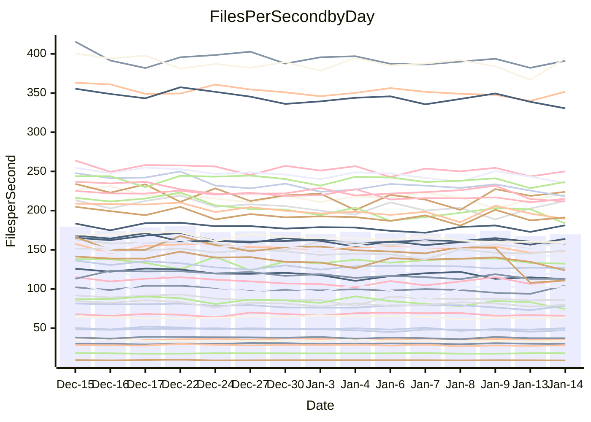

<!---
# This file is auto-generated. Do not edit.
# cspell:disable
--->
# Performance Report

## Daily Performance

## Time to Process Files

| Repository                                      | Elapsed | Min/Avg/Max           |   SD | SD Graph                |
| ----------------------------------------------- | ------: | :-------------------: | ---: | ----------------------- |
| AdaDoom3/AdaDoom3                    |    3.03 | 2.8 /   3.0 /   3.2   | 0.09 | `    ┣━━┻━━●━━┻━━┫    ` |
| alexiosc/megistos                    |    7.31 | 6.7 /   7.2 /   8.1   | 0.32 | `    ┣━━┻━━╋●━┻━━┫    ` |
| apollographql/apollo-server          |    2.25 | 2.1 /   2.3 /   2.8   | 0.12 | `    ┣━━┻━●╋━━┻━━┫    ` |
| aspnetboilerplate/aspnetboilerplate  |   10.30 | 8.9 /   9.6 /  10.4   | 0.37 | `    ┣━━┻━━╋━━┻━━●    ` |
| aws-amplify/docs                     |   12.11 | 11.5 /  12.0 /  13.6  | 0.42 | `    ┣━━┻━━╋●━┻━━┫    ` |
| Azure/azure-rest-api-specs           |   21.31 | 13.8 /  16.5 /  24.9  | 2.25 | `   ┣━━┻━━━╋━━━┻━━┫●  ` |
| bitjson/typescript-starter           |    0.67 | 0.6 /   0.7 /   0.7   | 0.02 | `     ┣━━┻━╋━●━━┫     ` |
| caddyserver/caddy                    |    3.75 | 3.0 /   3.3 /   3.7   | 0.18 | `    ┣━━┻━━╋━━┻━━┫●   ` |
| canada-ca/open-source-logiciel-libre |    0.79 | 0.7 /   0.8 /   0.8   | 0.02 | `     ┣━━┻━╋━┻━●┫     ` |
| chef/chef                            |    5.38 | 5.1 /   5.5 /   6.6   | 0.33 | `    ┣━━┻━●╋━━┻━━┫    ` |
| dart-lang/sdk                        |   63.17 | 57.6 /  60.7 /  67.3  | 2.02 | `  ┣━━━┻━━━╋━━━┻●━━┫  ` |
| django/django                        |   14.74 | 13.5 /  14.6 /  16.4  | 0.66 | `   ┣━━━┻━━╋●━┻━━━┫   ` |
| eslint/eslint                        |   10.76 | 9.5 /  10.2 /  11.2   | 0.40 | `    ┣━━┻━━╋━━┻━●┫    ` |
| exonum/exonum                        |    3.18 | 2.9 /   3.1 /   3.5   | 0.13 | `    ┣━━┻━━╋●━┻━━┫    ` |
| flutter/samples                      |   16.74 | 16.0 /  17.2 /  22.0  | 1.03 | `   ┣━━━┻●━╋━━┻━━━┫   ` |
| gitbucket/gitbucket                  |    3.25 | 3.0 /   3.2 /   3.4   | 0.11 | `    ┣━━┻━━╋━●┻━━┫    ` |
| googleapis/google-cloud-cpp          |  124.91 | 117.0 / 127.8 / 139.4 | 4.56 | `  ┣━━━┻●━━╋━━━┻━━━┫  ` |
| graphql/express-graphql              |    0.74 | 0.7 /   0.7 /   0.8   | 0.02 | `     ┣━━┻━╋━┻●━┫     ` |
| graphql/graphql-js                   |    2.29 | 2.1 /   2.2 /   2.4   | 0.07 | `     ┣━┻━━╋━●┻━┫     ` |
| graphql/graphql-relay-js             |    0.75 | 0.7 /   0.7 /   0.8   | 0.02 | `     ┣━━┻━╋●┻━━┫     ` |
| graphql/graphql-spec                 |    0.83 | 0.8 /   0.8 /   0.9   | 0.02 | `     ┣━━┻●╋━┻━━┫     ` |
| iluwatar/java-design-patterns        |   12.01 | 10.7 /  11.4 /  12.2  | 0.32 | `    ┣━━┻━━╋━━┻━━●    ` |
| ktaranov/sqlserver-kit               |    6.22 | 5.9 /   6.3 /   7.2   | 0.25 | `    ┣━━┻━━●━━┻━━┫    ` |
| liriliri/licia                       |    3.67 | 3.3 /   3.6 /   3.9   | 0.11 | `    ┣━━┻━━╋●━┻━━┫    ` |
| MartinThoma/LaTeX-examples           |    6.55 | 6.1 /   6.4 /   6.8   | 0.17 | `    ┣━━┻━━╋━●┻━━┫    ` |
| mdx-js/mdx                           |    1.65 | 1.5 /   1.6 /   1.8   | 0.07 | `     ┣━┻━━╋●━┻━┫     ` |
| microsoft/TypeScript-Website         |    5.34 | 4.9 /   5.2 /   5.5   | 0.14 | `    ┣━━┻━━╋━━┻●━┫    ` |
| MicrosoftDocs/PowerShell-Docs        |   19.81 | 17.6 /  19.2 /  25.8  | 1.45 | `   ┣━━━┻━━╋━●┻━━━┫   ` |
| neovim/nvim-lspconfig                |    3.33 | 2.8 /   3.1 /   3.5   | 0.14 | `    ┣━━┻━━╋━━┻●━┫    ` |
| pagekit/pagekit                      |    3.36 | 3.1 /   3.4 /   3.8   | 0.17 | `    ┣━━┻━●╋━━┻━━┫    ` |
| php/php-src                          |   21.40 | 20.3 /  22.4 /  28.4  | 1.70 | `   ┣━━┻━●━╋━━━┻━━┫   ` |
| plasticrake/tplink-smarthome-api     |    0.94 | 0.9 /   0.9 /   1.0   | 0.03 | `     ┣━┻━━╋━●┻━┫     ` |
| prettier/prettier                    |    6.67 | 6.0 /   6.4 /   7.2   | 0.21 | `    ┣━━┻━━╋━━┻●━┫    ` |
| pycontribs/jira                      |    1.26 | 1.2 /   1.3 /   1.3   | 0.04 | `     ┣━┻━━●━━┻━┫     ` |
| RustPython/RustPython                |    4.16 | 4.0 /   4.2 /   5.1   | 0.21 | `    ┣━━┻━●╋━━┻━━┫    ` |
| shoelace-style/shoelace              |    2.42 | 2.3 /   2.5 /   2.7   | 0.08 | `     ┣━┻●━╋━━┻━┫     ` |
| slint-ui/slint                       |   10.75 | 8.7 /   9.7 /  11.8   | 0.65 | `    ┣━━┻━━╋━━┻━●┫    ` |
| SoftwareBrothers/admin-bro           |    2.08 | 2.0 /   2.2 /   2.3   | 0.09 | `     ┣━┻●━╋━━┻━┫     ` |
| sveltejs/svelte                      |   18.11 | 17.2 /  18.5 /  22.2  | 0.76 | `   ┣━━━┻●━╋━━┻━━━┫   ` |
| TheAlgorithms/Python                 |    5.47 | 5.0 /   5.4 /   5.8   | 0.19 | `    ┣━━┻━━╋●━┻━━┫    ` |
| twbs/bootstrap                       |    1.15 | 1.1 /   1.2 /   1.4   | 0.06 | `     ┣━●━━╋━━┻━┫     ` |
| typescript-cheatsheets/react         |    1.12 | 1.1 /   1.1 /   1.3   | 0.05 | `     ┣━┻━━●━━┻━┫     ` |
| typescript-eslint/typescript-eslint  |    3.63 | 3.4 /   3.6 /   3.8   | 0.09 | `    ┣━━┻━━●━━┻━━┫    ` |
| vitest-dev/vitest                    |    8.28 | 7.2 /   7.8 /   8.4   | 0.26 | `    ┣━━┻━━╋━━┻━●┫    ` |
| w3c/aria-practices                   |    3.28 | 2.7 /   2.9 /   3.2   | 0.13 | `    ┣━━┻━━╋━━┻━━┫●   ` |
| w3c/specberus                        |    1.67 | 1.6 /   1.7 /   1.8   | 0.04 | `     ┣━┻━━╋●━┻━┫     ` |
| webdeveric/webpack-assets-manifest   |    0.67 | 0.6 /   0.7 /   0.8   | 0.02 | `     ┣━━┻━●━┻━━┫     ` |
| webpack/webpack                      |    5.17 | 4.6 /   4.8 /   5.3   | 0.19 | `    ┣━━┻━━╋━━┻━●┫    ` |
| wireapp/wire-desktop                 |    0.86 | 0.8 /   0.9 /   1.0   | 0.03 | `     ┣━┻━●╋━━┻━┫     ` |
| wireapp/wire-webapp                  |    8.21 | 7.5 /   8.3 /   8.9   | 0.31 | `    ┣━━┻━●╋━━┻━━┫    ` |

Note:
- Elapsed time is in seconds.

## Files per Second over Time

| Repository                                      | Files |    Sec |    Fps |     Rel | Trend Fps              |    N |
| ----------------------------------------------- | ----: | -----: | -----: | ------: | ---------------------- | ---: |
| AdaDoom3/AdaDoom3                    |   103 |   3.03 |  34.00 |  -0.02% | `▇▇▇▆▇▇▆█▅▇▆▆▇▅▇▇▇▅▆▇` |   31 |
| alexiosc/megistos                    |   583 |   7.31 |  79.76 |  -1.28% | `▇▇█▆▃▅█▇▅▆▆▆▇█▇▇▄▇▆▆` |   31 |
| apollographql/apollo-server          |   250 |   2.25 | 111.07 |   1.67% | `▆▆▆▆▇▅▇▆█▇▃█▇▇█▇▇▄▇▇` |   34 |
| aspnetboilerplate/aspnetboilerplate  |  2246 |  10.30 | 218.14 |  -6.79% | `█▇▇▇▇▄▅▆▆█▇▆▇▅█▇▇▅▅▄` |   31 |
| aws-amplify/docs                     |  2865 |  12.11 | 236.61 |  -0.96% | `█▆█▆▇▆███▇▆█▇██▆▇▃█▇` |   33 |
| Azure/azure-rest-api-specs           |  2364 |  21.31 | 110.93 | -25.12% | `▇█▇██▇▇▇▇▇▆██▇▇▃▃▃▁▃` |   34 |
| bitjson/typescript-starter           |    20 |   0.67 |  29.74 |  -1.74% | `▇███▆▇▅▇█▆▇█▆▄█▇▆▇▇▆` |   31 |
| caddyserver/caddy                    |   279 |   3.75 |  74.36 | -11.92% | `▇▄▆▅▅█▆▅▇▅▃▆▄▄▆▇▅▇▄▃` |   34 |
| canada-ca/open-source-logiciel-libre |     7 |   0.79 |   8.82 |  -3.40% | `▇▇███▇█▇▇███▆▆▆█▇▇█▆` |   31 |
| chef/chef                            |  1204 |   5.38 | 223.94 |   1.82% | `██▅▇▆█▅▆██▄▇▃▇█▆█▇▆▇` |   32 |
| dart-lang/sdk                        | 10077 |  63.17 | 159.51 |  -3.67% | `█▆▆▇▆▇▇▇▅█▇▇▇▆▆▇▆▆▄▆` |   34 |
| django/django                        |  2820 |  14.74 | 191.28 |  -1.10% | `▅█▇▆▇▇▅▇▅█▆▇▆▄█▇▇▆▃▇` |   34 |
| eslint/eslint                        |  2038 |  10.76 | 189.40 |  -5.45% | `█▅█▆▆▇▅▆▇▅▇█▄▅█▇▇▇▅▅` |   34 |
| exonum/exonum                        |   421 |   3.18 | 132.31 |  -1.96% | `▇█▇▆▇▆▆▇▇▆██▆█▇█▇▇▆▆` |   31 |
| flutter/samples                      |  2690 |  16.74 | 160.69 |   2.65% | `▇▂▇█▇▇▆▇█▇▇█▇▅▇▇▇▆▆▇` |   34 |
| gitbucket/gitbucket                  |   412 |   3.25 | 126.67 |  -2.21% | `▆█▄█▅▇▆████▆▆█▆▆▅█▇▆` |   34 |
| googleapis/google-cloud-cpp          | 19742 | 124.91 | 158.05 |   2.20% | `▇▇▇▆▄▇█▇▅▅█▇▇▇█▆▇▇▇█` |   34 |
| graphql/express-graphql              |    26 |   0.74 |  35.24 |  -2.90% | `███▆▆▇██▇▇▇▇▇▇▇▇▇▆▅▆` |   31 |
| graphql/graphql-js                   |   339 |   2.29 | 148.32 |  -2.65% | `██▇▇▇▄█▇▇█▇▇█▇▇█▅▆▆▆` |   32 |
| graphql/graphql-relay-js             |    28 |   0.75 |  37.15 |  -1.65% | `▇▇▅█▇██▆▆█▅█▆▄▆██▅▆▆` |   31 |
| graphql/graphql-spec                 |    15 |   0.83 |  18.04 |   0.69% | `▇▆▆▇▅▇█▆▆▇▆▇█▅▆▅▇▇▇▇` |   31 |
| iluwatar/java-design-patterns        |  1892 |  12.01 | 157.59 |  -2.91% | `▆▆▇█▆▆▇▄█▆▇█▅██▇▆▆▇▆` |   34 |
| ktaranov/sqlserver-kit               |   489 |   6.22 |  78.65 |   0.45% | `▇▇▆▆▇▆▆▆█▇█▇▇▇█▆▃▆▆▇` |   32 |
| liriliri/licia                       |  1434 |   3.67 | 391.17 |  -0.67% | `█▇▅████▆▇██▇▅▇▇█▇▅▇▇` |   32 |
| MartinThoma/LaTeX-examples           |  1409 |   6.55 | 215.07 |  -1.88% | `▇▇▅▇▆▇▇█▆▅▄▆▇▅▇▆▆▅▅▆` |   31 |
| mdx-js/mdx                           |   142 |   1.65 |  86.15 |  -1.87% | `▇▇▃█▅▆▄████▇▇▇▆▇▆▆▇▆` |   32 |
| microsoft/TypeScript-Website         |   757 |   5.34 | 141.64 |  -3.34% | `▅▅█▆▇▆▇▇▅▆▇▅▆▇▆▇▅▆▄▅` |   33 |
| MicrosoftDocs/PowerShell-Docs        |  2236 |  19.81 | 112.89 |  -3.52% | `▆▇▇██▇▇▇▇▇▇▇▅██▇▅▇▇▇` |   34 |
| neovim/nvim-lspconfig                |   375 |   3.33 | 112.73 |  -5.86% | `█▇▇█▄▄▆▆▅▇▇▇▇█▅▆▅▄▆▅` |   34 |
| pagekit/pagekit                      |   741 |   3.36 | 220.74 |   1.15% | `█▅▆▅▃▇▅▆▆▆▇█▅▇▄▄▇▅▄▆` |   31 |
| php/php-src                          |  2213 |  21.40 | 103.42 |   3.98% | `██▄▆██▇▆▇▅▂▅▇▇█▆█▇▇█` |   34 |
| plasticrake/tplink-smarthome-api     |    62 |   0.94 |  65.78 |  -2.73% | `▆▇▇█▆▆▇▇█▇▇▇█▇█▆▅▇▇▆` |   31 |
| prettier/prettier                    |  2205 |   6.67 | 330.51 |  -3.99% | `█▄█▆█████▆▇▆▇██▇▆▇▇▆` |   34 |
| pycontribs/jira                      |    80 |   1.26 |  63.63 |  -0.64% | `▅█▇▇█▇█▇█▆█▆▆▄▅▆▇▅▅▆` |   31 |
| RustPython/RustPython                |   620 |   4.16 | 149.05 |   1.45% | `█▇▅▇█▇██▅▇█▃██▇▇▇▆██` |   34 |
| shoelace-style/shoelace              |   438 |   2.42 | 181.24 |   1.95% | `█▆▇▆█▇▇▇▇▅▆▄▇█▇█▇▄▇█` |   33 |
| slint-ui/slint                       |  1973 |  10.75 | 183.49 |  -9.43% | `▆██▅▅▇▅█▃▅▅█▆▇▇▇▇▇▇▅` |   34 |
| SoftwareBrothers/admin-bro           |   441 |   2.08 | 212.27 |   3.48% | `██▅▅▆▄▇▅█▇▅▄▇▆▆▄▆▅▇█` |   31 |
| sveltejs/svelte                      |  7145 |  18.11 | 394.48 |   2.05% | `▇▇▇▇▇█▇▇▇█▇███▇▇▇▇▃█` |   34 |
| TheAlgorithms/Python                 |  1367 |   5.47 | 250.04 |  -0.92% | `▆▇▇▄█▇▆▅▄▇▇▇▆▇▇▅▅▆▅▆` |   34 |
| twbs/bootstrap                       |   120 |   1.15 | 104.36 |   5.38% | `▅▆██▅▆▆▄▇▆▆▆▇▆▇▅▄▄▆█` |   33 |
| typescript-cheatsheets/react         |    53 |   1.12 |  47.52 |  -0.94% | `██████▇▃███▇█▇▇▃▆▇▇▇` |   32 |
| typescript-eslint/typescript-eslint  |  1277 |   3.63 | 351.75 |  -0.22% | `▇▇▅█▇▇▇██▆▇█▆▇▇▆▆▅▆▇` |   34 |
| vitest-dev/vitest                    |  1946 |   8.28 | 235.07 |  -4.60% | `▆▇▇▅▆▇▇▆██▅▅▄▆▇▆▇▆▆▅` |   34 |
| w3c/aria-practices                   |   405 |   3.28 | 123.64 | -10.26% | `▅▄██▇▇▄▄▇▇▇▇▇▇▇█▅█▆▃` |   32 |
| w3c/specberus                        |   200 |   1.67 | 119.70 |  -0.62% | `▇▆▆▇▅▇▇▇▆▆▆▇█▄▇▆▅▆▇▆` |   33 |
| webdeveric/webpack-assets-manifest   |    19 |   0.67 |  28.25 |   0.12% | `▇█▆█▇▆██▆▇██▇▇▃▇▅▄█▇` |   31 |
| webpack/webpack                      |  1095 |   5.17 | 211.68 |  -6.41% | `▆▆▆▆█▆▆▅█▄▄▆▇▇▆▇▄▅▅▄` |   32 |
| wireapp/wire-desktop                 |    43 |   0.86 |  49.96 |   1.85% | `▆▆▆▆▇▇█▅▆███▇▄▇▆▆▆▆▇` |   34 |
| wireapp/wire-webapp                  |  1345 |   8.21 | 163.92 |   1.41% | `██▆▇█▅▅██▅▅▇▇▆██▇▅▅█` |   34 |

## Data Throughput

| Repository                                      | Files |    Sec |     Kps |     Rel | Trend Kps              |    N |
| ----------------------------------------------- | ----: | -----: | ------: | ------: | ---------------------- | ---: |
| AdaDoom3/AdaDoom3                    |   103 |   3.03 |  722.63 |  -0.02% | `▇▇▇▆▇▇▆█▅▇▆▆▇▅▇▇▇▅▆▇` |   31 |
| alexiosc/megistos                    |   583 |   7.31 |  626.70 |  -1.28% | `▇▇█▆▃▅█▇▅▆▆▆▇█▇▇▄▇▆▆` |   31 |
| apollographql/apollo-server          |   250 |   2.25 |  889.01 |   1.74% | `▆▆▆▆▇▅▇▆█▇▃█▇▇█▇▇▄▇▇` |   34 |
| aspnetboilerplate/aspnetboilerplate  |  2246 |  10.30 |  513.21 |  -6.79% | `█▇▇▇▇▄▅▆▆█▇▆▇▅█▇▇▅▅▄` |   31 |
| aws-amplify/docs                     |  2865 |  12.11 |  811.56 |  -0.85% | `█▆█▆▇▆███▇▆█▇██▆▇▃█▇` |   33 |
| Azure/azure-rest-api-specs           |  2364 |  21.31 |  319.56 | -25.12% | `▇█▇██▇▇▇▇▇▆██▇▇▃▃▃▁▃` |   34 |
| bitjson/typescript-starter           |    20 |   0.67 |  118.96 |  -1.74% | `▇███▆▇▅▇█▆▇█▆▄█▇▆▇▇▆` |   31 |
| caddyserver/caddy                    |   279 |   3.75 |  620.20 | -11.73% | `▇▄▆▅▅█▆▅▇▅▃▆▄▄▆▇▅▇▄▃` |   34 |
| canada-ca/open-source-logiciel-libre |     7 |   0.79 |   73.11 |  -3.40% | `▇▇███▇█▇▇███▆▆▆█▇▇█▆` |   31 |
| chef/chef                            |  1204 |   5.38 | 1028.37 |   1.80% | `██▅▇▆█▅▆██▄▇▃▇█▆█▇▆▇` |   32 |
| dart-lang/sdk                        | 10077 |  63.17 | 1137.70 |  -3.68% | `█▆▇▇▇▇▇▇▅█▇▇▇▆▆▇▇▆▄▆` |   34 |
| django/django                        |  2820 |  14.74 | 1184.43 |  -0.93% | `▅█▇▆▇▇▅▇▅█▆▇▆▄█▇▇▆▃▇` |   34 |
| eslint/eslint                        |  2038 |  10.76 | 1548.03 |  -5.35% | `█▅▇▆▆▇▅▆▇▅▇█▄▅█▇▇▇▅▅` |   34 |
| exonum/exonum                        |   421 |   3.18 | 1265.62 |  -1.96% | `▇█▇▆▇▆▆▇▇▆██▆█▇█▇▇▆▆` |   31 |
| flutter/samples                      |  2690 |  16.74 | 1301.50 |   2.65% | `▇▂▇█▇▇▆▇█▇▇█▇▅▇▇▇▆▆▇` |   34 |
| gitbucket/gitbucket                  |   412 |   3.25 |  573.07 |  -2.19% | `▆█▄█▅▇▆████▆▆█▆▆▅█▇▆` |   34 |
| googleapis/google-cloud-cpp          | 19742 | 124.91 | 1233.80 |   2.15% | `▇▇▇▆▄▇█▇▅▅█▇▇▇█▆▇▇▇█` |   34 |
| graphql/express-graphql              |    26 |   0.74 |  161.31 |  -2.90% | `███▆▆▇██▇▇▇▇▇▇▇▇▇▆▅▆` |   31 |
| graphql/graphql-js                   |   339 |   2.29 |  842.67 |  -2.65% | `██▇▇▇▄█▇▇█▇▇█▇▇█▅▆▆▆` |   32 |
| graphql/graphql-relay-js             |    28 |   0.75 |  145.93 |  -1.65% | `▇▇▅█▇██▆▆█▅█▆▄▆██▅▆▆` |   31 |
| graphql/graphql-spec                 |    15 |   0.83 |  663.80 |   0.69% | `▇▆▆▇▅▇█▆▆▇▆▇█▅▆▅▇▇▇▇` |   31 |
| iluwatar/java-design-patterns        |  1892 |  12.01 |  484.09 |  -3.18% | `▆▆▇█▆▆▇▄█▆▇█▅██▇▆▆▇▆` |   34 |
| ktaranov/sqlserver-kit               |   489 |   6.22 | 1189.93 |   0.44% | `▇▇▆▆▇▆▆▆█▇█▇▇▇█▆▃▆▆▇` |   32 |
| liriliri/licia                       |  1434 |   3.67 |  463.46 |  -0.67% | `█▇▅████▆▇██▇▅▇▇█▇▅▇▇` |   32 |
| MartinThoma/LaTeX-examples           |  1409 |   6.55 |  444.19 |  -1.88% | `▇▇▅▇▆▇▇█▆▅▄▆▇▅▇▆▆▅▅▆` |   31 |
| mdx-js/mdx                           |   142 |   1.65 |  398.61 |  -2.06% | `▇▇▃█▅▆▄████▇▇▇▆▇▆▆▇▆` |   32 |
| microsoft/TypeScript-Website         |   757 |   5.34 |  969.96 |  -3.34% | `▅▅█▆▇▆▇▇▅▆▇▅▆▇▆▇▅▆▄▅` |   33 |
| MicrosoftDocs/PowerShell-Docs        |  2236 |  19.81 | 1127.69 |  -3.47% | `▆▇▇██▇▇▇▇▇▇▇▅██▇▅▇▇▇` |   34 |
| neovim/nvim-lspconfig                |   375 |   3.33 |  294.59 |  -5.80% | `█▇▇█▄▄▇▇▅▇▇▇▇█▅▆▅▄▆▅` |   34 |
| pagekit/pagekit                      |   741 |   3.36 |  460.24 |   1.15% | `█▅▆▅▃▇▅▆▆▆▇█▅▇▄▄▇▅▄▆` |   31 |
| php/php-src                          |  2213 |  21.40 | 1514.72 |   4.02% | `██▄▆██▇▆▇▅▂▅▇▇█▆█▇▇█` |   34 |
| plasticrake/tplink-smarthome-api     |    62 |   0.94 |  355.43 |  -2.73% | `▆▇▇█▆▆▇▇█▇▇▇█▇█▆▅▇▇▆` |   31 |
| prettier/prettier                    |  2205 |   6.67 |  466.60 |  -4.07% | `█▄█▆█████▇▇▆▇██▇▆▇▇▆` |   34 |
| pycontribs/jira                      |    80 |   1.26 |  438.27 |  -0.64% | `▅█▇▇█▇█▇█▆█▆▆▄▅▆▇▅▅▆` |   31 |
| RustPython/RustPython                |   620 |   4.16 | 1102.51 |   1.64% | `█▇▅▇█▇██▅▇█▃██▇▇▇▆██` |   34 |
| shoelace-style/shoelace              |   438 |   2.42 |  870.61 |   1.98% | `█▆▇▆█▇▇▇▇▅▆▄▇█▇█▇▄▇█` |   33 |
| slint-ui/slint                       |  1973 |  10.75 |  942.39 |  -9.26% | `▆██▅▅▇▅█▃▅▅▇▆▆▇▇▇▇▇▅` |   34 |
| SoftwareBrothers/admin-bro           |   441 |   2.08 |  467.86 |   3.48% | `██▅▅▆▄▇▅█▇▅▄▇▆▆▄▆▅▇█` |   31 |
| sveltejs/svelte                      |  7145 |  18.11 |  261.64 |   2.71% | `▇▇▇▇▇█▇▇▇█▇███▇▇▇█▃█` |   34 |
| TheAlgorithms/Python                 |  1367 |   5.47 |  635.63 |  -0.73% | `▆▇▇▄█▇▆▅▄▇▇▇▆▇▇▅▅▆▅▆` |   34 |
| twbs/bootstrap                       |   120 |   1.15 |  837.51 |   5.38% | `▅▆██▅▆▆▄▇▆▆▆▇▆▇▅▄▄▆█` |   33 |
| typescript-cheatsheets/react         |    53 |   1.12 |  347.86 |  -0.94% | `██████▇▃███▇█▇▇▃▆▇▇▇` |   32 |
| typescript-eslint/typescript-eslint  |  1277 |   3.63 | 1701.46 |   0.86% | `▇▆▅▇▇▇▇██▆▇█▆▇▇▆▆▆▆▇` |   34 |
| vitest-dev/vitest                    |  1946 |   8.28 |  484.15 |  -4.71% | `▆▇▇▅▆▇▇▆██▅▅▄▆▇▆▇▆▆▅` |   34 |
| w3c/aria-practices                   |   405 |   3.28 | 1148.13 | -10.31% | `▅▄██▇▇▄▄▇▇▇▇▇▇▇█▅█▆▃` |   32 |
| w3c/specberus                        |   200 |   1.67 |  381.85 |  -0.62% | `▇▆▆▇▅▇▇▇▆▆▆▇█▄▇▆▅▆▇▆` |   33 |
| webdeveric/webpack-assets-manifest   |    19 |   0.67 |  151.65 |   0.12% | `▇█▆█▇▆██▆▇██▇▇▃▇▅▄█▇` |   31 |
| webpack/webpack                      |  1095 |   5.17 |  933.91 |  -6.40% | `▆▆▆▆█▆▆▅█▄▄▆▇▇▆▇▄▅▅▄` |   32 |
| wireapp/wire-desktop                 |    43 |   0.86 |  220.77 |   1.85% | `▆▆▆▆▇▇█▅▆███▇▄▇▆▆▆▆▇` |   34 |
| wireapp/wire-webapp                  |  1345 |   8.21 |  662.49 |   1.18% | `██▆▇█▅▅██▅▅▇▇▆█▇▇▅▄█` |   34 |

