<!---
# This file is auto-generated. Do not edit.
# cspell:disable
--->
# Performance Report

## Daily Performance

```mermaid
xychart-beta
    title Files Per Second by Day
    y-axis Files per Second
    x-axis Date [Mar-23, Mar-24, Mar-25, Mar-26, Mar-29, Mar-30, Apr-1, Apr-2, Apr-4, Apr-7, Apr-8, Apr-9, Apr-10, Apr-11, Apr-14, Apr-15, Apr-16, Apr-17, Apr-18, Apr-19, Apr-20]
    bar [170.54, 170.15, 169.46, 168.97, 169.16, 165.19, 167.12, 170.37, 169.84, 169.20, 170.31, 166.27, 166.91, 170.48, 169.33, 169.62, 167.60, 169.74, 169.68, 169.99, 170.58]
    line [9.01, 9.07, 9.18, 8.85, 8.88, 8.98, 8.86, 9.02, 8.96, 9.04, 7.54, 9.19, 9.07, 9.09, 8.79, 8.86, 9.07, 9.04, 8.87, 8.76, 9.39]
    line [105.75, 102.75, 105.38, 105.40, 108.89, 108.97, 105.55, 109.02, 109.07, 108.93, 102.51, 106.98, 109.00, 108.35, 103.95, 107.46, 107.98, 108.91, 107.43, 108.61, 111.70]
    line [17.67, 18.65, 17.61, 17.35, 16.76, 17.72, 17.35, 17.65, 17.28, 17.60, 16.96, 17.77, 17.06, 17.46, 17.21, 17.42, 17.60, 17.08, 17.31, 17.56, 17.50]
    line [63.14, 64.40, 63.55, 62.46, 63.93, 62.91, 63.90, 62.22, 64.11, 62.38, 62.53, 61.32, 54.24, 63.37, 63.45, 60.45, 62.38, 64.57, 64.96, 64.20, 60.73]
    line [177.02, 167.95, 176.21, 170.25, 176.92, 156.03, 170.40, 177.72, 173.91, 177.92, 179.08, 173.27, 175.00, 170.86, 165.94, 173.69, 173.55, 174.13, 172.94, 170.54, 174.54]
    line [125.56, 130.85, 117.33, 124.90, 126.70, 118.28, 118.73, 131.77, 121.36, 115.15, 130.27, 129.70, 106.78, 126.97, 127.64, 125.44, 128.53, 127.62, 128.92, 120.98, 116.11]
    line [87.54, 88.99, 86.43, 87.49, 88.18, 89.80, 85.13, 86.10, 87.57, 86.19, 87.38, 86.67, 88.15, 82.83, 86.26, 85.93, 88.01, 87.47, 86.56, 87.65, 86.02]
    line [29.66, 30.27, 30.92, 29.47, 28.68, 29.57, 28.57, 29.71, 29.80, 29.09, 30.39, 28.82, 29.85, 30.29, 29.17, 29.16, 30.32, 29.23, 29.37, 29.90, 30.42]
    line [80.38, 80.74, 79.45, 78.90, 77.54, 81.64, 79.42, 77.99, 80.60, 77.45, 79.26, 78.59, 74.22, 77.47, 71.52, 79.38, 78.34, 80.66, 81.07, 81.90, 79.00]
    line [77.74, 71.68, 76.76, 74.86, 76.49, 79.15, 75.48, 79.12, 77.09, 74.93, 76.78, 77.18, 78.18, 76.70, 76.29, 76.45, 76.07, 75.42, 76.77, 77.79, 78.36]
    line [46.98, 46.43, 46.81, 47.74, 46.04, 47.27, 46.31, 47.51, 45.90, 45.44, 47.98, 45.98, 48.61, 46.63, 47.25, 46.53, 46.91, 46.99, 47.21, 43.97, 47.24]
    line [338.88, 336.90, 337.64, 342.52, 344.39, 323.05, 332.32, 329.96, 332.43, 330.30, 334.01, 330.67, 335.10, 339.21, 338.50, 333.53, 327.92, 339.69, 338.54, 337.09, 337.96]
    line [35.93, 34.39, 35.01, 35.05, 34.45, 35.12, 35.58, 36.26, 35.35, 33.46, 33.90, 35.56, 34.65, 35.25, 33.95, 35.11, 35.60, 35.68, 35.27, 35.45, 35.08]
    line [151.81, 155.42, 148.92, 148.41, 153.58, 150.94, 143.07, 143.33, 149.63, 148.24, 150.53, 145.81, 135.51, 153.54, 148.49, 150.16, 149.84, 151.62, 149.82, 147.39, 150.90]
    line [127.48, 128.55, 123.13, 128.34, 129.63, 124.04, 124.98, 128.23, 124.77, 127.89, 127.66, 125.67, 123.96, 126.62, 121.49, 124.08, 125.35, 129.58, 129.31, 126.67, 127.47]
    line [147.15, 147.33, 145.61, 148.28, 144.08, 145.60, 137.08, 138.21, 138.98, 136.61, 140.82, 136.34, 137.38, 144.66, 145.14, 143.84, 144.20, 144.52, 139.00, 143.78, 143.76]
    line [80.89, 84.46, 87.70, 74.07, 80.80, 84.33, 78.70, 84.38, 79.63, 81.82, 77.99, 81.50, 83.68, 82.24, 79.00, 81.10, 76.32, 82.35, 77.98, 81.12, 84.93]
    line [196.34, 187.06, 199.37, 194.10, 194.60, 197.36, 195.73, 192.93, 191.61, 192.83, 195.35, 194.59, 189.25, 194.14, 192.92, 186.07, 185.77, 196.44, 190.62, 188.38, 197.26]
    line [36.04, 37.43, 37.77, 35.49, 38.47, 34.67, 37.33, 36.38, 33.48, 34.77, 37.91, 37.41, 35.78, 36.99, 37.77, 37.41, 38.03, 37.53, 36.12, 37.89, 38.45]
    line [249.28, 243.38, 245.38, 244.71, 244.86, 246.31, 247.68, 259.43, 240.39, 235.37, 241.80, 223.67, 256.52, 244.43, 247.02, 250.63, 247.99, 249.17, 253.74, 253.49, 251.96]
    line [387.88, 376.31, 372.07, 383.78, 387.22, 383.71, 379.46, 361.04, 377.52, 372.77, 388.59, 381.59, 348.04, 380.94, 383.05, 379.79, 379.24, 389.97, 387.83, 386.24, 370.95]
    line [115.10, 113.74, 110.71, 115.58, 119.01, 118.83, 116.74, 109.55, 112.13, 116.38, 109.02, 116.94, 120.00, 115.72, 178.30, 177.73, 180.34, 180.24, 181.16, 179.47, 184.09]
    line [338.59, 333.75, 333.80, 334.21, 340.82, 328.95, 338.30, 340.61, 333.96, 339.43, 331.60, 337.56, 339.68, 342.67, 340.53, 332.27, 335.32, 337.55, 341.08, 333.28, 346.04]
    line [221.85, 221.92, 208.33, 219.80, 213.72, 203.24, 214.01, 219.35, 211.25, 222.14, 222.81, 213.62, 192.45, 214.69, 213.97, 220.18, 219.45, 220.27, 211.75, 215.92, 218.89]
    line [143.59, 140.02, 140.41, 141.17, 142.23, 143.51, 141.89, 144.85, 135.75, 140.12, 141.93, 144.71, 138.12, 136.03, 141.29, 138.52, 140.48, 140.76, 140.21, 141.88, 142.97]
    line [189.34, 190.88, 193.34, 184.57, 195.49, 178.54, 190.68, 196.99, 187.71, 198.59, 197.91, 153.08, 193.37, 186.31, 191.86, 190.39, 197.86, 198.53, 194.94, 194.83, 191.22]
    line [98.57, 96.12, 102.27, 101.01, 101.78, 96.16, 99.80, 97.07, 97.79, 98.91, 96.86, 98.48, 95.78, 98.82, 98.24, 97.95, 94.18, 94.73, 96.19, 101.04, 102.25]
    line [67.29, 67.85, 66.26, 65.71, 66.97, 59.95, 64.70, 68.07, 62.75, 56.53, 64.20, 68.55, 66.50, 63.84, 67.31, 66.50, 66.41, 65.32, 66.89, 68.61, 56.95]
    line [231.13, 215.37, 218.33, 220.26, 228.02, 226.94, 217.16, 217.42, 227.00, 219.19, 223.64, 221.83, 216.60, 219.13, 224.29, 221.03, 219.41, 211.61, 231.08, 224.48, 230.41]
    line [202.64, 191.91, 205.03, 200.51, 203.16, 199.89, 196.17, 195.60, 198.67, 195.49, 190.29, 196.88, 194.92, 202.96, 194.19, 200.03, 194.80, 200.11, 202.53, 198.27, 205.03]
    line [213.69, 202.35, 210.95, 211.66, 216.55, 215.27, 211.34, 210.95, 214.71, 213.10, 213.49, 213.15, 207.01, 217.98, 213.40, 214.15, 209.08, 210.92, 212.31, 202.24, 215.18]
    line [32.86, 32.52, 33.58, 32.45, 33.01, 32.72, 32.66, 33.55, 32.53, 32.45, 32.84, 31.03, 33.00, 32.16, 32.22, 32.66, 32.69, 33.19, 30.88, 31.77, 32.94]
    line [209.89, 198.80, 198.73, 211.72, 221.65, 200.22, 211.45, 214.10, 213.54, 214.82, 216.50, 216.97, 214.34, 223.50, 215.07, 208.81, 218.55, 206.19, 208.58, 221.30, 216.46]
    line [155.16, 153.53, 151.77, 149.23, 157.46, 155.25, 144.83, 152.27, 154.71, 148.18, 156.04, 147.10, 154.73, 147.03, 148.45, 154.18, 145.25, 151.93, 153.78, 155.38, 158.06]
    line [135.53, 138.70, 135.08, 132.05, 139.13, 137.14, 134.77, 129.03, 132.92, 133.01, 131.94, 136.24, 139.59, 139.80, 133.78, 134.61, 128.41, 137.96, 136.05, 137.57, 126.68]
    line [119.52, 121.31, 121.15, 119.07, 117.19, 121.84, 113.82, 117.71, 115.26, 119.06, 114.45, 115.00, 120.23, 118.00, 118.40, 118.37, 116.05, 123.88, 119.49, 121.74, 112.41]
    line [158.05, 161.01, 161.14, 161.02, 161.23, 161.25, 154.49, 160.21, 159.01, 159.81, 159.07, 154.86, 161.50, 157.82, 150.49, 156.51, 145.27, 158.44, 147.46, 154.06, 156.55]
    line [191.22, 186.88, 188.85, 185.59, 189.39, 193.26, 187.15, 184.74, 187.37, 186.23, 190.68, 147.53, 183.37, 189.36, 186.25, 190.23, 184.91, 191.69, 177.23, 189.25, 189.69]
    line [241.27, 245.83, 239.85, 239.34, 241.08, 234.18, 235.67, 236.41, 224.18, 237.10, 241.63, 230.62, 246.29, 232.09, 242.10, 239.18, 228.11, 235.38, 245.98, 246.76, 244.48]
    line [225.66, 213.93, 214.05, 215.63, 222.67, 213.80, 214.66, 227.86, 215.51, 213.60, 219.74, 229.98, 210.41, 211.03, 220.37, 222.63, 214.45, 219.40, 210.16, 226.83, 213.47]
    line [27.86, 27.78, 28.31, 28.02, 26.46, 28.25, 22.36, 22.51, 22.71, 22.07, 22.74, 22.43, 65.92, 62.39, 66.34, 66.55, 64.05, 68.35, 68.05, 68.62, 70.41]
    line [378.95, 373.61, 378.51, 353.84, 382.13, 383.17, 373.36, 381.11, 371.41, 375.01, 366.15, 382.62, 383.48, 384.04, 359.97, 375.35, 369.72, 368.89, 380.64, 373.25, 365.09]
    line [113.12, 111.02, 111.29, 113.14, 115.11, 113.41, 110.41, 110.44, 115.08, 114.00, 113.95, 110.13, 115.10, 114.20, 113.57, 114.05, 114.46, 113.36, 110.56, 109.84, 116.08]
    line [99.68, 85.33, 95.39, 95.28, 93.74, 88.41, 97.83, 99.26, 98.35, 94.04, 92.16, 96.89, 89.38, 97.60, 95.04, 95.17, 95.45, 95.51, 99.80, 94.01, 98.86]
    line [230.48, 205.55, 231.40, 224.85, 237.49, 223.66, 231.23, 235.01, 220.71, 230.14, 228.37, 226.53, 212.60, 230.01, 224.21, 229.57, 224.99, 233.81, 228.85, 235.57, 230.33]
    line [161.22, 158.27, 163.28, 162.97, 167.80, 151.35, 162.59, 164.62, 163.01, 168.55, 162.80, 164.30, 168.75, 168.13, 157.11, 162.19, 160.72, 162.22, 163.33, 167.29, 163.02]
    line [48.40, 48.37, 48.20, 48.90, 49.50, 48.70, 48.07, 49.72, 48.96, 48.45, 48.17, 47.87, 50.31, 48.30, 48.77, 47.68, 47.69, 48.50, 48.03, 49.42, 47.62]
    line [250.90, 249.83, 254.84, 250.99, 267.50, 272.96, 257.38, 260.99, 254.08, 252.77, 256.08, 266.31, 262.37, 261.47, 254.20, 253.24, 261.07, 260.83, 260.89, 253.32, 260.08]
    line [157.58, 159.05, 160.24, 163.39, 166.67, 150.69, 158.40, 157.33, 163.45, 164.03, 166.16, 160.66, 159.82, 162.39, 162.85, 163.21, 157.56, 158.15, 163.19, 164.04, 159.71]
    line [150.21, 153.16, 149.16, 149.10, 141.11, 141.56, 145.52, 151.04, 149.76, 147.19, 149.14, 146.94, 144.05, 149.94, 148.30, 147.19, 146.95, 147.95, 146.79, 147.09, 147.62]
```

## Time to Process Files

| Repository                                      | Elapsed | Min/Avg/Max           |   SD | SD Graph                |
| ----------------------------------------------- | ------: | :-------------------: | ---: | ----------------------- |
| AdaDoom3/AdaDoom3                    |    3.13 | 3.0 /   3.2 /   3.4   | 0.08 | `    ┣━━┻━●╋━━┻━━┫    ` |
| alexiosc/megistos                    |    7.38 | 6.9 /   7.4 /  11.6   | 0.64 | `    ┣━━┻━━●━━┻━━┫    ` |
| apollographql/apollo-server          |    2.27 | 2.2 /   2.4 /   2.6   | 0.09 | `     ┣━●━━╋━━┻━┫     ` |
| aspnetboilerplate/aspnetboilerplate  |    9.79 | 9.7 /  10.2 /  12.1   | 0.43 | `    ┣━━●━━╋━━┻━━┫    ` |
| aws-amplify/docs                     |   12.46 | 11.9 /  12.6 /  14.1  | 0.46 | `    ┣━━┻━●╋━━┻━━┫    ` |
| Azure/azure-rest-api-specs           |    9.29 | 8.9 /   9.4 /  10.6   | 0.33 | `    ┣━━┻━●╋━━┻━━┫    ` |
| bitjson/typescript-starter           |    0.66 | 0.6 /   0.7 /   0.8   | 0.02 | `     ┣━━●━╋━┻━━┫     ` |
| caddyserver/caddy                    |    3.32 | 3.1 /   3.5 /   3.9   | 0.20 | `    ┣━━●━━╋━━┻━━┫    ` |
| canada-ca/open-source-logiciel-libre |    0.75 | 0.7 /   0.8 /   1.0   | 0.04 | `     ┣━●━━╋━━┻━┫     ` |
| chef/chef                            |    5.56 | 5.3 /   5.7 /   6.4   | 0.23 | `    ┣━━┻●━╋━━┻━━┫    ` |
| dart-lang/sdk                        |   64.40 | 59.3 /  63.9 /  69.2  | 2.05 | `  ┣━━━┻━━━╋●━━┻━━━┫  ` |
| django/django                        |   14.94 | 14.4 /  15.2 /  19.2  | 0.70 | `   ┣━━━┻━●╋━━┻━━━┫   ` |
| eslint/eslint                        |   10.44 | 9.9 /  10.7 /  12.0   | 0.38 | `    ┣━━┻●━╋━━┻━━┫    ` |
| exonum/exonum                        |    3.63 | 3.1 /   3.4 /   3.9   | 0.20 | `    ┣━━┻━━╋━━●━━┫    ` |
| flutter/samples                      |   17.08 | 17.1 /  18.0 /  21.7  | 0.93 | `   ┣━━━●━━╋━━┻━━━┫   ` |
| gitbucket/gitbucket                  |    3.23 | 3.1 /   3.3 /   3.7   | 0.11 | `    ┣━━┻━●╋━━┻━━┫    ` |
| googleapis/google-cloud-cpp          |  135.29 | 126.2 / 134.8 / 150.4 | 4.53 | `  ┣━━━┻━━━●━━━┻━━━┫  ` |
| graphql/express-graphql              |    0.74 | 0.7 /   0.7 /   0.9   | 0.03 | `     ┣━┻━━●━━┻━┫     ` |
| graphql/graphql-js                   |    2.28 | 2.2 /   2.3 /   2.6   | 0.07 | `     ┣━┻━●╋━━┻━┫     ` |
| graphql/graphql-relay-js             |    0.73 | 0.7 /   0.8 /   0.9   | 0.04 | `     ┣━┻●━╋━━┻━┫     ` |
| graphql/graphql-spec                 |    0.86 | 0.8 /   0.9 /   1.0   | 0.03 | `     ┣━━┻━●━┻━━┫     ` |
| iluwatar/java-design-patterns        |   12.62 | 11.9 /  12.6 /  14.4  | 0.58 | `    ┣━━┻━━●━━┻━━┫    ` |
| ktaranov/sqlserver-kit               |    6.24 | 6.2 /   6.4 /   7.2   | 0.20 | `    ┣━━●━━╋━━┻━━┫    ` |
| liriliri/licia                       |    3.87 | 3.7 /   3.8 /   4.1   | 0.10 | `    ┣━━┻━━╋━━●━━┫    ` |
| MartinThoma/LaTeX-examples           |    6.55 | 6.4 /   6.7 /   7.4   | 0.21 | `    ┣━━┻●━╋━━┻━━┫    ` |
| mdx-js/mdx                           |    1.64 | 1.5 /   1.6 /   1.8   | 0.05 | `     ┣━┻━━╋●━┻━┫     ` |
| microsoft/TypeScript-Website         |    5.34 | 5.3 /   5.4 /   5.8   | 0.12 | `    ┣━━┻●━╋━━┻━━┫    ` |
| MicrosoftDocs/PowerShell-Docs        |   23.31 | 22.0 /  24.0 /  27.5  | 0.92 | `   ┣━━━●━━╋━━┻━━━┫   ` |
| neovim/nvim-lspconfig                |    3.89 | 3.2 /   3.6 /   4.3   | 0.34 | `    ┣━━┻━━╋━━●━━┫    ` |
| pagekit/pagekit                      |    3.39 | 3.2 /   3.4 /   3.9   | 0.12 | `    ┣━━┻━●╋━━┻━━┫    ` |
| php/php-src                          |   22.48 | 21.3 /  23.4 /  26.5  | 1.29 | `   ┣━━━┻●━╋━━┻━━━┫   ` |
| plasticrake/tplink-smarthome-api     |    1.09 | 0.9 /   1.0 /   1.1   | 0.06 | `     ┣━┻━━╋━━┻━┫●    ` |
| prettier/prettier                    |    6.63 | 6.4 /   6.7 /   7.1   | 0.16 | `    ┣━━┻━●╋━━┻━━┫    ` |
| pycontribs/jira                      |    1.30 | 1.2 /   1.3 /   1.5   | 0.04 | `     ┣━┻━━╋━●┻━┫     ` |
| RustPython/RustPython                |    4.67 | 4.2 /   4.7 /   5.3   | 0.20 | `    ┣━━┻━━●━━┻━━┫    ` |
| shoelace-style/shoelace              |    2.52 | 2.4 /   2.5 /   2.9   | 0.09 | `    ┣━━┻━●╋━━┻━━┫    ` |
| slint-ui/slint                       |   11.19 | 10.2 /  11.1 /  13.9  | 0.60 | `    ┣━━┻━━●━━┻━━┫    ` |
| SoftwareBrothers/admin-bro           |    2.15 | 2.1 /   2.2 /   2.4   | 0.06 | `     ┣━●━━╋━━┻━┫     ` |
| sveltejs/svelte                      |   19.96 | 18.8 /  19.5 /  22.7  | 0.65 | `   ┣━━━┻━━╋━●┻━━━┫   ` |
| TheAlgorithms/Python                 |    5.45 | 5.2 /   5.6 /   6.4   | 0.21 | `    ┣━━┻●━╋━━┻━━┫    ` |
| twbs/bootstrap                       |    1.17 | 1.2 /   1.2 /   1.3   | 0.04 | `     ┣━●━━╋━━┻━┫     ` |
| typescript-cheatsheets/react         |    1.12 | 1.1 /   1.1 /   1.3   | 0.04 | `     ┣━┻━●╋━━┻━┫     ` |
| typescript-eslint/typescript-eslint  |    3.67 | 3.6 /   3.8 /   4.1   | 0.08 | `    ┣━●┻━━╋━━┻━━┫    ` |
| vitest-dev/vitest                    |    8.43 | 8.1 /   8.6 /  10.0   | 0.34 | `    ┣━━┻●━╋━━┻━━┫    ` |
| w3c/aria-practices                   |    3.20 | 2.9 /   3.0 /   3.8   | 0.13 | `    ┣━━┻━━╋━━┻●━┫    ` |
| w3c/specberus                        |    1.81 | 1.6 /   1.7 /   2.0   | 0.07 | `     ┣━┻━━╋━━●━┫     ` |
| webdeveric/webpack-assets-manifest   |    0.72 | 0.6 /   0.7 /   0.9   | 0.09 | `     ┣━┻━━╋●━┻━┫     ` |
| webpack/webpack                      |    5.15 | 4.8 /   5.1 /   5.4   | 0.17 | `    ┣━━┻━━╋━●┻━━┫    ` |
| wireapp/wire-desktop                 |    0.90 | 0.9 /   0.9 /   1.0   | 0.02 | `     ┣━━┻━╋━●━━┫     ` |
| wireapp/wire-webapp                  |   10.07 | 9.2 /   9.9 /  11.8   | 0.46 | `    ┣━━┻━━╋●━┻━━┫    ` |

Note:
- Elapsed time is in seconds.

## Files per Second over Time

| Repository                                      | Files |    Sec |    Fps |     Rel | Trend Fps              |    N |
| ----------------------------------------------- | ----: | -----: | -----: | ------: | ---------------------- | ---: |
| AdaDoom3/AdaDoom3                    |   103 |   3.13 |  32.94 |   1.14% | `▇▆▆▆▆▇█▇▅▇▇▇▅█▇▆▄▆▆▇` |   46 |
| alexiosc/megistos                    |   583 |   7.38 |  79.00 |   0.23% | `▆▇▇█▁▇▇▇▇▇▇▇▇▇▇▇██▇▇` |   46 |
| apollographql/apollo-server          |   254 |   2.27 | 111.70 |   4.63% | `▇▄▇▅▇█▅▇▇█▇▅▇▇▇▆▇█▇█` |   48 |
| aspnetboilerplate/aspnetboilerplate  |  2255 |   9.79 | 230.41 |   3.96% | `▆▇▇▇▇▅▇█▇▇▆▇▇▅▆███▇█` |   47 |
| aws-amplify/docs                     |  2869 |  12.46 | 230.33 |   1.16% | `▇▇▇▆▆██▆▇▆▇▆▇██▇▇██▇` |   49 |
| Azure/azure-rest-api-specs           |  2415 |   9.29 | 260.08 |   1.33% | `▇▆▇▆▇▆▆▆▇▇▇▆█▇▇▆█▆▇▇` |   49 |
| bitjson/typescript-starter           |    20 |   0.66 |  30.42 |   3.11% | `▇▇▅▇▅▆▆▅▇▆▇█▇▇▅▆▆▆▇▇` |   46 |
| caddyserver/caddy                    |   282 |   3.32 |  84.93 |   5.77% | `▇▄▇▄▇█▅▄█▅▄▅▅▆▇▆▄█▄█` |   48 |
| canada-ca/open-source-logiciel-libre |     7 |   0.75 |   9.39 |   5.61% | `▇▇█▇▅▅█▇▇▇█▇▇▇▇▇▆▅██` |   46 |
| chef/chef                            |  1204 |   5.56 | 216.46 |   1.94% | `██▅▇█▇▅▆▆▆███▇▅▆▆██▇` |   49 |
| dart-lang/sdk                        | 10285 |  64.40 | 159.71 |  -0.90% | `▆▇▅▆▆▆▅█▅▆▄▅▅▅▆▅▇▆▆▅` |   49 |
| django/django                        |  2833 |  14.94 | 189.69 |   1.62% | `▇▆▇▇█▇█▇█▇▆▇▇▇█▅▆▇█▇` |   49 |
| eslint/eslint                        |  2060 |  10.44 | 197.26 |   2.51% | `▇▇▇▅█▇▄▆▅▇▃▆▆█▇▆▇█▄▇` |   49 |
| exonum/exonum                        |   421 |   3.63 | 116.11 |  -6.22% | `▃▇▇▇▇▇▄▆█▇▇▇▆▆█▇▇▆▅▄` |   46 |
| flutter/samples                      |  2699 |  17.08 | 158.06 |   4.70% | `▆▇▄█▇██▇██▇▃▇▇▇▇█▇██` |   49 |
| gitbucket/gitbucket                  |   412 |   3.23 | 127.47 |   1.13% | `▇▆▆▃▇▅▇▇▆▇▆▆▇▇▇▇██▆▇` |   49 |
| googleapis/google-cloud-cpp          | 19971 | 135.29 | 147.62 |   0.02% | `█▇▇▇█▇▇▆█▅█▇█▇▇▇▆▆█▇` |   49 |
| graphql/express-graphql              |    26 |   0.74 |  35.08 |   0.02% | `▇▇▆▇▄▆█▇▇██▆▇▇▇█▆▇▇▇` |   46 |
| graphql/graphql-js                   |   344 |   2.28 | 150.90 |   1.52% | `█▇█▆▇▇█▇▇██▆▆▇██▇▆▇▇` |   48 |
| graphql/graphql-relay-js             |    28 |   0.73 |  38.45 |   4.47% | `▆▇▇█▇▇▆█▇▆██▇▇▇▅▇█▇█` |   46 |
| graphql/graphql-spec                 |    15 |   0.86 |  17.50 |   0.46% | `▆▇▇▆▇▇▇▇▇▇▇█▇▅▇▆▇▇█▇` |   47 |
| iluwatar/java-design-patterns        |  1975 |  12.62 | 156.55 |   0.29% | `▇▄▆▇▆▇▇▇█▅▃▅▇▇█▅▅▆▇▇` |   49 |
| ktaranov/sqlserver-kit               |   489 |   6.24 |  78.36 |   2.65% | `█▇▆▇█▆▇▇▇▅▇▇█▆▇█▆█▇█` |   47 |
| liriliri/licia                       |  1437 |   3.87 | 370.95 |  -2.49% | `▄▇▆█▇▇▇▇▇▆▆▇▇█▇█▇█▇▆` |   46 |
| MartinThoma/LaTeX-examples           |  1409 |   6.55 | 215.18 |   1.54% | `▆█▇█▇▇██▇▆█▅█▆▇▇▇▇▄█` |   46 |
| mdx-js/mdx                           |   141 |   1.64 |  86.02 |  -0.90% | `▅▇▆▅▇▅▇▇▄▆▆█▇█▆▇▅▆▇▆` |   48 |
| microsoft/TypeScript-Website         |   763 |   5.34 | 142.97 |   1.60% | `▆▆███▆▇▇▆▇█▆█▇█▇▇▇██` |   49 |
| MicrosoftDocs/PowerShell-Docs        |  2706 |  23.31 | 116.08 |   2.84% | `▇▇▇▇█▇▇█▇▇██▆▇▇▇▅█▅█` |   49 |
| neovim/nvim-lspconfig                |   717 |   3.89 | 184.09 |  32.81% | `▂█▇▇███▇██▇█████████` |   49 |
| pagekit/pagekit                      |   741 |   3.39 | 218.89 |   1.29% | `▃▆▆▅▇█▆▇▇▇▇▇▆▇▇▇▅▆▆▇` |   46 |
| php/php-src                          |  2222 |  22.48 |  98.86 |   3.64% | `▇█▅▇▆▇█▇▃▅▅█▇▅███▆▆█` |   49 |
| plasticrake/tplink-smarthome-api     |    62 |   1.09 |  56.95 | -12.79% | `▇▆▇█▇▇▇▇▇█▇▇▆▇▆▇▇██▄` |   46 |
| prettier/prettier                    |  2242 |   6.63 | 337.96 |   0.92% | `▇▆█▅█▆▆▇▅▆▄▆▆▇▇▇▇▇▇▇` |   49 |
| pycontribs/jira                      |    79 |   1.30 |  60.73 |  -3.52% | `▃▇▇▆▇▆▄▆▅▆▇▆▆▆█▇▇▆█▆` |   48 |
| RustPython/RustPython                |   672 |   4.67 | 143.76 |   1.07% | `███▇███▆███▇▇█▇▅▇█▇▇` |   49 |
| shoelace-style/shoelace              |   439 |   2.52 | 174.54 |   0.91% | `▇▇▇▃▇▇▇▇█▇█▇▇█▆█▆█▅▇` |   46 |
| slint-ui/slint                       |  2139 |  11.19 | 191.22 |  -0.31% | `▆▆▇▆▆▇▆▅▆▇▆█▇▇▇▇▆█▅▆` |   49 |
| SoftwareBrothers/admin-bro           |   441 |   2.15 | 205.03 |   3.51% | `▆█▅▇▇▆█▇█▇▆▅▆▇▇███▆█` |   46 |
| sveltejs/svelte                      |  7287 |  19.96 | 365.09 |  -2.14% | `█▃▇▇▇██▇▇█▅█▇▇▇███▇▇` |   49 |
| TheAlgorithms/Python                 |  1372 |   5.45 | 251.96 |   2.35% | `▆▆▆▇▇▆█▇▆▄▇█▇▇▇▆█▆█▇` |   49 |
| twbs/bootstrap                       |   120 |   1.17 | 102.25 |   4.14% | `▇▅▆▇▇▅▇▆▇▅▅▄▆▇▄▇▅█▇█` |   49 |
| typescript-cheatsheets/react         |    53 |   1.12 |  47.24 |   1.34% | `█▇▆▇█▇▇▆▇▆██▆█▆▇█▃▇▇` |   46 |
| typescript-eslint/typescript-eslint  |  1269 |   3.67 | 346.04 |   2.77% | `██▇█▇▇▇▄█▇▅▇██▇█▇▇▆█` |   49 |
| vitest-dev/vitest                    |  2060 |   8.43 | 244.48 |   2.85% | `▆▇▆██▆▇█▇▇▄▆▆▆▇█▇███` |   49 |
| w3c/aria-practices                   |   405 |   3.20 | 126.68 |  -5.85% | `██▆▇█▇▇▇▇▂█▇▇█▇▇▇██▆` |   48 |
| w3c/specberus                        |   204 |   1.81 | 112.41 |  -4.75% | `▆▇▆▇▆▇▇▆▆▇▆▃▇█▇▇▆▇▇▅` |   48 |
| webdeveric/webpack-assets-manifest   |    51 |   0.72 |  70.41 |  70.06% | `▇▇▇████▇█▇▆█████████` |   47 |
| webpack/webpack                      |  1099 |   5.15 | 213.47 |  -2.00% | `▅▇▇▆▇▇▇█▇▇▅▆▆▇▆▅▆██▆` |   49 |
| wireapp/wire-desktop                 |    43 |   0.90 |  47.62 |  -1.70% | `▇███▆▇▆▅██▇█▄█▆▇▆██▆` |   49 |
| wireapp/wire-webapp                  |  1641 |  10.07 | 163.02 |   0.15% | `█▃██▅▅█▇▆▅▆▇▇▆▇▇▆▇▇▇` |   49 |

## Data Throughput

| Repository                                      | Files |    Sec |     Kps |     Rel | Trend Kps              |    N |
| ----------------------------------------------- | ----: | -----: | ------: | ------: | ---------------------- | ---: |
| AdaDoom3/AdaDoom3                    |   103 |   3.13 |  699.95 |   1.14% | `▇▆▆▆▆▇█▇▅▇▇▇▅█▇▆▄▆▆▇` |   46 |
| alexiosc/megistos                    |   583 |   7.38 |  620.74 |   0.23% | `▆▇▇█▁▇▇▇▇▇▇▇▇▇▇▇██▇▇` |   46 |
| apollographql/apollo-server          |   254 |   2.27 |  885.25 |   3.96% | `▇▄▇▅▇█▅▇▇█▇▅▇▇▇▆▇█▇█` |   48 |
| aspnetboilerplate/aspnetboilerplate  |  2255 |   9.79 |  542.36 |   3.96% | `▆▇▇▇▇▅▇█▇▇▆▇▇▅▆███▇█` |   47 |
| aws-amplify/docs                     |  2869 |  12.46 |  797.83 |   1.29% | `▇▇▇▆▆██▆▇▆▇▆▇██▇▇██▇` |   49 |
| Azure/azure-rest-api-specs           |  2415 |   9.29 |  741.91 |   1.22% | `▇▆▇▆▇▆▆▆▇▇▇▆█▇▇▆█▆▇▇` |   49 |
| bitjson/typescript-starter           |    20 |   0.66 |  121.67 |   3.11% | `▇▇▅▇▅▆▆▅▇▆▇█▇▇▅▆▆▆▇▇` |   46 |
| caddyserver/caddy                    |   282 |   3.32 |  724.29 |   5.83% | `▇▄▇▄▇█▅▄█▅▄▅▅▆▇▆▄█▄█` |   48 |
| canada-ca/open-source-logiciel-libre |     7 |   0.75 |   77.79 |   5.61% | `▇▇█▇▅▅█▇▇▇█▇▇▇▇▇▆▅██` |   46 |
| chef/chef                            |  1204 |   5.56 |  995.44 |   1.94% | `██▅▇█▇▅▆▆▆███▇▅▆▆██▇` |   49 |
| dart-lang/sdk                        | 10285 |  64.40 | 1106.81 |  -1.05% | `▆▇▅▆▆▆▅█▅▆▄▅▅▄▆▅▇▆▆▅` |   49 |
| django/django                        |  2833 |  14.94 | 1175.61 |   1.67% | `▇▆▇▇█▇█▇█▇▆▇▇▇█▅▆▇█▇` |   49 |
| eslint/eslint                        |  2060 |  10.44 | 1407.55 |   1.94% | `▇▇▇▅█▇▄▆▅▇▃▆▆█▇▆▇█▄▇` |   49 |
| exonum/exonum                        |   421 |   3.63 | 1110.65 |  -6.22% | `▃▇▇▇▇▇▄▆█▇▇▇▆▆█▇▇▆▅▄` |   46 |
| flutter/samples                      |  2699 |  17.08 | 1289.07 |   4.97% | `▆▇▄█▇██▇██▇▃▇▇▇▇█▇██` |   49 |
| gitbucket/gitbucket                  |   412 |   3.23 |  576.39 |   1.13% | `▇▆▆▃▇▅▇▇▆▇▆▆▇▇▇▇██▆▇` |   49 |
| googleapis/google-cloud-cpp          | 19971 | 135.29 | 1166.69 |  -0.07% | `█▇▇▇█▇▇▆█▅█▇█▇▇▇▆▆█▇` |   49 |
| graphql/express-graphql              |    26 |   0.74 |  160.54 |   0.02% | `▇▇▆▇▄▆█▇▇██▆▇▇▇█▆▇▇▇` |   46 |
| graphql/graphql-js                   |   344 |   2.28 |  852.32 |   1.69% | `█▇█▆▇▇█▇▇██▆▆▇██▇▆▇▇` |   48 |
| graphql/graphql-relay-js             |    28 |   0.73 |  151.04 |   4.47% | `▆▇▇█▇▇▆█▇▆██▇▇▇▅▇█▇█` |   46 |
| graphql/graphql-spec                 |    15 |   0.86 |  646.22 |   0.46% | `▆▇▇▆▇▇▇▇▇▇▇█▇▅▇▆▇▇█▇` |   47 |
| iluwatar/java-design-patterns        |  1975 |  12.62 |  483.22 |   0.41% | `▇▄▆▇▆▇▇▇█▅▃▅▇▇█▅▅▆▇▇` |   49 |
| ktaranov/sqlserver-kit               |   489 |   6.24 | 1185.75 |   2.66% | `█▇▆▇█▆▇▇▇▅▇▇█▆▇█▆█▇█` |   47 |
| liriliri/licia                       |  1437 |   3.87 |  441.94 |  -2.42% | `▄▇▆█▇▇▇▇▇▆▆▇▇█▇█▇█▇▆` |   46 |
| MartinThoma/LaTeX-examples           |  1409 |   6.55 |  444.41 |   1.54% | `▆█▇█▇▇██▇▆█▅█▆▇▇▇▇▄█` |   46 |
| mdx-js/mdx                           |   141 |   1.64 |  399.61 |  -0.97% | `▅▇▆▄▇▅▇▇▄▆▆█▇█▆▇▅▆▇▆` |   48 |
| microsoft/TypeScript-Website         |   763 |   5.34 |  985.82 |   1.60% | `▆▆███▆▇▇▆▇█▆█▇█▇▇▇██` |   49 |
| MicrosoftDocs/PowerShell-Docs        |  2706 |  23.31 | 1192.53 |   2.87% | `▇▇▇▇█▇▇█▇▇██▆▇▇▇▆█▅█` |   49 |
| neovim/nvim-lspconfig                |   717 |   3.89 |  283.46 |  -3.13% | `█▆▄▄▆▅▆▃▆▅▄▆▆▅▅▅▅▅▅▆` |   49 |
| pagekit/pagekit                      |   741 |   3.39 |  456.40 |   1.29% | `▃▆▆▅▇█▆▇▇▇▇▇▆▇▇▇▅▆▆▇` |   46 |
| php/php-src                          |  2222 |  22.48 | 1461.28 |   3.69% | `▇█▅▇▆▇█▇▄▅▅█▇▅███▆▆█` |   49 |
| plasticrake/tplink-smarthome-api     |    62 |   1.09 |  307.73 | -12.79% | `▇▆▇█▇▇▇▇▇█▇▇▆▇▆▇▇██▄` |   46 |
| prettier/prettier                    |  2242 |   6.63 |  476.04 |   0.96% | `▇▆█▅█▆▆▇▅▆▄▆▆▇▇▇▇▇▇▇` |   49 |
| pycontribs/jira                      |    79 |   1.30 |  426.67 |  -2.85% | `▃▇▇▆▇▆▄▆▅▆▇▆▆▆█▇▇▆█▆` |   48 |
| RustPython/RustPython                |   672 |   4.67 | 1103.84 |   2.11% | `▇██▇███▆███▇▇█▇▆▇█▇▇` |   49 |
| shoelace-style/shoelace              |   439 |   2.52 |  843.28 |   0.91% | `▇▇▇▃▇▇▇▇█▇█▇▇█▆█▆█▅▇` |   46 |
| slint-ui/slint                       |  2139 |  11.19 | 1207.85 |  -0.25% | `▆▆▇▆▆▇▆▅▆▇▆█▇▇▇▇▆█▅▆` |   49 |
| SoftwareBrothers/admin-bro           |   441 |   2.15 |  451.91 |   3.51% | `▆█▅▇▇▆█▇█▇▆▅▆▇▇███▆█` |   46 |
| sveltejs/svelte                      |  7287 |  19.96 |  241.69 |  -2.33% | `█▃▇▇▇▇█▇▇█▅█▇▇▇██▇▇▇` |   49 |
| TheAlgorithms/Python                 |  1372 |   5.45 |  640.37 |   2.37% | `▆▆▆▇▇▆█▇▆▄▇█▇▇▇▆█▆█▇` |   49 |
| twbs/bootstrap                       |   120 |   1.17 |  824.85 |   4.40% | `▆▅▆▇▇▅▇▆▇▅▅▄▆▇▄▇▅█▇█` |   49 |
| typescript-cheatsheets/react         |    53 |   1.12 |  345.83 |   1.34% | `█▇▆▇█▇▇▆▇▆██▆█▆▇█▃▇▇` |   46 |
| typescript-eslint/typescript-eslint  |  1269 |   3.67 | 1760.21 |   2.92% | `██▇█▇▇▇▄█▇▅▇██▇█▇▇▆█` |   49 |
| vitest-dev/vitest                    |  2060 |   8.43 |  527.17 |   3.81% | `▆▇▆██▆▇█▇▇▄▆▆▆▇█▇███` |   49 |
| w3c/aria-practices                   |   405 |   3.20 | 1176.37 |  -5.85% | `██▆▇█▇▇▇▇▂█▇▇█▇▇▇██▆` |   48 |
| w3c/specberus                        |   204 |   1.81 |  353.22 |  -4.74% | `▆▇▆▇▆▇▇▆▆▇▆▃▇█▇▇▆▇▇▅` |   48 |
| webdeveric/webpack-assets-manifest   |    51 |   0.72 |  169.81 |  52.50% | `█▇▇████▇█▇▆█████████` |   47 |
| webpack/webpack                      |  1099 |   5.15 |  951.39 |  -1.71% | `▅▇▇▆▇▇▇█▇▇▅▆▆▇▆▅▆██▆` |   49 |
| wireapp/wire-desktop                 |    43 |   0.90 |  210.43 |  -1.70% | `▇███▆▇▆▅██▇█▄█▆▇▆██▆` |   49 |
| wireapp/wire-webapp                  |  1641 |  10.07 |  608.75 |  -0.16% | `█▃██▅▅█▇▆▅▆▇▇▆▇▇▆▇▇▇` |   49 |

