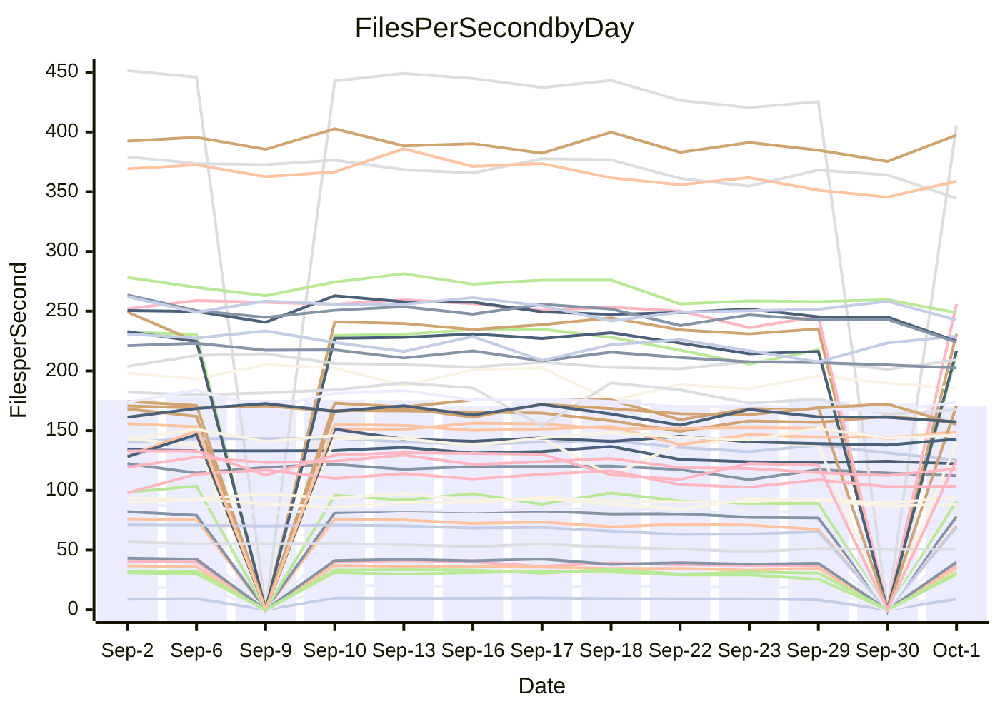

<!---
# This file is auto-generated. Do not edit.
# cspell:disable
--->
# Performance Report

## Daily Performance

## Time to Process Files

| Repository                                      | Elapsed | Min/Avg/Max           |   SD | SD Graph                |
| ----------------------------------------------- | ------: | :-------------------: | ---: | ----------------------- |
| AdaDoom3/AdaDoom3                    |    2.93 | 2.7 /   2.9 /   3.1   | 0.10 | `    ┣━━┻━━╋●━┻━━┫    ` |
| alexiosc/megistos                    |    7.47 | 6.6 /   7.2 /   7.6   | 0.25 | `    ┣━━┻━━╋━━●━━┫    ` |
| apollographql/apollo-server          |    2.23 | 2.0 /   2.1 /   2.3   | 0.06 | `     ┣━┻━━╋━━┻━●     ` |
| aspnetboilerplate/aspnetboilerplate  |   10.70 | 10.5 /  10.8 /  11.6  | 0.28 | `    ┣━━┻━●╋━━┻━━┫    ` |
| aws-amplify/docs                     |   12.60 | 10.7 /  11.2 /  11.8  | 0.33 | `     ┣━┻━━╋━━┻━┫    ●` |
| Azure/azure-rest-api-specs           |   13.95 | 12.9 /  13.8 /  14.8  | 0.52 | `   ┣━━━┻━━╋●━┻━━━┫   ` |
| bitjson/typescript-starter           |    0.64 | 0.6 /   0.6 /   0.7   | 0.03 | `     ┣━━┻━╋●┻━━┫     ` |
| caddyserver/caddy                    |    3.11 | 2.8 /   3.0 /   3.5   | 0.17 | `    ┣━━┻━━╋━●┻━━┫    ` |
| canada-ca/open-source-logiciel-libre |    0.79 | 0.7 /   0.7 /   0.8   | 0.04 | `     ┣━┻━━╋━━●━┫     ` |
| chef/chef                            |    5.24 | 5.1 /   5.4 /   6.0   | 0.23 | `    ┣━━┻●━╋━━┻━━┫    ` |
| dart-lang/sdk                        |   62.63 | 55.6 /  58.1 /  70.4  | 3.12 | `  ┣━━━┻━━━╋━━━┻━●━┫  ` |
| django/django                        |   13.35 | 13.0 /  13.6 /  14.3  | 0.33 | `    ┣━━┻●━╋━━┻━━┫    ` |
| eslint/eslint                        |    9.96 | 8.9 /   9.3 /   9.8   | 0.28 | `    ┣━━┻━━╋━━┻━━┫●   ` |
| exonum/exonum                        |    3.02 | 2.9 /   3.0 /   3.7   | 0.20 | `    ┣━━┻━━●━━┻━━┫    ` |
| flutter/samples                      |   17.03 | 13.7 /  14.6 /  18.4  | 1.23 | `   ┣━━━┻━━╋━━┻━━━●   ` |
| gitbucket/gitbucket                  |    3.28 | 2.8 /   3.0 /   3.1   | 0.09 | `    ┣━━┻━━╋━━┻━━┫   ●` |
| googleapis/google-cloud-cpp          |  134.62 | 129.5 / 136.7 / 145.8 | 3.92 | `  ┣━━━┻━●━╋━━━┻━━━┫  ` |
| graphql/express-graphql              |    0.70 | 0.6 /   0.7 /   0.8   | 0.04 | `     ┣━┻━━╋━●┻━┫     ` |
| graphql/graphql-js                   |    2.12 | 1.9 /   2.1 /   2.2   | 0.08 | `     ┣━┻━━╋━●┻━┫     ` |
| graphql/graphql-relay-js             |    0.70 | 0.6 /   0.7 /   0.7   | 0.03 | `     ┣━┻━━╋●━┻━┫     ` |
| graphql/graphql-spec                 |    1.07 | 0.7 /   0.8 /   0.9   | 0.04 | `       ┣━┻╋┻━┫      ●` |
| iluwatar/java-design-patterns        |   10.75 | 10.3 /  10.8 /  12.5  | 0.50 | `    ┣━━┻━━●━━┻━━┫    ` |
| ktaranov/sqlserver-kit               |    5.86 | 5.6 /   5.9 /   6.1   | 0.14 | `    ┣━━┻━━●━━┻━━┫    ` |
| liriliri/licia                       |    3.50 | 3.1 /   3.2 /   3.4   | 0.08 | `    ┣━━┻━━╋━━┻━━┫   ●` |
| MartinThoma/LaTeX-examples           |    6.49 | 5.9 /   6.2 /   6.6   | 0.19 | `    ┣━━┻━━╋━━┻●━┫    ` |
| mdx-js/mdx                           |    1.58 | 1.4 /   1.5 /   1.8   | 0.09 | `     ┣━┻━━╋━●┻━┫     ` |
| microsoft/TypeScript-Website         |    5.08 | 4.7 /   5.0 /   5.9   | 0.24 | `    ┣━━┻━━╋●━┻━━┫    ` |
| MicrosoftDocs/PowerShell-Docs        |   22.80 | 20.6 /  22.0 /  23.9  | 0.96 | `   ┣━━━┻━━╋━━●━━━┫   ` |
| neovim/nvim-lspconfig                |    2.90 | 2.6 /   2.7 /   2.9   | 0.12 | `    ┣━━┻━━╋━━┻━●┫    ` |
| pagekit/pagekit                      |    3.21 | 3.0 /   3.1 /   3.3   | 0.09 | `    ┣━━┻━━╋━━●━━┫    ` |
| php/php-src                          |   23.53 | 23.5 /  24.5 /  26.1  | 0.67 | `   ┣━●━┻━━╋━━┻━━━┫   ` |
| plasticrake/tplink-smarthome-api     |    0.88 | 0.8 /   0.8 /   0.9   | 0.03 | `     ┣━┻━━╋━●┻━┫     ` |
| prettier/prettier                    |    6.38 | 5.7 /   5.9 /   6.2   | 0.14 | `    ┣━━┻━━╋━━┻━━┫   ●` |
| pycontribs/jira                      |    1.16 | 1.1 /   1.2 /   1.3   | 0.06 | `     ┣━┻━●╋━━┻━┫     ` |
| RustPython/RustPython                |    4.35 | 4.0 /   4.4 /   6.1   | 0.43 | `    ┣━━┻━━●━━┻━━┫    ` |
| shoelace-style/shoelace              |    2.36 | 2.1 /   2.2 /   2.5   | 0.11 | `    ┣━━┻━━╋━━●━━┫    ` |
| SoftwareBrothers/admin-bro           |    2.06 | 1.8 /   1.9 /   2.1   | 0.08 | `     ┣━┻━━╋━━┻●┫     ` |
| sveltejs/svelte                      |   18.76 | 18.2 /  18.9 /  20.3  | 0.52 | `   ┣━━━┻━●╋━━┻━━━┫   ` |
| TheAlgorithms/Python                 |    5.44 | 4.7 /   5.0 /   5.3   | 0.17 | `    ┣━━┻━━╋━━┻━━┫ ●  ` |
| twbs/bootstrap                       |    1.16 | 1.0 /   1.1 /   1.4   | 0.08 | `     ┣━┻━━╋━●┻━┫     ` |
| typescript-cheatsheets/react         |    1.05 | 1.0 /   1.0 /   1.1   | 0.03 | `     ┣━┻━━╋━●┻━┫     ` |
| typescript-eslint/typescript-eslint  |    3.48 | 3.2 /   3.4 /   3.7   | 0.13 | `    ┣━━┻━━╋━●┻━━┫    ` |
| vitest-dev/vitest                    |    7.42 | 6.6 /   7.0 /   7.4   | 0.21 | `    ┣━━┻━━╋━━┻━━┫●   ` |
| w3c/aria-practices                   |    2.75 | 2.5 /   2.7 /   3.0   | 0.12 | `    ┣━━┻━━╋━●┻━━┫    ` |
| w3c/specberus                        |    1.59 | 1.5 /   1.6 /   2.1   | 0.15 | `    ┣━━┻━━●━━┻━━┫    ` |
| webdeveric/webpack-assets-manifest   |    0.64 | 0.6 /   0.6 /   0.7   | 0.04 | `     ┣━┻━━╋●━┻━┫     ` |
| webpack/webpack                      |    4.85 | 4.1 /   4.4 /   4.7   | 0.15 | `    ┣━━┻━━╋━━┻━━┫  ● ` |
| wireapp/wire-desktop                 |    0.85 | 0.7 /   0.8 /   0.9   | 0.04 | `     ┣━┻━━╋━━●━┫     ` |
| wireapp/wire-webapp                  |    7.79 | 7.0 /   7.4 /   8.0   | 0.30 | `    ┣━━┻━━╋━━┻●━┫    ` |

Note:
- Elapsed time is in seconds.

## Files per Second over Time

| Repository                                      | Files |    Sec |    Fps |     Rel | Trend Fps              |    N |
| ----------------------------------------------- | ----: | -----: | -----: | ------: | ---------------------- | ---: |
| AdaDoom3/AdaDoom3                    |   103 |   2.93 |  35.17 |  -1.32% | `▇▆▇█▇▇▆▇▅▇▅▅▅▄▅▆`     |   15 |
| alexiosc/megistos                    |   583 |   7.47 |  78.07 |  -3.74% | `▆▅▆▅▆▆▇▅▄█▅▅▅▄▄▄`     |   15 |
| apollographql/apollo-server          |   250 |   2.23 | 112.29 |  -5.18% | `█▆▇█▇▇▆█▇▇▇▇▇▆▇▄▆▆▅`  |   18 |
| aspnetboilerplate/aspnetboilerplate  |  2739 |  10.70 | 255.93 |   1.11% | `▆▇██▇████▇█▆█▇▆▇▄▆▇`  |   18 |
| aws-amplify/docs                     |  2832 |  12.60 | 224.85 | -10.83% | `▄█▆▄██▇▇▆▇█▅▇▆▅▆▆▅▅▂` |   19 |
| Azure/azure-rest-api-specs           |  2426 |  13.95 | 173.86 |  -0.79% | `▇▅█▅█▆▇█▇▅▆▆▆▆▆▄▅▅▄▆` |   19 |
| bitjson/typescript-starter           |    20 |   0.64 |  31.32 |  -2.46% | `▆▇▇████▇▅▅█▃▅▆▅▅`     |   15 |
| caddyserver/caddy                    |   276 |   3.11 |  88.64 |  -3.64% | `█▆▇█▆███▇▇▄▇▆▅▃▆▆▆▅▅` |   19 |
| canada-ca/open-source-logiciel-libre |     7 |   0.79 |   8.90 |  -5.83% | `▅▆██▇▇▇▇██▆▆▅▆▃▅`     |   15 |
| chef/chef                            |  1201 |   5.24 | 229.16 |   2.98% | `▇█▇█▆▇▅▅▆▇█▃▅▆▇▇▆▄▆▇` |   19 |
| dart-lang/sdk                        |  9723 |  62.63 | 155.24 |  -7.25% | `█▇▇█▇▇█▇██▃▇█▇▆▇▆▇█▅` |   19 |
| django/django                        |  2792 |  13.35 | 209.19 |   1.78% | `▇▅██▇▆▇▆▆▇▄█▆▆▆▅▇▇▆▇` |   19 |
| eslint/eslint                        |  2016 |   9.96 | 202.44 |  -5.35% | `█▇█▇▆█▅▇▇▆█▆▄▇▅▆▅▅▅▄` |   19 |
| exonum/exonum                        |   421 |   3.02 | 139.61 |   0.06% | `▇▇▇▇█▇█▆█▇▂▇▇▇▇▇`     |   15 |
| flutter/samples                      |  2850 |  17.03 | 167.39 |  -6.75% | `█▇▇▇█▇███▇█▅▂█▇█▆▆▅▅` |   19 |
| gitbucket/gitbucket                  |   411 |   3.28 | 125.40 | -10.02% | `▇▇████▇▇▇▅▇▇▇▇▅▇▅▆▄▃` |   19 |
| googleapis/google-cloud-cpp          | 19694 | 134.62 | 146.29 |   1.72% | `▆▆█▅▆▇▆▆▅▄▄▆▇▇▆▆▆█▆▇` |   19 |
| graphql/express-graphql              |    26 |   0.70 |  37.27 |  -4.36% | `█▇▆███▇█▇▃▇▆▅▅▅▅`     |   15 |
| graphql/graphql-js                   |   333 |   2.12 | 156.93 |  -3.26% | `▇▆▇▇▅█▇▇▆▇▆▅▃▃▅▅▆▅`   |   17 |
| graphql/graphql-relay-js             |    28 |   0.70 |  39.96 |  -2.28% | `█▇█▄▆█▇▅█▆▄▅▅▄▄▅`     |   15 |
| graphql/graphql-spec                 |    15 |   1.07 |  13.99 | -28.00% | `▃▇██▇█▇▇█▆▆▆▆▅▅ `     |   15 |
| iluwatar/java-design-patterns        |  1838 |  10.75 | 170.99 |  -0.09% | `▇▇▇▇▇▆█▇███▇▃▆▇▇`     |   15 |
| ktaranov/sqlserver-kit               |   489 |   5.86 |  83.49 |  -0.14% | `██▅▆▆▆▇▆▆▅▇▇▅▆▅▆▆`    |   16 |
| liriliri/licia                       |  1421 |   3.50 | 405.76 |  -7.59% | `█▇▇▇█▇▇▇▇▆▇▅▆▅▅▃`     |   15 |
| MartinThoma/LaTeX-examples           |  1407 |   6.49 | 216.91 |  -4.12% | `▇▆▆▇▆▇▇▇█▄▇▆▅▄▄▄`     |   15 |
| mdx-js/mdx                           |   144 |   1.58 |  90.96 |  -3.53% | `▇▇█▆▆▄▆▆▇▆▆▃▇▅▅▄▄▅`   |   17 |
| microsoft/TypeScript-Website         |   758 |   5.08 | 149.19 |  -1.22% | `▃▆▇▆▆▇▇██▇█▇▇▆▇▇▅▆`   |   17 |
| MicrosoftDocs/PowerShell-Docs        |  2692 |  22.80 | 118.05 |  -3.40% | `▇▃▇▆▇▆██▆▆▆▆▇▇▆▅▅▄▃▅` |   19 |
| neovim/nvim-lspconfig                |   355 |   2.90 | 122.36 |  -6.74% | `▇▇▇▇▇▇██▇█▄▇▆█▆▄▄▄▄▄` |   19 |
| pagekit/pagekit                      |   741 |   3.21 | 230.90 |  -2.73% | `█▄█▆▇▆▅▇▆▇▇▆▆▅▆▅`     |   15 |
| php/php-src                          |  2211 |  23.53 |  93.96 |   4.05% | `▅▇█▆▄▅▅▇▇▆▆██▇▆▇▇▇▆█` |   19 |
| plasticrake/tplink-smarthome-api     |    62 |   0.88 |  70.29 |  -3.92% | `▇▇▇██▆▇▅▆▇▄▅▆▅▃▅`     |   15 |
| prettier/prettier                    |  2196 |   6.38 | 344.36 |  -7.02% | `██▇▇▇▇▇▆▅▇█▇▇▆▅▅▆▆▄`  |   18 |
| pycontribs/jira                      |    80 |   1.16 |  69.02 |   1.03% | `███▇█▇█▇█▆▆█▆▆▃▅▅▇`   |   17 |
| RustPython/RustPython                |   621 |   4.35 | 142.88 |   0.78% | `█▂▇███▆▆█▆▇▇▇▇▇▆▆▆▇`  |   18 |
| shoelace-style/shoelace              |   437 |   2.36 | 185.35 |  -4.87% | `▇▆█▇█▇▃█▇▇▇█▃▆▅▅▆▅▅`  |   18 |
| SoftwareBrothers/admin-bro           |   441 |   2.06 | 214.10 |  -5.92% | `▇▇▇▇▇█▆▇███▇▅▅▃▅▅`    |   16 |
| sveltejs/svelte                      |  7455 |  18.76 | 397.41 |   2.03% | `▇▇▇▆██▇▆▇▇▆█▄█▅▇▇▆▅▇` |   19 |
| TheAlgorithms/Python                 |  1352 |   5.44 | 248.67 |  -7.98% | `█▆▆▅▆▇▇█▆▇▆▇▇▇▄▄▄▄▅▃` |   19 |
| twbs/bootstrap                       |   120 |   1.16 | 103.52 |  -5.05% | `▂▆▇█▇▆▇█▇▇▅█▇█▆▅▅▆▅▅` |   19 |
| typescript-cheatsheets/react         |    53 |   1.05 |  50.63 |  -2.80% | `▇▆▇▅▇█▅▇▆▇▆▅▅▄▅▅`     |   15 |
| typescript-eslint/typescript-eslint  |  1247 |   3.48 | 358.65 |  -2.25% | `▆▆▆▅▅▇▇███▃▆▇▅▅▅▅▄▄▅` |   19 |
| vitest-dev/vitest                    |  1801 |   7.42 | 242.58 |  -4.93% | `▇█▅▇█▄▇▅▇▆█▆▆▄▅▅▅▆▇▄` |   19 |
| w3c/aria-practices                   |   403 |   2.75 | 146.29 |  -2.60% | `▇█▇█▇▇█▇▅▇█▆▇▃▅▆▅▅▆`  |   18 |
| w3c/specberus                        |   200 |   1.59 | 125.59 |  -0.09% | `█▇█▅▇▇▇█▇█▇█▆▅▂▆▆▆▇`  |   18 |
| webdeveric/webpack-assets-manifest   |    19 |   0.64 |  29.72 |  -2.02% | `▇▆▇▇▄█▇▇██▇▆▅▅▃▆`     |   15 |
| webpack/webpack                      |  1086 |   4.85 | 224.03 | -10.30% | `██▆▅▆▆▇▆▇▆▄▇▇▆▃▆▆▅▅▃` |   19 |
| wireapp/wire-desktop                 |    43 |   0.85 |  50.58 |  -5.60% | `█▇▇▇▇▇▆▇▃▇▆▇▇▅▅▄▃▅▄▄` |   19 |
| wireapp/wire-webapp                  |  1227 |   7.79 | 157.44 |  -4.56% | `▇▄▇█▅▇█▇▅▆▆█▇▆▄▄▇▅▅▅` |   19 |

## Data Throughput

| Repository                                      | Files |    Sec |     Kps |     Rel | Trend Kps              |    N |
| ----------------------------------------------- | ----: | -----: | ------: | ------: | ---------------------- | ---: |
| AdaDoom3/AdaDoom3                    |   103 |   2.93 |  747.41 |  -1.32% | `▇▆▇█▇▇▆▇▅▇▅▅▅▄▅▆`     |   15 |
| alexiosc/megistos                    |   583 |   7.47 |  613.47 |  -3.74% | `▆▅▆▅▆▆▇▅▄█▅▅▅▄▄▄`     |   15 |
| apollographql/apollo-server          |   250 |   2.23 |  889.82 |  -5.18% | `█▆▇█▇▇▆█▇▇▇▇▇▆▇▄▆▆▅`  |   18 |
| aspnetboilerplate/aspnetboilerplate  |  2739 |  10.70 |  595.02 |  -0.77% | `▆▇██▇████▇█▆█▇▆▇▄▅▇`  |   18 |
| aws-amplify/docs                     |  2832 |  12.60 |  750.61 | -10.42% | `▄█▆▄██▇▇▆▇█▅▇▆▅▆▆▅▅▂` |   19 |
| Azure/azure-rest-api-specs           |  2426 |  13.95 |  496.42 |  -0.56% | `▇▅█▅█▆▇█▇▅▆▇▆▆▆▄▅▅▄▆` |   19 |
| bitjson/typescript-starter           |    20 |   0.64 |  125.26 |  -2.46% | `▆▇▇████▇▅▅█▃▅▆▅▅`     |   15 |
| caddyserver/caddy                    |   276 |   3.11 |  721.64 |  -3.40% | `█▅▇█▆███▇▇▄▇▆▆▃▆▇▆▅▆` |   19 |
| canada-ca/open-source-logiciel-libre |     7 |   0.79 |   73.78 |  -5.83% | `▅▆██▇▇▇▇██▆▆▅▆▃▅`     |   15 |
| chef/chef                            |  1201 |   5.24 | 1051.55 |   2.63% | `▇█▇█▆▇▆▆▆▇█▃▅▆▇▇▆▄▆▇` |   19 |
| dart-lang/sdk                        |  9723 |  62.63 | 1122.60 |  -7.49% | `█▇▇█▇▇█▇██▃▇█▇▆▇▆▇█▅` |   19 |
| django/django                        |  2792 |  13.35 | 1280.24 |   1.95% | `▇▅██▇▆▇▆▆▇▄█▆▆▆▅▇▇▆▇` |   19 |
| eslint/eslint                        |  2016 |   9.96 | 1652.77 |  -5.48% | `█▇█▇▇█▅▇▇▇█▆▅▇▆▇▅▅▅▄` |   19 |
| exonum/exonum                        |   421 |   3.02 | 1335.41 |   0.06% | `▇▇▇▇█▇█▆█▇▂▇▇▇▇▇`     |   15 |
| flutter/samples                      |  2850 |  17.03 | 1298.16 |  -3.77% | `█▇▇▇█▇███▇█▅▂█▇█▆▆▆▆` |   19 |
| gitbucket/gitbucket                  |   411 |   3.28 |  566.60 | -10.02% | `▇▇████▇▇▇▅▇▇▇▇▅▇▅▆▄▃` |   19 |
| googleapis/google-cloud-cpp          | 19694 | 134.62 | 1044.24 |   1.74% | `▆▆█▅▆▇▆▆▅▄▄▆▆▇▆▆▆█▆▇` |   19 |
| graphql/express-graphql              |    26 |   0.70 |  170.58 |  -4.36% | `█▇▆███▇█▇▃▇▆▅▅▅▅`     |   15 |
| graphql/graphql-js                   |   333 |   2.12 |  894.90 |  -3.07% | `▇▆▇▇▅█▇▇▆▇▆▅▃▃▅▅▆▅`   |   17 |
| graphql/graphql-relay-js             |    28 |   0.70 |  157.00 |  -2.28% | `█▇█▄▆█▇▅█▆▄▅▅▄▄▅`     |   15 |
| graphql/graphql-spec                 |    15 |   1.07 |  513.83 | -28.00% | `▃▇██▇█▇▇█▆▆▆▆▅▅ `     |   15 |
| iluwatar/java-design-patterns        |  1838 |  10.75 |  526.19 |  -0.09% | `▇▇▇▇▇▆█▇███▇▃▆▇▇`     |   15 |
| ktaranov/sqlserver-kit               |   489 |   5.86 | 1262.95 |  -0.14% | `██▅▆▆▆▇▆▆▅▇▇▅▆▅▆▆`    |   16 |
| liriliri/licia                       |  1421 |   3.50 |  478.29 |  -7.50% | `█▇▇▇█▇▇▇▇▆▇▅▆▅▅▃`     |   15 |
| MartinThoma/LaTeX-examples           |  1407 |   6.49 |  448.31 |  -4.12% | `▇▆▆▇▆▇▇▇█▄▇▆▅▄▄▄`     |   15 |
| mdx-js/mdx                           |   144 |   1.58 |  416.89 |  -3.28% | `▇▇█▆▆▄▆▆▇▆▆▃▇▅▅▄▄▅`   |   17 |
| microsoft/TypeScript-Website         |   758 |   5.08 | 1020.89 |  -1.31% | `▃▆▇▆▆▇▇██▇█▇▇▆▇▇▅▆`   |   17 |
| MicrosoftDocs/PowerShell-Docs        |  2692 |  22.80 | 1206.18 |  -3.45% | `▇▃▇▆▇▆██▆▆▆▆▇▇▆▅▅▄▃▅` |   19 |
| neovim/nvim-lspconfig                |   355 |   2.90 |  320.19 |  -7.19% | `█▇▇▇█▇██▇█▄▇▆█▆▄▄▄▄▄` |   19 |
| pagekit/pagekit                      |   741 |   3.21 |  481.42 |  -2.73% | `█▄█▆▇▆▅▇▆▇▇▆▆▅▆▅`     |   15 |
| php/php-src                          |  2211 |  23.53 | 1371.84 |   4.12% | `▅▇█▆▄▅▅▇▇▆▆██▇▆▇▇▇▆█` |   19 |
| plasticrake/tplink-smarthome-api     |    62 |   0.88 |  379.81 |  -3.92% | `▇▇▇██▆▇▅▆▇▄▅▆▅▃▅`     |   15 |
| prettier/prettier                    |  2196 |   6.38 |  480.16 |  -6.98% | `██▇▇▇▇▇▆▅▇█▇▇▆▅▅▆▆▄`  |   18 |
| pycontribs/jira                      |    80 |   1.16 |  475.34 |   1.02% | `███▇█▇█▇█▆▆█▆▆▃▅▅▇`   |   17 |
| RustPython/RustPython                |   621 |   4.35 | 1051.67 |   1.06% | `█▂▇███▆▆█▆▇▇▇▇▇▇▆▆▇`  |   18 |
| shoelace-style/shoelace              |   437 |   2.36 |  880.52 |  -4.27% | `▇▆█▇▇▇▃█▇▇▇█▃▆▅▅▇▆▅`  |   18 |
| SoftwareBrothers/admin-bro           |   441 |   2.06 |  471.88 |  -6.02% | `▇▇▇▇▇█▆▇███▇▅▅▃▅▅`    |   16 |
| sveltejs/svelte                      |  7455 |  18.76 |  286.37 |   1.75% | `▇▇▇▆██▇▆▇▇▆█▄█▅▇▇▆▅▇` |   19 |
| TheAlgorithms/Python                 |  1352 |   5.44 |  628.49 |  -8.26% | `█▇▆▅▆▇▇█▆▇▆▇▇▇▄▄▄▄▄▃` |   19 |
| twbs/bootstrap                       |   120 |   1.16 |  828.98 |  -5.05% | `▂▆▇█▇▆▇█▇▇▅█▇█▆▅▅▆▅▅` |   19 |
| typescript-cheatsheets/react         |    53 |   1.05 |  369.67 |  -2.80% | `▇▆▇▅▇█▅▇▆▇▆▅▅▄▅▅`     |   15 |
| typescript-eslint/typescript-eslint  |  1247 |   3.48 | 1668.99 |  -1.60% | `▆▆▆▅▅▇▇███▃▆▇▅▅▅▅▅▄▅` |   19 |
| vitest-dev/vitest                    |  1801 |   7.42 |  494.19 |  -5.74% | `▇█▅▇█▄▇▅▇▆█▆▆▄▅▅▅▅▆▄` |   19 |
| w3c/aria-practices                   |   403 |   2.75 | 1363.84 |  -2.40% | `▇█▇█▇▇▇▇▅▇█▆▇▃▅▆▅▅▆`  |   18 |
| w3c/specberus                        |   200 |   1.59 |  400.62 |  -0.09% | `█▇█▅▇▇▇█▇█▇█▆▅▂▆▆▆▇`  |   18 |
| webdeveric/webpack-assets-manifest   |    19 |   0.64 |  159.54 |  -2.02% | `▇▆▇▇▄█▇▇██▇▆▅▅▃▆`     |   15 |
| webpack/webpack                      |  1086 |   4.85 |  974.10 | -10.20% | `██▆▅▆▆▇▆▇▆▄▇▇▆▃▆▆▅▅▃` |   19 |
| wireapp/wire-desktop                 |    43 |   0.85 |  222.33 |  -5.57% | `█▇▇▇▇█▆▇▃▇▆▇▇▅▅▄▃▅▄▄` |   19 |
| wireapp/wire-webapp                  |  1227 |   7.79 |  666.20 |  -4.64% | `▇▄▇█▅▇█▇▅▆▆█▇▆▄▄▇▅▅▅` |   19 |

