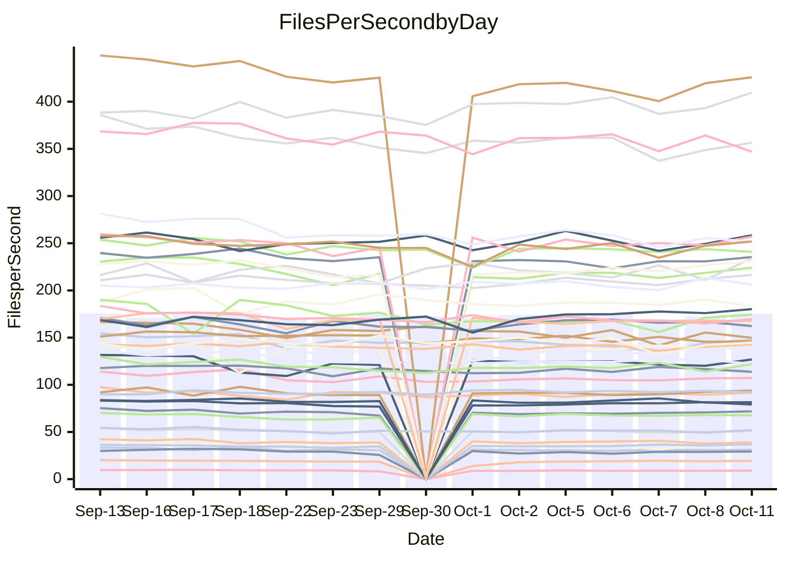

<!---
# This file is auto-generated. Do not edit.
# cspell:disable
--->
# Performance Report

## Daily Performance

## Time to Process Files

| Repository                                      | Elapsed | Min/Avg/Max           |   SD | SD Graph                |
| ----------------------------------------------- | ------: | :-------------------: | ---: | ----------------------- |
| AdaDoom3/AdaDoom3                    |    2.79 | 2.8 /   2.9 /   3.1   | 0.09 | `    ┣━●┻━━╋━━┻━━┫    ` |
| alexiosc/megistos                    |    7.37 | 6.6 /   7.3 /   7.7   | 0.24 | `    ┣━━┻━━╋●━┻━━┫    ` |
| apollographql/apollo-server          |    2.39 | 2.1 /   2.1 /   2.3   | 0.07 | `     ┣━┻━━╋━━┻━┫    ●` |
| aspnetboilerplate/aspnetboilerplate  |   10.64 | 10.5 /  10.9 /  12.0  | 0.34 | `    ┣━━●━━╋━━┻━━┫    ` |
| aws-amplify/docs                     |   11.34 | 10.8 /  11.4 /  12.6  | 0.37 | `    ┣━━┻━━●━━┻━━┫    ` |
| Azure/azure-rest-api-specs           |   14.91 | 13.0 /  14.1 /  15.6  | 0.60 | `   ┣━━━┻━━╋━━┻●━━┫   ` |
| bitjson/typescript-starter           |    0.64 | 0.6 /   0.6 /   0.7   | 0.03 | `     ┣━━┻●╋━┻━━┫     ` |
| caddyserver/caddy                    |    2.93 | 2.8 /   3.1 /   3.5   | 0.15 | `    ┣━━●━━╋━━┻━━┫    ` |
| canada-ca/open-source-logiciel-libre |    0.75 | 0.7 /   0.8 /   0.9   | 0.05 | `     ┣━┻━●╋━━┻━┫     ` |
| chef/chef                            |    5.00 | 5.1 /   5.5 /   6.0   | 0.23 | `    ●━━┻━━╋━━┻━━┫    ` |
| dart-lang/sdk                        |   54.03 | 54.0 /  57.2 /  70.4  | 3.24 | `  ┣━━━●━━━╋━━━┻━━━┫  ` |
| django/django                        |   13.38 | 12.9 /  13.6 /  14.3  | 0.30 | `    ┣━━┻●━╋━━┻━━┫    ` |
| eslint/eslint                        |    9.33 | 9.1 /   9.5 /  10.0   | 0.23 | `    ┣━━●━━╋━━┻━━┫    ` |
| exonum/exonum                        |    2.95 | 2.9 /   3.0 /   3.7   | 0.16 | `    ┣━━┻●━╋━━┻━━┫    ` |
| flutter/samples                      |   16.35 | 13.7 /  16.0 /  18.4  | 1.52 | `   ┣━━━┻━━╋●━┻━━━┫   ` |
| gitbucket/gitbucket                  |    2.93 | 2.9 /   3.0 /   3.3   | 0.10 | `    ┣━━●━━╋━━┻━━┫    ` |
| googleapis/google-cloud-cpp          |  135.73 | 129.1 / 136.4 / 149.4 | 4.52 | `  ┣━━━┻━━●╋━━━┻━━━┫  ` |
| graphql/express-graphql              |    0.77 | 0.6 /   0.7 /   0.8   | 0.04 | `     ┣━┻━━╋━━┻━●     ` |
| graphql/graphql-js                   |    2.19 | 1.9 /   2.1 /   2.4   | 0.11 | `    ┣━━┻━━╋━●┻━━┫    ` |
| graphql/graphql-relay-js             |    0.71 | 0.6 /   0.7 /   0.8   | 0.03 | `     ┣━┻━━●━━┻━┫     ` |
| graphql/graphql-spec                 |    0.78 | 0.7 /   0.8 /   1.1   | 0.06 | `     ┣━┻━●╋━━┻━┫     ` |
| iluwatar/java-design-patterns        |   11.00 | 10.3 /  10.9 /  12.5  | 0.41 | `    ┣━━┻━━╋●━┻━━┫    ` |
| ktaranov/sqlserver-kit               |    6.29 | 5.7 /   5.9 /   6.4   | 0.17 | `    ┣━━┻━━╋━━┻━━●    ` |
| liriliri/licia                       |    3.36 | 3.1 /   3.3 /   3.5   | 0.11 | `    ┣━━┻━━●━━┻━━┫    ` |
| MartinThoma/LaTeX-examples           |    6.03 | 5.9 /   6.3 /   7.0   | 0.25 | `    ┣━━●━━╋━━┻━━┫    ` |
| mdx-js/mdx                           |    1.57 | 1.4 /   1.6 /   1.8   | 0.06 | `     ┣━┻━━●━━┻━┫     ` |
| microsoft/TypeScript-Website         |    5.07 | 4.7 /   5.1 /   5.5   | 0.20 | `    ┣━━┻━━●━━┻━━┫    ` |
| MicrosoftDocs/PowerShell-Docs        |   22.16 | 20.6 /  22.4 /  24.1  | 0.87 | `   ┣━━━┻━●╋━━┻━━━┫   ` |
| neovim/nvim-lspconfig                |    3.04 | 2.6 /   2.8 /   3.0   | 0.12 | `    ┣━━┻━━╋━━┻━━●    ` |
| pagekit/pagekit                      |    3.16 | 3.0 /   3.2 /   3.5   | 0.09 | `    ┣━━┻━●╋━━┻━━┫    ` |
| php/php-src                          |   23.09 | 23.1 /  24.0 /  25.2  | 0.58 | `   ┣●━━┻━━╋━━┻━━━┫   ` |
| plasticrake/tplink-smarthome-api     |    0.86 | 0.8 /   0.9 /   0.9   | 0.03 | `     ┣━┻━●╋━━┻━┫     ` |
| prettier/prettier                    |    7.03 | 5.7 /   6.0 /   6.4   | 0.16 | `       ┣┻━╋━┻┫      ●` |
| pycontribs/jira                      |    1.21 | 1.1 /   1.2 /   1.3   | 0.05 | `     ┣━┻━━╋●━┻━┫     ` |
| RustPython/RustPython                |    4.38 | 4.1 /   4.4 /   4.9   | 0.15 | `    ┣━━┻━━●━━┻━━┫    ` |
| shoelace-style/shoelace              |    2.34 | 2.1 /   2.3 /   2.5   | 0.11 | `    ┣━━┻━━╋●━┻━━┫    ` |
| SoftwareBrothers/admin-bro           |    1.92 | 1.8 /   2.0 /   2.2   | 0.08 | `     ┣━●━━╋━━┻━┫     ` |
| sveltejs/svelte                      |   18.40 | 18.1 /  18.9 /  20.3  | 0.51 | `   ┣━━━●━━╋━━┻━━━┫   ` |
| TheAlgorithms/Python                 |    4.98 | 4.7 /   5.2 /   6.2   | 0.29 | `    ┣━━┻●━╋━━┻━━┫    ` |
| twbs/bootstrap                       |    1.16 | 1.0 /   1.1 /   1.2   | 0.04 | `     ┣━┻━━╋━●┻━┫     ` |
| typescript-cheatsheets/react         |    1.08 | 1.0 /   1.0 /   1.2   | 0.04 | `     ┣━┻━━╋━━●━┫     ` |
| typescript-eslint/typescript-eslint  |    3.65 | 3.2 /   3.4 /   3.7   | 0.13 | `    ┣━━┻━━╋━━┻●━┫    ` |
| vitest-dev/vitest                    |    6.92 | 6.7 /   7.1 /   7.4   | 0.20 | `    ┣━━┻●━╋━━┻━━┫    ` |
| w3c/aria-practices                   |    2.76 | 2.6 /   2.8 /   3.0   | 0.11 | `    ┣━━┻━━●━━┻━━┫    ` |
| w3c/specberus                        |    1.60 | 1.5 /   1.6 /   2.1   | 0.11 | `     ┣━┻━━●━━┻━┫     ` |
| webdeveric/webpack-assets-manifest   |    0.64 | 0.6 /   0.7 /   0.8   | 0.05 | `     ┣━┻━●╋━━┻━┫     ` |
| webpack/webpack                      |    4.56 | 4.2 /   4.4 /   4.8   | 0.17 | `    ┣━━┻━━╋━●┻━━┫    ` |
| wireapp/wire-desktop                 |    0.82 | 0.8 /   0.8 /   0.9   | 0.03 | `     ┣━┻━●╋━━┻━┫     ` |
| wireapp/wire-webapp                  |    7.93 | 6.9 /   7.4 /   8.0   | 0.26 | `    ┣━━┻━━╋━━┻━━●    ` |

Note:
- Elapsed time is in seconds.

## Files per Second over Time

| Repository                                      | Files |    Sec |    Fps |     Rel | Trend Fps              |    N |
| ----------------------------------------------- | ----: | -----: | -----: | ------: | ---------------------- | ---: |
| AdaDoom3/AdaDoom3                    |   103 |   2.79 |  36.97 |   4.55% | `▆▅▄▆▆▇▅▆▅▆▇▅▅██▇▇███` |   26 |
| alexiosc/megistos                    |   583 |   7.37 |  79.09 |  -1.41% | `▆▆▅▄▅▆▆▄▆▆▅▆▇▅▆▅█▆▅▆` |   26 |
| apollographql/apollo-server          |   250 |   2.39 | 104.67 | -10.19% | `█▅▇▆▆▄█▆█▇▇▆▇▅█▇▇▇█▃` |   28 |
| aspnetboilerplate/aspnetboilerplate  |  2739 |  10.64 | 257.38 |   2.71% | `▆▇▅▆█▆▇▄▇▇█▆▆▇▇▆▇█▇█` |   27 |
| aws-amplify/docs                     |  2832 |  11.34 | 249.70 |   0.42% | `██▇▇▄█▇▇▆▆██▇▇▅▇▇▇█▇` |   28 |
| Azure/azure-rest-api-specs           |  2429 |  14.91 | 162.88 |  -5.08% | `▅▇▆▆▇█▄▅▆█▇▆▆▆▆▇▄█▆▅` |   28 |
| bitjson/typescript-starter           |    20 |   0.64 |  31.46 |   0.89% | `▅▇█▇█▇▇▇█▇▅█▆▄█▆█▇██` |   26 |
| caddyserver/caddy                    |   277 |   2.93 |  94.49 |   4.74% | `▇▇▇▆▆▇▆▇▆▆▄▆▆█▇▆▇▆██` |   28 |
| canada-ca/open-source-logiciel-libre |     7 |   0.75 |   9.31 |   1.65% | `█▆▇▄▆▇▃▇██▆▄▆▇▆▇▅█▆▇` |   26 |
| chef/chef                            |  1201 |   5.00 | 240.24 |   9.23% | `▆▅▄▆▇▇▆▄▆▅▅▄▆▄▆▃▆▇▇█` |   28 |
| dart-lang/sdk                        |  9757 |  54.03 | 180.57 |   6.02% | `▆▆▇▇▅▅▇▇█▇▆▇▇▇██▇███` |   28 |
| django/django                        |  2792 |  13.38 | 208.70 |   1.37% | `▅▇▇▅▇▇▆▇▇▇▇▆▅▆▅█▇▆▆▇` |   28 |
| eslint/eslint                        |  2016 |   9.33 | 216.16 |   2.58% | `▇▆▆▅▅▇▅▆▇▇▇▇▇▅▆▇▇███` |   28 |
| exonum/exonum                        |   421 |   2.95 | 142.52 |   2.71% | `▇▇█▇▇▇█▇▇▇▇▆█▇██▇███` |   26 |
| flutter/samples                      |  2850 |  16.35 | 174.32 |   0.89% | `█▆▇▅▆▆▅▆▆▆▅▅▆▆▄▇▅▇▆▇` |   28 |
| gitbucket/gitbucket                  |   411 |   2.93 | 140.33 |   3.12% | `▇▆▇▅▄▅▅▆▆▇█▆▄▇▆█▇▆▆█` |   28 |
| googleapis/google-cloud-cpp          | 19680 | 135.73 | 144.99 |   0.35% | `▆▆█▆▇█▇▇▆▇▆▇▇█▃▆▆▆▆▆` |   28 |
| graphql/express-graphql              |    26 |   0.77 |  33.70 | -10.01% | `█▇▇▇▇▇▇▇▇█▇▅▇▆▃▇▇██▅` |   26 |
| graphql/graphql-js                   |   333 |   2.19 | 151.83 |  -3.24% | `▅▇▇█▇▆█▆▆▆▄█▇▇▄▇▆▃▇▆` |   28 |
| graphql/graphql-relay-js             |    28 |   0.71 |  39.31 |  -0.86% | `▇▇▆▇██▇▃▇█▆▇▇██▆▅▆▇▇` |   26 |
| graphql/graphql-spec                 |    15 |   0.78 |  19.15 |   1.55% | `▇▇▇▇▂▇▇▅▇▆███▆█▇▇███` |   26 |
| iluwatar/java-design-patterns        |  1838 |  11.00 | 167.13 |  -0.85% | `█▃███▇▇▇▆▇█▇██▇█▇▇█▇` |   26 |
| ktaranov/sqlserver-kit               |   489 |   6.29 |  77.78 |  -5.92% | `▆▇▆▇▇▇▇▅▄▇▇▇▇██▇▅▇█▅` |   26 |
| liriliri/licia                       |  1421 |   3.36 | 423.46 |  -0.39% | `▇█▇▇▅▆▇▇▇▆▇▅▇▅▅▇▇██▇` |   26 |
| MartinThoma/LaTeX-examples           |  1407 |   6.03 | 233.18 |   4.26% | `▇▆▅▆▆▃█▇▆▅▇▆▇▇▆█▆█▇█` |   26 |
| mdx-js/mdx                           |   144 |   1.57 |  91.58 |  -0.41% | `▆▆▆▆▆▇▆▇▆▆▇▆▅▆▆▇▆▇█▆` |   27 |
| microsoft/TypeScript-Website         |   758 |   5.07 | 149.38 |  -0.49% | `▆▇▇▅▆▇▇▄▇█▆▅▄▇▇▇▄▄▆▆` |   28 |
| MicrosoftDocs/PowerShell-Docs        |  2692 |  22.16 | 121.49 |   1.20% | `▆▆▅▄▆▆▅▆▅█▆▅▇▆█▄▅▆█▇` |   28 |
| neovim/nvim-lspconfig                |   361 |   3.04 | 118.62 |  -6.76% | `▆▆▆▆▆▇▆▇█▅▇▇▅▇▇▆█▆▇▄` |   28 |
| pagekit/pagekit                      |   741 |   3.16 | 234.77 |   0.75% | `██▇█▇█▇▇██▅▆▇▄▇▇▇███` |   26 |
| php/php-src                          |  2211 |  23.09 |  95.77 |   4.07% | `▆▆▇▅▇▇█▇▅█▆▇▆█▇█▆▆▅█` |   28 |
| plasticrake/tplink-smarthome-api     |    62 |   0.86 |  72.10 |   1.71% | `▇█▇▅▇▆▅▇▆▇▇▆▆▆▇▆██▇█` |   26 |
| prettier/prettier                    |  2197 |   7.03 | 312.65 | -14.07% | `▆▆█▇▅█▇▅▇▇▇█▇▇▅█▆█▇▁` |   27 |
| pycontribs/jira                      |    80 |   1.21 |  65.91 |  -2.40% | `▇▃▅▆█▇▅████▇▆█▇▇██▇▆` |   26 |
| RustPython/RustPython                |   621 |   4.38 | 141.71 |   0.37% | `█▇▇▆██▇▃▆█▇▇▇█▆█▆█▇▇` |   28 |
| shoelace-style/shoelace              |   437 |   2.34 | 186.39 |  -1.38% | `▆▆█▇▆▄▆▇▆▇▆▆▇▆▆█▆▇▄▆` |   28 |
| SoftwareBrothers/admin-bro           |   441 |   1.92 | 229.61 |   3.96% | `▆▆▄▆▅▇▄▄▅▆▇▆▅▇▅▆▇▇▆█` |   26 |
| sveltejs/svelte                      |  7490 |  18.40 | 407.03 |   3.38% | `▆▆▅▅▇█▅▇▆▇▇▇▇█▆▆▇█▇▇` |   28 |
| TheAlgorithms/Python                 |  1355 |   4.98 | 272.33 |   4.12% | `▇▇▇▇▆▅█▇▇██▇▆▇▅▆▆▇▃█` |   28 |
| twbs/bootstrap                       |   120 |   1.16 | 103.68 |  -3.76% | `▅▅█▅▅▇▆▆▇▇▆▆▅▇▆▆▇█▇▅` |   28 |
| typescript-cheatsheets/react         |    53 |   1.08 |  48.98 |  -4.30% | `▇▇▆▇▇██▄████▇█▆▆▇██▆` |   26 |
| typescript-eslint/typescript-eslint  |  1248 |   3.65 | 342.13 |  -5.38% | `▇▇▆▅▇▆▇▆█▆▇█▇▆▄▆▅█▆▅` |   28 |
| vitest-dev/vitest                    |  1800 |   6.92 | 260.11 |   2.54% | `▅▅▅▆▄▆▅▄▆█▇▅▆▅▄▅▅▆▆▇` |   28 |
| w3c/aria-practices                   |   403 |   2.76 | 146.21 |   0.29% | `▆▇▇▇▇█▇▇█▄▆▆▅▆▄▆▇█▇▇` |   28 |
| w3c/specberus                        |   200 |   1.60 | 124.78 |   0.38% | `▂▇▇▇███▆▇▇██▇▇▇▇▆██▇` |   27 |
| webdeveric/webpack-assets-manifest   |    19 |   0.64 |  29.62 |   2.01% | `███▄█▃▇▇▇▇██▆▃▇▇▇███` |   26 |
| webpack/webpack                      |  1086 |   4.56 | 237.92 |  -2.83% | `▇▇▆▆▄█▄▇▇▅█▆▆▇▆▆▇█▅▆` |   28 |
| wireapp/wire-desktop                 |    43 |   0.82 |  52.46 |   1.59% | `▇▅▇▇▇▇▄▇▇█▇▇▇█▇▆▆▇██` |   28 |
| wireapp/wire-webapp                  |  1227 |   7.93 | 154.64 |  -6.51% | `▄▆▅▅▄▅▅▆▇▇▅▆█▅▆▆▆▇▅▄` |   28 |

## Data Throughput

| Repository                                      | Files |    Sec |     Kps |     Rel | Trend Kps              |    N |
| ----------------------------------------------- | ----: | -----: | ------: | ------: | ---------------------- | ---: |
| AdaDoom3/AdaDoom3                    |   103 |   2.79 |  785.61 |   4.55% | `▆▅▄▆▆▇▅▆▅▆▇▅▅██▇▇███` |   26 |
| alexiosc/megistos                    |   583 |   7.37 |  621.48 |  -1.41% | `▆▆▅▄▅▆▆▄▆▆▅▆▇▅▆▅█▆▅▆` |   26 |
| apollographql/apollo-server          |   250 |   2.39 |  829.41 | -10.19% | `█▅▇▆▆▄█▆█▇▇▆▇▅█▇▇▇█▃` |   28 |
| aspnetboilerplate/aspnetboilerplate  |  2739 |  10.64 |  598.39 |   1.90% | `▇█▅▆█▆▇▄▇▇█▆▆▇▇▆▇█▇█` |   27 |
| aws-amplify/docs                     |  2832 |  11.34 |  833.65 |   0.61% | `▇█▇▇▄█▇▇▆▆██▇▇▅▇▇▇█▇` |   28 |
| Azure/azure-rest-api-specs           |  2429 |  14.91 |  465.51 |  -4.95% | `▅▇▆▆▇█▄▅▆█▇▆▆▆▆█▄█▆▅` |   28 |
| bitjson/typescript-starter           |    20 |   0.64 |  125.83 |   0.89% | `▅▇█▇█▇▇▇█▇▅█▆▄█▆█▇██` |   26 |
| caddyserver/caddy                    |   277 |   2.93 |  780.79 |   6.06% | `▆▇▇▅▆▇▆▇▆▆▄▆▆▇▇▆▇▆██` |   28 |
| canada-ca/open-source-logiciel-libre |     7 |   0.75 |   77.11 |   1.65% | `█▆▇▄▆▇▃▇██▆▄▆▇▆▇▅█▆▇` |   26 |
| chef/chef                            |  1201 |   5.00 | 1102.58 |   9.19% | `▆▅▄▆▇▇▆▄▆▅▅▄▆▄▆▃▆▇▇█` |   28 |
| dart-lang/sdk                        |  9757 |  54.03 | 1302.88 |   5.73% | `▆▆▇▇▅▅▇▇██▆▇▇▇██▇███` |   28 |
| django/django                        |  2792 |  13.38 | 1277.22 |   1.43% | `▅▇▇▅▇▇▆▇▇▇▇▆▅▆▅█▇▆▆▇` |   28 |
| eslint/eslint                        |  2016 |   9.33 | 1764.66 |   2.43% | `▇▆▆▅▅▇▅▆▇▇▇▇▇▅▆▇▇███` |   28 |
| exonum/exonum                        |   421 |   2.95 | 1363.26 |   2.71% | `▇▇█▇▇▇█▇▇▇▇▆█▇██▇███` |   26 |
| flutter/samples                      |  2850 |  16.35 | 1351.76 |   2.36% | `█▆▇▆▆▇▆▇▇▆▆▆▇▇▅█▆█▇▇` |   28 |
| gitbucket/gitbucket                  |   411 |   2.93 |  634.06 |   3.12% | `▇▆▇▅▄▅▅▆▆▇█▆▄▇▆█▇▆▆█` |   28 |
| googleapis/google-cloud-cpp          | 19680 | 135.73 | 1120.06 |   7.10% | `▅▅▇▅▆▇▇▆▅▆▅▆▆▇▅▇▇███` |   28 |
| graphql/express-graphql              |    26 |   0.77 |  154.25 | -10.01% | `█▇▇▇▇▇▇▇▇█▇▅▇▆▃▇▇██▅` |   26 |
| graphql/graphql-js                   |   333 |   2.19 |  865.82 |  -3.15% | `▅▇▇█▇▆█▆▆▆▄█▇▇▄▇▆▃▇▆` |   28 |
| graphql/graphql-relay-js             |    28 |   0.71 |  154.45 |  -0.86% | `▇▇▆▇██▇▃▇█▆▇▇██▆▅▆▇▇` |   26 |
| graphql/graphql-spec                 |    15 |   0.78 |  703.39 |   1.55% | `▇▇▇▇▂▇▇▅▇▆███▆█▇▇███` |   26 |
| iluwatar/java-design-patterns        |  1838 |  11.00 |  514.49 |  -0.82% | `█▃███▇▇▇▆▇█▇██▇█▇▇█▇` |   26 |
| ktaranov/sqlserver-kit               |   489 |   6.29 | 1176.57 |  -5.92% | `▆▇▆▇▇▇▇▅▄▇▇▇▇██▇▅▇█▅` |   26 |
| liriliri/licia                       |  1421 |   3.36 |  499.15 |  -0.34% | `▇█▇▇▅▆▇▇▇▆▇▅▇▅▅▇▇██▇` |   26 |
| MartinThoma/LaTeX-examples           |  1407 |   6.03 |  481.93 |   4.26% | `▇▆▅▆▆▃█▇▆▅▇▆▇▇▆█▆█▇█` |   26 |
| mdx-js/mdx                           |   144 |   1.57 |  421.02 |  -0.08% | `▆▆▅▅▆▇▅▇▆▆▇▅▅▆▆▇▆▇█▆` |   27 |
| microsoft/TypeScript-Website         |   758 |   5.07 | 1022.00 |  -0.52% | `▆▇▇▅▆▇▇▄▇█▆▅▄▇▇▇▄▄▆▆` |   28 |
| MicrosoftDocs/PowerShell-Docs        |  2692 |  22.16 | 1241.62 |   1.19% | `▆▆▅▄▆▆▅▆▅█▆▅▇▆█▄▅▆█▇` |   28 |
| neovim/nvim-lspconfig                |   361 |   3.04 |  306.89 |  -7.76% | `▆▇▆▇▆▇▆▇█▅▇█▅▇▇▆█▆▇▄` |   28 |
| pagekit/pagekit                      |   741 |   3.16 |  489.50 |   0.75% | `██▇█▇█▇▇██▅▆▇▄▇▇▇███` |   26 |
| php/php-src                          |  2211 |  23.09 | 1399.46 |   4.18% | `▆▆▇▅▇▇█▇▅█▆▇▆█▇█▆▆▅█` |   28 |
| plasticrake/tplink-smarthome-api     |    62 |   0.86 |  389.58 |   1.71% | `▇█▇▅▇▆▅▇▆▇▇▆▆▆▇▆██▇█` |   26 |
| prettier/prettier                    |  2197 |   7.03 |  435.61 | -14.11% | `▆▆█▇▅█▇▅▇▇▇█▇▇▅█▆█▆▁` |   27 |
| pycontribs/jira                      |    80 |   1.21 |  453.98 |  -2.40% | `▇▃▅▆█▇▅████▇▆█▇▇██▇▆` |   26 |
| RustPython/RustPython                |   621 |   4.38 | 1043.10 |   0.49% | `█▇▇▆██▇▃▆█▇▇▇█▆█▆█▇▇` |   28 |
| shoelace-style/shoelace              |   437 |   2.34 |  885.88 |  -1.10% | `▆▆█▇▆▄▆▇▆▇▆▆▇▆▆█▆▇▄▆` |   28 |
| SoftwareBrothers/admin-bro           |   441 |   1.92 |  506.09 |   3.91% | `▆▆▄▆▅▇▄▄▅▆▇▆▅▇▅▆▇▇▆█` |   26 |
| sveltejs/svelte                      |  7490 |  18.40 |  294.00 |   3.49% | `▆▆▅▅▇█▅▇▆▇▇▇▇█▆▆▇█▇▇` |   28 |
| TheAlgorithms/Python                 |  1355 |   4.98 |  690.38 |   4.26% | `▇▇▇▇▆▅█▇▇█▇▇▆▇▅▆▆▇▃█` |   28 |
| twbs/bootstrap                       |   120 |   1.16 |  830.29 |  -3.76% | `▅▅█▅▅▇▆▆▇▇▆▆▅▇▆▆▇█▇▅` |   28 |
| typescript-cheatsheets/react         |    53 |   1.08 |  357.64 |  -4.30% | `▇▇▆▇▇██▄████▇█▆▆▇██▆` |   26 |
| typescript-eslint/typescript-eslint  |  1248 |   3.65 | 1596.32 |  -4.92% | `▆▇▆▅▇▆▇▆▇▆▇█▇▆▄▆▅█▆▅` |   28 |
| vitest-dev/vitest                    |  1800 |   6.92 |  534.83 |   2.94% | `▆▆▆▆▄▆▅▄▆█▇▅▆▅▄▅▆▇▇▇` |   28 |
| w3c/aria-practices                   |   403 |   2.76 | 1363.03 |   0.33% | `▆▇▇▇▇█▇▇█▄▆▆▅▆▄▆▇█▇▇` |   28 |
| w3c/specberus                        |   200 |   1.60 |  398.04 |   0.38% | `▂▇▇▇███▆▇▇██▇▇▇▇▆██▇` |   27 |
| webdeveric/webpack-assets-manifest   |    19 |   0.64 |  159.00 |   2.01% | `███▄█▃▇▇▇▇██▆▃▇▇▇███` |   26 |
| webpack/webpack                      |  1086 |   4.56 | 1037.13 |  -2.58% | `▇▇▆▆▄█▄▇▇▅█▆▆▇▆▆▇█▅▆` |   28 |
| wireapp/wire-desktop                 |    43 |   0.82 |  230.56 |   1.59% | `▇▅▇▇▇▇▄▇▇█▇▇▇█▇▆▆▇██` |   28 |
| wireapp/wire-webapp                  |  1227 |   7.93 |  654.47 |  -6.49% | `▄▆▅▅▄▅▅▆▇▇▅▆█▅▆▆▆▇▅▄` |   28 |

