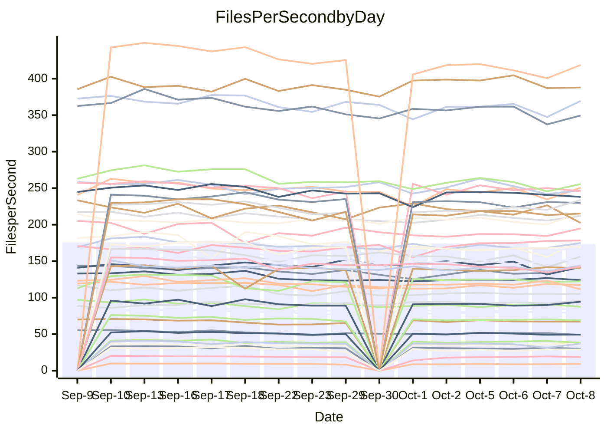

<!---
# This file is auto-generated. Do not edit.
# cspell:disable
--->
# Performance Report

## Daily Performance

## Time to Process Files

| Repository                                      | Elapsed | Min/Avg/Max           |   SD | SD Graph                |
| ----------------------------------------------- | ------: | :-------------------: | ---: | ----------------------- |
| AdaDoom3/AdaDoom3                    |    2.86 | 2.7 /   2.9 /   3.1   | 0.09 | `    ┣━━┻●━╋━━┻━━┫    ` |
| alexiosc/megistos                    |    7.43 | 6.6 /   7.3 /   7.7   | 0.24 | `    ┣━━┻━━╋━●┻━━┫    ` |
| apollographql/apollo-server          |    2.13 | 2.0 /   2.1 /   2.3   | 0.07 | `     ┣━┻━━●━━┻━┫     ` |
| aspnetboilerplate/aspnetboilerplate  |   11.14 | 10.5 /  10.9 /  12.0  | 0.34 | `    ┣━━┻━━╋━●┻━━┫    ` |
| aws-amplify/docs                     |   11.30 | 10.7 /  11.4 /  12.6  | 0.41 | `    ┣━━┻━●╋━━┻━━┫    ` |
| Azure/azure-rest-api-specs           |   13.89 | 12.9 /  14.1 /  15.4  | 0.58 | `   ┣━━━┻━●╋━━┻━━━┫   ` |
| bitjson/typescript-starter           |    0.66 | 0.6 /   0.6 /   0.7   | 0.03 | `     ┣━━┻━╋━●━━┫     ` |
| caddyserver/caddy                    |    3.16 | 2.8 /   3.0 /   3.5   | 0.15 | `    ┣━━┻━━╋━●┻━━┫    ` |
| canada-ca/open-source-logiciel-libre |    0.76 | 0.7 /   0.8 /   0.9   | 0.05 | `     ┣━┻━━●━━┻━┫     ` |
| chef/chef                            |    5.93 | 5.1 /   5.4 /   6.0   | 0.22 | `    ┣━━┻━━╋━━┻━━┫●   ` |
| dart-lang/sdk                        |   54.69 | 54.2 /  57.7 /  70.4  | 3.14 | `  ┣━━━●━━━╋━━━┻━━━┫  ` |
| django/django                        |   12.93 | 13.0 /  13.6 /  14.3  | 0.30 | `   ●┣━━┻━━╋━━┻━━┫    ` |
| eslint/eslint                        |    9.51 | 9.0 /   9.5 /  10.0   | 0.25 | `    ┣━━┻━━●━━┻━━┫    ` |
| exonum/exonum                        |    3.00 | 2.9 /   3.0 /   3.7   | 0.17 | `    ┣━━┻━●╋━━┻━━┫    ` |
| flutter/samples                      |   15.96 | 13.7 /  15.7 /  18.4  | 1.61 | `   ┣━━━┻━━╋●━┻━━━┫   ` |
| gitbucket/gitbucket                  |    2.89 | 2.8 /   3.0 /   3.3   | 0.12 | `    ┣━━●━━╋━━┻━━┫    ` |
| googleapis/google-cloud-cpp          |  138.66 | 129.1 / 136.2 / 149.4 | 4.64 | `  ┣━━━┻━━━╋━●━┻━━━┫  ` |
| graphql/express-graphql              |    0.70 | 0.6 /   0.7 /   0.8   | 0.04 | `     ┣━┻━━●━━┻━┫     ` |
| graphql/graphql-js                   |    2.13 | 1.9 /   2.1 /   2.4   | 0.10 | `     ┣━┻━━╋●━┻━┫     ` |
| graphql/graphql-relay-js             |    0.73 | 0.6 /   0.7 /   0.8   | 0.03 | `     ┣━┻━━╋━●┻━┫     ` |
| graphql/graphql-spec                 |    0.80 | 0.7 /   0.8 /   1.1   | 0.07 | `     ┣━┻━━●━━┻━┫     ` |
| iluwatar/java-design-patterns        |   10.84 | 10.3 /  10.9 /  12.5  | 0.44 | `    ┣━━┻━━●━━┻━━┫    ` |
| ktaranov/sqlserver-kit               |    5.88 | 5.7 /   5.9 /   6.4   | 0.17 | `    ┣━━┻━●╋━━┻━━┫    ` |
| liriliri/licia                       |    3.39 | 3.1 /   3.3 /   3.5   | 0.12 | `    ┣━━┻━━╋━●┻━━┫    ` |
| MartinThoma/LaTeX-examples           |    6.02 | 5.9 /   6.3 /   7.0   | 0.25 | `    ┣━●┻━━╋━━┻━━┫    ` |
| mdx-js/mdx                           |    1.52 | 1.4 /   1.6 /   1.8   | 0.07 | `     ┣━┻●━╋━━┻━┫     ` |
| microsoft/TypeScript-Website         |    5.00 | 4.7 /   5.0 /   5.5   | 0.18 | `    ┣━━┻━━●━━┻━━┫    ` |
| MicrosoftDocs/PowerShell-Docs        |   24.15 | 20.6 /  22.3 /  23.9  | 0.83 | `   ┣━━━┻━━╋━━┻━━━┫●  ` |
| neovim/nvim-lspconfig                |    2.91 | 2.6 /   2.8 /   3.0   | 0.12 | `    ┣━━┻━━╋━━●━━┫    ` |
| pagekit/pagekit                      |    3.22 | 3.0 /   3.2 /   3.5   | 0.10 | `    ┣━━┻━━╋●━┻━━┫    ` |
| php/php-src                          |   23.10 | 23.2 /  24.2 /  26.1  | 0.72 | `   ┣━●━┻━━╋━━┻━━━┫   ` |
| plasticrake/tplink-smarthome-api     |    0.90 | 0.8 /   0.9 /   0.9   | 0.03 | `     ┣━┻━━╋━●┻━┫     ` |
| prettier/prettier                    |    5.95 | 5.7 /   6.0 /   6.4   | 0.17 | `    ┣━━┻━●╋━━┻━━┫    ` |
| pycontribs/jira                      |    1.19 | 1.1 /   1.2 /   1.3   | 0.05 | `     ┣━┻━━●━━┻━┫     ` |
| RustPython/RustPython                |    4.31 | 4.1 /   4.4 /   4.9   | 0.17 | `    ┣━━┻━●╋━━┻━━┫    ` |
| shoelace-style/shoelace              |    2.24 | 2.1 /   2.3 /   2.5   | 0.11 | `    ┣━━┻━●╋━━┻━━┫    ` |
| SoftwareBrothers/admin-bro           |    2.05 | 1.8 /   2.0 /   2.2   | 0.09 | `     ┣━┻━━╋━●┻━┫     ` |
| sveltejs/svelte                      |   19.31 | 18.1 /  18.9 /  20.3  | 0.51 | `   ┣━━━┻━━╋━━●━━━┫   ` |
| TheAlgorithms/Python                 |    5.30 | 4.7 /   5.1 /   5.5   | 0.21 | `    ┣━━┻━━╋━━●━━┫    ` |
| twbs/bootstrap                       |    1.14 | 1.0 /   1.1 /   1.2   | 0.05 | `     ┣━┻━━╋━●┻━┫     ` |
| typescript-cheatsheets/react         |    1.07 | 1.0 /   1.0 /   1.2   | 0.04 | `     ┣━┻━━╋━●┻━┫     ` |
| typescript-eslint/typescript-eslint  |    3.57 | 3.2 /   3.4 /   3.7   | 0.13 | `    ┣━━┻━━╋━━●━━┫    ` |
| vitest-dev/vitest                    |    7.29 | 6.6 /   7.0 /   7.4   | 0.23 | `    ┣━━┻━━╋━━●━━┫    ` |
| w3c/aria-practices                   |    2.82 | 2.5 /   2.8 /   3.0   | 0.13 | `    ┣━━┻━━╋━●┻━━┫    ` |
| w3c/specberus                        |    1.63 | 1.5 /   1.6 /   2.1   | 0.12 | `     ┣━┻━━●━━┻━┫     ` |
| webdeveric/webpack-assets-manifest   |    0.66 | 0.6 /   0.7 /   0.8   | 0.06 | `     ┣━┻━━●━━┻━┫     ` |
| webpack/webpack                      |    4.56 | 4.2 /   4.4 /   4.8   | 0.16 | `    ┣━━┻━━╋━●┻━━┫    ` |
| wireapp/wire-desktop                 |    0.87 | 0.8 /   0.8 /   0.9   | 0.04 | `     ┣━┻━━╋━━●━┫     ` |
| wireapp/wire-webapp                  |    7.37 | 6.9 /   7.4 /   8.0   | 0.27 | `    ┣━━┻━━●━━┻━━┫    ` |

Note:
- Elapsed time is in seconds.

## Files per Second over Time

| Repository                                      | Files |    Sec |    Fps |    Rel | Trend Fps              |    N |
| ----------------------------------------------- | ----: | -----: | -----: | -----: | ---------------------- | ---: |
| AdaDoom3/AdaDoom3                    |   103 |   2.86 |  36.06 |  2.06% | `█▆█▆▆▅▄▆▆▇▅▆▆▆▇▅▅██▇` |   24 |
| alexiosc/megistos                    |   583 |   7.43 |  78.46 | -2.28% | `▅▄█▅▅▅▄▄▄▅▅▃▅▅▄▅▆▄▅▄` |   24 |
| apollographql/apollo-server          |   250 |   2.13 | 117.21 |  0.27% | `███▇▇▄▇▆▅▄▇▆▇▆▇▆▇▄█▇` |   27 |
| aspnetboilerplate/aspnetboilerplate  |  2739 |  11.14 | 245.86 | -2.05% | `█▆█▇▆▇▅▆█▆▇▄▇██▆▆▇▇▆` |   26 |
| aws-amplify/docs                     |  2832 |  11.30 | 250.54 |  0.55% | `▆█▇▇██▇▇▄█▇▇▆▆██▇▇▅▇` |   27 |
| Azure/azure-rest-api-specs           |  2429 |  13.89 | 174.93 |  1.34% | `█▇▇█▅▇▆▆▇█▄▅▅█▇▆▆▆▆▇` |   27 |
| bitjson/typescript-starter           |    20 |   0.66 |  30.13 | -4.04% | `▇▅▅█▄▅▆▅▆▅▅▅▆▅▃▆▄▃▆▄` |   24 |
| caddyserver/caddy                    |   277 |   3.16 |  87.60 | -3.48% | `█▇▆▃▆▇▇▆▆▇▆▇▆▆▄▆▆█▇▆` |   27 |
| canada-ca/open-source-logiciel-libre |     7 |   0.76 |   9.23 | -0.23% | `▇██▇▇▆▆▄▅▆▂▆▇▇▅▄▅▆▆▆` |   24 |
| chef/chef                            |  1201 |   5.93 | 202.48 | -8.19% | `▄▆▇▇▇▆▄▇██▇▅▇▆▆▅▇▅▇▄` |   27 |
| dart-lang/sdk                        |  9757 |  54.69 | 178.41 |  5.64% | `▇▇▇▆▆▆▇▇▅▅▇▇██▇▇████` |   27 |
| django/django                        |  2792 |  12.93 | 215.87 |  4.91% | `▇▆▆▆▅▇▇▅▇▇▆▇▇▇▇▆▅▆▅█` |   27 |
| eslint/eslint                        |  2016 |   9.51 | 212.02 |  0.51% | `▇▅█▇█▆▆▆▅▇▆▆██▇▇▇▆▆▇` |   27 |
| exonum/exonum                        |   421 |   3.00 | 140.48 |  1.21% | `▆█▇▂▇▇▇▇▇▆▇▆▆▇▆▆▇▇▇▇` |   24 |
| flutter/samples                      |  2850 |  15.96 | 178.60 |  2.67% | `▅▂█▇█▆▆▅▅▆▅▆▆▅▅▅▆▆▄▇` |   27 |
| gitbucket/gitbucket                  |   411 |   2.89 | 142.07 |  3.95% | `███▆▇▆▇▅▄▅▅▆▆▇█▆▄▇▆█` |   27 |
| googleapis/google-cloud-cpp          | 19680 | 138.66 | 141.93 | -1.88% | `▆▇▇▇▆▆█▆▇█▇▇▆▇▆▇▇█▃▆` |   27 |
| graphql/express-graphql              |    26 |   0.70 |  37.15 | -1.32% | `█▇▄▇▇▆▆▆▆▆▆▆▆▆▆▅▆▅▂▆` |   24 |
| graphql/graphql-js                   |   333 |   2.13 | 156.35 | -1.30% | `█▆▆▅▅▆▆▇▆▅▇▅▅▅▃▇▆▆▃▆` |   26 |
| graphql/graphql-relay-js             |    28 |   0.73 |  38.24 | -4.46% | `▅█▇▅▅▅▅▅▆▆▅▃▅▆▅▆▆▆▆▅` |   24 |
| graphql/graphql-spec                 |    15 |   0.80 |  18.81 | -0.61% | `██▇▇▇▇▇▆▂▆▆▅▇▆▇▇█▆▇▇` |   24 |
| iluwatar/java-design-patterns        |  1838 |  10.84 | 169.56 |  0.30% | `▇███▇▃▇▇▇▆▆▆▅▆▇▆▇▇▇▇` |   24 |
| ktaranov/sqlserver-kit               |   489 |   5.88 |  83.12 |  0.47% | `▇▆██▆▇▆▇▇▇▇▄▄▇▇▇▇██▇` |   25 |
| liriliri/licia                       |  1421 |   3.39 | 418.72 | -1.91% | `██▇█▆▇▆▆▅▅▆▆▆▅▆▅▆▅▄▆` |   24 |
| MartinThoma/LaTeX-examples           |  1407 |   6.02 | 233.91 |  4.80% | `▇█▅▇▆▆▅▅▅▃▇▆▅▄▇▅▆▇▆▇` |   24 |
| mdx-js/mdx                           |   144 |   1.52 |  94.47 |  2.72% | `█▇▃█▆▆▅▅▆▆▅▇▆▆▆▅▅▆▆▇` |   25 |
| microsoft/TypeScript-Website         |   758 |   5.00 | 151.52 |  0.34% | `▇█▇▇▆▇▇▅▆▇▇▄▆█▆▅▄▇▇▇` |   26 |
| MicrosoftDocs/PowerShell-Docs        |  2692 |  24.15 | 111.48 | -7.71% | `▇██▆▅▆▅▄▆▆▅▆▅▇▆▄▆▆▇▄` |   27 |
| neovim/nvim-lspconfig                |   361 |   2.91 | 123.97 | -3.27% | `▇▇█▆▅▅▅▅▄▅▄▅▆▄▅▆▄▅▆▅` |   27 |
| pagekit/pagekit                      |   741 |   3.22 | 229.78 | -1.66% | `█▇██▇▇▆▇▆▇▆▆▇▇▅▅▆▄▆▆` |   24 |
| php/php-src                          |  2211 |  23.10 |  95.71 |  4.63% | `██▆▆▆▆▇▆▇███▅█▇▇▇█▇█` |   27 |
| plasticrake/tplink-smarthome-api     |    62 |   0.90 |  68.91 | -3.31% | `▆▇█▅▆▇▆▄▆▅▄▆▅▆▆▅▅▅▆▅` |   24 |
| prettier/prettier                    |  2197 |   5.95 | 369.42 |  1.19% | `█▇▇▆▆▅▇▆▄▇▆▄▆▆▆▇▆▆▄▇` |   26 |
| pycontribs/jira                      |    80 |   1.19 |  67.24 | -0.78% | `▆▆█▆▆▃▅▅▇▆▅▇▇▇▇▆▆▇▆▆` |   25 |
| RustPython/RustPython                |   621 |   4.31 | 143.97 |  1.47% | `██▇██▇▇▆▇█▇▃▆█▇▇▇█▆█` |   26 |
| shoelace-style/shoelace              |   437 |   2.24 | 194.77 |  1.95% | `▇█▃▆▅▅▆▅▅▃▅▆▅▆▄▅▅▅▅▆` |   27 |
| SoftwareBrothers/admin-bro           |   441 |   2.05 | 215.18 | -2.96% | `███▇▅▅▄▅▅▆▃▄▄▅▆▆▅▆▅▅` |   24 |
| sveltejs/svelte                      |  7490 |  19.31 | 387.88 | -1.27% | `▇▄▇▅▆▆▆▅▇█▆▇▇▇▇█▇█▆▆` |   27 |
| TheAlgorithms/Python                 |  1355 |   5.30 | 255.56 | -3.38% | `███▅▆▆▆▆▄▄▇▆▆▇▇▆▅▆▄▅` |   27 |
| twbs/bootstrap                       |   120 |   1.14 | 105.23 | -2.78% | `█▆█▅▄▄▆▄▄▅▄▅▅▅▅▄▄▅▄▅` |   27 |
| typescript-cheatsheets/react         |    53 |   1.07 |  49.49 | -3.56% | `███▇▇▆▆▆▆▇▇▃▇▇▇▇▆▇▅▆` |   24 |
| typescript-eslint/typescript-eslint  |  1248 |   3.57 | 349.57 | -3.65% | `██▇▆▆▇▅▅▆▆▇▆▇▆▇▇▇▆▄▅` |   27 |
| vitest-dev/vitest                    |  1800 |   7.29 | 246.91 | -2.81% | `▆▅▄▅▅▅▅▆▄▆▅▄▆█▇▅▆▅▄▅` |   27 |
| w3c/aria-practices                   |   403 |   2.82 | 142.72 | -2.53% | `█▆█▃▅▆▆▆▆▆▆▆▆▄▅▅▄▅▃▅` |   26 |
| w3c/specberus                        |   200 |   1.63 | 122.38 | -1.55% | `▇█▆▅▂▆▆▆▇▇▇▅▆▆▇▇▆▆▆▆` |   26 |
| webdeveric/webpack-assets-manifest   |    19 |   0.66 |  28.85 | -1.22% | `▇███▆▆▆▃▆▂▆▅▅▆▆▆▅▂▆▆` |   24 |
| webpack/webpack                      |  1086 |   4.56 | 238.19 | -3.00% | `██▇▄▇▇▆▆▄█▄▇▇▅▇▆▆▇▆▆` |   27 |
| wireapp/wire-desktop                 |    43 |   0.87 |  49.18 | -5.85% | `██▆▆▅▄▆▅▅▆▃▅▆▆▆▆▅▆▆▄` |   27 |
| wireapp/wire-webapp                  |  1227 |   7.37 | 166.47 |  0.54% | `█▆▅▃▄▆▅▅▄▅▅▆▇▇▅▆█▅▆▆` |   27 |

## Data Throughput

| Repository                                      | Files |    Sec |     Kps |    Rel | Trend Kps              |    N |
| ----------------------------------------------- | ----: | -----: | ------: | -----: | ---------------------- | ---: |
| AdaDoom3/AdaDoom3                    |   103 |   2.86 |  766.26 |  2.06% | `█▆█▆▆▅▄▆▆▇▅▆▆▆▇▅▅██▇` |   24 |
| alexiosc/megistos                    |   583 |   7.43 |  616.49 | -2.28% | `▅▄█▅▅▅▄▄▄▅▅▃▅▅▄▅▆▄▅▄` |   24 |
| apollographql/apollo-server          |   250 |   2.13 |  928.80 |  0.27% | `███▇▇▄▇▆▅▄▇▆▇▆▇▆▇▄█▇` |   27 |
| aspnetboilerplate/aspnetboilerplate  |  2739 |  11.14 |  571.61 | -3.09% | `█▆█▇▆▇▄▆▇▆▆▃▆▇▇▅▆▇▆▆` |   26 |
| aws-amplify/docs                     |  2832 |  11.30 |  836.48 |  0.81% | `▆█▇▇▇█▇▇▄█▇▇▆▆██▇▇▅▇` |   27 |
| Azure/azure-rest-api-specs           |  2429 |  13.89 |  499.93 |  1.53% | `█▇▇█▅▆▆▆▇█▄▅▅█▇▆▆▆▆▇` |   27 |
| bitjson/typescript-starter           |    20 |   0.66 |  120.54 | -4.04% | `▇▅▅█▄▅▆▅▆▅▅▅▆▅▃▆▄▃▆▄` |   24 |
| caddyserver/caddy                    |   277 |   3.16 |  723.86 | -2.00% | `█▇▆▃▆▇▇▅▆▇▆▇▆▆▄▆▆█▇▆` |   27 |
| canada-ca/open-source-logiciel-libre |     7 |   0.76 |   76.45 | -0.23% | `▇██▇▇▆▆▄▅▆▂▆▇▇▅▄▅▆▆▆` |   24 |
| chef/chef                            |  1201 |   5.93 |  929.29 | -8.32% | `▄▆▇▇▇▆▄▇██▇▅▇▆▆▅▇▅▇▄` |   27 |
| dart-lang/sdk                        |  9757 |  54.69 | 1287.28 |  5.28% | `▇▇▇▆▆▆▇▇▅▅▇▇██▇▇████` |   27 |
| django/django                        |  2792 |  12.93 | 1321.10 |  5.00% | `▇▆▆▆▅▇▇▅▇▇▆▇▇▇▇▆▅▆▅█` |   27 |
| eslint/eslint                        |  2016 |   9.51 | 1730.85 |  0.33% | `▇▅█▇█▆▆▆▅▇▅▆██▇▇▇▆▆▇` |   27 |
| exonum/exonum                        |   421 |   3.00 | 1343.73 |  1.21% | `▆█▇▂▇▇▇▇▇▆▇▆▆▇▆▆▇▇▇▇` |   24 |
| flutter/samples                      |  2850 |  15.96 | 1384.94 |  4.61% | `▅▂█▇█▆▆▆▆▆▆▆▇▆▆▅▆▇▅▇` |   27 |
| gitbucket/gitbucket                  |   411 |   2.89 |  641.91 |  3.95% | `███▆▇▆▇▅▄▅▅▆▆▇█▆▄▇▆█` |   27 |
| googleapis/google-cloud-cpp          | 19680 | 138.66 | 1096.38 |  5.92% | `▅▆▇▆▆▅█▆▆█▇▇▆▇▆▇▇█▆█` |   27 |
| graphql/express-graphql              |    26 |   0.70 |  170.04 | -1.32% | `█▇▄▇▇▆▆▆▆▆▆▆▆▆▆▅▆▅▂▆` |   24 |
| graphql/graphql-js                   |   333 |   2.13 |  891.62 | -1.19% | `█▆▆▅▅▆▆▇▆▅▇▅▅▅▃▇▆▆▃▆` |   26 |
| graphql/graphql-relay-js             |    28 |   0.73 |  150.24 | -4.46% | `▅█▇▅▅▅▅▅▆▆▅▃▅▆▅▆▆▆▆▅` |   24 |
| graphql/graphql-spec                 |    15 |   0.80 |  691.01 | -0.61% | `██▇▇▇▇▇▆▂▆▆▅▇▆▇▇█▆▇▇` |   24 |
| iluwatar/java-design-patterns        |  1838 |  10.84 |  521.97 |  0.33% | `▇███▇▃▇▇▇▆▆▆▅▆▇▆▇▇▇▇` |   24 |
| ktaranov/sqlserver-kit               |   489 |   5.88 | 1257.41 |  0.47% | `▇▆██▆▇▆▇▇▇▇▄▄▇▇▇▇██▇` |   25 |
| liriliri/licia                       |  1421 |   3.39 |  493.56 | -1.86% | `██▇█▆▇▆▆▅▅▆▆▆▅▆▅▆▅▄▆` |   24 |
| MartinThoma/LaTeX-examples           |  1407 |   6.02 |  483.46 |  4.80% | `▇█▅▇▆▆▅▅▅▃▇▆▅▄▇▅▆▇▆▇` |   24 |
| mdx-js/mdx                           |   144 |   1.52 |  434.31 |  3.14% | `█▇▃█▆▆▅▅▆▆▅▇▆▆▇▅▅▆▆▇` |   25 |
| microsoft/TypeScript-Website         |   758 |   5.00 | 1036.67 |  0.28% | `▇█▇▇▆▇▇▅▆▇▇▄▆█▆▅▄▇▇▇` |   26 |
| MicrosoftDocs/PowerShell-Docs        |  2692 |  24.15 | 1139.28 | -7.73% | `▇██▆▅▆▅▄▆▆▅▆▅▇▆▄▆▆▇▄` |   27 |
| neovim/nvim-lspconfig                |   361 |   2.91 |  320.74 | -4.56% | `▇▇█▆▅▅▅▅▄▅▄▅▆▄▅▆▄▅▅▄` |   27 |
| pagekit/pagekit                      |   741 |   3.22 |  479.09 | -1.66% | `█▇██▇▇▆▇▆▇▆▆▇▇▅▅▆▄▆▆` |   24 |
| php/php-src                          |  2211 |  23.10 | 1398.62 |  4.77% | `█▇▆▆▆▆▇▆▇██▇▅█▇▇▇█▇█` |   27 |
| plasticrake/tplink-smarthome-api     |    62 |   0.90 |  372.34 | -3.31% | `▆▇█▅▆▇▆▄▆▅▄▆▅▆▆▅▅▅▆▅` |   24 |
| prettier/prettier                    |  2197 |   5.95 |  514.71 |  1.13% | `█▇▇▆▆▅▇▆▄▇▆▄▆▆▆▇▆▆▄▇` |   26 |
| pycontribs/jira                      |    80 |   1.19 |  463.13 | -0.78% | `▆▆█▆▆▃▅▅▇▆▅▇▇▇▇▆▆▇▆▆` |   25 |
| RustPython/RustPython                |   621 |   4.31 | 1059.76 |  1.63% | `██▇██▇▇▆██▇▃▆█▇▇▇█▆█` |   26 |
| shoelace-style/shoelace              |   437 |   2.24 |  925.71 |  2.37% | `▇█▃▆▅▅▇▆▅▃▅▆▅▆▅▅▆▅▅▆` |   27 |
| SoftwareBrothers/admin-bro           |   441 |   2.05 |  474.29 | -3.02% | `███▇▅▅▃▅▅▆▃▄▄▅▆▅▄▆▅▅` |   24 |
| sveltejs/svelte                      |  7490 |  19.31 |  280.16 | -1.17% | `▇▄▇▅▆▆▆▅▇█▆▇▇▇▇█▇█▆▆` |   27 |
| TheAlgorithms/Python                 |  1355 |   5.30 |  647.85 | -3.24% | `███▅▆▆▆▆▄▄▇▅▆▇▇▆▅▆▄▅` |   27 |
| twbs/bootstrap                       |   120 |   1.14 |  842.69 | -2.78% | `█▆█▅▄▄▆▄▄▅▄▅▅▅▅▄▄▅▄▅` |   27 |
| typescript-cheatsheets/react         |    53 |   1.07 |  361.40 | -3.56% | `███▇▇▆▆▆▆▇▇▃▇▇▇▇▆▇▅▆` |   24 |
| typescript-eslint/typescript-eslint  |  1248 |   3.57 | 1631.04 | -3.06% | `██▇▆▆▇▅▅▆▆▇▆▇▆▇█▇▆▄▆` |   27 |
| vitest-dev/vitest                    |  1800 |   7.29 |  507.68 | -2.43% | `▇▆▄▅▆▆▆▆▄▆▅▄▆█▇▅▆▅▄▅` |   27 |
| w3c/aria-practices                   |   403 |   2.82 | 1330.49 | -2.45% | `█▆█▃▅▆▆▆▆▆▆▆▆▄▅▅▄▅▃▅` |   26 |
| w3c/specberus                        |   200 |   1.63 |  390.38 | -1.55% | `▇█▆▅▂▆▆▆▇▇▇▅▆▆▇▇▆▆▆▆` |   26 |
| webdeveric/webpack-assets-manifest   |    19 |   0.66 |  154.90 | -1.22% | `▇███▆▆▆▃▆▂▆▅▅▆▆▆▅▂▆▆` |   24 |
| webpack/webpack                      |  1086 |   4.56 | 1038.32 | -2.70% | `██▇▄▇▇▆▆▄█▄▇▇▅▇▆▆▇▆▆` |   27 |
| wireapp/wire-desktop                 |    43 |   0.87 |  216.17 | -5.85% | `██▆▆▅▄▆▅▅▆▃▅▆▆▆▆▅▆▆▄` |   27 |
| wireapp/wire-webapp                  |  1227 |   7.37 |  704.55 |  0.53% | `█▆▅▃▄▆▅▅▄▅▅▆▇▇▅▆█▅▆▆` |   27 |

