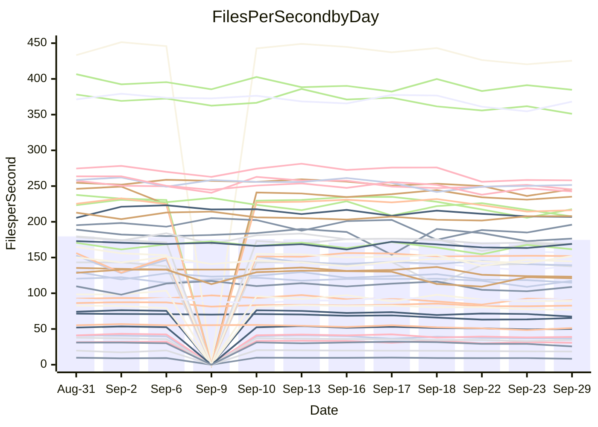

<!---
# This file is auto-generated. Do not edit.
# cspell:disable
--->
# Performance Report

## Daily Performance

## Time to Process Files

| Repository                                      | Elapsed | Min/Avg/Max           |   SD | SD Graph                |
| ----------------------------------------------- | ------: | :-------------------: | ---: | ----------------------- |
| AdaDoom3/AdaDoom3                    |    2.96 | 2.7 /   2.9 /   3.1   | 0.11 | `    ┣━━┻━━╋━●┻━━┫    ` |
| alexiosc/megistos                    |    7.58 | 6.6 /   7.2 /   7.5   | 0.24 | `    ┣━━┻━━╋━━┻━●┫    ` |
| apollographql/apollo-server          |    2.13 | 2.0 /   2.1 /   2.3   | 0.06 | `     ┣━┻━━╋●━┻━┫     ` |
| aspnetboilerplate/aspnetboilerplate  |   11.16 | 10.5 /  10.8 /  11.6  | 0.27 | `    ┣━━┻━━╋━━┻●━┫    ` |
| aws-amplify/docs                     |   11.55 | 10.7 /  11.2 /  11.8  | 0.33 | `    ┣━━┻━━╋━━┻●━┫    ` |
| Azure/azure-rest-api-specs           |   14.36 | 12.9 /  13.7 /  14.8  | 0.51 | `   ┣━━━┻━━╋━━┻●━━┫   ` |
| bitjson/typescript-starter           |    0.65 | 0.6 /   0.6 /   0.7   | 0.03 | `     ┣━━┻━╋━●━━┫     ` |
| caddyserver/caddy                    |    3.01 | 2.8 /   3.0 /   3.5   | 0.17 | `    ┣━━┻━━●━━┻━━┫    ` |
| canada-ca/open-source-logiciel-libre |    0.84 | 0.7 /   0.7 /   0.8   | 0.02 | `     ┣━━┻━╋━┻━━┫    ●` |
| chef/chef                            |    5.79 | 5.1 /   5.3 /   6.0   | 0.22 | `    ┣━━┻━━╋━━┻━━●    ` |
| dart-lang/sdk                        |   57.46 | 55.3 /  58.0 /  70.4  | 3.18 | `  ┣━━━┻━━●╋━━━┻━━━┫  ` |
| django/django                        |   13.43 | 13.0 /  13.5 /  14.3  | 0.35 | `    ┣━━┻━●╋━━┻━━┫    ` |
| eslint/eslint                        |    9.66 | 8.9 /   9.3 /  10.2   | 0.32 | `    ┣━━┻━━╋━━●━━┫    ` |
| exonum/exonum                        |    3.06 | 2.9 /   3.0 /   3.7   | 0.20 | `    ┣━━┻━━╋●━┻━━┫    ` |
| flutter/samples                      |   14.72 | 13.7 /  14.4 /  18.4  | 1.06 | `   ┣━━━┻━━╋●━┻━━━┫   ` |
| gitbucket/gitbucket                  |    2.98 | 2.8 /   2.9 /   3.1   | 0.08 | `    ┣━━┻━━╋━●┻━━┫    ` |
| googleapis/google-cloud-cpp          |  129.47 | 129.2 / 136.4 / 145.8 | 4.11 | `  ┣●━━┻━━━╋━━━┻━━━┫  ` |
| graphql/express-graphql              |    0.70 | 0.6 /   0.7 /   0.8   | 0.04 | `     ┣━┻━━╋━━●━┫     ` |
| graphql/graphql-js                   |    2.12 | 1.9 /   2.0 /   2.2   | 0.09 | `     ┣━┻━━╋━●┻━┫     ` |
| graphql/graphql-relay-js             |    0.72 | 0.6 /   0.7 /   0.7   | 0.03 | `     ┣━┻━━╋━━●━┫     ` |
| graphql/graphql-spec                 |    0.81 | 0.7 /   0.8 /   0.9   | 0.03 | `     ┣━┻━━╋━━●━┫     ` |
| iluwatar/java-design-patterns        |   10.86 | 10.1 /  10.7 /  12.5  | 0.52 | `    ┣━━┻━━╋●━┻━━┫    ` |
| ktaranov/sqlserver-kit               |    5.92 | 5.6 /   5.8 /   6.1   | 0.15 | `    ┣━━┻━━╋━●┻━━┫    ` |
| liriliri/licia                       |    3.34 | 3.1 /   3.2 /   3.4   | 0.07 | `    ┣━━┻━━╋━━┻●━┫    ` |
| MartinThoma/LaTeX-examples           |    6.51 | 5.9 /   6.2 /   6.6   | 0.21 | `    ┣━━┻━━╋━━┻●━┫    ` |
| mdx-js/mdx                           |    1.62 | 1.4 /   1.5 /   1.8   | 0.08 | `     ┣━┻━━╋━━●━┫     ` |
| microsoft/TypeScript-Website         |    4.98 | 4.7 /   5.0 /   5.9   | 0.24 | `    ┣━━┻━━●━━┻━━┫    ` |
| MicrosoftDocs/PowerShell-Docs        |   23.42 | 20.6 /  21.7 /  23.9  | 0.85 | `   ┣━━━┻━━╋━━┻━━━●   ` |
| neovim/nvim-lspconfig                |    2.89 | 2.6 /   2.7 /   2.9   | 0.10 | `    ┣━━┻━━╋━━┻━━●    ` |
| pagekit/pagekit                      |    3.15 | 2.9 /   3.1 /   3.3   | 0.10 | `    ┣━━┻━━╋●━┻━━┫    ` |
| php/php-src                          |   23.89 | 23.3 /  24.5 /  26.1  | 0.71 | `   ┣━━━●━━╋━━┻━━━┫   ` |
| plasticrake/tplink-smarthome-api     |    0.92 | 0.8 /   0.8 /   0.9   | 0.03 | `     ┣━┻━━╋━━┻━┫ ●   ` |
| prettier/prettier                    |    5.95 | 5.7 /   5.9 /   6.2   | 0.14 | `    ┣━━┻━━╋●━┻━━┫    ` |
| pycontribs/jira                      |    1.22 | 1.1 /   1.2 /   1.3   | 0.06 | `     ┣━┻━━╋━━●━┫     ` |
| RustPython/RustPython                |    4.46 | 4.0 /   4.4 /   6.1   | 0.44 | `    ┣━━┻━━╋●━┻━━┫    ` |
| shoelace-style/shoelace              |    2.23 | 2.1 /   2.2 /   2.5   | 0.12 | `    ┣━━┻━━●━━┻━━┫    ` |
| SoftwareBrothers/admin-bro           |    2.03 | 1.8 /   1.9 /   2.1   | 0.08 | `     ┣━┻━━╋━━┻●┫     ` |
| sveltejs/svelte                      |   19.31 | 17.4 /  18.8 /  20.3  | 0.57 | `   ┣━━━┻━━╋━━●━━━┫   ` |
| TheAlgorithms/Python                 |    5.21 | 4.7 /   4.9 /   5.3   | 0.16 | `    ┣━━┻━━╋━━┻━●┫    ` |
| twbs/bootstrap                       |    1.10 | 1.0 /   1.1 /   1.4   | 0.08 | `     ┣━┻━━●━━┻━┫     ` |
| typescript-cheatsheets/react         |    1.06 | 1.0 /   1.0 /   1.1   | 0.03 | `     ┣━┻━━╋━━●━┫     ` |
| typescript-eslint/typescript-eslint  |    3.55 | 3.2 /   3.4 /   3.7   | 0.12 | `    ┣━━┻━━╋━━┻●━┫    ` |
| vitest-dev/vitest                    |    7.08 | 6.6 /   6.9 /   7.4   | 0.22 | `    ┣━━┻━━╋━●┻━━┫    ` |
| w3c/aria-practices                   |    2.79 | 2.4 /   2.6 /   3.0   | 0.14 | `    ┣━━┻━━╋━━●━━┫    ` |
| w3c/specberus                        |    1.65 | 1.5 /   1.6 /   2.1   | 0.15 | `    ┣━━┻━━╋●━┻━━┫    ` |
| webdeveric/webpack-assets-manifest   |    0.74 | 0.6 /   0.6 /   0.7   | 0.03 | `     ┣━━┻━╋━┻━━┫    ●` |
| webpack/webpack                      |    4.48 | 4.1 /   4.3 /   4.7   | 0.16 | `    ┣━━┻━━╋━━●━━┫    ` |
| wireapp/wire-desktop                 |    0.84 | 0.7 /   0.8 /   0.9   | 0.04 | `     ┣━┻━━╋━━●━┫     ` |
| wireapp/wire-webapp                  |    7.60 | 7.0 /   7.4 /   8.0   | 0.31 | `    ┣━━┻━━╋━●┻━━┫    ` |

Note:
- Elapsed time is in seconds.

## Files per Second over Time

| Repository                                      | Files |    Sec |    Fps |     Rel | Trend Fps              |    N |
| ----------------------------------------------- | ----: | -----: | -----: | ------: | ---------------------- | ---: |
| AdaDoom3/AdaDoom3                    |   103 |   2.96 |  34.81 |  -3.20% | `▆█▆▆▆▇▆▆▅▆▅▆▄▅▄▃▅`    |   16 |
| alexiosc/megistos                    |   583 |   7.58 |  76.93 |  -5.68% | `▅▇▆▄▆▅▆▆▇▅▄█▅▅▅▄▄`    |   16 |
| apollographql/apollo-server          |   250 |   2.13 | 117.33 |  -1.34% | `▇▇█▆▇█▇▇▆█▇▇▇▇▇▆▇▄▆`  |   18 |
| aspnetboilerplate/aspnetboilerplate  |  2739 |  11.16 | 245.48 |  -3.23% | `▇▇▆▇██▇████▇█▆█▇▆▇▄▆` |   19 |
| aws-amplify/docs                     |  2831 |  11.55 | 245.20 |  -3.26% | `▆█▄█▆▄██▇▇▆▇█▅▇▆▅▆▆▅` |   19 |
| Azure/azure-rest-api-specs           |  2426 |  14.36 | 168.95 |  -4.23% | `▅█▇▅█▅█▆▇█▇▅▆▆▆▆▆▄▅▅` |   19 |
| bitjson/typescript-starter           |    20 |   0.65 |  30.68 |  -4.46% | `▃█▆▇▇████▇▅▅█▃▅▆▅`    |   16 |
| caddyserver/caddy                    |   276 |   3.01 |  91.76 |  -0.61% | `▇▆█▆▇█▆███▇▇▄▇▆▅▃▆▆▆` |   19 |
| canada-ca/open-source-logiciel-libre |     7 |   0.84 |   8.29 | -13.39% | `▇▇▄▅█▇▇▆▇▆█▇▆▆▄▅▂`    |   16 |
| chef/chef                            |  1201 |   5.79 | 207.46 |  -7.12% | `▅█▇█▇█▆▇▅▅▆▇█▃▅▆▇▇▆▄` |   19 |
| dart-lang/sdk                        |  9713 |  57.46 | 169.03 |   0.84% | `███▇▇█▇▇▇▇██▃▇█▇▆▇▆▇` |   19 |
| django/django                        |  2792 |  13.43 | 207.90 |   0.73% | `█▇▇▅██▇▆▇▆▆▇▄▇▆▆▆▅▇▇` |   19 |
| eslint/eslint                        |  2000 |   9.66 | 206.93 |  -3.23% | `▄▇█▇█▇▇█▅▇▇▇█▆▅▇▆▇▆▆` |   19 |
| exonum/exonum                        |   421 |   3.06 | 137.72 |  -1.70% | `▇█▇▇▇▇█▇█▆█▇▂▇▇▇▇`    |   16 |
| flutter/samples                      |  2598 |  14.72 | 176.46 |  -2.77% | `███▇▇▇█▇███▇█▅▂█▇█▆▆` |   19 |
| gitbucket/gitbucket                  |   411 |   2.98 | 137.90 |  -1.50% | `█▆▇▇████▇▇▇▄▇▇▇▇▅▇▅▆` |   19 |
| googleapis/google-cloud-cpp          | 19685 | 129.47 | 152.04 |   5.54% | `▇█▆▆█▅▆▇▆▆▅▄▄▆▇▇▆▆▆█` |   19 |
| graphql/express-graphql              |    26 |   0.70 |  36.89 |  -6.22% | `███▇▆███▇█▇▃▇▆▅▅▅`    |   16 |
| graphql/graphql-js                   |   333 |   2.12 | 156.96 |  -3.87% | `▇▇▇▆▇▇▅█▇▇▆▇▆▅▃▃▅▅`   |   17 |
| graphql/graphql-relay-js             |    28 |   0.72 |  38.94 |  -5.10% | `▄▇█▇█▄▆█▇▅█▆▄▅▅▄▄`    |   16 |
| graphql/graphql-spec                 |    15 |   0.81 |  18.44 |  -5.61% | `▆█▃▇██▇█▇▇█▆▆▆▆▅▅`    |   16 |
| iluwatar/java-design-patterns        |  1838 |  10.86 | 169.31 |  -1.75% | `██▇▇▇▇▇▆█▇█▇▇▇▃▆▆`    |   16 |
| ktaranov/sqlserver-kit               |   489 |   5.92 |  82.67 |  -1.56% | `▇███▅▆▆▆▇▆▆▅▇▇▅▆▅▆`   |   17 |
| liriliri/licia                       |  1421 |   3.34 | 425.42 |  -3.14% | `▆▆█▇▇▇█▇▇▇▇▆▇▅▆▅▅`    |   16 |
| MartinThoma/LaTeX-examples           |  1407 |   6.51 | 216.24 |  -4.63% | `█▄▇▆▆▇▆▇▇▇█▄▇▆▅▄▄`    |   16 |
| mdx-js/mdx                           |   144 |   1.62 |  89.06 |  -6.29% | `▆▇▇▇█▆▆▄▆▆▇▆▆▃▇▅▅▄▄`  |   18 |
| microsoft/TypeScript-Website         |   758 |   4.98 | 152.06 |   0.02% | `▇█▃▆▇▆▆▇▇██▇█▇▇▆▇▇`   |   17 |
| MicrosoftDocs/PowerShell-Docs        |  2690 |  23.42 | 114.87 |  -7.31% | `██▇▃▇▆▇▆██▆▆▆▆▇▇▆▅▅▄` |   19 |
| neovim/nvim-lspconfig                |   356 |   2.89 | 123.26 |  -6.92% | `▇█▇▇▇▇▇▇██▇█▄▇▆█▆▄▄▄` |   19 |
| pagekit/pagekit                      |   741 |   3.15 | 235.16 |  -1.45% | `█▅▇▄▇▅▇▅▄▆▅▆▇▅▅▅▅`    |   16 |
| php/php-src                          |  2211 |  23.89 |  92.55 |   2.41% | `▆█▅▇▇▆▄▅▅▇▇▆▆██▇▆▇▇▇` |   19 |
| plasticrake/tplink-smarthome-api     |    62 |   0.92 |  67.35 |  -8.56% | `▅▇▇▇▇██▆▇▄▅▇▄▅▅▅▃`    |   16 |
| prettier/prettier                    |  2190 |   5.95 | 368.19 |  -0.74% | `▆███▇▇▇▇▇▆▅▇█▇▇▆▅▅▆`  |   18 |
| pycontribs/jira                      |    80 |   1.22 |  65.35 |  -5.04% | `█████▇█▇█▇█▆▆█▆▆▃▅▅`  |   18 |
| RustPython/RustPython                |   621 |   4.46 | 139.11 |  -2.96% | `███▂▇█▇█▆▆▇▆▇▇▆▇▇▆▆`  |   18 |
| shoelace-style/shoelace              |   437 |   2.23 | 195.97 |   0.44% | `▅█▇▆█▇█▇▃█▇▇▇█▃▆▅▅▆`  |   18 |
| SoftwareBrothers/admin-bro           |   441 |   2.03 | 217.69 |  -5.07% | `██▇▇▇▇▇█▆▇███▇▅▅▃▅`   |   17 |
| sveltejs/svelte                      |  7431 |  19.31 | 384.82 |  -1.90% | `▆█▆▆▆▅▇▇▆▅▆▆▅▇▄▇▅▆▆▅` |   19 |
| TheAlgorithms/Python                 |  1345 |   5.21 | 258.01 |  -5.11% | `█▆█▆▆▅▆▇▇█▆▇▆▇▇▇▄▄▄▄` |   19 |
| twbs/bootstrap                       |   120 |   1.10 | 108.89 |  -0.48% | `▆▇▂▆▇█▇▆▇█▇▇▅█▇█▆▅▅▆` |   19 |
| typescript-cheatsheets/react         |    53 |   1.06 |  50.07 |  -4.09% | `▇▅▇▆▇▅▇█▅▇▆▇▆▅▅▄▅`    |   16 |
| typescript-eslint/typescript-eslint  |  1245 |   3.55 | 351.17 |  -5.10% | `▆█▆▆▆▅▅▇▇███▃▆▇▅▅▅▅▄` |   19 |
| vitest-dev/vitest                    |  1780 |   7.08 | 251.57 |  -1.55% | `▅█▇█▅▇█▄▇▅▇▆█▆▆▄▅▅▅▆` |   19 |
| w3c/aria-practices                   |   403 |   2.79 | 144.54 |  -5.19% | `█▇▆▇▆▆▆▆▆▆▄▆▆▅▆▃▄▅▄`  |   18 |
| w3c/specberus                        |   200 |   1.65 | 121.09 |  -4.09% | `▆██▇█▅▇▇▇█▇█▇█▆▅▂▆▆▆` |   19 |
| webdeveric/webpack-assets-manifest   |    19 |   0.74 |  25.62 | -16.58% | `▇▆▇▆▇▇▃█▇▆██▇▅▅▅▁`    |   16 |
| webpack/webpack                      |  1086 |   4.48 | 242.54 |  -3.73% | `████▆▅▆▆▇▆▇▆▄▇▇▆▃▆▆▅` |   19 |
| wireapp/wire-desktop                 |    43 |   0.84 |  51.30 |  -5.05% | `▇▆█▇▇▇▇▇▆▇▃▇▆▇▇▅▅▄▃▅` |   19 |
| wireapp/wire-webapp                  |  1228 |   7.60 | 161.60 |  -2.62% | `█▇▇▄▇█▅▇█▇▅▆▆█▇▆▄▄▇▅` |   19 |

## Data Throughput

| Repository                                      | Files |    Sec |     Kps |     Rel | Trend Kps              |    N |
| ----------------------------------------------- | ----: | -----: | ------: | ------: | ---------------------- | ---: |
| AdaDoom3/AdaDoom3                    |   103 |   2.96 |  739.74 |  -3.20% | `▆█▆▆▆▇▆▆▅▆▅▆▄▅▄▃▅`    |   16 |
| alexiosc/megistos                    |   583 |   7.58 |  604.52 |  -5.68% | `▅▇▆▄▆▅▆▆▇▅▄█▅▅▅▄▄`    |   16 |
| apollographql/apollo-server          |   250 |   2.13 |  929.72 |  -1.34% | `▇▇█▆▇█▇▇▆█▇▇▇▇▇▆▇▄▆`  |   18 |
| aspnetboilerplate/aspnetboilerplate  |  2739 |  11.16 |  570.73 |  -5.14% | `█▇▆▇██▇████▇█▆█▇▆▇▄▅` |   19 |
| aws-amplify/docs                     |  2831 |  11.55 |  818.15 |  -2.79% | `▆█▄█▆▄██▇▇▆▇█▅▇▆▅▆▆▅` |   19 |
| Azure/azure-rest-api-specs           |  2426 |  14.36 |  481.15 |  -4.21% | `▅█▇▅█▅█▆▇█▇▅▆▇▆▆▆▄▅▅` |   19 |
| bitjson/typescript-starter           |    20 |   0.65 |  122.72 |  -4.46% | `▃█▆▇▇████▇▅▅█▃▅▆▅`    |   16 |
| caddyserver/caddy                    |   276 |   3.01 |  747.39 |  -0.22% | `▆▆█▅▇█▆███▇▇▄▇▆▆▃▆▇▆` |   19 |
| canada-ca/open-source-logiciel-libre |     7 |   0.84 |   68.70 | -13.39% | `▇▇▄▅█▇▇▆▇▆█▇▆▆▄▅▂`    |   16 |
| chef/chef                            |  1201 |   5.79 |  951.95 |  -7.51% | `▅█▇█▇█▆▇▆▆▆▇█▃▅▆▇▇▆▄` |   19 |
| dart-lang/sdk                        |  9713 |  57.46 | 1224.84 |   0.75% | `███▇▇▇▇▇▇▇██▃▇█▇▆▇▆▇` |   19 |
| django/django                        |  2792 |  13.43 | 1272.04 |   0.90% | `█▇▇▅██▇▆▇▆▆▇▄▇▆▆▆▅▇▇` |   19 |
| eslint/eslint                        |  2000 |   9.66 | 1693.66 |  -3.04% | `▄▇█▇█▇▇█▆▇▇▇█▇▅▇▆▇▆▆` |   19 |
| exonum/exonum                        |   421 |   3.06 | 1317.32 |  -1.70% | `▇█▇▇▇▇█▇█▆█▇▂▇▇▇▇`    |   16 |
| flutter/samples                      |  2598 |  14.72 | 1324.10 |  -2.76% | `███▇▇▇█▇███▇█▅▂█▇█▆▆` |   19 |
| gitbucket/gitbucket                  |   411 |   2.98 |  623.07 |  -1.50% | `█▆▇▇████▇▇▇▄▇▇▇▇▅▇▅▆` |   19 |
| googleapis/google-cloud-cpp          | 19685 | 129.47 | 1084.76 |   5.49% | `▇█▆▆█▅▆▇▆▆▅▄▄▆▆▇▆▆▆█` |   19 |
| graphql/express-graphql              |    26 |   0.70 |  168.84 |  -6.22% | `███▇▆███▇█▇▃▇▆▅▅▅`    |   16 |
| graphql/graphql-js                   |   333 |   2.12 |  893.68 |  -3.82% | `▇▇▇▆▇▇▅█▇▇▆▇▆▅▃▃▅▅`   |   17 |
| graphql/graphql-relay-js             |    28 |   0.72 |  152.98 |  -5.10% | `▄▇█▇█▄▆█▇▅█▆▄▅▅▄▄`    |   16 |
| graphql/graphql-spec                 |    15 |   0.81 |  677.27 |  -5.61% | `▆█▃▇██▇█▇▇█▆▆▆▆▅▅`    |   16 |
| iluwatar/java-design-patterns        |  1838 |  10.86 |  521.00 |  -1.75% | `██▇▇▇▇▇▆█▇█▇▇▇▃▆▆`    |   16 |
| ktaranov/sqlserver-kit               |   489 |   5.92 | 1250.55 |  -1.56% | `▇███▅▆▆▆▇▆▆▅▇▇▅▆▅▆`   |   17 |
| liriliri/licia                       |  1421 |   3.34 |  501.46 |  -3.04% | `▆▆█▇▇▇█▇▇▇▇▆▇▅▆▅▅`    |   16 |
| MartinThoma/LaTeX-examples           |  1407 |   6.51 |  446.93 |  -4.63% | `█▄▇▆▆▇▆▇▇▇█▄▇▆▅▄▄`    |   16 |
| mdx-js/mdx                           |   144 |   1.62 |  408.19 |  -6.01% | `▆▇▇▇█▆▆▄▆▆▇▆▆▃▇▅▅▄▄`  |   18 |
| microsoft/TypeScript-Website         |   758 |   4.98 | 1040.57 |  -0.10% | `▇█▃▆▇▆▆▇▇██▇█▇▇▆▇▇`   |   17 |
| MicrosoftDocs/PowerShell-Docs        |  2690 |  23.42 | 1173.69 |  -7.35% | `██▇▃▇▆▇▆██▆▆▆▆▇▇▆▅▅▄` |   19 |
| neovim/nvim-lspconfig                |   356 |   2.89 |  323.72 |  -7.09% | `███▇▇▇█▇██▇█▄▇▆█▆▄▄▄` |   19 |
| pagekit/pagekit                      |   741 |   3.15 |  490.32 |  -1.45% | `█▅▇▄▇▅▇▅▄▆▅▆▇▅▅▅▅`    |   16 |
| php/php-src                          |  2211 |  23.89 | 1350.60 |   2.45% | `▆█▅▇█▆▄▅▅▇▇▆▆██▇▆▇▇▇` |   19 |
| plasticrake/tplink-smarthome-api     |    62 |   0.92 |  363.90 |  -8.56% | `▅▇▇▇▇██▆▇▄▅▇▄▅▅▅▃`    |   16 |
| prettier/prettier                    |  2190 |   5.95 |  513.11 |  -0.75% | `▆███▇▇▇▇▇▆▅▇█▇▇▆▅▅▆`  |   18 |
| pycontribs/jira                      |    80 |   1.22 |  450.12 |  -5.10% | `████▇▇█▇█▇█▆▆█▅▆▃▄▅`  |   18 |
| RustPython/RustPython                |   621 |   4.46 | 1023.47 |  -2.70% | `███▂▇█▇█▆▆▇▆▇▇▆▇▇▆▆`  |   18 |
| shoelace-style/shoelace              |   437 |   2.23 |  930.06 |   1.07% | `▅█▇▆█▇▇▇▃█▇▇▇█▃▆▅▅▇`  |   18 |
| SoftwareBrothers/admin-bro           |   441 |   2.03 |  479.81 |  -5.18% | `██▇▇▇▇▇█▆▇███▇▅▅▃▅`   |   17 |
| sveltejs/svelte                      |  7431 |  19.31 |  277.57 |  -2.17% | `▆█▆▆▆▅▇▇▆▅▆▆▅▆▃▆▅▅▆▅` |   19 |
| TheAlgorithms/Python                 |  1345 |   5.21 |  653.75 |  -5.21% | `█▆█▇▆▅▆▇▇█▆▇▆▇▇▇▄▄▄▄` |   19 |
| twbs/bootstrap                       |   120 |   1.10 |  872.04 |  -0.48% | `▆▇▂▆▇█▇▆▇█▇▇▅█▇█▆▅▅▆` |   19 |
| typescript-cheatsheets/react         |    53 |   1.06 |  365.57 |  -4.09% | `▇▅▇▆▇▅▇█▅▇▆▇▆▅▅▄▅`    |   16 |
| typescript-eslint/typescript-eslint  |  1245 |   3.55 | 1624.40 |  -4.96% | `▆▇▆▆▆▅▅▇▇███▃▆▇▅▅▅▅▅` |   19 |
| vitest-dev/vitest                    |  1780 |   7.08 |  516.43 |  -1.68% | `▅█▇█▅▇█▄▇▅▇▆█▆▆▄▅▅▅▅` |   19 |
| w3c/aria-practices                   |   403 |   2.79 | 1347.50 |  -4.95% | `█▇▆▇▆▆▆▆▆▆▄▆▆▅▆▃▄▅▄`  |   18 |
| w3c/specberus                        |   200 |   1.65 |  386.27 |  -4.09% | `▆██▇█▅▇▇▇█▇█▇█▆▅▂▆▆▆` |   19 |
| webdeveric/webpack-assets-manifest   |    19 |   0.74 |  137.55 | -16.58% | `▇▆▇▆▇▇▃█▇▆██▇▅▅▅▁`    |   16 |
| webpack/webpack                      |  1086 |   4.48 | 1053.44 |  -3.72% | `████▆▅▆▆▇▆▇▆▄▇▇▆▃▆▆▅` |   19 |
| wireapp/wire-desktop                 |    43 |   0.84 |  225.48 |  -4.97% | `▇▆█▇▇▇▇█▆▇▃▇▆▇▇▅▅▄▃▅` |   19 |
| wireapp/wire-webapp                  |  1228 |   7.60 |  682.44 |  -2.94% | `█▇▇▄▇█▅▇█▇▅▆▆█▇▆▄▄▇▅` |   19 |

