<!---
# This file is auto-generated. Do not edit.
# cspell:disable
--->
# Performance Report

## Daily Performance

```mermaid
xychart-beta
    title Files Per Second by Day
    y-axis Files per Second
    x-axis Date [Jul-13, Jul-15, Jul-17, Jul-18, Jul-19, Jul-20, Jul-22, Jul-23, Jul-26, Jul-27, Jul-28, Jul-29, Jul-30, Aug-3, Aug-6, Aug-8, Aug-11, Aug-12]
    bar [162.43, 162.24, 160.81, 162.11, 161.80, 162.84, 161.83, 163.82, 164.32, 165.56, 162.55, 163.67, 162.66, 162.42, 162.15, 159.78, 161.87, 162.74]
    line [21.36, 21.51, 20.58, 21.30, 22.19, 22.10, 21.88, 20.15, 20.04, 21.91, 21.31, 20.80, 22.35, 21.72, 21.80, 22.54, 19.07, 18.53]
    line [26.83, 25.90, 26.40, 26.69, 26.50, 26.68, 26.34, 25.46, 26.08, 26.71, 26.98, 26.19, 26.72, 24.58, 26.54, 27.00, 22.24, 22.87]
    line [7.49, 6.93, 7.35, 7.41, 7.13, 7.42, 7.37, 6.94, 7.34, 7.37, 6.62, 7.52, 6.92, 6.91, 7.06, 7.47, 6.09, 6.22]
    line [47.99, 46.18, 45.89, 46.88, 47.09, 45.82, 46.71, 46.24, 45.49, 45.13, 45.94, 46.54, 43.06, 46.57, 45.56, 45.66, 38.22, 40.44]
    line [197.40, 200.74, 200.72, 202.94, 201.36, 202.08, 200.55, 197.73, 195.25, 206.51, 204.03, 201.53, 197.81, 198.32, 202.22, 209.23, 208.13, 206.08]
    line [179.37, 178.07, 178.35, 166.36, 178.14, 177.77, 166.91, 179.23, 177.92, 175.97, 161.59, 176.09, 174.17, 181.77, 175.87, 181.75, 171.06, 170.06]
    line [118.14, 111.02, 114.16, 117.75, 114.86, 117.38, 110.16, 107.68, 105.10, 115.28, 117.30, 115.27, 112.83, 117.78, 117.94, 116.33, 116.04, 109.53]
    line [73.66, 75.08, 77.97, 77.53, 74.65, 70.42, 69.35, 79.56, 76.05, 68.90, 73.77, 75.65, 74.99, 75.71, 77.66, 78.66, 78.35, 77.91]
    line [53.82, 49.25, 50.85, 53.53, 52.69, 53.02, 51.19, 53.86, 50.78, 43.58, 47.06, 54.57, 52.43, 53.03, 51.13, 48.90, 45.53, 45.04]
    line [107.38, 104.33, 107.04, 105.42, 107.07, 111.31, 108.98, 109.47, 108.84, 109.00, 95.94, 106.70, 91.83, 102.88, 105.40, 104.69, 93.74, 96.51]
    line [52.41, 53.08, 52.40, 51.77, 52.01, 53.58, 51.27, 46.96, 53.48, 52.00, 51.65, 49.61, 53.65, 44.73, 52.88, 49.80, 44.85, 44.42]
    line [118.48, 111.84, 112.66, 103.82, 121.72, 123.96, 116.30, 121.57, 112.16, 111.54, 116.14, 122.06, 116.65, 117.60, 120.09, 120.85, 115.35, 114.50]
    line [72.80, 70.30, 71.38, 70.52, 71.04, 71.91, 72.70, 69.86, 70.37, 73.91, 70.30, 66.36, 70.57, 74.92, 69.05, 71.64, 71.63, 74.16]
    line [75.26, 74.39, 74.57, 72.87, 76.84, 75.79, 76.25, 77.55, 75.81, 77.91, 68.05, 77.31, 74.56, 75.13, 76.66, 73.32, 70.77, 68.40]
    line [157.57, 157.54, 152.05, 156.89, 159.37, 154.51, 154.84, 151.75, 154.10, 154.75, 150.75, 157.93, 147.43, 158.79, 154.00, 151.10, 147.11, 146.90]
    line [119.76, 124.17, 123.39, 123.52, 123.46, 121.92, 119.72, 124.69, 119.65, 127.83, 120.71, 118.86, 118.39, 116.67, 121.26, 128.17, 119.97, 116.48]
    line [229.73, 238.10, 228.16, 232.72, 230.57, 231.48, 227.16, 226.70, 229.01, 239.01, 232.02, 223.69, 237.66, 221.63, 233.74, 234.59, 230.11, 236.16]
    line [135.39, 131.25, 137.83, 130.35, 133.37, 136.93, 134.10, 136.61, 135.79, 138.26, 135.57, 135.43, 135.66, 135.43, 131.19, 135.23, 122.44, 127.29]
    line [17.96, 17.52, 15.60, 17.77, 17.44, 17.98, 17.51, 17.20, 17.96, 18.17, 17.67, 18.43, 18.02, 17.45, 17.65, 18.37, 15.99, 15.35]
    line [96.17, 94.33, 97.04, 97.24, 95.75, 98.78, 99.06, 97.00, 99.07, 98.61, 97.42, 91.49, 92.79, 89.32, 93.72, 96.32, 95.66, 96.94]
    line [309.84, 312.53, 315.03, 314.69, 310.30, 312.46, 311.42, 307.91, 317.83, 314.26, 289.97, 313.11, 312.72, 310.96, 309.18, 308.97, 296.59, 301.08]
    line [49.24, 50.53, 52.10, 52.76, 51.07, 51.44, 50.43, 43.97, 51.67, 52.73, 46.52, 53.63, 45.66, 48.27, 50.39, 51.68, 50.89, 50.21]
    line [132.43, 131.04, 131.83, 130.19, 128.92, 127.23, 131.88, 120.40, 132.81, 129.34, 133.97, 130.74, 135.91, 126.83, 133.33, 126.61, 126.72, 127.60]
    line [182.67, 186.39, 179.31, 182.07, 181.92, 182.11, 183.75, 180.78, 184.81, 182.65, 188.37, 181.75, 185.70, 188.91, 182.68, 183.70, 188.70, 191.84]
    line [207.15, 195.83, 198.09, 197.68, 202.31, 195.34, 188.56, 195.30, 203.49, 200.63, 204.54, 191.76, 201.55, 202.60, 200.71, 195.89, 203.57, 202.80]
    line [178.72, 162.59, 171.56, 160.94, 175.73, 180.87, 179.86, 173.49, 175.22, 181.17, 166.29, 176.78, 179.24, 162.30, 170.51, 173.47, 171.46, 176.36]
    line [165.84, 153.93, 161.48, 163.65, 163.25, 166.55, 162.82, 167.25, 160.14, 165.42, 161.19, 158.31, 161.70, 164.91, 162.58, 157.48, 162.05, 157.92]
    line [205.62, 202.48, 205.11, 209.83, 198.16, 198.05, 204.69, 200.38, 204.18, 172.00, 190.59, 211.20, 199.37, 206.67, 202.54, 202.61, 193.89, 195.52]
    line [131.95, 134.40, 126.35, 129.62, 126.47, 133.10, 134.27, 132.41, 128.75, 133.45, 135.04, 127.98, 132.62, 137.05, 127.16, 104.34, 135.34, 129.53]
    line [344.62, 353.27, 340.52, 356.06, 341.72, 349.11, 334.55, 350.21, 337.72, 352.09, 361.09, 347.33, 342.33, 341.03, 346.90, 355.56, 335.17, 326.83]
    line [75.41, 72.48, 75.77, 73.22, 74.96, 75.84, 73.04, 75.74, 77.07, 71.05, 77.49, 68.74, 76.65, 76.34, 76.92, 73.53, 74.78, 74.83]
    line [38.90, 37.77, 38.11, 36.22, 38.46, 39.54, 38.13, 38.75, 38.94, 38.82, 39.51, 39.23, 37.37, 39.03, 38.14, 38.18, 37.54, 38.19]
    line [79.74, 83.17, 86.61, 84.55, 85.67, 84.70, 86.32, 83.67, 87.12, 83.64, 82.58, 83.71, 79.08, 83.62, 84.88, 87.82, 77.70, 76.60]
    line [28.02, 28.20, 27.23, 28.58, 28.56, 28.51, 28.41, 26.08, 28.71, 28.53, 28.56, 28.21, 28.32, 27.98, 27.09, 27.59, 24.33, 23.95]
    line [230.59, 218.19, 235.84, 238.63, 231.13, 236.94, 230.60, 225.84, 222.04, 240.74, 232.71, 223.95, 236.98, 238.93, 227.08, 231.94, 225.75, 228.45]
    line [180.43, 176.01, 174.98, 183.26, 182.49, 185.76, 184.64, 175.39, 183.80, 178.20, 177.82, 176.95, 183.37, 187.31, 181.39, 178.30, 186.48, 182.60]
    line [210.58, 216.81, 214.69, 207.39, 210.58, 210.83, 219.91, 218.25, 211.67, 213.25, 185.65, 222.45, 210.28, 204.15, 217.44, 218.55, 218.05, 212.73]
    line [149.71, 136.98, 153.14, 154.96, 149.05, 154.95, 153.94, 155.48, 143.79, 152.94, 153.75, 148.60, 152.63, 153.39, 148.93, 139.04, 152.86, 154.82]
    line [199.84, 188.27, 193.42, 194.63, 190.82, 194.01, 187.89, 193.41, 192.42, 195.47, 187.19, 193.79, 191.90, 194.07, 182.58, 166.07, 194.86, 200.63]
    line [316.54, 311.74, 310.63, 315.98, 317.85, 311.01, 317.69, 306.96, 309.97, 300.54, 300.28, 316.56, 309.78, 307.09, 310.74, 319.60, 305.87, 303.40]
    line [30.53, 29.15, 29.59, 30.29, 29.57, 30.13, 31.01, 27.77, 29.48, 29.26, 29.06, 30.88, 29.94, 29.48, 30.19, 29.03, 29.67, 29.20]
    line [363.79, 365.39, 364.51, 354.54, 367.49, 364.21, 365.97, 356.16, 367.24, 369.57, 363.41, 359.37, 369.40, 357.63, 359.56, 362.02, 369.62, 364.19]
    line [183.39, 178.90, 178.60, 191.51, 185.47, 186.89, 174.56, 188.32, 179.58, 184.08, 186.53, 177.20, 179.37, 187.46, 183.38, 182.66, 171.17, 180.91]
    line [149.86, 141.85, 143.07, 141.02, 142.51, 144.87, 145.54, 138.82, 146.01, 144.90, 140.82, 142.51, 147.27, 145.58, 142.12, 131.06, 143.98, 143.62]
    line [112.38, 110.43, 112.10, 103.78, 114.93, 115.08, 104.93, 111.58, 112.75, 113.47, 109.84, 109.80, 112.55, 113.19, 109.88, 98.38, 112.00, 113.20]
    line [224.78, 223.29, 222.43, 207.49, 215.75, 219.62, 220.62, 217.24, 221.48, 226.19, 223.44, 219.34, 210.97, 220.37, 215.62, 211.22, 214.76, 217.04]
    line [86.85, 82.81, 78.74, 86.89, 84.13, 85.63, 87.55, 88.29, 86.90, 87.47, 84.26, 79.87, 88.81, 81.39, 83.97, 85.77, 84.48, 84.74]
    line [251.59, 253.64, 246.87, 251.37, 244.82, 253.83, 256.85, 255.68, 251.95, 256.48, 257.08, 259.44, 255.93, 249.24, 251.79, 254.83, 253.26, 248.92]
    line [159.47, 157.31, 155.54, 162.49, 157.44, 160.47, 161.66, 162.86, 164.94, 160.13, 159.49, 164.72, 159.99, 159.02, 159.32, 152.64, 157.58, 167.38]
    line [141.78, 149.87, 144.29, 144.20, 143.50, 142.28, 141.37, 147.86, 147.77, 151.94, 147.31, 150.10, 142.92, 143.82, 144.85, 146.35, 145.37, 143.48]
```

## Time to Process Files

| Repository                                      | Elapsed | Min/Avg/Max           |   SD | SD Graph                |
| ----------------------------------------------- | ------: | :-------------------: | ---: | ----------------------- |
| AdaDoom3/AdaDoom3                    |    3.61 | 3.3 /   3.5 /   3.7   | 0.10 | `    ┣━━┻━━╋━━┻●━┫    ` |
| alexiosc/megistos                    |    7.77 | 7.4 /   7.8 /   8.5   | 0.25 | `    ┣━━┻━━●━━┻━━┫    ` |
| apollographql/apollo-server          |    2.60 | 2.5 /   2.6 /   2.8   | 0.08 | `     ┣━┻━●╋━━┻━┫     ` |
| aspnetboilerplate/aspnetboilerplate  |   10.81 | 10.1 /  10.7 /  12.2  | 0.38 | `    ┣━━┻━━╋●━┻━━┫    ` |
| aws-amplify/docs                     |   13.32 | 12.7 /  13.2 /  14.2  | 0.44 | `    ┣━━┻━━╋●━┻━━┫    ` |
| Azure/azure-rest-api-specs           |    9.90 | 9.4 /   9.6 /  10.5   | 0.24 | `    ┣━━┻━━╋━━●━━┫    ` |
| bitjson/typescript-starter           |    1.14 | 0.9 /   0.9 /   1.1   | 0.06 | `     ┣━┻━━╋━━┻━┫   ● ` |
| caddyserver/caddy                    |    3.72 | 3.6 /   3.8 /   4.1   | 0.18 | `    ┣━━┻━●╋━━┻━━┫    ` |
| canada-ca/open-source-logiciel-libre |    1.13 | 0.9 /   1.0 /   1.2   | 0.07 | `     ┣━┻━━╋━━┻━●     ` |
| chef/chef                            |    5.88 | 5.8 /   6.3 /   7.7   | 0.35 | `    ┣━●┻━━╋━━┻━━┫    ` |
| dart-lang/sdk                        |   65.22 | 63.3 /  67.3 /  72.1  | 2.10 | `  ┣━━━●━━━╋━━━┻━━━┫  ` |
| django/django                        |   15.77 | 14.8 /  15.7 /  17.7  | 0.50 | `   ┣━━━┻━━●━━┻━━━┫   ` |
| eslint/eslint                        |   10.56 | 10.9 /  11.3 /  12.7  | 0.34 | `   ●┣━━┻━━╋━━┻━━┫    ` |
| exonum/exonum                        |    3.64 | 3.4 /   3.6 /   4.2   | 0.21 | `    ┣━━┻━━●━━┻━━┫    ` |
| flutter/samples                      |   16.88 | 16.5 /  17.2 /  18.7  | 0.49 | `   ┣━━━┻●━╋━━┻━━━┫   ` |
| gitbucket/gitbucket                  |    3.76 | 3.3 /   3.6 /   3.9   | 0.14 | `    ┣━━┻━━╋━━●━━┫    ` |
| googleapis/google-cloud-cpp          |  143.08 | 135.4 / 142.0 / 150.8 | 4.37 | `  ┣━━━┻━━━╋●━━┻━━━┫  ` |
| graphql/express-graphql              |    1.17 | 1.0 /   1.0 /   1.2   | 0.06 | `     ┣━┻━━╋━━┻━┫ ●   ` |
| graphql/graphql-js                   |    2.84 | 2.6 /   2.7 /   3.1   | 0.10 | `    ┣━━┻━━╋━━●━━┫    ` |
| graphql/graphql-relay-js             |    1.14 | 0.9 /   1.0 /   1.2   | 0.06 | `     ┣━┻━━╋━━┻━●     ` |
| graphql/graphql-spec                 |    0.99 | 0.9 /   0.9 /   1.1   | 0.06 | `     ┣━┻━━╋━━●━┫     ` |
| iluwatar/java-design-patterns        |   12.68 | 12.6 /  13.3 /  16.5  | 0.74 | `   ┣━━━●━━╋━━┻━━━┫   ` |
| ktaranov/sqlserver-kit               |    6.62 | 6.5 /   6.9 /   7.4   | 0.22 | `    ┣━●┻━━╋━━┻━━┫    ` |
| liriliri/licia                       |    4.59 | 4.0 /   4.2 /   4.6   | 0.14 | `    ┣━━┻━━╋━━┻━━┫  ● ` |
| MartinThoma/LaTeX-examples           |    7.01 | 6.6 /   7.0 /   7.5   | 0.21 | `    ┣━━┻━━●━━┻━━┫    ` |
| mdx-js/mdx                           |    2.19 | 1.8 /   1.9 /   2.1   | 0.07 | `      ┣━┻━╋━┻━┫     ●` |
| microsoft/TypeScript-Website         |    6.20 | 5.5 /   5.9 /   7.3   | 0.32 | `    ┣━━┻━━╋━━●━━┫    ` |
| MicrosoftDocs/PowerShell-Docs        |   23.81 | 23.2 /  24.3 /  27.5  | 0.84 | `   ┣━━━┻●━╋━━┻━━━┫   ` |
| neovim/nvim-lspconfig                |    4.39 | 4.1 /   4.3 /   4.9   | 0.18 | `    ┣━━┻━━╋●━┻━━┫    ` |
| pagekit/pagekit                      |    3.59 | 3.5 /   3.7 /   4.0   | 0.10 | `    ┣━━┻●━╋━━┻━━┫    ` |
| php/php-src                          |   27.40 | 25.6 /  27.0 /  30.2  | 1.23 | `   ┣━━┻━━━╋●━━┻━━┫   ` |
| plasticrake/tplink-smarthome-api     |    1.39 | 1.1 /   1.2 /   1.4   | 0.08 | `     ┣━┻━━╋━━┻━┫●    ` |
| prettier/prettier                    |    7.47 | 7.1 /   7.3 /   7.7   | 0.17 | `    ┣━━┻━━╋━━●━━┫    ` |
| pycontribs/jira                      |    1.61 | 1.5 /   1.6 /   1.8   | 0.07 | `     ┣━┻━━╋●━┻━┫     ` |
| RustPython/RustPython                |    5.38 | 5.0 /   5.2 /   5.7   | 0.17 | `    ┣━━┻━━╋━●┻━━┫    ` |
| shoelace-style/shoelace              |    3.03 | 2.7 /   2.9 /   3.3   | 0.11 | `    ┣━━┻━━╋━━┻●━┫    ` |
| slint-ui/slint                       |   12.23 | 11.4 /  12.2 /  14.7  | 0.59 | `    ┣━━┻━━●━━┻━━┫    ` |
| SoftwareBrothers/admin-bro           |    2.62 | 2.4 /   2.5 /   2.7   | 0.07 | `     ┣━┻━━╋━━┻●┫     ` |
| sveltejs/svelte                      |   21.77 | 20.1 /  21.1 /  21.8  | 0.43 | `   ┣━━━┻━━╋━━┻━●━┫   ` |
| TheAlgorithms/Python                 |    6.04 | 5.6 /   6.0 /   6.9   | 0.23 | `    ┣━━┻━━●━━┻━━┫    ` |
| twbs/bootstrap                       |    1.60 | 1.3 /   1.4 /   1.6   | 0.07 | `     ┣━┻━━╋━━┻━┫ ●   ` |
| typescript-cheatsheets/react         |    1.39 | 1.3 /   1.4 /   1.5   | 0.05 | `     ┣━┻━━╋●━┻━┫     ` |
| typescript-eslint/typescript-eslint  |    4.25 | 4.0 /   4.1 /   4.4   | 0.10 | `    ┣━━┻━━╋━━┻●━┫    ` |
| vitest-dev/vitest                    |    9.34 | 8.9 /   9.4 /  10.2   | 0.37 | `    ┣━━┻━━●━━┻━━┫    ` |
| w3c/aria-practices                   |    3.54 | 3.1 /   3.4 /   3.8   | 0.12 | `    ┣━━┻━━╋━━┻●━┫    ` |
| w3c/specberus                        |    2.08 | 1.8 /   2.0 /   2.6   | 0.16 | `    ┣━━┻━━╋━●┻━━┫    ` |
| webdeveric/webpack-assets-manifest   |    1.21 | 1.0 /   1.1 /   1.2   | 0.07 | `     ┣━┻━━╋━━┻━●     ` |
| webpack/webpack                      |    5.73 | 5.3 /   5.5 /   6.5   | 0.25 | `    ┣━━┻━━╋━●┻━━┫    ` |
| wireapp/wire-desktop                 |    1.05 | 0.9 /   1.0 /   1.2   | 0.07 | `     ┣━┻━━╋━━●━┫     ` |
| wireapp/wire-webapp                  |   12.05 | 10.5 /  11.2 /  12.2  | 0.33 | `    ┣━━┻━━╋━━┻━━┫ ●  ` |

Note:
- Elapsed time is in seconds.

## Files per Second over Time

| Repository                                      | Files |    Sec |    Fps |     Rel | Trend Fps              |    N |
| ----------------------------------------------- | ----: | -----: | -----: | ------: | ---------------------- | ---: |
| AdaDoom3/AdaDoom3                    |   103 |   3.61 |  28.51 |  -4.20% | `▆█▄▅▇▆▆█▇▇▆▇▇▇▆▅▇█▇▅` |   34 |
| alexiosc/megistos                    |   583 |   7.77 |  75.01 |  -0.03% | `▇▆▇▇█▅█▄▆█▇█▇▇▆▆▅█▆▇` |   34 |
| apollographql/apollo-server          |   252 |   2.60 |  96.83 |   0.99% | `██▇███▇▅▅▆▄▇▅▆▇▇▇▆▇▇` |   34 |
| aspnetboilerplate/aspnetboilerplate  |  2286 |  10.81 | 211.55 |  -0.62% | `▆▇▇▆▆▆▃█▆▆▅█▇▆▇▇█▆▇▆` |   34 |
| aws-amplify/docs                     |  2871 |  13.32 | 215.51 |  -1.34% | `█▇▇▇▇██▇▄▇▇█▇▄▆▇▅▆▇▆` |   34 |
| Azure/azure-rest-api-specs           |  2444 |   9.90 | 246.87 |  -1.91% | `███▇▇███▇█▇▇▇▇▇▇█▇▇▆` |   34 |
| bitjson/typescript-starter           |    20 |   1.14 |  17.56 | -17.37% | `█▇▅▆▃▇▆▆▇█▇▇▇▇█▄▃▄▄▂` |   34 |
| caddyserver/caddy                    |   285 |   3.72 |  76.66 |   1.52% | `▄▄█▆▇▃▆▆▅▇▆██▆██▇██▇` |   34 |
| canada-ca/open-source-logiciel-libre |     7 |   1.13 |   6.18 | -12.66% | `██▆▇██▅█▆▆▆▆▇▆█▄▃▂▄▄` |   34 |
| chef/chef                            |  1207 |   5.88 | 205.40 |   7.31% | `▇▆▇█▅▇▆▇▇▆▇▂▇▇▃▇▆▇▇█` |   34 |
| dart-lang/sdk                        | 10753 |  65.22 | 164.88 |   3.41% | `▅▆▇▇▇▆▆▇▇▅▆▇▄▇▄▆▅▆█▇` |   34 |
| django/django                        |  2849 |  15.77 | 180.70 |  -0.37% | `▇▇▅▇▇▆▆▆▇▇▇▆▇▅▆▇▇█▇▆` |   34 |
| eslint/eslint                        |  2081 |  10.56 | 197.13 |   7.30% | `▅▆▆▇▆▆▇▆▇▆▇▅▇▅▆▇▆▇▇█` |   34 |
| exonum/exonum                        |   421 |   3.64 | 115.62 |  -1.25% | `█▆█▄▇▅▆█▅█▇▇▆█▇▇▅▇▆▆` |   34 |
| flutter/samples                      |  2452 |  16.88 | 145.26 |   1.17% | `▇▇▆█▇▇▆▇██▇▅▇█▄▇█▆▇▇` |   34 |
| gitbucket/gitbucket                  |   413 |   3.76 | 109.76 |  -4.13% | `█▅▅▄▄▇█▇▅▇████▇█▇▆▅▅` |   34 |
| googleapis/google-cloud-cpp          | 20602 | 143.08 | 143.99 |  -0.66% | `▇▅▇█▆█▇█▅▇▆▇▅▆▇▇▄█▆▆` |   34 |
| graphql/express-graphql              |    26 |   1.17 |  22.31 | -14.08% | `█▇▆▇▇██▇▇█▆▇███▃▃▄▄▃` |   34 |
| graphql/graphql-js                   |   364 |   2.84 | 128.36 |  -3.74% | `█▇██▇█▇▇▇█▇▅▇▇▇▄▆▃▅▆` |   34 |
| graphql/graphql-relay-js             |    28 |   1.14 |  24.49 | -11.20% | `▇▇▅█▆▇▇▇▇▇▇▅▆▆▆▄▃▃▃▃` |   34 |
| graphql/graphql-spec                 |    16 |   0.99 |  16.11 |  -7.01% | `█▇▆█▇█▇██▇▇▆▇▇█▅▅▄▃▅` |   34 |
| iluwatar/java-design-patterns        |  1992 |  12.68 | 157.10 |   4.72% | `███▇▅▇▇▇▇▇▇██▅▅█▆█▇█` |   34 |
| ktaranov/sqlserver-kit               |   489 |   6.62 |  73.92 |   3.82% | `▇▇▆▄▇█▆▄▅▇█▆▆▄▆▆▇▆██` |   34 |
| liriliri/licia                       |  1437 |   4.59 | 313.21 |  -9.09% | `▆▅▇▅▆▇█▇█▅▆▆▇▇█▆▆▅▆▃` |   34 |
| MartinThoma/LaTeX-examples           |  1409 |   7.01 | 201.06 |   0.32% | `▆▅▆▇█▇█▅▇▇▇▇▇▇▆██▇█▇` |   34 |
| mdx-js/mdx                           |   141 |   2.19 |  64.39 | -14.08% | `▇▇█▇▇█▄█▆▇▇▇█▇▆▅▅▅▆▂` |   34 |
| microsoft/TypeScript-Website         |   761 |   6.20 | 122.71 |  -5.67% | `██▇▇▆▇█▇█▇█▇▆▆▂████▆` |   34 |
| MicrosoftDocs/PowerShell-Docs        |  2708 |  23.81 | 113.71 |   1.93% | `█▅▇▇██▇▇▆█▇▇▆▇▃▇▇▇▇█` |   34 |
| neovim/nvim-lspconfig                |   752 |   4.39 | 171.30 |  -1.40% | `██▇▇▇█▅▇██▅▇▄▇▇▅▇▆█▆` |   34 |
| pagekit/pagekit                      |   741 |   3.59 | 206.12 |   2.30% | `▆▆▆▆▄▇▇▆▆▅▆▇▅▇███▇▇▇` |   34 |
| php/php-src                          |  2281 |  27.40 |  83.25 |  -1.68% | `▆▇██▆▇▆▅▇█▅▄▇█▇▇▇▆▇▆` |   34 |
| plasticrake/tplink-smarthome-api     |    62 |   1.39 |  44.74 | -12.43% | `█▇▅██▇▇▆██▃██▇▆▄▄▃▃▃` |   34 |
| prettier/prettier                    |  2285 |   7.47 | 305.97 |  -1.78% | `▇█▆█▅▅▅█▇▇▆▅█▇█▇▇▅▅▆` |   34 |
| pycontribs/jira                      |    79 |   1.61 |  49.12 |  -2.51% | `▇▆▃█▇█▄█▄▄▅▅█▆▇▆▇▇▇▆` |   34 |
| RustPython/RustPython                |   683 |   5.38 | 127.04 |  -2.49% | `▅▇▄▇▇▆▇▆██▅█▆█▅▄▇▅▆▅` |   34 |
| shoelace-style/shoelace              |   439 |   3.03 | 144.75 |  -6.11% | `▆▇▆▆█▇▆██▃██▆▆▆▆▅▆▆▅` |   34 |
| slint-ui/slint                       |  2225 |  12.23 | 181.91 |   0.10% | `█▆█▇▆██▆▇▆███▇▇▇▃█▇▇` |   34 |
| SoftwareBrothers/admin-bro           |   441 |   2.62 | 168.23 |  -4.38% | `█▅█▇█▇▄▇▇▆█▆▇██▆▅▆▆▅` |   34 |
| sveltejs/svelte                      |  7787 |  21.77 | 357.74 |  -1.92% | `▇▇▆▇▇█▇▆▇█▆▆▇▆▇▇███▆` |   34 |
| TheAlgorithms/Python                 |  1390 |   6.04 | 230.10 |  -0.59% | `▆▆▆▆▆▇▆▅█▆▅▆▆▇▇▇█▃▇▆` |   34 |
| twbs/bootstrap                       |   118 |   1.60 |  73.54 | -11.92% | `██▇██▇▆▇▆▄▇█▅██▄▅▅▅▃` |   34 |
| typescript-cheatsheets/react         |    53 |   1.39 |  38.02 |  -0.85% | `▇▇▇▇▇▇██▄█▇▅█▇▇▆▇▅▇▇` |   34 |
| typescript-eslint/typescript-eslint  |  1276 |   4.25 | 299.90 |  -3.15% | `▆▇▇███▄▇▇▇▇▇▆▇▇▄▅▆▆▆` |   34 |
| vitest-dev/vitest                    |  2189 |   9.34 | 234.30 |   1.77% | `▇▇▆▇▄█▇▆███▅▆▇▇▅▆▆▅▇` |   34 |
| w3c/aria-practices                   |   409 |   3.54 | 115.65 |  -4.94% | `▆▆▇▆▆█▆▆▅▇▅▆▆▇█▇▆▆▅▅` |   34 |
| w3c/specberus                        |   203 |   2.08 |  97.48 |  -6.56% | `██████▅▇▇▂▇█▇▆▇▆▄▅▅▆` |   34 |
| webdeveric/webpack-assets-manifest   |    54 |   1.21 |  44.72 | -12.08% | `█▆█▅▇▃▄█▇▇▇▇▆▆▅▃▄▄▄▃` |   34 |
| webpack/webpack                      |  1110 |   5.73 | 193.74 |  -3.35% | `▆▇▇▇▇▃▅█▅██▇▆▇▇▆▅▆▆▆` |   34 |
| wireapp/wire-desktop                 |    43 |   1.05 |  41.15 |  -9.09% | `███▇▇▇▇█▄██▇▇▇▇▂▄▅▄▅` |   34 |
| wireapp/wire-webapp                  |  1829 |  12.05 | 151.79 |  -6.54% | `█▇█▇▆▇▆▆▆▇▇█▇▅▆█▅▇▇▄` |   34 |

## Data Throughput

| Repository                                      | Files |    Sec |     Kps |     Rel | Trend Kps              |    N |
| ----------------------------------------------- | ----: | -----: | ------: | ------: | ---------------------- | ---: |
| AdaDoom3/AdaDoom3                    |   103 |   3.61 |  605.93 |  -4.20% | `▆█▄▅▇▆▆█▇▇▆▇▇▇▆▅▇█▇▅` |   34 |
| alexiosc/megistos                    |   583 |   7.77 |  589.44 |  -0.03% | `▇▆▇▇█▅█▄▆█▇█▇▇▆▆▅█▆▇` |   34 |
| apollographql/apollo-server          |   252 |   2.60 |  778.88 |   1.02% | `██▇███▇▅▅▆▄▇▅▆▇▇▇▆▇▇` |   34 |
| aspnetboilerplate/aspnetboilerplate  |  2286 |  10.81 |  514.63 |   1.50% | `▆▇▆▆▆▆▃█▆▆▆█▇▇▇██▆▇▆` |   34 |
| aws-amplify/docs                     |  2871 |  13.32 |  752.53 |  -1.16% | `█▇▇▇▇██▇▄▇▇█▇▄▆▇▅▆▇▆` |   34 |
| Azure/azure-rest-api-specs           |  2444 |   9.90 |  656.27 |  -3.61% | `█▇▇▆▇▇▇▇▇▇▆▆▇▆▇▆▇▆▆▆` |   34 |
| bitjson/typescript-starter           |    20 |   1.14 |   70.23 | -17.37% | `█▇▅▆▃▇▆▆▇█▇▇▇▇█▄▃▄▄▂` |   34 |
| caddyserver/caddy                    |   285 |   3.72 |  653.12 |   1.78% | `▄▄█▆▇▃▆▆▅▇▆██▆██▇██▇` |   34 |
| canada-ca/open-source-logiciel-libre |     7 |   1.13 |   51.23 | -12.66% | `██▆▇██▅█▆▆▆▆▇▆█▄▃▂▄▄` |   34 |
| chef/chef                            |  1207 |   5.88 |  948.40 |   7.49% | `▇▆▇█▅▇▆▇▇▆▇▂▇▇▃▇▆▇▇█` |   34 |
| dart-lang/sdk                        | 10753 |  65.22 | 1114.59 |   2.92% | `▆▇▇█▇▆▆▇▇▆▆▇▄▇▄▆▅▆█▇` |   34 |
| django/django                        |  2849 |  15.77 | 1131.14 |   0.04% | `▇▇▅▇▆▆▆▆▇▇▇▆▇▅▆▇▇█▇▆` |   34 |
| eslint/eslint                        |  2081 |  10.56 | 1433.02 |   7.68% | `▅▆▆▇▅▆▇▆▇▆▇▆▇▅▆▇▆▇▇█` |   34 |
| exonum/exonum                        |   421 |   3.64 | 1105.98 |  -1.25% | `█▆█▄▇▅▆█▅█▇▇▆█▇▇▅▇▆▆` |   34 |
| flutter/samples                      |  2452 |  16.88 | 1276.46 |   1.74% | `▇▇▆█▇▇▆▇██▇▅▇█▄▇█▆▇▇` |   34 |
| gitbucket/gitbucket                  |   413 |   3.76 |  498.85 |  -3.81% | `█▅▄▄▄▇▇▇▅▇████▇█▇▆▅▅` |   34 |
| googleapis/google-cloud-cpp          | 20602 | 143.08 | 1161.69 |  -0.12% | `▇▅▇█▆█▇█▅▇▆▇▆▇▇▇▅█▆▆` |   34 |
| graphql/express-graphql              |    26 |   1.17 |  102.09 | -14.08% | `█▇▆▇▇██▇▇█▆▇███▃▃▄▄▃` |   34 |
| graphql/graphql-js                   |   364 |   2.84 |  737.70 |  -3.75% | `█▇██▇█▇▇▇█▇▅▇▇▇▄▆▃▅▆` |   34 |
| graphql/graphql-relay-js             |    28 |   1.14 |   96.20 | -11.20% | `▇▇▅█▆▇▇▇▇▇▇▅▆▆▆▄▃▃▃▃` |   34 |
| graphql/graphql-spec                 |    16 |   0.99 |  583.86 |  -7.01% | `█▇▆█▇█▇██▇▇▆▇▇█▅▅▄▃▅` |   34 |
| iluwatar/java-design-patterns        |  1992 |  12.68 |  485.56 |   4.72% | `███▇▅▇▇▇▇▇▇██▅▅█▆█▇█` |   34 |
| ktaranov/sqlserver-kit               |   489 |   6.62 | 1118.90 |   3.82% | `▇▇▆▄▇█▆▄▅▇█▆▆▄▆▆▇▆██` |   34 |
| liriliri/licia                       |  1437 |   4.59 |  373.15 |  -9.09% | `▆▅▇▅▆▇█▇█▅▆▆▇▇█▆▆▅▆▃` |   34 |
| MartinThoma/LaTeX-examples           |  1409 |   7.01 |  415.24 |   0.32% | `▆▅▆▇█▇█▅▇▇▇▇▇▇▆██▇█▇` |   34 |
| mdx-js/mdx                           |   141 |   2.19 |  299.56 | -13.96% | `▇▇█▇▇█▄█▆▇▇▇█▇▆▅▅▅▆▂` |   34 |
| microsoft/TypeScript-Website         |   761 |   6.20 |  848.68 |  -5.55% | `██▇▇▆▇█▇█▇█▇▆▆▂████▆` |   34 |
| MicrosoftDocs/PowerShell-Docs        |  2708 |  23.81 | 1168.80 |   1.96% | `█▅▇▇██▇▇▆█▇▇▆▇▃▇▇▇▇█` |   34 |
| neovim/nvim-lspconfig                |   752 |   4.39 |  276.08 |  -1.17% | `██▇▇▇█▅▇██▅▇▄▇▇▆▇▆█▆` |   34 |
| pagekit/pagekit                      |   741 |   3.59 |  429.77 |   2.30% | `▆▆▆▆▄▇▇▆▆▅▆▇▅▇███▇▇▇` |   34 |
| php/php-src                          |  2281 |  27.40 | 1448.45 |  -1.53% | `▆▇██▇▇▆▅▇█▅▄▇█▇▇▇▆▇▆` |   34 |
| plasticrake/tplink-smarthome-api     |    62 |   1.39 |  241.75 | -12.43% | `█▇▅██▇▇▆██▃██▇▆▄▄▃▃▃` |   34 |
| prettier/prettier                    |  2285 |   7.47 |  434.12 |  -1.93% | `▇█▆█▅▅▅█▇▇▆▅█▇█▇▇▅▅▆` |   34 |
| pycontribs/jira                      |    79 |   1.61 |  348.19 |  -2.78% | `▇▆▃█▇█▄█▄▄▅▅█▆▇▆▇▇▇▆` |   34 |
| RustPython/RustPython                |   683 |   5.38 |  996.61 |  -2.08% | `▅▇▄▇▇▆▇▆██▅█▆█▅▄▇▅▆▆` |   34 |
| shoelace-style/shoelace              |   439 |   3.03 |  699.36 |  -6.11% | `▆▇▆▆█▇▆██▃██▆▆▆▆▅▆▆▅` |   34 |
| slint-ui/slint                       |  2225 |  12.23 | 1186.89 |   0.63% | `█▆█▇▆▇█▆▇▆███▇▇▇▃█▇▇` |   34 |
| SoftwareBrothers/admin-bro           |   441 |   2.62 |  370.80 |  -4.38% | `█▅█▇█▇▄▇▇▆█▆▇██▆▅▆▆▅` |   34 |
| sveltejs/svelte                      |  7787 |  21.77 |  239.54 |  -1.57% | `▆▇▆▇██▇▆▇█▆▆▇▆▇▇███▆` |   34 |
| TheAlgorithms/Python                 |  1390 |   6.04 |  584.03 |  -0.59% | `▆▆▆▆▆▇▆▅█▆▅▆▆▇▇▇█▃▇▆` |   34 |
| twbs/bootstrap                       |   118 |   1.60 |  603.93 | -11.92% | `██▇██▇▆▇▆▄▇█▅██▄▅▅▅▃` |   34 |
| typescript-cheatsheets/react         |    53 |   1.39 |  277.64 |  -0.85% | `▇▇▇▇▇▇██▄█▇▅█▇▇▆▇▅▇▇` |   34 |
| typescript-eslint/typescript-eslint  |  1276 |   4.25 | 1531.00 |  -3.13% | `▇▇▇███▄▇█▇▇▇▆▇▇▄▅▆▆▆` |   34 |
| vitest-dev/vitest                    |  2189 |   9.34 |  527.14 |   4.28% | `▇▆▆▇▄█▇▆███▅▇██▆▇▇▆█` |   34 |
| w3c/aria-practices                   |   409 |   3.54 | 1075.88 |  -4.92% | `▆▆▇▆▆█▆▆▅▇▅▆▆▇█▇▆▆▆▅` |   34 |
| w3c/specberus                        |   203 |   2.08 |  303.49 |  -6.56% | `██████▅▇▇▂▇█▇▆▇▆▄▅▅▆` |   34 |
| webdeveric/webpack-assets-manifest   |    54 |   1.21 |  105.18 | -11.54% | `█▆█▅▇▃▄█▇▇▇▇▆▆▅▄▄▄▄▃` |   34 |
| webpack/webpack                      |  1110 |   5.73 |  878.11 |  -3.02% | `▆▇▇▇▇▃▅█▅██▇▆▇▇▆▅▆▆▆` |   34 |
| wireapp/wire-desktop                 |    43 |   1.05 |  181.81 |  -9.09% | `███▇▇▇▇█▄██▇▇▇▇▂▄▅▄▅` |   34 |
| wireapp/wire-webapp                  |  1829 |  12.05 |  542.08 |  -6.33% | `█▇█▇▆▇▆▆▆▇▇█▇▅▆█▅▇▇▅` |   34 |

