<!---
# This file is auto-generated. Do not edit.
# cspell:disable
--->
# Performance Report

## Daily Performance

```mermaid
xychart-beta
    title Files Per Second by Day
    y-axis Files per Second
    x-axis Date [Dec-30, Jan-3, Jan-4, Jan-6, Jan-7, Jan-8, Jan-9, Jan-13, Jan-14, Jan-15, Jan-16, Jan-18, Jan-20, Jan-21, Jan-22, Jan-26, Jan-27]
    bar [172.79, 170.07, 172.98, 171.06, 170.63, 170.60, 174.36, 167.48, 169.75, 163.88, 166.13, 174.50, 168.43, 169.86, 170.44, 173.21, 172.67]
    line [37.85, 38.77, 36.54, 38.02, 37.20, 35.97, 38.77, 37.19, 37.15, 36.65, 38.13, 37.95, 0.00, 37.76, 37.89, 38.81, 37.65]
    line [85.81, 85.78, 78.64, 90.27, 87.90, 87.06, 87.60, 85.54, 86.15, 85.12, 85.43, 82.51, 0.00, 87.43, 86.48, 87.49, 83.14]
    line [153.21, 148.91, 153.20, 154.41, 153.05, 151.33, 153.98, 146.13, 148.32, 143.55, 147.19, 151.83, 146.83, 148.17, 142.81, 152.72, 146.41]
    line [48.82, 48.74, 47.38, 44.97, 48.20, 48.28, 47.88, 45.48, 47.52, 48.15, 46.82, 48.44, 0.00, 45.59, 47.24, 46.87, 46.50]
    line [130.19, 124.72, 128.97, 129.63, 129.57, 128.75, 125.98, 127.26, 126.67, 127.57, 126.01, 128.09, 123.93, 133.11, 122.76, 127.88, 127.54]
    line [30.88, 29.79, 30.12, 30.58, 30.44, 29.43, 30.82, 30.13, 29.74, 28.69, 30.19, 29.74, 0.00, 30.87, 30.00, 28.70, 30.15]
    line [134.58, 133.84, 126.46, 139.31, 137.59, 138.48, 140.31, 134.58, 123.64, 135.23, 140.79, 137.86, 0.00, 141.02, 138.02, 132.73, 140.34]
    line [218.79, 219.63, 227.40, 214.16, 216.11, 215.58, 216.92, 210.61, 215.07, 220.69, 214.26, 215.48, 0.00, 214.23, 216.83, 222.41, 212.17]
    line [17.93, 17.83, 17.83, 17.89, 18.19, 17.48, 17.44, 18.04, 18.04, 18.22, 17.23, 17.55, 0.00, 17.39, 18.17, 18.55, 17.49]
    line [205.76, 199.93, 194.96, 210.48, 200.08, 203.53, 188.73, 202.65, 212.27, 207.96, 201.68, 204.97, 200.41, 200.50, 201.35, 196.11, 198.83]
    line [219.38, 221.60, 200.66, 220.18, 213.99, 200.90, 227.46, 218.81, 223.94, 217.59, 191.78, 206.70, 229.01, 219.68, 219.77, 209.49, 208.60]
    line [245.95, 240.13, 248.92, 247.35, 241.85, 236.85, 250.47, 243.18, 235.07, 210.91, 252.26, 245.25, 247.79, 237.71, 245.48, 250.24, 236.64]
    line [134.99, 132.64, 137.41, 133.47, 136.71, 138.45, 138.88, 133.26, 132.31, 127.23, 131.76, 132.93, 0.00, 127.27, 127.81, 130.32, 131.33]
    line [68.15, 65.99, 69.11, 69.77, 69.09, 69.36, 65.84, 66.66, 65.78, 67.40, 65.04, 63.23, 0.00, 67.48, 67.27, 65.41, 65.55]
    line [350.95, 345.98, 350.21, 356.35, 351.62, 349.11, 347.65, 339.94, 351.75, 349.84, 352.46, 347.95, 349.61, 348.67, 336.98, 334.45, 349.88]
    line [199.78, 196.30, 198.61, 194.45, 198.60, 185.12, 206.27, 196.30, 189.40, 186.97, 192.92, 206.92, 196.43, 199.84, 197.78, 203.69, 194.15]
    line [148.04, 143.32, 145.06, 144.14, 137.83, 150.50, 146.15, 145.30, 149.05, 140.78, 149.26, 147.65, 139.36, 140.95, 149.41, 138.21, 141.18]
    line [9.12, 9.16, 9.11, 9.12, 9.14, 8.90, 9.21, 9.09, 8.82, 8.93, 8.76, 8.99, 0.00, 9.21, 8.99, 8.69, 8.96]
    line [145.93, 149.70, 145.36, 146.19, 145.02, 146.18, 143.49, 142.76, 141.64, 141.15, 123.99, 143.49, 147.59, 143.59, 141.42, 143.21, 139.80]
    line [219.17, 210.98, 218.13, 216.47, 222.63, 216.37, 202.60, 214.18, 220.74, 215.80, 207.87, 219.52, 0.00, 214.36, 216.75, 217.84, 219.78]
    line [120.64, 117.82, 110.33, 116.53, 120.08, 121.77, 112.94, 114.87, 112.73, 121.37, 119.21, 111.41, 120.28, 114.69, 112.28, 117.78, 118.45]
    line [176.99, 178.92, 178.38, 174.22, 171.75, 179.11, 181.04, 172.87, 181.24, 165.83, 179.67, 178.49, 0.00, 174.64, 178.29, 177.69, 177.91]
    line [36.98, 36.38, 37.08, 36.07, 36.65, 36.34, 36.49, 35.46, 35.24, 35.59, 35.58, 35.07, 0.00, 35.24, 34.68, 33.94, 37.17]
    line [85.34, 82.22, 90.61, 84.54, 80.98, 78.06, 84.72, 83.13, 74.36, 86.16, 86.38, 84.98, 80.87, 81.08, 81.74, 87.91, 81.66]
    line [387.60, 395.60, 397.05, 387.31, 386.47, 390.16, 393.74, 382.18, 391.17, 394.86, 389.55, 393.53, 0.00, 392.61, 391.87, 384.72, 380.50]
    line [201.20, 194.13, 203.79, 186.99, 191.85, 197.16, 203.10, 201.84, 183.49, 193.18, 186.41, 206.76, 190.09, 194.48, 202.39, 197.93, 190.96]
    line [64.66, 65.89, 65.11, 65.47, 64.47, 61.13, 63.67, 62.15, 63.63, 63.52, 64.93, 61.26, 0.00, 63.19, 63.24, 64.72, 61.49]
    line [76.50, 76.34, 76.08, 79.03, 79.23, 79.24, 76.50, 72.97, 78.65, 78.72, 77.98, 76.03, 0.00, 77.82, 78.41, 77.74, 77.55]
    line [81.41, 77.52, 81.68, 78.20, 79.53, 83.01, 81.62, 77.54, 79.76, 78.94, 80.05, 79.79, 0.00, 78.41, 81.03, 80.80, 79.24]
    line [336.17, 339.40, 343.93, 345.83, 335.66, 342.43, 349.42, 338.80, 330.51, 341.37, 332.29, 317.17, 344.00, 340.27, 346.07, 341.26, 325.45]
    line [161.25, 162.72, 158.59, 160.02, 162.06, 161.10, 164.91, 160.36, 157.59, 157.97, 159.04, 161.40, 158.69, 156.26, 158.43, 164.60, 162.20]
    line [191.45, 192.64, 191.68, 186.85, 193.93, 180.85, 201.04, 187.54, 191.28, 196.46, 192.64, 192.25, 187.45, 187.38, 192.87, 195.04, 191.90]
    line [257.10, 251.12, 256.72, 242.84, 253.62, 250.11, 254.55, 243.64, 250.04, 233.42, 245.62, 241.64, 242.10, 243.52, 243.78, 252.46, 246.04]
    line [116.64, 119.03, 114.16, 116.74, 115.06, 112.51, 118.83, 112.95, 112.89, 112.17, 115.75, 121.13, 117.45, 107.89, 115.63, 108.80, 113.59]
    line [99.08, 98.33, 99.60, 97.96, 99.84, 98.62, 95.10, 93.83, 104.36, 95.41, 100.49, 100.17, 98.43, 101.26, 97.05, 98.45, 97.87]
    line [234.40, 224.05, 226.75, 234.01, 231.87, 229.00, 233.60, 225.53, 218.14, 222.73, 239.07, 237.86, 219.38, 227.33, 226.70, 233.87, 212.17]
    line [33.78, 33.96, 34.86, 33.41, 33.47, 33.19, 33.82, 33.01, 34.00, 33.70, 33.67, 33.62, 0.00, 32.53, 32.97, 33.70, 32.47]
    line [107.07, 106.25, 102.14, 110.16, 104.65, 109.58, 115.11, 106.48, 111.07, 106.70, 105.83, 110.59, 105.90, 107.50, 104.30, 108.52, 108.53]
    line [222.00, 228.77, 219.30, 221.68, 223.62, 226.04, 231.74, 214.77, 211.68, 227.93, 222.84, 225.57, 0.00, 229.76, 226.99, 229.64, 222.91]
    line [120.11, 120.07, 122.96, 121.36, 120.04, 119.36, 122.67, 118.82, 119.70, 120.72, 120.60, 119.83, 111.61, 121.49, 119.94, 120.57, 118.08]
    line [48.88, 48.70, 49.88, 48.16, 50.54, 46.59, 48.81, 48.15, 49.96, 48.86, 49.35, 49.61, 49.98, 48.14, 47.57, 46.02, 47.64]
    line [149.63, 160.44, 159.38, 155.94, 161.49, 151.30, 157.09, 152.68, 160.69, 156.79, 156.81, 155.73, 146.52, 155.23, 146.60, 152.95, 150.80]
    line [240.28, 231.82, 243.15, 242.35, 236.52, 238.12, 241.19, 228.64, 236.61, 179.24, 231.58, 227.41, 232.25, 239.53, 241.09, 233.83, 226.32]
    line [101.39, 95.92, 105.11, 98.16, 86.10, 100.14, 105.08, 100.22, 103.42, 102.77, 104.55, 104.84, 96.90, 99.42, 91.88, 98.65, 93.26]
    line [389.40, 378.43, 394.66, 385.25, 387.67, 392.05, 384.01, 366.78, 394.48, 380.24, 387.08, 391.19, 385.76, 384.74, 382.99, 381.11, 378.36]
    line [28.71, 28.29, 28.89, 27.76, 28.93, 26.82, 27.98, 27.25, 28.25, 26.29, 26.94, 27.92, 0.00, 27.74, 27.10, 28.41, 27.24]
    line [164.75, 161.43, 154.09, 160.97, 155.89, 159.83, 162.81, 156.59, 163.92, 156.50, 162.70, 162.52, 155.39, 161.05, 158.62, 159.47, 156.64]
    line [153.37, 154.17, 149.42, 147.86, 145.38, 153.63, 152.37, 107.78, 110.93, 111.50, 98.69, 111.74, 0.00, 0.00, 0.00, 256.11, 251.74]
    line [166.42, 164.47, 164.70, 162.35, 167.49, 161.75, 159.91, 160.33, 159.51, 160.62, 164.27, 165.83, 163.17, 162.82, 166.39, 165.48, 163.41]
    line [154.49, 149.59, 155.51, 152.61, 153.69, 153.81, 158.28, 153.24, 158.05, 143.97, 146.11, 167.84, 138.47, 151.83, 152.31, 153.48, 154.60]
```

## Time to Process Files

| Repository                                      | Elapsed | Min/Avg/Max           |   SD | SD Graph                |
| ----------------------------------------------- | ------: | :-------------------: | ---: | ----------------------- |
| AdaDoom3/AdaDoom3                    |    3.17 | 3.0 /   3.1 /   3.3   | 0.07 | `     ┣━┻━━╋━━┻●┫     ` |
| alexiosc/megistos                    |    7.36 | 6.9 /   7.3 /   8.1   | 0.26 | `    ┣━━┻━━●━━┻━━┫    ` |
| apollographql/apollo-server          |    2.30 | 2.2 /   2.3 /   2.8   | 0.11 | `    ┣━━┻━●╋━━┻━━┫    ` |
| aspnetboilerplate/aspnetboilerplate  |   10.59 | 9.4 /   9.8 /  10.4   | 0.29 | `    ┣━━┻━━╋━━┻━━┫ ●  ` |
| aws-amplify/docs                     |   13.07 | 11.6 /  12.3 /  16.0  | 0.77 | `   ┣━━━┻━━╋━━●━━━┫   ` |
| Azure/azure-rest-api-specs           |    9.83 | 0.0 /  14.6 /  24.9   | 7.11 | `   ┣━━┻●━━╋━━━┻━━┫   ` |
| bitjson/typescript-starter           |    0.66 | 0.6 /   0.7 /   0.7   | 0.02 | `     ┣━━┻━●━┻━━┫     ` |
| caddyserver/caddy                    |    3.58 | 3.1 /   3.4 /   3.8   | 0.16 | `    ┣━━┻━━╋━━┻●━┫    ` |
| canada-ca/open-source-logiciel-libre |    0.78 | 0.7 /   0.8 /   0.8   | 0.01 | `     ┣━━┻━╋━●━━┫     ` |
| chef/chef                            |    5.87 | 5.2 /   5.6 /   6.6   | 0.32 | `    ┣━━┻━━╋━━●━━┫    ` |
| dart-lang/sdk                        |   63.42 | 58.7 /  61.5 /  67.3  | 1.70 | `   ┣━━┻━━━╋━━━●━━┫   ` |
| django/django                        |   14.54 | 14.0 /  14.8 /  16.4  | 0.52 | `    ┣━━┻●━╋━━┻━━┫    ` |
| eslint/eslint                        |   10.80 | 9.8 /  10.4 /  11.2   | 0.33 | `    ┣━━┻━━╋━━┻●━┫    ` |
| exonum/exonum                        |    3.21 | 3.0 /   3.2 /   3.4   | 0.10 | `    ┣━━┻━━╋●━┻━━┫    ` |
| flutter/samples                      |   18.06 | 16.2 /  17.5 /  22.0  | 1.03 | `   ┣━━━┻━━╋━●┻━━━┫   ` |
| gitbucket/gitbucket                  |    3.20 | 3.0 /   3.2 /   3.6   | 0.11 | `    ┣━━┻━●╋━━┻━━┫    ` |
| googleapis/google-cloud-cpp          |  126.96 | 117.6 / 129.4 / 142.8 | 4.88 | `  ┣━━━┻━●━╋━━━┻━━━┫  ` |
| graphql/express-graphql              |    0.70 | 0.7 /   0.7 /   0.8   | 0.02 | `     ┣━●┻━╋━┻━━┫     ` |
| graphql/graphql-js                   |    2.32 | 2.2 /   2.3 /   2.5   | 0.08 | `     ┣━┻━━╋━●┻━┫     ` |
| graphql/graphql-relay-js             |    0.74 | 0.7 /   0.7 /   0.8   | 0.02 | `     ┣━━┻━●━┻━━┫     ` |
| graphql/graphql-spec                 |    0.86 | 0.8 /   0.8 /   0.9   | 0.02 | `     ┣━━┻━╋━┻●━┫     ` |
| iluwatar/java-design-patterns        |   11.73 | 11.1 /  11.7 /  12.4  | 0.35 | `    ┣━━┻━━╋●━┻━━┫    ` |
| ktaranov/sqlserver-kit               |    6.31 | 6.1 /   6.3 /   7.2   | 0.22 | `    ┣━━┻━━●━━┻━━┫    ` |
| liriliri/licia                       |    3.77 | 3.6 /   3.7 /   3.9   | 0.08 | `    ┣━━┻━━╋━━●━━┫    ` |
| MartinThoma/LaTeX-examples           |    6.64 | 6.2 /   6.5 /   6.8   | 0.15 | `    ┣━━┻━━╋━━●━━┫    ` |
| mdx-js/mdx                           |    1.71 | 1.6 /   1.6 /   1.8   | 0.06 | `     ┣━┻━━╋━━●━┫     ` |
| microsoft/TypeScript-Website         |    5.58 | 4.9 /   5.3 /   6.1   | 0.21 | `    ┣━━┻━━╋━━┻●━┫    ` |
| MicrosoftDocs/PowerShell-Docs        |   24.69 | 17.6 /  20.4 /  27.3  | 2.19 | `   ┣━━┻━━━╋━━━┻━━●   ` |
| neovim/nvim-lspconfig                |    3.20 | 3.0 /   3.2 /   3.6   | 0.14 | `    ┣━━┻━━●━━┻━━┫    ` |
| pagekit/pagekit                      |    3.37 | 3.1 /   3.4 /   3.8   | 0.14 | `    ┣━━┻━●╋━━┻━━┫    ` |
| php/php-src                          |   22.05 | 21.0 /  22.7 /  28.4  | 1.75 | `   ┣━━┻━━●╋━━━┻━━┫   ` |
| plasticrake/tplink-smarthome-api     |    0.95 | 0.9 /   0.9 /   1.0   | 0.03 | `     ┣━┻━━╋━●┻━┫     ` |
| prettier/prettier                    |    6.55 | 6.3 /   6.5 /   7.2   | 0.21 | `    ┣━━┻━━●━━┻━━┫    ` |
| pycontribs/jira                      |    1.30 | 1.2 /   1.3 /   1.3   | 0.04 | `     ┣━┻━━╋━━●━┫     ` |
| RustPython/RustPython                |    4.49 | 4.1 /   4.3 /   5.1   | 0.21 | `    ┣━━┻━━╋━━●━━┫    ` |
| shoelace-style/shoelace              |    2.46 | 2.4 /   2.5 /   2.7   | 0.08 | `     ┣━┻━●╋━━┻━┫     ` |
| slint-ui/slint                       |    9.67 | 9.3 /  10.1 /  11.8   | 0.57 | `    ┣━━┻●━╋━━┻━━┫    ` |
| SoftwareBrothers/admin-bro           |    2.22 | 2.1 /   2.2 /   2.3   | 0.08 | `     ┣━┻━━╋●━┻━┫     ` |
| sveltejs/svelte                      |   18.56 | 18.0 /  18.6 /  22.2  | 0.72 | `   ┣━━━┻━━●━━┻━━━┫   ` |
| TheAlgorithms/Python                 |    5.61 | 5.1 /   5.5 /   5.9   | 0.17 | `    ┣━━┻━━╋━●┻━━┫    ` |
| twbs/bootstrap                       |    1.18 | 1.1 /   1.2 /   1.3   | 0.04 | `     ┣━●━━╋━━┻━┫     ` |
| typescript-cheatsheets/react         |    1.14 | 1.1 /   1.1 /   1.3   | 0.06 | `     ┣━┻━━╋●━┻━┫     ` |
| typescript-eslint/typescript-eslint  |    3.66 | 3.5 /   3.7 /   3.8   | 0.08 | `    ┣━━┻━━●━━┻━━┫    ` |
| vitest-dev/vitest                    |    8.49 | 7.6 /   8.0 /   9.2   | 0.29 | `    ┣━━┻━━╋━━┻━●┫    ` |
| w3c/aria-practices                   |    2.89 | 2.8 /   3.0 /   3.3   | 0.13 | `    ┣━━┻●━╋━━┻━━┫    ` |
| w3c/specberus                        |    1.70 | 1.6 /   1.7 /   1.8   | 0.04 | `     ┣━┻━━╋━●┻━┫     ` |
| webdeveric/webpack-assets-manifest   |    0.70 | 0.6 /   0.7 /   0.8   | 0.03 | `     ┣━━┻━╋●┻━━┫     ` |
| webpack/webpack                      |    4.91 | 4.6 /   4.9 /   5.3   | 0.17 | `    ┣━━┻━━●━━┻━━┫    ` |
| wireapp/wire-desktop                 |    0.88 | 0.8 /   0.9 /   1.0   | 0.03 | `     ┣━┻━●╋━━┻━┫     ` |
| wireapp/wire-webapp                  |    8.41 | 8.1 /   8.4 /   9.1   | 0.27 | `    ┣━━┻━━●━━┻━━┫    ` |

Note:
- Elapsed time is in seconds.

## Files per Second over Time

| Repository                                      | Files |    Sec |    Fps |    Rel | Trend Fps              |    N |
| ----------------------------------------------- | ----: | -----: | -----: | -----: | ---------------------- | ---: |
| AdaDoom3/AdaDoom3                    |   103 |   3.17 |  32.47 | -3.08% | `█▇▇█▆▇██▆▇███▇▇▅█▆█▆` |   28 |
| alexiosc/megistos                    |   583 |   7.36 |  79.24 | -0.66% | `▆▆▆▇██▇▄▇▆▇▆▇▇▆▆▇▇▇▆` |   28 |
| apollographql/apollo-server          |   250 |   2.30 | 108.62 |  1.21% | `█▇▇█▇▇▄▇▇▆▆▇▆▆▇▅▆▇▇▇` |   32 |
| aspnetboilerplate/aspnetboilerplate  |  2246 |  10.59 | 212.17 | -7.44% | `▇▆▇▅█▇▇▅▅▅▅██▅▆▆▆▆▇▄` |   29 |
| aws-amplify/docs                     |  2867 |  13.07 | 219.43 | -6.32% | `████▇▇▅██▂▇▇▇████▇▇▆` |   31 |
| Azure/azure-rest-api-specs           |  2367 |   9.83 | 240.83 | 94.98% | `▅▅▅▅▄▄▄▃▄▄▃▄▁▁▁▁▁██▇` |   32 |
| bitjson/typescript-starter           |    20 |   0.66 |  30.15 | -0.01% | `▇▇█▆▄██▇▇▇▆▅▇▆█▇█▅▅▇` |   28 |
| caddyserver/caddy                    |   279 |   3.58 |  78.01 | -6.16% | `▇▅▄▇▇▆█▄▃▇█▇▆▅▆▇▅█▇▅` |   32 |
| canada-ca/open-source-logiciel-libre |     7 |   0.78 |   8.96 | -1.10% | `▇██▆▆▆▇▇▆▇▅▆▅▆▇█▆▇▅▆` |   28 |
| chef/chef                            |  1204 |   5.87 | 205.08 | -5.10% | `▇▃▇█▆█▇▆█▇▄▆█▇▇▇▇▆▆▅` |   31 |
| dart-lang/sdk                        | 10100 |  63.42 | 159.26 | -2.80% | `█▇▆▆█▇▇▄▆▇▇█▇█▆████▆` |   32 |
| django/django                        |  2826 |  14.54 | 194.34 |  2.02% | `▇▆▄█▇▇▆▃▇▇▇▇▆▆▆▇▆▇▆▇` |   32 |
| eslint/eslint                        |  2041 |  10.80 | 189.01 | -3.97% | `█▄▅█▇▇▇▅▅▅▆█▆▇▇▇▆█▇▅` |   32 |
| exonum/exonum                        |   421 |   3.21 | 131.33 | -1.48% | `▆██▆███▇▇▆▆▅▆▆▆▄▆▄▆▆` |   28 |
| flutter/samples                      |  2690 |  18.06 | 148.96 | -3.66% | `█▇▅▇▇▇▆▆▇▇▇▇▅▇▆▆▅▆▆▆` |   32 |
| gitbucket/gitbucket                  |   412 |   3.20 | 128.65 |  0.60% | `▆▆▇▆▆▅▇▆▆▆▆▆▅█▇▇▃▆▆▆` |   32 |
| googleapis/google-cloud-cpp          | 19773 | 126.96 | 155.74 |  1.92% | `▆▅▆▆▅▅▆▆▆▄▄█▃▆▅▅▆▆▆▆` |   32 |
| graphql/express-graphql              |    26 |   0.70 |  37.17 |  3.35% | `▇███▇█▇▇▆▅▆▆▆▆▇▅▄▇▅█` |   28 |
| graphql/graphql-js                   |   340 |   2.32 | 146.41 | -2.35% | `████▇█▆▆▇▇▆▇█▆▇▆▇▄█▆` |   29 |
| graphql/graphql-relay-js             |    28 |   0.74 |  37.65 |  0.00% | `█▅█▆▄▇██▅▇▆▆▇▇▇▇▇██▇` |   28 |
| graphql/graphql-spec                 |    15 |   0.86 |  17.49 | -2.16% | `▇▆▇█▅▆▅▇▇▇▇▇▅▆▅▅█▇█▅` |   28 |
| iluwatar/java-design-patterns        |  1902 |  11.73 | 162.20 |  1.07% | `▇█▅██▇▆▆▇▆▆▆▇▆▅▅▅▇▇▇` |   31 |
| ktaranov/sqlserver-kit               |   489 |   6.31 |  77.55 |  0.43% | `▇█▇▇▇█▆▃▆▆▇▇▇▆▇▇█▇▇▇` |   28 |
| liriliri/licia                       |  1434 |   3.77 | 380.50 | -2.34% | `███▅▇▇█▇▅▇▇█▇██▇▇█▇▆` |   29 |
| MartinThoma/LaTeX-examples           |  1409 |   6.64 | 212.17 | -2.10% | `▆▅▇█▅█▇▆▅▅▆█▆▆▅▇▇▇█▆` |   28 |
| mdx-js/mdx                           |   142 |   1.71 |  83.14 | -3.81% | `██▇▇▇▆▇▆▆▇▆▆▆▅▇▆▆▇▇▅` |   29 |
| microsoft/TypeScript-Website         |   758 |   5.58 | 135.95 | -5.70% | `▆▇█▇█▆▇▆▇▆▃▇█▇▆▇▆▇▇▅` |   32 |
| MicrosoftDocs/PowerShell-Docs        |  2706 |  24.69 | 109.61 | -4.73% | `▇▄██▇▄▇▇▆▆▇█▇▇▃▆▇▅▇▅` |   32 |
| neovim/nvim-lspconfig                |   376 |   3.20 | 117.62 |  0.42% | `▇▇█▅▇▆▄▇▅█▇▅▇▇▄▇▃▇▇▇` |   32 |
| pagekit/pagekit                      |   741 |   3.37 | 219.78 |  1.71% | `▆▇█▅▇▄▄▇▅▄▆▆▅▆▆▅▆▅▆▆` |   28 |
| php/php-src                          |  2213 |  22.05 | 100.34 |  2.35% | `▅▇▇█▆█▇▇████▆▇▆▇▃▇▄▇` |   32 |
| plasticrake/tplink-smarthome-api     |    62 |   0.95 |  65.55 | -2.75% | `▇▇▇█▇█▆▄▇▇▆▇▅▄▆▇▆▇▅▅` |   28 |
| prettier/prettier                    |  2210 |   6.55 | 337.49 | -0.31% | `▆▇██▇▆▇▇▆▇▆▅█▇▇██▇▄▇` |   32 |
| pycontribs/jira                      |    80 |   1.30 |  61.49 | -3.76% | `▇█▆▆▄▅▆▇▅▅▆▆▇▅▇▅▆▆▇▅` |   28 |
| RustPython/RustPython                |   620 |   4.49 | 138.13 | -4.54% | `▃██▇▇▇▆██▆█▇▆█▅██▆▇▆` |   32 |
| shoelace-style/shoelace              |   438 |   2.46 | 177.91 |  1.01% | `▅▆▄▇█▇█▇▄██▅███▆█▇▇▇` |   29 |
| slint-ui/slint                       |  1984 |   9.67 | 205.26 |  4.92% | `█▇▇█▇██▇▅▆▅█▆▇▆█▇▇▄█` |   32 |
| SoftwareBrothers/admin-bro           |   441 |   2.22 | 198.83 | -1.77% | `▆▄█▇▆▄▆▆▇█▇▆▇▆▆▇█▅▅▆` |   29 |
| sveltejs/svelte                      |  7179 |  18.56 | 386.74 |  0.89% | `███▇▇▇█▃█▇██▇▇▇▇█▇▆█` |   32 |
| TheAlgorithms/Python                 |  1369 |   5.61 | 244.21 | -1.64% | `█▇██▆▆▇▆▇▄▇▆▆▆▆▆▇█▇▆` |   32 |
| twbs/bootstrap                       |   120 |   1.18 | 101.96 |  3.77% | `▆█▅▇▅▄▄▅█▅▇▇▆▇▇▅▆▆▄▇` |   31 |
| typescript-cheatsheets/react         |    53 |   1.14 |  46.50 | -1.80% | `██▇█▇▇▃▆▇▇▇▇▇█▇▅▇▇▇▆` |   29 |
| typescript-eslint/typescript-eslint  |  1282 |   3.66 | 350.11 |  0.68% | `█▇▇▇▆▆▅▆▇▇▇▇▇▇▇▆▅▅▇▇` |   32 |
| vitest-dev/vitest                    |  1965 |   8.49 | 231.45 | -4.65% | `▆▆▇█▇█▇▇▆▃█▇█▆▇▇▇█▇▆` |   32 |
| w3c/aria-practices                   |   405 |   2.89 | 140.34 |  3.22% | `██▇▇▇▇█▅█▆▄▆█▇██▇█▆█` |   28 |
| w3c/specberus                        |   200 |   1.70 | 117.32 | -2.18% | `▇█▅▇▆▆▇▇▆▇▇▇▄▇▇▇▇▇▆▆` |   31 |
| webdeveric/webpack-assets-manifest   |    19 |   0.70 |  27.24 | -2.43% | `▇██▇▇▃▇▅▄█▇▅▅▆▇▅▆▅▇▆` |   28 |
| webpack/webpack                      |  1095 |   4.91 | 222.91 | -0.41% | `▄▅▇█▇▇█▄▆▆▅▇▆▇▇█▇▇█▆` |   28 |
| wireapp/wire-desktop                 |    43 |   0.88 |  49.02 |  0.90% | `▇▄▇▆▇▇▇█▇█▇██▆▇▅▇▅▅▇` |   33 |
| wireapp/wire-webapp                  |  1367 |   8.41 | 162.59 |  1.87% | `▇█▆██▇▅▅█▆██▆█▇▆█▇▅█` |   32 |

## Data Throughput

| Repository                                      | Files |    Sec |     Kps |    Rel | Trend Kps              |    N |
| ----------------------------------------------- | ----: | -----: | ------: | -----: | ---------------------- | ---: |
| AdaDoom3/AdaDoom3                    |   103 |   3.17 |  690.02 | -3.08% | `█▇▇█▆▇██▆▇███▇▇▅█▆█▆` |   28 |
| alexiosc/megistos                    |   583 |   7.36 |  622.60 | -0.66% | `▆▆▆▇██▇▄▇▆▇▆▇▇▆▆▇▇▇▆` |   28 |
| apollographql/apollo-server          |   250 |   2.30 |  869.43 |  1.22% | `█▇▇█▇▇▄▇▇▆▆▇▆▆▇▅▆▇▇▇` |   32 |
| aspnetboilerplate/aspnetboilerplate  |  2246 |  10.59 |  499.17 | -7.44% | `▇▆▇▅█▇▇▅▅▅▅██▅▆▆▆▆▇▄` |   29 |
| aws-amplify/docs                     |  2867 |  13.07 |  754.72 | -6.05% | `████▇▇▅██▂▇▇▇████▇▇▆` |   31 |
| Azure/azure-rest-api-specs           |  2367 |   9.83 |  689.22 | 63.75% | `▃▃▃▃▃▄▄▃▃▂▂▂▁▂▂▁▂██▇` |   27 |
| bitjson/typescript-starter           |    20 |   0.66 |  120.62 | -0.01% | `▇▇█▆▄██▇▇▇▆▅▇▆█▇█▅▅▇` |   28 |
| caddyserver/caddy                    |   279 |   3.58 |  650.64 | -6.08% | `▇▅▄▇▇▆█▄▃▇█▇▆▅▆▇▅█▇▅` |   32 |
| canada-ca/open-source-logiciel-libre |     7 |   0.78 |   74.22 | -1.10% | `▇██▆▆▆▇▇▆▇▅▆▅▆▇█▆▇▅▆` |   28 |
| chef/chef                            |  1204 |   5.87 |  942.13 | -5.08% | `▇▃▇█▆█▇▆█▇▄▆█▇▇▇▇▆▆▅` |   31 |
| dart-lang/sdk                        | 10100 |  63.42 | 1133.91 | -2.96% | `█▇▆▆█▇▇▄▆▇▇█▇█▆████▆` |   32 |
| django/django                        |  2826 |  14.54 | 1198.48 |  1.71% | `▇▆▄█▇▇▆▃▇▇▇▇▆▆▆▇▆▇▆▇` |   32 |
| eslint/eslint                        |  2041 |  10.80 | 1546.61 | -3.86% | `█▄▅█▇▇▇▅▅▅▆█▆▇▇▇▆█▇▅` |   32 |
| exonum/exonum                        |   421 |   3.21 | 1256.25 | -1.48% | `▆██▆███▇▇▆▆▅▆▆▆▄▆▄▆▆` |   28 |
| flutter/samples                      |  2690 |  18.06 | 1211.24 | -3.29% | `█▇▅▇▇▇▆▆▇▇▇▇▅▇▆▆▅▆▆▆` |   32 |
| gitbucket/gitbucket                  |   412 |   3.20 |  581.75 |  0.56% | `▆▆▇▆▆▅▇▆▆▆▆▆▅█▇▇▃▆▆▆` |   32 |
| googleapis/google-cloud-cpp          | 19773 | 126.96 | 1218.81 |  2.10% | `▆▅▆▆▅▅▆▆▆▄▄█▃▆▅▅▆▆▆▆` |   32 |
| graphql/express-graphql              |    26 |   0.70 |  170.13 |  3.35% | `▇███▇█▇▇▆▅▆▆▆▆▇▅▄▇▅█` |   28 |
| graphql/graphql-js                   |   340 |   2.32 |  829.36 | -2.58% | `████▇█▆▆▇▇▆▇█▆▇▆▇▄█▆` |   29 |
| graphql/graphql-relay-js             |    28 |   0.74 |  147.91 |  0.00% | `█▅█▆▄▇██▅▇▆▆▇▇▇▇▇██▇` |   28 |
| graphql/graphql-spec                 |    15 |   0.86 |  643.80 | -2.16% | `▇▆▇█▅▆▅▇▇▇▇▇▅▆▅▅█▇█▅` |   28 |
| iluwatar/java-design-patterns        |  1902 |  11.73 |  497.35 |  0.74% | `▇█▅██▇▆▆▇▆▆▆▇▆▅▅▄▇▇▇` |   31 |
| ktaranov/sqlserver-kit               |   489 |   6.31 | 1173.29 |  0.43% | `▇█▇▇▇█▆▃▆▆▇▇▇▆▇▇█▇▇▇` |   28 |
| liriliri/licia                       |  1434 |   3.77 |  450.82 | -2.34% | `███▅▇▇█▇▅▇▇█▇██▇▇█▇▆` |   29 |
| MartinThoma/LaTeX-examples           |  1409 |   6.64 |  438.20 | -2.10% | `▆▅▇█▅█▇▆▅▅▆█▆▆▅▇▇▇█▆` |   28 |
| mdx-js/mdx                           |   142 |   1.71 |  384.68 | -3.89% | `██▇▇▇▆▇▆▆▇▆▆▆▅▇▆▆▇▇▅` |   29 |
| microsoft/TypeScript-Website         |   758 |   5.58 |  930.15 | -5.76% | `▆▇█▇█▆▇▆▇▆▃▇█▇▆▇▆▇▇▅` |   32 |
| MicrosoftDocs/PowerShell-Docs        |  2706 |  24.69 | 1124.19 | -2.73% | `▆▄█▇▇▄▆▇▆▆▇███▃▇█▆█▆` |   32 |
| neovim/nvim-lspconfig                |   376 |   3.20 |  308.43 |  0.69% | `▇▇█▅▇▆▄▇▅█▇▅▇▇▄▇▃▇▇▇` |   32 |
| pagekit/pagekit                      |   741 |   3.37 |  458.25 |  1.71% | `▆▇█▅▇▄▄▇▅▄▆▆▅▆▆▅▆▅▆▆` |   28 |
| php/php-src                          |  2213 |  22.05 | 1470.11 |  2.38% | `▅▇▇█▆█▇▇████▆▇▆▇▃▇▄▇` |   32 |
| plasticrake/tplink-smarthome-api     |    62 |   0.95 |  354.20 | -2.75% | `▇▇▇█▇█▆▄▇▇▆▇▅▄▆▇▆▇▅▅` |   28 |
| prettier/prettier                    |  2210 |   6.55 |  476.61 | -0.26% | `▆▇██▇▆▇▇▆▇▆▅█▇▇██▇▄▇` |   32 |
| pycontribs/jira                      |    80 |   1.30 |  423.51 | -3.76% | `▇█▆▆▄▅▆▇▅▅▆▆▇▅▇▅▆▆▇▅` |   28 |
| RustPython/RustPython                |   620 |   4.49 | 1024.20 | -4.24% | `▃██▇▇▇▆██▆██▆█▅██▆▇▆` |   32 |
| shoelace-style/shoelace              |   438 |   2.46 |  854.60 |  1.02% | `▅▆▄▇█▇█▇▄██▅███▆█▇▇▇` |   29 |
| slint-ui/slint                       |  1984 |   9.67 | 1061.16 |  5.65% | `█▇▇▇▇▇█▇▅▆▅█▆▇▆█▇▇▄█` |   32 |
| SoftwareBrothers/admin-bro           |   441 |   2.22 |  438.25 | -1.77% | `▆▄█▇▆▄▆▆▇█▇▆▇▆▆▇█▅▅▆` |   29 |
| sveltejs/svelte                      |  7179 |  18.56 |  256.59 |  1.40% | `███▇▇▇█▃█▇███▇▇▇█▇▆█` |   32 |
| TheAlgorithms/Python                 |  1369 |   5.61 |  620.41 | -1.63% | `█▇██▆▆▇▆▇▅▇▆▆▆▆▆▇█▇▆` |   32 |
| twbs/bootstrap                       |   120 |   1.18 |  818.21 |  3.77% | `▆█▅▇▅▄▄▅█▅▇▇▆▇▇▅▆▆▄▇` |   31 |
| typescript-cheatsheets/react         |    53 |   1.14 |  340.44 | -1.80% | `██▇█▇▇▃▆▇▇▇▇▇█▇▅▇▇▇▆` |   29 |
| typescript-eslint/typescript-eslint  |  1282 |   3.66 | 1708.23 |  1.96% | `█▇▇▇▆▆▆▇█▇█▇▇▇▇▆▅▅██` |   32 |
| vitest-dev/vitest                    |  1965 |   8.49 |  483.99 | -3.60% | `▆▅▇█▆▇▇▇▆▃█▇█▆▇█▇█▇▆` |   32 |
| w3c/aria-practices                   |   405 |   2.89 | 1303.24 |  3.22% | `██▇▇▇▇█▅█▆▄▆█▇██▇█▆█` |   28 |
| w3c/specberus                        |   200 |   1.70 |  374.24 | -2.18% | `▇█▅▇▆▆▇▇▆▇▇▇▄▇▇▇▇▇▆▆` |   31 |
| webdeveric/webpack-assets-manifest   |    19 |   0.70 |  146.25 | -2.43% | `▇██▇▇▃▇▅▄█▇▅▅▆▇▅▆▅▇▆` |   28 |
| webpack/webpack                      |  1095 |   4.91 |  983.43 | -0.41% | `▄▅▇█▇▇█▄▆▆▅▇▆▇▇█▇▇█▆` |   28 |
| wireapp/wire-desktop                 |    43 |   0.88 |  216.59 |  0.90% | `▇▄▇▆▇▇▇█▇█▇██▆▇▅▇▅▅▇` |   33 |
| wireapp/wire-webapp                  |  1367 |   8.41 |  656.30 |  1.66% | `▇█▆██▇▅▅█▆██▆█▇▆█▇▅█` |   32 |

