<!---
# This file is auto-generated. Do not edit.
# cspell:disable
--->
# Performance Report

## Daily Performance

```mermaid
xychart-beta
    title Files Per Second by Day
    y-axis Files per Second
    x-axis Date [Jul-5, Jul-6, Jul-7, Jul-8, Jul-11, Jul-12, Jul-13, Jul-14, Jul-15, Jul-16, Jul-17, Jul-19, Jul-22, Jul-23, Jul-25, Jul-26, Jul-28, Jul-29, Jul-30, Jul-31, Aug-1, Aug-2]
    bar [53.29, 54.69, 54.15, 52.68, 52.74, 53.48, 58.79, 58.57, 57.68, 58.00, 58.84, 59.26, 58.68, 58.17, 57.75, 59.61, 62.19, 65.99, 119.41, 176.56, 184.20, 189.08]
    line [30.14, 31.39, 30.96, 0.00, 28.64, 28.73, 29.33, 23.74, 27.78, 29.18, 29.05, 28.29, 28.99, 28.99, 27.54, 30.39, 28.15, 0.00, 35.47, 43.82, 43.53, 46.38]
    line [7.03, 6.91, 7.06, 0.00, 7.05, 6.73, 7.02, 7.16, 6.36, 6.65, 7.05, 6.66, 6.84, 6.55, 7.13, 7.15, 6.78, 0.00, 8.58, 9.59, 10.14, 9.92]
    line [29.69, 29.23, 28.58, 0.00, 29.03, 28.85, 30.81, 32.04, 31.20, 31.37, 32.22, 31.48, 32.54, 32.79, 31.43, 33.73, 32.26, 0.00, 55.02, 70.82, 70.14, 70.75]
    line [23.15, 23.48, 22.48, 0.00, 21.53, 21.55, 23.37, 23.45, 21.90, 22.54, 22.12, 21.29, 22.30, 22.15, 22.47, 22.47, 21.08, 0.00, 28.05, 33.97, 33.41, 34.87]
    line [66.36, 68.11, 66.59, 66.07, 65.01, 66.37, 68.01, 66.96, 68.08, 66.51, 64.55, 68.39, 67.76, 67.01, 68.84, 69.25, 68.91, 72.89, 112.18, 139.96, 140.96, 147.27]
    line [92.70, 93.91, 93.91, 97.14, 94.93, 90.72, 96.63, 98.76, 91.36, 94.37, 96.15, 92.49, 93.02, 94.91, 94.67, 91.55, 95.54, 0.00, 194.86, 268.91, 261.76, 262.53]
    line [7.73, 7.95, 8.03, 0.00, 7.64, 7.43, 7.58, 8.03, 7.85, 7.73, 7.70, 7.98, 7.91, 8.05, 7.59, 7.45, 7.70, 0.00, 15.35, 20.52, 20.02, 20.22]
    line [22.78, 22.74, 21.42, 0.00, 22.47, 21.85, 20.95, 22.33, 21.90, 22.17, 21.82, 22.83, 22.16, 22.77, 21.97, 21.65, 20.95, 0.00, 27.59, 33.12, 30.06, 31.83]
    line [37.39, 37.96, 37.38, 36.33, 35.68, 36.85, 48.54, 50.30, 48.98, 50.50, 50.58, 50.04, 48.89, 47.19, 48.99, 56.90, 58.22, 63.36, 102.80, 129.76, 133.12, 143.64]
    line [58.32, 59.51, 59.81, 0.00, 58.62, 57.98, 59.77, 57.87, 59.15, 59.68, 58.63, 59.31, 59.48, 60.17, 58.38, 62.14, 60.02, 65.20, 147.38, 203.75, 210.55, 213.73]
    line [26.29, 28.70, 26.38, 0.00, 25.97, 25.27, 27.83, 26.89, 27.74, 26.93, 27.57, 26.61, 27.38, 24.63, 27.03, 27.61, 25.25, 0.00, 35.54, 41.12, 40.79, 43.62]
    line [34.93, 36.70, 36.34, 0.00, 34.76, 36.63, 37.65, 38.19, 37.44, 36.08, 36.17, 36.80, 36.33, 33.86, 36.85, 37.77, 39.16, 40.78, 81.67, 125.88, 127.23, 108.41]
    line [172.23, 173.32, 175.11, 173.39, 173.74, 172.96, 175.55, 176.84, 169.75, 180.30, 182.30, 172.62, 176.61, 176.84, 177.23, 166.69, 179.41, 185.01, 355.40, 423.85, 475.59, 473.82]
    line [58.80, 61.52, 59.73, 59.67, 57.25, 59.76, 62.00, 61.78, 58.43, 59.29, 60.30, 60.91, 58.60, 59.89, 55.90, 58.62, 60.13, 0.00, 136.93, 181.56, 189.65, 198.51]
    line [59.40, 62.05, 58.77, 60.69, 57.88, 57.69, 63.02, 53.69, 62.28, 61.82, 60.90, 61.88, 63.11, 62.37, 60.34, 59.14, 63.13, 60.18, 114.35, 151.18, 156.08, 158.60]
    line [39.92, 40.46, 40.58, 0.00, 37.95, 39.51, 38.75, 40.71, 39.33, 38.91, 39.62, 39.09, 35.48, 38.56, 39.69, 40.26, 39.60, 0.00, 64.51, 68.10, 80.32, 83.00]
    line [23.32, 23.79, 23.42, 21.93, 22.47, 23.35, 26.70, 27.10, 27.20, 27.07, 27.01, 26.92, 27.47, 26.66, 27.43, 30.97, 30.05, 31.96, 64.46, 87.66, 89.40, 93.89]
    line [22.81, 25.11, 24.25, 0.00, 24.97, 24.54, 25.28, 25.22, 25.17, 25.73, 24.02, 24.64, 25.68, 23.94, 24.45, 25.23, 26.24, 26.64, 41.74, 53.95, 54.92, 55.35]
    line [40.60, 42.25, 39.96, 40.88, 41.31, 41.23, 42.19, 40.16, 39.43, 41.25, 42.15, 42.27, 42.09, 40.66, 41.29, 42.44, 42.11, 47.48, 108.63, 156.47, 156.31, 158.80]
    line [42.24, 42.47, 42.51, 42.43, 41.92, 43.23, 46.44, 46.62, 45.76, 46.73, 47.06, 46.97, 46.44, 46.95, 46.62, 49.86, 49.32, 53.93, 111.43, 155.80, 153.95, 159.10]
    line [90.03, 85.50, 91.69, 0.00, 89.71, 88.17, 90.21, 89.66, 89.77, 90.19, 90.20, 91.21, 89.43, 86.00, 87.23, 90.09, 92.38, 99.53, 205.61, 287.62, 300.04, 308.44]
    line [32.29, 33.10, 33.36, 32.59, 32.17, 32.28, 32.99, 33.06, 30.97, 32.56, 32.53, 33.35, 32.20, 33.73, 32.71, 34.04, 32.69, 36.28, 67.26, 104.48, 107.51, 115.11]
    line [94.46, 101.33, 98.77, 0.00, 95.14, 96.41, 102.68, 104.85, 103.75, 103.88, 102.51, 103.73, 100.66, 99.67, 100.15, 110.97, 102.83, 0.00, 197.16, 244.74, 257.08, 256.90]
    line [189.18, 176.80, 183.73, 190.06, 183.23, 187.99, 186.87, 191.51, 181.06, 186.29, 182.66, 181.46, 188.04, 184.59, 176.63, 184.28, 179.17, 177.49, 309.36, 360.68, 378.77, 378.25]
    line [37.44, 37.75, 37.85, 37.02, 34.25, 36.67, 39.28, 40.59, 38.43, 40.23, 39.01, 38.80, 38.78, 39.91, 39.18, 41.18, 41.34, 42.39, 74.35, 101.66, 102.10, 100.39]
    line [99.98, 103.89, 102.63, 0.00, 97.06, 99.82, 103.83, 102.51, 105.16, 106.13, 103.87, 108.61, 104.49, 106.71, 106.47, 108.24, 105.78, 0.00, 185.16, 201.37, 231.04, 239.86]
    line [42.15, 42.53, 40.91, 0.00, 41.76, 42.26, 44.10, 43.14, 44.26, 44.36, 45.16, 44.64, 44.46, 43.76, 43.57, 48.07, 47.27, 52.96, 112.26, 166.38, 174.81, 182.70]
    line [159.46, 166.05, 164.00, 156.23, 162.57, 160.66, 161.32, 166.06, 161.19, 163.81, 162.95, 165.02, 159.52, 161.81, 162.29, 162.50, 164.03, 169.28, 297.61, 407.69, 399.58, 397.46]
    line [79.33, 78.73, 76.97, 77.95, 76.23, 77.21, 85.30, 84.52, 82.01, 82.40, 84.30, 85.12, 84.40, 82.01, 83.68, 92.86, 92.36, 97.95, 188.50, 247.30, 265.75, 281.23]
    line [55.97, 59.70, 57.75, 58.20, 58.17, 58.70, 57.65, 57.74, 58.09, 58.17, 60.81, 56.08, 57.71, 56.15, 58.33, 57.64, 59.86, 0.00, 129.84, 225.47, 230.05, 225.44]
    line [35.14, 36.26, 35.11, 0.00, 35.79, 35.44, 36.86, 37.32, 34.63, 36.12, 35.95, 32.06, 35.91, 34.84, 35.83, 37.74, 37.47, 0.00, 86.83, 145.57, 147.18, 152.49]
    line [8.19, 8.63, 8.37, 0.00, 8.11, 8.54, 11.44, 11.22, 11.35, 11.98, 12.04, 12.02, 11.90, 11.80, 11.36, 13.55, 14.23, 0.00, 25.77, 32.08, 37.76, 37.69]
    line [20.54, 21.71, 21.11, 20.98, 20.82, 21.02, 23.42, 23.84, 23.28, 22.90, 23.01, 23.33, 23.62, 22.99, 23.89, 23.77, 25.50, 0.00, 56.46, 72.50, 74.86, 82.31]
    line [18.86, 19.03, 18.73, 0.00, 18.00, 18.67, 22.06, 22.60, 22.13, 22.43, 22.72, 22.55, 21.86, 22.26, 21.95, 23.43, 24.27, 0.00, 53.52, 73.42, 79.00, 77.00]
    line [30.73, 31.84, 31.72, 29.65, 28.10, 30.62, 32.03, 32.73, 31.18, 31.42, 32.25, 31.34, 31.55, 31.26, 31.76, 32.88, 30.84, 32.94, 46.53, 60.67, 58.92, 57.17]
    line [54.28, 55.54, 55.40, 55.26, 53.33, 55.62, 56.85, 55.92, 57.21, 57.55, 59.10, 58.76, 57.86, 55.22, 57.94, 61.31, 61.72, 67.47, 139.62, 205.65, 208.16, 207.38]
    line [59.94, 61.97, 60.87, 60.86, 61.32, 60.29, 63.66, 62.24, 62.09, 63.02, 61.85, 62.54, 62.41, 61.91, 63.17, 61.89, 63.66, 69.19, 158.17, 225.66, 231.72, 241.34]
    line [110.93, 115.67, 112.16, 0.00, 108.89, 113.41, 118.00, 119.52, 118.41, 117.73, 118.60, 117.23, 116.11, 111.98, 117.50, 116.92, 121.39, 128.96, 224.88, 287.65, 265.54, 316.00]
    line [77.75, 78.86, 75.50, 75.57, 76.15, 76.16, 78.89, 77.81, 76.80, 76.60, 79.47, 77.66, 72.69, 77.22, 77.14, 80.01, 79.98, 84.57, 187.23, 248.71, 282.27, 285.58]
    line [55.22, 55.54, 54.83, 44.51, 54.58, 53.10, 57.69, 58.02, 49.37, 56.34, 57.82, 57.11, 53.36, 57.12, 54.66, 52.81, 56.98, 58.70, 123.04, 170.92, 180.50, 164.44]
    line [182.58, 173.26, 181.48, 195.68, 179.78, 183.27, 193.41, 195.82, 190.82, 192.59, 191.36, 194.71, 189.55, 188.50, 169.72, 203.47, 193.16, 212.35, 321.42, 399.10, 407.64, 406.38]
    line [52.86, 54.00, 52.16, 53.40, 52.17, 53.18, 59.26, 59.79, 58.32, 59.70, 59.73, 58.39, 58.96, 57.77, 58.20, 63.09, 63.92, 65.92, 149.04, 211.09, 211.74, 217.01]
    line [74.90, 72.90, 74.49, 74.41, 75.29, 74.73, 78.12, 57.67, 77.25, 78.86, 77.06, 79.95, 75.86, 77.28, 75.98, 74.52, 78.88, 86.02, 139.21, 173.22, 177.60, 174.73]
    line [29.74, 30.26, 30.42, 30.03, 30.14, 29.24, 29.88, 30.92, 31.24, 29.92, 31.01, 31.27, 31.17, 30.28, 31.14, 33.42, 31.63, 35.72, 84.37, 125.89, 130.82, 138.20]
    line [18.32, 19.11, 19.25, 17.58, 19.30, 19.39, 22.38, 22.18, 21.73, 22.40, 21.26, 22.23, 22.16, 22.19, 21.79, 23.85, 24.06, 26.34, 62.00, 84.22, 89.16, 91.87]
    line [46.03, 47.73, 47.13, 46.28, 44.48, 45.95, 52.42, 53.07, 51.85, 50.60, 52.55, 53.42, 52.64, 52.00, 51.26, 50.58, 54.23, 54.18, 111.37, 145.93, 153.71, 159.19]
    line [0.00, 0.00, 0.00, 0.00, 0.00, 0.00, 0.00, 0.00, 0.00, 0.00, 0.00, 0.00, 0.00, 0.00, 0.00, 0.00, 111.91, 0.00, 210.28, 260.92, 285.21, 285.19]
```

## Time to Process Files

| Repository                                      | Elapsed | Min/Avg/Max           |    SD | SD Graph                |
| ----------------------------------------------- | ------: | :-------------------: | ----: | ----------------------- |
| AdaDoom3/AdaDoom3                    |    2.73 | 2.7 /   8.7 /  13.3   |  2.79 | `    ●━━┻━━╋━━┻━━┫    ` |
| alexiosc/megistos                    |    7.57 | 7.4 /  24.8 /  34.4   |  6.93 | `  ● ┣━━┻━━╋━━┻━━┫    ` |
| apollographql/apollo-server          |    2.28 | 1.9 /   6.1 /   7.9   |  1.51 | `   ● ┣━┻━━╋━━┻━┫     ` |
| aspnetboilerplate/aspnetboilerplate  |    8.67 | 9.4 /  21.8 /  25.7   |  4.56 | ` ●  ┣━━┻━━╋━━┻━━┫    ` |
| aws-amplify/docs                     |    9.90 | 10.0 /  33.5 /  49.1  |  8.49 | ` ●  ┣━━┻━━╋━━┻━━┫    ` |
| Azure/azure-rest-api-specs           |   13.79 | 13.5 /  29.0 /  41.2  |  5.73 | `  ● ┣━━┻━━╋━━┻━━┫    ` |
| bitjson/typescript-starter           |    0.57 | 0.6 /   0.9 /   1.0   |  0.10 | `    ●┣━━┻━╋━┻━━┫     ` |
| caddyserver/caddy                    |    2.93 | 3.0 /   9.6 /  12.6   |  2.54 | `   ●┣━━┻━━╋━━┻━━┫    ` |
| canada-ca/open-source-logiciel-libre |    0.71 | 0.7 /   1.0 /   1.2   |  0.11 | `    ●┣━━┻━╋━┻━━┫     ` |
| chef/chef                            |    5.23 | 4.9 /  18.5 /  22.6   |  4.64 | ` ●  ┣━━┻━━╋━━┻━━┫    ` |
| django/django                        |   12.85 | 13.0 /  43.9 /  55.3  | 11.63 | ` ● ┣━━━┻━━╋━━┻━━━┫   ` |
| eslint/eslint                        |    8.06 | 8.2 /  28.4 /  34.2   |  7.27 | ` ●  ┣━━┻━━╋━━┻━━┫    ` |
| exonum/exonum                        |    2.76 | 2.7 /  10.7 /  19.8   |  3.07 | `  ● ┣━━┻━━╋━━┻━━┫    ` |
| gitbucket/gitbucket                  |    2.59 | 2.6 /   6.2 /   7.7   |  1.30 | `  ●  ┣━┻━━╋━━┻━┫     ` |
| googleapis/google-cloud-cpp          |  122.20 | 124.0 / 351.2 / 450.4 | 83.66 | `● ┣━━━┻━━━╋━━━┻━━━┫  ` |
| graphql/express-graphql              |    0.60 | 0.6 /   0.9 /   1.2   |  0.13 | `    ●┣━━┻━╋━┻━━┫     ` |
| graphql/graphql-js                   |    1.68 | 1.7 /   5.1 /   6.2   |  1.26 | `   ● ┣━┻━━╋━━┻━┫     ` |
| graphql/graphql-relay-js             |    0.60 | 0.6 /   0.9 /   1.2   |  0.11 | `   ● ┣━━┻━╋━┻━━┫     ` |
| graphql/graphql-spec                 |    0.74 | 0.7 /   1.8 /   2.2   |  0.39 | `    ●┣━━┻━╋━┻━━┫     ` |
| iluwatar/java-design-patterns        |   11.18 | 10.1 /  30.6 /  49.2  |  7.74 | `  ● ┣━━┻━━╋━━┻━━┫    ` |
| ktaranov/sqlserver-kit               |    5.94 | 6.5 /  19.5 /  24.5   |  5.06 | `  ● ┣━━┻━━╋━━┻━━┫    ` |
| liriliri/licia                       |    2.99 | 3.0 /   7.4 /   8.8   |  1.60 | `  ● ┣━━┻━━╋━━┻━━┫    ` |
| MartinThoma/LaTeX-examples           |    5.87 | 6.0 /  12.5 /  15.7   |  2.43 | `  ● ┣━━┻━━╋━━┻━━┫    ` |
| mdx-js/mdx                           |    1.43 | 1.4 /   3.4 /   5.0   |  0.75 | `   ● ┣━┻━━╋━━┻━┫     ` |
| microsoft/TypeScript-Website         |    4.13 | 4.3 /  15.5 /  18.9   |  4.09 | `  ● ┣━━┻━━╋━━┻━━┫    ` |
| MicrosoftDocs/PowerShell-Docs        |   19.41 | 19.7 /  79.1 / 108.8  | 21.63 | `●  ┣━━┻━━━╋━━━┻━━┫   ` |
| neovim/nvim-lspconfig                |    2.43 | 2.6 /   6.9 /  10.0   |  1.95 | `    ●━━┻━━╋━━┻━━┫    ` |
| pagekit/pagekit                      |    2.88 | 2.9 /   6.8 /   8.5   |  1.48 | `   ● ┣━┻━━╋━━┻━┫     ` |
| php/php-src                          |   23.98 | 24.7 /  93.1 / 125.2  | 26.61 | ` ● ┣━━┻━━━╋━━━┻━━┫   ` |
| plasticrake/tplink-smarthome-api     |    0.75 | 0.8 /   1.5 /   2.2   |  0.28 | `    ●┣━━┻━╋━┻━━┫     ` |
| prettier/prettier                    |    5.49 | 5.3 /  12.4 /  13.9   |  2.46 | `  ● ┣━━┻━━╋━━┻━━┫    ` |
| pycontribs/jira                      |    1.10 | 1.1 /   2.3 /   2.9   |  0.46 | `   ● ┣━━┻━╋━┻━━┫     ` |
| RustPython/RustPython                |    3.85 | 3.9 /  12.2 /  14.8   |  3.10 | `  ● ┣━━┻━━╋━━┻━━┫    ` |
| shoelace-style/shoelace              |    2.04 | 2.1 /   6.7 /   7.9   |  1.70 | `  ● ┣━━┻━━╋━━┻━━┫    ` |
| SoftwareBrothers/admin-bro           |    1.68 | 1.6 /   4.3 /   5.1   |  0.97 | `   ● ┣━┻━━╋━━┻━┫     ` |
| sveltejs/svelte                      |   17.34 | 17.3 /  34.5 /  55.0  |  6.58 | `  ● ┣━━┻━━╋━━┻━━┫    ` |
| TheAlgorithms/Python                 |    4.75 | 4.9 /  14.8 /  18.0   |  3.59 | `  ● ┣━━┻━━╋━━┻━━┫    ` |
| twbs/bootstrap                       |    1.04 | 1.1 /   3.4 /   4.0   |  0.77 | `  ●  ┣━┻━━╋━━┻━┫     ` |
| typescript-cheatsheets/react         |    0.96 | 1.0 /   2.0 /   2.5   |  0.37 | `   ● ┣━━┻━╋━┻━━┫     ` |
| typescript-eslint/typescript-eslint  |    3.31 | 3.3 /   6.4 /   7.5   |  1.11 | `   ● ┣━┻━━╋━━┻━┫     ` |
| vitest-dev/vitest                    |    5.78 | 5.6 /   9.8 /  14.8   |  3.87 | `    ┣━━●━━╋━━┻━━┫    ` |
| w3c/aria-practices                   |    2.51 | 2.5 /   8.6 /  10.4   |  2.29 | `  ● ┣━━┻━━╋━━┻━━┫    ` |
| w3c/specberus                        |    1.36 | 1.4 /   2.8 /   3.2   |  0.49 | `   ● ┣━┻━━╋━━┻━┫     ` |
| webdeveric/webpack-assets-manifest   |    0.60 | 0.6 /   0.8 /   1.0   |  0.09 | `    ●┣━━┻━╋━┻━━┫     ` |
| webpack/webpack                      |    3.52 | 3.6 /  11.0 /  13.2   |  2.67 | `  ● ┣━━┻━━╋━━┻━━┫    ` |
| wireapp/wire-desktop                 |    0.75 | 0.7 /   1.3 /   1.6   |  0.20 | `    ●┣━━┻━╋━┻━━┫     ` |
| wireapp/wire-webapp                  |    5.74 | 5.7 /  18.7 /  22.9   |  4.71 | `  ● ┣━━┻━━╋━━┻━━┫    ` |

Note:
- Elapsed time is in seconds.

## Files per Second over Time

| Repository                                      | Files |    Sec |    Fps |     Rel | Trend Fps              |    N |
| ----------------------------------------------- | ----: | -----: | -----: | ------: | ---------------------- | ---: |
| AdaDoom3/AdaDoom3                    |   103 |   2.73 |  37.69 | 170.09% | `▂▂▂▂▂▁▂▂▂▂▂▅▅▆▆▆▇███` |   55 |
| alexiosc/megistos                    |   583 |   7.57 |  77.00 | 175.83% | `▁▁▁▁▁▁▁▂▂▂▂▄▄▇▇▇▇███` |   55 |
| apollographql/apollo-server          |   247 |   2.28 | 108.41 | 135.32% | `▁▁▁▁▁▁▁▁▁▁▁▄▄▇▅▅███▆` |   57 |
| aspnetboilerplate/aspnetboilerplate  |  2739 |   8.67 | 316.00 | 132.12% | `▁▁▁▁▁▁▁▁▁▂▁▄▄▆▇▆▇▆▇█` |   56 |
| aws-amplify/docs                     |  2827 |   9.90 | 285.58 | 191.18% | `▁▁▁▁▁▁▁▁▁▂▂▄▄▆▆▇▇███` |   59 |
| Azure/azure-rest-api-specs           |  2409 |  13.79 | 174.73 |  98.60% | `▂▂▂▂▂▂▂▂▂▃▃▅▅▇█▇████` |   59 |
| bitjson/typescript-starter           |    20 |   0.57 |  34.87 |  48.65% | `▂▃▃▃▃▃▃▃▂▁▂▄▄▇▇▇██▇█` |   55 |
| caddyserver/caddy                    |   275 |   2.93 |  93.89 | 181.22% | `▁▁▁▁▁▂▂▂▂▂▂▄▅▇▇▇▇███` |   59 |
| canada-ca/open-source-logiciel-libre |     7 |   0.71 |   9.92 |  37.86% | `▂▃▃▃▃▃▃▃▃▃▃▄▄█▇▇▇███` |   55 |
| chef/chef                            |  1179 |   5.23 | 225.44 | 203.94% | `▁▁▁▁▁▁▁▁▁▁▁▃▄▅▅▅██▇█` |   58 |
| django/django                        |  2789 |  12.85 | 217.01 | 190.12% | `▁▁▁▁▁▁▁▁▁▁▂▅▅▇▇▆████` |   59 |
| eslint/eslint                        |  1945 |   8.06 | 241.34 | 199.77% | `▁▁▁▁▁▁▁▁▁▁▁▄▄▆▆▆▇▇██` |   59 |
| exonum/exonum                        |   421 |   2.76 | 152.49 | 223.05% | `▁▁▁▁▁▁▂▂▂▂▂▄▄▄▅▆██▇█` |   55 |
| gitbucket/gitbucket                  |   411 |   2.59 | 158.60 | 122.42% | `▁▁▁▁▁▁▂▁▂▁▂▄▅▆▇▆████` |   58 |
| googleapis/google-cloud-cpp          | 19452 | 122.20 | 159.19 | 157.48% | `▁▁▁▁▁▁▁▁▂▂▂▅▄▆▇▇▇███` |   59 |
| graphql/express-graphql              |    26 |   0.60 |  43.62 |  53.77% | `▂▂▃▃▃▃▃▃▃▁▃▄▄▇█▇▇█▇█` |   55 |
| graphql/graphql-js                   |   333 |   1.68 | 198.51 | 166.37% | `▁▁▁▁▁▁▁▁▁▁▁▄▄▆▇▇▇███` |   56 |
| graphql/graphql-relay-js             |    28 |   0.60 |  46.38 |  52.99% | `▃▃▃▃▂▂▃▂▃▂▃▅▄▆▆▄▇▇▇█` |   56 |
| graphql/graphql-spec                 |    15 |   0.74 |  20.22 | 118.14% | `▂▂▁▁▁▁▁▁▁▁▂▄▅▇▇▇████` |   55 |
| iluwatar/java-design-patterns        |  1838 |  11.18 | 164.44 | 141.71% | `▂▂▂▁▂▂▂▂▂▂▂▄▄▇▇▇███▇` |   59 |
| ktaranov/sqlserver-kit               |   489 |   5.94 |  82.31 | 183.64% | `▁▁▁▁▁▁▁▁▁▁▂▄▄▇▇▇▇▇▇█` |   57 |
| liriliri/licia                       |  1415 |   2.99 | 473.82 | 126.83% | `▁▁▁▁▁▁▁▁▁▁▂▅▅▇▇▇▇███` |   58 |
| MartinThoma/LaTeX-examples           |  1407 |   5.87 | 239.86 | 100.98% | `▂▂▂▂▂▂▂▁▂▂▂▅▅▇▇▇▆███` |   55 |
| mdx-js/mdx                           |   144 |   1.43 | 100.39 | 120.35% | `▂▂▂▂▂▂▂▂▂▂▂▅▅▇▆▇████` |   59 |
| microsoft/TypeScript-Website         |   754 |   4.13 | 182.70 | 216.38% | `▁▁▁▁▁▁▁▁▁▁▁▄▄▆▆▆▇███` |   58 |
| MicrosoftDocs/PowerShell-Docs        |  2683 |  19.41 | 138.20 | 235.70% | `▁▁▁▁▁▁▁▁▁▁▁▄▄▆▆▆▇█▇█` |   59 |
| neovim/nvim-lspconfig                |   349 |   2.43 | 143.64 | 152.92% | `▂▁▂▂▂▂▂▂▂▃▃▅▅▇▇▇▇█▇█` |   59 |
| pagekit/pagekit                      |   741 |   2.88 | 256.90 | 114.71% | `▁▁▁▂▁▁▂▁▂▁▂▅▅▇▇▇████` |   55 |
| php/php-src                          |  2203 |  23.98 |  91.87 | 217.54% | `▁▁▁▁▁▁▁▁▁▂▂▅▅▇▇▇▇███` |   59 |
| plasticrake/tplink-smarthome-api     |    62 |   0.75 |  83.00 |  89.77% | `▂▂▂▃▂▂▂▂▂▂▃▅▅▇▇▇▆███` |   55 |
| prettier/prettier                    |  2181 |   5.49 | 397.46 | 111.17% | `▁▁▁▁▁▁▁▁▁▁▂▄▄▇▆▇████` |   59 |
| pycontribs/jira                      |    78 |   1.10 |  70.75 |  97.95% | `▂▂▂▂▂▂▂▁▂▂▂▅▅▇▇▇████` |   56 |
| RustPython/RustPython                |   612 |   3.85 | 159.10 | 173.26% | `▁▁▁▁▁▁▁▁▁▂▂▅▄▇▇▇████` |   58 |
| shoelace-style/shoelace              |   437 |   2.04 | 213.73 | 180.61% | `▁▁▁▁▁▁▁▁▁▁▁▄▄▇▆▇████` |   58 |
| SoftwareBrothers/admin-bro           |   440 |   1.68 | 262.53 | 131.41% | `▁▁▁▁▁▁▁▁▁▁▂▅▄▇▇▇████` |   57 |
| sveltejs/svelte                      |  7048 |  17.34 | 406.38 |  90.80% | `▃▂▂▃▁▃▂▃▂▃▃▅▅▇▇▇████` |   59 |
| TheAlgorithms/Python                 |  1337 |   4.75 | 281.23 | 173.95% | `▁▁▁▁▁▁▁▁▁▂▁▄▄▆▆▇▇█▇█` |   59 |
| twbs/bootstrap                       |   120 |   1.04 | 115.11 | 188.25% | `▁▁▁▁▁▁▁▁▁▁▁▄▃▇▅▅▇▇██` |   59 |
| typescript-cheatsheets/react         |    53 |   0.96 |  55.35 |  95.90% | `▂▂▂▂▁▂▂▂▂▂▂▄▅▆▇▇████` |   57 |
| typescript-eslint/typescript-eslint  |  1252 |   3.31 | 378.25 |  83.10% | `▁▂▁▂▁▂▁▁▂▁▂▅▅██▇▇███` |   59 |
| vitest-dev/vitest                    |  1648 |   5.78 | 285.19 |  45.93% | `▁▁▁▁▁▃▄▇▇▆▇▇██`       |   13 |
| w3c/aria-practices                   |   398 |   2.51 | 158.80 | 190.89% | `▁▁▁▁▁▁▁▁▁▁▁▄▄▇▇▇████` |   57 |
| w3c/specberus                        |   200 |   1.36 | 147.27 |  94.34% | `▁▁▂▂▂▂▂▂▂▂▁▄▄▇▇▇██▇█` |   58 |
| webdeveric/webpack-assets-manifest   |    19 |   0.60 |  31.83 |  37.43% | `▃▃▄▃▃▂▃▂▃▂▃▄▅██▇██▅█` |   55 |
| webpack/webpack                      |  1085 |   3.52 | 308.44 | 174.35% | `▁▁▁▁▁▁▁▁▁▁▁▃▄▆▇▇▇███` |   58 |
| wireapp/wire-desktop                 |    43 |   0.75 |  57.17 |  67.08% | `▂▂▂▂▂▂▂▂▁▂▂▅▄▅▇▇███▇` |   59 |
| wireapp/wire-webapp                  |  1191 |   5.74 | 207.38 | 183.01% | `▁▁▁▁▁▁▁▁▁▂▁▄▄▇▇▆████` |   59 |

## Data Throughput

| Repository                                      | Files |    Sec |     Kps |     Rel | Trend Kps              |    N |
| ----------------------------------------------- | ----: | -----: | ------: | ------: | ---------------------- | ---: |
| AdaDoom3/AdaDoom3                    |   103 |   2.73 |  800.99 | 152.66% | `▂▂▂▂▂▁▂▂▂▂▂▅▅▆▆▆▇███` |   47 |
| alexiosc/megistos                    |   583 |   7.57 |  605.07 | 160.90% | `▁▁▁▁▁▁▁▁▁▂▂▄▄▇▇▇▇███` |   47 |
| apollographql/apollo-server          |   247 |   2.28 |  866.84 | 125.88% | `▁▁▁▁▁▁▁▁▁▁▁▄▄▇▅▅███▆` |   49 |
| aspnetboilerplate/aspnetboilerplate  |  2739 |   8.67 |  749.45 | 125.26% | `▁▁▁▁▁▁▁▁▁▂▁▄▄▆▇▆▇▅▇█` |   48 |
| aws-amplify/docs                     |  2827 |   9.90 |  943.60 | 180.31% | `▁▁▁▁▁▁▁▁▁▂▂▄▄▆▆▇▇███` |   50 |
| Azure/azure-rest-api-specs           |  2409 |  13.79 |  494.67 |  93.12% | `▂▂▂▂▂▂▂▂▂▃▃▅▅▇█▇████` |   50 |
| bitjson/typescript-starter           |    20 |   0.57 |  139.48 |  47.62% | `▂▃▃▃▃▃▃▃▂▁▂▄▄▇▇▇██▇█` |   47 |
| caddyserver/caddy                    |   275 |   2.93 |  760.30 | 167.10% | `▁▁▁▁▁▂▂▂▂▂▂▄▅▇▇▇▇███` |   50 |
| canada-ca/open-source-logiciel-libre |     7 |   0.71 |   82.16 |  37.36% | `▂▃▃▃▃▃▃▃▃▃▃▄▄█▇▇▇███` |   47 |
| chef/chef                            |  1179 |   5.23 | 1043.63 | 191.88% | `▁▁▁▁▁▁▁▁▁▁▁▃▄▅▅▅██▇█` |   49 |
| django/django                        |  2789 |  12.85 | 1321.48 | 175.73% | `▁▁▁▁▁▁▁▁▁▁▂▅▅▇▇▆████` |   50 |
| eslint/eslint                        |  1945 |   8.06 | 1984.41 | 187.14% | `▁▁▁▁▁▁▁▁▁▁▁▄▄▆▆▆▇▇██` |   50 |
| exonum/exonum                        |   421 |   2.76 | 1458.61 | 209.92% | `▁▁▁▁▁▁▂▂▂▂▂▄▄▄▅▆██▇█` |   47 |
| gitbucket/gitbucket                  |   411 |   2.59 |  716.61 | 115.78% | `▁▁▁▁▁▁▂▁▂▁▂▄▅▆▇▆████` |   49 |
| googleapis/google-cloud-cpp          | 19452 | 122.20 | 1135.09 | 146.60% | `▁▁▁▁▁▁▁▁▂▂▂▅▄▆▇▇▇███` |   50 |
| graphql/express-graphql              |    26 |   0.60 |  199.67 |  52.12% | `▂▂▃▃▃▃▃▃▃▁▃▄▄▇█▇▇█▇█` |   47 |
| graphql/graphql-js                   |   333 |   1.68 | 1129.67 | 156.22% | `▁▁▁▁▁▁▁▁▁▁▁▄▄▆▇▇▇███` |   47 |
| graphql/graphql-relay-js             |    28 |   0.60 |  182.19 |  52.71% | `▃▃▃▃▂▂▃▂▃▂▃▅▄▆▆▄▇▇▇█` |   48 |
| graphql/graphql-spec                 |    15 |   0.74 |  742.69 | 112.43% | `▂▂▁▁▁▁▁▁▁▁▂▄▅▇▇▇████` |   47 |
| iluwatar/java-design-patterns        |  1838 |  11.18 |  506.02 | 133.04% | `▂▂▂▁▂▂▂▂▂▂▂▄▄▇▇▇███▇` |   50 |
| ktaranov/sqlserver-kit               |   489 |   5.94 | 1244.95 | 169.66% | `▁▁▁▁▁▁▁▁▁▁▂▄▄▇▇▇▇▇▇█` |   48 |
| liriliri/licia                       |  1415 |   2.99 |  557.87 | 119.92% | `▁▁▁▁▁▁▁▁▁▁▂▅▅▇▇▇▇███` |   49 |
| MartinThoma/LaTeX-examples           |  1407 |   5.87 |  495.74 |  95.62% | `▂▁▂▂▂▁▂▁▂▂▂▅▅▇▇▇▆█▇█` |   47 |
| mdx-js/mdx                           |   144 |   1.43 |  458.05 | 113.78% | `▂▂▂▂▂▂▂▂▂▂▂▅▅▇▆▇████` |   50 |
| microsoft/TypeScript-Website         |   754 |   4.13 | 1253.23 | 203.04% | `▁▁▁▁▁▁▁▁▁▁▁▄▄▆▆▆▇███` |   50 |
| MicrosoftDocs/PowerShell-Docs        |  2683 |  19.41 | 1410.41 | 220.19% | `▁▁▁▁▁▁▁▁▁▁▁▄▄▆▆▆▇█▇█` |   50 |
| neovim/nvim-lspconfig                |   349 |   2.43 |  377.01 | 138.03% | `▂▁▂▂▂▂▂▂▂▃▃▅▅▇▇▇▇█▇█` |   50 |
| pagekit/pagekit                      |   741 |   2.88 |  535.65 | 107.74% | `▁▁▁▁▁▁▂▁▂▁▂▅▅▇▇▇████` |   47 |
| php/php-src                          |  2203 |  23.98 | 1338.17 | 198.93% | `▁▁▁▁▁▁▁▁▁▁▂▅▅▇▇▇▇███` |   50 |
| plasticrake/tplink-smarthome-api     |    62 |   0.75 |  448.46 |  86.74% | `▂▂▂▃▂▂▂▂▂▂▃▅▅▇▇▇▆███` |   47 |
| prettier/prettier                    |  2181 |   5.49 |  554.00 | 105.85% | `▁▁▁▁▁▁▁▁▁▁▁▄▄▇▆▇████` |   50 |
| pycontribs/jira                      |    78 |   1.10 |  494.34 |  92.07% | `▂▂▂▂▁▂▂▁▂▂▂▅▅▇▇▇████` |   48 |
| RustPython/RustPython                |   612 |   3.85 | 1182.08 | 160.23% | `▁▁▁▁▁▁▁▁▁▂▂▅▄▇▇▇████` |   49 |
| shoelace-style/shoelace              |   437 |   2.04 | 1003.61 | 170.77% | `▁▁▁▁▁▁▁▁▁▁▁▄▄▇▆▇████` |   50 |
| SoftwareBrothers/admin-bro           |   440 |   1.68 |  578.75 | 124.22% | `▁▁▁▁▁▁▁▁▁▁▂▅▄▇▇▇████` |   48 |
| sveltejs/svelte                      |  7048 |  17.34 |  301.21 |  85.53% | `▃▂▂▃▁▃▂▃▂▃▃▅▅▇▇▇████` |   50 |
| TheAlgorithms/Python                 |  1337 |   4.75 |  715.17 | 162.48% | `▁▁▁▁▁▁▁▁▁▂▁▄▄▆▆▇▇█▇█` |   50 |
| twbs/bootstrap                       |   120 |   1.04 |  921.81 | 179.14% | `▁▁▁▁▁▁▁▁▁▁▁▄▃▇▅▅▇▇██` |   50 |
| typescript-cheatsheets/react         |    53 |   0.96 |  404.14 |  91.23% | `▂▂▂▂▁▂▂▂▂▂▂▄▅▆▇▇████` |   49 |
| typescript-eslint/typescript-eslint  |  1252 |   3.31 | 1895.77 |  79.95% | `▁▂▁▂▁▂▁▁▂▁▂▅▅██▇▇███` |   50 |
| vitest-dev/vitest                    |  1648 |   5.78 |  586.12 |  45.93% | `▁▁▁▁▁▃▄▇▇▆▇▇██`       |   13 |
| w3c/aria-practices                   |   398 |   2.51 | 1475.50 | 177.64% | `▁▁▁▁▁▁▁▁▁▁▁▄▄▇▇▇████` |   48 |
| w3c/specberus                        |   200 |   1.36 |  469.80 |  89.86% | `▁▁▁▂▂▂▂▂▂▂▁▄▄▇▇▇██▇█` |   49 |
| webdeveric/webpack-assets-manifest   |    19 |   0.60 |  170.85 |  36.65% | `▃▃▄▃▃▂▃▂▃▂▃▄▅██▇██▅█` |   47 |
| webpack/webpack                      |  1085 |   3.52 | 1316.20 | 165.92% | `▁▁▁▁▁▁▁▁▁▁▁▃▄▆▇▇▇███` |   50 |
| wireapp/wire-desktop                 |    43 |   0.75 |  249.95 |  63.48% | `▂▂▂▂▂▂▂▂▁▂▂▅▄▅▇▇██▇▇` |   50 |
| wireapp/wire-webapp                  |  1191 |   5.74 |  888.04 | 169.76% | `▁▁▁▁▁▁▁▁▁▁▁▄▄▆▇▆████` |   50 |

