<!---
# This file is auto-generated. Do not edit.
# cspell:disable
--->
# Performance Report

## Daily Performance

```mermaid
xychart-beta
    title Files Per Second by Day
    y-axis Files per Second
    x-axis Date [Apr-27, Apr-28, Apr-29, May-1, May-2, May-3, May-4, May-5, May-6, May-7, May-8, May-12, May-13, May-14, May-15, May-16, May-18, May-19, May-20, May-23, May-26, May-27]
    bar [170.16, 167.72, 168.26, 170.38, 169.01, 170.05, 171.31, 172.25, 168.76, 168.77, 167.13, 166.34, 172.19, 166.30, 168.97, 170.53, 170.36, 168.47, 166.35, 167.96, 170.65, 166.85]
    line [29.35, 26.00, 29.94, 28.66, 29.87, 29.89, 29.90, 30.63, 29.61, 30.78, 29.56, 26.75, 29.76, 30.51, 30.52, 29.81, 30.62, 29.84, 28.21, 27.37, 29.89, 29.93]
    line [106.82, 102.05, 108.57, 108.98, 105.49, 105.90, 105.47, 109.94, 105.06, 105.36, 103.03, 108.06, 108.54, 99.38, 107.08, 107.13, 109.20, 107.30, 109.63, 102.83, 110.16, 105.97]
    line [9.06, 9.11, 8.79, 9.00, 8.99, 8.88, 9.78, 11.13, 10.60, 11.02, 9.75, 10.31, 10.27, 9.90, 9.33, 9.97, 9.95, 10.01, 9.91, 9.31, 9.58, 10.10]
    line [75.89, 81.68, 74.20, 81.33, 74.27, 79.01, 79.45, 78.07, 77.48, 79.46, 79.26, 73.82, 79.33, 79.19, 79.44, 75.54, 82.49, 78.33, 77.90, 79.31, 77.89, 79.16]
    line [32.91, 32.62, 32.00, 32.63, 32.93, 33.20, 32.65, 32.77, 32.53, 31.97, 33.01, 32.72, 33.28, 32.89, 30.56, 31.82, 33.25, 32.21, 32.32, 32.24, 32.56, 32.73]
    line [82.40, 76.38, 78.02, 72.12, 80.73, 81.56, 78.72, 82.39, 74.80, 84.51, 74.07, 79.58, 78.43, 72.10, 77.35, 81.14, 78.37, 76.94, 80.65, 76.65, 82.54, 76.47]
    line [214.38, 202.09, 208.91, 219.25, 211.42, 207.33, 223.10, 201.06, 212.88, 218.82, 217.59, 205.57, 220.26, 196.51, 205.48, 197.40, 209.57, 208.50, 215.95, 219.60, 210.18, 211.60]
    line [228.38, 223.81, 225.34, 235.83, 224.43, 224.65, 222.96, 217.40, 224.19, 230.80, 224.16, 221.99, 217.52, 232.11, 221.53, 218.22, 226.74, 223.86, 221.34, 220.21, 220.12, 209.52]
    line [227.94, 226.06, 222.41, 228.73, 232.92, 224.51, 227.70, 232.93, 226.46, 225.43, 231.26, 225.21, 225.16, 230.32, 208.51, 223.18, 229.26, 224.98, 230.86, 231.74, 226.83, 228.77]
    line [118.75, 126.75, 125.77, 131.11, 130.91, 124.35, 133.34, 128.67, 125.58, 120.28, 125.23, 133.35, 122.61, 133.53, 133.12, 131.47, 131.60, 132.60, 130.97, 127.07, 128.33, 124.04]
    line [192.45, 181.80, 185.66, 187.70, 177.84, 183.57, 189.30, 186.49, 189.50, 191.09, 193.75, 184.57, 179.69, 190.06, 187.90, 186.22, 189.65, 187.06, 187.21, 189.27, 188.81, 187.16]
    line [195.78, 182.52, 195.47, 196.70, 190.41, 194.88, 192.14, 191.15, 184.78, 188.37, 180.73, 189.93, 194.03, 194.59, 196.19, 191.05, 192.47, 177.89, 192.16, 190.92, 193.68, 182.11]
    line [37.36, 36.85, 37.16, 37.23, 37.33, 37.90, 37.24, 37.02, 37.71, 34.42, 36.40, 36.66, 37.79, 37.24, 36.68, 36.93, 37.19, 36.50, 37.36, 36.38, 38.01, 36.28]
    line [37.17, 36.51, 35.39, 35.94, 31.83, 34.32, 35.63, 35.19, 33.85, 35.17, 32.43, 35.78, 32.88, 35.46, 35.61, 32.66, 32.30, 35.13, 33.62, 35.61, 34.38, 35.37]
    line [125.93, 128.76, 126.48, 126.12, 120.58, 126.57, 124.39, 128.28, 123.01, 125.83, 124.94, 124.68, 121.17, 123.75, 127.64, 128.53, 126.42, 126.77, 120.74, 126.60, 125.67, 127.33]
    line [17.29, 17.00, 17.03, 17.60, 17.41, 17.38, 17.67, 17.14, 17.24, 15.74, 16.24, 16.32, 16.77, 17.92, 17.71, 17.58, 17.65, 16.96, 17.30, 17.64, 17.45, 17.15]
    line [85.94, 83.19, 85.07, 85.64, 86.50, 81.12, 88.42, 84.35, 87.89, 85.94, 85.35, 82.11, 85.57, 83.56, 85.40, 85.46, 86.28, 87.70, 83.40, 85.76, 87.23, 86.44]
    line [147.81, 149.46, 151.58, 147.82, 149.77, 153.96, 153.88, 158.20, 149.58, 150.37, 151.41, 148.91, 151.04, 141.64, 143.30, 152.80, 151.43, 149.63, 151.63, 149.82, 148.87, 151.40]
    line [384.18, 364.78, 379.69, 389.95, 376.34, 383.36, 382.91, 364.75, 378.73, 377.82, 374.56, 379.30, 373.05, 365.07, 381.01, 380.59, 377.82, 377.10, 377.94, 382.62, 377.83, 381.58]
    line [76.75, 74.06, 78.23, 77.68, 77.02, 78.67, 77.33, 75.83, 73.91, 76.48, 76.11, 75.68, 77.38, 75.72, 74.53, 76.86, 72.12, 77.17, 77.17, 76.67, 74.85, 75.76]
    line [209.18, 213.77, 206.60, 207.06, 215.10, 212.20, 214.75, 212.93, 210.19, 214.72, 210.67, 217.29, 215.75, 197.30, 214.87, 209.14, 211.55, 213.63, 211.52, 212.12, 209.73, 209.86]
    line [153.88, 143.81, 147.85, 151.13, 149.15, 148.97, 151.07, 153.63, 148.86, 150.06, 152.60, 147.69, 147.02, 142.52, 145.54, 149.90, 147.54, 148.35, 146.43, 150.96, 150.26, 132.75]
    line [67.74, 67.95, 68.04, 66.51, 66.52, 67.87, 67.35, 67.61, 65.75, 68.53, 65.54, 67.95, 67.86, 67.59, 62.41, 66.69, 67.14, 67.37, 65.68, 64.90, 66.54, 66.12]
    line [176.05, 166.53, 173.80, 174.60, 176.01, 171.22, 172.54, 171.25, 173.73, 162.92, 167.61, 169.50, 174.44, 178.32, 174.09, 174.49, 176.32, 175.06, 172.88, 170.72, 168.50, 167.60]
    line [180.43, 188.88, 190.75, 193.82, 191.55, 190.04, 189.74, 188.33, 189.19, 188.21, 191.59, 179.93, 194.66, 187.78, 191.72, 196.34, 187.34, 185.35, 189.04, 192.39, 186.34, 188.34]
    line [156.21, 156.28, 149.14, 155.19, 158.71, 159.29, 155.74, 156.77, 151.80, 157.52, 149.72, 154.32, 150.31, 157.94, 153.23, 153.21, 157.46, 157.66, 156.52, 145.53, 155.04, 142.23]
    line [63.83, 62.70, 65.36, 59.30, 61.32, 60.96, 56.18, 61.99, 60.65, 62.26, 59.47, 58.65, 60.35, 63.19, 61.20, 62.95, 62.89, 60.12, 59.81, 61.51, 60.65, 59.95]
    line [198.33, 200.17, 201.21, 199.69, 199.23, 201.79, 203.98, 192.56, 202.66, 197.87, 187.68, 190.41, 187.82, 203.06, 199.79, 204.27, 205.03, 195.35, 198.93, 186.91, 198.66, 197.99]
    line [140.13, 136.72, 143.22, 138.30, 135.10, 140.53, 145.72, 140.66, 143.38, 141.69, 142.26, 139.20, 144.62, 127.45, 143.99, 141.77, 143.07, 145.59, 141.58, 135.01, 142.18, 140.44]
    line [337.11, 325.09, 333.51, 337.53, 336.18, 334.66, 333.07, 330.78, 324.57, 319.53, 330.60, 334.33, 332.82, 320.86, 333.17, 332.61, 335.87, 332.27, 328.58, 331.96, 332.86, 329.95]
    line [144.52, 138.50, 142.73, 142.58, 141.74, 139.12, 142.98, 140.71, 141.26, 137.69, 141.28, 143.08, 139.04, 127.38, 143.64, 143.63, 143.64, 138.45, 140.67, 141.36, 140.42, 138.83]
    line [260.98, 261.96, 251.80, 236.87, 261.43, 249.40, 258.94, 259.40, 261.01, 258.08, 266.61, 268.20, 264.65, 271.47, 262.16, 268.02, 265.09, 258.04, 267.05, 255.94, 257.76, 253.49]
    line [220.49, 217.39, 217.33, 217.58, 210.97, 221.09, 216.34, 217.43, 218.03, 212.25, 221.08, 208.07, 219.61, 196.71, 217.50, 208.81, 206.53, 221.15, 213.00, 216.38, 218.77, 213.80]
    line [246.35, 243.55, 244.05, 251.97, 248.55, 245.13, 249.84, 259.47, 252.93, 247.93, 229.85, 256.31, 245.89, 226.73, 248.94, 227.93, 245.76, 244.49, 245.02, 249.85, 247.35, 234.40]
    line [84.93, 88.85, 87.16, 89.19, 81.96, 89.10, 82.29, 89.33, 87.86, 88.80, 87.73, 86.71, 84.47, 88.90, 88.97, 89.34, 88.33, 86.97, 88.46, 88.03, 86.15, 85.97]
    line [188.58, 197.42, 188.78, 199.80, 198.62, 182.61, 194.34, 196.11, 194.71, 183.16, 188.24, 195.81, 199.38, 179.78, 176.57, 191.99, 188.23, 196.89, 184.41, 189.52, 192.06, 177.95]
    line [115.89, 105.71, 114.28, 114.99, 114.25, 117.78, 117.04, 115.86, 113.71, 118.02, 115.63, 115.50, 113.50, 113.65, 116.71, 113.77, 111.44, 115.40, 113.43, 112.49, 114.58, 117.27]
    line [135.99, 135.68, 131.24, 131.06, 128.00, 134.10, 138.12, 133.91, 128.09, 134.94, 136.31, 128.69, 133.43, 136.60, 125.12, 133.23, 134.94, 134.09, 128.45, 130.01, 134.41, 128.96]
    line [117.57, 115.16, 117.71, 109.46, 120.11, 122.11, 121.82, 131.63, 130.15, 127.70, 119.16, 125.90, 125.82, 123.46, 122.18, 122.11, 124.34, 125.23, 124.43, 115.02, 121.98, 124.24]
    line [342.40, 337.39, 338.82, 338.54, 338.13, 347.37, 334.59, 337.26, 333.23, 330.51, 316.32, 340.62, 334.56, 294.73, 334.87, 315.41, 346.35, 334.68, 334.65, 336.21, 336.65, 339.95]
    line [46.39, 46.77, 46.87, 47.22, 48.49, 47.46, 47.88, 48.28, 46.64, 43.98, 47.22, 47.37, 46.30, 48.69, 48.22, 49.55, 48.73, 48.79, 48.29, 46.50, 48.65, 48.15]
    line [216.12, 219.03, 213.99, 217.74, 207.96, 223.53, 219.50, 216.40, 207.90, 202.74, 200.36, 218.54, 215.87, 198.70, 198.92, 193.26, 206.82, 208.12, 200.26, 208.33, 208.13, 211.13]
    line [379.15, 370.19, 379.79, 365.55, 379.36, 378.80, 375.67, 374.39, 375.98, 374.25, 373.94, 382.33, 383.40, 373.36, 376.94, 373.43, 377.39, 360.07, 376.99, 368.71, 369.17, 363.73]
    line [238.51, 240.92, 243.57, 233.28, 229.57, 233.64, 243.55, 249.38, 245.40, 243.67, 240.25, 242.94, 244.80, 245.38, 242.84, 244.51, 242.53, 234.41, 245.11, 237.94, 239.51, 239.71]
    line [98.14, 98.79, 94.90, 95.85, 92.03, 98.95, 93.32, 86.35, 92.49, 96.24, 86.60, 91.17, 98.66, 94.02, 90.96, 99.83, 91.94, 88.40, 90.08, 92.28, 97.44, 93.78]
    line [67.08, 67.28, 68.56, 68.82, 67.85, 66.15, 68.38, 62.17, 67.55, 67.67, 67.56, 69.77, 67.94, 63.43, 64.29, 66.74, 65.81, 66.84, 66.34, 68.16, 66.47, 61.26]
    line [162.49, 147.86, 158.64, 158.76, 162.55, 166.05, 166.53, 166.66, 167.25, 163.16, 162.00, 164.14, 168.22, 165.47, 169.61, 162.55, 163.57, 157.32, 160.08, 164.41, 165.93, 161.11]
    line [167.06, 164.95, 160.71, 167.49, 163.15, 163.16, 162.83, 172.90, 167.13, 164.53, 161.22, 166.91, 166.88, 159.89, 163.94, 170.50, 166.49, 162.92, 166.27, 164.82, 169.22, 158.03]
    line [47.55, 46.20, 48.11, 46.34, 47.50, 47.88, 43.90, 46.29, 47.39, 44.01, 47.86, 45.93, 47.77, 45.98, 48.12, 46.48, 48.80, 46.77, 46.21, 46.03, 45.45, 46.74]
    line [147.34, 146.66, 146.46, 150.91, 147.43, 145.71, 148.91, 149.51, 144.70, 144.28, 144.31, 146.80, 151.99, 141.37, 146.91, 150.57, 149.37, 149.78, 140.84, 145.19, 146.87, 145.32]
```

## Time to Process Files

| Repository                                      | Elapsed | Min/Avg/Max           |   SD | SD Graph                |
| ----------------------------------------------- | ------: | :-------------------: | ---: | ----------------------- |
| AdaDoom3/AdaDoom3                    |    3.09 | 3.0 /   3.2 /   3.6   | 0.09 | `    ┣━━●━━╋━━┻━━┫    ` |
| alexiosc/megistos                    |    7.50 | 7.0 /   7.5 /   8.4   | 0.27 | `    ┣━━┻━━●━━┻━━┫    ` |
| apollographql/apollo-server          |    2.38 | 2.3 /   2.4 /   2.6   | 0.08 | `     ┣━┻━━●━━┻━┫     ` |
| aspnetboilerplate/aspnetboilerplate  |   10.73 | 9.6 /  10.1 /  11.6   | 0.32 | `    ┣━━┻━━╋━━┻━━●    ` |
| aws-amplify/docs                     |   12.80 | 12.2 /  12.7 /  15.6  | 0.52 | `    ┣━━┻━━╋●━┻━━┫    ` |
| Azure/azure-rest-api-specs           |    9.95 | 8.7 /   9.2 /  10.3   | 0.35 | `    ┣━━┻━━╋━━┻━━●    ` |
| bitjson/typescript-starter           |    0.66 | 0.6 /   0.7 /   0.9   | 0.04 | `     ┣━┻━●╋━━┻━┫     ` |
| caddyserver/caddy                    |    3.74 | 3.2 /   3.6 /   4.1   | 0.22 | `    ┣━━┻━━╋━●┻━━┫    ` |
| canada-ca/open-source-logiciel-libre |    0.67 | 0.6 /   0.7 /   0.9   | 0.06 | `     ┣━┻●━╋━━┻━┫     ` |
| chef/chef                            |    5.53 | 5.2 /   5.7 /   6.6   | 0.30 | `    ┣━━┻●━╋━━┻━━┫    ` |
| dart-lang/sdk                        |   67.14 | 60.6 /  63.5 /  77.4  | 2.51 | `  ┣━━━┻━━━╋━━━┻━●━┫  ` |
| django/django                        |   15.80 | 14.5 /  15.1 /  16.8  | 0.42 | `    ┣━━┻━━╋━━┻━●┫    ` |
| eslint/eslint                        |   11.19 | 10.4 /  10.9 /  12.2  | 0.43 | `    ┣━━┻━━╋━●┻━━┫    ` |
| exonum/exonum                        |    3.58 | 3.1 /   3.3 /   3.7   | 0.16 | `    ┣━━┻━━╋━━┻━●┫    ` |
| flutter/samples                      |   17.46 | 16.6 /  17.8 /  19.5  | 0.62 | `   ┣━━━┻●━╋━━┻━━━┫   ` |
| gitbucket/gitbucket                  |    3.25 | 3.1 /   3.3 /   3.7   | 0.11 | `    ┣━━┻━●╋━━┻━━┫    ` |
| googleapis/google-cloud-cpp          |  146.66 | 127.1 / 138.2 / 153.3 | 4.54 | `  ┣━━━┻━━━╋━━━┻━━━●  ` |
| graphql/express-graphql              |    0.72 | 0.7 /   0.8 /   0.9   | 0.05 | `     ┣━┻●━╋━━┻━┫     ` |
| graphql/graphql-js                   |    2.79 | 2.2 /   2.3 /   2.6   | 0.08 | `      ┣━┻━╋━┻━┫     ●` |
| graphql/graphql-relay-js             |    0.83 | 0.7 /   0.8 /   0.9   | 0.03 | `     ┣━━┻━╋━┻━━┫  ●  ` |
| graphql/graphql-spec                 |    0.85 | 0.8 /   0.9 /   1.1   | 0.04 | `     ┣━┻●━╋━━┻━┫     ` |
| iluwatar/java-design-patterns        |   13.29 | 12.3 /  12.9 /  15.4  | 0.60 | `    ┣━━┻━━╋━●┻━━┫    ` |
| ktaranov/sqlserver-kit               |    6.45 | 6.1 /   6.4 /   7.0   | 0.18 | `    ┣━━┻━━●━━┻━━┫    ` |
| liriliri/licia                       |    3.69 | 3.7 /   3.8 /   3.9   | 0.07 | `    ┣━●┻━━╋━━┻━━┫    ` |
| MartinThoma/LaTeX-examples           |    6.56 | 6.4 /   6.7 /   7.2   | 0.19 | `    ┣━━┻●━╋━━┻━━┫    ` |
| mdx-js/mdx                           |    1.63 | 1.5 /   1.6 /   1.8   | 0.05 | `     ┣━┻━●╋━━┻━┫     ` |
| microsoft/TypeScript-Website         |    5.42 | 5.1 /   5.4 /   6.0   | 0.18 | `    ┣━━┻━━●━━┻━━┫    ` |
| MicrosoftDocs/PowerShell-Docs        |   23.33 | 22.3 /  23.7 /  27.7  | 0.92 | `   ┣━━━┻━●╋━━┻━━━┫   ` |
| neovim/nvim-lspconfig                |    4.08 | 3.7 /   3.9 /   4.2   | 0.11 | `    ┣━━┻━━╋━━┻━●┫    ` |
| pagekit/pagekit                      |    3.37 | 3.2 /   3.4 /   3.8   | 0.11 | `    ┣━━┻●━╋━━┻━━┫    ` |
| php/php-src                          |   23.10 | 21.9 /  23.8 /  30.3  | 1.76 | `   ┣━━┻━━●╋━━━┻━━┫   ` |
| plasticrake/tplink-smarthome-api     |    0.93 | 0.9 /   0.9 /   1.0   | 0.03 | `     ┣━┻━━●━━┻━┫     ` |
| prettier/prettier                    |    6.94 | 6.6 /   6.9 /   7.2   | 0.14 | `    ┣━━┻━━╋━●┻━━┫    ` |
| pycontribs/jira                      |    1.28 | 1.2 /   1.3 /   1.5   | 0.06 | `     ┣━┻━●╋━━┻━┫     ` |
| RustPython/RustPython                |    4.89 | 4.5 /   4.8 /   5.3   | 0.16 | `    ┣━━┻━━╋━●┻━━┫    ` |
| shoelace-style/shoelace              |    2.54 | 2.4 /   2.6 /   2.8   | 0.09 | `     ┣━┻━●╋━━┻━┫     ` |
| slint-ui/slint                       |   13.36 | 10.3 /  11.3 /  12.7  | 0.56 | `    ┣━━┻━━╋━━┻━━┫   ●` |
| SoftwareBrothers/admin-bro           |    2.38 | 2.1 /   2.2 /   2.6   | 0.10 | `     ┣━┻━━╋━━┻●┫     ` |
| sveltejs/svelte                      |   20.34 | 18.5 /  19.7 /  20.9  | 0.45 | `   ┣━━━┻━━╋━━┻━●━┫   ` |
| TheAlgorithms/Python                 |    6.19 | 5.3 /   5.6 /   6.5   | 0.24 | `    ┣━━┻━━╋━━┻━━┫●   ` |
| twbs/bootstrap                       |    1.41 | 1.3 /   1.4 /   1.6   | 0.06 | `     ┣━┻━━╋━━●━┫     ` |
| typescript-cheatsheets/react         |    1.16 | 1.1 /   1.1 /   1.3   | 0.05 | `     ┣━┻━━╋●━┻━┫     ` |
| typescript-eslint/typescript-eslint  |    3.80 | 3.6 /   3.8 /   4.3   | 0.13 | `    ┣━━┻━━╋●━┻━━┫    ` |
| vitest-dev/vitest                    |    8.89 | 8.3 /   8.6 /   9.3   | 0.22 | `    ┣━━┻━━╋━━●━━┫    ` |
| w3c/aria-practices                   |    3.29 | 2.8 /   3.1 /   3.5   | 0.15 | `    ┣━━┻━━╋━━┻●━┫    ` |
| w3c/specberus                        |    1.64 | 1.5 /   1.7 /   2.2   | 0.10 | `     ┣━┻━●╋━━┻━┫     ` |
| webdeveric/webpack-assets-manifest   |    0.91 | 0.8 /   0.8 /   0.9   | 0.03 | `     ┣━━┻━╋━┻━━┫    ●` |
| webpack/webpack                      |    5.16 | 4.8 /   5.3 /   6.0   | 0.27 | `    ┣━━┻━●╋━━┻━━┫    ` |
| wireapp/wire-desktop                 |    0.87 | 0.8 /   0.9 /   1.0   | 0.04 | `     ┣━┻●━╋━━┻━┫     ` |
| wireapp/wire-webapp                  |   11.50 | 9.8 /  10.3 /  11.4   | 0.35 | `    ┣━━┻━━╋━━┻━━┫   ●` |

Note:
- Elapsed time is in seconds.

## Files per Second over Time

| Repository                                      | Files |    Sec |    Fps |     Rel | Trend Fps              |    N |
| ----------------------------------------------- | ----: | -----: | -----: | ------: | ---------------------- | ---: |
| AdaDoom3/AdaDoom3                    |   103 |   3.09 |  33.38 |   2.72% | `▆▇█▇▆▆▆▆█▆▇▇▇▇▆▇▇▆▇█` |   49 |
| alexiosc/megistos                    |   583 |   7.50 |  77.70 |  -0.63% | `▄█▇▆▇▆▇▅▇▇▆▇▇▄▇▆▆▇▇▆` |   49 |
| apollographql/apollo-server          |   254 |   2.38 | 106.73 |  -0.08% | `▇▇▆▆▇▇▇▇▄▆▅▇▇▇██▇█▄▆` |   51 |
| aspnetboilerplate/aspnetboilerplate  |  2259 |  10.73 | 210.49 |  -5.54% | `███▇▇█▆▇▇▆▇█▇▇▆▆█▃▇▅` |   51 |
| aws-amplify/docs                     |  2871 |  12.80 | 224.35 |  -1.22% | `▇██▆█▇███▇█▆▇▇██▇▇█▇` |   53 |
| Azure/azure-rest-api-specs           |  2358 |   9.95 | 236.92 |  -9.06% | `█▇▆▇███▇▅▆██▆▄▇▇▇▇▇▄` |   53 |
| bitjson/typescript-starter           |    20 |   0.66 |  30.21 |   2.51% | `▇██▇██▂▇█▇▃▇▇█▇█▇▇▇█` |   49 |
| caddyserver/caddy                    |   284 |   3.74 |  75.86 |  -3.95% | `█▆▆▅▅▆▆▇▇▅▆▅▆███▆▄▆▅` |   51 |
| canada-ca/open-source-logiciel-libre |     7 |   0.67 |  10.39 |   6.61% | `▇▇▇▇▇▇▆█▇▂▇▆▃█▆█▆▇▇█` |   50 |
| chef/chef                            |  1204 |   5.53 | 217.88 |   3.03% | `▇▆▇▆▇▇▆███▇▅▅█▆█▇▇▅█` |   53 |
| dart-lang/sdk                        | 10596 |  67.14 | 157.82 |  -3.41% | `▇▇▅▇▆▇▇▇▇▇▇█▇▆█▇▇▇▇▆` |   53 |
| django/django                        |  2842 |  15.80 | 179.89 |  -4.11% | `▆█▇▆▇▇▆▇▇▇▆▇▆▇▇▇▇█▆▅` |   53 |
| eslint/eslint                        |  2066 |  11.19 | 184.67 |  -2.99% | `▇▇▆▃▇▅███▆▇█▇▇██▇▄▆▆` |   53 |
| exonum/exonum                        |   421 |   3.58 | 117.67 |  -8.03% | `▇▆█▇▇▇▆▇▇▆▅▇▅██▇▄▆▆▄` |   49 |
| flutter/samples                      |  2657 |  17.46 | 152.20 |   1.23% | `▆▇▇▆▆█▆▇▆▆██▇▆▅▇▆▇▆▇` |   52 |
| gitbucket/gitbucket                  |   412 |   3.25 | 126.75 |   1.19% | `▇███▆▇▃▇▇██▅▇███████` |   53 |
| googleapis/google-cloud-cpp          | 20453 | 146.66 | 139.45 |  -4.95% | `▇▇▇▇▆▇▅▄█▆▅▆▇▇▇█▆▇█▅` |   53 |
| graphql/express-graphql              |    26 |   0.72 |  35.90 |   3.99% | `▇▄▇▇██▇▂███▇▇▇██▅▇██` |   49 |
| graphql/graphql-js                   |   351 |   2.79 | 125.62 | -15.52% | `▅█▇▇█▅▇▆██▇██▆▇██▄▄▁` |   53 |
| graphql/graphql-relay-js             |    28 |   0.83 |  33.59 |  -9.56% | `▇▇▇▇▆▇▇▇█▆▇▆█▇█▇▇▇▇▅` |   49 |
| graphql/graphql-spec                 |    15 |   0.85 |  17.75 |   3.10% | `▆▇▇▅▆▆▆▆▇▇▅█▇▆▇▇▇▇▄▇` |   51 |
| iluwatar/java-design-patterns        |  1992 |  13.29 | 149.94 |  -2.51% | `▇█▇▇██▇█▆▃▇▇▇▇▇▇▇▃▆▆` |   51 |
| ktaranov/sqlserver-kit               |   489 |   6.45 |  75.82 |  -0.35% | `▇▄▆▇▇▇▇▇▇▇▆█▆▆▇▅▆▆▆▆` |   50 |
| liriliri/licia                       |  1437 |   3.69 | 389.32 |   2.86% | `▆▇▇▅█▇▇▅██▇▇▇▇▆▇▇▇▆█` |   49 |
| MartinThoma/LaTeX-examples           |  1409 |   6.56 | 214.72 |   1.60% | `▆█▆▇▇▇▆▇▇██▅█▇▆▇▅▆▆▇` |   49 |
| mdx-js/mdx                           |   141 |   1.63 |  86.34 |   0.67% | `▅▇▆▇▇▆▆▃▆▆▅▇▆▆▆█▇▆▇▆` |   49 |
| microsoft/TypeScript-Website         |   760 |   5.42 | 140.28 |  -0.47% | `█▇▆▇██▇▄▇█▆▅▇█▇▇▇▇▆▇` |   52 |
| MicrosoftDocs/PowerShell-Docs        |  2707 |  23.33 | 116.04 |   1.28% | `▆▇▆█▅█▇▇▇▅██▇▆█▇▆▇█▇` |   53 |
| neovim/nvim-lspconfig                |   745 |   4.08 | 182.38 |  -3.45% | `▆▆▄▇█▆▆▅▇▇█▆▇▇▇▄▄▇▇▅` |   53 |
| pagekit/pagekit                      |   741 |   3.37 | 219.95 |   1.98% | `▅▄▆▆█▆▅▇▅▆▆▇▆▆▆▇█▆▅▇` |   49 |
| php/php-src                          |  2228 |  23.10 |  96.47 |   2.86% | `▇▅▆▅██▅▂▆█▅▆█▆███▇▅▇` |   53 |
| plasticrake/tplink-smarthome-api     |    62 |   0.93 |  66.51 |  -0.14% | `█████▆▇▇█▅▇▇█▆██▇▇▇▇` |   49 |
| prettier/prettier                    |  2280 |   6.94 | 328.40 |  -0.87% | `▆█▆▇▅▇▅█▆▇▇█▇▆▅██▆▇▆` |   53 |
| pycontribs/jira                      |    79 |   1.28 |  61.81 |   1.29% | `▇▆█▇▅▆▃▆▆▇▆▆▇▆▇▄▆▇▄▆` |   51 |
| RustPython/RustPython                |   674 |   4.89 | 137.74 |  -2.42% | `▇███▇█▆▇▄█▄▇▆█▇▇▇▇▇▆` |   53 |
| shoelace-style/shoelace              |   439 |   2.54 | 173.04 |   0.60% | `▇▇████▇▇▇▇▇▆▃▇█▆▇▅▆▇` |   49 |
| slint-ui/slint                       |  2168 |  13.36 | 162.27 | -14.89% | `█▄█▇▇▅▄▅▇▆▆█▅▅██▅▅▆▂` |   53 |
| SoftwareBrothers/admin-bro           |   441 |   2.38 | 185.56 |  -6.48% | `██▇▆█▇█▆▆▆▅▇▇▇▇█▇██▅` |   50 |
| sveltejs/svelte                      |  7439 |  20.34 | 365.72 |  -2.21% | `█▇▅▆▆▇▇█▅▆▇▆▅▇▆▇▆▅▆▆` |   52 |
| TheAlgorithms/Python                 |  1388 |   6.19 | 224.16 |  -8.94% | `▇▆▇▆▇▇▅▇█▆▇█▆▆▇█▆▅▇▄` |   53 |
| twbs/bootstrap                       |   118 |   1.41 |  83.52 |  -4.10% | `█▇▆████▆█▆▇█▅▆▆█▆█▆▆` |   53 |
| typescript-cheatsheets/react         |    53 |   1.16 |  45.60 |  -2.22% | `██▆▇█▇▇▃▇▇▅▇▇▅▆▅▄▇▇▆` |   50 |
| typescript-eslint/typescript-eslint  |  1271 |   3.80 | 334.83 |  -0.05% | `█▇▆▇▇▆▆▇▇▇▆▆▇▇▇▆▇▇▇▇` |   53 |
| vitest-dev/vitest                    |  2095 |   8.89 | 235.62 |  -2.34% | `▆█▇▅█▇▇█▆▅█▇▆▆▇▇▇▇▇▆` |   53 |
| w3c/aria-practices                   |   405 |   3.29 | 123.12 |  -7.10% | `▇██▆▆▃▇▇▇▇▅▆▇▇█▇▇▆▇▅` |   51 |
| w3c/specberus                        |   204 |   1.64 | 124.36 |   1.71% | `▇█▇█▇▇▇█▇██▂▇▇█▆██▇▇` |   50 |
| webdeveric/webpack-assets-manifest   |    53 |   0.91 |  58.44 | -12.50% | `▇▆▆▇▇▆▅▇▆▇█▇▆█▆▅▇▄▅▃` |   51 |
| webpack/webpack                      |  1098 |   5.16 | 212.68 |   1.54% | `▅▇▆▆▃▄▇█▆▆▆▆▇▅▆▆▇█▅▇` |   53 |
| wireapp/wire-desktop                 |    43 |   0.87 |  49.46 |   3.96% | `█▇█▇▇▇█▇█▄▇▆▇████▇▆█` |   52 |
| wireapp/wire-webapp                  |  1741 |  11.50 | 151.34 |  -8.64% | `▇▆▆▆█▆▇▆██▄█▇█▆█▇▄█▄` |   53 |

## Data Throughput

| Repository                                      | Files |    Sec |     Kps |     Rel | Trend Kps              |    N |
| ----------------------------------------------- | ----: | -----: | ------: | ------: | ---------------------- | ---: |
| AdaDoom3/AdaDoom3                    |   103 |   3.09 |  709.48 |   2.72% | `▆▇█▇▆▆▆▆█▆▇▇▇▇▆▇▇▆▇█` |   49 |
| alexiosc/megistos                    |   583 |   7.50 |  610.55 |  -0.63% | `▄█▇▆▇▆▇▅▇▇▆▇▇▄▇▆▆▇▇▆` |   49 |
| apollographql/apollo-server          |   254 |   2.38 |  846.73 |  -0.02% | `▇▇▆▆▇▇▇▇▄▆▅▇▇▇██▇█▄▆` |   51 |
| aspnetboilerplate/aspnetboilerplate  |  2259 |  10.73 |  495.24 |  -5.58% | `███▇▇█▆▇▇▆▇█▇▇▆▆█▃▇▅` |   51 |
| aws-amplify/docs                     |  2871 |  12.80 |  780.01 |  -1.01% | `▇██▆█▇███▇█▆▇▇██▇██▇` |   53 |
| Azure/azure-rest-api-specs           |  2358 |   9.95 |  653.78 |  -7.26% | `▇▆▆▇███▇▅▆██▇▄█▇██▇▄` |   53 |
| bitjson/typescript-starter           |    20 |   0.66 |  120.83 |   2.51% | `▇██▇██▂▇█▇▃▇▇█▇█▇▇▇█` |   49 |
| caddyserver/caddy                    |   284 |   3.74 |  644.05 |  -4.06% | `█▆▆▅▅▆▆▇▇▅▆▅▆███▆▄▆▅` |   51 |
| canada-ca/open-source-logiciel-libre |     7 |   0.67 |   86.09 |   6.61% | `▇▇▇▇▇▇▆█▇▂▇▆▃█▆█▆▇▇█` |   50 |
| chef/chef                            |  1204 |   5.53 | 1002.19 |   3.03% | `▇▆▇▆▇▇▆███▇▅▅█▆█▇▇▅█` |   53 |
| dart-lang/sdk                        | 10596 |  67.14 | 1077.24 |  -4.01% | `▇▇▅▇▆▇▇▇▇▇▇█▇▆█▇▇▇▆▆` |   53 |
| django/django                        |  2842 |  15.80 | 1114.71 |  -4.10% | `▆█▇▆▇▇▆▆▇▇▆▇▆▇▇▇▇█▆▅` |   53 |
| eslint/eslint                        |  2066 |  11.19 | 1323.11 |  -2.76% | `▇▇▆▃▇▅███▆▇█▇▇██▇▄▆▆` |   53 |
| exonum/exonum                        |   421 |   3.58 | 1125.52 |  -8.03% | `▇▆█▇▇▇▆▇▇▆▅▇▅██▇▄▆▆▄` |   49 |
| flutter/samples                      |  2657 |  17.46 | 1255.31 |   1.54% | `▆▇▇▆▆█▆▇▆▆██▇▆▅▇▆▇▆▇` |   52 |
| gitbucket/gitbucket                  |   412 |   3.25 |  573.12 |   1.19% | `▇███▆▇▃▇▇██▅▇███████` |   53 |
| googleapis/google-cloud-cpp          | 20453 | 146.66 | 1110.40 |  -4.33% | `▇▇▇▇▆▇▅▄█▆▅▆█▇▇█▆▇█▅` |   53 |
| graphql/express-graphql              |    26 |   0.72 |  164.30 |   3.99% | `▇▄▇▇██▇▂███▇▇▇██▅▇██` |   49 |
| graphql/graphql-js                   |   351 |   2.79 |  713.66 | -15.20% | `▅█▇▇█▅▇▆██▇██▆███▄▄▁` |   53 |
| graphql/graphql-relay-js             |    28 |   0.83 |  131.97 |  -9.56% | `▇▇▇▇▆▇▇▇█▆▇▆█▇█▇▇▇▇▅` |   49 |
| graphql/graphql-spec                 |    15 |   0.85 |  660.21 |   3.10% | `▆▇▇▅▆▆▆▆▇▇▅█▇▆▇▇▇▇▄▇` |   51 |
| iluwatar/java-design-patterns        |  1992 |  13.29 |  463.45 |  -2.42% | `▇█▇▇██▇█▆▃▇▇▇▇▇▇▇▃▆▆` |   51 |
| ktaranov/sqlserver-kit               |   489 |   6.45 | 1147.57 |  -0.35% | `▇▄▆▇▇▇▇▇▇▇▆█▆▆▇▅▆▆▆▆` |   50 |
| liriliri/licia                       |  1437 |   3.69 |  463.82 |   2.86% | `▆▇▇▅█▇▇▅██▇▇▇▇▆▇▇▇▆█` |   49 |
| MartinThoma/LaTeX-examples           |  1409 |   6.56 |  443.46 |   1.60% | `▆█▆▇▇▇▆▇▇██▅█▇▆▇▅▆▆▇` |   49 |
| mdx-js/mdx                           |   141 |   1.63 |  401.07 |   0.67% | `▅▇▆▇▇▆▆▃▆▆▅▇▆▆▆█▇▆▇▆` |   49 |
| microsoft/TypeScript-Website         |   760 |   5.42 |  968.86 |  -0.34% | `█▇▆▇██▇▄▇█▆▅▇██▇▇▇▆▇` |   52 |
| MicrosoftDocs/PowerShell-Docs        |  2707 |  23.33 | 1192.21 |   1.26% | `▆▇▆█▅█▇▇▇▅██▇▆█▇▆▇█▇` |   53 |
| neovim/nvim-lspconfig                |   745 |   4.08 |  291.33 |  -3.15% | `▆▆▅▇█▆▆▅▇▇█▆▇▇█▅▄▇▇▅` |   53 |
| pagekit/pagekit                      |   741 |   3.37 |  458.61 |   1.98% | `▅▄▆▆█▆▅▇▅▆▆▇▆▆▆▇█▆▅▇` |   49 |
| php/php-src                          |  2228 |  23.10 | 1422.56 |   2.58% | `▇▅▆▅██▅▂▆█▅▆█▆███▇▅▇` |   53 |
| plasticrake/tplink-smarthome-api     |    62 |   0.93 |  359.38 |  -0.14% | `█████▆▇▇█▅▇▇█▆██▇▇▇▇` |   49 |
| prettier/prettier                    |  2280 |   6.94 |  458.04 |  -1.01% | `▆█▆▇▅▇▅█▆▇▇█▇▆▅██▆▇▆` |   53 |
| pycontribs/jira                      |    79 |   1.28 |  439.68 |   1.39% | `▇▆█▇▅▆▃▆▆▇▆▆▇▆▇▄▆▇▄▆` |   51 |
| RustPython/RustPython                |   674 |   4.89 | 1061.90 |  -2.40% | `▇███▇█▆▇▄█▄▇▆█▇▇▇▇▇▆` |   53 |
| shoelace-style/shoelace              |   439 |   2.54 |  836.05 |   0.60% | `▇▇████▇▇▇▇▇▆▃▇█▆▇▅▆▇` |   49 |
| slint-ui/slint                       |  2168 |  13.36 | 1040.81 | -14.36% | `█▄█▇▇▅▄▅▇▆▆█▅▆██▅▅▆▂` |   53 |
| SoftwareBrothers/admin-bro           |   441 |   2.38 |  408.99 |  -6.48% | `██▇▆█▇█▆▆▆▅▇▇▇▇█▇██▅` |   50 |
| sveltejs/svelte                      |  7439 |  20.34 |  243.45 |  -1.98% | `▇▇▅▆▆▇▇█▅▆▇▆▅▇▆▇▆▅▆▆` |   52 |
| TheAlgorithms/Python                 |  1388 |   6.19 |  568.97 |  -8.73% | `▇▆▇▆▇▇▅▇█▆▇█▆▆▇█▆▅▇▄` |   53 |
| twbs/bootstrap                       |   118 |   1.41 |  684.43 |  -3.92% | `█▇▆████▆█▆▇█▅▆▆█▆█▆▆` |   53 |
| typescript-cheatsheets/react         |    53 |   1.16 |  332.94 |  -2.43% | `██▆▇█▇▇▃▇▇▅▇▇▄▆▅▄▇▇▆` |   50 |
| typescript-eslint/typescript-eslint  |  1271 |   3.80 | 1693.88 |  -1.90% | `█▇▆▇▇▆▆▇▇▇▆▆▆▆▆▆▆▇▆▆` |   53 |
| vitest-dev/vitest                    |  2095 |   8.89 |  509.83 |  -1.86% | `▆█▇▅█▇▇█▆▅█▇▆▆▇▇▇▇▇▆` |   53 |
| w3c/aria-practices                   |   405 |   3.29 | 1143.68 |  -7.08% | `▇██▆▆▃▇▇▇▇▅▆▇▇█▇▇▆▇▅` |   51 |
| w3c/specberus                        |   204 |   1.64 |  390.75 |   1.71% | `▇█▇█▇▇▇█▇██▂▇▇█▆██▇▇` |   50 |
| webdeveric/webpack-assets-manifest   |    53 |   0.91 |  137.83 | -12.50% | `▇▆▆▇▇▆▅▇▆▇█▇▆█▆▅▇▄▅▃` |   51 |
| webpack/webpack                      |  1098 |   5.16 |  957.08 |   1.84% | `▅▇▆▆▃▄▇█▆▆▆▆▇▅▆▆▇█▅▇` |   53 |
| wireapp/wire-desktop                 |    43 |   0.87 |  218.56 |   3.96% | `█▇█▇▇▇█▇█▄▇▆▇████▇▆█` |   52 |
| wireapp/wire-webapp                  |  1741 |  11.50 |  546.94 |  -9.80% | `█▇▆▆█▆▇▆██▄█▇█▆█▇▄█▄` |   53 |

