<!---
# This file is auto-generated. Do not edit.
# cspell:disable
--->
# Performance Report

## Daily Performance

```mermaid
xychart-beta
    title Files Per Second by Day
    y-axis Files per Second
    x-axis Date [Jul-25, Jul-26, Jul-28, Jul-29, Jul-30, Jul-31, Aug-1, Aug-2, Aug-4, Aug-5, Aug-6, Aug-8, Aug-12, Aug-13, Aug-16, Aug-17, Aug-18, Aug-19, Aug-20, Aug-21, Aug-22, Aug-23]
    bar [57.75, 59.61, 62.19, 65.99, 119.41, 176.56, 184.20, 186.93, 190.59, 192.54, 190.31, 191.20, 180.70, 178.15, 177.36, 180.37, 181.58, 178.25, 178.21, 176.48, 177.31, 178.59]
    line [39.69, 40.26, 39.60, 0.00, 64.51, 68.10, 80.32, 82.04, 81.68, 82.05, 80.44, 80.98, 74.91, 76.50, 76.38, 77.71, 75.62, 0.00, 77.72, 74.04, 70.35, 73.82]
    line [39.18, 41.18, 41.34, 42.39, 74.35, 101.66, 102.10, 101.86, 102.94, 98.59, 101.98, 102.16, 100.25, 96.34, 100.85, 99.70, 100.11, 0.00, 95.31, 98.34, 100.20, 98.20]
    line [22.47, 22.47, 21.08, 0.00, 28.05, 33.97, 33.41, 33.88, 33.91, 34.47, 34.14, 34.20, 33.20, 34.57, 31.78, 34.11, 35.97, 0.00, 34.29, 33.06, 35.20, 33.44]
    line [100.15, 110.97, 102.83, 0.00, 197.16, 244.74, 257.08, 255.46, 264.48, 262.64, 256.46, 267.50, 243.48, 245.74, 247.26, 247.95, 246.01, 0.00, 245.63, 244.19, 237.32, 241.48]
    line [36.85, 37.77, 39.16, 40.78, 81.67, 125.88, 127.23, 122.52, 127.67, 132.91, 132.93, 128.73, 120.46, 121.08, 119.97, 118.94, 123.21, 122.05, 125.45, 120.85, 116.37, 122.78]
    line [177.23, 166.69, 179.41, 185.01, 355.40, 423.85, 475.59, 469.38, 432.41, 466.82, 461.84, 477.15, 462.92, 457.77, 453.39, 461.99, 463.36, 0.00, 463.20, 452.00, 439.43, 448.11]
    line [27.03, 27.61, 25.25, 0.00, 35.54, 41.12, 40.79, 42.70, 43.09, 42.44, 41.97, 42.95, 41.33, 40.92, 39.81, 41.51, 41.02, 0.00, 41.64, 40.90, 36.56, 37.81]
    line [27.54, 30.39, 28.15, 0.00, 35.47, 43.82, 43.53, 45.91, 45.13, 44.18, 44.67, 44.79, 42.03, 41.23, 43.84, 44.17, 43.94, 0.00, 42.21, 42.40, 45.26, 41.26]
    line [7.59, 7.45, 7.70, 0.00, 15.35, 20.52, 20.02, 21.02, 20.56, 20.41, 20.21, 21.19, 20.25, 20.06, 19.64, 20.70, 20.41, 0.00, 20.37, 19.78, 16.65, 19.78]
    line [7.13, 7.15, 6.78, 0.00, 8.58, 9.59, 10.14, 9.83, 9.72, 9.85, 9.44, 9.50, 9.79, 10.01, 9.93, 9.56, 9.98, 0.00, 10.21, 9.57, 9.67, 10.21]
    line [35.83, 37.74, 37.47, 0.00, 86.83, 145.57, 147.18, 152.61, 139.36, 148.78, 146.56, 150.53, 148.96, 145.17, 146.97, 147.53, 146.24, 0.00, 148.33, 142.38, 151.12, 148.79]
    line [55.90, 58.62, 60.13, 0.00, 136.93, 181.56, 189.65, 195.02, 194.05, 193.40, 189.46, 188.48, 161.32, 170.45, 169.12, 163.90, 175.25, 0.00, 174.12, 168.12, 168.81, 160.53]
    line [106.47, 108.24, 105.78, 0.00, 185.16, 201.37, 231.04, 236.65, 230.99, 220.82, 226.74, 227.33, 235.28, 233.55, 229.09, 233.43, 243.19, 0.00, 239.03, 235.84, 242.13, 231.92]
    line [60.34, 59.14, 63.13, 60.18, 114.35, 151.18, 156.08, 157.09, 160.72, 160.91, 159.40, 154.37, 143.15, 144.69, 142.97, 147.08, 148.37, 144.42, 139.84, 136.44, 133.06, 147.23]
    line [48.99, 56.90, 58.22, 63.36, 102.80, 129.76, 133.12, 137.52, 130.49, 132.80, 126.71, 134.56, 137.20, 131.68, 136.01, 136.33, 135.27, 137.39, 135.24, 132.55, 135.80, 124.86]
    line [27.43, 30.97, 30.05, 31.96, 64.46, 87.66, 89.40, 91.61, 93.99, 88.14, 91.02, 91.26, 90.11, 84.85, 88.54, 87.18, 78.69, 87.97, 81.21, 83.61, 95.38, 96.21]
    line [11.36, 13.55, 14.23, 0.00, 25.77, 32.08, 37.76, 37.97, 39.70, 39.42, 39.41, 39.34, 38.23, 38.39, 37.87, 38.23, 38.08, 0.00, 38.14, 38.85, 37.70, 37.19]
    line [43.57, 48.07, 47.27, 52.96, 112.26, 166.38, 174.81, 178.59, 173.53, 175.86, 170.50, 175.00, 154.73, 157.53, 156.69, 160.04, 149.26, 160.96, 156.07, 157.97, 160.09, 159.80]
    line [23.89, 23.77, 25.50, 0.00, 56.46, 72.50, 74.86, 78.82, 78.78, 85.02, 87.13, 85.35, 82.25, 84.75, 81.36, 85.27, 80.18, 0.00, 84.11, 82.91, 84.94, 84.37]
    line [31.43, 33.73, 32.26, 0.00, 55.02, 70.82, 70.14, 70.65, 71.76, 72.59, 71.65, 69.76, 72.23, 70.49, 71.73, 71.73, 69.94, 0.00, 72.13, 70.80, 70.95, 67.44]
    line [21.95, 23.43, 24.27, 0.00, 53.52, 73.42, 79.00, 75.87, 80.18, 81.35, 79.97, 79.56, 80.20, 83.75, 83.15, 84.93, 85.14, 0.00, 84.39, 80.69, 82.01, 80.62]
    line [162.29, 162.50, 164.03, 169.28, 297.61, 407.69, 399.58, 397.95, 401.80, 410.52, 401.88, 409.97, 380.61, 375.07, 385.96, 389.59, 387.36, 368.74, 381.05, 377.05, 388.53, 370.41]
    line [117.50, 116.92, 121.39, 128.96, 224.88, 287.65, 265.54, 309.80, 305.59, 302.93, 302.86, 299.77, 259.20, 260.53, 258.00, 260.49, 259.27, 261.07, 258.95, 254.28, 252.45, 254.96]
    line [58.33, 57.64, 59.86, 0.00, 129.84, 225.47, 230.05, 229.96, 242.74, 229.48, 222.58, 224.07, 225.73, 230.84, 231.20, 230.56, 226.49, 220.96, 218.62, 223.21, 235.78, 218.52]
    line [63.17, 61.89, 63.66, 69.19, 158.17, 225.66, 231.72, 240.39, 241.50, 241.08, 235.56, 237.21, 229.02, 218.58, 221.35, 221.21, 218.06, 224.66, 224.81, 219.16, 211.20, 220.63]
    line [94.67, 91.55, 95.54, 0.00, 194.86, 268.91, 261.76, 261.47, 263.34, 260.92, 262.66, 269.21, 249.55, 240.04, 237.83, 228.68, 245.41, 242.22, 244.96, 234.22, 246.89, 237.83]
    line [58.38, 62.14, 60.02, 65.20, 147.38, 203.75, 210.55, 211.70, 215.99, 214.65, 218.75, 213.12, 199.30, 201.86, 197.88, 205.41, 206.29, 0.00, 206.95, 195.89, 198.81, 198.92]
    line [46.62, 49.86, 49.32, 53.93, 111.43, 155.80, 153.95, 159.44, 152.22, 155.53, 156.29, 161.10, 149.57, 152.42, 154.99, 156.52, 151.19, 149.78, 152.30, 148.37, 152.77, 157.05]
    line [54.66, 52.81, 56.98, 58.70, 123.04, 170.92, 180.50, 169.87, 176.46, 171.25, 178.78, 173.61, 176.29, 177.61, 180.65, 178.25, 170.32, 0.00, 179.55, 173.37, 159.94, 179.71]
    line [21.97, 21.65, 20.95, 0.00, 27.59, 33.12, 30.06, 32.38, 33.03, 32.12, 32.58, 32.58, 32.53, 30.92, 31.50, 32.70, 32.97, 0.00, 32.06, 31.30, 30.41, 32.21]
    line [24.45, 25.23, 26.24, 26.64, 41.74, 53.95, 54.92, 55.94, 55.08, 54.71, 53.08, 55.19, 53.89, 53.76, 54.05, 51.77, 52.47, 0.00, 51.98, 49.75, 49.50, 52.81]
    line [32.71, 34.04, 32.69, 36.28, 67.26, 104.48, 107.51, 113.43, 113.03, 112.93, 114.12, 108.73, 114.61, 115.03, 111.20, 115.68, 117.57, 108.01, 110.94, 111.36, 109.59, 114.15]
    line [31.76, 32.88, 30.84, 32.94, 46.53, 60.67, 58.92, 56.98, 58.43, 59.66, 58.88, 58.58, 56.63, 54.55, 56.37, 56.24, 56.95, 55.01, 51.81, 55.08, 55.43, 57.37]
    line [58.20, 63.09, 63.92, 65.92, 149.04, 211.09, 211.74, 220.59, 213.68, 216.07, 216.46, 217.96, 220.64, 214.63, 212.14, 214.39, 207.70, 220.70, 210.90, 214.69, 206.22, 205.16]
    line [77.14, 80.01, 79.98, 84.57, 187.23, 248.71, 282.27, 276.16, 287.06, 280.91, 282.25, 284.31, 268.87, 259.91, 264.09, 263.50, 252.27, 247.59, 259.11, 258.43, 251.09, 261.73]
    line [41.29, 42.44, 42.11, 47.48, 108.63, 156.47, 156.31, 159.77, 165.84, 157.27, 161.17, 163.25, 158.60, 153.54, 148.56, 144.51, 138.29, 159.59, 153.49, 152.84, 151.42, 150.33]
    line [68.84, 69.25, 68.91, 72.89, 112.18, 139.96, 140.96, 144.35, 144.89, 141.11, 140.08, 142.93, 132.02, 134.29, 131.31, 134.38, 103.66, 133.22, 133.90, 133.21, 135.84, 133.85]
    line [87.23, 90.09, 92.38, 99.53, 205.61, 287.62, 300.04, 307.66, 316.30, 310.88, 313.17, 303.64, 278.53, 253.81, 258.44, 269.09, 265.67, 263.14, 256.57, 256.22, 262.68, 265.85]
    line [75.98, 74.52, 78.88, 86.02, 139.21, 173.22, 177.60, 175.37, 180.04, 184.53, 180.79, 188.21, 179.85, 184.92, 184.34, 182.55, 194.62, 173.87, 185.52, 175.53, 184.67, 182.24]
    line [176.63, 184.28, 179.17, 177.49, 309.36, 360.68, 378.77, 376.76, 381.06, 376.89, 380.84, 375.47, 377.78, 381.67, 375.65, 377.00, 374.45, 380.47, 380.68, 375.26, 397.02, 370.26]
    line [83.68, 92.86, 92.36, 97.95, 188.50, 247.30, 265.75, 277.90, 279.14, 276.47, 277.53, 272.63, 271.36, 278.18, 281.29, 276.84, 282.85, 281.73, 278.23, 265.94, 284.38, 284.39]
    line [57.94, 61.31, 61.72, 67.47, 139.62, 205.65, 208.16, 209.05, 209.34, 196.08, 209.34, 209.91, 187.02, 173.84, 174.43, 177.08, 175.87, 164.73, 177.91, 172.41, 171.41, 172.78]
    line [169.72, 203.47, 193.16, 212.35, 321.42, 399.10, 407.64, 405.57, 411.93, 403.91, 413.52, 405.10, 413.56, 404.76, 403.76, 404.07, 431.05, 409.21, 405.37, 402.28, 402.99, 406.75]
    line [31.14, 33.42, 31.63, 35.72, 84.37, 125.89, 130.82, 138.60, 138.80, 137.73, 133.56, 136.25, 131.30, 125.82, 127.16, 126.21, 130.73, 126.16, 124.30, 123.93, 127.92, 119.73]
    line [21.79, 23.85, 24.06, 26.34, 62.00, 84.22, 89.16, 89.79, 90.02, 93.31, 91.21, 92.10, 91.06, 89.72, 89.04, 89.39, 90.78, 90.42, 89.47, 89.22, 86.73, 90.81]
    line [51.26, 50.58, 54.23, 54.18, 111.37, 145.93, 153.71, 155.61, 162.84, 164.63, 162.06, 162.85, 147.34, 145.33, 143.10, 148.69, 150.98, 137.75, 145.27, 144.73, 145.80, 149.65]
    line [0.00, 0.00, 111.91, 0.00, 210.28, 260.92, 285.21, 289.16, 278.10, 291.72, 291.23, 287.52, 260.47, 256.60, 250.90, 257.82, 260.83, 265.11, 241.69, 253.34, 256.92, 209.05]
```

## Time to Process Files

| Repository                                      | Elapsed | Min/Avg/Max           |    SD | SD Graph                |
| ----------------------------------------------- | ------: | :-------------------: | ----: | ----------------------- |
| AdaDoom3/AdaDoom3                    |    2.76 | 2.5 /   3.5 /   9.6   |  1.86 | `    ┣━━┻━●╋━━┻━━┫    ` |
| alexiosc/megistos                    |    7.27 | 6.6 /  10.0 /  27.6   |  6.21 | `    ┣━━┻━●╋━━┻━━┫    ` |
| apollographql/apollo-server          |    2.04 | 1.8 /   2.7 /   6.8   |  1.57 | `     ┣━┻━●╋━━┻━┫     ` |
| aspnetboilerplate/aspnetboilerplate  |   10.69 | 8.7 /  12.1 /  24.3   |  4.63 | `    ┣━━┻━●╋━━┻━━┫    ` |
| aws-amplify/docs                     |   11.04 | 9.7 /  14.6 /  36.8   |  8.82 | `    ┣━━┻━●╋━━┻━━┫    ` |
| Azure/azure-rest-api-specs           |   13.37 | 12.4 /  16.1 /  32.5  |  6.14 | `    ┣━━┻━●╋━━┻━━┫    ` |
| bitjson/typescript-starter           |    0.60 | 0.6 /   0.6 /   1.0   |  0.12 | `     ┣━━┻●╋━┻━━┫     ` |
| caddyserver/caddy                    |    2.88 | 2.8 /   4.1 /  10.7   |  2.22 | `    ┣━━┻●━╋━━┻━━┫    ` |
| canada-ca/open-source-logiciel-libre |    0.69 | 0.7 /   0.8 /   1.0   |  0.11 | `     ┣━━●━╋━┻━━┫     ` |
| chef/chef                            |    5.52 | 4.8 /   7.5 /  20.5   |  5.04 | `    ┣━━┻━●╋━━┻━━┫    ` |
| django/django                        |   13.91 | 12.3 /  18.1 /  48.7  | 11.24 | `   ┣━━━┻━●╋━━┻━━━┫   ` |
| eslint/eslint                        |    9.13 | 7.9 /  12.1 /  31.4   |  7.68 | `    ┣━━┻━●╋━━┻━━┫    ` |
| exonum/exonum                        |    2.83 | 2.7 /   4.2 /  12.0   |  2.95 | `    ┣━━┻━●╋━━┻━━┫    ` |
| gitbucket/gitbucket                  |    2.83 | 2.5 /   3.4 /   7.2   |  1.39 | `     ┣━┻━●╋━━┻━┫     ` |
| googleapis/google-cloud-cpp          |  129.87 | 116.7 / 167.7 / 395.2 | 84.96 | `  ┣━━━┻━●━╋━━━┻━━━┫  ` |
| graphql/express-graphql              |    0.75 | 0.6 /   0.7 /   1.2   |  0.13 | `     ┣━━┻━╋●┻━━┫     ` |
| graphql/graphql-js                   |    1.90 | 1.7 /   2.5 /   6.2   |  1.31 | `     ┣━┻━●╋━━┻━┫     ` |
| graphql/graphql-relay-js             |    0.74 | 0.6 /   0.7 /   1.1   |  0.13 | `     ┣━━┻━╋●┻━━┫     ` |
| graphql/graphql-spec                 |    0.76 | 0.7 /   0.9 /   2.0   |  0.42 | `     ┣━━┻●╋━┻━━┫     ` |
| iluwatar/java-design-patterns        |   10.18 | 10.0 /  14.2 /  35.4  |  8.01 | `    ┣━━┻●━╋━━┻━━┫    ` |
| ktaranov/sqlserver-kit               |    6.01 | 5.5 /   8.1 /  20.6   |  4.83 | `    ┣━━┻━●╋━━┻━━┫    ` |
| liriliri/licia                       |    3.17 | 2.9 /   3.9 /   8.5   |  1.74 | `    ┣━━┻━●╋━━┻━━┫    ` |
| MartinThoma/LaTeX-examples           |    6.02 | 5.8 /   7.2 /  14.1   |  2.48 | `    ┣━━┻━●╋━━┻━━┫    ` |
| mdx-js/mdx                           |    1.44 | 1.4 /   1.8 /   3.7   |  0.76 | `     ┣━┻━●╋━━┻━┫     ` |
| microsoft/TypeScript-Website         |    4.75 | 4.1 /   6.5 /  17.7   |  4.11 | `    ┣━━┻━●╋━━┻━━┫    ` |
| MicrosoftDocs/PowerShell-Docs        |   22.96 | 18.5 /  30.7 /  93.2  | 22.22 | `   ┣━━━┻━●╋━━┻━━━┫   ` |
| neovim/nvim-lspconfig                |    2.76 | 2.4 /   3.2 /   7.5   |  1.33 | `     ┣━┻━●╋━━┻━┫     ` |
| pagekit/pagekit                      |    3.07 | 2.7 /   3.6 /   7.6   |  1.48 | `    ┣━━┻━●╋━━┻━━┫    ` |
| php/php-src                          |   24.62 | 23.1 /  35.4 / 106.4  | 24.45 | `   ┣━━┻━●━╋━━━┻━━┫   ` |
| plasticrake/tplink-smarthome-api     |    0.81 | 0.7 /   0.9 /   1.6   |  0.26 | `     ┣━━┻●╋━┻━━┫     ` |
| prettier/prettier                    |    5.90 | 5.3 /   6.9 /  13.8   |  2.71 | `    ┣━━┻━●╋━━┻━━┫    ` |
| pycontribs/jira                      |    1.21 | 1.1 /   1.3 /   2.5   |  0.46 | `     ┣━┻━━●━━┻━┫     ` |
| RustPython/RustPython                |    3.95 | 3.7 /   5.4 /  13.6   |  2.99 | `    ┣━━┻━●╋━━┻━━┫    ` |
| shoelace-style/shoelace              |    2.19 | 2.0 /   2.9 /   7.7   |  1.81 | `    ┣━━┻━●╋━━┻━━┫    ` |
| SoftwareBrothers/admin-bro           |    1.80 | 1.6 /   2.2 /   4.8   |  0.97 | `     ┣━┻━●╋━━┻━┫     ` |
| sveltejs/svelte                      |   17.97 | 16.7 /  20.9 /  55.0  |  7.52 | `    ┣━━┻━●╋━━┻━━┫    ` |
| TheAlgorithms/Python                 |    4.72 | 4.5 /   6.5 /  16.1   |  3.56 | `    ┣━━┻━●╋━━┻━━┫    ` |
| twbs/bootstrap                       |    1.10 | 1.0 /   1.5 /   3.9   |  0.90 | `     ┣━┻━●╋━━┻━┫     ` |
| typescript-cheatsheets/react         |    1.00 | 0.9 /   1.2 /   2.3   |  0.40 | `     ┣━━┻●╋━┻━━┫     ` |
| typescript-eslint/typescript-eslint  |    3.33 | 3.1 /   3.9 /   7.5   |  1.32 | `     ┣━┻━●╋━━┻━┫     ` |
| vitest-dev/vitest                    |    9.60 | 5.5 /   7.1 /  14.8   |  2.42 | `    ┣━━┻━━╋━━●━━┫    ` |
| w3c/aria-practices                   |    2.64 | 2.4 /   3.7 /  10.0   |  2.38 | `    ┣━━┻━●╋━━┻━━┫    ` |
| w3c/specberus                        |    1.53 | 1.4 /   1.7 /   3.0   |  0.52 | `     ┣━┻━●╋━━┻━┫     ` |
| webdeveric/webpack-assets-manifest   |    0.59 | 0.6 /   0.6 /   0.9   |  0.11 | `     ┣━━┻●╋━┻━━┫     ` |
| webpack/webpack                      |    4.12 | 3.4 /   5.2 /  12.9   |  2.85 | `    ┣━━┻━●╋━━┻━━┫    ` |
| wireapp/wire-desktop                 |    0.76 | 0.7 /   0.9 /   1.5   |  0.22 | `     ┣━━┻●╋━┻━━┫     ` |
| wireapp/wire-webapp                  |    7.01 | 5.5 /   8.5 /  20.8   |  4.65 | `    ┣━━┻━●╋━━┻━━┫    ` |

Note:
- Elapsed time is in seconds.

## Files per Second over Time

| Repository                                      | Files |    Sec |    Fps |     Rel | Trend Fps              |    N |
| ----------------------------------------------- | ----: | -----: | -----: | ------: | ---------------------- | ---: |
| AdaDoom3/AdaDoom3                    |   103 |   2.76 |  37.25 |  10.09% | `██████████████████▇▇` |   56 |
| alexiosc/megistos                    |   583 |   7.27 |  80.18 |  12.97% | `█▇▇████▇████▇▇█▇█▇▇▇` |   56 |
| apollographql/apollo-server          |   250 |   2.04 | 122.52 |  13.51% | `███▆██▇▇██▇█▇▇▇▇█▇██` |   59 |
| aspnetboilerplate/aspnetboilerplate  |  2739 |  10.69 | 256.22 |   3.50% | `███████████████▇████` |   58 |
| aws-amplify/docs                     |  2830 |  11.04 | 256.26 |   8.97% | `████████▇▇███████▇██` |   60 |
| Azure/azure-rest-api-specs           |  2415 |  13.37 | 180.60 |  10.39% | `▇█▇▇█▇███▇██▇▇▇▆▇█▇▇` |   60 |
| bitjson/typescript-starter           |    20 |   0.60 |  33.41 |   5.42% | `▇█▇▆▇▅█▇▇██▇██▇▇▅█▇▇` |   56 |
| caddyserver/caddy                    |   276 |   2.88 |  95.73 |  22.79% | `▇▇▇▇▇▇▇▇▆▇▆▇▇▇▇▇▇███` |   60 |
| canada-ca/open-source-logiciel-libre |     7 |   0.69 |  10.12 |   8.67% | `▇█▆████▄█▇██▆▇▇▇▇▇██` |   56 |
| chef/chef                            |  1180 |   5.52 | 213.96 |   8.46% | `▇██▇██▇▇▇▇▇▇█▇▇▇██▇▇` |   58 |
| django/django                        |  2794 |  13.91 | 200.83 |   6.80% | `███▇█▇██▇████████▇█▇` |   60 |
| eslint/eslint                        |  1981 |   9.13 | 217.00 |   9.12% | `██▇███▇██████▇██▇▇██` |   60 |
| exonum/exonum                        |   421 |   2.83 | 148.79 |  17.46% | `█▇█████▇█████▇█▇████` |   56 |
| gitbucket/gitbucket                  |   411 |   2.83 | 145.09 |   8.73% | `███▇██████▇█▇█▇▆▇▇██` |   60 |
| googleapis/google-cloud-cpp          | 19549 | 129.87 | 150.53 |  12.29% | `█▇█▇█████▇██▇███████` |   60 |
| graphql/express-graphql              |    26 |   0.75 |  34.72 | -10.63% | `██▇▇▇▇█▇███▇▇█▇█▇▆▇▆` |   56 |
| graphql/graphql-js                   |   333 |   1.90 | 175.63 |  11.40% | `███████▇█████▇█▇██▆█` |   57 |
| graphql/graphql-relay-js             |    28 |   0.74 |  38.05 |  -6.63% | `▄▆▇██▇▇███▇▇▇▇▆█▇██▆` |   56 |
| graphql/graphql-spec                 |    15 |   0.76 |  19.74 |   8.82% | `██▇██▆██████▇▆█▇█▆▇▇` |   57 |
| iluwatar/java-design-patterns        |  1838 |  10.18 | 180.50 |  17.42% | `█████████▇███▇▇█▇▇██` |   58 |
| ktaranov/sqlserver-kit               |   489 |   6.01 |  81.40 |  11.92% | `███▇█████▇███▇▇████▇` |   56 |
| liriliri/licia                       |  1415 |   3.17 | 446.10 |   9.19% | `██████████████▇█▇▇██` |   57 |
| MartinThoma/LaTeX-examples           |  1407 |   6.02 | 233.59 |  10.68% | `▇▇▇█▇█▇███████████▇█` |   56 |
| mdx-js/mdx                           |   144 |   1.44 |  99.81 |  12.42% | `▇▆████▇████▇██▇▇██▇█` |   57 |
| microsoft/TypeScript-Website         |   754 |   4.75 | 158.79 |  11.14% | `▇▇██████▇██▇████████` |   59 |
| MicrosoftDocs/PowerShell-Docs        |  2683 |  22.96 | 116.88 |   3.99% | `█████████████▇█████▇` |   60 |
| neovim/nvim-lspconfig                |   351 |   2.76 | 127.32 |   6.20% | `████████████▇█▇███▇▇` |   60 |
| pagekit/pagekit                      |   741 |   3.07 | 241.26 |   6.50% | `█▆▇▇██▇▇█▇▇█▇▇▇▇▇▇▇▇` |   56 |
| php/php-src                          |  2205 |  24.62 |  89.55 |  14.21% | `██▇██▇████▇████▇█▇██` |   60 |
| plasticrake/tplink-smarthome-api     |    62 |   0.81 |  76.86 |   7.68% | `▇█▇▇█████▇███▇▇▆█▇▇█` |   56 |
| prettier/prettier                    |  2188 |   5.90 | 370.69 |   5.82% | `▇█▇█▇██▇█▇█▇█▇▆███▇▇` |   60 |
| pycontribs/jira                      |    78 |   1.21 |  64.22 |  -0.48% | `█▇▇███▇██▇██▇██████▇` |   56 |
| RustPython/RustPython                |   621 |   3.95 | 157.03 |  15.73% | `▇███████████▇▇█▇████` |   60 |
| shoelace-style/shoelace              |   437 |   2.19 | 199.15 |  10.53% | `███▇▇███████▇█▇▇████` |   59 |
| SoftwareBrothers/admin-bro           |   440 |   1.80 | 244.60 |   8.69% | `█▇██▇▆██████▇███▆█▇█` |   59 |
| sveltejs/svelte                      |  7270 |  17.97 | 404.49 |   9.55% | `███▇▇██▇███▇█▇██▇▇█▇` |   60 |
| TheAlgorithms/Python                 |  1337 |   4.72 | 283.02 |  17.04% | `███████▇████▇█▇█▇███` |   60 |
| twbs/bootstrap                       |   120 |   1.10 | 109.41 |  12.21% | `███▇▇████▇▇█▇█▇▇▇▇█▇` |   60 |
| typescript-cheatsheets/react         |    53 |   1.00 |  53.06 |  10.13% | `████████▇█▇██▄███▇██` |   57 |
| typescript-eslint/typescript-eslint  |  1238 |   3.33 | 371.96 |   7.98% | `██▇▇▇▇▇█▇████▇▇█▇█▇▇` |   60 |
| vitest-dev/vitest                    |  1706 |   9.60 | 177.66 | -28.93% | `█▇█▇▇█▇███▇▇█▇▇███▇▄` |   56 |
| w3c/aria-practices                   |   400 |   2.64 | 151.46 |  11.76% | `██▆▇██▇▇▇████▇████▇█` |   60 |
| w3c/specberus                        |   200 |   1.53 | 130.45 |   4.70% | `██▇█████▅████▇█████▇` |   59 |
| webdeveric/webpack-assets-manifest   |    19 |   0.59 |  32.23 |   6.93% | `▇█▇▇▇▇▇███▇█▇▇▇▇▇▇██` |   56 |
| webpack/webpack                      |  1086 |   4.12 | 263.86 |   6.73% | `▇▇▇█▇█████▇██▇▇█████` |   60 |
| wireapp/wire-desktop                 |    43 |   0.76 |  56.31 |   7.52% | `▇██████▇█▇▆▇▇█▇▇█▇██` |   60 |
| wireapp/wire-webapp                  |  1207 |   7.01 | 172.15 |   3.58% | `▇███▇████▇███▇█▇████` |   60 |

## Data Throughput

| Repository                                      | Files |    Sec |     Kps |     Rel | Trend Kps              |    N |
| ----------------------------------------------- | ----: | -----: | ------: | ------: | ---------------------- | ---: |
| AdaDoom3/AdaDoom3                    |   103 |   2.76 |  791.74 |  10.09% | `██████████████████▇▇` |   56 |
| alexiosc/megistos                    |   583 |   7.27 |  630.06 |  12.97% | `█▇▇████▇████▇▇█▇█▇▇▇` |   56 |
| apollographql/apollo-server          |   250 |   2.04 |  970.86 |  13.00% | `███▆██▇▇██▇█▇▇▇▇█▇██` |   59 |
| aspnetboilerplate/aspnetboilerplate  |  2739 |  10.69 |  608.24 |   3.58% | `███████████████▇████` |   58 |
| aws-amplify/docs                     |  2830 |  11.04 |  849.54 |   9.18% | `████████▇▇███████▇██` |   60 |
| Azure/azure-rest-api-specs           |  2415 |  13.37 |  512.40 |  10.53% | `▇█▇▇█▇███▇██▇▇▇▆▇█▇▇` |   60 |
| bitjson/typescript-starter           |    20 |   0.60 |  133.64 |   5.42% | `▇█▇▆▇▅█▇▇██▇██▇▇▅█▇▇` |   56 |
| caddyserver/caddy                    |   276 |   2.88 |  773.85 |  22.70% | `▇▇▇▇▇▇▇▇▆▇▆▇▇▇▇▇▇███` |   60 |
| canada-ca/open-source-logiciel-libre |     7 |   0.69 |   83.81 |   8.67% | `▇█▆████▄█▇██▆▇▇▇▇▇██` |   56 |
| chef/chef                            |  1180 |   5.52 |  990.01 |   8.42% | `▇██▇██▇▇▇▇▇▇█▇▇▇██▇▇` |   58 |
| django/django                        |  2794 |  13.91 | 1224.96 |   6.92% | `███▇█▇██▇████████▇█▇` |   60 |
| eslint/eslint                        |  1981 |   9.13 | 1760.84 |   8.44% | `██▇███▇██████▇██▇▇██` |   60 |
| exonum/exonum                        |   421 |   2.83 | 1423.23 |  17.46% | `█▇█████▇█████▇█▇████` |   56 |
| gitbucket/gitbucket                  |   411 |   2.83 |  655.55 |   8.73% | `███▇██████▇█▇█▇▆▇▇██` |   60 |
| googleapis/google-cloud-cpp          | 19549 | 129.87 | 1076.84 |  12.51% | `█▇█▇█████▇██▇███████` |   60 |
| graphql/express-graphql              |    26 |   0.75 |  158.93 | -10.63% | `██▇▇▇▇█▇███▇▇█▇█▇▆▇▆` |   56 |
| graphql/graphql-js                   |   333 |   1.90 |  999.48 |  11.40% | `███████▇█████▇█▇██▆█` |   57 |
| graphql/graphql-relay-js             |    28 |   0.74 |  149.48 |  -6.63% | `▄▆▇██▇▇███▇▇▇▇▆█▇██▆` |   56 |
| graphql/graphql-spec                 |    15 |   0.76 |  725.07 |   8.82% | `██▇██▆██████▇▆█▇█▆▇▇` |   57 |
| iluwatar/java-design-patterns        |  1838 |  10.18 |  555.45 |  17.42% | `█████████▇███▇▇█▇▇██` |   58 |
| ktaranov/sqlserver-kit               |   489 |   6.01 | 1231.22 |  11.92% | `███▇█████▇███▇▇████▇` |   56 |
| liriliri/licia                       |  1415 |   3.17 |  525.24 |   9.19% | `██████████████▇█▇▇██` |   57 |
| MartinThoma/LaTeX-examples           |  1407 |   6.02 |  482.78 |  10.68% | `▇▇▇█▇█▇███████████▇█` |   56 |
| mdx-js/mdx                           |   144 |   1.44 |  455.39 |  12.43% | `▇▆████▇████▇██▇▇██▇█` |   57 |
| microsoft/TypeScript-Website         |   754 |   4.75 | 1089.44 |  11.16% | `▇▇██████▇██▇████████` |   59 |
| MicrosoftDocs/PowerShell-Docs        |  2683 |  22.96 | 1194.54 |   4.06% | `█████████████▇█████▇` |   60 |
| neovim/nvim-lspconfig                |   351 |   2.76 |  334.81 |   6.40% | `████████████▇█▇███▇▇` |   60 |
| pagekit/pagekit                      |   741 |   3.07 |  503.02 |   6.50% | `█▆▇▇██▇▇█▇▇█▇▇▇▇▇▇▇▇` |   56 |
| php/php-src                          |  2205 |  24.62 | 1305.28 |  14.25% | `██▇██▇████▇████▇█▇██` |   60 |
| plasticrake/tplink-smarthome-api     |    62 |   0.81 |  415.27 |   7.68% | `▇█▇▇█████▇███▇▇▆█▇▇█` |   56 |
| prettier/prettier                    |  2188 |   5.90 |  516.56 |   5.80% | `▇█▇█▇██▇█▇█▇█▇▆███▇▇` |   60 |
| pycontribs/jira                      |    78 |   1.21 |  448.75 |  -0.48% | `█▇▇███▇██▇██▇██████▇` |   56 |
| RustPython/RustPython                |   621 |   3.95 | 1152.04 |  15.04% | `▇███████████▇▇█▇████` |   60 |
| shoelace-style/shoelace              |   437 |   2.19 |  937.87 |  10.67% | `███▇▇█████████▇▇████` |   59 |
| SoftwareBrothers/admin-bro           |   440 |   1.80 |  539.80 |   8.74% | `█▇██▇▆██████▇███▆█▇█` |   59 |
| sveltejs/svelte                      |  7270 |  17.97 |  294.43 |   8.74% | `███▇▇██▇███▇▇▇██▇▇█▇` |   60 |
| TheAlgorithms/Python                 |  1337 |   4.72 |  719.71 |  17.04% | `███████▇████▇█▇█▇███` |   60 |
| twbs/bootstrap                       |   120 |   1.10 |  876.20 |  12.21% | `███▇▇████▇▇█▇█▇▇▇▇█▇` |   60 |
| typescript-cheatsheets/react         |    53 |   1.00 |  387.45 |  10.13% | `████████▇█▇██▄███▇██` |   57 |
| typescript-eslint/typescript-eslint  |  1238 |   3.33 | 1699.38 |   4.97% | `██▇▇▇▇▇█▇█▇█▇▇▇█▇█▇▇` |   60 |
| vitest-dev/vitest                    |  1706 |   9.60 |  371.05 | -28.64% | `█▇█▇▇█▇███▇▇▇▇▇███▇▄` |   56 |
| w3c/aria-practices                   |   400 |   2.64 | 1404.79 |  11.70% | `██▆▇██▇▇▇████▇████▇█` |   60 |
| w3c/specberus                        |   200 |   1.53 |  416.12 |   4.70% | `██▇█████▅████▇█████▇` |   59 |
| webdeveric/webpack-assets-manifest   |    19 |   0.59 |  173.04 |   6.93% | `▇█▇▇▇▇▇███▇█▇▇▇▇▇▇██` |   56 |
| webpack/webpack                      |  1086 |   4.12 | 1145.56 |   7.78% | `▇▇██▇█████▇██▇▇█████` |   60 |
| wireapp/wire-desktop                 |    43 |   0.76 |  246.20 |   7.52% | `▇██████▇█▇▆▇▇█▇▇█▇██` |   60 |
| wireapp/wire-webapp                  |  1207 |   7.01 |  730.83 |   3.28% | `▇███▇████▇███▇█▇████` |   60 |

