<!---
# This file is auto-generated. Do not edit.
# cspell:disable
--->
# Performance Report

## Daily Performance

```mermaid
xychart-beta
    title Files Per Second by Day
    y-axis Files per Second
    x-axis Date [May-18, May-19, May-20, May-23, May-26, May-27, May-28, Jun-2, Jun-3, Jun-4, Jun-5, Jun-6, Jun-7, Jun-8, Jun-9, Jun-10, Jun-11, Jun-12, Jun-13, Jun-14, Jun-16]
    bar [170.36, 168.47, 166.35, 167.96, 170.65, 166.96, 169.46, 169.96, 167.33, 166.18, 163.49, 167.64, 166.67, 170.13, 167.55, 162.35, 108.94, 163.62, 164.52, 162.91, 165.65]
    line [86.28, 87.70, 83.40, 85.76, 87.23, 86.22, 87.00, 88.85, 85.35, 85.47, 89.21, 83.88, 87.59, 84.94, 85.33, 87.27, 67.23, 77.70, 76.81, 78.39, 74.00]
    line [48.80, 46.77, 46.21, 46.03, 45.45, 46.05, 45.56, 40.22, 45.53, 45.18, 46.69, 45.37, 46.01, 47.36, 45.48, 45.06, 39.72, 39.47, 40.00, 39.07, 39.70]
    line [32.30, 35.13, 33.62, 35.61, 34.38, 35.47, 33.75, 35.37, 34.22, 32.93, 35.76, 34.34, 33.08, 34.79, 30.45, 36.74, 34.61, 25.22, 27.49, 26.99, 26.84]
    line [9.95, 10.01, 9.91, 9.31, 9.58, 10.09, 9.91, 9.92, 9.53, 9.28, 10.06, 10.19, 9.49, 10.16, 10.41, 10.23, 10.15, 7.58, 7.35, 7.42, 7.28]
    line [109.20, 107.30, 109.63, 102.83, 110.16, 104.19, 109.94, 104.58, 100.60, 104.91, 105.40, 103.85, 106.22, 109.49, 108.40, 100.17, 93.09, 97.72, 89.92, 95.33, 99.63]
    line [126.42, 126.77, 120.74, 126.60, 125.67, 123.56, 125.85, 123.16, 123.10, 122.32, 125.12, 124.06, 124.88, 126.90, 127.99, 124.73, 92.95, 120.36, 118.07, 115.35, 114.38]
    line [131.60, 132.60, 130.97, 127.07, 128.33, 122.44, 116.90, 125.01, 123.38, 123.79, 117.07, 125.94, 118.40, 118.39, 121.53, 129.30, 127.90, 119.77, 124.29, 124.35, 117.01]
    line [65.81, 66.84, 66.34, 68.16, 66.47, 61.90, 67.30, 66.98, 65.52, 63.49, 66.01, 65.37, 69.17, 67.00, 68.40, 68.60, 63.88, 50.72, 51.41, 51.47, 52.39]
    line [124.34, 125.23, 124.43, 115.02, 121.98, 123.80, 115.09, 129.03, 122.28, 116.92, 123.22, 114.34, 124.65, 123.68, 119.64, 124.80, 107.83, 101.96, 100.16, 109.91, 108.33]
    line [88.33, 86.97, 88.46, 88.03, 86.15, 86.86, 88.34, 85.50, 84.47, 88.02, 88.72, 85.27, 89.11, 82.67, 88.45, 84.36, 84.11, 87.88, 85.81, 88.09, 78.16]
    line [206.53, 221.15, 213.00, 216.38, 218.77, 212.39, 203.78, 212.56, 214.03, 221.77, 221.19, 224.37, 218.89, 220.13, 221.21, 219.70, 143.90, 199.78, 201.47, 205.17, 207.22]
    line [67.14, 67.37, 65.68, 64.90, 66.54, 65.92, 61.45, 66.55, 63.66, 66.39, 61.22, 66.87, 62.38, 67.14, 67.89, 65.57, 63.26, 51.25, 48.63, 44.36, 52.41]
    line [143.07, 145.59, 141.58, 135.01, 142.18, 138.23, 142.50, 144.46, 138.26, 141.73, 144.23, 142.34, 139.73, 144.07, 140.57, 144.39, 117.16, 134.67, 135.55, 132.71, 138.18]
    line [346.35, 334.68, 334.65, 336.21, 336.65, 339.29, 320.69, 338.05, 333.16, 341.58, 330.05, 336.69, 331.37, 341.98, 331.53, 337.68, 257.72, 315.29, 320.05, 316.70, 318.97]
    line [143.64, 138.45, 140.67, 141.36, 140.42, 139.81, 139.15, 143.14, 140.08, 138.53, 141.10, 136.12, 141.18, 140.04, 142.05, 141.88, 103.59, 133.58, 131.67, 139.76, 130.35]
    line [37.19, 36.50, 37.36, 36.38, 38.01, 36.71, 34.78, 33.91, 36.69, 37.31, 37.44, 37.24, 35.30, 34.77, 36.25, 37.82, 33.71, 28.61, 28.16, 28.05, 28.76]
    line [82.49, 78.33, 77.90, 79.31, 77.89, 78.87, 79.08, 78.31, 73.00, 75.74, 76.85, 75.23, 78.81, 80.33, 77.10, 77.48, 64.05, 77.39, 75.61, 71.46, 77.16]
    line [78.37, 76.94, 80.65, 76.65, 82.54, 75.89, 77.47, 73.86, 74.85, 71.14, 76.14, 78.15, 82.81, 79.64, 79.01, 70.82, 61.30, 76.37, 77.13, 76.03, 78.06]
    line [245.76, 244.49, 245.02, 249.85, 247.35, 234.97, 257.03, 246.00, 240.49, 248.05, 241.53, 240.02, 250.72, 249.07, 243.35, 230.21, 168.52, 236.78, 215.01, 237.87, 232.93]
    line [30.62, 29.84, 28.21, 27.37, 29.89, 29.97, 29.26, 26.66, 29.18, 29.82, 30.31, 29.19, 29.49, 29.31, 30.11, 30.11, 28.55, 21.08, 22.04, 22.18, 21.66]
    line [134.94, 134.09, 128.45, 130.01, 134.41, 130.99, 133.32, 137.46, 133.16, 131.72, 138.89, 137.60, 137.33, 133.44, 128.55, 130.54, 117.59, 120.60, 119.36, 126.68, 124.68]
    line [211.55, 213.63, 211.52, 212.12, 209.73, 211.01, 213.71, 214.38, 214.29, 209.74, 209.84, 206.76, 201.57, 215.78, 212.77, 213.18, 139.00, 202.99, 196.51, 209.12, 202.60]
    line [17.65, 16.96, 17.30, 17.64, 17.45, 17.18, 17.51, 16.57, 17.42, 16.78, 16.53, 16.44, 17.51, 17.66, 17.41, 17.50, 17.71, 17.68, 18.34, 17.12, 16.25]
    line [205.03, 195.35, 198.93, 186.91, 198.66, 199.24, 175.34, 196.23, 196.86, 189.06, 201.96, 198.84, 198.16, 197.09, 193.40, 192.55, 186.93, 176.04, 174.92, 181.06, 184.11]
    line [176.32, 175.06, 172.88, 170.72, 168.50, 169.00, 171.65, 172.08, 171.12, 171.41, 171.98, 173.13, 171.37, 173.71, 173.55, 167.26, 155.87, 157.93, 149.82, 145.84, 147.63]
    line [187.34, 185.35, 189.04, 192.39, 186.34, 187.29, 189.95, 184.53, 188.39, 185.43, 180.94, 188.95, 192.45, 187.05, 185.74, 177.64, 118.63, 166.53, 181.43, 168.60, 169.42]
    line [192.47, 177.89, 192.16, 190.92, 193.68, 178.94, 172.60, 191.14, 184.47, 180.81, 182.21, 194.17, 193.46, 193.48, 195.01, 190.90, 131.77, 192.67, 189.08, 189.64, 183.39]
    line [147.54, 148.35, 146.43, 150.96, 150.26, 137.65, 149.96, 147.05, 148.67, 143.16, 145.94, 143.30, 134.96, 144.03, 143.02, 149.83, 130.69, 133.43, 133.31, 131.91, 133.18]
    line [242.53, 234.41, 245.11, 237.94, 239.51, 236.94, 237.65, 241.45, 240.17, 238.54, 237.31, 234.14, 229.58, 244.42, 243.79, 239.33, 159.65, 230.81, 234.11, 231.13, 227.87]
    line [335.87, 332.27, 328.58, 331.96, 332.86, 326.59, 328.18, 330.50, 324.04, 333.26, 322.71, 333.34, 330.40, 327.16, 331.90, 323.14, 261.07, 338.35, 332.69, 326.37, 322.64]
    line [62.89, 60.12, 59.81, 61.51, 60.65, 60.71, 60.16, 61.03, 59.59, 60.87, 59.62, 60.76, 62.31, 62.61, 63.50, 58.41, 51.82, 52.68, 49.85, 52.20, 51.85]
    line [33.25, 32.21, 32.32, 32.24, 32.56, 32.77, 31.93, 31.50, 31.70, 32.51, 32.67, 32.05, 32.77, 33.08, 31.95, 32.91, 27.58, 30.74, 29.76, 30.63, 29.07]
    line [72.12, 77.17, 77.17, 76.67, 74.85, 76.23, 75.12, 76.51, 74.07, 73.11, 74.81, 76.32, 76.71, 76.80, 73.74, 74.27, 59.93, 73.62, 72.46, 71.40, 73.58]
    line [209.57, 208.50, 215.95, 219.60, 210.18, 213.28, 212.12, 220.46, 209.25, 209.34, 207.30, 195.72, 199.83, 209.95, 194.96, 213.85, 159.52, 202.89, 195.38, 189.84, 200.33]
    line [226.74, 223.86, 221.34, 220.21, 220.12, 213.01, 224.63, 217.35, 221.03, 221.25, 213.65, 229.70, 223.48, 219.68, 227.92, 202.72, 153.79, 213.73, 212.23, 220.18, 211.27]
    line [166.49, 162.92, 166.27, 164.82, 169.22, 155.11, 163.74, 161.68, 166.56, 168.03, 163.74, 168.68, 168.50, 167.45, 164.46, 166.51, 117.60, 170.47, 156.38, 164.16, 163.15]
    line [229.26, 224.98, 230.86, 231.74, 226.83, 229.07, 218.04, 228.28, 213.28, 208.94, 221.41, 223.40, 228.84, 234.29, 227.02, 228.77, 219.57, 195.02, 221.53, 214.60, 224.77]
    line [151.43, 149.63, 151.63, 149.82, 148.87, 152.29, 152.18, 146.83, 146.85, 149.33, 152.93, 149.35, 153.74, 153.91, 150.81, 139.91, 110.07, 150.95, 153.45, 149.19, 147.76]
    line [189.65, 187.06, 187.21, 189.27, 188.81, 187.98, 187.78, 177.77, 184.03, 180.33, 185.60, 181.36, 181.92, 188.23, 188.91, 180.00, 125.49, 173.22, 170.75, 180.24, 189.10]
    line [206.82, 208.12, 200.26, 208.33, 208.13, 206.60, 213.74, 210.83, 203.35, 203.68, 215.12, 220.07, 216.34, 222.20, 218.63, 215.45, 173.74, 197.78, 209.33, 207.61, 214.45]
    line [377.82, 377.10, 377.94, 382.62, 377.83, 380.47, 381.86, 371.54, 374.06, 373.98, 371.38, 376.26, 368.01, 380.10, 379.55, 383.29, 365.99, 374.63, 372.72, 362.93, 349.94]
    line [188.23, 196.89, 184.41, 189.52, 192.06, 177.15, 178.96, 184.54, 184.81, 185.74, 189.51, 188.80, 197.42, 184.56, 185.39, 175.70, 156.70, 187.10, 192.94, 186.79, 186.02]
    line [157.46, 157.66, 156.52, 145.53, 155.04, 142.71, 139.43, 150.16, 152.90, 156.03, 151.19, 149.91, 156.27, 156.23, 153.60, 155.11, 113.07, 141.70, 154.36, 151.21, 153.33]
    line [377.39, 360.07, 376.99, 368.71, 369.17, 371.49, 369.90, 373.28, 367.80, 363.68, 370.07, 366.52, 374.25, 374.25, 369.07, 378.68, 227.98, 386.38, 382.81, 374.09, 365.35]
    line [91.94, 88.40, 90.08, 92.28, 97.44, 94.80, 98.23, 84.40, 87.80, 85.09, 84.81, 89.37, 83.72, 89.94, 85.93, 72.73, 68.90, 82.72, 88.26, 76.41, 88.08]
    line [111.44, 115.40, 113.43, 112.49, 114.58, 117.54, 113.89, 113.32, 110.93, 114.82, 116.20, 110.99, 111.90, 113.82, 109.84, 106.42, 108.66, 112.63, 116.73, 103.14, 113.74]
    line [265.09, 258.04, 267.05, 255.94, 257.76, 255.79, 260.96, 252.34, 260.36, 252.30, 249.54, 253.41, 262.59, 260.07, 261.63, 234.80, 222.16, 255.69, 252.37, 242.53, 253.26]
    line [163.57, 157.32, 160.08, 164.41, 165.93, 161.02, 168.94, 162.90, 166.32, 157.04, 157.22, 160.62, 160.99, 161.40, 162.90, 146.98, 118.64, 159.81, 164.92, 162.77, 165.48]
    line [48.73, 48.79, 48.29, 46.50, 48.65, 48.11, 48.53, 45.73, 48.27, 48.30, 47.93, 47.89, 48.02, 48.77, 46.64, 45.94, 46.92, 47.88, 49.42, 46.70, 44.72]
    line [149.37, 149.78, 140.84, 145.19, 146.87, 145.21, 148.86, 148.30, 147.22, 148.06, 137.39, 147.79, 143.52, 149.79, 142.40, 146.80, 105.67, 145.87, 143.36, 146.61, 147.23]
```

## Time to Process Files

| Repository                                      | Elapsed | Min/Avg/Max           |    SD | SD Graph                |
| ----------------------------------------------- | ------: | :-------------------: | ----: | ----------------------- |
| AdaDoom3/AdaDoom3                    |    3.54 | 3.0 /   3.2 /   4.1   |  0.17 | `     ┣━┻━━╋━━┻━●     ` |
| alexiosc/megistos                    |    7.56 | 7.0 /   7.6 /  12.1   |  0.75 | `    ┣━━┻━━●━━┻━━┫    ` |
| apollographql/apollo-server          |    2.56 | 2.3 /   2.4 /   3.0   |  0.16 | `     ┣━┻━━╋━●┻━┫     ` |
| aspnetboilerplate/aspnetboilerplate  |   10.69 | 9.8 /  10.7 /  27.9   |  2.68 | `    ┣━━┻━━●━━┻━━┫    ` |
| aws-amplify/docs                     |   12.77 | 12.1 /  12.8 /  15.7  |  0.69 | `    ┣━━┻━━●━━┻━━┫    ` |
| Azure/azure-rest-api-specs           |    9.48 | 8.7 /   9.3 /  13.0   |  0.67 | `    ┣━━┻━━╋●━┻━━┫    ` |
| bitjson/typescript-starter           |    0.92 | 0.6 /   0.7 /   0.9   |  0.07 | `     ┣━━┻━╋━┻━━┫ ●   ` |
| caddyserver/caddy                    |    3.65 | 3.3 /   3.7 /   5.9   |  0.39 | `    ┣━━┻━●╋━━┻━━┫    ` |
| canada-ca/open-source-logiciel-libre |    0.96 | 0.7 /   0.7 /   1.0   |  0.07 | `     ┣━━┻━╋━┻━━┫  ●  ` |
| chef/chef                            |    6.02 | 5.4 /   5.9 /   9.9   |  0.66 | `    ┣━━┻━━╋●━┻━━┫    ` |
| dart-lang/sdk                        |   64.32 | 61.8 /  67.0 / 148.3  | 12.45 | `  ┣━━━┻━━●╋━━━┻━━━┫  ` |
| django/django                        |   15.03 | 14.5 /  15.9 /  41.3  |  3.85 | `   ┣━━━┻━●╋━━┻━━━┫   ` |
| eslint/eslint                        |   11.30 | 10.3 /  11.4 /  28.4  |  2.61 | `    ┣━━┻━━●━━┻━━┫    ` |
| exonum/exonum                        |    3.60 | 3.1 /   3.4 /   3.7   |  0.18 | `     ┣━┻━━╋━━●━┫     ` |
| flutter/samples                      |   17.98 | 16.9 /  18.2 /  38.8  |  3.18 | `   ┣━━━┻━━●━━┻━━━┫   ` |
| gitbucket/gitbucket                  |    3.60 | 3.2 /   3.4 /   6.7   |  0.51 | `    ┣━━┻━━╋●━┻━━┫    ` |
| googleapis/google-cloud-cpp          |  139.14 | 132.9 / 143.7 / 295.9 | 23.41 | `  ┣━━━┻━━●╋━━━┻━━━┫  ` |
| graphql/express-graphql              |    0.97 | 0.7 /   0.8 /   1.0   |  0.08 | `     ┣━━┻━╋━┻━━┫●    ` |
| graphql/graphql-js                   |    2.70 | 2.3 /   2.5 /   3.1   |  0.17 | `     ┣━┻━━╋━━┻●┫     ` |
| graphql/graphql-relay-js             |    0.97 | 0.7 /   0.8 /   1.0   |  0.07 | `     ┣━━┻━╋━┻━━┫●    ` |
| graphql/graphql-spec                 |    0.92 | 0.8 /   0.9 /   1.0   |  0.03 | `     ┣━━┻━╋━┻━●┫     ` |
| iluwatar/java-design-patterns        |   12.99 | 12.3 /  13.5 /  28.2  |  2.39 | `    ┣━━┻━●╋━━┻━━┫    ` |
| ktaranov/sqlserver-kit               |    6.65 | 6.2 /   6.6 /  10.6   |  0.65 | `    ┣━━┻━━●━━┻━━┫    ` |
| liriliri/licia                       |    4.11 | 3.7 /   3.8 /   4.1   |  0.09 | `     ┣━┻━━╋━━┻━┫   ● ` |
| MartinThoma/LaTeX-examples           |    6.95 | 6.4 /   7.0 /  20.0   |  2.04 | `    ┣━━┻━━●━━┻━━┫    ` |
| mdx-js/mdx                           |    1.91 | 1.5 /   1.7 /   2.9   |  0.21 | `     ┣━┻━━╋━━●━┫     ` |
| microsoft/TypeScript-Website         |    5.83 | 5.2 /   5.6 /  11.4   |  0.91 | `    ┣━━┻━━╋●━┻━━┫    ` |
| MicrosoftDocs/PowerShell-Docs        |   23.80 | 22.7 /  24.0 /  26.2  |  0.87 | `    ┣━━┻━●╋━━┻━━┫    ` |
| neovim/nvim-lspconfig                |    4.41 | 3.8 /   4.2 /  10.5   |  0.97 | `    ┣━━┻━━╋●━┻━━┫    ` |
| pagekit/pagekit                      |    3.58 | 3.2 /   3.6 /  10.0   |  1.00 | `    ┣━━┻━━●━━┻━━┫    ` |
| php/php-src                          |   25.83 | 21.9 /  25.8 /  45.4  |  3.72 | `   ┣━━━┻━━●━━┻━━━┫   ` |
| plasticrake/tplink-smarthome-api     |    1.18 | 0.9 /   1.0 /   1.4   |  0.10 | `     ┣━━┻━╋━┻━━●     ` |
| prettier/prettier                    |    7.17 | 6.6 /   7.0 /  11.9   |  0.75 | `    ┣━━┻━━●━━┻━━┫    ` |
| pycontribs/jira                      |    1.52 | 1.2 /   1.3 /   2.0   |  0.13 | `     ┣━┻━━╋━━┻●┫     ` |
| RustPython/RustPython                |    4.88 | 4.6 /   4.9 /   7.5   |  0.43 | `    ┣━━┻━━●━━┻━━┫    ` |
| shoelace-style/shoelace              |    2.97 | 2.5 /   2.6 /   3.1   |  0.14 | `     ┣━┻━━╋━━┻━┫ ●   ` |
| slint-ui/slint                       |   11.69 | 10.6 /  11.7 /  16.2  |  0.89 | `    ┣━━┻━━●━━┻━━┫    ` |
| SoftwareBrothers/admin-bro           |    2.40 | 2.1 /   2.3 /   2.5   |  0.11 | `     ┣━┻━━╋━━●━┫     ` |
| sveltejs/svelte                      |   20.53 | 18.8 /  21.4 /  80.1  |  8.87 | `   ┣━━┻━━━●━━━┻━━┫   ` |
| TheAlgorithms/Python                 |    5.96 | 5.4 /   6.0 /  17.4   |  1.74 | `    ┣━━┻━━●━━┻━━┫    ` |
| twbs/bootstrap                       |    1.51 | 1.3 /   1.4 /   1.5   |  0.05 | `     ┣━━┻━╋━┻━━┫  ●  ` |
| typescript-cheatsheets/react         |    1.34 | 1.1 /   1.2 /   1.6   |  0.10 | `     ┣━━┻━╋━┻━●┫     ` |
| typescript-eslint/typescript-eslint  |    3.98 | 3.6 /   3.9 /   7.1   |  0.49 | `    ┣━━┻━━╋●━┻━━┫    ` |
| vitest-dev/vitest                    |    9.33 | 8.4 /   9.2 /  25.9   |  2.53 | `    ┣━━┻━━●━━┻━━┫    ` |
| w3c/aria-practices                   |    3.25 | 2.9 /   3.1 /   3.9   |  0.18 | `     ┣━┻━━╋━●┻━┫     ` |
| w3c/specberus                        |    1.88 | 1.6 /   1.7 /   2.3   |  0.15 | `     ┣━┻━━╋━━●━┫     ` |
| webdeveric/webpack-assets-manifest   |    1.03 | 0.8 /   0.8 /   1.1   |  0.07 | `     ┣━━┻━╋━┻━━┫ ●   ` |
| webpack/webpack                      |    5.12 | 4.9 /   5.3 /   8.3   |  0.52 | `    ┣━━┻━●╋━━┻━━┫    ` |
| wireapp/wire-desktop                 |    0.96 | 0.9 /   0.9 /   1.0   |  0.03 | `     ┣━━┻━╋━┻━━●     ` |
| wireapp/wire-webapp                  |   10.86 | 10.0 /  10.8 /  25.1  |  2.20 | `    ┣━━┻━━●━━┻━━┫    ` |

Note:
- Elapsed time is in seconds.

## Files per Second over Time

| Repository                                      | Files |    Sec |    Fps |     Rel | Trend Fps              |    N |
| ----------------------------------------------- | ----: | -----: | -----: | ------: | ---------------------- | ---: |
| AdaDoom3/AdaDoom3                    |   103 |   3.54 |  29.07 |  -9.38% | `▇▇█▇█▇▇▇██▇█▇█▂▆▆▆▆▅` |   42 |
| alexiosc/megistos                    |   583 |   7.56 |  77.16 |   0.14% | `▇▇▇▇▇▇█▆████▇▇▁█▇▇▆▇` |   42 |
| apollographql/apollo-server          |   255 |   2.56 |  99.63 |  -5.20% | `▆█▆▇▇▆▇▆███▇█▆▂▆▅▄▅▆` |   44 |
| aspnetboilerplate/aspnetboilerplate  |  2259 |  10.69 | 211.27 |  -2.58% | `██▇█▇██████▇█▇▁█▇▇█▇` |   43 |
| aws-amplify/docs                     |  2871 |  12.77 | 224.77 |   0.13% | `▅▂██▅▇▆▇▇██▇▇▇▅█▄▆▆▇` |   45 |
| Azure/azure-rest-api-specs           |  2401 |   9.48 | 253.26 |  -0.89% | `▇█▆▆██▆██▇██▇▆▂█▇▇▆▇` |   45 |
| bitjson/typescript-starter           |    20 |   0.92 |  21.66 | -24.70% | `▇█▇▇▇█▇▇▇▇▇▇██▇▇▂▂▃▂` |   42 |
| caddyserver/caddy                    |   285 |   3.65 |  78.06 |   1.56% | `▆▅▆▆▇▆▇▇█▆██▆▆▁▆▇▇▆▇` |   44 |
| canada-ca/open-source-logiciel-libre |     7 |   0.96 |   7.28 | -24.62% | `▆▇▇▄█▇█▇▆▆████▇█▂▂▂▂` |   43 |
| chef/chef                            |  1205 |   6.02 | 200.33 |  -3.16% | `▇█▇█▇▆▇▇▇█▇▇▆█▁▆▇▆▆▇` |   45 |
| dart-lang/sdk                        | 10644 |  64.32 | 165.48 |   3.55% | `▇▇█▇▇█▇█▇▇██▇▇▁█▇███` |   45 |
| django/django                        |  2842 |  15.03 | 189.10 |   3.59% | `▇█▇█▇█▇▇█████▇▁▇▇▇▇█` |   45 |
| eslint/eslint                        |  2073 |  11.30 | 183.39 |  -1.39% | `█▇▆█▇██████▇██▁██▇▇▇` |   45 |
| exonum/exonum                        |   421 |   3.60 | 117.01 |  -6.56% | `▄█▃▅▃▄▄█▄▄▅▃▅▆▆▆▄▅▅▄` |   42 |
| flutter/samples                      |  2657 |  17.98 | 147.76 |  -0.54% | `█▇██████████▇▇▁████▇` |   44 |
| gitbucket/gitbucket                  |   412 |   3.60 | 114.38 |  -6.84% | `██▇███▇███████▁█▇▇▇▇` |   45 |
| googleapis/google-cloud-cpp          | 20485 | 139.14 | 147.23 |   2.26% | `███▇▇███▇███▇█▁▇████` |   45 |
| graphql/express-graphql              |    26 |   0.97 |  26.84 | -20.53% | `▇█▃▇██▆█▅▇▇█▅█▆█▂▃▃▃` |   42 |
| graphql/graphql-js                   |   359 |   2.70 | 133.18 |  -7.61% | `███▅█▇▆█▇▄▇▇▇█▂▇▅▅▅▅` |   44 |
| graphql/graphql-relay-js             |    28 |   0.97 |  28.76 | -20.16% | `▇█▇██▇▇██▅█▄▇█▃█▂▂▂▃` |   42 |
| graphql/graphql-spec                 |    15 |   0.92 |  16.25 |  -6.06% | `▅▆▆▅▅▅▅▆▇▆▇▇▆▇▆█▇█▆▄` |   43 |
| iluwatar/java-design-patterns        |  1992 |  12.99 | 153.33 |   2.03% | `████▇█▇███████▁█▇█▇█` |   42 |
| ktaranov/sqlserver-kit               |   489 |   6.65 |  73.58 |  -1.27% | `▇▇▆██▇▇█████▇▇▁▇▇▇▇▇` |   42 |
| liriliri/licia                       |  1437 |   4.11 | 349.94 |  -6.98% | `▆█▅▇▆▇▇▇▇▅█▇▇█▄█▇▇▆▄` |   42 |
| MartinThoma/LaTeX-examples           |  1409 |   6.95 | 202.60 |  -2.10% | `███▇▇██▇█▇████▁█▇▇█▇` |   42 |
| mdx-js/mdx                           |   141 |   1.91 |  74.00 | -12.55% | `███▇███▇██▇█▇█▁█▆▆▆▆` |   42 |
| microsoft/TypeScript-Website         |   760 |   5.83 | 130.35 |  -5.77% | `▇█▇████▇██▇███▁█▇▇█▇` |   44 |
| MicrosoftDocs/PowerShell-Docs        |  2707 |  23.80 | 113.74 |   0.53% | `█▆███▆▆▆▇█▇▅▇▅▆▅▇█▄▇` |   45 |
| neovim/nvim-lspconfig                |   747 |   4.41 | 169.42 |  -7.48% | `▇███▇████▇█▇█▇▁▆▇▇▇▇` |   45 |
| pagekit/pagekit                      |   741 |   3.58 | 207.22 |  -2.36% | `▇█████████████▁▇▇▇▇▇` |   42 |
| php/php-src                          |  2275 |  25.83 |  88.08 |  -0.54% | `▇▇▇▇▇███▆██▇█▅▁█▇█▆█` |   45 |
| plasticrake/tplink-smarthome-api     |    62 |   1.18 |  52.41 | -18.37% | `▆██▇▄███▆▇███▇▆█▄▃▂▄` |   42 |
| prettier/prettier                    |  2312 |   7.17 | 322.64 |  -1.37% | `███▇▇██▇██▇██▇▁████▇` |   45 |
| pycontribs/jira                      |    79 |   1.52 |  51.85 | -13.23% | `▇▇▇▇▇▇▇▇█▇█▇█▆▂█▅▄▅▅` |   42 |
| RustPython/RustPython                |   674 |   4.88 | 138.18 |  -1.09% | `▇▇████▇█▇███▇█▂█▇▇▆▇` |   44 |
| shoelace-style/shoelace              |   439 |   2.97 | 147.63 | -12.81% | `▇█▇▆▇██▇▆██▇▇▇▃▇▅▄▃▄` |   42 |
| slint-ui/slint                       |  2175 |  11.69 | 186.02 |   0.13% | `▇▅▇█▆▇▇▇█▆▇▇▆▆▂▆▇▇▇▇` |   45 |
| SoftwareBrothers/admin-bro           |   441 |   2.40 | 184.11 |  -5.33% | `▇▇▄▅█▇▇█▇▇▆█▆▆▃▇▄▃▄▅` |   43 |
| sveltejs/svelte                      |  7500 |  20.53 | 365.35 |   0.13% | `██▇███▇███████▁█████` |   45 |
| TheAlgorithms/Python                 |  1389 |   5.96 | 232.93 |  -3.08% | `████▇▇▇██▇███▇▁█▇▆▇▇` |   45 |
| twbs/bootstrap                       |   118 |   1.51 |  78.16 | -10.00% | `█▇▇█▇▇▅▇█▄▇▇▇▆▄█▇▆▇▃` |   45 |
| typescript-cheatsheets/react         |    53 |   1.34 |  39.70 | -12.13% | `██▆▇██▇▇█▇██▇▇▂█▅▅▄▅` |   43 |
| typescript-eslint/typescript-eslint  |  1271 |   3.98 | 318.97 |  -3.81% | `███▇████▇███▇█▁█▇▇▇▇` |   45 |
| vitest-dev/vitest                    |  2126 |   9.33 | 227.87 |  -3.10% | `█████▇█▇██████▁█▇█▇▇` |   45 |
| w3c/aria-practices                   |   405 |   3.25 | 124.68 |  -5.23% | `▇▇▆█▇▇█▇▇▇▇▆▆▆▂▆▅▅▆▅` |   44 |
| w3c/specberus                        |   204 |   1.88 | 108.33 |  -9.55% | `▇▅▇█▇▆▆▇███▇▇█▂█▄▄▅▅` |   43 |
| webdeveric/webpack-assets-manifest   |    54 |   1.03 |  52.39 | -19.39% | `▆▅▆▇▇▇▆▇█▇▇█▇█▆▆▂▂▂▃` |   44 |
| webpack/webpack                      |  1098 |   5.12 | 214.45 |   3.25% | `▇▆▇▇███▇█████▇▁█▆▇▇▇` |   45 |
| wireapp/wire-desktop                 |    43 |   0.96 |  44.72 |  -6.64% | `█▆█▇▇▇▇▇███▆▆▆▅█▇█▆▅` |   45 |
| wireapp/wire-webapp                  |  1772 |  10.86 | 163.15 |   0.07% | `█▇█▇█▇██████▇█▁██▇▇▇` |   45 |

## Data Throughput

| Repository                                      | Files |    Sec |     Kps |     Rel | Trend Kps              |    N |
| ----------------------------------------------- | ----: | -----: | ------: | ------: | ---------------------- | ---: |
| AdaDoom3/AdaDoom3                    |   103 |   3.54 |  617.86 |  -9.38% | `▇▇█▇█▇▇▇██▇█▇█▂▆▆▆▆▅` |   42 |
| alexiosc/megistos                    |   583 |   7.56 |  606.32 |   0.14% | `▇▇▇▇▇▇█▆████▇▇▁█▇▇▆▇` |   42 |
| apollographql/apollo-server          |   255 |   2.56 |  788.07 |  -5.43% | `▆█▆▇▇▆▇▆███▇█▆▂▆▅▄▅▆` |   44 |
| aspnetboilerplate/aspnetboilerplate  |  2259 |  10.69 |  497.08 |  -2.59% | `██▇█▇██████▇█▇▁█▇▇█▇` |   43 |
| aws-amplify/docs                     |  2871 |  12.77 |  781.65 |   0.19% | `▅▂██▅▇▆▇▇██▇▇▇▅█▄▆▆▇` |   45 |
| Azure/azure-rest-api-specs           |  2401 |   9.48 |  691.02 |  -1.47% | `██▆▆██▆██▇██▇▆▂█▇▇▆▇` |   45 |
| bitjson/typescript-starter           |    20 |   0.92 |   86.64 | -24.70% | `▇█▇▇▇█▇▇▇▇▇▇██▇▇▂▂▃▂` |   42 |
| caddyserver/caddy                    |   285 |   3.65 |  662.04 |   1.44% | `▆▅▆▆▇▆▇▇█▆██▆▆▁▆▇▇▆▇` |   44 |
| canada-ca/open-source-logiciel-libre |     7 |   0.96 |   60.31 | -24.62% | `▆▇▇▄█▇█▇▆▆████▇█▂▂▂▂` |   43 |
| chef/chef                            |  1205 |   6.02 |  921.86 |  -3.11% | `▇█▇█▇▆▇▇▇█▇▇▆█▁▆▇▆▆▇` |   45 |
| dart-lang/sdk                        | 10644 |  64.32 | 1127.83 |   3.28% | `▇▇█▇▇█▇█▇▇██▇▇▁█▇███` |   45 |
| django/django                        |  2842 |  15.03 | 1173.93 |   3.77% | `▇█▇█▇█▇▇█████▇▁▇▇▇▇█` |   45 |
| eslint/eslint                        |  2073 |  11.30 | 1327.25 |  -0.85% | `█▇▆█▇██████▇██▁██▇▇▇` |   45 |
| exonum/exonum                        |   421 |   3.60 | 1119.25 |  -6.56% | `▄█▃▅▃▄▄█▄▄▅▃▅▆▆▆▄▅▅▄` |   42 |
| flutter/samples                      |  2657 |  17.98 | 1218.63 |  -0.54% | `█▇██████████▇▇▁████▇` |   44 |
| gitbucket/gitbucket                  |   412 |   3.60 |  517.22 |  -6.84% | `██▇███▇███████▁█▇▇▇▇` |   45 |
| googleapis/google-cloud-cpp          | 20485 | 139.14 | 1172.61 |   2.40% | `███▇▇███▇███▇█▁▇████` |   45 |
| graphql/express-graphql              |    26 |   0.97 |  122.83 | -20.53% | `▇█▃▇██▆█▅▇▇█▅█▆█▂▃▃▃` |   42 |
| graphql/graphql-js                   |   359 |   2.70 |  767.92 |  -6.84% | `███▅█▇▆█▇▄▇▇▇█▂▇▅▅▅▅` |   44 |
| graphql/graphql-relay-js             |    28 |   0.97 |  112.97 | -20.16% | `▇█▇██▇▇██▅█▄▇█▃█▂▂▂▃` |   42 |
| graphql/graphql-spec                 |    15 |   0.92 |  607.68 |  -5.65% | `▅▆▅▅▅▅▄▆▇▆▇▇▆▇▆█▇█▆▄` |   43 |
| iluwatar/java-design-patterns        |  1992 |  12.99 |  473.91 |   2.03% | `████▇█▇███████▁█▇█▇█` |   42 |
| ktaranov/sqlserver-kit               |   489 |   6.65 | 1113.74 |  -1.26% | `▇▇▆██▇▇█████▇▇▁▇▇▇▇▇` |   42 |
| liriliri/licia                       |  1437 |   4.11 |  416.90 |  -6.98% | `▆█▅▇▆▇▇▇▇▅█▇▇█▄█▇▇▆▄` |   42 |
| MartinThoma/LaTeX-examples           |  1409 |   6.95 |  418.43 |  -2.10% | `███▇▇██▇█▇████▁█▇▇█▇` |   42 |
| mdx-js/mdx                           |   141 |   1.91 |  343.77 | -12.55% | `███▇███▇██▇█▇█▁█▆▆▆▆` |   42 |
| microsoft/TypeScript-Website         |   760 |   5.83 |  900.30 |  -5.73% | `▇█▇████▇██▇███▁█▇▇█▇` |   44 |
| MicrosoftDocs/PowerShell-Docs        |  2707 |  23.80 | 1168.63 |   0.53% | `█▆███▆▆▆▇█▇▅▇▅▆▅▇█▄▇` |   45 |
| neovim/nvim-lspconfig                |   747 |   4.41 |  271.02 |  -7.28% | `▇███▇████▇█▇█▇▁▆▇▇▇▇` |   45 |
| pagekit/pagekit                      |   741 |   3.58 |  432.06 |  -2.36% | `▇█████████████▁▇▇▇▇▇` |   42 |
| php/php-src                          |  2275 |  25.83 | 1532.02 |   7.97% | `▇▇▇▇▇███▆██▇█▅▁█▇█▆█` |   45 |
| plasticrake/tplink-smarthome-api     |    62 |   1.18 |  283.19 | -18.37% | `▆██▇▄███▆▇███▇▆█▄▃▂▄` |   42 |
| prettier/prettier                    |  2312 |   7.17 |  449.35 |  -1.60% | `███▇▇██▇██▇██▇▁███▇▇` |   45 |
| pycontribs/jira                      |    79 |   1.52 |  368.86 | -13.23% | `▇▇▇▇▇▇▇▇█▇█▇█▆▂█▅▄▅▅` |   42 |
| RustPython/RustPython                |   674 |   4.88 | 1066.92 |  -0.96% | `▇▇████▇█▇███▇█▂█▇▇▇▇` |   44 |
| shoelace-style/shoelace              |   439 |   2.97 |  713.28 | -12.81% | `▇█▇▆▇██▇▆██▇▇▇▃▇▅▄▃▄` |   42 |
| slint-ui/slint                       |  2175 |  11.69 | 1203.59 |   0.94% | `▇▅▇█▆▇▇▇█▆▇█▆▆▂▆▇▇▇▇` |   45 |
| SoftwareBrothers/admin-bro           |   441 |   2.40 |  405.80 |  -5.33% | `▇▇▄▅█▇▇█▇▇▆█▆▆▃▇▄▃▄▅` |   43 |
| sveltejs/svelte                      |  7500 |  20.53 |  243.03 |   0.12% | `██▇███▇███████▁█████` |   45 |
| TheAlgorithms/Python                 |  1389 |   5.96 |  591.47 |  -3.00% | `████▇▇▇██▇███▇▁█▇▆▇▇` |   45 |
| twbs/bootstrap                       |   118 |   1.51 |  641.82 |  -9.81% | `█▇▇█▇▇▅▇█▄▇▇▇▆▄█▇▆▇▃` |   45 |
| typescript-cheatsheets/react         |    53 |   1.34 |  289.87 | -12.20% | `██▆▇██▇▇█▇██▇▇▂█▅▅▄▅` |   43 |
| typescript-eslint/typescript-eslint  |  1271 |   3.98 | 1614.15 |  -4.46% | `███▇████▇███▇█▁█▇▇▇▇` |   45 |
| vitest-dev/vitest                    |  2126 |   9.33 |  503.12 |  -1.85% | `██▇██▇█▇██████▁█▇█▇▇` |   45 |
| w3c/aria-practices                   |   405 |   3.25 | 1158.14 |  -5.22% | `▇▇▆█▇▇█▇▇▇▇▆▆▆▂▆▅▅▆▅` |   44 |
| w3c/specberus                        |   204 |   1.88 |  340.39 |  -9.55% | `▇▅▇█▇▆▆▇███▇▇█▂█▄▄▅▅` |   43 |
| webdeveric/webpack-assets-manifest   |    54 |   1.03 |  122.25 | -20.10% | `▆▅▇▇▇▇▇▇█▇▇█▇▇▆▆▂▂▂▃` |   44 |
| webpack/webpack                      |  1098 |   5.12 |  965.02 |   3.25% | `▇▆▇▇███▇█████▇▁▇▆▇▇▇` |   45 |
| wireapp/wire-desktop                 |    43 |   0.96 |  197.62 |  -6.64% | `█▆█▇▇▇▇▇███▆▆▆▅█▇█▆▅` |   45 |
| wireapp/wire-webapp                  |  1772 |  10.86 |  584.00 |  -1.08% | `█▇█▇█▇██████▇█▁██▇▇▇` |   45 |

