<!---
# This file is auto-generated. Do not edit.
# cspell:disable
--->
# Performance Report

## Daily Performance

```mermaid
xychart-beta
    title Files Per Second by Day
    y-axis Files per Second
    x-axis Date [Jun-2, Jun-3, Jun-4, Jun-5, Jun-6, Jun-7, Jun-8, Jun-9, Jun-10, Jun-11, Jun-12, Jun-13, Jun-14, Jun-16, Jun-23, Jun-24, Jun-25, Jun-30]
    bar [169.96, 167.33, 166.18, 163.49, 167.64, 166.67, 170.13, 167.55, 162.35, 108.94, 163.62, 164.52, 162.91, 165.65, 161.06, 164.28, 159.75, 178.34]
    line [66.98, 65.52, 63.49, 66.01, 65.37, 69.17, 67.00, 68.40, 68.60, 63.88, 50.72, 51.41, 51.47, 52.39, 51.73, 51.82, 52.39, 0.00]
    line [147.05, 148.67, 143.16, 145.94, 143.30, 134.96, 144.03, 143.02, 149.83, 130.69, 133.43, 133.31, 131.91, 133.18, 130.59, 136.24, 136.67, 0.00]
    line [184.53, 188.39, 185.43, 180.94, 188.95, 192.45, 187.05, 185.74, 177.64, 118.63, 166.53, 181.43, 168.60, 169.42, 174.24, 176.57, 177.80, 164.87]
    line [73.86, 74.85, 71.14, 76.14, 78.15, 82.81, 79.64, 79.01, 70.82, 61.30, 76.37, 77.13, 76.03, 78.06, 76.22, 74.88, 79.14, 77.08]
    line [123.16, 123.10, 122.32, 125.12, 124.06, 124.88, 126.90, 127.99, 124.73, 92.95, 120.36, 118.07, 115.35, 114.38, 112.71, 115.12, 110.67, 115.17]
    line [161.68, 166.56, 168.03, 163.74, 168.68, 168.50, 167.45, 164.46, 166.51, 117.60, 170.47, 156.38, 164.16, 163.15, 161.29, 162.24, 165.87, 160.88]
    line [143.14, 140.08, 138.53, 141.10, 136.12, 141.18, 140.04, 142.05, 141.88, 103.59, 133.58, 131.67, 139.76, 130.35, 131.39, 132.60, 136.92, 0.00]
    line [220.46, 209.25, 209.34, 207.30, 195.72, 199.83, 209.95, 194.96, 213.85, 159.52, 202.89, 195.38, 189.84, 200.33, 200.19, 199.73, 196.39, 202.74]
    line [210.83, 203.35, 203.68, 215.12, 220.07, 216.34, 222.20, 218.63, 215.45, 173.74, 197.78, 209.33, 207.61, 214.45, 207.28, 201.26, 204.34, 182.34]
    line [338.05, 333.16, 341.58, 330.05, 336.69, 331.37, 341.98, 331.53, 337.68, 257.72, 315.29, 320.05, 316.70, 318.97, 304.83, 306.07, 310.41, 319.09]
    line [241.45, 240.17, 238.54, 237.31, 234.14, 229.58, 244.42, 243.79, 239.33, 159.65, 230.81, 234.11, 231.13, 227.87, 231.36, 235.26, 222.40, 233.96]
    line [246.00, 240.49, 248.05, 241.53, 240.02, 250.72, 249.07, 243.35, 230.21, 168.52, 236.78, 215.01, 237.87, 232.93, 234.34, 233.01, 236.58, 0.00]
    line [85.50, 84.47, 88.02, 88.72, 85.27, 89.11, 82.67, 88.45, 84.36, 84.11, 87.88, 85.81, 88.09, 78.16, 86.88, 85.49, 77.34, 70.19]
    line [191.14, 184.47, 180.81, 182.21, 194.17, 193.46, 193.48, 195.01, 190.90, 131.77, 192.67, 189.08, 189.64, 183.39, 188.80, 187.17, 172.53, 186.49]
    line [373.28, 367.80, 363.68, 370.07, 366.52, 374.25, 374.25, 369.07, 378.68, 227.98, 386.38, 382.81, 374.09, 365.35, 357.60, 370.08, 357.07, 373.03]
    line [45.73, 48.27, 48.30, 47.93, 47.89, 48.02, 48.77, 46.64, 45.94, 46.92, 47.88, 49.42, 46.70, 44.72, 47.61, 46.18, 46.86, 38.62]
    line [330.50, 324.04, 333.26, 322.71, 333.34, 330.40, 327.16, 331.90, 323.14, 261.07, 338.35, 332.69, 326.37, 322.64, 316.02, 312.10, 320.45, 295.16]
    line [177.77, 184.03, 180.33, 185.60, 181.36, 181.92, 188.23, 188.91, 180.00, 125.49, 173.22, 170.75, 180.24, 189.10, 183.71, 182.95, 183.62, 183.02]
    line [184.54, 184.81, 185.74, 189.51, 188.80, 197.42, 184.56, 185.39, 175.70, 156.70, 187.10, 192.94, 186.79, 186.02, 178.80, 184.67, 184.84, 187.45]
    line [228.28, 213.28, 208.94, 221.41, 223.40, 228.84, 234.29, 227.02, 228.77, 219.57, 195.02, 221.53, 214.60, 224.77, 214.79, 220.92, 207.92, 223.01]
    line [113.32, 110.93, 114.82, 116.20, 110.99, 111.90, 113.82, 109.84, 106.42, 108.66, 112.63, 116.73, 103.14, 113.74, 113.71, 108.86, 112.34, 109.32]
    line [84.40, 87.80, 85.09, 84.81, 89.37, 83.72, 89.94, 85.93, 72.73, 68.90, 82.72, 88.26, 76.41, 88.08, 81.29, 84.76, 61.88, 81.44]
    line [252.34, 260.36, 252.30, 249.54, 253.41, 262.59, 260.07, 261.63, 234.80, 222.16, 255.69, 252.37, 242.53, 253.26, 253.77, 251.67, 255.05, 258.37]
    line [162.90, 166.32, 157.04, 157.22, 160.62, 160.99, 161.40, 162.90, 146.98, 118.64, 159.81, 164.92, 162.77, 165.48, 159.81, 157.56, 155.70, 154.04]
    line [148.30, 147.22, 148.06, 137.39, 147.79, 143.52, 149.79, 142.40, 146.80, 105.67, 145.87, 143.36, 146.61, 147.23, 141.81, 150.65, 147.20, 0.00]
    line [196.23, 196.86, 189.06, 201.96, 198.84, 198.16, 197.09, 193.40, 192.55, 186.93, 176.04, 174.92, 181.06, 184.11, 172.84, 180.05, 180.38, 0.00]
    line [35.37, 34.22, 32.93, 35.76, 34.34, 33.08, 34.79, 30.45, 36.74, 34.61, 25.22, 27.49, 26.99, 26.84, 26.60, 26.95, 25.71, 0.00]
    line [144.46, 138.26, 141.73, 144.23, 142.34, 139.73, 144.07, 140.57, 144.39, 117.16, 134.67, 135.55, 132.71, 138.18, 135.01, 128.78, 135.00, 137.02]
    line [125.01, 123.38, 123.79, 117.07, 125.94, 118.40, 118.39, 121.53, 129.30, 127.90, 119.77, 124.29, 124.35, 117.01, 116.01, 109.65, 114.81, 0.00]
    line [371.54, 374.06, 373.98, 371.38, 376.26, 368.01, 380.10, 379.55, 383.29, 365.99, 374.63, 372.72, 362.93, 349.94, 351.35, 353.13, 360.69, 352.36]
    line [9.92, 9.53, 9.28, 10.06, 10.19, 9.49, 10.16, 10.41, 10.23, 10.15, 7.58, 7.35, 7.42, 7.28, 7.12, 7.22, 7.17, 0.00]
    line [26.66, 29.18, 29.82, 30.31, 29.19, 29.49, 29.31, 30.11, 30.11, 28.55, 21.08, 22.04, 22.18, 21.66, 21.30, 21.15, 22.00, 0.00]
    line [78.31, 73.00, 75.74, 76.85, 75.23, 78.81, 80.33, 77.10, 77.48, 64.05, 77.39, 75.61, 71.46, 77.16, 73.34, 75.14, 76.59, 0.00]
    line [88.85, 85.35, 85.47, 89.21, 83.88, 87.59, 84.94, 85.33, 87.27, 67.23, 77.70, 76.81, 78.39, 74.00, 74.26, 76.13, 73.45, 0.00]
    line [61.03, 59.59, 60.87, 59.62, 60.76, 62.31, 62.61, 63.50, 58.41, 51.82, 52.68, 49.85, 52.20, 51.85, 50.23, 51.87, 46.40, 0.00]
    line [104.58, 100.60, 104.91, 105.40, 103.85, 106.22, 109.49, 108.40, 100.17, 93.09, 97.72, 89.92, 95.33, 99.63, 94.35, 94.02, 95.44, 93.53]
    line [129.03, 122.28, 116.92, 123.22, 114.34, 124.65, 123.68, 119.64, 124.80, 107.83, 101.96, 100.16, 109.91, 108.33, 100.84, 107.27, 100.09, 107.34]
    line [33.91, 36.69, 37.31, 37.44, 37.24, 35.30, 34.77, 36.25, 37.82, 33.71, 28.61, 28.16, 28.05, 28.76, 25.82, 27.29, 28.03, 0.00]
    line [16.57, 17.42, 16.78, 16.53, 16.44, 17.51, 17.66, 17.41, 17.50, 17.71, 17.68, 18.34, 17.12, 16.25, 16.59, 17.11, 17.00, 17.83]
    line [31.50, 31.70, 32.51, 32.67, 32.05, 32.77, 33.08, 31.95, 32.91, 27.58, 30.74, 29.76, 30.63, 29.07, 28.80, 30.64, 31.41, 0.00]
    line [212.56, 214.03, 221.77, 221.19, 224.37, 218.89, 220.13, 221.21, 219.70, 143.90, 199.78, 201.47, 205.17, 207.22, 205.60, 202.43, 207.02, 0.00]
    line [150.16, 152.90, 156.03, 151.19, 149.91, 156.27, 156.23, 153.60, 155.11, 113.07, 141.70, 154.36, 151.21, 153.33, 147.83, 153.51, 152.15, 0.00]
    line [214.38, 214.29, 209.74, 209.84, 206.76, 201.57, 215.78, 212.77, 213.18, 139.00, 202.99, 196.51, 209.12, 202.60, 203.46, 201.26, 194.60, 0.00]
    line [66.55, 63.66, 66.39, 61.22, 66.87, 62.38, 67.14, 67.89, 65.57, 63.26, 51.25, 48.63, 44.36, 52.41, 51.44, 53.68, 51.84, 0.00]
    line [76.51, 74.07, 73.11, 74.81, 76.32, 76.71, 76.80, 73.74, 74.27, 59.93, 73.62, 72.46, 71.40, 73.58, 68.82, 72.77, 72.13, 70.22]
    line [146.83, 146.85, 149.33, 152.93, 149.35, 153.74, 153.91, 150.81, 139.91, 110.07, 150.95, 153.45, 149.19, 147.76, 147.78, 145.47, 144.87, 0.00]
    line [217.35, 221.03, 221.25, 213.65, 229.70, 223.48, 219.68, 227.92, 202.72, 153.79, 213.73, 212.23, 220.18, 211.27, 214.37, 216.02, 220.47, 214.57]
    line [172.08, 171.12, 171.41, 171.98, 173.13, 171.37, 173.71, 173.55, 167.26, 155.87, 157.93, 149.82, 145.84, 147.63, 152.29, 157.67, 151.07, 0.00]
    line [40.22, 45.53, 45.18, 46.69, 45.37, 46.01, 47.36, 45.48, 45.06, 39.72, 39.47, 40.00, 39.07, 39.70, 37.48, 36.99, 36.10, 0.00]
    line [137.46, 133.16, 131.72, 138.89, 137.60, 137.33, 133.44, 128.55, 130.54, 117.59, 120.60, 119.36, 126.68, 124.68, 124.29, 119.55, 125.16, 0.00]
```

## Time to Process Files

| Repository                                      | Elapsed | Min/Avg/Max           |    SD | SD Graph                |
| ----------------------------------------------- | ------: | :-------------------: | ----: | ----------------------- |
| AdaDoom3/AdaDoom3                    |    3.28 | 3.1 /   3.3 /   4.1   |  0.22 | `     ┣━┻━━●━━┻━┫     ` |
| alexiosc/megistos                    |    7.61 | 7.2 /   7.8 /  12.1   |  0.88 | `    ┣━━┻━●╋━━┻━━┫    ` |
| apollographql/apollo-server          |    2.73 | 2.3 /   2.5 /   3.0   |  0.20 | `     ┣━┻━━╋━●┻━┫     ` |
| aspnetboilerplate/aspnetboilerplate  |   10.53 | 9.8 /  10.9 /  27.9   |  3.22 | `    ┣━━┻━━●━━┻━━┫    ` |
| aws-amplify/docs                     |   12.87 | 12.1 /  13.1 /  15.7  |  0.77 | `    ┣━━┻━●╋━━┻━━┫    ` |
| Azure/azure-rest-api-specs           |    9.33 | 8.7 /   9.5 /  13.0   |  0.72 | `    ┣━━┻━●╋━━┻━━┫    ` |
| bitjson/typescript-starter           |    0.91 | 0.6 /   0.8 /   1.0   |  0.12 | `     ┣━━┻━╋━┻●━┫     ` |
| caddyserver/caddy                    |    3.70 | 3.3 /   3.8 /   5.9   |  0.44 | `    ┣━━┻━●╋━━┻━━┫    ` |
| canada-ca/open-source-logiciel-libre |    0.98 | 0.7 /   0.8 /   1.1   |  0.13 | `     ┣━━┻━╋━┻●━┫     ` |
| chef/chef                            |    5.95 | 5.4 /   6.1 /   9.9   |  0.74 | `    ┣━━┻━━●━━┻━━┫    ` |
| dart-lang/sdk                        |   69.36 | 62.0 /  69.0 / 148.3  | 14.67 | `  ┣━━━┻━━━●━━━┻━━━┫  ` |
| django/django                        |   15.56 | 14.7 /  16.4 /  41.3  |  4.56 | `   ┣━━━┻━●╋━━┻━━━┫   ` |
| eslint/eslint                        |   11.15 | 10.3 /  11.6 /  28.4  |  3.10 | `    ┣━━┻━━●━━┻━━┫    ` |
| exonum/exonum                        |    3.67 | 3.1 /   3.5 /   4.5   |  0.27 | `     ┣━┻━━╋━●┻━┫     ` |
| flutter/samples                      |   18.34 | 16.9 /  18.5 /  38.8  |  3.86 | `   ┣━━━┻━━●━━┻━━━┫   ` |
| gitbucket/gitbucket                  |    3.58 | 3.2 /   3.5 /   6.7   |  0.60 | `    ┣━━┻━━●━━┻━━┫    ` |
| googleapis/google-cloud-cpp          |  139.17 | 134.4 / 145.7 / 295.9 | 28.30 | `  ┣━━━┻━━●╋━━━┻━━━┫  ` |
| graphql/express-graphql              |    1.01 | 0.7 /   0.8 /   1.0   |  0.11 | `     ┣━━┻━╋━┻━●┫     ` |
| graphql/graphql-js                   |    2.66 | 2.4 /   2.6 /   3.1   |  0.17 | `     ┣━┻━━╋●━┻━┫     ` |
| graphql/graphql-relay-js             |    1.00 | 0.7 /   0.9 /   1.1   |  0.14 | `     ┣━━┻━╋━●━━┫     ` |
| graphql/graphql-spec                 |    0.90 | 0.8 /   0.9 /   0.9   |  0.03 | `     ┣━━┻━╋━●━━┫     ` |
| iluwatar/java-design-patterns        |   13.09 | 12.5 /  13.6 /  28.2  |  2.83 | `    ┣━━┻━●╋━━┻━━┫    ` |
| ktaranov/sqlserver-kit               |    6.96 | 6.3 /   6.8 /  10.6   |  0.77 | `    ┣━━┻━━╋●━┻━━┫    ` |
| liriliri/licia                       |    4.08 | 3.7 /   3.9 /   4.2   |  0.13 | `     ┣━┻━━╋━━●━┫     ` |
| MartinThoma/LaTeX-examples           |    7.24 | 6.4 /   7.3 /  20.0   |  2.46 | `    ┣━━┻━━●━━┻━━┫    ` |
| mdx-js/mdx                           |    1.92 | 1.6 /   1.8 /   2.9   |  0.25 | `     ┣━┻━━╋━●┻━┫     ` |
| microsoft/TypeScript-Website         |    5.55 | 5.2 /   5.7 /  11.4   |  1.10 | `    ┣━━┻━━●━━┻━━┫    ` |
| MicrosoftDocs/PowerShell-Docs        |   24.76 | 23.2 /  24.2 /  26.3  |  0.84 | `    ┣━━┻━━╋━●┻━━┫    ` |
| neovim/nvim-lspconfig                |    4.54 | 3.9 /   4.3 /  10.5   |  1.14 | `    ┣━━┻━━╋●━┻━━┫    ` |
| pagekit/pagekit                      |    3.58 | 3.3 /   3.7 /  10.0   |  1.21 | `    ┣━━┻━━●━━┻━━┫    ` |
| php/php-src                          |   27.96 | 25.1 /  27.8 /  45.4  |  4.05 | `   ┣━━━┻━━●━━┻━━━┫   ` |
| plasticrake/tplink-smarthome-api     |    1.20 | 0.9 /   1.0 /   1.4   |  0.14 | `     ┣━━┻━╋━┻●━┫     ` |
| prettier/prettier                    |    7.70 | 6.8 /   7.2 /  11.9   |  0.88 | `    ┣━━┻━━╋━●┻━━┫    ` |
| pycontribs/jira                      |    1.70 | 1.2 /   1.4 /   2.0   |  0.17 | `     ┣━┻━━╋━━┻●┫     ` |
| RustPython/RustPython                |    4.97 | 4.6 /   5.0 /   7.5   |  0.50 | `    ┣━━┻━━●━━┻━━┫    ` |
| shoelace-style/shoelace              |    2.91 | 2.5 /   2.7 /   3.1   |  0.18 | `     ┣━┻━━╋━━●━┫     ` |
| slint-ui/slint                       |   11.62 | 10.7 /  11.9 /  16.2  |  0.92 | `    ┣━━┻━●╋━━┻━━┫    ` |
| SoftwareBrothers/admin-bro           |    2.44 | 2.2 /   2.3 /   2.7   |  0.14 | `     ┣━┻━━╋━●┻━┫     ` |
| sveltejs/svelte                      |   20.29 | 19.4 /  22.2 /  80.1  | 10.58 | `   ┣━━┻━━●╋━━━┻━━┫   ` |
| TheAlgorithms/Python                 |    5.87 | 5.4 /   6.2 /  17.4   |  2.10 | `    ┣━━┻━━●━━┻━━┫    ` |
| twbs/bootstrap                       |    1.68 | 1.3 /   1.4 /   1.5   |  0.06 | `      ┣━┻━╋━┻━┫     ●` |
| typescript-cheatsheets/react         |    1.47 | 1.1 /   1.3 /   1.6   |  0.14 | `     ┣━┻━━╋━━┻●┫     ` |
| typescript-eslint/typescript-eslint  |    3.98 | 3.7 /   4.0 /   7.1   |  0.59 | `    ┣━━┻━━●━━┻━━┫    ` |
| vitest-dev/vitest                    |    9.11 | 8.6 /   9.5 /  25.9   |  3.00 | `    ┣━━┻━━●━━┻━━┫    ` |
| w3c/aria-practices                   |    3.24 | 2.9 /   3.2 /   3.9   |  0.21 | `     ┣━┻━━╋●━┻━┫     ` |
| w3c/specberus                        |    1.90 | 1.6 /   1.8 /   2.3   |  0.18 | `     ┣━┻━━╋●━┻━┫     ` |
| webdeveric/webpack-assets-manifest   |    1.03 | 0.8 /   0.9 /   1.1   |  0.12 | `     ┣━━┻━╋━┻●━┫     ` |
| webpack/webpack                      |    6.03 | 4.9 /   5.3 /   8.3   |  0.59 | `    ┣━━┻━━╋━━●━━┫    ` |
| wireapp/wire-desktop                 |    1.11 | 0.9 /   0.9 /   1.0   |  0.03 | `       ┣━┻╋┻━┫      ●` |
| wireapp/wire-webapp                  |   11.23 | 10.0 /  11.1 /  25.1  |  2.59 | `    ┣━━┻━━●━━┻━━┫    ` |

Note:
- Elapsed time is in seconds.

## Files per Second over Time

| Repository                                      | Files |    Sec |    Fps |     Rel | Trend Fps              |    N |
| ----------------------------------------------- | ----: | -----: | -----: | ------: | ---------------------- | ---: |
| AdaDoom3/AdaDoom3                    |   103 |   3.28 |  31.41 |   0.84% | `▇██▇█▇█▂▆▆▆▆▅▅▄▅▆▆▆▇` |   28 |
| alexiosc/megistos                    |   583 |   7.61 |  76.59 |   1.94% | `▆████▇▇▁█▇▇▆▇▅▇▇▆█▇▇` |   28 |
| apollographql/apollo-server          |   255 |   2.73 |  93.53 |  -6.98% | `█████▆▂▆▅▄▅▆▅▆▃▃▅▆▅▄` |   30 |
| aspnetboilerplate/aspnetboilerplate  |  2259 |  10.53 | 214.57 |   0.31% | `█████▇▁█▇▇█▇██▇██▇█▇` |   29 |
| aws-amplify/docs                     |  2871 |  12.87 | 223.01 |   1.39% | `▇██▇▇▇▅█▄▆▆▇▅▆▆▆▇▆▅▇` |   31 |
| Azure/azure-rest-api-specs           |  2411 |   9.33 | 258.37 |   2.54% | `█▇██▇▆▂█▇▇▆▇▇▇█▇▇▇▇▇` |   31 |
| bitjson/typescript-starter           |    20 |   0.91 |  22.00 | -17.07% | `▇██▇███▇▇▃▃▃▃▂▃▃▂▃▃▃` |   28 |
| caddyserver/caddy                    |   285 |   3.70 |  77.08 |   2.31% | `█▆██▆▆▁▆▇▇▆▇▇▆▇▆▆▆▇▇` |   31 |
| canada-ca/open-source-logiciel-libre |     7 |   0.98 |   7.17 | -19.77% | `▇▆▇██████▃▃▃▃▃▃▂▃▃▃▃` |   28 |
| chef/chef                            |  1206 |   5.95 | 202.74 |   1.04% | `▇█▇▇▆█▁▆▇▆▆▇▆▇▇▇▇▆▆▇` |   31 |
| dart-lang/sdk                        | 10685 |  69.36 | 154.04 |  -2.16% | `▇▇██▇▇▁█▇█████▇█▇▇▇▇` |   31 |
| django/django                        |  2847 |  15.56 | 183.02 |   2.33% | `█████▇▁▇▇▇▇█▇██▇████` |   31 |
| eslint/eslint                        |  2080 |  11.15 | 186.49 |   1.07% | `███▇██▁██▇▇▇█▇▇▇▇▇▇▇` |   31 |
| exonum/exonum                        |   421 |   3.67 | 114.81 |  -4.66% | `█▆▆▆▅▆▇▇▇▆▇▇▅▆▄▆▅▆▂▅` |   28 |
| flutter/samples                      |  2657 |  18.34 | 144.87 |  -1.18% | `█████▇▇▁████▇▇▇█▇█▇▇` |   29 |
| gitbucket/gitbucket                  |   412 |   3.58 | 115.17 |  -3.25% | `██████▁█▇▇▇▇▆▆▇▇▇▇▆▇` |   31 |
| googleapis/google-cloud-cpp          | 20485 | 139.17 | 147.20 |   2.80% | `█▇███▇█▁▇█▇██▇▇█████` |   30 |
| graphql/express-graphql              |    26 |   1.01 |  25.71 | -18.40% | `█▅▇▇█▅█▆█▂▃▃▃▃▂▃▃▃▂▂` |   28 |
| graphql/graphql-js                   |   364 |   2.66 | 136.67 |  -1.99% | `█▇▄▇▇▇█▂▇▅▅▅▅▃▅▆▆▆▆▆` |   29 |
| graphql/graphql-relay-js             |    28 |   1.00 |  28.03 | -14.99% | `██▅█▅▇█▄█▄▃▃▄▂▃▂▄▃▂▃` |   28 |
| graphql/graphql-spec                 |    16 |   0.90 |  17.83 |   4.23% | `▇▆▇▇▆▇▆█▇█▆▄▅▄▆▆▆▅▆▇` |   30 |
| iluwatar/java-design-patterns        |  1992 |  13.09 | 152.15 |   1.66% | `███████▁█▇█▇█▇█▇████` |   28 |
| ktaranov/sqlserver-kit               |   489 |   6.96 |  70.22 |  -3.45% | `████▇▇▁▇▇▇▇▇▅▇▇▇▇▇▇▇` |   29 |
| liriliri/licia                       |  1437 |   4.08 | 352.36 |  -4.16% | `█▆████▅█▇▇▆▅▆▅▄▆▄▅▆▅` |   29 |
| MartinThoma/LaTeX-examples           |  1409 |   7.24 | 194.60 |  -3.89% | `▇█▇████▁█▇▇█▇█▇▇▇▇▇▇` |   28 |
| mdx-js/mdx                           |   141 |   1.92 |  73.45 |  -9.50% | `▇██▇███▁█▆▆▆▆▆▆▆▆▆▆▆` |   28 |
| microsoft/TypeScript-Website         |   760 |   5.55 | 136.92 |   1.36% | `▇██▇███▁█▇▇█▇▇▇▇▇▇▇█` |   29 |
| MicrosoftDocs/PowerShell-Docs        |  2707 |  24.76 | 109.32 |  -2.30% | `▇█▇▅▇▅▆▅▇█▄▇▇▇▇▇▄▆▇▆` |   31 |
| neovim/nvim-lspconfig                |   749 |   4.54 | 164.87 |  -7.13% | `█▇█▇█▇▁▆▇▇▇▇▇▇▇▇▇▇▇▆` |   31 |
| pagekit/pagekit                      |   741 |   3.58 | 207.02 |  -0.77% | `███████▁█▇▇▇▇▇▇▇▇▇▇▇` |   28 |
| php/php-src                          |  2277 |  27.96 |  81.44 |  -1.89% | `▆██▇█▅▁█▇█▆██▇▅▇▇▇▃▇` |   31 |
| plasticrake/tplink-smarthome-api     |    62 |   1.20 |  51.84 | -13.62% | `█▆▇███▇▆█▄▃▂▄▄▃▄▄▄▄▄` |   28 |
| prettier/prettier                    |  2274 |   7.70 | 295.16 |  -8.23% | `██▇██▇▁████▇▇▇▇▆▇▇▇▆` |   31 |
| pycontribs/jira                      |    79 |   1.70 |  46.40 | -18.38% | `▇█▇█▇█▆▂█▅▄▅▅▅▅▃▅▅▅▃` |   28 |
| RustPython/RustPython                |   681 |   4.97 | 137.02 |  -0.09% | `▇███▇█▂█▇▇▇▇▇▇▇▇▆▅▇▇` |   30 |
| shoelace-style/shoelace              |   439 |   2.91 | 151.07 |  -7.90% | `▇▆████▇▃▇▅▄▃▄▄▄▅▅▅▅▄` |   28 |
| slint-ui/slint                       |  2179 |  11.62 | 187.45 |   1.86% | `█▆▇█▆▆▂▆▇▇▇▇▆▆▇▇▇▆▇▇` |   31 |
| SoftwareBrothers/admin-bro           |   441 |   2.44 | 180.38 |  -4.42% | `█▇█▇█▇▇▅█▅▅▅▆▃▅▅▅▅▅▅` |   28 |
| sveltejs/svelte                      |  7567 |  20.29 | 373.03 |   3.57% | `██████▁██████▇▇███▇█` |   31 |
| TheAlgorithms/Python                 |  1389 |   5.87 | 236.58 |   0.55% | `██▇███▇▁█▇▆▇▇▇▇▇▇▇█▇` |   30 |
| twbs/bootstrap                       |   118 |   1.68 |  70.19 | -18.18% | `█▄▇██▆▄█▇▇▇▄▆▇▇▇▇▅▃▁` |   31 |
| typescript-cheatsheets/react         |    53 |   1.47 |  36.10 | -15.01% | `▇█▇██▇▇▂█▅▅▄▅▄▄▄▄▄▂▃` |   28 |
| typescript-eslint/typescript-eslint  |  1271 |   3.98 | 319.09 |  -0.86% | `▇███▇█▁█▇▇▇▇▆▇▆▆▇▆▇▇` |   31 |
| vitest-dev/vitest                    |  2132 |   9.11 | 233.96 |   1.26% | `██████▁█▇█▇▇█▇▇▇▇█▇█` |   31 |
| w3c/aria-practices                   |   405 |   3.24 | 125.16 |  -2.92% | `██▇▇▇▆▇▂▇▅▅▆▆▆▆▅▅▅▅▆` |   29 |
| w3c/specberus                        |   204 |   1.90 | 107.34 |  -5.86% | `███▇▇█▂█▄▄▅▅▄▄▄▅▅▅▄▅` |   30 |
| webdeveric/webpack-assets-manifest   |    54 |   1.03 |  52.39 | -14.61% | `▇█▇▇█▇█▆▆▂▂▂▃▂▃▂▂▃▂▃` |   30 |
| webpack/webpack                      |  1099 |   6.03 | 182.34 | -12.31% | `██████▁█▆▇▇█▇▇▇▆▆▇▇▅` |   31 |
| wireapp/wire-desktop                 |    43 |   1.11 |  38.62 | -18.46% | `█▇█▆▆▅▄█▇█▆▄▇▇▇▇▅▅▆ ` |   31 |
| wireapp/wire-webapp                  |  1806 |  11.23 | 160.88 |  -0.62% | `████▇█▁██▇███▇▇██▇█▇` |   31 |

## Data Throughput

| Repository                                      | Files |    Sec |     Kps |     Rel | Trend Kps              |    N |
| ----------------------------------------------- | ----: | -----: | ------: | ------: | ---------------------- | ---: |
| AdaDoom3/AdaDoom3                    |   103 |   3.28 |  667.52 |   0.84% | `▇██▇█▇█▂▆▆▆▆▅▅▄▅▆▆▆▇` |   28 |
| alexiosc/megistos                    |   583 |   7.61 |  601.82 |   1.94% | `▆████▇▇▁█▇▇▆▇▅▇▇▆█▇▇` |   28 |
| apollographql/apollo-server          |   255 |   2.73 |  739.83 |  -7.12% | `█████▆▂▆▅▄▅▆▅▆▃▃▅▅▅▄` |   30 |
| aspnetboilerplate/aspnetboilerplate  |  2259 |  10.53 |  504.94 |   0.33% | `█████▇▁█▇▇█▇██▇██▇█▇` |   29 |
| aws-amplify/docs                     |  2871 |  12.87 |  776.53 |   1.52% | `▇██▇▇▇▅█▄▆▆▇▅▆▆▆▇▆▅▇` |   31 |
| Azure/azure-rest-api-specs           |  2411 |   9.33 |  708.24 |   2.35% | `█▇██▇▆▂█▇▇▆▇▇▇█▇▇▇▇▇` |   31 |
| bitjson/typescript-starter           |    20 |   0.91 |   87.98 | -17.07% | `▇██▇███▇▇▃▃▃▃▂▃▃▂▃▃▃` |   28 |
| caddyserver/caddy                    |   285 |   3.70 |  653.73 |   2.21% | `█▆██▆▆▁▆▇▇▆▇▇▆▇▆▆▆▇▇` |   31 |
| canada-ca/open-source-logiciel-libre |     7 |   0.98 |   59.40 | -19.77% | `▇▆▇██████▃▃▃▃▃▃▂▃▃▃▃` |   28 |
| chef/chef                            |  1206 |   5.95 |  932.34 |   1.03% | `▇█▇▇▆█▁▆▇▆▆▇▆▇▇▇▇▆▆▇` |   31 |
| dart-lang/sdk                        | 10685 |  69.36 | 1049.38 |  -2.30% | `▇▇██▇▇▁█▇█████▇█▇▇▇▇` |   31 |
| django/django                        |  2847 |  15.56 | 1138.04 |   2.58% | `█████▇▁▇▇▇▇█▇██▇████` |   31 |
| eslint/eslint                        |  2080 |  11.15 | 1348.04 |   0.96% | `███▇██▁██▇▇▇█▇▇▇▇▇▇▇` |   31 |
| exonum/exonum                        |   421 |   3.67 | 1098.18 |  -4.66% | `█▆▆▆▅▆▇▇▇▆▇▇▅▆▄▆▅▆▂▅` |   28 |
| flutter/samples                      |  2657 |  18.34 | 1194.83 |  -1.18% | `█████▇▇▁████▇▇▇█▇█▇▇` |   29 |
| gitbucket/gitbucket                  |   412 |   3.58 |  521.05 |  -3.20% | `██████▁█▇▇▇▇▆▆▇▇▇▇▆▇` |   31 |
| googleapis/google-cloud-cpp          | 20485 | 139.17 | 1173.87 |   2.88% | `█▇███▇█▁▇█▇██▇▇█████` |   30 |
| graphql/express-graphql              |    26 |   1.01 |  117.66 | -18.40% | `█▅▇▇█▅█▆█▂▃▃▃▃▂▃▃▃▂▂` |   28 |
| graphql/graphql-js                   |   364 |   2.66 |  785.84 |  -2.21% | `█▇▄▇▇▇█▂▇▅▅▅▅▃▅▆▆▆▆▆` |   29 |
| graphql/graphql-relay-js             |    28 |   1.00 |  110.10 | -14.99% | `██▅█▅▇█▄█▄▃▃▄▂▃▂▄▃▂▃` |   28 |
| graphql/graphql-spec                 |    16 |   0.90 |  637.57 |  -0.12% | `▇▆▇▇▆▇▆█▇█▆▄▅▄▆▆▆▅▆▆` |   30 |
| iluwatar/java-design-patterns        |  1992 |  13.09 |  470.28 |   1.66% | `███████▁█▇█▇█▇█▇████` |   28 |
| ktaranov/sqlserver-kit               |   489 |   6.96 | 1062.92 |  -3.44% | `████▇▇▁▇▇▇▇▇▅▇▇▇▇▇▇▇` |   29 |
| liriliri/licia                       |  1437 |   4.08 |  419.79 |  -4.16% | `█▆████▅█▇▇▆▅▆▅▄▆▄▅▆▅` |   29 |
| MartinThoma/LaTeX-examples           |  1409 |   7.24 |  401.91 |  -3.89% | `▇█▇████▁█▇▇█▇█▇▇▇▇▇▇` |   28 |
| mdx-js/mdx                           |   141 |   1.92 |  341.19 |  -9.50% | `▇██▇███▁█▆▆▆▆▆▆▆▆▆▆▆` |   28 |
| microsoft/TypeScript-Website         |   760 |   5.55 |  945.66 |   1.36% | `▇██▇███▁█▇▇█▇▇▇▇▇▇▇█` |   29 |
| MicrosoftDocs/PowerShell-Docs        |  2707 |  24.76 | 1123.43 |  -2.28% | `▇█▇▅▇▅▆▅▇█▄▇▇▇▇▇▄▆▇▆` |   31 |
| neovim/nvim-lspconfig                |   749 |   4.54 |  264.58 |  -6.78% | `█▇█▇█▇▁▆▇▇▇▇▇▇▇▇▇▇▇▆` |   31 |
| pagekit/pagekit                      |   741 |   3.58 |  431.64 |  -0.77% | `███████▁█▇▇▇▇▇▇▇▇▇▇▇` |   28 |
| php/php-src                          |  2277 |  27.96 | 1417.39 |  -1.68% | `▆██▇█▅▁█▇█▆██▇▅▇▇▇▃▇` |   31 |
| plasticrake/tplink-smarthome-api     |    62 |   1.20 |  280.09 | -13.62% | `█▆▇███▇▆█▄▃▂▄▄▃▄▄▄▄▄` |   28 |
| prettier/prettier                    |  2274 |   7.70 |  419.76 |  -6.94% | `██▇██▇▁███▇▇█▇▇▇▇▇█▆` |   31 |
| pycontribs/jira                      |    79 |   1.70 |  330.11 | -18.38% | `▇█▇█▇█▆▂█▅▄▅▅▅▅▃▅▅▅▃` |   28 |
| RustPython/RustPython                |   681 |   4.97 | 1068.02 |   0.87% | `▇█████▂█▇▇▇▇▇▇▇▇▇▆▇▇` |   30 |
| shoelace-style/shoelace              |   439 |   2.91 |  729.87 |  -7.90% | `▇▆████▇▃▇▅▄▃▄▄▄▅▅▅▅▄` |   28 |
| slint-ui/slint                       |  2179 |  11.62 | 1215.44 |   2.54% | `█▆▇█▆▆▂▆▇▇▇▇▆▆▇▇▇▆▇▇` |   31 |
| SoftwareBrothers/admin-bro           |   441 |   2.44 |  397.56 |  -4.42% | `█▇█▇█▇▇▅█▅▅▅▆▃▅▅▅▅▅▅` |   28 |
| sveltejs/svelte                      |  7567 |  20.29 |  247.42 |   3.24% | `██████▁██████▇▇███▇█` |   31 |
| TheAlgorithms/Python                 |  1389 |   5.87 |  600.73 |   0.55% | `██▇███▇▁█▇▆▇▇▇▇▇▇▇█▇` |   30 |
| twbs/bootstrap                       |   118 |   1.68 |  576.39 | -18.12% | `█▄▇█▇▆▄█▇▇▇▄▆▇▇▇▇▅▃▁` |   31 |
| typescript-cheatsheets/react         |    53 |   1.47 |  263.60 | -15.01% | `▇█▇██▇▇▂█▅▅▄▅▄▄▄▄▄▂▃` |   28 |
| typescript-eslint/typescript-eslint  |  1271 |   3.98 | 1626.83 |  -0.17% | `▇███▇█▁█▇▇▇▇▆▇▆▆▇▆▇▇` |   31 |
| vitest-dev/vitest                    |  2132 |   9.11 |  510.38 |   0.50% | `██████▁█▇█▇▇▇▇▇▇▇█▇▇` |   31 |
| w3c/aria-practices                   |   405 |   3.24 | 1162.63 |  -2.92% | `██▇▇▇▆▇▂▇▅▅▆▆▆▆▅▅▅▅▆` |   29 |
| w3c/specberus                        |   204 |   1.90 |  337.80 |  -5.75% | `███▇▇█▂█▄▄▅▅▄▄▄▅▅▅▄▅` |   30 |
| webdeveric/webpack-assets-manifest   |    54 |   1.03 |  122.23 | -15.10% | `▇█▇▇█▇▇▆▆▂▂▂▃▂▂▂▂▃▂▃` |   30 |
| webpack/webpack                      |  1099 |   6.03 |  820.95 | -12.27% | `██████▁█▆▇▇█▇▇▇▆▆▇▇▅` |   31 |
| wireapp/wire-desktop                 |    43 |   1.11 |  170.64 | -18.46% | `█▇█▆▆▅▄█▇█▆▄▇▇▇▇▅▅▆ ` |   31 |
| wireapp/wire-webapp                  |  1806 |  11.23 |  573.60 |  -1.66% | `████▇█▁██▇███▇▇█▇▇█▇` |   31 |

