<!---
# This file is auto-generated. Do not edit.
# cspell:disable
--->
# Performance Report

## Daily Performance

```mermaid
xychart-beta
    title Files Per Second by Day
    y-axis Files per Second
    x-axis Date [Jul-5, Jul-6, Jul-7, Jul-8, Jul-11, Jul-12, Jul-13, Jul-14, Jul-15, Jul-16, Jul-17, Jul-19, Jul-22, Jul-23, Jul-25, Jul-26, Jul-28, Jul-29, Jul-30, Jul-31, Aug-1, Aug-2]
    bar [53.29, 54.69, 54.15, 52.68, 52.74, 53.48, 58.79, 58.57, 57.68, 58.00, 58.84, 59.26, 58.68, 58.17, 57.75, 59.61, 62.19, 65.99, 119.41, 176.56, 184.20, 186.93]
    line [30.14, 31.39, 30.96, 0.00, 28.64, 28.73, 29.33, 23.74, 27.78, 29.18, 29.05, 28.29, 28.99, 28.99, 27.54, 30.39, 28.15, 0.00, 35.47, 43.82, 43.53, 45.91]
    line [7.03, 6.91, 7.06, 0.00, 7.05, 6.73, 7.02, 7.16, 6.36, 6.65, 7.05, 6.66, 6.84, 6.55, 7.13, 7.15, 6.78, 0.00, 8.58, 9.59, 10.14, 9.83]
    line [29.69, 29.23, 28.58, 0.00, 29.03, 28.85, 30.81, 32.04, 31.20, 31.37, 32.22, 31.48, 32.54, 32.79, 31.43, 33.73, 32.26, 0.00, 55.02, 70.82, 70.14, 70.65]
    line [23.15, 23.48, 22.48, 0.00, 21.53, 21.55, 23.37, 23.45, 21.90, 22.54, 22.12, 21.29, 22.30, 22.15, 22.47, 22.47, 21.08, 0.00, 28.05, 33.97, 33.41, 33.88]
    line [66.36, 68.11, 66.59, 66.07, 65.01, 66.37, 68.01, 66.96, 68.08, 66.51, 64.55, 68.39, 67.76, 67.01, 68.84, 69.25, 68.91, 72.89, 112.18, 139.96, 140.96, 144.35]
    line [92.70, 93.91, 93.91, 97.14, 94.93, 90.72, 96.63, 98.76, 91.36, 94.37, 96.15, 92.49, 93.02, 94.91, 94.67, 91.55, 95.54, 0.00, 194.86, 268.91, 261.76, 261.47]
    line [7.73, 7.95, 8.03, 0.00, 7.64, 7.43, 7.58, 8.03, 7.85, 7.73, 7.70, 7.98, 7.91, 8.05, 7.59, 7.45, 7.70, 0.00, 15.35, 20.52, 20.02, 21.02]
    line [22.78, 22.74, 21.42, 0.00, 22.47, 21.85, 20.95, 22.33, 21.90, 22.17, 21.82, 22.83, 22.16, 22.77, 21.97, 21.65, 20.95, 0.00, 27.59, 33.12, 30.06, 32.38]
    line [37.39, 37.96, 37.38, 36.33, 35.68, 36.85, 48.54, 50.30, 48.98, 50.50, 50.58, 50.04, 48.89, 47.19, 48.99, 56.90, 58.22, 63.36, 102.80, 129.76, 133.12, 137.52]
    line [58.32, 59.51, 59.81, 0.00, 58.62, 57.98, 59.77, 57.87, 59.15, 59.68, 58.63, 59.31, 59.48, 60.17, 58.38, 62.14, 60.02, 65.20, 147.38, 203.75, 210.55, 211.70]
    line [26.29, 28.70, 26.38, 0.00, 25.97, 25.27, 27.83, 26.89, 27.74, 26.93, 27.57, 26.61, 27.38, 24.63, 27.03, 27.61, 25.25, 0.00, 35.54, 41.12, 40.79, 42.70]
    line [34.93, 36.70, 36.34, 0.00, 34.76, 36.63, 37.65, 38.19, 37.44, 36.08, 36.17, 36.80, 36.33, 33.86, 36.85, 37.77, 39.16, 40.78, 81.67, 125.88, 127.23, 122.52]
    line [172.23, 173.32, 175.11, 173.39, 173.74, 172.96, 175.55, 176.84, 169.75, 180.30, 182.30, 172.62, 176.61, 176.84, 177.23, 166.69, 179.41, 185.01, 355.40, 423.85, 475.59, 469.38]
    line [58.80, 61.52, 59.73, 59.67, 57.25, 59.76, 62.00, 61.78, 58.43, 59.29, 60.30, 60.91, 58.60, 59.89, 55.90, 58.62, 60.13, 0.00, 136.93, 181.56, 189.65, 195.02]
    line [59.40, 62.05, 58.77, 60.69, 57.88, 57.69, 63.02, 53.69, 62.28, 61.82, 60.90, 61.88, 63.11, 62.37, 60.34, 59.14, 63.13, 60.18, 114.35, 151.18, 156.08, 157.09]
    line [39.92, 40.46, 40.58, 0.00, 37.95, 39.51, 38.75, 40.71, 39.33, 38.91, 39.62, 39.09, 35.48, 38.56, 39.69, 40.26, 39.60, 0.00, 64.51, 68.10, 80.32, 82.04]
    line [23.32, 23.79, 23.42, 21.93, 22.47, 23.35, 26.70, 27.10, 27.20, 27.07, 27.01, 26.92, 27.47, 26.66, 27.43, 30.97, 30.05, 31.96, 64.46, 87.66, 89.40, 91.61]
    line [22.81, 25.11, 24.25, 0.00, 24.97, 24.54, 25.28, 25.22, 25.17, 25.73, 24.02, 24.64, 25.68, 23.94, 24.45, 25.23, 26.24, 26.64, 41.74, 53.95, 54.92, 55.94]
    line [40.60, 42.25, 39.96, 40.88, 41.31, 41.23, 42.19, 40.16, 39.43, 41.25, 42.15, 42.27, 42.09, 40.66, 41.29, 42.44, 42.11, 47.48, 108.63, 156.47, 156.31, 159.77]
    line [42.24, 42.47, 42.51, 42.43, 41.92, 43.23, 46.44, 46.62, 45.76, 46.73, 47.06, 46.97, 46.44, 46.95, 46.62, 49.86, 49.32, 53.93, 111.43, 155.80, 153.95, 159.44]
    line [90.03, 85.50, 91.69, 0.00, 89.71, 88.17, 90.21, 89.66, 89.77, 90.19, 90.20, 91.21, 89.43, 86.00, 87.23, 90.09, 92.38, 99.53, 205.61, 287.62, 300.04, 307.66]
    line [32.29, 33.10, 33.36, 32.59, 32.17, 32.28, 32.99, 33.06, 30.97, 32.56, 32.53, 33.35, 32.20, 33.73, 32.71, 34.04, 32.69, 36.28, 67.26, 104.48, 107.51, 113.43]
    line [94.46, 101.33, 98.77, 0.00, 95.14, 96.41, 102.68, 104.85, 103.75, 103.88, 102.51, 103.73, 100.66, 99.67, 100.15, 110.97, 102.83, 0.00, 197.16, 244.74, 257.08, 255.46]
    line [189.18, 176.80, 183.73, 190.06, 183.23, 187.99, 186.87, 191.51, 181.06, 186.29, 182.66, 181.46, 188.04, 184.59, 176.63, 184.28, 179.17, 177.49, 309.36, 360.68, 378.77, 376.76]
    line [37.44, 37.75, 37.85, 37.02, 34.25, 36.67, 39.28, 40.59, 38.43, 40.23, 39.01, 38.80, 38.78, 39.91, 39.18, 41.18, 41.34, 42.39, 74.35, 101.66, 102.10, 101.86]
    line [99.98, 103.89, 102.63, 0.00, 97.06, 99.82, 103.83, 102.51, 105.16, 106.13, 103.87, 108.61, 104.49, 106.71, 106.47, 108.24, 105.78, 0.00, 185.16, 201.37, 231.04, 236.65]
    line [42.15, 42.53, 40.91, 0.00, 41.76, 42.26, 44.10, 43.14, 44.26, 44.36, 45.16, 44.64, 44.46, 43.76, 43.57, 48.07, 47.27, 52.96, 112.26, 166.38, 174.81, 178.59]
    line [159.46, 166.05, 164.00, 156.23, 162.57, 160.66, 161.32, 166.06, 161.19, 163.81, 162.95, 165.02, 159.52, 161.81, 162.29, 162.50, 164.03, 169.28, 297.61, 407.69, 399.58, 397.95]
    line [79.33, 78.73, 76.97, 77.95, 76.23, 77.21, 85.30, 84.52, 82.01, 82.40, 84.30, 85.12, 84.40, 82.01, 83.68, 92.86, 92.36, 97.95, 188.50, 247.30, 265.75, 277.90]
    line [55.97, 59.70, 57.75, 58.20, 58.17, 58.70, 57.65, 57.74, 58.09, 58.17, 60.81, 56.08, 57.71, 56.15, 58.33, 57.64, 59.86, 0.00, 129.84, 225.47, 230.05, 229.96]
    line [35.14, 36.26, 35.11, 0.00, 35.79, 35.44, 36.86, 37.32, 34.63, 36.12, 35.95, 32.06, 35.91, 34.84, 35.83, 37.74, 37.47, 0.00, 86.83, 145.57, 147.18, 152.61]
    line [8.19, 8.63, 8.37, 0.00, 8.11, 8.54, 11.44, 11.22, 11.35, 11.98, 12.04, 12.02, 11.90, 11.80, 11.36, 13.55, 14.23, 0.00, 25.77, 32.08, 37.76, 37.97]
    line [20.54, 21.71, 21.11, 20.98, 20.82, 21.02, 23.42, 23.84, 23.28, 22.90, 23.01, 23.33, 23.62, 22.99, 23.89, 23.77, 25.50, 0.00, 56.46, 72.50, 74.86, 78.82]
    line [18.86, 19.03, 18.73, 0.00, 18.00, 18.67, 22.06, 22.60, 22.13, 22.43, 22.72, 22.55, 21.86, 22.26, 21.95, 23.43, 24.27, 0.00, 53.52, 73.42, 79.00, 75.87]
    line [30.73, 31.84, 31.72, 29.65, 28.10, 30.62, 32.03, 32.73, 31.18, 31.42, 32.25, 31.34, 31.55, 31.26, 31.76, 32.88, 30.84, 32.94, 46.53, 60.67, 58.92, 56.98]
    line [54.28, 55.54, 55.40, 55.26, 53.33, 55.62, 56.85, 55.92, 57.21, 57.55, 59.10, 58.76, 57.86, 55.22, 57.94, 61.31, 61.72, 67.47, 139.62, 205.65, 208.16, 209.05]
    line [59.94, 61.97, 60.87, 60.86, 61.32, 60.29, 63.66, 62.24, 62.09, 63.02, 61.85, 62.54, 62.41, 61.91, 63.17, 61.89, 63.66, 69.19, 158.17, 225.66, 231.72, 240.39]
    line [110.93, 115.67, 112.16, 0.00, 108.89, 113.41, 118.00, 119.52, 118.41, 117.73, 118.60, 117.23, 116.11, 111.98, 117.50, 116.92, 121.39, 128.96, 224.88, 287.65, 265.54, 309.80]
    line [77.75, 78.86, 75.50, 75.57, 76.15, 76.16, 78.89, 77.81, 76.80, 76.60, 79.47, 77.66, 72.69, 77.22, 77.14, 80.01, 79.98, 84.57, 187.23, 248.71, 282.27, 276.16]
    line [55.22, 55.54, 54.83, 44.51, 54.58, 53.10, 57.69, 58.02, 49.37, 56.34, 57.82, 57.11, 53.36, 57.12, 54.66, 52.81, 56.98, 58.70, 123.04, 170.92, 180.50, 169.87]
    line [182.58, 173.26, 181.48, 195.68, 179.78, 183.27, 193.41, 195.82, 190.82, 192.59, 191.36, 194.71, 189.55, 188.50, 169.72, 203.47, 193.16, 212.35, 321.42, 399.10, 407.64, 405.57]
    line [52.86, 54.00, 52.16, 53.40, 52.17, 53.18, 59.26, 59.79, 58.32, 59.70, 59.73, 58.39, 58.96, 57.77, 58.20, 63.09, 63.92, 65.92, 149.04, 211.09, 211.74, 220.59]
    line [74.90, 72.90, 74.49, 74.41, 75.29, 74.73, 78.12, 57.67, 77.25, 78.86, 77.06, 79.95, 75.86, 77.28, 75.98, 74.52, 78.88, 86.02, 139.21, 173.22, 177.60, 175.37]
    line [29.74, 30.26, 30.42, 30.03, 30.14, 29.24, 29.88, 30.92, 31.24, 29.92, 31.01, 31.27, 31.17, 30.28, 31.14, 33.42, 31.63, 35.72, 84.37, 125.89, 130.82, 138.60]
    line [18.32, 19.11, 19.25, 17.58, 19.30, 19.39, 22.38, 22.18, 21.73, 22.40, 21.26, 22.23, 22.16, 22.19, 21.79, 23.85, 24.06, 26.34, 62.00, 84.22, 89.16, 89.79]
    line [46.03, 47.73, 47.13, 46.28, 44.48, 45.95, 52.42, 53.07, 51.85, 50.60, 52.55, 53.42, 52.64, 52.00, 51.26, 50.58, 54.23, 54.18, 111.37, 145.93, 153.71, 155.61]
    line [0.00, 0.00, 0.00, 0.00, 0.00, 0.00, 0.00, 0.00, 0.00, 0.00, 0.00, 0.00, 0.00, 0.00, 0.00, 0.00, 111.91, 0.00, 210.28, 260.92, 285.21, 289.16]
```

## Time to Process Files

| Repository                                      | Elapsed | Min/Avg/Max           |    SD | SD Graph                |
| ----------------------------------------------- | ------: | :-------------------: | ----: | ----------------------- |
| AdaDoom3/AdaDoom3                    |    2.59 | 2.7 /   8.5 /  13.3   |  2.95 | `    ●━━┻━━╋━━┻━━┫    ` |
| alexiosc/megistos                    |    7.52 | 7.4 /  24.2 /  34.4   |  7.49 | `   ●┣━━┻━━╋━━┻━━┫    ` |
| apollographql/apollo-server          |    1.97 | 1.8 /   6.0 /   7.9   |  1.66 | `   ● ┣━┻━━╋━━┻━┫     ` |
| aspnetboilerplate/aspnetboilerplate  |    9.09 | 8.7 /  21.3 /  25.7   |  5.08 | `   ●┣━━┻━━╋━━┻━━┫    ` |
| aws-amplify/docs                     |   10.62 | 9.9 /  32.7 /  49.1   |  9.34 | `  ● ┣━━┻━━╋━━┻━━┫    ` |
| Azure/azure-rest-api-specs           |   14.01 | 13.4 /  28.5 /  41.2  |  6.27 | `   ●┣━━┻━━╋━━┻━━┫    ` |
| bitjson/typescript-starter           |    0.58 | 0.6 /   0.9 /   1.0   |  0.11 | `    ●┣━━┻━╋━┻━━┫     ` |
| caddyserver/caddy                    |    2.97 | 2.9 /   9.3 /  12.6   |  2.75 | `   ●┣━━┻━━╋━━┻━━┫    ` |
| canada-ca/open-source-logiciel-libre |    0.71 | 0.7 /   1.0 /   1.2   |  0.12 | `     ●━━┻━╋━┻━━┫     ` |
| chef/chef                            |    5.16 | 4.9 /  18.1 /  22.6   |  5.16 | `  ● ┣━━┻━━╋━━┻━━┫    ` |
| django/django                        |   12.60 | 12.5 /  42.9 /  55.3  | 12.72 | `  ●┣━━━┻━━╋━━┻━━━┫   ` |
| eslint/eslint                        |    8.23 | 8.0 /  27.7 /  34.2   |  8.02 | `  ● ┣━━┻━━╋━━┻━━┫    ` |
| exonum/exonum                        |    2.72 | 2.7 /  10.4 /  19.8   |  3.35 | `   ●┣━━┻━━╋━━┻━━┫    ` |
| gitbucket/gitbucket                  |    2.59 | 2.6 /   6.1 /   7.7   |  1.43 | `   ● ┣━┻━━╋━━┻━┫     ` |
| googleapis/google-cloud-cpp          |  132.54 | 120.9 / 343.7 / 450.4 | 91.88 | `● ┣━━━┻━━━╋━━━┻━━━┫  ` |
| graphql/express-graphql              |    0.61 | 0.6 /   0.9 /   1.2   |  0.14 | `     ●━━┻━╋━┻━━┫     ` |
| graphql/graphql-js                   |    1.75 | 1.7 /   5.0 /   6.2   |  1.38 | `    ●┣━┻━━╋━━┻━┫     ` |
| graphql/graphql-relay-js             |    0.60 | 0.6 /   0.9 /   1.2   |  0.12 | `    ●┣━━┻━╋━┻━━┫     ` |
| graphql/graphql-spec                 |    0.71 | 0.7 /   1.7 /   2.2   |  0.43 | `    ●┣━━┻━╋━┻━━┫     ` |
| iluwatar/java-design-patterns        |   10.44 | 10.1 /  30.0 /  49.2  |  8.38 | `   ●┣━━┻━━╋━━┻━━┫    ` |
| ktaranov/sqlserver-kit               |    6.48 | 5.9 /  19.1 /  24.5   |  5.54 | `   ●┣━━┻━━╋━━┻━━┫    ` |
| liriliri/licia                       |    3.02 | 3.0 /   7.3 /   8.8   |  1.76 | `   ●┣━━┻━━╋━━┻━━┫    ` |
| MartinThoma/LaTeX-examples           |    5.99 | 5.9 /  12.3 /  15.7   |  2.68 | `   ●┣━━┻━━╋━━┻━━┫    ` |
| mdx-js/mdx                           |    1.42 | 1.4 /   3.4 /   5.0   |  0.82 | `    ●┣━┻━━╋━━┻━┫     ` |
| microsoft/TypeScript-Website         |    4.23 | 4.1 /  15.1 /  18.9   |  4.50 | `   ●┣━━┻━━╋━━┻━━┫    ` |
| MicrosoftDocs/PowerShell-Docs        |   19.31 | 19.4 /  77.1 / 108.8  | 23.78 | ` ● ┣━━┻━━━╋━━━┻━━┫   ` |
| neovim/nvim-lspconfig                |    2.58 | 2.4 /   6.8 /  10.0   |  2.07 | `    ●━━┻━━╋━━┻━━┫    ` |
| pagekit/pagekit                      |    2.92 | 2.9 /   6.6 /   8.5   |  1.62 | `    ●┣━┻━━╋━━┻━┫     ` |
| php/php-src                          |   24.99 | 24.0 /  90.8 / 125.2  | 28.89 | `  ●┣━━┻━━━╋━━━┻━━┫   ` |
| plasticrake/tplink-smarthome-api     |    0.77 | 0.7 /   1.5 /   2.2   |  0.30 | `     ●━━┻━╋━┻━━┫     ` |
| prettier/prettier                    |    5.60 | 5.3 /  12.2 /  13.9   |  2.73 | `   ●┣━━┻━━╋━━┻━━┫    ` |
| pycontribs/jira                      |    1.09 | 1.1 /   2.3 /   2.9   |  0.51 | `    ●┣━━┻━╋━┻━━┫     ` |
| RustPython/RustPython                |    3.82 | 3.8 /  11.9 /  14.8   |  3.40 | `   ●┣━━┻━━╋━━┻━━┫    ` |
| shoelace-style/shoelace              |    2.15 | 2.0 /   6.5 /   7.9   |  1.87 | `    ●━━┻━━╋━━┻━━┫    ` |
| SoftwareBrothers/admin-bro           |    1.66 | 1.6 /   4.2 /   5.1   |  1.07 | `    ●┣━┻━━╋━━┻━┫     ` |
| sveltejs/svelte                      |   16.93 | 17.3 /  33.9 /  55.0  |  7.13 | `  ● ┣━━┻━━╋━━┻━━┫    ` |
| TheAlgorithms/Python                 |    4.79 | 4.8 /  14.4 /  18.0   |  3.95 | `   ●┣━━┻━━╋━━┻━━┫    ` |
| twbs/bootstrap                       |    1.06 | 1.0 /   3.3 /   4.0   |  0.87 | `   ● ┣━┻━━╋━━┻━┫     ` |
| typescript-cheatsheets/react         |    0.96 | 0.9 /   2.0 /   2.5   |  0.41 | `    ●┣━━┻━╋━┻━━┫     ` |
| typescript-eslint/typescript-eslint  |    3.42 | 3.2 /   6.3 /   7.5   |  1.22 | `    ●┣━┻━━╋━━┻━┫     ` |
| vitest-dev/vitest                    |    5.77 | 5.6 /   9.3 /  14.8   |  3.87 | `    ┣━━●━━╋━━┻━━┫    ` |
| w3c/aria-practices                   |    2.58 | 2.4 /   8.4 /  10.4   |  2.52 | `   ●┣━━┻━━╋━━┻━━┫    ` |
| w3c/specberus                        |    1.41 | 1.4 /   2.7 /   3.2   |  0.55 | `    ●┣━┻━━╋━━┻━┫     ` |
| webdeveric/webpack-assets-manifest   |    0.59 | 0.6 /   0.8 /   1.0   |  0.10 | `     ●━━┻━╋━┻━━┫     ` |
| webpack/webpack                      |    3.45 | 3.5 /  10.8 /  13.2   |  2.95 | `   ●┣━━┻━━╋━━┻━━┫    ` |
| wireapp/wire-desktop                 |    0.77 | 0.7 /   1.3 /   1.6   |  0.22 | `    ●┣━━┻━╋━┻━━┫     ` |
| wireapp/wire-webapp                  |    5.85 | 5.5 /  18.3 /  22.9   |  5.19 | `   ●┣━━┻━━╋━━┻━━┫    ` |

Note:
- Elapsed time is in seconds.

## Files per Second over Time

| Repository                                      | Files |    Sec |    Fps |     Rel | Trend Fps              |    N |
| ----------------------------------------------- | ----: | -----: | -----: | ------: | ---------------------- | ---: |
| AdaDoom3/AdaDoom3                    |   103 |   2.59 |  39.82 | 169.71% | `▂▂▂▁▂▂▂▂▂▅▅▆▅▆▆███▇█` |   57 |
| alexiosc/megistos                    |   583 |   7.52 |  77.54 | 162.24% | `▁▁▁▁▁▂▂▂▂▄▄▇▇▇▇███▇█` |   57 |
| apollographql/apollo-server          |   247 |   1.97 | 125.59 | 158.38% | `▁▁▁▁▁▁▁▁▁▄▄▇▅▅██▇▆██` |   59 |
| aspnetboilerplate/aspnetboilerplate  |  2739 |   9.09 | 301.33 | 111.80% | `▁▁▁▁▁▁▁▂▁▄▄▆▇▆▇▆▇███` |   58 |
| aws-amplify/docs                     |  2827 |  10.62 | 266.09 | 155.66% | `▁▁▁▁▁▁▁▂▂▄▄▆▆▇▇████▇` |   61 |
| Azure/azure-rest-api-specs           |  2409 |  14.01 | 171.90 |  89.11% | `▂▂▂▂▂▂▂▃▃▅▅▆█▇██████` |   61 |
| bitjson/typescript-starter           |    20 |   0.58 |  34.49 |  44.84% | `▃▃▃▃▃▃▂▁▂▄▄▇▇▇██▇█▇█` |   57 |
| caddyserver/caddy                    |   275 |   2.97 |  92.51 | 162.22% | `▁▁▁▂▂▂▂▂▂▄▅▇▇▇▇█████` |   61 |
| canada-ca/open-source-logiciel-libre |     7 |   0.71 |   9.85 |  35.27% | `▃▃▃▃▃▃▃▃▃▄▄█▇▇▇███▇█` |   57 |
| chef/chef                            |  1179 |   5.16 | 228.36 | 187.64% | `▁▁▁▁▁▁▁▁▁▃▄▅▅▅██▇███` |   60 |
| django/django                        |  2789 |  12.60 | 221.40 | 178.26% | `▁▁▁▁▁▁▁▁▂▅▄▆▆▆█▇████` |   61 |
| eslint/eslint                        |  1945 |   8.23 | 236.47 | 175.56% | `▁▁▁▁▁▁▁▁▁▄▄▆▆▆▇▇████` |   61 |
| exonum/exonum                        |   421 |   2.72 | 154.60 | 203.93% | `▁▁▁▁▂▂▂▂▂▄▄▄▅▆██▇███` |   57 |
| gitbucket/gitbucket                  |   411 |   2.59 | 158.94 | 114.40% | `▁▁▁▁▂▁▂▁▂▄▅▆▇▆██████` |   60 |
| googleapis/google-cloud-cpp          | 19452 | 132.54 | 146.76 | 125.63% | `▁▁▁▁▁▁▂▁▂▅▄▆▇▇▇█▇██▇` |   61 |
| graphql/express-graphql              |    26 |   0.61 |  42.72 |  47.95% | `▃▃▃▃▃▃▃▁▃▄▄▇█▇▇█▇███` |   57 |
| graphql/graphql-js                   |   333 |   1.75 | 190.00 | 141.21% | `▁▁▁▁▁▁▁▁▁▄▄▆▇▇▇█████` |   58 |
| graphql/graphql-relay-js             |    28 |   0.60 |  46.44 |  50.58% | `▃▃▂▂▃▂▃▂▃▅▄▆▆▄▇▇▇███` |   58 |
| graphql/graphql-spec                 |    15 |   0.71 |  21.25 | 119.63% | `▁▁▁▁▁▁▁▁▂▄▄▇▇▇█▇█▇██` |   57 |
| iluwatar/java-design-patterns        |  1838 |  10.44 | 176.07 | 147.05% | `▂▁▂▂▂▂▂▂▂▄▄▇▇▇███▇▇█` |   61 |
| ktaranov/sqlserver-kit               |   489 |   6.48 |  75.43 | 145.18% | `▁▁▁▁▁▁▁▁▂▄▄▇▇▇▇▇▇██▇` |   59 |
| liriliri/licia                       |  1415 |   3.02 | 468.16 | 115.16% | `▁▁▁▁▁▁▁▁▂▅▅▇▇▇▇█████` |   60 |
| MartinThoma/LaTeX-examples           |  1407 |   5.99 | 235.00 |  90.30% | `▂▂▂▂▂▁▂▂▂▅▅▇▇▇▆█████` |   57 |
| mdx-js/mdx                           |   144 |   1.42 | 101.19 | 113.39% | `▂▂▂▂▂▂▂▂▂▅▅▇▆▇██████` |   61 |
| microsoft/TypeScript-Website         |   754 |   4.23 | 178.22 | 188.46% | `▁▁▁▁▁▁▁▁▁▄▄▆▆▆▇█████` |   60 |
| MicrosoftDocs/PowerShell-Docs        |  2683 |  19.31 | 138.96 | 213.27% | `▁▁▁▁▁▁▁▁▁▄▄▆▆▆▇█▇███` |   61 |
| neovim/nvim-lspconfig                |   349 |   2.58 | 135.16 | 127.23% | `▂▂▂▂▂▂▂▃▃▅▅▇▇▇▇█▇█▇█` |   61 |
| pagekit/pagekit                      |   741 |   2.92 | 253.73 | 103.89% | `▁▂▁▁▂▁▂▁▂▅▅▇▇▇██████` |   57 |
| php/php-src                          |  2203 |  24.99 |  88.17 | 184.83% | `▁▁▁▁▁▁▁▂▂▅▅▇▇▇▇█████` |   61 |
| plasticrake/tplink-smarthome-api     |    62 |   0.77 |  80.11 |  77.58% | `▂▃▂▂▂▂▂▂▃▅▅▇▇▇▆█████` |   57 |
| prettier/prettier                    |  2181 |   5.60 | 389.64 |  99.58% | `▁▁▁▁▁▁▁▁▂▄▄▇▆▇██████` |   61 |
| pycontribs/jira                      |    78 |   1.09 |  71.57 |  93.80% | `▂▂▂▂▂▁▂▂▂▅▅▇▇▇██████` |   58 |
| RustPython/RustPython                |   612 |   3.82 | 160.20 | 160.13% | `▁▁▁▁▁▁▁▂▂▅▄▇▇▇██████` |   60 |
| shoelace-style/shoelace              |   437 |   2.15 | 202.81 | 150.90% | `▁▁▁▁▁▁▁▁▁▄▄▇▆▇▇████▇` |   60 |
| SoftwareBrothers/admin-bro           |   440 |   1.66 | 265.07 | 123.87% | `▁▁▁▁▁▁▁▁▂▅▄▇▇▇██████` |   59 |
| sveltejs/svelte                      |  7048 |  16.93 | 416.29 |  89.98% | `▂▃▁▃▂▃▂▃▃▅▅▇▇▇██████` |   61 |
| TheAlgorithms/Python                 |  1337 |   4.79 | 278.87 | 157.29% | `▁▁▁▁▁▁▁▂▁▄▄▆▆▇▇█▇███` |   61 |
| twbs/bootstrap                       |   120 |   1.06 | 112.88 | 166.54% | `▁▁▁▁▁▁▁▁▁▄▃▇▅▅▇▇████` |   61 |
| typescript-cheatsheets/react         |    53 |   0.96 |  55.27 |  89.27% | `▂▂▁▂▂▂▂▂▂▄▄▆▇▇▇█████` |   59 |
| typescript-eslint/typescript-eslint  |  1252 |   3.42 | 366.14 |  72.44% | `▁▂▁▂▁▁▂▁▂▅▅▇█▇▇████▇` |   61 |
| vitest-dev/vitest                    |  1648 |   5.77 | 285.54 |  37.17% | `▁▁▁▁▁▃▄▇▇▆▇▇████`     |   15 |
| w3c/aria-practices                   |   398 |   2.58 | 154.14 | 164.61% | `▁▁▁▁▁▁▁▁▁▄▄▆▆▆██▇██▇` |   59 |
| w3c/specberus                        |   200 |   1.41 | 141.63 |  81.31% | `▂▂▂▂▂▂▂▂▁▄▄▇▇▇██▇███` |   60 |
| webdeveric/webpack-assets-manifest   |    19 |   0.59 |  31.95 |  36.00% | `▃▃▃▂▃▂▃▂▃▃▄▇█▇██▅▇█▇` |   57 |
| webpack/webpack                      |  1085 |   3.45 | 314.49 | 164.68% | `▁▁▁▁▁▁▁▁▁▃▄▆▇▆▇█████` |   60 |
| wireapp/wire-desktop                 |    43 |   0.77 |  56.18 |  60.62% | `▂▂▂▂▂▂▁▂▂▅▄▅▇▇███▇▇▇` |   61 |
| wireapp/wire-webapp                  |  1191 |   5.85 | 203.46 | 161.44% | `▁▁▁▁▁▁▁▁▁▄▄▆▆▆██████` |   61 |

## Data Throughput

| Repository                                      | Files |    Sec |     Kps |     Rel | Trend Kps              |    N |
| ----------------------------------------------- | ----: | -----: | ------: | ------: | ---------------------- | ---: |
| AdaDoom3/AdaDoom3                    |   103 |   2.59 |  846.29 | 151.72% | `▂▂▂▁▂▂▂▂▂▅▅▆▅▆▆███▇█` |   49 |
| alexiosc/megistos                    |   583 |   7.52 |  609.30 | 147.17% | `▁▁▁▁▁▁▁▂▂▄▄▇▇▇▇███▇█` |   49 |
| apollographql/apollo-server          |   247 |   1.97 | 1004.23 | 146.95% | `▁▁▁▁▁▁▁▁▁▄▄▇▅▅██▇▆██` |   51 |
| aspnetboilerplate/aspnetboilerplate  |  2739 |   9.09 |  714.66 | 104.67% | `▁▁▁▁▁▁▁▂▁▄▄▆▇▆▇▅▇███` |   50 |
| aws-amplify/docs                     |  2827 |  10.62 |  879.22 | 144.62% | `▁▁▁▁▁▁▁▂▂▄▄▆▆▇▇████▇` |   52 |
| Azure/azure-rest-api-specs           |  2409 |  14.01 |  486.66 |  83.25% | `▂▂▂▂▂▂▂▃▃▅▅▆█▇██████` |   52 |
| bitjson/typescript-starter           |    20 |   0.58 |  137.96 |  43.54% | `▃▃▃▃▃▃▂▁▂▄▄▇▇▇██▇█▇█` |   49 |
| caddyserver/caddy                    |   275 |   2.97 |  749.16 | 147.99% | `▁▁▁▂▂▂▂▂▂▄▅▇▇▇▇█████` |   52 |
| canada-ca/open-source-logiciel-libre |     7 |   0.71 |   81.65 |  34.54% | `▃▃▃▃▃▃▃▃▃▄▄█▇▇▇███▇█` |   49 |
| chef/chef                            |  1179 |   5.16 | 1057.17 | 174.28% | `▁▁▁▁▁▁▁▁▁▃▄▅▅▅██▇███` |   51 |
| django/django                        |  2789 |  12.60 | 1348.26 | 163.12% | `▁▁▁▁▁▁▁▁▂▅▄▆▆▆█▇████` |   52 |
| eslint/eslint                        |  1945 |   8.23 | 1944.40 | 162.35% | `▁▁▁▁▁▁▁▁▁▄▄▆▆▆▇▇████` |   52 |
| exonum/exonum                        |   421 |   2.72 | 1478.77 | 189.60% | `▁▁▁▁▂▂▂▂▂▄▄▄▅▆██▇███` |   49 |
| gitbucket/gitbucket                  |   411 |   2.59 |  718.14 | 107.11% | `▁▁▁▁▂▁▂▁▂▄▅▆▇▆██████` |   51 |
| googleapis/google-cloud-cpp          | 19452 | 132.54 | 1046.49 | 115.11% | `▁▁▁▁▁▁▂▁▂▅▄▆▇▇▇█▇██▇` |   52 |
| graphql/express-graphql              |    26 |   0.61 |  195.51 |  46.04% | `▃▃▃▃▃▃▃▁▃▄▄▇█▇▇█▇███` |   49 |
| graphql/graphql-js                   |   333 |   1.75 | 1081.21 | 130.64% | `▁▁▁▁▁▁▁▁▁▄▄▆▇▇▇█████` |   49 |
| graphql/graphql-relay-js             |    28 |   0.60 |  182.45 |  49.91% | `▃▃▂▂▃▂▃▂▃▅▄▆▆▄▇▇▇███` |   50 |
| graphql/graphql-spec                 |    15 |   0.71 |  780.70 | 112.91% | `▁▁▁▁▁▁▁▁▂▄▄▇▇▇█▇█▇██` |   49 |
| iluwatar/java-design-patterns        |  1838 |  10.44 |  541.82 | 137.09% | `▂▁▂▂▂▂▂▂▂▄▄▇▇▇███▇▇█` |   52 |
| ktaranov/sqlserver-kit               |   489 |   6.48 | 1140.85 | 131.92% | `▁▁▁▁▁▁▁▁▂▄▄▇▇▇▇▇▇██▇` |   50 |
| liriliri/licia                       |  1415 |   3.02 |  551.21 | 107.67% | `▁▁▁▁▁▁▁▁▂▅▅▇▇▇▇█████` |   51 |
| MartinThoma/LaTeX-examples           |  1407 |   5.99 |  485.71 |  84.60% | `▂▂▂▁▂▁▂▂▂▅▅▇▇▇▆█▇███` |   49 |
| mdx-js/mdx                           |   144 |   1.42 |  461.66 | 106.14% | `▂▂▂▂▂▂▂▂▂▅▅▇▆▇██████` |   52 |
| microsoft/TypeScript-Website         |   754 |   4.23 | 1222.46 | 174.82% | `▁▁▁▁▁▁▁▁▁▄▄▆▆▆▇█████` |   52 |
| MicrosoftDocs/PowerShell-Docs        |  2683 |  19.31 | 1418.13 | 196.75% | `▁▁▁▁▁▁▁▁▁▄▄▆▆▆▇█▇███` |   52 |
| neovim/nvim-lspconfig                |   349 |   2.58 |  354.74 | 113.32% | `▂▂▂▂▂▂▂▃▃▅▅▇▇▇▇█▇█▇█` |   52 |
| pagekit/pagekit                      |   741 |   2.92 |  529.04 |  96.57% | `▁▁▁▁▂▁▂▁▂▅▅▇▇▇██████` |   49 |
| php/php-src                          |  2203 |  24.99 | 1284.22 | 166.88% | `▁▁▁▁▁▁▁▁▂▅▅▇▇▇▇█████` |   52 |
| plasticrake/tplink-smarthome-api     |    62 |   0.77 |  432.88 |  74.08% | `▂▃▂▂▂▂▂▂▃▅▅▇▇▇▆█████` |   49 |
| prettier/prettier                    |  2181 |   5.60 |  543.10 |  93.73% | `▁▁▁▁▁▁▁▁▁▄▄▇▆▇██████` |   52 |
| pycontribs/jira                      |    78 |   1.09 |  500.05 |  87.50% | `▂▂▁▂▂▁▂▂▂▅▅▇▇▇██████` |   50 |
| RustPython/RustPython                |   612 |   3.82 | 1190.24 | 146.54% | `▁▁▁▁▁▁▁▂▂▅▄▇▇▇██████` |   51 |
| shoelace-style/shoelace              |   437 |   2.15 |  952.32 | 140.83% | `▁▁▁▁▁▁▁▁▁▄▄▇▆▇▇████▇` |   52 |
| SoftwareBrothers/admin-bro           |   440 |   1.66 |  584.37 | 115.88% | `▁▁▁▁▁▁▁▁▂▅▄▇▇▇██████` |   50 |
| sveltejs/svelte                      |  7048 |  16.93 |  308.56 |  84.19% | `▂▃▁▃▂▃▂▃▃▅▅▇▇▇██████` |   52 |
| TheAlgorithms/Python                 |  1337 |   4.79 |  709.16 | 145.28% | `▁▁▁▁▁▁▁▂▁▄▄▆▆▇▇█▇███` |   52 |
| twbs/bootstrap                       |   120 |   1.06 |  904.01 | 156.42% | `▁▁▁▁▁▁▁▁▁▄▃▇▅▅▇▇████` |   52 |
| typescript-cheatsheets/react         |    53 |   0.96 |  403.60 |  84.16% | `▂▂▁▂▂▂▂▂▂▄▄▆▇▇▇█████` |   51 |
| typescript-eslint/typescript-eslint  |  1252 |   3.42 | 1835.09 |  68.88% | `▁▂▁▂▁▁▂▁▂▅▅▇█▇▇████▇` |   52 |
| vitest-dev/vitest                    |  1648 |   5.77 |  586.86 |  37.17% | `▁▁▁▁▁▃▄▇▇▆▇▇████`     |   15 |
| w3c/aria-practices                   |   398 |   2.58 | 1432.20 | 150.99% | `▁▁▁▁▁▁▁▁▁▄▄▆▆▆██▇██▇` |   50 |
| w3c/specberus                        |   200 |   1.41 |  451.79 |  76.50% | `▁▂▂▂▂▂▂▂▁▄▄▇▇▇██▇███` |   51 |
| webdeveric/webpack-assets-manifest   |    19 |   0.59 |  171.49 |  34.96% | `▃▃▃▂▃▂▃▂▃▃▄▇█▇██▅▇█▇` |   49 |
| webpack/webpack                      |  1085 |   3.45 | 1342.03 | 155.21% | `▁▁▁▁▁▁▁▁▁▃▄▆▇▆▇█████` |   52 |
| wireapp/wire-desktop                 |    43 |   0.77 |  245.63 |  56.79% | `▂▂▂▂▂▂▁▂▂▅▄▅▇▇██▇▇▇▇` |   52 |
| wireapp/wire-webapp                  |  1191 |   5.85 |  871.25 | 147.92% | `▁▁▁▁▁▁▁▁▁▄▄▆▆▆██████` |   52 |

