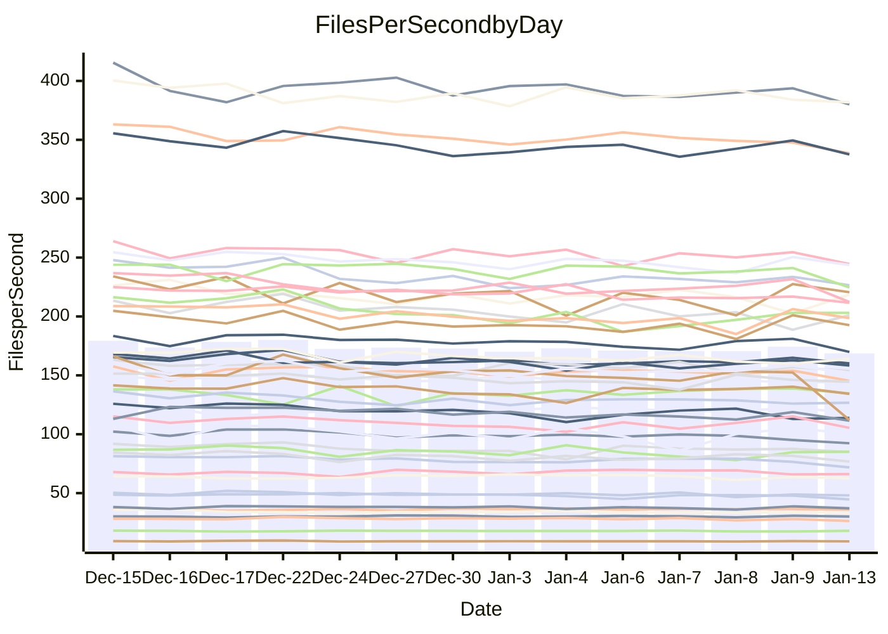

<!---
# This file is auto-generated. Do not edit.
# cspell:disable
--->
# Performance Report

## Daily Performance

## Time to Process Files

| Repository                                      | Elapsed | Min/Avg/Max           |   SD | SD Graph                |
| ----------------------------------------------- | ------: | :-------------------: | ---: | ----------------------- |
| AdaDoom3/AdaDoom3                    |    3.18 | 2.8 /   3.0 /   3.2   | 0.09 | `    ┣━━┻━━╋━━┻━●┫    ` |
| alexiosc/megistos                    |    7.25 | 6.7 /   7.2 /   8.1   | 0.33 | `    ┣━━┻━━●━━┻━━┫    ` |
| apollographql/apollo-server          |    2.59 | 2.1 /   2.3 /   2.8   | 0.11 | `    ┣━━┻━━╋━━┻━━┫●   ` |
| aspnetboilerplate/aspnetboilerplate  |   10.24 | 8.9 /   9.6 /  10.4   | 0.36 | `    ┣━━┻━━╋━━┻━━●    ` |
| aws-amplify/docs                     |   13.61 | 11.5 /  11.9 /  12.5  | 0.32 | `      ┣━┻━╋━┻━┫     ●` |
| Azure/azure-rest-api-specs           |   21.52 | 13.8 /  16.1 /  21.0  | 1.48 | `    ┣━━┻━━╋━━┻━━┫   ●` |
| bitjson/typescript-starter           |    0.66 | 0.6 /   0.7 /   0.7   | 0.02 | `     ┣━━┻━●━┻━━┫     ` |
| caddyserver/caddy                    |    3.22 | 3.0 /   3.3 /   3.7   | 0.18 | `    ┣━━┻━●╋━━┻━━┫    ` |
| canada-ca/open-source-logiciel-libre |    0.78 | 0.7 /   0.8 /   0.8   | 0.02 | `     ┣━━┻━╋●┻━━┫     ` |
| chef/chef                            |    5.44 | 5.1 /   5.5 /   6.6   | 0.34 | `    ┣━━┻━━●━━┻━━┫    ` |
| dart-lang/sdk                        |   62.50 | 57.6 /  60.4 /  65.0  | 1.67 | `  ┣━━━┻━━━╋━━━┻●━━┫  ` |
| django/django                        |   14.90 | 13.5 /  14.5 /  16.1  | 0.60 | `   ┣━━━┻━━╋━●┻━━━┫   ` |
| eslint/eslint                        |   10.30 | 9.5 /  10.2 /  11.2   | 0.39 | `    ┣━━┻━━╋●━┻━━┫    ` |
| exonum/exonum                        |    3.15 | 2.9 /   3.1 /   3.5   | 0.13 | `    ┣━━┻━━╋●━┻━━┫    ` |
| flutter/samples                      |   18.15 | 16.0 /  17.2 /  22.0  | 1.04 | `   ┣━━━┻━━╋━━●━━━┫   ` |
| gitbucket/gitbucket                  |    3.14 | 3.0 /   3.2 /   3.4   | 0.11 | `    ┣━━┻━●╋━━┻━━┫    ` |
| googleapis/google-cloud-cpp          |  128.03 | 117.0 / 127.9 / 139.4 | 4.70 | `  ┣━━━┻━━━●━━━┻━━━┫  ` |
| graphql/express-graphql              |    0.73 | 0.7 /   0.7 /   0.8   | 0.02 | `     ┣━━┻━╋━●━━┫     ` |
| graphql/graphql-js                   |    2.31 | 2.1 /   2.2 /   2.4   | 0.07 | `     ┣━┻━━╋━━●━┫     ` |
| graphql/graphql-relay-js             |    0.79 | 0.7 /   0.7 /   0.8   | 0.02 | `     ┣━━┻━╋━┻━━●     ` |
| graphql/graphql-spec                 |    0.83 | 0.8 /   0.8 /   0.9   | 0.02 | `     ┣━━┻●╋━┻━━┫     ` |
| iluwatar/java-design-patterns        |   11.77 | 10.7 /  11.4 /  12.2  | 0.32 | `    ┣━━┻━━╋━━┻●━┫    ` |
| ktaranov/sqlserver-kit               |    6.45 | 5.9 /   6.2 /   7.2   | 0.26 | `    ┣━━┻━━╋━●┻━━┫    ` |
| liriliri/licia                       |    3.87 | 3.3 /   3.6 /   3.9   | 0.11 | `    ┣━━┻━━╋━━┻━━●    ` |
| MartinThoma/LaTeX-examples           |    6.74 | 6.1 /   6.4 /   6.8   | 0.15 | `    ┣━━┻━━╋━━┻━━●    ` |
| mdx-js/mdx                           |    1.68 | 1.5 /   1.6 /   1.8   | 0.07 | `     ┣━┻━━╋━●┻━┫     ` |
| microsoft/TypeScript-Website         |    5.26 | 4.9 /   5.2 /   5.4   | 0.12 | `    ┣━━┻━━╋━●┻━━┫    ` |
| MicrosoftDocs/PowerShell-Docs        |   19.50 | 17.6 /  19.2 /  25.8  | 1.49 | `   ┣━━━┻━━╋●━┻━━━┫   ` |
| neovim/nvim-lspconfig                |    3.46 | 2.8 /   3.1 /   3.4   | 0.13 | `    ┣━━┻━━╋━━┻━━┫ ●  ` |
| pagekit/pagekit                      |    3.48 | 3.1 /   3.4 /   3.8   | 0.17 | `    ┣━━┻━━╋●━┻━━┫    ` |
| php/php-src                          |   22.18 | 20.3 /  22.4 /  28.4  | 1.75 | `   ┣━━┻━━━●━━━┻━━┫   ` |
| plasticrake/tplink-smarthome-api     |    0.90 | 0.9 /   0.9 /   1.0   | 0.03 | `     ┣━┻━●╋━━┻━┫     ` |
| prettier/prettier                    |    6.50 | 6.0 /   6.4 /   7.2   | 0.21 | `    ┣━━┻━━╋━●┻━━┫    ` |
| pycontribs/jira                      |    1.31 | 1.2 /   1.2 /   1.3   | 0.04 | `     ┣━┻━━╋━━┻●┫     ` |
| RustPython/RustPython                |    4.38 | 4.0 /   4.2 /   5.1   | 0.21 | `    ┣━━┻━━╋━●┻━━┫    ` |
| shoelace-style/shoelace              |    2.69 | 2.3 /   2.5 /   2.7   | 0.07 | `     ┣━┻━━╋━━┻━┫   ● ` |
| slint-ui/slint                       |    9.69 | 8.7 /   9.7 /  11.8   | 0.67 | `    ┣━━┻━━●━━┻━━┫    ` |
| SoftwareBrothers/admin-bro           |    2.21 | 2.0 /   2.2 /   2.3   | 0.09 | `     ┣━┻━━╋━●┻━┫     ` |
| sveltejs/svelte                      |   18.49 | 17.2 /  18.3 /  19.1  | 0.39 | `    ┣━━┻━━╋●━┻━━┫    ` |
| TheAlgorithms/Python                 |    5.51 | 5.0 /   5.4 /   5.8   | 0.19 | `    ┣━━┻━━╋━●┻━━┫    ` |
| twbs/bootstrap                       |    1.30 | 1.1 /   1.2 /   1.4   | 0.06 | `     ┣━┻━━╋━━┻●┫     ` |
| typescript-cheatsheets/react         |    1.11 | 1.1 /   1.1 /   1.3   | 0.06 | `     ┣━┻━━●━━┻━┫     ` |
| typescript-eslint/typescript-eslint  |    3.79 | 3.4 /   3.6 /   3.8   | 0.09 | `    ┣━━┻━━╋━━┻━━●    ` |
| vitest-dev/vitest                    |    8.06 | 7.2 /   7.8 /   8.4   | 0.27 | `    ┣━━┻━━╋━━●━━┫    ` |
| w3c/aria-practices                   |    2.89 | 2.7 /   2.9 /   3.2   | 0.13 | `    ┣━━┻━●╋━━┻━━┫    ` |
| w3c/specberus                        |    1.67 | 1.6 /   1.7 /   1.8   | 0.04 | `     ┣━┻━━●━━┻━┫     ` |
| webdeveric/webpack-assets-manifest   |    0.74 | 0.6 /   0.7 /   0.8   | 0.02 | `     ┣━━┻━╋━┻━━┫  ●  ` |
| webpack/webpack                      |    5.04 | 4.6 /   4.8 /   5.3   | 0.19 | `    ┣━━┻━━╋━━●━━┫    ` |
| wireapp/wire-desktop                 |    0.89 | 0.8 /   0.9 /   1.0   | 0.03 | `     ┣━┻━━╋●━┻━┫     ` |
| wireapp/wire-webapp                  |    8.84 | 7.5 /   8.2 /   8.8   | 0.28 | `    ┣━━┻━━╋━━┻━━┫●   ` |

Note:
- Elapsed time is in seconds.

## Files per Second over Time

| Repository                                      | Files |    Sec |    Fps |     Rel | Trend Fps              |    N |
| ----------------------------------------------- | ----: | -----: | -----: | ------: | ---------------------- | ---: |
| AdaDoom3/AdaDoom3                    |   103 |   3.18 |  32.37 |  -5.10% | `▇▇▇▇▇▆▇▇▆█▅▇▆▆▇▅▆▇▇▅` |   29 |
| alexiosc/megistos                    |   583 |   7.25 |  80.41 |  -0.56% | `▇█▇▇█▆▃▅█▇▅▆▆▆▇█▇▇▄▇` |   29 |
| apollographql/apollo-server          |   250 |   2.59 |  96.38 | -12.09% | `▆▇▆▆▆▆▇▅▇▆█▇▃█▇▇█▇▇▄` |   32 |
| aspnetboilerplate/aspnetboilerplate  |  2246 |  10.24 | 219.28 |  -6.65% | `▇▆█▇▇▇▇▄▅▆▆█▇▆▇▅█▇▇▅` |   29 |
| aws-amplify/docs                     |  2865 |  13.61 | 210.49 | -12.21% | `██▇▅▇▅▆▅▇▇▇▆▅▇▆▇▇▅▅▁` |   31 |
| Azure/azure-rest-api-specs           |  2364 |  21.52 | 109.85 | -27.25% | `▇█▇█▇██▇▆▇▇▆▅██▇▇▂▂▂` |   32 |
| bitjson/typescript-starter           |    20 |   0.66 |  30.24 |  -0.10% | `██▇███▆▇▅▇█▆▇█▆▄█▇▆▇` |   29 |
| caddyserver/caddy                    |   279 |   3.22 |  86.70 |   2.52% | `▇▇▇▄▆▅▅█▆▅▇▅▃▆▄▄▆▇▅▇` |   32 |
| canada-ca/open-source-logiciel-libre |     7 |   0.78 |   9.03 |  -1.20% | `▇▇▇▇███▇█▇▇███▆▆▆█▇▇` |   29 |
| chef/chef                            |  1204 |   5.44 | 221.52 |   0.64% | `▅▇██▅▇▆█▅▆██▄▇▃▇█▆█▇` |   30 |
| dart-lang/sdk                        | 10077 |  62.50 | 161.24 |  -2.99% | `▆██▆▆▇▆▇▇▇▄█▇▇▆▅▅▇▆▆` |   32 |
| django/django                        |  2820 |  14.90 | 189.28 |  -2.53% | `▆▇▅█▇▆▇▆▅▇▅█▆▇▆▄█▇▇▆` |   32 |
| eslint/eslint                        |  2038 |  10.30 | 197.88 |  -1.43% | `█▇█▅█▆▆▇▅▆▇▅▇█▄▅█▇▇▇` |   32 |
| exonum/exonum                        |   421 |   3.15 | 133.86 |  -0.95% | `▃▅▇█▇▆▇▆▆▇▇▆██▆█▇█▇▇` |   29 |
| flutter/samples                      |  2690 |  18.15 | 148.25 |  -5.58% | `▇▇▇▂▇█▇▇▆▇█▇▇█▇▅▇▇▇▆` |   32 |
| gitbucket/gitbucket                  |   412 |   3.14 | 131.27 |   1.37% | `██▆█▄█▅▇▆████▆▆█▆▆▅█` |   32 |
| googleapis/google-cloud-cpp          | 19742 | 128.03 | 154.19 |  -0.27% | `█▆▇▇▇▆▄▇█▇▅▅█▇▇▇█▆▇▇` |   32 |
| graphql/express-graphql              |    26 |   0.73 |  35.60 |  -2.17% | `▇▄███▆▆▇██▇▇▇▇▇▇▇▇▇▆` |   29 |
| graphql/graphql-js                   |   339 |   2.31 | 146.50 |  -4.07% | `█▇██▇▇▇▄█▇▇█▇▇█▇▇█▅▆` |   30 |
| graphql/graphql-relay-js             |    28 |   0.79 |  35.57 |  -6.05% | `█▇▇▇▅█▇██▆▆█▅█▆▄▆██▅` |   29 |
| graphql/graphql-spec                 |    15 |   0.83 |  18.10 |   1.09% | `▆█▇▆▆▇▅▇█▆▆▇▆▇█▅▆▅▇▇` |   29 |
| iluwatar/java-design-patterns        |  1892 |  11.77 | 160.70 |  -1.04% | `▇█▆▆▇█▆▆▇▄█▆▇█▅██▇▆▆` |   32 |
| ktaranov/sqlserver-kit               |   489 |   6.45 |  75.78 |  -3.45% | `▇█▇▇▆▆▇▆▆▆█▇█▇▇▇█▆▃▆` |   30 |
| liriliri/licia                       |  1434 |   3.87 | 370.10 |  -6.26% | `█▇█▆▅▇█▇▇▅▆▇▇▇▅▇▇▇▇▄` |   30 |
| MartinThoma/LaTeX-examples           |  1409 |   6.74 | 208.98 |  -4.97% | `▇▇▇▇▅▇▆▇▇█▆▅▄▆▇▅▇▆▆▅` |   29 |
| mdx-js/mdx                           |   142 |   1.68 |  84.54 |  -3.86% | `▅█▇▆▃█▅▆▄███▇▆▇▇▆▇▆▆` |   30 |
| microsoft/TypeScript-Website         |   757 |   5.26 | 144.00 |  -2.00% | `▇█▅▅█▆▇▆▇▆▄▆▆▅▆▇▅▇▅▅` |   31 |
| MicrosoftDocs/PowerShell-Docs        |  2236 |  19.50 | 114.67 |  -2.05% | `█▆▅▆▇▇▇▆▆▇▇▆▆▆▅▇▇▆▅▆` |   32 |
| neovim/nvim-lspconfig                |   375 |   3.46 | 108.43 |  -9.75% | `▆▇█▇▇█▄▄▆▆▅▇▇▇▇█▅▆▅▃` |   32 |
| pagekit/pagekit                      |   741 |   3.48 | 213.09 |  -2.63% | `▆▃█▅▆▅▃▇▅▆▆▆▇█▅▇▄▄▇▅` |   29 |
| php/php-src                          |  2213 |  22.18 |  99.76 |   0.27% | `▇▆██▄▆██▇▆▇▅▂▅▇▇█▆█▇` |   32 |
| plasticrake/tplink-smarthome-api     |    62 |   0.90 |  68.57 |   1.45% | `▇█▆▇▇█▆▆▇▇█▇▇▇█▇█▆▅▇` |   29 |
| prettier/prettier                    |  2205 |   6.50 | 339.45 |  -1.45% | `█▇█▄█▆█████▆▇▆▇██▇▆▇` |   32 |
| pycontribs/jira                      |    80 |   1.31 |  61.19 |  -4.74% | `▇▇▅█▇▇█▇█▇█▆█▆▆▄▅▆▇▅` |   29 |
| RustPython/RustPython                |   620 |   4.38 | 141.51 |  -3.77% | `█▇█▇▅▇█▇██▅▇█▃██▇▇▇▆` |   32 |
| shoelace-style/shoelace              |   438 |   2.69 | 163.06 |  -8.50% | `▇▆█▆▇▆█▇▇▇▇▅▆▄▇█▇█▇▄` |   31 |
| slint-ui/slint                       |  1973 |   9.69 | 203.67 |   0.48% | `█▆▆██▅▅▇▅█▃▅▅█▆▇▇▇▇▇` |   32 |
| SoftwareBrothers/admin-bro           |   441 |   2.21 | 199.19 |  -2.98% | `▆▇██▅▅▆▄▇▅█▇▅▄▇▆▆▄▆▅` |   29 |
| sveltejs/svelte                      |  7145 |  18.49 | 386.49 |  -0.54% | `██▆▇▆▆▆█▇▇▇█▆▇█▇▇▇▅▇` |   32 |
| TheAlgorithms/Python                 |  1367 |   5.51 | 248.09 |  -1.89% | `█▆▅▆▆▄▇▇▅▅▄▆▆▆▅▆▆▅▄▅` |   32 |
| twbs/bootstrap                       |   120 |   1.30 |  92.46 |  -6.90% | `▆▅▅▆██▅▆▆▄▇▆▆▆▇▆▇▅▄▄` |   31 |
| typescript-cheatsheets/react         |    53 |   1.11 |  47.68 |  -0.63% | `▇██▇█▇██▇▃█▇▇▇█▇▇▃▆▇` |   30 |
| typescript-eslint/typescript-eslint  |  1277 |   3.79 | 336.78 |  -4.67% | `▇▇▇▇▅█▇▇▇██▆▇█▆▇▇▆▆▅` |   32 |
| vitest-dev/vitest                    |  1946 |   8.06 | 241.32 |  -2.18% | `█▆▆▇▇▅▆▇▇▆██▅▅▄▆▇▆▇▆` |   32 |
| w3c/aria-practices                   |   405 |   2.89 | 140.23 |   1.78% | `█▆▄▄██▇▇▄▄▇▇▇▆▆▇▇▇▄▇` |   30 |
| w3c/specberus                        |   200 |   1.67 | 119.94 |  -0.43% | `▇▇▇▆▆▇▅▇▇▇▆▆▆▇█▄▇▆▅▆` |   31 |
| webdeveric/webpack-assets-manifest   |    19 |   0.74 |  25.55 |  -9.63% | `▇▆▇█▆█▇▆██▆▇██▇▇▃▇▅▄` |   29 |
| webpack/webpack                      |  1095 |   5.04 | 217.20 |  -4.19% | `▅▆▆▆▆▆█▆▆▅█▄▄▆▇▇▆▇▄▅` |   30 |
| wireapp/wire-desktop                 |    43 |   0.89 |  48.50 |  -1.20% | `▇█▆▆▆▆▇▇█▅▆███▇▄▇▆▆▆` |   32 |
| wireapp/wire-webapp                  |  1345 |   8.84 | 152.10 |  -6.26% | `████▆▇█▅▅██▅▅▇▇▆▇▇▇▄` |   32 |

## Data Throughput

| Repository                                      | Files |    Sec |     Kps |     Rel | Trend Kps              |    N |
| ----------------------------------------------- | ----: | -----: | ------: | ------: | ---------------------- | ---: |
| AdaDoom3/AdaDoom3                    |   103 |   3.18 |  687.87 |  -5.10% | `▇▇▇▇▇▆▇▇▆█▅▇▆▆▇▅▆▇▇▅` |   29 |
| alexiosc/megistos                    |   583 |   7.25 |  631.82 |  -0.56% | `▇█▇▇█▆▃▅█▇▅▆▆▆▇█▇▇▄▇` |   29 |
| apollographql/apollo-server          |   250 |   2.59 |  771.39 | -12.02% | `▆▇▆▆▆▆▇▅▇▆█▇▃█▇▇█▇▇▄` |   32 |
| aspnetboilerplate/aspnetboilerplate  |  2246 |  10.24 |  515.89 |  -6.65% | `▇▆█▇▇▇▇▄▅▆▆█▇▆▇▅█▇▇▅` |   29 |
| aws-amplify/docs                     |  2865 |  13.61 |  721.97 | -12.11% | `██▇▅▇▅▆▅▇▇▇▆▅▇▆▇▇▅▅▁` |   31 |
| Azure/azure-rest-api-specs           |  2364 |  21.52 |  316.45 | -27.26% | `▇█▇█▇██▇▇▇▇▆▅██▇▇▂▂▂` |   32 |
| bitjson/typescript-starter           |    20 |   0.66 |  120.96 |  -0.10% | `██▇███▆▇▅▇█▆▇█▆▄█▇▆▇` |   29 |
| caddyserver/caddy                    |   279 |   3.22 |  723.14 |   2.75% | `▇▇▇▄▆▅▅█▆▅▇▅▃▆▄▄▆▇▅▇` |   32 |
| canada-ca/open-source-logiciel-libre |     7 |   0.78 |   74.79 |  -1.20% | `▇▇▇▇███▇█▇▇███▆▆▆█▇▇` |   29 |
| chef/chef                            |  1204 |   5.44 | 1017.26 |   0.63% | `▅▇██▅▇▆█▅▆██▄▇▃▇█▆█▇` |   30 |
| dart-lang/sdk                        | 10077 |  62.50 | 1150.07 |  -3.00% | `▆██▆▆▇▆▇▇▇▄█▇▇▆▅▅▇▆▆` |   32 |
| django/django                        |  2820 |  14.90 | 1172.08 |  -2.36% | `▆▇▅█▇▆▇▆▅▇▅█▆▇▆▄█▇▇▆` |   32 |
| eslint/eslint                        |  2038 |  10.30 | 1617.33 |  -1.31% | `█▇█▅▇▆▆▇▅▆▇▅▇█▄▅█▇▇▇` |   32 |
| exonum/exonum                        |   421 |   3.15 | 1280.45 |  -0.95% | `▃▅▇█▇▆▇▆▆▇▇▆██▆█▇█▇▇` |   29 |
| flutter/samples                      |  2690 |  18.15 | 1200.74 |  -5.58% | `▇▇▇▂▇█▇▇▆▇█▇▇█▇▅▇▇▇▆` |   32 |
| gitbucket/gitbucket                  |   412 |   3.14 |  593.90 |   1.39% | `██▆█▄█▅▇▆████▆▆█▆▆▅█` |   32 |
| googleapis/google-cloud-cpp          | 19742 | 128.03 | 1203.72 |  -0.32% | `█▆▇▇▇▆▄▇█▇▅▅█▇▇▇█▆▇▇` |   32 |
| graphql/express-graphql              |    26 |   0.73 |  162.93 |  -2.17% | `▇▄███▆▆▇██▇▇▇▇▇▇▇▇▇▆` |   29 |
| graphql/graphql-js                   |   339 |   2.31 |  832.34 |  -4.07% | `█▇██▇▇▇▄█▇▇█▇▇█▇▇█▅▆` |   30 |
| graphql/graphql-relay-js             |    28 |   0.79 |  139.72 |  -6.05% | `█▇▇▇▅█▇██▆▆█▅█▆▄▆██▅` |   29 |
| graphql/graphql-spec                 |    15 |   0.83 |  665.98 |   1.09% | `▆█▇▆▆▇▅▇█▆▆▇▆▇█▅▆▅▇▇` |   29 |
| iluwatar/java-design-patterns        |  1892 |  11.77 |  493.64 |  -1.34% | `▇█▆▆▇█▆▆▇▄█▆▇█▅██▇▆▆` |   32 |
| ktaranov/sqlserver-kit               |   489 |   6.45 | 1146.45 |  -3.45% | `▇█▇▇▆▆▇▆▆▆█▇█▇▇▇█▆▃▆` |   30 |
| liriliri/licia                       |  1434 |   3.87 |  438.50 |  -6.26% | `█▇█▆▅▇█▇▇▅▆▇▇▇▅▇▇▇▇▄` |   30 |
| MartinThoma/LaTeX-examples           |  1409 |   6.74 |  431.61 |  -4.97% | `▇▇▇▇▅▇▆▇▇█▆▅▄▆▇▅▇▆▆▅` |   29 |
| mdx-js/mdx                           |   142 |   1.68 |  391.15 |  -4.06% | `▅█▇▆▃█▅▆▄█▇█▇▆▇▇▆▇▆▆` |   30 |
| microsoft/TypeScript-Website         |   757 |   5.26 |  986.12 |  -2.00% | `▇█▅▅█▆▇▆▇▆▄▆▆▅▆▇▅▇▅▅` |   31 |
| MicrosoftDocs/PowerShell-Docs        |  2236 |  19.50 | 1145.51 |  -2.00% | `█▆▅▆▇▇▇▆▆▇▇▆▆▆▅▇▇▆▅▆` |   32 |
| neovim/nvim-lspconfig                |   375 |   3.46 |  283.36 |  -9.70% | `▆▇█▇▇█▄▄▆▆▅▇▇▇▇█▅▆▅▃` |   32 |
| pagekit/pagekit                      |   741 |   3.48 |  444.31 |  -2.63% | `▆▃█▅▆▅▃▇▅▆▆▆▇█▅▇▄▄▇▅` |   29 |
| php/php-src                          |  2213 |  22.18 | 1461.04 |   0.32% | `▇▆██▄▆██▇▆▇▅▂▅▇▇█▆█▇` |   32 |
| plasticrake/tplink-smarthome-api     |    62 |   0.90 |  370.52 |   1.45% | `▇█▆▇▇█▆▆▇▇█▇▇▇█▇█▆▅▇` |   29 |
| prettier/prettier                    |  2205 |   6.50 |  479.23 |  -1.54% | `█▇█▄█▆█████▇▇▆▇██▇▆▇` |   32 |
| pycontribs/jira                      |    80 |   1.31 |  421.48 |  -4.74% | `▇▇▅█▇▇█▇█▇█▆█▆▆▄▅▆▇▅` |   29 |
| RustPython/RustPython                |   620 |   4.38 | 1046.75 |  -3.58% | `█▇█▇▅▇█▇██▅▇█▃██▇▇▇▆` |   32 |
| shoelace-style/shoelace              |   438 |   2.69 |  783.29 |  -8.47% | `▇▆█▆▇▆█▇▇▇▇▅▆▄▇█▇█▇▄` |   31 |
| slint-ui/slint                       |  1973 |   9.69 | 1046.00 |   0.68% | `█▆▆██▅▅▇▅█▃▅▅▇▆▆▇▇▇▇` |   32 |
| SoftwareBrothers/admin-bro           |   441 |   2.21 |  439.04 |  -2.98% | `▆▇██▅▅▆▄▇▅█▇▅▄▇▆▆▄▆▅` |   29 |
| sveltejs/svelte                      |  7145 |  18.49 |  256.34 |   0.13% | `██▆▇▅▆▆█▇▇▇█▆▇█▇▇▇▆▇` |   32 |
| TheAlgorithms/Python                 |  1367 |   5.51 |  630.66 |  -1.68% | `█▆▅▆▆▄▇▇▆▅▄▆▆▆▅▆▆▅▅▅` |   32 |
| twbs/bootstrap                       |   120 |   1.30 |  742.02 |  -6.90% | `▆▅▅▆██▅▆▆▄▇▆▆▆▇▆▇▅▄▄` |   31 |
| typescript-cheatsheets/react         |    53 |   1.11 |  349.03 |  -0.63% | `▇██▇█▇██▇▃█▇▇▇█▇▇▃▆▇` |   30 |
| typescript-eslint/typescript-eslint  |  1277 |   3.79 | 1629.06 |  -3.58% | `▇▇▇▆▅▇▇▇▇██▆▇█▆▇▇▆▆▆` |   32 |
| vitest-dev/vitest                    |  1946 |   8.06 |  497.03 |  -2.30% | `█▆▆▇▇▅▆▇▇▆██▅▅▄▆▇▆▇▆` |   32 |
| w3c/aria-practices                   |   405 |   2.89 | 1302.23 |   1.72% | `█▆▄▄██▇▇▄▄▇▇▇▆▆▇▇▇▄▇` |   30 |
| w3c/specberus                        |   200 |   1.67 |  382.60 |  -0.43% | `▇▇▇▆▆▇▅▇▇▇▆▆▆▇█▄▇▆▅▆` |   31 |
| webdeveric/webpack-assets-manifest   |    19 |   0.74 |  137.17 |  -9.63% | `▇▆▇█▆█▇▆██▆▇██▇▇▃▇▅▄` |   29 |
| webpack/webpack                      |  1095 |   5.04 |  958.25 |  -4.17% | `▅▆▆▆▆▆█▆▆▅█▄▄▆▇▇▆▇▄▅` |   30 |
| wireapp/wire-desktop                 |    43 |   0.89 |  214.31 |  -1.20% | `▇█▆▆▆▆▇▇█▅▆███▇▄▇▆▆▆` |   32 |
| wireapp/wire-webapp                  |  1345 |   8.84 |  614.72 |  -6.48% | `████▆▇█▅▅██▅▅▇▇▆▇▇▆▄` |   32 |

