<!---
# This file is auto-generated. Do not edit.
# cspell:disable
--->
# Performance Report

## Daily Performance

```mermaid
xychart-beta
    title Files Per Second by Day
    y-axis Files per Second
    x-axis Date [Jan-20, Jan-21, Jan-22, Jan-26, Jan-27, Jan-28, Jan-29, Feb-2, Feb-5, Feb-8, Feb-9, Feb-10, Feb-11, Feb-12, Feb-16, Feb-17, Feb-18, Feb-19]
    bar [168.43, 169.86, 170.44, 173.21, 172.82, 168.69, 170.17, 172.76, 169.39, 173.94, 176.68, 172.01, 170.80, 172.59, 172.20, 169.11, 168.97, 169.87]
    line [105.90, 107.50, 104.30, 108.52, 110.13, 106.78, 107.20, 109.65, 110.63, 111.16, 110.94, 109.21, 107.83, 106.68, 110.60, 103.95, 102.58, 106.20]
    line [80.87, 81.08, 81.74, 87.91, 80.34, 86.50, 86.84, 88.66, 83.22, 85.59, 83.52, 82.54, 80.25, 85.24, 86.74, 82.84, 86.83, 81.45]
    line [146.83, 148.17, 142.81, 152.72, 147.54, 147.09, 145.41, 148.70, 151.93, 151.71, 152.93, 151.27, 147.55, 140.92, 151.13, 151.76, 153.31, 151.18]
    line [123.93, 133.11, 122.76, 127.88, 128.69, 130.23, 128.77, 121.54, 127.82, 124.27, 124.62, 123.31, 125.03, 120.42, 129.98, 129.47, 127.87, 128.69]
    line [196.43, 199.84, 197.78, 203.69, 196.52, 194.52, 195.98, 201.87, 201.12, 204.97, 199.43, 190.33, 187.01, 193.91, 197.53, 192.34, 207.35, 190.87]
    line [229.01, 219.68, 219.77, 209.49, 204.94, 198.04, 223.32, 227.45, 204.37, 225.14, 223.42, 222.08, 213.20, 215.50, 225.73, 187.50, 197.59, 213.32]
    line [158.69, 156.26, 158.43, 164.60, 154.09, 155.59, 154.71, 166.16, 160.94, 165.57, 174.04, 154.30, 162.65, 156.66, 162.87, 159.96, 155.64, 155.90]
    line [219.38, 227.33, 226.70, 233.87, 217.12, 216.93, 224.01, 224.86, 217.64, 233.33, 222.49, 222.54, 219.50, 226.16, 240.10, 228.96, 219.08, 223.33]
    line [344.00, 340.27, 346.07, 341.26, 330.59, 326.24, 336.05, 350.02, 336.18, 342.95, 339.36, 335.43, 338.51, 330.30, 316.59, 330.53, 328.24, 334.55]
    line [120.28, 114.69, 112.28, 117.78, 116.14, 114.78, 110.96, 118.96, 114.84, 114.56, 119.99, 116.03, 111.12, 110.27, 121.81, 115.35, 117.70, 117.45]
    line [147.59, 143.59, 141.42, 143.21, 141.20, 143.98, 143.78, 140.14, 135.87, 142.86, 142.75, 143.10, 145.82, 143.11, 140.65, 144.98, 130.98, 140.65]
    line [200.41, 200.50, 201.35, 196.11, 202.03, 205.84, 210.33, 202.30, 198.84, 204.68, 214.35, 200.27, 199.54, 204.14, 192.69, 201.75, 206.87, 197.87]
    line [139.36, 140.95, 149.41, 138.21, 138.55, 146.90, 148.25, 146.04, 146.87, 144.71, 150.09, 144.64, 141.32, 141.68, 136.63, 142.32, 134.55, 145.82]
    line [232.25, 239.53, 241.09, 233.83, 229.73, 231.27, 235.75, 232.76, 227.56, 235.60, 244.14, 228.71, 227.46, 228.82, 232.02, 224.80, 222.16, 236.53]
    line [187.45, 187.38, 192.87, 195.04, 191.69, 194.48, 178.97, 199.11, 192.32, 196.15, 196.80, 192.49, 195.28, 196.29, 194.83, 188.10, 194.84, 192.66]
    line [0.00, 0.00, 0.00, 256.11, 255.68, 274.20, 237.51, 254.20, 253.57, 266.34, 269.39, 246.86, 267.66, 266.35, 265.66, 244.28, 246.16, 242.48]
    line [117.45, 107.89, 115.63, 108.80, 113.98, 108.63, 112.03, 101.57, 107.21, 115.59, 114.29, 115.98, 101.55, 113.56, 109.85, 113.73, 114.86, 110.85]
    line [190.09, 194.48, 202.39, 197.93, 196.32, 205.82, 204.70, 203.85, 198.04, 207.86, 211.91, 205.36, 214.41, 205.57, 188.86, 196.47, 206.41, 197.46]
    line [146.52, 155.23, 146.60, 152.95, 153.44, 146.68, 148.04, 159.34, 150.93, 158.41, 157.97, 156.56, 158.71, 155.41, 159.62, 150.02, 150.05, 151.55]
    line [242.10, 243.52, 243.78, 252.46, 245.33, 245.88, 247.56, 250.17, 242.23, 239.94, 251.24, 247.36, 235.88, 244.92, 253.98, 247.84, 251.30, 245.99]
    line [111.61, 121.49, 119.94, 120.57, 119.01, 117.99, 117.30, 120.43, 119.43, 118.96, 118.43, 117.39, 122.51, 116.51, 115.88, 120.25, 110.42, 115.69]
    line [98.43, 101.26, 97.05, 98.45, 98.30, 100.11, 81.16, 97.62, 97.16, 101.86, 100.35, 99.46, 93.91, 99.01, 106.34, 93.17, 91.86, 97.86]
    line [385.76, 384.74, 382.99, 381.11, 378.87, 384.64, 371.32, 391.09, 379.53, 386.07, 370.43, 367.95, 383.26, 380.80, 385.48, 383.39, 382.12, 384.41]
    line [349.61, 348.67, 336.98, 334.45, 346.57, 346.60, 352.58, 347.78, 346.57, 347.57, 348.75, 351.19, 348.15, 346.62, 351.78, 343.88, 338.94, 349.19]
    line [247.79, 237.71, 245.48, 250.24, 239.03, 246.34, 215.04, 240.95, 243.60, 242.70, 251.69, 234.31, 244.51, 240.78, 255.22, 243.34, 248.23, 244.44]
    line [96.90, 99.42, 91.88, 98.65, 96.11, 99.25, 100.66, 103.18, 98.24, 96.65, 104.96, 94.67, 90.15, 101.17, 99.92, 94.76, 95.38, 95.32]
    line [49.98, 48.14, 47.57, 46.02, 47.96, 48.80, 46.78, 47.79, 48.42, 47.97, 48.95, 44.92, 41.33, 48.11, 48.93, 47.91, 47.47, 47.85]
    line [155.39, 161.05, 158.62, 159.47, 158.84, 149.03, 155.81, 162.82, 158.93, 165.88, 167.89, 164.45, 156.78, 159.08, 161.56, 165.23, 166.55, 160.76]
    line [163.17, 162.82, 166.39, 165.48, 164.06, 162.34, 156.27, 166.07, 155.61, 164.06, 170.66, 167.78, 165.93, 167.97, 164.38, 154.74, 166.79, 161.65]
    line [138.47, 151.83, 152.31, 153.48, 154.19, 144.39, 154.19, 151.10, 150.58, 152.48, 156.02, 149.70, 153.17, 152.51, 149.58, 151.17, 145.28, 150.19]
    line [0.00, 32.53, 32.97, 33.70, 32.82, 33.62, 33.93, 33.23, 33.25, 33.77, 34.38, 31.28, 33.43, 33.24, 30.53, 33.31, 33.04, 33.28]
    line [0.00, 9.21, 8.99, 8.69, 9.06, 9.17, 8.90, 9.14, 9.10, 8.87, 9.39, 9.10, 8.79, 9.11, 8.93, 8.64, 9.05, 8.51]
    line [0.00, 78.41, 81.03, 80.80, 79.69, 83.58, 77.01, 80.34, 79.32, 79.86, 81.63, 78.70, 79.41, 80.42, 80.99, 80.08, 80.78, 76.61]
    line [0.00, 30.87, 30.00, 28.70, 30.12, 29.90, 29.99, 31.08, 29.80, 28.87, 23.26, 29.91, 29.82, 30.05, 30.35, 28.52, 29.28, 29.65]
    line [0.00, 37.76, 37.89, 38.81, 37.93, 37.35, 37.58, 36.65, 37.87, 37.52, 36.62, 36.71, 35.21, 36.78, 37.62, 37.74, 36.57, 37.30]
    line [0.00, 17.39, 18.17, 18.55, 17.57, 16.82, 17.76, 17.39, 17.79, 18.01, 16.74, 16.81, 17.17, 15.81, 18.35, 18.08, 17.18, 16.76]
    line [0.00, 35.24, 34.68, 33.94, 35.92, 35.70, 34.97, 35.24, 35.24, 35.29, 34.51, 36.01, 35.10, 35.21, 35.98, 34.82, 36.43, 35.46]
    line [0.00, 127.27, 127.81, 130.32, 132.03, 125.54, 132.09, 121.09, 133.64, 133.48, 121.84, 129.06, 122.93, 124.68, 125.50, 128.25, 133.90, 127.83]
    line [0.00, 77.82, 78.41, 77.74, 77.78, 73.82, 74.60, 78.73, 76.88, 78.62, 77.47, 76.02, 78.07, 71.09, 77.64, 74.87, 74.07, 74.98]
    line [0.00, 67.48, 67.27, 65.41, 67.07, 67.22, 68.71, 67.83, 67.42, 64.50, 68.29, 67.95, 63.94, 63.10, 68.79, 65.40, 66.62, 66.45]
    line [0.00, 392.61, 391.87, 384.72, 385.87, 389.43, 389.76, 387.86, 381.95, 388.55, 388.50, 387.75, 391.57, 373.53, 385.59, 389.88, 390.09, 378.81]
    line [0.00, 214.36, 216.75, 217.84, 220.87, 215.44, 214.77, 213.40, 220.70, 222.08, 221.01, 216.87, 215.38, 220.23, 212.12, 219.37, 215.84, 210.18]
    line [0.00, 63.19, 63.24, 64.72, 62.00, 60.00, 63.28, 59.94, 63.60, 64.06, 62.64, 63.65, 63.88, 60.68, 64.42, 62.12, 63.28, 58.66]
    line [0.00, 87.43, 86.48, 87.49, 84.71, 86.94, 81.29, 88.85, 83.51, 88.25, 87.06, 84.92, 87.81, 86.69, 87.24, 85.15, 85.90, 85.00]
    line [0.00, 174.64, 178.29, 177.69, 180.46, 173.36, 171.47, 176.27, 176.08, 177.50, 180.37, 179.50, 169.53, 174.82, 178.71, 168.06, 176.19, 177.57]
    line [0.00, 45.59, 47.24, 46.87, 46.43, 46.80, 47.45, 47.29, 47.35, 47.86, 48.05, 47.30, 43.46, 46.02, 48.76, 47.89, 47.85, 48.05]
    line [0.00, 214.23, 216.83, 222.41, 215.81, 211.64, 216.10, 218.52, 215.06, 216.88, 216.99, 208.40, 212.31, 208.84, 217.81, 211.80, 185.28, 215.46]
    line [0.00, 141.02, 138.02, 132.73, 140.24, 138.48, 133.03, 140.20, 137.55, 139.32, 138.06, 134.03, 131.86, 138.50, 133.91, 133.44, 124.24, 137.70]
    line [0.00, 229.76, 226.99, 229.64, 213.50, 236.23, 220.41, 211.45, 222.13, 224.72, 223.26, 221.76, 223.13, 220.88, 230.21, 215.32, 197.56, 224.48]
    line [0.00, 27.74, 27.10, 28.41, 27.77, 28.43, 27.26, 29.20, 28.78, 27.22, 28.25, 25.94, 28.04, 27.66, 26.73, 25.95, 28.09, 26.29]
```

## Time to Process Files

| Repository                                      | Elapsed | Min/Avg/Max           |   SD | SD Graph                |
| ----------------------------------------------- | ------: | :-------------------: | ---: | ----------------------- |
| AdaDoom3/AdaDoom3                    |    3.04 | 3.0 /   3.1 /   3.4   | 0.10 | `    ┣━━┻●━╋━━┻━━┫    ` |
| alexiosc/megistos                    |    7.31 | 6.8 /   7.3 /   8.2   | 0.22 | `    ┣━━┻━━●━━┻━━┫    ` |
| apollographql/apollo-server          |    2.44 | 2.2 /   2.3 /   2.5   | 0.07 | `     ┣━┻━━╋━━┻━●     ` |
| aspnetboilerplate/aspnetboilerplate  |    9.96 | 9.4 /  10.0 /  11.3   | 0.40 | `    ┣━━┻━●╋━━┻━━┫    ` |
| aws-amplify/docs                     |   12.00 | 11.7 /  12.4 /  13.1  | 0.38 | `    ┣━━●━━╋━━┻━━┫    ` |
| Azure/azure-rest-api-specs           |    9.71 | 0.0 /   8.0 /  10.4   | 3.26 | `   ┣━━━┻━━╋━●┻━━━┫   ` |
| bitjson/typescript-starter           |    0.66 | 0.6 /   0.7 /   0.9   | 0.04 | `     ┣━┻━●╋━━┻━┫     ` |
| caddyserver/caddy                    |    3.26 | 3.1 /   3.4 /   3.7   | 0.15 | `    ┣━━┻●━╋━━┻━━┫    ` |
| canada-ca/open-source-logiciel-libre |    0.97 | 0.7 /   0.8 /   0.9   | 0.03 | `       ┣┻━╋━┻┫      ●` |
| chef/chef                            |    5.45 | 5.3 /   5.7 /   8.2   | 0.53 | `    ┣━━┻●━╋━━┻━━┫    ` |
| dart-lang/sdk                        |   61.36 | 59.1 /  62.1 /  67.6  | 2.15 | `  ┣━━━┻━━●╋━━━┻━━━┫  ` |
| django/django                        |   14.55 | 14.2 /  14.7 /  15.8  | 0.36 | `    ┣━━┻━●╋━━┻━━┫    ` |
| eslint/eslint                        |   10.27 | 9.8 /  10.5 /  11.9   | 0.41 | `    ┣━━┻━●╋━━┻━━┫    ` |
| exonum/exonum                        |    3.40 | 3.0 /   3.3 /   3.7   | 0.15 | `    ┣━━┻━━╋━●┻━━┫    ` |
| flutter/samples                      |   19.89 | 16.6 /  17.6 /  19.5  | 0.66 | `    ┣━━┻━━╋━━┻━━┫   ●` |
| gitbucket/gitbucket                  |    3.20 | 3.0 /   3.3 /   3.6   | 0.12 | `    ┣━━┻━●╋━━┻━━┫    ` |
| googleapis/google-cloud-cpp          |  126.82 | 125.8 / 131.6 / 142.8 | 4.19 | `  ┣━━●┻━━━╋━━━┻━━━┫  ` |
| graphql/express-graphql              |    0.76 | 0.7 /   0.7 /   0.8   | 0.02 | `     ┣━━┻━╋━┻━●┫     ` |
| graphql/graphql-js                   |    2.28 | 2.2 /   2.3 /   2.5   | 0.07 | `     ┣━┻━●╋━━┻━┫     ` |
| graphql/graphql-relay-js             |    0.77 | 0.7 /   0.7 /   0.8   | 0.02 | `     ┣━━┻━╋━┻●━┫     ` |
| graphql/graphql-spec                 |    0.82 | 0.8 /   0.9 /   1.1   | 0.06 | `     ┣━┻●━╋━━┻━┫     ` |
| iluwatar/java-design-patterns        |   13.64 | 10.9 /  12.0 /  13.1  | 0.47 | `    ┣━━┻━━╋━━┻━━┫   ●` |
| ktaranov/sqlserver-kit               |    6.95 | 6.1 /   6.4 /   7.0   | 0.21 | `    ┣━━┻━━╋━━┻━━┫ ●  ` |
| liriliri/licia                       |    3.75 | 3.5 /   3.7 /   3.9   | 0.09 | `    ┣━━┻━━╋●━┻━━┫    ` |
| MartinThoma/LaTeX-examples           |    6.60 | 6.3 /   6.6 /   7.6   | 0.25 | `    ┣━━┻━━●━━┻━━┫    ` |
| mdx-js/mdx                           |    1.83 | 1.6 /   1.6 /   1.9   | 0.06 | `     ┣━┻━━╋━━┻━┫  ●  ` |
| microsoft/TypeScript-Website         |    5.33 | 5.0 /   5.4 /   5.9   | 0.21 | `    ┣━━┻━━●━━┻━━┫    ` |
| MicrosoftDocs/PowerShell-Docs        |   26.79 | 22.5 /  24.3 /  28.9  | 1.28 | `   ┣━━┻━━━╋━━━┻━━●   ` |
| neovim/nvim-lspconfig                |    3.25 | 3.1 /   3.3 /   3.7   | 0.13 | `    ┣━━┻━●╋━━┻━━┫    ` |
| pagekit/pagekit                      |    3.51 | 3.3 /   3.4 /   3.7   | 0.09 | `    ┣━━┻━━╋━━●━━┫    ` |
| php/php-src                          |   23.48 | 21.1 /  23.0 /  26.5  | 1.44 | `   ┣━━┻━━━╋●━━┻━━┫   ` |
| plasticrake/tplink-smarthome-api     |    0.91 | 0.9 /   0.9 /   1.1   | 0.04 | `     ┣━┻●━╋━━┻━┫     ` |
| prettier/prettier                    |    6.62 | 6.2 /   6.6 /   7.2   | 0.20 | `    ┣━━┻━━╋●━┻━━┫    ` |
| pycontribs/jira                      |    1.45 | 1.2 /   1.3 /   1.5   | 0.05 | `     ┣━┻━━╋━━┻━┫  ●  ` |
| RustPython/RustPython                |    4.17 | 4.1 /   4.3 /   4.8   | 0.17 | `    ┣━━●━━╋━━┻━━┫    ` |
| shoelace-style/shoelace              |    2.41 | 2.4 /   2.5 /   2.8   | 0.08 | `     ┣━●━━╋━━┻━┫     ` |
| slint-ui/slint                       |    9.69 | 9.2 /  10.0 /  13.1   | 0.68 | `    ┣━━┻●━╋━━┻━━┫    ` |
| SoftwareBrothers/admin-bro           |    2.21 | 2.1 /   2.2 /   2.3   | 0.07 | `     ┣━┻━━╋●━┻━┫     ` |
| sveltejs/svelte                      |   18.69 | 18.4 /  18.9 /  20.1  | 0.38 | `   ┣━━━┻●━╋━━┻━━━┫   ` |
| TheAlgorithms/Python                 |    5.48 | 5.3 /   5.6 /   6.1   | 0.18 | `    ┣━━┻●━╋━━┻━━┫    ` |
| twbs/bootstrap                       |    1.45 | 1.1 /   1.2 /   1.5   | 0.07 | `     ┣━┻━━╋━━┻━┫   ● ` |
| typescript-cheatsheets/react         |    1.10 | 1.1 /   1.1 /   1.3   | 0.04 | `     ┣━┻●━╋━━┻━┫     ` |
| typescript-eslint/typescript-eslint  |    3.67 | 3.6 /   3.7 /   3.8   | 0.06 | `    ┣━━┻━●╋━━┻━━┫    ` |
| vitest-dev/vitest                    |    8.04 | 7.7 /   8.1 /   9.2   | 0.31 | `    ┣━━┻━●╋━━┻━━┫    ` |
| w3c/aria-practices                   |    2.96 | 2.9 /   3.0 /   3.3   | 0.09 | `    ┣━━┻━━●━━┻━━┫    ` |
| w3c/specberus                        |    1.77 | 1.6 /   1.7 /   1.8   | 0.05 | `     ┣━┻━━╋━━┻━●     ` |
| webdeveric/webpack-assets-manifest   |    0.70 | 0.7 /   0.7 /   0.8   | 0.04 | `     ┣━┻━━●━━┻━┫     ` |
| webpack/webpack                      |    4.81 | 4.6 /   4.9 /   5.5   | 0.20 | `    ┣━━┻●━╋━━┻━━┫    ` |
| wireapp/wire-desktop                 |    0.88 | 0.9 /   0.9 /   1.1   | 0.05 | `     ┣━┻━●╋━━┻━┫     ` |
| wireapp/wire-webapp                  |    8.88 | 8.2 /   8.7 /  10.0   | 0.33 | `    ┣━━┻━━╋●━┻━━┫    ` |

Note:
- Elapsed time is in seconds.

## Files per Second over Time

| Repository                                      | Files |    Sec |    Fps |     Rel | Trend Fps              |    N |
| ----------------------------------------------- | ----: | -----: | -----: | ------: | ---------------------- | ---: |
| AdaDoom3/AdaDoom3                    |   103 |   3.04 |  33.92 |   2.56% | `▇▇██▄▅█▇▇▇▄▇█▆▇▆▇▇██` |   33 |
| alexiosc/megistos                    |   583 |   7.31 |  79.72 |   0.23% | `██▇██▆▇██▇██▇██▇▇▆▄▇` |   33 |
| apollographql/apollo-server          |   250 |   2.44 | 102.40 |  -5.11% | `███▆▇▇▇▆▇▅█▄▆▆▅▅▅█▇▅` |   36 |
| aspnetboilerplate/aspnetboilerplate  |  2246 |   9.96 | 225.47 |   0.71% | `▆▇▇▆▆▆▅▆▇▆█▇▇▇▆▆▄▇█▆` |   34 |
| aws-amplify/docs                     |  2867 |  12.00 | 238.93 |   3.08% | `▇▇█▅▆▇▅▆▆▆▆▆▅▄▅▆█▇▆▇` |   36 |
| Azure/azure-rest-api-specs           |  2373 |   9.71 | 244.42 |  11.30% | `████▇██████▇▇▇▇▇▇▇▇▇` |   36 |
| bitjson/typescript-starter           |    20 |   0.66 |  30.20 |   2.26% | `▇▇▅▂▆█▇▇▇██▄▇█▇▇▆▇▇▇` |   33 |
| caddyserver/caddy                    |   279 |   3.26 |  85.53 |   2.84% | `▆█▆▆▆▅▇▃▆▇▇▇▆▅▇▅▆▆▃▇` |   36 |
| canada-ca/open-source-logiciel-libre |     7 |   0.97 |   7.24 | -19.36% | `▇▅██▇▇▇▅█▆▆▅▆▆▇▇▆▃█▁` |   33 |
| chef/chef                            |  1204 |   5.45 | 220.79 |   4.38% | `▅███▇█▆█▇▇█▂▇▆▆▇█▅▆▇` |   35 |
| dart-lang/sdk                        | 10108 |  61.36 | 164.72 |   1.24% | `▇▇███▆▇▇█▇▇▅▄▅▇▆▅▆▇▇` |   36 |
| django/django                        |  2833 |  14.55 | 194.76 |   1.22% | `▇██▆▇▇▇▇▇█▇▅▆▇▇▇▇▇▆▇` |   36 |
| eslint/eslint                        |  2058 |  10.27 | 200.35 |   2.24% | `█▇▇▅▅▆▇▃▅▇▇▆▆▅█▅▆▆▅▇` |   36 |
| exonum/exonum                        |   421 |   3.40 | 123.92 |  -3.66% | `███▅▆▇▆▅█▃▆▅▇███▇▅▇▅` |   33 |
| flutter/samples                      |  2684 |  19.89 | 134.94 | -11.99% | `▆█▇▇▇▇██▇▇█▅▅▇▆▇▅▇█▃` |   35 |
| gitbucket/gitbucket                  |   412 |   3.20 | 128.93 |   1.64% | `▅█▆█▅▅▇▆▆▄█▇██▇▇█▇██` |   36 |
| googleapis/google-cloud-cpp          | 19818 | 126.82 | 156.27 |   3.72% | `▆██▇▆▆▇▇▇▇▆▇▆█▅▅▇▅██` |   36 |
| graphql/express-graphql              |    26 |   0.76 |  34.04 |  -3.67% | `▇▆▇▆▇█▇▆▅█▇▅▆▇██▇▇█▅` |   33 |
| graphql/graphql-js                   |   343 |   2.28 | 150.53 |   0.84% | `▇█▇█▇▇▆▆▅▄▇▇▇█▇██▆▇▇` |   35 |
| graphql/graphql-relay-js             |    28 |   0.77 |  36.20 |  -3.11% | `█▇▇▆▆▆▄▆▆▆▇█▇▇▆▇▇█▇▆` |   33 |
| graphql/graphql-spec                 |    15 |   0.82 |  18.24 |   5.27% | `██▆▄█▆▇▆▇▂████▇█▇▄▄█` |   34 |
| iluwatar/java-design-patterns        |  1917 |  13.64 | 140.49 | -11.97% | `▆▇▇█▆▃▆▆▇▃▆▆▅▅▅▅▆▆▅▂` |   34 |
| ktaranov/sqlserver-kit               |   489 |   6.95 |  70.35 |  -7.88% | `▇▇▇▇▇▆█▆▅▃▇▇▅▅▅▆▆▆▇▄` |   33 |
| liriliri/licia                       |  1434 |   3.75 | 382.17 |  -0.99% | `▅▆▆▆▅▇▆▇▆▄▆█▄▆▆▅▅▆▄▅` |   33 |
| MartinThoma/LaTeX-examples           |  1409 |   6.60 | 213.33 |  -0.09% | `▇▇█▇█▅▇▆▇▅█▆▇▇▃▇█▇▇▇` |   33 |
| mdx-js/mdx                           |   141 |   1.83 |  76.95 | -10.64% | `██▇▇▇▆▇▇█▆▇▇▅█▇▆█▇▇▄` |   33 |
| microsoft/TypeScript-Website         |   760 |   5.33 | 142.55 |   0.57% | `▅▇▆▇▇▅█▆▆▆▆▅▇█▄▄▆▇▅▆` |   36 |
| MicrosoftDocs/PowerShell-Docs        |  2709 |  26.79 | 101.11 |  -9.40% | `▇▇▇▇▆█▆▂▆▇▆▇▆▇▇▇▇▇▆▄` |   36 |
| neovim/nvim-lspconfig                |   379 |   3.25 | 116.66 |   1.06% | `▆▆█▆█▆▅▆▇▃█▇▇▆▇▆▇▇█▇` |   36 |
| pagekit/pagekit                      |   741 |   3.51 | 210.85 |  -2.82% | `▇▇█▇▅█▆▇▇▇▆▇▇▇▇▄▇▅▇▆` |   33 |
| php/php-src                          |  2221 |  23.48 |  94.59 |  -2.38% | `▇▅█▅▅▇▃▆▇█▇▆▆▄▆▃▇█▅▅` |   36 |
| plasticrake/tplink-smarthome-api     |    62 |   0.91 |  68.16 |   2.59% | `▇▅▇█▇██▃▇▃█▆▆▇▇▆▇▇▆▇` |   33 |
| prettier/prettier                    |  2197 |   6.62 | 331.78 |  -1.12% | `▇▇▆▆▆▆▅█▅▇▄▃▇▇▅▆▆▆▅▆` |   36 |
| pycontribs/jira                      |    80 |   1.45 |  55.20 | -11.52% | `▇██▇██▇█▆▇██▆▆▇▆▃▆▇▄` |   33 |
| RustPython/RustPython                |   622 |   4.17 | 149.02 |   3.82% | `▇▆█▇▆▆▅▆▆▆▅▇█▃▄▆▇█▆█` |   36 |
| shoelace-style/shoelace              |   438 |   2.41 | 181.93 |   3.67% | `█▇▇█▇█▇▅▆▇▇▃▇▆▇▇█▆▇█` |   33 |
| slint-ui/slint                       |  2058 |   9.69 | 212.48 |   5.86% | `▇██▇▇▇███▆▅▇▅▆▇▇▇▂▇█` |   36 |
| SoftwareBrothers/admin-bro           |   441 |   2.21 | 199.70 |  -0.88% | `▆▇▆█▅▆▆▅▇▆▄▇▆▅▇▄▅▆▆▆` |   34 |
| sveltejs/svelte                      |  7215 |  18.69 | 386.10 |   1.33% | `▇█▆▇▅▄▇▇▇▇██▇▇▇▇█▇██` |   36 |
| TheAlgorithms/Python                 |  1369 |   5.48 | 250.01 |   1.96% | `▅▇▇▇▇▆▇▄▅██▆█▆▇▇█▅▇▇` |   36 |
| twbs/bootstrap                       |   120 |   1.45 |  82.77 | -15.56% | `▇▇▇▆█▆▆▅▇▆█▅▆▄▅▇▇▇▇▃` |   36 |
| typescript-cheatsheets/react         |    53 |   1.10 |  48.18 |   2.40% | `▆▇▇▇▆▇▃▆▆▇█▇▇▇▇▇▇█▇▇` |   33 |
| typescript-eslint/typescript-eslint  |  1282 |   3.67 | 349.13 |   0.70% | `▆█▇▇██▆█▆██▇▇▆▆▇▇▇█▇` |   36 |
| vitest-dev/vitest                    |  1978 |   8.04 | 245.89 |   1.46% | `▆▇█▇▇▃▆█▆▇█▇▆▇▇▇▇▆▇▇` |   36 |
| w3c/aria-practices                   |   405 |   2.96 | 136.87 |   0.21% | `▇███▆▇▇▅▇█▆▅▇█▄██▇▇▇` |   33 |
| w3c/specberus                        |   200 |   1.77 | 112.68 |  -4.84% | `▆▇▇▅▆▇██▆▆▆▆▇█▄█▆▄▅▅` |   36 |
| webdeveric/webpack-assets-manifest   |    19 |   0.70 |  27.22 |  -0.75% | `█▇▆▇▇▄▇▇█▅▆▆▇▃▇▇▇▄▄▆` |   33 |
| webpack/webpack                      |  1096 |   4.81 | 228.00 |   2.58% | `█▇▇▆▇▇▆█▇▆█▅█▄▃▇█▆▇█` |   34 |
| wireapp/wire-desktop                 |    43 |   0.88 |  48.76 |   2.88% | `▇██▇█▂▄▄█▇█▆██▇▆█▇▇█` |   36 |
| wireapp/wire-webapp                  |  1443 |   8.88 | 162.58 |   1.39% | `▇▇▇▇▆▇▅▅▆▆▆█▇▆▇▃▆▇█▆` |   36 |

## Data Throughput

| Repository                                      | Files |    Sec |     Kps |     Rel | Trend Kps              |    N |
| ----------------------------------------------- | ----: | -----: | ------: | ------: | ---------------------- | ---: |
| AdaDoom3/AdaDoom3                    |   103 |   3.04 |  720.92 |   2.56% | `▇▇██▄▅█▇▇▇▄▇█▆▇▆▇▇██` |   33 |
| alexiosc/megistos                    |   583 |   7.31 |  626.39 |   0.23% | `██▇██▆▇██▇██▇██▇▇▆▄▇` |   33 |
| apollographql/apollo-server          |   250 |   2.44 |  819.99 |  -5.09% | `███▆▇▇▇▆▇▅█▄▆▆▅▅▅█▇▅` |   36 |
| aspnetboilerplate/aspnetboilerplate  |  2246 |   9.96 |  530.55 |   0.72% | `▆▇▇▆▆▆▅▆▇▆█▇▇▇▆▆▄▇█▆` |   34 |
| aws-amplify/docs                     |  2867 |  12.00 |  824.04 |   3.29% | `▇▇█▅▆▇▅▆▆▆▆▆▅▅▅▇█▇▆▇` |   36 |
| Azure/azure-rest-api-specs           |  2373 |   9.71 |  702.87 |  -3.77% | `███▆▃▇███▇█▅▅▅▅▄▅▆▅▅` |   31 |
| bitjson/typescript-starter           |    20 |   0.66 |  120.79 |   2.26% | `▇▇▅▂▆█▇▇▇██▄▇█▇▇▆▇▇▇` |   33 |
| caddyserver/caddy                    |   279 |   3.26 |  719.46 |   3.49% | `▆█▆▆▆▅▇▃▆▇▇▇▆▅█▅▆▆▄▇` |   36 |
| canada-ca/open-source-logiciel-libre |     7 |   0.97 |   60.00 | -19.36% | `▇▅██▇▇▇▅█▆▆▅▆▆▇▇▆▃█▁` |   33 |
| chef/chef                            |  1204 |   5.45 | 1014.47 |   4.39% | `▅███▇█▆█▇▇█▂▇▆▆▇█▅▆▇` |   35 |
| dart-lang/sdk                        | 10108 |  61.36 | 1158.02 |   0.75% | `▇▇███▆▇▇█▇▇▅▅▅▇▆▅▆▇▇` |   36 |
| django/django                        |  2833 |  14.55 | 1200.78 |   1.10% | `▇██▆▇▇▇▇▇█▇▅▆▇▇▇▆▇▆▇` |   36 |
| eslint/eslint                        |  2058 |  10.27 | 1629.65 |   1.82% | `█▇▇▅▅▆▇▃▅▇▇▆▆▅█▅▆▆▅▇` |   36 |
| exonum/exonum                        |   421 |   3.40 | 1185.38 |  -3.66% | `███▅▆▇▆▅█▃▆▅▇███▇▅▇▅` |   33 |
| flutter/samples                      |  2684 |  19.89 | 1105.60 | -11.24% | `▅▇▇▇▇▇▇▇▇▆▇▅▅▇▆▇▅▇█▃` |   35 |
| gitbucket/gitbucket                  |   412 |   3.20 |  583.01 |   1.64% | `▅█▆█▅▅▇▆▆▄█▇██▇▇█▇██` |   36 |
| googleapis/google-cloud-cpp          | 19818 | 126.82 | 1226.31 |   3.91% | `▆██▇▆▆▇▇▇▇▆▇▆█▅▅▇▅██` |   36 |
| graphql/express-graphql              |    26 |   0.76 |  155.79 |  -3.67% | `▇▆▇▆▇█▇▆▅█▇▅▆▇██▇▇█▅` |   33 |
| graphql/graphql-js                   |   343 |   2.28 |  846.11 |   0.55% | `▇█▇█▇▇▆▆▅▄▇▆▇█▇██▆▇▇` |   35 |
| graphql/graphql-relay-js             |    28 |   0.77 |  142.23 |  -3.11% | `█▇▇▆▆▆▄▆▆▆▇█▇▇▆▇▇█▇▆` |   33 |
| graphql/graphql-spec                 |    15 |   0.82 |  672.51 |   5.37% | `██▆▄█▆▇▆▇▂████▇█▇▄▄█` |   34 |
| iluwatar/java-design-patterns        |  1917 |  13.64 |  430.79 | -11.97% | `▆▇▇█▆▃▆▆▇▃▆▆▅▅▅▅▆▆▅▂` |   34 |
| ktaranov/sqlserver-kit               |   489 |   6.95 | 1064.37 |  -7.88% | `▇▇▇▇▇▆█▆▅▃▇▇▅▅▅▆▆▆▇▄` |   33 |
| liriliri/licia                       |  1434 |   3.75 |  452.80 |  -0.99% | `▅▆▆▆▅▇▆▇▆▄▆█▄▆▆▅▅▆▄▅` |   33 |
| MartinThoma/LaTeX-examples           |  1409 |   6.60 |  440.59 |  -0.09% | `▇▇█▇█▅▇▆▇▅█▆▇▇▃▇█▇▇▇` |   33 |
| mdx-js/mdx                           |   141 |   1.83 |  356.93 | -10.56% | `██▇▇▇▆▇▇█▆▇▇▅█▇▆█▇▇▄` |   33 |
| microsoft/TypeScript-Website         |   760 |   5.33 |  982.65 |   0.88% | `▅▇▆▇▇▅█▆▆▆▆▅▇█▄▄▆▇▅▆` |   36 |
| MicrosoftDocs/PowerShell-Docs        |  2709 |  26.79 | 1036.71 |  -9.41% | `▇▇▇▇▆█▆▂▆▇▆▇▆▇▇▇▇▇▆▄` |   36 |
| neovim/nvim-lspconfig                |   379 |   3.25 |  306.57 |   1.25% | `▆▆█▆█▆▅▆▇▃█▇▇▆▇▆▇▇█▇` |   36 |
| pagekit/pagekit                      |   741 |   3.51 |  439.63 |  -2.82% | `▇▇█▇▅█▆▇▇▇▆▇▇▇▇▄▇▅▇▆` |   33 |
| php/php-src                          |  2221 |  23.48 | 1394.42 |  -1.93% | `▇▅█▅▅▇▃▆▇▇▇▆▆▄▆▄▇█▅▆` |   36 |
| plasticrake/tplink-smarthome-api     |    62 |   0.91 |  368.31 |   2.59% | `▇▅▇█▇██▃▇▃█▆▆▇▇▆▇▇▆▇` |   33 |
| prettier/prettier                    |  2197 |   6.62 |  470.71 |  -0.86% | `▆▇▆▆▆▆▅█▅▇▄▃▇▇▅▆▆▆▅▆` |   36 |
| pycontribs/jira                      |    80 |   1.45 |  380.16 | -11.52% | `▇██▇██▇█▆▇██▆▆▇▆▃▆▇▄` |   33 |
| RustPython/RustPython                |   622 |   4.17 | 1104.96 |   3.85% | `▇▆█▇▆▆▅▆▆▆▅▇█▃▄▆▇█▆█` |   36 |
| shoelace-style/shoelace              |   438 |   2.41 |  876.86 |   3.79% | `█▇▇█▇█▇▅▆▇▇▃▇▆▇▇█▆▇█` |   33 |
| slint-ui/slint                       |  2058 |   9.69 | 1086.98 |   4.95% | `▇██▇▇▇███▆▅▇▅▆▇▇▇▂▇▇` |   36 |
| SoftwareBrothers/admin-bro           |   441 |   2.21 |  440.16 |  -0.88% | `▆▇▆█▅▆▆▅▇▆▄▇▆▅▇▄▅▆▆▆` |   34 |
| sveltejs/svelte                      |  7215 |  18.69 |  256.22 |   1.33% | `▇█▆▇▅▄▇▇▇▇██▇▇▇▇█▇██` |   36 |
| TheAlgorithms/Python                 |  1369 |   5.48 |  635.15 |   1.96% | `▅▇▇▇▇▆▇▄▅██▆█▆▇▇█▅▇▇` |   36 |
| twbs/bootstrap                       |   120 |   1.45 |  664.22 | -15.56% | `▇▇▇▆█▆▆▅▇▆█▅▆▄▅▇▇▇▇▃` |   36 |
| typescript-cheatsheets/react         |    53 |   1.10 |  352.74 |   2.40% | `▆▇▇▇▆▇▃▆▆▇█▇▇▇▇▇▇█▇▇` |   33 |
| typescript-eslint/typescript-eslint  |  1282 |   3.67 | 1717.86 |   1.19% | `▆█▇▇██▇█▆██▇▇▆▆▇▇▇█▇` |   36 |
| vitest-dev/vitest                    |  1978 |   8.04 |  514.91 |   1.59% | `▆▇█▇▇▃▆█▆▇█▇▆▇▇▇█▆▇▇` |   36 |
| w3c/aria-practices                   |   405 |   2.96 | 1271.02 |   0.21% | `▇███▆▇▇▅▇█▆▅▇█▄██▇▇▇` |   33 |
| w3c/specberus                        |   200 |   1.77 |  359.45 |  -4.84% | `▆▇▇▅▆▇██▆▆▆▆▇█▄█▆▄▅▅` |   36 |
| webdeveric/webpack-assets-manifest   |    19 |   0.70 |  146.11 |  -0.75% | `█▇▆▇▇▄▇▇█▅▆▆▇▃▇▇▇▄▄▆` |   33 |
| webpack/webpack                      |  1096 |   4.81 | 1005.40 |   2.53% | `█▇▇▆▇▇▆█▇▆█▅█▄▃▇█▆▇█` |   34 |
| wireapp/wire-desktop                 |    43 |   0.88 |  215.46 |   2.88% | `▇██▇█▂▄▄█▇█▆██▇▆█▇▇█` |   36 |
| wireapp/wire-webapp                  |  1443 |   8.88 |  637.60 |  -0.24% | `▇██▇▇▇▆▆▆▆▇█▇▆▇▃▆▇█▆` |   36 |

