<!---
# This file is auto-generated. Do not edit.
# cspell:disable
--->
# Performance Report

## Daily Performance

```mermaid
xychart-beta
    title Files Per Second by Day
    y-axis Files per Second
    x-axis Date [Sep-16, Sep-17, Sep-18, Sep-22, Sep-23, Sep-29, Sep-30, Oct-1, Oct-2, Oct-5, Oct-6, Oct-7, Oct-8, Oct-11, Oct-12, Oct-13, Oct-14]
    bar [170.99, 174.42, 176.15, 171.49, 170.60, 174.68, 172.58, 170.62, 174.06, 173.76, 175.18, 167.77, 172.56, 174.72, 174.80, 173.09, 173.07]
    line [165.69, 164.68, 158.25, 149.51, 158.09, 156.96, 161.98, 156.93, 156.41, 149.87, 157.99, 141.60, 155.38, 153.06, 161.38, 158.74, 155.97]
    line [97.25, 88.47, 97.89, 91.06, 89.08, 89.06, 0.00, 90.96, 91.55, 91.45, 89.01, 89.93, 92.54, 91.94, 92.43, 91.86, 91.43]
    line [138.57, 140.62, 141.72, 135.93, 132.42, 137.90, 131.39, 125.40, 131.62, 137.96, 132.77, 133.94, 139.73, 137.65, 140.36, 140.00, 121.49]
    line [200.94, 202.64, 174.86, 188.42, 184.98, 195.97, 189.74, 185.35, 183.52, 187.14, 186.91, 184.49, 190.34, 184.90, 191.40, 193.56, 193.91]
    line [120.09, 120.05, 120.31, 117.43, 109.01, 117.33, 114.51, 112.29, 112.71, 117.07, 113.67, 118.94, 116.57, 114.56, 116.10, 116.86, 117.70]
    line [371.23, 373.66, 361.57, 355.78, 361.81, 351.17, 345.43, 358.65, 356.52, 361.50, 361.77, 337.36, 348.77, 353.66, 372.23, 376.04, 354.51]
    line [109.51, 113.51, 116.46, 104.81, 102.79, 108.89, 103.13, 103.52, 105.79, 106.73, 104.92, 104.71, 106.75, 108.13, 101.27, 106.27, 112.19]
    line [91.70, 93.14, 88.50, 84.12, 92.41, 91.76, 86.84, 88.64, 90.41, 87.11, 90.10, 90.92, 89.47, 92.20, 91.07, 91.35, 89.78]
    line [256.30, 250.62, 253.31, 250.10, 236.21, 245.48, 0.00, 255.93, 241.02, 253.94, 247.24, 250.16, 247.84, 257.30, 241.45, 254.85, 256.56]
    line [131.30, 132.64, 136.81, 125.88, 123.97, 123.26, 124.35, 122.36, 124.05, 124.82, 124.36, 126.90, 126.65, 124.16, 125.33, 122.83, 127.53]
    line [272.54, 275.91, 275.97, 256.03, 258.54, 258.01, 259.58, 248.67, 257.34, 264.03, 258.40, 245.57, 255.62, 256.53, 267.31, 267.66, 273.39]
    line [141.14, 143.95, 140.92, 145.29, 140.59, 139.11, 138.01, 142.88, 137.23, 141.05, 142.08, 136.09, 140.30, 140.84, 142.21, 147.18, 137.06]
    line [228.77, 208.66, 221.89, 226.09, 216.90, 207.46, 223.39, 229.16, 221.30, 218.51, 213.71, 226.50, 211.28, 231.85, 230.37, 233.32, 230.64]
    line [130.97, 130.22, 113.06, 109.25, 122.56, 121.09, 0.00, 125.59, 123.97, 124.90, 124.88, 121.42, 120.13, 125.23, 126.18, 127.75, 126.92]
    line [156.36, 155.63, 151.63, 151.94, 152.50, 152.06, 143.32, 149.19, 148.32, 152.02, 145.55, 150.72, 145.51, 147.65, 155.73, 148.69, 146.37]
    line [261.30, 254.48, 241.79, 249.14, 250.28, 251.57, 258.18, 242.58, 250.83, 263.10, 252.70, 241.96, 249.38, 255.08, 251.27, 258.06, 255.05]
    line [52.86, 55.21, 52.35, 50.94, 48.45, 51.30, 50.59, 50.58, 49.72, 51.81, 51.47, 51.46, 49.27, 52.29, 51.68, 51.92, 49.16]
    line [216.66, 208.33, 215.69, 211.15, 207.60, 206.93, 205.06, 202.44, 206.85, 213.52, 209.33, 205.65, 212.19, 211.98, 207.11, 214.60, 209.10]
    line [150.27, 151.44, 153.53, 138.23, 146.78, 144.54, 144.66, 146.29, 145.95, 142.41, 140.78, 134.58, 143.93, 146.90, 145.68, 147.98, 135.81]
    line [247.48, 255.65, 251.83, 237.98, 246.89, 242.54, 243.09, 224.03, 244.08, 244.73, 243.65, 240.74, 243.74, 239.12, 246.59, 246.26, 241.93]
    line [257.49, 249.43, 247.25, 248.88, 251.75, 245.20, 245.06, 224.85, 248.59, 243.98, 250.11, 234.68, 247.40, 251.29, 257.74, 255.41, 259.28]
    line [163.08, 171.82, 163.97, 154.58, 167.67, 161.60, 161.14, 157.44, 164.03, 168.37, 169.06, 165.80, 166.84, 164.39, 168.52, 168.53, 170.44]
    line [121.66, 124.08, 126.72, 119.08, 118.45, 114.87, 112.49, 118.05, 117.81, 119.24, 117.86, 123.32, 114.00, 121.45, 118.50, 116.19, 116.94]
    line [203.09, 207.23, 202.88, 201.82, 207.79, 207.90, 201.29, 209.19, 206.95, 209.81, 203.73, 200.20, 213.26, 206.70, 211.33, 212.01, 214.13]
    line [390.24, 382.26, 399.81, 383.04, 391.20, 384.82, 375.34, 397.41, 398.74, 397.51, 404.63, 387.08, 393.22, 408.11, 410.12, 411.75, 397.97]
    line [89.86, 94.27, 91.54, 90.45, 90.71, 92.55, 89.39, 93.96, 94.53, 91.86, 93.63, 92.24, 93.65, 93.28, 96.70, 96.06, 84.96]
    line [185.74, 153.97, 189.99, 184.11, 172.95, 176.46, 163.78, 167.39, 166.94, 167.31, 168.16, 155.92, 171.13, 172.58, 170.12, 170.46, 173.33]
    line [175.60, 176.44, 174.39, 169.65, 170.91, 168.95, 166.28, 173.86, 166.13, 172.49, 168.21, 168.21, 165.09, 168.91, 166.70, 169.55, 180.50]
    line [161.23, 172.09, 168.48, 164.20, 163.31, 169.03, 172.29, 155.24, 169.60, 174.57, 174.90, 177.64, 175.96, 179.86, 179.47, 169.37, 176.48]
    line [137.67, 143.95, 148.30, 144.49, 142.14, 152.04, 143.84, 146.29, 149.93, 144.74, 149.38, 131.76, 142.06, 143.05, 142.42, 140.40, 141.50]
    line [41.01, 42.53, 38.05, 39.43, 38.14, 38.94, 0.00, 39.96, 38.12, 39.36, 39.89, 40.71, 37.67, 39.08, 38.81, 40.21, 38.53]
    line [139.70, 143.74, 112.39, 139.33, 141.10, 137.72, 0.00, 139.61, 138.23, 136.68, 137.77, 141.66, 138.90, 142.32, 142.51, 137.71, 138.73]
    line [82.19, 82.78, 80.29, 80.65, 77.47, 76.93, 0.00, 78.07, 78.18, 79.10, 80.49, 80.39, 81.56, 80.21, 80.63, 79.72, 79.60]
    line [33.18, 30.65, 34.02, 29.87, 31.63, 30.68, 0.00, 31.32, 30.89, 30.33, 30.00, 31.45, 30.76, 31.21, 29.46, 30.45, 31.71]
    line [19.75, 19.58, 19.44, 18.99, 18.71, 18.44, 0.00, 13.99, 17.93, 18.69, 18.90, 19.50, 18.93, 19.44, 19.72, 19.51, 18.96]
    line [9.68, 9.92, 9.37, 9.23, 9.26, 8.29, 0.00, 8.90, 8.75, 9.30, 8.76, 9.01, 8.84, 9.20, 8.48, 9.17, 9.20]
    line [35.98, 35.70, 34.54, 34.55, 33.11, 34.81, 0.00, 35.17, 34.81, 34.91, 35.03, 36.57, 35.78, 36.79, 36.72, 35.66, 37.22]
    line [40.08, 36.34, 39.18, 37.74, 37.18, 36.89, 0.00, 37.27, 36.89, 37.25, 36.15, 31.44, 37.05, 36.96, 37.36, 36.75, 35.81]
    line [444.77, 437.29, 443.15, 426.39, 420.42, 425.42, 0.00, 405.76, 418.50, 419.89, 411.38, 400.59, 419.52, 424.04, 423.37, 423.41, 422.78]
    line [230.87, 227.16, 231.88, 223.22, 214.31, 216.24, 0.00, 216.91, 219.11, 218.12, 224.03, 220.33, 226.62, 230.28, 218.75, 223.84, 221.67]
    line [82.79, 83.96, 85.57, 82.01, 81.81, 82.67, 0.00, 83.49, 80.99, 81.07, 83.35, 85.60, 81.23, 82.10, 82.91, 83.29, 78.77]
    line [175.73, 176.36, 175.75, 159.14, 168.41, 169.31, 0.00, 170.99, 166.63, 164.65, 167.66, 167.88, 167.80, 168.10, 174.64, 169.36, 171.06]
    line [234.60, 238.64, 244.36, 234.31, 230.98, 235.16, 0.00, 230.90, 232.18, 230.80, 223.37, 230.96, 230.80, 237.38, 239.08, 243.71, 249.75]
    line [72.34, 73.59, 69.54, 71.59, 70.97, 67.35, 0.00, 70.29, 68.90, 69.72, 69.41, 70.25, 70.73, 71.85, 70.24, 72.17, 73.44]
    line [68.51, 69.01, 65.91, 63.15, 63.41, 65.35, 0.00, 69.02, 66.69, 69.13, 67.47, 67.16, 68.00, 67.55, 64.68, 61.84, 65.95]
    line [365.71, 377.56, 376.77, 361.09, 354.59, 368.19, 364.07, 344.36, 361.41, 361.68, 365.40, 347.49, 364.22, 351.61, 365.32, 378.13, 364.26]
    line [234.72, 234.92, 228.04, 217.32, 205.66, 217.69, 0.00, 214.10, 212.26, 218.65, 218.73, 213.23, 218.63, 223.89, 215.19, 205.22, 217.54]
    line [51.77, 53.09, 51.40, 50.85, 49.44, 50.07, 0.00, 50.63, 49.63, 51.74, 50.84, 49.20, 50.07, 51.24, 50.63, 50.15, 51.76]
    line [31.17, 32.23, 31.60, 29.23, 29.18, 25.62, 0.00, 29.72, 27.11, 28.75, 26.92, 29.01, 28.90, 29.46, 28.10, 29.78, 29.34]
```

## Time to Process Files

| Repository                                      | Elapsed | Min/Avg/Max           |   SD | SD Graph                |
| ----------------------------------------------- | ------: | :-------------------: | ---: | ----------------------- |
| AdaDoom3/AdaDoom3                    |    2.77 | 2.8 /   2.9 /   3.1   | 0.09 | `    ┣━●┻━━╋━━┻━━┫    ` |
| alexiosc/megistos                    |    7.32 | 6.6 /   7.3 /   7.7   | 0.22 | `    ┣━━┻━━●━━┻━━┫    ` |
| apollographql/apollo-server          |    2.12 | 2.1 /   2.2 /   2.4   | 0.08 | `     ┣━┻━●╋━━┻━┫     ` |
| aspnetboilerplate/aspnetboilerplate  |   10.68 | 10.5 /  11.0 /  12.0  | 0.34 | `    ┣━━●━━╋━━┻━━┫    ` |
| aws-amplify/docs                     |   10.92 | 10.8 /  11.4 /  12.6  | 0.35 | `    ┣━●┻━━╋━━┻━━┫    ` |
| Azure/azure-rest-api-specs           |   13.46 | 13.3 /  14.3 /  15.6  | 0.52 | `    ┣●━┻━━╋━━┻━━┫    ` |
| bitjson/typescript-starter           |    0.63 | 0.6 /   0.6 /   0.7   | 0.03 | `     ┣━━●━╋━┻━━┫     ` |
| caddyserver/caddy                    |    3.09 | 2.9 /   3.1 /   3.5   | 0.13 | `    ┣━━┻━━●━━┻━━┫    ` |
| canada-ca/open-source-logiciel-libre |    0.76 | 0.7 /   0.8 /   0.9   | 0.04 | `     ┣━┻━●╋━━┻━┫     ` |
| chef/chef                            |    5.21 | 5.0 /   5.4 /   6.0   | 0.24 | `    ┣━━┻●━╋━━┻━━┫    ` |
| dart-lang/sdk                        |   55.29 | 53.9 /  56.9 /  70.4  | 3.20 | `  ┣━━━┻━●━╋━━━┻━━━┫  ` |
| django/django                        |   13.04 | 12.9 /  13.5 /  14.3  | 0.31 | `    ┣●━┻━━╋━━┻━━┫    ` |
| eslint/eslint                        |    9.64 | 9.1 /   9.6 /  10.3   | 0.27 | `    ┣━━┻━━╋●━┻━━┫    ` |
| exonum/exonum                        |    3.03 | 2.9 /   3.0 /   3.7   | 0.15 | `    ┣━━┻━━●━━┻━━┫    ` |
| flutter/samples                      |   16.44 | 13.7 /  16.2 /  18.4  | 1.33 | `   ┣━━━┻━━╋●━┻━━━┫   ` |
| gitbucket/gitbucket                  |    3.38 | 2.9 /   3.0 /   3.3   | 0.10 | `    ┣━━┻━━╋━━┻━━┫   ●` |
| googleapis/google-cloud-cpp          |  139.08 | 129.1 / 136.8 / 149.4 | 4.46 | `  ┣━━━┻━━━╋━●━┻━━━┫  ` |
| graphql/express-graphql              |    0.73 | 0.6 /   0.7 /   0.8   | 0.04 | `     ┣━┻━━╋━●┻━┫     ` |
| graphql/graphql-js                   |    2.14 | 2.0 /   2.1 /   2.4   | 0.10 | `     ┣━┻━━●━━┻━┫     ` |
| graphql/graphql-relay-js             |    0.73 | 0.6 /   0.7 /   0.8   | 0.03 | `     ┣━━┻━╋●┻━━┫     ` |
| graphql/graphql-spec                 |    0.79 | 0.7 /   0.8 /   1.1   | 0.06 | `     ┣━┻━━●━━┻━┫     ` |
| iluwatar/java-design-patterns        |   10.74 | 10.3 /  10.9 /  12.5  | 0.41 | `    ┣━━┻━●╋━━┻━━┫    ` |
| ktaranov/sqlserver-kit               |    6.21 | 5.7 /   5.9 /   6.4   | 0.18 | `    ┣━━┻━━╋━━┻━●┫    ` |
| liriliri/licia                       |    3.36 | 3.2 /   3.4 /   3.5   | 0.09 | `    ┣━━┻━━●━━┻━━┫    ` |
| MartinThoma/LaTeX-examples           |    6.35 | 5.9 /   6.3 /   7.0   | 0.24 | `    ┣━━┻━━╋●━┻━━┫    ` |
| mdx-js/mdx                           |    1.57 | 1.4 /   1.6 /   1.8   | 0.06 | `     ┣━┻━━●━━┻━┫     ` |
| microsoft/TypeScript-Website         |    5.18 | 4.7 /   5.0 /   5.5   | 0.20 | `    ┣━━┻━━╋━●┻━━┫    ` |
| MicrosoftDocs/PowerShell-Docs        |   23.02 | 21.2 /  22.6 /  24.1  | 0.74 | `   ┣━━━┻━━╋━●┻━━━┫   ` |
| neovim/nvim-lspconfig                |    2.83 | 2.6 /   2.8 /   3.0   | 0.11 | `    ┣━━┻━━●━━┻━━┫    ` |
| pagekit/pagekit                      |    2.97 | 3.0 /   3.2 /   3.5   | 0.09 | `    ●━━┻━━╋━━┻━━┫    ` |
| php/php-src                          |   26.02 | 22.3 /  23.8 /  24.9  | 0.67 | `    ┣━━┻━━╋━━┻━━┫   ●` |
| plasticrake/tplink-smarthome-api     |    0.84 | 0.8 /   0.9 /   0.9   | 0.02 | `     ┣●━┻━╋━┻━━┫     ` |
| prettier/prettier                    |    6.03 | 5.7 /   6.1 /   7.0   | 0.24 | `    ┣━━┻━━●━━┻━━┫    ` |
| pycontribs/jira                      |    1.21 | 1.1 /   1.2 /   1.4   | 0.06 | `     ┣━┻━━●━━┻━┫     ` |
| RustPython/RustPython                |    4.53 | 4.2 /   4.4 /   4.9   | 0.15 | `    ┣━━┻━━╋━━●━━┫    ` |
| shoelace-style/shoelace              |    2.25 | 2.1 /   2.3 /   2.5   | 0.09 | `     ┣━┻●━╋━━┻━┫     ` |
| SoftwareBrothers/admin-bro           |    2.03 | 1.8 /   2.0 /   2.3   | 0.10 | `     ┣━┻━━●━━┻━┫     ` |
| sveltejs/svelte                      |   18.82 | 18.1 /  18.8 /  20.3  | 0.53 | `   ┣━━━┻━━●━━┻━━━┫   ` |
| TheAlgorithms/Python                 |    4.96 | 4.9 /   5.2 /   6.2   | 0.26 | `    ┣━━┻●━╋━━┻━━┫    ` |
| twbs/bootstrap                       |    1.07 | 1.0 /   1.1 /   1.3   | 0.05 | `     ┣━●━━╋━━┻━┫     ` |
| typescript-cheatsheets/react         |    1.02 | 1.0 /   1.0 /   1.2   | 0.03 | `     ┣━┻●━╋━━┻━┫     ` |
| typescript-eslint/typescript-eslint  |    3.52 | 3.2 /   3.5 /   3.7   | 0.12 | `    ┣━━┻━━╋●━┻━━┫    ` |
| vitest-dev/vitest                    |    7.06 | 6.7 /   7.1 /   7.5   | 0.21 | `    ┣━━┻━━●━━┻━━┫    ` |
| w3c/aria-practices                   |    2.97 | 2.6 /   2.8 /   3.0   | 0.10 | `    ┣━━┻━━╋━━┻━●┫    ` |
| w3c/specberus                        |    1.58 | 1.5 /   1.6 /   2.1   | 0.10 | `     ┣━┻━●╋━━┻━┫     ` |
| webdeveric/webpack-assets-manifest   |    0.65 | 0.6 /   0.7 /   0.8   | 0.05 | `     ┣━┻━●╋━━┻━┫     ` |
| webpack/webpack                      |    4.49 | 4.2 /   4.5 /   4.8   | 0.16 | `    ┣━━┻━━╋●━┻━━┫    ` |
| wireapp/wire-desktop                 |    0.87 | 0.8 /   0.8 /   0.9   | 0.03 | `     ┣━┻━━╋━━●━┫     ` |
| wireapp/wire-webapp                  |    7.20 | 6.9 /   7.4 /   8.0   | 0.26 | `    ┣━━●━━╋━━┻━━┫    ` |

Note:
- Elapsed time is in seconds.

## Files per Second over Time

| Repository                                      | Files |    Sec |    Fps |     Rel | Trend Fps              |    N |
| ----------------------------------------------- | ----: | -----: | -----: | ------: | ---------------------- | ---: |
| AdaDoom3/AdaDoom3                    |   103 |   2.77 |  37.22 |   4.90% | `▅▅▅▆▆▅▅▇▇▇▆███▇██▇▆█` |   30 |
| alexiosc/megistos                    |   583 |   7.32 |  79.60 |  -0.60% | `▆▄▆▆▅▆▇▅▆▅█▆▅▆█▆▇▆▆▆` |   30 |
| apollographql/apollo-server          |   250 |   2.12 | 117.70 |   1.38% | `█▆█▇▇▆█▅█▇▇▇█▄▇█▇█▇█` |   32 |
| aspnetboilerplate/aspnetboilerplate  |  2739 |  10.68 | 256.56 |   2.55% | `▆▄▆▇█▅▆▇▇▆▇█▇██▆▅█▆▇` |   31 |
| aws-amplify/docs                     |  2832 |  10.92 | 259.28 |   4.07% | `▆▆▆▆▇█▆▇▅▇▆▇█▇▇██▇██` |   32 |
| Azure/azure-rest-api-specs           |  2429 |  13.46 | 180.50 |   6.17% | `▄▅▅█▇▆▆▆▆▇▃▇▆▅▆▅▆▆▆█` |   32 |
| bitjson/typescript-starter           |    20 |   0.63 |  31.71 |   2.71% | `▇▇█▇▅█▆▅█▆█▇███▃█▆▇█` |   30 |
| caddyserver/caddy                    |   277 |   3.09 |  89.78 |  -0.39% | `▆▇▆▆▄▆▆█▇▆▇▆████▆▇▇▇` |   32 |
| canada-ca/open-source-logiciel-libre |     7 |   0.76 |   9.20 |   1.15% | `▃▇██▆▄▆▇▆▇▅█▆▇█▅▅▇▇▇` |   30 |
| chef/chef                            |  1201 |   5.21 | 230.64 |   3.67% | `▆▄▆▅▅▄▆▄▆▃▆▇▇█▆▆▇█▇▇` |   32 |
| dart-lang/sdk                        |  9757 |  55.29 | 176.48 |   2.89% | `▇▇█▇▆▇▇▇██▇██████▆▇█` |   32 |
| django/django                        |  2792 |  13.04 | 214.13 |   3.54% | `▆▇▇▇▇▆▅▆▅█▇▆▆▇▇▇▇▇██` |   32 |
| eslint/eslint                        |  2016 |   9.64 | 209.10 |  -0.68% | `▆▆▇▇▇▇▇▆▆▇▇███▅█▄▇█▇` |   32 |
| exonum/exonum                        |   421 |   3.03 | 138.73 |  -0.04% | `█▇▇▇▇▆█▇██▇███████▆▇` |   30 |
| flutter/samples                      |  2850 |  16.44 | 173.33 |   1.20% | `▆▇▇▆▆▆▇▇▅█▆█▇▇▆▇▆▇▆▇` |   32 |
| gitbucket/gitbucket                  |   411 |   3.38 | 121.49 | -11.02% | `▅▆▆▇█▆▄▇▆█▇▆▆█▇▇█▇█▃` |   32 |
| googleapis/google-cloud-cpp          | 19680 | 139.08 | 141.50 |  -1.74% | `█▇▆▇▆█▇█▄▆▆▇▆▇▅▆▆▆▆▆` |   32 |
| graphql/express-graphql              |    26 |   0.73 |  35.81 |  -3.32% | `▇███▇▆▇▇▃▇▇██▅█▇█▇▇▆` |   30 |
| graphql/graphql-js                   |   333 |   2.14 | 155.97 |  -0.48% | `█▆▆▆▄█▇▇▄▇▆▃▇▆████▇▇` |   32 |
| graphql/graphql-relay-js             |    28 |   0.73 |  38.53 |  -2.35% | `▆▃▇▇▆▇▇▇█▆▅▆▆▆▇▅▇█▆▆` |   30 |
| graphql/graphql-spec                 |    15 |   0.79 |  18.96 |   0.27% | `▇▅▇▆█▇█▆█▇▇██▇█████▇` |   30 |
| iluwatar/java-design-patterns        |  1838 |  10.74 | 171.06 |   1.26% | `▇▆▅▆▇▆▇▇▇▇▆▆▇▆▇█▇▆█▇` |   30 |
| ktaranov/sqlserver-kit               |   489 |   6.21 |  78.77 |  -4.57% | `▇▅▄▇▇▇▇██▇▅▇█▅▇▆█▆█▅` |   30 |
| liriliri/licia                       |  1421 |   3.36 | 422.78 |  -0.05% | `▆▇▆▆▇▅▇▅▅▆▇▇▇▇▆▇▇█▆▇` |   30 |
| MartinThoma/LaTeX-examples           |  1407 |   6.35 | 221.67 |  -0.83% | `█▇▆▅▇▆▇▇▆█▆█▇█▇▆▆█▆▆` |   30 |
| mdx-js/mdx                           |   144 |   1.57 |  91.43 |  -0.38% | `▆▇▆▆▇▆▅▆▆▇▆▇█▆▅▇▇▅█▆` |   31 |
| microsoft/TypeScript-Website         |   758 |   5.18 | 146.37 |  -2.66% | `▇▄▆█▆▅▄▇▆▆▄▄▆▆▇▇█▇▄▅` |   32 |
| MicrosoftDocs/PowerShell-Docs        |  2692 |  23.02 | 116.94 |  -1.86% | `▅▆▅█▆▅▇▆█▄▅▆█▇▇▅▇▆▄▆` |   32 |
| neovim/nvim-lspconfig                |   361 |   2.83 | 127.53 |   1.15% | `▆▆█▅▇▇▅▇▇▆█▆▇▄█▆█▇▅▇` |   32 |
| pagekit/pagekit                      |   741 |   2.97 | 249.75 |   6.68% | `▅▆▆▆▄▅▆▃▆▅▆▆▆▆▇▆▇▇▇█` |   30 |
| php/php-src                          |  2211 |  26.02 |  84.96 |  -8.62% | `▇▆▄▆▅▆▅▆▅▇▅▅▄▇▇█▆▇▇▃` |   32 |
| plasticrake/tplink-smarthome-api     |    62 |   0.84 |  73.44 |   3.86% | `▄▇▅▆▆▆▆▅▆▅▇▇▇▇▇▆▆█▆█` |   30 |
| prettier/prettier                    |  2197 |   6.03 | 364.26 |   0.36% | `▇▆▇▇▇▇▇▇▆▇▇▇▇▃▇▇▇██▇` |   31 |
| pycontribs/jira                      |    80 |   1.21 |  65.95 |  -1.13% | `▆████▇▇█▇▇███▇▇▅█▇▃▇` |   30 |
| RustPython/RustPython                |   621 |   4.53 | 137.06 |  -3.04% | `▆▃▆▇▆▇▆▇▅▇▅▇▆▇▅▇▆▇█▆` |   32 |
| shoelace-style/shoelace              |   437 |   2.25 | 193.91 |   2.34% | `▆▇▆▇▆▆▇▆▆█▆▇▄▆▇▇▇█▇█` |   32 |
| SoftwareBrothers/admin-bro           |   441 |   2.03 | 217.54 |  -0.75% | `▅▅▆▇█▇▆▇▆▆▇▇▇█▇▄█▃▇▇` |   30 |
| sveltejs/svelte                      |  7490 |  18.82 | 397.97 |   0.26% | `▅▇▆▇▇▇▇█▆▆▇█▇▇▇▇███▇` |   32 |
| TheAlgorithms/Python                 |  1355 |   4.96 | 273.39 |   4.47% | `█▇▇█▇▇▆▇▅▆▆▇▃██▇██▇█` |   32 |
| twbs/bootstrap                       |   120 |   1.07 | 112.19 |   5.03% | `▆▆▇▇▆▆▆▇▆▆▇█▇▆█▃▇▅██` |   32 |
| typescript-cheatsheets/react         |    53 |   1.02 |  51.76 |   1.79% | `█▃██▇▇▆▇▆▆▇██▆█▇▇▆▇█` |   30 |
| typescript-eslint/typescript-eslint  |  1248 |   3.52 | 354.51 |  -1.67% | `▇▆▇▆▇▇▇▆▄▅▅█▆▅▅████▆` |   32 |
| vitest-dev/vitest                    |  1800 |   7.06 | 255.05 |   0.57% | `▆▄▆█▇▅▆▅▄▅▆▆▆▇▅▄▇▇▆▆` |   32 |
| w3c/aria-practices                   |   403 |   2.97 | 135.81 |  -6.56% | `▇▇█▄▆▆▅▆▄▆▇█▇▇▇▆█▇█▄` |   32 |
| w3c/specberus                        |   200 |   1.58 | 126.92 |   2.31% | `█▆▇▇██▇▇▇▇▆██▇▇█████` |   31 |
| webdeveric/webpack-assets-manifest   |    19 |   0.65 |  29.34 |   1.16% | `▇▆▆▇▇█▆▂▇▇▇▇▇██▄███▇` |   30 |
| webpack/webpack                      |  1086 |   4.49 | 241.93 |  -0.82% | `▅▇▇▆█▆▆█▆▆██▅▆▅▇▇▆█▆` |   32 |
| wireapp/wire-desktop                 |    43 |   0.87 |  49.16 |  -4.62% | `▄▆▇█▇▇▆▇▇▅▅▇▇██▆█▇▇▅` |   32 |
| wireapp/wire-webapp                  |  1227 |   7.20 | 170.44 |   3.11% | `▅▆▇▇▅▆█▅▆▆▆▇▅▄▇▆▆▆▆▇` |   32 |

## Data Throughput

| Repository                                      | Files |    Sec |     Kps |     Rel | Trend Kps              |    N |
| ----------------------------------------------- | ----: | -----: | ------: | ------: | ---------------------- | ---: |
| AdaDoom3/AdaDoom3                    |   103 |   2.77 |  791.00 |   4.90% | `▅▅▅▆▆▅▅▇▇▇▆███▇██▇▆█` |   30 |
| alexiosc/megistos                    |   583 |   7.32 |  625.44 |  -0.60% | `▆▄▆▆▅▆▇▅▆▅█▆▅▆█▆▇▆▆▆` |   30 |
| apollographql/apollo-server          |   250 |   2.12 |  932.64 |   1.38% | `█▆█▇▇▆█▅█▇▇▇█▄▇█▇█▇█` |   32 |
| aspnetboilerplate/aspnetboilerplate  |  2739 |  10.68 |  596.48 |   1.99% | `▆▄▆▇█▅▆▇▇▆▇█▇██▆▅█▆▇` |   31 |
| aws-amplify/docs                     |  2832 |  10.92 |  865.63 |   4.20% | `▆▆▆▆▇█▆▇▅▇▆▇█▇▇██▇██` |   32 |
| Azure/azure-rest-api-specs           |  2429 |  13.46 |  515.88 |   6.26% | `▄▅▅█▇▆▆▆▆▇▃▇▆▅▆▅▆▆▆█` |   32 |
| bitjson/typescript-starter           |    20 |   0.63 |  126.85 |   2.71% | `▇▇█▇▅█▆▅█▆█▇███▃█▆▇█` |   30 |
| caddyserver/caddy                    |   277 |   3.09 |  741.90 |   0.57% | `▆▇▆▆▄▆▆▇▇▆▇▆████▆▇▇▇` |   32 |
| canada-ca/open-source-logiciel-libre |     7 |   0.76 |   76.19 |   1.15% | `▃▇██▆▄▆▇▆▇▅█▆▇█▅▅▇▇▇` |   30 |
| chef/chef                            |  1201 |   5.21 | 1058.52 |   3.68% | `▆▄▆▅▅▄▆▄▆▃▆▇▇█▆▆▇█▇▇` |   32 |
| dart-lang/sdk                        |  9757 |  55.29 | 1273.37 |   2.68% | `▇▇██▆▇▇▇██▇██████▆▇█` |   32 |
| django/django                        |  2792 |  13.04 | 1310.47 |   3.58% | `▆▇▇▇▇▆▅▆▅█▇▆▆▇▇▇▇▇██` |   32 |
| eslint/eslint                        |  2016 |   9.64 | 1707.04 |  -0.78% | `▆▆▇▇▇▇▇▆▆▇▇███▅█▄▇█▇` |   32 |
| exonum/exonum                        |   421 |   3.03 | 1326.98 |  -0.04% | `█▇▇▇▇▆█▇██▇███████▆▇` |   30 |
| flutter/samples                      |  2850 |  16.44 | 1344.05 |   2.26% | `▆▇▇▆▆▆▇▇▅█▆█▇█▇▇▇▇▇▇` |   32 |
| gitbucket/gitbucket                  |   411 |   3.38 |  548.93 | -11.02% | `▅▆▆▇█▆▄▇▆█▇▆▆█▇▇█▇█▃` |   32 |
| googleapis/google-cloud-cpp          | 19680 | 139.08 | 1093.08 |   3.50% | `▇▆▅▆▅▆▆▇▅▇▇███▇▇█▇▇▇` |   32 |
| graphql/express-graphql              |    26 |   0.73 |  163.91 |  -3.32% | `▇███▇▆▇▇▃▇▇██▅█▇█▇▇▆` |   30 |
| graphql/graphql-js                   |   333 |   2.14 |  889.44 |  -0.42% | `█▆▆▆▄█▇▇▄▇▆▃▇▆████▇▇` |   32 |
| graphql/graphql-relay-js             |    28 |   0.73 |  151.36 |  -2.35% | `▆▃▇▇▆▇▇▇█▆▅▆▆▆▇▅▇█▆▆` |   30 |
| graphql/graphql-spec                 |    15 |   0.79 |  696.58 |   0.27% | `▇▅▇▆█▇█▆█▇▇██▇█████▇` |   30 |
| iluwatar/java-design-patterns        |  1838 |  10.74 |  526.57 |   1.29% | `▇▆▅▆▇▆▇▇▇▇▆▆▇▆▇█▇▆█▇` |   30 |
| ktaranov/sqlserver-kit               |   489 |   6.21 | 1191.55 |  -4.57% | `▇▅▄▇▇▇▇██▇▅▇█▅▇▆█▆█▅` |   30 |
| liriliri/licia                       |  1421 |   3.36 |  498.35 |  -0.03% | `▆▇▆▆▇▅▇▅▅▆▇▇▇▇▆▇▇█▆▇` |   30 |
| MartinThoma/LaTeX-examples           |  1407 |   6.35 |  458.15 |  -0.83% | `█▇▆▅▇▆▇▇▆█▆█▇█▇▆▆█▆▆` |   30 |
| mdx-js/mdx                           |   144 |   1.57 |  420.33 |  -0.14% | `▅▇▆▆▇▅▅▆▆▇▆▇█▆▅▇▇▅█▆` |   31 |
| microsoft/TypeScript-Website         |   758 |   5.18 | 1001.40 |  -2.67% | `▇▄▆█▆▅▄▇▆▆▄▄▆▆▇▇█▇▄▅` |   32 |
| MicrosoftDocs/PowerShell-Docs        |  2692 |  23.02 | 1195.09 |  -1.87% | `▅▆▅█▆▅▇▆█▄▅▆█▇▇▅▇▆▄▆` |   32 |
| neovim/nvim-lspconfig                |   361 |   2.83 |  329.95 |   0.32% | `▆▇█▅▇█▅▇▇▆█▆▇▄█▆▇▇▅▇` |   32 |
| pagekit/pagekit                      |   741 |   2.97 |  520.73 |   6.68% | `▅▆▆▆▄▅▆▃▆▅▆▆▆▆▇▆▇▇▇█` |   30 |
| php/php-src                          |  2211 |  26.02 | 1241.52 |  -8.55% | `▇▆▄▆▅▆▅▆▅▇▅▅▄▇▇█▆▇▇▃` |   32 |
| plasticrake/tplink-smarthome-api     |    62 |   0.84 |  396.80 |   3.86% | `▄▇▅▆▆▆▆▅▆▅▇▇▇▇▇▆▆█▆█` |   30 |
| prettier/prettier                    |  2197 |   6.03 |  507.51 |   0.32% | `▇▆▇▇▇▇▇▇▆▇▇▇▇▃▇▇▇██▇` |   31 |
| pycontribs/jira                      |    80 |   1.21 |  454.26 |  -1.13% | `▆████▇▇█▇▇███▇▇▅█▇▃▇` |   30 |
| RustPython/RustPython                |   621 |   4.53 | 1008.87 |  -2.95% | `▆▃▆▇▆▇▆▇▅▇▅▇▆▇▅▇▆▇█▆` |   32 |
| shoelace-style/shoelace              |   437 |   2.25 |  921.64 |   2.55% | `▆▇▆▇▆▆▇▆▆█▆▇▄▆▇▇▇█▇█` |   32 |
| SoftwareBrothers/admin-bro           |   441 |   2.03 |  479.47 |  -0.78% | `▅▅▆▇█▇▆▇▆▆▇▇▇█▇▄█▃▇▇` |   30 |
| sveltejs/svelte                      |  7490 |  18.82 |  287.45 |   0.36% | `▅▇▆▇▇▇▇█▆▆▇█▇▇▇▇███▇` |   32 |
| TheAlgorithms/Python                 |  1355 |   4.96 |  693.07 |   4.59% | `█▆▇▇▇▆▆▇▅▆▆▇▃██▇██▇█` |   32 |
| twbs/bootstrap                       |   120 |   1.07 |  898.46 |   5.03% | `▆▆▇▇▆▆▆▇▆▆▇█▇▆█▃▇▅██` |   32 |
| typescript-cheatsheets/react         |    53 |   1.02 |  377.93 |   1.79% | `█▃██▇▇▆▇▆▆▇██▆█▇▇▆▇█` |   30 |
| typescript-eslint/typescript-eslint  |  1248 |   3.52 | 1654.08 |  -1.31% | `▆▆▇▆▇▇▆▆▄▅▅█▆▅▅████▆` |   32 |
| vitest-dev/vitest                    |  1800 |   7.06 |  524.40 |   0.92% | `▅▄▆█▇▅▆▅▄▅▆▇▇▇▅▄▇▇▆▆` |   32 |
| w3c/aria-practices                   |   403 |   2.97 | 1266.06 |  -6.56% | `▇▇█▄▆▆▅▆▄▆▇█▇▇▇▆█▇█▄` |   32 |
| w3c/specberus                        |   200 |   1.58 |  404.89 |   2.31% | `█▆▇▇██▇▇▇▇▆██▇▇█████` |   31 |
| webdeveric/webpack-assets-manifest   |    19 |   0.65 |  157.51 |   1.16% | `▇▆▆▇▇█▆▂▇▇▇▇▇██▄███▇` |   30 |
| webpack/webpack                      |  1086 |   4.49 | 1054.58 |  -0.62% | `▅▇▇▆█▆▆█▆▆██▅▆▅▇▇▆█▆` |   32 |
| wireapp/wire-desktop                 |    43 |   0.87 |  216.10 |  -4.62% | `▄▆▇█▇▇▆▇▇▅▅▇▇██▆█▇▇▅` |   32 |
| wireapp/wire-webapp                  |  1227 |   7.20 |  721.34 |   3.15% | `▅▆▇▇▅▆█▅▆▆▆▇▅▄▇▆▆▆▆▇` |   32 |

