<!---
# This file is auto-generated. Do not edit.
# cspell:disable
--->
# Performance Report

```mermaid
xychart-beta
    title Files Per Second by Day
    y-axis Files per Second
    x-axis Date [Dec-20, Dec-22, Dec-23, Dec-24, Dec-27, Dec-28, Dec-29, Dec-30, Jan-1, Jan-4, Jan-5, Jan-6, Jan-7, Jan-8, Jan-9, Jan-10, Jan-11, Jan-13, Jan-16]
    bar [160.32, 171.41, 173.30, 173.54, 170.88, 173.10, 172.87, 170.63, 172.55, 170.72, 165.99, 165.55, 169.22, 174.07, 185.19, 187.45, 188.92, 191.86, 190.29]
    line [22.99, 23.86, 22.95, 22.15, 22.59, 22.93, 22.71, 21.96, 22.43, 22.76, 19.93, 19.65, 21.35, 23.88, 24.29, 22.74, 25.52, 24.84, 24.50]
    line [164.45, 163.90, 173.08, 173.52, 171.67, 165.07, 170.82, 168.89, 168.46, 160.87, 163.97, 157.39, 159.96, 176.03, 182.37, 173.15, 184.83, 185.84, 185.90]
    line [44.85, 45.35, 43.98, 45.75, 48.03, 44.47, 43.53, 43.39, 44.67, 43.92, 40.38, 37.83, 41.50, 45.72, 48.43, 43.80, 48.21, 48.57, 48.55]
    line [91.66, 95.50, 94.32, 94.29, 94.73, 94.34, 95.29, 95.11, 98.41, 97.41, 93.11, 86.98, 96.48, 99.80, 107.59, 107.79, 102.30, 102.07, 100.69]
    line [38.13, 39.99, 39.24, 39.22, 39.13, 37.99, 37.43, 37.30, 38.53, 37.44, 35.32, 32.27, 37.29, 39.53, 40.03, 40.97, 40.73, 40.14, 39.37]
    line [31.00, 31.79, 31.95, 32.72, 33.00, 31.56, 31.04, 31.19, 31.58, 30.98, 28.44, 27.47, 29.34, 33.19, 34.45, 32.48, 34.06, 34.46, 35.93]
    line [18.66, 19.39, 19.24, 18.95, 18.61, 19.20, 19.16, 18.64, 18.56, 18.69, 15.82, 15.37, 16.82, 19.06, 19.36, 19.05, 20.04, 19.27, 20.18]
    line [42.75, 47.52, 47.21, 45.81, 45.88, 45.34, 46.09, 44.04, 43.96, 44.61, 40.41, 39.77, 41.67, 47.14, 50.43, 48.76, 50.39, 48.56, 48.63]
    line [72.52, 79.52, 79.75, 79.57, 78.19, 78.53, 81.17, 72.47, 80.44, 78.06, 78.74, 77.69, 75.81, 82.18, 88.38, 87.15, 87.31, 87.18, 90.31]
    line [64.70, 64.39, 64.92, 64.92, 65.76, 63.97, 65.18, 60.36, 63.48, 65.17, 62.63, 59.94, 62.94, 68.03, 71.19, 73.13, 70.56, 71.46, 69.64]
    line [14.14, 14.58, 14.66, 13.81, 14.51, 13.39, 13.58, 14.12, 14.33, 14.46, 13.75, 12.60, 13.58, 14.59, 15.66, 15.79, 15.64, 15.80, 15.80]
    line [5.94, 6.19, 6.23, 6.06, 5.80, 6.19, 6.04, 6.09, 6.29, 6.13, 5.79, 5.41, 5.66, 6.15, 6.86, 6.90, 6.81, 6.66, 6.97]
    line [145.81, 145.83, 151.65, 150.82, 149.41, 147.54, 148.32, 148.24, 148.81, 152.12, 144.06, 141.46, 148.01, 153.69, 163.45, 163.04, 162.47, 164.23, 164.63]
    line [330.81, 346.52, 335.23, 343.48, 342.97, 326.49, 346.96, 341.41, 349.59, 332.44, 321.99, 323.13, 336.38, 352.94, 374.70, 389.29, 376.57, 388.49, 375.32]
    line [120.95, 129.07, 131.35, 128.71, 129.73, 130.21, 126.25, 125.32, 128.46, 125.36, 119.96, 121.55, 126.54, 132.92, 138.94, 136.24, 140.09, 141.04, 141.83]
    line [24.75, 25.98, 24.78, 24.02, 24.07, 23.90, 24.05, 23.79, 23.47, 23.84, 21.71, 20.06, 22.54, 25.57, 25.37, 26.38, 26.59, 26.51, 25.26]
    line [71.18, 72.28, 72.81, 72.16, 72.22, 72.29, 71.63, 70.43, 69.31, 70.55, 65.48, 65.68, 67.02, 74.90, 75.80, 79.70, 78.59, 81.33, 81.33]
    line [92.02, 98.77, 95.06, 94.41, 95.55, 97.07, 96.22, 92.57, 92.92, 91.62, 91.70, 90.24, 93.64, 97.75, 101.99, 101.23, 103.65, 103.42, 102.46]
    line [69.84, 77.03, 74.27, 74.27, 73.83, 75.96, 75.41, 73.52, 70.94, 72.13, 67.68, 66.21, 71.65, 76.02, 80.93, 84.19, 83.66, 81.75, 85.70]
    line [50.02, 51.61, 51.21, 51.38, 49.64, 48.60, 49.52, 48.09, 50.03, 48.82, 46.25, 44.36, 47.22, 53.09, 55.75, 56.48, 57.02, 56.66, 55.93]
    line [312.68, 311.01, 311.87, 322.19, 317.56, 317.24, 315.38, 325.99, 315.10, 321.37, 318.36, 304.42, 303.41, 319.39, 327.56, 357.94, 329.89, 337.22, 342.27]
    line [72.00, 74.62, 76.21, 75.66, 76.28, 80.16, 75.45, 77.29, 76.83, 75.96, 77.04, 75.98, 75.37, 79.34, 80.97, 83.22, 85.10, 84.24, 85.04]
    line [30.20, 33.22, 32.90, 33.40, 32.96, 33.38, 32.90, 31.64, 32.05, 31.87, 30.32, 30.13, 30.52, 32.45, 34.68, 36.83, 37.61, 37.83, 37.29]
    line [132.13, 140.04, 140.36, 136.98, 135.57, 135.50, 134.25, 129.01, 139.25, 139.78, 129.55, 131.60, 134.11, 136.19, 147.37, 149.33, 150.95, 149.18, 146.30]
    line [116.22, 119.95, 116.76, 117.75, 118.71, 118.58, 117.32, 112.42, 116.77, 113.28, 107.29, 110.98, 110.70, 119.74, 122.80, 129.73, 128.79, 126.07, 129.88]
    line [293.45, 278.89, 296.00, 294.23, 289.77, 295.71, 297.33, 290.64, 293.31, 297.11, 291.75, 279.45, 292.30, 315.14, 325.37, 329.28, 331.31, 322.95, 325.07]
    line [200.31, 210.29, 210.04, 207.76, 200.78, 205.77, 199.55, 199.57, 206.34, 210.39, 198.78, 192.42, 197.28, 209.87, 213.91, 219.61, 218.24, 213.27, 217.66]
    line [115.36, 122.68, 121.26, 119.81, 119.36, 122.21, 121.33, 118.71, 119.46, 120.59, 115.93, 111.61, 116.47, 122.24, 129.36, 128.91, 133.62, 132.89, 135.43]
    line [162.25, 174.81, 169.46, 179.44, 172.82, 176.92, 167.34, 176.43, 176.94, 178.99, 168.22, 166.87, 176.13, 175.56, 186.67, 196.90, 196.60, 194.03, 194.99]
    line [113.91, 116.30, 113.89, 119.27, 121.25, 119.32, 118.60, 119.88, 120.18, 120.91, 116.77, 113.59, 115.36, 119.01, 126.14, 130.00, 129.60, 128.50, 127.21]
    line [182.33, 191.53, 189.75, 189.98, 177.07, 192.83, 190.79, 182.79, 190.84, 188.67, 194.33, 177.58, 179.97, 187.56, 204.85, 175.41, 212.66, 215.89, 200.52]
    line [197.31, 203.68, 215.88, 203.82, 209.47, 208.55, 206.80, 208.32, 210.94, 208.87, 204.66, 200.55, 205.66, 217.93, 227.16, 232.86, 230.33, 232.89, 233.09]
    line [189.10, 196.56, 199.42, 199.83, 198.90, 201.82, 194.83, 201.20, 199.08, 201.68, 196.07, 191.44, 191.98, 208.77, 213.46, 218.16, 220.17, 217.65, 213.84]
    line [184.19, 188.28, 188.11, 196.54, 189.53, 183.55, 193.13, 194.30, 182.73, 194.72, 192.90, 184.51, 177.92, 195.10, 212.88, 219.97, 208.62, 218.28, 221.67]
    line [202.04, 205.76, 202.04, 203.32, 201.04, 202.44, 203.10, 195.80, 206.74, 207.91, 185.17, 183.38, 197.81, 213.96, 231.09, 232.21, 230.83, 222.60, 231.13]
    line [114.40, 117.66, 113.42, 116.57, 120.86, 116.04, 115.61, 111.25, 114.64, 107.26, 104.85, 102.99, 109.30, 116.77, 127.71, 114.20, 134.12, 122.32, 127.81]
    line [213.81, 235.09, 232.12, 236.13, 235.71, 228.72, 232.65, 236.79, 238.66, 239.84, 237.65, 227.69, 241.17, 242.31, 251.84, 257.31, 259.03, 255.67, 262.65]
    line [201.49, 199.06, 199.67, 194.62, 190.28, 203.79, 203.98, 206.16, 191.99, 203.06, 195.28, 197.18, 199.76, 210.90, 223.95, 228.77, 221.68, 228.59, 230.59]
    line [148.51, 160.26, 155.20, 157.30, 154.76, 157.76, 156.45, 156.97, 156.48, 161.27, 156.23, 155.16, 163.04, 163.18, 170.50, 178.84, 176.33, 177.89, 180.64]
    line [140.50, 151.95, 150.33, 152.02, 150.72, 154.90, 153.82, 147.24, 149.99, 145.79, 146.47, 145.32, 149.61, 152.47, 167.66, 162.55, 150.60, 169.56, 173.92]
    line [361.41, 363.52, 371.74, 360.07, 349.58, 358.00, 357.09, 358.22, 365.46, 375.72, 366.42, 366.13, 364.89, 378.25, 407.03, 408.32, 400.13, 413.71, 402.27]
    line [110.23, 118.20, 116.66, 113.51, 116.56, 110.18, 116.43, 113.57, 116.81, 116.74, 114.96, 116.34, 117.08, 121.26, 127.78, 131.45, 132.46, 133.58, 134.83]
    line [211.34, 200.66, 223.22, 223.16, 220.54, 207.84, 221.69, 222.09, 227.69, 222.11, 226.42, 218.19, 221.48, 227.88, 240.46, 239.34, 239.80, 239.93, 238.57]
    line [81.89, 89.30, 90.84, 89.17, 86.07, 86.04, 90.94, 91.20, 88.38, 89.72, 82.57, 85.29, 87.34, 86.74, 95.27, 97.94, 97.30, 98.25, 99.69]
    line [236.32, 236.26, 240.94, 253.96, 249.85, 237.45, 249.30, 236.26, 250.59, 240.41, 245.35, 243.40, 249.06, 252.82, 269.41, 273.80, 263.96, 272.92, 261.41]
    line [171.20, 165.98, 169.49, 175.43, 173.51, 166.13, 173.69, 176.28, 174.86, 172.30, 168.35, 166.48, 160.20, 176.21, 192.32, 196.53, 187.68, 194.19, 197.24]
    line [236.73, 241.85, 239.59, 240.67, 245.15, 245.04, 246.20, 235.52, 245.54, 241.43, 227.89, 226.93, 235.13, 241.29, 256.22, 256.06, 239.94, 250.86, 255.23]
    line [237.81, 238.36, 240.26, 242.42, 235.97, 234.05, 235.94, 244.60, 237.90, 238.37, 234.19, 223.75, 225.18, 243.31, 257.18, 256.97, 252.12, 251.26, 250.15]
    line [164.69, 164.20, 175.57, 172.74, 173.87, 177.24, 172.99, 166.08, 180.17, 181.21, 173.75, 179.71, 177.60, 181.52, 194.07, 204.27, 201.52, 203.28, 190.39]
    line [139.39, 164.22, 164.25, 165.65, 160.55, 167.52, 164.35, 162.61, 160.21, 152.67, 150.17, 151.88, 156.83, 157.18, 166.03, 166.95, 174.59, 178.01, 176.93]
```

Daily Performance

Time to Process Files

| Repository                                      | Elapsed | Min/Avg/Max           |   SD | SD Graph                |
| ----------------------------------------------- | ------: | :-------------------: | ---: | ----------------------- |
| AdaDoom3/AdaDoom3                    |    2.77 | 2.6 /   3.1 /   3.5   | 0.23 | `    ┣━●┻━━╋━━┻━━┫    ` |
| alexiosc/megistos                    |    6.88 | 6.7 /   7.8 /   9.9   | 0.64 | `    ┣●━┻━━╋━━┻━━┫    ` |
| apollographql/apollo-server          |    2.37 | 2.3 /   2.6 /   3.1   | 0.15 | `     ●━┻━━╋━━┻━┫     ` |
| aspnetboilerplate/aspnetboilerplate  |    8.70 | 8.6 /   9.6 /  11.0   | 0.51 | `    ┣●━┻━━╋━━┻━━┫    ` |
| aws-amplify/docs                     |   12.39 | 11.8 /  12.8 /  15.9  | 0.68 | `    ┣━━┻●━╋━━┻━━┫    ` |
| Azure/azure-rest-api-specs           |    9.71 | 9.1 /  10.2 /  11.7   | 0.54 | `    ┣━━●━━╋━━┻━━┫    ` |
| bitjson/typescript-starter           |    0.96 | 1.0 /   1.1 /   1.4   | 0.10 | `     ┣━●━━╋━━┻━┫     ` |
| caddyserver/caddy                    |    3.19 | 3.2 /   3.6 /   4.3   | 0.24 | `    ┣●━┻━━╋━━┻━━┫    ` |
| canada-ca/open-source-logiciel-libre |    0.99 | 1.0 /   1.1 /   1.4   | 0.09 | `     ┣●┻━━╋━━┻━┫     ` |
| chef/chef                            |    5.30 | 5.1 /   5.8 /   6.8   | 0.41 | `    ┣━●┻━━╋━━┻━━┫    ` |
| dart-lang/sdk                        |   57.35 | 53.2 /  60.6 /  68.3  | 3.95 | `  ┣━━━┻●━━╋━━━┻━━━┫  ` |
| django/django                        |   13.02 | 13.0 /  14.9 /  17.0  | 1.01 | `   ┣●━━┻━━╋━━┻━━━┫   ` |
| eslint/eslint                        |    9.67 | 9.3 /  10.2 /  11.3   | 0.52 | `    ┣━━●━━╋━━┻━━┫    ` |
| exonum/exonum                        |    3.19 | 3.2 /   3.6 /   4.1   | 0.20 | `    ┣●━┻━━╋━━┻━━┫    ` |
| flutter/samples                      |   13.91 | 13.8 /  16.1 /  22.6  | 1.36 | `   ┣━●━┻━━╋━━┻━━━┫   ` |
| gitbucket/gitbucket                  |    3.02 | 3.1 /   3.4 /   4.0   | 0.20 | `    ┣●━┻━━╋━━┻━━┫    ` |
| googleapis/google-cloud-cpp          |  119.97 | 117.1 / 130.8 / 155.9 | 8.45 | `  ┣━━●┻━━━╋━━━┻━━━┫  ` |
| graphql/express-graphql              |    1.06 | 1.0 /   1.2 /   1.4   | 0.10 | `     ┣━┻●━╋━━┻━┫     ` |
| graphql/graphql-js                   |    2.57 | 2.5 /   2.8 /   3.2   | 0.17 | `    ┣●━┻━━╋━━┻━━┫    ` |
| graphql/graphql-relay-js             |    1.17 | 1.0 /   1.2 /   1.5   | 0.11 | `     ┣━┻━━●━━┻━┫     ` |
| graphql/graphql-spec                 |    1.21 | 1.2 /   1.3 /   1.6   | 0.11 | `     ┣━●━━╋━━┻━┫     ` |
| iluwatar/java-design-patterns        |   11.31 | 10.9 /  12.4 /  13.5  | 0.69 | `    ┣●━┻━━╋━━┻━━┫    ` |
| ktaranov/sqlserver-kit               |    6.07 | 5.5 /   6.3 /   7.2   | 0.34 | `    ┣━━┻●━╋━━┻━━┫    ` |
| liriliri/licia                       |    3.81 | 3.6 /   4.1 /   4.7   | 0.26 | `    ┣━●┻━━╋━━┻━━┫    ` |
| MartinThoma/LaTeX-examples           |    6.09 | 6.0 /   6.8 /   8.5   | 0.56 | `    ┣━●┻━━╋━━┻━━┫    ` |
| mdx-js/mdx                           |    1.78 | 1.7 /   2.0 /   2.2   | 0.14 | `     ┣━●━━╋━━┻━┫     ` |
| microsoft/TypeScript-Website         |    5.37 | 4.9 /   5.5 /   6.2   | 0.30 | `    ┣━━┻━●╋━━┻━━┫    ` |
| MicrosoftDocs/PowerShell-Docs        |   19.25 | 19.2 /  22.1 /  24.5  | 1.36 | `   ●━━━┻━━╋━━┻━━━┫   ` |
| neovim/nvim-lspconfig                |    3.94 | 3.8 /   4.4 /   4.9   | 0.26 | `    ┣●━┻━━╋━━┻━━┫    ` |
| pagekit/pagekit                      |    3.38 | 3.3 /   3.6 /   4.0   | 0.17 | `    ┣━●┻━━╋━━┻━━┫    ` |
| php/php-src                          |   23.36 | 22.2 /  25.3 /  30.2  | 1.57 | `   ┣━━●┻━━╋━━┻━━━┫   ` |
| plasticrake/tplink-smarthome-api     |    1.28 | 1.2 /   1.4 /   1.7   | 0.12 | `     ┣━┻●━╋━━┻━┫     ` |
| prettier/prettier                    |    7.28 | 7.0 /   7.8 /   8.5   | 0.30 | `    ┣●━┻━━╋━━┻━━┫    ` |
| pycontribs/jira                      |    1.38 | 1.4 /   1.6 /   1.9   | 0.13 | `     ┣●┻━━╋━━┻━┫     ` |
| RustPython/RustPython                |    5.41 | 5.3 /   6.2 /   7.4   | 0.49 | `    ┣●━┻━━╋━━┻━━┫    ` |
| shoelace-style/shoelace              |    2.65 | 2.6 /   2.9 /   3.3   | 0.15 | `    ┣●━┻━━╋━━┻━━┫    ` |
| slint-ui/slint                       |   12.86 | 11.8 /  13.8 /  15.8  | 0.86 | `    ┣━●┻━━╋━━┻━━┫    ` |
| SoftwareBrothers/admin-bro           |    2.36 | 2.3 /   2.6 /   2.9   | 0.15 | `     ┣●┻━━╋━━┻━┫     ` |
| sveltejs/svelte                      |   20.71 | 19.9 /  22.1 /  24.7  | 1.22 | `   ┣━━●┻━━╋━━┻━━━┫   ` |
| TheAlgorithms/Python                 |    5.36 | 5.4 /   5.8 /   6.7   | 0.28 | `    ┣●━┻━━╋━━┻━━┫    ` |
| twbs/bootstrap                       |    1.63 | 1.6 /   1.8 /   2.1   | 0.12 | `     ┣●┻━━╋━━┻━┫     ` |
| typescript-cheatsheets/react         |    1.33 | 1.3 /   1.4 /   1.9   | 0.11 | `     ┣━┻●━╋━━┻━┫     ` |
| typescript-eslint/typescript-eslint  |    3.99 | 3.8 /   4.3 /   4.9   | 0.25 | `    ┣━●┻━━╋━━┻━━┫    ` |
| vitest-dev/vitest                    |    9.37 | 8.5 /   9.7 /  10.7   | 0.50 | `    ┣━━┻●━╋━━┻━━┫    ` |
| w3c/aria-practices                   |    3.37 | 3.0 /   3.5 /   4.0   | 0.18 | `    ┣━━┻━●╋━━┻━━┫    ` |
| w3c/specberus                        |    2.14 | 1.8 /   2.0 /   2.6   | 0.15 | `     ┣━┻━━╋━●┻━┫     ` |
| webdeveric/webpack-assets-manifest   |    1.13 | 1.1 /   1.2 /   1.6   | 0.11 | `     ┣━●━━╋━━┻━┫     ` |
| webpack/webpack                      |    4.81 | 4.8 /   5.4 /   6.0   | 0.32 | `    ┣●━┻━━╋━━┻━━┫    ` |
| wireapp/wire-desktop                 |    1.22 | 1.2 /   1.4 /   1.7   | 0.11 | `     ┣●┻━━╋━━┻━┫     ` |
| wireapp/wire-webapp                  |   10.42 | 9.1 /  10.4 /  11.7   | 0.57 | `    ┣━━┻━━●━━┻━━┫    ` |

Note:
- Elapsed time is in seconds.

Files per Second over Time

| Repository                                      | Files |    Sec |    Fps |    Rel | Trend Fps              |    N |
| ----------------------------------------------- | ----: | -----: | -----: | -----: | ---------------------- | ---: |
| AdaDoom3/AdaDoom3                    |   103 |   2.77 |  37.15 | 12.39% | `▄▃▃▃▄▅▅▅▆▆▇▇▇▇▇▇█▇▇▇` |   53 |
| alexiosc/megistos                    |   583 |   6.88 |  84.70 | 13.25% | `▄▅▅▅▆▇▇▇▇▆██▇▇▇▇▇███` |   53 |
| apollographql/apollo-server          |   253 |   2.37 | 106.87 | 11.41% | `▅▅▅▅▆▆▇▆▇▇▇▆▇██▇▆▇▅█` |   53 |
| aspnetboilerplate/aspnetboilerplate  |  2286 |   8.70 | 262.75 |  9.82% | `▅▆▅▅▅▇▆▇▇▆▇█▇▇█▆▇█▇█` |   53 |
| aws-amplify/docs                     |  2874 |  12.39 | 232.02 |  3.00% | `▆▆▆▆▇▇▇████▇████▇██▇` |   53 |
| Azure/azure-rest-api-specs           |  2441 |   9.71 | 251.31 |  4.59% | `▃▄▄▅▆▇▇▇█▇▇▇▇▆▆█▆▆▇▇` |   53 |
| bitjson/typescript-starter           |    20 |   0.96 |  20.86 | 13.00% | `▄▄▄▅▆█▆▇▄█▆▇▇▇▆▆▇▇▇█` |   53 |
| caddyserver/caddy                    |   290 |   3.19 |  91.03 | 12.80% | `▄▄▅▄▆▇▇█▇█▇█▇▇▇▇▇███` |   53 |
| canada-ca/open-source-logiciel-libre |     7 |   0.99 |   7.08 | 14.80% | `▅▃▄▄▆▆█▇█▇▇▇█▇▇▆▇█▇█` |   53 |
| chef/chef                            |  1196 |   5.30 | 225.52 |  9.54% | `▅▅▄▅▄████▆█▇█▆▇████▇` |   53 |
| dart-lang/sdk                        | 10911 |  57.35 | 190.26 |  5.31% | `▅▅▅▅▅▆▇▇▇▇██▇████▇▆▆` |   53 |
| django/django                        |  2888 |  13.02 | 221.79 | 13.45% | `▃▂▄▃▅▇▆▇▇▇██▇▅▇█████` |   53 |
| eslint/eslint                        |  2062 |   9.67 | 213.28 |  5.54% | `▄▆▃▇▅█▇▇▆▇████▇██▇█▇` |   53 |
| exonum/exonum                        |   421 |   3.19 | 132.06 | 11.89% | `▅▄▄▅▅▇▇▇▄▇█▇█▇▆▇▇█▇█` |   53 |
| flutter/samples                      |  2441 |  13.91 | 175.46 | 14.86% | `▅▆▅▄▆▇▇▇█▇▇██▂█▇██▇█` |   53 |
| gitbucket/gitbucket                  |   413 |   3.02 | 136.96 | 12.49% | `▅▅▄▅▄▇▆█▇▇▇▇▇█▇▇████` |   53 |
| googleapis/google-cloud-cpp          | 21014 | 119.97 | 175.16 |  8.58% | `▄▅▅▄▅▇▇▆▇▆▆██▇██████` |   53 |
| graphql/express-graphql              |    26 |   1.06 |  24.48 |  7.73% | `▅▄▅▆▆▇▆▇▆█▆▇██▇▇▇▇▇▇` |   53 |
| graphql/graphql-js                   |   368 |   2.57 | 143.43 | 10.51% | `▅▄▅▆▄▇▇▆█▇▆▇█▇█▆▇▇▇█` |   53 |
| graphql/graphql-relay-js             |    28 |   1.17 |  23.88 | -1.05% | `▄▅▅▇▇▇█▇▇▅██████▇▇█▆` |   53 |
| graphql/graphql-spec                 |    19 |   1.21 |  15.68 |  9.11% | `▅▄▅▆▆▇█▇▇▇█▇▇█▇█▇██▇` |   53 |
| iluwatar/java-design-patterns        |  1992 |  11.31 | 176.20 |  9.00% | `▄▅▅▄▅▆▆▆▇▇▇▇▇▇▇▇███▇` |   53 |
| ktaranov/sqlserver-kit               |   489 |   6.07 |  80.56 |  3.30% | `▅▄▅▅▅▇▅▆▇▆▇▇█▆▇▆▇▇█▆` |   53 |
| liriliri/licia                       |  1437 |   3.81 | 377.04 |  8.39% | `▄▄▄▅▅▆▆▆▆██▇▆▇█▆█▇▆▇` |   53 |
| MartinThoma/LaTeX-examples           |  1409 |   6.09 | 231.26 | 11.68% | `▆▅▅▅▆█████████▇▇▇███` |   53 |
| mdx-js/mdx                           |   141 |   1.78 |  79.31 |  9.44% | `▄▄▂▆▅▆▇▇▆▃▇▆▆▇█▇██▇▇` |   53 |
| microsoft/TypeScript-Website         |   761 |   5.37 | 141.78 |  2.27% | `▄▅▄▅▅▅▆▇▇█▇█▇▇█▆██▇▆` |   53 |
| MicrosoftDocs/PowerShell-Docs        |  2645 |  19.25 | 137.43 | 14.85% | `▄▄▅▅▅▆▆▇▇▅▇▇█▇█▇▇▇██` |   53 |
| neovim/nvim-lspconfig                |   768 |   3.94 | 194.90 | 10.47% | `▄▂▄▅▄▇▇█▇▇█▇▅▇█▇███▇` |   53 |
| pagekit/pagekit                      |   741 |   3.38 | 219.13 |  6.37% | `▆▄▅▆▆▇▆▆█████▇█▇▆▇██` |   53 |
| php/php-src                          |  2265 |  23.36 |  96.95 |  7.79% | `▄▅▅▅▄▆▇▇▆▆▇█▆█▇█▇██▇` |   53 |
| plasticrake/tplink-smarthome-api     |    62 |   1.28 |  48.39 |  6.32% | `▄▅▃▅▆███▇█▇██▇▆▇▇▇▇▇` |   53 |
| prettier/prettier                    |  2512 |   7.28 | 344.93 |  7.91% | `▄▄▃▅▄▆▆▆▅▅█▇▅▅▇▇▆▇▇▇` |   53 |
| pycontribs/jira                      |    79 |   1.38 |  57.33 | 12.76% | `▄▃▅▅▆█▇█▅█▇█▇██▇▇▇▇█` |   53 |
| RustPython/RustPython                |   719 |   5.41 | 132.89 | 14.70% | `▄▄▄▅▆▅█▅▇▇▅███▆▆▆█▅█` |   53 |
| shoelace-style/shoelace              |   439 |   2.65 | 165.87 |  9.26% | `▅▄▅▅▅▇▇▇▇▇▇▇▇▇▇▇██▇█` |   53 |
| slint-ui/slint                       |  2642 |  12.86 | 205.45 |  7.67% | `▄▃▄▄▅▅▆█▆▅▃▆████▆▆▅▆` |   53 |
| SoftwareBrothers/admin-bro           |   441 |   2.36 | 186.96 |  9.39% | `▅▅▃▆▆▇▇█▇▇▆█▇█▇█████` |   53 |
| sveltejs/svelte                      |  8260 |  20.71 | 398.79 |  6.40% | `▅▅▅▅▅▇▇██████▆████▇▇` |   53 |
| TheAlgorithms/Python                 |  1400 |   5.36 | 261.24 |  8.21% | `▇▅▆▆▅▇██▇██▄▆██▇▇▇▇█` |   53 |
| twbs/bootstrap                       |   118 |   1.63 |  72.57 | 10.64% | `▅▄▅▅▆▇▇▇▇▇█▆█▆▇▇▇█▄▇` |   53 |
| typescript-cheatsheets/react         |    53 |   1.33 |  39.88 |  4.70% | `▅▆▆▇▇████▇███████▇▇█` |   53 |
| typescript-eslint/typescript-eslint  |  1298 |   3.99 | 325.69 |  8.25% | `▄▅▄▅▅█▇██▇▇██▇█▇▆▇█▇` |   53 |
| vitest-dev/vitest                    |  2438 |   9.37 | 260.11 |  3.69% | `▄▅▄▃▆▆▇▇▅▇▇▅▆▇▆█▇▆▅▆` |   53 |
| w3c/aria-practices                   |   414 |   3.37 | 122.94 |  2.37% | `▅▄▅▅▅▅▇▇▇▄▇█▆▇█▆▇▇▇▆` |   53 |
| w3c/specberus                        |   197 |   2.14 |  92.25 | -4.68% | `▅▆▆▆▆██████▆█▇█▆▇▇█▅` |   53 |
| webdeveric/webpack-assets-manifest   |    55 |   1.13 |  48.53 |  8.78% | `▄▅▄▅▇▆▇▆▇▇▅█▆▆▇▆█▇▇▇` |   53 |
| webpack/webpack                      |  1139 |   4.81 | 236.72 | 11.35% | `▅▃▅▅▅▇▄██▇▇█▇▇██▇▇▇█` |   53 |
| wireapp/wire-desktop                 |    44 |   1.22 |  36.09 | 13.55% | `▄▄▄▆▆▇▇▇▆█▆▆▇▇▇▆▇███` |   53 |
| wireapp/wire-webapp                  |  2063 |  10.42 | 198.06 | 11.68% | `▅▅▅▄▅▆▆▆▇▇█▇██▇▇█▇▇█` |   53 |

Data Throughput

| Repository                                      | Files |    Sec |     Kps |    Rel | Trend Kps              |    N |
| ----------------------------------------------- | ----: | -----: | ------: | -----: | ---------------------- | ---: |
| AdaDoom3/AdaDoom3                    |   103 |   2.77 |  789.47 | 12.39% | `▄▃▃▃▄▅▅▅▆▆▇▇▇▇▇▇█▇▇▇` |   53 |
| alexiosc/megistos                    |   583 |   6.88 |  665.54 | 13.25% | `▄▅▅▅▆▇▇▇▇▆██▇▇▇▇▇███` |   53 |
| apollographql/apollo-server          |   253 |   2.37 |  874.40 | 11.41% | `▅▅▅▅▆▆▇▆▇▇▇▆▇██▇▆▇▅█` |   53 |
| aspnetboilerplate/aspnetboilerplate  |  2286 |   8.70 |  639.28 |  9.82% | `▅▆▅▅▅▇▆▇▇▆▇█▇▇█▆▇█▇█` |   53 |
| aws-amplify/docs                     |  2874 |  12.39 |  810.93 |  3.00% | `▆▆▆▆▇▇▇████▇████▇██▇` |   53 |
| Azure/azure-rest-api-specs           |  2441 |   9.71 |  662.71 |  4.37% | `▃▄▄▅▆▇▇▇█▇▇▇▇▆▆█▆▆▇▇` |   53 |
| bitjson/typescript-starter           |    20 |   0.96 |   83.46 | 13.00% | `▄▄▄▅▆█▆▇▄█▆▇▇▇▆▆▇▇▇█` |   53 |
| caddyserver/caddy                    |   290 |   3.19 |  799.16 | 13.00% | `▄▄▅▄▆▇▇█▇█▇█▇▇▇▇▇███` |   53 |
| canada-ca/open-source-logiciel-libre |     7 |   0.99 |   58.63 | 14.80% | `▅▃▄▄▆▆█▇█▇▇▇█▇▇▆▇█▇█` |   53 |
| chef/chef                            |  1196 |   5.30 | 1047.08 |  9.49% | `▅▅▄▅▄████▆█▇█▆▇████▇` |   53 |
| dart-lang/sdk                        | 10911 |  57.35 | 1290.47 |  5.35% | `▅▅▅▅▅▆▇▇▇▇██▇████▇▆▆` |   53 |
| django/django                        |  2888 |  13.02 | 1398.40 | 13.57% | `▃▂▄▃▅▇▆▇▇▇██▇▅▇█████` |   53 |
| eslint/eslint                        |  2062 |   9.67 | 1474.98 |  5.81% | `▄▆▃▇▅█▇▇▆▇████▇██▇█▇` |   53 |
| exonum/exonum                        |   421 |   3.19 | 1263.21 | 11.89% | `▅▄▄▅▅▇▇▇▄▇█▇█▇▆▇▇█▇█` |   53 |
| flutter/samples                      |  2441 |  13.91 | 1541.63 | 14.86% | `▅▆▅▄▆▇▇▇█▇▇██▂█▇██▇█` |   53 |
| gitbucket/gitbucket                  |   413 |   3.02 |  624.43 | 12.71% | `▅▅▄▅▄▇▆█▇▇▇▇▇█▇▇████` |   53 |
| googleapis/google-cloud-cpp          | 21014 | 119.97 | 1426.73 |  8.65% | `▄▅▅▄▅▇▇▆▇▆▆██▇██████` |   53 |
| graphql/express-graphql              |    26 |   1.06 |  112.06 |  7.73% | `▅▄▅▆▆▇▆▇▆█▆▇██▇▇▇▇▇▇` |   53 |
| graphql/graphql-js                   |   368 |   2.57 |  832.52 | 10.51% | `▅▄▅▆▄▇▇▆█▇▆▇█▇█▆▇▇▇█` |   53 |
| graphql/graphql-relay-js             |    28 |   1.17 |   93.81 | -1.05% | `▄▅▅▇▇▇█▇▇▅██████▇▇█▆` |   53 |
| graphql/graphql-spec                 |    19 |   1.21 |  523.18 |  9.11% | `▅▄▅▆▆▇█▇▇▇█▇▇█▇█▇██▇` |   53 |
| iluwatar/java-design-patterns        |  1992 |  11.31 |  544.60 |  9.00% | `▄▅▅▄▅▆▆▆▇▇▇▇▇▇▇▇███▇` |   53 |
| ktaranov/sqlserver-kit               |   489 |   6.07 | 1219.95 |  3.30% | `▅▄▅▅▅▇▅▆▇▆▇▇█▆▇▆▇▇█▆` |   53 |
| liriliri/licia                       |  1437 |   3.81 |  449.19 |  8.39% | `▄▄▄▅▅▆▆▆▆██▇▆▇█▆█▇▆▇` |   53 |
| MartinThoma/LaTeX-examples           |  1409 |   6.09 |  477.62 | 11.68% | `▆▅▅▅▆█████████▇▇▇███` |   53 |
| mdx-js/mdx                           |   141 |   1.78 |  368.41 |  9.44% | `▄▄▂▆▅▆▇▇▆▃▇▆▆▇█▇██▇▇` |   53 |
| microsoft/TypeScript-Website         |   761 |   5.37 |  980.70 |  2.27% | `▄▅▄▅▅▅▆▇▇█▇█▇▇█▆██▇▆` |   53 |
| MicrosoftDocs/PowerShell-Docs        |  2645 |  19.25 | 1436.50 | 15.05% | `▄▄▅▅▅▆▆▇▇▅▇▇█▇█▇▇▇██` |   53 |
| neovim/nvim-lspconfig                |   768 |   3.94 |  363.16 | 10.44% | `▄▂▄▅▄▇▇█▇▇█▇▅▇█▇███▇` |   53 |
| pagekit/pagekit                      |   741 |   3.38 |  456.90 |  6.37% | `▆▄▅▆▆▇▆▆█████▇█▇▆▇██` |   53 |
| php/php-src                          |  2265 |  23.36 | 1698.05 |  7.81% | `▄▅▅▅▄▆▇▇▆▆▇█▆█▇█▇██▇` |   53 |
| plasticrake/tplink-smarthome-api     |    62 |   1.28 |  261.45 |  6.32% | `▄▅▃▅▆███▇█▇██▇▆▇▇▇▇▇` |   53 |
| prettier/prettier                    |  2512 |   7.28 |  491.58 |  7.74% | `▄▄▃▅▄▆▆▆▅▅█▇▅▅▇▇▆▇▇▇` |   53 |
| pycontribs/jira                      |    79 |   1.38 |  406.39 | 12.76% | `▄▃▅▅▆█▇█▅█▇█▇██▇▇▇▇█` |   53 |
| RustPython/RustPython                |   719 |   5.41 | 1558.61 | 17.76% | `▄▄▄▅▆▅█▅▇▇▅███▆▆▆█▅█` |   53 |
| shoelace-style/shoelace              |   439 |   2.65 |  801.40 |  9.26% | `▅▄▅▅▅▇▇▇▇▇▇▇▇▇▇▇██▇█` |   53 |
| slint-ui/slint                       |  2642 |  12.86 | 1267.72 |  7.58% | `▄▃▄▄▅▅▆█▆▅▃▆████▆▆▅▆` |   53 |
| SoftwareBrothers/admin-bro           |   441 |   2.36 |  412.08 |  9.39% | `▅▅▃▆▆▇▇█▇▇▆█▇█▇█████` |   53 |
| sveltejs/svelte                      |  8260 |  20.71 |  267.42 |  6.31% | `▅▅▅▅▅▇▇██████▆████▇▇` |   53 |
| TheAlgorithms/Python                 |  1400 |   5.36 |  665.24 |  8.23% | `▇▅▆▆▅▇██▇██▄▆██▇▇▇▇█` |   53 |
| twbs/bootstrap                       |   118 |   1.63 |  595.90 | 10.64% | `▅▄▅▅▆▇▇▇▇▇█▆█▆▇▇▇█▄▇` |   53 |
| typescript-cheatsheets/react         |    53 |   1.33 |  294.94 |  4.70% | `▅▆▆▇▇████▇███████▇▇█` |   53 |
| typescript-eslint/typescript-eslint  |  1298 |   3.99 | 1686.93 |  8.31% | `▄▅▄▅▅█▇██▇▇██▇█▇▆▇█▇` |   53 |
| vitest-dev/vitest                    |  2438 |   9.37 |  566.83 |  3.85% | `▄▅▄▃▅▆▇▇▅▇▇▅▆▆▆█▇▆▅▆` |   53 |
| w3c/aria-practices                   |   414 |   3.37 | 1146.27 |  2.37% | `▅▄▅▅▅▅▇▇▇▄▇█▆▇█▆▇▇▇▆` |   53 |
| w3c/specberus                        |   197 |   2.14 |  291.75 | -4.68% | `▅▆▆▆▆██████▆█▇█▆▇▇█▅` |   53 |
| webdeveric/webpack-assets-manifest   |    55 |   1.13 |  111.19 |  8.78% | `▄▅▄▅▇▆▇▆▇▇▅█▆▆▇▆█▇▇▇` |   53 |
| webpack/webpack                      |  1139 |   4.81 | 1093.63 | 11.39% | `▅▄▅▅▅▇▄██▇▇█▇▇██▇▇▇█` |   53 |
| wireapp/wire-desktop                 |    44 |   1.22 |  160.77 | 13.58% | `▄▄▄▆▆▇▇▇▆█▆▆▇▇▇▆▇███` |   53 |
| wireapp/wire-webapp                  |  2063 |  10.42 |  761.12 | 14.18% | `▄▅▅▄▅▆▅▆▇▇▇▇█▇▇▇████` |   53 |

