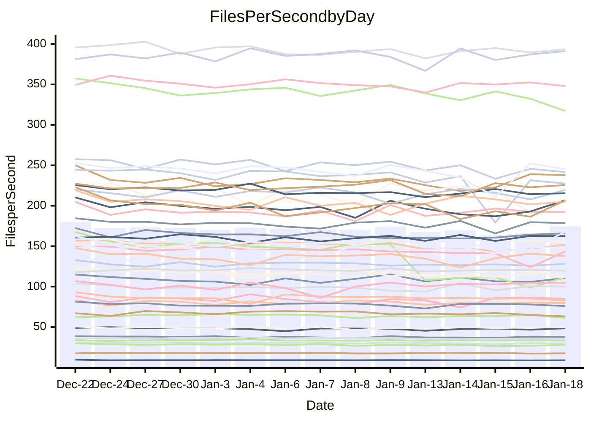

<!---
# This file is auto-generated. Do not edit.
# cspell:disable
--->
# Performance Report

## Daily Performance

## Time to Process Files

| Repository                                      | Elapsed | Min/Avg/Max           |   SD | SD Graph                |
| ----------------------------------------------- | ------: | :-------------------: | ---: | ----------------------- |
| AdaDoom3/AdaDoom3                    |    3.06 | 3.0 /   3.1 /   3.2   | 0.06 | `     ┣━┻━━●━━┻━┫     ` |
| alexiosc/megistos                    |    7.31 | 6.9 /   7.3 /   8.1   | 0.29 | `    ┣━━┻━━●━━┻━━┫    ` |
| apollographql/apollo-server          |    2.26 | 2.2 /   2.3 /   2.8   | 0.12 | `    ┣━━┻━●╋━━┻━━┫    ` |
| aspnetboilerplate/aspnetboilerplate  |    9.44 | 9.0 /   9.8 /  10.4   | 0.33 | `    ┣━━●━━╋━━┻━━┫    ` |
| aws-amplify/docs                     |   12.60 | 11.6 /  12.2 /  16.0  | 0.83 | `   ┣━━━┻━━╋━●┻━━━┫   ` |
| Azure/azure-rest-api-specs           |   21.16 | 14.4 /  17.4 /  24.9  | 2.81 | `   ┣━━┻━━━╋━━━┻●━┫   ` |
| bitjson/typescript-starter           |    0.67 | 0.6 /   0.7 /   0.7   | 0.02 | `     ┣━━┻━╋●┻━━┫     ` |
| caddyserver/caddy                    |    3.28 | 3.1 /   3.4 /   3.8   | 0.17 | `    ┣━━┻━●╋━━┻━━┫    ` |
| canada-ca/open-source-logiciel-libre |    0.78 | 0.7 /   0.8 /   0.8   | 0.02 | `     ┣━━┻━╋●┻━━┫     ` |
| chef/chef                            |    5.82 | 5.2 /   5.6 /   6.6   | 0.34 | `    ┣━━┻━━╋━●┻━━┫    ` |
| dart-lang/sdk                        |   60.77 | 58.1 /  61.3 /  67.3  | 1.93 | `  ┣━━━┻━━●╋━━━┻━━━┫  ` |
| django/django                        |   14.67 | 13.7 /  14.8 /  16.4  | 0.59 | `   ┣━━━┻━●╋━━┻━━━┫   ` |
| eslint/eslint                        |    9.85 | 9.7 /  10.4 /  11.2   | 0.36 | `    ┣━●┻━━╋━━┻━━┫    ` |
| exonum/exonum                        |    3.17 | 2.9 /   3.2 /   3.5   | 0.12 | `    ┣━━┻━━●━━┻━━┫    ` |
| flutter/samples                      |   17.27 | 16.2 /  17.3 /  22.0  | 1.05 | `   ┣━━━┻━━●━━┻━━━┫   ` |
| gitbucket/gitbucket                  |    3.22 | 3.1 /   3.2 /   3.4   | 0.08 | `    ┣━━┻━━●━━┻━━┫    ` |
| googleapis/google-cloud-cpp          |  117.62 | 121.6 / 128.8 / 139.4 | 4.12 | `● ┣━━━┻━━━╋━━━┻━━━┫  ` |
| graphql/express-graphql              |    0.74 | 0.7 /   0.7 /   0.8   | 0.02 | `     ┣━━┻━╋━┻●━┫     ` |
| graphql/graphql-js                   |    2.23 | 2.1 /   2.2 /   2.4   | 0.07 | `     ┣━┻━━●━━┻━┫     ` |
| graphql/graphql-relay-js             |    0.74 | 0.7 /   0.7 /   0.8   | 0.02 | `     ┣━━┻●╋━┻━━┫     ` |
| graphql/graphql-spec                 |    0.85 | 0.8 /   0.8 /   0.9   | 0.02 | `     ┣━━┻━╋━┻●━┫     ` |
| iluwatar/java-design-patterns        |   11.72 | 10.8 /  11.5 /  12.2  | 0.33 | `    ┣━━┻━━╋━●┻━━┫    ` |
| ktaranov/sqlserver-kit               |    6.43 | 6.0 /   6.3 /   7.2   | 0.23 | `    ┣━━┻━━╋━●┻━━┫    ` |
| liriliri/licia                       |    3.64 | 3.6 /   3.7 /   3.9   | 0.08 | `    ┣━━┻━●╋━━┻━━┫    ` |
| MartinThoma/LaTeX-examples           |    6.54 | 6.2 /   6.5 /   6.8   | 0.16 | `    ┣━━┻━━╋●━┻━━┫    ` |
| mdx-js/mdx                           |    1.72 | 1.5 /   1.6 /   1.8   | 0.07 | `     ┣━┻━━╋━━●━┫     ` |
| microsoft/TypeScript-Website         |    5.28 | 4.9 /   5.2 /   6.1   | 0.22 | `    ┣━━┻━━╋●━┻━━┫    ` |
| MicrosoftDocs/PowerShell-Docs        |   18.46 | 17.6 /  19.2 /  21.5  | 0.85 | `   ┣━━━●━━╋━━┻━━━┫   ` |
| neovim/nvim-lspconfig                |    3.37 | 3.0 /   3.2 /   3.5   | 0.13 | `    ┣━━┻━━╋━━┻━●┫    ` |
| pagekit/pagekit                      |    3.38 | 3.1 /   3.4 /   3.8   | 0.16 | `    ┣━━┻━●╋━━┻━━┫    ` |
| php/php-src                          |   21.11 | 20.7 /  22.4 /  28.4  | 1.64 | `   ┣━━┻●━━╋━━━┻━━┫   ` |
| plasticrake/tplink-smarthome-api     |    0.98 | 0.9 /   0.9 /   1.0   | 0.03 | `     ┣━┻━━╋━━┻━●     ` |
| prettier/prettier                    |    6.95 | 6.1 /   6.5 /   7.2   | 0.19 | `    ┣━━┻━━╋━━┻━━┫ ●  ` |
| pycontribs/jira                      |    1.31 | 1.2 /   1.3 /   1.3   | 0.04 | `     ┣━┻━━╋━━┻●┫     ` |
| RustPython/RustPython                |    4.20 | 4.1 /   4.3 /   5.1   | 0.21 | `    ┣━━┻━●╋━━┻━━┫    ` |
| shoelace-style/shoelace              |    2.45 | 2.4 /   2.5 /   2.7   | 0.08 | `    ┣━━┻━●╋━━┻━━┫    ` |
| slint-ui/slint                       |    9.54 | 8.7 /  10.0 /  11.8   | 0.61 | `    ┣━━┻●━╋━━┻━━┫    ` |
| SoftwareBrothers/admin-bro           |    2.15 | 2.0 /   2.2 /   2.3   | 0.08 | `     ┣━┻━━●━━┻━┫     ` |
| sveltejs/svelte                      |   18.26 | 18.0 /  18.6 /  22.2  | 0.74 | `   ┣━━━┻●━╋━━┻━━━┫   ` |
| TheAlgorithms/Python                 |    5.66 | 5.1 /   5.5 /   5.9   | 0.18 | `    ┣━━┻━━╋━━●━━┫    ` |
| twbs/bootstrap                       |    1.20 | 1.1 /   1.2 /   1.3   | 0.05 | `     ┣━┻━●╋━━┻━┫     ` |
| typescript-cheatsheets/react         |    1.09 | 1.1 /   1.1 /   1.3   | 0.06 | `     ┣━┻━●╋━━┻━┫     ` |
| typescript-eslint/typescript-eslint  |    3.67 | 3.5 /   3.6 /   3.8   | 0.08 | `    ┣━━┻━━╋●━┻━━┫    ` |
| vitest-dev/vitest                    |    7.93 | 7.6 /   8.0 /   9.2   | 0.32 | `    ┣━━┻━━●━━┻━━┫    ` |
| w3c/aria-practices                   |    2.94 | 2.7 /   3.0 /   3.3   | 0.14 | `    ┣━━┻━●╋━━┻━━┫    ` |
| w3c/specberus                        |    1.67 | 1.6 /   1.7 /   1.8   | 0.03 | `     ┣━┻━━●━━┻━┫     ` |
| webdeveric/webpack-assets-manifest   |    0.68 | 0.6 /   0.7 /   0.8   | 0.03 | `     ┣━━┻━●━┻━━┫     ` |
| webpack/webpack                      |    4.85 | 4.6 /   4.9 /   5.3   | 0.16 | `    ┣━━┻━●╋━━┻━━┫    ` |
| wireapp/wire-desktop                 |    0.86 | 0.8 /   0.9 /   1.0   | 0.03 | `     ┣━┻●━╋━━┻━┫     ` |
| wireapp/wire-webapp                  |    8.28 | 8.1 /   8.4 /   8.9   | 0.23 | `    ┣━━┻━●╋━━┻━━┫    ` |

Note:
- Elapsed time is in seconds.

## Files per Second over Time

| Repository                                      | Files |    Sec |    Fps |     Rel | Trend Fps              |    N |
| ----------------------------------------------- | ----: | -----: | -----: | ------: | ---------------------- | ---: |
| AdaDoom3/AdaDoom3                    |   103 |   3.06 |  33.62 |   0.08% | `▆▇▇▆█▅▇▆▆▇▅▇▇▇▅▆▇▇▇▆` |   27 |
| alexiosc/megistos                    |   583 |   7.31 |  79.79 |  -0.02% | `▆▃▅█▇▅▆▆▆▇█▇▇▄▇▆▆▆▆▆` |   27 |
| apollographql/apollo-server          |   250 |   2.26 | 110.59 |   2.28% | `▆▇▅▇▆█▇▃█▇▇█▇▇▄▇▇▆▆▇` |   29 |
| aspnetboilerplate/aspnetboilerplate  |  2246 |   9.44 | 237.86 |   3.27% | `▇▇▄▅▆▆█▇▆▇▅█▇▇▅▅▄▅██` |   27 |
| aws-amplify/docs                     |  2865 |  12.60 | 227.41 |  -3.43% | `▇▇▇████▇████▇▇▅██▂▇▇` |   28 |
| Azure/azure-rest-api-specs           |  2364 |  21.16 | 111.74 | -20.83% | `██▇▇▇▇▇▆██▇▇▃▃▃▁▃▃▂▃` |   29 |
| bitjson/typescript-starter           |    20 |   0.67 |  29.74 |  -1.67% | `█▆▇▆▇█▇▇█▆▄██▇▇▇▆▅▇▆` |   27 |
| caddyserver/caddy                    |   279 |   3.28 |  84.98 |   1.91% | `▅▅█▆▅▇▅▃▆▄▄▆▇▆▇▄▃▇▇▆` |   29 |
| canada-ca/open-source-logiciel-libre |     7 |   0.78 |   8.99 |  -0.99% | `██▇█▇▇███▆▆▆█▇▇█▆▆▅▇` |   27 |
| chef/chef                            |  1204 |   5.82 | 206.70 |  -4.42% | `▇▆█▅▆██▄▇▃▇█▆█▇▆▇▇▄▅` |   28 |
| dart-lang/sdk                        | 10077 |  60.77 | 165.83 |   1.10% | `▇▆▇▇▇▅█▇▇▇▆▆▇▆▆▄▆▆▇▇` |   29 |
| django/django                        |  2820 |  14.67 | 192.25 |   0.55% | `▆▇▇▅▇▅█▆▇▆▄█▇▇▆▃▇▇▇▇` |   29 |
| eslint/eslint                        |  2038 |   9.85 | 206.92 |   5.05% | `▆▅▇▅▆▇▅▇█▄▅█▇▇▇▅▅▅▆█` |   29 |
| exonum/exonum                        |   421 |   3.17 | 132.93 |  -0.68% | `▆▇▆▆█▇▆██▆███▇▇▆▆▅▆▆` |   27 |
| flutter/samples                      |  2690 |  17.27 | 155.73 |   0.11% | `█▇▇▆▇█▇▇█▇▅▇▇▇▆▆▇▇▇▇` |   29 |
| gitbucket/gitbucket                  |   412 |   3.22 | 128.09 |   0.08% | `█▅▇▆████▆▆█▆▆▅█▇▆▇▆▇` |   29 |
| googleapis/google-cloud-cpp          | 19742 | 117.62 | 167.84 |   9.42% | `▅▃▆▆▅▄▄▆▆▅▆▆▅▅▆▆▆▄▄█` |   29 |
| graphql/express-graphql              |    26 |   0.74 |  35.07 |  -3.11% | `▇▇▇██▇▇███▇█▇▇▇▅▆▇▆▆` |   27 |
| graphql/graphql-js                   |   339 |   2.23 | 151.83 |   0.16% | `▇▇▄█▇▇█▇▇█▇▇█▅▆▆▆▅▆▇` |   27 |
| graphql/graphql-relay-js             |    28 |   0.74 |  37.95 |   0.66% | `█▇██▆▆█▅█▆▄▆██▅▆▆▆▇▇` |   27 |
| graphql/graphql-spec                 |    15 |   0.85 |  17.55 |  -1.93% | `▇▅▇█▆▆▇▇▇█▅▆▅▇▇▇▇▇▅▆` |   27 |
| iluwatar/java-design-patterns        |  1892 |  11.72 | 161.40 |   0.09% | `█▆▆▇▄█▆▇█▅██▇▆▆▇▆▆▆▇` |   29 |
| ktaranov/sqlserver-kit               |   489 |   6.43 |  76.03 |  -1.94% | `▆▇▆▆▆█▇█▇▇▇█▆▃▆▆▇▇▇▆` |   27 |
| liriliri/licia                       |  1434 |   3.64 | 393.53 |   0.63% | `████▆▇██▇▅▇▇█▇▅▇▇█▇█` |   28 |
| MartinThoma/LaTeX-examples           |  1409 |   6.54 | 215.48 |  -1.05% | `▇▆▇▇█▆▅▄▆▇▅▇▆▆▅▅▆▇▆▆` |   27 |
| mdx-js/mdx                           |   142 |   1.72 |  82.51 |  -4.88% | `█▅▆▄████▇▇▇▆▇▆▆▇▆▆▆▅` |   28 |
| microsoft/TypeScript-Website         |   757 |   5.28 | 143.49 |  -0.99% | `▇█▇█▇▆▇▇▆▇█▇█▆▇▅▆▆▃▇` |   29 |
| MicrosoftDocs/PowerShell-Docs        |  2236 |  18.46 | 121.13 |   4.07% | `▇█▆▆▇▇▇▆▆▃█▇▇▃▆▇▆▆▇█` |   29 |
| neovim/nvim-lspconfig                |   375 |   3.37 | 111.41 |  -5.76% | `█▄▄▆▆▅▇▇▇▇█▅▆▅▄▆▅▇▇▄` |   29 |
| pagekit/pagekit                      |   741 |   3.38 | 219.52 |   1.79% | `▅▃▇▅▆▆▆▇█▅▇▄▄▇▅▄▆▆▅▆` |   27 |
| php/php-src                          |  2213 |  21.11 | 104.84 |   5.85% | `▆██▇▆▇▅▂▅▇▇█▆█▇▇████` |   29 |
| plasticrake/tplink-smarthome-api     |    62 |   0.98 |  63.23 |  -6.38% | `█▆▆▇▇█▇▇▇█▇█▆▅▇▇▆▇▆▅` |   27 |
| prettier/prettier                    |  2205 |   6.95 | 317.17 |  -7.05% | `▆█████▆▇▆▇██▇▆▇▇▆▇▆▅` |   29 |
| pycontribs/jira                      |    80 |   1.31 |  61.26 |  -4.35% | `▇█▇█▇█▆█▆▆▄▅▆▇▅▅▆▆▇▅` |   27 |
| RustPython/RustPython                |   620 |   4.20 | 147.65 |   1.34% | `▇█▇██▅▇█▃██▇▇▇▆██▆█▇` |   29 |
| shoelace-style/shoelace              |   438 |   2.45 | 178.49 |   0.95% | `▆██▇▇▇▅▆▄▇█▇█▇▄▇█▄▇▇` |   28 |
| slint-ui/slint                       |  1973 |   9.54 | 206.76 |   4.54% | `▆▅█▆█▃▅▅█▇▇█▇██▇▅▆▅█` |   29 |
| SoftwareBrothers/admin-bro           |   441 |   2.15 | 204.97 |   0.45% | `▆▆▄▇▅█▇▆▄█▇▆▄▆▆▇█▇▆▇` |   27 |
| sveltejs/svelte                      |  7145 |  18.26 | 391.19 |   1.99% | `▇▇█▇▇▇█▇███▇▇▇▇▃█▇▇█` |   29 |
| TheAlgorithms/Python                 |  1367 |   5.66 | 241.64 |  -3.31% | `▅██▆▅▅▇▇▇▆▇▇▆▅▆▅▇▄▆▅` |   29 |
| twbs/bootstrap                       |   120 |   1.20 | 100.17 |   1.63% | `█▄▆▆▄▇▇▆▆█▅▇▅▄▄▅█▅▇▇` |   28 |
| typescript-cheatsheets/react         |    53 |   1.09 |  48.44 |   1.36% | `███▇▃███▇█▇▇▃▆▇▇▇▇▇█` |   28 |
| typescript-eslint/typescript-eslint  |  1277 |   3.67 | 347.95 |  -0.64% | `█▇▇▇██▆▇█▆▇▇▆▆▅▆▇▇▇▇` |   29 |
| vitest-dev/vitest                    |  1946 |   7.93 | 245.25 |   0.74% | `▆▆▇▇▇██▆▆▅▇█▇▇▇▇▆▃█▇` |   29 |
| w3c/aria-practices                   |   405 |   2.94 | 137.86 |   0.95% | `█▇▇▄▄▇▇█▇▇▇▇█▅█▆▄▆█▇` |   27 |
| w3c/specberus                        |   200 |   1.67 | 119.83 |  -0.34% | `▇▅▇▇▇▆▆▆▇█▄▇▆▅▆▇▆▇▇▆` |   28 |
| webdeveric/webpack-assets-manifest   |    19 |   0.68 |  27.92 |  -0.69% | `█▇▆██▆▇██▇▇▃▇▅▄█▇▅▅▆` |   27 |
| webpack/webpack                      |  1095 |   4.85 | 225.57 |   1.31% | `▆█▆▆▅█▄▄▆▇▇▆▇▄▅▅▄▇▆▆` |   27 |
| wireapp/wire-desktop                 |    43 |   0.86 |  50.11 |   2.49% | `▇▇█▅▆███▇▄▇▆▆▆▆▇▇▇▇█` |   30 |
| wireapp/wire-webapp                  |  1345 |   8.28 | 162.52 |   1.53% | `▇█▅▅██▅▅▇▇▆██▇▅▅█▆▇▇` |   29 |

## Data Throughput

| Repository                                      | Files |    Sec |     Kps |     Rel | Trend Kps              |    N |
| ----------------------------------------------- | ----: | -----: | ------: | ------: | ---------------------- | ---: |
| AdaDoom3/AdaDoom3                    |   103 |   3.06 |  714.40 |   0.08% | `▆▇▇▆█▅▇▆▆▇▅▇▇▇▅▆▇▇▇▆` |   27 |
| alexiosc/megistos                    |   583 |   7.31 |  626.99 |  -0.02% | `▆▃▅█▇▅▆▆▆▇█▇▇▄▇▆▆▆▆▆` |   27 |
| apollographql/apollo-server          |   250 |   2.26 |  885.14 |   2.30% | `▆▇▅▇▆█▇▃█▇▇█▇▇▄▇▇▆▆▇` |   29 |
| aspnetboilerplate/aspnetboilerplate  |  2246 |   9.44 |  559.60 |   3.27% | `▇▇▄▅▆▆█▇▆▇▅█▇▇▅▅▄▅██` |   27 |
| aws-amplify/docs                     |  2865 |  12.60 |  780.03 |  -3.36% | `▇▇▇████▇████▇▇▅██▂▇▇` |   28 |
| Azure/azure-rest-api-specs           |  2364 |  21.16 |  321.89 | -20.84% | `██▇▇▇▇▇▆██▇▇▃▃▃▁▃▃▂▃` |   29 |
| bitjson/typescript-starter           |    20 |   0.67 |  118.94 |  -1.67% | `█▆▇▆▇█▇▇█▆▄██▇▇▇▆▅▇▆` |   27 |
| caddyserver/caddy                    |   279 |   3.28 |  708.77 |   2.05% | `▅▅█▆▅▇▅▃▆▄▄▆▇▆▇▄▃▇▇▆` |   29 |
| canada-ca/open-source-logiciel-libre |     7 |   0.78 |   74.52 |  -0.99% | `██▇█▇▇███▆▆▆█▇▇█▆▆▅▇` |   27 |
| chef/chef                            |  1204 |   5.82 |  949.22 |  -4.44% | `▇▆█▅▆██▄▇▃▇█▆█▇▆▇▇▄▅` |   28 |
| dart-lang/sdk                        | 10077 |  60.77 | 1182.77 |   1.08% | `▇▇▇▇▇▅█▇▇▇▆▆▇▇▆▄▆▆▇▇` |   29 |
| django/django                        |  2820 |  14.67 | 1190.42 |   0.67% | `▆▇▇▅▇▅█▆▇▆▄█▇▇▆▃▇▇▇▇` |   29 |
| eslint/eslint                        |  2038 |   9.85 | 1691.21 |   5.09% | `▆▅▇▅▆▇▅▇█▄▅█▇▇▇▅▅▅▆█` |   29 |
| exonum/exonum                        |   421 |   3.17 | 1271.51 |  -0.68% | `▆▇▆▆█▇▆██▆███▇▇▆▆▅▆▆` |   27 |
| flutter/samples                      |  2690 |  17.27 | 1261.37 |   0.11% | `█▇▇▆▇█▇▇█▇▅▇▇▇▆▆▇▇▇▇` |   29 |
| gitbucket/gitbucket                  |   412 |   3.22 |  579.50 |   0.10% | `█▅▇▆████▆▆█▆▆▅█▇▆▇▆▇` |   29 |
| googleapis/google-cloud-cpp          | 19742 | 117.62 | 1310.27 |   9.37% | `▅▃▆▆▅▄▄▆▆▅▆▆▅▅▆▆▆▄▄█` |   29 |
| graphql/express-graphql              |    26 |   0.74 |  160.50 |  -3.11% | `▇▇▇██▇▇███▇█▇▇▇▅▆▇▆▆` |   27 |
| graphql/graphql-js                   |   339 |   2.23 |  862.62 |   0.16% | `▇▇▄█▇▇█▇▇█▇▇█▅▆▆▆▅▆▇` |   27 |
| graphql/graphql-relay-js             |    28 |   0.74 |  149.09 |   0.66% | `█▇██▆▆█▅█▆▄▆██▅▆▆▆▇▇` |   27 |
| graphql/graphql-spec                 |    15 |   0.85 |  645.67 |  -1.93% | `▇▅▇█▆▆▇▇▇█▅▆▅▇▇▇▇▇▅▆` |   27 |
| iluwatar/java-design-patterns        |  1892 |  11.72 |  495.80 |  -0.15% | `█▆▆▇▄█▆▇█▅██▇▆▆▇▆▆▆▇` |   29 |
| ktaranov/sqlserver-kit               |   489 |   6.43 | 1150.27 |  -1.94% | `▆▇▆▆▆█▇█▇▇▇█▆▃▆▆▇▇▇▆` |   27 |
| liriliri/licia                       |  1434 |   3.64 |  466.25 |   0.63% | `████▆▇██▇▅▇▇█▇▅▇▇█▇█` |   28 |
| MartinThoma/LaTeX-examples           |  1409 |   6.54 |  445.02 |  -1.05% | `▇▆▇▇█▆▅▄▆▇▅▇▆▆▅▅▆▇▆▆` |   27 |
| mdx-js/mdx                           |   142 |   1.72 |  381.74 |  -5.02% | `█▅▆▄████▇▇▇▆▇▆▆▇▆▆▆▅` |   28 |
| microsoft/TypeScript-Website         |   757 |   5.28 |  982.61 |  -0.99% | `▇█▇█▇▆▇▇▆▇█▇█▆▇▅▆▆▃▇` |   29 |
| MicrosoftDocs/PowerShell-Docs        |  2236 |  18.46 | 1209.98 |   4.10% | `▇█▆▆▇▇▇▆▆▃█▇▇▃▆▇▆▆▇█` |   29 |
| neovim/nvim-lspconfig                |   375 |   3.37 |  291.15 |  -5.83% | `█▄▄▇▇▅▇▇▇▇█▅▆▅▄▆▅▇▇▄` |   29 |
| pagekit/pagekit                      |   741 |   3.38 |  457.70 |   1.79% | `▅▃▇▅▆▆▆▇█▅▇▄▄▇▅▄▆▆▅▆` |   27 |
| php/php-src                          |  2213 |  21.11 | 1535.49 |   5.87% | `▆██▇▆▇▅▂▅▇▇█▆█▇▇████` |   29 |
| plasticrake/tplink-smarthome-api     |    62 |   0.98 |  341.65 |  -6.38% | `█▆▆▇▇█▇▇▇█▇█▆▅▇▇▆▇▆▅` |   27 |
| prettier/prettier                    |  2205 |   6.95 |  447.78 |  -7.04% | `▆█████▇▇▆▇██▇▆▇▇▆▇▆▅` |   29 |
| pycontribs/jira                      |    80 |   1.31 |  421.90 |  -4.35% | `▇█▇█▇█▆█▆▆▄▅▆▇▅▅▆▆▇▅` |   27 |
| RustPython/RustPython                |   620 |   4.20 | 1092.15 |   1.50% | `▇█▇██▅▇█▃██▇▇▇▆██▆██` |   29 |
| shoelace-style/shoelace              |   438 |   2.45 |  857.42 |   0.97% | `▆██▇▇▇▅▆▄▇█▇█▇▄▇█▄▇▇` |   28 |
| slint-ui/slint                       |  1973 |   9.54 | 1061.87 |   4.67% | `▆▅█▆█▃▅▅█▇▇████▇▅▆▅█` |   29 |
| SoftwareBrothers/admin-bro           |   441 |   2.15 |  451.77 |   0.45% | `▆▆▄▇▅█▇▆▄█▇▆▄▆▆▇█▇▆▇` |   27 |
| sveltejs/svelte                      |  7145 |  18.26 |  259.46 |   2.72% | `▇▇█▇▇▇█▇███▇▇▇█▃█▇██` |   29 |
| TheAlgorithms/Python                 |  1367 |   5.66 |  614.25 |  -3.19% | `▅██▆▅▅▇▇▇▆▇▇▆▅▆▅▇▄▆▅` |   29 |
| twbs/bootstrap                       |   120 |   1.20 |  803.87 |   1.63% | `█▄▆▆▄▇▇▆▆█▅▇▅▄▄▅█▅▇▇` |   28 |
| typescript-cheatsheets/react         |    53 |   1.09 |  354.62 |   1.36% | `███▇▃███▇█▇▇▃▆▇▇▇▇▇█` |   28 |
| typescript-eslint/typescript-eslint  |  1277 |   3.67 | 1683.06 |   0.12% | `▇▇▇▇██▆▇█▆▇▇▆▆▆▆▇▇▇▇` |   29 |
| vitest-dev/vitest                    |  1946 |   7.93 |  505.11 |   0.56% | `▆▆█▇▇██▆▆▅▇█▇▇▇▇▆▃█▇` |   29 |
| w3c/aria-practices                   |   405 |   2.94 | 1280.25 |   0.95% | `█▇▇▄▄▇▇█▇▇▇▇█▅█▆▄▆█▇` |   27 |
| w3c/specberus                        |   200 |   1.67 |  382.25 |  -0.34% | `▇▅▇▇▇▆▆▆▇█▄▇▆▅▆▇▆▇▇▆` |   28 |
| webdeveric/webpack-assets-manifest   |    19 |   0.68 |  149.88 |  -0.69% | `█▇▆██▆▇██▇▇▃▇▅▄█▇▅▅▆` |   27 |
| webpack/webpack                      |  1095 |   4.85 |  995.17 |   1.31% | `▆█▆▆▅█▄▄▆▇▇▆▇▄▅▅▄▇▆▆` |   27 |
| wireapp/wire-desktop                 |    43 |   0.86 |  221.43 |   2.49% | `▇▇█▅▆███▇▄▇▆▆▆▆▇▇▇▇█` |   30 |
| wireapp/wire-webapp                  |  1345 |   8.28 |  656.85 |   1.44% | `▇█▅▅██▅▅▇▇▆█▇▇▅▄█▆▇▇` |   29 |

