<!---
# This file is auto-generated. Do not edit.
# cspell:disable
--->
# Performance Report

## Daily Performance

```mermaid
xychart-beta
    title Files Per Second by Day
    y-axis Files per Second
    x-axis Date [Jun-30, Jul-2, Jul-4, Jul-5, Jul-6, Jul-8, Jul-9, Jul-10, Jul-12, Jul-13, Jul-15, Jul-17, Jul-18, Jul-19, Jul-20, Jul-22, Jul-23, Jul-26]
    bar [163.65, 160.66, 164.38, 164.27, 162.48, 164.83, 163.05, 164.68, 163.19, 162.43, 162.24, 160.81, 162.11, 161.80, 162.84, 161.83, 163.82, 165.99]
    line [7.37, 7.23, 7.36, 6.99, 7.61, 7.24, 7.01, 7.27, 7.49, 7.49, 6.93, 7.35, 7.41, 7.13, 7.42, 7.37, 6.94, 7.32]
    line [26.35, 26.84, 26.11, 26.06, 26.52, 23.76, 25.86, 26.61, 27.13, 26.83, 25.90, 26.40, 26.69, 26.50, 26.68, 26.34, 25.46, 26.22]
    line [27.82, 28.74, 29.48, 28.36, 28.34, 27.98, 28.10, 28.43, 28.38, 28.02, 28.20, 27.23, 28.58, 28.56, 28.51, 28.41, 26.08, 29.80]
    line [18.49, 17.94, 17.30, 18.64, 18.07, 17.45, 17.16, 17.77, 17.48, 17.96, 17.52, 15.60, 17.77, 17.44, 17.98, 17.51, 17.20, 18.06]
    line [42.95, 46.17, 47.03, 45.86, 46.70, 44.23, 47.36, 46.58, 46.27, 47.99, 46.18, 45.89, 46.88, 47.09, 45.82, 46.71, 46.24, 45.42]
    line [52.00, 48.43, 49.22, 52.34, 53.26, 50.86, 50.66, 52.36, 51.79, 53.82, 49.25, 50.85, 53.53, 52.69, 53.02, 51.19, 53.86, 48.32]
    line [202.54, 202.72, 194.67, 190.86, 195.33, 197.97, 203.94, 205.22, 203.61, 197.40, 200.74, 200.72, 202.94, 201.36, 202.08, 200.55, 197.73, 202.95]
    line [160.69, 154.94, 152.23, 157.47, 160.32, 147.14, 152.12, 154.25, 157.55, 157.57, 157.54, 152.05, 156.89, 159.37, 154.51, 154.84, 151.75, 150.40]
    line [170.49, 175.75, 171.75, 180.95, 169.97, 174.21, 168.28, 176.77, 172.02, 178.72, 162.59, 171.56, 160.94, 175.73, 180.87, 179.86, 173.49, 174.07]
    line [109.29, 115.47, 121.09, 119.06, 122.86, 112.77, 117.49, 120.30, 120.41, 118.48, 111.84, 112.66, 103.82, 121.72, 123.96, 116.30, 121.57, 105.23]
    line [127.99, 132.91, 128.52, 136.97, 123.97, 124.67, 133.15, 137.66, 135.26, 135.39, 131.25, 137.83, 130.35, 133.37, 136.93, 134.10, 136.61, 137.06]
    line [52.69, 51.50, 53.98, 52.25, 52.09, 53.03, 50.88, 50.01, 53.83, 52.41, 53.08, 52.40, 51.77, 52.01, 53.58, 51.27, 46.96, 53.09]
    line [79.34, 87.51, 88.59, 85.26, 74.62, 86.80, 88.24, 86.00, 84.39, 79.74, 83.17, 86.61, 84.55, 85.67, 84.70, 86.32, 83.67, 87.51]
    line [99.90, 104.63, 108.43, 108.27, 103.96, 110.20, 105.06, 103.60, 109.02, 107.38, 104.33, 107.04, 105.42, 107.07, 111.31, 108.98, 109.47, 108.82]
    line [133.08, 134.05, 133.73, 131.56, 129.78, 135.18, 134.44, 136.88, 131.27, 132.43, 131.04, 131.83, 130.19, 128.92, 127.23, 131.88, 120.40, 133.51]
    line [312.54, 298.93, 314.56, 303.69, 317.11, 300.01, 308.91, 315.76, 310.85, 309.84, 312.53, 315.03, 314.69, 310.30, 312.46, 311.42, 307.91, 316.74]
    line [53.06, 51.19, 51.40, 51.86, 50.10, 51.21, 51.39, 53.37, 51.98, 49.24, 50.53, 52.10, 52.76, 51.07, 51.44, 50.43, 43.97, 52.56]
    line [76.89, 75.88, 76.09, 78.08, 72.78, 70.79, 75.77, 69.10, 74.66, 73.66, 75.08, 77.97, 77.53, 74.65, 70.42, 69.35, 79.56, 75.10]
    line [129.95, 133.16, 130.87, 135.23, 135.13, 126.22, 133.87, 131.35, 131.34, 131.95, 134.40, 126.35, 129.62, 126.47, 133.10, 134.27, 132.41, 130.42]
    line [111.22, 113.18, 115.07, 115.63, 114.45, 106.87, 117.37, 116.66, 116.21, 118.14, 111.02, 114.16, 117.75, 114.86, 117.38, 110.16, 107.68, 104.90]
    line [98.76, 95.34, 99.55, 90.07, 101.41, 98.21, 94.52, 98.50, 97.78, 96.17, 94.33, 97.04, 97.24, 95.75, 98.78, 99.06, 97.00, 99.15]
    line [76.23, 74.07, 74.35, 77.62, 75.07, 74.46, 78.13, 73.01, 75.98, 75.26, 74.39, 74.57, 72.87, 76.84, 75.79, 76.25, 77.55, 75.47]
    line [21.90, 21.51, 21.13, 21.43, 22.00, 22.72, 21.87, 21.57, 21.20, 21.36, 21.51, 20.58, 21.30, 22.19, 22.10, 21.88, 20.15, 21.33]
    line [184.14, 182.56, 182.17, 182.82, 182.50, 172.62, 169.88, 184.28, 175.71, 183.39, 178.90, 178.60, 191.51, 185.47, 186.89, 174.56, 188.32, 183.18]
    line [207.89, 194.40, 205.29, 202.49, 204.26, 203.31, 188.55, 199.47, 196.87, 207.15, 195.83, 198.09, 197.68, 202.31, 195.34, 188.56, 195.30, 202.02]
    line [181.62, 188.67, 191.18, 188.53, 186.82, 188.38, 183.25, 189.14, 186.31, 182.67, 186.39, 179.31, 182.07, 181.92, 182.11, 183.75, 180.78, 189.40]
    line [204.16, 208.94, 217.94, 219.88, 213.33, 214.36, 206.61, 219.33, 214.62, 210.58, 216.81, 214.69, 207.39, 210.58, 210.83, 219.91, 218.25, 211.97]
    line [162.55, 162.26, 159.82, 169.05, 166.75, 165.64, 167.61, 164.48, 163.07, 165.84, 153.93, 161.48, 163.65, 163.25, 166.55, 162.82, 167.25, 163.44]
    line [188.60, 205.11, 192.90, 211.35, 185.93, 207.58, 205.87, 207.35, 202.66, 199.84, 188.27, 193.42, 194.63, 190.82, 194.01, 187.89, 193.41, 205.98]
    line [70.54, 72.17, 72.40, 75.76, 67.72, 74.05, 71.58, 72.37, 72.08, 72.80, 70.30, 71.38, 70.52, 71.04, 71.91, 72.70, 69.86, 67.08]
    line [75.51, 75.45, 76.79, 71.21, 73.99, 79.33, 75.23, 76.27, 76.63, 75.41, 72.48, 75.77, 73.22, 74.96, 75.84, 73.04, 75.74, 76.60]
    line [153.26, 150.82, 152.56, 149.61, 151.37, 153.34, 151.79, 153.10, 150.91, 149.71, 136.98, 153.14, 154.96, 149.05, 154.95, 153.94, 155.48, 151.14]
    line [125.39, 122.70, 121.73, 124.30, 123.97, 119.80, 118.70, 125.49, 121.97, 119.76, 124.17, 123.39, 123.52, 123.46, 121.92, 119.72, 124.69, 118.30]
    line [178.52, 180.47, 182.90, 182.10, 170.31, 176.15, 181.65, 170.98, 179.72, 179.37, 178.07, 178.35, 166.36, 178.14, 177.77, 166.91, 179.23, 175.62]
    line [29.25, 30.37, 29.62, 29.89, 30.35, 29.68, 29.34, 30.24, 30.35, 30.53, 29.15, 29.59, 30.29, 29.57, 30.13, 31.01, 27.77, 28.91]
    line [221.76, 218.49, 216.06, 207.77, 218.95, 227.80, 218.56, 219.23, 220.42, 224.78, 223.29, 222.43, 207.49, 215.75, 219.62, 220.62, 217.24, 222.53]
    line [159.53, 176.05, 173.54, 179.14, 185.15, 186.71, 181.92, 187.82, 179.82, 180.43, 176.01, 174.98, 183.26, 182.49, 185.76, 184.64, 175.39, 185.30]
    line [110.15, 113.68, 110.37, 111.97, 110.64, 106.95, 114.12, 113.53, 110.15, 112.38, 110.43, 112.10, 103.78, 114.93, 115.08, 104.93, 111.58, 111.68]
    line [370.89, 367.90, 375.27, 367.85, 365.20, 370.59, 365.59, 369.56, 369.35, 363.79, 365.39, 364.51, 354.54, 367.49, 364.21, 365.97, 356.16, 365.82]
    line [146.87, 151.06, 149.73, 144.88, 148.36, 148.23, 146.43, 140.41, 147.84, 149.86, 141.85, 143.07, 141.02, 142.51, 144.87, 145.54, 138.82, 146.46]
    line [86.02, 83.48, 86.69, 85.83, 89.91, 85.41, 81.93, 84.31, 79.99, 86.85, 82.81, 78.74, 86.89, 84.13, 85.63, 87.55, 88.29, 88.90]
    line [35.86, 38.94, 38.99, 36.38, 39.71, 37.09, 38.73, 39.43, 38.35, 38.90, 37.77, 38.11, 36.22, 38.46, 39.54, 38.13, 38.75, 39.03]
    line [255.76, 253.64, 257.67, 250.47, 259.54, 257.07, 247.35, 255.25, 253.55, 251.59, 253.64, 246.87, 251.37, 244.82, 253.83, 256.85, 255.68, 251.86]
    line [206.96, 210.00, 194.85, 205.89, 207.36, 203.52, 207.94, 208.03, 207.20, 205.62, 202.48, 205.11, 209.83, 198.16, 198.05, 204.69, 200.38, 203.02]
    line [224.78, 231.59, 231.28, 247.94, 235.03, 240.95, 229.51, 226.18, 233.66, 229.73, 238.10, 228.16, 232.72, 230.57, 231.48, 227.16, 226.70, 226.60]
    line [319.52, 312.08, 316.35, 315.20, 318.22, 310.11, 308.24, 315.35, 312.26, 316.54, 311.74, 310.63, 315.98, 317.85, 311.01, 317.69, 306.96, 319.39]
    line [237.23, 233.45, 238.97, 235.75, 235.89, 238.48, 229.00, 230.57, 227.85, 230.59, 218.19, 235.84, 238.63, 231.13, 236.94, 230.60, 225.84, 233.97]
    line [357.30, 355.80, 359.03, 353.22, 355.88, 358.26, 350.93, 354.34, 355.82, 344.62, 353.27, 340.52, 356.06, 341.72, 349.11, 334.55, 350.21, 333.71]
    line [162.47, 148.90, 163.02, 160.27, 163.84, 166.09, 162.99, 161.12, 163.50, 159.47, 157.31, 155.54, 162.49, 157.44, 160.47, 161.66, 162.86, 166.80]
    line [148.34, 142.33, 146.88, 147.38, 139.67, 147.61, 146.15, 148.02, 145.81, 141.78, 149.87, 144.29, 144.20, 143.50, 142.28, 141.37, 147.86, 149.89]
```

## Time to Process Files

| Repository                                      | Elapsed | Min/Avg/Max           |   SD | SD Graph                |
| ----------------------------------------------- | ------: | :-------------------: | ---: | ----------------------- |
| AdaDoom3/AdaDoom3                    |    3.56 | 3.3 /   3.5 /   3.7   | 0.09 | `    ┣━━┻━━╋━━●━━┫    ` |
| alexiosc/megistos                    |    7.61 | 7.3 /   7.7 /   8.2   | 0.23 | `    ┣━━┻●━╋━━┻━━┫    ` |
| apollographql/apollo-server          |    2.54 | 2.5 /   2.6 /   2.8   | 0.08 | `     ┣━┻●━╋━━┻━┫     ` |
| aspnetboilerplate/aspnetboilerplate  |   10.66 | 10.2 /  10.6 /  11.3  | 0.28 | `    ┣━━┻━━╋●━┻━━┫    ` |
| aws-amplify/docs                     |   12.90 | 12.6 /  13.1 /  14.1  | 0.37 | `    ┣━━┻●━╋━━┻━━┫    ` |
| Azure/azure-rest-api-specs           |    9.63 | 9.1 /   9.6 /  10.5   | 0.29 | `    ┣━━┻━━╋●━┻━━┫    ` |
| bitjson/typescript-starter           |    0.94 | 0.9 /   0.9 /   1.0   | 0.04 | `     ┣━┻━━╋●━┻━┫     ` |
| caddyserver/caddy                    |    3.79 | 3.5 /   3.8 /   4.5   | 0.22 | `    ┣━━┻━●╋━━┻━━┫    ` |
| canada-ca/open-source-logiciel-libre |    0.96 | 0.9 /   1.0 /   1.1   | 0.05 | `     ┣━┻━━●━━┻━┫     ` |
| chef/chef                            |    5.85 | 5.6 /   6.1 /   6.8   | 0.27 | `    ┣━━●━━╋━━┻━━┫    ` |
| dart-lang/sdk                        |   64.21 | 61.1 /  67.1 /  77.1  | 2.79 | `  ┣━━━●━━━╋━━━┻━━━┫  ` |
| django/django                        |   15.37 | 15.2 /  15.9 /  17.8  | 0.67 | `   ┣━━━┻●━╋━━┻━━━┫   ` |
| eslint/eslint                        |   10.98 | 10.9 /  11.3 /  12.7  | 0.35 | `    ┣━━●━━╋━━┻━━┫    ` |
| exonum/exonum                        |    4.00 | 3.4 /   3.6 /   4.2   | 0.20 | `    ┣━━┻━━╋━━┻━━●    ` |
| flutter/samples                      |   16.74 | 16.7 /  17.6 /  19.2  | 0.56 | `   ┣━●━┻━━╋━━┻━━━┫   ` |
| gitbucket/gitbucket                  |    3.93 | 3.3 /   3.6 /   3.9   | 0.12 | `    ┣━━┻━━╋━━┻━━┫ ●  ` |
| googleapis/google-cloud-cpp          |  137.21 | 135.7 / 141.7 / 150.8 | 4.21 | `  ┣━━●┻━━━╋━━━┻━━━┫  ` |
| graphql/express-graphql              |    0.99 | 0.9 /   1.0 /   1.1   | 0.03 | `     ┣━┻━━╋●━┻━┫     ` |
| graphql/graphql-js                   |    2.66 | 2.6 /   2.7 /   2.9   | 0.08 | `    ┣━━┻●━╋━━┻━━┫    ` |
| graphql/graphql-relay-js             |    0.94 | 0.9 /   1.0 /   1.1   | 0.03 | `     ┣●┻━━╋━━┻━┫     ` |
| graphql/graphql-spec                 |    0.89 | 0.9 /   0.9 /   1.0   | 0.04 | `     ┣━┻●━╋━━┻━┫     ` |
| iluwatar/java-design-patterns        |   13.18 | 12.8 /  13.2 /  16.5  | 0.65 | `   ┣━━━┻━━●━━┻━━━┫   ` |
| ktaranov/sqlserver-kit               |    7.29 | 6.5 /   6.8 /   7.3   | 0.19 | `    ┣━━┻━━╋━━┻━━┫●   ` |
| liriliri/licia                       |    4.31 | 3.9 /   4.1 /   4.6   | 0.14 | `    ┣━━┻━━╋━━┻●━┫    ` |
| MartinThoma/LaTeX-examples           |    6.97 | 6.6 /   7.1 /   7.5   | 0.25 | `    ┣━━┻━●╋━━┻━━┫    ` |
| mdx-js/mdx                           |    1.87 | 1.8 /   1.9 /   2.0   | 0.05 | `     ┣━┻━━●━━┻━┫     ` |
| microsoft/TypeScript-Website         |    5.83 | 5.6 /   5.8 /   6.3   | 0.19 | `    ┣━━┻━━●━━┻━━┫    ` |
| MicrosoftDocs/PowerShell-Docs        |   24.25 | 22.9 /  24.2 /  26.1  | 0.70 | `   ┣━━━┻━━●━━┻━━━┫   ` |
| neovim/nvim-lspconfig                |    4.31 | 4.1 /   4.3 /   4.9   | 0.16 | `    ┣━━┻━━●━━┻━━┫    ` |
| pagekit/pagekit                      |    3.65 | 3.6 /   3.7 /   3.9   | 0.09 | `    ┣━━┻━●╋━━┻━━┫    ` |
| php/php-src                          |   25.68 | 25.3 /  27.2 /  30.3  | 1.36 | `   ┣━━●━━━╋━━━┻━━┫   ` |
| plasticrake/tplink-smarthome-api     |    1.17 | 1.1 /   1.2 /   1.3   | 0.04 | `     ┣━┻━●╋━━┻━┫     ` |
| prettier/prettier                    |    7.13 | 7.1 /   7.2 /   7.6   | 0.12 | `    ┣━━●━━╋━━┻━━┫    ` |
| pycontribs/jira                      |    1.50 | 1.5 /   1.5 /   1.8   | 0.06 | `     ┣━┻●━╋━━┻━┫     ` |
| RustPython/RustPython                |    5.11 | 4.9 /   5.2 /   5.7   | 0.16 | `    ┣━━┻━●╋━━┻━━┫    ` |
| shoelace-style/shoelace              |    2.92 | 2.7 /   2.8 /   3.0   | 0.09 | `    ┣━━┻━━╋━━●━━┫    ` |
| slint-ui/slint                       |   12.07 | 11.4 /  12.1 /  13.5  | 0.51 | `    ┣━━┻━━●━━┻━━┫    ` |
| SoftwareBrothers/admin-bro           |    2.51 | 2.4 /   2.5 /   2.7   | 0.06 | `     ┣━┻━━╋●━┻━┫     ` |
| sveltejs/svelte                      |   21.17 | 19.5 /  20.7 /  21.7  | 0.51 | `   ┣━━━┻━━╋━━●━━━┫   ` |
| TheAlgorithms/Python                 |    6.13 | 5.6 /   6.0 /   6.3   | 0.17 | `    ┣━━┻━━╋━●┻━━┫    ` |
| twbs/bootstrap                       |    1.35 | 1.3 /   1.4 /   1.6   | 0.07 | `     ┣━┻●━╋━━┻━┫     ` |
| typescript-cheatsheets/react         |    1.36 | 1.3 /   1.4 /   1.5   | 0.04 | `     ┣━┻━●╋━━┻━┫     ` |
| typescript-eslint/typescript-eslint  |    4.03 | 4.0 /   4.1 /   4.3   | 0.09 | `    ┣━━┻●━╋━━┻━━┫    ` |
| vitest-dev/vitest                    |    9.17 | 8.9 /   9.2 /  10.0   | 0.32 | `    ┣━━┻━●╋━━┻━━┫    ` |
| w3c/aria-practices                   |    3.46 | 3.1 /   3.3 /   3.8   | 0.12 | `    ┣━━┻━━╋━━●━━┫    ` |
| w3c/specberus                        |    1.87 | 1.8 /   1.9 /   2.1   | 0.06 | `     ┣━┻●━╋━━┻━┫     ` |
| webdeveric/webpack-assets-manifest   |    1.12 | 1.0 /   1.0 /   1.2   | 0.05 | `     ┣━┻━━╋━━┻●┫     ` |
| webpack/webpack                      |    5.47 | 5.1 /   5.4 /   6.1   | 0.18 | `    ┣━━┻━━╋●━┻━━┫    ` |
| wireapp/wire-desktop                 |    0.95 | 0.9 /   0.9 /   1.0   | 0.02 | `     ┣━┻━━╋━●┻━┫     ` |
| wireapp/wire-webapp                  |   11.09 | 10.5 /  11.1 /  12.2  | 0.34 | `    ┣━━┻━━●━━┻━━┫    ` |

Note:
- Elapsed time is in seconds.

## Files per Second over Time

| Repository                                      | Files |    Sec |    Fps |     Rel | Trend Fps              |    N |
| ----------------------------------------------- | ----: | -----: | -----: | ------: | ---------------------- | ---: |
| AdaDoom3/AdaDoom3                    |   103 |   3.56 |  28.91 |  -3.21% | `▇██▇▇▅▆▅█▇▅▇▇▇▅█▆█▄▅` |   34 |
| alexiosc/megistos                    |   583 |   7.61 |  76.60 |   1.70% | `▇▇▅▆▅▅▇█▅▅▄▆█▇▅▇▆▅▇▇` |   34 |
| apollographql/apollo-server          |   252 |   2.54 |  99.15 |   2.36% | `▇▅██▇▅▇▇█▇██▅▅▇███▇█` |   34 |
| aspnetboilerplate/aspnetboilerplate  |  2259 |  10.66 | 211.97 |  -0.53% | `▇▆▅██▇██▆▆█▆▆▄▇▆▇██▇` |   34 |
| aws-amplify/docs                     |  2871 |  12.90 | 222.53 |   1.50% | `▇█▇███▇▇█▅▄▄▇▇█▆█▇▆▇` |   34 |
| Azure/azure-rest-api-specs           |  2426 |   9.63 | 251.86 |   0.00% | `█▆█▇▇█▆▇▅▇▄▆▅▇▇▇▇█▇▇` |   34 |
| bitjson/typescript-starter           |    20 |   0.94 |  21.33 |  -0.97% | `▆█▄▇▆▆▃▇▅▆▇▆███▇▇▇▄▆` |   34 |
| caddyserver/caddy                    |   285 |   3.79 |  75.10 |   0.67% | `▅▅█▅█▅█▇▇▇▇▅▇▆▆▅▅▅█▆` |   34 |
| canada-ca/open-source-logiciel-libre |     7 |   0.96 |   7.32 |   0.49% | `▇█▇█▆▅█▇▆▇▇█▆█▃▇▇▇▆▇` |   34 |
| chef/chef                            |  1206 |   5.85 | 205.98 |   4.52% | `█▆▆█▄▆▄▆▆▆▆▃▅▆▆▅▆▅▆█` |   34 |
| dart-lang/sdk                        | 10710 |  64.21 | 166.80 |   4.38% | `▆█▆▆▇▆▅█▅▇▇▆▅▇▇█▆▇▇█` |   34 |
| django/django                        |  2848 |  15.37 | 185.30 |   3.05% | `▆█▆█▆▇█▄▇█▇▇▇█████▆█` |   34 |
| eslint/eslint                        |  2080 |  10.98 | 189.40 |   2.64% | `▇▇▇▆█▇▆▆▆▇▃▆███▇▆▇▆█` |   34 |
| exonum/exonum                        |   421 |   4.00 | 105.23 | -10.77% | `█▇▇▅▃█▄▄█▃█▇▇▇███▆▇▄` |   34 |
| flutter/samples                      |  2452 |  16.74 | 146.46 |   0.70% | `▇███▅▆▅▆▇▅▇▆▆▄▇▆▇▇▅▇` |   34 |
| gitbucket/gitbucket                  |   412 |   3.93 | 104.90 |  -8.58% | `▆█▆▅▄▅▄▆▆▆▇▆▅▅▅▆▇▄▄▃` |   34 |
| googleapis/google-cloud-cpp          | 20566 | 137.21 | 149.89 |   3.45% | `▆▅▇▅██▇█▅▆▄█▇▇▅▅▇▆▇█` |   34 |
| graphql/express-graphql              |    26 |   0.99 |  26.22 |  -0.72% | `█▇██▇▆█▆█▇▇▇▇█▆▇▇▇▆▇` |   34 |
| graphql/graphql-js                   |   364 |   2.66 | 137.06 |   2.57% | `▇▇█▇▅▇███▆▆█▇▆▇██▇██` |   34 |
| graphql/graphql-relay-js             |    28 |   0.94 |  29.80 |   5.48% | `▇▇▄▆█▅▅▄▆▇▇▇▇▆▆▆▇▆▄█` |   34 |
| graphql/graphql-spec                 |    16 |   0.89 |  18.06 |   3.33% | `▅▇█▇▆█▃▃▄▇▇▆█▆▇▇█▇▆█` |   34 |
| iluwatar/java-design-patterns        |  1992 |  13.18 | 151.14 |   0.18% | `▇▆█▇█▂█▇███▆▆█▇████▇` |   34 |
| ktaranov/sqlserver-kit               |   489 |   7.29 |  67.08 |  -6.48% | `██▇▇▆▆▅▇█▆▇▆▇▇▄▇▇▇▆▄` |   34 |
| liriliri/licia                       |  1437 |   4.31 | 333.71 |  -4.64% | `▇▅█████▄▇█▅▇▇█▆█▆▆▇▆` |   34 |
| MartinThoma/LaTeX-examples           |  1409 |   6.97 | 202.02 |   1.43% | `▆▇▆█▄▇▄▇▆▆▆▆▆▇▆▅▅▄▅▆` |   34 |
| mdx-js/mdx                           |   141 |   1.87 |  75.47 |  -0.04% | `█▇█▆▇▆▄██▆██████▇▇█▇` |   34 |
| microsoft/TypeScript-Website         |   760 |   5.83 | 130.42 |  -0.33% | `▅▆▇▇█▇▄▆▆▆▅▄▅▄█▇▇▇▇▆` |   34 |
| MicrosoftDocs/PowerShell-Docs        |  2708 |  24.25 | 111.68 |  -0.16% | `▅▇▆▇▆▆▆▇▇▄████▇██▄▆▆` |   34 |
| neovim/nvim-lspconfig                |   750 |   4.31 | 174.07 |   0.32% | `▅█▇▇▆▃▆▇▅▄▇▇▆▇▇███▇▇` |   34 |
| pagekit/pagekit                      |   741 |   3.65 | 202.95 |   1.15% | `▇▆▅▇▇▆█▇▅▇▅█▇█▇▇▇▇▆▇` |   34 |
| php/php-src                          |  2283 |  25.68 |  88.90 |   5.80% | `▆▇█▇▇▅▄▆▃▇▇▇▄▇▇█▆███` |   34 |
| plasticrake/tplink-smarthome-api     |    62 |   1.17 |  53.09 |   1.65% | `█▇▇▇▇█▆█▇▇▇▆▆▆██▇▆▃▇` |   34 |
| prettier/prettier                    |  2276 |   7.13 | 319.39 |   1.75% | `█▇▇█▇▇█▅▇▇███▇▇▆▇█▆█` |   34 |
| pycontribs/jira                      |    79 |   1.50 |  52.56 |   2.74% | `▇▆▇▆▇▆▇███▆▇▇███▇▇▃█` |   34 |
| RustPython/RustPython                |   682 |   5.11 | 133.51 |   1.57% | `▇▇▇▇█▅▇▇▇▆▆█▄▅▆▆▅▇▄▇` |   34 |
| shoelace-style/shoelace              |   439 |   2.92 | 150.40 |  -3.45% | `▆▇▅█▇▇▅▆▅▇▇▇▇▆▇█▄▆▅▅` |   34 |
| slint-ui/slint                       |  2211 |  12.07 | 183.18 |   1.08% | `▆▅█▇▅▇▇▅▅█▇▆█▆█▇▇▅▇▇` |   34 |
| SoftwareBrothers/admin-bro           |   441 |   2.51 | 175.62 |  -1.24% | `█▇▇█▇▇▇▇▆▄▇▇█▇▆▇▇▄▇▆` |   34 |
| sveltejs/svelte                      |  7743 |  21.17 | 365.82 |  -0.23% | `▇█▇▅▇▆▇▇▆▅▇▇█▆▇▇▆▇▆▇` |   34 |
| TheAlgorithms/Python                 |  1390 |   6.13 | 226.60 |  -2.14% | `▆▅▅▆▆█▅▇▄▆▄▆▇▅▆▆▆▅▅▅` |   34 |
| twbs/bootstrap                       |   118 |   1.35 |  87.51 |   3.23% | `▇▄█▃█▄▇▇█▇▇█▆▆█▆▇▇▆█` |   34 |
| typescript-cheatsheets/react         |    53 |   1.36 |  39.03 |   1.64% | `▅▇▅▇▅▆▇▇▄▄▆▅▆▇▇█▆▆▆▇` |   34 |
| typescript-eslint/typescript-eslint  |  1276 |   4.03 | 316.74 |   1.95% | `██▇▆█▇█▇██▅█▇▇██▆▇▇█` |   34 |
| vitest-dev/vitest                    |  2146 |   9.17 | 233.97 |   0.91% | `▇▅█▆▄▅▆███▇▄█▇▇█▇▆▆▇` |   34 |
| w3c/aria-practices                   |   409 |   3.46 | 118.30 |  -3.44% | `██▃▇▇▇▇▆▇▇▇█▇▅█▇▆▆▇▆` |   34 |
| w3c/specberus                        |   203 |   1.87 | 108.82 |   1.77% | `▇▇▇▆▆▆▆▇▆▆▄▇▇████▇▇▇` |   34 |
| webdeveric/webpack-assets-manifest   |    54 |   1.12 |  48.32 |  -6.52% | `███▇▆▄▇▅▆█▇▇▇▇▇▇█▆█▅` |   34 |
| webpack/webpack                      |  1110 |   5.47 | 203.02 |  -0.44% | `▇▇█▇█▆██▇█▇▆▇▄█▆▆▇▇▇` |   34 |
| wireapp/wire-desktop                 |    43 |   0.95 |  45.42 |  -2.27% | `▇▇▇█▆▆▆▆▆▇▇▇▆▇▇▅▇▇▆▆` |   34 |
| wireapp/wire-webapp                  |  1813 |  11.09 | 163.44 |  -0.01% | `▆▆▆█▃▆▆▆▆▆▆▆▆▇▆▇▇▆▇▆` |   34 |

## Data Throughput

| Repository                                      | Files |    Sec |     Kps |     Rel | Trend Kps              |    N |
| ----------------------------------------------- | ----: | -----: | ------: | ------: | ---------------------- | ---: |
| AdaDoom3/AdaDoom3                    |   103 |   3.56 |  614.40 |  -3.21% | `▇██▇▇▅▆▅█▇▅▇▇▇▅█▆█▄▅` |   34 |
| alexiosc/megistos                    |   583 |   7.61 |  601.90 |   1.70% | `▇▇▅▆▅▅▇█▅▅▄▆█▇▅▇▆▅▇▇` |   34 |
| apollographql/apollo-server          |   252 |   2.54 |  797.50 |   2.84% | `▇▅▇▇▇▆▇▇█▇██▅▅▇███▇█` |   34 |
| aspnetboilerplate/aspnetboilerplate  |  2259 |  10.66 |  498.82 |  -0.53% | `▇▆▅██▇██▆▆█▆▆▄▇▆▇██▇` |   34 |
| aws-amplify/docs                     |  2871 |  12.90 |  775.01 |   1.52% | `▇█▇███▇▇█▅▄▄▇▇█▆█▇▆▇` |   34 |
| Azure/azure-rest-api-specs           |  2426 |   9.63 |  673.78 |  -2.47% | `█▆█▇▇█▆▇▅▇▄▆▅█▇▇▇▇▆▆` |   34 |
| bitjson/typescript-starter           |    20 |   0.94 |   85.32 |  -0.97% | `▆█▄▇▆▆▃▇▅▆▇▆███▇▇▇▄▆` |   34 |
| caddyserver/caddy                    |   285 |   3.79 |  638.50 |   0.85% | `▅▅█▅█▅█▇▇▇▇▅▇▆▆▅▅▅█▇` |   34 |
| canada-ca/open-source-logiciel-libre |     7 |   0.96 |   60.62 |   0.49% | `▇█▇█▆▅█▇▆▇▇█▆█▃▇▇▇▆▇` |   34 |
| chef/chef                            |  1206 |   5.85 |  949.99 |   4.75% | `█▆▆█▄▆▄▆▆▆▆▃▅▆▆▅▆▅▆█` |   34 |
| dart-lang/sdk                        | 10710 |  64.21 | 1133.29 |   4.25% | `▆█▆▆▇▆▅█▅▇▇▆▅▇▇█▆▇▇█` |   34 |
| django/django                        |  2848 |  15.37 | 1155.01 |   3.27% | `▆█▆█▆▇█▄▇█▇▇▇█████▆█` |   34 |
| eslint/eslint                        |  2080 |  10.98 | 1371.98 |   2.81% | `▇▇▇▆█▇▆▆▆▇▃▆███▇▆▇▆█` |   34 |
| exonum/exonum                        |   421 |   4.00 | 1006.60 | -10.77% | `█▇▇▅▃█▄▄█▃█▇▇▇███▆▇▄` |   34 |
| flutter/samples                      |  2452 |  16.74 | 1287.07 |   4.34% | `▅▆▇▇▇▇▆▇█▇█▇▇▆█▇██▆█` |   34 |
| gitbucket/gitbucket                  |   412 |   3.93 |  474.84 |  -8.53% | `▆█▆▅▄▅▄▆▆▆▇▆▅▅▅▆▇▄▄▃` |   34 |
| googleapis/google-cloud-cpp          | 20566 | 137.21 | 1201.56 |   3.75% | `▆▅▇▅██▇█▅▆▄█▇▇▅▅▇▆▇█` |   34 |
| graphql/express-graphql              |    26 |   0.99 |  120.01 |  -0.72% | `█▇██▇▆█▆█▇▇▇▇█▆▇▇▇▆▇` |   34 |
| graphql/graphql-js                   |   364 |   2.66 |  787.70 |   2.54% | `▇▇█▇▅▇███▆▆█▇▆▇██▇██` |   34 |
| graphql/graphql-relay-js             |    28 |   0.94 |  117.07 |   5.48% | `▇▇▄▆█▅▅▄▆▇▇▇▇▆▆▆▇▆▄█` |   34 |
| graphql/graphql-spec                 |    16 |   0.89 |  654.73 |   3.63% | `▅▇█▇▆█▃▃▄▇▇▆█▆▇▇█▇▆█` |   34 |
| iluwatar/java-design-patterns        |  1992 |  13.18 |  467.16 |   0.18% | `▇▆█▇█▂█▇███▆▆█▇████▇` |   34 |
| ktaranov/sqlserver-kit               |   489 |   7.29 | 1015.33 |  -6.48% | `██▇▇▆▆▅▇█▆▇▆▇▇▄▇▇▇▆▄` |   34 |
| liriliri/licia                       |  1437 |   4.31 |  397.58 |  -4.64% | `▇▅█████▄▇█▅▇▇█▆█▆▆▇▆` |   34 |
| MartinThoma/LaTeX-examples           |  1409 |   6.97 |  417.23 |   1.43% | `▆▇▆█▄▇▄▇▆▆▆▆▆▇▆▅▅▄▅▆` |   34 |
| mdx-js/mdx                           |   141 |   1.87 |  350.60 |  -0.04% | `█▇█▆▇▆▄██▆██████▇▇█▇` |   34 |
| microsoft/TypeScript-Website         |   760 |   5.83 |  900.73 |  -0.33% | `▅▆▇▇█▇▄▆▆▆▅▄▅▄█▇▇▇▇▆` |   34 |
| MicrosoftDocs/PowerShell-Docs        |  2708 |  24.25 | 1147.40 |  -0.17% | `▅▇▆▇▆▆▆▇▇▄████▇██▄▆▆` |   34 |
| neovim/nvim-lspconfig                |   750 |   4.31 |  280.13 |   0.56% | `▅█▇▇▆▃▆▇▅▄▇▇▆▇▇███▇▇` |   34 |
| pagekit/pagekit                      |   741 |   3.65 |  423.16 |   1.15% | `▇▆▅▇▇▆█▇▅▇▅█▇█▇▇▇▇▆▇` |   34 |
| php/php-src                          |  2283 |  25.68 | 1544.71 |   5.68% | `▆▇█▇▇▅▄▆▃▇▇▇▄▇▇█▆███` |   34 |
| plasticrake/tplink-smarthome-api     |    62 |   1.17 |  286.87 |   1.65% | `█▇▇▇▇█▆█▇▇▇▆▆▆██▇▆▃▇` |   34 |
| prettier/prettier                    |  2276 |   7.13 |  453.83 |   1.66% | `█▇▇█▇▇█▅▇▇███▇▇▆▇▇▆█` |   34 |
| pycontribs/jira                      |    79 |   1.50 |  373.91 |   2.74% | `▇▆▇▆▇▆▇███▆▇▇███▇▇▃█` |   34 |
| RustPython/RustPython                |   682 |   5.11 | 1047.11 |   2.54% | `▇▇▇▆█▅▇▇▇▆▆█▄▅▆▆▅▇▄█` |   34 |
| shoelace-style/shoelace              |   439 |   2.92 |  726.66 |  -3.45% | `▆▇▅█▇▇▅▆▅▇▇▇▇▆▇█▄▆▅▅` |   34 |
| slint-ui/slint                       |  2211 |  12.07 | 1188.18 |   1.11% | `▆▅█▇▅▇▇▅▅█▇▆█▆█▇▇▅▇▇` |   34 |
| SoftwareBrothers/admin-bro           |   441 |   2.51 |  387.09 |  -1.24% | `█▇▇█▇▇▇▇▆▄▇▇█▇▆▇▇▄▇▆` |   34 |
| sveltejs/svelte                      |  7743 |  21.17 |  245.06 |   0.59% | `▇█▇▅▇▆▇▇▆▅▇▇█▆▇▇▆▇▆▇` |   34 |
| TheAlgorithms/Python                 |  1390 |   6.13 |  575.14 |  -2.15% | `▆▅▅▆▆█▅▇▄▆▄▆▇▅▆▆▆▅▅▅` |   34 |
| twbs/bootstrap                       |   118 |   1.35 |  718.58 |   3.23% | `▇▄█▃█▄▇▇█▇▇█▆▆█▆▇▇▆█` |   34 |
| typescript-cheatsheets/react         |    53 |   1.36 |  285.00 |   1.64% | `▅▇▅▇▅▆▇▇▄▄▆▅▆▇▇█▆▆▆▇` |   34 |
| typescript-eslint/typescript-eslint  |  1276 |   4.03 | 1615.45 |   1.92% | `█▇▇▆█▇█▇██▅█▇▇██▆▇▇█` |   34 |
| vitest-dev/vitest                    |  2146 |   9.17 |  509.47 |   0.83% | `▇▅█▆▄▅▆███▇▄█▇▇█▇▆▆▇` |   34 |
| w3c/aria-practices                   |   409 |   3.46 | 1100.58 |  -3.36% | `██▃▇▇▇▇▆▇▇▇█▇▅█▇▆▆▇▆` |   34 |
| w3c/specberus                        |   203 |   1.87 |  338.80 |   1.55% | `▇▇▇▆▆▆▆▇▆▆▄▇▇████▇▇▇` |   34 |
| webdeveric/webpack-assets-manifest   |    54 |   1.12 |  112.75 |  -6.52% | `███▇▆▄▇▅▆█▇▇▇▇▇▇█▆█▅` |   34 |
| webpack/webpack                      |  1110 |   5.47 |  916.50 |  -0.47% | `█▇███▆██▇█▇▆▇▄█▆▆▇▇▇` |   34 |
| wireapp/wire-desktop                 |    43 |   0.95 |  200.69 |  -2.27% | `▇▇▇█▆▆▆▆▆▇▇▇▆▇▇▅▇▇▆▆` |   34 |
| wireapp/wire-webapp                  |  1813 |  11.09 |  582.08 |  -0.04% | `▆▆▆█▃▆▆▆▆▆▆▆▆▇▆▇▇▆▇▆` |   34 |

