<!---
# This file is auto-generated. Do not edit.
# cspell:disable
--->
# Performance Report

## Daily Performance

```mermaid
xychart-beta
    title Files Per Second by Day
    y-axis Files per Second
    x-axis Date [Jun-7, Jun-8, Jun-9, Jun-10, Jun-11, Jun-12, Jun-13, Jun-14, Jun-16, Jun-23, Jun-24, Jun-25, Jun-30, Jul-2, Jul-4, Jul-5, Jul-6, Jul-7]
    bar [166.67, 170.13, 167.55, 162.35, 108.94, 163.62, 164.52, 162.91, 165.65, 161.06, 164.28, 159.75, 168.95, 160.66, 164.38, 164.27, 162.48, 165.90]
    line [106.22, 109.49, 108.40, 100.17, 93.09, 97.72, 89.92, 95.33, 99.63, 94.35, 94.02, 95.44, 96.15, 95.34, 99.55, 90.07, 101.41, 95.54]
    line [9.49, 10.16, 10.41, 10.23, 10.15, 7.58, 7.35, 7.42, 7.28, 7.12, 7.22, 7.17, 7.37, 7.23, 7.36, 6.99, 7.61, 0.00]
    line [87.59, 84.94, 85.33, 87.27, 67.23, 77.70, 76.81, 78.39, 74.00, 74.26, 76.13, 73.45, 76.23, 74.07, 74.35, 77.62, 75.07, 70.03]
    line [29.49, 29.31, 30.11, 30.11, 28.55, 21.08, 22.04, 22.18, 21.66, 21.30, 21.15, 22.00, 21.90, 21.51, 21.13, 21.43, 22.00, 0.00]
    line [89.11, 82.67, 88.45, 84.36, 84.11, 87.88, 85.81, 88.09, 78.16, 86.88, 85.49, 77.34, 74.76, 87.51, 88.59, 85.26, 74.62, 86.95]
    line [82.81, 79.64, 79.01, 70.82, 61.30, 76.37, 77.13, 76.03, 78.06, 76.22, 74.88, 79.14, 76.99, 75.88, 76.09, 78.08, 72.78, 69.82]
    line [134.96, 144.03, 143.02, 149.83, 130.69, 133.43, 133.31, 131.91, 133.18, 130.59, 136.24, 136.67, 127.99, 132.91, 128.52, 136.97, 123.97, 132.77]
    line [368.01, 380.10, 379.55, 383.29, 365.99, 374.63, 372.72, 362.93, 349.94, 351.35, 353.13, 360.69, 354.83, 355.80, 359.03, 353.22, 355.88, 0.00]
    line [17.51, 17.66, 17.41, 17.50, 17.71, 17.68, 18.34, 17.12, 16.25, 16.59, 17.11, 17.00, 18.16, 17.94, 17.30, 18.64, 18.07, 18.36]
    line [33.08, 34.79, 30.45, 36.74, 34.61, 25.22, 27.49, 26.99, 26.84, 26.60, 26.95, 25.71, 26.35, 26.84, 26.11, 26.06, 26.52, 0.00]
    line [62.38, 67.14, 67.89, 65.57, 63.26, 51.25, 48.63, 44.36, 52.41, 51.44, 53.68, 51.84, 52.69, 51.50, 53.98, 52.25, 52.09, 0.00]
    line [137.33, 133.44, 128.55, 130.54, 117.59, 120.60, 119.36, 126.68, 124.68, 124.29, 119.55, 125.16, 125.39, 122.70, 121.73, 124.30, 123.97, 0.00]
    line [48.02, 48.77, 46.64, 45.94, 46.92, 47.88, 49.42, 46.70, 44.72, 47.61, 46.18, 46.86, 40.79, 46.17, 47.03, 45.86, 46.70, 46.74]
    line [139.73, 144.07, 140.57, 144.39, 117.16, 134.67, 135.55, 132.71, 138.18, 135.01, 128.78, 135.00, 135.05, 134.05, 133.73, 131.56, 129.78, 136.12]
    line [35.30, 34.77, 36.25, 37.82, 33.71, 28.61, 28.16, 28.05, 28.76, 25.82, 27.29, 28.03, 27.82, 28.74, 29.48, 28.36, 28.34, 0.00]
    line [124.88, 126.90, 127.99, 124.73, 92.95, 120.36, 118.07, 115.35, 114.38, 112.71, 115.12, 110.67, 113.20, 113.18, 115.07, 115.63, 114.45, 109.79]
    line [62.31, 62.61, 63.50, 58.41, 51.82, 52.68, 49.85, 52.20, 51.85, 50.23, 51.87, 46.40, 53.06, 51.19, 51.40, 51.86, 50.10, 0.00]
    line [250.72, 249.07, 243.35, 230.21, 168.52, 236.78, 215.01, 237.87, 232.93, 234.34, 233.01, 236.58, 224.78, 231.59, 231.28, 247.94, 235.03, 221.17]
    line [201.57, 215.78, 212.77, 213.18, 139.00, 202.99, 196.51, 209.12, 202.60, 203.46, 201.26, 194.60, 207.89, 194.40, 205.29, 202.49, 204.26, 0.00]
    line [32.77, 33.08, 31.95, 32.91, 27.58, 30.74, 29.76, 30.63, 29.07, 28.80, 30.64, 31.41, 29.25, 30.37, 29.62, 29.89, 30.35, 0.00]
    line [192.45, 187.05, 185.74, 177.64, 118.63, 166.53, 181.43, 168.60, 169.42, 174.24, 176.57, 177.80, 167.68, 175.75, 171.75, 180.95, 169.97, 158.13]
    line [223.48, 219.68, 227.92, 202.72, 153.79, 213.73, 212.23, 220.18, 211.27, 214.37, 216.02, 220.47, 209.37, 208.94, 217.94, 219.88, 213.33, 0.00]
    line [218.89, 220.13, 221.21, 219.70, 143.90, 199.78, 201.47, 205.17, 207.22, 205.60, 202.43, 207.02, 202.54, 202.72, 194.67, 190.86, 195.33, 0.00]
    line [199.83, 209.95, 194.96, 213.85, 159.52, 202.89, 195.38, 189.84, 200.33, 200.19, 199.73, 196.39, 195.67, 205.11, 192.90, 211.35, 185.93, 203.88]
    line [198.16, 197.09, 193.40, 192.55, 186.93, 176.04, 174.92, 181.06, 184.11, 172.84, 180.05, 180.38, 178.52, 180.47, 182.90, 182.10, 170.31, 171.39]
    line [118.40, 118.39, 121.53, 129.30, 127.90, 119.77, 124.29, 124.35, 117.01, 116.01, 109.65, 114.81, 109.29, 115.47, 121.09, 119.06, 122.86, 0.00]
    line [156.27, 156.23, 153.60, 155.11, 113.07, 141.70, 154.36, 151.21, 153.33, 147.83, 153.51, 152.15, 153.26, 150.82, 152.56, 149.61, 151.37, 0.00]
    line [141.18, 140.04, 142.05, 141.88, 103.59, 133.58, 131.67, 139.76, 130.35, 131.39, 132.60, 136.92, 129.95, 133.16, 130.87, 135.23, 135.13, 0.00]
    line [46.01, 47.36, 45.48, 45.06, 39.72, 39.47, 40.00, 39.07, 39.70, 37.48, 36.99, 36.10, 35.86, 38.94, 38.99, 36.38, 39.71, 0.00]
    line [330.40, 327.16, 331.90, 323.14, 261.07, 338.35, 332.69, 326.37, 322.64, 316.02, 312.10, 320.45, 307.34, 312.08, 316.35, 315.20, 318.22, 313.66]
    line [216.34, 222.20, 218.63, 215.45, 173.74, 197.78, 209.33, 207.61, 214.45, 207.28, 201.26, 204.34, 194.65, 210.00, 194.85, 205.89, 207.36, 213.92]
    line [171.37, 173.71, 173.55, 167.26, 155.87, 157.93, 149.82, 145.84, 147.63, 152.29, 157.67, 151.07, 160.69, 154.94, 152.23, 157.47, 160.32, 0.00]
    line [193.46, 193.48, 195.01, 190.90, 131.77, 192.67, 189.08, 189.64, 183.39, 188.80, 187.17, 172.53, 184.06, 188.67, 191.18, 188.53, 186.82, 186.30]
    line [197.42, 184.56, 185.39, 175.70, 156.70, 187.10, 192.94, 186.79, 186.02, 178.80, 184.67, 184.84, 185.79, 182.56, 182.17, 182.82, 182.50, 179.12]
    line [331.37, 341.98, 331.53, 337.68, 257.72, 315.29, 320.05, 316.70, 318.97, 304.83, 306.07, 310.41, 315.81, 298.93, 314.56, 303.69, 317.11, 313.48]
    line [78.81, 80.33, 77.10, 77.48, 64.05, 77.39, 75.61, 71.46, 77.16, 73.34, 75.14, 76.59, 75.51, 75.45, 76.79, 71.21, 73.99, 0.00]
    line [124.65, 123.68, 119.64, 124.80, 107.83, 101.96, 100.16, 109.91, 108.33, 100.84, 107.27, 100.09, 103.62, 104.63, 108.43, 108.27, 103.96, 110.08]
    line [76.71, 76.80, 73.74, 74.27, 59.93, 73.62, 72.46, 71.40, 73.58, 68.82, 72.77, 72.13, 70.38, 72.17, 72.40, 75.76, 67.72, 0.00]
    line [168.50, 167.45, 164.46, 166.51, 117.60, 170.47, 156.38, 164.16, 163.15, 161.29, 162.24, 165.87, 161.72, 162.26, 159.82, 169.05, 166.75, 159.60]
    line [69.17, 67.00, 68.40, 68.60, 63.88, 50.72, 51.41, 51.47, 52.39, 51.73, 51.82, 52.39, 52.00, 48.43, 49.22, 52.34, 53.26, 51.10]
    line [374.25, 374.25, 369.07, 378.68, 227.98, 386.38, 382.81, 374.09, 365.35, 357.60, 370.08, 357.07, 371.96, 367.90, 375.27, 367.85, 365.20, 360.83]
    line [229.58, 244.42, 243.79, 239.33, 159.65, 230.81, 234.11, 231.13, 227.87, 231.36, 235.26, 222.40, 235.59, 233.45, 238.97, 235.75, 235.89, 232.86]
    line [153.74, 153.91, 150.81, 139.91, 110.07, 150.95, 153.45, 149.19, 147.76, 147.78, 145.47, 144.87, 146.87, 151.06, 149.73, 144.88, 148.36, 137.35]
    line [181.92, 188.23, 188.91, 180.00, 125.49, 173.22, 170.75, 180.24, 189.10, 183.71, 182.95, 183.62, 171.28, 176.05, 173.54, 179.14, 185.15, 184.99]
    line [228.84, 234.29, 227.02, 228.77, 219.57, 195.02, 221.53, 214.60, 224.77, 214.79, 220.92, 207.92, 222.39, 218.49, 216.06, 207.77, 218.95, 214.11]
    line [111.90, 113.82, 109.84, 106.42, 108.66, 112.63, 116.73, 103.14, 113.74, 113.71, 108.86, 112.34, 109.73, 113.68, 110.37, 111.97, 110.64, 98.54]
    line [83.72, 89.94, 85.93, 72.73, 68.90, 82.72, 88.26, 76.41, 88.08, 81.29, 84.76, 61.88, 83.73, 83.48, 86.69, 85.83, 89.91, 85.92]
    line [262.59, 260.07, 261.63, 234.80, 222.16, 255.69, 252.37, 242.53, 253.26, 253.77, 251.67, 255.05, 257.07, 253.64, 257.67, 250.47, 259.54, 254.67]
    line [160.99, 161.40, 162.90, 146.98, 118.64, 159.81, 164.92, 162.77, 165.48, 159.81, 157.56, 155.70, 158.25, 148.90, 163.02, 160.27, 163.84, 159.78]
    line [143.52, 149.79, 142.40, 146.80, 105.67, 145.87, 143.36, 146.61, 147.23, 141.81, 150.65, 147.20, 148.34, 142.33, 146.88, 147.38, 139.67, 147.57]
```

## Time to Process Files

| Repository                                      | Elapsed | Min/Avg/Max           |    SD | SD Graph                |
| ----------------------------------------------- | ------: | :-------------------: | ----: | ----------------------- |
| AdaDoom3/AdaDoom3                    |    3.39 | 3.1 /   3.4 /   4.1   |  0.21 | `     ┣━┻━━●━━┻━┫     ` |
| alexiosc/megistos                    |    7.88 | 7.2 /   7.8 /  12.1   |  0.93 | `    ┣━━┻━━●━━┻━━┫    ` |
| apollographql/apollo-server          |    2.64 | 2.3 /   2.6 /   3.0   |  0.19 | `     ┣━┻━━●━━┻━┫     ` |
| aspnetboilerplate/aspnetboilerplate  |   10.59 | 9.9 /  11.1 /  27.9   |  3.37 | `    ┣━━┻━●╋━━┻━━┫    ` |
| aws-amplify/docs                     |   13.41 | 12.1 /  13.1 /  14.7  |  0.56 | `    ┣━━┻━━╋━●┻━━┫    ` |
| Azure/azure-rest-api-specs           |    9.47 | 8.9 /   9.5 /  13.0   |  0.72 | `    ┣━━┻━━●━━┻━━┫    ` |
| bitjson/typescript-starter           |    0.91 | 0.7 /   0.9 /   1.0   |  0.12 | `     ┣━━┻━╋●┻━━┫     ` |
| caddyserver/caddy                    |    4.08 | 3.3 /   3.8 /   5.9   |  0.45 | `    ┣━━┻━━╋━●┻━━┫    ` |
| canada-ca/open-source-logiciel-libre |    0.92 | 0.7 /   0.9 /   1.1   |  0.13 | `     ┣━━┻━╋●┻━━┫     ` |
| chef/chef                            |    5.92 | 5.5 /   6.2 /   9.9   |  0.74 | `    ┣━━┻━●╋━━┻━━┫    ` |
| dart-lang/sdk                        |   67.01 | 63.2 /  69.8 / 148.3  | 15.40 | `  ┣━━━┻━━●╋━━━┻━━━┫  ` |
| django/django                        |   15.39 | 14.7 /  16.7 /  41.3  |  4.79 | `   ┣━━━┻━●╋━━┻━━━┫   ` |
| eslint/eslint                        |   11.16 | 10.3 /  11.6 /  28.4  |  3.24 | `    ┣━━┻━━●━━┻━━┫    ` |
| exonum/exonum                        |    3.43 | 3.3 /   3.6 /   4.5   |  0.26 | `     ┣━┻●━╋━━┻━┫     ` |
| flutter/samples                      |   19.34 | 16.9 /  18.6 /  38.8  |  3.98 | `   ┣━━━┻━━╋●━┻━━━┫   ` |
| gitbucket/gitbucket                  |    3.75 | 3.2 /   3.6 /   6.7   |  0.61 | `    ┣━━┻━━╋●━┻━━┫    ` |
| googleapis/google-cloud-cpp          |  138.82 | 134.4 / 146.6 / 295.9 | 29.63 | `  ┣━━━┻━━●╋━━━┻━━━┫  ` |
| graphql/express-graphql              |    0.98 | 0.7 /   0.9 /   1.0   |  0.11 | `     ┣━━┻━╋━●━━┫     ` |
| graphql/graphql-js                   |    2.74 | 2.4 /   2.7 /   3.1   |  0.16 | `     ┣━┻━━╋●━┻━┫     ` |
| graphql/graphql-relay-js             |    0.99 | 0.7 /   0.9 /   1.1   |  0.12 | `     ┣━━┻━╋●┻━━┫     ` |
| graphql/graphql-spec                 |    0.87 | 0.8 /   0.9 /   0.9   |  0.03 | `     ┣━━┻━●━┻━━┫     ` |
| iluwatar/java-design-patterns        |   13.16 | 12.5 /  13.7 /  28.2  |  2.98 | `    ┣━━┻━●╋━━┻━━┫    ` |
| ktaranov/sqlserver-kit               |    7.22 | 6.3 /   6.9 /  10.6   |  0.79 | `    ┣━━┻━━╋●━┻━━┫    ` |
| liriliri/licia                       |    4.04 | 3.7 /   4.0 /   4.2   |  0.13 | `     ┣━┻━━╋●━┻━┫     ` |
| MartinThoma/LaTeX-examples           |    6.90 | 6.4 /   7.4 /  20.0   |  2.58 | `    ┣━━┻━●╋━━┻━━┫    ` |
| mdx-js/mdx                           |    2.01 | 1.6 /   1.8 /   2.9   |  0.24 | `     ┣━┻━━╋━●┻━┫     ` |
| microsoft/TypeScript-Website         |    5.62 | 5.3 /   5.9 /  11.4   |  1.16 | `    ┣━━┻━●╋━━┻━━┫    ` |
| MicrosoftDocs/PowerShell-Docs        |   27.47 | 23.2 /  24.4 /  26.3  |  0.78 | `     ┣━┻━━╋━━┻━┫    ●` |
| neovim/nvim-lspconfig                |    4.74 | 3.9 /   4.5 /  10.5   |  1.17 | `    ┣━━┻━━╋●━┻━━┫    ` |
| pagekit/pagekit                      |    3.79 | 3.3 /   3.8 /  10.0   |  1.26 | `    ┣━━┻━━●━━┻━━┫    ` |
| php/php-src                          |   26.56 | 25.1 /  28.0 /  45.4  |  4.19 | `   ┣━━━┻━●╋━━┻━━━┫   ` |
| plasticrake/tplink-smarthome-api     |    1.19 | 0.9 /   1.1 /   1.4   |  0.13 | `     ┣━━┻━╋●┻━━┫     ` |
| prettier/prettier                    |    7.25 | 6.8 /   7.3 /  11.9   |  0.91 | `    ┣━━┻━━●━━┻━━┫    ` |
| pycontribs/jira                      |    1.58 | 1.2 /   1.5 /   2.0   |  0.18 | `     ┣━┻━━╋●━┻━┫     ` |
| RustPython/RustPython                |    5.01 | 4.7 /   5.1 /   7.5   |  0.50 | `    ┣━━┻━━●━━┻━━┫    ` |
| shoelace-style/shoelace              |    2.74 | 2.5 /   2.8 /   3.1   |  0.17 | `     ┣━┻━●╋━━┻━┫     ` |
| slint-ui/slint                       |   12.20 | 10.8 /  12.0 /  16.2  |  0.92 | `    ┣━━┻━━╋●━┻━━┫    ` |
| SoftwareBrothers/admin-bro           |    2.57 | 2.2 /   2.4 /   2.7   |  0.12 | `     ┣━┻━━╋━━●━┫     ` |
| sveltejs/svelte                      |   21.00 | 19.4 /  22.5 /  80.1  | 11.11 | `   ┣━━┻━━━●━━━┻━━┫   ` |
| TheAlgorithms/Python                 |    6.28 | 5.4 /   6.3 /  17.4   |  2.20 | `    ┣━━┻━━●━━┻━━┫    ` |
| twbs/bootstrap                       |    1.36 | 1.3 /   1.4 /   1.7   |  0.09 | `     ┣━━┻●╋━┻━━┫     ` |
| typescript-cheatsheets/react         |    1.33 | 1.1 /   1.3 /   1.6   |  0.14 | `     ┣━┻━━●━━┻━┫     ` |
| typescript-eslint/typescript-eslint  |    4.06 | 3.7 /   4.1 /   7.1   |  0.59 | `    ┣━━┻━━●━━┻━━┫    ` |
| vitest-dev/vitest                    |    9.17 | 8.6 /   9.6 /  25.9   |  3.13 | `    ┣━━┻━━●━━┻━━┫    ` |
| w3c/aria-practices                   |    3.27 | 2.9 /   3.2 /   3.9   |  0.19 | `     ┣━┻━━●━━┻━┫     ` |
| w3c/specberus                        |    1.84 | 1.6 /   1.9 /   2.3   |  0.16 | `     ┣━┻━●╋━━┻━┫     ` |
| webdeveric/webpack-assets-manifest   |    1.06 | 0.8 /   1.0 /   1.2   |  0.13 | `     ┣━━┻━╋━●━━┫     ` |
| webpack/webpack                      |    5.14 | 4.9 /   5.4 /   8.3   |  0.61 | `    ┣━━┻━●╋━━┻━━┫    ` |
| wireapp/wire-desktop                 |    0.92 | 0.9 /   0.9 /   1.1   |  0.05 | `     ┣━━┻━●━┻━━┫     ` |
| wireapp/wire-webapp                  |   11.34 | 10.2 /  11.3 /  25.1  |  2.68 | `    ┣━━┻━━●━━┻━━┫    ` |

Note:
- Elapsed time is in seconds.

## Files per Second over Time

| Repository                                      | Files |    Sec |    Fps |     Rel | Trend Fps              |    N |
| ----------------------------------------------- | ----: | -----: | -----: | ------: | ---------------------- | ---: |
| AdaDoom3/AdaDoom3                    |   103 |   3.39 |  30.35 |  -0.26% | `▃▇█▇▇▆▆▅▆█▇▇█▆█▇▇▆▇▇` |   25 |
| alexiosc/megistos                    |   583 |   7.88 |  73.99 |  -1.39% | `▁██▇▆█▆▇▇▇█▇▇▇▇██▇▆▇` |   25 |
| apollographql/apollo-server          |   252 |   2.64 |  95.54 |  -2.76% | `▇▅▆█▇█▄▄▇▇▆▆▇█▅█▇▅█▆` |   28 |
| aspnetboilerplate/aspnetboilerplate  |  2259 |  10.59 | 213.33 |   1.10% | `█▇▇█▇██▇██▇██▇▇▇█▇█▇` |   26 |
| aws-amplify/docs                     |  2871 |  13.41 | 214.11 |  -2.67% | `▄█▇█▅▇▇▇██▆██▇▇▆▇▅▇▆` |   28 |
| Azure/azure-rest-api-specs           |  2411 |   9.47 | 254.67 |   0.86% | `█▇▇█▇▇█▇█▇███████▇██` |   28 |
| bitjson/typescript-starter           |    20 |   0.91 |  22.00 |  -8.31% | `██▃▄▄▃▃▃▄▂▄▃▄▃▃▃▄▂▃▄` |   25 |
| caddyserver/caddy                    |   285 |   4.08 |  69.82 |  -8.01% | `▇█▇██▇█▇▇▇████▇█▇█▇▆` |   28 |
| canada-ca/open-source-logiciel-libre |     7 |   0.92 |   7.61 |  -6.59% | `██▃▃▃▃▃▃▂▃▃▃▃▃▃▃▃▃▂▄` |   25 |
| chef/chef                            |  1206 |   5.92 | 203.88 |   3.57% | `▇▇▇▇▇▇▇█▇▇▇▇▆██▇▇█▆█` |   28 |
| dart-lang/sdk                        | 10706 |  67.01 | 159.78 |   2.14% | `▇█████▇█▇▇▇▇█▆▇█▇██▇` |   28 |
| django/django                        |  2847 |  15.39 | 184.99 |   4.60% | `▇▇██▇██▇████▆█▇▇████` |   28 |
| eslint/eslint                        |  2080 |  11.16 | 186.30 |   0.77% | `██████████▇█▇███████` |   28 |
| exonum/exonum                        |   421 |   3.43 | 122.86 |   3.80% | `██▇▇█▆▇▄▇▆▇▂▆▅▆▅▇▇▇▇` |   25 |
| flutter/samples                      |  2657 |  19.34 | 137.35 |  -5.99% | `████████▇█▇▇█████▇█▇` |   27 |
| gitbucket/gitbucket                  |   412 |   3.75 | 109.79 |  -5.28% | `███▇▇▇▇▇█▇▇█▇▇██▇█▇▇` |   28 |
| googleapis/google-cloud-cpp          | 20485 | 138.82 | 147.57 |   3.46% | `▇█▇██▇▇██████▇▇█▇█▇█` |   27 |
| graphql/express-graphql              |    26 |   0.98 |  26.52 |  -8.34% | `▇█▂▃▃▃▃▂▃▃▃▃▂▃▃▃▃▂▂▃` |   25 |
| graphql/graphql-js                   |   364 |   2.74 | 132.77 |  -1.17% | `█▆▆▆▆▄▆▇▇▆▆▇▅▆▆▄▆▇▄▆` |   26 |
| graphql/graphql-relay-js             |    28 |   0.99 |  28.34 |  -6.19% | `▄█▄▃▃▄▂▃▂▄▃▂▃▃▄▄▄▄▃▃` |   25 |
| graphql/graphql-spec                 |    16 |   0.87 |  18.36 |   5.09% | `▆█▅▄▅▃▅▆▆▅▅▇█▆█▆▅█▇█` |   28 |
| iluwatar/java-design-patterns        |  1992 |  13.16 | 151.37 |   1.56% | `▁█▇███▇█▇█████▇█████` |   25 |
| ktaranov/sqlserver-kit               |   489 |   7.22 |  67.72 |  -5.78% | `██▇▇█▅▇▇▇██▇▇▇▇█▇▇█▆` |   26 |
| liriliri/licia                       |  1437 |   4.04 | 355.88 |  -1.75% | `█▇▇▆▅▆▅▄▆▄▅▆▅▆▆▅▆▆▅▅` |   26 |
| MartinThoma/LaTeX-examples           |  1409 |   6.90 | 204.26 |   2.78% | `▁██▇███▇████▇█▇█████` |   25 |
| mdx-js/mdx                           |   141 |   2.01 |  70.03 |  -9.38% | `█▇▆▇▆▆▆▆▆▇▆▆▆▆▆▆▆▇▆▅` |   26 |
| microsoft/TypeScript-Website         |   760 |   5.62 | 135.13 |   2.03% | `▁█▇▇█▇▇▇▇▇▇██▇█▇▇███` |   25 |
| MicrosoftDocs/PowerShell-Docs        |  2707 |  27.47 |  98.54 | -11.32% | `▇█▄▇▇▇▇▇▄▆▇▆▆█▆▇▅▇▆▂` |   28 |
| neovim/nvim-lspconfig                |   750 |   4.74 | 158.13 |  -8.57% | `▇█▇▇█▇█████▇▇██▇██▇▇` |   28 |
| pagekit/pagekit                      |   741 |   3.79 | 195.33 |  -3.10% | `▁█▇▇███████▇██▇█▇▇▇▇` |   25 |
| php/php-src                          |  2282 |  26.56 |  85.92 |   4.20% | `▇█▆██▇▅▇▇▇▃▇▇█▆█▇▇█▇` |   28 |
| plasticrake/tplink-smarthome-api     |    62 |   1.19 |  52.09 |  -6.90% | `▆█▄▃▂▄▄▄▄▄▅▅▄▄▄▄▅▄▄▄` |   25 |
| prettier/prettier                    |  2274 |   7.25 | 313.66 |  -0.81% | `███▇▇▇▇▆▇▇▇▆▇▇▇▇▇▇▇▇` |   28 |
| pycontribs/jira                      |    79 |   1.58 |  50.10 |  -6.85% | `▂█▅▄▅▅▅▅▃▅▅▅▃▅▅▅▅▅▅▄` |   25 |
| RustPython/RustPython                |   682 |   5.01 | 136.12 |   1.31% | `██▇██▇█▇▇▆██▇████▇▇█` |   28 |
| shoelace-style/shoelace              |   439 |   2.74 | 160.32 |   1.28% | `▃█▆▄▄▄▅▄▆▅▆▆▅▆▅▅▅▅▆▆` |   25 |
| slint-ui/slint                       |  2185 |  12.20 | 179.12 |  -2.01% | `██▇▇▆▆▇██▆▇█▇█▆▇▇▇▇▇` |   28 |
| SoftwareBrothers/admin-bro           |   441 |   2.57 | 171.39 |  -6.45% | `█▅▅▆▆▃▅▅▆▆▅▅▅▆▅▆▆▆▄▄` |   26 |
| sveltejs/svelte                      |  7579 |  21.00 | 360.83 |   0.21% | `█████▇▇███▇██▇█████▇` |   28 |
| TheAlgorithms/Python                 |  1390 |   6.28 | 221.17 |  -4.43% | `█▇▆▇▇▇▇▇▇▇█▇▇▇▇▇▇█▇▇` |   27 |
| twbs/bootstrap                       |   118 |   1.36 |  86.95 |   2.76% | `█▇█▅▇█▇▇▇▆▅▃▅▇██▇▇▄▇` |   28 |
| typescript-cheatsheets/react         |    53 |   1.33 |  39.71 |  -0.97% | `▂█▅▅▅▅▄▄▄▅▅▂▃▃▅▅▄▅▄▅` |   25 |
| typescript-eslint/typescript-eslint  |  1272 |   4.06 | 313.48 |   0.24% | `████▇█▇▇█▇███▇▇██▇██` |   28 |
| vitest-dev/vitest                    |  2135 |   9.17 | 232.86 |   1.43% | `███▇██████▇█████████` |   28 |
| w3c/aria-practices                   |   405 |   3.27 | 123.97 |  -0.85% | `▃█▆▆▇▇▇▇▆▆▆▆▇▇▇▆█▅▇▇` |   26 |
| w3c/specberus                        |   203 |   1.84 | 110.08 |   0.50% | `▆▆██▆▆▅▇█▇▆▇▆▆▇█▇█▇█` |   28 |
| webdeveric/webpack-assets-manifest   |    54 |   1.06 |  51.10 |  -9.68% | `█▄▄▄▄▄▄▄▄▄▄▄▄▂▃▄▂▄▄▄` |   27 |
| webpack/webpack                      |  1100 |   5.14 | 213.92 |   4.20% | `▇████▇█▇▇▇▇▆███▆▇▇██` |   28 |
| wireapp/wire-desktop                 |    43 |   0.92 |  46.74 |   0.36% | `▇█▇▆▇▇▇▇▆▆▇▃▅▇▆▇▇▆▇▇` |   28 |
| wireapp/wire-webapp                  |  1810 |  11.34 | 159.60 |  -0.62% | `█▇███▇▇██▇█▇██▇▇███▇` |   28 |

## Data Throughput

| Repository                                      | Files |    Sec |     Kps |     Rel | Trend Kps              |    N |
| ----------------------------------------------- | ----: | -----: | ------: | ------: | ---------------------- | ---: |
| AdaDoom3/AdaDoom3                    |   103 |   3.39 |  645.02 |  -0.26% | `▃▇█▇▇▆▆▅▆█▇▇█▆█▇▇▆▇▇` |   25 |
| alexiosc/megistos                    |   583 |   7.88 |  581.36 |  -1.39% | `▁██▇▆█▆▇▇▇█▇▇▇▇██▇▆▇` |   25 |
| apollographql/apollo-server          |   252 |   2.64 |  765.87 |  -1.50% | `▇▅▆█▇█▄▄▇▇▆▆▇█▅█▇▅█▇` |   28 |
| aspnetboilerplate/aspnetboilerplate  |  2259 |  10.59 |  502.01 |   1.12% | `█▇▇█▇██▇██▇██▇▇▇█▇█▇` |   26 |
| aws-amplify/docs                     |  2871 |  13.41 |  745.56 |  -2.58% | `▄█▇█▅▇▇▇██▆██▇▇▆▇▆▇▇` |   28 |
| Azure/azure-rest-api-specs           |  2411 |   9.47 |  699.58 |   1.02% | `█▇▇▇▇▇█▇█▇███████▇██` |   28 |
| bitjson/typescript-starter           |    20 |   0.91 |   88.00 |  -8.31% | `██▃▄▄▃▃▃▄▂▄▃▄▃▃▃▄▂▃▄` |   25 |
| caddyserver/caddy                    |   285 |   4.08 |  592.61 |  -7.99% | `▇█▇██▇█▇▇▇████▇█▇█▇▆` |   28 |
| canada-ca/open-source-logiciel-libre |     7 |   0.92 |   63.03 |  -6.59% | `██▃▃▃▃▃▃▂▃▃▃▃▃▃▃▃▃▂▄` |   25 |
| chef/chef                            |  1206 |   5.92 |  937.56 |   3.56% | `▇▇▇▇▇▇▇█▇▇▇▇▆██▇▇█▆█` |   28 |
| dart-lang/sdk                        | 10706 |  67.01 | 1086.24 |   1.85% | `▇█████▇█▇▇▇▇█▆▇█▇▇█▇` |   28 |
| django/django                        |  2847 |  15.39 | 1150.43 |   4.75% | `▇▇██▇██▇████▆█▇▇████` |   28 |
| eslint/eslint                        |  2080 |  11.16 | 1347.21 |   0.67% | `██████████▇█▇███████` |   28 |
| exonum/exonum                        |   421 |   3.43 | 1175.16 |   3.80% | `██▇▇█▆▇▄▇▆▇▂▆▅▆▅▇▇▇▇` |   25 |
| flutter/samples                      |  2657 |  19.34 | 1132.81 |  -5.99% | `████████▇█▇▇█████▇█▇` |   27 |
| gitbucket/gitbucket                  |   412 |   3.75 |  496.71 |  -5.24% | `███▇▇▇▇▇█▇▇█▇▇██▇█▇▇` |   28 |
| googleapis/google-cloud-cpp          | 20485 | 138.82 | 1176.84 |   3.51% | `▇█▇██▇▇██████▇▇█▇█▇█` |   27 |
| graphql/express-graphql              |    26 |   0.98 |  121.38 |  -8.34% | `▇█▂▃▃▃▃▂▃▃▃▃▂▃▃▃▃▂▂▃` |   25 |
| graphql/graphql-js                   |   364 |   2.74 |  763.42 |  -1.30% | `█▆▆▆▆▄▆▇▇▆▆▇▅▆▆▄▆▇▄▆` |   26 |
| graphql/graphql-relay-js             |    28 |   0.99 |  111.32 |  -6.19% | `▄█▄▃▃▄▂▃▂▄▃▂▃▃▄▄▄▄▃▃` |   25 |
| graphql/graphql-spec                 |    16 |   0.87 |  665.47 |   3.28% | `▇█▆▄▅▄▆▆▆▅▆▆▇▅▇▅▄▇▆▇` |   28 |
| iluwatar/java-design-patterns        |  1992 |  13.16 |  467.86 |   1.56% | `▁█▇███▇█▇█████▇█████` |   25 |
| ktaranov/sqlserver-kit               |   489 |   7.22 | 1025.00 |  -5.77% | `██▇▇█▅▇▇▇██▇▇▇▇█▇▇█▆` |   26 |
| liriliri/licia                       |  1437 |   4.04 |  423.98 |  -1.75% | `█▇▇▆▅▆▅▄▆▄▅▆▅▆▆▅▆▆▅▅` |   26 |
| MartinThoma/LaTeX-examples           |  1409 |   6.90 |  421.85 |   2.78% | `▁██▇███▇████▇█▇█████` |   25 |
| mdx-js/mdx                           |   141 |   2.01 |  325.34 |  -9.38% | `█▇▆▇▆▆▆▆▆▇▆▆▆▆▆▆▆▇▆▅` |   26 |
| microsoft/TypeScript-Website         |   760 |   5.62 |  933.28 |   2.03% | `▁█▇▇█▇▇▇▇▇▇██▇█▇▇███` |   25 |
| MicrosoftDocs/PowerShell-Docs        |  2707 |  27.47 | 1012.68 | -11.31% | `▇█▄▇▇▇▇▇▄▆▇▆▆█▆▇▅▇▆▂` |   28 |
| neovim/nvim-lspconfig                |   750 |   4.74 |  253.85 |  -8.34% | `▇█▇▇█▇█████▇▇██▇██▇▇` |   28 |
| pagekit/pagekit                      |   741 |   3.79 |  407.26 |  -3.10% | `▁█▇▇███████▇██▇█▇▇▇▇` |   25 |
| php/php-src                          |  2282 |  26.56 | 1494.13 |   4.23% | `▇█▆██▇▅▇▇▇▃▇▇█▆█▇▇█▇` |   28 |
| plasticrake/tplink-smarthome-api     |    62 |   1.19 |  281.45 |  -6.90% | `▆█▄▃▂▄▄▄▄▄▅▅▄▄▄▄▅▄▄▄` |   25 |
| prettier/prettier                    |  2274 |   7.25 |  446.07 |   0.07% | `███▇█▇█▇▇██▆█▇▇▇▇▇▇▇` |   28 |
| pycontribs/jira                      |    79 |   1.58 |  356.44 |  -6.85% | `▂█▅▄▅▅▅▅▃▅▅▅▃▅▅▅▅▅▅▄` |   25 |
| RustPython/RustPython                |   682 |   5.01 | 1051.21 |   1.01% | `██▇██▇█▇▇▆███████▇▇█` |   28 |
| shoelace-style/shoelace              |   439 |   2.74 |  774.55 |   1.28% | `▃█▆▄▄▄▅▄▆▅▆▆▅▆▅▅▅▅▆▆` |   25 |
| slint-ui/slint                       |  2185 |  12.20 | 1163.25 |  -1.53% | `██▇▇▇▆▇██▆▇█▇█▆▇▇▇▇▇` |   28 |
| SoftwareBrothers/admin-bro           |   441 |   2.57 |  377.75 |  -6.45% | `█▅▅▆▆▃▅▅▆▆▅▅▅▆▅▆▆▆▄▄` |   26 |
| sveltejs/svelte                      |  7579 |  21.00 |  239.71 |   0.17% | `█████▇▇███▇██▇█████▇` |   28 |
| TheAlgorithms/Python                 |  1390 |   6.28 |  561.35 |  -4.47% | `█▇▆▇▇▇▇▇▇▇█▇▇▇▇▇▇█▇▇` |   27 |
| twbs/bootstrap                       |   118 |   1.36 |  714.01 |   2.81% | `█▇█▅▇█▇▇▇▆▅▃▅▇██▇▇▄▇` |   28 |
| typescript-cheatsheets/react         |    53 |   1.33 |  289.99 |  -0.97% | `▂█▅▅▅▅▄▄▄▅▅▂▃▃▅▅▄▅▄▅` |   25 |
| typescript-eslint/typescript-eslint  |  1272 |   4.06 | 1597.46 |   0.66% | `████▇█▇▇█▇███▇▇██▇██` |   28 |
| vitest-dev/vitest                    |  2135 |   9.17 |  507.72 |   0.76% | `██████████▇█████████` |   28 |
| w3c/aria-practices                   |   405 |   3.27 | 1151.53 |  -0.85% | `▃█▆▆▇▇▇▇▆▆▆▆▇▇▇▆█▅▇▇` |   26 |
| w3c/specberus                        |   203 |   1.84 |  342.71 |  -0.50% | `▆▆██▆▆▅▇█▇▆▇▆▆▇███▇█` |   28 |
| webdeveric/webpack-assets-manifest   |    54 |   1.06 |  119.22 |  -9.85% | `█▄▄▄▄▄▄▄▄▄▄▄▄▂▃▄▂▄▄▄` |   27 |
| webpack/webpack                      |  1100 |   5.14 |  970.43 |   5.03% | `▇█▇██▇█▇▇▇▇▆▇█▇▆▇▇▇█` |   28 |
| wireapp/wire-desktop                 |    43 |   0.92 |  206.54 |   0.36% | `▇█▇▆▇▇▇▇▆▆▇▃▅▇▆▇▇▆▇▇` |   28 |
| wireapp/wire-webapp                  |  1810 |  11.34 |  568.47 |  -1.34% | `█▇███▇▇█▇▇█▇▇▇▇▇███▇` |   28 |

