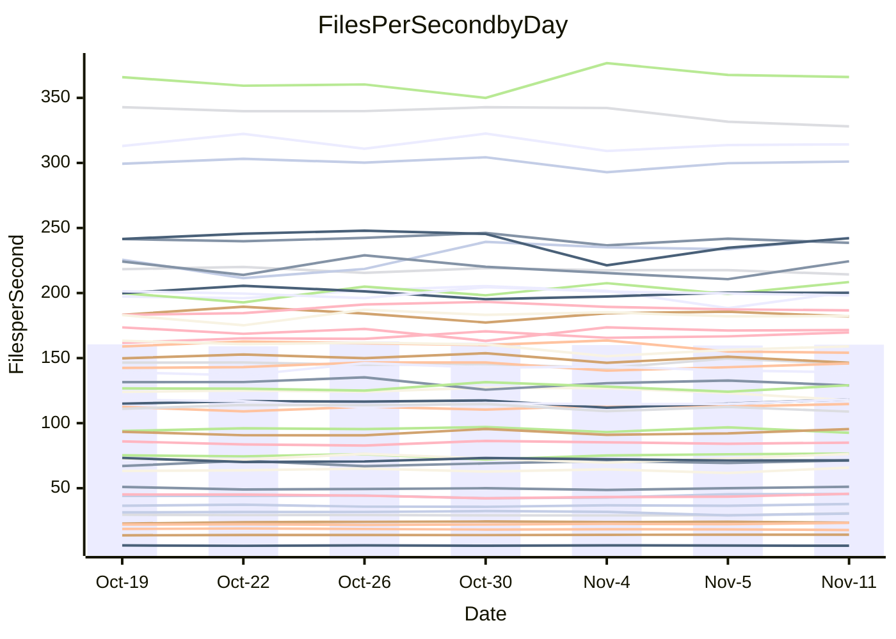

<!---
# This file is auto-generated. Do not edit.
# cspell:disable
--->
# Performance Report

## Daily Performance

## Time to Process Files

| Repository                                      | Elapsed | Min/Avg/Max           |   SD | SD Graph                |
| ----------------------------------------------- | ------: | :-------------------: | ---: | ----------------------- |
| AdaDoom3/AdaDoom3                    |    3.36 | 3.3 /   3.5 /   3.7   | 0.08 | `    ┣●━┻━━╋━━┻━━┫    ` |
| alexiosc/megistos                    |    7.53 | 7.3 /   8.0 /   8.7   | 0.38 | `    ┣━●┻━━╋━━┻━━┫    ` |
| apollographql/apollo-server          |    2.68 | 2.6 /   2.7 /   2.9   | 0.08 | `     ┣━┻●━╋━━┻━┫     ` |
| aspnetboilerplate/aspnetboilerplate  |   10.59 | 10.3 /  10.5 /  10.8  | 0.19 | `    ┣━━┻━━╋●━┻━━┫    ` |
| aws-amplify/docs                     |   13.03 | 12.4 /  13.1 /  14.8  | 0.61 | `    ┣━━┻━━●━━┻━━┫    ` |
| Azure/azure-rest-api-specs           |    9.72 | 9.6 /  10.1 /  11.0   | 0.38 | `    ┣━━●━━╋━━┻━━┫    ` |
| bitjson/typescript-starter           |    1.11 | 1.0 /   1.1 /   1.1   | 0.03 | `     ┣━┻━━╋━●┻━┫     ` |
| caddyserver/caddy                    |    3.73 | 3.7 /   3.8 /   4.0   | 0.09 | `    ┣━━●━━╋━━┻━━┫    ` |
| canada-ca/open-source-logiciel-libre |    1.25 | 1.1 /   1.2 /   1.3   | 0.04 | `     ┣━┻━━╋━━┻━●     ` |
| chef/chef                            |    5.84 | 5.7 /   6.0 /   6.3   | 0.15 | `    ┣━━┻●━╋━━┻━━┫    ` |
| dart-lang/sdk                        |   67.51 | 63.7 /  67.4 /  72.3  | 2.30 | `  ┣━━━┻━━━●━━━┻━━━┫  ` |
| django/django                        |   15.59 | 14.9 /  15.8 /  16.7  | 0.49 | `    ┣━━┻━●╋━━┻━━┫    ` |
| eslint/eslint                        |   10.94 | 10.7 /  11.2 /  11.8  | 0.37 | `    ┣━━┻●━╋━━┻━━┫    ` |
| exonum/exonum                        |    3.57 | 3.5 /   3.7 /   3.8   | 0.09 | `    ┣━━┻●━╋━━┻━━┫    ` |
| flutter/samples                      |   16.49 | 16.0 /  16.7 /  17.5  | 0.42 | `    ┣━━┻●━╋━━┻━━┫    ` |
| gitbucket/gitbucket                  |    3.54 | 3.5 /   3.7 /   3.9   | 0.11 | `    ┣━●┻━━╋━━┻━━┫    ` |
| googleapis/google-cloud-cpp          |  147.88 | 139.9 / 148.0 / 158.3 | 5.04 | `  ┣━━━┻━━━●━━━┻━━━┫  ` |
| graphql/express-graphql              |    1.05 | 1.1 /   1.2 /   1.2   | 0.03 | `●    ┣━━┻━╋━┻━━┫     ` |
| graphql/graphql-js                   |    3.22 | 2.8 /   2.9 /   3.1   | 0.08 | `     ┣━┻━━╋━━┻━┫   ● ` |
| graphql/graphql-relay-js             |    1.20 | 1.1 /   1.2 /   1.2   | 0.04 | `     ┣━┻━━╋●━┻━┫     ` |
| graphql/graphql-spec                 |    1.35 | 1.3 /   1.3 /   1.4   | 0.04 | `     ┣━┻━━●━━┻━┫     ` |
| iluwatar/java-design-patterns        |   13.45 | 12.8 /  13.3 /  14.4  | 0.39 | `    ┣━━┻━━╋●━┻━━┫    ` |
| ktaranov/sqlserver-kit               |    7.03 | 6.6 /   6.8 /   7.1   | 0.16 | `    ┣━━┻━━╋━━┻●━┫    ` |
| liriliri/licia                       |    4.15 | 4.1 /   4.3 /   4.6   | 0.13 | `    ┣━━●━━╋━━┻━━┫    ` |
| MartinThoma/LaTeX-examples           |    7.22 | 6.8 /   7.1 /   7.6   | 0.20 | `    ┣━━┻━━╋━━●━━┫    ` |
| mdx-js/mdx                           |    1.98 | 1.9 /   2.0 /   2.2   | 0.08 | `     ┣━┻●━╋━━┻━┫     ` |
| microsoft/TypeScript-Website         |    5.85 | 5.5 /   5.8 /   6.1   | 0.15 | `    ┣━━┻━━╋●━┻━━┫    ` |
| MicrosoftDocs/PowerShell-Docs        |   24.93 | 23.3 /  24.2 /  25.4  | 0.64 | `   ┣━━━┻━━╋━━┻●━━┫   ` |
| neovim/nvim-lspconfig                |    4.39 | 4.3 /   4.4 /   4.6   | 0.09 | `    ┣━━┻━●╋━━┻━━┫    ` |
| pagekit/pagekit                      |    3.62 | 3.5 /   3.7 /   4.0   | 0.15 | `    ┣━━┻━●╋━━┻━━┫    ` |
| php/php-src                          |   26.90 | 25.9 /  27.0 /  28.5  | 0.80 | `   ┣━━━┻━━●━━┻━━━┫   ` |
| plasticrake/tplink-smarthome-api     |    1.32 | 1.3 /   1.4 /   1.5   | 0.04 | `     ●━┻━━╋━━┻━┫     ` |
| prettier/prettier                    |    7.64 | 7.2 /   7.6 /   7.9   | 0.20 | `    ┣━━┻━━╋●━┻━━┫    ` |
| pycontribs/jira                      |    1.52 | 1.5 /   1.6 /   1.7   | 0.06 | `     ┣━●━━╋━━┻━┫     ` |
| RustPython/RustPython                |    5.44 | 5.2 /   5.5 /   6.0   | 0.24 | `    ┣━━┻━━●━━┻━━┫    ` |
| shoelace-style/shoelace              |    3.06 | 2.9 /   3.0 /   3.2   | 0.08 | `     ┣━┻━━╋━●┻━┫     ` |
| slint-ui/slint                       |   14.24 | 13.3 /  13.8 /  14.4  | 0.38 | `    ┣━━┻━━╋━━┻●━┫    ` |
| SoftwareBrothers/admin-bro           |    2.66 | 2.5 /   2.7 /   2.9   | 0.07 | `     ┣━┻━━●━━┻━┫     ` |
| sveltejs/svelte                      |   21.75 | 20.8 /  22.0 /  22.9  | 0.46 | `   ┣━━━┻●━╋━━┻━━━┫   ` |
| TheAlgorithms/Python                 |    5.94 | 5.7 /   5.8 /   6.0   | 0.08 | `    ┣━━┻━━╋━━┻━●┫    ` |
| twbs/bootstrap                       |    1.79 | 1.8 /   1.9 /   2.0   | 0.06 | `     ┣━●━━╋━━┻━┫     ` |
| typescript-cheatsheets/react         |    1.43 | 1.4 /   1.5 /   1.6   | 0.06 | `     ┣━┻━●╋━━┻━┫     ` |
| typescript-eslint/typescript-eslint  |    4.18 | 4.2 /   4.3 /   4.5   | 0.07 | `    ┣━●┻━━╋━━┻━━┫    ` |
| vitest-dev/vitest                    |    9.81 | 9.2 /   9.9 /  10.9   | 0.52 | `    ┣━━┻━●╋━━┻━━┫    ` |
| w3c/aria-practices                   |    3.44 | 3.5 /   3.6 /   3.8   | 0.09 | `    ┣●━┻━━╋━━┻━━┫    ` |
| w3c/specberus                        |    2.09 | 2.0 /   2.1 /   2.2   | 0.05 | `     ┣━┻━━╋●━┻━┫     ` |
| webdeveric/webpack-assets-manifest   |    1.22 | 1.2 /   1.2 /   1.3   | 0.04 | `     ┣━┻●━╋━━┻━┫     ` |
| webpack/webpack                      |    5.51 | 5.5 /   5.8 /   6.7   | 0.27 | `    ┣━━●━━╋━━┻━━┫    ` |
| wireapp/wire-desktop                 |    1.52 | 1.4 /   1.5 /   1.7   | 0.09 | `     ┣━┻━━╋●━┻━┫     ` |
| wireapp/wire-webapp                  |   12.20 | 10.7 /  11.2 /  12.3  | 0.44 | `    ┣━━┻━━╋━━┻━━┫●   ` |

Note:
- Elapsed time is in seconds.

## Files per Second over Time

| Repository                                      | Files |    Sec |    Fps |    Rel | Trend Fps           |    N |
| ----------------------------------------------- | ----: | -----: | -----: | -----: | ------------------- | ---: |
| AdaDoom3/AdaDoom3                    |   103 |   3.36 |  30.65 |  4.21% | `▇▇▅▇▅▇▆▆▆▅▆▆▄▆▇██` |   16 |
| alexiosc/megistos                    |   583 |   7.53 |  77.45 |  5.92% | `▅▇▄▄▅█▆▅▅▃▅▄▄▇▇▆▇` |   16 |
| apollographql/apollo-server          |   253 |   2.68 |  94.55 |  2.51% | `▇█▆▇▄▅▆▆█▇▅▇▇▄▇█▇` |   16 |
| aspnetboilerplate/aspnetboilerplate  |  2286 |  10.59 | 215.92 | -0.70% | `▅███▇▆▆█▇▆█▇▇█▆▆▇` |   16 |
| aws-amplify/docs                     |  2871 |  13.03 | 220.27 |  0.42% | `█▇▆▇▅███▇▇▅▇▆▆▃█▇` |   16 |
| Azure/azure-rest-api-specs           |  2365 |   9.72 | 243.37 |  1.73% | `▅▇▇▆█▇█▇▇▃▅▅▆▇▅▆▇` |   16 |
| bitjson/typescript-starter           |    20 |   1.11 |  18.09 | -2.31% | `▆▇█▇█▇▇▆▆▆▆▅▇▇▅▄▅` |   16 |
| caddyserver/caddy                    |   288 |   3.73 |  77.13 |  2.31% | `▇▆▇▆▆▇▇█▅▅█▆▆██▇█` |   16 |
| canada-ca/open-source-logiciel-libre |     7 |   1.25 |   5.58 | -6.18% | `▇█▇▄▇██▇▆▇██▄▆█▇▅` |   16 |
| chef/chef                            |  1191 |   5.84 | 203.77 |  1.80% | `▇▆▇█▇▆█▆▅▇▅▄█▇▇▆▇` |   16 |
| dart-lang/sdk                        | 10747 |  67.51 | 159.20 |  0.10% | `▇▇██▆█▇▅▆▅▄▅▇▆▅▆▆` |   16 |
| django/django                        |  2885 |  15.59 | 185.01 |  1.27% | `▅▅█▄▅▇▆█▆▇▇▇▄▇▆▆▇` |   16 |
| eslint/eslint                        |  2099 |  10.94 | 191.93 |  2.52% | `▅▄▇▇▄▇▇▇▇▅█▆▇▄▇▅▇` |   16 |
| exonum/exonum                        |   421 |   3.57 | 117.88 |  2.14% | `██▇▆█▆▆▅▇▆▇▅▇█▇██` |   16 |
| flutter/samples                      |  2400 |  16.49 | 145.57 |  1.31% | `▆▆▇▇▅█▆█▇▆▅█▅▆▆▇▇` |   16 |
| gitbucket/gitbucket                  |   413 |   3.54 | 116.58 |  3.90% | `▅▆█▅▅█▆▆▆▅█▆█▄▇▆█` |   16 |
| googleapis/google-cloud-cpp          | 20952 | 147.88 | 141.68 |  0.42% | `▆▅▆▇▄▇██▇█▆▆▅█▅▅▆` |   16 |
| graphql/express-graphql              |    26 |   1.05 |  24.69 | 11.30% | `▅▅▅▆▄▃▄▅▅▄▆▅▄▅▅▅█` |   16 |
| graphql/graphql-js                   |   368 |   3.22 | 114.30 | -8.08% | `█▇▅▆█▆█▅█▇█▇▇▅▆▅▃` |   16 |
| graphql/graphql-relay-js             |    28 |   1.20 |  23.38 | -1.96% | `▄▅▄▇▅▆▆▇▇▇▅▅▆█▆▆▅` |   16 |
| graphql/graphql-spec                 |    19 |   1.35 |  14.08 | -0.14% | `▅▆▆▅▇▄█▆▆▇▇▇▆██▇▆` |   16 |
| iluwatar/java-design-patterns        |  1992 |  13.45 | 148.15 | -1.25% | `▇▇▆█▇█▇▅█▄█▇▇▇▇▆▆` |   16 |
| ktaranov/sqlserver-kit               |   489 |   7.03 |  69.56 | -3.05% | `██▇▅▇▆▅▇█▇▇▆▇▆██▅` |   16 |
| liriliri/licia                       |  1437 |   4.15 | 345.86 |  2.63% | `█▇█▇▇█▇▇██▇█▆▆▆▄█` |   16 |
| MartinThoma/LaTeX-examples           |  1409 |   7.22 | 195.15 | -2.37% | `▇█▆▇▆▄█▆█▆▇▅▆▇▇▇▆` |   16 |
| mdx-js/mdx                           |   141 |   1.98 |  71.36 |  3.43% | `▄▇▆█▇▄▇▅▆▆█▇█▆▆▇▇` |   16 |
| microsoft/TypeScript-Website         |   761 |   5.85 | 130.07 | -1.34% | `▆▆▇▅▇▇█▇▄▅▇█▇▆▆▅▆` |   16 |
| MicrosoftDocs/PowerShell-Docs        |  2708 |  24.93 | 108.64 | -3.13% | `▇▆▆▇██▅██▄▆██▆▆▅▅` |   16 |
| neovim/nvim-lspconfig                |   759 |   4.39 | 172.90 |  0.93% | `██▆▅▇▇▇▇▅▇█▇▇▆▇▇▇` |   16 |
| pagekit/pagekit                      |   741 |   3.62 | 204.75 |  1.65% | `▇█▄▅▅▇▇▇▆█▇▅▇▅▇█▇` |   16 |
| php/php-src                          |  2262 |  26.90 |  84.09 | -0.58% | `▇█▇█▄▇▅▅▇▇▆▇█▄▆▇▆` |   16 |
| plasticrake/tplink-smarthome-api     |    62 |   1.32 |  46.95 |  6.43% | `▇▆▇▆▇▆▅▇▄▄▆▆▄▅▆▆█` |   16 |
| prettier/prettier                    |  2421 |   7.64 | 317.02 |  0.96% | `▆▆▆█▇▅▅██▅▆▆▇▆▆▆▇` |   16 |
| pycontribs/jira                      |    79 |   1.52 |  51.86 |  4.12% | `█▆▇▆▅▄▆█▆▆▅▄█▆▇▇█` |   16 |
| RustPython/RustPython                |   693 |   5.44 | 127.44 |  0.78% | `▆▇▆▅█▅▄██▇▆▇▃▆▆▇▇` |   16 |
| shoelace-style/shoelace              |   439 |   3.06 | 143.36 | -2.16% | `▇▇▅▆▆▆▅▆▆▇▄▇█▆▆▇▆` |   16 |
| slint-ui/slint                       |  2565 |  14.24 | 180.11 | -2.47% | `▅▇▇█▇▅▇█▅▆▇█▆▅█▆▅` |   16 |
| SoftwareBrothers/admin-bro           |   441 |   2.66 | 165.56 | -0.13% | `▆▇▄▇▆▇▆▆▇▇▆▇▇▆▇█▆` |   16 |
| sveltejs/svelte                      |  8053 |  21.75 | 370.21 |  1.55% | `▆▆▇▆▅▅▅▆▄█▆▆▆▆▇▆▆` |   16 |
| TheAlgorithms/Python                 |  1399 |   5.94 | 235.71 | -2.28% | `▇▇█▇▆█▆▇█▅▇▆▇█▇▇▆` |   16 |
| twbs/bootstrap                       |   118 |   1.79 |  65.93 |  3.72% | `▄▇█▇▆▇█▇▆█▆▆▆▄▅██` |   16 |
| typescript-cheatsheets/react         |    53 |   1.43 |  36.97 |  0.98% | `▆▆▆▇▆▇▃▅▅▄██▅▇▄█▆` |   16 |
| typescript-eslint/typescript-eslint  |  1285 |   4.18 | 307.38 |  2.69% | `▇▇▇█▇▇█▆█▇▅▇▇▇▇▆█` |   16 |
| vitest-dev/vitest                    |  2339 |   9.81 | 238.35 |  4.58% | `▅▆▆▄▃▃▅▆▇█▅▆█▆▆█▇` |   16 |
| w3c/aria-practices                   |   414 |   3.44 | 120.49 |  4.44% | `▆▅██▆▇▆▇▇▆▄▇▅▅▇▇█` |   16 |
| w3c/specberus                        |   197 |   2.09 |  94.42 | -0.72% | `▇▆▇█▇▇▆███▅▇███▅▇` |   16 |
| webdeveric/webpack-assets-manifest   |    55 |   1.22 |  45.17 |  1.92% | `▅▇▇▇▆█▆▆▅▆▄█▆█▇█▇` |   16 |
| webpack/webpack                      |  1141 |   5.51 | 207.14 |  5.32% | `▇█▆▇▆█▇▇█▇▇▇▆▃▆▆█` |   16 |
| wireapp/wire-desktop                 |    46 |   1.52 |  30.18 | -2.74% | `▇▇▆▇▇▆█▇██▇▅▄▃█▆▆` |   16 |
| wireapp/wire-webapp                  |  1783 |  12.20 | 146.20 | -8.49% | `▇▆▇▇█▇█▆▇▇█▄██▄▇▄` |   16 |

## Data Throughput

| Repository                                      | Files |    Sec |     Kps |    Rel | Trend Kps           |    N |
| ----------------------------------------------- | ----: | -----: | ------: | -----: | ------------------- | ---: |
| AdaDoom3/AdaDoom3                    |   103 |   3.36 |  651.40 |  4.21% | `▇▇▅▇▅▇▆▆▆▅▆▆▄▆▇██` |   16 |
| alexiosc/megistos                    |   583 |   7.53 |  608.61 |  5.92% | `▅▇▄▄▅█▆▅▅▃▅▄▄▇▇▆▇` |   16 |
| apollographql/apollo-server          |   253 |   2.68 |  772.45 |  3.31% | `▆▇▅▆▄▅▆▅█▇▅▇▇▄▇█▇` |   16 |
| aspnetboilerplate/aspnetboilerplate  |  2286 |  10.59 |  525.35 | -0.70% | `▅███▇▆▆█▇▆█▇▇█▆▆▇` |   16 |
| aws-amplify/docs                     |  2871 |  13.03 |  769.00 |  0.43% | `█▇▆▇▅███▇▇▅▇▆▆▃█▇` |   16 |
| Azure/azure-rest-api-specs           |  2365 |   9.72 |  661.17 |  2.60% | `▅▇▇▆█▇█▇▇▃▅▅▆▇▅▇▇` |   16 |
| bitjson/typescript-starter           |    20 |   1.11 |   72.34 | -2.31% | `▆▇█▇█▇▇▆▆▆▆▅▇▇▅▄▅` |   16 |
| caddyserver/caddy                    |   288 |   3.73 |  668.98 |  2.57% | `▆▅▇▆▆▇▇█▅▅█▆▆██▇█` |   16 |
| canada-ca/open-source-logiciel-libre |     7 |   1.25 |   46.24 | -6.18% | `▇█▇▄▇██▇▆▇██▄▆█▇▅` |   16 |
| chef/chef                            |  1191 |   5.84 |  944.41 |  1.92% | `▇▅▆█▇▆█▆▅▇▅▄█▇▇▆▇` |   16 |
| dart-lang/sdk                        | 10747 |  67.51 | 1086.38 |  0.22% | `▇▇██▆█▇▅▆▅▄▅▇▆▅▆▆` |   16 |
| django/django                        |  2885 |  15.59 | 1161.07 |  1.15% | `▅▅█▅▅▇▆█▆▇▇▇▄▇▇▆▇` |   16 |
| eslint/eslint                        |  2099 |  10.94 | 1376.79 |  2.28% | `▅▅▇▇▄▇▇▇▇▅█▆▇▄▇▅▇` |   16 |
| exonum/exonum                        |   421 |   3.57 | 1127.58 |  2.14% | `██▇▆█▆▆▅▇▆▇▅▇█▇██` |   16 |
| flutter/samples                      |  2400 |  16.49 | 1299.07 |  1.31% | `▆▆▇▇▅█▆█▇▆▅█▅▆▆▇▇` |   16 |
| gitbucket/gitbucket                  |   413 |   3.54 |  529.84 |  3.89% | `▅▆█▅▅▇▆▆▆▅█▆█▄▇▆█` |   16 |
| googleapis/google-cloud-cpp          | 20952 | 147.88 | 1154.00 |  0.74% | `▆▅▆▇▄▇██▇█▆▆▅█▅▅▆` |   16 |
| graphql/express-graphql              |    26 |   1.05 |  113.02 | 11.30% | `▅▅▅▆▄▃▄▅▅▄▆▅▄▅▅▅█` |   16 |
| graphql/graphql-js                   |   368 |   3.22 |  663.42 | -7.76% | `▇▇▄▆█▆█▅█▇█▇▇▅▆▆▃` |   16 |
| graphql/graphql-relay-js             |    28 |   1.20 |   91.84 | -1.96% | `▄▅▄▇▅▆▆▇▇▇▅▅▆█▆▆▅` |   16 |
| graphql/graphql-spec                 |    19 |   1.35 |  469.69 | -0.14% | `▅▆▆▅▇▄█▆▆▇▇▇▆██▇▆` |   16 |
| iluwatar/java-design-patterns        |  1992 |  13.45 |  457.92 | -1.25% | `▇▇▆█▇█▇▅█▄█▇▇▇▇▆▆` |   16 |
| ktaranov/sqlserver-kit               |   489 |   7.03 | 1053.29 | -3.04% | `██▇▅▇▆▅▇█▇▇▆▇▆██▅` |   16 |
| liriliri/licia                       |  1437 |   4.15 |  412.04 |  2.63% | `█▇█▇▇█▇▇██▇█▆▆▆▄█` |   16 |
| MartinThoma/LaTeX-examples           |  1409 |   7.22 |  403.04 | -2.37% | `▇█▆▇▆▄█▆█▆▇▅▆▇▇▇▆` |   16 |
| mdx-js/mdx                           |   141 |   1.98 |  332.01 |  3.43% | `▄▇▆█▇▄▇▅▆▆█▇█▆▆▇▇` |   16 |
| microsoft/TypeScript-Website         |   761 |   5.85 |  899.70 | -1.33% | `▆▆▇▅▇▇█▇▄▅▇█▇▆▆▅▆` |   16 |
| MicrosoftDocs/PowerShell-Docs        |  2708 |  24.93 | 1118.74 | -3.08% | `▇▆▆▇██▅██▄▆██▆▆▅▅` |   16 |
| neovim/nvim-lspconfig                |   759 |   4.39 |  289.31 |  1.07% | `██▆▅▇▇▇▇▅▇█▇▇▆▇▇▇` |   16 |
| pagekit/pagekit                      |   741 |   3.62 |  426.92 |  1.65% | `▇█▄▅▅▇▇▇▆█▇▅▇▅▇█▇` |   16 |
| php/php-src                          |  2262 |  26.90 | 1471.56 | -0.53% | `▇█▇█▄▇▅▅▇▇▆▇█▄▆▇▆` |   16 |
| plasticrake/tplink-smarthome-api     |    62 |   1.32 |  253.67 |  6.43% | `▇▆▇▆▇▆▅▇▄▄▆▆▄▅▆▆█` |   16 |
| prettier/prettier                    |  2421 |   7.64 |  440.23 |  0.50% | `▆▆▆█▇▅▅██▅▆▆▇▅▆▆▇` |   16 |
| pycontribs/jira                      |    79 |   1.52 |  367.58 |  4.12% | `█▆▇▆▅▄▆█▆▆▅▄█▆▇▇█` |   16 |
| RustPython/RustPython                |   693 |   5.44 | 1060.32 |  3.58% | `▅▆▅▄▇▅▃▇▇█▇█▄▇▇█▇` |   16 |
| shoelace-style/shoelace              |   439 |   3.06 |  692.61 | -2.16% | `▇▇▅▆▆▆▅▆▆▇▄▇█▆▆▇▆` |   16 |
| slint-ui/slint                       |  2565 |  14.24 | 1110.90 | -2.25% | `▅▇▇█▇▅▇█▅▆▇█▆▅█▆▆` |   16 |
| SoftwareBrothers/admin-bro           |   441 |   2.66 |  364.91 | -0.13% | `▆▇▄▇▆▇▆▆▇▇▆▇▇▆▇█▆` |   16 |
| sveltejs/svelte                      |  8053 |  21.75 |  246.96 |  1.49% | `▅▆▇▆▅▅▅▆▄█▆▆▆▆▇▆▆` |   16 |
| TheAlgorithms/Python                 |  1399 |   5.94 |  599.47 | -2.27% | `▇▇█▇▆█▆▇█▅▇▆▇█▇▇▆` |   16 |
| twbs/bootstrap                       |   118 |   1.79 |  541.39 |  3.82% | `▄▇█▇▆▇█▇▆█▆▆▆▄▅██` |   16 |
| typescript-cheatsheets/react         |    53 |   1.43 |  273.44 |  0.98% | `▆▆▆▇▆▇▃▅▅▄██▅▇▄█▆` |   16 |
| typescript-eslint/typescript-eslint  |  1285 |   4.18 | 1584.48 |  2.90% | `▇▇▇█▇▇█▆█▇▅▇▇▇▇▆█` |   16 |
| vitest-dev/vitest                    |  2339 |   9.81 |  511.96 |  0.81% | `▅▆▆▄▃▃▅▆██▅▆█▆▆▇▆` |   16 |
| w3c/aria-practices                   |   414 |   3.44 | 1123.38 |  4.44% | `▆▅██▆▇▆▇▇▆▄▇▅▅▇▇█` |   16 |
| w3c/specberus                        |   197 |   2.09 |  298.61 | -0.72% | `▇▆▇█▇▇▆███▅▇███▅▇` |   16 |
| webdeveric/webpack-assets-manifest   |    55 |   1.22 |  104.30 |  1.92% | `▅▇▇▇▆█▆▆▅▆▄█▆█▇█▇` |   16 |
| webpack/webpack                      |  1141 |   5.51 |  944.59 |  5.63% | `▇█▆▇▆█▇▇█▇▇▇▆▃▅▆█` |   16 |
| wireapp/wire-desktop                 |    46 |   1.52 |  168.60 | -2.74% | `▇▇▆▇▇▆█▇██▇▅▄▃█▆▆` |   16 |
| wireapp/wire-webapp                  |  1783 |  12.20 |  540.70 | -8.31% | `▇▆▇▇█▇█▆▇▇█▄██▄▇▄` |   16 |

