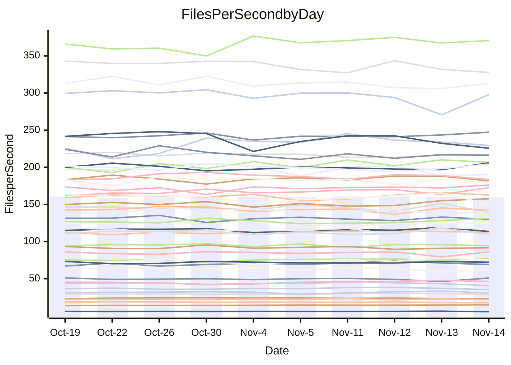

<!---
# This file is auto-generated. Do not edit.
# cspell:disable
--->
# Performance Report

## Daily Performance

## Time to Process Files

| Repository                                      | Elapsed | Min/Avg/Max           |   SD | SD Graph                |
| ----------------------------------------------- | ------: | :-------------------: | ---: | ----------------------- |
| AdaDoom3/AdaDoom3                    |    3.54 | 3.3 /   3.5 /   3.7   | 0.10 | `    ┣━━┻━━╋━●┻━━┫    ` |
| alexiosc/megistos                    |    7.73 | 7.3 /   7.9 /   8.7   | 0.37 | `    ┣━━┻●━╋━━┻━━┫    ` |
| apollographql/apollo-server          |    2.76 | 2.6 /   2.8 /   3.2   | 0.13 | `    ┣━━┻━━●━━┻━━┫    ` |
| aspnetboilerplate/aspnetboilerplate  |   10.56 | 10.3 /  10.6 /  11.8  | 0.33 | `    ┣━━┻━━●━━┻━━┫    ` |
| aws-amplify/docs                     |   13.27 | 12.4 /  13.2 /  14.8  | 0.56 | `    ┣━━┻━━●━━┻━━┫    ` |
| Azure/azure-rest-api-specs           |   10.48 | 9.6 /  10.0 /  11.0   | 0.36 | `    ┣━━┻━━╋━━┻●━┫    ` |
| bitjson/typescript-starter           |    1.14 | 1.0 /   1.1 /   1.1   | 0.03 | `     ┣━┻━━╋━━┻━●     ` |
| caddyserver/caddy                    |    3.75 | 3.6 /   3.8 /   4.0   | 0.09 | `    ┣━━┻●━╋━━┻━━┫    ` |
| canada-ca/open-source-logiciel-libre |    1.28 | 1.1 /   1.2 /   1.3   | 0.04 | `     ┣━┻━━╋━━┻━┫ ●   ` |
| chef/chef                            |    5.79 | 5.7 /   6.0 /   6.3   | 0.15 | `    ┣━●┻━━╋━━┻━━┫    ` |
| dart-lang/sdk                        |   71.48 | 63.7 /  67.2 /  72.3  | 2.08 | `  ┣━━━┻━━━╋━━━┻━━━●  ` |
| django/django                        |   16.04 | 14.9 /  15.8 /  17.2  | 0.52 | `    ┣━━┻━━╋●━┻━━┫    ` |
| eslint/eslint                        |   11.44 | 10.7 /  11.2 /  11.8  | 0.37 | `    ┣━━┻━━╋━●┻━━┫    ` |
| exonum/exonum                        |    3.61 | 3.5 /   3.7 /   4.0   | 0.12 | `    ┣━━┻━●╋━━┻━━┫    ` |
| flutter/samples                      |   16.89 | 16.0 /  16.8 /  19.0  | 0.60 | `   ┣━━━┻━━●━━┻━━━┫   ` |
| gitbucket/gitbucket                  |    3.67 | 3.5 /   3.7 /   3.9   | 0.10 | `    ┣━━┻━━●━━┻━━┫    ` |
| googleapis/google-cloud-cpp          |  148.68 | 139.9 / 148.0 / 158.3 | 4.63 | `  ┣━━━┻━━━╋●━━┻━━━┫  ` |
| graphql/express-graphql              |    1.19 | 1.1 /   1.2 /   1.3   | 0.04 | `     ┣━┻━━╋●━┻━┫     ` |
| graphql/graphql-js                   |    2.94 | 2.8 /   3.0 /   3.2   | 0.11 | `    ┣━━┻━━●━━┻━━┫    ` |
| graphql/graphql-relay-js             |    1.21 | 1.1 /   1.2 /   1.2   | 0.04 | `     ┣━┻━━╋━━●━┫     ` |
| graphql/graphql-spec                 |    1.29 | 1.3 /   1.3 /   1.4   | 0.04 | `     ┣●┻━━╋━━┻━┫     ` |
| iluwatar/java-design-patterns        |   12.64 | 12.8 /  13.3 /  14.4  | 0.36 | `    ●━━┻━━╋━━┻━━┫    ` |
| ktaranov/sqlserver-kit               |    6.78 | 6.6 /   6.8 /   7.1   | 0.17 | `    ┣━━┻━●╋━━┻━━┫    ` |
| liriliri/licia                       |    4.38 | 4.1 /   4.3 /   4.6   | 0.12 | `    ┣━━┻━━╋━━●━━┫    ` |
| MartinThoma/LaTeX-examples           |    6.90 | 6.8 /   7.1 /   7.9   | 0.25 | `    ┣━━┻●━╋━━┻━━┫    ` |
| mdx-js/mdx                           |    2.04 | 1.9 /   2.0 /   2.2   | 0.08 | `     ┣━┻━━╋●━┻━┫     ` |
| microsoft/TypeScript-Website         |    5.86 | 5.5 /   5.8 /   6.5   | 0.19 | `    ┣━━┻━━╋●━┻━━┫    ` |
| MicrosoftDocs/PowerShell-Docs        |   24.78 | 22.9 /  24.2 /  26.2  | 0.78 | `   ┣━━━┻━━╋━●┻━━━┫   ` |
| neovim/nvim-lspconfig                |    4.31 | 4.3 /   4.4 /   4.6   | 0.08 | `    ┣━●┻━━╋━━┻━━┫    ` |
| pagekit/pagekit                      |    3.59 | 3.5 /   3.7 /   4.0   | 0.14 | `    ┣━━┻●━╋━━┻━━┫    ` |
| php/php-src                          |   26.25 | 25.9 /  26.9 /  28.6  | 0.82 | `   ┣━━━●━━╋━━┻━━━┫   ` |
| plasticrake/tplink-smarthome-api     |    1.34 | 1.3 /   1.4 /   1.5   | 0.05 | `     ┣━●━━╋━━┻━┫     ` |
| prettier/prettier                    |    7.74 | 7.2 /   7.7 /   8.3   | 0.23 | `    ┣━━┻━━╋●━┻━━┫    ` |
| pycontribs/jira                      |    1.55 | 1.5 /   1.6 /   1.7   | 0.06 | `     ┣━┻●━╋━━┻━┫     ` |
| RustPython/RustPython                |    5.29 | 5.2 /   5.5 /   6.0   | 0.23 | `    ┣━━●━━╋━━┻━━┫    ` |
| shoelace-style/shoelace              |    3.15 | 2.9 /   3.0 /   3.2   | 0.08 | `    ┣━━┻━━╋━━┻●━┫    ` |
| slint-ui/slint                       |   14.11 | 13.3 /  13.8 /  14.4  | 0.35 | `    ┣━━┻━━╋━━●━━┫    ` |
| SoftwareBrothers/admin-bro           |    2.56 | 2.5 /   2.7 /   2.9   | 0.07 | `     ┣●┻━━╋━━┻━┫     ` |
| sveltejs/svelte                      |   21.73 | 20.8 /  21.9 /  22.9  | 0.45 | `   ┣━━━┻━●╋━━┻━━━┫   ` |
| TheAlgorithms/Python                 |    5.66 | 5.7 /   5.8 /   6.1   | 0.11 | `    ┣━●┻━━╋━━┻━━┫    ` |
| twbs/bootstrap                       |    1.88 | 1.8 /   1.9 /   2.0   | 0.06 | `     ┣━┻━━╋●━┻━┫     ` |
| typescript-cheatsheets/react         |    1.50 | 1.3 /   1.4 /   1.6   | 0.06 | `     ┣━┻━━╋━━●━┫     ` |
| typescript-eslint/typescript-eslint  |    4.32 | 4.2 /   4.3 /   4.7   | 0.12 | `    ┣━━┻━━●━━┻━━┫    ` |
| vitest-dev/vitest                    |   10.20 | 9.2 /   9.9 /  10.9   | 0.47 | `    ┣━━┻━━╋━●┻━━┫    ` |
| w3c/aria-practices                   |    3.65 | 3.4 /   3.6 /   3.8   | 0.09 | `    ┣━━┻━━╋━●┻━━┫    ` |
| w3c/specberus                        |    2.09 | 2.0 /   2.1 /   2.2   | 0.05 | `     ┣━┻━━╋●━┻━┫     ` |
| webdeveric/webpack-assets-manifest   |    1.35 | 1.2 /   1.2 /   1.3   | 0.04 | `     ┣━┻━━╋━━┻━┫  ●  ` |
| webpack/webpack                      |    6.00 | 5.5 /   5.8 /   6.7   | 0.25 | `    ┣━━┻━━╋━━●━━┫    ` |
| wireapp/wire-desktop                 |    1.49 | 1.4 /   1.5 /   1.7   | 0.08 | `     ┣━┻━━●━━┻━┫     ` |
| wireapp/wire-webapp                  |   10.97 | 10.6 /  11.2 /  12.3  | 0.48 | `    ┣━━┻━●╋━━┻━━┫    ` |

Note:
- Elapsed time is in seconds.

## Files per Second over Time

| Repository                                      | Files |    Sec |    Fps |    Rel | Trend Fps              |    N |
| ----------------------------------------------- | ----: | -----: | -----: | -----: | ---------------------- | ---: |
| AdaDoom3/AdaDoom3                    |   103 |   3.54 |  29.13 | -1.61% | `▇▅▇▆▆▆▅▆▆▄▆▇██▄█▇█▇▆` |   22 |
| alexiosc/megistos                    |   583 |   7.73 |  75.46 |  2.48% | `▄▅█▆▅▅▃▅▄▄▇▇▆▇▆▆▆▄▇▆` |   22 |
| apollographql/apollo-server          |   253 |   2.76 |  91.64 | -0.15% | `▇▆▆▇▆█▇▆█▇▅▇██▆██▃▆▇` |   22 |
| aspnetboilerplate/aspnetboilerplate  |  2286 |  10.56 | 216.43 | -0.04% | `█▇▆▇██▇█▇▇█▆▆▇▆▄██▇▇` |   22 |
| aws-amplify/docs                     |  2871 |  13.27 | 216.28 | -0.64% | `▇▅███▇▇▅▇▆▆▃█▇▅▆▅▆▆▆` |   22 |
| Azure/azure-rest-api-specs           |  2365 |  10.48 | 225.67 | -5.84% | `▆█▇█▇▇▃▅▅▆▇▅▆▇▇▇▆▇▅▅` |   22 |
| bitjson/typescript-starter           |    20 |   1.14 |  17.56 | -5.14% | `▇██▇▆▆▆▇▅█▇▅▄▆█▇▇▇▅▄` |   22 |
| caddyserver/caddy                    |   288 |   3.75 |  76.80 |  1.56% | `▆▆▆▆▇▄▅▇▆▆█▇▇▇▆▇▅█▆▇` |   22 |
| canada-ca/open-source-logiciel-libre |     7 |   1.28 |   5.47 | -8.38% | `▄▆▇▇▆▅▇▇▇▄▆▇▆▄█▇█▅█▃` |   22 |
| chef/chef                            |  1191 |   5.79 | 205.77 |  3.04% | `█▇▆█▆▅▇▅▄█▇▇▆▇▆▄▆▇▆▇` |   22 |
| dart-lang/sdk                        | 10747 |  71.48 | 150.34 | -5.77% | `█▆█▇▅▆▅▄▅▇▆▅▆▆▅▇▆▇█▄` |   22 |
| django/django                        |  2885 |  16.04 | 179.92 | -1.25% | `▅▅▇▇█▇▇▇▇▅▇▇▆▇▇▆▇▄▇▆` |   22 |
| eslint/eslint                        |  2099 |  11.44 | 183.53 | -2.10% | `▇▄▇▇▇▇▅█▆▇▄▇▅▇▄▆█▆▆▅` |   22 |
| exonum/exonum                        |   421 |   3.61 | 116.46 |  1.31% | `▇█▆▆▅▇▆▇▅▇█▇██▇▇▅▄█▇` |   22 |
| flutter/samples                      |  2400 |  16.89 | 142.11 | -0.41% | `▇▆█▇█▇▇▆█▆▇▆▇▇▆▇▃▆▇▇` |   22 |
| gitbucket/gitbucket                  |   413 |   3.67 | 112.62 | -0.19% | `▅▅▇▆▆▆▅█▆█▄▇▆█▆█▆▇▇▆` |   22 |
| googleapis/google-cloud-cpp          | 20952 | 148.68 | 140.92 | -0.25% | `▇▄▇██▇█▆▆▅█▅▅▆▇▆▇▇▅▆` |   22 |
| graphql/express-graphql              |    26 |   1.19 |  21.85 | -1.84% | `▆▄▄▅▅▅▅▆▅▅▅▅▅█▆▃▄▅▆▅` |   22 |
| graphql/graphql-js                   |   368 |   2.94 | 124.99 |  0.80% | `▆█▆█▆█▇█▇▇▅▆▆▄▇██▄▇▇` |   22 |
| graphql/graphql-relay-js             |    28 |   1.21 |  23.06 | -3.08% | `▇▅▆▆▇▇▇▅▅▆█▆▆▅▅▆▇▆▅▅` |   22 |
| graphql/graphql-spec                 |    19 |   1.29 |  14.71 |  4.04% | `▅▇▄█▆▆▇▆▇▆▇█▇▆▇█▅▆▇█` |   22 |
| iluwatar/java-design-patterns        |  1992 |  12.64 | 157.59 |  5.07% | `▇▇█▆▅▇▄▇▆▇▇▇▅▆▆▅▆▇██` |   22 |
| ktaranov/sqlserver-kit               |   489 |   6.78 |  72.16 |  0.81% | `▅▆▆▅▇▇▇▇▆▇▅▇▇▅▆█▆▅▇▇` |   22 |
| liriliri/licia                       |  1437 |   4.38 | 327.76 | -2.90% | `▇▇█▇███▇█▆▆▆▄█▆▇██▆▆` |   22 |
| MartinThoma/LaTeX-examples           |  1409 |   6.90 | 204.17 |  2.82% | `▇▆▅█▆█▇▇▆▇██▇▆▆█▆▃▇█` |   22 |
| mdx-js/mdx                           |   141 |   2.04 |  69.11 | -1.13% | `▇▆▃▆▅▆▆▇▆▇▅▅▇▇▆███▇▆` |   22 |
| microsoft/TypeScript-Website         |   761 |   5.86 | 129.97 | -1.05% | `▆▇▇██▅▆▇█▇▆▆▆▆▇▇▃▇▇▆` |   22 |
| MicrosoftDocs/PowerShell-Docs        |  2708 |  24.78 | 109.29 | -2.42% | `▆▇█▅▇▇▅▆▇▇▅▆▅▅▆█▆▄█▅` |   22 |
| neovim/nvim-lspconfig                |   759 |   4.31 | 176.09 |  2.47% | `▅▇▇▇▇▅▇█▇▇▆▇▇▇█▇▇█▇█` |   22 |
| pagekit/pagekit                      |   741 |   3.59 | 206.66 |  2.02% | `▅▄▇▇▆▆█▇▅▇▅▇█▇█▇▇▅█▇` |   22 |
| php/php-src                          |  2262 |  26.25 |  86.18 |  1.92% | `█▅▇▅▅▇▇▆▇█▅▆▇▆▇█▇▇▄▇` |   22 |
| plasticrake/tplink-smarthome-api     |    62 |   1.34 |  46.36 |  3.63% | `▆▇▅▄▇▄▄▅▅▄▅▆▆█▆▇▇▇█▇` |   22 |
| prettier/prettier                    |  2421 |   7.74 | 312.70 | -0.07% | `█▇▅▆██▆▇▇▇▆▇▆▇▇▇▄▆▆▇` |   22 |
| pycontribs/jira                      |    79 |   1.55 |  50.88 |  2.60% | `▆▅▄▆█▆▆▅▄█▆▇▇█▆▅▅▇▄▇` |   22 |
| RustPython/RustPython                |   693 |   5.29 | 131.06 |  4.06% | `▅█▅▄██▇▆▇▃▆▆▇▇▄▅▆▇▇█` |   22 |
| shoelace-style/shoelace              |   439 |   3.15 | 139.20 | -4.46% | `▆▆▆▅▆▆▇▄▇█▆▆▇▆▆▄▅▅█▄` |   22 |
| slint-ui/slint                       |  2565 |  14.11 | 181.73 | -1.83% | `█▇▅▇█▅▆▇█▆▅█▆▅▇█▇▇▇▆` |   22 |
| SoftwareBrothers/admin-bro           |   441 |   2.56 | 172.46 |  3.67% | `▇▆▇▆▆▇▇▆▇▇▆▇█▆▇█▇▇▆█` |   22 |
| sveltejs/svelte                      |  8053 |  21.73 | 370.51 |  0.94% | `▆▅▅▅▆▄█▆▆▆▆▇▆▆█▇▇▇▆▇` |   22 |
| TheAlgorithms/Python                 |  1399 |   5.66 | 247.17 |  2.41% | `▇▆█▇▇█▆▇▆▇█▇▇▆█▅██▇█` |   22 |
| twbs/bootstrap                       |   118 |   1.88 |  62.70 | -1.16% | `▇▆▇█▇▆█▆▆▆▄▆██▆▇▇▆▄▆` |   22 |
| typescript-cheatsheets/react         |    53 |   1.50 |  35.25 | -4.58% | `▇▆▆▃▅▅▄▇▇▅▆▄▇▆▇▆▇█▆▄` |   22 |
| typescript-eslint/typescript-eslint  |  1285 |   4.32 | 297.75 |  0.05% | `█▇██▆█▇▆▇▇▇▇▇█▇▆▆█▄▇` |   22 |
| vitest-dev/vitest                    |  2339 |  10.20 | 229.39 | -0.64% | `▄▃▃▄▅▇▇▅▅▇▆▆█▇█▆▆▇▆▆` |   22 |
| w3c/aria-practices                   |   414 |   3.65 | 113.54 | -1.77% | `█▆▇▆▇▇▆▄▇▅▅▇▇█▅▇▇▅█▆` |   22 |
| w3c/specberus                        |   197 |   2.09 |  94.48 | -0.55% | `█▇▇▆███▄▇███▅▇▅▇▇█▇▇` |   22 |
| webdeveric/webpack-assets-manifest   |    55 |   1.35 |  40.60 | -8.73% | `▆▅▇▅▅▄▅▄▇▅▇▆▇▆█▅▅▇▅▃` |   22 |
| webpack/webpack                      |  1141 |   6.00 | 190.06 | -3.79% | `▇▆█▇▇█▇▇▇▆▃▆▆█▇▇█▇▆▆` |   22 |
| wireapp/wire-desktop                 |    46 |   1.49 |  30.87 | -1.35% | `▇▇▆█▇▇▇▆▅▄▃█▆▆▆▇█▇█▆` |   22 |
| wireapp/wire-webapp                  |  1783 |  10.97 | 162.61 |  1.66% | `▆█▇█▆▇▇█▄▇▇▃▇▄▇█▅██▇` |   22 |

## Data Throughput

| Repository                                      | Files |    Sec |     Kps |    Rel | Trend Kps              |    N |
| ----------------------------------------------- | ----: | -----: | ------: | -----: | ---------------------- | ---: |
| AdaDoom3/AdaDoom3                    |   103 |   3.54 |  619.04 | -1.61% | `▇▅▇▆▆▆▅▆▆▄▆▇██▄█▇█▇▆` |   22 |
| alexiosc/megistos                    |   583 |   7.73 |  592.91 |  2.48% | `▄▅█▆▅▅▃▅▄▄▇▇▆▇▆▆▆▄▇▆` |   22 |
| apollographql/apollo-server          |   253 |   2.76 |  748.70 |  0.42% | `▇▅▆▆▆█▇▆█▇▅▇██▆██▃▆▇` |   22 |
| aspnetboilerplate/aspnetboilerplate  |  2286 |  10.56 |  526.59 | -0.04% | `█▇▆▇██▇█▇▇█▆▆▇▆▄██▇▇` |   22 |
| aws-amplify/docs                     |  2871 |  13.27 |  755.06 | -0.64% | `▇▅███▇▇▅▇▆▆▃█▇▅▆▅▆▆▆` |   22 |
| Azure/azure-rest-api-specs           |  2365 |  10.48 |  613.09 | -5.26% | `▆█▇█▇▇▃▅▅▆▇▅▇▇▇▇▆█▆▅` |   22 |
| bitjson/typescript-starter           |    20 |   1.14 |   70.22 | -5.14% | `▇██▇▆▆▆▇▅█▇▅▄▆█▇▇▇▅▄` |   22 |
| caddyserver/caddy                    |   288 |   3.75 |  666.15 |  1.74% | `▆▆▆▆▇▄▅▇▆▆█▇▇▇▆▇▅█▆▇` |   22 |
| canada-ca/open-source-logiciel-libre |     7 |   1.28 |   45.32 | -8.38% | `▄▆▇▇▆▅▇▇▇▄▆▇▆▄█▇█▅█▃` |   22 |
| chef/chef                            |  1191 |   5.79 |  953.67 |  3.13% | `█▇▆█▆▅▇▅▄█▇▇▆▇▆▄▆▇▆▇` |   22 |
| dart-lang/sdk                        | 10747 |  71.48 | 1025.94 | -5.68% | `█▆█▇▅▆▅▄▅▇▆▅▆▆▆▇▇▇█▄` |   22 |
| django/django                        |  2885 |  16.04 | 1129.15 | -1.33% | `▅▅▇▇█▇▇▇▇▅▇▇▆▇▇▆▆▄▇▆` |   22 |
| eslint/eslint                        |  2099 |  11.44 | 1316.55 | -2.27% | `▇▄▇▇▇▇▅█▆▇▄▇▅▇▄▅█▆▆▅` |   22 |
| exonum/exonum                        |   421 |   3.61 | 1113.99 |  1.31% | `▇█▆▆▅▇▆▇▅▇█▇██▇▇▅▄█▇` |   22 |
| flutter/samples                      |  2400 |  16.89 | 1268.18 | -0.41% | `▇▆█▇█▇▇▆█▆▇▆▇▇▆▇▃▆▇▇` |   22 |
| gitbucket/gitbucket                  |   413 |   3.67 |  511.83 | -0.20% | `▅▅▇▆▆▆▅█▆█▄▇▆█▆█▆▇▇▆` |   22 |
| googleapis/google-cloud-cpp          | 20952 | 148.68 | 1147.79 | -0.02% | `▇▄▇██▇█▆▆▅█▅▅▆▇▆▇▇▅▆` |   22 |
| graphql/express-graphql              |    26 |   1.19 |  100.00 | -1.84% | `▆▄▄▅▅▅▅▆▅▅▅▅▅█▆▃▄▅▆▅` |   22 |
| graphql/graphql-js                   |   368 |   2.94 |  725.50 |  1.05% | `▆█▆█▅▇▇█▇▇▅▆▆▄▇██▄▇▇` |   22 |
| graphql/graphql-relay-js             |    28 |   1.21 |   90.60 | -3.08% | `▇▅▆▆▇▇▇▅▅▆█▆▆▅▅▆▇▆▅▅` |   22 |
| graphql/graphql-spec                 |    19 |   1.29 |  490.90 |  4.04% | `▅▇▄█▆▆▇▆▇▆▇█▇▆▇█▅▆▇█` |   22 |
| iluwatar/java-design-patterns        |  1992 |  12.64 |  487.10 |  5.07% | `▇▇█▆▅▇▄▇▆▇▇▇▅▆▆▅▆▇██` |   22 |
| ktaranov/sqlserver-kit               |   489 |   6.78 | 1092.77 |  0.82% | `▅▆▆▅▇▇▇▇▆▇▅▇▇▅▆█▆▅▇▇` |   22 |
| liriliri/licia                       |  1437 |   4.38 |  390.48 | -2.90% | `▇▇█▇███▇█▆▆▆▄█▆▇██▆▆` |   22 |
| MartinThoma/LaTeX-examples           |  1409 |   6.90 |  421.67 |  2.82% | `▇▆▅█▆█▇▇▆▇██▇▆▆█▆▃▇█` |   22 |
| mdx-js/mdx                           |   141 |   2.04 |  321.53 | -1.13% | `▇▆▃▆▅▆▆▇▆▇▅▅▇▇▆███▇▆` |   22 |
| microsoft/TypeScript-Website         |   761 |   5.86 |  899.05 | -1.04% | `▆▇▇██▅▆▇█▇▆▆▆▆▇▇▃▇▇▆` |   22 |
| MicrosoftDocs/PowerShell-Docs        |  2708 |  24.78 | 1125.38 | -2.39% | `▆▇█▅▇▇▅▆▇▇▅▆▅▅▆█▆▄█▅` |   22 |
| neovim/nvim-lspconfig                |   759 |   4.31 |  294.64 |  2.57% | `▅▇▇▇▇▅▇█▇▇▆▇▇▇█▇▇█▇█` |   22 |
| pagekit/pagekit                      |   741 |   3.59 |  430.89 |  2.02% | `▅▄▇▇▆▆█▇▅▇▅▇█▇█▇▇▅█▇` |   22 |
| php/php-src                          |  2262 |  26.25 | 1508.03 |  1.96% | `█▅▇▅▅▇▇▆▇█▅▆▇▆▇█▇▇▄▇` |   22 |
| plasticrake/tplink-smarthome-api     |    62 |   1.34 |  250.51 |  3.63% | `▆▇▅▄▇▄▄▅▅▄▅▆▆█▆▇▇▇█▇` |   22 |
| prettier/prettier                    |  2421 |   7.74 |  434.24 | -0.40% | `██▅▆██▅▆▆▇▆▇▆▇▇▇▄▆▆▆` |   22 |
| pycontribs/jira                      |    79 |   1.55 |  360.68 |  2.60% | `▆▅▄▆█▆▆▅▄█▆▇▇█▆▅▅▇▄▇` |   22 |
| RustPython/RustPython                |   693 |   5.29 | 1090.48 |  6.16% | `▄▇▅▃▇▇█▇█▄▇▇█▇▄▆▇▇▇█` |   22 |
| shoelace-style/shoelace              |   439 |   3.15 |  672.52 | -4.46% | `▆▆▆▅▆▆▇▄▇█▆▆▇▆▆▄▅▅█▄` |   22 |
| slint-ui/slint                       |  2565 |  14.11 | 1120.89 | -1.67% | `█▇▅▇█▅▆▇█▆▅█▆▆▇█▇▇▇▆` |   22 |
| SoftwareBrothers/admin-bro           |   441 |   2.56 |  380.11 |  3.67% | `▇▆▇▆▆▇▇▆▇▇▆▇█▆▇█▇▇▆█` |   22 |
| sveltejs/svelte                      |  8053 |  21.73 |  247.16 |  0.90% | `▆▅▅▅▆▄█▆▆▆▆▇▆▆▇▇▇▇▆▆` |   22 |
| TheAlgorithms/Python                 |  1399 |   5.66 |  628.62 |  2.42% | `▇▆█▇▇█▆▇▆▇█▇▇▆█▅██▇█` |   22 |
| twbs/bootstrap                       |   118 |   1.88 |  514.88 | -1.09% | `▇▆▇█▇▆█▆▆▆▄▆██▆▇▇▆▄▆` |   22 |
| typescript-cheatsheets/react         |    53 |   1.50 |  260.72 | -4.58% | `▇▆▆▃▅▅▄▇▇▅▆▄▇▆▇▆▇█▆▄` |   22 |
| typescript-eslint/typescript-eslint  |  1285 |   4.32 | 1534.88 |  0.20% | `█▇▇█▆█▇▅▇▇▇▇▇█▇▆▆█▄▇` |   22 |
| vitest-dev/vitest                    |  2339 |  10.20 |  492.70 | -3.24% | `▄▃▃▅▆██▅▆█▆▆▇▆█▆▅▇▆▅` |   22 |
| w3c/aria-practices                   |   414 |   3.65 | 1058.60 | -1.77% | `█▆▇▆▇▇▆▄▇▅▅▇▇█▅▇▇▅█▆` |   22 |
| w3c/specberus                        |   197 |   2.09 |  298.78 | -0.55% | `█▇▇▆███▄▇███▅▇▅▇▇█▇▇` |   22 |
| webdeveric/webpack-assets-manifest   |    55 |   1.35 |   93.75 | -8.73% | `▆▅▇▅▅▄▅▄▇▅▇▆▇▆█▅▅▇▅▃` |   22 |
| webpack/webpack                      |  1141 |   6.00 |  866.69 | -3.58% | `▇▆█▇▇█▇▇▇▆▃▅▆█▇▇█▇▆▆` |   22 |
| wireapp/wire-desktop                 |    46 |   1.49 |  172.49 | -1.35% | `▇▇▆█▇▇▇▆▅▄▃█▆▆▆▇█▇█▆` |   22 |
| wireapp/wire-webapp                  |  1783 |  10.97 |  601.36 |  1.80% | `▆█▇█▆▇▇█▄▇▇▃▇▄▇█▅██▇` |   22 |

