<!---
# This file is auto-generated. Do not edit.
# cspell:disable
--->
# Performance Report

## Daily Performance

```mermaid
xychart-beta
    title Files Per Second by Day
    y-axis Files per Second
    x-axis Date [Oct-8, Oct-11, Oct-12, Oct-13, Oct-14, Oct-16, Oct-17, Oct-18, Oct-21, Oct-22, Oct-23, Oct-26, Oct-27, Oct-28, Oct-30, Nov-2, Nov-3, Nov-4, Nov-5, Nov-6, Nov-7]
    bar [172.56, 174.72, 174.80, 173.09, 173.37, 171.88, 174.30, 173.86, 172.74, 172.61, 171.88, 173.89, 170.56, 170.37, 173.88, 181.41, 181.83, 180.03, 177.03, 180.02, 181.19]
    line [89.47, 92.20, 91.07, 91.35, 87.96, 91.83, 91.01, 90.68, 93.39, 91.11, 88.57, 86.74, 88.89, 92.25, 89.49, 91.13, 92.48, 92.53, 87.65, 91.37, 92.01]
    line [8.84, 9.20, 8.48, 9.17, 9.48, 9.28, 9.10, 9.12, 8.95, 8.89, 8.49, 7.70, 9.21, 0.00, 8.54, 9.31, 9.31, 9.15, 9.14, 9.20, 9.09]
    line [116.57, 114.56, 116.10, 116.86, 116.83, 117.87, 118.37, 115.66, 119.79, 118.77, 110.34, 106.93, 114.25, 117.62, 116.69, 112.83, 118.13, 116.33, 113.51, 117.50, 115.81]
    line [30.76, 31.21, 29.46, 30.45, 30.91, 31.66, 29.92, 29.27, 30.95, 30.84, 29.94, 26.75, 31.16, 0.00, 30.03, 31.49, 27.98, 30.33, 30.80, 30.49, 31.24]
    line [138.90, 142.32, 142.51, 137.71, 135.01, 140.27, 135.89, 138.60, 124.39, 134.27, 131.42, 126.95, 139.16, 0.00, 136.48, 142.08, 141.79, 134.81, 142.76, 139.88, 142.79]
    line [35.78, 36.79, 36.72, 35.66, 36.75, 36.68, 36.03, 36.10, 36.43, 36.94, 36.71, 36.95, 35.92, 0.00, 36.38, 36.34, 35.21, 36.89, 35.49, 35.63, 36.38]
    line [212.19, 211.98, 207.11, 214.60, 202.46, 213.50, 213.81, 214.92, 213.00, 213.41, 206.58, 215.77, 215.45, 210.62, 210.07, 213.81, 209.04, 216.16, 216.14, 213.21, 213.46]
    line [211.28, 231.85, 230.37, 233.32, 218.23, 222.04, 221.33, 231.29, 252.64, 228.25, 218.34, 233.39, 233.79, 227.55, 225.16, 233.46, 237.64, 215.17, 224.62, 227.06, 227.82]
    line [247.40, 251.29, 257.74, 255.41, 250.57, 247.95, 253.44, 242.56, 254.11, 256.86, 246.34, 203.15, 250.81, 239.84, 243.76, 249.82, 255.91, 247.24, 251.21, 246.70, 252.56]
    line [247.84, 257.30, 241.45, 254.85, 253.81, 253.85, 248.10, 247.42, 238.80, 262.90, 249.00, 240.92, 252.96, 0.00, 236.88, 251.19, 246.42, 246.40, 248.00, 243.11, 246.73]
    line [213.26, 206.70, 211.33, 212.01, 211.48, 206.48, 206.94, 210.10, 211.32, 199.45, 204.87, 207.91, 212.07, 202.67, 201.52, 209.94, 210.45, 210.46, 205.70, 195.00, 206.27]
    line [81.56, 80.21, 80.63, 79.72, 79.95, 79.77, 80.38, 79.55, 82.21, 78.31, 78.28, 76.65, 81.85, 0.00, 79.53, 82.90, 85.80, 87.11, 84.45, 83.88, 83.68]
    line [139.73, 137.65, 140.36, 140.00, 123.61, 135.20, 129.27, 133.50, 139.86, 140.61, 126.03, 137.46, 131.41, 141.42, 135.85, 137.42, 138.47, 136.81, 134.26, 133.45, 139.44]
    line [171.13, 172.58, 170.12, 170.46, 174.49, 152.64, 164.05, 168.36, 163.48, 159.34, 164.78, 174.46, 161.39, 168.18, 167.34, 169.29, 170.21, 167.93, 169.20, 166.04, 167.77]
    line [155.38, 153.06, 161.38, 158.74, 159.24, 161.88, 155.36, 154.50, 143.25, 156.49, 148.97, 160.33, 162.73, 160.24, 156.22, 158.57, 160.95, 158.00, 160.31, 147.15, 159.42]
    line [37.67, 39.08, 38.81, 40.21, 39.36, 39.94, 38.11, 38.52, 41.37, 37.05, 39.96, 41.37, 40.21, 0.00, 39.88, 39.20, 40.08, 39.54, 40.28, 39.64, 39.74]
    line [18.93, 19.44, 19.72, 19.51, 18.92, 19.27, 19.01, 18.84, 16.78, 19.07, 19.15, 18.86, 18.89, 0.00, 18.26, 18.82, 18.54, 18.97, 18.76, 18.55, 18.73]
    line [81.23, 82.10, 82.91, 83.29, 81.05, 81.24, 77.20, 84.94, 83.46, 82.34, 80.92, 79.29, 81.13, 0.00, 82.62, 82.09, 84.81, 83.10, 81.93, 82.15, 84.55]
    line [92.54, 91.94, 92.43, 91.86, 91.14, 90.69, 91.18, 87.36, 93.34, 93.18, 83.29, 91.26, 89.28, 0.00, 89.81, 95.01, 87.81, 92.12, 91.82, 94.84, 93.87]
    line [37.05, 36.96, 37.36, 36.75, 36.38, 37.98, 37.80, 36.32, 38.40, 38.32, 37.34, 37.60, 38.10, 0.00, 37.55, 36.80, 39.02, 37.93, 37.67, 37.57, 37.08]
    line [230.80, 237.38, 239.08, 243.71, 228.11, 235.14, 233.58, 229.04, 209.70, 222.69, 235.21, 223.01, 233.96, 0.00, 237.68, 238.13, 248.60, 234.68, 231.98, 234.98, 230.05]
    line [126.65, 124.16, 125.33, 122.83, 128.73, 120.08, 122.38, 126.17, 124.19, 125.87, 126.72, 129.89, 125.78, 127.43, 122.27, 128.47, 126.54, 125.96, 128.10, 126.48, 129.06]
    line [419.52, 424.04, 423.37, 423.41, 407.55, 424.20, 415.41, 410.40, 414.96, 405.79, 416.01, 429.12, 407.23, 0.00, 412.16, 413.22, 414.38, 421.70, 412.03, 421.51, 412.86]
    line [226.62, 230.28, 218.75, 223.84, 224.67, 219.28, 231.16, 225.93, 229.67, 218.18, 227.76, 237.77, 226.97, 0.00, 226.09, 225.89, 219.34, 227.90, 223.41, 226.89, 231.20]
    line [167.80, 168.10, 174.64, 169.36, 170.48, 169.67, 166.46, 169.00, 171.27, 164.48, 170.36, 169.22, 171.31, 0.00, 165.69, 170.56, 173.64, 167.90, 172.53, 172.53, 170.03]
    line [190.34, 184.90, 191.40, 193.56, 191.09, 191.36, 187.40, 185.38, 193.38, 182.52, 182.29, 192.94, 194.04, 190.43, 184.26, 190.47, 194.38, 184.13, 185.17, 189.74, 189.19]
    line [70.73, 71.85, 70.24, 72.17, 71.82, 69.22, 70.57, 67.77, 67.10, 70.17, 71.84, 70.98, 69.93, 0.00, 63.29, 68.50, 72.61, 67.57, 70.12, 69.24, 70.59]
    line [364.22, 351.61, 365.32, 378.13, 367.52, 369.90, 372.60, 361.81, 376.06, 362.13, 361.03, 375.79, 366.87, 356.05, 347.75, 366.29, 362.14, 364.28, 361.14, 363.96, 367.65]
    line [50.07, 51.24, 50.63, 50.15, 51.45, 51.01, 50.35, 51.32, 53.46, 46.12, 49.52, 51.24, 50.76, 0.00, 50.60, 49.95, 51.96, 49.47, 50.81, 49.63, 49.77]
    line [106.75, 108.13, 101.27, 106.27, 109.34, 109.10, 105.65, 106.04, 107.40, 108.94, 102.34, 111.48, 106.51, 103.12, 104.26, 107.07, 102.94, 104.39, 101.54, 105.44, 103.31]
    line [68.00, 67.55, 64.68, 61.84, 67.72, 68.13, 67.23, 67.46, 65.60, 71.06, 67.80, 68.76, 67.37, 65.87, 66.92, 67.26, 68.82, 68.00, 67.86, 65.51, 63.67]
    line [145.51, 147.65, 155.73, 148.69, 146.82, 150.02, 148.38, 148.64, 146.42, 146.46, 153.74, 157.59, 153.18, 0.00, 145.79, 154.88, 156.33, 151.90, 155.38, 149.97, 157.16]
    line [140.30, 140.84, 142.21, 147.18, 133.82, 140.49, 141.85, 141.91, 145.10, 135.69, 142.74, 145.23, 141.08, 0.00, 146.35, 144.69, 143.99, 152.36, 147.11, 149.93, 152.49]
    line [49.27, 52.29, 51.68, 51.92, 50.91, 49.80, 51.60, 51.57, 50.73, 49.55, 50.59, 49.42, 52.03, 51.91, 49.28, 50.64, 52.57, 51.30, 51.37, 51.10, 52.20]
    line [120.13, 125.23, 126.18, 127.75, 127.77, 117.26, 121.50, 127.79, 127.14, 125.32, 125.76, 123.18, 125.67, 124.73, 126.71, 126.18, 126.17, 125.20, 123.91, 124.93, 127.28]
    line [255.62, 256.53, 267.31, 267.66, 271.96, 270.84, 266.39, 258.05, 257.69, 259.44, 261.13, 264.92, 265.93, 252.89, 258.82, 265.53, 262.27, 265.13, 268.91, 260.25, 268.67]
    line [165.09, 168.91, 166.70, 169.55, 168.33, 170.24, 171.32, 170.52, 162.53, 171.19, 167.64, 178.18, 170.70, 158.05, 164.74, 173.21, 172.35, 171.74, 166.28, 171.14, 173.72]
    line [243.74, 239.12, 246.59, 246.26, 243.61, 240.37, 233.15, 240.44, 229.84, 231.76, 242.57, 251.11, 237.75, 241.93, 228.86, 238.45, 230.34, 237.13, 232.97, 242.75, 238.83]
    line [28.90, 29.46, 28.10, 29.78, 29.63, 29.09, 29.33, 28.60, 29.80, 28.33, 27.93, 27.99, 29.64, 0.00, 29.85, 27.90, 29.48, 29.46, 29.34, 29.13, 28.68]
    line [114.00, 121.45, 118.50, 116.19, 118.44, 119.43, 121.65, 119.33, 124.21, 117.86, 120.08, 121.43, 123.62, 120.10, 122.23, 120.57, 121.21, 121.39, 121.32, 116.47, 124.25]
    line [348.77, 353.66, 372.23, 376.04, 354.55, 358.07, 353.81, 350.92, 362.82, 350.78, 363.57, 350.00, 351.95, 377.37, 358.99, 355.86, 364.55, 364.46, 351.23, 368.55, 361.63]
    line [93.65, 93.28, 96.70, 96.06, 93.00, 96.27, 92.47, 95.96, 96.28, 93.87, 91.71, 96.07, 97.00, 89.69, 96.76, 102.94, 97.99, 100.19, 101.63, 104.36, 102.75]
    line [249.38, 255.08, 251.27, 258.06, 251.04, 251.87, 258.44, 260.62, 266.74, 272.86, 259.88, 256.30, 256.87, 266.32, 254.88, 263.29, 262.92, 253.89, 248.33, 260.33, 260.40]
    line [143.93, 146.90, 145.68, 147.98, 140.44, 144.66, 137.91, 137.66, 138.36, 127.76, 137.79, 139.29, 148.91, 140.68, 142.52, 142.98, 143.73, 145.11, 140.08, 145.92, 145.09]
    line [166.84, 164.39, 168.52, 168.53, 167.35, 169.36, 164.97, 162.63, 164.65, 169.49, 164.80, 170.67, 171.40, 160.91, 162.39, 166.03, 163.82, 171.58, 163.50, 168.96, 172.75]
    line [175.96, 179.86, 179.47, 169.37, 180.42, 175.22, 172.19, 177.33, 175.53, 181.52, 173.65, 175.38, 177.37, 162.19, 179.55, 173.75, 173.21, 170.21, 168.22, 175.85, 174.73]
    line [393.22, 408.11, 410.12, 411.75, 386.03, 403.96, 419.31, 408.08, 401.79, 399.31, 396.38, 411.45, 395.67, 400.69, 402.14, 395.05, 414.08, 397.19, 404.53, 393.69, 403.73]
    line [218.63, 223.89, 215.19, 205.22, 220.23, 216.68, 218.16, 220.43, 223.97, 228.35, 222.07, 203.88, 227.29, 0.00, 222.52, 224.45, 225.63, 219.89, 210.23, 216.75, 222.44]
    line [142.06, 143.05, 142.42, 140.40, 142.06, 140.23, 146.76, 143.25, 139.48, 140.37, 142.19, 143.63, 133.31, 137.82, 144.72, 162.92, 163.47, 161.58, 153.47, 160.59, 159.17]
```

## Time to Process Files

| Repository                                      | Elapsed | Min/Avg/Max           |   SD | SD Graph                |
| ----------------------------------------------- | ------: | :-------------------: | ---: | ----------------------- |
| AdaDoom3/AdaDoom3                    |    2.89 | 2.7 /   2.8 /   3.1   | 0.07 | `     ┣━┻━━╋━●┻━┫     ` |
| alexiosc/megistos                    |    7.19 | 6.6 /   7.2 /   7.7   | 0.26 | `    ┣━━┻━━●━━┻━━┫    ` |
| apollographql/apollo-server          |    2.31 | 2.0 /   2.2 /   2.6   | 0.11 | `     ┣━┻━━╋━━●━┫     ` |
| aspnetboilerplate/aspnetboilerplate  |    9.34 | 8.5 /   9.5 /  11.6   | 0.80 | `    ┣━━┻━●╋━━┻━━┫    ` |
| aws-amplify/docs                     |   11.13 | 10.9 /  11.4 /  14.0  | 0.49 | `    ┣━━┻●━╋━━┻━━┫    ` |
| Azure/azure-rest-api-specs           |   14.24 | 13.5 /  14.4 /  15.6  | 0.53 | `    ┣━━┻━●╋━━┻━━┫    ` |
| bitjson/typescript-starter           |    0.62 | 0.6 /   0.7 /   0.8   | 0.04 | `     ┣━━●━╋━┻━━┫     ` |
| caddyserver/caddy                    |    3.05 | 2.9 /   3.1 /   3.3   | 0.11 | `     ┣━┻━━●━━┻━┫     ` |
| canada-ca/open-source-logiciel-libre |    0.76 | 0.7 /   0.8 /   0.9   | 0.04 | `     ┣━━┻●╋━┻━━┫     ` |
| chef/chef                            |    5.04 | 4.8 /   5.3 /   7.1   | 0.33 | `    ┣━━┻●━╋━━┻━━┫    ` |
| dart-lang/sdk                        |   58.69 | 52.2 /  56.0 /  63.6  | 2.09 | `   ┣━━┻━━━╋━━━┻●━┫   ` |
| django/django                        |   13.61 | 12.9 /  13.5 /  15.4  | 0.48 | `    ┣━━┻━━╋●━┻━━┫    ` |
| eslint/eslint                        |    9.72 | 9.1 /   9.5 /  10.3   | 0.26 | `    ┣━━┻━━╋━●┻━━┫    ` |
| exonum/exonum                        |    2.87 | 2.9 /   3.0 /   3.6   | 0.14 | `     ┣●┻━━╋━━┻━┫     ` |
| flutter/samples                      |   16.27 | 16.0 /  16.8 /  22.6  | 0.97 | `   ┣━━━┻●━╋━━┻━━━┫   ` |
| gitbucket/gitbucket                  |    2.92 | 2.8 /   3.0 /   3.7   | 0.16 | `    ┣━━┻●━╋━━┻━━┫    ` |
| googleapis/google-cloud-cpp          |  127.92 | 114.9 / 133.0 / 163.1 | 9.49 | `  ┣━━━┻━●━╋━━━┻━━━┫  ` |
| graphql/express-graphql              |    0.73 | 0.7 /   0.7 /   0.8   | 0.03 | `     ┣━━┻━╋━┻●━┫     ` |
| graphql/graphql-js                   |    2.06 | 2.0 /   2.1 /   2.5   | 0.11 | `     ┣━┻●━╋━━┻━┫     ` |
| graphql/graphql-relay-js             |    0.70 | 0.7 /   0.7 /   0.9   | 0.03 | `     ┣━━┻●╋━┻━━┫     ` |
| graphql/graphql-spec                 |    0.77 | 0.8 /   0.8 /   0.9   | 0.03 | `     ┣━●┻━╋━┻━━┫     ` |
| iluwatar/java-design-patterns        |   10.83 | 10.3 /  10.8 /  11.9  | 0.29 | `    ┣━━┻━━●━━┻━━┫    ` |
| ktaranov/sqlserver-kit               |    5.79 | 5.7 /   6.0 /   6.4   | 0.18 | `    ┣━━●━━╋━━┻━━┫    ` |
| liriliri/licia                       |    3.47 | 3.3 /   3.4 /   3.7   | 0.11 | `     ┣━┻━━╋●━┻━┫     ` |
| MartinThoma/LaTeX-examples           |    6.01 | 5.9 /   6.2 /   6.9   | 0.20 | `    ┣━━●━━╋━━┻━━┫    ` |
| mdx-js/mdx                           |    1.48 | 1.5 /   1.6 /   1.8   | 0.08 | `     ┣━●━━╋━━┻━┫     ` |
| microsoft/TypeScript-Website         |    4.82 | 4.7 /   5.0 /   5.5   | 0.19 | `    ┣━━●━━╋━━┻━━┫    ` |
| MicrosoftDocs/PowerShell-Docs        |   21.27 | 21.4 /  22.4 /  24.4  | 0.70 | `    ┣●━┻━━╋━━┻━━┫    ` |
| neovim/nvim-lspconfig                |    2.80 | 2.8 /   2.9 /   3.3   | 0.09 | `     ┣━●━━╋━━┻━┫     ` |
| pagekit/pagekit                      |    3.13 | 2.9 /   3.2 /   3.6   | 0.13 | `     ┣━┻━●╋━━┻━┫     ` |
| php/php-src                          |   20.43 | 20.5 /  22.8 /  26.0  | 1.19 | `   ●━━━┻━━╋━━┻━━━┫   ` |
| plasticrake/tplink-smarthome-api     |    0.90 | 0.8 /   0.9 /   1.2   | 0.06 | `     ┣━┻━━●━━┻━┫     ` |
| prettier/prettier                    |    5.92 | 5.8 /   6.1 /   7.0   | 0.23 | `    ┣━━┻●━╋━━┻━━┫    ` |
| pycontribs/jira                      |    1.23 | 1.1 /   1.2 /   1.4   | 0.05 | `     ┣━┻━━╋━●┻━┫     ` |
| RustPython/RustPython                |    3.98 | 3.9 /   4.3 /   4.8   | 0.18 | `    ┣●━┻━━╋━━┻━━┫    ` |
| shoelace-style/shoelace              |    2.25 | 2.2 /   2.3 /   2.6   | 0.08 | `     ┣━┻●━╋━━┻━┫     ` |
| SoftwareBrothers/admin-bro           |    1.99 | 1.9 /   2.0 /   2.3   | 0.08 | `     ┣━┻━●╋━━┻━┫     ` |
| sveltejs/svelte                      |   18.85 | 17.8 /  18.8 /  20.3  | 0.58 | `    ┣━━┻━━●━━┻━━┫    ` |
| TheAlgorithms/Python                 |    5.35 | 4.9 /   5.2 /   6.2   | 0.21 | `    ┣━━┻━━╋━━●━━┫    ` |
| twbs/bootstrap                       |    1.18 | 1.1 /   1.1 /   1.3   | 0.04 | `     ┣━┻━━╋━●┻━┫     ` |
| typescript-cheatsheets/react         |    1.07 | 1.0 /   1.1 /   1.1   | 0.03 | `     ┣━━┻━╋●┻━━┫     ` |
| typescript-eslint/typescript-eslint  |    3.37 | 3.3 /   3.5 /   3.7   | 0.10 | `     ┣━●━━╋━━┻━┫     ` |
| vitest-dev/vitest                    |    7.10 | 6.6 /   7.1 /   7.6   | 0.25 | `    ┣━━┻━━●━━┻━━┫    ` |
| w3c/aria-practices                   |    2.79 | 2.7 /   2.8 /   3.2   | 0.12 | `     ┣━┻━●╋━━┻━┫     ` |
| w3c/specberus                        |    1.58 | 1.5 /   1.6 /   1.8   | 0.05 | `     ┣━┻━●╋━━┻━┫     ` |
| webdeveric/webpack-assets-manifest   |    0.68 | 0.6 /   0.7 /   0.8   | 0.03 | `     ┣━━┻━╋━●━━┫     ` |
| webpack/webpack                      |    4.60 | 4.3 /   4.6 /   5.0   | 0.16 | `    ┣━━┻━━╋●━┻━━┫    ` |
| wireapp/wire-desktop                 |    0.85 | 0.8 /   0.8 /   0.9   | 0.03 | `     ┣━━┻━╋●┻━━┫     ` |
| wireapp/wire-webapp                  |    7.34 | 7.1 /   7.4 /   8.3   | 0.25 | `    ┣━━┻━●╋━━┻━━┫    ` |

Note:
- Elapsed time is in seconds.

## Files per Second over Time

| Repository                                      | Files |    Sec |    Fps |    Rel | Trend Fps              |    N |
| ----------------------------------------------- | ----: | -----: | -----: | -----: | ---------------------- | ---: |
| AdaDoom3/AdaDoom3                    |   103 |   2.89 |  35.68 | -1.67% | `▆▆█▇▇██▄█▇█▇▅▄██▆▇█▆` |   51 |
| alexiosc/megistos                    |   583 |   7.19 |  81.13 | -0.56% | `▅▅▅▇▆▇▇▇██▇▆█▇▆▆▇▆█▅` |   51 |
| apollographql/apollo-server          |   252 |   2.31 | 109.10 | -5.70% | `▃██▇▇█▇▇▇█▇▇▆██▆▇██▆` |   53 |
| aspnetboilerplate/aspnetboilerplate  |  2246 |   9.34 | 240.43 | -3.34% | `█▇▇█▆▇▆▆▆▆██▆▅▅▇▇▆█▅` |   52 |
| aws-amplify/docs                     |  2836 |  11.13 | 254.86 |  2.59% | `▇▇▇█▇██▆██▇▇▇▇▇▆▇▇██` |   53 |
| Azure/azure-rest-api-specs           |  2478 |  14.24 | 174.04 |  2.59% | `█▇▇▇▅▆▇▆█▇▆▅▆▇▆▆██▆▇` |   53 |
| bitjson/typescript-starter           |    20 |   0.62 |  32.12 |  5.60% | `▅█▇▇▆▇▇▃▆▆▇▆▇▆▇▆▇▇▇█` |   51 |
| caddyserver/caddy                    |   277 |   3.05 |  90.97 |  0.24% | `▅█▆▆▇█▆█▇▆▆▅▅▅█▆▇▇▇▆` |   53 |
| canada-ca/open-source-logiciel-libre |     7 |   0.76 |   9.20 |  1.73% | `▅▇▇█▇▇█▇▇▇▇▇▇▇▇▆█▇▇▇` |   51 |
| chef/chef                            |  1203 |   5.04 | 238.46 |  5.08% | `█▇█▆███▇▇▂▇▆▇▇▇▇▇▇▆█` |   53 |
| dart-lang/sdk                        |  9833 |  58.69 | 167.55 | -4.39% | `▆▅▅▆▆▆▆▅▃▆▇▃▇▅█▆▅▇▆▅` |   53 |
| django/django                        |  2796 |  13.61 | 205.46 | -0.92% | `██▇▇█▇█▇██▇▇▇▆▇▄▃█▆▇` |   53 |
| eslint/eslint                        |  2024 |   9.72 | 208.27 | -2.03% | `▇▇▇▇█▅▇██▇▇█▇▆█▇▆▇█▆` |   53 |
| exonum/exonum                        |   421 |   2.87 | 146.62 |  5.97% | `▆█▇▇▇█▆█▆▅▆▇█▇▆▇▇▇▇█` |   51 |
| flutter/samples                      |  2786 |  16.27 | 171.19 |  2.40% | `▇▇██▇████▇█▇███▆▇▇▇█` |   52 |
| gitbucket/gitbucket                  |   411 |   2.92 | 140.77 |  4.10% | `███▇▇▇███▆█▇▆▇▇▆▆█▇█` |   53 |
| googleapis/google-cloud-cpp          | 19705 | 127.92 | 154.04 |  3.49% | `██▇█▇▇▆▇▇▇▇▆▆▆▇▇▇▇▇▆` |   54 |
| graphql/express-graphql              |    26 |   0.73 |  35.71 | -4.56% | `▇▇▇▄▆▇███▇▇▇▇▇▇▆▇█▇▆` |   51 |
| graphql/graphql-js                   |   336 |   2.06 | 163.49 |  4.51% | `▇▇▇▇▇▇██▇▇▇██▅█▆▃▆██` |   53 |
| graphql/graphql-relay-js             |    28 |   0.70 |  39.90 |  1.16% | `▇▇█▇▄█▇▇█▇▆▇▇█▆█▆▇▇▇` |   51 |
| graphql/graphql-spec                 |    15 |   0.77 |  19.60 |  3.77% | `▄▆█▇▆█▇▅▇▇██▆▆▇▆▆▄▇█` |   51 |
| iluwatar/java-design-patterns        |  1838 |  10.83 | 169.64 | -0.09% | `▆▇█▆▇▇▇▅▆▇▇█▆▇█▆▇▇▆▆` |   52 |
| ktaranov/sqlserver-kit               |   489 |   5.79 |  84.51 |  2.76% | `▇▅▇▆▇▇█▆▇▇▇▆▇▅▆▇▇▇█▇` |   52 |
| liriliri/licia                       |  1430 |   3.47 | 412.69 | -0.94% | `█▄█▇██▆▇██▇▆██▇█▇▇▆▇` |   52 |
| MartinThoma/LaTeX-examples           |  1409 |   6.01 | 234.29 |  3.66% | `▆▇▆▆█▇▃█▇▇▇▆▇▆█▇▇▇▇█` |   51 |
| mdx-js/mdx                           |   142 |   1.48 |  95.94 |  5.24% | `███▇▆▃▇▆▆█▆▇▆▇▇█▇▇▇█` |   52 |
| microsoft/TypeScript-Website         |   757 |   4.82 | 157.06 |  3.99% | `▆█▇▇▇▇▇▆▇▇▅▇▇▄▇▆▆▆█▇` |   52 |
| MicrosoftDocs/PowerShell-Docs        |  2692 |  21.27 | 126.54 |  5.35% | `▇▇▇▅▆▇▇▇▇▆▇▇▆▅█▄▅▇██` |   53 |
| neovim/nvim-lspconfig                |   366 |   2.80 | 130.52 |  3.82% | `▇█▇▇█▇▇▆▇▇▆▇▇█▅▇▇▇▇█` |   53 |
| pagekit/pagekit                      |   741 |   3.13 | 237.02 |  1.18% | `▆▆▆▇▇▆▇█▅▆▆▆▅▆▆▅▆▄▅▆` |   51 |
| php/php-src                          |  2211 |  20.43 | 108.20 | 11.26% | `▆▇█▆▇▆▅▆▇█▄▇▆█▇▇▇▆▇█` |   53 |
| plasticrake/tplink-smarthome-api     |    62 |   0.90 |  68.86 | -1.11% | `▆▆▇▆█▇██▇▇▆▇▇▆▇█▆█▇▇` |   51 |
| prettier/prettier                    |  2207 |   5.92 | 372.91 |  2.53% | `██▇▆█▆█▇▇▇▇▇▆█▇▇▆▇██` |   53 |
| pycontribs/jira                      |    80 |   1.23 |  64.98 | -2.97% | `▇▇█▅█▇▇██▇▇█▆▇▇▅▇▆▄▆` |   52 |
| RustPython/RustPython                |   621 |   3.98 | 156.17 |  8.34% | `▄▇▇▅▆▅▆█▆▇▇▇▅▆▇▆▇▇▇█` |   52 |
| shoelace-style/shoelace              |   437 |   2.25 | 194.08 |  3.03% | `▇▇▆▇▇█▇▄▆▇▆▇▅▇▆▇▇▆▆▇` |   53 |
| SoftwareBrothers/admin-bro           |   441 |   1.99 | 221.53 |  0.69% | `▆▇▇▇█▇█▇▇▆▇▅▆▆▇▇▆▇▇▇` |   51 |
| sveltejs/svelte                      |  7597 |  18.85 | 403.04 |  0.30% | `▄▇▆▇▇██▇▄▆█▇▇▅▇▅▇█▆▇` |   53 |
| TheAlgorithms/Python                 |  1358 |   5.35 | 254.04 | -3.59% | `▇█▇▇▇▆▇▇▇▇▇█▇▇▇▇▅██▆` |   53 |
| twbs/bootstrap                       |   120 |   1.18 | 101.90 | -3.66% | `▇█▇██▇▆▆▆█▆▇▅██▇▆▆▇▆` |   52 |
| typescript-cheatsheets/react         |    53 |   1.07 |  49.70 | -1.51% | `▆▆▄▆█▆█▇▆▅▆▆▇█▅▅▆▆▆▆` |   51 |
| typescript-eslint/typescript-eslint  |  1253 |   3.37 | 371.94 |  3.62% | `▇▅▅▆▇▇▇█▆▇▇▆▅▇█▇▇▄██` |   53 |
| vitest-dev/vitest                    |  1844 |   7.10 | 259.62 |  0.81% | `▅▇▇█▆▇▆▄▆▆▆▆▄▄▆▆█▅▇▆` |   53 |
| w3c/aria-practices                   |   403 |   2.79 | 144.67 |  1.22% | `▇▇██▃▇▇▆█▇█▇▅▇█▇█▇█▇` |   53 |
| w3c/specberus                        |   200 |   1.58 | 126.52 |  1.11% | `▇▇██▆█▇███▆█▆█▇▆███▇` |   52 |
| webdeveric/webpack-assets-manifest   |    19 |   0.68 |  27.91 | -3.84% | `▇▄▃█▇▇█▇█▇▇▇▇▇▇▇▇▇▇▆` |   52 |
| webpack/webpack                      |  1089 |   4.60 | 236.97 | -0.84% | `█▆▇▄▇▇▄▇█▆▄▅▆█▅▇█▆▇▆` |   53 |
| wireapp/wire-desktop                 |    43 |   0.85 |  50.58 | -1.07% | `▇▆▇▇▃▇█▇▇▇▆▆▇▆▆█▆█▇▆` |   53 |
| wireapp/wire-webapp                  |  1276 |   7.34 | 173.91 |  4.25% | `▇▇▆▇▇▆▆█▇█▇█▄▆▇█████` |   53 |

## Data Throughput

| Repository                                      | Files |    Sec |     Kps |    Rel | Trend Kps              |    N |
| ----------------------------------------------- | ----: | -----: | ------: | -----: | ---------------------- | ---: |
| AdaDoom3/AdaDoom3                    |   103 |   2.89 |  758.27 | -1.67% | `▆▆█▇▇██▄█▇█▇▅▄██▆▇█▆` |   51 |
| alexiosc/megistos                    |   583 |   7.19 |  637.49 | -0.56% | `▅▅▅▇▆▇▇▇██▇▆█▇▆▆▇▆█▅` |   51 |
| apollographql/apollo-server          |   252 |   2.31 |  866.75 | -5.48% | `▃██▇▇█▇▇▇█▇▇▆██▇███▆` |   53 |
| aspnetboilerplate/aspnetboilerplate  |  2246 |   9.34 |  565.44 | -3.09% | `█▇▇█▆▇▆▆▆▆██▆▅▅▇▇▆█▅` |   52 |
| aws-amplify/docs                     |  2836 |  11.13 |  851.92 |  2.64% | `▇▇▇█▇██▆██▇▇▇▇▇▆▇▇██` |   53 |
| Azure/azure-rest-api-specs           |  2478 |  14.24 |  494.09 |  1.92% | `█▇█▇▅▆█▆█▇▆▅▆▇▆▆██▆▇` |   53 |
| bitjson/typescript-starter           |    20 |   0.62 |  128.49 |  5.60% | `▅█▇▇▆▇▇▃▆▆▇▆▇▆▇▆▇▇▇█` |   51 |
| caddyserver/caddy                    |   277 |   3.05 |  752.69 |  0.33% | `▅█▆▆▇█▆█▇▆▆▅▅▅█▆▇▇▇▆` |   53 |
| canada-ca/open-source-logiciel-libre |     7 |   0.76 |   76.24 |  1.73% | `▅▇▇█▇▇█▇▇▇▇▇▇▇▇▆█▇▇▇` |   51 |
| chef/chef                            |  1203 |   5.04 | 1095.37 |  5.13% | `█▇█▆███▇▇▂▇▆▇▇▇▇▇▇▆█` |   53 |
| dart-lang/sdk                        |  9833 |  58.69 | 1207.90 | -4.45% | `▇▅▅▆▆▆▆▅▃▆▇▃▇▅█▆▅▇▆▅` |   53 |
| django/django                        |  2796 |  13.61 | 1261.32 | -0.83% | `██▇▇█▇█▇██▇▇▇▆▇▄▃█▆▇` |   53 |
| eslint/eslint                        |  2024 |   9.72 | 1698.85 | -2.13% | `▇▇▇▇█▆▇██▇▇█▇▆█▇▆▇█▆` |   53 |
| exonum/exonum                        |   421 |   2.87 | 1402.50 |  5.97% | `▆█▇▇▇█▆█▆▅▆▇█▇▆▇▇▇▇█` |   51 |
| flutter/samples                      |  2786 |  16.27 | 1351.61 |  2.83% | `▇▇██▇████▇█▇███▆▇▇▇█` |   52 |
| gitbucket/gitbucket                  |   411 |   2.92 |  636.03 |  4.10% | `███▇▇▇███▆█▇▆▇▇▆▆█▇█` |   53 |
| googleapis/google-cloud-cpp          | 19705 | 127.92 | 1201.43 |  4.04% | `██▇█▇▇▇▇▇▇▇▆▆▆▇▇▇▇▇▆` |   54 |
| graphql/express-graphql              |    26 |   0.73 |  163.43 | -4.56% | `▇▇▇▄▆▇███▇▇▇▇▇▇▆▇█▇▆` |   51 |
| graphql/graphql-js                   |   336 |   2.06 |  926.94 |  4.26% | `▇▇▇▇▇▇██▇▇▇██▅█▆▃▆██` |   53 |
| graphql/graphql-relay-js             |    28 |   0.70 |  156.76 |  1.16% | `▇▇█▇▄█▇▇█▇▆▇▇█▆█▆▇▇▇` |   51 |
| graphql/graphql-spec                 |    15 |   0.77 |  719.89 |  3.77% | `▄▆█▇▆█▇▅▇▇██▆▆▇▆▆▄▇█` |   51 |
| iluwatar/java-design-patterns        |  1838 |  10.83 |  522.31 | -0.08% | `▆▇█▆▇▇▇▅▆▇▇█▆▇█▆▇▇▆▆` |   52 |
| ktaranov/sqlserver-kit               |   489 |   5.79 | 1278.72 |  2.78% | `▇▅▇▆▇▇█▆▇▇▇▆▇▅▆▇▇▇█▇` |   52 |
| liriliri/licia                       |  1430 |   3.47 |  485.99 | -0.99% | `█▄█▇██▆▇██▇▆██▇█▇▇▆▇` |   52 |
| MartinThoma/LaTeX-examples           |  1409 |   6.01 |  483.88 |  3.63% | `▆▇▆▆█▇▃█▇▇▇▆▇▆█▇▇▇▇█` |   51 |
| mdx-js/mdx                           |   142 |   1.48 |  445.23 |  5.64% | `███▇▆▃▇▆▆█▆▇▆▇▇█▇▇▇█` |   52 |
| microsoft/TypeScript-Website         |   757 |   4.82 | 1075.15 |  4.00% | `▆█▇▇▇▇▇▆▇▇▅▇▇▄▇▆▆▆█▇` |   52 |
| MicrosoftDocs/PowerShell-Docs        |  2692 |  21.27 | 1293.36 |  5.36% | `▇▇▇▅▆▇▇▇▇▆▇▇▆▅█▄▅▇██` |   53 |
| neovim/nvim-lspconfig                |   366 |   2.80 |  339.49 |  4.16% | `▇█▇▇█▇▇▆▇▇▆▇▇█▅▇▇▇▇█` |   53 |
| pagekit/pagekit                      |   741 |   3.13 |  494.19 |  1.18% | `▆▆▆▇▇▆▇█▅▆▆▆▅▆▆▅▆▄▅▆` |   51 |
| php/php-src                          |  2211 |  20.43 | 1582.98 | 11.31% | `▆▇█▆▇▆▅▆▇█▄▇▆█▇▇▇▆▇█` |   53 |
| plasticrake/tplink-smarthome-api     |    62 |   0.90 |  372.06 | -1.11% | `▆▆▇▆█▇██▇▇▆▇▇▆▇█▆█▇▇` |   51 |
| prettier/prettier                    |  2207 |   5.92 |  520.58 |  2.62% | `██▇▆█▆█▇▇▇▇▇▆█▇▇▆▇██` |   53 |
| pycontribs/jira                      |    80 |   1.23 |  447.57 | -2.97% | `▇▇█▅█▇▇██▇▇█▆▇▇▅▇▆▄▆` |   52 |
| RustPython/RustPython                |   621 |   3.98 | 1149.53 |  8.34% | `▄▇▇▅▆▅▆█▆▇▇▇▅▆▇▆▇▇▇█` |   52 |
| shoelace-style/shoelace              |   437 |   2.25 |  929.56 |  3.27% | `▇▇▆▇▇█▇▄▆▇▆▇▅▇▆▇▇▆▆▇` |   53 |
| SoftwareBrothers/admin-bro           |   441 |   1.99 |  488.27 |  0.69% | `▆▇▇▇█▇█▇▇▆▇▅▆▆▇▇▆▇▇▇` |   51 |
| sveltejs/svelte                      |  7597 |  18.85 |  287.33 | -0.62% | `▄▇▆▇▇██▆▄▆█▇▇▅▇▅▇█▆▇` |   53 |
| TheAlgorithms/Python                 |  1358 |   5.35 |  643.33 | -3.61% | `▇█▇▇▇▆▇▇▇▇▇█▇▇▇▇▅██▆` |   53 |
| twbs/bootstrap                       |   120 |   1.18 |  816.89 | -3.64% | `▇█▇██▇▆▆▆█▆▇▅██▇▆▆▇▆` |   52 |
| typescript-cheatsheets/react         |    53 |   1.07 |  363.87 | -1.41% | `▆▆▄▆█▆█▇▆▅▆▆▇█▅▅▆▆▆▆` |   51 |
| typescript-eslint/typescript-eslint  |  1253 |   3.37 | 1755.52 |  4.27% | `▇▅▅▆▇▇▇█▇▇▇▆▅▇█▇▇▄██` |   53 |
| vitest-dev/vitest                    |  1844 |   7.10 |  523.74 | -0.12% | `▅▇▇█▆▇▆▄▆▅▆▅▄▄▆▆█▅▇▆` |   53 |
| w3c/aria-practices                   |   403 |   2.79 | 1348.67 |  1.21% | `▇▇██▃▇▇▆█▇█▇▅▇█▇█▇█▇` |   53 |
| w3c/specberus                        |   200 |   1.58 |  403.60 |  1.11% | `▇▇██▆█▇███▆█▆█▇▆███▇` |   52 |
| webdeveric/webpack-assets-manifest   |    19 |   0.68 |  149.81 | -3.84% | `▇▄▃█▇▇█▇█▇▇▇▇▇▇▇▇▇▇▆` |   52 |
| webpack/webpack                      |  1089 |   4.60 | 1046.03 | -0.30% | `█▆▇▄▇▇▄▇█▆▅▅▆█▅▇█▆▇▆` |   53 |
| wireapp/wire-desktop                 |    43 |   0.85 |  222.30 | -1.07% | `▇▆▇▇▃▇█▇▇▇▆▆▇▆▆█▆█▇▆` |   53 |
| wireapp/wire-webapp                  |  1276 |   7.34 |  716.91 |  2.14% | `▇█▇█▇▇▇█▇█▇█▄▆▇█████` |   53 |

