<!---
# This file is auto-generated. Do not edit.
# cspell:disable
--->
# Performance Report

## Daily Performance

```mermaid
xychart-beta
    title Files Per Second by Day
    y-axis Files per Second
    x-axis Date [Nov-16, Nov-19, Nov-20, Nov-21, Nov-22, Nov-23, Nov-26, Nov-27, Nov-28, Nov-29, Nov-30, Dec-2, Dec-8, Dec-9, Dec-10, Dec-13, Dec-14, Dec-15, Dec-16]
    bar [160.46, 159.61, 161.30, 160.06, 161.07, 158.38, 160.01, 159.51, 160.85, 158.58, 159.25, 158.41, 158.24, 160.26, 160.13, 162.46, 160.30, 159.32, 158.12]
    line [122.93, 123.56, 118.96, 130.24, 124.88, 123.12, 123.27, 123.12, 128.04, 125.68, 123.73, 126.68, 128.02, 124.91, 128.75, 126.25, 125.99, 122.54, 128.69]
    line [47.07, 44.45, 46.03, 45.93, 46.58, 46.39, 45.62, 44.62, 44.61, 47.22, 46.33, 44.42, 44.87, 45.90, 44.67, 46.00, 48.05, 47.07, 46.52]
    line [51.56, 48.83, 49.01, 50.78, 50.67, 53.20, 51.79, 48.42, 50.26, 50.21, 51.36, 49.95, 51.18, 48.94, 51.93, 50.78, 49.91, 50.66, 51.10]
    line [66.81, 72.11, 73.56, 71.52, 70.73, 68.53, 69.45, 70.29, 72.76, 71.50, 72.49, 68.01, 65.32, 69.78, 72.32, 70.99, 69.49, 68.20, 70.94]
    line [30.55, 30.97, 31.56, 31.09, 31.75, 32.47, 31.60, 31.68, 30.55, 32.17, 27.01, 31.76, 31.99, 31.99, 30.84, 32.08, 31.89, 31.67, 30.89]
    line [5.52, 6.13, 6.21, 6.06, 6.00, 6.29, 6.16, 6.03, 5.90, 6.01, 6.16, 6.12, 6.00, 6.03, 6.11, 5.69, 6.12, 5.85, 6.24]
    line [95.31, 91.02, 97.72, 93.01, 95.37, 95.97, 90.32, 91.22, 95.22, 98.38, 95.87, 95.57, 93.03, 94.71, 95.93, 94.05, 97.42, 87.40, 92.90]
    line [43.48, 43.70, 44.83, 41.94, 45.87, 46.91, 45.25, 44.50, 44.73, 43.85, 45.20, 42.00, 46.02, 43.67, 43.68, 45.02, 45.75, 43.43, 44.96]
    line [199.00, 191.59, 206.65, 204.27, 207.11, 206.14, 207.83, 208.99, 199.30, 206.34, 190.41, 205.06, 206.03, 204.37, 194.91, 205.14, 200.36, 207.64, 202.77]
    line [37.76, 37.04, 38.77, 36.43, 36.55, 38.70, 37.18, 37.74, 38.63, 39.45, 38.80, 39.93, 37.87, 36.13, 38.10, 36.47, 38.38, 37.81, 37.20]
    line [22.45, 22.56, 23.60, 23.23, 21.70, 22.82, 21.29, 23.51, 23.57, 23.50, 23.32, 21.90, 22.93, 23.26, 21.71, 22.48, 22.26, 24.16, 18.92]
    line [239.70, 241.02, 227.21, 242.23, 236.13, 235.78, 220.97, 238.24, 242.33, 236.55, 228.65, 226.03, 235.13, 236.77, 244.11, 232.83, 233.41, 237.39, 228.02]
    line [342.94, 331.62, 322.15, 327.54, 347.69, 328.52, 335.50, 325.97, 342.99, 339.55, 340.91, 343.35, 333.69, 321.17, 305.21, 329.78, 336.28, 339.96, 348.92]
    line [114.33, 111.99, 110.22, 112.37, 113.80, 114.46, 111.80, 116.19, 117.82, 117.56, 113.82, 115.04, 119.17, 112.82, 116.99, 116.61, 109.61, 115.93, 117.31]
    line [19.15, 18.91, 18.65, 18.27, 18.52, 18.27, 18.83, 18.32, 19.02, 18.13, 19.36, 18.09, 18.49, 18.92, 19.04, 18.41, 18.71, 17.35, 18.74]
    line [73.76, 78.85, 74.91, 77.93, 75.92, 76.91, 75.07, 72.02, 77.23, 76.76, 75.06, 80.27, 76.65, 75.94, 76.12, 76.57, 75.62, 71.86, 75.36]
    line [147.85, 144.42, 140.89, 146.99, 147.16, 143.68, 142.26, 141.63, 133.10, 147.45, 147.90, 147.19, 142.70, 144.08, 143.97, 142.44, 148.72, 148.74, 146.42]
    line [24.34, 23.62, 23.53, 24.02, 24.23, 25.56, 24.09, 24.00, 22.97, 23.09, 24.60, 24.46, 23.99, 23.97, 23.56, 24.27, 23.97, 21.89, 24.62]
    line [174.05, 165.70, 164.60, 166.98, 168.69, 167.81, 163.00, 169.37, 167.40, 162.13, 167.55, 165.94, 166.49, 162.27, 148.64, 164.74, 167.10, 169.90, 172.25]
    line [73.39, 70.13, 74.26, 73.25, 72.41, 73.90, 73.49, 71.80, 68.80, 70.33, 71.28, 70.66, 70.99, 71.64, 73.38, 70.10, 71.99, 68.96, 67.90]
    line [118.49, 113.54, 123.36, 115.17, 111.11, 117.00, 116.48, 115.76, 116.91, 109.21, 117.71, 115.04, 114.43, 117.93, 116.17, 113.85, 113.19, 111.86, 108.52]
    line [197.76, 200.10, 202.32, 198.81, 202.16, 197.78, 192.08, 198.49, 194.68, 194.09, 191.43, 192.21, 203.69, 197.75, 183.65, 201.42, 192.31, 202.71, 195.23]
    line [29.20, 29.66, 30.68, 30.21, 29.67, 30.46, 29.86, 30.48, 28.76, 28.98, 28.47, 31.13, 29.50, 29.81, 30.70, 31.34, 29.78, 30.86, 29.89]
    line [293.19, 296.08, 277.37, 294.62, 298.41, 296.48, 286.19, 292.24, 281.16, 293.25, 299.40, 309.39, 295.84, 293.27, 283.38, 296.25, 298.40, 299.27, 295.42]
    line [92.65, 94.10, 91.76, 92.63, 92.88, 97.96, 96.91, 93.91, 96.71, 97.20, 94.57, 96.80, 90.09, 95.39, 94.62, 99.56, 95.79, 93.99, 96.64]
    line [129.80, 133.61, 130.16, 125.21, 125.92, 133.37, 131.47, 131.60, 135.88, 131.34, 132.15, 133.58, 127.82, 130.48, 134.87, 129.94, 136.83, 140.59, 129.29]
    line [59.91, 63.00, 61.76, 63.34, 63.78, 65.76, 61.80, 64.96, 64.67, 62.90, 65.22, 65.65, 62.39, 60.36, 64.84, 65.11, 62.93, 65.98, 63.68]
    line [74.48, 74.42, 80.12, 74.68, 76.58, 77.00, 75.69, 74.97, 72.54, 73.38, 73.35, 76.02, 71.59, 73.55, 75.54, 73.95, 75.07, 76.77, 73.16]
    line [315.06, 310.37, 312.90, 312.74, 307.69, 303.77, 306.69, 310.59, 299.95, 317.57, 310.02, 296.47, 313.58, 317.30, 295.96, 306.54, 308.67, 318.29, 307.71]
    line [154.26, 148.98, 139.01, 149.20, 150.38, 142.14, 139.88, 148.61, 147.55, 150.86, 144.17, 148.12, 146.38, 144.41, 148.76, 149.26, 148.44, 146.25, 142.72]
    line [187.66, 189.71, 197.63, 188.37, 194.96, 171.19, 192.32, 195.34, 189.35, 192.30, 195.25, 190.71, 193.15, 186.55, 193.19, 192.23, 185.43, 191.26, 186.21]
    line [181.97, 184.63, 178.93, 182.57, 185.79, 151.12, 180.91, 184.73, 187.07, 183.30, 171.17, 189.43, 187.46, 185.27, 181.05, 182.93, 185.74, 173.94, 186.03]
    line [237.34, 232.45, 241.31, 240.00, 234.88, 241.77, 233.01, 234.04, 231.90, 232.03, 221.81, 240.23, 229.14, 227.27, 231.37, 242.80, 219.56, 233.62, 228.40]
    line [197.34, 197.09, 203.42, 191.56, 201.26, 203.88, 197.62, 198.09, 199.18, 190.53, 196.53, 193.86, 202.32, 202.37, 184.12, 199.02, 199.50, 195.58, 201.53]
    line [184.66, 187.81, 191.42, 176.14, 182.60, 177.02, 183.57, 185.12, 185.03, 175.76, 181.77, 182.47, 179.95, 179.31, 188.38, 180.77, 185.77, 186.35, 183.27]
    line [14.39, 13.95, 14.60, 14.17, 14.18, 13.95, 14.61, 14.49, 13.79, 14.45, 14.21, 13.55, 14.37, 14.53, 14.61, 14.25, 14.42, 14.66, 14.51]
    line [219.59, 212.75, 216.58, 203.96, 211.74, 210.99, 212.04, 213.89, 218.50, 211.90, 198.01, 215.07, 216.21, 215.29, 206.31, 212.61, 210.51, 204.56, 220.62]
    line [374.24, 360.74, 357.55, 363.60, 364.19, 368.22, 360.42, 361.78, 353.39, 352.03, 379.23, 367.49, 374.69, 369.34, 374.83, 359.05, 350.76, 385.22, 346.81]
    line [142.01, 139.48, 148.36, 139.11, 138.55, 138.37, 142.22, 131.52, 144.79, 139.07, 144.20, 143.55, 138.09, 144.82, 146.07, 144.49, 139.02, 141.78, 142.45]
    line [168.34, 167.09, 161.78, 164.45, 166.41, 153.59, 165.34, 167.76, 159.74, 168.29, 166.84, 155.06, 164.08, 161.66, 171.02, 169.99, 161.97, 169.28, 169.77]
    line [82.10, 81.80, 85.25, 80.99, 81.28, 83.53, 86.46, 84.38, 84.35, 87.05, 85.49, 84.05, 80.02, 85.30, 82.71, 84.32, 82.91, 77.95, 80.92]
    line [126.76, 123.53, 124.94, 119.79, 123.77, 123.92, 126.14, 121.82, 120.62, 120.89, 122.51, 125.41, 124.96, 118.90, 125.77, 122.50, 124.97, 121.63, 125.97]
    line [156.96, 154.28, 159.13, 159.89, 158.58, 162.75, 157.87, 156.54, 160.15, 158.52, 161.43, 161.03, 163.37, 162.01, 157.69, 162.41, 162.92, 155.61, 160.50]
    line [112.93, 112.97, 105.44, 113.26, 114.47, 109.88, 112.40, 105.21, 111.47, 116.12, 108.62, 108.44, 104.81, 110.68, 102.65, 110.81, 107.51, 105.11, 110.57]
    line [226.18, 226.48, 228.27, 237.35, 230.05, 239.20, 229.08, 239.26, 235.89, 229.81, 229.18, 221.75, 237.38, 239.25, 224.99, 230.85, 236.16, 237.46, 223.41]
    line [115.21, 113.92, 114.16, 109.46, 116.44, 115.65, 119.47, 113.07, 108.78, 113.61, 117.05, 115.87, 112.86, 110.11, 114.79, 114.58, 111.22, 109.33, 104.89]
    line [199.09, 198.24, 196.06, 188.63, 196.64, 202.22, 187.96, 198.52, 194.49, 202.79, 200.07, 197.01, 195.46, 191.88, 199.25, 200.18, 192.55, 195.85, 201.96]
    line [217.83, 207.54, 213.34, 220.45, 208.25, 203.01, 216.67, 216.64, 214.89, 220.14, 219.09, 206.67, 213.42, 215.72, 212.77, 206.57, 216.35, 210.81, 218.54]
    line [153.65, 159.58, 164.91, 160.94, 159.52, 161.45, 166.78, 158.69, 159.56, 158.17, 155.13, 153.99, 150.95, 152.99, 153.72, 160.91, 157.90, 164.74, 158.88]
    line [142.26, 140.32, 141.64, 141.43, 143.12, 138.28, 138.39, 140.67, 142.96, 135.37, 140.89, 136.51, 139.19, 142.56, 144.70, 146.06, 142.91, 137.61, 135.90]
```

## Time to Process Files

| Repository                                      | Elapsed | Min/Avg/Max           |   SD | SD Graph                |
| ----------------------------------------------- | ------: | :-------------------: | ---: | ----------------------- |
| AdaDoom3/AdaDoom3                    |    3.45 | 3.2 /   3.4 /   3.8   | 0.11 | `    ┣━━┻━━●━━┻━━┫    ` |
| alexiosc/megistos                    |    7.97 | 7.3 /   7.8 /   8.4   | 0.21 | `    ┣━━┻━━╋━●┻━━┫    ` |
| apollographql/apollo-server          |    2.72 | 2.5 /   2.7 /   2.9   | 0.10 | `    ┣━━┻━━╋●━┻━━┫    ` |
| aspnetboilerplate/aspnetboilerplate  |   10.46 | 10.3 /  10.7 /  11.4  | 0.29 | `    ┣━━●━━╋━━┻━━┫    ` |
| aws-amplify/docs                     |   13.03 | 12.8 /  13.5 /  14.5  | 0.41 | `    ┣━●┻━━╋━━┻━━┫    ` |
| Azure/azure-rest-api-specs           |   10.91 | 9.7 /  10.3 /  11.2   | 0.39 | `    ┣━━┻━━╋━━┻━●┫    ` |
| bitjson/typescript-starter           |    1.07 | 1.0 /   1.1 /   1.2   | 0.04 | `     ┣━┻━●╋━━┻━┫     ` |
| caddyserver/caddy                    |    3.85 | 3.4 /   3.8 /   4.2   | 0.15 | `    ┣━━┻━━╋●━┻━━┫    ` |
| canada-ca/open-source-logiciel-libre |    1.12 | 1.1 /   1.2 /   1.3   | 0.04 | `     ┣━●━━╋━━┻━┫     ` |
| chef/chef                            |    6.10 | 5.8 /   6.0 /   6.5   | 0.18 | `    ┣━━┻━━╋●━┻━━┫    ` |
| dart-lang/sdk                        |   68.55 | 64.2 /  68.2 /  75.3  | 2.28 | `  ┣━━━┻━━━╋●━━┻━━━┫  ` |
| django/django                        |   15.53 | 15.2 /  15.8 /  19.1  | 0.71 | `   ┣━━━┻━●╋━━┻━━━┫   ` |
| eslint/eslint                        |   11.08 | 10.4 /  10.9 /  12.2  | 0.37 | `    ┣━━┻━━╋●━┻━━┫    ` |
| exonum/exonum                        |    3.88 | 3.4 /   3.7 /   3.9   | 0.11 | `    ┣━━┻━━╋━━┻━━●    ` |
| flutter/samples                      |   17.14 | 16.0 /  17.1 /  21.1  | 0.86 | `   ┣━━━┻━━●━━┻━━━┫   ` |
| gitbucket/gitbucket                  |    3.52 | 3.4 /   3.6 /   3.9   | 0.11 | `    ┣━━┻●━╋━━┻━━┫    ` |
| googleapis/google-cloud-cpp          |  154.28 | 142.3 / 148.8 / 159.8 | 3.89 | `  ┣━━━┻━━━╋━━━┻━●━┫  ` |
| graphql/express-graphql              |    1.37 | 1.1 /   1.1 /   1.4   | 0.07 | `     ┣━┻━━╋━━┻━┫   ● ` |
| graphql/graphql-js                   |    2.86 | 2.8 /   2.9 /   3.2   | 0.08 | `    ┣━━●━━╋━━┻━━┫    ` |
| graphql/graphql-relay-js             |    1.14 | 1.1 /   1.2 /   1.3   | 0.04 | `     ┣━┻●━╋━━┻━┫     ` |
| graphql/graphql-spec                 |    1.31 | 1.3 /   1.3 /   1.5   | 0.04 | `     ┣━┻●━╋━━┻━┫     ` |
| iluwatar/java-design-patterns        |   13.96 | 12.9 /  13.5 /  14.9  | 0.41 | `    ┣━━┻━━╋━━●━━┫    ` |
| ktaranov/sqlserver-kit               |    7.20 | 6.5 /   6.8 /   7.3   | 0.21 | `    ┣━━┻━━╋━━┻━●┫    ` |
| liriliri/licia                       |    4.12 | 4.1 /   4.3 /   4.7   | 0.15 | `    ┣━●┻━━╋━━┻━━┫    ` |
| MartinThoma/LaTeX-examples           |    6.99 | 6.9 /   7.1 /   7.8   | 0.21 | `    ┣━━┻●━╋━━┻━━┫    ` |
| mdx-js/mdx                           |    1.99 | 1.9 /   2.0 /   2.2   | 0.09 | `     ┣━┻━●╋━━┻━┫     ` |
| microsoft/TypeScript-Website         |    5.89 | 5.4 /   5.8 /   6.2   | 0.18 | `    ┣━━┻━━╋━●┻━━┫    ` |
| MicrosoftDocs/PowerShell-Docs        |   23.87 | 22.9 /  24.4 /  26.2  | 0.89 | `   ┣━━━┻●━╋━━┻━━━┫   ` |
| neovim/nvim-lspconfig                |    4.44 | 4.4 /   4.6 /   5.1   | 0.15 | `    ┣━━●━━╋━━┻━━┫    ` |
| pagekit/pagekit                      |    3.65 | 3.4 /   3.7 /   4.3   | 0.15 | `    ┣━━┻━━●━━┻━━┫    ` |
| php/php-src                          |   27.97 | 25.5 /  27.2 /  29.7  | 0.96 | `   ┣━━━┻━━╋━━●━━━┫   ` |
| plasticrake/tplink-smarthome-api     |    1.33 | 1.3 /   1.4 /   1.4   | 0.04 | `     ┣━┻●━╋━━┻━┫     ` |
| prettier/prettier                    |    8.01 | 7.5 /   7.9 /   8.4   | 0.20 | `    ┣━━┻━━╋━●┻━━┫    ` |
| pycontribs/jira                      |    1.55 | 1.5 /   1.6 /   1.7   | 0.06 | `     ┣━┻━●╋━━┻━┫     ` |
| RustPython/RustPython                |    5.64 | 5.5 /   5.7 /   6.3   | 0.19 | `    ┣━━┻●━╋━━┻━━┫    ` |
| shoelace-style/shoelace              |    3.00 | 2.9 /   3.1 /   3.7   | 0.15 | `    ┣━━┻━●╋━━┻━━┫    ` |
| slint-ui/slint                       |   14.34 | 13.4 /  14.1 /  15.0  | 0.40 | `    ┣━━┻━━╋━●┻━━┫    ` |
| SoftwareBrothers/admin-bro           |    2.60 | 2.6 /   2.7 /   2.9   | 0.09 | `    ┣━━●━━╋━━┻━━┫    ` |
| sveltejs/svelte                      |   23.75 | 21.1 /  22.3 /  23.8  | 0.61 | `   ┣━━━┻━━╋━━┻━━━┫●  ` |
| TheAlgorithms/Python                 |    6.14 | 5.7 /   5.9 /   6.5   | 0.21 | `    ┣━━┻━━╋━━●━━┫    ` |
| twbs/bootstrap                       |    1.85 | 1.8 /   1.9 /   2.0   | 0.06 | `     ┣━┻━━●━━┻━┫     ` |
| typescript-cheatsheets/react         |    1.42 | 1.3 /   1.4 /   1.7   | 0.08 | `     ┣━┻━━●━━┻━┫     ` |
| typescript-eslint/typescript-eslint  |    4.38 | 4.0 /   4.4 /   4.7   | 0.13 | `    ┣━━┻━━●━━┻━━┫    ` |
| vitest-dev/vitest                    |   10.58 | 9.6 /  10.1 /  11.6   | 0.44 | `    ┣━━┻━━╋━━●━━┫    ` |
| w3c/aria-practices                   |    3.95 | 3.5 /   3.7 /   3.9   | 0.13 | `    ┣━━┻━━╋━━┻━━●    ` |
| w3c/specberus                        |    2.04 | 1.9 /   2.1 /   2.3   | 0.07 | `     ┣━┻●━╋━━┻━┫     ` |
| webdeveric/webpack-assets-manifest   |    1.22 | 1.2 /   1.2 /   1.4   | 0.05 | `     ┣━┻━●╋━━┻━┫     ` |
| webpack/webpack                      |    5.63 | 5.6 /   5.8 /   6.1   | 0.16 | `    ┣━●┻━━╋━━┻━━┫    ` |
| wireapp/wire-desktop                 |    1.42 | 1.3 /   1.4 /   1.6   | 0.06 | `     ┣━┻━━╋━●┻━┫     ` |
| wireapp/wire-webapp                  |   11.25 | 10.7 /  11.2 /  12.6  | 0.44 | `    ┣━━┻━━●━━┻━━┫    ` |

Note:
- Elapsed time is in seconds.

## Files per Second over Time

| Repository                                      | Files |    Sec |    Fps |     Rel | Trend Fps              |    N |
| ----------------------------------------------- | ----: | -----: | -----: | ------: | ---------------------- | ---: |
| AdaDoom3/AdaDoom3                    |   103 |   3.45 |  29.89 |  -0.32% | `▆▆▇▃▆▅▄█▇▆▅▆▅▇▆█▆▅▇▆` |   32 |
| alexiosc/megistos                    |   583 |   7.97 |  73.16 |  -2.15% | `█▇▇▅▆▆▆██▄▆▆▇▇█▅▇██▆` |   32 |
| apollographql/apollo-server          |   253 |   2.72 |  92.90 |  -0.96% | `▅▃▆▆▆▇▆▆▅▅▅▆▅▆▆▅█▅▃▅` |   32 |
| aspnetboilerplate/aspnetboilerplate  |  2286 |  10.46 | 218.54 |   2.62% | `█▆██▆██▄▇▇▇▇▇▇▅▆▇█▆█` |   32 |
| aws-amplify/docs                     |  2874 |  13.03 | 220.62 |   3.94% | `▆▆▇█▇▆▄▆██▆▇▇▅▇▆▄▇▅█` |   32 |
| Azure/azure-rest-api-specs           |  2438 |  10.91 | 223.41 |  -3.83% | `▇▇▆▆▆▅▅▄▄▇▆▅█▅▅▆▇▆▆▅` |   32 |
| bitjson/typescript-starter           |    20 |   1.07 |  18.74 |   0.78% | `▃██▇█▆█▆▅█▅▇█▇▆▇▇▇▅▇` |   32 |
| caddyserver/caddy                    |   290 |   3.85 |  75.36 |  -1.13% | `▃▄▇▆▆▆▅▇█▆▆▅▆▆▆▆▆▆▄▆` |   32 |
| canada-ca/open-source-logiciel-libre |     7 |   1.12 |   6.24 |   3.60% | `▇▆▇█▄▇██▇█▆▇▇▇▃▇▇█▆█` |   32 |
| chef/chef                            |  1191 |   6.10 | 195.23 |  -1.08% | `█▇▆▅▇▆▅▄▇▇█▇▇▄▇▇▆▆█▆` |   32 |
| dart-lang/sdk                        | 10892 |  68.55 | 158.88 |   0.22% | `▆▇▇▇▇▇▆▆▅▇▄▅▆▆▇▇█▆█▇` |   32 |
| django/django                        |  2889 |  15.53 | 186.03 |   1.79% | `▇█▇██▇▅█████▇▇█▆▇█▆█` |   32 |
| eslint/eslint                        |  2064 |  11.08 | 186.21 |  -2.31% | `▇▇██▅▇▇▆▇▇█▆▆▇█▆▆▆▇▆` |   32 |
| exonum/exonum                        |   421 |   3.88 | 108.52 |  -5.72% | `▆███▇▅██▆█▅██▇▅█▇▆▆▅` |   32 |
| flutter/samples                      |  2441 |  17.14 | 142.45 |   1.26% | `▂▆▇▇█▆▇▇▇▆▇█▇██▇▇▆▇▇` |   32 |
| gitbucket/gitbucket                  |   413 |   3.52 | 117.31 |   2.63% | `▆▇▇▇█▇▆▆▇█▇▅▇▇▇▇▅▄▇▇` |   32 |
| googleapis/google-cloud-cpp          | 20966 | 154.28 | 135.90 |  -3.58% | `▇▇▅▇▇▅▆▅▅▇▅▆▇▇▇█▇▇▆▅` |   32 |
| graphql/express-graphql              |    26 |   1.37 |  18.92 | -16.77% | `▇▇█▇█▇▇▆▆█▆▇█▆▇▆▆▇█▃` |   32 |
| graphql/graphql-js                   |   368 |   2.86 | 128.69 |   2.80% | `▅▇▇▇█▇▆▇▇▇█▆▇██▆▇▇▆█` |   32 |
| graphql/graphql-relay-js             |    28 |   1.14 |  24.62 |   2.99% | `▇▆█▄▇▆█▇█▆▇▇▇▆▇▇▇▇▄█` |   32 |
| graphql/graphql-spec                 |    19 |   1.31 |  14.51 |   1.87% | `█▇██▄▇▇▆▄▇█▇██▆▇█▇██` |   32 |
| iluwatar/java-design-patterns        |  1992 |  13.96 | 142.72 |  -3.12% | `▇▇▇█▆█▆█▆▇▆▅█▇▇▇▆█▇▆` |   32 |
| ktaranov/sqlserver-kit               |   489 |   7.20 |  67.90 |  -5.04% | `▇▆▆▅▅▆▆▆▆▄█▇▆▇▆▅▇▆▅▅` |   32 |
| liriliri/licia                       |  1437 |   4.12 | 348.92 |   4.74% | `▇▅▆▇█▇▇▇█▇▇▆▅▄▄█▆▇▇█` |   32 |
| MartinThoma/LaTeX-examples           |  1409 |   6.99 | 201.53 |   1.92% | `▇▆█▇▇▅▇▆▆█▇█▇▄█▆█▆▆▇` |   32 |
| mdx-js/mdx                           |   141 |   1.99 |  70.94 |   0.95% | `▆▇▇██▇█▃█▅▄█▅█▇▇▅█▆▇` |   32 |
| microsoft/TypeScript-Website         |   761 |   5.89 | 129.29 |  -1.86% | `▆▅▇▆█▆▆▇▆▅▅▅▆▇▆▅▇▇█▅` |   32 |
| MicrosoftDocs/PowerShell-Docs        |  2639 |  23.87 | 110.57 |   0.63% | `▄▅▅▆██▆█▄▆▄▆▇▄▇▆▅▆▅▆` |   32 |
| neovim/nvim-lspconfig                |   764 |   4.44 | 172.25 |   3.79% | `▇███▇▆▇▆█▇▇▇▅▃▇▇█▆██` |   32 |
| pagekit/pagekit                      |   741 |   3.65 | 202.77 |   0.08% | `▇█▇▅▆▇▅▇▆▇▇▇▆▅▆▇▇▅▇▆` |   32 |
| php/php-src                          |  2263 |  27.97 |  80.92 |  -2.79% | `▆█▆▅██▇▆▇▆▃▇▇▆▆▇▆▆▄▅` |   32 |
| plasticrake/tplink-smarthome-api     |    62 |   1.33 |  46.52 |   1.94% | `▄▄▆▆▄▇▆▅▄▄▆▆▅▅▆▆█▇▇▆` |   32 |
| prettier/prettier                    |  2464 |   8.01 | 307.71 |  -0.40% | `▇▆▇▅▆▇▆▄▆▆█▇█▅▆▆▅█▇▆` |   32 |
| pycontribs/jira                      |    79 |   1.55 |  51.10 |   1.76% | `▄▅██▆▇█▇▇███▅██▇▆▇▇█` |   32 |
| RustPython/RustPython                |   710 |   5.64 | 125.97 |   2.31% | `▃▇█▇▅▆▆▇▇█▆▅▆▇▆▆▇▇▆▇` |   32 |
| shoelace-style/shoelace              |   439 |   3.00 | 146.42 |   1.59% | `▇▇▆█▃██▇██▅▇▇▇█▅███▇` |   32 |
| slint-ui/slint                       |  2628 |  14.34 | 183.27 |   0.03% | `▇▇▇█▆▅▆▆▇▅█▇▅█▆▇▇█▇▇` |   32 |
| SoftwareBrothers/admin-bro           |   441 |   2.60 | 169.77 |   3.12% | `▇▇█▆▅▇▇▄▅▆▇▄▇██▇▅▇██` |   32 |
| sveltejs/svelte                      |  8238 |  23.75 | 346.81 |  -4.70% | `▆▅▆▄▅▅▇▆▆▆▇▄█▇▆▅▅▄█▄` |   32 |
| TheAlgorithms/Python                 |  1399 |   6.14 | 228.02 |  -3.23% | `█▅██▇▇▅▇▄█▅▇▇█▇▅▇▆▇▅` |   32 |
| twbs/bootstrap                       |   118 |   1.85 |  63.68 |   0.22% | `▇█▇▇▇▆▇█▇▆▆▄▆▇▇█▆▆█▇` |   32 |
| typescript-cheatsheets/react         |    53 |   1.42 |  37.20 |  -1.29% | `▆▆▆█▆▇▇▇█▆▆▂█▆▄▇▇▇▆▆` |   32 |
| typescript-eslint/typescript-eslint  |  1294 |   4.38 | 295.42 |   0.46% | `▆▄▆▃▅▅▆▆█▅▆▅▅▄▅▆▅▆▆▆` |   32 |
| vitest-dev/vitest                    |  2416 |  10.58 | 228.40 |  -2.14% | `▆▇▆▅▇▆▅▇▇▄▇▅▅▆█▆▆▃▆▆` |   32 |
| w3c/aria-practices                   |   414 |   3.95 | 104.89 |  -7.59% | `█▄▇▅▄▆▇█▆▆▆▄▆▇▅█▇▄▅▄` |   32 |
| w3c/specberus                        |   197 |   2.04 |  96.64 |   1.91% | `▆▅▆▆▇▇▆▆▇▅▃▅▇▆█▇▇▆▆▆` |   32 |
| webdeveric/webpack-assets-manifest   |    55 |   1.22 |  44.96 |   1.30% | `▆█▆▆█▆▇▇▃▇█▆▇▆▇▇▇█▆▇` |   32 |
| webpack/webpack                      |  1137 |   5.63 | 201.96 |   3.02% | `▇█▇▆▇██▆██▅▅▆▇█▇▇▅▇█` |   32 |
| wireapp/wire-desktop                 |    44 |   1.42 |  30.89 |  -1.62% | `▇▇█▅▇▇▃█▆█▇█▇▆▇█▇█▇▆` |   32 |
| wireapp/wire-webapp                  |  1806 |  11.25 | 160.50 |   0.80% | `█▄▇▇▇▇▇▆█▇█▆█▆█▇▇█▆▇` |   32 |

## Data Throughput

| Repository                                      | Files |    Sec |     Kps |     Rel | Trend Kps              |    N |
| ----------------------------------------------- | ----: | -----: | ------: | ------: | ---------------------- | ---: |
| AdaDoom3/AdaDoom3                    |   103 |   3.45 |  635.25 |  -0.32% | `▆▆▇▃▆▅▄█▇▆▅▆▅▇▆█▆▅▇▆` |   32 |
| alexiosc/megistos                    |   583 |   7.97 |  574.87 |  -2.15% | `█▇▇▅▆▆▆██▄▆▆▇▇█▅▇██▆` |   32 |
| apollographql/apollo-server          |   253 |   2.72 |  760.10 |  -0.87% | `▅▃▆▆▆▇▆▆▅▅▅▆▅▆▆▅█▅▃▅` |   32 |
| aspnetboilerplate/aspnetboilerplate  |  2286 |  10.46 |  531.73 |   2.62% | `█▆██▆██▄▇▇▇▇▇▇▅▆▇█▆█` |   32 |
| aws-amplify/docs                     |  2874 |  13.03 |  770.95 |   4.03% | `▆▆▇█▆▆▄▆██▆▇▇▅▇▆▄▇▅█` |   32 |
| Azure/azure-rest-api-specs           |  2438 |  10.91 |  589.69 |  -6.00% | `▇█▇▇▇▆▆▅▅▇▅▅█▅▅▆▆▆▆▄` |   32 |
| bitjson/typescript-starter           |    20 |   1.07 |   74.96 |   0.78% | `▃██▇█▆█▆▅█▅▇█▇▆▇▇▇▅▇` |   32 |
| caddyserver/caddy                    |   290 |   3.85 |  658.52 |  -0.62% | `▃▃▇▆▆▆▅▇█▆▆▅▆▆▆▆▆▆▄▆` |   32 |
| canada-ca/open-source-logiciel-libre |     7 |   1.12 |   51.74 |   3.60% | `▇▆▇█▄▇██▇█▆▇▇▇▃▇▇█▆█` |   32 |
| chef/chef                            |  1191 |   6.10 |  908.44 |  -0.93% | `█▇▆▅▇▆▅▄▇▇█▇▇▄▇▇▆▆█▆` |   32 |
| dart-lang/sdk                        | 10892 |  68.55 | 1077.16 |  -0.33% | `▇▇▇▇█▇▆▆▆▇▄▅▆▆▇▇█▆█▇` |   32 |
| django/django                        |  2889 |  15.53 | 1169.90 |   1.90% | `▇█▇██▇▅█████▇▇█▆▇█▆█` |   32 |
| eslint/eslint                        |  2064 |  11.08 | 1281.92 |  -1.50% | `▇▇█▇▅▇▇▆▇▇█▆▆▇█▆▆▆▇▆` |   32 |
| exonum/exonum                        |   421 |   3.88 | 1038.06 |  -5.72% | `▆███▇▅██▆█▅██▇▅█▇▆▆▅` |   32 |
| flutter/samples                      |  2441 |  17.14 | 1251.59 |  -0.25% | `▂▆▇▇█▆▇▇▇▆▇█▇██▇▇▆▆▇` |   32 |
| gitbucket/gitbucket                  |   413 |   3.52 |  533.44 |   2.66% | `▆▇▇▇█▇▆▆▇█▇▅▇▇▇▇▅▄▇▇` |   32 |
| googleapis/google-cloud-cpp          | 20966 | 154.28 | 1107.61 |  -3.55% | `▇▇▅▇▇▅▆▅▅▇▅▆▇▇▇█▇▇▆▅` |   32 |
| graphql/express-graphql              |    26 |   1.37 |   86.62 | -16.77% | `▇▇█▇█▇▇▆▆█▆▇█▆▇▆▆▇█▃` |   32 |
| graphql/graphql-js                   |   368 |   2.86 |  746.94 |   2.80% | `▅▇▇▇█▇▆▇▇▇█▆▇██▆▇▇▆█` |   32 |
| graphql/graphql-relay-js             |    28 |   1.14 |   96.72 |   2.99% | `▇▆█▄▇▆█▇█▆▇▇▇▆▇▇▇▇▄█` |   32 |
| graphql/graphql-spec                 |    19 |   1.31 |  484.27 |   1.87% | `█▇██▄▇▇▆▄▇█▇██▆▇█▇██` |   32 |
| iluwatar/java-design-patterns        |  1992 |  13.96 |  441.14 |  -3.12% | `▇▇▇█▆█▆█▆▇▆▅█▇▇▇▆█▇▆` |   32 |
| ktaranov/sqlserver-kit               |   489 |   7.20 | 1028.20 |  -5.04% | `▇▆▆▅▅▆▆▆▆▄█▇▆▇▆▅▇▆▅▅` |   32 |
| liriliri/licia                       |  1437 |   4.12 |  415.69 |   4.74% | `▇▅▆▇█▇▇▇█▇▇▆▅▄▄█▆▇▇█` |   32 |
| MartinThoma/LaTeX-examples           |  1409 |   6.99 |  416.21 |   1.92% | `▇▆█▇▇▅▇▆▆█▇█▇▄█▆█▆▆▇` |   32 |
| mdx-js/mdx                           |   141 |   1.99 |  329.56 |   0.85% | `▆▇▇██▇█▃█▅▄█▅█▇▇▅█▆▇` |   32 |
| microsoft/TypeScript-Website         |   761 |   5.89 |  894.33 |  -1.86% | `▆▅▇▆█▆▆▇▆▅▅▅▆▇▆▅▇▇█▅` |   32 |
| MicrosoftDocs/PowerShell-Docs        |  2639 |  23.87 | 1153.08 |   1.44% | `▄▅▅▆██▆█▄▆▄▇▇▄▇▇▅▆▅▇` |   32 |
| neovim/nvim-lspconfig                |   764 |   4.44 |  321.05 |   4.35% | `▇███▆▆▇▆█▇▇█▅▃▇▇█▆██` |   32 |
| pagekit/pagekit                      |   741 |   3.65 |  422.78 |   0.08% | `▇█▇▅▆▇▅▇▆▇▇▇▆▅▆▇▇▅▇▆` |   32 |
| php/php-src                          |  2263 |  27.97 | 1417.61 |  -2.86% | `▆█▆▅██▇▆▇▆▃▇▇▆▆▇▆▆▄▅` |   32 |
| plasticrake/tplink-smarthome-api     |    62 |   1.33 |  251.37 |   1.94% | `▄▄▆▆▄▇▆▅▄▄▆▆▅▅▆▆█▇▇▆` |   32 |
| prettier/prettier                    |  2464 |   8.01 |  438.58 |   1.32% | `▆▅▆▄▅▆▆▄▆▆█▇█▅▆▇▅█▇▆` |   32 |
| pycontribs/jira                      |    79 |   1.55 |  362.24 |   1.76% | `▄▅██▆▇█▇▇███▅██▇▆▇▇█` |   32 |
| RustPython/RustPython                |   710 |   5.64 | 1357.32 |   7.56% | `▄▇▇▇▅▆▆▇▇█▆▆▆▇▇▇▇▇▇█` |   32 |
| shoelace-style/shoelace              |   439 |   3.00 |  707.42 |   1.59% | `▇▇▆█▃██▇██▅▇▇▇█▅███▇` |   32 |
| slint-ui/slint                       |  2628 |  14.34 | 1132.05 |  -0.34% | `▇▇▇█▆▅▆▇▇▅█▇▅█▆▇▇█▇▇` |   32 |
| SoftwareBrothers/admin-bro           |   441 |   2.60 |  374.19 |   3.12% | `▇▇█▆▅▇▇▄▅▆▇▄▇██▇▅▇██` |   32 |
| sveltejs/svelte                      |  8238 |  23.75 |  232.85 |  -4.31% | `▅▅▅▄▅▄▇▆▆▆▇▄█▇▆▅▅▄█▄` |   32 |
| TheAlgorithms/Python                 |  1399 |   6.14 |  580.39 |  -3.15% | `█▅██▇▇▅▇▄█▅▇▇█▇▅▇▆▇▅` |   32 |
| twbs/bootstrap                       |   118 |   1.85 |  522.96 |   0.22% | `▇█▇▇▇▆▇█▇▆▆▄▆▇▇█▆▆█▇` |   32 |
| typescript-cheatsheets/react         |    53 |   1.42 |  275.12 |  -1.29% | `▆▆▆█▆▇▇▇█▆▆▂█▆▄▇▇▇▆▆` |   32 |
| typescript-eslint/typescript-eslint  |  1294 |   4.38 | 1526.63 |   0.52% | `▆▄▆▃▅▅▆▆█▅▆▅▅▄▅▆▅▆▆▅` |   32 |
| vitest-dev/vitest                    |  2416 |  10.58 |  496.70 |  -1.47% | `▆▆▅▅▆▆▄▇▇▄▇▅▅▆█▆▆▃▆▅` |   32 |
| w3c/aria-practices                   |   414 |   3.95 |  977.97 |  -7.59% | `█▄▇▅▄▆▇█▆▆▆▄▆▇▅█▇▄▅▄` |   32 |
| w3c/specberus                        |   197 |   2.04 |  305.62 |   1.91% | `▆▅▆▆▇▇▆▆▇▅▃▅▇▆█▇▇▆▆▆` |   32 |
| webdeveric/webpack-assets-manifest   |    55 |   1.22 |  103.00 |   0.76% | `▆█▆▆█▆▇▇▃▇█▅▇▆▇▇▇█▆▇` |   32 |
| webpack/webpack                      |  1137 |   5.63 |  930.06 |   3.64% | `▇▇▇▆▆█▇▆██▅▅▆▇█▇▇▅▇█` |   32 |
| wireapp/wire-desktop                 |    44 |   1.42 |  136.88 |  -2.20% | `▇▇█▅▇▇▃█▆█▇█▇▆▇█▇█▇▆` |   32 |
| wireapp/wire-webapp                  |  1806 |  11.25 |  595.80 |   0.90% | `█▄▇▇▇▆▇▆█▇█▆█▆█▇▇█▆▇` |   32 |

