<!---
# This file is auto-generated. Do not edit.
# cspell:disable
--->
# Performance Report

## Daily Performance

```mermaid
xychart-beta
    title Files Per Second by Day
    y-axis Files per Second
    x-axis Date [Jul-2, Jul-5, Jul-6, Jul-7, Jul-8, Jul-11, Jul-12, Jul-13, Jul-14, Jul-15, Jul-16, Jul-17, Jul-19, Jul-22, Jul-23, Jul-25, Jul-26, Jul-28, Jul-29, Jul-30, Jul-31, Aug-1]
    bar [53.38, 53.29, 54.69, 54.15, 52.68, 52.74, 53.48, 58.79, 58.57, 57.68, 58.00, 58.84, 59.26, 58.68, 58.17, 57.75, 59.61, 62.19, 65.99, 119.41, 176.56, 185.65]
    line [23.33, 23.15, 23.48, 22.48, 0.00, 21.53, 21.55, 23.37, 23.45, 21.90, 22.54, 22.12, 21.29, 22.30, 22.15, 22.47, 22.47, 21.08, 0.00, 28.05, 33.97, 34.44]
    line [28.83, 30.14, 31.39, 30.96, 0.00, 28.64, 28.73, 29.33, 23.74, 27.78, 29.18, 29.05, 28.29, 28.99, 28.99, 27.54, 30.39, 28.15, 0.00, 35.47, 43.82, 42.72]
    line [7.04, 7.03, 6.91, 7.06, 0.00, 7.05, 6.73, 7.02, 7.16, 6.36, 6.65, 7.05, 6.66, 6.84, 6.55, 7.13, 7.15, 6.78, 0.00, 8.58, 9.59, 10.09]
    line [40.13, 39.92, 40.46, 40.58, 0.00, 37.95, 39.51, 38.75, 40.71, 39.33, 38.91, 39.62, 39.09, 35.48, 38.56, 39.69, 40.26, 39.60, 0.00, 64.51, 68.10, 80.97]
    line [36.99, 37.44, 37.75, 37.85, 37.02, 34.25, 36.67, 39.28, 40.59, 38.43, 40.23, 39.01, 38.80, 38.78, 39.91, 39.18, 41.18, 41.34, 42.39, 74.35, 101.66, 103.61]
    line [7.91, 7.73, 7.95, 8.03, 0.00, 7.64, 7.43, 7.58, 8.03, 7.85, 7.73, 7.70, 7.98, 7.91, 8.05, 7.59, 7.45, 7.70, 0.00, 15.35, 20.52, 19.52]
    line [27.65, 26.29, 28.70, 26.38, 0.00, 25.97, 25.27, 27.83, 26.89, 27.74, 26.93, 27.57, 26.61, 27.38, 24.63, 27.03, 27.61, 25.25, 0.00, 35.54, 41.12, 42.84]
    line [56.87, 58.80, 61.52, 59.73, 59.67, 57.25, 59.76, 62.00, 61.78, 58.43, 59.29, 60.30, 60.91, 58.60, 59.89, 55.90, 58.62, 60.13, 0.00, 136.93, 181.56, 187.87]
    line [37.54, 37.39, 37.96, 37.38, 36.33, 35.68, 36.85, 48.54, 50.30, 48.98, 50.50, 50.58, 50.04, 48.89, 47.19, 48.99, 56.90, 58.22, 63.36, 102.80, 129.76, 135.04]
    line [95.12, 94.46, 101.33, 98.77, 0.00, 95.14, 96.41, 102.68, 104.85, 103.75, 103.88, 102.51, 103.73, 100.66, 99.67, 100.15, 110.97, 102.83, 0.00, 197.16, 244.74, 258.19]
    line [35.86, 35.14, 36.26, 35.11, 0.00, 35.79, 35.44, 36.86, 37.32, 34.63, 36.12, 35.95, 32.06, 35.91, 34.84, 35.83, 37.74, 37.47, 0.00, 86.83, 145.57, 153.93]
    line [23.19, 23.32, 23.79, 23.42, 21.93, 22.47, 23.35, 26.70, 27.10, 27.20, 27.07, 27.01, 26.92, 27.47, 26.66, 27.43, 30.97, 30.05, 31.96, 64.46, 87.66, 88.13]
    line [58.13, 59.40, 62.05, 58.77, 60.69, 57.88, 57.69, 63.02, 53.69, 62.28, 61.82, 60.90, 61.88, 63.11, 62.37, 60.34, 59.14, 63.13, 60.18, 114.35, 151.18, 156.77]
    line [35.56, 34.93, 36.70, 36.34, 0.00, 34.76, 36.63, 37.65, 38.19, 37.44, 36.08, 36.17, 36.80, 36.33, 33.86, 36.85, 37.77, 39.16, 40.78, 81.67, 125.88, 130.40]
    line [41.34, 42.15, 42.53, 40.91, 0.00, 41.76, 42.26, 44.10, 43.14, 44.26, 44.36, 45.16, 44.64, 44.46, 43.76, 43.57, 48.07, 47.27, 52.96, 112.26, 166.38, 172.41]
    line [171.99, 172.23, 173.32, 175.11, 173.39, 173.74, 172.96, 175.55, 176.84, 169.75, 180.30, 182.30, 172.62, 176.61, 176.84, 177.23, 166.69, 179.41, 185.01, 355.40, 423.85, 476.74]
    line [102.81, 99.98, 103.89, 102.63, 0.00, 97.06, 99.82, 103.83, 102.51, 105.16, 106.13, 103.87, 108.61, 104.49, 106.71, 106.47, 108.24, 105.78, 0.00, 185.16, 201.37, 235.06]
    line [163.52, 159.46, 166.05, 164.00, 156.23, 162.57, 160.66, 161.32, 166.06, 161.19, 163.81, 162.95, 165.02, 159.52, 161.81, 162.29, 162.50, 164.03, 169.28, 297.61, 407.69, 401.83]
    line [56.02, 55.97, 59.70, 57.75, 58.20, 58.17, 58.70, 57.65, 57.74, 58.09, 58.17, 60.81, 56.08, 57.71, 56.15, 58.33, 57.64, 59.86, 0.00, 129.84, 225.47, 240.58]
    line [112.31, 110.93, 115.67, 112.16, 0.00, 108.89, 113.41, 118.00, 119.52, 118.41, 117.73, 118.60, 117.23, 116.11, 111.98, 117.50, 116.92, 121.39, 128.96, 224.88, 287.65, 240.67]
    line [27.87, 29.69, 29.23, 28.58, 0.00, 29.03, 28.85, 30.81, 32.04, 31.20, 31.37, 32.22, 31.48, 32.54, 32.79, 31.43, 33.73, 32.26, 0.00, 55.02, 70.82, 68.28]
    line [20.95, 20.54, 21.71, 21.11, 20.98, 20.82, 21.02, 23.42, 23.84, 23.28, 22.90, 23.01, 23.33, 23.62, 22.99, 23.89, 23.77, 25.50, 0.00, 56.46, 72.50, 75.42]
    line [8.28, 8.19, 8.63, 8.37, 0.00, 8.11, 8.54, 11.44, 11.22, 11.35, 11.98, 12.04, 12.02, 11.90, 11.80, 11.36, 13.55, 14.23, 0.00, 25.77, 32.08, 38.31]
    line [54.34, 55.22, 55.54, 54.83, 44.51, 54.58, 53.10, 57.69, 58.02, 49.37, 56.34, 57.82, 57.11, 53.36, 57.12, 54.66, 52.81, 56.98, 58.70, 123.04, 170.92, 181.44]
    line [92.95, 92.70, 93.91, 93.91, 97.14, 94.93, 90.72, 96.63, 98.76, 91.36, 94.37, 96.15, 92.49, 93.02, 94.91, 94.67, 91.55, 95.54, 0.00, 194.86, 268.91, 264.29]
    line [24.93, 22.81, 25.11, 24.25, 0.00, 24.97, 24.54, 25.28, 25.22, 25.17, 25.73, 24.02, 24.64, 25.68, 23.94, 24.45, 25.23, 26.24, 26.64, 41.74, 53.95, 55.20]
    line [23.21, 22.78, 22.74, 21.42, 0.00, 22.47, 21.85, 20.95, 22.33, 21.90, 22.17, 21.82, 22.83, 22.16, 22.77, 21.97, 21.65, 20.95, 0.00, 27.59, 33.12, 32.72]
    line [18.75, 18.86, 19.03, 18.73, 0.00, 18.00, 18.67, 22.06, 22.60, 22.13, 22.43, 22.72, 22.55, 21.86, 22.26, 21.95, 23.43, 24.27, 0.00, 53.52, 73.42, 78.96]
    line [57.22, 58.32, 59.51, 59.81, 0.00, 58.62, 57.98, 59.77, 57.87, 59.15, 59.68, 58.63, 59.31, 59.48, 60.17, 58.38, 62.14, 60.02, 65.20, 147.38, 203.75, 208.25]
    line [77.05, 77.75, 78.86, 75.50, 75.57, 76.15, 76.16, 78.89, 77.81, 76.80, 76.60, 79.47, 77.66, 72.69, 77.22, 77.14, 80.01, 79.98, 84.57, 187.23, 248.71, 282.64]
    line [60.05, 59.94, 61.97, 60.87, 60.86, 61.32, 60.29, 63.66, 62.24, 62.09, 63.02, 61.85, 62.54, 62.41, 61.91, 63.17, 61.89, 63.66, 69.19, 158.17, 225.66, 225.80]
    line [31.21, 32.29, 33.10, 33.36, 32.59, 32.17, 32.28, 32.99, 33.06, 30.97, 32.56, 32.53, 33.35, 32.20, 33.73, 32.71, 34.04, 32.69, 36.28, 67.26, 104.48, 105.70]
    line [182.13, 189.18, 176.80, 183.73, 190.06, 183.23, 187.99, 186.87, 191.51, 181.06, 186.29, 182.66, 181.46, 188.04, 184.59, 176.63, 184.28, 179.17, 177.49, 309.36, 360.68, 381.18]
    line [40.80, 40.60, 42.25, 39.96, 40.88, 41.31, 41.23, 42.19, 40.16, 39.43, 41.25, 42.15, 42.27, 42.09, 40.66, 41.29, 42.44, 42.11, 47.48, 108.63, 156.47, 157.56]
    line [31.00, 30.73, 31.84, 31.72, 29.65, 28.10, 30.62, 32.03, 32.73, 31.18, 31.42, 32.25, 31.34, 31.55, 31.26, 31.76, 32.88, 30.84, 32.94, 46.53, 60.67, 60.16]
    line [67.42, 66.36, 68.11, 66.59, 66.07, 65.01, 66.37, 68.01, 66.96, 68.08, 66.51, 64.55, 68.39, 67.76, 67.01, 68.84, 69.25, 68.91, 72.89, 112.18, 139.96, 142.35]
    line [42.39, 42.24, 42.47, 42.51, 42.43, 41.92, 43.23, 46.44, 46.62, 45.76, 46.73, 47.06, 46.97, 46.44, 46.95, 46.62, 49.86, 49.32, 53.93, 111.43, 155.80, 156.05]
    line [89.67, 90.03, 85.50, 91.69, 0.00, 89.71, 88.17, 90.21, 89.66, 89.77, 90.19, 90.20, 91.21, 89.43, 86.00, 87.23, 90.09, 92.38, 99.53, 205.61, 287.62, 298.19]
    line [74.82, 74.90, 72.90, 74.49, 74.41, 75.29, 74.73, 78.12, 57.67, 77.25, 78.86, 77.06, 79.95, 75.86, 77.28, 75.98, 74.52, 78.88, 86.02, 139.21, 173.22, 176.80]
    line [78.37, 79.33, 78.73, 76.97, 77.95, 76.23, 77.21, 85.30, 84.52, 82.01, 82.40, 84.30, 85.12, 84.40, 82.01, 83.68, 92.86, 92.36, 97.95, 188.50, 247.30, 273.15]
    line [53.15, 52.86, 54.00, 52.16, 53.40, 52.17, 53.18, 59.26, 59.79, 58.32, 59.70, 59.73, 58.39, 58.96, 57.77, 58.20, 63.09, 63.92, 65.92, 149.04, 211.09, 208.13]
    line [178.03, 182.58, 173.26, 181.48, 195.68, 179.78, 183.27, 193.41, 195.82, 190.82, 192.59, 191.36, 194.71, 189.55, 188.50, 169.72, 203.47, 193.16, 212.35, 321.42, 399.10, 407.80]
    line [54.84, 54.28, 55.54, 55.40, 55.26, 53.33, 55.62, 56.85, 55.92, 57.21, 57.55, 59.10, 58.76, 57.86, 55.22, 57.94, 61.31, 61.72, 67.47, 139.62, 205.65, 207.93]
    line [29.91, 29.74, 30.26, 30.42, 30.03, 30.14, 29.24, 29.88, 30.92, 31.24, 29.92, 31.01, 31.27, 31.17, 30.28, 31.14, 33.42, 31.63, 35.72, 84.37, 125.89, 136.32]
    line [19.02, 18.32, 19.11, 19.25, 17.58, 19.30, 19.39, 22.38, 22.18, 21.73, 22.40, 21.26, 22.23, 22.16, 22.19, 21.79, 23.85, 24.06, 26.34, 62.00, 84.22, 89.35]
    line [45.76, 46.03, 47.73, 47.13, 46.28, 44.48, 45.95, 52.42, 53.07, 51.85, 50.60, 52.55, 53.42, 52.64, 52.00, 51.26, 50.58, 54.23, 54.18, 111.37, 145.93, 156.84]
    line [0.00, 0.00, 0.00, 0.00, 0.00, 0.00, 0.00, 0.00, 0.00, 0.00, 0.00, 0.00, 0.00, 0.00, 0.00, 0.00, 0.00, 111.91, 0.00, 210.28, 260.92, 277.24]
```

## Time to Process Files

| Repository                                      | Elapsed | Min/Avg/Max           |    SD | SD Graph                |
| ----------------------------------------------- | ------: | :-------------------: | ----: | ----------------------- |
| AdaDoom3/AdaDoom3                    |    2.69 | 3.2 /   9.2 /  13.3   |  2.65 | `   ●┣━━┻━━╋━━┻━━┫    ` |
| alexiosc/megistos                    |    7.38 | 7.9 /  25.8 /  34.4   |  6.12 | ` ●  ┣━━┻━━╋━━┻━━┫    ` |
| apollographql/apollo-server          |    1.89 | 2.0 /   6.3 /   7.9   |  1.28 | ` ●   ┣━┻━━╋━━┻━┫     ` |
| aspnetboilerplate/aspnetboilerplate  |   11.38 | 9.5 /  22.4 /  25.7   |  3.97 | `  ● ┣━━┻━━╋━━┻━━┫    ` |
| aws-amplify/docs                     |   10.00 | 11.4 /  34.4 /  49.1  |  7.18 | `●   ┣━━┻━━╋━━┻━━┫    ` |
| Azure/azure-rest-api-specs           |   13.63 | 13.9 /  29.7 /  41.2  |  4.90 | `●   ┣━━┻━━╋━━┻━━┫    ` |
| bitjson/typescript-starter           |    0.58 | 0.6 /   0.9 /   1.0   |  0.09 | `  ●  ┣━━┻━╋━┻━━┫     ` |
| caddyserver/caddy                    |    3.12 | 3.1 /   9.9 /  12.6   |  2.25 | ` ●  ┣━━┻━━╋━━┻━━┫    ` |
| canada-ca/open-source-logiciel-libre |    0.69 | 0.7 /   1.0 /   1.2   |  0.09 | `   ● ┣━━┻━╋━┻━━┫     ` |
| chef/chef                            |    4.90 | 5.2 /  19.1 /  22.6   |  3.86 | `●   ┣━━┻━━╋━━┻━━┫    ` |
| django/django                        |   13.40 | 13.2 /  45.5 /  55.3  | 10.10 | `●  ┣━━━┻━━╋━━┻━━━┫   ` |
| eslint/eslint                        |    8.61 | 8.6 /  29.3 /  34.2   |  6.20 | `●   ┣━━┻━━╋━━┻━━┫    ` |
| exonum/exonum                        |    2.74 | 2.9 /  11.1 /  19.8   |  2.62 | ` ●  ┣━━┻━━╋━━┻━━┫    ` |
| gitbucket/gitbucket                  |    2.62 | 2.7 /   6.4 /   7.7   |  1.10 | ` ●   ┣━┻━━╋━━┻━┫     ` |
| googleapis/google-cloud-cpp          |  124.03 | 133.3 / 363.0 / 450.4 | 72.62 | `●   ┣━━┻━━╋━━┻━━┫    ` |
| graphql/express-graphql              |    0.61 | 0.6 /   0.9 /   1.2   |  0.11 | `   ● ┣━━┻━╋━┻━━┫     ` |
| graphql/graphql-js                   |    1.77 | 1.8 /   5.3 /   6.2   |  1.08 | ` ●   ┣━┻━━╋━━┻━┫     ` |
| graphql/graphql-relay-js             |    0.66 | 0.6 /   1.0 /   1.2   |  0.09 | `   ● ┣━━┻━╋━┻━━┫     ` |
| graphql/graphql-spec                 |    0.77 | 0.7 /   1.8 /   2.2   |  0.33 | `  ●  ┣━━┻━╋━┻━━┫     ` |
| iluwatar/java-design-patterns        |   10.13 | 10.8 /  31.5 /  49.2  |  6.65 | `●   ┣━━┻━━╋━━┻━━┫    ` |
| ktaranov/sqlserver-kit               |    6.48 | 6.7 /  20.2 /  24.5   |  4.42 | ` ●  ┣━━┻━━╋━━┻━━┫    ` |
| liriliri/licia                       |    2.97 | 3.3 /   7.6 /   8.8   |  1.36 | ` ●  ┣━━┻━━╋━━┻━━┫    ` |
| MartinThoma/LaTeX-examples           |    5.99 | 6.4 /  12.9 /  15.7   |  2.05 | `●   ┣━━┻━━╋━━┻━━┫    ` |
| mdx-js/mdx                           |    1.39 | 1.4 /   3.5 /   5.0   |  0.64 | ` ●   ┣━┻━━╋━━┻━┫     ` |
| microsoft/TypeScript-Website         |    4.37 | 4.5 /  16.0 /  18.9   |  3.50 | `●   ┣━━┻━━╋━━┻━━┫    ` |
| MicrosoftDocs/PowerShell-Docs        |   19.68 | 21.3 /  81.7 / 108.8  | 18.45 | `●   ┣━━┻━━╋━━┻━━┫    ` |
| neovim/nvim-lspconfig                |    2.58 | 2.7 /   7.2 /  10.0   |  1.82 | `   ●┣━━┻━━╋━━┻━━┫    ` |
| pagekit/pagekit                      |    2.87 | 3.0 /   7.0 /   8.5   |  1.27 | ` ●   ┣━┻━━╋━━┻━┫     ` |
| php/php-src                          |   24.66 | 26.2 /  96.8 / 125.2  | 23.48 | `●  ┣━━━┻━━╋━━┻━━━┫   ` |
| plasticrake/tplink-smarthome-api     |    0.77 | 0.8 /   1.5 /   2.2   |  0.24 | `  ●  ┣━━┻━╋━┻━━┫     ` |
| prettier/prettier                    |    5.43 | 5.3 /  12.7 /  13.9   |  2.06 | `●   ┣━━┻━━╋━━┻━━┫    ` |
| pycontribs/jira                      |    1.14 | 1.1 /   2.4 /   2.9   |  0.41 | `  ●  ┣━┻━━╋━━┻━┫     ` |
| RustPython/RustPython                |    3.92 | 3.9 /  12.6 /  14.8   |  2.69 | ` ●  ┣━━┻━━╋━━┻━━┫    ` |
| shoelace-style/shoelace              |    2.10 | 2.1 /   6.9 /   8.1   |  1.45 | ` ●  ┣━━┻━━╋━━┻━━┫    ` |
| SoftwareBrothers/admin-bro           |    1.66 | 1.6 /   4.4 /   5.1   |  0.83 | ` ●   ┣━┻━━╋━━┻━┫     ` |
| sveltejs/svelte                      |   17.28 | 17.7 /  35.3 /  55.0  |  5.70 | `●   ┣━━┻━━╋━━┻━━┫    ` |
| TheAlgorithms/Python                 |    4.89 | 5.4 /  15.2 /  18.0   |  3.08 | `●   ┣━━┻━━╋━━┻━━┫    ` |
| twbs/bootstrap                       |    1.14 | 1.1 /   3.5 /   4.0   |  0.65 | ` ●   ┣━┻━━╋━━┻━┫     ` |
| typescript-cheatsheets/react         |    0.96 | 1.0 /   2.0 /   2.5   |  0.31 | `  ●  ┣━━┻━╋━┻━━┫     ` |
| typescript-eslint/typescript-eslint  |    3.28 | 3.4 /   6.5 /   7.5   |  0.94 | ` ●   ┣━┻━━╋━━┻━┫     ` |
| vitest-dev/vitest                    |    5.94 | 6.3 /  10.6 /  14.8   |  3.77 | `    ┣━●┻━━╋━━┻━━┫    ` |
| w3c/aria-practices                   |    2.53 | 2.5 /   8.9 /  10.4   |  1.95 | ` ●  ┣━━┻━━╋━━┻━━┫    ` |
| w3c/specberus                        |    1.40 | 1.4 /   2.8 /   3.2   |  0.42 | ` ●   ┣━┻━━╋━━┻━┫     ` |
| webdeveric/webpack-assets-manifest   |    0.58 | 0.6 /   0.8 /   1.0   |  0.08 | `   ● ┣━━┻━╋━┻━━┫     ` |
| webpack/webpack                      |    3.64 | 3.8 /  11.3 /  13.2   |  2.24 | `●   ┣━━┻━━╋━━┻━━┫    ` |
| wireapp/wire-desktop                 |    0.71 | 0.7 /   1.3 /   1.6   |  0.17 | ` ●   ┣━━┻━╋━┻━━┫     ` |
| wireapp/wire-webapp                  |    5.73 | 5.8 /  19.3 /  22.9   |  4.01 | `●   ┣━━┻━━╋━━┻━━┫    ` |

Note:
- Elapsed time is in seconds.

## Files per Second over Time

| Repository                                      | Files |    Sec |    Fps |     Rel | Trend Fps              |    N |
| ----------------------------------------------- | ----: | -----: | -----: | ------: | ---------------------- | ---: |
| AdaDoom3/AdaDoom3                    |   103 |   2.69 |  38.31 | 201.18% | `▂▂▂▂▂▂▂▁▂▂▂▂▂▅▅▆▆▆▇█` |   57 |
| alexiosc/megistos                    |   583 |   7.38 |  78.96 | 209.88% | `▁▁▁▁▁▁▁▁▁▂▂▂▂▄▄▇▇▇▇█` |   57 |
| apollographql/apollo-server          |   247 |   1.89 | 130.40 | 206.08% | `▁▁▁▁▁▁▁▁▁▁▁▁▁▄▄▇▅▅██` |   59 |
| aspnetboilerplate/aspnetboilerplate  |  2739 |  11.38 | 240.67 |  85.09% | `▁▁▁▁▁▁▁▁▂▂▁▂▂▅▅▇█▇█▆` |   58 |
| aws-amplify/docs                     |  2827 |  10.00 | 282.64 | 211.77% | `▁▁▁▁▁▁▁▁▁▁▁▂▂▄▄▇▆▇▇█` |   61 |
| Azure/azure-rest-api-specs           |  2409 |  13.63 | 176.80 | 110.03% | `▂▂▂▂▂▂▂▂▂▂▂▃▃▅▅▇█▇██` |   61 |
| bitjson/typescript-starter           |    20 |   0.58 |  34.44 |  49.08% | `▃▃▃▃▃▃▃▃▃▃▂▁▂▄▄▇▇▇██` |   57 |
| caddyserver/caddy                    |   275 |   3.12 |  88.13 | 185.39% | `▁▁▁▁▁▂▁▂▂▂▂▂▂▅▅▇▇▇██` |   61 |
| canada-ca/open-source-logiciel-libre |     7 |   0.69 |  10.09 |  42.50% | `▃▃▂▃▃▃▄▃▄▃▃▃▃▄▄█▇▇▇█` |   57 |
| chef/chef                            |  1179 |   4.90 | 240.58 | 255.01% | `▁▁▁▁▁▁▁▁▁▁▁▁▁▃▄▅▅▅██` |   60 |
| django/django                        |  2789 |  13.40 | 208.13 | 202.12% | `▁▁▁▁▁▁▁▁▁▁▁▁▂▅▅▇▇▇██` |   61 |
| eslint/eslint                        |  1945 |   8.61 | 225.80 | 204.28% | `▁▁▁▁▁▁▁▁▁▁▁▁▁▅▅▇▇▇██` |   61 |
| exonum/exonum                        |   421 |   2.74 | 153.93 | 258.82% | `▁▁▁▁▁▁▁▁▂▂▂▂▂▄▄▄▅▆██` |   57 |
| gitbucket/gitbucket                  |   411 |   2.62 | 156.77 | 131.90% | `▁▂▁▁▂▁▁▁▂▁▂▁▂▄▅▆▇▆██` |   60 |
| googleapis/google-cloud-cpp          | 19452 | 124.03 | 156.84 | 171.54% | `▁▁▁▁▁▁▁▁▁▁▂▂▂▅▄▆▇▇▇█` |   61 |
| graphql/express-graphql              |    26 |   0.61 |  42.84 |  53.65% | `▃▃▂▂▃▃▃▃▃▃▃▁▃▅▄▇█▇██` |   57 |
| graphql/graphql-js                   |   333 |   1.77 | 187.87 | 170.95% | `▁▁▁▁▁▁▁▁▁▁▁▁▂▅▅▇▇▇██` |   58 |
| graphql/graphql-relay-js             |    28 |   0.66 |  42.72 |  43.55% | `▃▃▃▃▃▃▃▂▄▃▃▃▃▅▄▇▇▅██` |   58 |
| graphql/graphql-spec                 |    15 |   0.77 |  19.52 | 121.91% | `▁▁▂▂▁▁▁▁▁▁▁▁▂▄▅▇▇▇██` |   57 |
| iluwatar/java-design-patterns        |  1838 |  10.13 | 181.44 | 185.96% | `▂▂▂▂▂▁▂▂▂▂▂▂▂▄▄▇▇▇██` |   61 |
| ktaranov/sqlserver-kit               |   489 |   6.48 |  75.42 | 180.16% | `▁▁▁▁▁▁▁▁▁▁▂▁▂▅▅▇▇███` |   59 |
| liriliri/licia                       |  1415 |   2.97 | 476.74 | 141.35% | `▁▁▁▁▁▁▁▁▁▁▁▁▂▅▅▇▇▇▇█` |   60 |
| MartinThoma/LaTeX-examples           |  1407 |   5.99 | 235.06 | 105.72% | `▂▁▂▂▂▂▂▂▂▁▂▂▂▅▅▇▇▇▆█` |   57 |
| mdx-js/mdx                           |   144 |   1.39 | 103.61 | 140.13% | `▂▂▂▂▂▂▂▂▂▂▂▂▂▅▅▇▆▇██` |   61 |
| microsoft/TypeScript-Website         |   754 |   4.37 | 172.41 | 226.83% | `▁▁▁▁▁▁▁▁▁▁▁▁▂▄▄▇▆▆██` |   60 |
| MicrosoftDocs/PowerShell-Docs        |  2683 |  19.68 | 136.32 | 263.60% | `▁▁▁▁▁▁▁▁▁▁▁▁▁▄▄▆▆▆▇█` |   61 |
| neovim/nvim-lspconfig                |   349 |   2.58 | 135.04 | 154.65% | `▂▂▂▁▂▂▂▂▂▃▃▃▃▅▅▇▇▇██` |   61 |
| pagekit/pagekit                      |   741 |   2.87 | 258.19 | 128.26% | `▂▁▁▁▁▂▁▁▂▁▂▁▂▅▅▇▇▇██` |   57 |
| php/php-src                          |  2203 |  24.66 |  89.35 | 239.62% | `▁▁▁▁▁▁▁▁▁▁▁▂▂▅▅▇▇▇██` |   61 |
| plasticrake/tplink-smarthome-api     |    62 |   0.77 |  80.97 |  91.88% | `▂▁▂▂▂▃▂▂▃▂▂▃▃▅▅█▇▇▆█` |   57 |
| prettier/prettier                    |  2181 |   5.43 | 401.83 | 123.66% | `▁▁▁▁▁▁▁▁▁▁▁▁▂▄▄▇▆▇██` |   61 |
| pycontribs/jira                      |    78 |   1.14 |  68.28 | 100.75% | `▂▂▂▂▂▂▂▂▂▂▂▂▂▅▅▇▇▇██` |   58 |
| RustPython/RustPython                |   612 |   3.92 | 156.05 | 189.12% | `▁▁▁▁▁▁▁▁▁▁▁▂▂▅▅▇▇▇██` |   60 |
| shoelace-style/shoelace              |   437 |   2.10 | 208.25 | 195.71% | `▁▁▁▁▁▁▁▁▁▁▁▁▁▄▅▇▇▇██` |   60 |
| SoftwareBrothers/admin-bro           |   440 |   1.66 | 264.29 | 146.93% | `▁▁▁▁▁▁▁▁▁▁▁▁▂▅▄▇▇▇██` |   59 |
| sveltejs/svelte                      |  7048 |  17.28 | 407.80 |  99.60% | `▂▃▃▂▂▃▁▃▂▃▂▃▃▅▅▇▇▇██` |   61 |
| TheAlgorithms/Python                 |  1337 |   4.89 | 273.15 | 185.37% | `▁▁▁▁▁▁▁▁▁▁▁▂▂▄▅▇▆▇▇█` |   61 |
| twbs/bootstrap                       |   120 |   1.14 | 105.70 | 184.54% | `▁▁▁▁▁▁▁▁▁▁▁▁▁▄▃▇▅▅██` |   61 |
| typescript-cheatsheets/react         |    53 |   0.96 |  55.20 | 103.52% | `▂▁▂▂▂▂▂▂▂▂▂▂▂▄▅▆▇▇██` |   59 |
| typescript-eslint/typescript-eslint  |  1252 |   3.28 | 381.18 |  91.23% | `▂▂▁▂▁▂▁▂▁▁▂▁▂▅▅██▇▇█` |   61 |
| vitest-dev/vitest                    |  1648 |   5.94 | 277.24 |  54.79% | `▁▁▁▁▁▄▅█▇▇▇█`         |   11 |
| w3c/aria-practices                   |   398 |   2.53 | 157.56 | 213.82% | `▁▁▁▁▁▁▁▁▁▁▁▁▁▄▄▇▇▇██` |   59 |
| w3c/specberus                        |   200 |   1.40 | 142.35 |  94.87% | `▂▂▁▁▂▂▂▂▂▂▂▂▂▄▅█▇▇██` |   60 |
| webdeveric/webpack-assets-manifest   |    19 |   0.58 |  32.72 |  42.78% | `▃▃▃▃▄▃▃▂▃▂▃▂▃▄▅██▇██` |   57 |
| webpack/webpack                      |  1085 |   3.64 | 298.19 | 184.93% | `▁▁▁▁▁▁▁▁▁▁▁▁▁▃▅▇▇▇██` |   60 |
| wireapp/wire-desktop                 |    43 |   0.71 |  60.16 |  81.24% | `▂▂▂▂▂▂▂▂▂▂▁▂▂▅▄▅▇▇██` |   61 |
| wireapp/wire-webapp                  |  1191 |   5.73 | 207.93 | 207.37% | `▁▁▁▁▁▁▁▁▁▁▁▂▁▄▄▇▇▆██` |   61 |

## Data Throughput

| Repository                                      | Files |    Sec |     Kps |     Rel | Trend Kps              |    N |
| ----------------------------------------------- | ----: | -----: | ------: | ------: | ---------------------- | ---: |
| AdaDoom3/AdaDoom3                    |   103 |   2.69 |  814.24 | 175.60% | `▂▂▂▂▂▂▂▁▂▂▂▂▂▅▅▆▆▆▇█` |   45 |
| alexiosc/megistos                    |   583 |   7.38 |  620.44 | 189.06% | `▁▁▁▁▁▁▁▁▁▁▂▂▂▄▄▇▇▇▇█` |   45 |
| apollographql/apollo-server          |   247 |   1.89 | 1042.70 | 192.23% | `▁▁▁▁▁▁▁▁▁▁▁▁▁▄▄▇▅▅██` |   47 |
| aspnetboilerplate/aspnetboilerplate  |  2739 |  11.38 |  570.80 |  78.50% | `▁▁▁▁▁▁▁▁▁▂▁▂▂▅▅▇█▇█▆` |   46 |
| aws-amplify/docs                     |  2827 |  10.00 |  933.91 | 199.52% | `▁▁▁▁▁▁▁▁▁▁▁▂▂▄▄▇▆▇▇█` |   48 |
| Azure/azure-rest-api-specs           |  2409 |  13.63 |  500.52 | 103.57% | `▂▂▂▂▂▂▂▂▂▂▂▃▃▅▅▇█▇██` |   48 |
| bitjson/typescript-starter           |    20 |   0.58 |  137.75 |  48.52% | `▃▃▃▃▃▃▃▃▃▃▂▁▂▄▄▇▇▇██` |   45 |
| caddyserver/caddy                    |   275 |   3.12 |  713.70 | 167.96% | `▁▁▁▁▁▂▁▂▂▂▂▂▂▅▅▇▇▇██` |   48 |
| canada-ca/open-source-logiciel-libre |     7 |   0.69 |   83.58 |  42.29% | `▃▃▂▃▃▃▄▃▄▃▃▃▃▄▄█▇▇▇█` |   45 |
| chef/chef                            |  1179 |   4.90 | 1113.71 | 240.11% | `▁▁▁▁▁▁▁▁▁▁▁▁▁▃▄▅▅▅██` |   47 |
| django/django                        |  2789 |  13.40 | 1267.42 | 184.48% | `▁▁▁▁▁▁▁▁▁▁▁▁▂▅▅▇▇▇██` |   48 |
| eslint/eslint                        |  1945 |   8.61 | 1856.68 | 189.89% | `▁▁▁▁▁▁▁▁▁▁▁▁▁▅▅▇▇▇██` |   48 |
| exonum/exonum                        |   421 |   2.74 | 1472.37 | 243.22% | `▁▁▁▁▁▁▁▁▂▂▂▂▂▄▄▄▅▆██` |   45 |
| gitbucket/gitbucket                  |   411 |   2.62 |  708.32 | 123.99% | `▁▂▁▁▂▁▁▁▂▁▂▁▂▄▅▆▇▆██` |   47 |
| googleapis/google-cloud-cpp          | 19452 | 124.03 | 1118.33 | 157.79% | `▁▁▁▁▁▁▁▁▁▁▂▂▂▅▄▆▇▇▇█` |   48 |
| graphql/express-graphql              |    26 |   0.61 |  196.08 |  52.25% | `▃▃▂▂▃▃▃▃▃▃▃▁▃▅▄▇█▇██` |   45 |
| graphql/graphql-js                   |   333 |   1.77 | 1069.14 | 159.17% | `▁▁▁▁▁▁▁▁▁▁▁▁▂▅▅▇▇▇██` |   45 |
| graphql/graphql-relay-js             |    28 |   0.66 |  167.81 |  43.36% | `▃▃▃▃▃▃▃▂▄▃▃▃▃▅▄▇▇▅██` |   46 |
| graphql/graphql-spec                 |    15 |   0.77 |  717.02 | 115.67% | `▁▁▂▂▁▁▁▁▁▁▁▁▂▄▅▇▇▇██` |   45 |
| iluwatar/java-design-patterns        |  1838 |  10.13 |  558.32 | 174.97% | `▂▂▂▂▂▁▂▂▂▂▂▂▂▄▄▇▇▇██` |   48 |
| ktaranov/sqlserver-kit               |   489 |   6.48 | 1140.64 | 163.72% | `▁▁▁▁▁▁▁▁▁▁▂▁▂▅▅▇▇███` |   46 |
| liriliri/licia                       |  1415 |   2.97 |  561.31 | 133.26% | `▁▁▁▁▁▁▁▁▁▁▁▁▂▅▅▇▇▇▇█` |   47 |
| MartinThoma/LaTeX-examples           |  1407 |   5.99 |  485.82 |  99.55% | `▂▁▂▂▂▂▂▁▂▁▂▂▂▅▅▇▇▇▆█` |   45 |
| mdx-js/mdx                           |   144 |   1.39 |  472.70 | 131.97% | `▂▂▂▂▂▂▂▂▂▂▂▂▂▅▅▇▆▇██` |   48 |
| microsoft/TypeScript-Website         |   754 |   4.37 | 1182.64 | 210.54% | `▁▁▁▁▁▁▁▁▁▁▁▁▂▄▄▇▆▆██` |   48 |
| MicrosoftDocs/PowerShell-Docs        |  2683 |  19.68 | 1391.20 | 245.02% | `▁▁▁▁▁▁▁▁▁▁▁▁▁▄▄▆▆▆▇█` |   48 |
| neovim/nvim-lspconfig                |   349 |   2.58 |  354.43 | 135.61% | `▂▂▂▁▂▂▂▂▂▃▃▃▃▅▅▇▇▇██` |   48 |
| pagekit/pagekit                      |   741 |   2.87 |  538.32 | 119.29% | `▁▁▁▁▁▁▁▁▂▁▂▁▂▅▅▇▇▇██` |   45 |
| php/php-src                          |  2203 |  24.66 | 1301.42 | 215.72% | `▁▁▁▁▁▁▁▁▁▁▁▂▂▅▅▇▇▇██` |   48 |
| plasticrake/tplink-smarthome-api     |    62 |   0.77 |  437.51 |  88.96% | `▂▁▂▂▂▃▂▂▃▂▂▃▃▅▅█▇▇▆█` |   45 |
| prettier/prettier                    |  2181 |   5.43 |  560.09 | 117.82% | `▁▁▁▁▁▁▁▁▁▁▁▁▁▄▄▇▆▇██` |   48 |
| pycontribs/jira                      |    78 |   1.14 |  477.07 |  92.94% | `▂▂▂▂▂▂▂▂▂▁▂▂▂▅▅▇▇▇██` |   46 |
| RustPython/RustPython                |   612 |   3.92 | 1159.44 | 172.87% | `▁▁▁▁▁▁▁▁▁▁▁▂▂▅▅▇▇▇██` |   47 |
| shoelace-style/shoelace              |   437 |   2.10 |  977.87 | 183.52% | `▁▁▁▁▁▁▁▁▁▁▁▁▁▄▅▇▇▇██` |   48 |
| SoftwareBrothers/admin-bro           |   440 |   1.66 |  582.63 | 138.54% | `▁▁▁▁▁▁▁▁▁▁▁▁▂▅▄▇▇▇██` |   46 |
| sveltejs/svelte                      |  7048 |  17.28 |  302.27 |  93.11% | `▂▃▃▂▂▃▁▃▂▃▂▃▃▅▅▇▇▇██` |   48 |
| TheAlgorithms/Python                 |  1337 |   4.89 |  694.63 | 171.70% | `▁▁▁▁▁▁▁▁▁▁▁▂▂▄▅▇▆▇▇█` |   48 |
| twbs/bootstrap                       |   120 |   1.14 |  846.45 | 174.72% | `▁▁▁▁▁▁▁▁▁▁▁▁▁▄▃▇▅▅██` |   48 |
| typescript-cheatsheets/react         |    53 |   0.96 |  403.09 |  98.31% | `▂▁▂▂▂▂▂▂▂▂▂▂▂▄▅▆▇▇██` |   47 |
| typescript-eslint/typescript-eslint  |  1252 |   3.28 | 1910.46 |  87.62% | `▂▂▁▂▁▂▁▂▁▁▂▁▂▅▅██▇▇█` |   48 |
| vitest-dev/vitest                    |  1648 |   5.94 |  569.80 |  54.79% | `▁▁▁▁▁▄▅█▇▇▇█`         |   11 |
| w3c/aria-practices                   |   398 |   2.53 | 1463.99 | 197.92% | `▁▁▁▁▁▁▁▁▁▁▁▁▁▄▄▇▇▇██` |   46 |
| w3c/specberus                        |   200 |   1.40 |  454.11 |  90.13% | `▂▂▁▁▂▂▂▂▂▂▂▂▁▄▅█▇▇██` |   47 |
| webdeveric/webpack-assets-manifest   |    19 |   0.58 |  175.68 |  42.34% | `▃▃▃▃▄▃▃▂▃▂▃▂▃▄▅██▇██` |   45 |
| webpack/webpack                      |  1085 |   3.64 | 1272.48 | 175.29% | `▁▁▁▁▁▁▁▁▁▁▁▁▁▃▅▇▇▇██` |   48 |
| wireapp/wire-desktop                 |    43 |   0.71 |  263.04 |  77.10% | `▂▂▂▂▂▂▂▂▂▂▁▂▂▅▄▅▇▇██` |   48 |
| wireapp/wire-webapp                  |  1191 |   5.73 |  890.38 | 191.19% | `▁▁▁▁▁▁▁▁▁▁▁▁▁▄▄▇▇▆██` |   48 |

