<!---
# This file is auto-generated. Do not edit.
# cspell:disable
--->
# Performance Report

## Daily Performance

```mermaid
xychart-beta
    title Files Per Second by Day
    y-axis Files per Second
    x-axis Date [May-7, May-8, May-12, May-13, May-14, May-15, May-16, May-18, May-19, May-20, May-23, May-26, May-27, May-28, Jun-2, Jun-3, Jun-4, Jun-5, Jun-6]
    bar [168.77, 167.13, 166.34, 172.19, 166.30, 168.97, 170.53, 170.36, 168.47, 166.35, 167.96, 170.65, 166.96, 169.46, 169.96, 167.33, 166.18, 163.49, 167.64]
    line [35.17, 32.43, 35.78, 32.88, 35.46, 35.61, 32.66, 32.30, 35.13, 33.62, 35.61, 34.38, 35.47, 33.75, 35.37, 34.22, 32.93, 35.76, 34.34]
    line [15.74, 16.24, 16.32, 16.77, 17.92, 17.71, 17.58, 17.65, 16.96, 17.30, 17.64, 17.45, 17.18, 17.51, 16.57, 17.42, 16.78, 16.53, 16.44]
    line [120.28, 125.23, 133.35, 122.61, 133.53, 133.12, 131.47, 131.60, 132.60, 130.97, 127.07, 128.33, 122.44, 116.90, 125.01, 123.38, 123.79, 117.07, 125.94]
    line [377.82, 374.56, 379.30, 373.05, 365.07, 381.01, 380.59, 377.82, 377.10, 377.94, 382.62, 377.83, 380.47, 381.86, 371.54, 374.06, 373.98, 371.38, 376.26]
    line [30.78, 29.56, 26.75, 29.76, 30.51, 30.52, 29.81, 30.62, 29.84, 28.21, 27.37, 29.89, 29.97, 29.26, 26.66, 29.18, 29.82, 30.31, 29.19]
    line [44.01, 47.86, 45.93, 47.77, 45.98, 48.12, 46.48, 48.80, 46.77, 46.21, 46.03, 45.45, 46.05, 45.56, 40.22, 45.53, 45.18, 46.69, 45.37]
    line [188.21, 191.59, 179.93, 194.66, 187.78, 191.72, 196.34, 187.34, 185.35, 189.04, 192.39, 186.34, 187.29, 189.95, 184.53, 188.39, 185.43, 180.94, 188.95]
    line [85.94, 85.35, 82.11, 85.57, 83.56, 85.40, 85.46, 86.28, 87.70, 83.40, 85.76, 87.23, 86.22, 87.00, 88.85, 85.35, 85.47, 89.21, 83.88]
    line [84.51, 74.07, 79.58, 78.43, 72.10, 77.35, 81.14, 78.37, 76.94, 80.65, 76.65, 82.54, 75.89, 77.47, 73.86, 74.85, 71.14, 76.14, 78.15]
    line [34.42, 36.40, 36.66, 37.79, 37.24, 36.68, 36.93, 37.19, 36.50, 37.36, 36.38, 38.01, 36.71, 34.78, 33.91, 36.69, 37.31, 37.44, 37.24]
    line [43.98, 47.22, 47.37, 46.30, 48.69, 48.22, 49.55, 48.73, 48.79, 48.29, 46.50, 48.65, 48.11, 48.53, 45.73, 48.27, 48.30, 47.93, 47.89]
    line [218.82, 217.59, 205.57, 220.26, 196.51, 205.48, 197.40, 209.57, 208.50, 215.95, 219.60, 210.18, 213.28, 212.12, 220.46, 209.25, 209.34, 207.30, 195.72]
    line [11.02, 9.75, 10.31, 10.27, 9.90, 9.33, 9.97, 9.95, 10.01, 9.91, 9.31, 9.58, 10.09, 9.91, 9.92, 9.53, 9.28, 10.06, 10.19]
    line [68.53, 65.54, 67.95, 67.86, 67.59, 62.41, 66.69, 67.14, 67.37, 65.68, 64.90, 66.54, 65.92, 61.45, 66.55, 63.66, 66.39, 61.22, 66.87]
    line [230.80, 224.16, 221.99, 217.52, 232.11, 221.53, 218.22, 226.74, 223.86, 221.34, 220.21, 220.12, 213.01, 224.63, 217.35, 221.03, 221.25, 213.65, 229.70]
    line [150.06, 152.60, 147.69, 147.02, 142.52, 145.54, 149.90, 147.54, 148.35, 146.43, 150.96, 150.26, 137.65, 149.96, 147.05, 148.67, 143.16, 145.94, 143.30]
    line [62.26, 59.47, 58.65, 60.35, 63.19, 61.20, 62.95, 62.89, 60.12, 59.81, 61.51, 60.65, 60.71, 60.16, 61.03, 59.59, 60.87, 59.62, 60.76]
    line [141.69, 142.26, 139.20, 144.62, 127.45, 143.99, 141.77, 143.07, 145.59, 141.58, 135.01, 142.18, 138.23, 142.50, 144.46, 138.26, 141.73, 144.23, 142.34]
    line [88.80, 87.73, 86.71, 84.47, 88.90, 88.97, 89.34, 88.33, 86.97, 88.46, 88.03, 86.15, 86.86, 88.34, 85.50, 84.47, 88.02, 88.72, 85.27]
    line [243.67, 240.25, 242.94, 244.80, 245.38, 242.84, 244.51, 242.53, 234.41, 245.11, 237.94, 239.51, 236.94, 237.65, 241.45, 240.17, 238.54, 237.31, 234.14]
    line [134.94, 136.31, 128.69, 133.43, 136.60, 125.12, 133.23, 134.94, 134.09, 128.45, 130.01, 134.41, 130.99, 133.32, 137.46, 133.16, 131.72, 138.89, 137.60]
    line [162.92, 167.61, 169.50, 174.44, 178.32, 174.09, 174.49, 176.32, 175.06, 172.88, 170.72, 168.50, 169.00, 171.65, 172.08, 171.12, 171.41, 171.98, 173.13]
    line [125.83, 124.94, 124.68, 121.17, 123.75, 127.64, 128.53, 126.42, 126.77, 120.74, 126.60, 125.67, 123.56, 125.85, 123.16, 123.10, 122.32, 125.12, 124.06]
    line [105.36, 103.03, 108.06, 108.54, 99.38, 107.08, 107.13, 109.20, 107.30, 109.63, 102.83, 110.16, 104.19, 109.94, 104.58, 100.60, 104.91, 105.40, 103.85]
    line [197.87, 187.68, 190.41, 187.82, 203.06, 199.79, 204.27, 205.03, 195.35, 198.93, 186.91, 198.66, 199.24, 175.34, 196.23, 196.86, 189.06, 201.96, 198.84]
    line [79.46, 79.26, 73.82, 79.33, 79.19, 79.44, 75.54, 82.49, 78.33, 77.90, 79.31, 77.89, 78.87, 79.08, 78.31, 73.00, 75.74, 76.85, 75.23]
    line [127.70, 119.16, 125.90, 125.82, 123.46, 122.18, 122.11, 124.34, 125.23, 124.43, 115.02, 121.98, 123.80, 115.09, 129.03, 122.28, 116.92, 123.22, 114.34]
    line [319.53, 330.60, 334.33, 332.82, 320.86, 333.17, 332.61, 335.87, 332.27, 328.58, 331.96, 332.86, 326.59, 328.18, 330.50, 324.04, 333.26, 322.71, 333.34]
    line [76.48, 76.11, 75.68, 77.38, 75.72, 74.53, 76.86, 72.12, 77.17, 77.17, 76.67, 74.85, 76.23, 75.12, 76.51, 74.07, 73.11, 74.81, 76.32]
    line [212.25, 221.08, 208.07, 219.61, 196.71, 217.50, 208.81, 206.53, 221.15, 213.00, 216.38, 218.77, 212.39, 203.78, 212.56, 214.03, 221.77, 221.19, 224.37]
    line [330.51, 316.32, 340.62, 334.56, 294.73, 334.87, 315.41, 346.35, 334.68, 334.65, 336.21, 336.65, 339.29, 320.69, 338.05, 333.16, 341.58, 330.05, 336.69]
    line [137.69, 141.28, 143.08, 139.04, 127.38, 143.64, 143.63, 143.64, 138.45, 140.67, 141.36, 140.42, 139.81, 139.15, 143.14, 140.08, 138.53, 141.10, 136.12]
    line [191.09, 193.75, 184.57, 179.69, 190.06, 187.90, 186.22, 189.65, 187.06, 187.21, 189.27, 188.81, 187.98, 187.78, 177.77, 184.03, 180.33, 185.60, 181.36]
    line [202.74, 200.36, 218.54, 215.87, 198.70, 198.92, 193.26, 206.82, 208.12, 200.26, 208.33, 208.13, 206.60, 213.74, 210.83, 203.35, 203.68, 215.12, 220.07]
    line [247.93, 229.85, 256.31, 245.89, 226.73, 248.94, 227.93, 245.76, 244.49, 245.02, 249.85, 247.35, 234.97, 257.03, 246.00, 240.49, 248.05, 241.53, 240.02]
    line [31.97, 33.01, 32.72, 33.28, 32.89, 30.56, 31.82, 33.25, 32.21, 32.32, 32.24, 32.56, 32.77, 31.93, 31.50, 31.70, 32.51, 32.67, 32.05]
    line [214.72, 210.67, 217.29, 215.75, 197.30, 214.87, 209.14, 211.55, 213.63, 211.52, 212.12, 209.73, 211.01, 213.71, 214.38, 214.29, 209.74, 209.84, 206.76]
    line [188.37, 180.73, 189.93, 194.03, 194.59, 196.19, 191.05, 192.47, 177.89, 192.16, 190.92, 193.68, 178.94, 172.60, 191.14, 184.47, 180.81, 182.21, 194.17]
    line [157.52, 149.72, 154.32, 150.31, 157.94, 153.23, 153.21, 157.46, 157.66, 156.52, 145.53, 155.04, 142.71, 139.43, 150.16, 152.90, 156.03, 151.19, 149.91]
    line [183.16, 188.24, 195.81, 199.38, 179.78, 176.57, 191.99, 188.23, 196.89, 184.41, 189.52, 192.06, 177.15, 178.96, 184.54, 184.81, 185.74, 189.51, 188.80]
    line [118.02, 115.63, 115.50, 113.50, 113.65, 116.71, 113.77, 111.44, 115.40, 113.43, 112.49, 114.58, 117.54, 113.89, 113.32, 110.93, 114.82, 116.20, 110.99]
    line [374.25, 373.94, 382.33, 383.40, 373.36, 376.94, 373.43, 377.39, 360.07, 376.99, 368.71, 369.17, 371.49, 369.90, 373.28, 367.80, 363.68, 370.07, 366.52]
    line [150.37, 151.41, 148.91, 151.04, 141.64, 143.30, 152.80, 151.43, 149.63, 151.63, 149.82, 148.87, 152.29, 152.18, 146.83, 146.85, 149.33, 152.93, 149.35]
    line [225.43, 231.26, 225.21, 225.16, 230.32, 208.51, 223.18, 229.26, 224.98, 230.86, 231.74, 226.83, 229.07, 218.04, 228.28, 213.28, 208.94, 221.41, 223.40]
    line [67.67, 67.56, 69.77, 67.94, 63.43, 64.29, 66.74, 65.81, 66.84, 66.34, 68.16, 66.47, 61.90, 67.30, 66.98, 65.52, 63.49, 66.01, 65.37]
    line [96.24, 86.60, 91.17, 98.66, 94.02, 90.96, 99.83, 91.94, 88.40, 90.08, 92.28, 97.44, 94.80, 98.23, 84.40, 87.80, 85.09, 84.81, 89.37]
    line [164.53, 161.22, 166.91, 166.88, 159.89, 163.94, 170.50, 166.49, 162.92, 166.27, 164.82, 169.22, 155.11, 163.74, 161.68, 166.56, 168.03, 163.74, 168.68]
    line [258.08, 266.61, 268.20, 264.65, 271.47, 262.16, 268.02, 265.09, 258.04, 267.05, 255.94, 257.76, 255.79, 260.96, 252.34, 260.36, 252.30, 249.54, 253.41]
    line [163.16, 162.00, 164.14, 168.22, 165.47, 169.61, 162.55, 163.57, 157.32, 160.08, 164.41, 165.93, 161.02, 168.94, 162.90, 166.32, 157.04, 157.22, 160.62]
    line [144.28, 144.31, 146.80, 151.99, 141.37, 146.91, 150.57, 149.37, 149.78, 140.84, 145.19, 146.87, 145.21, 148.86, 148.30, 147.22, 148.06, 137.39, 147.79]
```

## Time to Process Files

| Repository                                      | Elapsed | Min/Avg/Max           |   SD | SD Graph                |
| ----------------------------------------------- | ------: | :-------------------: | ---: | ----------------------- |
| AdaDoom3/AdaDoom3                    |    3.20 | 3.0 /   3.2 /   3.6   | 0.09 | `    ┣━━┻━━●━━┻━━┫    ` |
| alexiosc/megistos                    |    8.20 | 7.0 /   7.5 /   8.1   | 0.25 | `    ┣━━┻━━╋━━┻━━┫  ● ` |
| apollographql/apollo-server          |    2.41 | 2.3 /   2.4 /   2.8   | 0.10 | `     ┣━┻━━●━━┻━┫     ` |
| aspnetboilerplate/aspnetboilerplate  |    9.77 | 9.7 /  10.2 /  11.6   | 0.34 | `    ┣━●┻━━╋━━┻━━┫    ` |
| aws-amplify/docs                     |   13.21 | 12.2 /  12.8 /  15.7  | 0.74 | `   ┣━━━┻━━╋━●┻━━━┫   ` |
| Azure/azure-rest-api-specs           |    9.77 | 8.7 /   9.2 /  10.0   | 0.33 | `    ┣━━┻━━╋━━┻━━●    ` |
| bitjson/typescript-starter           |    0.69 | 0.6 /   0.7 /   0.9   | 0.05 | `     ┣━┻━━●━━┻━┫     ` |
| caddyserver/caddy                    |    3.55 | 3.3 /   3.7 /   4.2   | 0.22 | `    ┣━━┻●━╋━━┻━━┫    ` |
| canada-ca/open-source-logiciel-libre |    0.70 | 0.6 /   0.7 /   0.9   | 0.05 | `     ┣━┻━●╋━━┻━┫     ` |
| chef/chef                            |    6.08 | 5.4 /   5.7 /   6.3   | 0.25 | `    ┣━━┻━━╋━━┻●━┫    ` |
| dart-lang/sdk                        |   67.48 | 60.6 /  64.2 /  69.7  | 2.13 | `  ┣━━━┻━━━╋━━━┻━●━┫  ` |
| django/django                        |   16.17 | 14.5 /  15.2 /  16.2  | 0.41 | `    ┣━━┻━━╋━━┻━━┫●   ` |
| eslint/eslint                        |   10.77 | 10.4 /  11.0 /  12.3  | 0.55 | `    ┣━━┻━●╋━━┻━━┫    ` |
| exonum/exonum                        |    3.13 | 3.1 /   3.3 /   3.7   | 0.18 | `    ┣━━●━━╋━━┻━━┫    ` |
| flutter/samples                      |   17.80 | 16.6 /  17.7 /  19.5  | 0.57 | `   ┣━━━┻━━●━━┻━━━┫   ` |
| gitbucket/gitbucket                  |    3.44 | 3.2 /   3.3 /   3.7   | 0.12 | `    ┣━━┻━━╋━━●━━┫    ` |
| googleapis/google-cloud-cpp          |  139.48 | 132.1 / 139.4 / 153.3 | 4.85 | `  ┣━━━┻━━━●━━━┻━━━┫  ` |
| graphql/express-graphql              |    0.73 | 0.7 /   0.8 /   0.9   | 0.05 | `     ┣━┻●━╋━━┻━┫     ` |
| graphql/graphql-js                   |    2.40 | 2.2 /   2.4 /   2.8   | 0.12 | `    ┣━━┻━━●━━┻━━┫    ` |
| graphql/graphql-relay-js             |    0.75 | 0.7 /   0.8 /   0.9   | 0.03 | `     ┣━━┻●╋━┻━━┫     ` |
| graphql/graphql-spec                 |    0.92 | 0.8 /   0.9 /   1.1   | 0.04 | `     ┣━┻━━╋━●┻━┫     ` |
| iluwatar/java-design-patterns        |   12.84 | 12.3 /  13.1 /  15.4  | 0.65 | `   ┣━━━┻━●╋━━┻━━━┫   ` |
| ktaranov/sqlserver-kit               |    6.28 | 6.2 /   6.5 /   7.0   | 0.18 | `    ┣━━●━━╋━━┻━━┫    ` |
| liriliri/licia                       |    3.78 | 3.7 /   3.8 /   4.0   | 0.07 | `    ┣━━┻━●╋━━┻━━┫    ` |
| MartinThoma/LaTeX-examples           |    7.13 | 6.4 /   6.7 /   7.1   | 0.16 | `    ┣━━┻━━╋━━┻━━┫  ● ` |
| mdx-js/mdx                           |    1.77 | 1.5 /   1.6 /   1.8   | 0.05 | `     ┣━┻━━╋━━┻━┫ ●   ` |
| microsoft/TypeScript-Website         |    5.81 | 5.1 /   5.4 /   6.0   | 0.18 | `    ┣━━┻━━╋━━┻━━●    ` |
| MicrosoftDocs/PowerShell-Docs        |   24.38 | 22.3 /  23.7 /  25.8  | 0.76 | `   ┣━━━┻━━╋━━●━━━┫   ` |
| neovim/nvim-lspconfig                |    3.89 | 3.7 /   4.0 /   4.3   | 0.13 | `    ┣━━┻━●╋━━┻━━┫    ` |
| pagekit/pagekit                      |    3.34 | 3.2 /   3.4 /   3.8   | 0.12 | `    ┣━━┻●━╋━━┻━━┫    ` |
| php/php-src                          |   25.71 | 21.9 /  24.4 /  30.3  | 2.02 | `   ┣━━┻━━━╋━●━┻━━┫   ` |
| plasticrake/tplink-smarthome-api     |    0.93 | 0.9 /   0.9 /   1.1   | 0.04 | `     ┣━┻━●╋━━┻━┫     ` |
| prettier/prettier                    |    7.00 | 6.6 /   6.9 /   7.3   | 0.15 | `    ┣━━┻━━╋━●┻━━┫    ` |
| pycontribs/jira                      |    1.29 | 1.2 /   1.3 /   1.4   | 0.05 | `     ┣━┻━●╋━━┻━┫     ` |
| RustPython/RustPython                |    4.77 | 4.6 /   4.8 /   5.3   | 0.17 | `    ┣━━┻━━●━━┻━━┫    ` |
| shoelace-style/shoelace              |    2.57 | 2.5 /   2.6 /   2.8   | 0.08 | `     ┣━┻━━●━━┻━┫     ` |
| slint-ui/slint                       |   11.66 | 10.4 /  11.6 /  13.4  | 0.62 | `    ┣━━┻━━╋●━┻━━┫    ` |
| SoftwareBrothers/admin-bro           |    2.18 | 2.1 /   2.3 /   2.6   | 0.11 | `    ┣━━┻●━╋━━┻━━┫    ` |
| sveltejs/svelte                      |   21.17 | 18.5 /  19.9 /  21.6  | 0.56 | `   ┣━━━┻━━╋━━┻━━━┫●  ` |
| TheAlgorithms/Python                 |    5.74 | 5.4 /   5.7 /   6.5   | 0.25 | `    ┣━━┻━━●━━┻━━┫    ` |
| twbs/bootstrap                       |    1.43 | 1.3 /   1.4 /   1.5   | 0.04 | `     ┣━┻━━╋━━┻━┫●    ` |
| typescript-cheatsheets/react         |    1.16 | 1.1 /   1.2 /   1.3   | 0.05 | `     ┣━┻━━●━━┻━┫     ` |
| typescript-eslint/typescript-eslint  |    3.78 | 3.6 /   3.8 /   4.3   | 0.13 | `    ┣━━┻━━●━━┻━━┫    ` |
| vitest-dev/vitest                    |    8.67 | 8.3 /   8.7 /   9.4   | 0.23 | `    ┣━━┻━●╋━━┻━━┫    ` |
| w3c/aria-practices                   |    2.93 | 2.9 /   3.1 /   3.5   | 0.14 | `    ┣━━●━━╋━━┻━━┫    ` |
| w3c/specberus                        |    1.82 | 1.6 /   1.7 /   2.2   | 0.10 | `     ┣━┻━━╋━━┻●┫     ` |
| webdeveric/webpack-assets-manifest   |    0.81 | 0.8 /   0.8 /   0.9   | 0.03 | `     ┣━━┻━╋●┻━━┫     ` |
| webpack/webpack                      |    4.91 | 4.9 /   5.3 /   6.0   | 0.27 | `    ┣●━┻━━╋━━┻━━┫    ` |
| wireapp/wire-desktop                 |    0.89 | 0.8 /   0.9 /   1.0   | 0.03 | `     ┣━┻━●╋━━┻━┫     ` |
| wireapp/wire-webapp                  |   10.03 | 9.9 /  10.5 /  11.9   | 0.42 | `    ┣━━●━━╋━━┻━━┫    ` |

Note:
- Elapsed time is in seconds.

## Files per Second over Time

| Repository                                      | Files |    Sec |    Fps |    Rel | Trend Fps              |    N |
| ----------------------------------------------- | ----: | -----: | -----: | -----: | ---------------------- | ---: |
| AdaDoom3/AdaDoom3                    |   103 |   3.20 |  32.23 | -0.40% | `█▇▇▇▇▇███▇▆▇▆▇▇▇█▇▇▇` |   42 |
| alexiosc/megistos                    |   583 |   8.20 |  71.08 | -8.95% | `█▅█▇▇▇█▇▇▇▇▄▅▆▅▆▆▆█▄` |   42 |
| apollographql/apollo-server          |   254 |   2.41 | 105.44 | -0.85% | `▇▇██▇█▅▇▅▇▆▇▃▅█▅▇▆▅▆` |   44 |
| aspnetboilerplate/aspnetboilerplate  |  2259 |   9.77 | 231.30 |  4.68% | `▆▆▆▆▇▃▇▅▇▇▆▇▇▇▆▇▅▇██` |   43 |
| aws-amplify/docs                     |  2871 |  13.21 | 217.39 | -3.26% | `▇██▇▇█▇▇▆▇▇▆▆▅▂██▅▇▆` |   45 |
| Azure/azure-rest-api-specs           |  2365 |   9.77 | 242.14 | -6.92% | `▄▇▇▇▇▆▄▇▇▅▆▅█▆▇▄▄▇▇▄` |   45 |
| bitjson/typescript-starter           |    20 |   0.69 |  28.99 | -1.57% | `▇█▇█▇▇▇█▇▇▅▇▇▇▇▇▇█▇▇` |   42 |
| caddyserver/caddy                    |   284 |   3.55 |  80.11 |  3.11% | `███▆▄▆▅▅▆▆▃▄▅▄▃▄▄▆▅▆` |   44 |
| canada-ca/open-source-logiciel-libre |     7 |   0.70 |   9.95 |  0.99% | `▃█▆█▆▇▇█▇▇▇▇▅▇▆▃█▇█▇` |   43 |
| chef/chef                            |  1205 |   6.08 | 198.20 | -6.19% | `█▅█▇▇▅▇▇▇██▅▇▅█▆▇▄▄▄` |   45 |
| dart-lang/sdk                        | 10604 |  67.48 | 157.15 | -3.61% | `▅█▇▇▇▆▅▆██▅█▆▅▄▇▅▅▇▅` |   45 |
| django/django                        |  2842 |  16.17 | 175.80 | -5.84% | `▇▆▇▇█▆▅▇▆▅▄▅▆▄▆▄▇▅▆▄` |   45 |
| eslint/eslint                        |  2069 |  10.77 | 192.05 |  2.13% | `▇███▄▆▆▄▄█▆█▅▇▆▃▇▄█▇` |   45 |
| exonum/exonum                        |   421 |   3.13 | 134.56 |  6.46% | `▅██▇▄▆▆▄▄▄▆▆▄█▃▄▃▄▄█` |   42 |
| flutter/samples                      |  2657 |  17.80 | 149.26 | -0.40% | `▇▆▅▇▆█▇▇█▇▆▆▆█▆▇█▇▇▇` |   44 |
| gitbucket/gitbucket                  |   412 |   3.44 | 119.93 | -3.80% | `███████▄▇▇▆▆▇█▇▅█▇█▆` |   45 |
| googleapis/google-cloud-cpp          | 20453 | 139.48 | 146.64 |  0.31% | `▇▇█▆▇█▅▇▇▇█▇▇▇▇▇▅▄▇▇` |   45 |
| graphql/express-graphql              |    26 |   0.73 |  35.84 |  4.58% | `▇▇██▅▇███▇█▇▇█▃▇██▆█` |   42 |
| graphql/graphql-js                   |   359 |   2.40 | 149.65 |  1.87% | `▇███▅▅▃██▇▇▇▇▇▇▅█▆▅█` |   45 |
| graphql/graphql-relay-js             |    28 |   0.75 |  37.43 |  1.61% | `█▇█▇▇▇▇▅█▅▅▇▆▇▇▇█▇▇▇` |   42 |
| graphql/graphql-spec                 |    15 |   0.92 |  16.36 | -4.39% | `▇▇▇█▇█▅█▇▇▆▇█▆▇▇▆▆▆▆` |   42 |
| iluwatar/java-design-patterns        |  1992 |  12.84 | 155.12 |  1.96% | `▇▇▇██▃▆▇▆▅▇▇▇██▇▆█▆█` |   42 |
| ktaranov/sqlserver-kit               |   489 |   6.28 |  77.85 |  3.02% | `▆▆█▅▇▇▇▇█▇▇▇▅▅▄█▇▆▇█` |   42 |
| liriliri/licia                       |  1437 |   3.78 | 380.40 |  0.88% | `▇▇▆▇▇▇▆█▇▇▆▇▆█▅▇▆▆▆▇` |   42 |
| MartinThoma/LaTeX-examples           |  1409 |   7.13 | 197.64 | -6.65% | `██▇▇▅▆▇███████▆▆▆██▄` |   42 |
| mdx-js/mdx                           |   141 |   1.77 |  79.77 | -7.21% | `▆▆▆█▇▆▇▆▆▇▇▆▆▆▆▅▇█▇▄` |   42 |
| microsoft/TypeScript-Website         |   760 |   5.81 | 130.92 | -6.80% | `▇▇▆▇▇▆▇▇▆▆█▇▆▆▆▇▆▇▇▄` |   45 |
| MicrosoftDocs/PowerShell-Docs        |  2707 |  24.38 | 111.02 | -3.04% | `▅█▇▆▇█▇█▇▇▆▇▄▇▆▇▇▇▆▆` |   45 |
| neovim/nvim-lspconfig                |   747 |   3.89 | 191.90 |  2.09% | `██▅▅█▇▆▆▇▅▇▆█▄█▇▆▅▆█` |   45 |
| pagekit/pagekit                      |   741 |   3.34 | 221.79 |  3.02% | `▆▆▆▇█▆▅▇▅▄▆▇▅▇▇▇▇▇█▇` |   42 |
| php/php-src                          |  2271 |  25.71 |  88.34 | -3.99% | `▆███▇▅▇▇█▆▃▅▅▅▄▅▅▄▆▅` |   45 |
| plasticrake/tplink-smarthome-api     |    62 |   0.93 |  66.37 |  0.82% | `█▇██▇▇██▇▆█▇▆█▇▇▃██▇` |   42 |
| prettier/prettier                    |  2295 |   7.00 | 328.04 | -0.65% | `▆▅██▆▇▆▅▆▇▇▇▅▇█▇▆▆█▆` |   45 |
| pycontribs/jira                      |    79 |   1.29 |  61.37 |  0.98% | `█▇█▄▇█▄▇█▆▇▆▆▇▇▇▆▆▆▇` |   42 |
| RustPython/RustPython                |   674 |   4.77 | 141.34 |  0.15% | `▆█▇▇▇▇▇▆▅▇█▇▅▆▇█▇█▇▇` |   44 |
| shoelace-style/shoelace              |   439 |   2.57 | 170.76 | -0.39% | `▄▇█▆▇▅▆▇▇▇▇▇▇█▇▆▇▇█▇` |   42 |
| slint-ui/slint                       |  2170 |  11.66 | 186.05 | -0.72% | `▆██▅▆▆▃▄▅▅▆▅▇▇▄▇█▅▇▆` |   45 |
| SoftwareBrothers/admin-bro           |   441 |   2.18 | 201.86 |  3.01% | `▇▇▇█▇██▅█▄▇▇▇▇▅▆█▇▇█` |   43 |
| sveltejs/svelte                      |  7474 |  21.17 | 353.10 | -5.11% | `▆▅▆▆▅▆▅█▆▆▆▅▆▆▆▄▆▆▇▄` |   44 |
| TheAlgorithms/Python                 |  1389 |   5.74 | 242.07 | -0.70% | `▆▇█▆▅▇▄▆██▆▆▆▇█▆▇▅▆▆` |   45 |
| twbs/bootstrap                       |   118 |   1.43 |  82.28 | -5.83% | `▆▆█▆█▆▅█▇▅▇▅▆█▇▇█▇▇▅` |   45 |
| typescript-cheatsheets/react         |    53 |   1.16 |  45.65 | -0.98% | `█▅▇▆▅▇█▇▆▇▃▆▇█▄▇▇▇▆▇` |   43 |
| typescript-eslint/typescript-eslint  |  1271 |   3.78 | 335.99 |  0.72% | `▇█▇███▇▇▆▇█▇▇███▆█▇▇` |   45 |
| vitest-dev/vitest                    |  2112 |   8.67 | 243.66 |  1.41% | `▆█▇█▇█▇▅▇███▇██▆▇▇▅█` |   45 |
| w3c/aria-practices                   |   405 |   2.93 | 138.44 |  4.25% | `▇▇█▇▇▆▆▄▇▆▇▆▇▇▆▅█▇▇▇` |   43 |
| w3c/specberus                        |   204 |   1.82 | 112.10 | -8.27% | `▇▆▇▆█▇▇▇▇▆█▆█▇▅▆█▆▆▅` |   42 |
| webdeveric/webpack-assets-manifest   |    53 |   0.81 |  65.05 | -1.54% | `█▆▅▇▄▆▃▅▇▇▇▆▆▆▄▆▆▆▆▆` |   44 |
| webpack/webpack                      |  1098 |   4.91 | 223.69 |  8.36% | `▅▆▆▇█▅▇▄▇▆▇▄▇▆▅▆▆█▇█` |   45 |
| wireapp/wire-desktop                 |    43 |   0.89 |  48.42 |  1.32% | `████▇▆█▇▇▄▆▇█▇▆█▇▇▇▇` |   45 |
| wireapp/wire-webapp                  |  1741 |  10.03 | 173.65 |  5.35% | `█▆█▇▄█▄▃▆▇▅▇▆▇▆█▆▇▆█` |   45 |

## Data Throughput

| Repository                                      | Files |    Sec |     Kps |    Rel | Trend Kps              |    N |
| ----------------------------------------------- | ----: | -----: | ------: | -----: | ---------------------- | ---: |
| AdaDoom3/AdaDoom3                    |   103 |   3.20 |  685.06 | -0.40% | `█▇▇▇▇▇███▇▆▇▆▇▇▇█▇▇▇` |   42 |
| alexiosc/megistos                    |   583 |   8.20 |  558.53 | -8.95% | `█▅█▇▇▇█▇▇▇▇▄▅▆▅▆▆▆█▄` |   42 |
| apollographql/apollo-server          |   254 |   2.41 |  836.44 | -0.82% | `▇▇██▇█▅▇▅▇▆▇▃▅█▅▇▆▅▆` |   44 |
| aspnetboilerplate/aspnetboilerplate  |  2259 |   9.77 |  544.21 |  4.65% | `▆▆▆▆▇▃▇▅▇▇▆▇▇▇▆▇▅▇██` |   43 |
| aws-amplify/docs                     |  2871 |  13.21 |  755.92 | -3.15% | `▇██▇▇█▇▇▆▇▇▆▆▅▂██▅▇▆` |   45 |
| Azure/azure-rest-api-specs           |  2365 |   9.77 |  666.21 | -5.97% | `▄▇▇▇█▇▄▇▇▅▆▅█▆▇▄▄▇▇▄` |   45 |
| bitjson/typescript-starter           |    20 |   0.69 |  115.96 | -1.57% | `▇█▇█▇▇▇█▇▇▅▇▇▇▇▇▇█▇▇` |   42 |
| caddyserver/caddy                    |   284 |   3.55 |  680.09 |  3.09% | `███▆▄▆▅▅▆▆▃▄▅▄▃▄▄▆▅▆` |   44 |
| canada-ca/open-source-logiciel-libre |     7 |   0.70 |   82.42 |  0.99% | `▃█▆█▆▇▇█▇▇▇▇▅▇▆▃█▇█▇` |   43 |
| chef/chef                            |  1205 |   6.08 |  911.37 | -6.21% | `█▅█▇▇▅▇█▇██▅▇▅█▆▇▄▄▄` |   45 |
| dart-lang/sdk                        | 10604 |  67.48 | 1072.74 | -3.85% | `▅█▇▇▇▆▅▆█▇▅█▆▅▄▇▅▅▇▅` |   45 |
| django/django                        |  2842 |  16.17 | 1089.36 | -5.84% | `▇▆▇▇█▆▅▇▆▅▄▅▆▄▆▄▇▅▆▄` |   45 |
| eslint/eslint                        |  2069 |  10.77 | 1387.62 |  2.91% | `▇██▇▄▆▆▃▄█▆█▅▇▆▃▇▄█▇` |   45 |
| exonum/exonum                        |   421 |   3.13 | 1287.16 |  6.46% | `▅██▇▄▆▆▄▄▄▆▆▄█▃▄▃▄▄█` |   42 |
| flutter/samples                      |  2657 |  17.80 | 1231.08 | -0.40% | `▇▆▅▇▆█▇▇█▇▆▆▆█▆▇█▇▇▇` |   44 |
| gitbucket/gitbucket                  |   412 |   3.44 |  542.33 | -3.80% | `███████▄▇▇▆▆▇█▇▅█▇█▆` |   45 |
| googleapis/google-cloud-cpp          | 20453 | 139.48 | 1168.23 |  0.71% | `▇▇█▆▇█▅▇▇▇█▇▇▇▇▇▆▄▇▇` |   45 |
| graphql/express-graphql              |    26 |   0.73 |  164.03 |  4.58% | `▇▇██▅▇███▇█▇▇█▃▇██▆█` |   42 |
| graphql/graphql-js                   |   359 |   2.40 |  862.86 |  3.26% | `▇███▅▅▃███▇███▇▅█▇▆█` |   45 |
| graphql/graphql-relay-js             |    28 |   0.75 |  147.04 |  1.61% | `█▇█▇▇▇▇▅█▅▅▇▆▇▇▇█▇▇▇` |   42 |
| graphql/graphql-spec                 |    15 |   0.92 |  608.41 | -4.39% | `▇▇▇█▇█▅█▇▇▆▇█▆▇▇▆▆▆▆` |   42 |
| iluwatar/java-design-patterns        |  1992 |  12.84 |  479.44 |  2.00% | `▇▇▇██▃▆▇▆▅▇▇▇██▇▆█▆█` |   42 |
| ktaranov/sqlserver-kit               |   489 |   6.28 | 1178.33 |  3.02% | `▆▆█▅▇▇▇▇█▇▇▇▅▅▄█▇▆▇█` |   42 |
| liriliri/licia                       |  1437 |   3.78 |  453.20 |  0.88% | `▇▇▆▇▇▇▆█▇▇▆▇▆█▅▇▆▆▆▇` |   42 |
| MartinThoma/LaTeX-examples           |  1409 |   7.13 |  408.18 | -6.65% | `██▇▇▅▆▇███████▆▆▆██▄` |   42 |
| mdx-js/mdx                           |   141 |   1.77 |  370.54 | -7.21% | `▆▆▆█▇▆▇▆▆▇▇▆▆▆▆▅▇█▇▄` |   42 |
| microsoft/TypeScript-Website         |   760 |   5.81 |  904.20 | -6.73% | `▇▇▆▇▇▆▇▇▆▆█▇▆▆▆▇▆▇▇▄` |   45 |
| MicrosoftDocs/PowerShell-Docs        |  2707 |  24.38 | 1140.66 | -3.05% | `▅█▇▆▇█▇█▇▇▆▇▄▇▆▇▇▇▆▆` |   45 |
| neovim/nvim-lspconfig                |   747 |   3.89 |  306.47 |  2.20% | `██▅▅█▇▆▆▇▅▇▆█▄█▇▆▅▆█` |   45 |
| pagekit/pagekit                      |   741 |   3.34 |  462.44 |  3.02% | `▆▆▆▇█▆▅▇▅▄▆▇▅▇▇▇▇▇█▇` |   42 |
| php/php-src                          |  2271 |  25.71 | 1532.77 |  8.78% | `▅▇▇▇▆▅▆▇▇█▆▇█▇▆▇▇▇██` |   45 |
| plasticrake/tplink-smarthome-api     |    62 |   0.93 |  358.59 |  0.82% | `█▇██▇▇██▇▆█▇▆█▇▇▃██▇` |   42 |
| prettier/prettier                    |  2295 |   7.00 |  458.83 | -0.47% | `▆▅██▆▇▆▅▆▇▇▇▅▇█▇▆▆█▇` |   45 |
| pycontribs/jira                      |    79 |   1.29 |  436.57 |  0.98% | `█▇█▄▇█▄▇█▆▇▆▆▇▇▇▆▆▆▇` |   42 |
| RustPython/RustPython                |   674 |   4.77 | 1089.62 |  0.15% | `▆█▇▇▇▇▇▆▅▇█▇▅▆▇█▇█▇▇` |   44 |
| shoelace-style/shoelace              |   439 |   2.57 |  824.99 | -0.39% | `▄▇█▆▇▅▆▇▇▇▇▇▇█▇▆▇▇█▇` |   42 |
| slint-ui/slint                       |  2170 |  11.66 | 1194.13 | -0.47% | `▆██▅▆▆▃▄▅▅▆▅▇▇▄▇█▅▇▆` |   45 |
| SoftwareBrothers/admin-bro           |   441 |   2.18 |  444.92 |  3.01% | `▇▇▇█▇██▅█▄▇▇▇▇▅▆█▇▇█` |   43 |
| sveltejs/svelte                      |  7474 |  21.17 |  235.09 | -4.97% | `▆▅▆▆▅▆▅█▆▆▆▅▆▆▆▄▆▆▇▄` |   44 |
| TheAlgorithms/Python                 |  1389 |   5.74 |  614.66 | -0.50% | `▆▇█▆▅▇▄▆██▆▆▆▇█▆▇▅▆▆` |   45 |
| twbs/bootstrap                       |   118 |   1.43 |  675.00 | -5.64% | `▆▆█▆█▆▅█▇▅▇▅▆█▇▇█▇▇▅` |   45 |
| typescript-cheatsheets/react         |    53 |   1.16 |  333.30 | -1.13% | `█▅▇▆▅▇█▇▆▇▃▆▇█▄▇▇▇▆▇` |   43 |
| typescript-eslint/typescript-eslint  |  1271 |   3.78 | 1700.06 | -0.63% | `▇█▇███▇▇▆▇█▇▇███▅█▇▇` |   45 |
| vitest-dev/vitest                    |  2112 |   8.67 |  534.62 |  2.74% | `▆▇▇▇▇█▆▅▆███▇██▆▇▇▅█` |   45 |
| w3c/aria-practices                   |   405 |   2.93 | 1285.96 |  4.26% | `▇▇█▇▇▆▆▄▇▆▇▆▇▇▆▅█▇▇▇` |   43 |
| w3c/specberus                        |   204 |   1.82 |  352.23 | -8.27% | `▇▆▇▆█▇▇▇▇▆█▆█▇▅▆█▆▆▅` |   42 |
| webdeveric/webpack-assets-manifest   |    53 |   0.81 |  153.41 | -1.54% | `█▆▅▇▄▆▃▅▇▇▇▆▆▆▄▆▆▆▆▆` |   44 |
| webpack/webpack                      |  1098 |   4.91 | 1006.79 |  8.48% | `▅▆▆▇█▅▇▄▇▆▇▄▇▆▅▆▆█▇█` |   45 |
| wireapp/wire-desktop                 |    43 |   0.89 |  213.96 |  1.32% | `████▇▆█▇▇▄▆▇█▇▆█▇▇▇▇` |   45 |
| wireapp/wire-webapp                  |  1741 |  10.03 |  627.49 |  4.73% | `█▆█▇▄█▄▃▆▇▅▇▆▇▆█▆▇▆█` |   45 |

