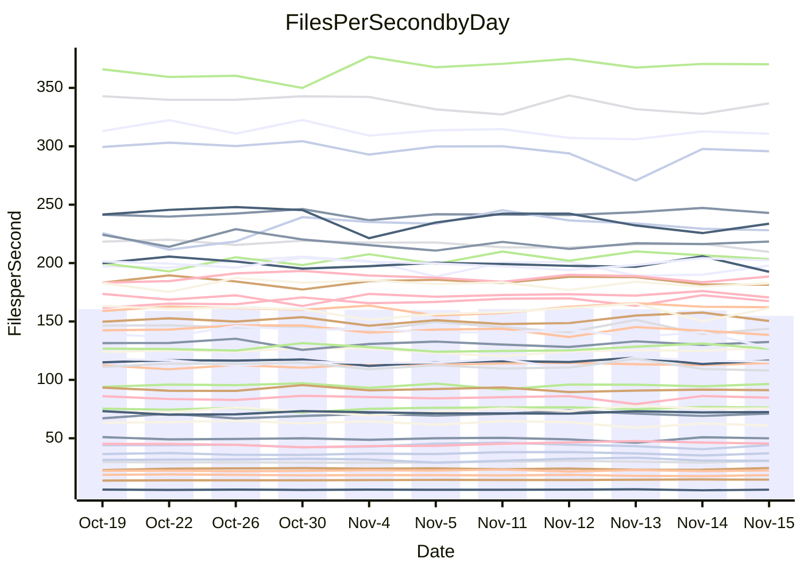

<!---
# This file is auto-generated. Do not edit.
# cspell:disable
--->
# Performance Report

## Daily Performance

## Time to Process Files

| Repository                                      | Elapsed | Min/Avg/Max           |    SD | SD Graph                |
| ----------------------------------------------- | ------: | :-------------------: | ----: | ----------------------- |
| AdaDoom3/AdaDoom3                    |    3.46 | 3.3 /   3.5 /   3.7   |  0.10 | `     ┣━┻━━●━━┻━┫     ` |
| alexiosc/megistos                    |    7.57 | 7.3 /   7.9 /   8.7   |  0.35 | `    ┣━━●━━╋━━┻━━┫    ` |
| apollographql/apollo-server          |    2.87 | 2.6 /   2.8 /   3.2   |  0.12 | `     ┣━┻━━╋━●┻━┫     ` |
| aspnetboilerplate/aspnetboilerplate  |   11.13 | 10.3 /  10.6 /  11.8  |  0.34 | `    ┣━━┻━━╋━━┻━●┫    ` |
| aws-amplify/docs                     |   13.57 | 12.4 /  13.2 /  14.8  |  0.53 | `    ┣━━┻━━╋━●┻━━┫    ` |
| Azure/azure-rest-api-specs           |   10.03 | 9.6 /  10.0 /  11.0   |  0.35 | `    ┣━━┻━━●━━┻━━┫    ` |
| bitjson/typescript-starter           |    1.10 | 1.0 /   1.1 /   1.1   |  0.03 | `     ┣━━┻━╋●┻━━┫     ` |
| caddyserver/caddy                    |    3.74 | 3.6 /   3.8 /   4.0   |  0.09 | `     ┣━┻●━╋━━┻━┫     ` |
| canada-ca/open-source-logiciel-libre |    1.15 | 1.1 /   1.2 /   1.3   |  0.04 | `     ┣━━●━╋━┻━━┫     ` |
| chef/chef                            |    6.41 | 5.7 /   6.0 /   6.3   |  0.15 | `    ┣━━┻━━╋━━┻━━┫ ●  ` |
| dart-lang/sdk                        |   66.22 | 63.7 /  67.4 /  72.3  |  2.20 | `   ┣━━┻━●━╋━━━┻━━┫   ` |
| django/django                        |   16.48 | 14.9 /  15.8 /  17.2  |  0.52 | `    ┣━━┻━━╋━━┻●━┫    ` |
| eslint/eslint                        |   10.88 | 10.7 /  11.2 /  11.8  |  0.35 | `    ┣━━●━━╋━━┻━━┫    ` |
| exonum/exonum                        |    3.60 | 3.5 /   3.7 /   4.0   |  0.12 | `     ┣━┻●━╋━━┻━┫     ` |
| flutter/samples                      |   17.18 | 16.0 /  16.9 /  19.0  |  0.60 | `    ┣━━┻━━╋━●┻━━┫    ` |
| gitbucket/gitbucket                  |    3.49 | 3.5 /   3.7 /   3.9   |  0.10 | `     ┣●┻━━╋━━┻━┫     ` |
| googleapis/google-cloud-cpp          |  152.51 | 139.9 / 150.3 / 209.7 | 12.89 | `  ┣━━━┻━━━╋●━━┻━━━┫  ` |
| graphql/express-graphql              |    1.08 | 1.1 /   1.2 /   1.3   |  0.04 | `    ●┣━━┻━╋━┻━━┫     ` |
| graphql/graphql-js                   |    2.90 | 2.8 /   3.0 /   3.2   |  0.10 | `     ┣━┻━●╋━━┻━┫     ` |
| graphql/graphql-relay-js             |    1.13 | 1.1 /   1.2 /   1.2   |  0.04 | `     ┣━●┻━╋━┻━━┫     ` |
| graphql/graphql-spec                 |    1.30 | 1.3 /   1.3 /   1.4   |  0.04 | `     ┣━●┻━╋━┻━━┫     ` |
| iluwatar/java-design-patterns        |   13.44 | 12.6 /  13.3 /  14.4  |  0.36 | `    ┣━━┻━━╋━●┻━━┫    ` |
| ktaranov/sqlserver-kit               |    6.73 | 6.6 /   6.8 /   7.1   |  0.16 | `    ┣━━┻●━╋━━┻━━┫    ` |
| liriliri/licia                       |    4.18 | 4.1 /   4.3 /   4.6   |  0.12 | `     ┣━┻●━╋━━┻━┫     ` |
| MartinThoma/LaTeX-examples           |    6.90 | 6.8 /   7.1 /   7.9   |  0.24 | `    ┣━━┻●━╋━━┻━━┫    ` |
| mdx-js/mdx                           |    1.91 | 1.9 /   2.0 /   2.2   |  0.08 | `     ┣●┻━━╋━━┻━┫     ` |
| microsoft/TypeScript-Website         |    5.69 | 5.5 /   5.8 /   6.5   |  0.18 | `    ┣━━┻●━╋━━┻━━┫    ` |
| MicrosoftDocs/PowerShell-Docs        |   24.75 | 22.9 /  24.3 /  26.2  |  0.80 | `    ┣━━┻━━╋━●┻━━┫    ` |
| neovim/nvim-lspconfig                |    4.38 | 4.3 /   4.4 /   4.6   |  0.08 | `     ┣━┻━●╋━━┻━┫     ` |
| pagekit/pagekit                      |    3.73 | 3.5 /   3.7 /   4.0   |  0.13 | `     ┣━┻━━╋●━┻━┫     ` |
| php/php-src                          |   28.02 | 25.9 /  26.8 /  28.6  |  0.82 | `    ┣━━┻━━╋━━┻━●┫    ` |
| plasticrake/tplink-smarthome-api     |    1.35 | 1.3 /   1.4 /   1.5   |  0.05 | `     ┣━━●━╋━┻━━┫     ` |
| prettier/prettier                    |    7.86 | 7.2 /   7.7 /   8.3   |  0.22 | `    ┣━━┻━━╋━●┻━━┫    ` |
| pycontribs/jira                      |    1.61 | 1.5 /   1.6 /   1.7   |  0.06 | `     ┣━┻━━╋●━┻━┫     ` |
| RustPython/RustPython                |    5.39 | 5.2 /   5.5 /   6.0   |  0.22 | `    ┣━━┻━●╋━━┻━━┫    ` |
| shoelace-style/shoelace              |    2.97 | 2.9 /   3.0 /   3.2   |  0.09 | `     ┣━┻●━╋━━┻━┫     ` |
| slint-ui/slint                       |   13.82 | 13.3 /  13.8 /  14.5  |  0.36 | `    ┣━━┻━━●━━┻━━┫    ` |
| SoftwareBrothers/admin-bro           |    2.65 | 2.5 /   2.6 /   2.9   |  0.07 | `     ┣━┻━━●━━┻━┫     ` |
| sveltejs/svelte                      |   21.00 | 20.8 /  21.9 /  22.9  |  0.43 | `    ●━━┻━━╋━━┻━━┫    ` |
| TheAlgorithms/Python                 |    5.61 | 5.7 /   5.8 /   6.1   |  0.11 | `     ●━┻━━╋━━┻━┫     ` |
| twbs/bootstrap                       |    2.37 | 1.8 /   1.9 /   2.0   |  0.06 | `       ┣━┻╋┻━┫      ●` |
| typescript-cheatsheets/react         |    1.45 | 1.3 /   1.4 /   1.6   |  0.06 | `     ┣━┻━━●━━┻━┫     ` |
| typescript-eslint/typescript-eslint  |    4.29 | 4.2 /   4.3 /   4.7   |  0.12 | `     ┣━┻━●╋━━┻━┫     ` |
| vitest-dev/vitest                    |    9.61 | 9.2 /  10.0 /  10.9   |  0.49 | `    ┣━━┻●━╋━━┻━━┫    ` |
| w3c/aria-practices                   |    3.59 | 3.4 /   3.6 /   3.8   |  0.09 | `     ┣━┻━━●━━┻━┫     ` |
| w3c/specberus                        |    2.04 | 2.0 /   2.1 /   2.2   |  0.05 | `     ┣━┻━●╋━━┻━┫     ` |
| webdeveric/webpack-assets-manifest   |    1.31 | 1.2 /   1.2 /   1.4   |  0.04 | `     ┣━━┻━╋━┻━●┫     ` |
| webpack/webpack                      |    5.81 | 5.5 /   5.8 /   6.7   |  0.24 | `    ┣━━┻━━╋●━┻━━┫    ` |
| wireapp/wire-desktop                 |    1.56 | 1.4 /   1.5 /   1.7   |  0.08 | `     ┣━┻━━╋━━●━┫     ` |
| wireapp/wire-webapp                  |   10.82 | 10.6 /  11.1 /  12.3  |  0.46 | `    ┣━━┻●━╋━━┻━━┫    ` |

Note:
- Elapsed time is in seconds.

## Files per Second over Time

| Repository                                      | Files |    Sec |    Fps |     Rel | Trend Fps              |    N |
| ----------------------------------------------- | ----: | -----: | -----: | ------: | ---------------------- | ---: |
| AdaDoom3/AdaDoom3                    |   103 |   3.46 |  29.81 |   0.36% | `▅▅▅▅▅▅▄▅▆▇▇▄▇▆▇▆▅▇█▆` |   25 |
| alexiosc/megistos                    |   583 |   7.57 |  77.00 |   4.34% | `▇▆▆▃▅▄▄██▇█▇▆▇▅█▇▆██` |   25 |
| apollographql/apollo-server          |   253 |   2.87 |  88.22 |  -3.94% | `▇▆█▇▆█▇▅▇██▆██▃▆▇▇▇▆` |   25 |
| aspnetboilerplate/aspnetboilerplate  |  2286 |  11.13 | 205.37 |  -4.97% | `▇██▇█▇▇█▆▆▇▆▄██▇▇▅█▅` |   25 |
| aws-amplify/docs                     |  2871 |  13.57 | 211.56 |  -2.93% | `██▇▇▅▇▆▆▃█▇▅▆▅▆▆▆▇▇▅` |   25 |
| Azure/azure-rest-api-specs           |  2365 |  10.03 | 235.78 |  -1.16% | `█▇▇▃▅▅▆▇▅▇▇▇▇▆▇▆▅▅▆▆` |   25 |
| bitjson/typescript-starter           |    20 |   1.10 |  18.26 |  -1.16% | `█▆▆▇▇▅██▆▅▆██▇▇▅▅▇▇▆` |   25 |
| caddyserver/caddy                    |   288 |   3.74 |  76.95 |   1.65% | `▆▇▄▅▇▆▆█▇▇▇▆▇▅█▆▇▇▆▇` |   25 |
| canada-ca/open-source-logiciel-libre |     7 |   1.15 |   6.10 |   2.63% | `▇▆▅▇▇▇▄▆▇▆▄█▇█▆█▄▆▆▇` |   25 |
| chef/chef                            |  1191 |   6.41 | 185.88 |  -6.89% | `█▆▆▇▅▄█▇▇▆▇▆▄▆▇▆█▅▆▄` |   25 |
| dart-lang/sdk                        | 10747 |  66.22 | 162.28 |   1.89% | `▇▆▇▆▄▅▇▆▅▇▇▆▇▇▇█▄▆█▇` |   25 |
| django/django                        |  2885 |  16.48 | 175.09 |  -4.04% | `▆█▆▇▇▇▄▇▇▆▇▇▆▆▄▇▆▆█▅` |   25 |
| eslint/eslint                        |  2099 |  10.88 | 192.91 |   3.04% | `▇▇▇▅█▆▇▄▇▅▇▄▆█▆▆▅▆▆▇` |   25 |
| exonum/exonum                        |   421 |   3.60 | 117.08 |   1.81% | `▆▅▇▆▇▅▇█▇██▇▇▅▄█▇▇▆▇` |   25 |
| flutter/samples                      |  2400 |  17.18 | 139.67 |  -1.85% | `▇█▇▇▆█▆▇▆▇▇▆▇▃▆▇▇▅▆▆` |   25 |
| gitbucket/gitbucket                  |   413 |   3.49 | 118.20 |   4.79% | `▆▅▅▅█▆█▄▇▆█▆█▆▇▆▆▅▇█` |   25 |
| googleapis/google-cloud-cpp          | 20952 | 152.51 | 137.38 |  -1.69% | `██▇█▇▇▇█▇▇▇█▇██▇▇▂█▇` |   25 |
| graphql/express-graphql              |    26 |   1.08 |  24.03 |   8.27% | `▅▅▅▅▆▅▅▅▅▅█▆▃▄▅▆▅▄▅▇` |   25 |
| graphql/graphql-js                   |   368 |   2.90 | 126.82 |   2.00% | `█▆█▇█▇▇▅▆▆▄▇██▄▇▇▇█▇` |   25 |
| graphql/graphql-relay-js             |    28 |   1.13 |  24.72 |   3.79% | `▆▇▇▇▅▅▆█▆▆▅▅▆▇▆▅▅▆▇▇` |   25 |
| graphql/graphql-spec                 |    19 |   1.30 |  14.60 |   2.87% | `█▆▆▇▆▇▆▇█▇▆▇█▅▆▇██▇█` |   25 |
| iluwatar/java-design-patterns        |  1992 |  13.44 | 148.19 |  -1.48% | `▆▅▇▄▇▆▇▇▇▅▆▆▅▆▇██▇▇▆` |   25 |
| ktaranov/sqlserver-kit               |   489 |   6.73 |  72.67 |   1.42% | `▅▇▇▇▇▆▇▅▇▇▅▆█▆▅▇▇▇▆▇` |   25 |
| liriliri/licia                       |  1437 |   4.18 | 343.80 |   2.08% | `▇███▇█▆▆▆▄█▆▇██▆▆▆▇█` |   25 |
| MartinThoma/LaTeX-examples           |  1409 |   6.90 | 204.28 |   2.65% | `█▆█▇▇▆▇██▇▆▆█▆▃▇█▇▇█` |   25 |
| mdx-js/mdx                           |   141 |   1.91 |  73.92 |   5.82% | `▆▅▆▆▇▆▇▅▅▇▇▆███▇▆▇▅█` |   25 |
| microsoft/TypeScript-Website         |   761 |   5.69 | 133.72 |   1.82% | `██▅▆▇█▇▆▆▆▆▇▇▃▇▇▆▇▆▇` |   25 |
| MicrosoftDocs/PowerShell-Docs        |  2708 |  24.75 | 109.43 |  -1.87% | `▅▇▇▅▆▇▇▅▆▅▅▆█▆▄█▅▅▄▅` |   25 |
| neovim/nvim-lspconfig                |   759 |   4.38 | 173.23 |   0.83% | `▇▇▅▇█▇▇▆▇▇▇█▇▇█▇█▆▇▇` |   25 |
| pagekit/pagekit                      |   741 |   3.73 | 198.78 |  -2.06% | `▇▆▆█▇▅▇▅▇█▇█▇▇▅█▇▇▇▆` |   25 |
| php/php-src                          |  2262 |  28.02 |  80.74 |  -4.78% | `▅▅▇▇▆▇█▅▆▇▆▇█▇▇▄▇█▇▅` |   25 |
| plasticrake/tplink-smarthome-api     |    62 |   1.35 |  45.84 |   2.23% | `▄▇▄▄▅▅▄▅▆▆█▆▇▇▇█▇▇▅▇` |   25 |
| prettier/prettier                    |  2421 |   7.86 | 308.13 |  -1.50% | `▆██▆▇▇▇▆▇▆▇▇▇▄▆▆▇▆▇▆` |   25 |
| pycontribs/jira                      |    79 |   1.61 |  49.13 |  -1.16% | `▆█▆▆▅▄█▆▇▇█▆▅▅▇▄▇▇▆▆` |   25 |
| RustPython/RustPython                |   693 |   5.39 | 128.60 |   1.96% | `▄██▇▆▇▃▆▆▇▇▄▅▆▇▇█▆▆▇` |   25 |
| shoelace-style/shoelace              |   439 |   2.97 | 148.05 |   2.03% | `▅▆▆▇▄▇█▆▆▇▆▆▄▅▅█▄▆▄▇` |   25 |
| slint-ui/slint                       |  2565 |  13.82 | 185.54 |   0.55% | `▇█▅▆▇█▆▅█▆▅▇█▇▇▇▆▅▆▇` |   25 |
| SoftwareBrothers/admin-bro           |   441 |   2.65 | 166.14 |  -0.36% | `▆▆▇▇▆▇▇▆▇█▆▇█▇▇▆█▇▆▆` |   25 |
| sveltejs/svelte                      |  8053 |  21.00 | 383.43 |   4.50% | `▅▆▄█▆▆▆▆▇▆▆█▇▇▇▆▇▆▆█` |   25 |
| TheAlgorithms/Python                 |  1399 |   5.61 | 249.32 |   3.26% | `▆▇█▅▆▆▇█▆▇▆█▅██▇█▇▆█` |   25 |
| twbs/bootstrap                       |   118 |   2.37 |  49.84 | -21.68% | `█▇▆█▆▆▆▄▆██▆▆▇▆▄▆██ ` |   25 |
| typescript-cheatsheets/react         |    53 |   1.45 |  36.61 |  -0.81% | `▃▅▅▄▇▇▅▆▄▇▆▇▆▇█▆▄▆▆▆` |   25 |
| typescript-eslint/typescript-eslint  |  1285 |   4.29 | 299.67 |   0.80% | `█▆█▇▆▇▇▇▇▇█▇▆▆█▄▇▇▆▇` |   25 |
| vitest-dev/vitest                    |  2339 |   9.61 | 243.43 |   5.85% | `▄▅▇▇▅▅▇▆▆█▇█▆▆▇▆▆▄▅▇` |   25 |
| w3c/aria-practices                   |   414 |   3.59 | 115.47 |  -0.12% | `▆▇▇▆▄▇▅▅▇▇█▅▇▇▅█▆█▆▆` |   25 |
| w3c/specberus                        |   197 |   2.04 |  96.35 |   1.32% | `▆███▄▇███▅▇▅▇▇█▇▇█▇▇` |   25 |
| webdeveric/webpack-assets-manifest   |    55 |   1.31 |  42.09 |  -5.17% | `▅▅▄▅▄▇▆▇▇▇▆█▅▆▇▅▃█▅▄` |   25 |
| webpack/webpack                      |  1141 |   5.81 | 196.30 |  -0.53% | `▇▇█▇▇▇▆▃▆▆█▇▇█▇▆▆▇▇▇` |   25 |
| wireapp/wire-desktop                 |    46 |   1.56 |  29.40 |  -6.01% | `█▇▇▇▆▅▄▃█▆▆▆▇█▇█▆▅█▅` |   25 |
| wireapp/wire-webapp                  |  1783 |  10.82 | 164.83 |   2.93% | `█▆▇▇█▄▇▇▃▇▄▇█▅██▇▇▇█` |   25 |

## Data Throughput

| Repository                                      | Files |    Sec |     Kps |     Rel | Trend Kps              |    N |
| ----------------------------------------------- | ----: | -----: | ------: | ------: | ---------------------- | ---: |
| AdaDoom3/AdaDoom3                    |   103 |   3.46 |  633.50 |   0.36% | `▅▅▅▅▅▅▄▅▆▇▇▄▇▆▇▆▅▇█▆` |   25 |
| alexiosc/megistos                    |   583 |   7.57 |  605.01 |   4.34% | `▇▆▆▃▅▄▄██▇█▇▆▇▅█▇▆██` |   25 |
| apollographql/apollo-server          |   253 |   2.87 |  720.77 |  -3.46% | `▆▆█▇▆█▇▅▇██▆██▃▆▇▇▇▆` |   25 |
| aspnetboilerplate/aspnetboilerplate  |  2286 |  11.13 |  499.69 |  -4.97% | `▇██▇█▇▇█▆▆▇▆▄██▇▇▅█▅` |   25 |
| aws-amplify/docs                     |  2871 |  13.57 |  738.58 |  -2.93% | `██▇▇▅▇▆▆▃█▇▅▆▅▆▆▆▇▇▅` |   25 |
| Azure/azure-rest-api-specs           |  2365 |  10.03 |  640.55 |  -0.63% | `█▇█▃▅▅▆▇▆▇▇▇▇▇█▆▅▆▆▆` |   25 |
| bitjson/typescript-starter           |    20 |   1.10 |   73.02 |  -1.16% | `█▆▆▇▇▅██▆▅▆██▇▇▅▅▇▇▆` |   25 |
| caddyserver/caddy                    |   288 |   3.74 |  667.40 |   1.81% | `▆▇▄▅▇▆▆█▇▇▇▆▇▅█▆▇▇▆▇` |   25 |
| canada-ca/open-source-logiciel-libre |     7 |   1.15 |   50.54 |   2.63% | `▇▆▅▇▇▇▄▆▇▆▄█▇█▆█▄▆▆▇` |   25 |
| chef/chef                            |  1191 |   6.41 |  861.50 |  -6.82% | `█▆▆▇▅▄█▇▇▆▇▆▄▆▇▆█▅▆▄` |   25 |
| dart-lang/sdk                        | 10747 |  66.22 | 1107.45 |   1.97% | `▇▆▇▅▄▅▇▆▅▇▇▆▇▇▇█▅▆█▇` |   25 |
| django/django                        |  2885 |  16.48 | 1098.83 |  -4.11% | `▆█▆▇▇▇▄▇▇▆▇▇▆▆▄▇▆▆█▅` |   25 |
| eslint/eslint                        |  2099 |  10.88 | 1383.79 |   2.88% | `▇▇▇▅█▆▇▄▇▅▇▄▅█▆▆▅▆▆▇` |   25 |
| exonum/exonum                        |   421 |   3.60 | 1119.95 |   1.81% | `▆▅▇▆▇▅▇█▇██▇▇▅▄█▇▇▆▇` |   25 |
| flutter/samples                      |  2400 |  17.18 | 1246.38 |  -1.85% | `▇█▇▇▆█▆▇▆▇▇▆▇▃▆▇▇▅▆▆` |   25 |
| gitbucket/gitbucket                  |   413 |   3.49 |  537.17 |   4.78% | `▆▅▅▅█▆█▄▇▆█▆█▆▇▆▆▅▇█` |   25 |
| googleapis/google-cloud-cpp          | 20952 | 152.51 | 1118.99 |  -1.49% | `██▇█▇▇▇█▆▇▇█▇██▇▇▂█▇` |   25 |
| graphql/express-graphql              |    26 |   1.08 |  109.97 |   8.27% | `▅▅▅▅▆▅▅▅▅▅█▆▃▄▅▆▅▄▅▇` |   25 |
| graphql/graphql-js                   |   368 |   2.90 |  736.13 |   2.22% | `█▅▇▇█▇▇▅▆▆▄▇██▄▇▇▇█▇` |   25 |
| graphql/graphql-relay-js             |    28 |   1.13 |   97.10 |   3.79% | `▆▇▇▇▅▅▆█▆▆▅▅▆▇▆▅▅▆▇▇` |   25 |
| graphql/graphql-spec                 |    19 |   1.30 |  487.22 |   2.87% | `█▆▆▇▆▇▆▇█▇▆▇█▅▆▇██▇█` |   25 |
| iluwatar/java-design-patterns        |  1992 |  13.44 |  458.04 |  -1.48% | `▆▅▇▄▇▆▇▇▇▅▆▆▅▆▇██▇▇▆` |   25 |
| ktaranov/sqlserver-kit               |   489 |   6.73 | 1100.43 |   1.43% | `▅▇▇▇▇▆▇▅▇▇▅▆█▆▅▇▇▇▆▇` |   25 |
| liriliri/licia                       |  1437 |   4.18 |  409.59 |   2.08% | `▇███▇█▆▆▆▄█▆▇██▆▆▆▇█` |   25 |
| MartinThoma/LaTeX-examples           |  1409 |   6.90 |  421.91 |   2.65% | `█▆█▇▇▆▇██▇▆▆█▆▃▇█▇▇█` |   25 |
| mdx-js/mdx                           |   141 |   1.91 |  343.89 |   5.82% | `▆▅▆▆▇▆▇▅▅▇▇▆███▇▆▇▅█` |   25 |
| microsoft/TypeScript-Website         |   761 |   5.69 |  924.98 |   1.82% | `██▅▆▇█▇▆▆▆▆▇▇▃▇▇▆▇▆▇` |   25 |
| MicrosoftDocs/PowerShell-Docs        |  2708 |  24.75 | 1126.86 |  -1.84% | `▅▇▇▅▆▇▇▅▆▅▅▆█▆▄█▅▅▄▅` |   25 |
| neovim/nvim-lspconfig                |   759 |   4.38 |  289.85 |   0.92% | `▇▇▅▇█▇▇▆▇▇▇█▇▇█▇█▆▇▇` |   25 |
| pagekit/pagekit                      |   741 |   3.73 |  414.45 |  -2.06% | `▇▆▆█▇▅▇▅▇█▇█▇▇▅█▇▇▇▆` |   25 |
| php/php-src                          |  2262 |  28.02 | 1412.92 |  -4.75% | `▅▅▇▇▆▇█▅▆▇▆▇█▇▇▄▇█▇▅` |   25 |
| plasticrake/tplink-smarthome-api     |    62 |   1.35 |  247.69 |   2.23% | `▄▇▄▄▅▅▄▅▆▆█▆▇▇▇█▇▇▅▇` |   25 |
| prettier/prettier                    |  2421 |   7.86 |  427.90 |  -1.79% | `▆██▅▆▆▇▆▇▆▇▇▇▄▆▆▆▆▆▆` |   25 |
| pycontribs/jira                      |    79 |   1.61 |  348.24 |  -1.16% | `▆█▆▆▅▄█▆▇▇█▆▅▅▇▄▇▇▆▆` |   25 |
| RustPython/RustPython                |   693 |   5.39 | 1069.97 |   3.77% | `▃▇▇█▇█▄▇▇█▇▄▆▇▇▇█▇▇▇` |   25 |
| shoelace-style/shoelace              |   439 |   2.97 |  715.27 |   2.03% | `▅▆▆▇▄▇█▆▆▇▆▆▄▅▅█▄▆▄▇` |   25 |
| slint-ui/slint                       |  2565 |  13.82 | 1144.40 |   0.69% | `▇█▅▆▇█▆▅█▆▆▇█▇▇▇▆▅▆▇` |   25 |
| SoftwareBrothers/admin-bro           |   441 |   2.65 |  366.19 |  -0.36% | `▆▆▇▇▆▇▇▆▇█▆▇█▇▇▆█▇▆▆` |   25 |
| sveltejs/svelte                      |  8053 |  21.00 |  255.78 |   4.46% | `▅▆▄█▆▆▆▆▇▆▆▇▇▇▇▆▆▆▆█` |   25 |
| TheAlgorithms/Python                 |  1399 |   5.61 |  634.08 |   3.27% | `▆▇█▅▆▆▇█▆▇▆█▅██▇█▇▆█` |   25 |
| twbs/bootstrap                       |   118 |   2.37 |  409.25 | -21.63% | `█▇▆█▆▆▆▄▆██▆▆▇▆▄▆██ ` |   25 |
| typescript-cheatsheets/react         |    53 |   1.45 |  270.76 |  -0.81% | `▃▅▅▄▇▇▅▆▄▇▆▇▆▇█▆▄▆▆▆` |   25 |
| typescript-eslint/typescript-eslint  |  1285 |   4.29 | 1544.74 |   0.93% | `█▆█▇▅▇▇▇▇▇█▇▆▆█▄▇▇▆▇` |   25 |
| vitest-dev/vitest                    |  2339 |   9.61 |  522.87 |   3.40% | `▅▆██▆▆█▆▆▇▆█▆▅▇▆▅▃▅▇` |   25 |
| w3c/aria-practices                   |   414 |   3.59 | 1076.62 |  -0.12% | `▆▇▇▆▄▇▅▅▇▇█▅▇▇▅█▆█▆▆` |   25 |
| w3c/specberus                        |   197 |   2.04 |  304.69 |   1.32% | `▆███▄▇███▅▇▅▇▇█▇▇█▇▇` |   25 |
| webdeveric/webpack-assets-manifest   |    55 |   1.31 |   97.19 |  -5.17% | `▅▅▄▅▄▇▆▇▇▇▆█▅▆▇▅▃█▅▄` |   25 |
| webpack/webpack                      |  1141 |   5.81 |  895.12 |  -0.34% | `▇▇█▇▇▇▆▃▅▆█▇▇█▇▆▆▇▇▇` |   25 |
| wireapp/wire-desktop                 |    46 |   1.56 |  164.28 |  -6.01% | `█▇▇▇▆▅▄▃█▆▆▆▇█▇█▆▅█▅` |   25 |
| wireapp/wire-webapp                  |  1783 |  10.82 |  609.60 |   3.06% | `█▆▇▇█▄▇▇▃▇▄▇█▅██▇▇▇█` |   25 |

