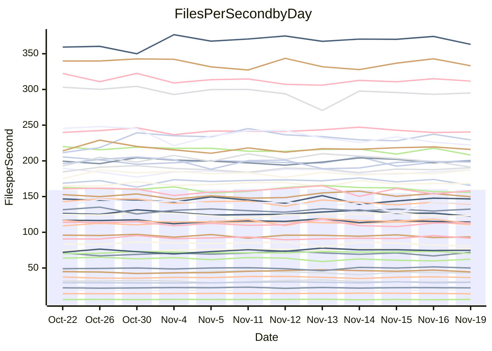

<!---
# This file is auto-generated. Do not edit.
# cspell:disable
--->
# Performance Report

## Daily Performance

## Time to Process Files

| Repository                                      | Elapsed | Min/Avg/Max           |    SD | SD Graph                |
| ----------------------------------------------- | ------: | :-------------------: | ----: | ----------------------- |
| AdaDoom3/AdaDoom3                    |    3.37 | 3.3 /   3.5 /   3.7   |  0.10 | `     ┣━●━━╋━━┻━┫     ` |
| alexiosc/megistos                    |    7.81 | 7.3 /   7.9 /   8.7   |  0.33 | `    ┣━━┻━●╋━━┻━━┫    ` |
| apollographql/apollo-server          |    2.64 | 2.6 /   2.8 /   3.2   |  0.12 | `     ┣━●━━╋━━┻━┫     ` |
| aspnetboilerplate/aspnetboilerplate  |   10.93 | 10.3 /  10.7 /  11.8  |  0.35 | `    ┣━━┻━━╋━●┻━━┫    ` |
| aws-amplify/docs                     |   13.37 | 12.4 /  13.3 /  14.8  |  0.50 | `    ┣━━┻━━╋●━┻━━┫    ` |
| Azure/azure-rest-api-specs           |   10.91 | 9.6 /  10.1 /  11.2   |  0.39 | `    ┣━━┻━━╋━━┻━━●    ` |
| bitjson/typescript-starter           |    1.07 | 1.0 /   1.1 /   1.1   |  0.03 | `     ┣━━┻●╋━┻━━┫     ` |
| caddyserver/caddy                    |    3.72 | 3.6 /   3.8 /   4.0   |  0.09 | `     ┣━●━━╋━━┻━┫     ` |
| canada-ca/open-source-logiciel-libre |    1.13 | 1.1 /   1.2 /   1.3   |  0.05 | `     ┣━●┻━╋━┻━━┫     ` |
| chef/chef                            |    5.86 | 5.7 /   6.0 /   6.4   |  0.17 | `    ┣━━┻●━╋━━┻━━┫    ` |
| dart-lang/sdk                        |   66.72 | 63.7 /  67.8 /  72.3  |  2.16 | `   ┣━━┻━●━╋━━━┻━━┫   ` |
| django/django                        |   15.36 | 14.9 /  15.8 /  17.2  |  0.50 | `    ┣━━●━━╋━━┻━━┫    ` |
| eslint/eslint                        |   11.63 | 10.6 /  11.1 /  11.8  |  0.34 | `    ┣━━┻━━╋━━┻●━┫    ` |
| exonum/exonum                        |    3.72 | 3.5 /   3.7 /   4.0   |  0.12 | `     ┣━┻━━╋●━┻━┫     ` |
| flutter/samples                      |   17.62 | 16.0 /  16.9 /  19.0  |  0.61 | `    ┣━━┻━━╋━━┻●━┫    ` |
| gitbucket/gitbucket                  |    3.59 | 3.5 /   3.7 /   3.9   |  0.11 | `     ┣━┻●━╋━━┻━┫     ` |
| googleapis/google-cloud-cpp          |  147.54 | 139.9 / 150.4 / 209.7 | 12.65 | `  ┣━━━┻━━●╋━━━┻━━━┫  ` |
| graphql/express-graphql              |    1.18 | 1.1 /   1.2 /   1.3   |  0.05 | `     ┣━━┻━╋●┻━━┫     ` |
| graphql/graphql-js                   |    2.87 | 2.8 /   3.0 /   3.2   |  0.11 | `     ┣━┻●━╋━━┻━┫     ` |
| graphql/graphql-relay-js             |    1.12 | 1.1 /   1.2 /   1.2   |  0.04 | `     ┣●━┻━╋━┻━━┫     ` |
| graphql/graphql-spec                 |    1.32 | 1.3 /   1.3 /   1.4   |  0.04 | `     ┣━━┻●╋━┻━━┫     ` |
| iluwatar/java-design-patterns        |   13.57 | 12.6 /  13.2 /  14.4  |  0.36 | `    ┣━━┻━━╋━━●━━┫    ` |
| ktaranov/sqlserver-kit               |    7.35 | 6.6 /   6.8 /   7.1   |  0.16 | `    ┣━━┻━━╋━━┻━━┫  ● ` |
| liriliri/licia                       |    4.27 | 4.1 /   4.3 /   4.6   |  0.12 | `     ┣━┻━━●━━┻━┫     ` |
| MartinThoma/LaTeX-examples           |    7.18 | 6.8 /   7.1 /   7.9   |  0.24 | `    ┣━━┻━━╋●━┻━━┫    ` |
| mdx-js/mdx                           |    1.92 | 1.9 /   2.0 /   2.2   |  0.07 | `     ┣━●━━╋━━┻━┫     ` |
| microsoft/TypeScript-Website         |    5.71 | 5.5 /   5.8 /   6.5   |  0.18 | `    ┣━━┻━●╋━━┻━━┫    ` |
| MicrosoftDocs/PowerShell-Docs        |   23.59 | 22.9 /  24.3 /  26.2  |  0.79 | `    ┣━━●━━╋━━┻━━┫    ` |
| neovim/nvim-lspconfig                |    4.67 | 4.3 /   4.4 /   4.6   |  0.08 | `     ┣━┻━━╋━━┻━┫  ●  ` |
| pagekit/pagekit                      |    3.70 | 3.5 /   3.7 /   4.3   |  0.17 | `     ┣━┻━━●━━┻━┫     ` |
| php/php-src                          |   27.63 | 25.9 /  27.1 /  29.3  |  0.94 | `   ┣━━━┻━━╋━●┻━━━┫   ` |
| plasticrake/tplink-smarthome-api     |    1.35 | 1.3 /   1.4 /   1.5   |  0.05 | `     ┣━┻●━╋━━┻━┫     ` |
| prettier/prettier                    |    7.88 | 7.2 /   7.7 /   8.3   |  0.21 | `    ┣━━┻━━╋━●┻━━┫    ` |
| pycontribs/jira                      |    1.48 | 1.5 /   1.6 /   1.7   |  0.06 | `     ●━┻━━╋━━┻━┫     ` |
| RustPython/RustPython                |    5.61 | 5.2 /   5.5 /   6.0   |  0.24 | `    ┣━━┻━━╋●━┻━━┫    ` |
| shoelace-style/shoelace              |    2.96 | 2.9 /   3.0 /   3.2   |  0.09 | `     ┣━┻●━╋━━┻━┫     ` |
| slint-ui/slint                       |   13.40 | 13.3 /  13.9 /  14.5  |  0.34 | `    ┣━●┻━━╋━━┻━━┫    ` |
| SoftwareBrothers/admin-bro           |    2.68 | 2.5 /   2.6 /   2.7   |  0.05 | `     ┣━┻━━╋━━●━┫     ` |
| sveltejs/svelte                      |   22.09 | 20.8 /  21.9 /  22.9  |  0.47 | `    ┣━━┻━━╋●━┻━━┫    ` |
| TheAlgorithms/Python                 |    5.74 | 5.6 /   5.8 /   6.1   |  0.11 | `     ┣━┻━●╋━━┻━┫     ` |
| twbs/bootstrap                       |    1.81 | 1.8 /   1.9 /   2.4   |  0.12 | `     ┣━┻●━╋━━┻━┫     ` |
| typescript-cheatsheets/react         |    1.43 | 1.3 /   1.4 /   1.6   |  0.06 | `     ┣━┻━━●━━┻━┫     ` |
| typescript-eslint/typescript-eslint  |    4.38 | 4.2 /   4.3 /   4.7   |  0.12 | `     ┣━┻━━╋●━┻━┫     ` |
| vitest-dev/vitest                    |   10.90 | 9.2 /   9.9 /  10.9   |  0.48 | `    ┣━━┻━━╋━━┻━━●    ` |
| w3c/aria-practices                   |    3.83 | 3.4 /   3.6 /   3.8   |  0.09 | `     ┣━┻━━╋━━┻━┫  ●  ` |
| w3c/specberus                        |    2.21 | 2.0 /   2.1 /   2.2   |  0.05 | `     ┣━┻━━╋━━┻━┫ ●   ` |
| webdeveric/webpack-assets-manifest   |    1.27 | 1.2 /   1.2 /   1.4   |  0.05 | `     ┣━━┻━╋●┻━━┫     ` |
| webpack/webpack                      |    5.69 | 5.5 /   5.8 /   6.7   |  0.23 | `    ┣━━┻━●╋━━┻━━┫    ` |
| wireapp/wire-desktop                 |    1.54 | 1.3 /   1.5 /   1.7   |  0.09 | `     ┣━┻━━╋━●┻━┫     ` |
| wireapp/wire-webapp                  |   12.62 | 10.6 /  11.1 /  12.3  |  0.45 | `    ┣━━┻━━╋━━┻━━┫   ●` |

Note:
- Elapsed time is in seconds.

## Files per Second over Time

| Repository                                      | Files |    Sec |    Fps |     Rel | Trend Fps              |    N |
| ----------------------------------------------- | ----: | -----: | -----: | ------: | ---------------------- | ---: |
| AdaDoom3/AdaDoom3                    |   103 |   3.37 |  30.55 |   2.92% | `▅▅▄▅▆▇▇▄▇▆▇▆▅▇█▆▅▆▅▇` |   26 |
| alexiosc/megistos                    |   583 |   7.81 |  74.63 |   0.64% | `▅▄▄██▇█▇▆▇▅█▇▆██▇▆▇▇` |   26 |
| apollographql/apollo-server          |   253 |   2.64 |  95.82 |   4.73% | `▆█▇▅▇██▆██▃▆▇▇▇▆█▆▆█` |   26 |
| aspnetboilerplate/aspnetboilerplate  |  2286 |  10.93 | 209.07 |  -2.70% | `█▇▇█▆▆▇▆▄██▇▇▅█▅▇▆▆▆` |   26 |
| aws-amplify/docs                     |  2871 |  13.37 | 214.77 |  -1.00% | `▅▇▆▆▃█▇▅▆▆▆▆▆▇▇▆▇▆▇▆` |   26 |
| Azure/azure-rest-api-specs           |  2365 |  10.91 | 216.70 |  -8.40% | `▆▆▇█▆▇███▇█▆▅▆▇▇▅▃▇▄` |   26 |
| bitjson/typescript-starter           |    20 |   1.07 |  18.75 |   1.40% | `▆▅▇▇▅▄▅▇▇▇▆▅▄▆▇▆██▆▇` |   26 |
| caddyserver/caddy                    |   288 |   3.72 |  77.49 |   2.19% | `▇▆▆█▇▇▇▆▇▅█▆▇▇▆▇▅▇▇▇` |   26 |
| canada-ca/open-source-logiciel-libre |     7 |   1.13 |   6.20 |   4.54% | `▇▇▄▆▇▆▄█▇█▆█▄▆▆▇▄▆▇█` |   26 |
| chef/chef                            |  1191 |   5.86 | 203.29 |   2.16% | `▆▅█▇▇▆█▆▅▇█▆█▆▇▄▆▇▇█` |   26 |
| dart-lang/sdk                        | 10778 |  66.72 | 161.55 |   1.93% | `▄▅▇▆▅▇▇▆▇▇▇█▄▆█▇▅▅▇▇` |   26 |
| django/django                        |  2885 |  15.36 | 187.87 |   2.98% | `▇▇▄▇▇▆▇▇▆▆▄▇▆▆█▅▆▇▇▇` |   26 |
| eslint/eslint                        |  2089 |  11.63 | 179.68 |  -4.72% | `█▆▇▄▇▅▇▄▆█▆▆▅▆▆▇▆██▅` |   26 |
| exonum/exonum                        |   421 |   3.72 | 113.05 |  -1.39% | `▇▅▇█▇██▇▇▅▄█▇▇▆▇█▄▇▆` |   26 |
| flutter/samples                      |  2400 |  17.62 | 136.22 |  -4.12% | `▆█▆▇▆▇▇▆▇▃▆▇▇▅▆▆▆▇▅▅` |   26 |
| gitbucket/gitbucket                  |   413 |   3.59 | 115.03 |   2.00% | `█▆█▄▇▆█▆█▆▇▇▆▅▇█▇▆▄▇` |   26 |
| googleapis/google-cloud-cpp          | 20955 | 147.54 | 142.03 |   1.57% | `▇▇▇█▇▇▇█▇██▇▇▂█▇▇▇▇▇` |   26 |
| graphql/express-graphql              |    26 |   1.18 |  21.97 |  -1.42% | `▆▅▅▅▆▅█▆▃▄▅▆▅▄▅▇▅▃▇▅` |   26 |
| graphql/graphql-js                   |   368 |   2.87 | 128.37 |   3.42% | `█▇▇▅▆▆▄▇██▄▇▇▇█▇▆▇▄█` |   26 |
| graphql/graphql-relay-js             |    28 |   1.12 |  24.98 |   4.49% | `▅▅▆█▆▆▅▅▆▇▆▅▅▆▇▇▇▄▄▇` |   26 |
| graphql/graphql-spec                 |    19 |   1.32 |  14.42 |   1.42% | `▆▇▆▇█▇▆▇█▅▆▇██▇█▇▅▅▇` |   26 |
| iluwatar/java-design-patterns        |  1992 |  13.57 | 146.77 |  -2.55% | `▇▆▇▇▇▅▆▆▅▆▇██▇▇▆▇▇▇▆` |   26 |
| ktaranov/sqlserver-kit               |   489 |   7.35 |  66.53 |  -7.09% | `▇▆▇▅▇▇▅▆█▆▅▇▇▇▆▇▇█▆▃` |   26 |
| liriliri/licia                       |  1437 |   4.27 | 336.81 |   0.18% | `▇█▆▆▆▄█▆▇██▆▆▆▇██▅▇▇` |   26 |
| MartinThoma/LaTeX-examples           |  1409 |   7.18 | 196.25 |  -1.41% | `▇▆▇██▇▆▆█▆▃▇█▇▇█▆▇▇▆` |   26 |
| mdx-js/mdx                           |   141 |   1.92 |  73.37 |   4.33% | `▇▆▇▅▅▇▇▆███▇▆▇▅█▅▆▇█` |   26 |
| microsoft/TypeScript-Website         |   761 |   5.71 | 133.20 |   1.36% | `▇█▇▆▆▆▆▇▇▃▇▇▆▇▆▇▆▇▇▇` |   26 |
| MicrosoftDocs/PowerShell-Docs        |  2708 |  23.59 | 114.77 |   2.83% | `▆▇▇▅▆▅▅▆█▆▄█▅▅▄▅▇▆▆▇` |   26 |
| neovim/nvim-lspconfig                |   760 |   4.67 | 162.62 |  -5.11% | `█▇▇▆▇▇▇█▇▇█▇█▆▇▇█▆▅▅` |   26 |
| pagekit/pagekit                      |   741 |   3.70 | 200.20 |  -0.78% | `▇▆▇▅▇█▇█▇▇▆█▇▇▇▆▆▃▇▆` |   26 |
| php/php-src                          |  2262 |  27.63 |  81.86 |  -2.59% | `▇▇█▅▆▇▇▇█▇▇▅▇█▇▅▆▄▆▆` |   26 |
| plasticrake/tplink-smarthome-api     |    62 |   1.35 |  45.87 |   2.29% | `▅▅▄▅▆▆█▆▇▇▇█▇▇▅▇█▅▆▇` |   26 |
| prettier/prettier                    |  2426 |   7.88 | 307.97 |  -1.54% | `▇▇█▇█▇███▄▇▆▇▇█▇██▇▇` |   26 |
| pycontribs/jira                      |    79 |   1.48 |  53.51 |   8.11% | `▅▄▇▆▇▆▇▅▅▄▆▃▆▇▆▅▇▃▆█` |   26 |
| RustPython/RustPython                |   703 |   5.61 | 125.34 |  -0.35% | `▇█▄▆▇█▇▄▆▇▇▇█▇▇▇▇▅▆▇` |   26 |
| shoelace-style/shoelace              |   439 |   2.96 | 148.36 |   2.16% | `▄▇█▆▆▇▆▆▄▅▅█▄▆▄▇▇▆▆▇` |   26 |
| slint-ui/slint                       |  2570 |  13.40 | 191.76 |   3.77% | `▇█▆▅█▆▅▇█▇▇▇▆▅▆▇▆▇▆█` |   26 |
| SoftwareBrothers/admin-bro           |   441 |   2.68 | 164.64 |  -1.76% | `▅▆▇▅▇█▆▇▇▇▇▅█▇▆▆▇▇▇▆` |   26 |
| sveltejs/svelte                      |  8068 |  22.09 | 365.27 |  -0.63% | `▆▆▆▆▇▆▇█▇▇▇▆▇▆▆█▇▆▆▆` |   26 |
| TheAlgorithms/Python                 |  1399 |   5.74 | 243.55 |   0.86% | `▆▆▇█▆▇▆█▅██▇█▇▆█▆▆▆▇` |   26 |
| twbs/bootstrap                       |   118 |   1.81 |  65.34 |   4.09% | `▇▇▇▆▇██▇▇█▇▅▇██▂▆▅▇█` |   26 |
| typescript-cheatsheets/react         |    53 |   1.43 |  37.10 |   0.46% | `▇▇▅▆▄▇▆▇▆▇█▆▄▆▆▆▆▄▆▆` |   26 |
| typescript-eslint/typescript-eslint  |  1290 |   4.38 | 294.38 |  -0.84% | `▆▇▇▇▇▇█▇▆▆█▄▇▇▆▇▆▇▇▇` |   26 |
| vitest-dev/vitest                    |  2338 |  10.90 | 214.58 |  -7.43% | `▅▅▇▆▆█▇█▆▆▇▆▆▄▅▇▇▇▆▄` |   26 |
| w3c/aria-practices                   |   414 |   3.83 | 108.22 |  -6.55% | `▄▇▅▅▇▇█▅▇▇▅█▆█▆▆▆▆█▄` |   26 |
| w3c/specberus                        |   197 |   2.21 |  89.30 |  -6.21% | `▄▇███▅▇▅▇▇█▇▇█▇▇▆█▇▄` |   26 |
| webdeveric/webpack-assets-manifest   |    55 |   1.27 |  43.42 |  -1.75% | `▄▇▆▇▇▇▆█▅▆▇▅▃█▅▄▅▆▄▅` |   26 |
| webpack/webpack                      |  1143 |   5.69 | 200.78 |   1.74% | `▇▇▆▃▆▆█▇▇█▇▆▆▇▇▇▇▆▇▇` |   26 |
| wireapp/wire-desktop                 |    43 |   1.54 |  27.95 | -10.49% | `▆▅▄▃█▆▆▆▇█▇█▆▅█▅▆▇▇▄` |   26 |
| wireapp/wire-webapp                  |  1783 |  12.62 | 141.26 | -12.03% | `█▄▇▇▃▇▄▇█▅██▇▇▇█▆▇▇▃` |   26 |

## Data Throughput

| Repository                                      | Files |    Sec |     Kps |     Rel | Trend Kps              |    N |
| ----------------------------------------------- | ----: | -----: | ------: | ------: | ---------------------- | ---: |
| AdaDoom3/AdaDoom3                    |   103 |   3.37 |  649.25 |   2.92% | `▅▅▄▅▆▇▇▄▇▆▇▆▅▇█▆▅▆▅▇` |   26 |
| alexiosc/megistos                    |   583 |   7.81 |  586.43 |   0.64% | `▅▄▄██▇█▇▆▇▅█▇▆██▇▆▇▇` |   26 |
| apollographql/apollo-server          |   253 |   2.64 |  782.82 |   5.05% | `▆█▇▅▇██▆██▃▆▇▇▇▆█▆▆█` |   26 |
| aspnetboilerplate/aspnetboilerplate  |  2286 |  10.93 |  508.69 |  -2.70% | `█▇▇█▆▆▇▆▄██▇▇▅█▅▇▆▆▆` |   26 |
| aws-amplify/docs                     |  2871 |  13.37 |  749.55 |  -1.03% | `▅▇▆▆▃█▇▅▆▆▆▆▆▇▇▆▇▆▇▆` |   26 |
| Azure/azure-rest-api-specs           |  2365 |  10.91 |  589.62 |  -7.98% | `▆▆▇█▆▇███▇█▆▅▆▇▇▅▃▇▄` |   26 |
| bitjson/typescript-starter           |    20 |   1.07 |   75.01 |   1.40% | `▆▅▇▇▅▄▅▇▇▇▆▅▄▆▇▆██▆▇` |   26 |
| caddyserver/caddy                    |   288 |   3.72 |  672.96 |   2.31% | `▇▆▆█▇▇▇▆▇▅█▆▇▇▆▇▅▇▇▇` |   26 |
| canada-ca/open-source-logiciel-libre |     7 |   1.13 |   51.33 |   4.54% | `▇▇▄▆▇▆▄█▇█▆█▄▆▆▇▄▆▇█` |   26 |
| chef/chef                            |  1191 |   5.86 |  943.89 |   2.35% | `▆▅█▇▇▆█▆▅▇█▆█▆▇▄▆▇▇█` |   26 |
| dart-lang/sdk                        | 10778 |  66.72 | 1104.43 |   2.18% | `▄▅▇▆▅▇▇▆▇▇▇█▅▆█▇▅▅▇▇` |   26 |
| django/django                        |  2885 |  15.36 | 1179.51 |   2.93% | `▇▇▄▇▇▆▇▇▆▆▄▇▆▆█▅▆▇▇▇` |   26 |
| eslint/eslint                        |  2089 |  11.63 | 1219.29 |  -9.56% | `█▆▇▄▇▅▇▄▅█▆▆▅▆▆▇▆▆▆▃` |   26 |
| exonum/exonum                        |   421 |   3.72 | 1081.36 |  -1.39% | `▇▅▇█▇██▇▇▅▄█▇▇▆▇█▄▇▆` |   26 |
| flutter/samples                      |  2400 |  17.62 | 1215.60 |  -4.12% | `▆█▆▇▆▇▇▆▇▃▆▇▇▅▆▆▆▇▅▅` |   26 |
| gitbucket/gitbucket                  |   413 |   3.59 |  522.80 |   2.00% | `█▆█▄▇▆█▆█▆▇▇▆▅▇█▇▆▄▇` |   26 |
| googleapis/google-cloud-cpp          | 20955 | 147.54 | 1157.10 |   1.77% | `▇▇▇█▇▇▇█▇██▇▇▂█▇█▇▇█` |   26 |
| graphql/express-graphql              |    26 |   1.18 |  100.57 |  -1.42% | `▆▅▅▅▆▅█▆▃▄▅▆▅▄▅▇▅▃▇▅` |   26 |
| graphql/graphql-js                   |   368 |   2.87 |  745.11 |   3.52% | `█▇▇▅▆▆▄▇██▄▇▇▇█▇▆▇▄█` |   26 |
| graphql/graphql-relay-js             |    28 |   1.12 |   98.12 |   4.49% | `▅▅▆█▆▆▅▅▆▇▆▅▅▆▇▇▇▄▄▇` |   26 |
| graphql/graphql-spec                 |    19 |   1.32 |  481.31 |   1.42% | `▆▇▆▇█▇▆▇█▅▆▇██▇█▇▅▅▇` |   26 |
| iluwatar/java-design-patterns        |  1992 |  13.57 |  453.65 |  -2.55% | `▇▆▇▇▇▅▆▆▅▆▇██▇▇▆▇▇▇▆` |   26 |
| ktaranov/sqlserver-kit               |   489 |   7.35 | 1007.54 |  -7.09% | `▇▆▇▅▇▇▅▆█▆▅▇▇▇▆▇▇█▆▃` |   26 |
| liriliri/licia                       |  1437 |   4.27 |  401.26 |   0.18% | `▇█▆▆▆▄█▆▇██▆▆▆▇██▅▇▇` |   26 |
| MartinThoma/LaTeX-examples           |  1409 |   7.18 |  405.31 |  -1.41% | `▇▆▇██▇▆▆█▆▃▇█▇▇█▆▇▇▆` |   26 |
| mdx-js/mdx                           |   141 |   1.92 |  341.38 |   4.33% | `▇▆▇▅▅▇▇▆███▇▆▇▅█▅▆▇█` |   26 |
| microsoft/TypeScript-Website         |   761 |   5.71 |  921.34 |   1.36% | `▇█▇▆▆▆▆▇▇▃▇▇▆▇▆▇▆▇▇▇` |   26 |
| MicrosoftDocs/PowerShell-Docs        |  2708 |  23.59 | 1181.86 |   2.86% | `▆▇▇▅▆▅▅▆█▆▄█▅▅▄▅▇▆▆▇` |   26 |
| neovim/nvim-lspconfig                |   760 |   4.67 |  301.92 |   4.48% | `▆▅▅▅▅▅▅▆▅▅▆▅▆▅▅▅▆█▇▇` |   26 |
| pagekit/pagekit                      |   741 |   3.70 |  417.43 |  -0.78% | `▇▆▇▅▇█▇█▇▇▆█▇▇▇▆▆▃▇▆` |   26 |
| php/php-src                          |  2262 |  27.63 | 1435.16 |  -2.41% | `▇▇█▅▆▇▇▇█▇▇▄▇█▇▅▆▄▆▆` |   26 |
| plasticrake/tplink-smarthome-api     |    62 |   1.35 |  247.86 |   2.29% | `▅▅▄▅▆▆█▆▇▇▇█▇▇▅▇█▅▆▇` |   26 |
| prettier/prettier                    |  2426 |   7.88 |  427.04 |  -1.85% | `▇▇█▇█▇███▄▇▆▇▇▇▇█▇▇▇` |   26 |
| pycontribs/jira                      |    79 |   1.48 |  379.30 |   8.11% | `▅▄▇▆▇▆▇▅▅▄▆▃▆▇▆▅▇▃▆█` |   26 |
| RustPython/RustPython                |   703 |   5.61 | 1279.81 |  21.56% | `▄▅▂▄▄▅▄▃▃▄▄▄▅▄▄▄▄▇██` |   26 |
| shoelace-style/shoelace              |   439 |   2.96 |  716.79 |   2.16% | `▄▇█▆▆▇▆▆▄▅▅█▄▆▄▇▇▆▆▇` |   26 |
| slint-ui/slint                       |  2570 |  13.40 | 1187.34 |   4.22% | `▇▇▆▅█▆▅▆█▇▇▇▆▅▆▇▆▇▆█` |   26 |
| SoftwareBrothers/admin-bro           |   441 |   2.68 |  362.88 |  -1.76% | `▅▆▇▅▇█▆▇▇▇▇▅█▇▆▆▇▇▇▆` |   26 |
| sveltejs/svelte                      |  8068 |  22.09 |  243.58 |  -0.69% | `▆▆▆▆▇▆▇█▇▇▇▆▇▆▆█▇▆▆▆` |   26 |
| TheAlgorithms/Python                 |  1399 |   5.74 |  619.41 |   0.86% | `▆▆▇█▆▇▆█▅██▇█▇▆█▆▆▆▇` |   26 |
| twbs/bootstrap                       |   118 |   1.81 |  536.58 |   4.14% | `▇▇▇▆▇██▇▇█▇▅▇██▂▆▅▇█` |   26 |
| typescript-cheatsheets/react         |    53 |   1.43 |  274.40 |   0.46% | `▇▇▅▆▄▇▆▇▆▇█▆▄▆▆▆▆▄▆▆` |   26 |
| typescript-eslint/typescript-eslint  |  1290 |   4.38 | 1520.03 |  -0.56% | `▅▇▇▇▇▇█▇▆▆█▄▇▇▆▇▆▇▇▇` |   26 |
| vitest-dev/vitest                    |  2338 |  10.90 |  461.01 |  -9.02% | `▆▆█▆▆▇▆█▆▅▇▆▅▃▅▇▆▇▅▃` |   26 |
| w3c/aria-practices                   |   414 |   3.83 | 1008.99 |  -6.55% | `▄▇▅▅▇▇█▅▇▇▅█▆█▆▆▆▆█▄` |   26 |
| w3c/specberus                        |   197 |   2.21 |  282.41 |  -6.21% | `▄▇███▅▇▅▇▇█▇▇█▇▇▆█▇▄` |   26 |
| webdeveric/webpack-assets-manifest   |    55 |   1.27 |  100.25 |  -1.75% | `▄▇▆▇▇▇▆█▅▆▇▅▃█▅▄▅▆▄▅` |   26 |
| webpack/webpack                      |  1143 |   5.69 |  916.96 |   2.08% | `▇▇▆▃▅▆█▇▇█▇▆▆▇▇▇▇▆▇▇` |   26 |
| wireapp/wire-desktop                 |    43 |   1.54 |  123.50 | -28.02% | `▇▅▄▃█▆▆▇██▇█▆▆█▅▆▂▃ ` |   26 |
| wireapp/wire-webapp                  |  1783 |  12.62 |  523.05 | -11.86% | `█▄▇▇▃▇▄▇█▅██▇▇▇█▆▇▇▃` |   26 |

