<!---
# This file is auto-generated. Do not edit.
# cspell:disable
--->
# Performance Report

## Daily Performance

```mermaid
xychart-beta
    title Files Per Second by Day
    y-axis Files per Second
    x-axis Date [Apr-4, Apr-7, Apr-8, Apr-9, Apr-10, Apr-11, Apr-14, Apr-15, Apr-16, Apr-17, Apr-18, Apr-19, Apr-20, Apr-21, Apr-22, Apr-23, Apr-26, Apr-27, Apr-28, Apr-29, May-1, May-2, May-3]
    bar [169.84, 169.20, 170.31, 166.27, 166.91, 170.48, 169.33, 169.62, 167.60, 169.74, 169.68, 169.99, 171.82, 172.90, 171.57, 166.24, 169.01, 170.16, 167.72, 168.26, 170.38, 169.01, 171.44]
    line [17.28, 17.60, 16.96, 17.77, 17.06, 17.46, 17.21, 17.42, 17.60, 17.08, 17.31, 17.56, 17.31, 17.48, 17.24, 16.92, 17.80, 17.29, 17.00, 17.03, 17.60, 17.41, 16.97]
    line [33.48, 34.77, 37.91, 37.41, 35.78, 36.99, 37.77, 37.41, 38.03, 37.53, 36.12, 37.89, 38.88, 0.00, 38.42, 35.42, 38.72, 37.36, 36.85, 37.16, 37.23, 37.33, 37.46]
    line [35.35, 33.46, 33.90, 35.56, 34.65, 35.25, 33.95, 35.11, 35.60, 35.68, 35.27, 35.45, 35.29, 0.00, 36.03, 35.32, 35.34, 37.17, 36.51, 35.39, 35.94, 31.83, 33.89]
    line [124.77, 127.89, 127.66, 125.67, 123.96, 126.62, 121.49, 124.08, 125.35, 129.58, 129.31, 126.67, 127.87, 0.00, 122.89, 120.53, 127.62, 125.93, 128.76, 126.48, 126.12, 120.58, 121.57]
    line [97.79, 98.91, 96.86, 98.48, 95.78, 98.82, 98.24, 97.95, 94.18, 94.73, 96.19, 101.04, 101.25, 21.60, 54.07, 86.67, 88.50, 84.93, 88.85, 87.16, 89.19, 81.96, 90.12]
    line [8.96, 9.04, 7.54, 9.19, 9.07, 9.09, 8.79, 8.86, 9.07, 9.04, 8.87, 8.76, 9.19, 0.00, 8.87, 8.91, 9.11, 9.06, 9.11, 8.79, 9.00, 8.99, 8.60]
    line [64.11, 62.38, 62.53, 61.32, 54.24, 63.37, 63.45, 60.45, 62.38, 64.57, 64.96, 64.20, 61.03, 61.27, 63.23, 62.50, 62.36, 63.83, 62.70, 65.36, 59.30, 61.32, 60.75]
    line [211.25, 222.14, 222.81, 213.62, 192.45, 214.69, 213.97, 220.18, 219.45, 220.27, 211.75, 215.92, 221.06, 0.00, 221.33, 209.32, 216.82, 220.49, 217.39, 217.33, 217.58, 210.97, 219.72]
    line [198.67, 195.49, 190.29, 196.88, 194.92, 202.96, 194.19, 200.03, 194.80, 200.11, 202.53, 198.27, 204.52, 0.00, 186.65, 199.52, 202.33, 198.33, 200.17, 201.21, 199.69, 199.23, 199.47]
    line [112.13, 116.38, 109.02, 116.94, 120.00, 115.72, 178.30, 177.73, 180.34, 180.24, 181.16, 179.47, 175.83, 182.94, 176.49, 173.56, 177.31, 180.43, 188.88, 190.75, 193.82, 191.55, 187.36]
    line [109.07, 108.93, 102.51, 106.98, 109.00, 108.35, 103.95, 107.46, 107.98, 108.91, 107.43, 108.61, 110.08, 0.00, 110.33, 106.34, 107.51, 106.82, 102.05, 108.57, 108.98, 105.49, 100.84]
    line [79.63, 81.82, 77.99, 81.50, 83.68, 82.24, 79.00, 81.10, 76.32, 82.35, 77.98, 81.12, 80.27, 85.76, 75.92, 80.78, 78.25, 82.40, 76.38, 78.02, 72.12, 80.73, 87.51]
    line [29.80, 29.09, 30.39, 28.82, 29.85, 30.29, 29.17, 29.16, 30.32, 29.23, 29.37, 29.90, 29.82, 0.00, 28.87, 28.89, 29.69, 29.35, 26.00, 29.94, 28.66, 29.87, 29.95]
    line [333.96, 339.43, 331.60, 337.56, 339.68, 342.67, 340.53, 332.27, 335.32, 337.55, 341.08, 333.28, 342.44, 335.31, 327.64, 337.12, 337.38, 342.40, 337.39, 338.82, 338.54, 338.13, 341.03]
    line [173.91, 177.92, 179.08, 173.27, 175.00, 170.86, 165.94, 173.69, 173.55, 174.13, 172.94, 170.54, 173.57, 0.00, 170.82, 166.93, 163.53, 176.05, 166.53, 173.80, 174.60, 176.01, 164.39]
    line [80.60, 77.45, 79.26, 78.59, 74.22, 77.47, 71.52, 79.38, 78.34, 80.66, 81.07, 81.90, 79.63, 0.00, 77.56, 76.15, 80.49, 75.89, 81.68, 74.20, 81.33, 74.27, 80.48]
    line [45.90, 45.44, 47.98, 45.98, 48.61, 46.63, 47.25, 46.53, 46.91, 46.99, 47.21, 43.97, 47.10, 0.00, 47.45, 46.18, 45.75, 47.55, 46.20, 48.11, 46.34, 47.50, 47.98]
    line [32.53, 32.45, 32.84, 31.03, 33.00, 32.16, 32.22, 32.66, 32.69, 33.19, 30.88, 31.77, 33.15, 0.00, 31.72, 32.35, 31.41, 32.91, 32.62, 32.00, 32.63, 32.93, 33.27]
    line [87.57, 86.19, 87.38, 86.67, 88.15, 82.83, 86.26, 85.93, 88.01, 87.47, 86.56, 87.65, 86.60, 0.00, 87.93, 86.07, 89.56, 85.94, 83.19, 85.07, 85.64, 86.50, 77.99]
    line [149.63, 148.24, 150.53, 145.81, 135.51, 153.54, 148.49, 150.16, 149.84, 151.62, 149.82, 147.39, 150.27, 0.00, 147.88, 143.90, 145.46, 153.88, 143.81, 147.85, 151.13, 149.15, 151.13]
    line [213.54, 214.82, 216.50, 216.97, 214.34, 223.50, 215.07, 208.81, 218.55, 206.19, 208.58, 221.30, 221.28, 195.47, 221.02, 208.16, 215.76, 214.38, 202.09, 208.91, 219.25, 211.42, 210.84]
    line [227.00, 219.19, 223.64, 221.83, 216.60, 219.13, 224.29, 221.03, 219.41, 211.61, 231.08, 224.48, 227.64, 0.00, 218.50, 218.17, 224.25, 228.38, 223.81, 225.34, 235.83, 224.43, 226.86]
    line [62.75, 56.53, 64.20, 68.55, 66.50, 63.84, 67.31, 66.50, 66.41, 65.32, 66.89, 68.61, 62.38, 0.00, 65.42, 64.86, 68.62, 67.74, 67.95, 68.04, 66.51, 66.52, 66.22]
    line [138.98, 136.61, 140.82, 136.34, 137.38, 144.66, 145.14, 143.84, 144.20, 144.52, 139.00, 143.78, 144.53, 136.95, 137.17, 141.60, 138.78, 140.13, 136.72, 143.22, 138.30, 135.10, 144.42]
    line [377.52, 372.77, 388.59, 381.59, 348.04, 380.94, 383.05, 379.79, 379.24, 389.97, 387.83, 386.24, 368.53, 0.00, 376.50, 377.40, 383.08, 384.18, 364.78, 379.69, 389.95, 376.34, 387.47]
    line [191.61, 192.83, 195.35, 194.59, 189.25, 194.14, 192.92, 186.07, 185.77, 196.44, 190.62, 188.38, 197.27, 191.85, 192.30, 188.84, 190.27, 195.78, 182.52, 195.47, 196.70, 190.41, 194.92]
    line [135.75, 140.12, 141.93, 144.71, 138.12, 136.03, 141.29, 138.52, 140.48, 140.76, 140.21, 141.88, 140.61, 142.82, 137.75, 137.71, 134.50, 144.52, 138.50, 142.73, 142.58, 141.74, 141.69]
    line [77.09, 74.93, 76.78, 77.18, 78.18, 76.70, 76.29, 76.45, 76.07, 75.42, 76.77, 77.79, 77.80, 0.00, 71.90, 73.58, 77.25, 76.75, 74.06, 78.23, 77.68, 77.02, 79.30]
    line [121.36, 115.15, 130.27, 129.70, 106.78, 126.97, 127.64, 125.44, 128.53, 127.62, 128.92, 120.98, 123.98, 0.00, 122.91, 125.27, 134.01, 118.75, 126.75, 125.77, 131.11, 130.91, 133.99]
    line [224.18, 237.10, 241.63, 230.62, 246.29, 232.09, 242.10, 239.18, 228.11, 235.38, 245.98, 246.76, 242.90, 234.99, 242.37, 239.31, 237.17, 238.51, 240.92, 243.57, 233.28, 229.57, 232.59]
    line [332.43, 330.30, 334.01, 330.67, 335.10, 339.21, 338.50, 333.53, 327.92, 339.69, 338.54, 337.09, 336.49, 339.90, 331.90, 326.60, 326.89, 337.11, 325.09, 333.51, 337.53, 336.18, 335.45]
    line [187.71, 198.59, 197.91, 153.08, 193.37, 186.31, 191.86, 190.39, 197.86, 198.53, 194.94, 194.83, 194.98, 181.85, 192.31, 196.87, 194.18, 188.58, 197.42, 188.78, 199.80, 198.62, 181.73]
    line [187.37, 186.23, 190.68, 147.53, 183.37, 189.36, 186.25, 190.23, 184.91, 191.69, 177.23, 189.25, 187.34, 190.75, 186.70, 182.89, 189.73, 192.45, 181.80, 185.66, 187.70, 177.84, 180.75]
    line [159.01, 159.81, 159.07, 154.86, 161.50, 157.82, 150.49, 156.51, 145.27, 158.44, 147.46, 154.06, 155.44, 160.39, 156.53, 154.14, 156.31, 156.21, 156.28, 149.14, 155.19, 158.71, 160.44]
    line [240.39, 235.37, 241.80, 223.67, 256.52, 244.43, 247.02, 250.63, 247.99, 249.17, 253.74, 253.49, 250.95, 246.49, 244.52, 245.72, 249.53, 246.35, 243.55, 244.05, 251.97, 248.55, 240.06]
    line [214.71, 213.10, 213.49, 213.15, 207.01, 217.98, 213.40, 214.15, 209.08, 210.92, 212.31, 202.24, 216.69, 0.00, 216.61, 209.72, 197.36, 209.18, 213.77, 206.60, 207.06, 215.10, 215.71]
    line [371.41, 375.01, 366.15, 382.62, 383.48, 384.04, 359.97, 375.35, 369.72, 368.89, 380.64, 373.25, 373.99, 373.98, 376.67, 368.51, 322.56, 379.15, 370.19, 379.79, 365.55, 379.36, 381.73]
    line [154.71, 148.18, 156.04, 147.10, 154.73, 147.03, 148.45, 154.18, 145.25, 151.93, 153.78, 155.38, 157.43, 155.84, 151.73, 150.49, 156.46, 147.81, 149.46, 151.58, 147.82, 149.77, 154.86]
    line [22.71, 22.07, 22.74, 22.43, 65.92, 62.39, 66.34, 66.55, 64.05, 68.35, 68.05, 68.62, 69.45, 64.83, 67.35, 68.84, 65.99, 67.08, 67.28, 68.56, 68.82, 67.85, 68.02]
    line [132.92, 133.01, 131.94, 136.24, 139.59, 139.80, 133.78, 134.61, 128.41, 137.96, 136.05, 137.57, 132.11, 0.00, 137.28, 136.15, 136.56, 135.99, 135.68, 131.24, 131.06, 128.00, 137.23]
    line [220.71, 230.14, 228.37, 226.53, 212.60, 230.01, 224.21, 229.57, 224.99, 233.81, 228.85, 235.57, 231.39, 223.58, 218.87, 214.06, 233.07, 227.94, 226.06, 222.41, 228.73, 232.92, 226.73]
    line [115.26, 119.06, 114.45, 115.00, 120.23, 118.00, 118.40, 118.37, 116.05, 123.88, 119.49, 121.74, 116.48, 120.61, 122.50, 116.03, 121.63, 117.57, 115.16, 117.71, 109.46, 120.11, 122.19]
    line [98.35, 94.04, 92.16, 96.89, 89.38, 97.60, 95.04, 95.17, 95.45, 95.51, 99.80, 94.01, 98.29, 95.98, 98.39, 97.61, 97.80, 98.14, 98.79, 94.90, 95.85, 92.03, 100.20]
    line [115.08, 114.00, 113.95, 110.13, 115.10, 114.20, 113.57, 114.05, 114.46, 113.36, 110.56, 109.84, 116.20, 117.60, 114.81, 115.13, 112.07, 115.89, 105.71, 114.28, 114.99, 114.25, 115.60]
    line [48.96, 48.45, 48.17, 47.87, 50.31, 48.30, 48.77, 47.68, 47.69, 48.50, 48.03, 49.42, 49.32, 46.59, 48.05, 47.43, 46.81, 46.39, 46.77, 46.87, 47.22, 48.49, 48.87]
    line [215.51, 213.60, 219.74, 229.98, 210.41, 211.03, 220.37, 222.63, 214.45, 219.40, 210.16, 226.83, 210.62, 211.00, 209.91, 211.94, 214.01, 216.12, 219.03, 213.99, 217.74, 207.96, 228.98]
    line [254.08, 252.77, 256.08, 266.31, 262.37, 261.47, 254.20, 253.24, 261.07, 260.83, 260.89, 253.32, 254.79, 261.54, 255.02, 257.43, 268.34, 260.98, 261.96, 251.80, 236.87, 261.43, 247.73]
    line [163.01, 168.55, 162.80, 164.30, 168.75, 168.13, 157.11, 162.19, 160.72, 162.22, 163.33, 167.29, 165.80, 161.26, 163.43, 155.81, 166.82, 167.06, 164.95, 160.71, 167.49, 163.15, 156.76]
    line [163.45, 164.03, 166.16, 160.66, 159.82, 162.39, 162.85, 163.21, 157.56, 158.15, 163.19, 164.04, 162.46, 157.73, 161.64, 158.56, 163.17, 162.49, 147.86, 158.64, 158.76, 162.55, 166.37]
    line [149.76, 147.19, 149.14, 146.94, 144.05, 149.94, 148.30, 147.19, 146.95, 147.95, 146.79, 147.09, 150.33, 149.26, 149.39, 142.38, 146.96, 147.34, 146.66, 146.46, 150.91, 147.43, 149.41]
```

## Time to Process Files

| Repository                                      | Elapsed | Min/Avg/Max           |   SD | SD Graph                |
| ----------------------------------------------- | ------: | :-------------------: | ---: | ----------------------- |
| AdaDoom3/AdaDoom3                    |    3.10 | 3.0 /   3.2 /   3.4   | 0.09 | `    ┣━━●━━╋━━┻━━┫    ` |
| alexiosc/megistos                    |    7.24 | 6.9 /   7.5 /  11.6   | 0.66 | `    ┣━━┻━●╋━━┻━━┫    ` |
| apollographql/apollo-server          |    2.52 | 2.2 /   2.4 /   2.6   | 0.08 | `    ┣━━┻━━╋━━┻━━●    ` |
| aspnetboilerplate/aspnetboilerplate  |    9.94 | 9.6 /  10.1 /  10.8   | 0.28 | `    ┣━━┻●━╋━━┻━━┫    ` |
| aws-amplify/docs                     |   12.66 | 12.1 /  12.7 /  14.7  | 0.52 | `   ┣━━━┻━━●━━┻━━━┫   ` |
| Azure/azure-rest-api-specs           |    9.75 | 8.9 /   9.4 /  10.2   | 0.26 | `    ┣━━┻━━╋━━┻●━┫    ` |
| bitjson/typescript-starter           |    0.67 | 0.6 /   0.7 /   0.8   | 0.02 | `     ┣━━┻●╋━┻━━┫     ` |
| caddyserver/caddy                    |    3.23 | 3.2 /   3.6 /   4.3   | 0.22 | `    ┣━●┻━━╋━━┻━━┫    ` |
| canada-ca/open-source-logiciel-libre |    0.81 | 0.7 /   0.8 /   1.0   | 0.04 | `     ┣━┻━━╋━●┻━┫     ` |
| chef/chef                            |    5.71 | 5.0 /   5.7 /   6.6   | 0.28 | `    ┣━━┻━━╋●━┻━━┫    ` |
| dart-lang/sdk                        |   61.92 | 59.3 /  64.0 /  77.4  | 2.45 | `  ┣━━━┻●━━╋━━━┻━━━┫  ` |
| django/django                        |   15.69 | 14.4 /  15.3 /  19.2  | 0.73 | `   ┣━━━┻━━╋━●┻━━━┫   ` |
| eslint/eslint                        |   10.58 | 10.2 /  10.8 /  12.0  | 0.35 | `    ┣━━┻●━╋━━┻━━┫    ` |
| exonum/exonum                        |    3.14 | 3.1 /   3.4 /   3.9   | 0.19 | `    ┣━●┻━━╋━━┻━━┫    ` |
| flutter/samples                      |   17.43 | 17.1 /  17.9 /  21.7  | 0.85 | `   ┣━━━┻●━╋━━┻━━━┫   ` |
| gitbucket/gitbucket                  |    3.39 | 3.1 /   3.3 /   3.8   | 0.13 | `    ┣━━┻━━╋━●┻━━┫    ` |
| googleapis/google-cloud-cpp          |  135.22 | 127.1 / 135.5 / 143.5 | 3.53 | `  ┣━━━┻━━━●━━━┻━━━┫  ` |
| graphql/express-graphql              |    0.77 | 0.7 /   0.7 /   0.9   | 0.04 | `     ┣━┻━━╋━●┻━┫     ` |
| graphql/graphql-js                   |    2.28 | 2.2 /   2.3 /   2.5   | 0.06 | `     ┣━┻●━╋━━┻━┫     ` |
| graphql/graphql-relay-js             |    0.75 | 0.7 /   0.8 /   0.9   | 0.04 | `     ┣━┻━●╋━━┻━┫     ` |
| graphql/graphql-spec                 |    0.88 | 0.8 /   0.9 /   1.0   | 0.03 | `     ┣━┻━━╋━●┻━┫     ` |
| iluwatar/java-design-patterns        |   12.36 | 12.0 /  12.7 /  14.4  | 0.51 | `   ┣━━━┻●━╋━━┻━━━┫   ` |
| ktaranov/sqlserver-kit               |    6.17 | 6.2 /   6.4 /   7.2   | 0.22 | `    ┣━●┻━━╋━━┻━━┫    ` |
| liriliri/licia                       |    3.71 | 3.7 /   3.8 /   4.1   | 0.10 | `    ┣━━┻●━╋━━┻━━┫    ` |
| MartinThoma/LaTeX-examples           |    6.53 | 6.4 /   6.7 /   7.4   | 0.19 | `    ┣━━┻●━╋━━┻━━┫    ` |
| mdx-js/mdx                           |    1.81 | 1.5 /   1.6 /   1.7   | 0.04 | `     ┣━┻━━╋━━┻━┫    ●` |
| microsoft/TypeScript-Website         |    5.39 | 5.1 /   5.5 /   6.0   | 0.15 | `    ┣━━┻━●╋━━┻━━┫    ` |
| MicrosoftDocs/PowerShell-Docs        |   23.41 | 22.0 /  23.8 /  27.7  | 0.92 | `   ┣━━━┻●━╋━━┻━━━┫   ` |
| neovim/nvim-lspconfig                |    3.91 | 3.2 /   3.9 /   4.6   | 0.31 | `    ┣━━┻━━●━━┻━━┫    ` |
| pagekit/pagekit                      |    3.37 | 3.2 /   3.4 /   4.2   | 0.15 | `    ┣━━┻━●╋━━┻━━┫    ` |
| php/php-src                          |   22.18 | 21.9 /  23.2 /  26.5  | 1.09 | `   ┣━━┻●━━╋━━━┻━━┫   ` |
| plasticrake/tplink-smarthome-api     |    0.94 | 0.9 /   1.0 /   1.1   | 0.06 | `     ┣━┻━●╋━━┻━┫     ` |
| prettier/prettier                    |    6.76 | 6.4 /   6.8 /   7.1   | 0.16 | `    ┣━━┻━━●━━┻━━┫    ` |
| pycontribs/jira                      |    1.30 | 1.2 /   1.3 /   1.5   | 0.05 | `     ┣━┻━━╋━●┻━┫     ` |
| RustPython/RustPython                |    4.65 | 4.6 /   4.8 /   5.3   | 0.15 | `    ┣━━┻●━╋━━┻━━┫    ` |
| shoelace-style/shoelace              |    2.67 | 2.4 /   2.5 /   2.9   | 0.11 | `    ┣━━┻━━╋━━●━━┫    ` |
| slint-ui/slint                       |   11.82 | 10.2 /  11.1 /  13.9  | 0.59 | `   ┣━━━┻━━╋━━┻●━━┫   ` |
| SoftwareBrothers/admin-bro           |    2.21 | 2.1 /   2.2 /   2.5   | 0.07 | `     ┣━┻━●╋━━┻━┫     ` |
| sveltejs/svelte                      |   19.18 | 19.0 /  19.6 /  22.7  | 0.73 | `   ┣━━━┻●━╋━━┻━━━┫   ` |
| TheAlgorithms/Python                 |    5.74 | 5.2 /   5.6 /   6.4   | 0.20 | `    ┣━━┻━━╋━●┻━━┫    ` |
| twbs/bootstrap                       |    1.31 | 0.4 /   1.2 /   1.5   | 0.21 | `    ┣━━┻━━╋●━┻━━┫    ` |
| typescript-cheatsheets/react         |    1.10 | 1.1 /   1.1 /   1.3   | 0.04 | `     ┣━┻●━╋━━┻━┫     ` |
| typescript-eslint/typescript-eslint  |    3.69 | 3.6 /   3.8 /   4.1   | 0.09 | `    ┣━━┻●━╋━━┻━━┫    ` |
| vitest-dev/vitest                    |    8.92 | 8.3 /   8.7 /  10.0   | 0.31 | `    ┣━━┻━━╋━●┻━━┫    ` |
| w3c/aria-practices                   |    2.95 | 2.8 /   3.0 /   3.8   | 0.14 | `    ┣━━┻━●╋━━┻━━┫    ` |
| w3c/specberus                        |    1.67 | 1.6 /   1.7 /   1.9   | 0.06 | `     ┣━●━━╋━━┻━┫     ` |
| webdeveric/webpack-assets-manifest   |    0.78 | 0.6 /   0.7 /   0.9   | 0.08 | `     ┣━┻━━╋●━┻━┫     ` |
| webpack/webpack                      |    4.81 | 4.8 /   5.1 /   5.7   | 0.18 | `    ┣●━┻━━╋━━┻━━┫    ` |
| wireapp/wire-desktop                 |    0.88 | 0.8 /   0.9 /   1.0   | 0.03 | `     ┣━┻━●╋━━┻━┫     ` |
| wireapp/wire-webapp                  |   10.74 | 9.4 /  10.1 /  12.3   | 0.52 | `    ┣━━┻━━╋━━┻●━┫    ` |

Note:
- Elapsed time is in seconds.

## Files per Second over Time

| Repository                                      | Files |    Sec |    Fps |    Rel | Trend Fps              |    N |
| ----------------------------------------------- | ----: | -----: | -----: | -----: | ---------------------- | ---: |
| AdaDoom3/AdaDoom3                    |   103 |   3.10 |  33.27 |  2.70% | `███▄▇▇▆▆█▆▇█▇▇▇▆▇███` |   47 |
| alexiosc/megistos                    |   583 |   7.24 |  80.48 |  3.34% | `██▇█▇▇▇▆▇█▇▇▇█▆▇█▅██` |   47 |
| apollographql/apollo-server          |   254 |   2.52 | 100.84 | -6.09% | `█▇▇▇█▇▆▆▆▇▄▇█▅▇▇▇▆▆▅` |   48 |
| aspnetboilerplate/aspnetboilerplate  |  2255 |   9.94 | 226.86 |  1.88% | `▆▆▆▄▅▅▄▆▆▇▆█▇▆▇▆█▆▇▇` |   48 |
| aws-amplify/docs                     |  2870 |  12.66 | 226.73 |  0.37% | `█▄█▅▅▃▇▆██▇▇█▇▅█▇██▇` |   52 |
| Azure/azure-rest-api-specs           |  2416 |   9.75 | 247.73 | -3.57% | `▆▆▆▇▅▆▇▇█▆█▇▇▇▆▆▄▆█▅` |   52 |
| bitjson/typescript-starter           |    20 |   0.67 |  29.95 |  1.81% | `█▇▅▇▇█▇▄▇▇█▅▇▃▇█▆█▇█` |   47 |
| caddyserver/caddy                    |   283 |   3.23 |  87.51 |  9.92% | `█▅▆▂▇▄▇▇▇▆█▅▇▅▄▇▄▆▇█` |   50 |
| canada-ca/open-source-logiciel-libre |     7 |   0.81 |   8.60 | -3.37% | `█▇█▅▇█▇▇▆▇▇▇█▇▆▇▇▇▇▆` |   47 |
| chef/chef                            |  1204 |   5.71 | 210.84 | -1.22% | `▄█▆▅▆▃▅▇▆▆▆▄▆▂▅▅▆▆▄▅` |   51 |
| dart-lang/sdk                        | 10301 |  61.92 | 166.37 |  3.26% | `▇██▆▇▇▇▇█▇▇██▃█▆▇▇██` |   52 |
| django/django                        |  2836 |  15.69 | 180.75 | -2.69% | `██▆▇▆▇▇▇████▆█▇▇▇▇▅▆` |   51 |
| eslint/eslint                        |  2062 |  10.58 | 194.92 |  1.90% | `▇▇▇▇▆▇▆▇▇█▇█▅▅███▆▇█` |   52 |
| exonum/exonum                        |   421 |   3.14 | 133.99 |  7.35% | `▅█▅▅▇▆█▄██▆▄▅▇▅███▇█` |   47 |
| flutter/samples                      |  2699 |  17.43 | 154.86 |  2.43% | `██▆█▇▅█▇███▆▅▇▇▇▆█▆█` |   50 |
| gitbucket/gitbucket                  |   412 |   3.39 | 121.57 | -2.93% | `█▆▇▆▇▃▇▇█▇▇███▇█▇▇▅▆` |   50 |
| googleapis/google-cloud-cpp          | 20203 | 135.22 | 149.41 |  1.31% | `▆▅▇▆▄▄▅▅▆▄█▅▅▆▅▇▇▆▆▆` |   52 |
| graphql/express-graphql              |    26 |   0.77 |  33.89 | -3.50% | `▆▆▆▇▆▆▇▆▆▆█▆▇▇▆▆▆▅▂▅` |   47 |
| graphql/graphql-js                   |   344 |   2.28 | 151.13 |  1.72% | `▆▆▆▅▄▅▆▅▅▇▆█▆▅▅▆▇▆▆▇` |   50 |
| graphql/graphql-relay-js             |    28 |   0.75 |  37.46 |  1.34% | `▇█▇█▇▆▅▄▇█▇▇▇▆▆▇▇▇▇▇` |   47 |
| graphql/graphql-spec                 |    15 |   0.88 |  16.97 | -2.00% | `▇▇▇▇▃█▇▇█▆▇▇▇▆▇▆██▇▆` |   50 |
| iluwatar/java-design-patterns        |  1983 |  12.36 | 160.44 |  3.51% | `█▆▇█▇▆▇█▇█▆██▇▆▅▇███` |   52 |
| ktaranov/sqlserver-kit               |   489 |   6.17 |  79.30 |  4.31% | `▇▄▅▅█▅▅▅▇▇▇▇▇▅██▇▇▇█` |   49 |
| liriliri/licia                       |  1437 |   3.71 | 387.47 |  2.13% | `▆▆▆▇▇█▇█▆▇██▇▆█▇█▆▇█` |   47 |
| MartinThoma/LaTeX-examples           |  1409 |   6.53 | 215.71 |  1.96% | `█████▆▇▇▇▅█▅▇▇▆▆▆▇██` |   47 |
| mdx-js/mdx                           |   141 |   1.81 |  77.99 | -9.96% | `▆▆▇█▆▆▅▇▆█▆▆▆▅▇▄▆▆▆▂` |   49 |
| microsoft/TypeScript-Website         |   763 |   5.39 | 141.69 |  1.21% | `▆▅▆▅▃▆▆▇▅█▆▇▆▅▆▇▇▆▆▆` |   52 |
| MicrosoftDocs/PowerShell-Docs        |  2706 |  23.41 | 115.60 |  1.61% | `█▇▇▇▇▆▇█▆█▇▆▇▃▇▇▇▇▇▇` |   51 |
| neovim/nvim-lspconfig                |   733 |   3.91 | 187.36 | 13.43% | `▇▇▇▆▅▇▇▇▇▇█▇████████` |   52 |
| pagekit/pagekit                      |   741 |   3.37 | 219.72 |  1.48% | `▇██▇█▇▃█▇▇▇██▇█▆▇▇▆▇` |   47 |
| php/php-src                          |  2222 |  22.18 | 100.20 |  4.28% | `██▇▇▇█▇▆▇██▆▇▇▇▅▇▄▇█` |   52 |
| plasticrake/tplink-smarthome-api     |    62 |   0.94 |  66.22 |  1.18% | `▄█▇▇▇▇▆▇▇█▇█████▇█▇▇` |   47 |
| prettier/prettier                    |  2267 |   6.76 | 335.45 |  0.63% | `▇▆█▇▇▅▆▆▆▇█▇▆▆▇▇█▇█▇` |   52 |
| pycontribs/jira                      |    79 |   1.30 |  60.75 | -2.96% | `▆█▆▇▇▆▇▆▇▇█▇▇▆██▅▆▆▆` |   50 |
| RustPython/RustPython                |   671 |   4.65 | 144.42 |  2.60% | `▇▇▅▆█▇▅█▇▆█▇▆▆█▇▆▅▆█` |   52 |
| shoelace-style/shoelace              |   439 |   2.67 | 164.39 | -4.79% | `▆▆▅▇▆▆▇▄▃▅▇▅█▅▇▆▆▆▇▅` |   47 |
| slint-ui/slint                       |  2149 |  11.82 | 181.73 | -5.88% | `█▆▇▆█▇█▆▇█▇▄▇█▆▇█▇█▆` |   52 |
| SoftwareBrothers/admin-bro           |   441 |   2.21 | 199.47 |  0.95% | `██▅▃▆▇▇▇▆▇▆▇▇▇▇▇▇▆█▇` |   47 |
| sveltejs/svelte                      |  7320 |  19.18 | 381.73 |  2.59% | `█▇▇█▆▇▇▇▃███▇▇██▇███` |   52 |
| TheAlgorithms/Python                 |  1379 |   5.74 | 240.06 | -2.39% | `▆▇▇█▇█▇▇█▆██▇▆█▆██▇▆` |   52 |
| twbs/bootstrap                       |   118 |   1.31 |  90.12 |  0.63% | `▁▁██▇████▇███████▇██` |   52 |
| typescript-cheatsheets/react         |    53 |   1.10 |  47.98 |  2.66% | `▆▆█▅▆▆▅▆▆▆▇▆▇▆▇▇▆▆▇▇` |   47 |
| typescript-eslint/typescript-eslint  |  1259 |   3.69 | 341.03 |  1.28% | `▇█▅▅█▅█▇▇█▇█▇▇▇▇▇▇▇█` |   52 |
| vitest-dev/vitest                    |  2075 |   8.92 | 232.59 | -2.22% | `█▇█▇▇▇▇▇▇▇▇▇█▇▇█▆▅▇▆` |   52 |
| w3c/aria-practices                   |   405 |   2.95 | 137.23 |  2.33% | `▅▇▇▇▇▇▇▇▇▇▇▅█▇▇▅▆▅▆▇` |   48 |
| w3c/specberus                        |   204 |   1.67 | 122.19 |  3.52% | `▇█▇▆▅▆▆▅▇▄▆▇▅▆▆▆▄▆▇▇` |   50 |
| webdeveric/webpack-assets-manifest   |    53 |   0.78 |  68.02 | 17.31% | `█▇████▇██▇█▇▇█▇█████` |   49 |
| webpack/webpack                      |  1101 |   4.81 | 228.98 |  6.16% | `▇▃▇▅▄▇▇▄▆▇▅▇▆█▇▅▇▅▆█` |   52 |
| wireapp/wire-desktop                 |    43 |   0.88 |  48.87 |  1.74% | `█▆▇▆▇▅▇▆▆▆▇▇▃▆▅▇▆▇▇▇` |   50 |
| wireapp/wire-webapp                  |  1683 |  10.74 | 156.76 | -3.85% | `▇█▇▇▇▃▇▇█▇███▇▆██▇▇▆` |   51 |

## Data Throughput

| Repository                                      | Files |    Sec |     Kps |    Rel | Trend Kps              |    N |
| ----------------------------------------------- | ----: | -----: | ------: | -----: | ---------------------- | ---: |
| AdaDoom3/AdaDoom3                    |   103 |   3.10 |  707.13 |  2.70% | `███▄▇▇▆▆█▆▇█▇▇▇▆▇███` |   47 |
| alexiosc/megistos                    |   583 |   7.24 |  632.39 |  3.34% | `██▇█▇▇▇▆▇█▇▇▇█▆▇█▅██` |   47 |
| apollographql/apollo-server          |   254 |   2.52 |  799.21 | -6.32% | `█▇▇▇█▇▆▆▆▇▄▇█▅▇▇▇▆▆▅` |   48 |
| aspnetboilerplate/aspnetboilerplate  |  2255 |   9.94 |  534.01 |  1.88% | `▆▆▆▄▅▅▄▆▆▇▆█▇▆▇▆█▆▇▇` |   48 |
| aws-amplify/docs                     |  2870 |  12.66 |  785.42 |  0.41% | `█▄█▅▅▃▇▆██▇▇█▇▅█▇██▇` |   52 |
| Azure/azure-rest-api-specs           |  2416 |   9.75 |  661.15 | -9.04% | `▆▇▆▇▆▇▇██▆█▇▆▅▄▅▃▅▆▄` |   52 |
| bitjson/typescript-starter           |    20 |   0.67 |  119.81 |  1.81% | `█▇▅▇▇█▇▄▇▇█▅▇▃▇█▆█▇█` |   47 |
| caddyserver/caddy                    |   283 |   3.23 |  744.96 |  9.81% | `█▅▆▂▇▄▇▇▇▆█▅▇▅▄▇▄▆▇█` |   50 |
| canada-ca/open-source-logiciel-libre |     7 |   0.81 |   71.28 | -3.37% | `█▇█▅▇█▇▇▆▇▇▇█▇▆▇▇▇▇▆` |   47 |
| chef/chef                            |  1204 |   5.71 |  969.98 | -1.19% | `▄█▆▅▆▃▅▇▆▆▆▄▆▂▅▅▆▆▄▅` |   51 |
| dart-lang/sdk                        | 10301 |  61.92 | 1150.77 |  3.13% | `▇██▆▇▇▇▇█▇▇██▃█▆▇▇██` |   52 |
| django/django                        |  2836 |  15.69 | 1120.02 | -2.68% | `██▆▇▆▇▇▇████▆█▇▇▇▇▅▆` |   51 |
| eslint/eslint                        |  2062 |  10.58 | 1391.20 |  2.03% | `▇▇▇▇▆▇▆▇▇█▇█▅▅███▆▇█` |   52 |
| exonum/exonum                        |   421 |   3.14 | 1281.66 |  7.35% | `▅█▅▅▇▆█▄██▆▄▅▇▅███▇█` |   47 |
| flutter/samples                      |  2699 |  17.43 | 1262.95 |  2.49% | `██▆█▇▅█▇███▆▅▇▇▇▆█▆█` |   50 |
| gitbucket/gitbucket                  |   412 |   3.39 |  549.73 | -2.93% | `█▆▇▆▇▃▇▇█▇▇███▇█▇▇▅▆` |   50 |
| googleapis/google-cloud-cpp          | 20203 | 135.22 | 1178.19 |  1.08% | `▆▅▇▆▄▄▅▅▆▄█▅▅▆▄▆▆▆▅▆` |   52 |
| graphql/express-graphql              |    26 |   0.77 |  155.13 | -3.50% | `▆▆▆▇▆▆▇▆▆▆█▆▇▇▆▆▆▅▂▅` |   47 |
| graphql/graphql-js                   |   344 |   2.28 |  854.06 |  1.82% | `▆▆▆▅▄▅▆▅▅▇▆█▆▅▅▆▇▆▆▇` |   50 |
| graphql/graphql-relay-js             |    28 |   0.75 |  147.17 |  1.34% | `▇█▇█▇▆▅▄▇█▇▇▇▆▆▇▇▇▇▇` |   47 |
| graphql/graphql-spec                 |    15 |   0.88 |  631.16 | -1.57% | `▇▇▇▇▃█▇▇█▆▇▇▇▆▇▆██▇▆` |   50 |
| iluwatar/java-design-patterns        |  1983 |  12.36 |  495.24 |  3.52% | `█▆▇█▇▆▇█▇█▆██▇▆▅▇███` |   52 |
| ktaranov/sqlserver-kit               |   489 |   6.17 | 1200.16 |  4.33% | `▇▄▅▅█▅▅▅▇▇▇▇▇▅██▇▇▇█` |   49 |
| liriliri/licia                       |  1437 |   3.71 |  461.61 |  2.13% | `▆▆▆▇▇█▇█▆▇██▇▆█▇█▆▇█` |   47 |
| MartinThoma/LaTeX-examples           |  1409 |   6.53 |  445.50 |  1.96% | `█████▆▇▇▇▅█▅▇▇▆▆▆▇██` |   47 |
| mdx-js/mdx                           |   141 |   1.81 |  362.32 | -9.98% | `▆▆▇█▆▆▅▇▆█▆▆▆▅▇▄▆▆▆▂` |   49 |
| microsoft/TypeScript-Website         |   763 |   5.39 |  977.14 |  1.22% | `▆▅▆▅▃▆▆▇▅█▆▇▇▅▆▇▇▆▆▆` |   52 |
| MicrosoftDocs/PowerShell-Docs        |  2706 |  23.41 | 1188.04 |  1.65% | `█▇▇▇▇▆▇█▆█▇▆▇▃▇▇▇▇▇▇` |   51 |
| neovim/nvim-lspconfig                |   733 |   3.91 |  297.28 |  3.84% | `▆▆▆▅▃▆▆▆▆▆▇▆█▇█████▇` |   52 |
| pagekit/pagekit                      |   741 |   3.37 |  458.13 |  1.48% | `▇██▇█▇▃█▇▇▇██▇█▆▇▇▆▇` |   47 |
| php/php-src                          |  2222 |  22.18 | 1481.76 |  4.32% | `██▇▇▇█▇▆▇██▆▇▇▇▅▇▄▇█` |   52 |
| plasticrake/tplink-smarthome-api     |    62 |   0.94 |  357.82 |  1.18% | `▄█▇▇▇▇▆▇▇█▇█████▇█▇▇` |   47 |
| prettier/prettier                    |  2267 |   6.76 |  469.07 |  0.21% | `▇▆█▇▇▅▆▆▆▇█▇▆▅▇▇███▇` |   52 |
| pycontribs/jira                      |    79 |   1.30 |  430.62 | -2.33% | `▆█▆▇▇▆▇▆▇▇█▇▇▆██▅▆▆▆` |   50 |
| RustPython/RustPython                |   671 |   4.65 | 1112.55 |  2.97% | `▇▇▅▆█▇▅█▇▆█▇▆▆█▇▆▅▆█` |   52 |
| shoelace-style/shoelace              |   439 |   2.67 |  794.22 | -4.79% | `▆▆▅▇▆▆▇▄▃▅▇▅█▅▇▆▆▆▇▅` |   47 |
| slint-ui/slint                       |  2149 |  11.82 | 1150.87 | -5.70% | `█▆▇▆█▇█▆▇█▇▄▇█▆▇█▇█▆` |   52 |
| SoftwareBrothers/admin-bro           |   441 |   2.21 |  439.64 |  0.95% | `██▅▃▆▇▇▇▆▇▆▇▇▇▇▇▇▆█▇` |   47 |
| sveltejs/svelte                      |  7320 |  19.18 |  253.34 |  2.68% | `█▇▇█▆▇▇▇▃███▇▇██▇███` |   52 |
| TheAlgorithms/Python                 |  1379 |   5.74 |  608.26 | -2.57% | `▆▇▇█▇█▇▇█▆██▇▆█▆██▇▆` |   52 |
| twbs/bootstrap                       |   118 |   1.31 |  736.97 |  2.99% | `▁▁██▇████▇███████▇██` |   52 |
| typescript-cheatsheets/react         |    53 |   1.10 |  351.25 |  2.66% | `▆▆█▅▆▆▅▆▆▆▇▆▇▆▇▇▆▆▇▇` |   47 |
| typescript-eslint/typescript-eslint  |  1259 |   3.69 | 1755.56 |  2.08% | `▇█▅▅█▅█▇▇█▇█▇▇▇▇▇▇▇█` |   52 |
| vitest-dev/vitest                    |  2075 |   8.92 |  499.14 | -2.45% | `█▇█▇▇▇▇▇▇▇▇▇█▇▇█▆▅▇▆` |   52 |
| w3c/aria-practices                   |   405 |   2.95 | 1274.42 |  2.33% | `▅▇▇▇▇▇▇▇▇▇▇▅█▇▇▅▆▅▆▇` |   48 |
| w3c/specberus                        |   204 |   1.67 |  383.94 |  3.52% | `▇█▇▆▅▆▆▅▇▄▆▇▅▆▆▆▄▆▇▇` |   50 |
| webdeveric/webpack-assets-manifest   |    53 |   0.78 |  160.43 | 19.57% | `█▇███████▇█▇████████` |   49 |
| webpack/webpack                      |  1101 |   4.81 | 1023.63 |  6.43% | `▇▃▇▅▅▇▇▄▆▇▅▇▆█▇▅▇▅▆█` |   52 |
| wireapp/wire-desktop                 |    43 |   0.88 |  215.94 |  1.74% | `█▆▇▆▇▅▇▆▆▆▇▇▃▆▅▇▆▇▇▇` |   50 |
| wireapp/wire-webapp                  |  1683 |  10.74 |  578.15 | -4.78% | `▇█▇▇▇▃▇▇█▇███▇▆██▇▇▆` |   51 |

