<!---
# This file is auto-generated. Do not edit.
# cspell:disable
--->
# Performance Report

## Daily Performance

```mermaid
xychart-beta
    title Files Per Second by Day
    y-axis Files per Second
    x-axis Date [Oct-18, Oct-21, Oct-22, Oct-23, Oct-26, Oct-27, Oct-28, Oct-30, Nov-2, Nov-3, Nov-4, Nov-5, Nov-6, Nov-7, Nov-8, Nov-9, Nov-10, Nov-12, Nov-17]
    bar [173.86, 172.74, 172.61, 171.88, 173.89, 170.56, 170.37, 173.88, 181.41, 181.83, 180.03, 177.03, 180.02, 181.19, 180.85, 185.26, 182.11, 183.02, 179.67]
    line [9.12, 8.95, 8.89, 8.49, 7.70, 9.21, 0.00, 8.54, 9.31, 9.31, 9.15, 9.14, 9.20, 9.09, 9.19, 9.27, 8.92, 9.14, 9.18]
    line [115.66, 119.79, 118.77, 110.34, 106.93, 114.25, 117.62, 116.69, 112.83, 118.13, 116.33, 113.51, 117.50, 115.81, 118.63, 116.72, 116.49, 116.48, 117.45]
    line [36.32, 38.40, 38.32, 37.34, 37.60, 38.10, 0.00, 37.55, 36.80, 39.02, 37.93, 37.67, 37.57, 37.08, 36.63, 38.88, 36.70, 37.54, 37.45]
    line [67.77, 67.10, 70.17, 71.84, 70.98, 69.93, 0.00, 63.29, 68.50, 72.61, 67.57, 70.12, 69.24, 70.59, 70.35, 69.51, 68.69, 67.71, 70.32]
    line [90.68, 93.39, 91.11, 88.57, 86.74, 88.89, 92.25, 89.49, 91.13, 92.48, 92.53, 87.65, 91.37, 92.01, 91.93, 94.57, 93.46, 93.94, 91.73]
    line [18.84, 16.78, 19.07, 19.15, 18.86, 18.89, 0.00, 18.26, 18.82, 18.54, 18.97, 18.76, 18.55, 18.73, 18.36, 18.35, 19.12, 18.64, 18.32]
    line [126.17, 124.19, 125.87, 126.72, 129.89, 125.78, 127.43, 122.27, 128.47, 126.54, 125.96, 128.10, 126.48, 129.06, 126.84, 130.40, 128.50, 126.86, 127.39]
    line [87.36, 93.34, 93.18, 83.29, 91.26, 89.28, 0.00, 89.81, 95.01, 87.81, 92.12, 91.82, 94.84, 93.87, 94.75, 84.15, 93.85, 94.70, 94.62]
    line [148.64, 146.42, 146.46, 153.74, 157.59, 153.18, 0.00, 145.79, 154.88, 156.33, 151.90, 155.38, 149.97, 157.16, 151.98, 154.79, 156.47, 154.38, 143.43]
    line [106.04, 107.40, 108.94, 102.34, 111.48, 106.51, 103.12, 104.26, 107.07, 102.94, 104.39, 101.54, 105.44, 103.31, 109.90, 104.67, 104.85, 104.85, 102.15]
    line [154.50, 143.25, 156.49, 148.97, 160.33, 162.73, 160.24, 156.22, 158.57, 160.95, 158.00, 160.31, 147.15, 159.42, 156.12, 164.10, 153.25, 158.83, 162.50]
    line [229.04, 209.70, 222.69, 235.21, 223.01, 233.96, 0.00, 237.68, 238.13, 248.60, 234.68, 231.98, 234.98, 230.05, 223.17, 216.85, 227.77, 231.99, 238.91]
    line [29.27, 30.95, 30.84, 29.94, 26.75, 31.16, 0.00, 30.03, 31.49, 27.98, 30.33, 30.80, 30.49, 31.24, 30.45, 31.85, 30.57, 31.13, 30.89]
    line [214.92, 213.00, 213.41, 206.58, 215.77, 215.45, 210.62, 210.07, 213.81, 209.04, 216.16, 216.14, 213.21, 213.46, 209.61, 218.80, 218.08, 206.42, 211.56]
    line [84.94, 83.46, 82.34, 80.92, 79.29, 81.13, 0.00, 82.62, 82.09, 84.81, 83.10, 81.93, 82.15, 84.55, 84.56, 84.50, 82.79, 84.08, 81.67]
    line [185.38, 193.38, 182.52, 182.29, 192.94, 194.04, 190.43, 184.26, 190.47, 194.38, 184.13, 185.17, 189.74, 189.19, 183.94, 184.74, 191.91, 183.56, 186.00]
    line [36.10, 36.43, 36.94, 36.71, 36.95, 35.92, 0.00, 36.38, 36.34, 35.21, 36.89, 35.49, 35.63, 36.38, 37.15, 37.84, 35.87, 36.08, 37.20]
    line [38.52, 41.37, 37.05, 39.96, 41.37, 40.21, 0.00, 39.88, 39.20, 40.08, 39.54, 40.28, 39.64, 39.74, 38.81, 37.90, 39.54, 38.73, 39.95]
    line [220.43, 223.97, 228.35, 222.07, 203.88, 227.29, 0.00, 222.52, 224.45, 225.63, 219.89, 210.23, 216.75, 222.44, 224.03, 222.14, 214.23, 209.04, 218.60]
    line [133.50, 139.86, 140.61, 126.03, 137.46, 131.41, 141.42, 135.85, 137.42, 138.47, 136.81, 134.26, 133.45, 139.44, 136.40, 136.32, 131.65, 134.94, 137.19]
    line [410.40, 414.96, 405.79, 416.01, 429.12, 407.23, 0.00, 412.16, 413.22, 414.38, 421.70, 412.03, 421.51, 412.86, 422.15, 414.20, 436.61, 418.89, 419.72]
    line [141.91, 145.10, 135.69, 142.74, 145.23, 141.08, 0.00, 146.35, 144.69, 143.99, 152.36, 147.11, 149.93, 152.49, 155.90, 160.36, 152.28, 150.06, 152.05]
    line [210.10, 211.32, 199.45, 204.87, 207.91, 212.07, 202.67, 201.52, 209.94, 210.45, 210.46, 205.70, 195.00, 206.27, 202.50, 195.41, 214.93, 208.44, 206.40]
    line [79.55, 82.21, 78.31, 78.28, 76.65, 81.85, 0.00, 79.53, 82.90, 85.80, 87.11, 84.45, 83.88, 83.68, 89.12, 87.30, 84.78, 87.41, 87.06]
    line [231.29, 252.64, 228.25, 218.34, 233.39, 233.79, 227.55, 225.16, 233.46, 237.64, 215.17, 224.62, 227.06, 227.82, 230.59, 232.99, 231.54, 235.20, 225.87]
    line [247.42, 238.80, 262.90, 249.00, 240.92, 252.96, 0.00, 236.88, 251.19, 246.42, 246.40, 248.00, 243.11, 246.73, 252.50, 246.24, 251.54, 252.31, 250.79]
    line [258.05, 257.69, 259.44, 261.13, 264.92, 265.93, 252.89, 258.82, 265.53, 262.27, 265.13, 268.91, 260.25, 268.67, 265.98, 276.77, 250.02, 272.22, 269.63]
    line [361.81, 376.06, 362.13, 361.03, 375.79, 366.87, 356.05, 347.75, 366.29, 362.14, 364.28, 361.14, 363.96, 367.65, 347.60, 375.37, 367.87, 367.07, 371.79]
    line [408.08, 401.79, 399.31, 396.38, 411.45, 395.67, 400.69, 402.14, 395.05, 414.08, 397.19, 404.53, 393.69, 403.73, 402.78, 401.18, 398.88, 404.51, 401.52]
    line [67.46, 65.60, 71.06, 67.80, 68.76, 67.37, 65.87, 66.92, 67.26, 68.82, 68.00, 67.86, 65.51, 63.67, 64.87, 66.76, 67.56, 66.97, 68.98]
    line [225.93, 229.67, 218.18, 227.76, 237.77, 226.97, 0.00, 226.09, 225.89, 219.34, 227.90, 223.41, 226.89, 231.20, 232.42, 233.76, 216.82, 232.75, 231.73]
    line [350.92, 362.82, 350.78, 363.57, 350.00, 351.95, 377.37, 358.99, 355.86, 364.55, 364.46, 351.23, 368.55, 361.63, 363.56, 361.00, 364.43, 360.15, 365.05]
    line [242.56, 254.11, 256.86, 246.34, 203.15, 250.81, 239.84, 243.76, 249.82, 255.91, 247.24, 251.21, 246.70, 252.56, 252.48, 253.34, 246.50, 250.04, 248.32]
    line [138.60, 124.39, 134.27, 131.42, 126.95, 139.16, 0.00, 136.48, 142.08, 141.79, 134.81, 142.76, 139.88, 142.79, 144.44, 140.29, 132.61, 142.45, 144.07]
    line [168.36, 163.48, 159.34, 164.78, 174.46, 161.39, 168.18, 167.34, 169.29, 170.21, 167.93, 169.20, 166.04, 167.77, 170.78, 172.83, 169.54, 170.69, 168.51]
    line [119.33, 124.21, 117.86, 120.08, 121.43, 123.62, 120.10, 122.23, 120.57, 121.21, 121.39, 121.32, 116.47, 124.25, 122.72, 125.93, 124.62, 120.74, 122.33]
    line [95.96, 96.28, 93.87, 91.71, 96.07, 97.00, 89.69, 96.76, 102.94, 97.99, 100.19, 101.63, 104.36, 102.75, 108.04, 105.75, 108.53, 107.61, 103.87]
    line [51.57, 50.73, 49.55, 50.59, 49.42, 52.03, 51.91, 49.28, 50.64, 52.57, 51.30, 51.37, 51.10, 52.20, 48.34, 51.40, 48.84, 50.71, 51.87]
    line [28.60, 29.80, 28.33, 27.93, 27.99, 29.64, 0.00, 29.85, 27.90, 29.48, 29.46, 29.34, 29.13, 28.68, 28.99, 28.78, 28.56, 28.81, 27.61]
    line [169.00, 171.27, 164.48, 170.36, 169.22, 171.31, 0.00, 165.69, 170.56, 173.64, 167.90, 172.53, 172.53, 170.03, 165.93, 170.87, 155.75, 175.08, 172.86]
    line [137.66, 138.36, 127.76, 137.79, 139.29, 148.91, 140.68, 142.52, 142.98, 143.73, 145.11, 140.08, 145.92, 145.09, 140.71, 145.23, 139.03, 143.66, 147.67]
    line [51.32, 53.46, 46.12, 49.52, 51.24, 50.76, 0.00, 50.60, 49.95, 51.96, 49.47, 50.81, 49.63, 49.77, 48.97, 50.50, 48.94, 50.11, 50.42]
    line [240.44, 229.84, 231.76, 242.57, 251.11, 237.75, 241.93, 228.86, 238.45, 230.34, 237.13, 232.97, 242.75, 238.83, 237.46, 245.31, 238.15, 238.92, 243.36]
    line [127.79, 127.14, 125.32, 125.76, 123.18, 125.67, 124.73, 126.71, 126.18, 126.17, 125.20, 123.91, 124.93, 127.28, 124.63, 124.24, 125.03, 125.24, 123.48]
    line [170.52, 162.53, 171.19, 167.64, 178.18, 170.70, 158.05, 164.74, 173.21, 172.35, 171.74, 166.28, 171.14, 173.72, 175.33, 180.56, 166.86, 160.67, 171.35]
    line [162.63, 164.65, 169.49, 164.80, 170.67, 171.40, 160.91, 162.39, 166.03, 163.82, 171.58, 163.50, 168.96, 172.75, 170.15, 173.41, 171.14, 167.37, 166.50]
    line [260.62, 266.74, 272.86, 259.88, 256.30, 256.87, 266.32, 254.88, 263.29, 262.92, 253.89, 248.33, 260.33, 260.40, 262.23, 265.71, 267.34, 258.77, 260.78]
    line [177.33, 175.53, 181.52, 173.65, 175.38, 177.37, 162.19, 179.55, 173.75, 173.21, 170.21, 168.22, 175.85, 174.73, 178.68, 179.16, 176.80, 173.86, 176.80]
    line [143.25, 139.48, 140.37, 142.19, 143.63, 133.31, 137.82, 144.72, 162.92, 163.47, 161.58, 153.47, 160.59, 159.17, 156.54, 166.82, 162.10, 163.95, 153.46]
    line [0.00, 0.00, 0.00, 0.00, 0.00, 0.00, 0.00, 0.00, 0.00, 0.00, 0.00, 0.00, 0.00, 0.00, 0.00, 0.00, 0.00, 0.00, 216.65]
```

## Time to Process Files

| Repository                                      | Elapsed | Min/Avg/Max           |    SD | SD Graph                |
| ----------------------------------------------- | ------: | :-------------------: | ----: | ----------------------- |
| AdaDoom3/AdaDoom3                    |    2.82 | 2.6 /   2.8 /   3.1   |  0.08 | `     ┣━┻━●╋━━┻━┫     ` |
| alexiosc/megistos                    |    6.63 | 6.5 /   7.0 /   7.7   |  0.31 | `    ┣━●┻━━╋━━┻━━┫    ` |
| apollographql/apollo-server          |    2.11 | 2.0 /   2.2 /   2.6   |  0.12 | `     ┣━┻●━╋━━┻━┫     ` |
| aspnetboilerplate/aspnetboilerplate  |    9.28 | 8.5 /   9.1 /   9.7   |  0.25 | `    ┣━━┻━━╋━━●━━┫    ` |
| aws-amplify/docs                     |   11.33 | 10.9 /  11.5 /  14.0  |  0.48 | `    ┣━━┻━●╋━━┻━━┫    ` |
| Azure/azure-rest-api-specs           |   14.53 | 13.6 /  14.4 /  16.5  |  0.58 | `    ┣━━┻━━●━━┻━━┫    ` |
| bitjson/typescript-starter           |    0.66 | 0.6 /   0.7 /   0.8   |  0.04 | `     ┣━━┻━●━┻━━┫     ` |
| caddyserver/caddy                    |    2.94 | 2.9 /   3.0 /   3.3   |  0.11 | `     ┣━●━━╋━━┻━┫     ` |
| canada-ca/open-source-logiciel-libre |    0.78 | 0.7 /   0.8 /   0.9   |  0.04 | `     ┣━━┻━●━┻━━┫     ` |
| chef/chef                            |    5.31 | 4.8 /   5.3 /   7.1   |  0.33 | `    ┣━━┻━━●━━┻━━┫    ` |
| dart-lang/sdk                        |   56.86 | 52.2 /  56.2 /  63.6  |  2.10 | `   ┣━━┻━━━╋●━━┻━━┫   ` |
| django/django                        |   13.78 | 13.0 /  13.6 /  15.4  |  0.51 | `    ┣━━┻━━╋●━┻━━┫    ` |
| eslint/eslint                        |    9.85 | 8.9 /   9.5 /  10.4   |  0.29 | `    ┣━━┻━━╋━━●━━┫    ` |
| exonum/exonum                        |    2.97 | 2.9 /   3.0 /   3.6   |  0.15 | `     ┣━┻━●╋━━┻━┫     ` |
| flutter/samples                      |   16.31 | 16.0 /  16.6 /  18.5  |  0.55 | `    ┣━━┻●━╋━━┻━━┫    ` |
| gitbucket/gitbucket                  |    3.02 | 2.8 /   3.0 /   3.7   |  0.15 | `     ┣━┻━━●━━┻━┫     ` |
| googleapis/google-cloud-cpp          |  120.54 | 114.9 / 129.4 / 163.1 | 10.94 | `  ┣━━━┻●━━╋━━━┻━━━┫  ` |
| graphql/express-graphql              |    0.70 | 0.7 /   0.7 /   0.8   |  0.03 | `     ┣━━┻━╋●┻━━┫     ` |
| graphql/graphql-js                   |    2.08 | 2.0 /   2.1 /   2.5   |  0.11 | `     ┣━┻●━╋━━┻━┫     ` |
| graphql/graphql-relay-js             |    0.71 | 0.7 /   0.7 /   0.9   |  0.03 | `     ┣━━┻━●━┻━━┫     ` |
| graphql/graphql-spec                 |    0.76 | 0.8 /   0.8 /   0.9   |  0.03 | `     ┣●━┻━╋━┻━━┫     ` |
| iluwatar/java-design-patterns        |   10.52 | 10.3 /  10.8 /  11.9  |  0.33 | `    ┣━━●━━╋━━┻━━┫    ` |
| ktaranov/sqlserver-kit               |    5.96 | 5.7 /   5.9 /   6.3   |  0.15 | `    ┣━━┻━━╋●━┻━━┫    ` |
| liriliri/licia                       |    3.36 | 3.3 /   3.4 /   3.7   |  0.10 | `     ┣━┻●━╋━━┻━┫     ` |
| MartinThoma/LaTeX-examples           |    6.09 | 5.9 /   6.2 /   6.9   |  0.19 | `    ┣━━┻●━╋━━┻━━┫    ` |
| mdx-js/mdx                           |    1.53 | 1.5 /   1.6 /   1.8   |  0.09 | `     ┣━┻━●╋━━┻━┫     ` |
| microsoft/TypeScript-Website         |    4.98 | 4.7 /   5.0 /   6.4   |  0.27 | `    ┣━━┻━━●━━┻━━┫    ` |
| MicrosoftDocs/PowerShell-Docs        |   17.92 | 17.9 /  21.8 /  24.4  |  1.43 | ` ● ┣━━━┻━━╋━━┻━━━┫   ` |
| neovim/nvim-lspconfig                |    2.85 | 2.8 /   2.9 /   3.3   |  0.08 | `     ┣━┻━●╋━━┻━┫     ` |
| pagekit/pagekit                      |    3.25 | 2.9 /   3.2 /   3.5   |  0.13 | `     ┣━┻━━╋●━┻━┫     ` |
| php/php-src                          |   20.86 | 20.3 /  22.1 /  25.8  |  1.28 | `   ┣━━━●━━╋━━┻━━━┫   ` |
| plasticrake/tplink-smarthome-api     |    0.88 | 0.8 /   0.9 /   1.2   |  0.06 | `     ┣━┻━●╋━━┻━┫     ` |
| prettier/prettier                    |    5.95 | 5.9 /   6.1 /   6.8   |  0.21 | `    ┣━━┻●━╋━━┻━━┫    ` |
| pycontribs/jira                      |    1.19 | 1.1 /   1.2 /   1.3   |  0.04 | `     ┣━━┻━●━┻━━┫     ` |
| RustPython/RustPython                |    4.20 | 3.9 /   4.2 /   4.7   |  0.19 | `    ┣━━┻━━●━━┻━━┫    ` |
| shoelace-style/shoelace              |    2.34 | 2.2 /   2.3 /   2.6   |  0.08 | `     ┣━┻━━●━━┻━┫     ` |
| slint-ui/slint                       |    9.27 | 8.7 /   8.7 /   8.7   |  0.02 | `         ┣┻┫        ●` |
| SoftwareBrothers/admin-bro           |    2.05 | 1.9 /   2.0 /   2.2   |  0.07 | `     ┣━┻━━╋━●┻━┫     ` |
| sveltejs/svelte                      |   18.99 | 18.1 /  18.9 /  20.3  |  0.51 | `    ┣━━┻━━●━━┻━━┫    ` |
| TheAlgorithms/Python                 |    5.07 | 4.9 /   5.1 /   5.5   |  0.15 | `    ┣━━┻━●╋━━┻━━┫    ` |
| twbs/bootstrap                       |    1.19 | 1.1 /   1.1 /   1.2   |  0.04 | `     ┣━━┻━╋━┻●━┫     ` |
| typescript-cheatsheets/react         |    1.05 | 1.0 /   1.1 /   1.1   |  0.03 | `     ┣━━┻●╋━┻━━┫     ` |
| typescript-eslint/typescript-eslint  |    3.44 | 3.3 /   3.5 /   3.7   |  0.10 | `     ┣━┻━●╋━━┻━┫     ` |
| vitest-dev/vitest                    |    7.28 | 6.6 /   7.1 /   7.6   |  0.23 | `    ┣━━┻━━╋━━●━━┫    ` |
| w3c/aria-practices                   |    2.67 | 2.7 /   2.8 /   3.2   |  0.11 | `     ┣●┻━━╋━━┻━┫     ` |
| w3c/specberus                        |    1.58 | 1.5 /   1.6 /   1.7   |  0.04 | `     ┣━┻━●╋━━┻━┫     ` |
| webdeveric/webpack-assets-manifest   |    0.74 | 0.6 /   0.7 /   0.8   |  0.03 | `     ┣━━┻━╋━┻━━┫ ●   ` |
| webpack/webpack                      |    4.55 | 4.3 /   4.6 /   5.0   |  0.16 | `    ┣━━┻━━●━━┻━━┫    ` |
| wireapp/wire-desktop                 |    0.82 | 0.8 /   0.8 /   1.0   |  0.03 | `     ┣━━●━╋━┻━━┫     ` |
| wireapp/wire-webapp                  |    7.45 | 7.1 /   7.5 /   8.3   |  0.27 | `    ┣━━┻━●╋━━┻━━┫    ` |

Note:
- Elapsed time is in seconds.

## Files per Second over Time

| Repository                                      | Files |    Sec |    Fps |     Rel | Trend Fps              |    N |
| ----------------------------------------------- | ----: | -----: | -----: | ------: | ---------------------- | ---: |
| AdaDoom3/AdaDoom3                    |   103 |   2.82 |  36.54 |   0.52% | `▆▄▃▆▆▅▆▆▅▇▆▇▅▆▆▅█▅▇▆` |   45 |
| alexiosc/megistos                    |   583 |   6.63 |  87.93 |   5.51% | `▆▇▆▆▆▆▆▇▅██▇▆█▇▇▇▆██` |   45 |
| apollographql/apollo-server          |   251 |   2.11 | 119.06 |   3.05% | `▇▆██▇███▆██▇▇▇█▇▇███` |   47 |
| aspnetboilerplate/aspnetboilerplate  |  2246 |   9.28 | 241.94 |  -2.48% | `▇▅▄▅▆▆▆▇▅▇▇▆▇▇▇▇█▇▇▅` |   46 |
| aws-amplify/docs                     |  2836 |  11.33 | 250.21 |   1.01% | `▇█▇▇▆█▇███▇█▇▇█▇▇█▇▇` |   47 |
| Azure/azure-rest-api-specs           |  2465 |  14.53 | 169.62 |  -0.26% | `▅▆▇▆▆██▆▇▇▇█▆▆▃▅▆█▇▆` |   47 |
| bitjson/typescript-starter           |    20 |   0.66 |  30.25 |  -0.70% | `▇▇▆▇▆█▇▇█▇▇█▇█▇██▇▇▇` |   45 |
| caddyserver/caddy                    |   277 |   2.94 |  94.31 |   3.55% | `▅▅▆█▆█▇▇▇▇▇█▇█▇█▇▆▇█` |   47 |
| canada-ca/open-source-logiciel-libre |     7 |   0.78 |   8.98 |  -0.83% | `▇▇▇▇▇█▇▇▇█▇█▇▇█▇█▇▇▇` |   45 |
| chef/chef                            |  1203 |   5.31 | 226.40 |  -1.03% | `▆▇▇▇▇▇▇▆█▇█▇▇██▇▇▆▇▇` |   47 |
| dart-lang/sdk                        |  9873 |  56.86 | 173.63 |  -0.77% | `▃▇▅█▆▅▇▆▅▆▇▇▆▅▇▆▇▇▆▆` |   47 |
| django/django                        |  2796 |  13.78 | 202.93 |  -1.71% | `▇▇▆▇▄▃█▆▇▆▆▅█▇▇██▇▆▆` |   47 |
| eslint/eslint                        |  2025 |   9.85 | 205.67 |  -3.36% | `▇▆▆▇▆▆▆▇▅▆▅▇▇▄▇▄▇▃█▅` |   47 |
| exonum/exonum                        |   421 |   2.97 | 141.87 |   2.04% | `▇█▇▆▇█▇▇█▇█▇▆█▇▇███▇` |   45 |
| flutter/samples                      |  2786 |  16.31 | 170.77 |   1.82% | `▇▇▇▇▅▆▆▆▇█▇█▇▆██▆▆█▇` |   46 |
| gitbucket/gitbucket                  |   411 |   3.02 | 136.11 |   0.53% | `▇▆▇▇▆▆█▇██▇▇▆▇▇▆▇█▇▇` |   47 |
| googleapis/google-cloud-cpp          | 19702 | 120.54 | 163.45 |   6.66% | `▆▇▇▇▇██▇▆▅██▇█▇█▂▇██` |   48 |
| graphql/express-graphql              |    26 |   0.70 |  37.01 |  -1.20% | `▇▇█▇▆▇█▇▆▆▇█▇█▇▇▇▇█▇` |   45 |
| graphql/graphql-js                   |   338 |   2.08 | 162.69 |   3.76% | `▇▇▄█▆▃▆██▅██▆▇▆███▇█` |   47 |
| graphql/graphql-relay-js             |    28 |   0.71 |  39.68 |   0.39% | `▇██▇█▆▇▇▇▇▆▆▇▆▇▆██▆▇` |   45 |
| graphql/graphql-spec                 |    15 |   0.76 |  19.68 |   5.60% | `▇▆▆▇▆▆▄▇█▇▅▆▇▆▆▇▅▆▅█` |   45 |
| iluwatar/java-design-patterns        |  1838 |  10.52 | 174.65 |   2.73% | `█▆▇█▆▇▇▆▆▅▆▇▄▇▇█▇▆▇▇` |   46 |
| ktaranov/sqlserver-kit               |   489 |   5.96 |  82.10 |  -0.89% | `▆▇▄▆▇▇▇█▇█▇▇▆█▇▇▅▅▇▆` |   46 |
| liriliri/licia                       |  1430 |   3.36 | 425.41 |   2.28% | `▅▇█▇▇▆▇▆▆▇▇▆█▆▇▇▇▆▇▇` |   46 |
| MartinThoma/LaTeX-examples           |  1409 |   6.09 | 231.40 |   1.68% | `▆▇▆█▇▇▇█████▆████▇██` |   45 |
| mdx-js/mdx                           |   142 |   1.53 |  92.65 |   1.10% | `▇▆▇▇█▇▇▇█▇█▄▇▇█▇█▇▇▇` |   46 |
| microsoft/TypeScript-Website         |   757 |   4.98 | 152.07 |   0.22% | `▇▇▅▇▇▇▇██▆▇▇▇▇▇▇▇▂▆▇` |   46 |
| MicrosoftDocs/PowerShell-Docs        |  2229 |  17.92 | 124.41 |   2.69% | `▇▆▅█▄▅▇██▇████▅▇▇▇▇█` |   47 |
| neovim/nvim-lspconfig                |   368 |   2.85 | 129.32 |   2.01% | `▇▇█▅▇▇▇▇█▇▆█▇▇▆▇▇▇▇▇` |   47 |
| pagekit/pagekit                      |   741 |   3.25 | 228.31 |  -2.08% | `▇▅▇▆▅▇▅▆▆▆▃▄▅▅▆▆█▇▆▅` |   45 |
| php/php-src                          |  2211 |  20.86 | 106.01 |   5.57% | `▇▆█▇▇▆▅▇███▇████▅▇█▇` |   47 |
| plasticrake/tplink-smarthome-api     |    62 |   0.88 |  70.76 |   2.50% | `▇▇▇▇█▇█▇▇█▇▇▇▇▆▇▇█▇█` |   45 |
| prettier/prettier                    |  2209 |   5.95 | 371.21 |   2.07% | `▇▆█▇▇▆▆██▄▇█▇▇█▇████` |   47 |
| pycontribs/jira                      |    80 |   1.19 |  67.10 |  -0.04% | `▇▅▆▆▄▆▅▃▅▅▆▆▆▆▆▆▆▇█▆` |   46 |
| RustPython/RustPython                |   621 |   4.20 | 147.88 |   0.17% | `▆▅▆▇▆▇▆▆▇▇██▇█▅▆▇▇▇▆` |   46 |
| shoelace-style/shoelace              |   437 |   2.34 | 186.45 |  -0.53% | `▇▆█▆▇█▇▇█▆▆▆█▅▆▇▆▇▇▇` |   47 |
| slint-ui/slint                       |  1922 |   9.27 | 207.26 |  -6.37% | `██▃`                  |    2 |
| SoftwareBrothers/admin-bro           |   441 |   2.05 | 214.62 |  -2.57% | `▅▆▆▇▇▇██████▆▄▇▆██▆▇` |   45 |
| sveltejs/svelte                      |  7653 |  18.99 | 403.10 |   0.58% | `▇▇▅▇▅▇█▆▇▆▇▇▇▇▇▇█▇▆▇` |   47 |
| TheAlgorithms/Python                 |  1358 |   5.07 | 267.71 |   1.40% | `▇▆▇▆▆▄██▅▇▆█▄█▇▇▇█▆▇` |   47 |
| twbs/bootstrap                       |   120 |   1.19 | 101.08 |  -3.83% | `▆▄▇▇▆▅▅▆▅▇█▆▆▆▆▆▅▆▄▅` |   46 |
| typescript-cheatsheets/react         |    53 |   1.05 |  50.66 |   0.92% | `▇▇█▅▅▆▆▆▆▆▅▇▆▇▅▇▇▆▆▇` |   45 |
| typescript-eslint/typescript-eslint  |  1253 |   3.44 | 364.23 |   1.14% | `▆▅▇█▇▇▄██▇▇▇▇▇▇▅█▆▇▇` |   47 |
| vitest-dev/vitest                    |  1848 |   7.28 | 253.76 |  -2.40% | `▅▄▄▆▆█▅▇▆▇▆▇▇▆▅▇▇▆▇▅` |   47 |
| w3c/aria-practices                   |   403 |   2.67 | 151.22 |   6.04% | `▇▅▇▇▇█▆█▇▇▅▇▆▆▆▇▇▇▇█` |   47 |
| w3c/specberus                        |   200 |   1.58 | 126.39 |   0.66% | `█▅█▇▅███▇▇▇▇▇█▇▆▆▆▆▇` |   46 |
| webdeveric/webpack-assets-manifest   |    19 |   0.74 |  25.54 | -11.45% | `████▇▇▇█▆█▇▇▇▇▆██▅▇▄` |   46 |
| webpack/webpack                      |  1091 |   4.55 | 239.83 |   0.57% | `▅▆█▅▇█▆▇▆▆▆▇▆▆▆▇▇█▇▇` |   47 |
| wireapp/wire-desktop                 |    43 |   0.82 |  52.13 |   2.29% | `▇▇▇▆█▆█▇▆▃▇▇▅▇▇▅▇▇▇▇` |   47 |
| wireapp/wire-webapp                  |  1277 |   7.45 | 171.34 |   2.47% | `█▄▆▆█▇▇███▆█▇█▅▆▇▇▅▇` |   47 |

## Data Throughput

| Repository                                      | Files |    Sec |     Kps |     Rel | Trend Kps              |    N |
| ----------------------------------------------- | ----: | -----: | ------: | ------: | ---------------------- | ---: |
| AdaDoom3/AdaDoom3                    |   103 |   2.82 |  776.54 |   0.52% | `▆▄▃▆▆▅▆▆▅▇▆▇▅▆▆▅█▅▇▆` |   45 |
| alexiosc/megistos                    |   583 |   6.63 |  690.90 |   5.51% | `▆▇▆▆▆▆▆▇▅██▇▆█▇▇▇▆██` |   45 |
| apollographql/apollo-server          |   251 |   2.11 |  949.66 |   3.58% | `▇▆██▇███▆██▇▇▇█▇▇███` |   47 |
| aspnetboilerplate/aspnetboilerplate  |  2246 |   9.28 |  569.20 |  -2.46% | `▇▅▄▅▆▆▆▇▅▇▇▆▇▇▇▇█▇▇▅` |   46 |
| aws-amplify/docs                     |  2836 |  11.33 |  842.47 |   1.68% | `▇▇▇▇▆▇▇███▇█▇██▇▇█▇▇` |   47 |
| Azure/azure-rest-api-specs           |  2465 |  14.53 |  483.87 |  -0.29% | `▅▆▇▆▆██▆▇▇▇█▆▆▃▅▆█▇▆` |   47 |
| bitjson/typescript-starter           |    20 |   0.66 |  120.99 |  -0.70% | `▇▇▆▇▆█▇▇█▇▇█▇█▇██▇▇▇` |   45 |
| caddyserver/caddy                    |   277 |   2.94 |  785.83 |   4.23% | `▅▅▅█▆▇▇▇▆▇▆█▇█▇█▇▆▇█` |   47 |
| canada-ca/open-source-logiciel-libre |     7 |   0.78 |   74.40 |  -0.83% | `▇▇▇▇▇█▇▇▇█▇█▇▇█▇█▇▇▇` |   45 |
| chef/chef                            |  1203 |   5.31 | 1040.17 |  -0.99% | `▆▇▇▇▇▇▇▆█▇█▇▇██▇▇▆▇▇` |   47 |
| dart-lang/sdk                        |  9873 |  56.86 | 1248.49 |  -1.04% | `▃▇▅█▆▅▇▆▅▆▇▇▆▅▆▆▇▇▆▆` |   47 |
| django/django                        |  2796 |  13.78 | 1246.88 |  -1.61% | `▇▇▆▇▄▃█▆▇▆▆▅█▇▇██▇▆▆` |   47 |
| eslint/eslint                        |  2025 |   9.85 | 1678.55 |  -3.39% | `▇▆▅▇▆▆▆▇▅▆▅▇▇▄▇▄▇▃█▅` |   47 |
| exonum/exonum                        |   421 |   2.97 | 1357.00 |   2.04% | `▇█▇▆▇█▇▇█▇█▇▆█▇▇███▇` |   45 |
| flutter/samples                      |  2786 |  16.31 | 1348.30 |   1.82% | `▇▇▇▇▅▆▆▆▇█▇█▇▆██▆▆█▇` |   46 |
| gitbucket/gitbucket                  |   411 |   3.02 |  614.96 |   0.53% | `▇▆▇▇▆▆█▇██▇▇▆▇▇▆▇█▇▇` |   47 |
| googleapis/google-cloud-cpp          | 19702 | 120.54 | 1275.34 |   6.98% | `▆▇▇▇▇██▇▆▅██▇█▇█▂▇██` |   48 |
| graphql/express-graphql              |    26 |   0.70 |  169.38 |  -1.20% | `▇▇█▇▆▇█▇▆▆▇█▇█▇▇▇▇█▇` |   45 |
| graphql/graphql-js                   |   338 |   2.08 |  927.07 |   4.15% | `▇▇▄▇▆▃▆██▅██▆▇▆███▇█` |   47 |
| graphql/graphql-relay-js             |    28 |   0.71 |  155.87 |   0.39% | `▇██▇█▆▇▇▇▇▆▆▇▆▇▆██▆▇` |   45 |
| graphql/graphql-spec                 |    15 |   0.76 |  723.02 |   5.60% | `▇▆▆▇▆▆▄▇█▇▅▆▇▆▆▇▅▆▅█` |   45 |
| iluwatar/java-design-patterns        |  1838 |  10.52 |  537.81 |   2.74% | `█▆▇█▆▇▇▆▆▅▆▇▄▇▇█▇▆▇▇` |   46 |
| ktaranov/sqlserver-kit               |   489 |   5.96 | 1242.30 |  -0.88% | `▆▇▄▆▇▇▇█▇█▇▇▆█▇▇▅▅▇▆` |   46 |
| liriliri/licia                       |  1430 |   3.36 |  500.97 |   2.24% | `▅▇█▇▇▆▇▆▆▇▇▆█▆▇▇▇▆▇▇` |   46 |
| MartinThoma/LaTeX-examples           |  1409 |   6.09 |  477.91 |   1.67% | `▆▇▆█▇▇▇█████▆████▇██` |   45 |
| mdx-js/mdx                           |   142 |   1.53 |  429.97 |   1.18% | `▇▆▇▇█▇▇▇█▇█▄▇▇█▇█▇▇▇` |   46 |
| microsoft/TypeScript-Website         |   757 |   4.98 | 1041.17 |   0.23% | `▇▇▅▇▇▇▇██▆▇▇▇▇▇▇▇▂▆▇` |   46 |
| MicrosoftDocs/PowerShell-Docs        |  2229 |  17.92 | 1240.33 |   0.49% | `▇▆▅█▄▅▇██▇███▇▄▇▆▆▆▇` |   47 |
| neovim/nvim-lspconfig                |   368 |   2.85 |  336.66 |   2.24% | `▇▇█▅▇▇▇▇█▇▆█▇▇▆▇▇▇▇█` |   47 |
| pagekit/pagekit                      |   741 |   3.25 |  476.02 |  -2.08% | `▇▅▇▆▅▇▅▆▆▆▃▄▅▅▆▆█▇▆▅` |   45 |
| php/php-src                          |  2211 |  20.86 | 1551.50 |   5.62% | `▇▆█▇▇▆▅▇███▇████▅▇█▇` |   47 |
| plasticrake/tplink-smarthome-api     |    62 |   0.88 |  382.31 |   2.50% | `▇▇▇▇█▇█▇▇█▇▇▇▇▆▇▇█▇█` |   45 |
| prettier/prettier                    |  2209 |   5.95 |  517.91 |   2.05% | `▇▆█▇▇▆▆██▄▇█▇▇█▇████` |   47 |
| pycontribs/jira                      |    80 |   1.19 |  462.18 |  -0.04% | `▇▅▆▆▄▆▅▃▅▅▆▆▆▆▆▆▆▇█▆` |   46 |
| RustPython/RustPython                |   621 |   4.20 | 1088.53 |   0.17% | `▆▅▆▇▆▇▆▆▇▇██▇█▅▆▇▇▇▆` |   46 |
| shoelace-style/shoelace              |   437 |   2.34 |  893.41 |  -0.44% | `▇▆█▆▇█▇▇█▆▆▆█▅▆▇▆▇▇▇` |   47 |
| slint-ui/slint                       |  1922 |   9.27 | 1044.58 |  -6.37% | `██▃`                  |    2 |
| SoftwareBrothers/admin-bro           |   441 |   2.05 |  473.04 |  -2.57% | `▅▆▆▇▇▇██████▆▄▇▆██▆▇` |   45 |
| sveltejs/svelte                      |  7653 |  18.99 |  286.64 |  -0.16% | `▇▇▅▇▅▇█▆▇▆█▇▇▇▇▆█▆▅▇` |   47 |
| TheAlgorithms/Python                 |  1358 |   5.07 |  677.94 |   1.40% | `▇▆▇▆▆▄██▅▇▆█▄█▇▇▇█▆▇` |   47 |
| twbs/bootstrap                       |   120 |   1.19 |  810.36 |  -3.83% | `▆▄▇▇▆▅▅▆▅▇█▆▆▆▆▆▅▆▄▅` |   46 |
| typescript-cheatsheets/react         |    53 |   1.05 |  370.89 |   0.95% | `▇▇█▅▅▆▆▆▆▆▅▇▆▇▅▇▇▆▆▇` |   45 |
| typescript-eslint/typescript-eslint  |  1253 |   3.44 | 1729.85 |   2.01% | `▆▅▇█▇▇▄██▇▇▇▇▇█▅█▇▇▇` |   47 |
| vitest-dev/vitest                    |  1848 |   7.28 |  513.98 |  -2.44% | `▅▄▄▆▆█▅▇▆▇▆▇▇▆▅▇▇▆▇▅` |   47 |
| w3c/aria-practices                   |   403 |   2.67 | 1409.72 |   6.03% | `▇▅▇▇▇█▆█▇▇▅▇▆▆▆▇▇▇▇█` |   47 |
| w3c/specberus                        |   200 |   1.58 |  403.18 |   0.66% | `█▅█▇▅███▇▇▇▇▇█▇▆▆▆▆▇` |   46 |
| webdeveric/webpack-assets-manifest   |    19 |   0.74 |  137.13 | -11.45% | `████▇▇▇█▆█▇▇▇▇▆██▅▇▄` |   46 |
| webpack/webpack                      |  1091 |   4.55 | 1059.56 |   0.86% | `▅▆█▅▇█▆▇▆▆▆▇▆▆▆▇▇█▇▇` |   47 |
| wireapp/wire-desktop                 |    43 |   0.82 |  229.14 |   2.29% | `▇▇▇▆█▆█▇▆▃▇▇▅▇▇▅▇▇▇▇` |   47 |
| wireapp/wire-webapp                  |  1277 |   7.45 |  706.41 |   1.10% | `█▄▆▆█▇▇███▆█▇█▅▆▆▇▅▇` |   47 |

