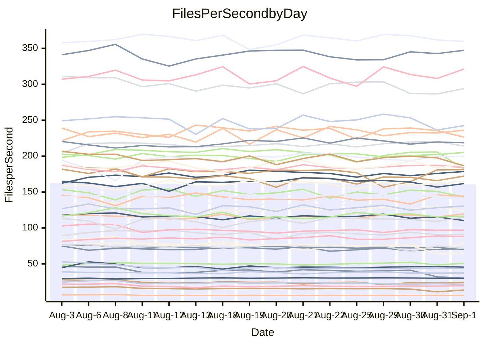

<!---
# This file is auto-generated. Do not edit.
# cspell:disable
--->
# Performance Report

## Daily Performance

## Time to Process Files

| Repository                                      | Elapsed | Min/Avg/Max           |   SD | SD Graph                |
| ----------------------------------------------- | ------: | :-------------------: | ---: | ----------------------- |
| AdaDoom3/AdaDoom3                    |    3.44 | 3.3 /   3.4 /   3.6   | 0.07 | `     ┣━┻━━╋●━┻━┫     ` |
| alexiosc/megistos                    |    8.16 | 7.5 /   7.9 /   9.4   | 0.42 | `    ┣━━┻━━╋━●┻━━┫    ` |
| apollographql/apollo-server          |    2.76 | 2.6 /   2.7 /   3.3   | 0.15 | `    ┣━━┻━━╋●━┻━━┫    ` |
| aspnetboilerplate/aspnetboilerplate  |   10.68 | 10.1 /  10.6 /  11.2  | 0.27 | `    ┣━━┻━━╋●━┻━━┫    ` |
| aws-amplify/docs                     |   13.14 | 12.5 /  13.2 /  14.2  | 0.40 | `    ┣━━┻━●╋━━┻━━┫    ` |
| Azure/azure-rest-api-specs           |   10.06 | 9.4 /   9.9 /  11.3   | 0.43 | `    ┣━━┻━━╋●━┻━━┫    ` |
| bitjson/typescript-starter           |    1.01 | 0.9 /   1.0 /   1.3   | 0.08 | `     ┣━┻━●╋━━┻━┫     ` |
| caddyserver/caddy                    |    3.62 | 3.6 /   3.8 /   4.3   | 0.17 | `    ┣━━●━━╋━━┻━━┫    ` |
| canada-ca/open-source-logiciel-libre |    1.16 | 0.9 /   1.1 /   1.2   | 0.06 | `     ┣━┻━━╋━●┻━┫     ` |
| chef/chef                            |    6.05 | 5.8 /   6.2 /   7.7   | 0.38 | `    ┣━━┻━●╋━━┻━━┫    ` |
| dart-lang/sdk                        |   65.49 | 63.3 /  67.2 /  70.7  | 1.96 | `  ┣━━━┻●━━╋━━━┻━━━┫  ` |
| django/django                        |   15.55 | 14.8 /  15.5 /  16.4  | 0.36 | `    ┣━━┻━━●━━┻━━┫    ` |
| eslint/eslint                        |   11.07 | 10.6 /  11.2 /  12.1  | 0.41 | `    ┣━━┻━●╋━━┻━━┫    ` |
| exonum/exonum                        |    3.81 | 3.4 /   3.6 /   3.9   | 0.11 | `    ┣━━┻━━╋━━┻━●┫    ` |
| flutter/samples                      |   16.66 | 16.3 /  17.2 /  19.7  | 0.70 | `   ┣━━━●━━╋━━┻━━━┫   ` |
| gitbucket/gitbucket                  |    3.46 | 3.4 /   3.6 /   3.9   | 0.12 | `    ┣━━●━━╋━━┻━━┫    ` |
| googleapis/google-cloud-cpp          |  149.37 | 136.7 / 143.4 / 155.3 | 4.62 | `  ┣━━━┻━━━╋━━━┻●━━┫  ` |
| graphql/express-graphql              |    1.20 | 1.0 /   1.1 /   1.3   | 0.07 | `     ┣━┻━━╋━━┻●┫     ` |
| graphql/graphql-js                   |    2.95 | 2.7 /   2.9 /   3.2   | 0.11 | `    ┣━━┻━━╋━●┻━━┫    ` |
| graphql/graphql-relay-js             |    1.15 | 1.0 /   1.1 /   1.3   | 0.08 | `     ┣━┻━━●━━┻━┫     ` |
| graphql/graphql-spec                 |    1.32 | 0.9 /   1.0 /   1.5   | 0.13 | `     ┣━┻━━╋━━┻━┫●    ` |
| iluwatar/java-design-patterns        |   13.90 | 12.6 /  13.4 /  15.2  | 0.56 | `    ┣━━┻━━╋━━●━━┫    ` |
| ktaranov/sqlserver-kit               |    6.97 | 6.5 /   6.8 /   7.4   | 0.20 | `    ┣━━┻━━╋━━●━━┫    ` |
| liriliri/licia                       |    4.14 | 4.0 /   4.2 /   4.6   | 0.12 | `    ┣━━┻●━╋━━┻━━┫    ` |
| MartinThoma/LaTeX-examples           |    6.87 | 6.7 /   7.0 /   7.5   | 0.16 | `    ┣━━●━━╋━━┻━━┫    ` |
| mdx-js/mdx                           |    1.99 | 1.8 /   2.0 /   2.2   | 0.09 | `     ┣━┻━━●━━┻━┫     ` |
| microsoft/TypeScript-Website         |    5.90 | 5.5 /   5.9 /   7.3   | 0.37 | `    ┣━━┻━━●━━┻━━┫    ` |
| MicrosoftDocs/PowerShell-Docs        |   23.52 | 23.2 /  24.5 /  27.5  | 0.95 | `   ┣━━●┻━━╋━━┻━━━┫   ` |
| neovim/nvim-lspconfig                |    4.24 | 4.1 /   4.3 /   4.7   | 0.14 | `    ┣━━┻●━╋━━┻━━┫    ` |
| pagekit/pagekit                      |    4.07 | 3.5 /   3.6 /   4.1   | 0.12 | `    ┣━━┻━━╋━━┻━━┫   ●` |
| php/php-src                          |   25.84 | 25.3 /  26.7 /  29.7  | 1.01 | `   ┣━━━●━━╋━━┻━━━┫   ` |
| plasticrake/tplink-smarthome-api     |    1.36 | 1.2 /   1.3 /   1.4   | 0.07 | `     ┣━┻━━╋●━┻━┫     ` |
| prettier/prettier                    |    7.12 | 7.0 /   7.4 /   8.1   | 0.23 | `    ┣━●┻━━╋━━┻━━┫    ` |
| pycontribs/jira                      |    1.55 | 1.5 /   1.6 /   1.7   | 0.06 | `     ┣━┻━●╋━━┻━┫     ` |
| RustPython/RustPython                |    5.24 | 5.0 /   5.4 /   5.8   | 0.21 | `    ┣━━┻●━╋━━┻━━┫    ` |
| shoelace-style/shoelace              |    3.02 | 2.8 /   3.0 /   3.7   | 0.17 | `    ┣━━┻━━●━━┻━━┫    ` |
| slint-ui/slint                       |   12.38 | 11.8 /  12.6 /  15.5  | 0.83 | `   ┣━━━┻━●╋━━┻━━━┫   ` |
| SoftwareBrothers/admin-bro           |    2.56 | 2.4 /   2.6 /   3.0   | 0.11 | `    ┣━━┻━●╋━━┻━━┫    ` |
| sveltejs/svelte                      |   21.76 | 20.2 /  21.5 /  23.0  | 0.50 | `   ┣━━━┻━━╋━●┻━━━┫   ` |
| TheAlgorithms/Python                 |    6.16 | 5.6 /   6.0 /   6.9   | 0.31 | `    ┣━━┻━━╋━●┻━━┫    ` |
| twbs/bootstrap                       |    1.83 | 1.3 /   1.5 /   1.9   | 0.12 | `     ┣━┻━━╋━━┻━┫●    ` |
| typescript-cheatsheets/react         |    1.42 | 1.3 /   1.4 /   1.5   | 0.05 | `     ┣━┻━━╋●━┻━┫     ` |
| typescript-eslint/typescript-eslint  |    4.35 | 4.1 /   4.3 /   4.7   | 0.14 | `    ┣━━┻━━╋●━┻━━┫    ` |
| vitest-dev/vitest                    |    9.35 | 9.0 /   9.5 /  11.1   | 0.42 | `    ┣━━┻━●╋━━┻━━┫    ` |
| w3c/aria-practices                   |    3.51 | 3.2 /   3.5 /   3.8   | 0.11 | `    ┣━━┻━━╋●━┻━━┫    ` |
| w3c/specberus                        |    2.04 | 1.9 /   2.1 /   2.2   | 0.08 | `     ┣━┻━━●━━┻━┫     ` |
| webdeveric/webpack-assets-manifest   |    1.23 | 1.0 /   1.2 /   1.3   | 0.07 | `     ┣━┻━━╋━●┻━┫     ` |
| webpack/webpack                      |    5.99 | 5.4 /   5.6 /   6.2   | 0.18 | `    ┣━━┻━━╋━━┻━━●    ` |
| wireapp/wire-desktop                 |    1.42 | 0.9 /   1.1 /   1.4   | 0.11 | `     ┣━┻━━╋━━┻━┫  ●  ` |
| wireapp/wire-webapp                  |   11.33 | 10.8 /  11.3 /  13.3  | 0.52 | `    ┣━━┻━━●━━┻━━┫    ` |

Note:
- Elapsed time is in seconds.

## Files per Second over Time

| Repository                                      | Files |    Sec |    Fps |     Rel | Trend Fps              |    N |
| ----------------------------------------------- | ----: | -----: | -----: | ------: | ---------------------- | ---: |
| AdaDoom3/AdaDoom3                    |   103 |   3.44 |  29.95 |  -0.52% | `▇█▇█▇▇▇▇█▇▇█▇██▇█▇▇▇` |   29 |
| alexiosc/megistos                    |   583 |   8.16 |  71.42 |  -3.61% | `▅▇█▆▇▇██▇▇█▆█▇█▃▃▇█▆` |   29 |
| apollographql/apollo-server          |   252 |   2.76 |  91.22 |  -1.86% | `██▆▆▇▇▂▇▇▇▇▆▇▆█▅█▆▆▆` |   29 |
| aspnetboilerplate/aspnetboilerplate  |  2286 |  10.68 | 214.04 |  -1.00% | `██▅▆▇▆▆█▆▆▇▇▅▇▇▇█▇█▆` |   29 |
| aws-amplify/docs                     |  2871 |  13.14 | 218.57 |   0.43% | `▄▆▅▆▇▇▇▆▇▆▆▇▇▇▆▆▇▅█▆` |   29 |
| Azure/azure-rest-api-specs           |  2438 |  10.06 | 242.44 |  -2.13% | `█▇▃▇█▄▆▅█▇▇▇▇█▇█▇▆▅▆` |   29 |
| bitjson/typescript-starter           |    20 |   1.01 |  19.71 |   2.35% | `▆▆▃▇▅▇▆██▇▇▇▆▆██▇▇▇█` |   29 |
| caddyserver/caddy                    |   285 |   3.62 |  78.69 |   3.96% | `▇▇▇█▄█▇▇▄▅▆█▅▆█▆▆▇▃█` |   29 |
| canada-ca/open-source-logiciel-libre |     7 |   1.16 |   6.06 |  -3.79% | `▇▇▇▆▇█▇▆▆▇▇▆▆▇▆▆▆█▇▆` |   29 |
| chef/chef                            |  1208 |   6.05 | 199.53 |   2.34% | `▇▇▇▆▇█▇▇█▇█▇█▇▇▇▅▇█▇` |   29 |
| dart-lang/sdk                        | 10816 |  65.49 | 165.15 |   2.85% | `▇▆▅▆█▇▆▇▇▆▇▅▄▇▇▄▆▇▆▇` |   29 |
| django/django                        |  2858 |  15.55 | 183.77 |  -0.02% | `▇▇▄▆▅█▆▆▇▇▆▆▇▇▇▇█▇▇▆` |   29 |
| eslint/eslint                        |  2090 |  11.07 | 188.75 |   0.92% | `█▆▅▅▄██▇█▆▆▇▄▆▇▇█▄▇▇` |   29 |
| exonum/exonum                        |   421 |   3.81 | 110.36 |  -5.04% | `█▆▇▅▇▆▅▇▇▆▆▆▇█▆▄▇▆▇▅` |   29 |
| flutter/samples                      |  2400 |  16.66 | 144.08 |   1.92% | `▆██▇▆▆▆▇▆▇█▆▆▆▆▃▆█▇▇` |   29 |
| gitbucket/gitbucket                  |   413 |   3.46 | 119.50 |   3.52% | `█▇▅█▅▆█▅▇█▆▄██▇█▇▇▇█` |   29 |
| googleapis/google-cloud-cpp          | 20726 | 149.37 | 138.76 |  -3.55% | `▄▆▇▅█▇▄█▆▆█▇▇▇▇▅▆▇▇▅` |   29 |
| graphql/express-graphql              |    26 |   1.20 |  21.60 |  -8.19% | `█▇▆█▆▇▇██▇▇▇▇▅▆▃▅▅▆▄` |   29 |
| graphql/graphql-js                   |   364 |   2.95 | 123.39 |  -2.75% | `▇▇▃▆▆▆▆▆▆▆▆▆▇▇▆▆▇█▆▅` |   29 |
| graphql/graphql-relay-js             |    28 |   1.15 |  24.27 |  -1.14% | `▇▅▆█▇▇▆█▄▆▇█▇▃▆▆▇▃█▇` |   29 |
| graphql/graphql-spec                 |    18 |   1.32 |  13.64 | -12.74% | `█▆█▇████▇█▇▇▇█▅█▇▂▂▅` |   29 |
| iluwatar/java-design-patterns        |  1992 |  13.90 | 143.28 |  -4.13% | `█▆▆█▇▆▇▇█▇▃▇▇▆▇███▇▆` |   29 |
| ktaranov/sqlserver-kit               |   489 |   6.97 |  70.19 |  -3.02% | `▆▆█▆▇███▇▇▇▅█▇█▅▇█▆▆` |   29 |
| liriliri/licia                       |  1437 |   4.14 | 347.17 |   2.08% | `▅▆▇▇█▇▇██▇▇▇▆▆█▇▇▇▇█` |   29 |
| MartinThoma/LaTeX-examples           |  1409 |   6.87 | 205.14 |   2.37% | `▅▆▇▆▆▅▆▄▇▆██▆▆▇▇▅▆▇▇` |   29 |
| mdx-js/mdx                           |   141 |   1.99 |  70.89 |  -0.44% | `█▅▇█▇█▅██▅▆▆▇▇▅▆▅█▅▇` |   29 |
| microsoft/TypeScript-Website         |   761 |   5.90 | 128.97 |  -1.05% | `█▆███▇▆█▇▇▇▇▇▇█▆▄█▆▇` |   29 |
| MicrosoftDocs/PowerShell-Docs        |  2708 |  23.52 | 115.12 |   4.04% | `█▆▆▄▅▇▆█▅█▇█▇▇▆▇▇▅▇█` |   29 |
| neovim/nvim-lspconfig                |   757 |   4.24 | 178.56 |   2.75% | `▇▆▆▆██▇█▇█▆▇▅▇▇▆▆▆██` |   29 |
| pagekit/pagekit                      |   741 |   4.07 | 181.85 | -11.04% | `▇▆██▇███▇▇▆▇▃▆█▆██▇▃` |   29 |
| php/php-src                          |  2281 |  25.84 |  88.27 |   3.22% | `█▅▇▇▄▇▇▆▇▇█▆▆▆█▆▆█▇▇` |   29 |
| plasticrake/tplink-smarthome-api     |    62 |   1.36 |  45.45 |  -1.89% | `▆▇▇▄▇█▅▇▆▇▆▆▅▆▆█▆▇▇▆` |   29 |
| prettier/prettier                    |  2286 |   7.12 | 321.08 |   3.82% | `▆▆██▄▇▆▆█▇▆▅▅█▇█▆▇▆█` |   29 |
| pycontribs/jira                      |    79 |   1.55 |  50.89 |   1.06% | `█▄█▆▇▅▆▆▅▇▅▆▇▇█▇▇▇▃▇` |   29 |
| RustPython/RustPython                |   684 |   5.24 | 130.51 |   2.49% | `▇▅▄█▇█▅▆█▄▇▆██▄▇▆▇▇█` |   29 |
| shoelace-style/shoelace              |   439 |   3.02 | 145.28 |  -0.58% | `▇▇▇▆▇█▇▇█▆▂▆█▇███▇▆▇` |   29 |
| slint-ui/slint                       |  2243 |  12.38 | 181.23 |   2.31% | `█▇▇▇▆██▇▇█▇▇▇▄▆▇▂▇██` |   29 |
| SoftwareBrothers/admin-bro           |   441 |   2.56 | 172.14 |   1.43% | `█▇██▇█▃▇██▇▆▆███▇█▆█` |   29 |
| sveltejs/svelte                      |  7828 |  21.76 | 359.68 |  -0.80% | `▇▅▆▆▅▄▅▆▆▆▆▆▅▇█▆▅▆▅▆` |   29 |
| TheAlgorithms/Python                 |  1396 |   6.16 | 226.56 |  -3.25% | `▃██▇▇▇▇█▇▇█▇▄▇▇█▇▆█▆` |   29 |
| twbs/bootstrap                       |   118 |   1.83 |  64.49 | -16.29% | `▆▇▇█▇▆▆▇▇█▅█▄▇██▄▃▃▃` |   29 |
| typescript-cheatsheets/react         |    53 |   1.42 |  37.33 |  -1.18% | `▅▅▆▅██▆▇▅█▅█▇▇▆▅▇▇▄▆` |   29 |
| typescript-eslint/typescript-eslint  |  1278 |   4.35 | 293.90 |  -1.38% | `█▅▇▇█▆▇█▆▇████▆▄▇▄▇▇` |   29 |
| vitest-dev/vitest                    |  2206 |   9.35 | 235.92 |   2.47% | `▇▆▅█▃▇▇█▆███▇▆▇▇▇▆█▇` |   29 |
| w3c/aria-practices                   |   409 |   3.51 | 116.38 |  -1.43% | `▇▆▆█▄▆▅▇▅▆▅▇█▇▇█▇▅▆▆` |   29 |
| w3c/specberus                        |   198 |   2.04 |  96.99 |  -0.63% | `██▇▇▅█▇▄▆▇▇▇▇▆▇▆█▇▇▇` |   29 |
| webdeveric/webpack-assets-manifest   |    54 |   1.23 |  43.81 |  -3.67% | `▇▇█▄█▆▇█▆▇▇▇▆▆█▆▅▇▆▆` |   29 |
| webpack/webpack                      |  1117 |   5.99 | 186.50 |  -5.53% | `▆█▆▆█▇▇▄▇██▇▅▇█▇▇█▆▅` |   29 |
| wireapp/wire-desktop                 |    43 |   1.42 |  30.26 | -24.73% | `▃▇▅███▇▅█▇██▆▇██▇▂▃▂` |   29 |
| wireapp/wire-webapp                  |  1832 |  11.33 | 161.76 |  -0.40% | `▃▇█▇█▇▇▇███▇▇▇██▆▆▆▇` |   29 |

## Data Throughput

| Repository                                      | Files |    Sec |     Kps |     Rel | Trend Kps              |    N |
| ----------------------------------------------- | ----: | -----: | ------: | ------: | ---------------------- | ---: |
| AdaDoom3/AdaDoom3                    |   103 |   3.44 |  636.57 |  -0.52% | `▇█▇█▇▇▇▇█▇▇█▇██▇█▇▇▇` |   29 |
| alexiosc/megistos                    |   583 |   8.16 |  561.23 |  -3.61% | `▅▇█▆▇▇██▇▇█▆█▇█▃▃▇█▆` |   29 |
| apollographql/apollo-server          |   252 |   2.76 |  733.76 |  -1.86% | `██▆▆▇▇▂▇▇▇▇▆▇▆█▅█▆▆▆` |   29 |
| aspnetboilerplate/aspnetboilerplate  |  2286 |  10.68 |  520.77 |  -0.98% | `██▅▆▇▆▆█▆▆▇▇▅▇▇▇█▇█▆` |   29 |
| aws-amplify/docs                     |  2871 |  13.14 |  763.21 |   0.43% | `▄▆▅▆▇▇▇▆▇▆▆▇▇▇▆▆▇▅█▆` |   29 |
| Azure/azure-rest-api-specs           |  2438 |  10.06 |  643.49 |  -2.22% | `█▇▃▇█▄▆▅█▇▇▇▇█▇█▇▆▅▆` |   29 |
| bitjson/typescript-starter           |    20 |   1.01 |   78.84 |   2.35% | `▆▆▃▇▅▇▆██▇▇▇▆▆██▇▇▇█` |   29 |
| caddyserver/caddy                    |   285 |   3.62 |  672.36 |   4.21% | `▇▇▇▇▄█▇▇▄▅▆█▅▆█▆▆▇▃█` |   29 |
| canada-ca/open-source-logiciel-libre |     7 |   1.16 |   50.20 |  -3.79% | `▇▇▇▆▇█▇▆▆▇▇▆▆▇▆▆▆█▇▆` |   29 |
| chef/chef                            |  1208 |   6.05 |  921.32 |   2.32% | `▇▇▇▆▇█▇▇█▇█▇█▇▇▇▅▇█▇` |   29 |
| dart-lang/sdk                        | 10816 |  65.49 | 1120.53 |   3.20% | `▇▆▅▆█▇▆▇▇▅▇▅▄▇▇▄▆▇▆▇` |   29 |
| django/django                        |  2858 |  15.55 | 1152.11 |   0.06% | `▇▇▄▆▅█▆▆▇▇▆▆▇▇▇▇█▇▇▆` |   29 |
| eslint/eslint                        |  2090 |  11.07 | 1371.67 |   0.93% | `█▆▅▅▄██▇█▆▆▇▄▆▇▇█▄▇▇` |   29 |
| exonum/exonum                        |   421 |   3.81 | 1055.60 |  -5.04% | `█▆▇▅▇▆▅▇▇▆▆▆▇█▆▄▇▆▇▅` |   29 |
| flutter/samples                      |  2400 |  16.66 | 1285.70 |   2.89% | `▆██▇▆▆▆▇▆▇█▆▆▇▆▃▇███` |   29 |
| gitbucket/gitbucket                  |   413 |   3.46 |  543.08 |   3.54% | `█▇▅█▅▆█▅▇█▆▄██▇█▇▇▇█` |   29 |
| googleapis/google-cloud-cpp          | 20726 | 149.37 | 1121.42 |  -3.43% | `▄▆▇▅█▇▄█▆▆█▇▇▇▇▅▆▇▇▅` |   29 |
| graphql/express-graphql              |    26 |   1.20 |   98.84 |  -8.19% | `█▇▆█▆▇▇██▇▇▇▇▅▆▃▅▅▆▄` |   29 |
| graphql/graphql-js                   |   364 |   2.95 |  709.16 |  -2.75% | `▇▇▃▆▆▆▆▆▆▆▆▆▇▇▆▆▇█▆▅` |   29 |
| graphql/graphql-relay-js             |    28 |   1.15 |   95.34 |  -1.14% | `▇▅▆█▇▇▆█▄▆▇█▇▃▆▆▇▃█▇` |   29 |
| graphql/graphql-spec                 |    18 |   1.32 |  445.59 | -21.37% | `█▆█▇████▇█▇▇▇█▅█▇▂▂▃` |   29 |
| iluwatar/java-design-patterns        |  1992 |  13.90 |  442.85 |  -4.13% | `█▆▆█▇▆▇▇█▇▃▇▇▆▇███▇▆` |   29 |
| ktaranov/sqlserver-kit               |   489 |   6.97 | 1062.82 |  -3.00% | `▆▆█▆▇███▇▇▇▅█▇█▅▇█▆▆` |   29 |
| liriliri/licia                       |  1437 |   4.14 |  413.61 |   2.08% | `▅▆▇▇█▇▇██▇▇▇▆▆█▇▇▇▇█` |   29 |
| MartinThoma/LaTeX-examples           |  1409 |   6.87 |  423.68 |   2.37% | `▅▆▇▆▆▅▆▄▇▆██▆▆▇▇▅▆▇▇` |   29 |
| mdx-js/mdx                           |   141 |   1.99 |  329.84 |  -0.40% | `█▅▇█▇█▅██▅▆▆▇▇▅▆▅█▅▇` |   29 |
| microsoft/TypeScript-Website         |   761 |   5.90 |  891.92 |  -1.02% | `█▆███▇▆█▇▇▇▇▇▇█▆▄█▆▇` |   29 |
| MicrosoftDocs/PowerShell-Docs        |  2708 |  23.52 | 1183.81 |   4.08% | `█▆▆▄▅▇▆█▅█▇█▇▇▆▇▇▅▇█` |   29 |
| neovim/nvim-lspconfig                |   757 |   4.24 |  293.90 |   4.07% | `▇▆▆▆██▇█▇█▆▇▆▇▇▇▆▇██` |   29 |
| pagekit/pagekit                      |   741 |   4.07 |  379.17 | -11.04% | `▇▆██▇███▇▇▆▇▃▆█▆██▇▃` |   29 |
| php/php-src                          |  2281 |  25.84 | 1537.22 |   3.35% | `█▅▇▇▄▇▇▆▇▇█▆▆▆█▆▆█▇▇` |   29 |
| plasticrake/tplink-smarthome-api     |    62 |   1.36 |  245.55 |  -1.89% | `▆▇▇▄▇█▅▇▆▇▆▆▅▆▆█▆▇▇▆` |   29 |
| prettier/prettier                    |  2286 |   7.12 |  455.49 |   3.80% | `▆▆██▄▇▆▆█▇▆▅▅█▇█▆▇▆█` |   29 |
| pycontribs/jira                      |    79 |   1.55 |  360.71 |   1.05% | `█▄█▆▇▅▆▆▅▇▅▆▇▇█▇▇▇▃▇` |   29 |
| RustPython/RustPython                |   684 |   5.24 | 1027.67 |   2.82% | `▇▅▄█▇█▅▆█▄▇▆██▄▇▆▇▇█` |   29 |
| shoelace-style/shoelace              |   439 |   3.02 |  701.90 |  -0.58% | `▇▇▇▆▇█▇▇█▆▂▆█▇███▇▆▇` |   29 |
| slint-ui/slint                       |  2243 |  12.38 | 1182.83 |   2.43% | `█▇▇▇▆██▇▇█▇▇▇▄▆▇▂▇██` |   29 |
| SoftwareBrothers/admin-bro           |   441 |   2.56 |  379.40 |   1.43% | `█▇██▇█▃▇██▇▆▆███▇█▆█` |   29 |
| sveltejs/svelte                      |  7828 |  21.76 |  240.63 |  -0.88% | `▇▅▆▆▅▄▅▆▆▆▆▆▅▇█▆▅▆▅▆` |   29 |
| TheAlgorithms/Python                 |  1396 |   6.16 |  575.48 |  -3.18% | `▃██▇▇▇▇█▇▇█▇▄▇▇█▇▆█▆` |   29 |
| twbs/bootstrap                       |   118 |   1.83 |  529.03 | -16.37% | `▆▇▇█▇▆▆▇▇█▅█▄▇██▄▃▃▃` |   29 |
| typescript-cheatsheets/react         |    53 |   1.42 |  276.10 |  -0.26% | `▅▅▅▅█▇▆▇▄█▄█▇█▆▅▇█▅▆` |   29 |
| typescript-eslint/typescript-eslint  |  1278 |   4.35 | 1500.32 |  -1.30% | `█▅▇▇█▆▇█▆▇████▆▄▇▄▇▇` |   29 |
| vitest-dev/vitest                    |  2206 |   9.35 |  527.89 |   2.17% | `▇▆▅█▃▇▇█▆███▇▆▇▇▇▆█▇` |   29 |
| w3c/aria-practices                   |   409 |   3.51 | 1082.95 |  -1.42% | `▇▆▆█▄▆▅▇▅▆▅▇█▇▇█▇▅▆▆` |   29 |
| w3c/specberus                        |   198 |   2.04 |  304.68 |  -0.22% | `▇▇▇▇▅█▇▄▆▇▇▇▇▆▇▆█▇▇▇` |   29 |
| webdeveric/webpack-assets-manifest   |    54 |   1.23 |  103.04 |  -3.64% | `▇▇█▄█▆▇█▆▇▇▇▆▆█▆▅▇▆▆` |   29 |
| webpack/webpack                      |  1117 |   5.99 |  846.53 |  -5.45% | `▆▇▆▆█▇▇▄▇██▇▅▇█▇▇█▆▅` |   29 |
| wireapp/wire-desktop                 |    43 |   1.42 |  133.72 | -24.73% | `▃▇▅███▇▅█▇██▆▇██▇▂▃▂` |   29 |
| wireapp/wire-webapp                  |  1832 |  11.33 |  577.74 |  -0.37% | `▃▇█▇█▇▇▇███▇▇▇██▆▆▆▇` |   29 |

