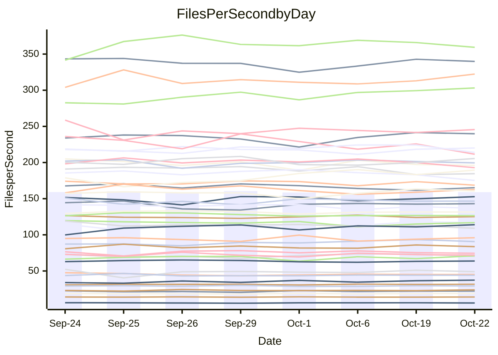

<!---
# This file is auto-generated. Do not edit.
# cspell:disable
--->
# Performance Report

## Daily Performance

## Time to Process Files

| Repository                                      | Elapsed | Min/Avg/Max           |   SD | SD Graph                |
| ----------------------------------------------- | ------: | :-------------------: | ---: | ----------------------- |
| AdaDoom3/AdaDoom3                    |    3.61 | 3.4 /   3.5 /   3.7   | 0.11 | `    ┣━━┻━━╋━●┻━━┫    ` |
| alexiosc/megistos                    |    7.93 | 7.6 /   8.0 /   8.6   | 0.30 | `    ┣━━┻━●╋━━┻━━┫    ` |
| apollographql/apollo-server          |    2.87 | 2.6 /   2.8 /   3.0   | 0.12 | `    ┣━━┻━━╋●━┻━━┫    ` |
| aspnetboilerplate/aspnetboilerplate  |   10.45 | 10.2 /  10.5 /  10.9  | 0.21 | `    ┣━━┻━●╋━━┻━━┫    ` |
| aws-amplify/docs                     |   13.92 | 12.5 /  13.0 /  13.9  | 0.39 | `    ┣━━┻━━╋━━┻━━┫●   ` |
| Azure/azure-rest-api-specs           |    9.61 | 9.5 /  10.1 /  10.7   | 0.32 | `    ┣●━┻━━╋━━┻━━┫    ` |
| bitjson/typescript-starter           |    1.04 | 1.0 /   1.1 /   1.1   | 0.02 | `     ┣●━┻━╋━┻━━┫     ` |
| caddyserver/caddy                    |    3.88 | 3.6 /   3.8 /   4.0   | 0.11 | `    ┣━━┻━━╋━●┻━━┫    ` |
| canada-ca/open-source-logiciel-libre |    1.17 | 1.1 /   1.2 /   1.3   | 0.05 | `     ┣━┻━●╋━━┻━┫     ` |
| chef/chef                            |    5.90 | 5.7 /   6.0 /   6.4   | 0.18 | `    ┣━━┻●━╋━━┻━━┫    ` |
| dart-lang/sdk                        |   68.39 | 63.9 /  67.0 /  73.2  | 2.34 | `  ┣━━━┻━━━╋━●━┻━━━┫  ` |
| django/django                        |   16.35 | 14.9 /  15.6 /  16.5  | 0.47 | `    ┣━━┻━━╋━━┻━●┫    ` |
| eslint/eslint                        |   11.78 | 10.7 /  11.0 /  11.7  | 0.33 | `    ┣━━┻━━╋━━┻━━┫●   ` |
| exonum/exonum                        |    3.54 | 3.6 /   3.7 /   4.0   | 0.12 | `    ┣━●┻━━╋━━┻━━┫    ` |
| flutter/samples                      |   17.22 | 16.3 /  17.0 /  18.6  | 0.59 | `    ┣━━┻━━╋●━┻━━┫    ` |
| gitbucket/gitbucket                  |    3.80 | 3.5 /   3.7 /   3.8   | 0.09 | `    ┣━━┻━━╋━━┻●━┫    ` |
| googleapis/google-cloud-cpp          |  158.31 | 142.5 / 149.0 / 165.8 | 5.44 | `  ┣━━━┻━━━╋━━━┻━━●┫  ` |
| graphql/express-graphql              |    1.21 | 1.1 /   1.2 /   1.3   | 0.04 | `     ┣━┻━━╋━●┻━┫     ` |
| graphql/graphql-js                   |    2.84 | 2.8 /   2.9 /   3.1   | 0.07 | `     ┣━●━━╋━━┻━┫     ` |
| graphql/graphql-relay-js             |    1.22 | 1.1 /   1.2 /   1.3   | 0.04 | `     ┣━┻━━╋●━┻━┫     ` |
| graphql/graphql-spec                 |    1.32 | 1.3 /   1.4 /   1.4   | 0.03 | `     ┣●┻━━╋━━┻━┫     ` |
| iluwatar/java-design-patterns        |   13.09 | 13.0 /  13.4 /  14.9  | 0.47 | `    ┣━━┻●━╋━━┻━━┫    ` |
| ktaranov/sqlserver-kit               |    6.83 | 6.6 /   6.8 /   7.3   | 0.22 | `    ┣━━┻━━●━━┻━━┫    ` |
| liriliri/licia                       |    4.22 | 4.1 /   4.3 /   4.4   | 0.09 | `    ┣━━┻━●╋━━┻━━┫    ` |
| MartinThoma/LaTeX-examples           |    7.20 | 6.9 /   7.0 /   7.4   | 0.17 | `    ┣━━┻━━╋━━●━━┫    ` |
| mdx-js/mdx                           |    2.00 | 2.0 /   2.1 /   2.3   | 0.10 | `     ┣━┻●━╋━━┻━┫     ` |
| microsoft/TypeScript-Website         |    5.66 | 5.6 /   5.8 /   6.0   | 0.12 | `    ┣━●┻━━╋━━┻━━┫    ` |
| MicrosoftDocs/PowerShell-Docs        |   23.46 | 23.7 /  24.7 /  27.2  | 1.12 | `   ┣━━●┻━━╋━━┻━━━┫   ` |
| neovim/nvim-lspconfig                |    4.40 | 4.3 /   4.4 /   4.7   | 0.10 | `    ┣━━┻━●╋━━┻━━┫    ` |
| pagekit/pagekit                      |    3.89 | 3.5 /   3.7 /   4.0   | 0.13 | `    ┣━━┻━━╋━━┻━●┫    ` |
| php/php-src                          |   28.55 | 26.3 /  27.5 /  30.2  | 1.20 | `   ┣━━━┻━━╋━━●━━━┫   ` |
| plasticrake/tplink-smarthome-api     |    1.36 | 1.3 /   1.4 /   1.4   | 0.04 | `     ┣━┻━●╋━━┻━┫     ` |
| prettier/prettier                    |    7.37 | 7.0 /   7.5 /   7.8   | 0.19 | `    ┣━━┻━●╋━━┻━━┫    ` |
| pycontribs/jira                      |    1.65 | 1.5 /   1.6 /   2.0   | 0.11 | `     ┣━┻━━╋●━┻━┫     ` |
| RustPython/RustPython                |    5.17 | 5.2 /   5.4 /   5.7   | 0.14 | `    ┣●━┻━━╋━━┻━━┫    ` |
| shoelace-style/shoelace              |    2.98 | 2.9 /   3.0 /   3.1   | 0.06 | `     ┣━┻━━●━━┻━┫     ` |
| slint-ui/slint                       |   13.54 | 12.7 /  13.5 /  14.4  | 0.46 | `    ┣━━┻━━●━━┻━━┫    ` |
| SoftwareBrothers/admin-bro           |    2.70 | 2.6 /   2.7 /   2.9   | 0.08 | `     ┣━┻━━╋●━┻━┫     ` |
| sveltejs/svelte                      |   22.57 | 20.8 /  21.8 /  23.2  | 0.55 | `   ┣━━━┻━━╋━━┻━●━┫   ` |
| TheAlgorithms/Python                 |    5.87 | 5.7 /   5.9 /   6.6   | 0.22 | `    ┣━━┻━●╋━━┻━━┫    ` |
| twbs/bootstrap                       |    1.87 | 1.8 /   1.9 /   2.0   | 0.05 | `     ┣━┻━━╋●━┻━┫     ` |
| typescript-cheatsheets/react         |    1.45 | 1.4 /   1.5 /   1.6   | 0.07 | `     ┣━┻━●╋━━┻━┫     ` |
| typescript-eslint/typescript-eslint  |    4.26 | 4.2 /   4.4 /   4.6   | 0.12 | `    ┣━━●━━╋━━┻━━┫    ` |
| vitest-dev/vitest                    |   10.86 | 9.3 /   9.9 /  11.1   | 0.53 | `    ┣━━┻━━╋━━┻━━●    ` |
| w3c/aria-practices                   |    3.62 | 3.5 /   3.6 /   3.7   | 0.10 | `    ┣━━┻━━╋━●┻━━┫    ` |
| w3c/specberus                        |    2.07 | 2.0 /   2.1 /   2.3   | 0.08 | `     ┣━┻━●╋━━┻━┫     ` |
| webdeveric/webpack-assets-manifest   |    1.27 | 1.2 /   1.2 /   1.3   | 0.03 | `     ┣━┻━━╋━━●━┫     ` |
| webpack/webpack                      |    5.79 | 5.4 /   5.7 /   6.1   | 0.18 | `    ┣━━┻━━╋━●┻━━┫    ` |
| wireapp/wire-desktop                 |    1.47 | 1.3 /   1.4 /   1.5   | 0.04 | `     ┣━┻━━╋━━┻●┫     ` |
| wireapp/wire-webapp                  |   10.73 | 10.7 /  11.3 /  12.5  | 0.47 | `    ┣━●┻━━╋━━┻━━┫    ` |

Note:
- Elapsed time is in seconds.

## Files per Second over Time

| Repository                                      | Files |    Sec |    Fps |    Rel | Trend Fps        |    N |
| ----------------------------------------------- | ----: | -----: | -----: | -----: | ---------------- | ---: |
| AdaDoom3/AdaDoom3                    |   103 |   3.61 |  28.55 | -2.53% | `▇▇▄██▆▆▇▅██▆█▆` |   13 |
| alexiosc/megistos                    |   583 |   7.93 |  73.50 |  1.33% | `▆▅██▆▅▄▇▇▆█▄▅▇` |   13 |
| apollographql/apollo-server          |   252 |   2.87 |  87.92 | -2.09% | `▅▅▅▃▆▇▄▇▆▇█▆▇▅` |   13 |
| aspnetboilerplate/aspnetboilerplate  |  2286 |  10.45 | 218.74 |  0.46% | `▇▆██▇█▆▅▆▆███▇` |   13 |
| aws-amplify/docs                     |  2871 |  13.92 | 206.27 | -6.34% | `▆▆▆▄▇▅█▇███▆▇▄` |   13 |
| Azure/azure-rest-api-specs           |  2448 |   9.61 | 254.69 |  4.72% | `█▄▆▆▅▇▆▅▇▄▇▆▅█` |   13 |
| bitjson/typescript-starter           |    20 |   1.04 |  19.22 |  3.35% | `▇▆▆▆▅▇█▆▆▅▇█▇█` |   13 |
| caddyserver/caddy                    |   288 |   3.88 |  74.29 | -2.09% | `▇▄█▇█▇▆██▇▅▇▆▆` |   13 |
| canada-ca/open-source-logiciel-libre |     7 |   1.17 |   5.98 |  2.00% | `█▇▅▆▄█▆█▇▇█▇▄▇` |   13 |
| chef/chef                            |  1191 |   5.90 | 202.04 |  0.53% | `▆▆█▇█▅▆▇▄▇▆▇█▇` |   13 |
| dart-lang/sdk                        | 10696 |  68.39 | 156.40 | -1.32% | `▆▇▆▆▆▆▃▇▅▇▇██▆` |   13 |
| django/django                        |  2877 |  16.35 | 175.91 | -4.85% | `▇▇▅▇▇▇█▇▇▅▅█▄▅` |   13 |
| eslint/eslint                        |  2098 |  11.78 | 178.13 | -6.21% | `▇██▇██▅██▅▅▇▇▄` |   13 |
| exonum/exonum                        |   421 |   3.54 | 119.03 |  4.25% | `▇▄█▆▅▆▇▆▇██▇▇█` |   13 |
| flutter/samples                      |  2400 |  17.22 | 139.37 | -1.66% | `██▄▇▅▇▇▇▇▇▇██▆` |   13 |
| gitbucket/gitbucket                  |   413 |   3.80 | 108.75 | -3.88% | `█▆▇▅▆▇▆▆▅▅▅█▅▄` |   13 |
| googleapis/google-cloud-cpp          | 20788 | 158.31 | 131.31 | -5.94% | `▇▇▆▇▇▆██▃▇▆▇▇▅` |   13 |
| graphql/express-graphql              |    26 |   1.21 |  21.51 | -2.27% | `▇▅▅▇▄█▇▅▇▆▆▇█▅` |   13 |
| graphql/graphql-js                   |   364 |   2.84 | 128.09 |  2.80% | `█▇▅█▆▆▇█▇█▇▅▆█` |   13 |
| graphql/graphql-relay-js             |    28 |   1.22 |  22.99 | -1.09% | `▅▄█▇▅▇▄▆▅▅▆▅█▅` |   13 |
| graphql/graphql-spec                 |    19 |   1.32 |  14.35 |  2.85% | `▇▆██▆▇██▅▅▇▆▆█` |   13 |
| iluwatar/java-design-patterns        |  1992 |  13.09 | 152.13 |  2.08% | `█▇▇▄███▇▇▇█▇██` |   13 |
| ktaranov/sqlserver-kit               |   489 |   6.83 |  71.61 |  0.18% | `▇▅▅▇▄▇▆█▇██▇▅▇` |   13 |
| liriliri/licia                       |  1437 |   4.22 | 340.43 |  0.96% | `██▇▆▇▅▅▅▇█▇█▇▇` |   13 |
| MartinThoma/LaTeX-examples           |  1409 |   7.20 | 195.60 | -2.32% | `▇█▆▅▇▆█▇███▆█▆` |   13 |
| mdx-js/mdx                           |   141 |   2.00 |  70.36 |  3.37% | `▆▇█▇▇▃▆▇▇▅▇▆█▇` |   13 |
| microsoft/TypeScript-Website         |   761 |   5.66 | 134.48 |  2.61% | `▆▇▆█▇▅▆▅█▆▇▇▆█` |   13 |
| MicrosoftDocs/PowerShell-Docs        |  2708 |  23.46 | 115.43 |  4.91% | `▄▆▇▇██▃▇▇▇▇▇▇█` |   13 |
| neovim/nvim-lspconfig                |   759 |   4.40 | 172.66 |  0.71% | `█▇▆▇█▇█▇▅██▆▅▇` |   13 |
| pagekit/pagekit                      |   741 |   3.89 | 190.29 | -5.33% | `▆▇▆▆▇▆▆█▆▇█▄▅▅` |   13 |
| php/php-src                          |  2289 |  28.55 |  80.19 | -4.18% | `▆█▇▅▇▅▇▄█▇███▅` |   13 |
| plasticrake/tplink-smarthome-api     |    62 |   1.36 |  45.72 |  1.48% | `█▇▇▄▅▆▅▆▆▇▅▇▅▇` |   13 |
| prettier/prettier                    |  2363 |   7.37 | 320.65 |  2.46% | `▅█▄▇▆▆▆▅▆▆▆▆█▇` |   13 |
| pycontribs/jira                      |    79 |   1.65 |  47.95 | -1.89% | `█▂▆▇▇▆▆▆▅█▇▇▇▆` |   13 |
| RustPython/RustPython                |   688 |   5.17 | 133.01 |  4.74% | `▆▇█▆▇▅▇▆▆▅▇▆▄█` |   13 |
| shoelace-style/shoelace              |   439 |   2.98 | 147.16 |  0.18% | `█▅▆▇▅█▇▇▇▇▇▅▇▇` |   13 |
| slint-ui/slint                       |  2539 |  13.54 | 187.48 |  3.44% | `▆▄▅▄▅▇▇█▇▅▇▇█▇` |   13 |
| SoftwareBrothers/admin-bro           |   441 |   2.70 | 163.51 | -1.34% | `▇█▆▇█▇██▅▇▇▄▇▆` |   13 |
| sveltejs/svelte                      |  7982 |  22.57 | 353.65 | -3.19% | `▄▇█▇▆▆▆▇▇▆▆▇▆▅` |   13 |
| TheAlgorithms/Python                 |  1399 |   5.87 | 238.48 |  1.43% | `▇▇█▇▇▆▃▇▆█▇██▇` |   13 |
| twbs/bootstrap                       |   118 |   1.87 |  63.06 | -0.75% | `▆▇▇█▇▅▇▆▅▄▇█▇▆` |   13 |
| typescript-cheatsheets/react         |    53 |   1.45 |  36.58 |  2.45% | `▄▄▆▇▅▇▇▃▇▇▇▇█▇` |   13 |
| typescript-eslint/typescript-eslint  |  1285 |   4.26 | 301.48 |  2.81% | `▅▅▅▇▇▆▅█▆▇▇▇██` |   13 |
| vitest-dev/vitest                    |  2261 |  10.86 | 208.27 | -7.63% | `█▇▃███▆▅▆▆▇▆▅▄` |   13 |
| w3c/aria-practices                   |   414 |   3.62 | 114.28 | -1.69% | `█▇█▆▇██▅▅▆▅██▆` |   13 |
| w3c/specberus                        |   197 |   2.07 |  95.18 |  0.64% | `▆▆▅▆▅▇█▃▆▆▅▆▇▆` |   13 |
| webdeveric/webpack-assets-manifest   |    55 |   1.27 |  43.38 | -1.51% | `▅█▅▅▅▅▅▆▆▅▆▆▆▅` |   13 |
| webpack/webpack                      |  1127 |   5.79 | 194.78 | -1.59% | `█▇▆▇▇▄▆▇█▆█▆▇▆` |   13 |
| wireapp/wire-desktop                 |    46 |   1.47 |  31.39 | -0.02% | `▅▆▅▇▆▄▅▅█▇▆▅▇▆` |   13 |
| wireapp/wire-webapp                  |  1781 |  10.73 | 166.00 |  3.10% | `▆██▆█▇▆▃▇▆▅▇▆▇` |   13 |

## Data Throughput

| Repository                                      | Files |    Sec |     Kps |    Rel | Trend Kps        |    N |
| ----------------------------------------------- | ----: | -----: | ------: | -----: | ---------------- | ---: |
| AdaDoom3/AdaDoom3                    |   103 |   3.61 |  606.84 | -2.53% | `▇▇▄██▆▆▇▅██▆█▆` |   13 |
| alexiosc/megistos                    |   583 |   7.93 |  577.57 |  1.33% | `▆▅██▆▅▄▇▇▆█▄▅▇` |   13 |
| apollographql/apollo-server          |   252 |   2.87 |  707.22 | -2.09% | `▅▅▅▃▆▇▄▇▆▇█▆▇▅` |   13 |
| aspnetboilerplate/aspnetboilerplate  |  2286 |  10.45 |  532.20 |  0.46% | `▇▆██▇█▆▅▆▆███▇` |   13 |
| aws-amplify/docs                     |  2871 |  13.92 |  720.06 | -6.36% | `▆▆▆▄▇▅█▇███▆▇▄` |   13 |
| Azure/azure-rest-api-specs           |  2448 |   9.61 |  682.39 |  5.84% | `█▄▅▆▅▇▆▅▇▄▇▇▅█` |   13 |
| bitjson/typescript-starter           |    20 |   1.04 |   76.90 |  3.35% | `▇▆▆▆▅▇█▆▆▅▇█▇█` |   13 |
| caddyserver/caddy                    |   288 |   3.88 |  644.39 | -0.78% | `▇▄█▇█▇▆██▇▆▇▇▆` |   13 |
| canada-ca/open-source-logiciel-libre |     7 |   1.17 |   49.57 |  2.00% | `█▇▅▆▄█▆█▇▇█▇▄▇` |   13 |
| chef/chef                            |  1191 |   5.90 |  935.37 |  0.82% | `▆▆█▇█▅▆▇▄▇▆▆█▇` |   13 |
| dart-lang/sdk                        | 10696 |  68.39 | 1065.09 | -1.87% | `▆▇▇▆▆▆▄█▅▇▇██▆` |   13 |
| django/django                        |  2877 |  16.35 | 1105.55 | -4.59% | `▇▇▅▇▇▇█▇▇▅▅█▄▅` |   13 |
| eslint/eslint                        |  2098 |  11.78 | 1280.37 | -6.35% | `▇██▇██▅██▅▅▇▇▄` |   13 |
| exonum/exonum                        |   421 |   3.54 | 1138.53 |  4.25% | `▇▄█▆▅▆▇▆▇██▇▇█` |   13 |
| flutter/samples                      |  2400 |  17.22 | 1243.68 | -1.66% | `██▄▇▅▇▇▇▇▇▇██▆` |   13 |
| gitbucket/gitbucket                  |   413 |   3.80 |  494.26 | -3.91% | `█▆▇▅▆▇▆▆▅▅▅█▅▄` |   13 |
| googleapis/google-cloud-cpp          | 20788 | 158.31 | 1067.03 | -5.84% | `▇▇▆▇▇▆██▃▇▆▇▇▅` |   13 |
| graphql/express-graphql              |    26 |   1.21 |   98.47 | -2.27% | `▇▅▅▇▄█▇▅▇▆▆▇█▅` |   13 |
| graphql/graphql-js                   |   364 |   2.84 |  740.40 |  3.34% | `▇▇▅█▆▆▇█▇█▇▅▆█` |   13 |
| graphql/graphql-relay-js             |    28 |   1.22 |   90.33 | -1.09% | `▅▄█▇▅▇▄▆▅▅▆▅█▅` |   13 |
| graphql/graphql-spec                 |    19 |   1.32 |  478.76 |  2.85% | `▇▆██▆▇██▅▅▇▆▆█` |   13 |
| iluwatar/java-design-patterns        |  1992 |  13.09 |  470.22 |  2.08% | `█▇▇▄███▇▇▇█▇██` |   13 |
| ktaranov/sqlserver-kit               |   489 |   6.83 | 1084.32 |  0.18% | `▇▅▅▇▄▇▆█▇██▇▅▇` |   13 |
| liriliri/licia                       |  1437 |   4.22 |  405.58 |  0.96% | `██▇▆▇▅▅▅▇█▇█▇▇` |   13 |
| MartinThoma/LaTeX-examples           |  1409 |   7.20 |  403.97 | -2.32% | `▇█▆▅▇▆█▇███▆█▆` |   13 |
| mdx-js/mdx                           |   141 |   2.00 |  327.33 |  3.37% | `▆▇█▇▇▃▆▇▇▅▇▆█▇` |   13 |
| microsoft/TypeScript-Website         |   761 |   5.66 |  930.06 |  2.61% | `▆▇▆█▇▅▆▅█▆▇▇▆█` |   13 |
| MicrosoftDocs/PowerShell-Docs        |  2708 |  23.46 | 1187.97 |  4.95% | `▄▆▇▇██▃▇▇▇▇▇▇█` |   13 |
| neovim/nvim-lspconfig                |   759 |   4.40 |  288.22 |  1.16% | `▇▆▆▇▇▇█▇▅██▆▅▇` |   13 |
| pagekit/pagekit                      |   741 |   3.89 |  396.76 | -5.33% | `▆▇▆▆▇▆▆█▆▇█▄▅▅` |   13 |
| php/php-src                          |  2289 |  28.55 | 1400.57 | -3.85% | `▅█▇▅▇▅▇▄█▇███▅` |   13 |
| plasticrake/tplink-smarthome-api     |    62 |   1.36 |  247.05 |  1.48% | `█▇▇▄▅▆▅▆▆▇▅▇▅▇` |   13 |
| prettier/prettier                    |  2363 |   7.37 |  448.61 |  2.01% | `▅█▄▇▆▆▆▅▆▆▆▆▇▇` |   13 |
| pycontribs/jira                      |    79 |   1.65 |  339.90 | -1.89% | `█▂▆▇▇▆▆▆▅█▇▇▇▆` |   13 |
| RustPython/RustPython                |   688 |   5.17 | 1053.62 |  5.02% | `▆▇█▆▆▅▇▆▆▅▇▆▄█` |   13 |
| shoelace-style/shoelace              |   439 |   2.98 |  710.98 |  0.18% | `█▅▆▇▅█▇▇▇▇▇▅▇▇` |   13 |
| slint-ui/slint                       |  2539 |  13.54 | 1153.94 |  1.69% | `█▅▇▆▄▇▇█▇▅▇▇█▇` |   13 |
| SoftwareBrothers/admin-bro           |   441 |   2.70 |  360.38 | -1.34% | `▇█▆▇█▇██▅▇▇▄▇▆` |   13 |
| sveltejs/svelte                      |  7982 |  22.57 |  236.02 | -3.34% | `▄▇█▇▆▆▆▇▇▆▆▇▆▅` |   13 |
| TheAlgorithms/Python                 |  1399 |   5.87 |  606.52 |  1.48% | `▇▇█▇▇▆▃▇▆█▇██▇` |   13 |
| twbs/bootstrap                       |   118 |   1.87 |  517.29 | -0.75% | `▆▇▇█▇▅▇▆▅▄▇█▇▆` |   13 |
| typescript-cheatsheets/react         |    53 |   1.45 |  270.57 |  2.45% | `▄▄▆▇▅▇▇▃▇▇▇▇█▇` |   13 |
| typescript-eslint/typescript-eslint  |  1285 |   4.26 | 1550.08 |  3.06% | `▅▅▅▇▇▅▅▇▆▇████` |   13 |
| vitest-dev/vitest                    |  2261 |  10.86 |  468.86 | -7.77% | `█▇▃███▆▅▆▅▇▆▅▄` |   13 |
| w3c/aria-practices                   |   414 |   3.62 | 1065.49 | -1.69% | `█▇█▆▇██▅▅▆▅██▆` |   13 |
| w3c/specberus                        |   197 |   2.07 |  300.99 |  1.07% | `▆▆▅▆▅▇█▃▆▆▆▆▇▆` |   13 |
| webdeveric/webpack-assets-manifest   |    55 |   1.27 |  100.17 | -2.61% | `▆█▅▅▅▅▅▆▆▄▆▆▆▅` |   13 |
| webpack/webpack                      |  1127 |   5.79 |  886.10 | -1.68% | `█▇▅▇▇▄▆▇█▆█▆▆▆` |   13 |
| wireapp/wire-desktop                 |    46 |   1.47 |  175.36 | 11.67% | `▃▃▃▃▃▂▃▂█▇▇▆▇▇` |   13 |
| wireapp/wire-webapp                  |  1781 |  10.73 |  612.72 |  4.91% | `▆██▅█▇▆▃█▇▆▇▇█` |   13 |

