<!---
# This file is auto-generated. Do not edit.
# cspell:disable
--->
# Performance Report

## Daily Performance

```mermaid
xychart-beta
    title Files Per Second by Day
    y-axis Files per Second
    x-axis Date [Aug-11, Aug-12, Aug-13, Aug-18, Aug-19, Aug-20, Aug-21, Aug-22, Aug-25, Aug-29, Aug-30, Aug-31, Sep-1, Sep-3, Sep-6, Sep-7, Sep-8]
    bar [161.87, 161.59, 160.12, 160.00, 162.54, 160.82, 162.11, 163.20, 161.31, 162.91, 160.67, 162.16, 160.72, 161.93, 162.34, 161.56, 160.97]
    line [22.24, 23.36, 22.81, 24.23, 23.27, 23.59, 24.08, 23.43, 23.40, 22.23, 21.90, 22.46, 21.60, 23.03, 22.85, 22.27, 19.18]
    line [115.35, 116.69, 115.74, 111.39, 116.78, 113.71, 117.01, 115.75, 116.08, 119.18, 113.59, 115.52, 110.36, 102.65, 114.46, 112.83, 115.47]
    line [50.89, 50.88, 50.22, 49.59, 50.25, 50.03, 48.40, 49.47, 50.47, 51.15, 52.21, 48.60, 50.89, 48.97, 49.35, 49.58, 48.85]
    line [77.70, 75.58, 76.94, 80.70, 76.26, 76.41, 76.73, 75.85, 74.38, 75.85, 75.82, 63.83, 64.49, 61.65, 64.50, 61.26, 64.86]
    line [6.09, 6.22, 6.12, 6.05, 6.23, 6.09, 6.02, 6.19, 6.02, 6.20, 6.04, 6.23, 6.06, 6.09, 6.20, 6.14, 6.11]
    line [122.44, 127.81, 121.17, 124.81, 124.18, 125.47, 127.40, 124.91, 126.98, 128.83, 125.51, 130.73, 123.39, 129.29, 124.27, 129.39, 122.55]
    line [95.66, 97.25, 93.41, 90.83, 93.92, 83.91, 92.53, 93.93, 91.70, 90.17, 94.03, 90.40, 91.22, 98.55, 92.55, 91.52, 92.79]
    line [78.35, 77.65, 75.86, 77.65, 74.07, 76.09, 68.93, 73.13, 75.35, 74.03, 75.97, 71.20, 78.69, 74.68, 74.33, 75.84, 70.78]
    line [147.11, 146.86, 146.10, 136.12, 147.29, 144.63, 149.12, 128.33, 145.05, 141.62, 149.48, 142.85, 145.28, 149.46, 148.18, 143.83, 145.01]
    line [19.07, 18.54, 16.95, 19.10, 18.27, 18.74, 19.65, 18.80, 18.62, 18.45, 19.29, 19.08, 19.71, 18.88, 18.65, 18.65, 19.33]
    line [116.04, 112.64, 113.43, 119.19, 111.93, 114.00, 116.17, 114.97, 113.11, 118.41, 118.01, 115.40, 119.50, 117.17, 114.93, 104.04, 116.42]
    line [24.33, 24.19, 23.40, 25.07, 24.48, 24.64, 22.11, 24.14, 24.67, 21.16, 23.95, 23.30, 24.27, 25.24, 24.42, 23.30, 24.35]
    line [71.63, 73.23, 72.55, 71.44, 73.71, 74.27, 72.25, 73.30, 71.82, 72.99, 72.24, 73.05, 70.19, 72.55, 71.94, 71.15, 71.34]
    line [230.11, 226.13, 243.15, 239.31, 234.89, 241.23, 236.06, 238.56, 223.75, 237.91, 239.06, 235.45, 226.56, 239.54, 233.61, 243.66, 223.35]
    line [70.77, 69.86, 70.01, 73.04, 72.36, 70.62, 73.83, 67.67, 69.68, 72.12, 68.00, 70.47, 70.89, 69.29, 68.94, 69.89, 64.77]
    line [171.46, 176.49, 170.50, 172.92, 180.52, 178.78, 177.41, 175.76, 170.70, 175.74, 172.74, 175.87, 178.56, 179.08, 174.59, 177.44, 173.15]
    line [203.57, 199.20, 201.23, 200.81, 196.78, 192.62, 201.64, 203.42, 203.18, 198.91, 200.77, 202.09, 205.14, 192.22, 184.22, 194.88, 202.40]
    line [305.87, 304.71, 313.08, 324.40, 300.37, 304.78, 324.68, 308.60, 296.98, 324.16, 313.60, 308.04, 321.08, 295.70, 309.43, 319.09, 322.91]
    line [135.34, 130.97, 132.26, 136.82, 135.16, 130.52, 133.31, 131.34, 132.85, 130.95, 124.42, 129.63, 128.97, 135.94, 133.80, 132.37, 129.87]
    line [162.05, 151.08, 164.19, 163.52, 165.17, 164.35, 169.78, 168.65, 165.26, 166.00, 163.99, 156.90, 161.76, 167.23, 165.73, 167.27, 165.39]
    line [193.89, 195.05, 196.60, 192.32, 200.16, 188.13, 196.57, 202.87, 192.16, 197.82, 199.85, 197.57, 186.50, 184.53, 195.23, 203.47, 198.25]
    line [208.13, 206.12, 205.21, 210.46, 206.31, 208.96, 205.28, 201.48, 191.68, 200.76, 205.32, 205.73, 181.85, 198.01, 203.39, 206.55, 195.11]
    line [29.67, 29.60, 30.33, 30.62, 30.06, 30.32, 30.71, 30.33, 30.41, 30.59, 30.45, 30.07, 29.95, 28.16, 27.92, 30.43, 29.89]
    line [152.86, 154.13, 144.07, 152.10, 146.68, 148.87, 153.90, 141.45, 150.06, 146.03, 152.71, 150.80, 143.28, 155.69, 153.87, 147.46, 154.39]
    line [188.70, 193.07, 183.50, 178.10, 183.95, 192.12, 193.67, 185.05, 182.38, 185.55, 193.26, 183.54, 188.75, 189.86, 184.03, 189.81, 189.01]
    line [37.54, 37.60, 36.71, 36.51, 39.25, 38.04, 36.06, 37.72, 38.63, 38.79, 37.24, 37.32, 37.33, 38.42, 37.82, 37.98, 39.62]
    line [194.86, 199.17, 196.17, 191.14, 199.41, 198.71, 204.15, 203.44, 198.55, 195.50, 193.96, 199.31, 199.53, 189.39, 201.97, 197.12, 203.70]
    line [74.78, 72.96, 75.57, 72.13, 74.31, 76.20, 74.98, 75.32, 73.98, 74.92, 67.44, 74.93, 71.42, 69.97, 74.43, 74.58, 74.02]
    line [335.17, 325.27, 335.20, 340.52, 346.23, 347.14, 347.41, 338.20, 333.97, 334.12, 345.07, 342.66, 347.17, 346.14, 336.60, 342.41, 329.55]
    line [214.76, 212.79, 213.14, 217.00, 221.94, 220.45, 225.30, 218.11, 225.16, 221.13, 216.69, 219.64, 218.57, 218.78, 215.63, 224.82, 226.65]
    line [218.05, 216.13, 212.80, 213.27, 214.61, 217.28, 213.25, 217.17, 212.77, 217.16, 219.42, 220.41, 214.04, 205.97, 219.44, 217.73, 216.08]
    line [171.06, 170.80, 168.18, 172.80, 168.69, 156.73, 170.52, 169.10, 161.12, 170.94, 170.42, 165.85, 172.14, 164.57, 168.71, 172.84, 167.97]
    line [143.98, 142.41, 148.62, 143.28, 139.37, 140.53, 139.04, 144.69, 138.65, 139.89, 133.31, 145.80, 144.08, 140.79, 141.02, 143.66, 145.59]
    line [44.85, 44.73, 46.28, 42.85, 47.12, 44.69, 45.57, 45.49, 44.61, 45.50, 46.05, 46.44, 45.45, 46.41, 42.91, 44.10, 47.18]
    line [15.99, 15.64, 15.11, 15.67, 15.78, 15.86, 15.35, 15.70, 15.41, 15.75, 15.00, 11.10, 13.64, 14.09, 13.63, 13.57, 13.40]
    line [253.26, 251.44, 230.32, 252.21, 237.84, 238.36, 257.03, 248.15, 250.39, 258.39, 253.25, 236.21, 242.44, 258.87, 252.44, 256.07, 255.58]
    line [84.48, 86.21, 84.78, 87.25, 83.34, 85.16, 86.61, 89.19, 84.30, 84.25, 86.47, 88.91, 88.27, 86.74, 86.90, 85.78, 86.18]
    line [93.74, 97.45, 98.22, 96.65, 95.35, 92.84, 95.49, 96.50, 97.40, 93.72, 97.65, 96.80, 96.99, 99.11, 93.19, 96.28, 94.70]
    line [38.22, 37.79, 38.23, 41.09, 41.54, 38.59, 41.99, 40.85, 39.81, 40.28, 41.27, 31.95, 30.26, 32.20, 30.88, 32.09, 31.08]
    line [45.53, 44.69, 45.18, 40.85, 44.70, 45.09, 43.47, 44.07, 43.94, 43.35, 43.55, 44.33, 43.81, 45.60, 43.01, 41.97, 44.80]
    line [119.97, 117.10, 115.21, 121.90, 112.74, 115.76, 112.80, 115.24, 121.46, 118.37, 119.80, 115.33, 116.38, 118.04, 111.85, 119.40, 118.51]
    line [126.72, 128.04, 119.05, 131.02, 129.61, 123.08, 132.18, 124.93, 128.24, 131.60, 124.76, 128.19, 130.51, 127.29, 128.13, 127.03, 120.72]
    line [225.75, 230.29, 219.53, 238.65, 216.52, 236.75, 225.24, 241.21, 236.60, 228.23, 232.86, 232.26, 235.92, 225.53, 217.15, 227.16, 213.82]
    line [296.59, 300.81, 290.46, 298.69, 294.82, 300.68, 286.71, 300.74, 302.95, 303.29, 287.37, 286.48, 293.90, 297.13, 298.52, 297.48, 293.09]
    line [171.17, 182.41, 178.32, 178.57, 176.08, 180.57, 179.89, 180.99, 176.89, 156.76, 164.43, 180.88, 181.23, 183.21, 177.43, 180.28, 172.77]
    line [186.48, 183.29, 179.27, 181.07, 184.49, 180.99, 187.99, 183.89, 182.41, 184.77, 186.94, 187.25, 183.77, 174.20, 186.05, 185.31, 184.47]
    line [112.00, 114.17, 108.57, 100.66, 108.77, 112.72, 106.20, 114.85, 112.98, 112.47, 111.83, 109.19, 115.12, 112.97, 114.35, 112.51, 113.70]
    line [369.62, 366.45, 360.63, 368.14, 348.34, 354.65, 368.47, 364.63, 360.14, 369.32, 367.60, 361.65, 359.68, 367.46, 363.32, 365.30, 359.11]
    line [157.58, 166.90, 158.63, 158.95, 166.31, 162.23, 164.91, 160.87, 154.07, 164.02, 158.84, 162.35, 165.15, 167.75, 162.42, 161.26, 158.45]
    line [145.37, 140.27, 142.62, 139.83, 147.55, 141.21, 140.96, 145.89, 146.30, 146.55, 142.25, 144.70, 138.76, 142.53, 146.03, 141.67, 142.57]
```

## Time to Process Files

| Repository                                      | Elapsed | Min/Avg/Max           |   SD | SD Graph                |
| ----------------------------------------------- | ------: | :-------------------: | ---: | ----------------------- |
| AdaDoom3/AdaDoom3                    |    3.45 | 3.3 /   3.5 /   4.5   | 0.21 | `    ┣━━┻━━●━━┻━━┫    ` |
| alexiosc/megistos                    |    7.88 | 7.5 /   7.9 /   9.4   | 0.40 | `    ┣━━┻━━●━━┻━━┫    ` |
| apollographql/apollo-server          |    2.72 | 2.6 /   2.7 /   3.3   | 0.15 | `    ┣━━┻━━●━━┻━━┫    ` |
| aspnetboilerplate/aspnetboilerplate  |   10.58 | 10.2 /  10.6 /  11.2  | 0.24 | `    ┣━━┻━━●━━┻━━┫    ` |
| aws-amplify/docs                     |   12.67 | 12.5 /  13.2 /  14.2  | 0.39 | `    ┣━●┻━━╋━━┻━━┫    ` |
| Azure/azure-rest-api-specs           |    9.58 | 9.4 /   9.9 /  11.3   | 0.43 | `    ┣━━┻●━╋━━┻━━┫    ` |
| bitjson/typescript-starter           |    1.03 | 1.0 /   1.1 /   1.3   | 0.05 | `     ┣━┻●━╋━━┻━┫     ` |
| caddyserver/caddy                    |    4.03 | 3.6 /   3.8 /   4.3   | 0.16 | `    ┣━━┻━━╋━━┻●━┫    ` |
| canada-ca/open-source-logiciel-libre |    1.15 | 1.1 /   1.1 /   1.2   | 0.02 | `     ┣━━┻━╋●┻━━┫     ` |
| chef/chef                            |    5.93 | 5.8 /   6.1 /   6.6   | 0.17 | `    ┣━━●━━╋━━┻━━┫    ` |
| dart-lang/sdk                        |   68.30 | 63.3 /  66.8 /  70.7  | 1.80 | `  ┣━━━┻━━━╋━━●┻━━━┫  ` |
| django/django                        |   15.49 | 14.8 /  15.5 /  16.4  | 0.37 | `    ┣━━┻━━●━━┻━━┫    ` |
| eslint/eslint                        |   11.07 | 10.6 /  11.1 /  12.1  | 0.40 | `    ┣━━┻━●╋━━┻━━┫    ` |
| exonum/exonum                        |    3.65 | 3.5 /   3.7 /   4.1   | 0.12 | `    ┣━━┻━●╋━━┻━━┫    ` |
| flutter/samples                      |   16.48 | 16.3 /  17.1 /  19.7  | 0.61 | `   ┣━━━●━━╋━━┻━━━┫   ` |
| gitbucket/gitbucket                  |    3.55 | 3.4 /   3.6 /   4.0   | 0.15 | `    ┣━━┻━●╋━━┻━━┫    ` |
| googleapis/google-cloud-cpp          |  145.38 | 136.7 / 143.9 / 155.3 | 4.70 | `  ┣━━━┻━━━╋●━━┻━━━┫  ` |
| graphql/express-graphql              |    1.36 | 1.1 /   1.1 /   1.3   | 0.04 | `      ┣━┻━╋━┻━┫     ●` |
| graphql/graphql-js                   |    2.97 | 2.7 /   2.9 /   3.2   | 0.10 | `    ┣━━┻━━╋━●┻━━┫    ` |
| graphql/graphql-relay-js             |    1.15 | 1.1 /   1.2 /   1.3   | 0.06 | `     ┣━┻━●╋━━┻━┫     ` |
| graphql/graphql-spec                 |    1.42 | 1.0 /   1.1 /   1.5   | 0.15 | `     ┣━┻━━╋━━┻━●     ` |
| iluwatar/java-design-patterns        |   12.90 | 12.6 /  13.3 /  15.2  | 0.50 | `    ┣━━●━━╋━━┻━━┫    ` |
| ktaranov/sqlserver-kit               |    6.85 | 6.5 /   6.8 /   7.1   | 0.16 | `    ┣━━┻━━╋━●┻━━┫    ` |
| liriliri/licia                       |    4.36 | 4.1 /   4.2 /   4.6   | 0.10 | `    ┣━━┻━━╋━━●━━┫    ` |
| MartinThoma/LaTeX-examples           |    6.96 | 6.7 /   7.1 /   7.8   | 0.25 | `    ┣━━┻●━╋━━┻━━┫    ` |
| mdx-js/mdx                           |    2.18 | 1.9 /   2.0 /   2.2   | 0.07 | `     ┣━┻━━╋━━┻━┫●    ` |
| microsoft/TypeScript-Website         |    5.86 | 5.5 /   5.8 /   6.5   | 0.23 | `    ┣━━┻━━╋●━┻━━┫    ` |
| MicrosoftDocs/PowerShell-Docs        |   23.82 | 23.2 /  24.3 /  26.9  | 0.77 | `   ┣━━━┻●━╋━━┻━━━┫   ` |
| neovim/nvim-lspconfig                |    4.38 | 4.1 /   4.3 /   4.5   | 0.10 | `    ┣━━┻━━╋━●┻━━┫    ` |
| pagekit/pagekit                      |    3.80 | 3.5 /   3.6 /   4.1   | 0.13 | `    ┣━━┻━━╋━━●━━┫    ` |
| php/php-src                          |   26.64 | 25.3 /  26.5 /  28.9  | 0.78 | `   ┣━━━┻━━╋●━┻━━━┫   ` |
| plasticrake/tplink-smarthome-api     |    1.31 | 1.3 /   1.4 /   1.6   | 0.05 | `     ┣━●━━╋━━┻━┫     ` |
| prettier/prettier                    |    7.09 | 7.0 /   7.4 /   8.1   | 0.27 | `    ┣━━●━━╋━━┻━━┫    ` |
| pycontribs/jira                      |    1.62 | 1.5 /   1.6 /   1.7   | 0.06 | `     ┣━┻━━╋━●┻━┫     ` |
| RustPython/RustPython                |    5.69 | 5.1 /   5.4 /   5.8   | 0.18 | `    ┣━━┻━━╋━━┻━●┫    ` |
| shoelace-style/shoelace              |    3.03 | 2.9 /   3.0 /   3.7   | 0.15 | `    ┣━━┻━━●━━┻━━┫    ` |
| slint-ui/slint                       |   12.99 | 12.0 /  12.7 /  15.5  | 0.77 | `   ┣━━━┻━━╋●━┻━━━┫   ` |
| SoftwareBrothers/admin-bro           |    2.63 | 2.5 /   2.6 /   3.0   | 0.09 | `     ┣━┻━━●━━┻━┫     ` |
| sveltejs/svelte                      |   21.81 | 20.2 /  21.5 /  23.0  | 0.50 | `   ┣━━━┻━━╋━●┻━━━┫   ` |
| TheAlgorithms/Python                 |    6.25 | 5.6 /   5.9 /   6.9   | 0.31 | `    ┣━━┻━━╋━━●━━┫    ` |
| twbs/bootstrap                       |    1.82 | 1.5 /   1.6 /   2.0   | 0.16 | `    ┣━━┻━━╋━━●━━┫    ` |
| typescript-cheatsheets/react         |    1.34 | 1.3 /   1.4 /   1.5   | 0.04 | `     ┣●┻━━╋━━┻━┫     ` |
| typescript-eslint/typescript-eslint  |    4.36 | 4.2 /   4.3 /   4.7   | 0.12 | `    ┣━━┻━━╋●━┻━━┫    ` |
| vitest-dev/vitest                    |   10.32 | 9.1 /   9.6 /  12.0   | 0.59 | `    ┣━━┻━━╋━━┻●━┫    ` |
| w3c/aria-practices                   |    3.46 | 3.3 /   3.5 /   3.8   | 0.11 | `    ┣━━┻━●╋━━┻━━┫    ` |
| w3c/specberus                        |    2.09 | 2.0 /   2.1 /   2.2   | 0.06 | `     ┣━┻━━╋●━┻━┫     ` |
| webdeveric/webpack-assets-manifest   |    1.21 | 1.2 /   1.2 /   1.3   | 0.04 | `     ┣━┻━●╋━━┻━┫     ` |
| webpack/webpack                      |    5.64 | 5.3 /   5.7 /   6.2   | 0.19 | `    ┣━━┻━●╋━━┻━━┫    ` |
| wireapp/wire-desktop                 |    1.38 | 1.0 /   1.2 /   1.4   | 0.14 | `     ┣━┻━━╋━━┻●┫     ` |
| wireapp/wire-webapp                  |   11.10 | 10.8 /  11.2 /  13.3  | 0.50 | `    ┣━━┻━●╋━━┻━━┫    ` |

Note:
- Elapsed time is in seconds.

## Files per Second over Time

| Repository                                      | Files |    Sec |    Fps |     Rel | Trend Fps              |    N |
| ----------------------------------------------- | ----: | -----: | -----: | ------: | ---------------------- | ---: |
| AdaDoom3/AdaDoom3                    |   103 |   3.45 |  29.89 |  -0.02% | `█████▇█████▇▇▆█▂███▇` |   31 |
| alexiosc/megistos                    |   583 |   7.88 |  74.02 |   0.55% | `█▇▇█▆█▇█▃▃▇█▆▆▇▇█▇▇▇` |   31 |
| apollographql/apollo-server          |   252 |   2.72 |  92.79 |  -0.11% | `▆▇▇▇▆▇▆█▅█▆▆▆█▇▇▆▅█▇` |   31 |
| aspnetboilerplate/aspnetboilerplate  |  2286 |  10.58 | 216.08 |  -0.15% | `█▆▆▇▇▅▇▇▇█▇█▆▅▇▇█▇▇▇` |   31 |
| aws-amplify/docs                     |  2871 |  12.67 | 226.65 |   3.83% | `▆▇▆▆▇▇▇▆▆▇▅█▆▆▇▄▇▇▇█` |   31 |
| Azure/azure-rest-api-specs           |  2449 |   9.58 | 255.58 |   2.97% | `▅█▆▇▇▇█▇█▇▆▅▆█▇█▇███` |   31 |
| bitjson/typescript-starter           |    20 |   1.03 |  19.33 |   3.20% | `██▇▇▇▆▆██▇▇▇█▇▇▆▇▇▆█` |   31 |
| caddyserver/caddy                    |   285 |   4.03 |  70.78 |  -6.08% | `▇▄▅▆█▅▆█▆▆▇▃█▆▆▆▇▆█▅` |   31 |
| canada-ca/open-source-logiciel-libre |     7 |   1.15 |   6.11 |  -0.41% | `▆▆▇▇▆▆▇▆▆▆█▇▆▇▇▇█▇▆▇` |   31 |
| chef/chef                            |  1208 |   5.93 | 203.70 |   2.93% | `▇█▇█▆█▆▇▇▄▆▇▇▅█▇▇█▅█` |   31 |
| dart-lang/sdk                        | 10822 |  68.30 | 158.45 |  -1.95% | `▇▇▆▇▅▄▇▇▄▆▇▇▇█▇▆▇▆▇▆` |   31 |
| django/django                        |  2857 |  15.49 | 184.47 |   0.20% | `▆▇▇▆▆▇▇▇▇█▇▇▆▄▆▇██▆▇` |   31 |
| eslint/eslint                        |  2093 |  11.07 | 189.01 |   0.78% | `▇█▆▆▇▄▆▇▇█▄▇▇▇▅▆▇▇▇▇` |   31 |
| exonum/exonum                        |   421 |   3.65 | 115.47 |   0.72% | `▇█▇▇▇██▇▅▇▇█▆▃▇▆▇▇▆▇` |   31 |
| flutter/samples                      |  2400 |  16.48 | 145.59 |   2.76% | `▇▆▇█▆▆▇▆▃▇███▇▆█▇▇██` |   31 |
| gitbucket/gitbucket                  |   413 |   3.55 | 116.42 |   1.69% | `▅▇█▆▄██▇█▇▇▇█▇█▅█▃▄▇` |   31 |
| googleapis/google-cloud-cpp          | 20726 | 145.38 | 142.57 |  -0.69% | `█▆▆█▇▇▇▇▅▆▇▇▅▆█▆█▆▆▆` |   31 |
| graphql/express-graphql              |    26 |   1.36 |  19.18 | -16.08% | `███▇█▇▆▆▃▅▅▆▅▇▇▆▇▅▆▁` |   31 |
| graphql/graphql-js                   |   364 |   2.97 | 122.55 |  -2.57% | `▆▆▆▆▆▇▇▆▆▇█▆▅▇▄▆▇█▆▅` |   31 |
| graphql/graphql-relay-js             |    28 |   1.15 |  24.35 |   1.41% | `█▄▆▇█▇▃▆▆▇▃█▇█▇▆█▆▅▇` |   31 |
| graphql/graphql-spec                 |    19 |   1.42 |  13.40 |  -9.80% | `█▇██▇██▅██▂▂▅▆▄▆▆▅▅▅` |   31 |
| iluwatar/java-design-patterns        |  1992 |  12.90 | 154.39 |   2.92% | `▇█▇▃▇▇▆▇█▇█▆▆█▇██▆▇█` |   31 |
| ktaranov/sqlserver-kit               |   489 |   6.85 |  71.34 |  -1.55% | `█▇▇▇▅█▇█▅▇█▆▅▇▅▇█▇▅▆` |   31 |
| liriliri/licia                       |  1437 |   4.36 | 329.55 |  -2.83% | `██▇▇▇▆▆█▇▇▇▇██▇▇▆▇▇▆` |   31 |
| MartinThoma/LaTeX-examples           |  1409 |   6.96 | 202.40 |   2.02% | `▅▇▆██▆▆▇▇▆▇▇▇▅▄▃▅▅▆▇` |   31 |
| mdx-js/mdx                           |   141 |   2.18 |  64.77 |  -7.61% | `██▅▆▆▇▇▅▆▅█▅▇▆▆▆▅▆▇▄` |   31 |
| microsoft/TypeScript-Website         |   761 |   5.86 | 129.87 |  -1.51% | `█▇▇▇▇▇▇▇▅▃█▅▆██▇▇▇▇▆` |   31 |
| MicrosoftDocs/PowerShell-Docs        |  2708 |  23.82 | 113.70 |   1.76% | `█▅█▇█▆▇▆▇▇▅▇█▇▇█▇▆▇▇` |   31 |
| neovim/nvim-lspconfig                |   758 |   4.38 | 173.15 |  -1.13% | `█▇█▆▆▅▇▇▆▅▆███▇▅▇▇▇▆` |   31 |
| pagekit/pagekit                      |   741 |   3.80 | 195.11 |  -4.25% | `█▇▇▆▇▄▇█▆██▇▃▆▇█▇█▇▆` |   31 |
| php/php-src                          |  2296 |  26.64 |  86.18 |   0.13% | `▅▇▇█▆▆▆█▆▆█▇▇▇▇▆█▇▆▇` |   31 |
| plasticrake/tplink-smarthome-api     |    62 |   1.31 |  47.18 |   4.55% | `▇▇▇▇▇▆▇▇█▇▇▇▇▇▃▆▆▆▆█` |   31 |
| prettier/prettier                    |  2289 |   7.09 | 322.91 |   4.35% | `▆█▇▆▅▅█▆█▆▇▅▇▅▆▄█▇██` |   31 |
| pycontribs/jira                      |    79 |   1.62 |  48.85 |  -2.69% | `▆▅▇▅▆▇▇█▇▇▇▃▇▅▆▇▄▄█▅` |   31 |
| RustPython/RustPython                |   687 |   5.69 | 120.72 |  -4.92% | `▆█▄▇▆██▄▇▆▇▇█▇▇▇▇▇▆▅` |   31 |
| shoelace-style/shoelace              |   439 |   3.03 | 145.01 |   0.06% | `▇█▆▂▆█▇███▇▆▇██▇█▇▆▇` |   31 |
| slint-ui/slint                       |  2244 |  12.99 | 172.77 |  -2.16% | `▇▇█▇▇▇▄▆▇▃█████▇▇▇█▆` |   31 |
| SoftwareBrothers/admin-bro           |   441 |   2.63 | 167.97 |  -0.23% | `▇▇█▇▅▆█▇█▇█▆█▆▇▇▇██▇` |   31 |
| sveltejs/svelte                      |  7831 |  21.81 | 359.11 |  -1.17% | `▆▆▆▆▆▅▇█▆▅▆▅▆▆▇▆▅▆▆▆` |   31 |
| TheAlgorithms/Python                 |  1396 |   6.25 | 223.35 |  -4.99% | `█▇▇█▇▄▇▇█▇▆█▆▇▆█▆██▅` |   31 |
| twbs/bootstrap                       |   118 |   1.82 |  64.86 | -10.65% | `█▇█▆█▅▇██▅▃▄▄▃▃▄▄▄▂▄` |   31 |
| typescript-cheatsheets/react         |    53 |   1.34 |  39.62 |   5.06% | `▇▄█▄█▆▇▆▄▇▇▄▆▇▆▆▆█▅█` |   31 |
| typescript-eslint/typescript-eslint  |  1278 |   4.36 | 293.09 |  -0.99% | `█▆▇████▆▄▇▄▇▇▇▇▇▇▇▇▇` |   31 |
| vitest-dev/vitest                    |  2206 |  10.32 | 213.82 |  -6.53% | `█▆███▇▇▇▇▇▆█▇▆▇▂█▆█▅` |   31 |
| w3c/aria-practices                   |   410 |   3.46 | 118.51 |   1.37% | `▇▅▆▅▇█▇▇█▇▅▆▆▇▄▆▄▇▇▇` |   31 |
| w3c/specberus                        |   198 |   2.09 |  94.70 |  -1.31% | `▄▆▇▇▇▇▆▇▆█▇▇▇█▆▆▅▆▇▆` |   31 |
| webdeveric/webpack-assets-manifest   |    54 |   1.21 |  44.80 |   1.66% | `█▆▇▇▇▆▆█▆▅▇▇▇█▇▆▄▅▅▇` |   31 |
| webpack/webpack                      |  1118 |   5.64 | 198.25 |   1.22% | `▃▆▇▇▆▅▆▇▆▇▇▆▅▄▇▅▆▆█▆` |   31 |
| wireapp/wire-desktop                 |    43 |   1.38 |  31.08 | -16.68% | `▅█▇██▆▇██▇▃▃▂▃▂▂▃▃▃▃` |   31 |
| wireapp/wire-webapp                  |  1836 |  11.10 | 165.39 |   1.32% | `▇███▇▇▇██▆▆▆▇█▇▇███▇` |   31 |

## Data Throughput

| Repository                                      | Files |    Sec |     Kps |     Rel | Trend Kps              |    N |
| ----------------------------------------------- | ----: | -----: | ------: | ------: | ---------------------- | ---: |
| AdaDoom3/AdaDoom3                    |   103 |   3.45 |  635.31 |  -0.02% | `█████▇█████▇▇▆█▂███▇` |   31 |
| alexiosc/megistos                    |   583 |   7.88 |  581.63 |   0.55% | `█▇▇█▆█▇█▃▃▇█▆▆▇▇█▇▇▇` |   31 |
| apollographql/apollo-server          |   252 |   2.72 |  746.33 |  -0.11% | `▆▇▇▇▆▇▆█▅█▆▆▆█▇▇▆▅█▇` |   31 |
| aspnetboilerplate/aspnetboilerplate  |  2286 |  10.58 |  525.75 |  -0.14% | `█▆▆▇▇▅▇▇▇█▇█▆▅▇▇█▇▇▇` |   31 |
| aws-amplify/docs                     |  2871 |  12.67 |  791.42 |   3.83% | `▆▇▆▆▇▇▇▆▆▇▅█▆▆▇▄▇▇▇█` |   31 |
| Azure/azure-rest-api-specs           |  2449 |   9.58 |  673.23 |   2.12% | `▅█▇▇▇▇█▇█▇▆▅▆█▇█▇███` |   31 |
| bitjson/typescript-starter           |    20 |   1.03 |   77.33 |   3.20% | `██▇▇▇▆▆██▇▇▇█▇▇▆▇▇▆█` |   31 |
| caddyserver/caddy                    |   285 |   4.03 |  605.20 |  -5.85% | `▇▄▅▆█▅▆█▆▆▇▃█▆▆▆▇▆█▅` |   31 |
| canada-ca/open-source-logiciel-libre |     7 |   1.15 |   50.59 |  -0.41% | `▆▆▇▇▆▆▇▆▆▆█▇▆▇▇▇█▇▆▇` |   31 |
| chef/chef                            |  1208 |   5.93 |  940.76 |   2.92% | `▇█▇█▆█▆▇▇▄▆▇▇▅█▇▇█▅█` |   31 |
| dart-lang/sdk                        | 10822 |  68.30 | 1077.75 |  -1.40% | `▇▇▆▇▅▄▇▇▄▆▇▆▇█▇▆▇▆▇▆` |   31 |
| django/django                        |  2857 |  15.49 | 1157.23 |   0.29% | `▆▇▇▆▆▇▇▇▇█▇▇▆▄▆▇██▆▇` |   31 |
| eslint/eslint                        |  2093 |  11.07 | 1375.16 |   0.90% | `▇█▆▆▇▄▆▇▇█▄▇▇▇▅▆▇▇▇▇` |   31 |
| exonum/exonum                        |   421 |   3.65 | 1104.47 |   0.72% | `▇█▇▇▇██▇▅▇▇█▆▃▇▆▇▇▆▇` |   31 |
| flutter/samples                      |  2400 |  16.48 | 1299.20 |   3.43% | `▇▆▇█▆▆▇▆▃▇███▇▆█▇▇██` |   31 |
| gitbucket/gitbucket                  |   413 |   3.55 |  529.11 |   1.69% | `▅▇█▆▄██▇█▇▇▇█▇█▅█▃▄▇` |   31 |
| googleapis/google-cloud-cpp          | 20726 | 145.38 | 1152.20 |  -0.62% | `█▆▆█▇▇▇▇▅▆▇▇▅▆█▆█▆▆▆` |   31 |
| graphql/express-graphql              |    26 |   1.36 |   87.80 | -16.08% | `███▇█▇▆▆▃▅▅▆▅▇▇▆▇▅▆▁` |   31 |
| graphql/graphql-js                   |   364 |   2.97 |  704.34 |  -2.57% | `▆▆▆▆▆▇▇▆▆▇█▆▅▇▄▆▇█▆▅` |   31 |
| graphql/graphql-relay-js             |    28 |   1.15 |   95.67 |   1.41% | `█▄▆▇█▇▃▆▆▇▃█▇█▇▆█▆▅▇` |   31 |
| graphql/graphql-spec                 |    19 |   1.42 |  446.97 | -15.22% | `█▇██▇██▅██▂▂▄▄▃▄▄▄▃▄` |   31 |
| iluwatar/java-design-patterns        |  1992 |  12.90 |  477.20 |   2.92% | `▇█▇▃▇▇▆▇█▇█▆▆█▇██▆▇█` |   31 |
| ktaranov/sqlserver-kit               |   489 |   6.85 | 1080.13 |  -1.53% | `█▇▇▇▅█▇█▅▇█▆▅▇▅▇█▇▅▆` |   31 |
| liriliri/licia                       |  1437 |   4.36 |  392.62 |  -2.83% | `██▇▇▇▆▆█▇▇▇▇██▇▇▆▇▇▆` |   31 |
| MartinThoma/LaTeX-examples           |  1409 |   6.96 |  418.01 |   2.02% | `▅▇▆██▆▆▇▇▆▇▇▇▅▄▃▅▅▆▇` |   31 |
| mdx-js/mdx                           |   141 |   2.18 |  301.33 |  -7.61% | `██▅▆▆▇▇▅▆▅█▅▇▆▆▆▅▆▇▄` |   31 |
| microsoft/TypeScript-Website         |   761 |   5.86 |  898.19 |  -1.51% | `█▇▇▇▇▇▇▇▅▃█▅▆██▇▇▇▇▆` |   31 |
| MicrosoftDocs/PowerShell-Docs        |  2708 |  23.82 | 1169.25 |   1.79% | `█▅█▇█▆▇▆▇▇▅▇█▇▇█▇▆▇▇` |   31 |
| neovim/nvim-lspconfig                |   758 |   4.38 |  285.99 |   0.06% | `█▇█▆▇▅▇▇▇▆▆███▇▆███▇` |   31 |
| pagekit/pagekit                      |   741 |   3.80 |  406.80 |  -4.25% | `█▇▇▆▇▄▇█▆██▇▃▆▇█▇█▇▆` |   31 |
| php/php-src                          |  2296 |  26.64 | 1497.16 |  -0.08% | `▅▇▇█▆▆▆█▆▆█▇▇▇▇▆█▇▆▆` |   31 |
| plasticrake/tplink-smarthome-api     |    62 |   1.31 |  254.91 |   4.55% | `▇▇▇▇▇▆▇▇█▇▇▇▇▇▃▆▆▆▆█` |   31 |
| prettier/prettier                    |  2289 |   7.09 |  457.63 |   4.24% | `▆█▇▆▅▅█▆█▆▇▅▇▅▆▄█▇██` |   31 |
| pycontribs/jira                      |    79 |   1.62 |  346.26 |  -2.69% | `▆▅▇▅▆▇▇█▇▇▇▃▇▅▆▇▄▄█▅` |   31 |
| RustPython/RustPython                |   687 |   5.69 |  949.05 |  -4.83% | `▆█▄▇▆██▄▇▆▇▇█▇▇▇▇▇▆▅` |   31 |
| shoelace-style/shoelace              |   439 |   3.03 |  700.63 |   0.06% | `▇█▆▂▆█▇███▇▆▇██▇█▇▆▇` |   31 |
| slint-ui/slint                       |  2244 |  12.99 | 1128.41 |  -2.02% | `▇▇█▇▇▇▄▆▇▃█████▇▇▇█▇` |   31 |
| SoftwareBrothers/admin-bro           |   441 |   2.63 |  370.21 |  -0.23% | `▇▇█▇▅▆█▇█▇█▆█▆▇▇▇██▇` |   31 |
| sveltejs/svelte                      |  7831 |  21.81 |  240.29 |  -1.21% | `▆▆▆▆▆▅▇█▆▅▆▅▆▆▇▆▅▆▆▆` |   31 |
| TheAlgorithms/Python                 |  1396 |   6.25 |  567.48 |  -4.91% | `█▇▇█▇▄▇▇█▇▆█▆▇▆█▆██▅` |   31 |
| twbs/bootstrap                       |   118 |   1.82 |  532.03 | -10.72% | `█▇█▆█▅▇██▅▄▄▄▃▃▄▄▄▂▄` |   31 |
| typescript-cheatsheets/react         |    53 |   1.34 |  293.03 |   5.76% | `▇▄▇▄█▇▇▆▅▇▇▄▆▇▆▆▆█▅█` |   31 |
| typescript-eslint/typescript-eslint  |  1278 |   4.36 | 1496.64 |  -0.90% | `█▆▇████▆▄▇▄▇▇▇▇▇▇▇▇▇` |   31 |
| vitest-dev/vitest                    |  2206 |  10.32 |  479.20 |  -6.70% | `█▆███▇▇▇▇▇▇█▇▆▇▂█▆█▅` |   31 |
| w3c/aria-practices                   |   410 |   3.46 | 1102.39 |   1.35% | `▇▅▆▅▇█▇▇█▇▅▆▆▇▄▆▄▇▇▇` |   31 |
| w3c/specberus                        |   198 |   2.09 |  297.50 |  -1.08% | `▄▆▇▇▇▇▆▇▆█▇▇▇█▆▆▅▆▇▆` |   31 |
| webdeveric/webpack-assets-manifest   |    54 |   1.21 |  105.35 |   1.66% | `█▆▇▇▇▆▆█▆▅▇▇▇█▇▆▄▅▅▇` |   31 |
| webpack/webpack                      |  1118 |   5.64 |  901.54 |   1.44% | `▃▆▇▇▆▅▆▇▆▇▇▆▅▄▇▅▆▆█▆` |   31 |
| wireapp/wire-desktop                 |    43 |   1.38 |  137.33 | -16.68% | `▅█▇██▆▇██▇▃▃▂▃▂▂▃▃▃▃` |   31 |
| wireapp/wire-webapp                  |  1836 |  11.10 |  591.39 |   1.42% | `▇███▇▇▇██▆▆▆▇█▇▇███▇` |   31 |

