<!---
# This file is auto-generated. Do not edit.
# cspell:disable
--->
# Performance Report

## Daily Performance

```mermaid
xychart-beta
    title Files Per Second by Day
    y-axis Files per Second
    x-axis Date [May-15, May-16, May-18, May-19, May-20, May-23, May-26, May-27, May-28, Jun-2, Jun-3, Jun-4, Jun-5, Jun-6, Jun-7, Jun-8, Jun-9, Jun-10, Jun-11, Jun-12, Jun-13, Jun-14]
    bar [168.97, 170.53, 170.36, 168.47, 166.35, 167.96, 170.65, 166.96, 169.46, 169.96, 167.33, 166.18, 163.49, 167.64, 166.67, 170.13, 167.55, 162.35, 108.94, 163.62, 164.52, 162.91]
    line [36.68, 36.93, 37.19, 36.50, 37.36, 36.38, 38.01, 36.71, 34.78, 33.91, 36.69, 37.31, 37.44, 37.24, 35.30, 34.77, 36.25, 37.82, 33.71, 28.61, 28.16, 28.05]
    line [9.33, 9.97, 9.95, 10.01, 9.91, 9.31, 9.58, 10.09, 9.91, 9.92, 9.53, 9.28, 10.06, 10.19, 9.49, 10.16, 10.41, 10.23, 10.15, 7.58, 7.35, 7.42]
    line [17.71, 17.58, 17.65, 16.96, 17.30, 17.64, 17.45, 17.18, 17.51, 16.57, 17.42, 16.78, 16.53, 16.44, 17.51, 17.66, 17.41, 17.50, 17.71, 17.68, 18.34, 17.12]
    line [77.35, 81.14, 78.37, 76.94, 80.65, 76.65, 82.54, 75.89, 77.47, 73.86, 74.85, 71.14, 76.14, 78.15, 82.81, 79.64, 79.01, 70.82, 61.30, 76.37, 77.13, 76.03]
    line [35.61, 32.66, 32.30, 35.13, 33.62, 35.61, 34.38, 35.47, 33.75, 35.37, 34.22, 32.93, 35.76, 34.34, 33.08, 34.79, 30.45, 36.74, 34.61, 25.22, 27.49, 26.99]
    line [85.40, 85.46, 86.28, 87.70, 83.40, 85.76, 87.23, 86.22, 87.00, 88.85, 85.35, 85.47, 89.21, 83.88, 87.59, 84.94, 85.33, 87.27, 67.23, 77.70, 76.81, 78.39]
    line [133.12, 131.47, 131.60, 132.60, 130.97, 127.07, 128.33, 122.44, 116.90, 125.01, 123.38, 123.79, 117.07, 125.94, 118.40, 118.39, 121.53, 129.30, 127.90, 119.77, 124.29, 124.35]
    line [145.54, 149.90, 147.54, 148.35, 146.43, 150.96, 150.26, 137.65, 149.96, 147.05, 148.67, 143.16, 145.94, 143.30, 134.96, 144.03, 143.02, 149.83, 130.69, 133.43, 133.31, 131.91]
    line [127.64, 128.53, 126.42, 126.77, 120.74, 126.60, 125.67, 123.56, 125.85, 123.16, 123.10, 122.32, 125.12, 124.06, 124.88, 126.90, 127.99, 124.73, 92.95, 120.36, 118.07, 115.35]
    line [62.41, 66.69, 67.14, 67.37, 65.68, 64.90, 66.54, 65.92, 61.45, 66.55, 63.66, 66.39, 61.22, 66.87, 62.38, 67.14, 67.89, 65.57, 63.26, 51.25, 48.63, 44.36]
    line [217.50, 208.81, 206.53, 221.15, 213.00, 216.38, 218.77, 212.39, 203.78, 212.56, 214.03, 221.77, 221.19, 224.37, 218.89, 220.13, 221.21, 219.70, 143.90, 199.78, 201.47, 205.17]
    line [107.08, 107.13, 109.20, 107.30, 109.63, 102.83, 110.16, 104.19, 109.94, 104.58, 100.60, 104.91, 105.40, 103.85, 106.22, 109.49, 108.40, 100.17, 93.09, 97.72, 89.92, 95.33]
    line [196.19, 191.05, 192.47, 177.89, 192.16, 190.92, 193.68, 178.94, 172.60, 191.14, 184.47, 180.81, 182.21, 194.17, 193.46, 193.48, 195.01, 190.90, 131.77, 192.67, 189.08, 189.64]
    line [61.20, 62.95, 62.89, 60.12, 59.81, 61.51, 60.65, 60.71, 60.16, 61.03, 59.59, 60.87, 59.62, 60.76, 62.31, 62.61, 63.50, 58.41, 51.82, 52.68, 49.85, 52.20]
    line [221.53, 218.22, 226.74, 223.86, 221.34, 220.21, 220.12, 213.01, 224.63, 217.35, 221.03, 221.25, 213.65, 229.70, 223.48, 219.68, 227.92, 202.72, 153.79, 213.73, 212.23, 220.18]
    line [143.64, 143.63, 143.64, 138.45, 140.67, 141.36, 140.42, 139.81, 139.15, 143.14, 140.08, 138.53, 141.10, 136.12, 141.18, 140.04, 142.05, 141.88, 103.59, 133.58, 131.67, 139.76]
    line [381.01, 380.59, 377.82, 377.10, 377.94, 382.62, 377.83, 380.47, 381.86, 371.54, 374.06, 373.98, 371.38, 376.26, 368.01, 380.10, 379.55, 383.29, 365.99, 374.63, 372.72, 362.93]
    line [79.44, 75.54, 82.49, 78.33, 77.90, 79.31, 77.89, 78.87, 79.08, 78.31, 73.00, 75.74, 76.85, 75.23, 78.81, 80.33, 77.10, 77.48, 64.05, 77.39, 75.61, 71.46]
    line [187.90, 186.22, 189.65, 187.06, 187.21, 189.27, 188.81, 187.98, 187.78, 177.77, 184.03, 180.33, 185.60, 181.36, 181.92, 188.23, 188.91, 180.00, 125.49, 173.22, 170.75, 180.24]
    line [74.53, 76.86, 72.12, 77.17, 77.17, 76.67, 74.85, 76.23, 75.12, 76.51, 74.07, 73.11, 74.81, 76.32, 76.71, 76.80, 73.74, 74.27, 59.93, 73.62, 72.46, 71.40]
    line [191.72, 196.34, 187.34, 185.35, 189.04, 192.39, 186.34, 187.29, 189.95, 184.53, 188.39, 185.43, 180.94, 188.95, 192.45, 187.05, 185.74, 177.64, 118.63, 166.53, 181.43, 168.60]
    line [30.52, 29.81, 30.62, 29.84, 28.21, 27.37, 29.89, 29.97, 29.26, 26.66, 29.18, 29.82, 30.31, 29.19, 29.49, 29.31, 30.11, 30.11, 28.55, 21.08, 22.04, 22.18]
    line [153.23, 153.21, 157.46, 157.66, 156.52, 145.53, 155.04, 142.71, 139.43, 150.16, 152.90, 156.03, 151.19, 149.91, 156.27, 156.23, 153.60, 155.11, 113.07, 141.70, 154.36, 151.21]
    line [30.56, 31.82, 33.25, 32.21, 32.32, 32.24, 32.56, 32.77, 31.93, 31.50, 31.70, 32.51, 32.67, 32.05, 32.77, 33.08, 31.95, 32.91, 27.58, 30.74, 29.76, 30.63]
    line [214.87, 209.14, 211.55, 213.63, 211.52, 212.12, 209.73, 211.01, 213.71, 214.38, 214.29, 209.74, 209.84, 206.76, 201.57, 215.78, 212.77, 213.18, 139.00, 202.99, 196.51, 209.12]
    line [205.48, 197.40, 209.57, 208.50, 215.95, 219.60, 210.18, 213.28, 212.12, 220.46, 209.25, 209.34, 207.30, 195.72, 199.83, 209.95, 194.96, 213.85, 159.52, 202.89, 195.38, 189.84]
    line [333.17, 332.61, 335.87, 332.27, 328.58, 331.96, 332.86, 326.59, 328.18, 330.50, 324.04, 333.26, 322.71, 333.34, 330.40, 327.16, 331.90, 323.14, 261.07, 338.35, 332.69, 326.37]
    line [174.09, 174.49, 176.32, 175.06, 172.88, 170.72, 168.50, 169.00, 171.65, 172.08, 171.12, 171.41, 171.98, 173.13, 171.37, 173.71, 173.55, 167.26, 155.87, 157.93, 149.82, 145.84]
    line [116.71, 113.77, 111.44, 115.40, 113.43, 112.49, 114.58, 117.54, 113.89, 113.32, 110.93, 114.82, 116.20, 110.99, 111.90, 113.82, 109.84, 106.42, 108.66, 112.63, 116.73, 103.14]
    line [143.99, 141.77, 143.07, 145.59, 141.58, 135.01, 142.18, 138.23, 142.50, 144.46, 138.26, 141.73, 144.23, 142.34, 139.73, 144.07, 140.57, 144.39, 117.16, 134.67, 135.55, 132.71]
    line [208.51, 223.18, 229.26, 224.98, 230.86, 231.74, 226.83, 229.07, 218.04, 228.28, 213.28, 208.94, 221.41, 223.40, 228.84, 234.29, 227.02, 228.77, 219.57, 195.02, 221.53, 214.60]
    line [143.30, 152.80, 151.43, 149.63, 151.63, 149.82, 148.87, 152.29, 152.18, 146.83, 146.85, 149.33, 152.93, 149.35, 153.74, 153.91, 150.81, 139.91, 110.07, 150.95, 153.45, 149.19]
    line [90.96, 99.83, 91.94, 88.40, 90.08, 92.28, 97.44, 94.80, 98.23, 84.40, 87.80, 85.09, 84.81, 89.37, 83.72, 89.94, 85.93, 72.73, 68.90, 82.72, 88.26, 76.41]
    line [199.79, 204.27, 205.03, 195.35, 198.93, 186.91, 198.66, 199.24, 175.34, 196.23, 196.86, 189.06, 201.96, 198.84, 198.16, 197.09, 193.40, 192.55, 186.93, 176.04, 174.92, 181.06]
    line [262.16, 268.02, 265.09, 258.04, 267.05, 255.94, 257.76, 255.79, 260.96, 252.34, 260.36, 252.30, 249.54, 253.41, 262.59, 260.07, 261.63, 234.80, 222.16, 255.69, 252.37, 242.53]
    line [248.94, 227.93, 245.76, 244.49, 245.02, 249.85, 247.35, 234.97, 257.03, 246.00, 240.49, 248.05, 241.53, 240.02, 250.72, 249.07, 243.35, 230.21, 168.52, 236.78, 215.01, 237.87]
    line [122.18, 122.11, 124.34, 125.23, 124.43, 115.02, 121.98, 123.80, 115.09, 129.03, 122.28, 116.92, 123.22, 114.34, 124.65, 123.68, 119.64, 124.80, 107.83, 101.96, 100.16, 109.91]
    line [176.57, 191.99, 188.23, 196.89, 184.41, 189.52, 192.06, 177.15, 178.96, 184.54, 184.81, 185.74, 189.51, 188.80, 197.42, 184.56, 185.39, 175.70, 156.70, 187.10, 192.94, 186.79]
    line [88.97, 89.34, 88.33, 86.97, 88.46, 88.03, 86.15, 86.86, 88.34, 85.50, 84.47, 88.02, 88.72, 85.27, 89.11, 82.67, 88.45, 84.36, 84.11, 87.88, 85.81, 88.09]
    line [125.12, 133.23, 134.94, 134.09, 128.45, 130.01, 134.41, 130.99, 133.32, 137.46, 133.16, 131.72, 138.89, 137.60, 137.33, 133.44, 128.55, 130.54, 117.59, 120.60, 119.36, 126.68]
    line [64.29, 66.74, 65.81, 66.84, 66.34, 68.16, 66.47, 61.90, 67.30, 66.98, 65.52, 63.49, 66.01, 65.37, 69.17, 67.00, 68.40, 68.60, 63.88, 50.72, 51.41, 51.47]
    line [198.92, 193.26, 206.82, 208.12, 200.26, 208.33, 208.13, 206.60, 213.74, 210.83, 203.35, 203.68, 215.12, 220.07, 216.34, 222.20, 218.63, 215.45, 173.74, 197.78, 209.33, 207.61]
    line [48.22, 49.55, 48.73, 48.79, 48.29, 46.50, 48.65, 48.11, 48.53, 45.73, 48.27, 48.30, 47.93, 47.89, 48.02, 48.77, 46.64, 45.94, 46.92, 47.88, 49.42, 46.70]
    line [48.12, 46.48, 48.80, 46.77, 46.21, 46.03, 45.45, 46.05, 45.56, 40.22, 45.53, 45.18, 46.69, 45.37, 46.01, 47.36, 45.48, 45.06, 39.72, 39.47, 40.00, 39.07]
    line [334.87, 315.41, 346.35, 334.68, 334.65, 336.21, 336.65, 339.29, 320.69, 338.05, 333.16, 341.58, 330.05, 336.69, 331.37, 341.98, 331.53, 337.68, 257.72, 315.29, 320.05, 316.70]
    line [242.84, 244.51, 242.53, 234.41, 245.11, 237.94, 239.51, 236.94, 237.65, 241.45, 240.17, 238.54, 237.31, 234.14, 229.58, 244.42, 243.79, 239.33, 159.65, 230.81, 234.11, 231.13]
    line [163.94, 170.50, 166.49, 162.92, 166.27, 164.82, 169.22, 155.11, 163.74, 161.68, 166.56, 168.03, 163.74, 168.68, 168.50, 167.45, 164.46, 166.51, 117.60, 170.47, 156.38, 164.16]
    line [376.94, 373.43, 377.39, 360.07, 376.99, 368.71, 369.17, 371.49, 369.90, 373.28, 367.80, 363.68, 370.07, 366.52, 374.25, 374.25, 369.07, 378.68, 227.98, 386.38, 382.81, 374.09]
    line [169.61, 162.55, 163.57, 157.32, 160.08, 164.41, 165.93, 161.02, 168.94, 162.90, 166.32, 157.04, 157.22, 160.62, 160.99, 161.40, 162.90, 146.98, 118.64, 159.81, 164.92, 162.77]
    line [146.91, 150.57, 149.37, 149.78, 140.84, 145.19, 146.87, 145.21, 148.86, 148.30, 147.22, 148.06, 137.39, 147.79, 143.52, 149.79, 142.40, 146.80, 105.67, 145.87, 143.36, 146.61]
```

## Time to Process Files

| Repository                                      | Elapsed | Min/Avg/Max           |    SD | SD Graph                |
| ----------------------------------------------- | ------: | :-------------------: | ----: | ----------------------- |
| AdaDoom3/AdaDoom3                    |    3.36 | 3.0 /   3.2 /   4.1   |  0.17 | `     ┣━┻━━╋━●┻━┫     ` |
| alexiosc/megistos                    |    8.16 | 7.0 /   7.6 /  12.1   |  0.73 | `    ┣━━┻━━╋━●┻━━┫    ` |
| apollographql/apollo-server          |    2.67 | 2.3 /   2.4 /   3.0   |  0.15 | `     ┣━┻━━╋━━┻●┫     ` |
| aspnetboilerplate/aspnetboilerplate  |   10.26 | 9.8 /  10.7 /  27.9   |  2.59 | `    ┣━━┻━━●━━┻━━┫    ` |
| aws-amplify/docs                     |   13.38 | 12.1 /  12.9 /  15.7  |  0.78 | `    ┣━━┻━━╋━●┻━━┫    ` |
| Azure/azure-rest-api-specs           |    9.90 | 8.7 /   9.3 /  13.0   |  0.65 | `    ┣━━┻━━╋━━●━━┫    ` |
| bitjson/typescript-starter           |    0.90 | 0.6 /   0.7 /   0.9   |  0.07 | `     ┣━━┻━╋━┻━━┫  ●  ` |
| caddyserver/caddy                    |    3.74 | 3.3 /   3.7 /   5.9   |  0.38 | `    ┣━━┻━━●━━┻━━┫    ` |
| canada-ca/open-source-logiciel-libre |    0.94 | 0.7 /   0.7 /   1.0   |  0.06 | `     ┣━━┻━╋━┻━━┫  ●  ` |
| chef/chef                            |    6.35 | 5.4 /   5.9 /   9.9   |  0.64 | `    ┣━━┻━━╋━●┻━━┫    ` |
| dart-lang/sdk                        |   65.36 | 60.6 /  66.7 / 148.3  | 12.13 | `  ┣━━━┻━━━●━━━┻━━━┫  ` |
| django/django                        |   15.77 | 14.5 /  15.9 /  41.3  |  3.74 | `   ┣━━━┻━━●━━┻━━━┫   ` |
| eslint/eslint                        |   10.90 | 10.3 /  11.3 /  28.4  |  2.54 | `    ┣━━┻━●╋━━┻━━┫    ` |
| exonum/exonum                        |    3.39 | 3.1 /   3.4 /   3.7   |  0.18 | `     ┣━┻━━●━━┻━┫     ` |
| flutter/samples                      |   17.81 | 16.9 /  18.1 /  38.8  |  3.09 | `   ┣━━━┻━━●━━┻━━━┫   ` |
| gitbucket/gitbucket                  |    3.57 | 3.2 /   3.4 /   6.7   |  0.50 | `    ┣━━┻━━╋●━┻━━┫    ` |
| googleapis/google-cloud-cpp          |  139.51 | 132.9 / 143.2 / 295.9 | 22.76 | `  ┣━━━┻━━●╋━━━┻━━━┫  ` |
| graphql/express-graphql              |    0.96 | 0.7 /   0.8 /   1.0   |  0.07 | `     ┣━━┻━╋━┻━━┫ ●   ` |
| graphql/graphql-js                   |    2.72 | 2.2 /   2.5 /   3.1   |  0.16 | `     ┣━┻━━╋━━┻●┫     ` |
| graphql/graphql-relay-js             |    1.00 | 0.7 /   0.8 /   1.0   |  0.06 | `     ┣━━┻━╋━┻━━┫  ●  ` |
| graphql/graphql-spec                 |    0.88 | 0.8 /   0.9 /   1.0   |  0.03 | `     ┣━━┻━╋●┻━━┫     ` |
| iluwatar/java-design-patterns        |   13.17 | 12.3 /  13.4 /  28.2  |  2.32 | `    ┣━━┻━━●━━┻━━┫    ` |
| ktaranov/sqlserver-kit               |    6.85 | 6.2 /   6.6 /  10.6   |  0.63 | `    ┣━━┻━━╋●━┻━━┫    ` |
| liriliri/licia                       |    3.96 | 3.7 /   3.8 /   4.1   |  0.08 | `     ┣━┻━━╋━━┻━●     ` |
| MartinThoma/LaTeX-examples           |    6.74 | 6.4 /   7.0 /  20.0   |  1.97 | `    ┣━━┻━━●━━┻━━┫    ` |
| mdx-js/mdx                           |    1.80 | 1.5 /   1.7 /   2.9   |  0.20 | `     ┣━┻━━╋━●┻━┫     ` |
| microsoft/TypeScript-Website         |    5.44 | 5.1 /   5.6 /  11.4   |  0.88 | `    ┣━━┻━━●━━┻━━┫    ` |
| MicrosoftDocs/PowerShell-Docs        |   26.25 | 22.7 /  23.9 /  25.8  |  0.80 | `    ┣━━┻━━╋━━┻━━┫  ● ` |
| neovim/nvim-lspconfig                |    4.43 | 3.7 /   4.1 /  10.5   |  0.94 | `    ┣━━┻━━╋●━┻━━┫    ` |
| pagekit/pagekit                      |    3.61 | 3.2 /   3.6 /  10.0   |  0.97 | `    ┣━━┻━━●━━┻━━┫    ` |
| php/php-src                          |   29.72 | 21.9 /  25.5 /  45.4  |  3.64 | `   ┣━━━┻━━╋━━┻●━━┫   ` |
| plasticrake/tplink-smarthome-api     |    1.40 | 0.9 /   1.0 /   1.3   |  0.07 | `      ┣━┻━╋━┻━┫     ●` |
| prettier/prettier                    |    7.07 | 6.6 /   7.0 /  11.9   |  0.73 | `    ┣━━┻━━●━━┻━━┫    ` |
| pycontribs/jira                      |    1.51 | 1.2 /   1.3 /   2.0   |  0.13 | `     ┣━┻━━╋━━┻●┫     ` |
| RustPython/RustPython                |    5.08 | 4.6 /   4.8 /   7.5   |  0.41 | `    ┣━━┻━━╋━●┻━━┫    ` |
| shoelace-style/shoelace              |    3.01 | 2.5 /   2.6 /   3.1   |  0.12 | `     ┣━┻━━╋━━┻━┫   ● ` |
| slint-ui/slint                       |   11.64 | 10.6 /  11.7 /  16.2  |  0.89 | `    ┣━━┻━━●━━┻━━┫    ` |
| SoftwareBrothers/admin-bro           |    2.44 | 2.1 /   2.3 /   2.5   |  0.11 | `     ┣━┻━━╋━━┻●┫     ` |
| sveltejs/svelte                      |   20.01 | 18.8 /  21.3 /  80.1  |  8.60 | `   ┣━━┻━━●╋━━━┻━━┫   ` |
| TheAlgorithms/Python                 |    5.84 | 5.4 /   6.0 /  17.4   |  1.69 | `    ┣━━┻━━●━━┻━━┫    ` |
| twbs/bootstrap                       |    1.34 | 1.3 /   1.4 /   1.5   |  0.05 | `     ┣━━┻●╋━┻━━┫     ` |
| typescript-cheatsheets/react         |    1.36 | 1.1 /   1.2 /   1.6   |  0.09 | `     ┣━━┻━╋━┻━━●     ` |
| typescript-eslint/typescript-eslint  |    4.01 | 3.6 /   3.9 /   7.1   |  0.48 | `    ┣━━┻━━╋●━┻━━┫    ` |
| vitest-dev/vitest                    |    9.17 | 8.4 /   9.1 /  25.9   |  2.45 | `    ┣━━┻━━●━━┻━━┫    ` |
| w3c/aria-practices                   |    3.20 | 2.9 /   3.1 /   3.9   |  0.19 | `     ┣━┻━━╋━●┻━┫     ` |
| w3c/specberus                        |    1.86 | 1.6 /   1.7 /   2.3   |  0.14 | `     ┣━┻━━╋━━●━┫     ` |
| webdeveric/webpack-assets-manifest   |    1.05 | 0.8 /   0.8 /   1.1   |  0.06 | `     ┣━━┻━╋━┻━━┫    ●` |
| webpack/webpack                      |    5.29 | 4.9 /   5.3 /   8.3   |  0.51 | `    ┣━━┻━━●━━┻━━┫    ` |
| wireapp/wire-desktop                 |    0.92 | 0.8 /   0.9 /   1.0   |  0.03 | `     ┣━━┻━╋━●━━┫     ` |
| wireapp/wire-webapp                  |   10.63 | 9.9 /  10.8 /  25.1   |  2.13 | `    ┣━━┻━━●━━┻━━┫    ` |

Note:
- Elapsed time is in seconds.

## Files per Second over Time

| Repository                                      | Files |    Sec |    Fps |     Rel | Trend Fps              |    N |
| ----------------------------------------------- | ----: | -----: | -----: | ------: | ---------------------- | ---: |
| AdaDoom3/AdaDoom3                    |   103 |   3.36 |  30.63 |  -4.39% | `▇▇▇█▇█▇▇▇██▇█▇█▂▆▆▆▆` |   45 |
| alexiosc/megistos                    |   583 |   8.16 |  71.46 |  -7.45% | `▆▇▇▇▇▇▇█▆████▇▇▁█▇▇▆` |   45 |
| apollographql/apollo-server          |   255 |   2.67 |  95.33 |  -9.62% | `▄▆█▆▇▇▆▇▆███▇█▆▂▆▅▄▅` |   47 |
| aspnetboilerplate/aspnetboilerplate  |  2259 |  10.26 | 220.18 |   1.44% | `███▇█▇██████▇█▇▁█▇▇█` |   46 |
| aws-amplify/docs                     |  2871 |  13.38 | 214.60 |  -4.18% | `▅▅▂██▅▇▆▇▇██▇▇▇▅█▄▆▆` |   48 |
| Azure/azure-rest-api-specs           |  2402 |   9.90 | 242.53 |  -5.49% | `█▇▇▆▆▇█▆█▇▇██▇▅▂▇▇▇▆` |   48 |
| bitjson/typescript-starter           |    20 |   0.90 |  22.18 | -23.63% | `▇▇█▇▇▇█▇▇▇▇▇▇██▇▇▂▂▃` |   45 |
| caddyserver/caddy                    |   284 |   3.74 |  76.03 |  -1.38% | `▇▆▅▆▆▇▆▇▇█▆██▆▆▁▆▇▇▆` |   47 |
| canada-ca/open-source-logiciel-libre |     7 |   0.94 |   7.42 | -23.56% | `▇▆▇▇▄█▇█▇▆▆████▇█▂▂▂` |   46 |
| chef/chef                            |  1205 |   6.35 | 189.84 |  -8.19% | `█▇█▇█▇▆▇▇▇█▇▇▆█▁▆▇▆▆` |   48 |
| dart-lang/sdk                        | 10639 |  65.36 | 162.77 |   1.56% | `█▇▇█▇▇█▇█▇▇██▇▇▁█▇██` |   48 |
| django/django                        |  2842 |  15.77 | 180.24 |  -1.49% | `█▇█▇█▇█▇▇█████▇▁▇▇▇▇` |   48 |
| eslint/eslint                        |  2068 |  10.90 | 189.64 |   1.67% | `▇█▇▆█▇██████▇██▁██▇▇` |   48 |
| exonum/exonum                        |   421 |   3.39 | 124.35 |  -1.22% | `▆▄█▃▅▃▄▄█▄▄▅▃▅▆▆▆▄▅▅` |   45 |
| flutter/samples                      |  2657 |  17.81 | 149.19 |   0.46% | `▇█▇██████████▇▇▁████` |   47 |
| gitbucket/gitbucket                  |   412 |   3.57 | 115.35 |  -6.51% | `███▇███▇███████▁█▇▇▇` |   48 |
| googleapis/google-cloud-cpp          | 20454 | 139.51 | 146.61 |   1.59% | `████▇▇███▇███▇█▁▇███` |   48 |
| graphql/express-graphql              |    26 |   0.96 |  26.99 | -20.50% | `▇▇█▃▇██▆█▅▇▇█▅█▆█▂▃▃` |   45 |
| graphql/graphql-js                   |   359 |   2.72 | 131.91 |  -8.85% | `████▅█▇▆█▇▄▇▇▇█▂▇▅▅▅` |   47 |
| graphql/graphql-relay-js             |    28 |   1.00 |  28.05 | -22.64% | `▇▇█▇██▇▇██▅█▄▇█▃█▂▂▂` |   45 |
| graphql/graphql-spec                 |    15 |   0.88 |  17.12 |  -1.19% | `▇▅▆▆▅▅▅▅▆▇▆▇▇▆▇▆█▇█▆` |   46 |
| iluwatar/java-design-patterns        |  1992 |  13.17 | 151.21 |   0.46% | `▇████▇█▇███████▁█▇█▇` |   45 |
| ktaranov/sqlserver-kit               |   489 |   6.85 |  71.40 |  -4.41% | `█▇▇▆██▇▇█████▇▇▁▇▇▇▇` |   45 |
| liriliri/licia                       |  1437 |   3.96 | 362.93 |  -3.71% | `▇▆█▅▇▆▇▇▇▇▅█▇▇█▄█▇▇▆` |   45 |
| MartinThoma/LaTeX-examples           |  1409 |   6.74 | 209.12 |   0.85% | `████▇▇██▇█▇████▁█▇▇█` |   45 |
| mdx-js/mdx                           |   141 |   1.80 |  78.39 |  -7.59% | `▇███▇███▇██▇█▇█▁█▆▆▆` |   45 |
| microsoft/TypeScript-Website         |   760 |   5.44 | 139.76 |   0.72% | `█▇█▇████▇██▇███▁█▇▇█` |   47 |
| MicrosoftDocs/PowerShell-Docs        |  2707 |  26.25 | 103.14 |  -9.14% | `▅█▆███▆▆▆▇█▇▅▇▅▆▅▇█▄` |   48 |
| neovim/nvim-lspconfig                |   747 |   4.43 | 168.60 |  -8.53% | `█▇███▇████▇█▇█▇▁▆▇▇▇` |   48 |
| pagekit/pagekit                      |   741 |   3.61 | 205.17 |  -3.44% | `█▇█████████████▁▇▇▇▇` |   45 |
| php/php-src                          |  2271 |  29.72 |  76.41 | -14.51% | `█▇▇▇▇▇███▆██▇█▅▁█▇█▆` |   48 |
| plasticrake/tplink-smarthome-api     |    62 |   1.40 |  44.36 | -31.42% | `▇▆█▇▇▄███▅▇▇██▇▆█▃▂▁` |   45 |
| prettier/prettier                    |  2309 |   7.07 | 326.37 |  -0.38% | `▇███▇▇██▇██▇██▇▁████` |   48 |
| pycontribs/jira                      |    79 |   1.51 |  52.20 | -13.19% | `▇▇▇▇▇▇▇▇▇█▇█▇█▆▂█▅▄▅` |   45 |
| RustPython/RustPython                |   674 |   5.08 | 132.71 |  -5.29% | `▇▇▇████▇█▇███▇█▂█▇▇▆` |   47 |
| shoelace-style/shoelace              |   439 |   3.01 | 145.84 | -14.36% | `▇▇█▇▆▇██▇▆██▇▇▇▃▇▅▄▃` |   45 |
| slint-ui/slint                       |  2175 |  11.64 | 186.79 |   0.63% | `▇▇▅▇█▆▇▇▇█▆▇▇▆▆▂▆▇▇▇` |   48 |
| SoftwareBrothers/admin-bro           |   441 |   2.44 | 181.06 |  -7.35% | `▇▇▇▄▅█▇▇█▇▇▆█▆▆▃▇▄▃▄` |   46 |
| sveltejs/svelte                      |  7484 |  20.01 | 374.09 |   2.34% | `███▇███▇███████▁████` |   48 |
| TheAlgorithms/Python                 |  1389 |   5.84 | 237.87 |  -0.98% | `▇████▇▇▇██▇███▇▁█▇▆▇` |   48 |
| twbs/bootstrap                       |   118 |   1.34 |  88.09 |   1.24% | `▇█▇▇█▇▇▅▇█▄▇▇▇▆▄█▇▆▇` |   48 |
| typescript-cheatsheets/react         |    53 |   1.36 |  39.07 | -14.12% | `▇██▆▇██▇▇█▇██▇▇▂█▅▅▄` |   46 |
| typescript-eslint/typescript-eslint  |  1271 |   4.01 | 316.70 |  -4.43% | `████▇████▇███▇█▁█▇▇▇` |   48 |
| vitest-dev/vitest                    |  2120 |   9.17 | 231.13 |  -2.05% | `██████▇█▇██████▁█▇█▇` |   48 |
| w3c/aria-practices                   |   405 |   3.20 | 126.68 |  -3.64% | `▇▇▇▆█▇▇█▇▇▇▇▆▆▆▂▆▅▅▆` |   47 |
| w3c/specberus                        |   204 |   1.86 | 109.91 |  -8.55% | `█▇▅▇█▇▆▆▇███▇▇█▂█▄▄▅` |   46 |
| webdeveric/webpack-assets-manifest   |    54 |   1.05 |  51.47 | -21.21% | `▇▆▅▆▇▇▇▆▇█▇▇█▇█▆▆▂▂▂` |   47 |
| webpack/webpack                      |  1098 |   5.29 | 207.61 |   0.42% | `█▇▆▇▇███▇█████▇▁█▆▇▇` |   48 |
| wireapp/wire-desktop                 |    43 |   0.92 |  46.70 |  -2.73% | `██▆█▇▇▇▇▇███▆▆▆▅█▇█▆` |   48 |
| wireapp/wire-webapp                  |  1745 |  10.63 | 164.16 |   0.49% | `▇█▇█▇█▇██████▇█▁██▇▇` |   48 |

## Data Throughput

| Repository                                      | Files |    Sec |     Kps |     Rel | Trend Kps              |    N |
| ----------------------------------------------- | ----: | -----: | ------: | ------: | ---------------------- | ---: |
| AdaDoom3/AdaDoom3                    |   103 |   3.36 |  650.91 |  -4.39% | `▇▇▇█▇█▇▇▇██▇█▇█▂▆▆▆▆` |   45 |
| alexiosc/megistos                    |   583 |   8.16 |  561.52 |  -7.45% | `▆▇▇▇▇▇▇█▆████▇▇▁█▇▇▆` |   45 |
| apollographql/apollo-server          |   255 |   2.67 |  754.05 |  -9.83% | `▄▆█▆▇▇▆▇▆███▇█▆▂▆▅▄▅` |   47 |
| aspnetboilerplate/aspnetboilerplate  |  2259 |  10.26 |  518.04 |   1.42% | `███▇█▇██████▇█▇▁█▇▇█` |   46 |
| aws-amplify/docs                     |  2871 |  13.38 |  746.26 |  -4.11% | `▅▅▂██▅▇▆▇▇██▇▇▇▅█▄▆▆` |   48 |
| Azure/azure-rest-api-specs           |  2402 |   9.90 |  665.30 |  -5.33% | `█▇▇▆▆▇█▆█▇▇██▇▅▂▇▇▇▆` |   48 |
| bitjson/typescript-starter           |    20 |   0.90 |   88.70 | -23.63% | `▇▇█▇▇▇█▇▇▇▇▇▇██▇▇▂▂▃` |   45 |
| caddyserver/caddy                    |   284 |   3.74 |  645.95 |  -1.31% | `▇▆▅▆▆▇▆▇▇█▆██▆▆▁▆▇▇▆` |   47 |
| canada-ca/open-source-logiciel-libre |     7 |   0.94 |   61.47 | -23.56% | `▇▆▇▇▄█▇█▇▆▆████▇█▂▂▂` |   46 |
| chef/chef                            |  1205 |   6.35 |  873.40 |  -8.16% | `█▇█▇█▇▆▇▇▇█▇▇▆█▁▆▇▆▆` |   48 |
| dart-lang/sdk                        | 10639 |  65.36 | 1109.29 |   1.25% | `█▇▇█▇▇█▇█▇▇██▇▇▁█▇██` |   48 |
| django/django                        |  2842 |  15.77 | 1118.35 |  -1.37% | `█▇█▇█▇█▇▇█████▇▁▇▇▇▇` |   48 |
| eslint/eslint                        |  2068 |  10.90 | 1374.44 |   2.45% | `▇█▇▆█▇██████▇██▁██▇▇` |   48 |
| exonum/exonum                        |   421 |   3.39 | 1189.40 |  -1.22% | `▆▄█▃▅▃▄▄█▄▄▅▃▅▆▆▆▄▅▅` |   45 |
| flutter/samples                      |  2657 |  17.81 | 1230.44 |   0.46% | `▇█▇██████████▇▇▁████` |   47 |
| gitbucket/gitbucket                  |   412 |   3.57 |  521.59 |  -6.51% | `███▇███▇███████▁█▇▇▇` |   48 |
| googleapis/google-cloud-cpp          | 20454 | 139.51 | 1168.22 |   1.83% | `████▇▇███▇███▇█▁▇███` |   48 |
| graphql/express-graphql              |    26 |   0.96 |  123.54 | -20.50% | `▇▇█▃▇██▆█▅▇▇█▅█▆█▂▃▃` |   45 |
| graphql/graphql-js                   |   359 |   2.72 |  760.59 |  -7.99% | `████▅█▇▆█▇▄▇▇▇█▂▇▅▅▅` |   47 |
| graphql/graphql-relay-js             |    28 |   1.00 |  110.20 | -22.64% | `▇▇█▇██▇▇██▅█▄▇█▃█▂▂▂` |   45 |
| graphql/graphql-spec                 |    15 |   0.88 |  640.45 |  -0.74% | `▇▅▆▅▅▅▅▄▆▇▆▇▇▆▇▆█▇█▆` |   46 |
| iluwatar/java-design-patterns        |  1992 |  13.17 |  467.37 |   0.48% | `▇████▇█▇███████▁█▇█▇` |   45 |
| ktaranov/sqlserver-kit               |   489 |   6.85 | 1080.71 |  -4.41% | `█▇▇▆██▇▇█████▇▇▁▇▇▇▇` |   45 |
| liriliri/licia                       |  1437 |   3.96 |  432.38 |  -3.71% | `▇▆█▅▇▆▇▇▇▇▅█▇▇█▄█▇▇▆` |   45 |
| MartinThoma/LaTeX-examples           |  1409 |   6.74 |  431.90 |   0.85% | `████▇▇██▇█▇████▁█▇▇█` |   45 |
| mdx-js/mdx                           |   141 |   1.80 |  364.15 |  -7.59% | `▇███▇███▇██▇█▇█▁█▆▆▆` |   45 |
| microsoft/TypeScript-Website         |   760 |   5.44 |  965.26 |   0.77% | `█▇█▇████▇██▇███▁█▇▇█` |   47 |
| MicrosoftDocs/PowerShell-Docs        |  2707 |  26.25 | 1059.74 |  -9.15% | `▅█▆███▆▆▆▇█▇▅▇▅▆▅▇█▄` |   48 |
| neovim/nvim-lspconfig                |   747 |   4.43 |  269.48 |  -8.40% | `█▇███▇████▇█▇█▇▁▆▇▇▇` |   48 |
| pagekit/pagekit                      |   741 |   3.61 |  427.78 |  -3.44% | `█▇█████████████▁▇▇▇▇` |   45 |
| php/php-src                          |  2271 |  29.72 | 1328.74 |  -6.44% | `█▇▇▇▇▇███▆██▇█▅▁█▇█▆` |   48 |
| plasticrake/tplink-smarthome-api     |    62 |   1.40 |  239.66 | -31.42% | `▇▆█▇▇▄███▅▇▇██▇▆█▃▂▁` |   45 |
| prettier/prettier                    |  2309 |   7.07 |  454.99 |  -0.52% | `▇███▇▇██▇██▇██▇▁███▇` |   48 |
| pycontribs/jira                      |    79 |   1.51 |  371.34 | -13.19% | `▇▇▇▇▇▇▇▇▇█▇█▇█▆▂█▅▄▅` |   45 |
| RustPython/RustPython                |   674 |   5.08 | 1024.70 |  -5.16% | `▇▇▇████▇█▇███▇█▂█▇▇▇` |   47 |
| shoelace-style/shoelace              |   439 |   3.01 |  704.59 | -14.36% | `▇▇█▇▆▇██▇▆██▇▇▇▃▇▅▄▃` |   45 |
| slint-ui/slint                       |  2175 |  11.64 | 1205.74 |   1.25% | `▇▇▅▇█▆▇▇▇█▆▇█▆▆▂▆▇▇▇` |   48 |
| SoftwareBrothers/admin-bro           |   441 |   2.44 |  399.07 |  -7.35% | `▇▇▇▄▅█▇▇█▇▇▆█▆▆▃▇▄▃▄` |   46 |
| sveltejs/svelte                      |  7484 |  20.01 |  248.78 |   2.32% | `███▇███▇███████▁████` |   48 |
| TheAlgorithms/Python                 |  1389 |   5.84 |  604.01 |  -0.87% | `▇████▇▇▇██▇███▇▁█▇▆▇` |   48 |
| twbs/bootstrap                       |   118 |   1.34 |  722.63 |   1.37% | `▇█▇▇█▇▇▅▇█▄▇▇▇▆▄█▇▆▇` |   48 |
| typescript-cheatsheets/react         |    53 |   1.36 |  285.31 | -14.20% | `▇██▆▇██▇▇█▇██▇▇▂█▅▅▄` |   46 |
| typescript-eslint/typescript-eslint  |  1271 |   4.01 | 1602.69 |  -5.23% | `████▇████▇███▇█▁█▇▇▇` |   48 |
| vitest-dev/vitest                    |  2120 |   9.17 |  510.88 |  -0.55% | `███▇██▇█▇██████▁█▇█▇` |   48 |
| w3c/aria-practices                   |   405 |   3.20 | 1176.72 |  -3.63% | `▇▇▇▆█▇▇█▇▇▇▇▆▆▆▂▆▅▅▆` |   47 |
| w3c/specberus                        |   204 |   1.86 |  345.36 |  -8.55% | `█▇▅▇█▇▆▆▇███▇▇█▂█▄▄▅` |   46 |
| webdeveric/webpack-assets-manifest   |    54 |   1.05 |  120.10 | -21.93% | `▇▆▅▇▇▇▇▇▇█▇▇█▇▇▆▆▂▂▂` |   47 |
| webpack/webpack                      |  1098 |   5.29 |  934.06 |   0.43% | `█▇▆▇▇███▇█████▇▁▇▆▇▇` |   48 |
| wireapp/wire-desktop                 |    43 |   0.92 |  206.36 |  -2.73% | `██▆█▇▇▇▇▇███▆▆▆▅█▇█▆` |   48 |
| wireapp/wire-webapp                  |  1745 |  10.63 |  592.85 |   0.13% | `▇█▇█▇█▇██████▇█▁██▇▇` |   48 |

