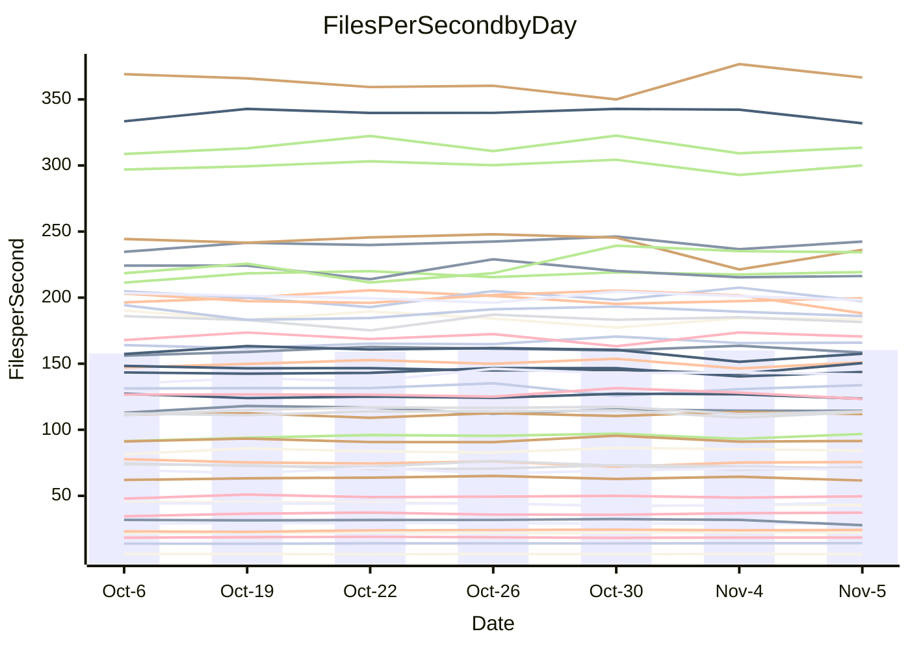

<!---
# This file is auto-generated. Do not edit.
# cspell:disable
--->
# Performance Report

## Daily Performance

## Time to Process Files

| Repository                                      | Elapsed | Min/Avg/Max           |   SD | SD Graph                |
| ----------------------------------------------- | ------: | :-------------------: | ---: | ----------------------- |
| AdaDoom3/AdaDoom3                    |    3.51 | 3.4 /   3.5 /   3.7   | 0.08 | `     ┣━┻━●╋━━┻━┫     ` |
| alexiosc/megistos                    |    7.59 | 7.3 /   8.0 /   8.7   | 0.37 | `    ┣━●┻━━╋━━┻━━┫    ` |
| apollographql/apollo-server          |    2.90 | 2.6 /   2.7 /   2.9   | 0.07 | `     ┣━┻━━╋━━┻━┫●    ` |
| aspnetboilerplate/aspnetboilerplate  |   10.27 | 10.3 /  10.5 /  10.9  | 0.20 | `    ┣━●┻━━╋━━┻━━┫    ` |
| aws-amplify/docs                     |   13.37 | 12.4 /  13.0 /  13.9  | 0.41 | `    ┣━━┻━━╋━━●━━┫    ` |
| Azure/azure-rest-api-specs           |    9.73 | 9.6 /  10.1 /  11.0   | 0.38 | `    ┣━━●━━╋━━┻━━┫    ` |
| bitjson/typescript-starter           |    1.06 | 1.0 /   1.1 /   1.1   | 0.02 | `     ┣━━●━╋━┻━━┫     ` |
| caddyserver/caddy                    |    3.70 | 3.7 /   3.8 /   4.0   | 0.09 | `    ┣━●┻━━╋━━┻━━┫    ` |
| canada-ca/open-source-logiciel-libre |    1.20 | 1.1 /   1.2 /   1.3   | 0.04 | `     ┣━┻━━╋━●┻━┫     ` |
| chef/chef                            |    5.87 | 5.7 /   6.0 /   6.4   | 0.19 | `    ┣━━┻●━╋━━┻━━┫    ` |
| dart-lang/sdk                        |   68.44 | 63.7 /  67.1 /  72.3  | 2.43 | `  ┣━━━┻━━━╋━●━┻━━━┫  ` |
| django/django                        |   15.51 | 14.9 /  15.7 /  16.7  | 0.50 | `    ┣━━┻━●╋━━┻━━┫    ` |
| eslint/eslint                        |   11.82 | 10.7 /  11.1 /  11.8  | 0.35 | `    ┣━━┻━━╋━━┻━━●    ` |
| exonum/exonum                        |    3.58 | 3.5 /   3.7 /   3.8   | 0.09 | `     ┣━●━━╋━━┻━┫     ` |
| flutter/samples                      |   16.66 | 16.0 /  16.7 /  17.5  | 0.42 | `    ┣━━┻━━●━━┻━━┫    ` |
| gitbucket/gitbucket                  |    3.86 | 3.5 /   3.7 /   3.8   | 0.10 | `    ┣━━┻━━╋━━┻━●┫    ` |
| googleapis/google-cloud-cpp          |  142.22 | 139.9 / 148.6 / 165.8 | 6.52 | `  ┣━━━●━━━╋━━━┻━━━┫  ` |
| graphql/express-graphql              |    1.16 | 1.1 /   1.2 /   1.2   | 0.03 | `     ┣━┻━●╋━━┻━┫     ` |
| graphql/graphql-js                   |    3.07 | 2.8 /   2.9 /   3.1   | 0.07 | `     ┣━┻━━╋━━┻━┫●    ` |
| graphql/graphql-relay-js             |    1.10 | 1.1 /   1.2 /   1.2   | 0.04 | `     ●━┻━━╋━━┻━┫     ` |
| graphql/graphql-spec                 |    1.31 | 1.3 /   1.4 /   1.4   | 0.03 | `     ┣●┻━━╋━━┻━┫     ` |
| iluwatar/java-design-patterns        |   13.12 | 12.8 /  13.3 /  14.4  | 0.39 | `    ┣━━┻●━╋━━┻━━┫    ` |
| ktaranov/sqlserver-kit               |    7.03 | 6.6 /   6.8 /   7.1   | 0.16 | `    ┣━━┻━━╋━━┻●━┫    ` |
| liriliri/licia                       |    4.42 | 4.1 /   4.2 /   4.4   | 0.08 | `     ┣━┻━━╋━━┻━┫●    ` |
| MartinThoma/LaTeX-examples           |    6.92 | 6.8 /   7.1 /   7.6   | 0.20 | `    ┣━━┻●━╋━━┻━━┫    ` |
| mdx-js/mdx                           |    2.08 | 1.9 /   2.0 /   2.2   | 0.08 | `     ┣━┻━━╋●━┻━┫     ` |
| microsoft/TypeScript-Website         |    5.87 | 5.5 /   5.8 /   6.1   | 0.16 | `    ┣━━┻━━╋━●┻━━┫    ` |
| MicrosoftDocs/PowerShell-Docs        |   24.75 | 23.3 /  24.0 /  25.4  | 0.60 | `   ┣━━━┻━━╋━━┻●━━┫   ` |
| neovim/nvim-lspconfig                |    4.51 | 4.3 /   4.4 /   4.7   | 0.11 | `    ┣━━┻━━╋━●┻━━┫    ` |
| pagekit/pagekit                      |    3.89 | 3.5 /   3.7 /   4.0   | 0.14 | `    ┣━━┻━━╋━━┻●━┫    ` |
| php/php-src                          |   28.45 | 25.9 /  27.1 /  30.2  | 1.09 | `   ┣━━━┻━━╋━━┻●━━┫   ` |
| plasticrake/tplink-smarthome-api     |    1.44 | 1.3 /   1.4 /   1.5   | 0.04 | `     ┣━┻━━╋━●┻━┫     ` |
| prettier/prettier                    |    7.81 | 7.2 /   7.6 /   7.9   | 0.19 | `    ┣━━┻━━╋━━┻●━┫    ` |
| pycontribs/jira                      |    1.60 | 1.5 /   1.6 /   1.7   | 0.06 | `     ┣━┻━━●━━┻━┫     ` |
| RustPython/RustPython                |    5.55 | 5.2 /   5.5 /   6.0   | 0.24 | `    ┣━━┻━━╋●━┻━━┫    ` |
| shoelace-style/shoelace              |    3.00 | 2.9 /   3.0 /   3.2   | 0.08 | `     ┣━┻━━●━━┻━┫     ` |
| slint-ui/slint                       |   14.40 | 13.1 /  13.7 /  14.4  | 0.39 | `    ┣━━┻━━╋━━┻━●┫    ` |
| SoftwareBrothers/admin-bro           |    2.71 | 2.6 /   2.7 /   2.9   | 0.07 | `     ┣━┻━━╋●━┻━┫     ` |
| sveltejs/svelte                      |   21.87 | 20.8 /  21.9 /  22.9  | 0.50 | `    ┣━━┻━━●━━┻━━┫    ` |
| TheAlgorithms/Python                 |    5.67 | 5.7 /   5.8 /   6.1   | 0.10 | `    ┣━●┻━━╋━━┻━━┫    ` |
| twbs/bootstrap                       |    1.97 | 1.8 /   1.9 /   2.0   | 0.05 | `     ┣━┻━━╋━━┻━┫●    ` |
| typescript-cheatsheets/react         |    1.42 | 1.4 /   1.5 /   1.6   | 0.07 | `     ┣━┻●━╋━━┻━┫     ` |
| typescript-eslint/typescript-eslint  |    4.31 | 4.2 /   4.3 /   4.5   | 0.08 | `     ┣━┻━━╋●━┻━┫     ` |
| vitest-dev/vitest                    |    9.70 | 9.2 /  10.0 /  10.9   | 0.52 | `    ┣━━┻●━╋━━┻━━┫    ` |
| w3c/aria-practices                   |    3.69 | 3.5 /   3.6 /   3.8   | 0.10 | `     ┣━┻━━╋━●┻━┫     ` |
| w3c/specberus                        |    2.04 | 2.0 /   2.1 /   2.3   | 0.07 | `     ┣━┻●━╋━━┻━┫     ` |
| webdeveric/webpack-assets-manifest   |    1.19 | 1.2 /   1.2 /   1.3   | 0.03 | `     ┣●┻━━╋━━┻━┫     ` |
| webpack/webpack                      |    6.65 | 5.4 /   5.6 /   5.9   | 0.13 | `       ┣━┻╋┻━┫      ●` |
| wireapp/wire-desktop                 |    1.74 | 1.4 /   1.5 /   1.7   | 0.07 | `     ┣━┻━━╋━━┻━┫    ●` |
| wireapp/wire-webapp                  |   10.84 | 10.7 /  11.2 /  12.5  | 0.49 | `    ┣━━┻●━╋━━┻━━┫    ` |

Note:
- Elapsed time is in seconds.

## Files per Second over Time

| Repository                                      | Files |    Sec |    Fps |     Rel | Trend Fps          |    N |
| ----------------------------------------------- | ----: | -----: | -----: | ------: | ------------------ | ---: |
| AdaDoom3/AdaDoom3                    |   103 |   3.51 |  29.37 |   0.54% | `█▅██▆█▆█▇▇▇▆▇▇▅▇` |   15 |
| alexiosc/megistos                    |   583 |   7.59 |  76.85 |   5.75% | `▆▆▅▇▄▄▅█▆▅▅▃▅▄▄▇` |   15 |
| apollographql/apollo-server          |   253 |   2.90 |  87.27 |  -5.19% | `▇▅▇█▆▇▄▅▆▆█▇▅▇▇▄` |   15 |
| aspnetboilerplate/aspnetboilerplate  |  2286 |  10.27 | 222.68 |   2.65% | `▅▆▆███▇▆▆█▇▆█▇▇█` |   15 |
| aws-amplify/docs                     |  2871 |  13.37 | 214.70 |  -3.04% | `▆▇▇▇▆▇▄█▇█▆▆▄▆▅▅` |   15 |
| Azure/azure-rest-api-specs           |  2365 |   9.73 | 243.06 |   1.22% | `▆█▅▇▇▆█▇█▇▇▃▅▅▆▇` |   15 |
| bitjson/typescript-starter           |    20 |   1.06 |  18.85 |   1.51% | `▆▆▆▇█▇█▇▇▆▆▆▆▅▇▇` |   15 |
| caddyserver/caddy                    |   288 |   3.70 |  77.88 |   3.37% | `██▇▆▇▆▆▇▇█▅▅█▆▆█` |   15 |
| canada-ca/open-source-logiciel-libre |     7 |   1.20 |   5.84 |  -1.90% | `█▇▇█▇▄▇██▇▆███▅▆` |   15 |
| chef/chef                            |  1191 |   5.87 | 202.88 |   1.66% | `▇▄▇▆▇█▇▆█▆▅▇▅▄█▇` |   15 |
| dart-lang/sdk                        | 10719 |  68.44 | 156.61 |  -1.76% | `▇▅▇▇██▆█▇▅▆▅▄▅▇▆` |   15 |
| django/django                        |  2877 |  15.51 | 185.49 |   1.34% | `▇▇▅▅█▄▅▇▆█▆▇▇▇▄▇` |   15 |
| eslint/eslint                        |  2098 |  11.82 | 177.46 |  -6.05% | `▇█▅▄▇▇▄▇▇▇▇▅█▆▇▄` |   15 |
| exonum/exonum                        |   421 |   3.58 | 117.52 |   2.48% | `▅▆██▇▆█▆▆▅▇▆▇▅▇█` |   15 |
| flutter/samples                      |  2400 |  16.66 | 144.06 |   0.28% | `▆▆▆▆▇▇▅█▆█▇▆▅█▅▆` |   15 |
| gitbucket/gitbucket                  |   413 |   3.86 | 106.89 |  -4.72% | `▆▅▅▅█▅▅▇▆▅▅▅█▆█▄` |   15 |
| googleapis/google-cloud-cpp          | 20949 | 142.22 | 147.30 |   4.89% | `▇▃▆▆▆▇▄▇██▇█▆▇▆█` |   15 |
| graphql/express-graphql              |    26 |   1.16 |  22.37 |   1.28% | `▄▆▆▆▆█▅▄▆▆▆▆█▇▆▆` |   15 |
| graphql/graphql-js                   |   368 |   3.07 | 119.96 |  -4.34% | `█▇█▇▅▆█▆█▅█▇█▇▇▅` |   15 |
| graphql/graphql-relay-js             |    28 |   1.10 |  25.39 |   7.38% | `▅▄▄▅▄▇▅▆▆▇▇▇▅▅▆█` |   15 |
| graphql/graphql-spec                 |    19 |   1.31 |  14.53 |   3.95% | `▇▅▅▆▆▅▇▄█▆▆▇▇▇▆█` |   15 |
| iluwatar/java-design-patterns        |  1992 |  13.12 | 151.83 |   1.35% | `▆▆▇▇▆█▇█▇▅█▄█▇▇▇` |   15 |
| ktaranov/sqlserver-kit               |   489 |   7.03 |  69.60 |  -3.28% | `█▇██▇▅▆▆▅▇▇▇▇▆▇▅` |   15 |
| liriliri/licia                       |  1437 |   4.42 | 325.33 |  -4.17% | `▅▇█▇█▇▇█▆▇▇█▇█▅▅` |   15 |
| MartinThoma/LaTeX-examples           |  1409 |   6.92 | 203.62 |   1.94% | `▇█▇█▆▇▆▄█▆█▆▇▅▆▇` |   15 |
| mdx-js/mdx                           |   141 |   2.08 |  67.77 |  -1.90% | `▆▇▄▇▆█▇▄▇▅▆▆█▇█▆` |   15 |
| microsoft/TypeScript-Website         |   761 |   5.87 | 129.57 |  -2.06% | `▅▇▆▆▇▅▇▇█▇▄▅▇█▇▆` |   15 |
| MicrosoftDocs/PowerShell-Docs        |  2708 |  24.75 | 109.41 |  -2.93% | `▇▇▇▆▆▇██▅██▄▆██▆` |   15 |
| neovim/nvim-lspconfig                |   759 |   4.51 | 168.43 |  -1.50% | `▇▅██▆▅▇▇▇▇▅▇█▇▇▆` |   15 |
| pagekit/pagekit                      |   741 |   3.89 | 190.54 |  -5.51% | `█▆▇█▄▅▅▇█▇▆█▇▆▇▅` |   15 |
| php/php-src                          |  2275 |  28.45 |  79.97 |  -5.27% | `▄█▇███▅▇▆▅██▇▇█▅` |   15 |
| plasticrake/tplink-smarthome-api     |    62 |   1.44 |  43.02 |  -2.88% | `███▆█▇█▆▅█▅▅▆▆▄▅` |   15 |
| prettier/prettier                    |  2415 |   7.81 | 309.07 |  -1.49% | `▅▆▆▆▆█▇▅▅██▅▆▆▇▆` |   15 |
| pycontribs/jira                      |    79 |   1.60 |  49.48 |   0.05% | `▆▄█▆▇▆▅▄▆█▆▆▅▄█▆` |   15 |
| RustPython/RustPython                |   693 |   5.55 | 124.81 |  -1.17% | `▆▆▆▇▆▅█▅▄██▇▆▇▃▆` |   15 |
| shoelace-style/shoelace              |   439 |   3.00 | 146.38 |  -0.17% | `▇▇▇▇▅▆▆▆▅▆▆▇▄▇█▆` |   15 |
| slint-ui/slint                       |  2561 |  14.40 | 177.87 |  -4.09% | `█▇▅▇▇█▇▅▇█▅▆▇▇▆▅` |   15 |
| SoftwareBrothers/admin-bro           |   441 |   2.71 | 162.65 |  -1.42% | `█▅▇▇▄▇▆▇▇▆█▇▆▇█▆` |   15 |
| sveltejs/svelte                      |  8036 |  21.87 | 367.39 |   0.72% | `▆▇▆▆▇▆▅▅▅▆▄█▆▆▆▆` |   15 |
| TheAlgorithms/Python                 |  1399 |   5.67 | 246.54 |   2.71% | `▇▅▇▇█▇▇█▇██▆▇▆▇█` |   15 |
| twbs/bootstrap                       |   118 |   1.97 |  59.94 |  -5.68% | `▆▅▄▇█▇▆▇█▇▆█▆▆▆▄` |   15 |
| typescript-cheatsheets/react         |    53 |   1.42 |  37.34 |   2.89% | `▃▆▆▆▆▇▆▇▄▆▆▅██▆▇` |   15 |
| typescript-eslint/typescript-eslint  |  1285 |   4.31 | 298.18 |  -0.41% | `▇▆▇▇▇█▇██▆█▇▅█▇▇` |   15 |
| vitest-dev/vitest                    |  2245 |   9.70 | 231.50 |   2.93% | `▄▅▅▆▆▄▃▃▅▆▇█▆▆█▆` |   15 |
| w3c/aria-practices                   |   414 |   3.69 | 112.10 |  -2.29% | `▅▅▆▅██▆▇▆█▇▆▅▇▅▅` |   15 |
| w3c/specberus                        |   197 |   2.04 |  96.78 |   2.22% | `▄▇▇▆▇█▇▇▇███▅███` |   15 |
| webdeveric/webpack-assets-manifest   |    55 |   1.19 |  46.14 |   4.81% | `▆▇▅▇▇▇▆█▆▆▅▆▄█▆█` |   15 |
| webpack/webpack                      |  1138 |   6.65 | 171.01 | -14.44% | `▇█▆▇▅▆▆█▇▇█▇▇▇▅ ` |   15 |
| wireapp/wire-desktop                 |    46 |   1.74 |  26.41 | -15.66% | `▆█▇▇▆▇▇▆█▇██▆▄▃▂` |   15 |
| wireapp/wire-webapp                  |  1781 |  10.84 | 164.33 |   2.84% | `▄█▇▆▇▇█▇█▆▇▇█▄██` |   15 |

## Data Throughput

| Repository                                      | Files |    Sec |     Kps |     Rel | Trend Kps          |    N |
| ----------------------------------------------- | ----: | -----: | ------: | ------: | ------------------ | ---: |
| AdaDoom3/AdaDoom3                    |   103 |   3.51 |  624.10 |   0.54% | `█▅██▆█▆█▇▇▇▆▇▇▅▇` |   15 |
| alexiosc/megistos                    |   583 |   7.59 |  603.89 |   5.75% | `▆▆▅▇▄▄▅█▆▅▅▃▅▄▄▇` |   15 |
| apollographql/apollo-server          |   253 |   2.90 |  712.95 |  -4.19% | `▇▅▆█▆▇▄▅▆▅█▇▅█▇▅` |   15 |
| aspnetboilerplate/aspnetboilerplate  |  2286 |  10.27 |  541.80 |   2.65% | `▅▆▆███▇▆▆█▇▆█▇▇█` |   15 |
| aws-amplify/docs                     |  2871 |  13.37 |  749.46 |  -3.04% | `▆▇▇▇▆▇▄█▇█▆▆▄▆▅▅` |   15 |
| Azure/azure-rest-api-specs           |  2365 |   9.73 |  659.30 |   2.29% | `▆▇▅▇▇▆█▇█▇▇▃▅▅▆▇` |   15 |
| bitjson/typescript-starter           |    20 |   1.06 |   75.39 |   1.51% | `▆▆▆▇█▇█▇▇▆▆▆▆▅▇▇` |   15 |
| caddyserver/caddy                    |   288 |   3.70 |  675.49 |   3.85% | `█▇▆▅▇▆▆▇▇█▅▅█▆▆█` |   15 |
| canada-ca/open-source-logiciel-libre |     7 |   1.20 |   48.36 |  -1.90% | `█▇▇█▇▄▇██▇▆███▅▆` |   15 |
| chef/chef                            |  1191 |   5.87 |  940.31 |   1.85% | `▇▄▇▆▆█▇▆█▆▆▇▅▅█▇` |   15 |
| dart-lang/sdk                        | 10719 |  68.44 | 1067.48 |  -1.80% | `▇▅▇▇██▆█▇▅▆▅▄▅▇▆` |   15 |
| django/django                        |  2877 |  15.51 | 1166.77 |   1.50% | `▇▇▅▅█▅▅▇▆█▆▇▇▇▄▇` |   15 |
| eslint/eslint                        |  2098 |  11.82 | 1275.40 |  -6.15% | `██▅▄▇▇▄▇▇▇▇▅█▆▇▄` |   15 |
| exonum/exonum                        |   421 |   3.58 | 1124.07 |   2.48% | `▅▆██▇▆█▆▆▅▇▆▇▅▇█` |   15 |
| flutter/samples                      |  2400 |  16.66 | 1285.58 |   0.28% | `▆▆▆▆▇▇▅█▆█▇▆▅█▅▆` |   15 |
| gitbucket/gitbucket                  |   413 |   3.86 |  485.81 |  -4.73% | `▆▅▅▅█▅▅▇▆▅▅▅█▆█▄` |   15 |
| googleapis/google-cloud-cpp          | 20949 | 142.22 | 1193.74 |   4.70% | `▇▃▆▆▆▇▄▇██▇█▆▆▆█` |   15 |
| graphql/express-graphql              |    26 |   1.16 |  102.38 |   1.28% | `▄▆▆▆▆█▅▄▆▆▆▆█▇▆▆` |   15 |
| graphql/graphql-js                   |   368 |   3.07 |  696.28 |  -3.87% | `█▇▇▇▄▆█▆█▅█▇█▇▇▅` |   15 |
| graphql/graphql-relay-js             |    28 |   1.10 |   99.76 |   7.38% | `▅▄▄▅▄▇▅▆▆▇▇▇▅▅▆█` |   15 |
| graphql/graphql-spec                 |    19 |   1.31 |  484.86 |   3.95% | `▇▅▅▆▆▅▇▄█▆▆▇▇▇▆█` |   15 |
| iluwatar/java-design-patterns        |  1992 |  13.12 |  469.28 |   1.35% | `▆▆▇▇▆█▇█▇▅█▄█▇▇▇` |   15 |
| ktaranov/sqlserver-kit               |   489 |   7.03 | 1053.98 |  -3.27% | `█▇██▇▅▆▆▅▇▇▇▇▆▇▅` |   15 |
| liriliri/licia                       |  1437 |   4.42 |  387.58 |  -4.17% | `▅▇█▇█▇▇█▆▇▇█▇█▅▅` |   15 |
| MartinThoma/LaTeX-examples           |  1409 |   6.92 |  420.54 |   1.94% | `▇█▇█▆▇▆▄█▆█▆▇▅▆▇` |   15 |
| mdx-js/mdx                           |   141 |   2.08 |  315.29 |  -1.90% | `▆▇▄▇▆█▇▄▇▅▆▆█▇█▆` |   15 |
| microsoft/TypeScript-Website         |   761 |   5.87 |  896.30 |  -2.05% | `▅▇▆▆▇▅▇▇█▇▄▅▇█▇▆` |   15 |
| MicrosoftDocs/PowerShell-Docs        |  2708 |  24.75 | 1126.16 |  -2.91% | `▇▇▇▆▆▇██▅██▄▆██▆` |   15 |
| neovim/nvim-lspconfig                |   759 |   4.51 |  281.83 |  -1.27% | `▇▅██▆▅▇▇▇▇▅▇█▇▇▆` |   15 |
| pagekit/pagekit                      |   741 |   3.89 |  397.28 |  -5.51% | `█▆▇█▄▅▅▇█▇▆█▇▆▇▅` |   15 |
| php/php-src                          |  2275 |  28.45 | 1401.61 |  -4.97% | `▃▇▇█▇█▅▇▆▅▇█▇▇█▅` |   15 |
| plasticrake/tplink-smarthome-api     |    62 |   1.44 |  232.44 |  -2.88% | `███▆█▇█▆▅█▅▅▆▆▄▅` |   15 |
| prettier/prettier                    |  2415 |   7.81 |  429.50 |  -2.03% | `▆▆▆▆▆█▇▅▅██▅▆▆▇▅` |   15 |
| pycontribs/jira                      |    79 |   1.60 |  350.72 |   0.05% | `▆▄█▆▇▆▅▄▆█▆▆▅▄█▆` |   15 |
| RustPython/RustPython                |   693 |   5.55 | 1038.50 |   2.49% | `▅▅▅▆▅▄▇▅▃▇▇█▇█▄▇` |   15 |
| shoelace-style/shoelace              |   439 |   3.00 |  707.23 |  -0.17% | `▇▇▇▇▅▆▆▆▅▆▆▇▄▇█▆` |   15 |
| slint-ui/slint                       |  2561 |  14.40 | 1095.41 |  -3.98% | `█▇▅▇▆█▇▅▇█▅▆▇█▆▅` |   15 |
| SoftwareBrothers/admin-bro           |   441 |   2.71 |  358.50 |  -1.42% | `█▅▇▇▄▇▆▇▇▆█▇▆▇█▆` |   15 |
| sveltejs/svelte                      |  8036 |  21.87 |  245.32 |   0.75% | `▆▇▅▆▇▆▅▅▅▆▄█▆▆▆▆` |   15 |
| TheAlgorithms/Python                 |  1399 |   5.67 |  627.01 |   2.72% | `▇▅▇▇█▇▇█▇██▆▇▆▇█` |   15 |
| twbs/bootstrap                       |   118 |   1.97 |  491.72 |  -5.68% | `▆▅▄▇█▇▆▇█▇▆█▆▆▆▄` |   15 |
| typescript-cheatsheets/react         |    53 |   1.42 |  276.17 |   2.89% | `▃▆▆▆▆▇▆▇▄▆▆▅██▆▇` |   15 |
| typescript-eslint/typescript-eslint  |  1285 |   4.31 | 1533.15 |  -0.39% | `▇▆▇▇▇█▇██▆█▇▅█▇▇` |   15 |
| vitest-dev/vitest                    |  2245 |   9.70 |  513.44 |   1.97% | `▄▅▅▆▆▄▃▃▅▆██▅▆█▆` |   15 |
| w3c/aria-practices                   |   414 |   3.69 | 1045.17 |  -2.29% | `▅▅▆▅██▆▇▆█▇▆▅▇▅▅` |   15 |
| w3c/specberus                        |   197 |   2.04 |  306.05 |   2.29% | `▄▇▇▆▇█▇▇▇███▅███` |   15 |
| webdeveric/webpack-assets-manifest   |    55 |   1.19 |  106.55 |   4.68% | `▇▇▅▇▇▇▆█▆▆▅▆▄█▆█` |   15 |
| webpack/webpack                      |  1138 |   6.65 |  775.84 | -14.68% | `▇█▆▇▅▆▅█▇▇█▇▇▇▅ ` |   15 |
| wireapp/wire-desktop                 |    46 |   1.74 |  147.56 | -14.70% | `▂█▇▇▆▇▇▆█▇██▇▅▄▃` |   15 |
| wireapp/wire-webapp                  |  1781 |  10.84 |  606.77 |   3.09% | `▃█▇▆▇▇█▇█▇▇▇█▄██` |   15 |

