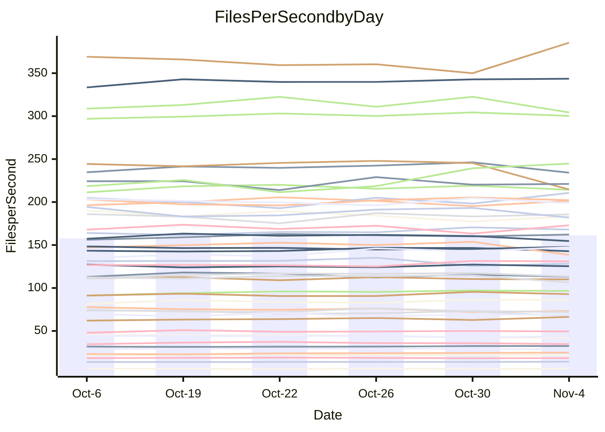

<!---
# This file is auto-generated. Do not edit.
# cspell:disable
--->
# Performance Report

## Daily Performance

## Time to Process Files

| Repository                                      | Elapsed | Min/Avg/Max           |   SD | SD Graph                |
| ----------------------------------------------- | ------: | :-------------------: | ---: | ----------------------- |
| AdaDoom3/AdaDoom3                    |    3.58 | 3.4 /   3.5 /   3.7   | 0.09 | `     ┣━┻━━╋━●┻━┫     ` |
| alexiosc/megistos                    |    8.66 | 7.3 /   7.9 /   8.5   | 0.31 | `    ┣━━┻━━╋━━┻━━┫●   ` |
| apollographql/apollo-server          |    2.72 | 2.6 /   2.7 /   2.9   | 0.08 | `     ┣━┻━●╋━━┻━┫     ` |
| aspnetboilerplate/aspnetboilerplate  |   10.67 | 10.3 /  10.6 /  10.9  | 0.22 | `    ┣━━┻━━╋●━┻━━┫    ` |
| aws-amplify/docs                     |   12.98 | 12.4 /  12.9 /  13.9  | 0.40 | `    ┣━━┻━━╋●━┻━━┫    ` |
| Azure/azure-rest-api-specs           |   11.02 | 9.6 /  10.0 /  10.7   | 0.30 | `    ┣━━┻━━╋━━┻━━┫   ●` |
| bitjson/typescript-starter           |    1.09 | 1.0 /   1.1 /   1.1   | 0.02 | `     ┣━━┻━╋━●━━┫     ` |
| caddyserver/caddy                    |    3.94 | 3.7 /   3.8 /   4.0   | 0.10 | `     ┣━┻━━╋━━┻●┫     ` |
| canada-ca/open-source-logiciel-libre |    1.16 | 1.1 /   1.2 /   1.3   | 0.03 | `     ┣━━┻●╋━┻━━┫     ` |
| chef/chef                            |    5.91 | 5.7 /   6.0 /   6.4   | 0.19 | `    ┣━━┻━●╋━━┻━━┫    ` |
| dart-lang/sdk                        |   69.32 | 63.7 /  66.3 /  70.1  | 1.99 | `   ┣━━┻━━━╋━━━┻━●┫   ` |
| django/django                        |   15.50 | 14.9 /  15.7 /  16.5  | 0.49 | `    ┣━━┻━●╋━━┻━━┫    ` |
| eslint/eslint                        |   11.54 | 10.7 /  11.1 /  11.8  | 0.36 | `    ┣━━┻━━╋━━●━━┫    ` |
| exonum/exonum                        |    3.72 | 3.5 /   3.7 /   3.8   | 0.09 | `     ┣━┻━━╋━●┻━┫     ` |
| flutter/samples                      |   16.80 | 16.2 /  16.6 /  17.2  | 0.32 | `    ┣━━┻━━╋━●┻━━┫    ` |
| gitbucket/gitbucket                  |    3.76 | 3.5 /   3.7 /   3.8   | 0.09 | `     ┣━┻━━╋━●┻━┫     ` |
| googleapis/google-cloud-cpp          |  142.02 | 139.9 / 148.7 / 165.8 | 7.22 | `  ┣━━━●━━━╋━━━┻━━━┫  ` |
| graphql/express-graphql              |    1.19 | 1.1 /   1.2 /   1.2   | 0.03 | `     ┣━━┻━╋●┻━━┫     ` |
| graphql/graphql-js                   |    2.94 | 2.8 /   2.9 /   3.1   | 0.08 | `     ┣━┻━━╋●━┻━┫     ` |
| graphql/graphql-relay-js             |    1.13 | 1.1 /   1.2 /   1.2   | 0.04 | `     ┣●┻━━╋━━┻━┫     ` |
| graphql/graphql-spec                 |    1.34 | 1.3 /   1.4 /   1.4   | 0.04 | `     ┣━┻●━╋━━┻━┫     ` |
| iluwatar/java-design-patterns        |   14.38 | 12.8 /  13.3 /  13.8  | 0.29 | `     ┣━┻━━╋━━┻━┫    ●` |
| ktaranov/sqlserver-kit               |    6.79 | 6.6 /   6.8 /   7.1   | 0.18 | `    ┣━━┻━━●━━┻━━┫    ` |
| liriliri/licia                       |    4.18 | 4.1 /   4.2 /   4.4   | 0.07 | `     ┣━┻●━╋━━┻━┫     ` |
| MartinThoma/LaTeX-examples           |    7.09 | 6.8 /   7.0 /   7.6   | 0.22 | `    ┣━━┻━━╋●━┻━━┫    ` |
| mdx-js/mdx                           |    2.05 | 2.0 /   2.1 /   2.2   | 0.08 | `     ┣━┻━●╋━━┻━┫     ` |
| microsoft/TypeScript-Website         |    5.93 | 5.6 /   5.8 /   6.1   | 0.16 | `    ┣━━┻━━╋━━●━━┫    ` |
| MicrosoftDocs/PowerShell-Docs        |   25.45 | 23.3 /  24.0 /  24.8  | 0.50 | `    ┣━━┻━━╋━━┻━━┫  ● ` |
| neovim/nvim-lspconfig                |    4.39 | 4.3 /   4.5 /   4.7   | 0.12 | `    ┣━━┻●━╋━━┻━━┫    ` |
| pagekit/pagekit                      |    3.52 | 3.5 /   3.7 /   4.0   | 0.15 | `    ┣━━●━━╋━━┻━━┫    ` |
| php/php-src                          |   26.36 | 26.3 /  27.4 /  30.2  | 1.17 | `   ┣━━━●━━╋━━┻━━━┫   ` |
| plasticrake/tplink-smarthome-api     |    1.47 | 1.3 /   1.4 /   1.5   | 0.04 | `     ┣━┻━━╋━━┻━●     ` |
| prettier/prettier                    |    7.94 | 7.2 /   7.5 /   7.8   | 0.17 | `    ┣━━┻━━╋━━┻━━┫●   ` |
| pycontribs/jira                      |    1.60 | 1.5 /   1.6 /   1.7   | 0.06 | `     ┣━┻━━●━━┻━┫     ` |
| RustPython/RustPython                |    5.29 | 5.2 /   5.4 /   5.8   | 0.21 | `    ┣━━┻●━╋━━┻━━┫    ` |
| shoelace-style/shoelace              |    2.97 | 2.9 /   3.0 /   3.1   | 0.05 | `     ┣━┻●━╋━━┻━┫     ` |
| slint-ui/slint                       |   13.97 | 13.1 /  13.7 /  14.4  | 0.44 | `    ┣━━┻━━╋━●┻━━┫    ` |
| SoftwareBrothers/admin-bro           |    2.63 | 2.6 /   2.7 /   2.9   | 0.08 | `     ┣━┻●━╋━━┻━┫     ` |
| sveltejs/svelte                      |   20.85 | 21.4 /  22.0 /  22.9  | 0.47 | `  ● ┣━━┻━━╋━━┻━━┫    ` |
| TheAlgorithms/Python                 |    5.97 | 5.7 /   5.8 /   6.1   | 0.10 | `    ┣━━┻━━╋━━┻━●┫    ` |
| twbs/bootstrap                       |    1.78 | 1.8 /   1.9 /   2.0   | 0.05 | `     ┣●┻━━╋━━┻━┫     ` |
| typescript-cheatsheets/react         |    1.53 | 1.4 /   1.5 /   1.6   | 0.06 | `     ┣━┻━━╋━●┻━┫     ` |
| typescript-eslint/typescript-eslint  |    4.28 | 4.2 /   4.3 /   4.4   | 0.06 | `     ┣━┻━━●━━┻━┫     ` |
| vitest-dev/vitest                    |    9.17 | 9.2 /  10.2 /  10.9   | 0.45 | `   ●┣━━┻━━╋━━┻━━┫    ` |
| w3c/aria-practices                   |    3.65 | 3.5 /   3.6 /   3.7   | 0.10 | `     ┣━┻━━╋━●┻━┫     ` |
| w3c/specberus                        |    2.04 | 2.0 /   2.1 /   2.3   | 0.07 | `     ┣━┻●━╋━━┻━┫     ` |
| webdeveric/webpack-assets-manifest   |    1.26 | 1.2 /   1.2 /   1.3   | 0.03 | `     ┣━━┻━╋●┻━━┫     ` |
| webpack/webpack                      |    5.63 | 5.4 /   5.6 /   5.8   | 0.12 | `    ┣━━┻━━●━━┻━━┫    ` |
| wireapp/wire-desktop                 |    1.42 | 1.4 /   1.4 /   1.5   | 0.03 | `     ┣━┻●━╋━━┻━┫     ` |
| wireapp/wire-webapp                  |   10.98 | 10.7 /  11.2 /  12.5  | 0.47 | `    ┣━━┻━●╋━━┻━━┫    ` |

Note:
- Elapsed time is in seconds.

## Files per Second over Time

| Repository                                      | Files |    Sec |    Fps |     Rel | Trend Fps      |    N |
| ----------------------------------------------- | ----: | -----: | -----: | ------: | -------------- | ---: |
| AdaDoom3/AdaDoom3                    |   103 |   3.58 |  28.79 |  -1.77% | `█▅██▆█▆█▇▇▇▆` |   11 |
| alexiosc/megistos                    |   583 |   8.66 |  67.36 |  -8.87% | `▆▆▅▆▃▄▅█▆▅▅▃` |   11 |
| apollographql/apollo-server          |   253 |   2.72 |  92.85 |   1.01% | `▇▅▇█▆▇▄▅▆▆█▇` |   11 |
| aspnetboilerplate/aspnetboilerplate  |  2286 |  10.67 | 214.34 |  -1.08% | `▅▆▆███▇▆▆█▇▆` |   11 |
| aws-amplify/docs                     |  2871 |  12.98 | 221.13 |  -0.98% | `▆▇▇▇▆▇▄█▇█▆▆` |   11 |
| Azure/azure-rest-api-specs           |  2365 |  11.02 | 214.62 | -12.36% | `▆▇▄▇▇▅█▇█▇▇▂` |   11 |
| bitjson/typescript-starter           |    20 |   1.09 |  18.34 |  -1.60% | `▆▆▅▇█▇█▇▇▅▅▆` |   11 |
| caddyserver/caddy                    |   288 |   3.94 |  73.04 |  -3.31% | `██▇▆▇▆▆▇▇█▅▅` |   11 |
| canada-ca/open-source-logiciel-libre |     7 |   1.16 |   6.04 |   1.49% | `█▇▇█▇▄▇██▇▆█` |   11 |
| chef/chef                            |  1191 |   5.91 | 201.40 |   0.56% | `▇▄▇▆▇█▇▆█▆▅▇` |   11 |
| dart-lang/sdk                        | 10719 |  69.32 | 154.63 |  -4.02% | `▇▄▇▇█▇▅█▇▅▆▅` |   11 |
| django/django                        |  2877 |  15.50 | 185.65 |   1.29% | `▇▇▅▅█▄▅▇▆█▆▇` |   11 |
| eslint/eslint                        |  2098 |  11.54 | 181.87 |  -3.54% | `██▅▅▇▇▄▇▇▇█▅` |   11 |
| exonum/exonum                        |   421 |   3.72 | 113.03 |  -1.76% | `▅▆██▇▆█▆▆▅▇▆` |   11 |
| flutter/samples                      |  2400 |  16.80 | 142.85 |  -0.97% | `▇▆▆▆▇█▅█▇██▆` |   11 |
| gitbucket/gitbucket                  |   413 |   3.76 | 109.96 |  -1.41% | `▆▅▅▅█▅▅▇▆▅▅▅` |   11 |
| googleapis/google-cloud-cpp          | 20949 | 142.02 | 147.50 |   5.28% | `▇▃▆▆▆▇▄▇██▇█` |   11 |
| graphql/express-graphql              |    26 |   1.19 |  21.85 |  -0.58% | `▄▇▆▆▇█▅▅▆▇▆▆` |   11 |
| graphql/graphql-js                   |   368 |   2.94 | 125.31 |   0.12% | `█▇█▇▅▆█▆█▅█▇` |   11 |
| graphql/graphql-relay-js             |    28 |   1.13 |  24.74 |   4.92% | `▆▅▅▅▄█▅▇▇█▇█` |   11 |
| graphql/graphql-spec                 |    19 |   1.34 |  14.20 |   1.92% | `▇▅▅▆▆▅▇▄█▆▆▇` |   11 |
| iluwatar/java-design-patterns        |  1992 |  14.38 | 138.49 |  -7.82% | `▆▆▆▇▆█▇█▇▅█▃` |   11 |
| ktaranov/sqlserver-kit               |   489 |   6.79 |  72.00 |  -0.07% | `█▇██▇▅▆▆▅▇▇▇` |   11 |
| liriliri/licia                       |  1437 |   4.18 | 343.52 |   1.11% | `▅▇█▇▇▇▇█▆▇▇█` |   11 |
| MartinThoma/LaTeX-examples           |  1409 |   7.09 | 198.80 |  -0.74% | `▇█▇█▆▇▆▄█▆█▆` |   11 |
| mdx-js/mdx                           |   141 |   2.05 |  68.87 |   0.62% | `▇▇▄▇▆█▇▄▇▆▇▇` |   11 |
| microsoft/TypeScript-Website         |   761 |   5.93 | 128.28 |  -2.78% | `▅█▆▆▇▆▇▇██▅▅` |   11 |
| MicrosoftDocs/PowerShell-Docs        |  2708 |  25.45 | 106.43 |  -5.72% | `▇▆▇▆▅▇██▅█▇▄` |   11 |
| neovim/nvim-lspconfig                |   759 |   4.39 | 172.96 |   1.50% | `▇▅██▆▅▇▇▇▇▅▇` |   11 |
| pagekit/pagekit                      |   741 |   3.52 | 210.67 |   4.94% | `█▆▇█▄▅▅▇█▇▆█` |   11 |
| php/php-src                          |  2275 |  26.36 |  86.30 |   2.86% | `▄█▇███▅▇▆▆██` |   11 |
| plasticrake/tplink-smarthome-api     |    62 |   1.47 |  42.22 |  -5.58% | `███▆█▇█▆▅█▅▄` |   11 |
| prettier/prettier                    |  2415 |   7.94 | 304.30 |  -3.16% | `▅▆▆▆▆█▇▅▅██▅` |   11 |
| pycontribs/jira                      |    79 |   1.60 |  49.38 |  -0.30% | `▆▄█▆▇▆▅▄▆█▆▆` |   11 |
| RustPython/RustPython                |   693 |   5.29 | 130.97 |   3.42% | `▆▆▅▇▆▄█▅▄██▇` |   11 |
| shoelace-style/shoelace              |   439 |   2.97 | 147.84 |   1.04% | `████▆▇█▇▅█▇█` |   11 |
| slint-ui/slint                       |  2561 |  13.97 | 183.28 |  -1.13% | `█▇▅▇▇█▇▅▇█▅▆` |   11 |
| SoftwareBrothers/admin-bro           |   441 |   2.63 | 167.92 |   2.12% | `█▅▇▇▄▇▆▇▇▆█▇` |   11 |
| sveltejs/svelte                      |  8036 |  20.85 | 385.46 |   6.38% | `▆▇▆▆▇▆▅▅▅▆▄█` |   11 |
| TheAlgorithms/Python                 |  1399 |   5.97 | 234.18 |  -2.68% | `▇▅▇▇█▇▇█▇██▆` |   11 |
| twbs/bootstrap                       |   118 |   1.78 |  66.34 |   4.34% | `▆▅▄▇█▇▆▇█▇▆█` |   11 |
| typescript-cheatsheets/react         |    53 |   1.53 |  34.75 |  -3.55% | `▃▇▇▇▇█▇█▄▆▆▅` |   11 |
| typescript-eslint/typescript-eslint  |  1285 |   4.28 | 300.27 |  -0.01% | `▇▆▇▇▇█▇██▆█▇` |   11 |
| vitest-dev/vitest                    |  2245 |   9.17 | 244.79 |  10.73% | `▄▅▅▆▆▄▃▃▅▆▇█` |   11 |
| w3c/aria-practices                   |   414 |   3.65 | 113.41 |  -1.60% | `▅▅▆▅██▆▇▆█▇▆` |   11 |
| w3c/specberus                        |   197 |   2.04 |  96.58 |   2.16% | `▄▇▇▆▇█▇▇▇███` |   11 |
| webdeveric/webpack-assets-manifest   |    55 |   1.26 |  43.80 |  -0.62% | `▆▇▅▇▇▇▆█▆▆▄▆` |   11 |
| webpack/webpack                      |  1138 |   5.63 | 202.19 |   1.03% | `▇█▆▇▅▆▆█▇▇█▇` |   11 |
| wireapp/wire-desktop                 |    46 |   1.42 |  32.47 |   2.33% | `▅█▇▆▅▇▆▅█▆▇▇` |   11 |
| wireapp/wire-webapp                  |  1781 |  10.98 | 162.13 |   1.40% | `▄█▇▆▇▇█▇█▆▇▇` |   11 |

## Data Throughput

| Repository                                      | Files |    Sec |     Kps |     Rel | Trend Kps      |    N |
| ----------------------------------------------- | ----: | -----: | ------: | ------: | -------------- | ---: |
| AdaDoom3/AdaDoom3                    |   103 |   3.58 |  611.75 |  -1.77% | `█▅██▆█▆█▇▇▇▆` |   11 |
| alexiosc/megistos                    |   583 |   8.66 |  529.27 |  -8.87% | `▆▆▅▆▃▄▅█▆▅▅▃` |   11 |
| apollographql/apollo-server          |   253 |   2.72 |  758.57 |   2.47% | `▇▅▆█▆▇▄▅▆▅█▇` |   11 |
| aspnetboilerplate/aspnetboilerplate  |  2286 |  10.67 |  521.51 |  -1.08% | `▅▆▆███▇▆▆█▇▆` |   11 |
| aws-amplify/docs                     |  2871 |  12.98 |  771.91 |  -0.98% | `▆▇▇▇▆▇▄█▇█▆▆` |   11 |
| Azure/azure-rest-api-specs           |  2365 |  11.02 |  582.16 | -11.12% | `▅▇▄▇▇▅█▇█▇▇▂` |   11 |
| bitjson/typescript-starter           |    20 |   1.09 |   73.35 |  -1.60% | `▆▆▅▇█▇█▇▇▅▅▆` |   11 |
| caddyserver/caddy                    |   288 |   3.94 |  633.55 |  -2.71% | `█▇▆▅▇▆▆▇▇█▅▅` |   11 |
| canada-ca/open-source-logiciel-libre |     7 |   1.16 |   50.05 |   1.49% | `█▇▇█▇▄▇██▇▆█` |   11 |
| chef/chef                            |  1191 |   5.91 |  933.43 |   0.83% | `▇▄▇▆▆█▇▆█▆▆▇` |   11 |
| dart-lang/sdk                        | 10719 |  69.32 | 1053.97 |  -4.07% | `▇▄▇▇█▇▅█▇▅▆▅` |   11 |
| django/django                        |  2877 |  15.50 | 1167.78 |   1.50% | `▇▇▅▅█▄▅▇▆█▆▇` |   11 |
| eslint/eslint                        |  2098 |  11.54 | 1307.06 |  -3.68% | `██▅▅▇▇▄▇▇▇█▅` |   11 |
| exonum/exonum                        |   421 |   3.72 | 1081.16 |  -1.76% | `▅▆██▇▆█▆▆▅▇▆` |   11 |
| flutter/samples                      |  2400 |  16.80 | 1274.79 |  -0.97% | `▇▆▆▆▇█▅█▇██▆` |   11 |
| gitbucket/gitbucket                  |   413 |   3.76 |  499.75 |  -1.44% | `▆▅▅▅█▅▅▇▆▅▅▅` |   11 |
| googleapis/google-cloud-cpp          | 20949 | 142.02 | 1195.41 |   5.02% | `▇▃▆▆▆▇▄▇██▇█` |   11 |
| graphql/express-graphql              |    26 |   1.19 |  100.00 |  -0.58% | `▄▇▆▆▇█▅▅▆▇▆▆` |   11 |
| graphql/graphql-js                   |   368 |   2.94 |  727.32 |   0.80% | `█▇▇▇▄▆█▆█▅█▇` |   11 |
| graphql/graphql-relay-js             |    28 |   1.13 |   97.20 |   4.92% | `▆▅▅▅▄█▅▇▇█▇█` |   11 |
| graphql/graphql-spec                 |    19 |   1.34 |  473.69 |   1.92% | `▇▅▅▆▆▅▇▄█▆▆▇` |   11 |
| iluwatar/java-design-patterns        |  1992 |  14.38 |  428.07 |  -7.82% | `▆▆▆▇▆█▇█▇▅█▃` |   11 |
| ktaranov/sqlserver-kit               |   489 |   6.79 | 1090.24 |  -0.05% | `█▇██▇▅▆▆▅▇▇▇` |   11 |
| liriliri/licia                       |  1437 |   4.18 |  409.25 |   1.11% | `▅▇█▇▇▇▇█▆▇▇█` |   11 |
| MartinThoma/LaTeX-examples           |  1409 |   7.09 |  410.59 |  -0.74% | `▇█▇█▆▇▆▄█▆█▆` |   11 |
| mdx-js/mdx                           |   141 |   2.05 |  320.40 |   0.62% | `▇▇▄▇▆█▇▄▇▆▇▇` |   11 |
| microsoft/TypeScript-Website         |   761 |   5.93 |  887.37 |  -2.76% | `▅█▆▆▇▆▇▇██▅▅` |   11 |
| MicrosoftDocs/PowerShell-Docs        |  2708 |  25.45 | 1095.42 |  -5.71% | `▇▆▇▆▅▇██▅█▇▄` |   11 |
| neovim/nvim-lspconfig                |   759 |   4.39 |  289.41 |   1.83% | `▇▅██▆▅▇▇▇▇▅▇` |   11 |
| pagekit/pagekit                      |   741 |   3.52 |  439.24 |   4.94% | `█▆▇█▄▅▅▇█▇▆█` |   11 |
| php/php-src                          |  2275 |  26.36 | 1512.46 |   3.31% | `▄█▇███▅▇▆▆██` |   11 |
| plasticrake/tplink-smarthome-api     |    62 |   1.47 |  228.11 |  -5.58% | `███▆█▇█▆▅█▅▄` |   11 |
| prettier/prettier                    |  2415 |   7.94 |  422.87 |  -3.87% | `▆▆▆▆▆█▇▅▅██▅` |   11 |
| pycontribs/jira                      |    79 |   1.60 |  350.06 |  -0.30% | `▆▄█▆▇▆▅▄▆█▆▆` |   11 |
| RustPython/RustPython                |   693 |   5.29 | 1089.72 |   8.69% | `▅▅▅▆▅▄▇▅▃▇▇█` |   11 |
| shoelace-style/shoelace              |   439 |   2.97 |  714.29 |   1.04% | `████▆▇█▇▅█▇█` |   11 |
| slint-ui/slint                       |  2561 |  13.97 | 1128.73 |  -0.98% | `█▇▅▇▆█▇▅▇█▅▆` |   11 |
| SoftwareBrothers/admin-bro           |   441 |   2.63 |  370.10 |   2.12% | `█▅▇▇▄▇▆▇▇▆█▇` |   11 |
| sveltejs/svelte                      |  8036 |  20.85 |  257.39 |   6.43% | `▆▇▅▆▇▆▅▅▅▆▄█` |   11 |
| TheAlgorithms/Python                 |  1399 |   5.97 |  595.56 |  -2.65% | `▇▅▇▇█▇▇█▇██▆` |   11 |
| twbs/bootstrap                       |   118 |   1.78 |  544.21 |   4.34% | `▆▅▄▇█▇▆▇█▇▆█` |   11 |
| typescript-cheatsheets/react         |    53 |   1.53 |  257.05 |  -3.55% | `▃▇▇▇▇█▇█▄▆▆▅` |   11 |
| typescript-eslint/typescript-eslint  |  1285 |   4.28 | 1543.85 |   0.01% | `▇▆▇▇▇█▇██▆█▇` |   11 |
| vitest-dev/vitest                    |  2245 |   9.17 |  542.90 |   9.29% | `▄▅▅▆▆▄▃▃▅▆██` |   11 |
| w3c/aria-practices                   |   414 |   3.65 | 1057.37 |  -1.60% | `▅▅▆▅██▆▇▆█▇▆` |   11 |
| w3c/specberus                        |   197 |   2.04 |  305.44 |   2.24% | `▄▇▇▆▇█▇▇▇███` |   11 |
| webdeveric/webpack-assets-manifest   |    55 |   1.26 |  101.13 |  -0.79% | `▇▇▅▇▇▇▆█▆▆▄▆` |   11 |
| webpack/webpack                      |  1138 |   5.63 |  917.31 |   0.65% | `▇█▆▇▅▆▅▇▇▇▇▇` |   11 |
| wireapp/wire-desktop                 |    46 |   1.42 |  181.39 |   3.89% | `▂█▇▇▆▇▇▆█▇██` |   11 |
| wireapp/wire-webapp                  |  1781 |  10.98 |  598.64 |   1.73% | `▃█▇▆▇▇█▇█▇▇▇` |   11 |

