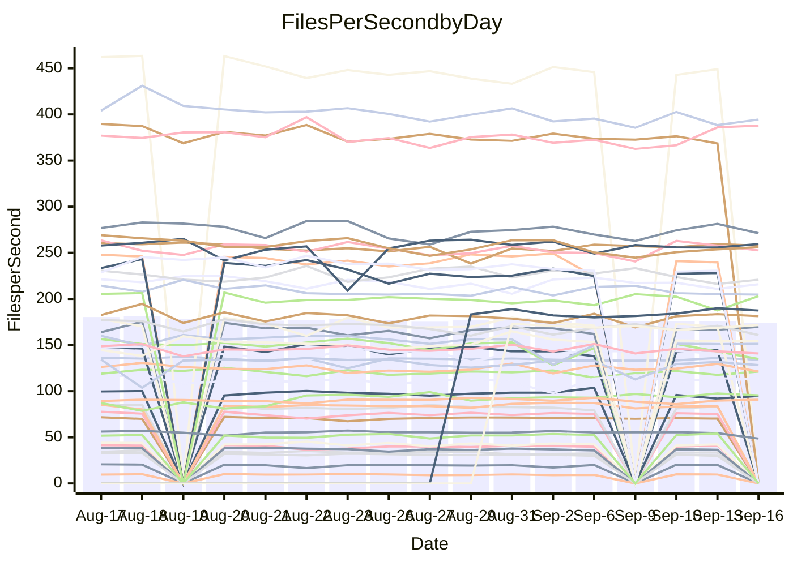

<!---
# This file is auto-generated. Do not edit.
# cspell:disable
--->
# Performance Report

## Daily Performance

## Time to Process Files

| Repository                                      | Elapsed | Min/Avg/Max           |   SD | SD Graph                |
| ----------------------------------------------- | ------: | :-------------------: | ---: | ----------------------- |
| AdaDoom3/AdaDoom3                    |    2.82 | 2.6 /   2.8 /   3.1   | 0.11 | `    ┣━━┻━━╋●━┻━━┫    ` |
| alexiosc/megistos                    |    7.03 | 6.7 /   7.1 /   7.6   | 0.25 | `    ┣━━┻━━●━━┻━━┫    ` |
| apollographql/apollo-server          |    2.06 | 1.9 /   2.1 /   2.3   | 0.06 | `     ┣━┻━●╋━━┻━┫     ` |
| aspnetboilerplate/aspnetboilerplate  |   10.62 | 10.4 /  10.8 /  12.7  | 0.39 | `    ┣━━┻━●╋━━┻━━┫    ` |
| aws-amplify/docs                     |   11.21 | 10.6 /  11.1 /  12.0  | 0.36 | `    ┣━━┻━━╋●━┻━━┫    ` |
| Azure/azure-rest-api-specs           |   13.33 | 12.4 /  13.5 /  14.8  | 0.55 | `   ┣━━━┻━●╋━━┻━━━┫   ` |
| bitjson/typescript-starter           |    0.60 | 0.6 /   0.6 /   0.7   | 0.03 | `     ┣━━┻━●━┻━━┫     ` |
| caddyserver/caddy                    |    2.89 | 2.8 /   3.1 /   3.5   | 0.22 | `    ┣━━┻●━╋━━┻━━┫    ` |
| canada-ca/open-source-logiciel-libre |    0.73 | 0.7 /   0.7 /   0.9   | 0.05 | `     ┣━┻━━●━━┻━┫     ` |
| chef/chef                            |    5.44 | 4.8 /   5.2 /   6.0   | 0.24 | `    ┣━━┻━━╋━━●━━┫    ` |
| dart-lang/sdk                        |   56.51 | 55.3 /  57.0 /  58.7  | 1.02 | `   ┣━━┻━●━╋━━━┻━━┫   ` |
| django/django                        |   13.64 | 12.5 /  13.4 /  14.4  | 0.43 | `    ┣━━┻━━╋━●┻━━┫    ` |
| eslint/eslint                        |    9.25 | 8.7 /   9.1 /  10.2   | 0.30 | `    ┣━━┻━━╋●━┻━━┫    ` |
| exonum/exonum                        |    2.97 | 2.7 /   2.9 /   3.3   | 0.11 | `    ┣━━┻━━╋●━┻━━┫    ` |
| flutter/samples                      |   13.86 | 13.7 /  14.1 /  14.5  | 0.33 | `    ┣━━┻●━╋━━┻━━┫    ` |
| gitbucket/gitbucket                  |    2.91 | 2.8 /   2.9 /   3.5   | 0.14 | `    ┣━━┻━━●━━┻━━┫    ` |
| googleapis/google-cloud-cpp          |  139.71 | 128.9 / 134.3 / 141.9 | 3.59 | `  ┣━━━┻━━━╋━━━┻━●━┫  ` |
| graphql/express-graphql              |    0.63 | 0.6 /   0.6 /   0.7   | 0.03 | `     ┣━┻━●╋━━┻━┫     ` |
| graphql/graphql-js                   |    1.96 | 1.9 /   2.0 /   2.3   | 0.09 | `    ┣━━┻━●╋━━┻━━┫    ` |
| graphql/graphql-relay-js             |    0.65 | 0.6 /   0.7 /   0.7   | 0.03 | `     ┣━┻━●╋━━┻━┫     ` |
| graphql/graphql-spec                 |    0.73 | 0.7 /   0.8 /   0.9   | 0.04 | `     ┣━┻●━╋━━┻━┫     ` |
| iluwatar/java-design-patterns        |   10.93 | 10.0 /  10.6 /  11.5  | 0.39 | `    ┣━━┻━━╋━━●━━┫    ` |
| ktaranov/sqlserver-kit               |    5.74 | 5.6 /   5.8 /   6.2   | 0.17 | `    ┣━━┻●━╋━━┻━━┫    ` |
| liriliri/licia                       |    3.17 | 3.0 /   3.2 /   3.3   | 0.08 | `    ┣━━┻━━╋●━┻━━┫    ` |
| MartinThoma/LaTeX-examples           |    6.05 | 5.8 /   6.1 /   6.8   | 0.28 | `    ┣━━┻━●╋━━┻━━┫    ` |
| mdx-js/mdx                           |    1.52 | 1.4 /   1.5 /   1.6   | 0.05 | `     ┣━┻━━╋━●┻━┫     ` |
| microsoft/TypeScript-Website         |    5.01 | 4.6 /   4.9 /   5.9   | 0.23 | `    ┣━━┻━━╋━●┻━━┫    ` |
| MicrosoftDocs/PowerShell-Docs        |   22.15 | 20.5 /  21.6 /  23.9  | 0.84 | `   ┣━━━┻━━╋━●┻━━━┫   ` |
| neovim/nvim-lspconfig                |    2.66 | 2.5 /   2.6 /   2.9   | 0.07 | `    ┣━━┻━━╋━●┻━━┫    ` |
| pagekit/pagekit                      |    3.17 | 2.8 /   3.1 /   3.4   | 0.11 | `    ┣━━┻━━╋━━●━━┫    ` |
| php/php-src                          |   24.38 | 23.2 /  24.5 /  26.1  | 0.71 | `   ┣━━━┻━●╋━━┻━━━┫   ` |
| plasticrake/tplink-smarthome-api     |    0.85 | 0.8 /   0.8 /   0.9   | 0.03 | `     ┣━┻━━╋━●┻━┫     ` |
| prettier/prettier                    |    6.00 | 5.5 /   5.8 /   6.6   | 0.20 | `    ┣━━┻━━╋━━●━━┫    ` |
| pycontribs/jira                      |    1.15 | 1.1 /   1.1 /   1.2   | 0.03 | `     ┣━┻━━╋━━●━┫     ` |
| RustPython/RustPython                |    4.60 | 3.9 /   4.2 /   6.1   | 0.37 | `    ┣━━┻━━╋━━┻●━┫    ` |
| shoelace-style/shoelace              |    2.15 | 2.1 /   2.2 /   2.5   | 0.09 | `    ┣━━┻━●╋━━┻━━┫    ` |
| SoftwareBrothers/admin-bro           |    1.94 | 1.8 /   1.9 /   2.2   | 0.09 | `     ┣━┻━━╋━●┻━┫     ` |
| sveltejs/svelte                      |   18.73 | 16.8 /  18.2 /  19.1  | 0.47 | `   ┣━━━┻━━╋━━┻●━━┫   ` |
| TheAlgorithms/Python                 |    4.96 | 4.7 /   4.9 /   5.5   | 0.19 | `    ┣━━┻━━╋●━┻━━┫    ` |
| twbs/bootstrap                       |    1.06 | 1.0 /   1.1 /   1.4   | 0.07 | `     ┣━┻━●╋━━┻━┫     ` |
| typescript-cheatsheets/react         |    0.96 | 0.9 /   1.0 /   1.5   | 0.09 | `     ┣━┻●━╋━━┻━┫     ` |
| typescript-eslint/typescript-eslint  |    3.21 | 3.1 /   3.3 /   3.6   | 0.11 | `    ┣━━●━━╋━━┻━━┫    ` |
| vitest-dev/vitest                    |    6.85 | 6.2 /   6.9 /   9.6   | 0.54 | `    ┣━━┻━━●━━┻━━┫    ` |
| w3c/aria-practices                   |    2.61 | 2.4 /   2.6 /   2.9   | 0.11 | `    ┣━━┻━●╋━━┻━━┫    ` |
| w3c/specberus                        |    1.56 | 1.5 /   1.5 /   1.9   | 0.10 | `     ┣━┻━━╋●━┻━┫     ` |
| webdeveric/webpack-assets-manifest   |    0.59 | 0.6 /   0.6 /   0.7   | 0.02 | `     ┣━━●━╋━┻━━┫     ` |
| webpack/webpack                      |    4.24 | 3.9 /   4.2 /   4.6   | 0.14 | `    ┣━━┻━━●━━┻━━┫    ` |
| wireapp/wire-desktop                 |    0.88 | 0.7 /   0.8 /   0.9   | 0.02 | `     ┣━━┻━╋━┻━━┫    ●` |
| wireapp/wire-webapp                  |    7.61 | 6.7 /   7.1 /   7.9   | 0.28 | `    ┣━━┻━━╋━━┻━━●    ` |

Note:
- Elapsed time is in seconds.

## Files per Second over Time

| Repository                                      | Files |    Sec |    Fps |     Rel | Trend Fps              |    N |
| ----------------------------------------------- | ----: | -----: | -----: | ------: | ---------------------- | ---: |
| AdaDoom3/AdaDoom3                    |   103 |   2.82 |  36.59 |  -1.78% | `█▇▇▇▅▃▄▇▆▆▆▅▆█▆▆▆▇▆▆` |   29 |
| alexiosc/megistos                    |   583 |   7.03 |  82.90 |   0.45% | `▇▆▆▅█▅▆█▇█▇▅▆▇▆▅▆▅▇▇` |   29 |
| apollographql/apollo-server          |   250 |   2.06 | 121.26 |   0.77% | `██▄█▇▇▆█▇▇▇▇█▅▇█▇▇▆█` |   32 |
| aspnetboilerplate/aspnetboilerplate  |  2739 |  10.62 | 257.83 |   1.37% | `██▆▇▇█▃▇▇█▇▇▇██▇████` |   34 |
| aws-amplify/docs                     |  2831 |  11.21 | 252.59 |  -1.10% | `▆▇▇▇▄▇▄▆█▆█▅█▆▅██▇▇▆` |   34 |
| Azure/azure-rest-api-specs           |  2417 |  13.33 | 181.34 |   1.02% | `▄▅▅█▇▇▇▇▇▅█▇▅█▅█▆▇█▇` |   34 |
| bitjson/typescript-starter           |    20 |   0.60 |  33.46 |  -0.43% | `▃█▇▇▇▇▇█▇█▇▇▃▇▅▆▆▇▇▇` |   29 |
| caddyserver/caddy                    |   276 |   2.89 |  95.52 |   5.35% | `█▇▅▆██▇▃▇▆▆█▅▆▇▆▇▇█▇` |   34 |
| canada-ca/open-source-logiciel-libre |     7 |   0.73 |   9.59 |  -0.28% | `▆▇██▇▆▇▆▃▅▇▃▇▇▅▆▇▇▇▆` |   29 |
| chef/chef                            |  1201 |   5.44 | 220.85 |  -2.21% | `▆▃▇▇▇▆▅██▄▇▆▇▆▇▅▆▅▅▅` |   34 |
| dart-lang/sdk                        |  9707 |  56.51 | 171.76 |   1.23% | `▇██▆▆▇▅▆▇▆▇`          |   10 |
| django/django                        |  2792 |  13.64 | 204.66 |  -2.09% | `█▆▆▅▆▇█▆▄█▇▇▅██▇▆▇▆▆` |   34 |
| eslint/eslint                        |  1996 |   9.25 | 215.89 |  -0.81% | `██▇▇▇▅▇▇▇▄▇█▇█▇▇█▅▇▇` |   34 |
| exonum/exonum                        |   421 |   2.97 | 141.95 |  -2.06% | `▇█▇▇▆▄▆▇▇▇▆█▆▆▆▅▆▆▇▆` |   29 |
| flutter/samples                      |  2598 |  13.86 | 187.43 |   1.46% | `▆█▅██▇▅▅▆█▅██▇`       |   13 |
| gitbucket/gitbucket                  |   411 |   2.91 | 141.09 |   0.09% | `█▇▇▇▇█▃▇▇▇▇▇▇███▇▇▇▇` |   34 |
| googleapis/google-cloud-cpp          | 19685 | 139.71 | 140.90 |  -3.34% | `▆█▇▅▅▇▅▇▇▇█▆▆█▅▆▇▆▅▅` |   34 |
| graphql/express-graphql              |    26 |   0.63 |  41.12 |   2.09% | `▇▄█▃▇▇▇▇█▇▅▇███▇▆███` |   29 |
| graphql/graphql-js                   |   333 |   1.96 | 169.73 |   2.05% | `▇▃█▇▆▇▆▄▆▆▇▇▇▇▆▆▇▅█▇` |   30 |
| graphql/graphql-relay-js             |    28 |   0.65 |  43.05 |   1.17% | `▆█▇▃▆▆█▃▆▆▇▇▄▆▇▆▇▄▅▆` |   29 |
| graphql/graphql-spec                 |    15 |   0.73 |  20.59 |   4.30% | `█▃▇▇█▆▇█▆▇▇▅▆█▄▇██▇█` |   29 |
| iluwatar/java-design-patterns        |  1838 |  10.93 | 168.12 |  -3.02% | `▅▄██▆▅▆▅▇█▄▆██▇▆▆▇▆▅` |   29 |
| ktaranov/sqlserver-kit               |   489 |   5.74 |  85.13 |   1.54% | `█▅▆▅█▆▅█▅▆▆▇███▅▆▆▆▇` |   31 |
| liriliri/licia                       |  1415 |   3.17 | 445.87 |  -0.62% | `▆▆█▇▇▆▇█▆█▆▅▆▆█▇▆▇█▇` |   29 |
| MartinThoma/LaTeX-examples           |  1407 |   6.05 | 232.52 |   1.12% | `▇█▇▇▄▃▇█▄▆▆▅█▄▇▆▆▇▆▇` |   29 |
| mdx-js/mdx                           |   144 |   1.52 |  94.80 |  -2.84% | `▆▇▇▅▆▅▅▅▇▆▆▇▆▇█▆▅▃▅▅` |   31 |
| microsoft/TypeScript-Website         |   758 |   5.01 | 151.32 |  -2.46% | `█▇██▆▆▆▇▇▇█▇▇▃▆▇▆▆▆▆` |   32 |
| MicrosoftDocs/PowerShell-Docs        |  2686 |  22.15 | 121.27 |  -2.55% | `▇▅▆▆▅▆▇▇▄██▇▃▇▆▇▆██▆` |   34 |
| neovim/nvim-lspconfig                |   357 |   2.66 | 134.05 |  -0.05% | `▇▇███▇▇█▅▇▇▇▇▇▇▇▆▇█▇` |   34 |
| pagekit/pagekit                      |   741 |   3.17 | 233.89 |  -3.70% | `▆▆▆▆▆▃▇▆▆▇█▆█▆▇▄▇▅▇▅` |   29 |
| php/php-src                          |  2211 |  24.38 |  90.67 |   0.72% | `▆▆█▆▆▇▆██▆█▅▇▇▅▄▅▅▇▆` |   34 |
| plasticrake/tplink-smarthome-api     |    62 |   0.85 |  72.70 |  -3.72% | `▇▄▄▇▄▇█▅▆▇▇▆▅▆▆▆▆▇▇▅` |   29 |
| prettier/prettier                    |  2191 |   6.00 | 364.99 |  -3.21% | `▇█▇▇▆█▇█▆▇▆███▇▇▇▇▇▆` |   33 |
| pycontribs/jira                      |    80 |   1.15 |  69.68 |  -1.51% | `▄█▆█▆█▇██▇█▇▇█▇▇█▇▇▇` |   32 |
| RustPython/RustPython                |   621 |   4.60 | 134.91 |  -9.71% | `██▇██▆▇█▇▇█▇█▂▇█▇▇▆▆` |   32 |
| shoelace-style/shoelace              |   437 |   2.15 | 203.11 |   1.84% | `▇▇██▇▇▇▇█▆▅█▇▆█▇█▇▃█` |   31 |
| SoftwareBrothers/admin-bro           |   440 |   1.94 | 226.57 |  -3.74% | `█▆██▇▇▇▅▅▇█▇▇▆▆▆▆▆▇▆` |   31 |
| sveltejs/svelte                      |  7389 |  18.73 | 394.50 |  -1.65% | `▇▇▆▅▆▅▆▆▆▆█▅▆▆▅▇▆▅▅▆` |   34 |
| TheAlgorithms/Python                 |  1345 |   4.96 | 271.22 |  -0.66% | `▇▆▆▄▇▃▇▆▆█▆█▇▆▆▇▇▇█▆` |   34 |
| twbs/bootstrap                       |   120 |   1.06 | 112.98 |   1.66% | `▇▇▄▇▆█▇██▆▇▂▆▇█▇▆▇█▇` |   33 |
| typescript-cheatsheets/react         |    53 |   0.96 |  55.01 |   6.50% | `▇▆▇▇▇▇█▅▆█▆▆▇▆▇▇▇▆▇█` |   29 |
| typescript-eslint/typescript-eslint  |  1243 |   3.21 | 387.76 |   3.43% | `▇█▆▄▇▄▆▇▆▆█▆▆▆▅▄▇▇██` |   34 |
| vitest-dev/vitest                    |  1778 |   6.85 | 259.51 |   2.19% | `▇▇▆▇▇███▇▇█▇█▇▇█▆▇▇▇` |   34 |
| w3c/aria-practices                   |   403 |   2.61 | 154.59 |   1.92% | `▅▅▅▄▃▅▄▆▄▅█▇▆▆▆▆▆▆▆▆` |   32 |
| w3c/specberus                        |   200 |   1.56 | 128.27 |  -1.77% | `███▇▆█▇▄▇▅██▇▇▄▇▇▇▇▇` |   34 |
| webdeveric/webpack-assets-manifest   |    19 |   0.59 |  32.33 |   3.20% | `▆▆███▇▆▆▇▇▆▅▇▆▆▆▆▇▃█` |   29 |
| webpack/webpack                      |  1086 |   4.24 | 256.00 |  -0.61% | `▇▆▆▇▅▆▇▆▇███▇▆▅▆▆▇▆▇` |   34 |
| wireapp/wire-desktop                 |    43 |   0.88 |  48.64 | -12.14% | `▆█▇▆▆▇▆▇▆▇▆█▇▇▇▇▇▅▇▃` |   34 |
| wireapp/wire-webapp                  |  1224 |   7.61 | 160.84 |  -5.52% | `███▇▆█▄▇▄█▇▇▄▇█▆▇█▇▅` |   34 |

## Data Throughput

| Repository                                      | Files |    Sec |     Kps |     Rel | Trend Kps              |    N |
| ----------------------------------------------- | ----: | -----: | ------: | ------: | ---------------------- | ---: |
| AdaDoom3/AdaDoom3                    |   103 |   2.82 |  777.53 |  -1.78% | `█▇▇▇▅▃▄▇▆▆▆▅▆█▆▆▆▇▆▆` |   29 |
| alexiosc/megistos                    |   583 |   7.03 |  651.36 |   0.45% | `▇▆▆▅█▅▆█▇█▇▅▆▇▆▅▆▅▇▇` |   29 |
| apollographql/apollo-server          |   250 |   2.06 |  960.86 |   0.77% | `██▄█▇▇▆█▇▇▇▇█▅▇█▇▇▆█` |   32 |
| aspnetboilerplate/aspnetboilerplate  |  2739 |  10.62 |  612.15 |   1.40% | `██▆▇▇█▃▇▇█▇▇▇██▇████` |   34 |
| aws-amplify/docs                     |  2831 |  11.21 |  839.40 |  -0.86% | `▆▇▇▇▄▇▄▆█▆█▅█▆▅██▇▇▇` |   34 |
| Azure/azure-rest-api-specs           |  2417 |  13.33 |  517.60 |   1.58% | `▄▅▅█▇▇▇▇▇▅█▇▅█▅█▆▇█▇` |   34 |
| bitjson/typescript-starter           |    20 |   0.60 |  133.85 |  -0.43% | `▃█▇▇▇▇▇█▇█▇▇▃▇▅▆▆▇▇▇` |   29 |
| caddyserver/caddy                    |   276 |   2.89 |  777.99 |   6.21% | `█▇▅▆██▇▃▇▆▆█▅▆▇▆▇▇█▇` |   34 |
| canada-ca/open-source-logiciel-libre |     7 |   0.73 |   79.42 |  -0.28% | `▆▇██▇▆▇▆▃▅▇▃▇▇▅▆▇▇▇▆` |   29 |
| chef/chef                            |  1201 |   5.44 | 1013.41 |  -3.02% | `▆▃▇▇▇▆▅██▄▇▆▇▆▇▅▆▅▅▅` |   34 |
| dart-lang/sdk                        |  9707 |  56.51 | 1244.97 |   1.10% | `▇██▆▆▇▅▆▇▆▇`          |   10 |
| django/django                        |  2792 |  13.64 | 1250.69 |  -1.93% | `█▆▆▅▆▇█▆▄█▇▇▅██▇▆▇▆▆` |   34 |
| eslint/eslint                        |  1996 |   9.25 | 1768.45 |   0.01% | `▇█▇▇▇▅▇▇▇▄▇█▇█▇▇█▆▇▇` |   34 |
| exonum/exonum                        |   421 |   2.97 | 1357.80 |  -2.06% | `▇█▇▇▆▄▆▇▇▇▆█▆▆▆▅▆▆▇▆` |   29 |
| flutter/samples                      |  2598 |  13.86 | 1406.34 |   1.48% | `▆█▅██▇▅▅▆█▅██▇`       |   13 |
| gitbucket/gitbucket                  |   411 |   2.91 |  637.50 |   0.09% | `█▇▇▇▇█▃▇▇▇▇▇▇███▇▇▇▇` |   34 |
| googleapis/google-cloud-cpp          | 19685 | 139.71 | 1004.52 |  -3.59% | `▆█▇▅▅▇▅▇▇▇█▆▆█▅▆▇▆▅▅` |   34 |
| graphql/express-graphql              |    26 |   0.63 |  188.22 |   2.09% | `▇▄█▃▇▇▇▇█▇▅▇███▇▆███` |   29 |
| graphql/graphql-js                   |   333 |   1.96 |  965.91 |   2.05% | `▇▃█▇▆▇▆▄▆▆▇▇▇▇▆▆▇▅█▇` |   30 |
| graphql/graphql-relay-js             |    28 |   0.65 |  169.12 |   1.17% | `▆█▇▃▆▆█▃▆▆▇▇▄▆▇▆▇▄▅▆` |   29 |
| graphql/graphql-spec                 |    15 |   0.73 |  756.30 |   4.30% | `█▃▇▇█▆▇█▆▇▇▅▆█▄▇██▇█` |   29 |
| iluwatar/java-design-patterns        |  1838 |  10.93 |  517.33 |  -3.02% | `▅▄██▆▅▆▅▇█▄▆██▇▆▆▇▆▅` |   29 |
| ktaranov/sqlserver-kit               |   489 |   5.74 | 1287.74 |   1.55% | `█▅▆▅█▆▅█▅▆▆▇███▅▆▆▆▇` |   31 |
| liriliri/licia                       |  1415 |   3.17 |  524.97 |  -0.62% | `▆▆█▇▇▆▇█▆█▆▅▆▆█▇▆▇█▇` |   29 |
| MartinThoma/LaTeX-examples           |  1407 |   6.05 |  480.58 |   1.12% | `▇█▇▇▄▃▇█▄▆▆▅█▄▇▆▆▇▆▇` |   29 |
| mdx-js/mdx                           |   144 |   1.52 |  433.86 |  -2.54% | `▆▇▇▅▆▅▅▅▇▆▆▇▆▇█▆▅▃▅▅` |   31 |
| microsoft/TypeScript-Website         |   758 |   5.01 | 1035.51 |  -2.71% | `█▇██▆▆▆▇▇▇█▇▇▃▆▇▆▆▆▆` |   32 |
| MicrosoftDocs/PowerShell-Docs        |  2686 |  22.15 | 1240.12 |  -2.48% | `▇▅▆▆▅▆▇▇▄██▇▃▇▆▇▆██▆` |   34 |
| neovim/nvim-lspconfig                |   357 |   2.66 |  351.46 |  -0.52% | `▇▇███▇██▅▇▇▇▇▇▇▇▆▇█▇` |   34 |
| pagekit/pagekit                      |   741 |   3.17 |  487.67 |  -3.70% | `▆▆▆▆▆▃▇▆▆▇█▆█▆▇▄▇▅▇▅` |   29 |
| php/php-src                          |  2211 |  24.38 | 1322.72 |   0.78% | `▆▆█▆▆▇▆██▅█▅▇▇▆▄▅▅▇▆` |   34 |
| plasticrake/tplink-smarthome-api     |    62 |   0.85 |  392.83 |  -3.72% | `▇▄▄▇▄▇█▅▆▇▇▆▅▆▆▆▆▇▇▅` |   29 |
| prettier/prettier                    |  2191 |   6.00 |  508.76 |  -3.17% | `▇█▇▇▆█▇█▆▇▆███▇▇▇▇▇▆` |   33 |
| pycontribs/jira                      |    80 |   1.15 |  479.95 |  -2.31% | `▄█▆█▅█▇██▇█▇▇▇▇▇█▇▇▇` |   32 |
| RustPython/RustPython                |   621 |   4.60 |  989.79 |  -9.71% | `██▇██▆▇█▇▇█▇█▂▇█▇▇▆▆` |   32 |
| shoelace-style/shoelace              |   437 |   2.15 |  958.84 |   2.09% | `▇▇██▇▇▇▇█▆▅█▇▆█▇█▇▃█` |   31 |
| SoftwareBrothers/admin-bro           |   440 |   1.94 |  499.99 |  -3.74% | `█▆██▇▇▇▅▅▇█▇▇▆▆▆▆▆▇▆` |   31 |
| sveltejs/svelte                      |  7389 |  18.73 |  284.84 |  -2.29% | `▇▇▆▅▆▅▆▆▇▆█▅▆▆▄▆▆▅▅▅` |   34 |
| TheAlgorithms/Python                 |  1345 |   4.96 |  687.22 |  -0.99% | `▇▆▆▄▇▃▇▆▆█▆█▇▆▅▇▇▇█▆` |   34 |
| twbs/bootstrap                       |   120 |   1.06 |  904.82 |   1.66% | `▇▇▄▇▆█▇██▆▇▂▆▇█▇▆▇█▇` |   33 |
| typescript-cheatsheets/react         |    53 |   0.96 |  401.69 |   6.50% | `▇▆▇▇▇▇█▅▆█▆▆▇▆▇▇▇▆▇█` |   29 |
| typescript-eslint/typescript-eslint  |  1243 |   3.21 | 1793.41 |   4.31% | `▇█▆▄▆▄▆▇▆▆▇▆▆▆▅▄▇▇██` |   34 |
| vitest-dev/vitest                    |  1778 |   6.85 |  533.17 |   1.41% | `▇▇▆▇▇███▇▇█▇█▇▇█▆▇▇▇` |   34 |
| w3c/aria-practices                   |   403 |   2.61 | 1441.18 |   2.44% | `▅▅▅▄▃▅▄▆▄▅█▇▆▆▆▆▆▆▆▆` |   32 |
| w3c/specberus                        |   200 |   1.56 |  409.18 |  -1.77% | `███▇▆█▇▄▇▅██▇▇▄▇▇▇▇▇` |   34 |
| webdeveric/webpack-assets-manifest   |    19 |   0.59 |  173.53 |   3.20% | `▆▆███▇▆▆▇▇▆▅▇▆▆▆▆▇▃█` |   29 |
| webpack/webpack                      |  1086 |   4.24 | 1111.91 |  -0.54% | `▇▆▆▇▅▆▇▆▇███▇▆▅▆▆▇▆▇` |   34 |
| wireapp/wire-desktop                 |    43 |   0.88 |  213.77 | -11.77% | `▆█▇▆▆▇▆▇▆▇▆█▇▇▇▇█▆▇▃` |   34 |
| wireapp/wire-webapp                  |  1224 |   7.61 |  680.27 |  -5.88% | `███▇▆█▄▇▄█▇▇▄▇█▆▇█▇▅` |   34 |

