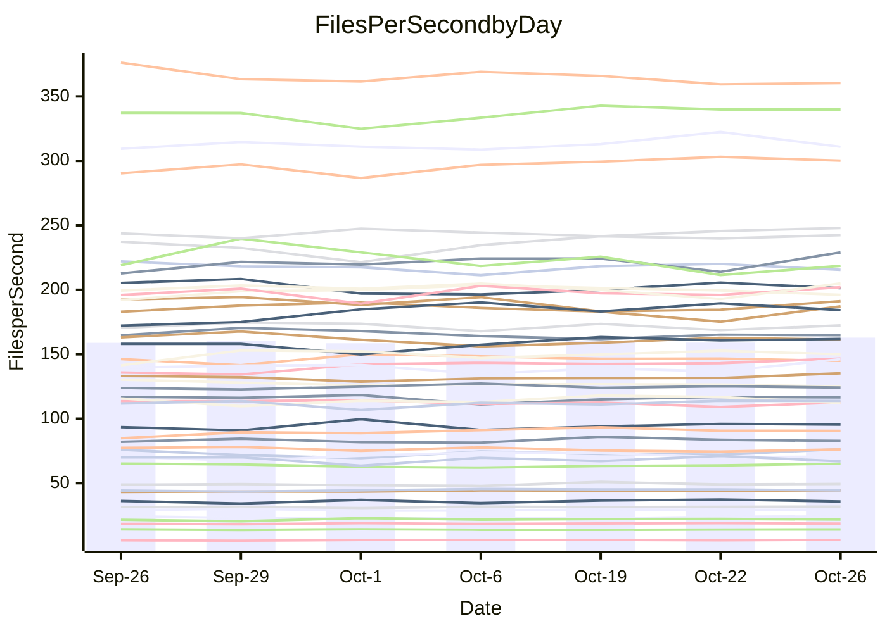

<!---
# This file is auto-generated. Do not edit.
# cspell:disable
--->
# Performance Report

## Daily Performance

## Time to Process Files

| Repository                                      | Elapsed | Min/Avg/Max           |   SD | SD Graph                |
| ----------------------------------------------- | ------: | :-------------------: | ---: | ----------------------- |
| AdaDoom3/AdaDoom3                    |    3.54 | 3.4 /   3.5 /   3.7   | 0.11 | `    ┣━━┻━━●━━┻━━┫    ` |
| alexiosc/megistos                    |    7.96 | 7.3 /   7.9 /   8.6   | 0.35 | `    ┣━━┻━━●━━┻━━┫    ` |
| apollographql/apollo-server          |    2.78 | 2.6 /   2.8 /   3.0   | 0.12 | `     ┣━┻━━●━━┻━┫     ` |
| aspnetboilerplate/aspnetboilerplate  |   10.37 | 10.2 /  10.5 /  10.9  | 0.22 | `    ┣━━┻●━╋━━┻━━┫    ` |
| aws-amplify/docs                     |   12.41 | 12.5 /  13.0 /  13.9  | 0.47 | `    ┣━●┻━━╋━━┻━━┫    ` |
| Azure/azure-rest-api-specs           |    9.92 | 9.6 /  10.0 /  10.7   | 0.27 | `    ┣━━┻━●╋━━┻━━┫    ` |
| bitjson/typescript-starter           |    1.10 | 1.0 /   1.1 /   1.1   | 0.02 | `     ┣━━┻━╋━┻●━┫     ` |
| caddyserver/caddy                    |    3.71 | 3.6 /   3.8 /   3.9   | 0.09 | `     ┣━┻●━╋━━┻━┫     ` |
| canada-ca/open-source-logiciel-libre |    1.18 | 1.1 /   1.2 /   1.3   | 0.05 | `     ┣━┻━●╋━━┻━┫     ` |
| chef/chef                            |    6.05 | 5.7 /   6.0 /   6.4   | 0.19 | `    ┣━━┻━━╋●━┻━━┫    ` |
| dart-lang/sdk                        |   68.90 | 63.7 /  66.8 /  73.2  | 2.45 | `  ┣━━━┻━━━╋━━●┻━━━┫  ` |
| django/django                        |   15.06 | 14.9 /  15.6 /  16.5  | 0.49 | `    ┣━●┻━━╋━━┻━━┫    ` |
| eslint/eslint                        |   10.98 | 10.7 /  11.1 /  11.8  | 0.37 | `    ┣━━┻━●╋━━┻━━┫    ` |
| exonum/exonum                        |    3.82 | 3.5 /   3.7 /   3.8   | 0.09 | `     ┣━┻━━╋━━┻━●     ` |
| flutter/samples                      |   16.18 | 16.2 /  17.0 /  18.6  | 0.58 | `    ┣━●┻━━╋━━┻━━┫    ` |
| gitbucket/gitbucket                  |    3.74 | 3.5 /   3.7 /   3.8   | 0.09 | `     ┣━┻━━╋━●┻━┫     ` |
| googleapis/google-cloud-cpp          |  141.23 | 139.9 / 149.0 / 165.8 | 6.30 | `  ┣━━●┻━━━╋━━━┻━━━┫  ` |
| graphql/express-graphql              |    1.16 | 1.1 /   1.2 /   1.3   | 0.04 | `     ┣━┻●━╋━━┻━┫     ` |
| graphql/graphql-js                   |    3.03 | 2.8 /   2.9 /   3.1   | 0.07 | `     ┣━┻━━╋━━┻●┫     ` |
| graphql/graphql-relay-js             |    1.14 | 1.1 /   1.2 /   1.3   | 0.04 | `     ┣●┻━━╋━━┻━┫     ` |
| graphql/graphql-spec                 |    1.36 | 1.3 /   1.4 /   1.4   | 0.04 | `     ┣━┻━━●━━┻━┫     ` |
| iluwatar/java-design-patterns        |   13.83 | 12.8 /  13.3 /  14.9  | 0.48 | `    ┣━━┻━━╋━━●━━┫    ` |
| ktaranov/sqlserver-kit               |    6.74 | 6.6 /   6.9 /   7.3   | 0.21 | `    ┣━━┻●━╋━━┻━━┫    ` |
| liriliri/licia                       |    4.21 | 4.1 /   4.3 /   4.4   | 0.09 | `    ┣━━┻●━╋━━┻━━┫    ` |
| MartinThoma/LaTeX-examples           |    7.25 | 6.8 /   7.1 /   7.6   | 0.22 | `    ┣━━┻━━╋━●┻━━┫    ` |
| mdx-js/mdx                           |    2.10 | 2.0 /   2.1 /   2.3   | 0.11 | `     ┣━┻━━╋●━┻━┫     ` |
| microsoft/TypeScript-Website         |    5.61 | 5.6 /   5.8 /   6.0   | 0.13 | `    ┣━●┻━━╋━━┻━━┫    ` |
| MicrosoftDocs/PowerShell-Docs        |   23.36 | 23.3 /  24.3 /  27.2  | 0.91 | `   ┣━━━●━━╋━━┻━━━┫   ` |
| neovim/nvim-lspconfig                |    4.43 | 4.3 /   4.4 /   4.7   | 0.10 | `    ┣━━┻━━●━━┻━━┫    ` |
| pagekit/pagekit                      |    3.66 | 3.5 /   3.7 /   4.0   | 0.13 | `    ┣━━┻━●╋━━┻━━┫    ` |
| php/php-src                          |   28.20 | 26.3 /  27.5 /  30.2  | 1.14 | `   ┣━━━┻━━╋━●┻━━━┫   ` |
| plasticrake/tplink-smarthome-api     |    1.35 | 1.4 /   1.4 /   1.5   | 0.03 | `     ┣━●━━╋━━┻━┫     ` |
| prettier/prettier                    |    7.25 | 7.1 /   7.5 /   7.8   | 0.18 | `    ┣━●┻━━╋━━┻━━┫    ` |
| pycontribs/jira                      |    1.51 | 1.5 /   1.6 /   1.7   | 0.05 | `     ●━┻━━╋━━┻━┫     ` |
| RustPython/RustPython                |    5.15 | 5.2 /   5.4 /   5.8   | 0.18 | `    ┣●━┻━━╋━━┻━━┫    ` |
| shoelace-style/shoelace              |    2.98 | 2.9 /   3.0 /   3.1   | 0.06 | `     ┣━┻━●╋━━┻━┫     ` |
| slint-ui/slint                       |   13.29 | 13.0 /  13.6 /  14.4  | 0.44 | `    ┣━━┻●━╋━━┻━━┫    ` |
| SoftwareBrothers/admin-bro           |    2.70 | 2.6 /   2.7 /   2.9   | 0.08 | `     ┣━┻━━╋●━┻━┫     ` |
| sveltejs/svelte                      |   21.78 | 20.8 /  21.8 /  22.6  | 0.47 | `    ┣━━┻━━●━━┻━━┫    ` |
| TheAlgorithms/Python                 |    5.75 | 5.7 /   5.9 /   6.6   | 0.22 | `    ┣━━┻●━╋━━┻━━┫    ` |
| twbs/bootstrap                       |    1.81 | 1.8 /   1.9 /   2.0   | 0.05 | `     ┣━┻●━╋━━┻━┫     ` |
| typescript-cheatsheets/react         |    1.47 | 1.4 /   1.5 /   1.6   | 0.06 | `     ┣━┻━━●━━┻━┫     ` |
| typescript-eslint/typescript-eslint  |    4.40 | 4.2 /   4.3 /   4.6   | 0.10 | `    ┣━━┻━━╋━●┻━━┫    ` |
| vitest-dev/vitest                    |    9.94 | 9.3 /  10.2 /  11.1   | 0.56 | `    ┣━━┻━●╋━━┻━━┫    ` |
| w3c/aria-practices                   |    3.51 | 3.5 /   3.6 /   3.7   | 0.10 | `     ┣━┻●━╋━━┻━┫     ` |
| w3c/specberus                        |    2.01 | 2.0 /   2.1 /   2.3   | 0.07 | `     ┣━●━━╋━━┻━┫     ` |
| webdeveric/webpack-assets-manifest   |    1.26 | 1.2 /   1.2 /   1.3   | 0.02 | `     ┣━━┻━╋━┻●━┫     ` |
| webpack/webpack                      |    5.61 | 5.4 /   5.7 /   6.1   | 0.17 | `    ┣━━┻━●╋━━┻━━┫    ` |
| wireapp/wire-desktop                 |    1.45 | 1.3 /   1.4 /   1.5   | 0.05 | `     ┣━┻━━╋●━┻━┫     ` |
| wireapp/wire-webapp                  |   11.26 | 10.7 /  11.2 /  12.5  | 0.46 | `    ┣━━┻━━●━━┻━━┫    ` |

Note:
- Elapsed time is in seconds.

## Files per Second over Time

| Repository                                      | Files |    Sec |    Fps |    Rel | Trend Fps         |    N |
| ----------------------------------------------- | ----: | -----: | -----: | -----: | ----------------- | ---: |
| AdaDoom3/AdaDoom3                    |   103 |   3.54 |  29.08 | -0.59% | `▄██▆▆▇▅██▆█▆▇▇▆` |   14 |
| alexiosc/megistos                    |   583 |   7.96 |  73.28 | -0.33% | `▆▆▅▄▃▆▆▅▇▃▄▅█▆▅` |   14 |
| apollographql/apollo-server          |   252 |   2.78 |  90.55 |  0.46% | `▅▃▆▇▄▇▆▇█▆▇▅▆▇▆` |   14 |
| aspnetboilerplate/aspnetboilerplate  |  2286 |  10.37 | 220.48 |  1.50% | `██▇█▆▅▆▆███▇▆▆█` |   14 |
| aws-amplify/docs                     |  2871 |  12.41 | 231.30 |  4.76% | `▆▄▇▅█▆▇▇▇▆▇▄█▇█` |   14 |
| Azure/azure-rest-api-specs           |  2448 |   9.92 | 246.78 |  0.91% | `▆▇▆▇▇▆▇▄▇▇▅█▇█▇` |   14 |
| bitjson/typescript-starter           |    20 |   1.10 |  18.17 | -2.73% | `▆▆▅▇█▆▆▅▇█▇█▇▇▅` |   14 |
| caddyserver/caddy                    |   288 |   3.71 |  77.62 |  2.09% | `█▆█▇▅█▇▆▅▇▆▅▆▆▇` |   14 |
| canada-ca/open-source-logiciel-libre |     7 |   1.18 |   5.94 |  1.02% | `▅▆▄█▆█▇▇█▇▄▇██▇` |   14 |
| chef/chef                            |  1191 |   6.05 | 196.94 | -2.37% | `█▇█▅▆▇▄▇▆▇█▇▆█▆` |   14 |
| dart-lang/sdk                        | 10696 |  68.90 | 155.24 | -2.55% | `▆▆▆▆▃▇▅▇▇██▆█▇▆` |   14 |
| django/django                        |  2877 |  15.06 | 191.02 |  3.81% | `▅▇▇▇█▇▇▅▅█▄▅▇▆█` |   14 |
| eslint/eslint                        |  2098 |  10.98 | 191.14 |  1.16% | `█▇██▅██▅▅▇▇▄▇▇▇` |   14 |
| exonum/exonum                        |   421 |   3.82 | 110.15 | -4.16% | `█▆▅▅▇▅▆██▇▆█▆▆▅` |   14 |
| flutter/samples                      |  2400 |  16.18 | 148.34 |  4.76% | `▄▇▅▇▇▇▇▆▇▇█▆█▇█` |   14 |
| gitbucket/gitbucket                  |   413 |   3.74 | 110.43 | -1.88% | `▇▆▇█▆▆▅▅▅█▅▅▇▆▅` |   14 |
| googleapis/google-cloud-cpp          | 20788 | 141.23 | 147.19 |  5.42% | `▆▆▇▆█▇▃▆▆▆▇▄▇██` |   14 |
| graphql/express-graphql              |    26 |   1.16 |  22.37 |  2.09% | `▅▇▄█▇▅▇▆▆▇█▅▅▆▇` |   14 |
| graphql/graphql-js                   |   364 |   3.03 | 120.23 | -3.79% | `▅█▆▆▇█▇█▇▅▆█▆█▅` |   14 |
| graphql/graphql-relay-js             |    28 |   1.14 |  24.67 |  5.35% | `█▇▅▇▄▆▅▅▆▅█▅▇▇█` |   14 |
| graphql/graphql-spec                 |    19 |   1.36 |  14.02 |  0.20% | `▇▇▅▇▇▇▅▅▆▆▅▇▄█▆` |   14 |
| iluwatar/java-design-patterns        |  1992 |  13.83 | 144.08 | -3.73% | `▇▃█▇█▆▆▇▇▇█▇█▇▆` |   14 |
| ktaranov/sqlserver-kit               |   489 |   6.74 |  72.53 |  1.77% | `▅▇▄▇▆█▇██▇▅▇▆▅▇` |   14 |
| liriliri/licia                       |  1437 |   4.21 | 341.29 |  1.34% | `▇▆▇▅▅▅▇█▇█▇▇█▆▇` |   14 |
| MartinThoma/LaTeX-examples           |  1409 |   7.25 | 194.36 | -2.36% | `▆▅▆▆█▇█▇█▆▇▆▄█▆` |   14 |
| mdx-js/mdx                           |   141 |   2.10 |  67.14 | -1.46% | `█▇▇▃▆▇▇▅▇▆█▇▅▇▆` |   14 |
| microsoft/TypeScript-Website         |   761 |   5.61 | 135.72 |  2.92% | `▆█▇▅▆▅█▆▆▇▅▇▇██` |   14 |
| MicrosoftDocs/PowerShell-Docs        |  2708 |  23.36 | 115.92 |  3.90% | `▇▇▇█▃▇▇▇▆▆▇██▆█` |   14 |
| neovim/nvim-lspconfig                |   759 |   4.43 | 171.52 | -0.05% | `▆▇█▇█▇▅██▆▅▇▇▇▇` |   14 |
| pagekit/pagekit                      |   741 |   3.66 | 202.41 |  0.80% | `▆▆▇▆▆█▆▇█▄▅▅▇█▇` |   14 |
| php/php-src                          |  2289 |  28.20 |  81.17 | -2.68% | `▇▅▇▅▇▄█▇███▅▇▆▆` |   14 |
| plasticrake/tplink-smarthome-api     |    62 |   1.35 |  46.06 |  3.29% | `█▅▅▇▆▇██▆█▆█▆▅█` |   14 |
| prettier/prettier                    |  2363 |   7.25 | 325.99 |  4.59% | `▄█▇▆▆▆▆▆▇▇█▇▅▅█` |   14 |
| pycontribs/jira                      |    79 |   1.51 |  52.25 |  6.58% | `▅▆▆▅▅▆▄█▆▇▆▅▄▆█` |   14 |
| RustPython/RustPython                |   688 |   5.15 | 133.49 |  5.67% | `█▆▇▅▇▆▆▅▇▆▄█▅▄█` |   14 |
| shoelace-style/shoelace              |   439 |   2.98 | 147.12 |  0.42% | `▆▇▅█▇▇▇▇▇▆▇▇▇▅▇` |   14 |
| slint-ui/slint                       |  2539 |  13.29 | 191.07 |  4.49% | `▅▄▅▇▇█▇▅▇▇█▇▅▇█` |   14 |
| SoftwareBrothers/admin-bro           |   441 |   2.70 | 163.35 | -1.03% | `▆▇█▇██▅▇▇▄▇▆▇▇▆` |   14 |
| sveltejs/svelte                      |  7982 |  21.78 | 366.50 |  0.45% | `█▇▆▅▆▆▇▆▆▇▆▅▅▅▆` |   14 |
| TheAlgorithms/Python                 |  1399 |   5.75 | 243.49 |  3.09% | `▇▇▆▆▃▇▆█▇██▇█▇█` |   14 |
| twbs/bootstrap                       |   118 |   1.81 |  65.11 |  2.22% | `▇█▇▅▇▆▅▄▇█▇▆▇█▇` |   14 |
| typescript-cheatsheets/react         |    53 |   1.47 |  35.96 | -0.36% | `▆▇▅▇▇▃▇▇▇▇█▇█▄▆` |   14 |
| typescript-eslint/typescript-eslint  |  1285 |   4.40 | 292.15 | -1.64% | `▅▇▇▅▅▇▆▇▇▇█▇██▆` |   14 |
| vitest-dev/vitest                    |  2261 |   9.94 | 227.46 |  2.69% | `▃███▆▅▆▆▇▆▅▄▄▆▇` |   14 |
| w3c/aria-practices                   |   414 |   3.51 | 118.09 |  2.10% | `█▆▇██▅▅▆▅██▆▇▆█` |   14 |
| w3c/specberus                        |   197 |   2.01 |  97.81 |  3.57% | `▅▆▅▇█▃▆▆▅▆▇▆▆▆▇` |   14 |
| webdeveric/webpack-assets-manifest   |    55 |   1.26 |  43.49 | -1.06% | `▅▅▅▅▅▆▇▅▇▆▇▅█▆▅` |   14 |
| webpack/webpack                      |  1127 |   5.61 | 200.87 |  1.65% | `▆▇▇▄▆▇█▆█▆▇▆█▇▇` |   14 |
| wireapp/wire-desktop                 |    46 |   1.45 |  31.82 |  1.09% | `▅▇▆▄▅▅█▇▆▅▇▆▅█▇` |   14 |
| wireapp/wire-webapp                  |  1781 |  11.26 | 158.24 | -1.84% | `█▆█▇▆▄▇▆▅▇▆▇▆▇▆` |   14 |

## Data Throughput

| Repository                                      | Files |    Sec |     Kps |    Rel | Trend Kps         |    N |
| ----------------------------------------------- | ----: | -----: | ------: | -----: | ----------------- | ---: |
| AdaDoom3/AdaDoom3                    |   103 |   3.54 |  618.09 | -0.59% | `▄██▆▆▇▅██▆█▆▇▇▆` |   14 |
| alexiosc/megistos                    |   583 |   7.96 |  575.77 | -0.33% | `▆▆▅▄▃▆▆▅▇▃▄▅█▆▅` |   14 |
| apollographql/apollo-server          |   252 |   2.78 |  728.38 |  0.46% | `▅▃▆▇▄▇▆▇█▆▇▅▆▇▆` |   14 |
| aspnetboilerplate/aspnetboilerplate  |  2286 |  10.37 |  536.44 |  1.50% | `██▇█▆▅▆▆███▇▆▆█` |   14 |
| aws-amplify/docs                     |  2871 |  12.41 |  807.42 |  4.75% | `▆▄▇▅█▆▇▇▇▆▇▄█▇█` |   14 |
| Azure/azure-rest-api-specs           |  2448 |   9.92 |  661.21 |  1.67% | `▅▆▅▇▆▅▇▄▇▇▅█▇█▇` |   14 |
| bitjson/typescript-starter           |    20 |   1.10 |   72.66 | -2.73% | `▆▆▅▇█▆▆▅▇█▇█▇▇▅` |   14 |
| caddyserver/caddy                    |   288 |   3.71 |  673.20 |  3.13% | `█▆█▇▅█▇▆▅▇▆▆▇▇█` |   14 |
| canada-ca/open-source-logiciel-libre |     7 |   1.18 |   49.23 |  1.02% | `▅▆▄█▆█▇▇█▇▄▇██▇` |   14 |
| chef/chef                            |  1191 |   6.05 |  911.76 | -2.14% | `█▇█▅▆▇▄▇▆▆█▇▆█▆` |   14 |
| dart-lang/sdk                        | 10696 |  68.90 | 1057.20 | -2.94% | `▆▆▆▆▃▇▅▇▇██▆█▇▆` |   14 |
| django/django                        |  2877 |  15.06 | 1200.47 |  4.03% | `▅▇▇▇█▇▇▅▅█▄▅▇▆█` |   14 |
| eslint/eslint                        |  2098 |  10.98 | 1373.88 |  1.01% | `█▇██▅██▅▅▇▇▄▇▇▇` |   14 |
| exonum/exonum                        |   421 |   3.82 | 1053.61 | -4.16% | `█▆▅▅▇▅▆██▇▆█▆▆▅` |   14 |
| flutter/samples                      |  2400 |  16.18 | 1323.73 |  4.76% | `▄▇▅▇▇▇▇▆▇▇█▆█▇█` |   14 |
| gitbucket/gitbucket                  |   413 |   3.74 |  501.89 | -1.91% | `▇▆▇█▆▆▅▅▅█▅▅▇▆▅` |   14 |
| googleapis/google-cloud-cpp          | 20788 | 141.23 | 1196.10 |  5.49% | `▆▆▇▆▇▇▃▆▆▆▇▄▇██` |   14 |
| graphql/express-graphql              |    26 |   1.16 |  102.39 |  2.09% | `▅▇▄█▇▅▇▆▆▇█▅▅▆▇` |   14 |
| graphql/graphql-js                   |   364 |   3.03 |  694.93 | -3.39% | `▅▇▆▆▇█▇▇▇▄▆█▆█▅` |   14 |
| graphql/graphql-relay-js             |    28 |   1.14 |   96.91 |  5.35% | `█▇▅▇▄▆▅▅▆▅█▅▇▇█` |   14 |
| graphql/graphql-spec                 |    19 |   1.36 |  467.82 |  0.20% | `▇▇▅▇▇▇▅▅▆▆▅▇▄█▆` |   14 |
| iluwatar/java-design-patterns        |  1992 |  13.83 |  445.32 | -3.73% | `▇▃█▇█▆▆▇▇▇█▇█▇▆` |   14 |
| ktaranov/sqlserver-kit               |   489 |   6.74 | 1098.19 |  1.77% | `▅▇▄▇▆█▇██▇▅▇▆▅▇` |   14 |
| liriliri/licia                       |  1437 |   4.21 |  406.60 |  1.34% | `▇▆▇▅▅▅▇█▇█▇▇█▆▇` |   14 |
| MartinThoma/LaTeX-examples           |  1409 |   7.25 |  401.40 | -2.36% | `▆▅▆▆█▇█▇█▆▇▆▄█▆` |   14 |
| mdx-js/mdx                           |   141 |   2.10 |  312.35 | -1.46% | `█▇▇▃▆▇▇▅▇▆█▇▅▇▆` |   14 |
| microsoft/TypeScript-Website         |   761 |   5.61 |  938.65 |  2.92% | `▆█▇▅▆▅█▆▆▇▅▇▇██` |   14 |
| MicrosoftDocs/PowerShell-Docs        |  2708 |  23.36 | 1193.07 |  3.92% | `▇▇▇▇▃▇▇▇▆▆▇██▆█` |   14 |
| neovim/nvim-lspconfig                |   759 |   4.43 |  286.32 |  0.25% | `▆▇▇▇█▇▅██▆▅▇▇▇▇` |   14 |
| pagekit/pagekit                      |   741 |   3.66 |  422.03 |  0.80% | `▆▆▇▆▆█▆▇█▄▅▅▇█▇` |   14 |
| php/php-src                          |  2289 |  28.20 | 1417.68 | -2.43% | `▇▅▇▅▇▄█▇███▅▇▆▆` |   14 |
| plasticrake/tplink-smarthome-api     |    62 |   1.35 |  248.87 |  3.29% | `█▅▅▇▆▇██▆█▆█▆▅█` |   14 |
| prettier/prettier                    |  2363 |   7.25 |  456.08 |  4.31% | `▄█▇▆▆▆▆▆▇▇█▇▅▅█` |   14 |
| pycontribs/jira                      |    79 |   1.51 |  370.41 |  6.58% | `▅▆▆▅▅▆▄█▆▇▆▅▄▆█` |   14 |
| RustPython/RustPython                |   688 |   5.15 | 1057.44 |  5.89% | `█▆▆▅▇▆▆▅▇▆▄█▅▄█` |   14 |
| shoelace-style/shoelace              |   439 |   2.98 |  710.82 |  0.42% | `▆▇▅█▇▇▇▇▇▆▇▇▇▅▇` |   14 |
| slint-ui/slint                       |  2539 |  13.29 | 1176.08 |  3.72% | `▇▆▄▇▇█▇▅▇▇█▇▅▇█` |   14 |
| SoftwareBrothers/admin-bro           |   441 |   2.70 |  360.03 | -1.03% | `▆▇█▇██▅▇▇▄▇▆▇▇▆` |   14 |
| sveltejs/svelte                      |  7982 |  21.78 |  244.59 |  0.34% | `█▇▆▅▆▆▇▆▆▇▆▅▅▅▆` |   14 |
| TheAlgorithms/Python                 |  1399 |   5.75 |  619.27 |  3.12% | `▇▇▆▆▃▇▆█▇██▇█▇█` |   14 |
| twbs/bootstrap                       |   118 |   1.81 |  534.15 |  2.22% | `▇█▇▅▇▆▅▄▇█▇▆▇█▇` |   14 |
| typescript-cheatsheets/react         |    53 |   1.47 |  265.97 | -0.36% | `▆▇▅▇▇▃▇▇▇▇█▇█▄▆` |   14 |
| typescript-eslint/typescript-eslint  |  1285 |   4.40 | 1502.11 | -1.49% | `▄▇▇▅▅▇▆▇▇▇█▇██▆` |   14 |
| vitest-dev/vitest                    |  2261 |   9.94 |  512.05 |  2.59% | `▃███▆▅▆▅▇▆▅▄▄▅▆` |   14 |
| w3c/aria-practices                   |   414 |   3.51 | 1101.02 |  2.10% | `█▆▇██▅▅▆▅██▆▇▆█` |   14 |
| w3c/specberus                        |   197 |   2.01 |  309.33 |  3.89% | `▅▆▅▇█▃▆▆▆▆▇▆▆▆▇` |   14 |
| webdeveric/webpack-assets-manifest   |    55 |   1.26 |  100.43 | -1.83% | `▆▆▆▆▆▇▇▅▇▆▇▅█▅▅` |   14 |
| webpack/webpack                      |  1127 |   5.61 |  913.79 |  1.51% | `▅▇▇▄▆▇█▆█▆▆▆█▇▇` |   14 |
| wireapp/wire-desktop                 |    46 |   1.45 |  177.76 |  9.01% | `▃▃▃▂▃▂█▇▇▆▇▇▆█▇` |   14 |
| wireapp/wire-webapp                  |  1781 |  11.26 |  584.09 | -0.65% | `█▅█▇▆▃█▇▆▇▇█▇█▇` |   14 |

