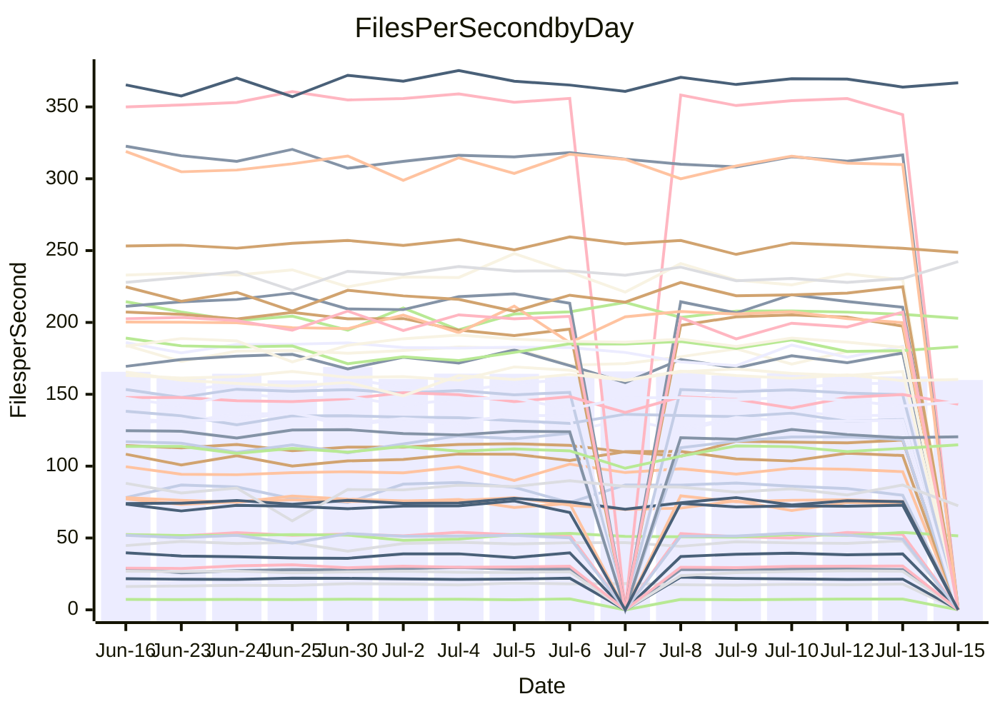

<!---
# This file is auto-generated. Do not edit.
# cspell:disable
--->
# Performance Report

## Daily Performance

## Time to Process Files

| Repository                                      | Elapsed | Min/Avg/Max           |   SD | SD Graph                |
| ----------------------------------------------- | ------: | :-------------------: | ---: | ----------------------- |
| AdaDoom3/AdaDoom3                    |    3.45 | 3.3 /   3.4 /   3.7   | 0.09 | `    ┣━━┻━━●━━┻━━┫    ` |
| alexiosc/megistos                    |    7.71 | 7.3 /   7.7 /   8.6   | 0.27 | `    ┣━━┻━━●━━┻━━┫    ` |
| apollographql/apollo-server          |    2.57 | 2.5 /   2.6 /   3.0   | 0.12 | `    ┣━━┻●━╋━━┻━━┫    ` |
| aspnetboilerplate/aspnetboilerplate  |   10.39 | 10.2 /  10.6 /  11.1  | 0.28 | `    ┣━━┻●━╋━━┻━━┫    ` |
| aws-amplify/docs                     |   12.72 | 12.6 /  13.1 /  13.9  | 0.33 | `    ┣━●┻━━╋━━┻━━┫    ` |
| Azure/azure-rest-api-specs           |    9.69 | 9.1 /   9.5 /  10.0   | 0.21 | `    ┣━━┻━━╋━━●━━┫    ` |
| bitjson/typescript-starter           |    0.92 | 0.9 /   0.9 /   1.0   | 0.04 | `     ┣━┻━●╋━━┻━┫     ` |
| caddyserver/caddy                    |    4.00 | 3.5 /   3.8 /   4.5   | 0.21 | `    ┣━━┻━━╋━━●━━┫    ` |
| canada-ca/open-source-logiciel-libre |    0.92 | 0.9 /   1.0 /   1.1   | 0.04 | `     ┣━●━━╋━━┻━┫     ` |
| chef/chef                            |    5.77 | 5.6 /   6.0 /   6.5   | 0.21 | `    ┣━━●━━╋━━┻━━┫    ` |
| dart-lang/sdk                        |   66.79 | 61.1 /  66.9 /  77.1  | 2.91 | `  ┣━━━┻━━━●━━━┻━━━┫  ` |
| django/django                        |   15.55 | 15.0 /  15.7 /  17.8  | 0.66 | `   ┣━━━┻━●╋━━┻━━━┫   ` |
| eslint/eslint                        |   11.63 | 10.9 /  11.1 /  12.0  | 0.23 | `    ┣━━┻━━╋━━┻━━●    ` |
| exonum/exonum                        |    3.74 | 3.4 /   3.6 /   4.5   | 0.24 | `    ┣━━┻━━╋━●┻━━┫    ` |
| flutter/samples                      |   17.13 | 17.5 /  18.1 /  19.3  | 0.48 | `   ●━━━┻━━╋━━┻━━━┫   ` |
| gitbucket/gitbucket                  |    3.60 | 3.3 /   3.6 /   3.9   | 0.11 | `    ┣━━┻━━●━━┻━━┫    ` |
| googleapis/google-cloud-cpp          |  142.00 | 134.4 / 140.8 / 152.7 | 4.31 | `  ┣━━━┻━━━╋●━━┻━━━┫  ` |
| graphql/express-graphql              |    0.96 | 0.9 /   1.0 /   1.1   | 0.03 | `     ┣━┻●━╋━━┻━┫     ` |
| graphql/graphql-js                   |    2.68 | 2.6 /   2.7 /   3.0   | 0.10 | `    ┣━━┻●━╋━━┻━━┫    ` |
| graphql/graphql-relay-js             |    0.99 | 0.9 /   1.0 /   1.1   | 0.05 | `     ┣━┻━●╋━━┻━┫     ` |
| graphql/graphql-spec                 |    0.89 | 0.9 /   0.9 /   1.0   | 0.03 | `     ┣━┻━●╋━━┻━┫     ` |
| iluwatar/java-design-patterns        |   13.12 | 12.8 /  13.2 /  13.9  | 0.31 | `    ┣━━┻━●╋━━┻━━┫    ` |
| ktaranov/sqlserver-kit               |    6.71 | 6.5 /   6.8 /   7.7   | 0.25 | `    ┣━━┻━●╋━━┻━━┫    ` |
| liriliri/licia                       |    4.04 | 3.9 /   4.1 /   4.4   | 0.10 | `    ┣━━┻━●╋━━┻━━┫    ` |
| MartinThoma/LaTeX-examples           |    6.62 | 6.7 /   7.1 /   7.5   | 0.22 | `    ●━━┻━━╋━━┻━━┫    ` |
| mdx-js/mdx                           |    1.91 | 1.8 /   1.9 /   2.0   | 0.06 | `     ┣━┻━━╋━●┻━┫     ` |
| microsoft/TypeScript-Website         |    5.74 | 5.6 /   5.8 /   6.0   | 0.13 | `    ┣━━┻━━●━━┻━━┫    ` |
| MicrosoftDocs/PowerShell-Docs        |   23.58 | 22.9 /  24.4 /  27.5  | 0.87 | `   ┣━━━●━━╋━━┻━━━┫   ` |
| neovim/nvim-lspconfig                |    4.20 | 4.1 /   4.3 /   4.7   | 0.16 | `    ┣━━┻●━╋━━┻━━┫    ` |
| pagekit/pagekit                      |    3.63 | 3.6 /   3.7 /   3.9   | 0.09 | `    ┣━━┻━●╋━━┻━━┫    ` |
| php/php-src                          |   31.49 | 25.3 /  27.5 /  36.8  | 2.35 | `   ┣━━┻━━━╋━━━┻━●┫   ` |
| plasticrake/tplink-smarthome-api     |    1.19 | 1.1 /   1.2 /   1.3   | 0.03 | `     ┣━┻━━●━━┻━┫     ` |
| prettier/prettier                    |    7.12 | 7.1 /   7.3 /   7.7   | 0.16 | `    ┣━━●━━╋━━┻━━┫    ` |
| pycontribs/jira                      |    1.62 | 1.5 /   1.5 /   1.7   | 0.06 | `     ┣━┻━━╋━━●━┫     ` |
| RustPython/RustPython                |    5.20 | 4.9 /   5.1 /   5.5   | 0.13 | `    ┣━━┻━━╋━●┻━━┫    ` |
| shoelace-style/shoelace              |    2.69 | 2.7 /   2.8 /   3.0   | 0.09 | `    ┣●━┻━━╋━━┻━━┫    ` |
| slint-ui/slint                       |   11.74 | 11.4 /  12.1 /  13.5  | 0.50 | `    ┣━━┻●━╋━━┻━━┫    ` |
| SoftwareBrothers/admin-bro           |    2.43 | 2.4 /   2.5 /   2.7   | 0.08 | `     ┣━┻●━╋━━┻━┫     ` |
| sveltejs/svelte                      |   20.71 | 19.5 /  20.6 /  21.7  | 0.52 | `   ┣━━━┻━━╋●━┻━━━┫   ` |
| TheAlgorithms/Python                 |    5.91 | 5.6 /   6.0 /   6.3   | 0.18 | `    ┣━━┻━●╋━━┻━━┫    ` |
| twbs/bootstrap                       |    1.60 | 1.3 /   1.4 /   1.7   | 0.09 | `     ┣━┻━━╋━━┻━┫●    ` |
| typescript-cheatsheets/react         |    1.34 | 1.3 /   1.4 /   1.6   | 0.06 | `     ┣━┻●━╋━━┻━┫     ` |
| typescript-eslint/typescript-eslint  |    4.21 | 4.0 /   4.1 /   4.3   | 0.11 | `    ┣━━┻━━╋━━●━━┫    ` |
| vitest-dev/vitest                    |    8.83 | 8.8 /   9.2 /   9.7   | 0.25 | `    ┣━●┻━━╋━━┻━━┫    ` |
| w3c/aria-practices                   |    3.40 | 3.1 /   3.3 /   3.8   | 0.13 | `    ┣━━┻━━╋━●┻━━┫    ` |
| w3c/specberus                        |    1.93 | 1.8 /   1.9 /   2.1   | 0.07 | `     ┣━┻━━╋●━┻━┫     ` |
| webdeveric/webpack-assets-manifest   |    1.05 | 1.0 /   1.0 /   1.2   | 0.04 | `     ┣━┻━━●━━┻━┫     ` |
| webpack/webpack                      |    5.47 | 5.1 /   5.4 /   6.0   | 0.19 | `    ┣━━┻━━╋━●┻━━┫    ` |
| wireapp/wire-desktop                 |    0.88 | 0.9 /   0.9 /   1.1   | 0.04 | `     ┣━●━━╋━━┻━┫     ` |
| wireapp/wire-webapp                  |   10.46 | 10.7 /  11.1 /  12.0  | 0.27 | `   ●┣━━┻━━╋━━┻━━┫    ` |

Note:
- Elapsed time is in seconds.

## Files per Second over Time

| Repository                                      | Files |    Sec |    Fps |     Rel | Trend Fps              |    N |
| ----------------------------------------------- | ----: | -----: | -----: | ------: | ---------------------- | ---: |
| AdaDoom3/AdaDoom3                    |   103 |   3.45 |  29.88 |  -0.44% | `█▅█▆▆▆▆▇▆▆▅▇▇▇▇▇▆▇█▆` |   26 |
| alexiosc/megistos                    |   583 |   7.71 |  75.63 |   0.13% | `▇▇▅█▇▇▅▆█▇▆▆█▇▇▆▇▇▆▇` |   26 |
| apollographql/apollo-server          |   252 |   2.57 |  97.95 |   1.76% | `▇▇▅█▇▅█▆▇▇▅▇▇▇▇▇▇▅▇▇` |   28 |
| aspnetboilerplate/aspnetboilerplate  |  2259 |  10.39 | 217.48 |   1.81% | `▇▅▆▅█▆█▆▇▆▅▇█▆▆█▆▆▄▇` |   27 |
| aws-amplify/docs                     |  2871 |  12.72 | 225.64 |   3.09% | `▇▇▆▅▇▄▇▆██▅▇▇▇█▆▇█▇█` |   28 |
| Azure/azure-rest-api-specs           |  2411 |   9.69 | 248.72 |  -1.96% | `▆▆▇▇▆▇▇▇▄▆▅█▆▅▇█▅▇▆▆` |   29 |
| bitjson/typescript-starter           |    20 |   0.92 |  21.66 |   0.83% | `▇▇▇▆▇▄▆▇█▆█▆▇▆▄▇▆█▄▇` |   26 |
| caddyserver/caddy                    |   285 |   4.00 |  71.33 |  -4.80% | `▇█▅█▆▇▆▅▅▇▆▃▆█▆▆▄▅█▅` |   28 |
| canada-ca/open-source-logiciel-libre |     7 |   0.92 |   7.57 |   3.97% | `▅▅▅▅▆▅▄▆▅▅▄▅▅▅█▆▅▆▅▆` |   26 |
| chef/chef                            |  1206 |   5.77 | 208.96 |   4.10% | `▄▇▇▅▄█▄▇▇▇▆▆█▇▇▄▇▅▅▇` |   28 |
| dart-lang/sdk                        | 10708 |  66.79 | 160.32 |   0.11% | `▃▆▇▆▆▆▆▇▇▆▅▇█▆▆▅▆▅▅▆` |   29 |
| django/django                        |  2847 |  15.55 | 183.10 |   1.13% | `█▅▄▇▇████▆██▇▇▇▆█▆▇▇` |   29 |
| eslint/eslint                        |  2080 |  11.63 | 178.86 |  -4.08% | `▆▇████▇▇█▆▇▇█▇▇▇▇▇▇▅` |   28 |
| exonum/exonum                        |   421 |   3.74 | 112.47 |  -4.00% | `▆▅▇▆▇█▇█▆█▆▇█▇█▆███▆` |   26 |
| flutter/samples                      |  2452 |  17.13 | 143.16 |  -2.57% | `██▇█▆▇▄▇▆█▅▆▆██▆▇██▆` |   28 |
| gitbucket/gitbucket                  |   412 |   3.60 | 114.39 |  -0.26% | `▅▄▆▆▅▆▅▄▃▆▆▆▇▆▅▇▆█▆▅` |   28 |
| googleapis/google-cloud-cpp          | 20560 | 142.00 | 144.79 |  -0.58% | `▆▆█▆▇▅▇▇▇▇▇██▆█▆▅▇▅▇` |   28 |
| graphql/express-graphql              |    26 |   0.96 |  27.13 |   2.43% | `▆▆▇▇▇▅▆▇▃▆▅▆▇▆█▇▇▆▇▇` |   26 |
| graphql/graphql-js                   |   364 |   2.68 | 136.07 |   2.27% | `▅▆▇▄▇█▄▇▄▇▇██▇█▇▇▇█▇` |   27 |
| graphql/graphql-relay-js             |    28 |   0.99 |  28.27 |   1.06% | `▆▆▇▇██▇▇▆▇▆▆▇▅▇▇▇█▅▇` |   26 |
| graphql/graphql-spec                 |    16 |   0.89 |  17.93 |   2.58% | `█▆█▆▅█▇█▆▅▆▆▇▆█▆▅▆█▇` |   28 |
| iluwatar/java-design-patterns        |  1992 |  13.12 | 151.86 |   0.35% | `▇▇▅█▆█▆▇▇█▆█▇█▇▆▆▅█▇` |   26 |
| ktaranov/sqlserver-kit               |   489 |   6.71 |  72.83 |   1.38% | `▆▆▆▇▇▇█▅▇▇▆▇▇▇▅▇▇▇▆▇` |   27 |
| liriliri/licia                       |  1437 |   4.04 | 355.71 |   0.64% | `▇▇▇▇█▇▇▇▇▅█▆██▇█▆▄▇▇` |   27 |
| MartinThoma/LaTeX-examples           |  1409 |   6.62 | 212.70 |   6.33% | `▅▇▄▆▇▇▆▇▆▄▄▅▇▅▄▆▆▇▆█` |   26 |
| mdx-js/mdx                           |   141 |   1.91 |  73.73 |  -1.79% | `▆▇▄▆▅▇▆▄▆▆█▇▄▆▇▆▇▆▇▅` |   27 |
| microsoft/TypeScript-Website         |   760 |   5.74 | 132.33 |   0.22% | `█▆▇▇▅▇██▅▇▇▆▇▇▇▇▅▆▇▇` |   26 |
| MicrosoftDocs/PowerShell-Docs        |  2708 |  23.58 | 114.85 |   3.36% | `█▆▇▆▆▆▃▅█▆▇▇▆▇▆▆▇▆▇▇` |   29 |
| neovim/nvim-lspconfig                |   750 |   4.20 | 178.69 |   3.19% | `▆▇▇▅██▆▄▇▅▆▇▇▇▆▇▅█▇▇` |   28 |
| pagekit/pagekit                      |   741 |   3.63 | 203.99 |   1.20% | `█▇▇█▅▆▅▆▆▇█████▇▇▆▅▇` |   26 |
| php/php-src                          |  2281 |  31.49 |  72.43 | -13.05% | `▇▆█▇▇█▇▇▅█▇▇▇▅▅▆▇█▇▄` |   29 |
| plasticrake/tplink-smarthome-api     |    62 |   1.19 |  52.19 |  -0.43% | `▆▇▇▆██▇▇▇▆▅▄▆██▇█▇▇▇` |   26 |
| prettier/prettier                    |  2274 |   7.12 | 319.42 |   1.84% | `█▆██▇▇█▇▇▇▆▇██▆▆█▇▇█` |   28 |
| pycontribs/jira                      |    79 |   1.62 |  48.87 |  -4.63% | `▄█▇▆▇▆▇▆▇▇▆███▇▇▇▅▆▅` |   26 |
| RustPython/RustPython                |   682 |   5.20 | 131.25 |  -1.64% | `▇▇▇▇▇▆▆▇▇▇▇█▇▆▇▅▇▇▆▆` |   28 |
| shoelace-style/shoelace              |   439 |   2.69 | 163.46 |   5.70% | `▅▇▆▆▅▆▇▇▄▄▇▅█▆▇█▆▇▅█` |   26 |
| slint-ui/slint                       |  2185 |  11.74 | 186.04 |   3.06% | `▇█▆▆▇▇▇▆▅▄▅█▇▃▅█▆▅█▇` |   28 |
| SoftwareBrothers/admin-bro           |   441 |   2.43 | 181.34 |   1.81% | `▇█▇███▅▆▇▇█▆▆▇▇▇█▇▇█` |   27 |
| sveltejs/svelte                      |  7597 |  20.71 | 366.77 |  -0.03% | `▅▇▆█▆▆▅▆▅▆█▅█▆▅▆▇▆▄▆` |   29 |
| TheAlgorithms/Python                 |  1390 |   5.91 | 235.08 |   1.27% | `▅▅▆▆▅█▆▄▇▆▅▄▅▇▅▆▆▅▅▆` |   27 |
| twbs/bootstrap                       |   118 |   1.60 |  73.75 | -12.49% | `▅▇██▇▇▄▇▇█▇▇▇▆▆▇▇▅█▄` |   28 |
| typescript-cheatsheets/react         |    53 |   1.34 |  39.50 |   3.63% | `▅▅▇▇▇█▅█▆█▇██▆▇█▆█▆█` |   26 |
| typescript-eslint/typescript-eslint  |  1272 |   4.21 | 301.89 |  -2.56% | `▇▅▆█▇▆█▇▆▇▆██▅▇███▇▆` |   28 |
| vitest-dev/vitest                    |  2140 |   8.83 | 242.38 |   4.42% | `▆▇██▇▇▇▇▅▇▅█▄▅▇▇▅▇▆█` |   29 |
| w3c/aria-practices                   |   409 |   3.40 | 120.44 |  -1.44% | `▇▇▆█▅▇▇▆▆▅▇▇▅▆▇██▃▇▆` |   27 |
| w3c/specberus                        |   203 |   1.93 | 104.92 |  -1.06% | `▄▆▇█▇▇▆██▇▅▆▅█▇███▇▆` |   28 |
| webdeveric/webpack-assets-manifest   |    54 |   1.05 |  51.51 |  -0.19% | `▄▅▇▃▇▇▆▆▆▆▇▇▆▇▅███▇▆` |   28 |
| webpack/webpack                      |  1109 |   5.47 | 202.92 |  -1.13% | `█▇▄▆▇▇█▆▇▇▆█▇█▇▇▆▇▇▆` |   29 |
| wireapp/wire-desktop                 |    43 |   0.88 |  48.85 |   5.82% | `▅▇▆▇▇▇▇▇▆█▇▇▆▆▆▇▇▇██` |   28 |
| wireapp/wire-webapp                  |  1810 |  10.46 | 173.06 |   6.05% | `▆▆▆▄▇▇▇▅▇▇▇▆▇▆▆▆▆▆▆█` |   28 |

## Data Throughput

| Repository                                      | Files |    Sec |     Kps |     Rel | Trend Kps              |    N |
| ----------------------------------------------- | ----: | -----: | ------: | ------: | ---------------------- | ---: |
| AdaDoom3/AdaDoom3                    |   103 |   3.45 |  634.93 |  -0.44% | `█▅█▆▆▆▆▇▆▆▅▇▇▇▇▇▆▇█▆` |   26 |
| alexiosc/megistos                    |   583 |   7.71 |  594.28 |   0.13% | `▇▇▅█▇▇▅▆█▇▆▆█▇▇▆▇▇▆▇` |   26 |
| apollographql/apollo-server          |   252 |   2.57 |  785.12 |   2.53% | `▇▇▅█▇▅█▇█▇▆█▇█▇▇▇▆▇▇` |   28 |
| aspnetboilerplate/aspnetboilerplate  |  2259 |  10.39 |  511.78 |   1.81% | `▇▅▆▅█▆█▆▇▆▅▇█▆▆█▆▆▄▇` |   27 |
| aws-amplify/docs                     |  2871 |  12.72 |  785.69 |   3.13% | `▇▇▆▅▇▅▇▆██▅▇▇▇█▆▇█▇█` |   28 |
| Azure/azure-rest-api-specs           |  2411 |   9.69 |  684.27 |  -1.68% | `▆▆▇▇▆▇▇▇▄▆▅█▆▅▇█▅▇▆▆` |   29 |
| bitjson/typescript-starter           |    20 |   0.92 |   86.63 |   0.83% | `▇▇▇▆▇▄▆▇█▆█▆▇▆▄▇▆█▄▇` |   26 |
| caddyserver/caddy                    |   285 |   4.00 |  605.41 |  -4.75% | `▇█▅█▆▇▆▅▅▇▆▃▆█▆▆▄▅█▅` |   28 |
| canada-ca/open-source-logiciel-libre |     7 |   0.92 |   62.72 |   3.97% | `▅▅▅▅▆▅▄▆▅▅▄▅▅▅█▆▅▆▅▆` |   26 |
| chef/chef                            |  1206 |   5.77 |  960.93 |   4.11% | `▄▇▇▅▄█▄▇▇▇▆▆█▇▇▄▇▅▅▇` |   28 |
| dart-lang/sdk                        | 10708 |  66.79 | 1090.55 |   0.02% | `▃▆▇▆▆▆▆▇▇▆▅▇█▆▆▅▆▅▅▆` |   29 |
| django/django                        |  2847 |  15.55 | 1138.74 |   1.17% | `█▅▄▇▇████▆██▇▇▇▆█▆▇▇` |   29 |
| eslint/eslint                        |  2080 |  11.63 | 1293.37 |  -4.12% | `▆▇████▇▇█▆▇▇█▇▇▇▇▇▇▅` |   28 |
| exonum/exonum                        |   421 |   3.74 | 1075.84 |  -4.00% | `▆▅▇▆▇█▇█▆█▆▇█▇█▆███▆` |   26 |
| flutter/samples                      |  2452 |  17.13 | 1258.12 |   3.81% | `██▇█▆▇▄▇▆▇▄▅▆██▆▇███` |   28 |
| gitbucket/gitbucket                  |   412 |   3.60 |  517.53 |  -0.24% | `▅▄▆▆▅▆▅▄▃▆▆▆▇▆▅▇▆█▆▅` |   28 |
| googleapis/google-cloud-cpp          | 20560 | 142.00 | 1160.71 |  -0.05% | `▆▆█▆▇▅▇▇▇▇▇██▆█▆▅▇▅▇` |   28 |
| graphql/express-graphql              |    26 |   0.96 |  124.17 |   2.43% | `▆▆▇▇▇▅▆▇▃▆▅▆▇▆█▇▇▆▇▇` |   26 |
| graphql/graphql-js                   |   364 |   2.68 |  782.40 |   2.26% | `▅▆▇▄▇█▄▇▄▇▇██▇█▇▇▇█▇` |   27 |
| graphql/graphql-relay-js             |    28 |   0.99 |  111.07 |   1.06% | `▆▆▇▇██▇▇▆▇▆▆▇▅▇▇▇█▅▇` |   26 |
| graphql/graphql-spec                 |    16 |   0.89 |  649.95 |   2.10% | `▇▅▇▆▄█▆█▆▄▆▆▇▆█▅▄▆▇▇` |   28 |
| iluwatar/java-design-patterns        |  1992 |  13.12 |  469.39 |   0.35% | `▇▇▅█▆█▆▇▇█▆█▇█▇▆▆▅█▇` |   26 |
| ktaranov/sqlserver-kit               |   489 |   6.71 | 1102.49 |   1.38% | `▆▆▆▇▇▇█▅▇▇▆▇▇▇▅▇▇▇▆▇` |   27 |
| liriliri/licia                       |  1437 |   4.04 |  423.78 |   0.64% | `▇▇▇▇█▇▇▇▇▅█▆██▇█▆▄▇▇` |   27 |
| MartinThoma/LaTeX-examples           |  1409 |   6.62 |  439.29 |   6.33% | `▅▇▄▆▇▇▆▇▆▄▄▅▇▅▄▆▆▇▆█` |   26 |
| mdx-js/mdx                           |   141 |   1.91 |  342.53 |  -1.79% | `▆▇▄▆▅▇▆▄▆▆█▇▄▆▇▆▇▆▇▅` |   27 |
| microsoft/TypeScript-Website         |   760 |   5.74 |  913.98 |   0.22% | `█▆▇▇▅▇██▅▇▇▆▇▇▇▇▅▆▇▇` |   26 |
| MicrosoftDocs/PowerShell-Docs        |  2708 |  23.58 | 1179.95 |   3.33% | `█▆▇▆▆▆▃▅█▆▇▇▆▇▆▆▇▆▇▇` |   29 |
| neovim/nvim-lspconfig                |   750 |   4.20 |  286.86 |   3.25% | `▆▇▇▅▇█▆▄▇▅▆▇▇▇▆▇▅█▇▇` |   28 |
| pagekit/pagekit                      |   741 |   3.63 |  425.33 |   1.20% | `█▇▇█▅▆▅▆▆▇█████▇▇▆▅▇` |   26 |
| php/php-src                          |  2281 |  31.49 | 1260.25 | -13.01% | `▇▆█▇▇█▇▇▅█▇▇▇▅▅▆▇█▇▄` |   29 |
| plasticrake/tplink-smarthome-api     |    62 |   1.19 |  281.98 |  -0.43% | `▆▇▇▆██▇▇▇▆▅▄▆██▇█▇▇▇` |   26 |
| prettier/prettier                    |  2274 |   7.12 |  454.27 |   1.92% | `█▆██▇▇█▇▇▇▆▇██▆▆█▇▇█` |   28 |
| pycontribs/jira                      |    79 |   1.62 |  347.66 |  -4.63% | `▄█▇▆▇▆▇▆▇▇▆███▇▇▇▅▆▅` |   26 |
| RustPython/RustPython                |   682 |   5.20 | 1013.66 |  -1.97% | `▇▇▇▇▇▆▆▇▇▇▇█▇▆▇▅▇▇▆▆` |   28 |
| shoelace-style/shoelace              |   439 |   2.69 |  789.76 |   5.70% | `▅▇▆▆▅▆▇▇▄▄▇▅█▆▇█▆▇▅█` |   26 |
| slint-ui/slint                       |  2185 |  11.74 | 1208.21 |   3.21% | `▇█▆▆▇▇▇▆▅▄▅█▇▃▅█▆▅█▇` |   28 |
| SoftwareBrothers/admin-bro           |   441 |   2.43 |  399.69 |   1.81% | `▇█▇███▅▆▇▇█▆▆▇▇▇█▇▇█` |   27 |
| sveltejs/svelte                      |  7597 |  20.71 |  243.66 |  -0.01% | `▅▇▆█▆▆▅▆▅▆█▅█▆▅▆▇▆▄▆` |   29 |
| TheAlgorithms/Python                 |  1390 |   5.91 |  596.66 |   1.25% | `▅▅▆▆▅█▆▄▇▆▅▄▅▇▅▆▆▅▅▆` |   27 |
| twbs/bootstrap                       |   118 |   1.60 |  605.59 | -12.49% | `▅▇██▇▇▄▇▇█▇▇▇▆▆▇▇▅█▄` |   28 |
| typescript-cheatsheets/react         |    53 |   1.34 |  288.43 |   3.63% | `▅▅▇▇▇█▅█▆█▇██▆▇█▆█▆█` |   26 |
| typescript-eslint/typescript-eslint  |  1272 |   4.21 | 1538.43 |  -2.45% | `▇▅▆█▇▆█▇▆▇▆██▅▇███▇▆` |   28 |
| vitest-dev/vitest                    |  2140 |   8.83 |  527.69 |   4.07% | `▇▇██▇▇▇█▅▇▅█▄▅▇▇▅▇▆█` |   29 |
| w3c/aria-practices                   |   409 |   3.40 | 1120.46 |  -1.28% | `▇▇▆█▅▇▇▆▆▅▇▇▅▆▇██▃▇▆` |   27 |
| w3c/specberus                        |   203 |   1.93 |  326.65 |  -1.66% | `▅▆▇█▇█▆██▇▅▆▅█▇███▇▆` |   28 |
| webdeveric/webpack-assets-manifest   |    54 |   1.05 |  120.19 |  -0.19% | `▄▅▇▃▇▇▆▆▆▆▇▇▆▇▅███▇▆` |   28 |
| webpack/webpack                      |  1109 |   5.47 |  913.78 |  -1.43% | `█▇▄▆▇▇█▇▇▇▆█▇█▇▇▇▇▇▆` |   29 |
| wireapp/wire-desktop                 |    43 |   0.88 |  215.86 |   5.82% | `▅▇▆▇▇▇▇▇▆█▇▇▆▆▆▇▇▇██` |   28 |
| wireapp/wire-webapp                  |  1810 |  10.46 |  616.42 |   5.91% | `▆▆▆▄▇▇▇▅▇▇▇▆▇▆▆▆▆▆▆█` |   28 |

