<!---
# This file is auto-generated. Do not edit.
# cspell:disable
--->
# Performance Report

```mermaid
xychart-beta
    title Files Per Second by Day
    y-axis Files per Second
    x-axis Date [Dec-2, Dec-8, Dec-9, Dec-10, Dec-13, Dec-14, Dec-15, Dec-16, Dec-20, Dec-22, Dec-23, Dec-24, Dec-27, Dec-28, Dec-29, Dec-30, Jan-1]
    bar [158.41, 158.24, 160.26, 160.13, 162.46, 160.30, 159.32, 159.99, 160.32, 171.41, 173.30, 173.54, 170.88, 173.10, 172.87, 170.63, 170.61]
    line [39.93, 37.87, 36.13, 38.10, 36.47, 38.38, 37.81, 37.32, 38.13, 39.99, 39.24, 39.22, 39.13, 37.99, 37.43, 37.30, 37.04]
    line [49.95, 51.18, 48.94, 51.93, 50.78, 49.91, 50.66, 50.34, 50.02, 51.61, 51.21, 51.38, 49.64, 48.60, 49.52, 48.09, 48.77]
    line [80.27, 76.65, 75.94, 76.12, 76.57, 75.62, 71.86, 75.70, 72.52, 79.52, 79.75, 79.57, 78.19, 78.53, 81.17, 72.47, 77.74]
    line [115.87, 112.86, 110.11, 114.79, 114.58, 111.22, 109.33, 106.79, 113.91, 116.30, 113.89, 119.27, 121.25, 119.32, 118.60, 119.88, 116.21]
    line [6.12, 6.00, 6.03, 6.11, 5.69, 6.12, 5.85, 6.27, 5.94, 6.19, 6.23, 6.06, 5.80, 6.19, 6.04, 6.09, 6.09]
    line [44.42, 44.87, 45.90, 44.67, 46.00, 48.05, 47.07, 45.85, 42.75, 47.52, 47.21, 45.81, 45.88, 45.34, 46.09, 44.04, 43.54]
    line [42.00, 46.02, 43.67, 43.68, 45.02, 45.75, 43.43, 44.94, 44.85, 45.35, 43.98, 45.75, 48.03, 44.47, 43.53, 43.39, 41.42]
    line [165.94, 166.49, 162.27, 148.64, 164.74, 167.10, 169.90, 168.25, 171.20, 165.98, 169.49, 175.43, 173.51, 166.13, 173.69, 176.28, 174.84]
    line [115.04, 119.17, 112.82, 116.99, 116.61, 109.61, 115.93, 113.66, 115.36, 122.68, 121.26, 119.81, 119.36, 122.21, 121.33, 118.71, 116.01]
    line [31.76, 31.99, 31.99, 30.84, 32.08, 31.89, 31.67, 31.01, 31.00, 31.79, 31.95, 32.72, 33.00, 31.56, 31.04, 31.19, 31.55]
    line [343.35, 333.69, 321.17, 305.21, 329.78, 336.28, 339.96, 335.03, 330.81, 346.52, 335.23, 343.48, 342.97, 326.49, 346.96, 341.41, 344.23]
    line [125.41, 124.96, 118.90, 125.77, 122.50, 124.97, 121.63, 124.44, 114.40, 117.66, 113.42, 116.57, 120.86, 116.04, 115.61, 111.25, 113.22]
    line [95.57, 93.03, 94.71, 95.93, 94.05, 97.42, 87.40, 93.20, 92.02, 98.77, 95.06, 94.41, 95.55, 97.07, 96.22, 92.57, 87.74]
    line [126.68, 128.02, 124.91, 128.75, 126.25, 125.99, 122.54, 125.77, 120.95, 129.07, 131.35, 128.71, 129.73, 130.21, 126.25, 125.32, 125.33]
    line [192.21, 203.69, 197.75, 183.65, 201.42, 192.31, 202.71, 196.90, 201.49, 199.06, 199.67, 194.62, 190.28, 203.79, 203.98, 206.16, 175.26]
    line [13.55, 14.37, 14.53, 14.61, 14.25, 14.42, 14.66, 14.20, 14.14, 14.58, 14.66, 13.81, 14.51, 13.39, 13.58, 14.12, 14.45]
    line [96.80, 90.09, 95.39, 94.62, 99.56, 95.79, 93.99, 95.03, 91.66, 95.50, 94.32, 94.29, 94.73, 94.34, 95.29, 95.11, 97.19]
    line [70.66, 70.99, 71.64, 73.38, 70.10, 71.99, 68.96, 71.11, 72.00, 74.62, 76.21, 75.66, 76.28, 80.16, 75.45, 77.29, 77.59]
    line [65.65, 62.39, 60.36, 64.84, 65.11, 62.93, 65.98, 63.02, 64.70, 64.39, 64.92, 64.92, 65.76, 63.97, 65.18, 60.36, 60.68]
    line [193.86, 202.32, 202.37, 184.12, 199.02, 199.50, 195.58, 198.56, 202.04, 205.76, 202.04, 203.32, 201.04, 202.44, 203.10, 195.80, 206.34]
    line [18.09, 18.49, 18.92, 19.04, 18.41, 18.71, 17.35, 18.44, 18.66, 19.39, 19.24, 18.95, 18.61, 19.20, 19.16, 18.64, 18.42]
    line [115.04, 114.43, 117.93, 116.17, 113.85, 113.19, 111.86, 113.23, 116.22, 119.95, 116.76, 117.75, 118.71, 118.58, 117.32, 112.42, 113.66]
    line [31.13, 29.50, 29.81, 30.70, 31.34, 29.78, 30.86, 29.89, 30.20, 33.22, 32.90, 33.40, 32.96, 33.38, 32.90, 31.64, 31.57]
    line [133.58, 127.82, 130.48, 134.87, 129.94, 136.83, 140.59, 128.00, 132.13, 140.04, 140.36, 136.98, 135.57, 135.50, 134.25, 129.01, 136.31]
    line [206.67, 213.42, 215.72, 212.77, 206.57, 216.35, 210.81, 207.51, 213.81, 235.09, 232.12, 236.13, 235.71, 228.72, 232.65, 236.79, 237.17]
    line [296.47, 313.58, 317.30, 295.96, 306.54, 308.67, 318.29, 308.47, 312.68, 311.01, 311.87, 322.19, 317.56, 317.24, 315.38, 325.99, 310.60]
    line [197.01, 195.46, 191.88, 199.25, 200.18, 192.55, 195.85, 196.96, 197.31, 203.68, 215.88, 203.82, 209.47, 208.55, 206.80, 208.32, 205.46]
    line [240.23, 229.14, 227.27, 231.37, 242.80, 219.56, 233.62, 231.32, 236.32, 236.26, 240.94, 253.96, 249.85, 237.45, 249.30, 236.26, 249.21]
    line [76.02, 71.59, 73.55, 75.54, 73.95, 75.07, 76.77, 72.26, 69.84, 77.03, 74.27, 74.27, 73.83, 75.96, 75.41, 73.52, 72.02]
    line [24.46, 23.99, 23.97, 23.56, 24.27, 23.97, 21.89, 24.77, 24.75, 25.98, 24.78, 24.02, 24.07, 23.90, 24.05, 23.79, 21.97]
    line [190.71, 193.15, 186.55, 193.19, 192.23, 185.43, 191.26, 188.26, 189.10, 196.56, 199.42, 199.83, 198.90, 201.82, 194.83, 201.20, 201.62]
    line [215.07, 216.21, 215.29, 206.31, 212.61, 210.51, 204.56, 210.18, 211.34, 200.66, 223.22, 223.16, 220.54, 207.84, 221.69, 222.09, 222.75]
    line [143.55, 138.09, 144.82, 146.07, 144.49, 139.02, 141.78, 142.36, 140.50, 151.95, 150.33, 152.02, 150.72, 154.90, 153.82, 147.24, 152.57]
    line [309.39, 295.84, 293.27, 283.38, 296.25, 298.40, 299.27, 280.90, 293.45, 278.89, 296.00, 294.23, 289.77, 295.71, 297.33, 290.64, 294.23]
    line [189.43, 187.46, 185.27, 181.05, 182.93, 185.74, 173.94, 185.68, 184.19, 188.28, 188.11, 196.54, 189.53, 183.55, 193.13, 194.30, 184.36]
    line [226.03, 235.13, 236.77, 244.11, 232.83, 233.41, 237.39, 235.87, 236.73, 241.85, 239.59, 240.67, 245.15, 245.04, 246.20, 235.52, 241.61]
    line [84.05, 80.02, 85.30, 82.71, 84.32, 82.91, 77.95, 81.87, 81.89, 89.30, 90.84, 89.17, 86.07, 86.04, 90.94, 91.20, 87.20]
    line [221.75, 237.38, 239.25, 224.99, 230.85, 236.16, 237.46, 237.06, 237.81, 238.36, 240.26, 242.42, 235.97, 234.05, 235.94, 244.60, 245.97]
    line [68.01, 65.32, 69.78, 72.32, 70.99, 69.49, 68.20, 68.29, 71.18, 72.28, 72.81, 72.16, 72.22, 72.29, 71.63, 70.43, 69.28]
    line [205.06, 206.03, 204.37, 194.91, 205.14, 200.36, 207.64, 202.85, 200.31, 210.29, 210.04, 207.76, 200.78, 205.77, 199.55, 199.57, 202.59]
    line [21.90, 22.93, 23.26, 21.71, 22.48, 22.26, 24.16, 21.86, 22.99, 23.86, 22.95, 22.15, 22.59, 22.93, 22.71, 21.96, 21.67]
    line [155.06, 164.08, 161.66, 171.02, 169.99, 161.97, 169.28, 168.79, 164.45, 163.90, 173.08, 173.52, 171.67, 165.07, 170.82, 168.89, 165.34]
    line [147.19, 142.70, 144.08, 143.97, 142.44, 148.72, 148.74, 148.66, 145.81, 145.83, 151.65, 150.82, 149.41, 147.54, 148.32, 148.24, 146.69]
    line [161.03, 163.37, 162.01, 157.69, 162.41, 162.92, 155.61, 157.24, 162.25, 174.81, 169.46, 179.44, 172.82, 176.92, 167.34, 176.43, 175.08]
    line [182.47, 179.95, 179.31, 188.38, 180.77, 185.77, 186.35, 184.33, 182.33, 191.53, 189.75, 189.98, 177.07, 192.83, 190.79, 182.79, 188.82]
    line [108.44, 104.81, 110.68, 102.65, 110.81, 107.51, 105.11, 109.29, 110.23, 118.20, 116.66, 113.51, 116.56, 110.18, 116.43, 113.57, 116.22]
    line [367.49, 374.69, 369.34, 374.83, 359.05, 350.76, 385.22, 356.23, 361.41, 363.52, 371.74, 360.07, 349.58, 358.00, 357.09, 358.22, 370.47]
    line [148.12, 146.38, 144.41, 148.76, 149.26, 148.44, 146.25, 144.57, 148.51, 160.26, 155.20, 157.30, 154.76, 157.76, 156.45, 156.97, 153.00]
    line [153.99, 150.95, 152.99, 153.72, 160.91, 157.90, 164.74, 161.04, 164.69, 164.20, 175.57, 172.74, 173.87, 177.24, 172.99, 166.08, 170.50]
    line [136.51, 139.19, 142.56, 144.70, 146.06, 142.91, 137.61, 141.27, 139.39, 164.22, 164.25, 165.65, 160.55, 167.52, 164.35, 162.61, 160.24]
```

Daily Performance

Time to Process Files

| Repository                                      | Elapsed | Min/Avg/Max           |    SD | SD Graph                |
| ----------------------------------------------- | ------: | :-------------------: | ----: | ----------------------- |
| AdaDoom3/AdaDoom3                    |    3.26 | 3.0 /   3.3 /   3.6   |  0.16 | `     ┣━┻━━●━━┻━┫     ` |
| alexiosc/megistos                    |    8.10 | 7.4 /   7.9 /   8.8   |  0.31 | `    ┣━━┻━━╋━●┻━━┫    ` |
| apollographql/apollo-server          |    2.88 | 2.5 /   2.7 /   2.9   |  0.09 | `     ┣━┻━━╋━━┻━┫●    ` |
| aspnetboilerplate/aspnetboilerplate  |    9.64 | 9.6 /  10.3 /  12.5   |  0.64 | `    ┣━━●━━╋━━┻━━┫    ` |
| aws-amplify/docs                     |   12.90 | 12.7 /  13.4 /  15.9  |  0.62 | `    ┣━━┻●━╋━━┻━━┫    ` |
| Azure/azure-rest-api-specs           |    9.91 | 9.7 /  10.3 /  10.9   |  0.35 | `    ┣━━●━━╋━━┻━━┫    ` |
| bitjson/typescript-starter           |    1.09 | 1.0 /   1.1 /   1.2   |  0.04 | `     ┣━━┻━╋●┻━━┫     ` |
| caddyserver/caddy                    |    3.73 | 3.5 /   3.8 /   4.3   |  0.17 | `    ┣━━┻━●╋━━┻━━┫    ` |
| canada-ca/open-source-logiciel-libre |    1.15 | 1.1 /   1.2 /   1.3   |  0.04 | `     ┣━━┻●╋━┻━━┫     ` |
| chef/chef                            |    6.82 | 5.7 /   6.0 /   6.8   |  0.25 | `    ┣━━┻━━╋━━┻━━┫  ● ` |
| dart-lang/sdk                        |   63.94 | 60.5 /  66.1 /  75.3  |  3.51 | `   ┣━━┻━●━╋━━━┻━━┫   ` |
| django/django                        |   15.68 | 14.4 /  15.4 /  16.6  |  0.50 | `    ┣━━┻━━╋━●┻━━┫    ` |
| eslint/eslint                        |   10.23 | 9.9 /  10.6 /  11.2   |  0.34 | `    ┣━●┻━━╋━━┻━━┫    ` |
| exonum/exonum                        |    3.70 | 3.5 /   3.6 /   3.9   |  0.10 | `     ┣━┻━━╋━●┻━┫     ` |
| flutter/samples                      |   16.00 | 15.6 /  16.6 /  17.7  |  0.61 | `    ┣━━●━━╋━━┻━━┫    ` |
| gitbucket/gitbucket                  |    3.56 | 3.3 /   3.5 /   3.8   |  0.12 | `     ┣━┻━━╋●━┻━┫     ` |
| googleapis/google-cloud-cpp          |  131.13 | 123.1 / 138.8 / 155.9 | 10.86 | `  ┣━━━┻●━━╋━━━┻━━━┫  ` |
| graphql/express-graphql              |    1.20 | 1.1 /   1.2 /   1.4   |  0.06 | `     ┣━┻━━╋━●┻━┫     ` |
| graphql/graphql-js                   |    2.94 | 2.8 /   2.9 /   3.2   |  0.09 | `     ┣━┻━━╋●━┻━┫     ` |
| graphql/graphql-relay-js             |    1.27 | 1.1 /   1.2 /   1.3   |  0.04 | `     ┣━━┻━╋━┻━━┫  ●  ` |
| graphql/graphql-spec                 |    1.31 | 1.2 /   1.3 /   1.5   |  0.05 | `     ┣━┻━●╋━━┻━┫     ` |
| iluwatar/java-design-patterns        |   13.02 | 12.3 /  13.2 /  14.4  |  0.51 | `    ┣━━┻━●╋━━┻━━┫    ` |
| ktaranov/sqlserver-kit               |    6.30 | 6.1 /   6.7 /   7.3   |  0.31 | `    ┣━━●━━╋━━┻━━┫    ` |
| liriliri/licia                       |    4.17 | 4.1 /   4.3 /   4.7   |  0.15 | `    ┣━━┻●━╋━━┻━━┫    ` |
| MartinThoma/LaTeX-examples           |    6.83 | 6.8 /   7.0 /   7.7   |  0.18 | `    ┣━━●━━╋━━┻━━┫    ` |
| mdx-js/mdx                           |    2.04 | 1.9 /   2.0 /   2.2   |  0.09 | `     ┣━┻━━╋●━┻━┫     ` |
| microsoft/TypeScript-Website         |    5.58 | 5.4 /   5.7 /   6.2   |  0.22 | `    ┣━━┻━●╋━━┻━━┫    ` |
| MicrosoftDocs/PowerShell-Docs        |   22.71 | 22.1 /  23.6 /  26.1  |  1.06 | `   ┣━━━●━━╋━━┻━━━┫   ` |
| neovim/nvim-lspconfig                |    4.38 | 4.3 /   4.5 /   5.1   |  0.16 | `    ┣━━┻●━╋━━┻━━┫    ` |
| pagekit/pagekit                      |    3.66 | 3.4 /   3.6 /   4.0   |  0.11 | `     ┣━┻━━●━━┻━┫     ` |
| php/php-src                          |   25.98 | 24.7 /  26.4 /  29.7  |  1.29 | `   ┣━━━┻━●╋━━┻━━━┫   ` |
| plasticrake/tplink-smarthome-api     |    1.42 | 1.3 /   1.4 /   1.6   |  0.05 | `     ┣━┻━━╋━━●━┫     ` |
| prettier/prettier                    |    8.04 | 7.4 /   7.9 /   8.4   |  0.23 | `    ┣━━┻━━╋━●┻━━┫    ` |
| pycontribs/jira                      |    1.62 | 1.5 /   1.6 /   1.7   |  0.05 | `     ┣━┻━━╋━━●━┫     ` |
| RustPython/RustPython                |    6.32 | 5.5 /   6.0 /   6.8   |  0.28 | `    ┣━━┻━━╋━━┻●━┫    ` |
| shoelace-style/shoelace              |    2.99 | 2.8 /   3.0 /   3.3   |  0.10 | `     ┣━┻━━●━━┻━┫     ` |
| slint-ui/slint                       |   13.92 | 13.6 /  14.2 /  15.8  |  0.45 | `    ┣━━┻●━╋━━┻━━┫    ` |
| SoftwareBrothers/admin-bro           |    2.67 | 2.5 /   2.6 /   2.9   |  0.10 | `     ┣━┻━━╋●━┻━┫     ` |
| sveltejs/svelte                      |   22.24 | 21.1 /  22.8 /  24.7  |  0.77 | `    ┣━━┻●━╋━━┻━━┫    ` |
| TheAlgorithms/Python                 |    5.79 | 5.6 /   5.9 /   6.5   |  0.20 | `    ┣━━┻━●╋━━┻━━┫    ` |
| twbs/bootstrap                       |    1.94 | 1.8 /   1.8 /   2.1   |  0.07 | `     ┣━┻━━╋━━┻●┫     ` |
| typescript-cheatsheets/react         |    1.43 | 1.3 /   1.4 /   1.7   |  0.07 | `     ┣━┻━━╋━●┻━┫     ` |
| typescript-eslint/typescript-eslint  |    4.40 | 4.0 /   4.4 /   4.9   |  0.14 | `    ┣━━┻━━●━━┻━━┫    ` |
| vitest-dev/vitest                    |    9.75 | 9.4 /  10.1 /  11.6   |  0.46 | `    ┣━━●━━╋━━┻━━┫    ` |
| w3c/aria-practices                   |    3.56 | 3.4 /   3.6 /   4.0   |  0.17 | `    ┣━━┻━●╋━━┻━━┫    ` |
| w3c/specberus                        |    2.03 | 1.9 /   2.1 /   2.3   |  0.07 | `     ┣━┻●━╋━━┻━┫     ` |
| webdeveric/webpack-assets-manifest   |    1.33 | 1.1 /   1.2 /   1.4   |  0.06 | `     ┣━┻━━╋━━┻●┫     ` |
| webpack/webpack                      |    5.54 | 5.2 /   5.7 /   6.1   |  0.24 | `    ┣━━┻━●╋━━┻━━┫    ` |
| wireapp/wire-desktop                 |    1.39 | 1.3 /   1.4 /   1.6   |  0.06 | `     ┣━┻━━●━━┻━┫     ` |
| wireapp/wire-webapp                  |   10.34 | 9.9 /  10.8 /  12.0   |  0.55 | `    ┣━━●━━╋━━┻━━┫    ` |

Note:
- Elapsed time is in seconds.

Files per Second over Time

| Repository                                      | Files |    Sec |    Fps |     Rel | Trend Fps              |    N |
| ----------------------------------------------- | ----: | -----: | -----: | ------: | ---------------------- | ---: |
| AdaDoom3/AdaDoom3                    |   103 |   3.26 |  31.57 |   0.02% | `▄██▇▇▇███▇█▇▇███▇▅▇▆` |   37 |
| alexiosc/megistos                    |   583 |   8.10 |  72.02 |  -2.60% | `▄▇█▇▇▅▆▇▇▅▇▅▅▇▇▅█▇▅▅` |   37 |
| apollographql/apollo-server          |   253 |   2.88 |  87.74 |  -7.23% | `▅▇█▇▅▇▄▆▇▆▇▅▇▇▆█▆▆▄▄` |   37 |
| aspnetboilerplate/aspnetboilerplate  |  2286 |   9.64 | 237.17 |   6.61% | `▅██▇▇████████▇▇█▇███` |   37 |
| aws-amplify/docs                     |  2874 |  12.90 | 222.75 |   3.44% | `▆▃▇█▇██▇██▇▇█▆█▇█▇██` |   37 |
| Azure/azure-rest-api-specs           |  2438 |   9.91 | 245.97 |   3.88% | `▆█▅▆▇██▆▇█▆▇▅▆▅▆▇█▇█` |   37 |
| bitjson/typescript-starter           |    20 |   1.09 |  18.42 |  -1.72% | `▅▇▇▇▅▇▆▆▆▆▆▅▆▆▅▆█▆▅▅` |   37 |
| caddyserver/caddy                    |   290 |   3.73 |  77.74 |   0.69% | `▃▇▇▇█▇▇▇█▇▇▆█▇▇██▃▆▇` |   37 |
| canada-ca/open-source-logiciel-libre |     7 |   1.15 |   6.09 |   0.58% | `▆█▇█▇█▆▇▇▇▇▅▄█▇▇▆▇▇▇` |   37 |
| chef/chef                            |  1196 |   6.82 | 175.26 | -11.50% | `▇▆▇▇▇▆█▃▆▇█▅▃▇▇█▇█▇▃` |   37 |
| dart-lang/sdk                        | 10901 |  63.94 | 170.50 |   3.31% | `▆▆▆▆██▇▇▇▇▇▇██▇▆█▅▇▇` |   37 |
| django/django                        |  2891 |  15.68 | 184.36 |  -1.98% | `▅▄█▆▅▇█▇▇█▇▅▆▅▇▆▇█▆▅` |   37 |
| eslint/eslint                        |  2062 |  10.23 | 201.62 |   3.94% | `▄▇▅▇▇▆▇▆▆▇▇▇▆▇▇▆▅▆█▇` |   37 |
| exonum/exonum                        |   421 |   3.70 | 113.66 |  -1.99% | `▆███▅█▇█▇▇██▇█▆▇█▆▅▆` |   37 |
| flutter/samples                      |  2441 |  16.00 | 152.57 |   4.06% | `▅▆█▆▇▆▆▇█▇█▅████▇▆▆▇` |   37 |
| gitbucket/gitbucket                  |   413 |   3.56 | 116.01 |  -1.33% | `▆▇█▇█▇▇▇▇▇▇▆▇██▇▇▇▆▆` |   37 |
| googleapis/google-cloud-cpp          | 21013 | 131.13 | 160.24 |   5.29% | `▄▇█▇▇▆▇▇█▇█▆▇██▇▇▆▇▇` |   37 |
| graphql/express-graphql              |    26 |   1.20 |  21.67 |  -4.09% | `▆▇█▇▆▆▄▇▇▅▆▆▆▇▆▆▇▆▅▅` |   37 |
| graphql/graphql-js                   |   368 |   2.94 | 125.33 |  -1.27% | `▄▇▇▇███▆▆▇█▇▇▇▄▇▇▅▇▆` |   37 |
| graphql/graphql-relay-js             |    28 |   1.27 |  21.97 |  -9.51% | `▅▇█▆▆▇▅▅▅▆▇▄▅▅▅▆▅▅▅▃` |   37 |
| graphql/graphql-spec                 |    19 |   1.31 |  14.45 |   1.83% | `▆▇▇▇▇▇▆▇▄▄▆▆█▅▃▆▆▆▆▇` |   37 |
| iluwatar/java-design-patterns        |  1992 |  13.02 | 153.00 |   0.86% | `▅██▇▆▇▇▇▇█▇█▆▇▇▇▇▇▇▆` |   37 |
| ktaranov/sqlserver-kit               |   489 |   6.30 |  77.59 |   5.39% | `▃▅▇▇▇▅▇▆▆▆▇▆▇█▅▇▇▇▇▇` |   37 |
| liriliri/licia                       |  1437 |   4.17 | 344.23 |   2.23% | `▆▇█▆█▅██▇▆██▆▆██▇▇▇▇` |   37 |
| MartinThoma/LaTeX-examples           |  1409 |   6.83 | 206.34 |   3.01% | `▇▇█▆█▇▇█▇█▆▇▇▇▆██▅▆█` |   37 |
| mdx-js/mdx                           |   141 |   2.04 |  69.28 |  -1.82% | `▇▇▇█▇▇█▇▇▅▇▅█▇▅▇▇▇▆▆` |   37 |
| microsoft/TypeScript-Website         |   761 |   5.58 | 136.31 |   1.82% | `▅█▇██▇█▇▆▇▅▇█▇▇▇▅▇▃▇` |   37 |
| MicrosoftDocs/PowerShell-Docs        |  2639 |  22.71 | 116.22 |   3.95% | `▆█▇█▆█▅▇▇▇█▇▇▆▇██▆▇▇` |   37 |
| neovim/nvim-lspconfig                |   766 |   4.38 | 174.84 |   3.33% | `▇▆▆▆▆▇▇███▇▇▇▆▇▇█▇█▇` |   37 |
| pagekit/pagekit                      |   741 |   3.66 | 202.59 |  -0.64% | `▆▇██▇▇▇█▆▆▇▄▇▇▄▆▆▅▆▆` |   37 |
| php/php-src                          |  2265 |  25.98 |  87.20 |   1.64% | `▄▇████▇▇▇█▆▅▇▆█████▇` |   37 |
| plasticrake/tplink-smarthome-api     |    62 |   1.42 |  43.54 |  -4.74% | `▅██▇██▆█▇▆▆█▆▇█▇▆▅▆▅` |   37 |
| prettier/prettier                    |  2497 |   8.04 | 310.60 |  -0.81% | `▆▅▇▆▆▆██▇▅▇▇▆▇▆▆▇▇█▆` |   37 |
| pycontribs/jira                      |    79 |   1.62 |  48.77 |  -2.99% | `▆▇▇█▇▅▇▆▇▇▇▆▄▅▅▅▇▄▆▅` |   37 |
| RustPython/RustPython                |   716 |   6.32 | 113.22 |  -5.05% | `▇▇▇▃▇▇▆██▅███▇▇▇▆▄▆▆` |   37 |
| shoelace-style/shoelace              |   439 |   2.99 | 146.69 |  -0.64% | `▇▅███████▇█▇▇▇▇▇█▇▇▇` |   37 |
| slint-ui/slint                       |  2628 |  13.92 | 188.82 |   1.99% | `▅███▇██▇█▇▇▃▆██▇█▆▇▇` |   37 |
| SoftwareBrothers/admin-bro           |   441 |   2.67 | 165.34 |  -1.42% | `▇▆▅█▇▇▇█▇███▅▆▆▇██▅▆` |   37 |
| sveltejs/svelte                      |  8241 |  22.24 | 370.47 |   2.38% | `▆▆▆█▆▇▅▅▇▆▅▄▇▆▅▇▅▆▅▇` |   37 |
| TheAlgorithms/Python                 |  1399 |   5.79 | 241.61 |   1.37% | `▇▆█▇█▅▇█▅▇█▇▇▇▇▇█▅▇▇` |   37 |
| twbs/bootstrap                       |   118 |   1.94 |  60.68 |  -5.30% | `██▆▇▇▇█▇▇▇█▇█▇▇█▇▃▇▅` |   37 |
| typescript-cheatsheets/react         |    53 |   1.43 |  37.04 |  -3.08% | `▆█▇▇▇█▇▇█▇▇▇▇▇▅▇▇▇▅▆` |   37 |
| typescript-eslint/typescript-eslint  |  1294 |   4.40 | 294.23 |   0.49% | `▆▅▆██▆▇█▇█▇▆▆▇██▇▇▇▇` |   37 |
| vitest-dev/vitest                    |  2429 |   9.75 | 249.21 |   4.36% | `▆▆▅▇▅▆▇███▇▇▇▆▇▇█▅▇▇` |   37 |
| w3c/aria-practices                   |   414 |   3.56 | 116.21 |   1.12% | `▆▆▇▇▃██▆█▇██▇▇▇█▇▇█▆` |   37 |
| w3c/specberus                        |   197 |   2.03 |  97.19 |   2.61% | `▅█▆▇█▅▄▇▇█▆▇▇▇█▆▇▇▇█` |   37 |
| webdeveric/webpack-assets-manifest   |    55 |   1.33 |  41.42 |  -7.56% | `▅▅▅▅▅▃▆▅▅▅▆▅█▅▅▅▃▄▄▃` |   37 |
| webpack/webpack                      |  1139 |   5.54 | 205.46 |   1.72% | `▅▇▅███▇▅█▄▆▇█▇▅▇▇▇▇▆` |   37 |
| wireapp/wire-desktop                 |    44 |   1.39 |  31.55 |  -0.68% | `▆▄█▆█▃█▆▆▇▇▆▇▆▆▅▅▅▆▆` |   37 |
| wireapp/wire-webapp                  |  1811 |  10.34 | 175.08 |   4.85% | `▄█▆▆▅▇▇█▇█▇▇▅▇▆█▄▇▇▇` |   37 |

Data Throughput

| Repository                                      | Files |    Sec |     Kps |     Rel | Trend Kps              |    N |
| ----------------------------------------------- | ----: | -----: | ------: | ------: | ---------------------- | ---: |
| AdaDoom3/AdaDoom3                    |   103 |   3.26 |  670.92 |   0.02% | `▄██▇▇▇███▇█▇▇███▇▅▇▆` |   37 |
| alexiosc/megistos                    |   583 |   8.10 |  565.89 |  -2.60% | `▄▇█▇▇▅▆▇▇▅▇▅▅▇▇▅█▇▅▅` |   37 |
| apollographql/apollo-server          |   253 |   2.88 |  717.89 |  -7.23% | `▅▇█▇▅▇▄▆▇▆▇▅▇▇▆█▆▆▄▄` |   37 |
| aspnetboilerplate/aspnetboilerplate  |  2286 |   9.64 |  577.05 |   6.61% | `▅██▇▇████████▇▇█▇███` |   37 |
| aws-amplify/docs                     |  2874 |  12.90 |  778.52 |   3.46% | `▆▃▇█▇██▇██▇▇█▆█▇█▇██` |   37 |
| Azure/azure-rest-api-specs           |  2438 |   9.91 |  650.15 |   3.62% | `▆█▅▆▇██▆▇█▆▇▅▆▅▆▇█▇█` |   37 |
| bitjson/typescript-starter           |    20 |   1.09 |   73.68 |  -1.72% | `▅▇▇▇▅▇▆▆▆▆▆▅▆▆▅▆█▆▅▅` |   37 |
| caddyserver/caddy                    |   290 |   3.73 |  680.32 |   0.89% | `▃▇▇▇█▇▇▇█▇▇▆█▇▇██▃▆▇` |   37 |
| canada-ca/open-source-logiciel-libre |     7 |   1.15 |   50.45 |   0.58% | `▆█▇█▇█▆▇▇▇▇▅▄█▇▇▆▇▇▇` |   37 |
| chef/chef                            |  1196 |   6.82 |  813.73 | -11.64% | `▇▆▇▇▇▆█▃▆▇█▅▃▇▇█▇█▇▃` |   37 |
| dart-lang/sdk                        | 10901 |  63.94 | 1155.86 |   3.29% | `▆▆▆▆██▇▇▇▇▇▇██▇▆█▅▇▇` |   37 |
| django/django                        |  2891 |  15.68 | 1160.89 |  -1.90% | `▅▄█▆▅▇█▇▇█▇▆▆▅▇▆▇█▆▅` |   37 |
| eslint/eslint                        |  2062 |  10.23 | 1389.74 |   4.11% | `▄▇▅▇▇▆▇▆▆▇▇▇▆▇▇▆▅▆█▇` |   37 |
| exonum/exonum                        |   421 |   3.70 | 1087.24 |  -1.99% | `▆███▅█▇█▇▇██▇█▆▇█▆▅▆` |   37 |
| flutter/samples                      |  2441 |  16.00 | 1340.49 |   3.59% | `▄▆█▆▇▆▆▇█▇█▅████▇▆▆▇` |   37 |
| gitbucket/gitbucket                  |   413 |   3.56 |  527.80 |  -1.30% | `▆▇█▇█▇▇▇▇▇▇▆▇██▇▇▇▆▆` |   37 |
| googleapis/google-cloud-cpp          | 21013 | 131.13 | 1304.29 |   5.23% | `▄▇█▇▇▆▇▇█▇█▅▇██▇▇▆▇▇` |   37 |
| graphql/express-graphql              |    26 |   1.20 |   99.16 |  -4.09% | `▆▇█▇▆▆▄▇▇▅▆▆▆▇▆▆▇▆▅▅` |   37 |
| graphql/graphql-js                   |   368 |   2.94 |  727.46 |  -1.27% | `▄▇▇▇███▆▆▇█▇▇▇▄▇▇▅▇▆` |   37 |
| graphql/graphql-relay-js             |    28 |   1.27 |   86.31 |  -9.51% | `▅▇█▆▆▇▅▅▅▆▇▄▅▅▅▆▅▅▅▃` |   37 |
| graphql/graphql-spec                 |    19 |   1.31 |  482.15 |   1.83% | `▆▇▇▇▇▇▆▇▄▄▆▆█▅▃▆▆▆▆▇` |   37 |
| iluwatar/java-design-patterns        |  1992 |  13.02 |  472.90 |   0.86% | `▅██▇▆▇▇▇▇█▇█▆▇▇▇▇▇▇▆` |   37 |
| ktaranov/sqlserver-kit               |   489 |   6.30 | 1174.98 |   5.39% | `▃▅▇▇▇▅▇▆▆▆▇▆▇█▅▇▇▇▇▇` |   37 |
| liriliri/licia                       |  1437 |   4.17 |  410.10 |   2.23% | `▆▇█▆█▅██▇▆██▆▆██▇▇▇▇` |   37 |
| MartinThoma/LaTeX-examples           |  1409 |   6.83 |  426.16 |   3.01% | `▇▇█▆█▇▇█▇█▆▇▇▇▆██▅▆█` |   37 |
| mdx-js/mdx                           |   141 |   2.04 |  321.81 |  -1.82% | `▇▇▇█▇▇█▇▇▅▇▅█▇▅▇▇▇▆▆` |   37 |
| microsoft/TypeScript-Website         |   761 |   5.58 |  942.88 |   1.82% | `▅█▇██▇█▇▆▇▅▇█▇▇▇▅▇▃▇` |   37 |
| MicrosoftDocs/PowerShell-Docs        |  2639 |  22.71 | 1212.42 |   3.97% | `▆█▇█▆█▅▇▇▇█▇▇▆▇██▆▇▇` |   37 |
| neovim/nvim-lspconfig                |   766 |   4.38 |  326.17 |   3.37% | `▇▆▆▆▆▇▇███▇▇▇▆▇▇█▇█▇` |   37 |
| pagekit/pagekit                      |   741 |   3.66 |  422.40 |  -0.64% | `▆▇██▇▇▇█▆▆▇▄▇▇▄▆▆▅▆▆` |   37 |
| php/php-src                          |  2265 |  25.98 | 1526.75 |   1.59% | `▄▇████▇▇▇█▆▅▇▆█████▇` |   37 |
| plasticrake/tplink-smarthome-api     |    62 |   1.42 |  235.25 |  -4.74% | `▅██▇██▆█▇▆▆█▆▇█▇▆▅▆▅` |   37 |
| prettier/prettier                    |  2497 |   8.04 |  444.94 |  -0.36% | `▆▅▇▆▆▇██▇▅▇▇▆▇▆▇▇▇█▆` |   37 |
| pycontribs/jira                      |    79 |   1.62 |  345.73 |  -2.99% | `▆▇▇█▇▅▇▆▇▇▇▆▄▅▅▅▇▄▆▅` |   37 |
| RustPython/RustPython                |   716 |   6.32 | 1288.07 |  -0.59% | `▆▇▇▃▇▇▆██▅███▇▇█▇▅▇▇` |   37 |
| shoelace-style/shoelace              |   439 |   2.99 |  708.71 |  -0.64% | `▇▅███████▇█▇▇▇▇▇█▇▇▇` |   37 |
| slint-ui/slint                       |  2628 |  13.92 | 1166.41 |   1.80% | `▅███▇██▇█▇▇▃▆██▇█▆▇▇` |   37 |
| SoftwareBrothers/admin-bro           |   441 |   2.67 |  364.42 |  -1.42% | `▇▆▅█▇▇▇█▇███▅▆▆▇██▅▆` |   37 |
| sveltejs/svelte                      |  8241 |  22.24 |  248.69 |   2.36% | `▆▆▆█▆▇▅▅▇▆▅▄▇▆▅▇▅▆▅▇` |   37 |
| TheAlgorithms/Python                 |  1399 |   5.79 |  615.00 |   1.40% | `▇▆█▇█▅▇█▅▇█▇▇▇▇▇█▅▇▇` |   37 |
| twbs/bootstrap                       |   118 |   1.94 |  498.26 |  -5.30% | `██▆▇▇▇█▇▇▇█▇█▇▇█▇▃▇▅` |   37 |
| typescript-cheatsheets/react         |    53 |   1.43 |  273.95 |  -3.08% | `▆█▇▇▇█▇▇█▇▇▇▇▇▅▇▇▇▅▆` |   37 |
| typescript-eslint/typescript-eslint  |  1294 |   4.40 | 1525.27 |   0.73% | `▆▅▆██▆▇█▇█▇▆▆▇██▇▇▇▇` |   37 |
| vitest-dev/vitest                    |  2429 |   9.75 |  542.95 |   4.42% | `▅▆▅▇▅▆▇███▇▇▇▆▇▇█▅▇▇` |   37 |
| w3c/aria-practices                   |   414 |   3.56 | 1083.52 |   1.12% | `▆▆▇▇▃██▆█▇██▇▇▇█▇▇█▆` |   37 |
| w3c/specberus                        |   197 |   2.03 |  307.37 |   2.61% | `▅█▆▇█▅▄▇▇█▆▇▇▇█▆▇▇▇█` |   37 |
| webdeveric/webpack-assets-manifest   |    55 |   1.33 |   94.89 |  -7.60% | `▅▅▅▅▅▃▆▅▅▅▆▅█▅▅▄▃▄▄▃` |   37 |
| webpack/webpack                      |  1139 |   5.54 |  949.18 |   1.98% | `▅▇▅███▇▆█▄▆▇█▇▅▇▇▇▇▆` |   37 |
| wireapp/wire-desktop                 |    44 |   1.39 |  140.54 |  -0.40% | `▆▄█▆█▃█▆▆▇▇▆▇▆▆▅▅▅▆▆` |   37 |
| wireapp/wire-webapp                  |  1811 |  10.34 |  658.47 |   5.83% | `▄█▆▆▅▇▇█▇█▇▇▅▇▆█▄▇▇▇` |   37 |

