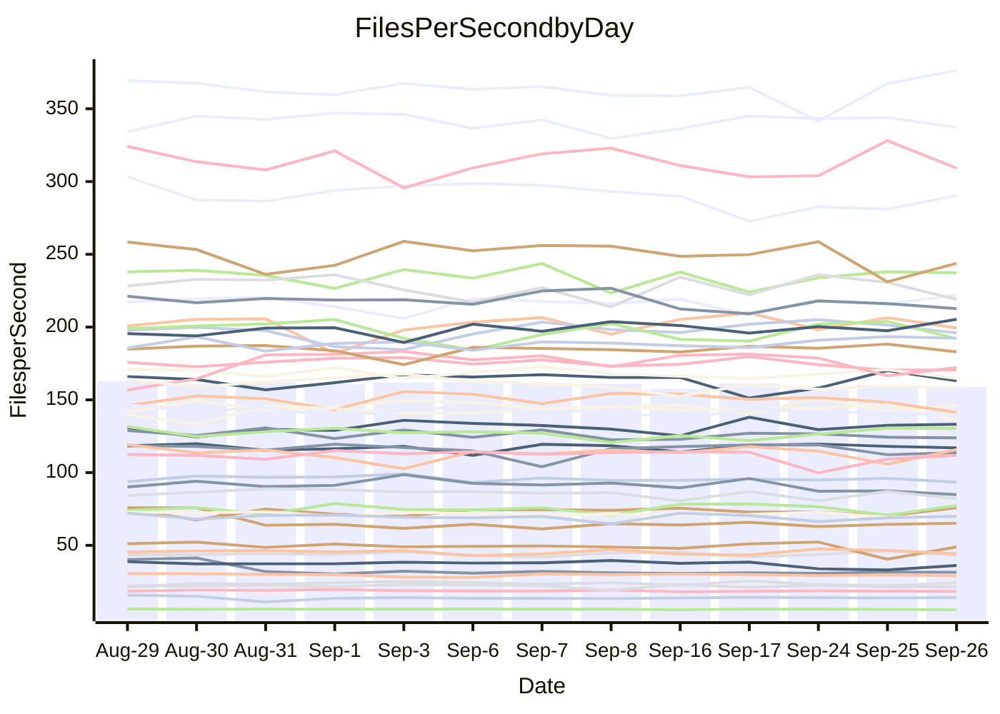

<!---
# This file is auto-generated. Do not edit.
# cspell:disable
--->
# Performance Report

## Daily Performance

## Time to Process Files

| Repository                                      | Elapsed | Min/Avg/Max           |   SD | SD Graph                |
| ----------------------------------------------- | ------: | :-------------------: | ---: | ----------------------- |
| AdaDoom3/AdaDoom3                    |    3.39 | 3.4 /   3.5 /   4.5   | 0.25 | `    ┣━━┻━●╋━━┻━━┫    ` |
| alexiosc/megistos                    |    7.72 | 7.5 /   8.0 /   9.4   | 0.46 | `    ┣━━┻●━╋━━┻━━┫    ` |
| apollographql/apollo-server          |    3.04 | 2.6 /   2.8 /   2.9   | 0.11 | `    ┣━━┻━━╋━━┻━━┫●   ` |
| aspnetboilerplate/aspnetboilerplate  |   10.25 | 10.2 /  10.5 /  11.1  | 0.22 | `    ┣━●┻━━╋━━┻━━┫    ` |
| aws-amplify/docs                     |   13.91 | 12.5 /  13.2 /  14.2  | 0.41 | `    ┣━━┻━━╋━━┻━━●    ` |
| Azure/azure-rest-api-specs           |    9.98 | 9.4 /   9.8 /  10.6   | 0.35 | `    ┣━━┻━━╋━●┻━━┫    ` |
| bitjson/typescript-starter           |    1.09 | 1.0 /   1.1 /   1.1   | 0.03 | `     ┣━━┻━╋━●━━┫     ` |
| caddyserver/caddy                    |    3.77 | 3.6 /   3.8 /   4.3   | 0.17 | `    ┣━━┻━●╋━━┻━━┫    ` |
| canada-ca/open-source-logiciel-libre |    1.20 | 1.1 /   1.2 /   1.3   | 0.04 | `     ┣━┻━━╋━━●━┫     ` |
| chef/chef                            |    5.93 | 5.8 /   6.1 /   6.6   | 0.18 | `    ┣━━●━━╋━━┻━━┫    ` |
| dart-lang/sdk                        |   66.85 | 64.5 /  67.2 /  73.0  | 1.88 | `  ┣━━━┻━━●╋━━━┻━━━┫  ` |
| django/django                        |   15.31 | 14.9 /  15.5 /  16.4  | 0.35 | `    ┣━━┻●━╋━━┻━━┫    ` |
| eslint/eslint                        |   10.96 | 10.7 /  11.1 /  11.9  | 0.30 | `    ┣━━┻━●╋━━┻━━┫    ` |
| exonum/exonum                        |    3.71 | 3.5 /   3.7 /   4.1   | 0.14 | `    ┣━━┻━━●━━┻━━┫    ` |
| flutter/samples                      |   16.86 | 16.3 /  17.0 /  19.7  | 0.78 | `   ┣━━━┻━●╋━━┻━━━┫   ` |
| gitbucket/gitbucket                  |    3.70 | 3.5 /   3.6 /   4.0   | 0.15 | `    ┣━━┻━━╋━●┻━━┫    ` |
| googleapis/google-cloud-cpp          |  147.95 | 139.0 / 145.7 / 163.3 | 5.22 | `  ┣━━━┻━━━╋━●━┻━━━┫  ` |
| graphql/express-graphql              |    1.17 | 1.1 /   1.2 /   1.4   | 0.06 | `     ┣━┻━━●━━┻━┫     ` |
| graphql/graphql-js                   |    2.86 | 2.7 /   2.9 /   3.1   | 0.09 | `     ┣━┻━●╋━━┻━┫     ` |
| graphql/graphql-relay-js             |    1.17 | 1.1 /   1.2 /   1.3   | 0.07 | `     ┣━┻━●╋━━┻━┫     ` |
| graphql/graphql-spec                 |    1.33 | 1.0 /   1.3 /   1.5   | 0.13 | `     ┣━┻━━╋●━┻━┫     ` |
| iluwatar/java-design-patterns        |   14.88 | 12.8 /  13.2 /  13.9  | 0.34 | `      ┣━┻━╋━┻━┫     ●` |
| ktaranov/sqlserver-kit               |    6.76 | 6.6 /   6.8 /   7.1   | 0.16 | `    ┣━━┻━●╋━━┻━━┫    ` |
| liriliri/licia                       |    4.30 | 4.1 /   4.2 /   4.4   | 0.08 | `    ┣━━┻━━╋━━●━━┫    ` |
| MartinThoma/LaTeX-examples           |    7.43 | 6.9 /   7.2 /   7.8   | 0.26 | `    ┣━━┻━━╋━━●━━┫    ` |
| mdx-js/mdx                           |    2.06 | 1.9 /   2.0 /   2.2   | 0.07 | `     ┣━┻━━╋●━┻━┫     ` |
| microsoft/TypeScript-Website         |    5.61 | 5.5 /   5.9 /   6.5   | 0.28 | `    ┣━━●━━╋━━┻━━┫    ` |
| MicrosoftDocs/PowerShell-Docs        |   24.20 | 23.3 /  24.2 /  27.1  | 0.83 | `   ┣━━━┻━━●━━┻━━━┫   ` |
| neovim/nvim-lspconfig                |    4.40 | 4.2 /   4.3 /   4.5   | 0.09 | `    ┣━━┻━━╋━●┻━━┫    ` |
| pagekit/pagekit                      |    3.68 | 3.5 /   3.7 /   4.1   | 0.12 | `    ┣━━┻━━●━━┻━━┫    ` |
| php/php-src                          |   28.97 | 25.3 /  26.7 /  29.3  | 0.96 | `   ┣━━━┻━━╋━━┻━━━┫●  ` |
| plasticrake/tplink-smarthome-api     |    1.45 | 1.3 /   1.4 /   1.6   | 0.07 | `     ┣━┻━━╋━━●━┫     ` |
| prettier/prettier                    |    7.14 | 7.0 /   7.4 /   7.9   | 0.27 | `    ┣━━┻●━╋━━┻━━┫    ` |
| pycontribs/jira                      |    1.58 | 1.5 /   1.6 /   2.0   | 0.10 | `     ┣━┻━●╋━━┻━┫     ` |
| RustPython/RustPython                |    5.38 | 5.2 /   5.4 /   5.7   | 0.16 | `    ┣━━┻━━●━━┻━━┫    ` |
| shoelace-style/shoelace              |    2.99 | 2.9 /   3.0 /   3.1   | 0.07 | `     ┣━┻━●╋━━┻━┫     ` |
| slint-ui/slint                       |   13.28 | 12.2 /  12.9 /  15.5  | 0.78 | `   ┣━━━┻━━╋━●┻━━━┫   ` |
| SoftwareBrothers/admin-bro           |    2.62 | 2.5 /   2.6 /   2.8   | 0.06 | `     ┣━┻━━●━━┻━┫     ` |
| sveltejs/svelte                      |   21.36 | 20.2 /  21.6 /  23.2  | 0.58 | `   ┣━━━┻━●╋━━┻━━━┫   ` |
| TheAlgorithms/Python                 |    5.96 | 5.7 /   5.9 /   6.3   | 0.19 | `    ┣━━┻━━╋●━┻━━┫    ` |
| twbs/bootstrap                       |    1.78 | 1.5 /   1.8 /   2.0   | 0.13 | `     ┣━┻━━●━━┻━┫     ` |
| typescript-cheatsheets/react         |    1.45 | 1.3 /   1.4 /   1.6   | 0.07 | `     ┣━┻━━╋●━┻━┫     ` |
| typescript-eslint/typescript-eslint  |    4.27 | 4.2 /   4.4 /   4.7   | 0.15 | `    ┣━━●━━╋━━┻━━┫    ` |
| vitest-dev/vitest                    |    9.31 | 9.2 /   9.8 /  12.0   | 0.67 | `    ┣━━┻●━╋━━┻━━┫    ` |
| w3c/aria-practices                   |    3.62 | 3.4 /   3.5 /   3.8   | 0.10 | `    ┣━━┻━━╋━━●━━┫    ` |
| w3c/specberus                        |    2.08 | 2.0 /   2.1 /   2.2   | 0.05 | `     ┣━┻━━●━━┻━┫     ` |
| webdeveric/webpack-assets-manifest   |    1.25 | 1.2 /   1.2 /   1.3   | 0.04 | `     ┣━┻━━╋●━┻━┫     ` |
| webpack/webpack                      |    5.59 | 5.3 /   5.7 /   6.1   | 0.17 | `    ┣━━┻━●╋━━┻━━┫    ` |
| wireapp/wire-desktop                 |    1.34 | 1.0 /   1.3 /   1.4   | 0.14 | `     ┣━┻━━╋●━┻━┫     ` |
| wireapp/wire-webapp                  |   11.68 | 10.8 /  11.2 /  12.1  | 0.37 | `    ┣━━┻━━╋━━┻●━┫    ` |

Note:
- Elapsed time is in seconds.

## Files per Second over Time

| Repository                                      | Files |    Sec |    Fps |     Rel | Trend Fps              |    N |
| ----------------------------------------------- | ----: | -----: | -----: | ------: | ---------------------- | ---: |
| AdaDoom3/AdaDoom3                    |   103 |   3.39 |  30.35 |   2.61% | `██████▆█▂███▇███▇▇▆█` |   20 |
| alexiosc/megistos                    |   583 |   7.72 |  75.51 |   3.56% | `█▃▃▇█▆▆▇▇▇▇▇▇█▇▇▇▆█▇` |   20 |
| apollographql/apollo-server          |   252 |   3.04 |  82.99 |  -9.43% | `▇▄█▆▅▅█▆▆▅▄▇▆▄▅▇▄▄▄▂` |   20 |
| aspnetboilerplate/aspnetboilerplate  |  2286 |  10.25 | 223.08 |   2.61% | `▇▇█▇▇▆▅▇▇█▇▇▆▆█▅▇▆▇█` |   20 |
| aws-amplify/docs                     |  2871 |  13.91 | 206.39 |  -5.28% | `▆▆▇▅█▆▆▇▄▇▇▇█▅▆▅▆▆▆▄` |   20 |
| Azure/azure-rest-api-specs           |  2459 |   9.98 | 246.30 |  -1.38% | `▇█▇▅▄▆█▇▇▇████▆▇█▄▅▆` |   20 |
| bitjson/typescript-starter           |    20 |   1.09 |  18.35 |  -2.40% | `█▇▇▇▇█▆▆▆▆▆▆▇▄▆▆▆▆▆▅` |   20 |
| caddyserver/caddy                    |   286 |   3.77 |  75.88 |   0.90% | `█▆▆▇▃█▆▆▆▇▆█▅███▇▅█▇` |   20 |
| canada-ca/open-source-logiciel-libre |     7 |   1.20 |   5.81 |  -4.09% | `▇▇▆█▇▇▇█▇██▇▇▇▃▇▇▆▄▆` |   20 |
| chef/chef                            |  1208 |   5.93 | 203.88 |   2.67% | `▇▇▄▆▇▇▅█▇▇█▅█▇▇▆▇▆██` |   20 |
| dart-lang/sdk                        | 10560 |  66.85 | 157.97 |  -1.47% | `▇▅▇▇▇██▇▆█▆▇▆▆▄▇▆▆▆▆` |   20 |
| django/django                        |  2874 |  15.31 | 187.76 |   1.60% | `▇▇█▇▇▆▄▆▇██▆▇▆▆▇▇▇▅▇` |   20 |
| eslint/eslint                        |  2093 |  10.96 | 190.89 |   1.27% | `▇▇█▄▇▇▇▄▆▇▇▆▇▅▇▆▇██▇` |   20 |
| exonum/exonum                        |   421 |   3.71 | 113.46 |  -0.12% | `▇▅█▇█▆▄▇▇▇▇▆▇▇▆█▇▄█▇` |   20 |
| flutter/samples                      |  2400 |  16.86 | 142.31 |   0.85% | `▆▃▇███▇▆█▇▇██▇█▇██▄▇` |   20 |
| gitbucket/gitbucket                  |   413 |   3.70 | 111.70 |  -3.33% | `███▇▇█▇█▅█▄▄▇█▇██▆▇▆` |   20 |
| googleapis/google-cloud-cpp          | 20764 | 147.95 | 140.35 |  -1.37% | `█▅▇▇▇▆▇█▆█▇▆▇▃▇▇▆▆▆▆` |   20 |
| graphql/express-graphql              |    26 |   1.17 |  22.17 |   0.34% | `▇▄▆▆▇▆▇▇▇▇▆▇▃▆█▅▇▅▅▆` |   20 |
| graphql/graphql-js                   |   364 |   2.86 | 127.49 |   1.27% | `▅▆▇█▆▅▇▄▆▇█▆▅▅▅▆▆▆▅▆` |   20 |
| graphql/graphql-relay-js             |    28 |   1.17 |  24.00 |   1.30% | `▆▆▇▃█▇█▇▆█▆▅▇▃▆█▅▄▇▆` |   20 |
| graphql/graphql-spec                 |    19 |   1.33 |  14.27 |   3.35% | `▅██▂▂▅▆▄▆▆▅▅▅▆▅▆▆▆▆▆` |   20 |
| iluwatar/java-design-patterns        |  1992 |  14.88 | 133.83 | -11.46% | `▇█▇█▆▅█▇██▅▇█▇█▇▇▆▆▂` |   20 |
| ktaranov/sqlserver-kit               |   489 |   6.76 |  72.31 |   0.96% | `█▅▇█▆▆▇▅▇█▇▅▆▆▆▆▇▅▅▇` |   20 |
| liriliri/licia                       |  1437 |   4.30 | 334.50 |  -1.87% | `██▇█▇██▇▇▆▇█▆▅██▇█▇▆` |   20 |
| MartinThoma/LaTeX-examples           |  1409 |   7.43 | 189.70 |  -3.24% | `██▆▇██▆▄▄▅▆▇█▆▅▅██▆▅` |   20 |
| mdx-js/mdx                           |   141 |   2.06 |  68.35 |  -1.67% | `▅▆▄█▅▆▆▆▆▅▆▆▄▆█▆▄▆▇▅` |   20 |
| microsoft/TypeScript-Website         |   761 |   5.61 | 135.67 |   4.14% | `▇▅▃▇▅▆██▇▇▇▇▆▇▃█▆▇▆█` |   20 |
| MicrosoftDocs/PowerShell-Docs        |  2708 |  24.20 | 111.92 |  -0.07% | `▆▇▇▅▇█▇▇██▆█▇█▇▇▃▆▇▇` |   20 |
| neovim/nvim-lspconfig                |   760 |   4.40 | 172.69 |  -1.22% | `▇▆▅▆███▇▆█▇█▆▇▇█▇▆▅▆` |   20 |
| pagekit/pagekit                      |   741 |   3.68 | 201.22 |  -0.61% | `█▆██▇▃▆▇█▇█▇▆█▇█▆▇▆▇` |   20 |
| php/php-src                          |  2296 |  28.97 |  79.26 |  -7.60% | `█▆▆█▇▇▇▇▆█▇▆▇▅▄▇▄▇▆▄` |   20 |
| plasticrake/tplink-smarthome-api     |    62 |   1.45 |  42.85 |  -5.13% | `▇█▇▇▇▇▇▃▆▆▆▆██▄▅█▇▇▅` |   20 |
| prettier/prettier                    |  2305 |   7.14 | 322.89 |   3.49% | `▆█▆▇▅▇▄▆▄█▆██▆▆▅▅█▄█` |   20 |
| pycontribs/jira                      |    79 |   1.58 |  50.12 |   1.43% | `██▇▇▅▇▆▇▇▅▅█▆▆▆▇█▂▆▇` |   20 |
| RustPython/RustPython                |   687 |   5.38 | 127.67 |   0.44% | `▄▇▆▆▇▇▆▇▇▇▇▆▄▅▇▅▆▇█▇` |   20 |
| shoelace-style/shoelace              |   439 |   2.99 | 146.98 |   0.68% | `██▇▆▅▆██▆█▇▅▆▇▇▅█▅▆▇` |   20 |
| slint-ui/slint                       |  2263 |  13.28 | 170.41 |  -2.73% | `▆▇▃█████▇▇▇█▇▇██▇▆▇▆` |   20 |
| SoftwareBrothers/admin-bro           |   441 |   2.62 | 168.51 |   0.11% | `▇█▇▇▅█▆▇▇▇▇█▇▅▇▆▆▇▅▇` |   20 |
| sveltejs/svelte                      |  7920 |  21.36 | 370.87 |   1.95% | `█▆▅▆▅▆▆▇▆▅▆▆▆▆▅▆▄▆█▇` |   20 |
| TheAlgorithms/Python                 |  1396 |   5.96 | 234.19 |  -0.67% | `▇█▆▅█▅▇▅█▅██▄▇▇▄▆▇▇▆` |   20 |
| twbs/bootstrap                       |   118 |   1.78 |  66.25 |   0.14% | `██▅▃▄▄▃▃▄▄▄▂▄▃▄▄▃▄▄▄` |   20 |
| typescript-cheatsheets/react         |    53 |   1.45 |  36.52 |  -2.17% | `▇▅▇▇▅▆▇▇▇▇█▆█▇▆▇▄▃▅▆` |   20 |
| typescript-eslint/typescript-eslint  |  1279 |   4.27 | 299.64 |   3.14% | `▇▅█▄█▇██████▇▆█▄▆▅▆█` |   20 |
| vitest-dev/vitest                    |  2215 |   9.31 | 238.02 |   5.09% | `██▇▇██▇▇▂█▆█▅▇█▆█▇▄█` |   20 |
| w3c/aria-practices                   |   414 |   3.62 | 114.31 |  -2.31% | `▇██▅▇▆▇▄▆▄▇█▇▅▆▇▇▇▇▆` |   20 |
| w3c/specberus                        |   198 |   2.08 |  95.20 |  -0.36% | `▇▆█▆▇▇█▆▆▄▆▇▆▆▆▆▆▆▅▆` |   20 |
| webdeveric/webpack-assets-manifest   |    54 |   1.25 |  43.28 |  -1.15% | `▇▅▄▇▆▆▇▇▅▄▄▄▇▇▇▅▆█▅▅` |   20 |
| webpack/webpack                      |  1119 |   5.59 | 200.21 |   1.45% | `▇▆▆▇▅▄▄▆▅▆▆█▆▆▅▇▇▇▅▆` |   20 |
| wireapp/wire-desktop                 |    43 |   1.34 |  32.17 |  -3.11% | `██▇▃▃▂▃▂▂▃▃▃▃▂▂▃▂▃▂▃` |   20 |
| wireapp/wire-webapp                  |  1835 |  11.68 | 157.16 |  -4.09% | `██▅▅▅▆▇▇▇▇▇█▇▇▇▄▅██▅` |   20 |

## Data Throughput

| Repository                                      | Files |    Sec |     Kps |     Rel | Trend Kps              |    N |
| ----------------------------------------------- | ----: | -----: | ------: | ------: | ---------------------- | ---: |
| AdaDoom3/AdaDoom3                    |   103 |   3.39 |  645.05 |   2.61% | `██████▆█▂███▇███▇▇▆█` |   20 |
| alexiosc/megistos                    |   583 |   7.72 |  593.30 |   3.56% | `█▃▃▇█▆▆▇▇▇▇▇▇█▇▇▇▆█▇` |   20 |
| apollographql/apollo-server          |   252 |   3.04 |  667.58 |  -9.43% | `▇▄█▆▅▅█▆▆▅▄▇▆▄▅▇▄▄▄▂` |   20 |
| aspnetboilerplate/aspnetboilerplate  |  2286 |  10.25 |  542.76 |   2.61% | `▇▇█▇▇▆▅▇▇█▇▇▆▆█▅▇▆▇█` |   20 |
| aws-amplify/docs                     |  2871 |  13.91 |  720.68 |  -5.28% | `▆▆▇▅█▆▆▇▄▇▇▇█▅▆▅▆▆▆▄` |   20 |
| Azure/azure-rest-api-specs           |  2459 |   9.98 |  649.36 |  -1.73% | `▇█▇▅▄▆█▇█▇██▇▇▅▆█▄▅▆` |   20 |
| bitjson/typescript-starter           |    20 |   1.09 |   73.40 |  -2.40% | `█▇▇▇▇█▆▆▆▆▆▆▇▄▆▆▆▆▆▅` |   20 |
| caddyserver/caddy                    |   286 |   3.77 |  647.66 |   0.85% | `█▆▆▇▃█▆▆▆▇▆█▅███▇▅█▇` |   20 |
| canada-ca/open-source-logiciel-libre |     7 |   1.20 |   48.16 |  -4.09% | `▇▇▆█▇▇▇█▇██▇▇▇▃▇▇▆▄▆` |   20 |
| chef/chef                            |  1208 |   5.93 |  941.58 |   2.66% | `▇▇▄▆▇▇▅█▇▇█▅█▇▇▆▇▆██` |   20 |
| dart-lang/sdk                        | 10560 |  66.85 | 1084.91 |  -0.44% | `▇▅▆▇▇██▇▆█▆▇▆▆▄▇▆▇▆▆` |   20 |
| django/django                        |  2874 |  15.31 | 1176.06 |   1.50% | `▇▇█▇▇▆▄▆▇██▆▇▇▆▇▇▇▅▇` |   20 |
| eslint/eslint                        |  2093 |  10.96 | 1371.46 |   0.46% | `▇▇█▄▇▇▇▄▆▇▇▆▇▅▇▆▇▇▇▇` |   20 |
| exonum/exonum                        |   421 |   3.71 | 1085.32 |  -0.12% | `▇▅█▇█▆▄▇▇▇▇▆▇▇▆█▇▄█▇` |   20 |
| flutter/samples                      |  2400 |  16.86 | 1269.92 |   0.85% | `▆▃▇███▇▆█▇▇██▇█▇██▄▇` |   20 |
| gitbucket/gitbucket                  |   413 |   3.70 |  507.64 |  -3.33% | `███▇▇█▇█▅█▄▄▇█▇██▆▇▆` |   20 |
| googleapis/google-cloud-cpp          | 20764 | 147.95 | 1138.47 |  -1.13% | `█▅▇▇▇▆▇█▆█▇▆▇▃█▇▇▆▆▆` |   20 |
| graphql/express-graphql              |    26 |   1.17 |  101.48 |   0.34% | `▇▄▆▆▇▆▇▇▇▇▆▇▃▆█▅▇▅▅▆` |   20 |
| graphql/graphql-js                   |   364 |   2.86 |  732.70 |   1.27% | `▅▆▇█▆▅▇▄▆▇█▆▅▅▅▆▆▆▅▆` |   20 |
| graphql/graphql-relay-js             |    28 |   1.17 |   94.30 |   1.30% | `▆▆▇▃█▇█▇▆█▆▅▇▃▆█▅▄▇▆` |   20 |
| graphql/graphql-spec                 |    19 |   1.33 |  476.17 |   1.46% | `▅██▂▂▄▄▃▄▄▄▃▄▅▄▅▄▄▅▅` |   20 |
| iluwatar/java-design-patterns        |  1992 |  14.88 |  413.65 | -11.46% | `▇█▇█▆▅█▇██▅▇█▇█▇▇▆▆▂` |   20 |
| ktaranov/sqlserver-kit               |   489 |   6.76 | 1094.81 |   0.97% | `█▅▇█▆▆▇▅▇█▇▅▆▆▆▆▇▅▅▇` |   20 |
| liriliri/licia                       |  1437 |   4.30 |  398.51 |  -1.87% | `██▇█▇██▇▇▆▇█▆▅██▇█▇▆` |   20 |
| MartinThoma/LaTeX-examples           |  1409 |   7.43 |  391.80 |  -3.24% | `██▆▇██▆▄▄▅▆▇█▆▅▅██▆▅` |   20 |
| mdx-js/mdx                           |   141 |   2.06 |  318.00 |  -1.67% | `▅▆▄█▅▆▆▆▆▅▆▆▄▆█▆▄▆▇▅` |   20 |
| microsoft/TypeScript-Website         |   761 |   5.61 |  938.29 |   4.14% | `▇▅▃▇▅▆██▇▇▇▇▆▇▃█▆▇▆█` |   20 |
| MicrosoftDocs/PowerShell-Docs        |  2708 |  24.20 | 1151.17 |  -0.05% | `▆▇▇▅▇█▇▇██▆█▇█▇▇▃▆▇▇` |   20 |
| neovim/nvim-lspconfig                |   760 |   4.40 |  286.08 |  -0.69% | `▇▆▅▆███▇▅▇▇█▆▇▇█▇▆▅▆` |   20 |
| pagekit/pagekit                      |   741 |   3.68 |  419.55 |  -0.61% | `█▆██▇▃▆▇█▇█▇▆█▇█▆▇▆▇` |   20 |
| php/php-src                          |  2296 |  28.97 | 1377.83 |  -7.71% | `█▆▆█▇▇▇▇▆█▇▆▆▅▃▇▄▇▆▄` |   20 |
| plasticrake/tplink-smarthome-api     |    62 |   1.45 |  231.52 |  -5.13% | `▇█▇▇▇▇▇▃▆▆▆▆██▄▅█▇▇▅` |   20 |
| prettier/prettier                    |  2305 |   7.14 |  456.39 |   3.22% | `▆█▆▇▅▇▄▆▄█▆██▆▆▅▅█▄▇` |   20 |
| pycontribs/jira                      |    79 |   1.58 |  355.28 |   1.43% | `██▇▇▅▇▆▇▇▅▅█▆▆▆▇█▂▆▇` |   20 |
| RustPython/RustPython                |   687 |   5.38 | 1008.35 |   0.80% | `▄▇▆▆▇▇▆▇▇▇▇▆▄▅▆▅▆▇█▇` |   20 |
| shoelace-style/shoelace              |   439 |   2.99 |  710.12 |   0.68% | `██▇▆▅▆██▆█▇▅▆▇▇▅█▅▆▇` |   20 |
| slint-ui/slint                       |  2263 |  13.28 | 1114.15 |  -2.63% | `▆▇▃█████▇▇▇█▇▇██▇▆▇▆` |   20 |
| SoftwareBrothers/admin-bro           |   441 |   2.62 |  371.42 |   0.11% | `▇█▇▇▅█▆▇▇▇▇█▇▅▇▆▆▇▅▇` |   20 |
| sveltejs/svelte                      |  7920 |  21.36 |  248.13 |   1.94% | `█▆▅▆▅▆▆▇▆▅▆▆▆▆▅▆▄▆█▇` |   20 |
| TheAlgorithms/Python                 |  1396 |   5.96 |  595.21 |  -0.61% | `▇█▆▅█▅▇▅█▅██▄▇▇▄▆▇▇▆` |   20 |
| twbs/bootstrap                       |   118 |   1.78 |  543.50 |   0.11% | `██▅▄▄▄▃▃▄▄▄▂▄▃▄▄▃▄▄▄` |   20 |
| typescript-cheatsheets/react         |    53 |   1.45 |  270.09 |  -2.17% | `▇▅▇▇▅▆▇▇▇▇█▆█▇▆▇▄▃▅▆` |   20 |
| typescript-eslint/typescript-eslint  |  1279 |   4.27 | 1533.79 |   3.36% | `▇▅█▄█▇██████▇▆█▄▆▆▆█` |   20 |
| vitest-dev/vitest                    |  2215 |   9.31 |  537.29 |   5.65% | `██▇▇██▇▇▂█▆█▅▇█▆█▇▄█` |   20 |
| w3c/aria-practices                   |   414 |   3.62 | 1065.77 |  -2.14% | `▇██▅▇▆▇▄▆▄▇█▇▅▆▇█▇█▆` |   20 |
| w3c/specberus                        |   198 |   2.08 |  299.06 |  -0.36% | `▇▆█▆▇▇█▆▆▄▆▇▆▆▆▆▆▆▅▆` |   20 |
| webdeveric/webpack-assets-manifest   |    54 |   1.25 |  101.80 |  -1.15% | `▇▅▄▇▆▆▇▇▅▄▄▄▇▇▇▅▆█▅▅` |   20 |
| webpack/webpack                      |  1119 |   5.59 |  907.46 |   1.31% | `▇▆▆▇▅▄▄▆▅▆▆█▆▆▅▇▇▇▅▆` |   20 |
| wireapp/wire-desktop                 |    43 |   1.34 |  148.87 |   0.81% | `██▇▃▃▂▃▂▂▃▃▃▃▂▂▃▃▄▃▄` |   20 |
| wireapp/wire-webapp                  |  1835 |  11.68 |  564.22 |  -3.71% | `██▅▅▅▆▇▇▇▇▇▇▇▇▇▄▅██▅` |   20 |

