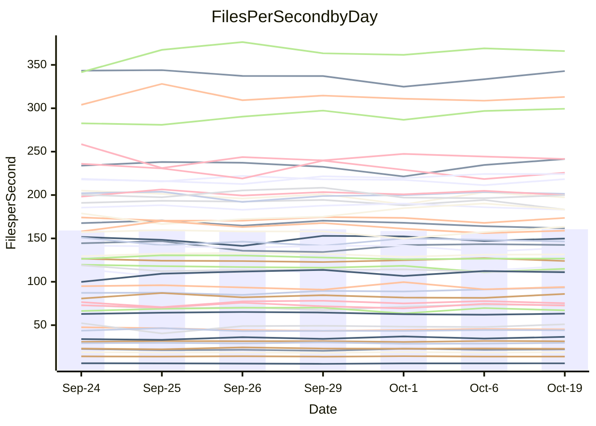

<!---
# This file is auto-generated. Do not edit.
# cspell:disable
--->
# Performance Report

## Daily Performance

## Time to Process Files

| Repository                                      | Elapsed | Min/Avg/Max           |   SD | SD Graph                |
| ----------------------------------------------- | ------: | :-------------------: | ---: | ----------------------- |
| AdaDoom3/AdaDoom3                    |    3.61 | 3.4 /   3.5 /   3.7   | 0.11 | `    ┣━━┻━━╋━●┻━━┫    ` |
| alexiosc/megistos                    |    8.49 | 7.6 /   8.0 /   8.6   | 0.28 | `    ┣━━┻━━╋━━┻━●┫    ` |
| apollographql/apollo-server          |    2.77 | 2.6 /   2.8 /   3.0   | 0.13 | `    ┣━━┻━●╋━━┻━━┫    ` |
| aspnetboilerplate/aspnetboilerplate  |   10.35 | 10.2 /  10.5 /  10.9  | 0.22 | `    ┣━━●━━╋━━┻━━┫    ` |
| aws-amplify/docs                     |   13.14 | 12.5 /  13.0 /  13.9  | 0.43 | `    ┣━━┻━━╋●━┻━━┫    ` |
| Azure/azure-rest-api-specs           |    9.97 | 9.5 /  10.1 /  10.7   | 0.34 | `    ┣━━┻━●╋━━┻━━┫    ` |
| bitjson/typescript-starter           |    1.04 | 1.0 /   1.1 /   1.1   | 0.02 | `    ●┣━━┻━╋━┻━━┫     ` |
| caddyserver/caddy                    |    3.74 | 3.6 /   3.8 /   4.0   | 0.12 | `    ┣━━┻━●╋━━┻━━┫    ` |
| canada-ca/open-source-logiciel-libre |    1.17 | 1.1 /   1.2 /   1.3   | 0.05 | `     ┣━┻━●╋━━┻━┫     ` |
| chef/chef                            |    6.00 | 5.8 /   6.0 /   6.4   | 0.17 | `    ┣━━┻━●╋━━┻━━┫    ` |
| dart-lang/sdk                        |   63.91 | 64.8 /  67.4 /  73.2  | 2.22 | `  ┣━●━┻━━━╋━━━┻━━━┫  ` |
| django/django                        |   14.94 | 15.0 /  15.5 /  16.2  | 0.38 | `    ┣●━┻━━╋━━┻━━┫    ` |
| eslint/eslint                        |   10.97 | 10.7 /  11.0 /  11.7  | 0.36 | `    ┣━━┻━●╋━━┻━━┫    ` |
| exonum/exonum                        |    3.60 | 3.6 /   3.7 /   4.0   | 0.13 | `    ┣━━┻●━╋━━┻━━┫    ` |
| flutter/samples                      |   16.61 | 16.3 /  17.0 /  18.6  | 0.60 | `    ┣━━┻●━╋━━┻━━┫    ` |
| gitbucket/gitbucket                  |    3.51 | 3.5 /   3.7 /   3.8   | 0.09 | `     ●━┻━━╋━━┻━┫     ` |
| googleapis/google-cloud-cpp          |  148.06 | 142.5 / 149.3 / 165.8 | 5.84 | `  ┣━━━┻━━●╋━━━┻━━━┫  ` |
| graphql/express-graphql              |    1.17 | 1.1 /   1.2 /   1.3   | 0.04 | `     ┣━┻━●╋━━┻━┫     ` |
| graphql/graphql-js                   |    3.07 | 2.8 /   2.9 /   3.0   | 0.05 | `     ┣━┻━━╋━━┻━┫  ●  ` |
| graphql/graphql-relay-js             |    1.25 | 1.1 /   1.2 /   1.3   | 0.04 | `     ┣━┻━━╋━●┻━┫     ` |
| graphql/graphql-spec                 |    1.37 | 1.3 /   1.4 /   1.4   | 0.03 | `     ┣━┻━━╋●━┻━┫     ` |
| iluwatar/java-design-patterns        |   13.41 | 13.0 /  13.4 /  14.9  | 0.50 | `    ┣━━┻━━●━━┻━━┫    ` |
| ktaranov/sqlserver-kit               |    6.75 | 6.6 /   6.8 /   7.3   | 0.22 | `    ┣━━┻━●╋━━┻━━┫    ` |
| liriliri/licia                       |    4.19 | 4.1 /   4.3 /   4.4   | 0.10 | `    ┣━━┻●━╋━━┻━━┫    ` |
| MartinThoma/LaTeX-examples           |    7.18 | 6.9 /   7.0 /   7.4   | 0.18 | `    ┣━━┻━━╋━●┻━━┫    ` |
| mdx-js/mdx                           |    2.08 | 2.0 /   2.1 /   2.3   | 0.10 | `     ┣━┻━━●━━┻━┫     ` |
| microsoft/TypeScript-Website         |    5.72 | 5.6 /   5.8 /   6.0   | 0.12 | `    ┣━━┻●━╋━━┻━━┫    ` |
| MicrosoftDocs/PowerShell-Docs        |   24.63 | 23.7 /  24.7 /  27.2  | 1.20 | `   ┣━━━┻━━●━━┻━━━┫   ` |
| neovim/nvim-lspconfig                |    4.48 | 4.3 /   4.4 /   4.7   | 0.10 | `    ┣━━┻━━╋━●┻━━┫    ` |
| pagekit/pagekit                      |    4.03 | 3.5 /   3.7 /   3.8   | 0.08 | `      ┣━┻━╋━┻━┫     ●` |
| php/php-src                          |   26.52 | 26.3 /  27.7 /  30.2  | 1.20 | `   ┣━━━●━━╋━━┻━━━┫   ` |
| plasticrake/tplink-smarthome-api     |    1.35 | 1.3 /   1.4 /   1.4   | 0.04 | `     ┣━┻●━╋━━┻━┫     ` |
| prettier/prettier                    |    7.49 | 7.0 /   7.5 /   7.8   | 0.20 | `    ┣━━┻━━●━━┻━━┫    ` |
| pycontribs/jira                      |    1.55 | 1.5 /   1.6 /   2.0   | 0.11 | `     ┣━┻●━╋━━┻━┫     ` |
| RustPython/RustPython                |    5.43 | 5.2 /   5.4 /   5.6   | 0.11 | `    ┣━━┻━━╋●━┻━━┫    ` |
| shoelace-style/shoelace              |    3.07 | 2.9 /   3.0 /   3.1   | 0.06 | `     ┣━┻━━╋━━┻●┫     ` |
| slint-ui/slint                       |   13.66 | 12.7 /  13.5 /  14.4  | 0.49 | `    ┣━━┻━━╋●━┻━━┫    ` |
| SoftwareBrothers/admin-bro           |    2.88 | 2.6 /   2.6 /   2.8   | 0.06 | `     ┣━┻━━╋━━┻━┫    ●` |
| sveltejs/svelte                      |   21.37 | 20.8 /  21.8 /  23.2  | 0.58 | `   ┣━━━┻●━╋━━┻━━━┫   ` |
| TheAlgorithms/Python                 |    5.72 | 5.8 /   6.0 /   6.6   | 0.22 | `    ┣━━●━━╋━━┻━━┫    ` |
| twbs/bootstrap                       |    1.81 | 1.8 /   1.9 /   2.0   | 0.05 | `     ┣━●━━╋━━┻━┫     ` |
| typescript-cheatsheets/react         |    1.46 | 1.4 /   1.5 /   1.6   | 0.07 | `     ┣━┻━●╋━━┻━┫     ` |
| typescript-eslint/typescript-eslint  |    4.28 | 4.3 /   4.4 /   4.6   | 0.11 | `    ┣━━●━━╋━━┻━━┫    ` |
| vitest-dev/vitest                    |    9.96 | 9.3 /   9.9 /  11.1   | 0.54 | `    ┣━━┻━━╋●━┻━━┫    ` |
| w3c/aria-practices                   |    3.46 | 3.5 /   3.6 /   3.7   | 0.10 | `    ┣━━●━━╋━━┻━━┫    ` |
| w3c/specberus                        |    2.09 | 2.0 /   2.1 /   2.3   | 0.08 | `     ┣━┻━━●━━┻━┫     ` |
| webdeveric/webpack-assets-manifest   |    1.23 | 1.2 /   1.2 /   1.3   | 0.03 | `     ┣━┻━━●━━┻━┫     ` |
| webpack/webpack                      |    5.84 | 5.4 /   5.6 /   6.1   | 0.19 | `    ┣━━┻━━╋━━●━━┫    ` |
| wireapp/wire-desktop                 |    1.50 | 1.3 /   1.4 /   1.5   | 0.03 | `     ┣━┻━━╋━━┻━┫  ●  ` |
| wireapp/wire-webapp                  |   10.97 | 10.7 /  11.3 /  12.5  | 0.50 | `    ┣━━┻●━╋━━┻━━┫    ` |

Note:
- Elapsed time is in seconds.

## Files per Second over Time

| Repository                                      | Files |    Sec |    Fps |    Rel | Trend Fps      |    N |
| ----------------------------------------------- | ----: | -----: | -----: | -----: | -------------- | ---: |
| AdaDoom3/AdaDoom3                    |   103 |   3.61 |  28.57 | -2.47% | `▇▇▄██▆▆▇▅██▆` |   11 |
| alexiosc/megistos                    |   583 |   8.49 |  68.67 | -6.04% | `▆▅██▆▅▄▇▇▆█▄` |   11 |
| apollographql/apollo-server          |   252 |   2.77 |  90.92 |  1.75% | `▅▅▅▃▆▇▄▇▆▇█▆` |   11 |
| aspnetboilerplate/aspnetboilerplate  |  2286 |  10.35 | 220.91 |  1.74% | `▇▆██▇█▆▅▆▆██` |   11 |
| aws-amplify/docs                     |  2871 |  13.14 | 218.52 | -0.79% | `▆▆▆▄▇▅█▇███▆` |   11 |
| Azure/azure-rest-api-specs           |  2458 |   9.97 | 246.49 |  1.22% | `█▄▆▆▅▇▆▅▇▄▇▆` |   11 |
| bitjson/typescript-starter           |    20 |   1.04 |  19.27 |  4.02% | `▇▆▆▆▅▇█▆▆▅▇█` |   11 |
| caddyserver/caddy                    |   287 |   3.74 |  76.69 |  1.03% | `▇▄█▇█▇▆██▇▅▇` |   11 |
| canada-ca/open-source-logiciel-libre |     7 |   1.17 |   5.98 |  1.60% | `█▇▅▆▄█▆█▇▇█▇` |   11 |
| chef/chef                            |  1207 |   6.00 | 201.22 |  0.50% | `▇▆█▇█▅▆▇▄▇▆▇` |   11 |
| dart-lang/sdk                        | 10660 |  63.91 | 166.80 |  6.16% | `▆▇▆▆▆▆▃▇▅▇▇█` |   11 |
| django/django                        |  2876 |  14.94 | 192.49 |  3.97% | `▆▇▅▇▇▇█▇▆▅▅█` |   11 |
| eslint/eslint                        |  2093 |  10.97 | 190.79 |  0.54% | `▇██▇██▅██▅▅▇` |   11 |
| exonum/exonum                        |   421 |   3.60 | 117.04 |  2.78% | `▇▄█▆▅▆▇▆▇███` |   11 |
| flutter/samples                      |  2400 |  16.61 | 144.52 |  2.48% | `██▄▇▅▇▇▇▇▇▇█` |   11 |
| gitbucket/gitbucket                  |   413 |   3.51 | 117.62 |  4.02% | `█▆▇▅▆▇▆▆▅▅▅█` |   11 |
| googleapis/google-cloud-cpp          | 20772 | 148.06 | 140.29 |  0.72% | `▇▇▆▇▇▆██▃▇▆▇` |   11 |
| graphql/express-graphql              |    26 |   1.17 |  22.23 |  1.50% | `▇▅▅▇▄█▇▅▇▆▆▇` |   11 |
| graphql/graphql-js                   |   364 |   3.07 | 118.50 | -5.49% | `▇▇▅█▆▆▇█▇█▇▄` |   11 |
| graphql/graphql-relay-js             |    28 |   1.25 |  22.46 | -3.07% | `▅▄█▇▆▇▄▆▅▅▆▅` |   11 |
| graphql/graphql-spec                 |    19 |   1.37 |  13.86 | -0.88% | `▇▆██▆███▅▅▇▇` |   11 |
| iluwatar/java-design-patterns        |  1992 |  13.41 | 148.55 | -0.09% | `█▇▇▄███▇▇▇█▇` |   11 |
| ktaranov/sqlserver-kit               |   489 |   6.75 |  72.50 |  1.18% | `▇▅▅▇▄▇▆█▇██▇` |   11 |
| liriliri/licia                       |  1437 |   4.19 | 343.07 |  1.96% | `██▇▆▇▅▅▅▇█▇█` |   11 |
| MartinThoma/LaTeX-examples           |  1409 |   7.18 | 196.21 | -2.05% | `▇█▆▅▇▆█▇███▆` |   11 |
| mdx-js/mdx                           |   141 |   2.08 |  67.74 | -0.02% | `▆▇█▇▇▃▆▇▇▅▇▆` |   11 |
| microsoft/TypeScript-Website         |   761 |   5.72 | 132.99 |  1.44% | `▆▇▆█▇▅▆▅█▆▇▇` |   11 |
| MicrosoftDocs/PowerShell-Docs        |  2708 |  24.63 | 109.93 |  0.11% | `▄▇▇▇██▄███▇▇` |   11 |
| neovim/nvim-lspconfig                |   760 |   4.48 | 169.70 | -1.46% | `█▇▆▇█▇█▇▅██▆` |   11 |
| pagekit/pagekit                      |   741 |   4.03 | 184.06 | -9.36% | `▅▇▅▆▆▆▆█▆▆█▂` |   11 |
| php/php-src                          |  2289 |  26.52 |  86.30 |  3.79% | `▆█▇▅▇▅▇▄█▇██` |   11 |
| plasticrake/tplink-smarthome-api     |    62 |   1.35 |  45.84 |  1.77% | `█▇▇▄▅▆▅▆▆▇▅▇` |   11 |
| prettier/prettier                    |  2350 |   7.49 | 313.87 |  0.65% | `▅█▄▇▆▆▆▅▆▆▆▆` |   11 |
| pycontribs/jira                      |    79 |   1.55 |  51.06 |  5.14% | `█▂▆▇▇▆▆▆▅█▇▇` |   11 |
| RustPython/RustPython                |   688 |   5.43 | 126.59 | -0.85% | `▆▇█▆▆▅▇▆▆▅▇▆` |   11 |
| shoelace-style/shoelace              |   439 |   3.07 | 142.86 | -3.04% | `█▅▆▇▅█▇▇▇▇▇▅` |   11 |
| slint-ui/slint                       |  2531 |  13.66 | 185.29 |  2.97% | `▆▄▅▄▅▇▇█▇▅▇▇` |   11 |
| SoftwareBrothers/admin-bro           |   441 |   2.88 | 153.08 | -8.21% | `▇█▅▇█▆██▅▇▇▃` |   11 |
| sveltejs/svelte                      |  7965 |  21.37 | 372.72 |  2.21% | `▄▇█▇▆▆▆▇▇▆▆▇` |   11 |
| TheAlgorithms/Python                 |  1397 |   5.72 | 244.04 |  4.39% | `▇▇█▇▇▆▃▇▆█▇█` |   11 |
| twbs/bootstrap                       |   118 |   1.81 |  65.36 |  3.29% | `▆▇▇█▇▅▇▆▅▄▇█` |   11 |
| typescript-cheatsheets/react         |    53 |   1.46 |  36.26 |  2.32% | `▅▄▇█▅██▄▇▇█▇` |   11 |
| typescript-eslint/typescript-eslint  |  1285 |   4.28 | 300.04 |  2.91% | `▅▅▅██▆▆█▇███` |   11 |
| vitest-dev/vitest                    |  2257 |   9.96 | 226.53 |  0.07% | `█▇▃███▆▅▆▆▇▆` |   11 |
| w3c/aria-practices                   |   414 |   3.46 | 119.69 |  3.50% | `█▇█▆▇██▅▅▆▅█` |   11 |
| w3c/specberus                        |   197 |   2.09 |  94.28 | -0.13% | `▆▆▅▆▅▇█▃▆▆▅▆` |   11 |
| webdeveric/webpack-assets-manifest   |    55 |   1.23 |  44.54 |  1.39% | `▅█▅▅▅▅▅▆▆▅▆▆` |   11 |
| webpack/webpack                      |  1123 |   5.84 | 192.34 | -3.11% | `█▇▆▇▇▄▆▇█▆█▆` |   11 |
| wireapp/wire-desktop                 |    46 |   1.50 |  30.70 | -2.25% | `▅▆▅▇▆▄▅▅█▇▆▅` |   11 |
| wireapp/wire-webapp                  |  1781 |  10.97 | 162.42 |  0.88% | `▆██▆█▇▆▃▇▆▅▇` |   11 |

## Data Throughput

| Repository                                      | Files |    Sec |     Kps |    Rel | Trend Kps      |    N |
| ----------------------------------------------- | ----: | -----: | ------: | -----: | -------------- | ---: |
| AdaDoom3/AdaDoom3                    |   103 |   3.61 |  607.10 | -2.47% | `▇▇▄██▆▆▇▅██▆` |   11 |
| alexiosc/megistos                    |   583 |   8.49 |  539.55 | -6.04% | `▆▅██▆▅▄▇▇▆█▄` |   11 |
| apollographql/apollo-server          |   252 |   2.77 |  731.37 |  1.75% | `▅▅▅▃▆▇▄▇▆▇█▆` |   11 |
| aspnetboilerplate/aspnetboilerplate  |  2286 |  10.35 |  537.48 |  1.74% | `▇▆██▇█▆▅▆▆██` |   11 |
| aws-amplify/docs                     |  2871 |  13.14 |  762.82 | -0.81% | `▆▆▆▄▇▅█▇███▆` |   11 |
| Azure/azure-rest-api-specs           |  2458 |   9.97 |  657.75 |  2.04% | `█▄▅▆▅▇▆▅▇▄▇▇` |   11 |
| bitjson/typescript-starter           |    20 |   1.04 |   77.07 |  4.02% | `▇▆▆▆▅▇█▆▆▅▇█` |   11 |
| caddyserver/caddy                    |   287 |   3.74 |  656.30 |  1.13% | `▇▄█▇█▇▆██▇▆▇` |   11 |
| canada-ca/open-source-logiciel-libre |     7 |   1.17 |   49.55 |  1.60% | `█▇▅▆▄█▆█▇▇█▇` |   11 |
| chef/chef                            |  1207 |   6.00 |  928.24 |  0.46% | `▇▆█▇█▅▆▇▄▇▆▇` |   11 |
| dart-lang/sdk                        | 10660 |  63.91 | 1138.13 |  5.68% | `▆▇▇▆▆▆▄█▅▇▇█` |   11 |
| django/django                        |  2876 |  14.94 | 1206.50 |  4.00% | `▆▇▅▇▇▇█▇▆▅▅█` |   11 |
| eslint/eslint                        |  2093 |  10.97 | 1375.17 |  0.67% | `▇██▇██▅██▅▅▇` |   11 |
| exonum/exonum                        |   421 |   3.60 | 1119.53 |  2.78% | `▇▄█▆▅▆▇▆▇███` |   11 |
| flutter/samples                      |  2400 |  16.61 | 1289.63 |  2.48% | `██▄▇▅▇▇▇▇▇▇█` |   11 |
| gitbucket/gitbucket                  |   413 |   3.51 |  534.83 |  4.04% | `█▆▇▅▆▇▆▆▅▅▅█` |   11 |
| googleapis/google-cloud-cpp          | 20772 | 148.06 | 1140.35 |  0.87% | `▇▇▆▇▇▆██▃▇▆▇` |   11 |
| graphql/express-graphql              |    26 |   1.17 |  101.74 |  1.50% | `▇▅▅▇▄█▇▅▇▆▆▇` |   11 |
| graphql/graphql-js                   |   364 |   3.07 |  681.05 | -5.49% | `▇▇▅█▆▆▇█▇█▇▄` |   11 |
| graphql/graphql-relay-js             |    28 |   1.25 |   88.24 | -3.07% | `▅▄█▇▆▇▄▆▅▅▆▅` |   11 |
| graphql/graphql-spec                 |    19 |   1.37 |  462.51 | -0.88% | `▇▆██▆███▅▅▇▇` |   11 |
| iluwatar/java-design-patterns        |  1992 |  13.41 |  459.16 | -0.09% | `█▇▇▄███▇▇▇█▇` |   11 |
| ktaranov/sqlserver-kit               |   489 |   6.75 | 1097.66 |  1.18% | `▇▅▅▇▄▇▆█▇██▇` |   11 |
| liriliri/licia                       |  1437 |   4.19 |  408.72 |  1.96% | `██▇▆▇▅▅▅▇█▇█` |   11 |
| MartinThoma/LaTeX-examples           |  1409 |   7.18 |  405.23 | -2.05% | `▇█▆▅▇▆█▇███▆` |   11 |
| mdx-js/mdx                           |   141 |   2.08 |  315.16 | -0.02% | `▆▇█▇▇▃▆▇▇▅▇▆` |   11 |
| microsoft/TypeScript-Website         |   761 |   5.72 |  919.73 |  1.44% | `▆▇▆█▇▅▆▅█▆▇▇` |   11 |
| MicrosoftDocs/PowerShell-Docs        |  2708 |  24.63 | 1131.40 |  0.16% | `▄▇▇▇██▄███▇▇` |   11 |
| neovim/nvim-lspconfig                |   760 |   4.48 |  283.12 | -1.00% | `▇▆▆▇▇▇█▇▅██▆` |   11 |
| pagekit/pagekit                      |   741 |   4.03 |  383.77 | -9.36% | `▅▇▅▆▆▆▆█▆▆█▂` |   11 |
| php/php-src                          |  2289 |  26.52 | 1507.17 |  4.21% | `▅█▇▅▇▅▇▄█▇██` |   11 |
| plasticrake/tplink-smarthome-api     |    62 |   1.35 |  247.66 |  1.77% | `█▇▇▄▅▆▅▆▆▇▅▇` |   11 |
| prettier/prettier                    |  2350 |   7.49 |  439.56 |  0.23% | `▅█▄▇▆▆▆▅▆▆▆▆` |   11 |
| pycontribs/jira                      |    79 |   1.55 |  361.93 |  5.14% | `█▂▆▇▇▆▆▆▅█▇▇` |   11 |
| RustPython/RustPython                |   688 |   5.43 | 1000.03 | -0.83% | `▆▇█▆▆▅▇▆▆▅▇▆` |   11 |
| shoelace-style/shoelace              |   439 |   3.07 |  690.20 | -3.04% | `█▅▆▇▅█▇▇▇▇▇▅` |   11 |
| slint-ui/slint                       |  2531 |  13.66 | 1136.89 |  0.56% | `█▅▇▆▄▇▇█▇▅▇▇` |   11 |
| SoftwareBrothers/admin-bro           |   441 |   2.88 |  337.39 | -8.21% | `▇█▅▇█▆██▅▇▇▃` |   11 |
| sveltejs/svelte                      |  7965 |  21.37 |  248.71 |  2.02% | `▄▇█▇▆▆▆▇▇▆▆▇` |   11 |
| TheAlgorithms/Python                 |  1397 |   5.72 |  620.32 |  4.39% | `▇▇█▇▇▆▃▇▆█▇█` |   11 |
| twbs/bootstrap                       |   118 |   1.81 |  536.17 |  3.29% | `▆▇▇█▇▅▇▆▅▄▇█` |   11 |
| typescript-cheatsheets/react         |    53 |   1.46 |  268.21 |  2.32% | `▅▄▇█▅██▄▇▇█▇` |   11 |
| typescript-eslint/typescript-eslint  |  1285 |   4.28 | 1545.95 |  3.44% | `▅▅▅█▇▆▆█▇███` |   11 |
| vitest-dev/vitest                    |  2257 |   9.96 |  507.66 | -0.60% | `█▇▃███▆▅▆▅▇▆` |   11 |
| w3c/aria-practices                   |   414 |   3.46 | 1115.94 |  3.50% | `█▇█▆▇██▅▅▆▅█` |   11 |
| w3c/specberus                        |   197 |   2.09 |  298.14 |  0.39% | `▆▆▅▆▅▇█▃▆▆▆▆` |   11 |
| webdeveric/webpack-assets-manifest   |    55 |   1.23 |  102.86 |  0.05% | `▆█▅▅▅▅▅▆▆▄▆▆` |   11 |
| webpack/webpack                      |  1123 |   5.84 |  877.93 | -2.85% | `█▇▅▇▇▄▆▇█▆█▆` |   11 |
| wireapp/wire-desktop                 |    46 |   1.50 |  171.52 | 11.54% | `▃▃▃▃▃▂▃▂█▇▇▆` |   11 |
| wireapp/wire-webapp                  |  1781 |  10.97 |  598.71 |  2.82% | `▆██▆█▇▆▃█▇▆▇` |   11 |

