<!---
# This file is auto-generated. Do not edit.
# cspell:disable
--->
# Performance Report

```mermaid
xychart-beta
    title Files Per Second by Day
    y-axis Files per Second
    x-axis Date [Jan-9, Jan-10, Jan-11, Jan-13, Jan-16, Jan-17, Jan-18, Jan-20, Jan-22, Jan-24, Jan-26, Jan-27, Jan-31, Feb-1, Feb-2, Feb-3, Feb-4, Feb-6, Feb-7, Feb-8]
    bar [185.19, 187.45, 188.92, 191.86, 190.29, 191.94, 196.32, 194.86, 191.82, 190.32, 191.51, 190.41, 192.01, 191.89, 188.72, 191.38, 188.90, 190.72, 190.17, 190.46]
    line [213.46, 218.16, 220.17, 217.65, 213.84, 219.82, 216.50, 223.77, 218.30, 218.17, 216.51, 216.11, 223.69, 217.62, 221.92, 210.52, 217.06, 217.75, 221.18, 215.90]
    line [223.95, 228.77, 221.68, 228.59, 230.59, 232.51, 236.40, 229.96, 235.68, 233.44, 228.13, 220.74, 229.98, 223.23, 220.66, 222.78, 222.35, 231.30, 222.88, 221.81]
    line [80.93, 84.19, 83.66, 81.75, 85.70, 86.11, 85.86, 86.06, 84.27, 86.06, 83.34, 81.63, 80.82, 83.46, 83.98, 85.68, 83.63, 81.75, 82.99, 80.44]
    line [19.36, 19.05, 20.04, 19.27, 20.18, 19.35, 20.14, 20.01, 18.93, 20.01, 19.80, 18.94, 17.77, 19.48, 18.59, 18.27, 20.00, 20.26, 18.55, 19.54]
    line [55.75, 56.48, 57.02, 56.66, 55.93, 59.24, 56.01, 55.67, 55.20, 55.10, 53.59, 53.02, 57.11, 52.81, 55.66, 56.60, 51.29, 52.77, 57.05, 52.04]
    line [34.45, 32.48, 34.06, 34.46, 35.93, 33.32, 35.23, 35.39, 34.93, 34.02, 34.09, 33.87, 34.29, 34.92, 32.72, 32.24, 34.39, 32.11, 29.25, 33.85]
    line [50.43, 48.76, 50.39, 48.56, 48.63, 49.92, 47.96, 48.91, 48.82, 49.53, 48.99, 48.58, 48.96, 48.60, 48.80, 46.86, 44.78, 49.77, 46.58, 47.32]
    line [101.99, 101.23, 103.65, 103.42, 102.46, 106.20, 105.37, 102.12, 105.87, 102.16, 102.14, 102.53, 103.49, 99.40, 99.16, 97.64, 98.18, 103.70, 106.20, 101.37]
    line [256.22, 256.06, 239.94, 250.86, 255.23, 249.00, 265.06, 266.25, 265.39, 261.87, 267.56, 251.76, 251.39, 257.09, 256.60, 252.24, 257.13, 261.45, 265.63, 261.29]
    line [231.09, 232.21, 230.83, 222.60, 231.13, 231.51, 240.11, 237.40, 232.15, 240.84, 231.74, 230.60, 238.25, 234.41, 226.71, 230.40, 229.74, 237.81, 232.23, 221.64]
    line [374.70, 389.29, 376.57, 388.49, 375.32, 366.20, 389.54, 377.40, 385.33, 384.07, 389.49, 375.11, 344.39, 377.92, 368.78, 357.60, 388.25, 362.18, 363.07, 369.85]
    line [122.80, 129.73, 128.79, 126.07, 129.88, 128.08, 130.23, 129.79, 127.22, 125.81, 130.48, 125.23, 130.52, 121.85, 125.25, 129.66, 129.52, 125.44, 125.65, 122.14]
    line [40.03, 40.97, 40.73, 40.14, 39.37, 40.16, 40.57, 39.99, 39.45, 39.56, 40.89, 38.42, 41.91, 40.21, 40.30, 38.59, 39.97, 40.70, 38.75, 38.81]
    line [126.14, 130.00, 129.60, 128.50, 127.21, 130.68, 134.03, 132.53, 130.75, 129.59, 130.75, 126.15, 128.28, 128.07, 127.23, 125.91, 129.12, 126.49, 131.65, 127.35]
    line [127.71, 114.20, 134.12, 122.32, 127.81, 135.76, 135.82, 124.24, 127.06, 126.29, 124.09, 118.58, 122.01, 124.68, 121.40, 124.27, 121.00, 122.72, 124.94, 122.80]
    line [182.37, 173.15, 184.83, 185.84, 185.90, 183.93, 185.28, 191.50, 191.17, 193.91, 185.17, 181.80, 175.63, 188.19, 178.84, 190.27, 179.88, 183.71, 188.14, 180.32]
    line [6.86, 6.90, 6.81, 6.66, 6.97, 6.64, 6.91, 6.72, 6.67, 6.94, 6.67, 6.54, 6.62, 6.41, 6.91, 6.36, 6.58, 6.71, 6.80, 6.59]
    line [257.18, 256.97, 252.12, 251.26, 250.15, 255.66, 262.96, 271.72, 264.80, 259.27, 265.80, 263.72, 257.16, 251.63, 250.02, 261.80, 245.30, 263.91, 261.35, 263.03]
    line [170.50, 178.84, 176.33, 177.89, 180.64, 176.54, 181.96, 178.88, 180.40, 174.86, 177.54, 174.66, 177.76, 179.20, 178.55, 179.09, 179.41, 173.82, 171.95, 173.69]
    line [71.19, 73.13, 70.56, 71.46, 69.64, 73.60, 68.98, 70.36, 68.71, 69.89, 68.59, 68.16, 64.96, 64.42, 71.54, 66.41, 68.48, 67.32, 68.66, 68.98]
    line [240.46, 239.34, 239.80, 239.93, 238.57, 236.32, 249.26, 244.81, 244.90, 244.81, 248.38, 241.40, 249.14, 241.45, 239.07, 239.51, 243.53, 244.90, 249.62, 243.96]
    line [186.67, 196.90, 196.60, 194.03, 194.99, 192.23, 197.19, 192.71, 195.01, 195.95, 192.00, 189.33, 196.17, 191.05, 192.93, 192.90, 193.43, 182.93, 188.24, 197.67]
    line [127.78, 131.45, 132.46, 133.58, 134.83, 138.33, 137.42, 133.67, 135.32, 136.02, 132.00, 133.67, 130.01, 133.77, 131.00, 132.25, 127.77, 131.87, 132.83, 132.53]
    line [212.88, 219.97, 208.62, 218.28, 221.67, 222.50, 222.49, 221.50, 215.62, 221.41, 212.75, 215.81, 222.32, 209.91, 217.01, 216.15, 212.32, 213.20, 215.93, 212.14]
    line [167.66, 162.55, 150.60, 169.56, 173.92, 177.33, 173.32, 178.23, 175.77, 178.27, 178.37, 173.24, 175.53, 174.36, 175.31, 176.60, 177.03, 168.50, 172.68, 167.93]
    line [107.59, 107.79, 102.30, 102.07, 100.69, 106.54, 108.37, 107.20, 104.26, 106.72, 105.14, 103.83, 105.85, 104.82, 108.27, 101.16, 101.71, 96.80, 105.17, 105.45]
    line [25.37, 26.38, 26.59, 26.51, 25.26, 25.41, 25.96, 26.49, 25.80, 26.06, 26.20, 24.97, 23.09, 24.19, 23.67, 25.80, 25.02, 24.57, 25.83, 26.44]
    line [95.27, 97.94, 97.30, 98.25, 99.69, 99.56, 100.21, 102.10, 97.82, 100.22, 98.35, 98.09, 97.24, 99.79, 99.21, 94.63, 98.63, 99.54, 99.93, 96.41]
    line [88.38, 87.15, 87.31, 87.18, 90.31, 92.11, 92.40, 91.04, 90.36, 90.73, 88.98, 87.79, 92.24, 85.84, 87.34, 84.11, 87.49, 86.37, 87.72, 85.35]
    line [269.41, 273.80, 263.96, 272.92, 261.41, 256.94, 266.46, 233.73, 255.35, 238.38, 229.34, 231.07, 215.86, 227.49, 237.43, 233.36, 227.18, 233.42, 233.14, 230.17]
    line [129.36, 128.91, 133.62, 132.89, 135.43, 131.64, 136.76, 137.40, 132.80, 128.54, 132.65, 129.67, 126.00, 129.13, 135.02, 129.21, 131.37, 130.21, 127.48, 134.41]
    line [147.37, 149.33, 150.95, 149.18, 146.30, 139.07, 151.18, 153.74, 153.12, 150.15, 146.49, 146.96, 143.93, 149.76, 150.71, 139.56, 149.35, 149.31, 151.26, 147.92]
    line [48.43, 43.80, 48.21, 48.57, 48.55, 50.09, 48.39, 47.34, 47.51, 47.53, 47.48, 45.26, 47.60, 46.28, 48.66, 45.03, 44.68, 43.73, 45.57, 47.95]
    line [213.91, 219.61, 218.24, 213.27, 217.66, 218.45, 221.48, 225.59, 221.54, 226.67, 217.21, 209.84, 210.58, 224.80, 219.16, 222.44, 214.46, 210.98, 218.39, 221.11]
    line [15.66, 15.79, 15.64, 15.80, 15.80, 16.00, 15.45, 15.24, 15.02, 15.03, 15.29, 14.84, 15.62, 14.38, 14.96, 14.97, 15.27, 14.50, 15.88, 15.22]
    line [163.45, 163.04, 162.47, 164.23, 164.63, 167.70, 160.91, 159.45, 163.50, 167.30, 165.36, 160.46, 164.87, 161.06, 158.29, 161.96, 164.85, 164.28, 164.40, 159.74]
    line [325.37, 329.28, 331.31, 322.95, 325.07, 320.94, 337.71, 314.28, 338.34, 330.62, 332.64, 332.86, 330.58, 325.66, 323.17, 336.90, 335.91, 322.03, 323.49, 327.79]
    line [251.84, 257.31, 259.03, 255.67, 262.65, 261.59, 266.80, 267.02, 266.61, 269.34, 261.80, 260.28, 260.12, 259.24, 266.03, 264.66, 253.81, 264.19, 262.88, 252.65]
    line [138.94, 136.24, 140.09, 141.04, 141.83, 138.27, 139.82, 139.77, 142.05, 138.61, 141.46, 138.59, 143.14, 142.73, 142.84, 131.70, 135.60, 134.90, 137.77, 135.26]
    line [24.29, 22.74, 25.52, 24.84, 24.50, 25.34, 23.52, 24.93, 24.42, 24.29, 23.65, 23.65, 21.57, 23.77, 24.71, 24.15, 24.26, 23.40, 25.18, 24.31]
    line [192.32, 196.53, 187.68, 194.19, 197.24, 195.66, 200.40, 198.68, 192.03, 202.65, 197.73, 197.86, 185.13, 193.14, 197.96, 188.03, 184.87, 192.18, 186.89, 188.55]
    line [75.80, 79.70, 78.59, 81.33, 81.33, 81.07, 83.41, 80.33, 81.35, 82.74, 85.67, 76.62, 69.80, 79.78, 83.19, 79.99, 81.38, 78.37, 78.87, 75.44]
    line [327.56, 357.94, 329.89, 337.22, 342.27, 345.00, 356.14, 349.54, 352.62, 353.32, 354.47, 340.16, 355.36, 343.22, 341.35, 343.34, 343.75, 345.17, 341.37, 363.01]
    line [227.16, 232.86, 230.33, 232.89, 233.09, 238.38, 239.45, 235.23, 231.97, 232.80, 236.05, 231.31, 219.07, 234.91, 232.08, 226.54, 219.34, 230.80, 225.22, 225.88]
    line [80.97, 83.22, 85.10, 84.24, 85.04, 88.54, 87.62, 86.00, 85.64, 83.63, 82.99, 83.39, 81.99, 83.50, 81.95, 82.10, 83.95, 83.89, 81.23, 82.94]
    line [34.68, 36.83, 37.61, 37.83, 37.29, 37.79, 38.08, 37.68, 37.40, 37.80, 38.01, 36.89, 36.96, 37.04, 36.98, 36.58, 36.57, 37.20, 37.62, 36.94]
    line [204.85, 175.41, 212.66, 215.89, 200.52, 199.18, 198.97, 206.74, 209.26, 204.49, 217.13, 213.62, 216.87, 219.73, 217.00, 217.80, 206.42, 216.86, 217.40, 211.33]
    line [194.07, 204.27, 201.52, 203.28, 190.39, 203.06, 207.16, 206.41, 203.60, 205.03, 203.50, 200.03, 203.99, 203.12, 208.67, 201.18, 195.78, 203.73, 196.42, 203.26]
    line [407.03, 408.32, 400.13, 413.71, 402.27, 405.88, 422.55, 417.95, 422.87, 425.03, 422.04, 415.46, 422.79, 413.85, 411.47, 422.24, 425.96, 422.90, 426.77, 416.58]
    line [166.03, 166.95, 174.59, 178.01, 176.93, 175.50, 183.23, 181.65, 172.80, 167.02, 174.50, 177.97, 180.67, 179.91, 166.82, 180.26, 174.86, 175.68, 174.32, 177.37]
```

Daily Performance

Time to Process Files

| Repository                                      | Elapsed | Min/Avg/Max           |   SD | SD Graph                |
| ----------------------------------------------- | ------: | :-------------------: | ---: | ----------------------- |
| AdaDoom3/AdaDoom3                    |    2.83 | 2.6 /   2.8 /   3.0   | 0.08 | `    ┣━━┻━━╋━●┻━━┫    ` |
| alexiosc/megistos                    |    6.99 | 6.6 /   7.0 /   7.8   | 0.25 | `    ┣━━┻━━●━━┻━━┫    ` |
| apollographql/apollo-server          |    2.46 | 2.3 /   2.5 /   2.7   | 0.10 | `    ┣━━┻━●╋━━┻━━┫    ` |
| aspnetboilerplate/aspnetboilerplate  |    8.70 | 8.3 /   8.8 /   9.9   | 0.27 | `    ┣━━┻━●╋━━┻━━┫    ` |
| aws-amplify/docs                     |   12.04 | 11.3 /  11.8 /  12.5  | 0.27 | `    ┣━━┻━━╋━●┻━━┫    ` |
| Azure/azure-rest-api-specs           |    9.98 | 8.6 /   9.4 /  11.2   | 0.47 | `    ┣━━┻━━╋━━┻●━┫    ` |
| bitjson/typescript-starter           |    0.98 | 1.0 /   1.0 /   1.2   | 0.06 | `     ┣━┻●━╋━━┻━┫     ` |
| caddyserver/caddy                    |    3.22 | 3.1 /   3.3 /   3.6   | 0.12 | `    ┣━━┻●━╋━━┻━━┫    ` |
| canada-ca/open-source-logiciel-libre |    1.07 | 1.0 /   1.0 /   1.2   | 0.05 | `     ┣━┻━━╋●━┻━┫     ` |
| chef/chef                            |    5.50 | 5.0 /   5.3 /   5.9   | 0.20 | `    ┣━━┻━━╋━━●━━┫    ` |
| dart-lang/sdk                        |   55.59 | 50.2 /  54.3 /  60.2  | 1.73 | `  ┣━━━┻━━━╋━━●┻━━━┫  ` |
| django/django                        |   13.53 | 12.6 /  13.4 /  14.9  | 0.43 | `    ┣━━┻━━╋●━┻━━┫    ` |
| eslint/eslint                        |    9.49 | 9.0 /   9.5 /  10.1   | 0.25 | `    ┣━━┻━━●━━┻━━┫    ` |
| exonum/exonum                        |    3.42 | 3.2 /   3.3 /   3.8   | 0.11 | `    ┣━━┻━━╋━━●━━┫    ` |
| flutter/samples                      |   14.55 | 13.4 /  14.3 /  22.6  | 1.18 | `   ┣━━━┻━━╋●━┻━━━┫   ` |
| gitbucket/gitbucket                  |    3.11 | 3.0 /   3.1 /   3.4   | 0.11 | `    ┣━━┻━●╋━━┻━━┫    ` |
| googleapis/google-cloud-cpp          |  117.60 | 113.8 / 119.7 / 135.3 | 4.56 | `  ┣━━━┻━●━╋━━━┻━━━┫  ` |
| graphql/express-graphql              |    1.10 | 1.0 /   1.1 /   1.3   | 0.06 | `     ┣━┻━━╋●━┻━┫     ` |
| graphql/graphql-js                   |    2.56 | 2.5 /   2.7 /   3.1   | 0.10 | `    ┣━━●━━╋━━┻━━┫    ` |
| graphql/graphql-relay-js             |    1.04 | 1.0 /   1.1 /   1.3   | 0.06 | `     ┣━┻●━╋━━┻━┫     ` |
| graphql/graphql-spec                 |    1.28 | 1.2 /   1.2 /   1.4   | 0.06 | `     ┣━┻━━╋●━┻━┫     ` |
| iluwatar/java-design-patterns        |   11.27 | 10.8 /  11.3 /  12.0  | 0.32 | `    ┣━━┻━━●━━┻━━┫    ` |
| ktaranov/sqlserver-kit               |    5.89 | 5.5 /   5.8 /   6.3   | 0.19 | `    ┣━━┻━━╋●━┻━━┫    ` |
| liriliri/licia                       |    3.70 | 3.6 /   3.8 /   4.2   | 0.16 | `    ┣━━┻●━╋━━┻━━┫    ` |
| MartinThoma/LaTeX-examples           |    6.68 | 5.8 /   6.1 /   6.5   | 0.17 | `    ┣━━┻━━╋━━┻━━┫   ●` |
| mdx-js/mdx                           |    1.96 | 1.4 /   1.8 /   2.2   | 0.11 | `     ┣━┻━━╋━━┻━●     ` |
| microsoft/TypeScript-Website         |    4.85 | 4.9 /   5.1 /   5.9   | 0.20 | `    ┣━●┻━━╋━━┻━━┫    ` |
| MicrosoftDocs/PowerShell-Docs        |   19.79 | 19.1 /  19.9 /  21.6  | 0.53 | `   ┣━━━┻━●╋━━┻━━━┫   ` |
| neovim/nvim-lspconfig                |    3.93 | 3.8 /   4.0 /   4.6   | 0.16 | `    ┣━━┻━●╋━━┻━━┫    ` |
| pagekit/pagekit                      |    3.40 | 3.2 /   3.4 /   3.9   | 0.14 | `    ┣━━┻━━●━━┻━━┫    ` |
| php/php-src                          |   24.06 | 21.7 /  23.0 /  24.8  | 0.68 | `   ┣━━━┻━━╋━━┻━●━┫   ` |
| plasticrake/tplink-smarthome-api     |    1.25 | 1.2 /   1.3 /   1.5   | 0.06 | `     ┣━┻━●╋━━┻━┫     ` |
| prettier/prettier                    |    7.30 | 7.0 /   7.5 /   8.1   | 0.29 | `    ┣━━┻●━╋━━┻━━┫    ` |
| pycontribs/jira                      |    1.67 | 1.3 /   1.4 /   1.7   | 0.08 | `     ┣━┻━━╋━━┻━┫  ●  ` |
| RustPython/RustPython                |    6.35 | 5.2 /   5.9 /   7.1   | 0.35 | `    ┣━━┻━━╋━━┻●━┫    ` |
| shoelace-style/shoelace              |    2.72 | 2.6 /   2.7 /   3.0   | 0.09 | `    ┣━━┻━━●━━┻━━┫    ` |
| slint-ui/slint                       |   12.47 | 11.8 /  12.8 /  15.0  | 0.57 | `   ┣━━━┻●━╋━━┻━━━┫   ` |
| SoftwareBrothers/admin-bro           |    2.45 | 2.3 /   2.4 /   2.7   | 0.10 | `    ┣━━┻━━╋━●┻━━┫    ` |
| sveltejs/svelte                      |   20.10 | 19.3 /  20.0 /  21.5  | 0.41 | `   ┣━━━┻━━╋●━┻━━━┫   ` |
| TheAlgorithms/Python                 |    5.47 | 5.2 /   5.4 /   6.3   | 0.20 | `    ┣━━┻━━●━━┻━━┫    ` |
| twbs/bootstrap                       |    1.68 | 1.6 /   1.7 /   2.0   | 0.08 | `     ┣━┻━●╋━━┻━┫     ` |
| typescript-cheatsheets/react         |    1.36 | 1.3 /   1.3 /   1.5   | 0.05 | `     ┣━┻━━╋●━┻━┫     ` |
| typescript-eslint/typescript-eslint  |    4.01 | 3.8 /   4.0 /   5.0   | 0.18 | `    ┣━━┻━━╋●━┻━━┫    ` |
| vitest-dev/vitest                    |   11.23 | 8.5 /  10.2 /  11.7   | 0.83 | `   ┣━━━┻━━╋━━┻●━━┫   ` |
| w3c/aria-practices                   |    3.19 | 3.0 /   3.2 /   3.6   | 0.13 | `    ┣━━┻━●╋━━┻━━┫    ` |
| w3c/specberus                        |    1.86 | 1.8 /   1.9 /   2.1   | 0.09 | `     ┣━┻━●╋━━┻━┫     ` |
| webdeveric/webpack-assets-manifest   |    1.14 | 1.0 /   1.2 /   1.4   | 0.08 | `     ┣━┻━●╋━━┻━┫     ` |
| webpack/webpack                      |    4.92 | 4.7 /   4.9 /   5.5   | 0.17 | `    ┣━━┻━━●━━┻━━┫    ` |
| wireapp/wire-desktop                 |    1.33 | 1.2 /   1.3 /   1.6   | 0.08 | `     ┣━┻━━╋●━┻━┫     ` |
| wireapp/wire-webapp                  |   10.49 | 9.1 /  10.6 /  11.8   | 0.58 | `    ┣━━┻━━●━━┻━━┫    ` |

Note:
- Elapsed time is in seconds.

Files per Second over Time

| Repository                                      | Files |    Sec |    Fps |     Rel | Trend Fps              |    N |
| ----------------------------------------------- | ----: | -----: | -----: | ------: | ---------------------- | ---: |
| AdaDoom3/AdaDoom3                    |   103 |   2.83 |  36.39 |  -2.05% | `▆▆▆▆▅▇▆▅▆▆▆▅▇▅▇▅█▆▆▆` |   59 |
| alexiosc/megistos                    |   583 |   6.99 |  83.41 |  -0.04% | `▆█▆▇▇▇█▆█▇█▅▅▅▇▇▆▃▆▇` |   59 |
| apollographql/apollo-server          |   254 |   2.46 | 103.44 |   1.16% | `▇▄▆▇█▄▅▆▄▆▄▆▇▇███▇▅▇` |   59 |
| aspnetboilerplate/aspnetboilerplate  |  2286 |   8.70 | 262.79 |   0.68% | `▆▆▆▇▇▇▆█▇▆▅▆▇▇▇▇▇▃▇▇` |   59 |
| aws-amplify/docs                     |  2874 |  12.04 | 238.79 |  -1.76% | `▇▆▆▆▇▅▆▆▆█▄▇▇▆▇█▇▇▇▆` |   59 |
| Azure/azure-rest-api-specs           |  2444 |   9.98 | 244.90 |  -5.73% | `▆▂▆▇▅▅▅▇▆▄▅▄▆▅▇▆▆▆█▅` |   59 |
| bitjson/typescript-starter           |    20 |   0.98 |  20.35 |   4.70% | `▅█▇▅▇▄▃▇▅▇█▇██▇▇▄▇▅█` |   59 |
| caddyserver/caddy                    |   291 |   3.22 |  90.39 |   2.37% | `█▆▄▆█▄▅▆▄▄▇▇▇▆▅▇▅▄▅▇` |   59 |
| canada-ca/open-source-logiciel-libre |     7 |   1.07 |   6.54 |  -2.37% | `▆▅▄▇▆█▃▆▆▇█▃▆▆▇▇▆▆▇▆` |   59 |
| chef/chef                            |  1199 |   5.50 | 217.81 |  -3.92% | `▇▅▇▆▆▆▆▇▅█▆▄▇█▇▅▇▆▇▅` |   59 |
| dart-lang/sdk                        | 10978 |  55.59 | 197.47 |  -2.06% | `▆▇▆▆█▅▆▆▅▆▄▆▆▆▆▆▄▆▆▅` |   59 |
| django/django                        |  2890 |  13.53 | 213.54 |  -1.17% | `█▅▆▆█▆▆▇▇▆▇▆▇█▅▇▇█▄▆` |   59 |
| eslint/eslint                        |  2060 |   9.49 | 217.12 |  -0.16% | `█▇▆███▄▇▆▆▇█▆▇█▇█▇▆▇` |   59 |
| exonum/exonum                        |   421 |   3.42 | 122.96 |  -3.21% | `█▆▅▇▇▆█▇██▇█▇▇▆▆▇▅▇▆` |   59 |
| flutter/samples                      |  2474 |  14.55 | 170.01 |  -1.49% | `█▇█▇▇███▇███▇▇▇▇█▇▇▇` |   59 |
| gitbucket/gitbucket                  |   414 |   3.11 | 133.12 |   0.88% | `▅▅▇▆▇█▇▄▇▆▆█▄█▇▅▆▇█▇` |   59 |
| googleapis/google-cloud-cpp          | 21024 | 117.60 | 178.78 |   1.66% | `████▃▇█▇██▅██▇▆▆▇▇▇▇` |   59 |
| graphql/express-graphql              |    26 |   1.10 |  23.69 |  -2.14% | `▄▇▆▅▇▇▆▇▆▇▇▅▂▇▇█▇▇▇▆` |   59 |
| graphql/graphql-js                   |   368 |   2.56 | 143.78 |   3.49% | `█▇█▇█▇▆▃▇▅▇▆▆▆▅▇▆▅▅█` |   59 |
| graphql/graphql-relay-js             |    28 |   1.04 |  26.90 |   5.38% | `▄▇▅▄▅▅▇▇▇▄▇██▅▄▇▇█▇█` |   59 |
| graphql/graphql-spec                 |    19 |   1.28 |  14.85 |  -2.59% | `▇▅▆▄█▄█▆▅▇▅▇▄▇▄███▆▆` |   59 |
| iluwatar/java-design-patterns        |  1992 |  11.27 | 176.68 |  -0.13% | `▇▇█▇█▇██▇██▇▅▇▆▆▅▆▆▇` |   59 |
| ktaranov/sqlserver-kit               |   490 |   5.89 |  83.15 |  -0.88% | `▆█▆▇█▅▆▆▇▇▆██▆▇▅▇▇▆▇` |   59 |
| liriliri/licia                       |  1437 |   3.70 | 388.53 |   3.25% | `▄█▇▆▇▅▆▆▄███▆▆▄▄▇▄▇█` |   59 |
| MartinThoma/LaTeX-examples           |  1409 |   6.68 | 210.78 |  -9.27% | `███▅▆▅▅▆█▇▇▅█▇▇▅█▆▅▃` |   59 |
| mdx-js/mdx                           |   141 |   1.96 |  72.06 |  -9.76% | `▄▆▇▇█▇▆▇▇▆███▅▆▇▆█▄▄` |   59 |
| microsoft/TypeScript-Website         |   761 |   4.85 | 156.79 |   5.60% | `▆▇▇▇▇▇▇▄▃▆▇▇▇▇▆▇▇▅▆█` |   59 |
| MicrosoftDocs/PowerShell-Docs        |  2647 |  19.79 | 133.76 |   0.69% | `▆█▇▆▆▇▇▇▆▆▆▅▆▇▇▇▇▆▇▇` |   59 |
| neovim/nvim-lspconfig                |   769 |   3.93 | 195.52 |   0.77% | `▆▇█▆█▇▇▆▅▆▃█▆▇▇▆▆▇▅▇` |   59 |
| pagekit/pagekit                      |   741 |   3.40 | 217.76 |  -0.01% | `▆▇██▇▇█▇▇▆█▅▃▇▇▇▇█▇▇` |   59 |
| php/php-src                          |  2267 |  24.06 |  94.22 |  -4.41% | `▆▇▇▇▆▇▅▆▄▇▇▆▇▆██▆▆▆▅` |   59 |
| plasticrake/tplink-smarthome-api     |    62 |   1.25 |  49.56 |   2.11% | `▇▆▇▇█▆▇▃▇▃▅▆▇██▇▄▆▄▇` |   59 |
| prettier/prettier                    |  2653 |   7.30 | 363.63 |   5.51% | `▇█▇▄▇▅▆▅▇▇▆▆▆▇▆▅▇███` |   59 |
| pycontribs/jira                      |    79 |   1.67 |  47.42 | -13.64% | `█▆▅▆▇▇█▇▇▇▃▅▅▅▇▇█▆▆▃` |   59 |
| RustPython/RustPython                |   746 |   6.35 | 117.55 |  -5.83% | `▇▇█▇▇▆▇█▇▇▆▆▇▆█▇██▇▆` |   59 |
| shoelace-style/shoelace              |   439 |   2.72 | 161.65 |  -0.58% | `▇▇▅▇▅▆▇▇▅█▅▇▅▇█▇▇▅▆▆` |   59 |
| slint-ui/slint                       |  2724 |  12.47 | 218.46 |   3.86% | `▇█▇██▇▇██▇▅▇█▇██▇▅▇█` |   59 |
| SoftwareBrothers/admin-bro           |   441 |   2.45 | 180.29 |  -2.61% | `▅▇█▇▇▅█▇█▇▆▅█▇▅▇▇█▄▆` |   59 |
| sveltejs/svelte                      |  8367 |  20.10 | 416.37 |  -0.00% | `▇▇▆▇▇▆▇████▇▇▇███▇▇▇` |   59 |
| TheAlgorithms/Python                 |  1401 |   5.47 | 256.24 |  -0.58% | `▆█▇▆▇▇▅▇▇▇▇▆▇▇███▇█▇` |   59 |
| twbs/bootstrap                       |   118 |   1.68 |  70.13 |   1.60% | `▅▇▅▃█▇▆▄▇▇▅▇▅▆▇▇▆▆▇▇` |   59 |
| typescript-cheatsheets/react         |    53 |   1.36 |  39.08 |  -1.80% | `█▇▇▇▇▇▆▅▆█▆▆█▇▇▅▇▅▆▆` |   59 |
| typescript-eslint/typescript-eslint  |  1307 |   4.01 | 325.81 |  -0.85% | `▇█▆▇▇▆▇█▇██▆▇▇▅▅██▆▇` |   59 |
| vitest-dev/vitest                    |  2498 |  11.23 | 222.43 |  -8.67% | `▄▆▆▅█▆▆▇▇▆▇▄▇▆▇▇▇▇▆▅` |   59 |
| w3c/aria-practices                   |   414 |   3.19 | 129.82 |   0.82% | `▇▆▇▇▅██▇▅▇█▇▆█▅██▅▇▇` |   59 |
| w3c/specberus                        |   197 |   1.86 | 105.89 |   1.50% | `▇▇█▆██▇▄██▃▇▆▄▄█▇▇▇▇` |   59 |
| webdeveric/webpack-assets-manifest   |    55 |   1.14 |  48.08 |   2.55% | `▇▇▇▆█▇▄▆▇▄█▅▇▅▄▅▇▇█▇` |   59 |
| webpack/webpack                      |  1139 |   4.92 | 231.74 |   0.28% | `▅▇██▇▇▆▆▇▄▅▇█▇▇█▅▇▅▇` |   59 |
| wireapp/wire-desktop                 |    44 |   1.33 |  33.05 |  -2.87% | `▇▇█▇█▄▄▅▇▇▇▇▅█▄▂▅▇▇▆` |   59 |
| wireapp/wire-webapp                  |  2071 |  10.49 | 197.34 |   2.57% | `▇▇█▅▆▅█▇▇▆▇▆▇▄▆▅▇███` |   58 |

Data Throughput

| Repository                                      | Files |    Sec |     Kps |     Rel | Trend Kps              |    N |
| ----------------------------------------------- | ----: | -----: | ------: | ------: | ---------------------- | ---: |
| AdaDoom3/AdaDoom3                    |   103 |   2.83 |  773.36 |  -2.05% | `▆▆▆▆▅▇▆▅▆▆▆▅▇▅▇▅█▆▆▆` |   59 |
| alexiosc/megistos                    |   583 |   6.99 |  655.37 |  -0.04% | `▆█▆▇▇▇█▆█▇█▅▅▅▇▇▆▃▆▇` |   59 |
| apollographql/apollo-server          |   254 |   2.46 |  846.65 |   1.18% | `▇▄▆▇█▄▅▆▄▆▄▆▇▇███▇▅▇` |   59 |
| aspnetboilerplate/aspnetboilerplate  |  2286 |   8.70 |  639.39 |   0.68% | `▆▆▆▇▇▇▆█▇▆▅▆▇▇▇▇▇▃▇▇` |   59 |
| aws-amplify/docs                     |  2874 |  12.04 |  834.61 |  -1.76% | `▇▆▆▆▇▅▆▆▆█▄▇▇▆▇█▇▇▇▆` |   59 |
| Azure/azure-rest-api-specs           |  2444 |   9.98 |  641.42 |  -6.24% | `▆▂▆█▅▅▅▇▆▄▅▄▆▅▇▆▆▆█▅` |   59 |
| bitjson/typescript-starter           |    20 |   0.98 |   81.39 |   4.70% | `▅█▇▅▇▄▃▇▅▇█▇██▇▇▄▇▅█` |   59 |
| caddyserver/caddy                    |   291 |   3.22 |  792.09 |   2.32% | `█▆▄▆█▄▅▆▄▄▇▇▇▆▅▇▅▄▅▇` |   59 |
| canada-ca/open-source-logiciel-libre |     7 |   1.07 |   54.16 |  -2.37% | `▆▅▄▇▆█▃▆▆▇█▃▆▆▇▇▆▆▇▆` |   59 |
| chef/chef                            |  1199 |   5.50 | 1021.66 |  -3.45% | `▇▅▇▆▆▆▆▇▅█▆▄▇█▇▅▇▆▇▅` |   59 |
| dart-lang/sdk                        | 10978 |  55.59 | 1340.78 |  -1.99% | `▆▆▆▆█▅▆▆▅▆▄▆▆▆▆▆▄▆▆▅` |   59 |
| django/django                        |  2890 |  13.53 | 1347.27 |  -1.11% | `█▅▆▆█▆▆▇▇▆▇▆▇█▅▇▇█▄▇` |   59 |
| eslint/eslint                        |  2060 |   9.49 | 1505.20 |   0.01% | `█▇▆███▄▇▆▆▇█▆▇█▇█▇▆▇` |   59 |
| exonum/exonum                        |   421 |   3.42 | 1176.11 |  -3.21% | `█▆▅▇▇▆█▇██▇█▇▇▆▆▇▅▇▆` |   59 |
| flutter/samples                      |  2474 |  14.55 | 1477.77 |  -2.27% | `███▇▇███▇▇█▇▇▆▇▇▇▆▇▇` |   59 |
| gitbucket/gitbucket                  |   414 |   3.11 |  606.43 |   0.87% | `▅▅▇▆▇█▇▄▇▆▆█▄█▇▅▆▇█▇` |   59 |
| googleapis/google-cloud-cpp          | 21024 | 117.60 | 1456.21 |   1.66% | `████▃▇█▇██▅██▇▆▆▇▇▇▇` |   59 |
| graphql/express-graphql              |    26 |   1.10 |  108.41 |  -2.14% | `▄▇▆▅▇▇▆▇▆▇▇▅▂▇▇█▇▇▇▆` |   59 |
| graphql/graphql-js                   |   368 |   2.56 |  836.88 |   3.59% | `█▇█▇█▇▆▃▇▅▇▆▆▆▅▇▆▅▅█` |   59 |
| graphql/graphql-relay-js             |    28 |   1.04 |  105.68 |   5.38% | `▄▇▅▄▅▅▇▇▇▄▇██▅▄▇▇█▇█` |   59 |
| graphql/graphql-spec                 |    19 |   1.28 |  495.41 |  -2.59% | `▇▅▆▄█▄█▆▅▇▅▇▄▇▄███▆▆` |   59 |
| iluwatar/java-design-patterns        |  1992 |  11.27 |  546.10 |  -0.13% | `▇▇█▇█▇██▇██▇▅▇▆▆▅▆▆▇` |   59 |
| ktaranov/sqlserver-kit               |   490 |   5.89 | 1256.88 |  -1.01% | `▆█▆▇█▅▆▆▇▇▆██▆▇▄▇▇▆▇` |   59 |
| liriliri/licia                       |  1437 |   3.70 |  462.89 |   3.25% | `▄█▇▆▇▅▆▆▄███▆▆▄▄▇▄▇█` |   59 |
| MartinThoma/LaTeX-examples           |  1409 |   6.68 |  435.33 |  -9.27% | `███▅▆▅▅▆█▇▇▅█▇▇▅█▆▅▃` |   59 |
| mdx-js/mdx                           |   141 |   1.96 |  334.75 |  -9.76% | `▄▆▇▇█▇▆▇▇▆███▅▆▇▆█▄▄` |   59 |
| microsoft/TypeScript-Website         |   761 |   4.85 | 1084.53 |   5.60% | `▆▇▇▇▇▇▇▄▃▆▇▇▇▇▆▇▇▅▆█` |   59 |
| MicrosoftDocs/PowerShell-Docs        |  2647 |  19.79 | 1398.62 |   0.73% | `▆█▇▆▆▇█▇▆▆▆▅▆▇▇▇▇▆▇▇` |   59 |
| neovim/nvim-lspconfig                |   769 |   3.93 |  367.40 |   1.41% | `▅▇█▅█▇▇▆▅▆▃█▆▇▇▆▆▇▅▇` |   59 |
| pagekit/pagekit                      |   741 |   3.40 |  454.03 |  -0.01% | `▆▇██▇▇█▇▇▆█▅▃▇▇▇▇█▇▇` |   59 |
| php/php-src                          |  2267 |  24.06 | 1644.16 |  -4.54% | `▆▇▇▇▆▇▅▆▄▇▇▆▇▆██▆▆▆▅` |   59 |
| plasticrake/tplink-smarthome-api     |    62 |   1.25 |  267.81 |   2.11% | `▇▆▇▇█▆▇▃▇▃▅▆▇██▇▄▆▄▇` |   59 |
| prettier/prettier                    |  2653 |   7.30 |  501.11 |   3.42% | `██▇▄▇▄▆▅▇▆▆▆▆▇▅▅▆███` |   59 |
| pycontribs/jira                      |    79 |   1.67 |  336.17 | -13.64% | `█▆▅▆▇▇█▇▇▇▃▅▅▅▇▇█▆▆▃` |   59 |
| RustPython/RustPython                |   746 |   6.35 | 1568.80 |  -0.87% | `▆▇▇▇█▆▇██▇▆▇▇▆█▇██▇▆` |   59 |
| shoelace-style/shoelace              |   439 |   2.72 |  781.03 |  -0.58% | `▇▇▅▇▅▆▇▇▅█▅▇▅▇█▇▇▅▆▆` |   59 |
| slint-ui/slint                       |  2724 |  12.47 | 1365.59 |   4.51% | `▇█▇██▇███▇▅▇█▇██▇▆▇█` |   59 |
| SoftwareBrothers/admin-bro           |   441 |   2.45 |  397.38 |  -2.61% | `▅▇█▇▇▅█▇█▇▆▅█▇▅▇▇█▄▆` |   59 |
| sveltejs/svelte                      |  8367 |  20.10 |  280.41 |   0.18% | `▇▇▆▇▇▆▇████▇▇▇███▇▇▇` |   59 |
| TheAlgorithms/Python                 |  1401 |   5.47 |  652.39 |  -0.59% | `▆█▇▆▇▇▅▇▇▇▇▆▇▇███▇█▇` |   59 |
| twbs/bootstrap                       |   118 |   1.68 |  575.93 |   1.60% | `▅▇▅▃█▇▆▄▇▇▅▇▅▆▇▇▆▆▇▇` |   59 |
| typescript-cheatsheets/react         |    53 |   1.36 |  289.02 |  -1.80% | `█▇▇▇▇▇▆▅▆█▆▆█▇▇▅▇▅▆▆` |   59 |
| typescript-eslint/typescript-eslint  |  1307 |   4.01 | 1715.06 |  -0.24% | `▇█▆▇▇▆▇█▇██▆▇▇▅▅██▆▇` |   59 |
| vitest-dev/vitest                    |  2498 |  11.23 |  655.72 |   0.46% | `▅▇▇▆█▇▆▇▇▆▇▆█▆▇▇▇▇▇▆` |   59 |
| w3c/aria-practices                   |   414 |   3.19 | 1212.55 |   0.91% | `▇▆▇▇▅██▇▅▇█▇▆█▅██▅▇▇` |   59 |
| w3c/specberus                        |   197 |   1.86 |  334.88 |   1.50% | `▇▇█▆██▇▄██▃▇▆▄▄█▇▇▇▇` |   59 |
| webdeveric/webpack-assets-manifest   |    55 |   1.14 |  110.14 |   2.55% | `▇▇▇▆█▇▄▆▇▄█▅▇▅▄▅▇▇█▇` |   59 |
| webpack/webpack                      |  1139 |   4.92 | 1077.91 |   0.51% | `▅▇██▇▇▆▆▇▄▆▇█▇▇█▅▇▅▇` |   59 |
| wireapp/wire-desktop                 |    44 |   1.33 |  147.21 |  -2.87% | `▇▇█▇█▄▄▅▇▇▇▇▅█▄▂▅▇▇▆` |   59 |
| wireapp/wire-webapp                  |  2071 |  10.49 |  766.13 |   3.00% | `███▆▆▅█▇▇▆▇▆▇▄▆▅▇██▇` |   58 |

